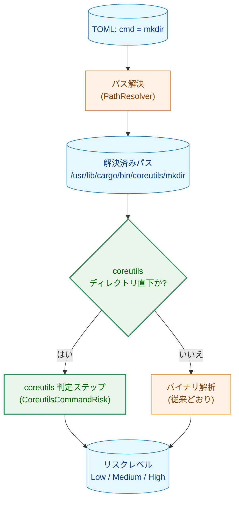
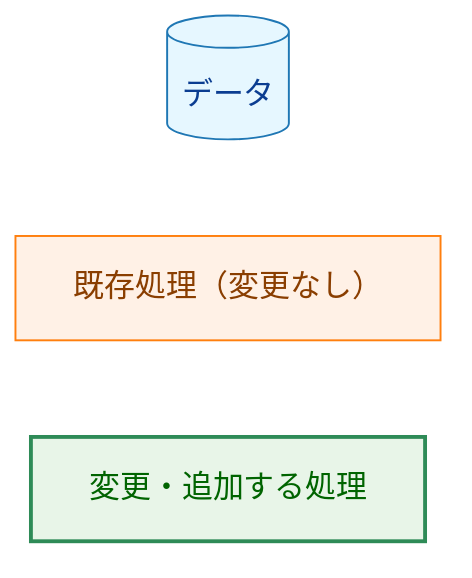
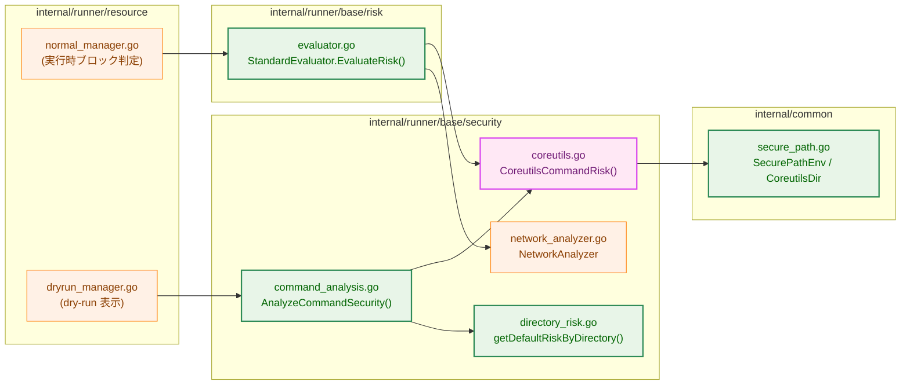
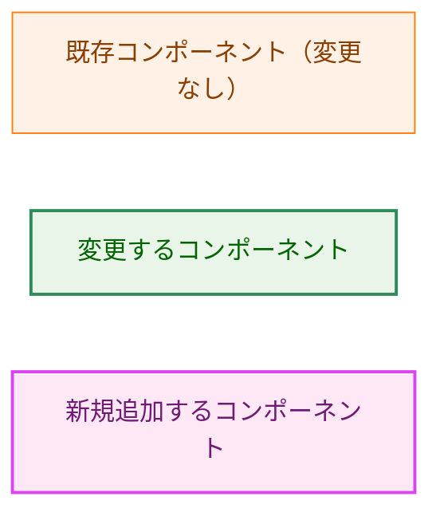
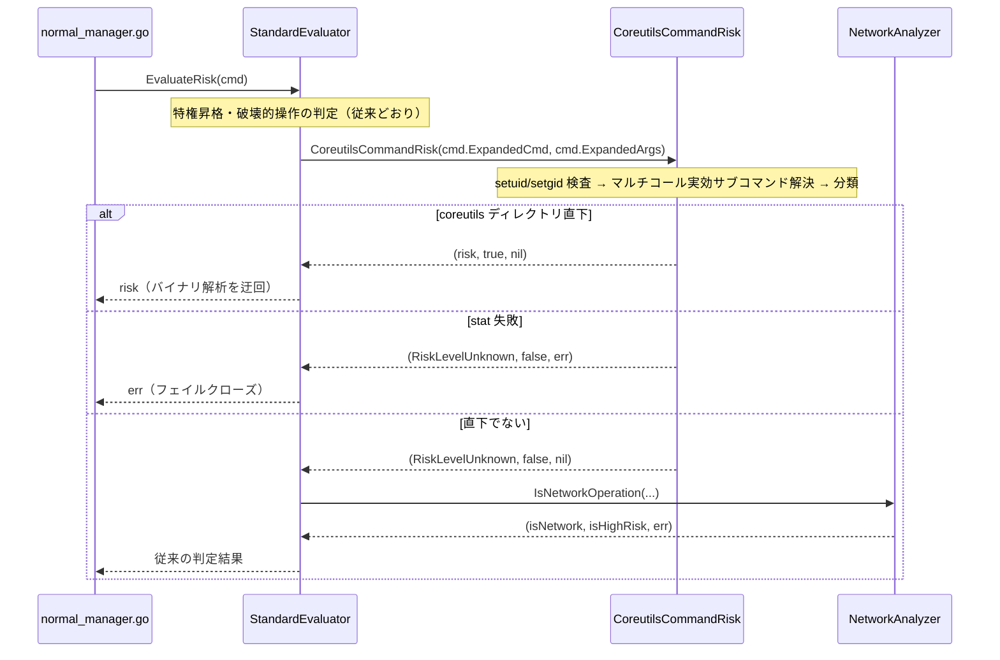
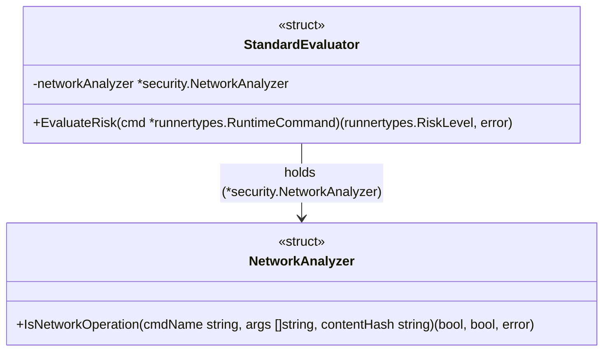
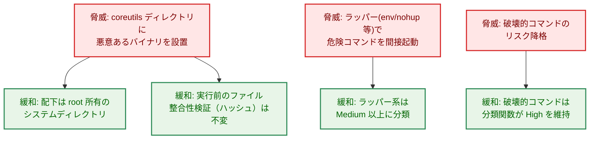
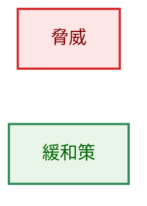
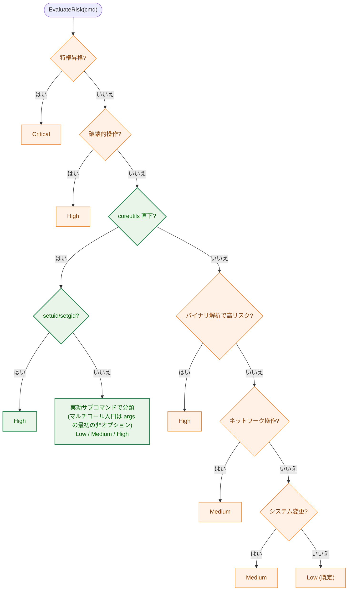
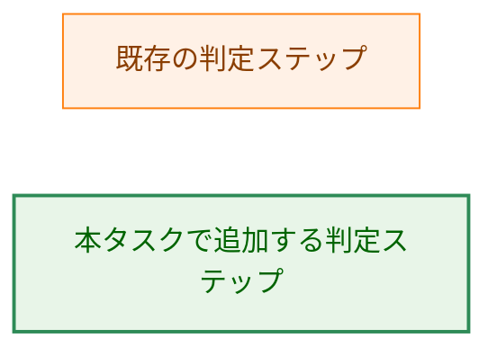

# アーキテクチャ設計書：Ubuntu 26.04 Rust coreutils 対応

## ドキュメントステータス

| 項目 | 内容 |
|---|---|
| ステータス | `draft` |
| 作成日 | 2026-06-11 |
| レビュー日 | - |
| レビュアー | - |
| コメント | - |

---

## 用語の統一

本書では以下の用語を一貫して用いる。

- **coreutils 判定ステップ:** `EvaluateRisk` / `AnalyzeCommandSecurity` のリスク判定パイプラインに本タスクで追加する 1 段。
- **`CoreutilsCommandRisk`（coreutils 分類関数）:** coreutils 判定ステップが呼び出す、解決済みパスからリスクレベルを返すパッケージ関数。
- **coreutils ディレクトリ:** `/usr/lib/cargo/bin/coreutils`。

---

## 1. 設計の全体像 (Design Overview)

### 1.1. 設計原則

- **適用範囲の限定:** バイナリ解析の迂回は coreutils ディレクトリ直下に解決されたコマンドにのみ適用し、`/usr/bin` 等の他ディレクトリの挙動は一切変更しない（要件 F-002 / 非機能 4.1）。
- **既存リスク評価枠組みの再利用:** 既存の判定ステップを維持し、その中に coreutils 判定ステップを 1 つ追加する。新しいリスク評価系を作らない（YAGNI / DRY）。
- **上位シグナル優先の不変条件:** coreutils 判定ステップは、信頼できる上位シグナル（特権昇格・破壊的パターン・ハッシュ不一致）の**後段**に置き、**信頼できない段（バイナリ解析／ディレクトリ既定）のみを置き換える**。さらに setuid/setgid は coreutils 判定ステップの内部で最優先に検査して High とする（実行時経路には独立した setuid 段が無いため）。coreutils 判定ステップが上位シグナルの結果を引き下げることはない。
- **安全側への倒し込み:** 既知の安全コマンドのみ Low とし、未知・権限操作系・コマンドラッパーは Medium、破壊的コマンドは High とする（要件 F-003 / F-004 / 非機能 4.1）。
- **実行時と dry-run の一貫性:** 実行時のブロック判定（`EvaluateRisk`）と dry-run 表示（`AnalyzeCommandSecurity`）が同一の `CoreutilsCommandRisk` を共有し、後述の不変条件のもとで同じ分類結果を返す（要件 F-005）。

### 1.2. なぜ既存の単純な方法では不十分か (Why not the simpler approach?)

既存コードには 2 つの「単純な対応」候補があるが、いずれも要件 F-002 を満たせない。

1. **`SecurePathEnv` に coreutils を追加するだけ**：これは安全ディレクトリ判定（要件 F-001）には有効だが、リスク判定（F-002）には無関係。
2. **`DefaultRiskLevels` に coreutils を追加するだけ**：`DefaultRiskLevels`（ディレクトリ別既定リスク）は dry-run 経路の `AnalyzeCommandSecurity` でしか参照されず、**実行時ブロック判定 `EvaluateRisk` は `DefaultRiskLevels` を参照しない**（検証済み：`getDefaultRiskByDirectory` の唯一の呼び出し元は `command_analysis.go`。`evaluator.go` は参照しない）。したがって実行時の HighRisk 誤判定（F-002 の中心課題）は解消しない。

実行時の誤判定は `EvaluateRisk` → `NetworkAnalyzer.IsNetworkOperation` → バイナリ解析（`dlsym`/`mprotect`/socket シンボル検出）に起因する。単一バイナリは全サブコマンドでシンボルを共有するため、この経路自体を coreutils に対して迂回する必要がある。よって「`EvaluateRisk` 内に coreutils 判定ステップを追加する」設計が要件上必須である。

### 1.3. 前提：パス解決後の basename にサブコマンド名が保持されること

本設計は、coreutils コマンドのパス解決後のパスが `/usr/lib/cargo/bin/coreutils/<コマンド名>` となり、basename にサブコマンド名（例 `mkdir`）が保持されることを前提とする。`CoreutilsCommandRisk` は原則この basename でコマンドを分類する（マルチコール入口 `coreutils` の場合のみ引数の実効サブコマンドを用いる。§3.2 参照）ため、この前提は設計全体の要となる。

根拠：

1. coreutils ディレクトリ配下の各コマンドは、単一バイナリへの**ハードリンク**（個別の名前付きエントリ）として配置される（要件・`00_notes.md` の記述）。
2. パス解決は `shebang.LookPathInEnv` による PATH 探索と `filepath.EvalSymlinks` による解決を経るが、`EvalSymlinks` は**シンボリックリンクのみ**を解決し、ハードリンクは解決しない（ハードリンクは同一 inode への別名であり、パス文字列はそのまま保持される）。
3. パス名なしの `mkdir` が coreutils ディレクトリ配下に解決される（要件 F-001 / 問題 2 の観測事実）こと自体が、同ディレクトリに `mkdir` という名前付きエントリが存在し basename が保持されることを示す。

> **実機検証済み（Ubuntu 26.04、2026-06-11）:** 前提は実機で確認済み。
> ```
> $ ls -l /usr/bin/mkdir
> lrwxrwxrwx 1 root root 32 ... /usr/bin/mkdir -> ../lib/cargo/bin/coreutils/mkdir
> $ readlink -f /usr/bin/mkdir
> /usr/lib/cargo/bin/coreutils/mkdir
> $ ls -l /usr/lib/cargo/bin/coreutils/mkdir
> -rwxr-xr-x 115 root root 11352352 ... /usr/lib/cargo/bin/coreutils/mkdir
> ```
> `/usr/bin/mkdir` は `/usr/lib/cargo/bin/coreutils/mkdir` へのシンボリックリンクで、そのターゲットは通常ファイル（リンク数 115 = 全 coreutils サブコマンドが単一 inode を共有するハードリンク）。`readlink -f`（= `EvalSymlinks` 相当）の結果は `/usr/lib/cargo/bin/coreutils/mkdir` で **basename `mkdir` が保持される**。よって本設計の前提が成立する。
>
> **残存リスク:** 仮に将来 `/usr/bin/<cmd>` が単一バイナリ本体（basename が `coreutils` 等）への**シンボリックリンク**となる構成（busybox 型のマルチコールバイナリ）へ変わると、`EvalSymlinks` がサブコマンド名を失い本設計は機能しなくなる。その場合は解決前のコマンド名で分類する代替設計へ切り替える必要がある。

### 1.4. コンセプトモデル



**矢印の意味:** A → B は「A の結果が B の入力になる」処理の流れを表す。

**凡例 (Legend):**



---

## 2. システム構成 (System Structure)

### 2.1. 全体構成とコンポーネント配置



**矢印の意味:** A → B は「A が B を呼び出す／参照する」依存関係を表す。

**凡例 (Legend):**



`CoreutilsCommandRisk()` は `security` パッケージに新規追加するパッケージ関数で、実行時経路（`risk.EvaluateRisk`）と dry-run 経路（`security.AnalyzeCommandSecurity` に追加する coreutils 判定ステップ）の双方から**直接**呼び出され共有される。`getDefaultRiskByDirectory` は coreutils へ委譲しない（理由は §3.1 / §5.2 を参照）。`AnalyzeCommandSecurity` は引き続き非 coreutils パスについてのみ `getDefaultRiskByDirectory` を利用する。

### 2.2. データフロー（実行時のリスク判定）



**矢印の意味:** 実線 `A->>B` は呼び出し、破線 `B-->>A` は戻り値を表す。

---

## 3. コンポーネント設計 (Component Design)

### 3.1. 新規・変更コンポーネントと責務

| ファイル | 区分 | 責務 | 更新が必要なテスト |
|---|---|---|---|
| `internal/common/secure_path.go` | 変更 | `CoreutilsDir` 定数を追加し、`SecurePathEnv` をこの定数から構築する。coreutils ディレクトリパスの単一の真実の源（SSOT）。 | `internal/runner/base/security/types_test.go`（`common.SecurePathEnv` を参照。値は不変でパターン生成テストはそのまま通る） |
| `internal/runner/base/security/coreutils.go` | 新規 | `CoreutilsCommandRisk(resolvedPath, args)` を提供。解決済みパスが coreutils ディレクトリ直下かを判定し、setuid/setgid 検査・マルチコール入口の実効サブコマンド解決を経て、実効サブコマンド名に基づき Low / Medium / High を返す。安全コマンド一覧・破壊的コマンド一覧を保持する（詳細シグネチャは §3.2）。 | 新規 `coreutils_test.go` を追加 |
| `internal/runner/base/risk/evaluator.go` | 変更 | `EvaluateRisk` に coreutils 判定ステップを追加（特権昇格・破壊的操作判定の後、ネットワーク判定の前）。coreutils ディレクトリ直下なら `CoreutilsCommandRisk` の結果を返し、バイナリ解析を迂回する。 | `internal/runner/base/risk/evaluator_test.go`（coreutils ケースを追加） |
| `internal/runner/base/security/directory_risk.go` | 変更 | `DefaultRiskLevels` から coreutils の一律 Medium エントリ（暫定追加分）を削除するのみ。**`getDefaultRiskByDirectory` に coreutils 専用の委譲は追加しない**（coreutils の分類は `command_analysis.go` の coreutils 判定ステップが担うため。§5.2 参照）。`/bin`・`/usr/bin`・`/sbin` 等の既存挙動は不変。 | `internal/runner/base/security/directory_risk_test.go`（coreutils が `RiskLevelUnknown` を返すケースを追加。既存ケースは不変） |
| `internal/runner/base/security/command_analysis.go` | 変更 | dry-run 経路の `AnalyzeCommandSecurity` に coreutils 判定ステップを「setuid/setgid 検査（既存ステップ 6）の後、Medium パターン照合（既存ステップ 7）の前」へ挿入し、coreutils 直下なら `CoreutilsCommandRisk` の結果を直接返す。これにより実行時と同じ不変条件で coreutils リスクを確定させる（ディレクトリ既定フォールバックのステップ 9 には到達しない）。 | `internal/runner/base/security/command_analysis_test.go`（coreutils ケースを追加） |
| `internal/runner/resource/normal_manager.go` | 変更なし | 実行時に `EvaluateRisk` を呼ぶ既存の呼び出し元。本タスクで改変不要。 | なし |
| `internal/runner/resource/dryrun_manager.go` | 変更なし | dry-run で `AnalyzeCommandSecurity` を呼ぶ既存の呼び出し元。引数（`cmd.ExpandedArgs`, `HashDir`）は不変。本タスクで改変不要。 | なし |

> **既存テストに関する確認（要件プロセスの方針対応）:** `internal` 配下の `*_test.go` に coreutils ディレクトリを参照するケースは現状ゼロであることを確認済み。したがって暫定追加された一律 `coreutils → Medium`（`DefaultRiskLevels`）を削除しても失敗する既存テストは存在しない。本タスクでは新規ケースを追加する。

### 3.2. 高レベルインターフェース定義

coreutils ディレクトリパスの定数（SSOT）：

```go
// internal/common/secure_path.go
// CoreutilsDir is the directory where Ubuntu 26.04+ places the Rust coreutils
// single binary and its hardlinks.
const CoreutilsDir = "/usr/lib/cargo/bin/coreutils"
```

coreutils コマンドのリスク分類関数（パッケージ関数）：

```go
// internal/runner/base/security/coreutils.go

// CoreutilsCommandRisk reports the risk level of a command whose resolved path
// is a direct child of the coreutils single-binary directory (CoreutilsDir).
//
// The directory test is an exact match: filepath.Dir(resolvedPath) == CoreutilsDir.
// When the path is not a direct child, it returns (RiskLevelUnknown, false, nil),
// and callers fall back to the normal risk evaluation path.
//
// For a coreutils path it determines the risk in this order:
//  1. setuid/setgid check: if the binary carries a setuid/setgid bit it returns
//     RiskLevelHigh (a coreutils hardlink is never expected to be setuid; a set
//     bit indicates packaging error or compromise). This stat may fail; on error
//     it returns (RiskLevelUnknown, false, err) so callers fail closed.
//  2. effective subcommand selection: normally the subcommand is the path
//     basename. For the multicall entrypoint (basename == "coreutils"), the
//     first non-option element of args is used as the effective subcommand, so
//     "coreutils rm -rf ..." is classified as rm.
//  3. classification by the effective subcommand:
//     - destructive commands (rm, dd, ...) -> RiskLevelHigh
//     - known safe commands (mkdir, ls, ...) -> RiskLevelLow
//     - everything else under the directory -> RiskLevelMedium (fail-safe default)
func CoreutilsCommandRisk(resolvedPath string, args []string) (runnertypes.RiskLevel, bool, error)
```

`args` は実行時経路では `cmd.ExpandedArgs`、dry-run 経路では `AnalyzeCommandSecurity` の引数を渡す。マルチコール入口（`coreutils` 本体を直接呼ぶ形）以外では `args` は分類に影響しない。

既存のディレクトリ別既定リスク関数（パッケージ関数、シグネチャ・ロジックとも不変。本タスクでは `DefaultRiskLevels` から coreutils 暫定エントリを削除するのみで、coreutils 専用の分岐は追加しない）：

```go
// internal/runner/base/security/directory_risk.go
func getDefaultRiskByDirectory(cmdPath string) runnertypes.RiskLevel
```

### 3.3. 型・関係図

クラス図には実在する構造体型のみを示す。`CoreutilsCommandRisk` / `getDefaultRiskByDirectory` / `AnalyzeCommandSecurity` はメソッドではなくパッケージ関数であり（§3.2 にシグネチャを記載）、呼び出し関係は §2.1 のフローチャートで表現している。



**矢印の意味:** A → B は「A が B を保持・利用する」関係を表す。

`StandardEvaluator.EvaluateRisk` は本タスクで、パッケージ関数 `security.CoreutilsCommandRisk` を新規に呼び出す（パッケージ関数のためクラス図の構成要素としては表現しない）。

### 3.4. コマンド別リスク分類の方針

`CoreutilsCommandRisk` の分類は「明示的な安全コマンド一覧（Low）」「破壊的コマンド一覧（High）」「それ以外は既定 Medium」の 3 区分とする。具体的なコマンドの所属一覧は実装で定義するが、区分の方針は次のとおり。

- **High（破壊的）:** `rm`, `rmdir`, `unlink`, `shred`, `dd`, `truncate` 等、データ消失・ディスク破壊を伴うもの（要件 F-004）。`truncate -s 0 file` のようにファイルを縮小して既存データを直接失うコマンドも含む。
- **Low（既知の安全）:** `mkdir`, `ls`, `cat`, `echo` 等、読み取り・情報取得・テキスト処理・新規作成中心で、既存データを暗黙に上書き／削除しないコマンド（要件 F-003）。
- **Medium（既定）:** 明示一覧に無い coreutils コマンド。これには (a) `chmod`/`chown`/`chgrp`/`chcon`/`chroot`/`runcon`/`ln`/`install`/`mknod`/`mkfifo` 等の権限・所有者・デバイス操作系、(b) `env`/`nohup`/`nice`/`timeout`/`stdbuf` 等、**任意の別コマンドを起動するラッパー**、(c) **`cp`/`mv` 等、既存ファイルを上書き・削除しうるファイル変更コマンド**（引数で無害と証明しない限り Low にしない）、(d) 将来追加される未知のサブコマンド、が含まれる。ラッパー系は内部で別コマンドを実行し個別解析を迂回しうるため Low にせず Medium 以上とする（非機能 4.1）。

**マルチコール入口の扱い:** uutils のマルチコールバイナリは `coreutils <util> <util-args>` 形式の起動を許す。解決後 basename が `coreutils`（ディスパッチャ本体）の場合、basename だけで判定すると `coreutils rm -rf ...` が既定 Medium に落ち、`rm` の High（F-004）を回避してしまう。これを防ぐため、basename が `coreutils` のときは `args` の最初の非オプション要素を実効サブコマンドとして分類する（§3.2 のステップ 2）。

**setuid/setgid の扱い:** coreutils のハードリンクは本来 setuid/setgid ではない。万一 set ビットが立っている場合（パッケージ不備や改竄）は、basename 分類に先立ち High とする（§3.2 のステップ 1）。これにより実行時経路でも setuid バイナリを Low 許容で実行することを防ぎ、dry-run（既存ステップ 6 で同等の検査）との結果一致（F-005）を保つ。

> **設計判断（要件 F-003 への例外：破壊的コマンドの扱い）:**
> - **元方針と所在:** 要件 `01_requirements.md` の F-003 は「既知の安全なコマンドは Low、それ以外の coreutils コマンドは Medium」と定める。
> - **例外と理由:** 本設計は `rm`/`dd` 等の破壊的コマンドを Medium ではなく **High** に分類する。これらは coreutils 化後も危険であり、非 coreutils 環境の同名コマンド（破壊的判定で High）と整合させ、リスクを引き下げないため（要件 F-004 が F-003 に優先する安全要件）。
> - **影響する既存テスト:** 本例外により失敗する既存テストは無い（§3.1 の確認のとおり coreutils 参照テストは現状ゼロ）。破壊的コマンドの High は新規 `coreutils_test.go` で担保する。
>
> 破壊的コマンドの High 判定を `CoreutilsCommandRisk` 自身に内包させることで、後述の既存処理の制約（§5.2）に依存せず High を保証する。

---

## 4. エラーハンドリング設計 (Error Handling Design)

本機能は新たなエラー型を導入しない。`CoreutilsCommandRisk` は setuid/setgid 判定のためファイル属性の取得（`os.Stat` 相当）を行うため、`(runnertypes.RiskLevel, bool, error)` を返す。属性取得は既存の `hasSetuidOrSetgidBit`（`command_analysis.go`）と同等の手段を用いる。

- **stat 失敗時はフェイルクローズ:** setuid/setgid 検査の属性取得に失敗した場合は `(RiskLevelUnknown, false, err)` を返す。`EvaluateRisk` はこの `err` をそのまま呼び出し元へ伝播し（戻り値型 `(runnertypes.RiskLevel, error)` は不変）、コマンドは実行されない。
- パスが coreutils ディレクトリ直下でない場合は `(RiskLevelUnknown, false, nil)` を返し、呼び出し側が従来経路へフォールバックする（例外ではなく通常の制御フロー）。
- リスクが設定された許容レベルを超えた場合のブロックは、既存の `normal_manager.go` のエラー（`runnertypes.ErrCommandSecurityViolation`）をそのまま利用し、型・メッセージともに変更しない。

---

## 5. セキュリティ考慮事項 (Security Considerations)

### 5.1. 脅威モデル



**矢印の意味:** 脅威 → 緩和策 の対応を表す。

**凡例 (Legend):**



### 5.2. セキュリティ設計上の前提と留意点

- **適用範囲の限定:** coreutils 判定ステップはパスが coreutils ディレクトリ直下（`filepath.Dir(resolvedPath) == CoreutilsDir`）のときのみ発火する。`/usr/bin` 等の非 coreutils バイナリは従来どおりバイナリ解析の対象であり、プロファイル未登録のネットワークツール等の検出能力は低下しない（非機能 4.1）。
- **dry-run 経路は単一機構で処理する:** coreutils 分類は `AnalyzeCommandSecurity` に追加する coreutils 判定ステップ（明示的な早期 return）のみで行い、`getDefaultRiskByDirectory` には coreutils 専用の委譲を加えない。`getDefaultRiskByDirectory` の結果はステップ 9（最終フォールバック）でしか使われず、coreutils 判定ステップ（ステップ 6 の後）が先に確定するため、仮に委譲を加えても coreutils 経路ではデッドコードとなり、かつステップ 8 の `getCommandRiskOverride` と優先順位が衝突する。二重機構を避けるため委譲は行わない。なお `getDefaultRiskByDirectory` の既存 prefix 一致（`HasPrefix(cmdPath, dir+"/")`）と `CoreutilsCommandRisk` の exact 一致（`filepath.Dir(resolvedPath) == CoreutilsDir`）は判定述語が異なるが、coreutils はフラットに名前付きエントリを配置するため両者の差（ネストしたパス）は実環境で発生しない。発生した場合は coreutils 判定ステップが非該当となり通常経路へフォールバックする（安全側）。
- **上位シグナルの保全:** coreutils 判定ステップは信頼できる上位シグナル（特権昇格・破壊的パターン・ハッシュ不一致）の後段に置き、これらが検出された場合は coreutils 判定ステップに到達せずより厳しい結果が維持される（§1.1 の不変条件）。さらに setuid/setgid 検査は、dry-run では前段（既存ステップ 6）で、実行時では coreutils 判定ステップの最初の処理（`CoreutilsCommandRisk` 内）で行い、いずれの経路でも setuid バイナリは High となる（F-005 / §3.2 ステップ 1）。
- **ファイル整合性検証は不変:** 本機能はリスク「分類」のみを変更し、実行前のハッシュ検証（`internal/verification`、および dry-run の `AnalyzeCommandSecurity` ステップ 4）を迂回・変更しない。
- **特権昇格判定は不変:** `sudo`/`su`/`doas` は coreutils ではなく、coreutils 判定ステップの前段（特権昇格判定）で Critical となるため影響を受けない（非機能 4.1）。
- **既存処理の制約（記録）:** `IsDestructiveFileOperation` / `IsSystemModification` はコマンド名を basename 化せず照合するが、実行時の `ExpandedCmd` は解決済みフルパスである。このため coreutils 配下の破壊的コマンドを前段の破壊的判定だけに委ねるのは不確実であり、本設計では `CoreutilsCommandRisk` 自身が破壊的コマンドを High に分類して自己完結させる。なお dry-run 経路の高リスクパターン照合は basename ベース（`/bin/rm -rf` 形式を検出）であり、`rm -rf` 等は前段で High となる。これら既存関数の basename 正規化（抜本対応）は本タスクのスコープ外（別タスク）とする。

### 5.3. 副作用コントラクト（実行モード別）

本機能はコマンドの外部副作用（書き込み・削除・ネットワーク送信）を新たに発生させない。リスク分類の変更のみであり、各実行モードの副作用は既存どおり。

| モード | リスク判定経路 | コマンドの外部副作用 |
|---|---|---|
| 通常実行 | `EvaluateRisk`（coreutils 判定ステップを含む） | 許容リスク内であればコマンドを実行（従来どおり） |
| dry-run | `AnalyzeCommandSecurity`（coreutils 判定ステップを含む） | コマンドは実行せず、判定結果を表示するのみ（従来どおり） |

### 5.4. 実行時と dry-run の一貫性のケース分析（要件 F-005）

両経路は同一の `CoreutilsCommandRisk` を共有するが、関数の前後に置かれる段は経路ごとに異なる。F-005 を満たすため、coreutils コマンドに対して両経路の最終リスクが一致することを段ごとに検証する。

| 判定要素 | 実行時 (`EvaluateRisk`) | dry-run (`AnalyzeCommandSecurity`) | coreutils コマンドでの一致 |
|---|---|---|---|
| 特権昇格 | 前段で Critical | （coreutils は対象外） | coreutils は特権昇格コマンドでないため両経路とも非該当 |
| 破壊的 `rm -rf` 等 | 破壊的判定（フルパスのため不確実）＋ coreutils 分類関数の High 区分 | 高リスクパターン（basename ベースで検出）＋ coreutils 分類関数の High 区分 | いずれの経路でも High |
| マルチコール入口 `coreutils rm ...` | coreutils 判定ステップが実効サブコマンド（`args` の最初の非オプション）で分類 → High | 同左 | 同一関数・同一入力で High に一致 |
| setuid/setgid | coreutils 判定ステップの最初の処理（`CoreutilsCommandRisk` 内）で High | ステップ 6（前段）で High | 両経路とも High |
| ハッシュ不一致 | 実行前の `internal/verification` が fail-closed で停止 | ステップ 4 で Critical | 両経路ともブロック |
| Low/Medium/High 分類 | coreutils 判定ステップ（`CoreutilsCommandRisk`） | coreutils 判定ステップ（`CoreutilsCommandRisk`、同一入力 basename / args） | 同一関数・同一入力で一致 |

結論：coreutils バイナリに対して、両経路の最終リスクは一致する。破壊的コマンド・マルチコール入口経由の破壊的コマンド・setuid バイナリはいずれの経路でも High となり、coreutils 判定ステップがリスクを引き下げることはない。

---

## 6. 処理フロー詳細 (Processing Flow Details)

### 6.1. `EvaluateRisk` の判定順序（変更後）



**矢印の意味:** 判定の分岐と、確定するリスクレベルへの遷移を表す。`バイナリ解析で高リスク?`→`ネットワーク操作?` は順に評価される逐次判定であり、緑色の段（coreutils 直下判定・setuid 検査・実効サブコマンド分類）が本タスクの追加部分。

**凡例 (Legend):**



coreutils 判定ステップをネットワーク判定の前に置くことで、誤検出の原因であるバイナリ解析（`IsNetworkOperation` 内）を coreutils コマンドに対して確実に迂回する（要件 F-002）。

### 6.2. 安全ディレクトリ判定（要件 F-001）

要件 F-001 は `SecurePathEnv` に coreutils ディレクトリを含めることで満たされる。`security.GenerateAllowedCommandsFromPath(common.SecurePathEnv)` が `^/usr/lib/cargo/bin/coreutils/.*` の許可パターンを自動生成し、PATH 探索（`shebang.LookPathInEnv`）も同ディレクトリを走査するため、パス名なし記述のコマンドが coreutils ディレクトリ配下に解決されても安全ディレクトリとして許可される（解決後パスの性質は §1.3 を参照）。本タスクではこの構成を維持し、`CoreutilsDir` 定数を導入して `SecurePathEnv` をその定数から構築する（パスの二重定義を排除）。

---

## 7. テスト戦略 (Test Strategy)

### 7.1. ユニットテスト

- **`CoreutilsCommandRisk`（新規 `coreutils_test.go`）**
  - coreutils 直下の安全コマンド（`mkdir`, `ls`, `cat`, `echo` 等）→ `(Low, true, nil)`（F-003）
  - coreutils 直下の権限操作系・ラッパー・上書き系・未知名（`chmod`, `chown`, `env`, `nohup`, `cp`, `mv`, 未知の名前）→ `(Medium, true, nil)`（F-003 / 非機能 4.1）
  - coreutils 直下の破壊的コマンド（`rm`, `dd`, `shred`, `truncate`）→ `(High, true, nil)`（F-004）
  - マルチコール入口（basename `coreutils`、`args = ["rm", "-rf", ...]`）→ `(High, true, nil)`（F-004。`args` の先頭非オプションを実効サブコマンドとして分類）
  - setuid/setgid ビット付きの coreutils バイナリ → `(High, true, nil)`（mkdir 等の安全名でも High）
  - 非 coreutils パス（`/usr/bin/mkdir`, `/bin/ls`）→ `(RiskLevelUnknown, false, nil)`（適用範囲限定）
- **`EvaluateRisk`（`evaluator_test.go` に追加）**
  - `ExpandedCmd = /usr/lib/cargo/bin/coreutils/mkdir` がバイナリ解析を通らず Low になる（F-002）
  - 同 `.../rm` が High のまま（F-004）
  - 同 basename `coreutils` ＋ `args=["rm","-rf",...]` が High（F-004）
- **`getDefaultRiskByDirectory`（`directory_risk_test.go` に追加）**
  - coreutils 直下のパスが（暫定エントリ削除後）`RiskLevelUnknown` を返すこと（coreutils 分類は同関数では行わない）。既存の `/bin`・`/usr/bin`・`/sbin` ケースは不変。

### 7.2. 統合テスト（F-005 のケース分析に対応）

dry-run（`AnalyzeCommandSecurity`）と実行時（`EvaluateRisk`）で、以下の具体コマンドについてリスク判定が一致することを検証する。

- `/usr/lib/cargo/bin/coreutils/mkdir`（引数なし）→ 両経路 Low
- `/usr/lib/cargo/bin/coreutils/chmod`（例：`+x file`）→ 両経路 Medium
- `/usr/lib/cargo/bin/coreutils/cp`（例：`a b`）→ 両経路 Medium（上書き系）
- `/usr/lib/cargo/bin/coreutils/rm`（`-rf /tmp/x`）→ 両経路 High
- `/usr/lib/cargo/bin/coreutils/coreutils`（マルチコール入口、`args=["rm","-rf","/tmp/x"]`）→ 両経路 High
- setuid 付与した coreutils バイナリ → 両経路 High
- ハッシュ未検証時の挙動が §5.4 の表どおりであること（dry-run はステップ 4 で Critical）

### 7.3. セキュリティテスト

- 適用範囲限定の回帰確認：非 coreutils ディレクトリのプロファイル未登録コマンドが従来どおりバイナリ解析でリスク判定されること（非機能 4.1）。
- 特権昇格（`sudo` 等）が coreutils 判定ステップの影響を受けず Critical のままであること（非機能 4.1）。

---

## 8. 実装の優先順位 (Implementation Priorities)

1. **フェーズ 0（前提確認）:** 対象環境で coreutils コマンドのパス解決後 basename が保持されることを確認（§1.3）。**Ubuntu 26.04 実機で確認済み（2026-06-11）**。
2. **フェーズ 1（基盤）:** `internal/common/secure_path.go` に `CoreutilsDir` を定数化し、`SecurePathEnv` を再構築。`security` パッケージに `coreutils.go`（`CoreutilsCommandRisk` と分類一覧）を新規追加し、ユニットテストを作成。
3. **フェーズ 2（実行時経路）:** `risk/evaluator.go` の `EvaluateRisk` に coreutils 判定ステップを追加（F-002 / F-004）。`evaluator_test.go` にケース追加。
4. **フェーズ 3（dry-run 経路と整合）:** `directory_risk.go` の `DefaultRiskLevels` から coreutils 暫定エントリを削除（委譲は追加しない）。`command_analysis.go` の `AnalyzeCommandSecurity` に coreutils 判定ステップを所定位置（ステップ 6 の後、ステップ 7 の前）へ挿入し、`CoreutilsCommandRisk` を直接呼び出す（F-005）。関連テスト追加。
5. **フェーズ 4（検証）:** `make fmt && make test && make lint`、統合テストで両経路の一致を確認。

---

## 9. 今後の拡張性 (Future Extensibility)

- **他の単一バイナリツールへの拡張:** 将来 BusyBox 等の他の単一バイナリ集約ツールに対応する場合、`CoreutilsCommandRisk` と同型の「ディレクトリ＋コマンド名」分類を一般化できる。本タスクでは coreutils に限定する（YAGNI）。
- **既存処理の basename 正規化:** §5.2 で記録した `IsDestructiveFileOperation` / `IsSystemModification` のフルパス対応は、別タスクで対応すれば本機能の破壊的コマンド分類を前段判定に委ねられ、`CoreutilsCommandRisk` の High 区分を簡素化できる。
- **coreutils ディレクトリパスの可変化:** 現状はディストリビューション固有パスを定数で固定する。配置が変わる環境が現れた場合に設定可能化を検討する（現時点ではスコープ外）。

---

## 付録: 決定経緯と暫定状態 (Decision History)

- **調査メモ:** 本設計に至る調査（2 つのリスク評価経路の差異、暫定変更の効果範囲、既存処理の basename 照合に関する制約）は同一タスクディレクトリの `00_notes.md` に記録している。本書の本文は現在の設計の姿のみを記述する。
- **作業ツリーの暫定状態:** 本タスク着手時点の作業ツリーには、暫定の先行編集が未コミットで含まれている。すなわち `internal/common/secure_path.go` の `SecurePathEnv` には既に coreutils ディレクトリが追加され、`internal/runner/base/security/directory_risk.go` の `DefaultRiskLevels` には一律 `coreutils → Medium` が暫定追加されている。本設計のフェーズ 1〜3 は、前者を `CoreutilsDir` 定数化で整理し、後者の一律エントリを削除する。coreutils のコマンド別分類は `AnalyzeCommandSecurity` / `EvaluateRisk` の coreutils 判定ステップ（`CoreutilsCommandRisk`）で行い、`getDefaultRiskByDirectory` には委譲を加えない。
