# 実行時リスク判定の強化 — アーキテクチャ設計書

## Document Status

| Item | Value |
|---|---|
| Status | `draft` |
| Created | 2026-06-14 |
| Review date | - |
| Reviewer | - |
| Comments | - |

本書は `01_requirements.md`（status: `approved`）の機能要件 F-001〜F-015 / 受入基準 AC-01〜AC-87 を満たすための高レベル設計を定義する。実装詳細・擬似コード・アルゴリズムは含めない（それらは実装と `03_implementation_plan.md` で扱う）。

## 1. 設計の全体像

### 1.1 設計原則

1. **単一の評価パイプライン**: 実行時（normal）と dry-run が **同一のリスク評価ロジック** を用いる。両者の分裂（背景 H/I）を構造的に排除する。
2. **単一の真実の源泉**: コマンドごとのリスク定義を **コマンドリスクプロファイル** に集約し、各判定経路はそれを参照する（背景 H）。
3. **全リスク次元の最大値**: 実効リスクは該当する全リスク次元の最大値とし、評価順に依存しない（F-001）。早期 return による取りこぼしを排除する。
4. **fail-safe / fail-closed の明確な三層**: 「エラー中止」「無条件拒否（内部 Critical 化）」「リスク昇格（High、許可可能）」を区別する（用語は要件 §4）。バイナリの素性を確認できない不確実ケースは設定によらず実行を中止する（F-005）。
5. **検証済み identity の束縛**: 実際に実行・ロードされる成果物を、検証（ハッシュ）と allowlist のゲートに通し、**検証済み identity を exec/ロード時点まで束縛** する。束縛できない間接実行形態は拒否する（F-012/F-013/F-014）。
6. **多層防御の一層**: リスク判定はブロックリスト方式であり、未知コマンドは Low 通過し得る。allowlist（`cmd_allowed`）＋ハッシュ固定（`verify_files`）の併用を前提とする（脅威モデル、AC-66/67）。
7. **YAGNI / DRY**: 既存コンポーネント（プロファイル定義、バイナリ解析レコード、検証マネージャ、監査ロガー、環境変数フィルタ）を再利用し、責務の重複を作らない。

### 1.2 概念モデル

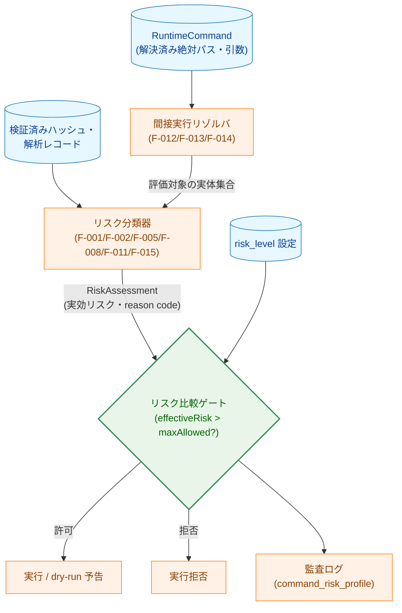

**矢印の意味**: 実線 A → B は「A の出力が B の入力になる（データ/制御の流れ）」を表す。`{ }` は判定ノード。

**凡例（Legend）**

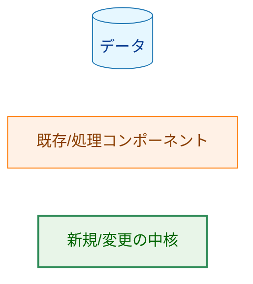

### 1.3 なぜ既存方式では不十分か（YAGNI 検討）

現行の `risk.StandardEvaluator.EvaluateRisk` は「ステップごとに早期 return」かつ戻り値が `(RiskLevel, error)` の 2 値である。これは次の要件を満たせない:

- **F-001（全次元の最大値）**: 早期 return は後段次元を取りこぼす。
- **F-003（reason code・監査）**: `(RiskLevel, error)` は判定根拠を返せない。
- **F-005（不確実と危険検出の区別）**: バイナリ解析の `(isNetwork, isHighRisk bool)` 2 値では「危険検出（High 維持）」と「不確実（中止）」を区別できない（情報が合流している）。

したがって、(a) 構造化された判定結果型（`RiskAssessment`）と (b) バイナリ解析シグナルの 3 値以上の分類が **必要最小限の変更** である。リスクレベルの段階定義自体は変更しない（スコープ外）。

## 2. システム構成

### 2.1 全体アーキテクチャ

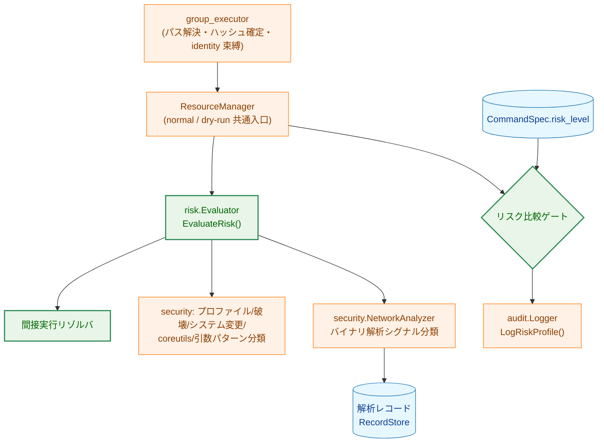

**矢印の意味**: 実線 A → B は「A が B を呼び出す / B に依存する」。`{ }` は判定。

**凡例（Legend）**

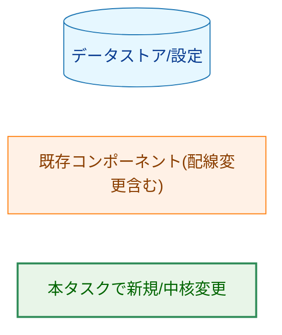

### 2.2 コンポーネント配置（パッケージ）

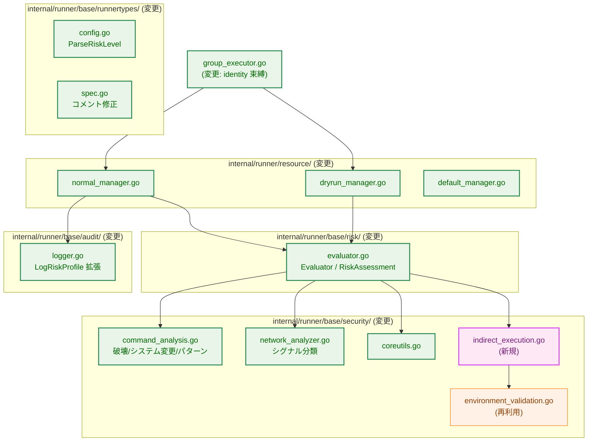

**矢印の意味**: 実線 A → B は「A が B を利用する」。

**凡例（Legend）**

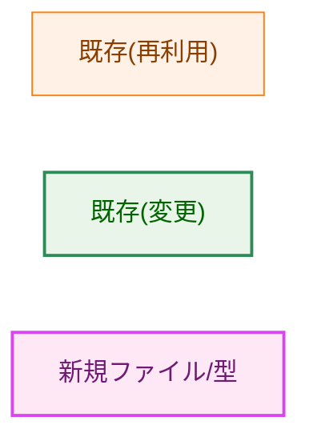

> 注: `indirect_execution.go` は新規 **ファイル** であり、既存 `internal/runner/base/security` パッケージ内に追加する（新規パッケージは作らない。DRY/責務集約のため）。

### 2.3 データフロー（実行時パス）

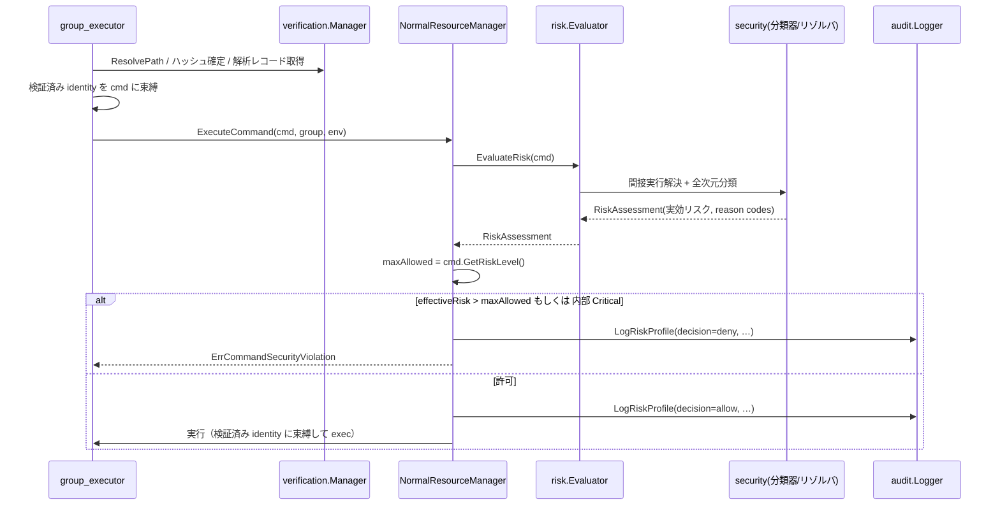

**矢印の意味**: 実線（→）は同期呼び出し、点線（-->>）は戻り値。`alt` は分岐。

## 3. コンポーネント設計

### 3.1 主要型（インターフェース・型定義のみ）

評価結果を構造化し、reason code と判定根拠を運ぶ。`Evaluator` インターフェースの戻り値を拡張する（F-001/F-003/F-005）。

```go
// RiskAssessment は実効リスクとその判定根拠を表す（新規）。
type RiskAssessment struct {
    Level       runnertypes.RiskLevel // 実効リスク（全次元の最大値）
    Blocking    bool                  // true なら risk_level によらず拒否（内部 Critical 相当 / 不確実ケース）
    ReasonCodes []string              // 機械可読な判定根拠（例: "destructive_file_operation"）
    Reasons     []string             // 人間可読な根拠（プロファイル由来の Reason 等）
    NetworkType string                // 監査用（none/always/conditional）
}

// Evaluator は実行時リスク判定の入口（戻り値を RiskAssessment に拡張）。
type Evaluator interface {
    EvaluateRisk(cmd *runnertypes.RuntimeCommand) (RiskAssessment, error)
}
```

> 現行の `EvaluateRisk(cmd) (runnertypes.RiskLevel, error)` を上記へ変更する。`error` は「エラー中止」（解決失敗・予期しないレコード読込エラー等）専用とし、設定によらず実行を中止する不確実ケースは `RiskAssessment.Blocking=true`（内部 Critical 相当）で表現する。

バイナリ解析シグナルは 2 値 bool から **分類** に変更する（F-005/AC-45）。「危険検出（High）」と「不確実（中止）」を区別する。

```go
// BinaryAnalysisClass はバイナリ解析の判定区分（新規）。
type BinaryAnalysisClass int

const (
    BinaryAnalysisClean       BinaryAnalysisClass = iota // 危険シグナルなし → Low
    BinaryAnalysisNetwork                                // ネットワークのみ → Medium
    BinaryAnalysisHighRisk                               // dlopen/exec/svc/mprotect → High
    BinaryAnalysisUncertain                              // レコード欠落/不一致/非対応/想定外 → 中止(Blocking)
)
```

コマンドリスクプロファイル（既存 `CommandRiskProfile`）は単一の真実の源泉として継続利用する。プロファイルのフィールド構成（`PrivilegeRisk`/`NetworkRisk`/`DestructionRisk`/`DataExfilRisk`/`SystemModRisk` 各 `RiskFactor`、`NetworkType`、`NetworkSubcommands`）は維持する。

**`Classify` の責務境界（M-8 対応）**: 現行 `NetworkAnalyzer.IsNetworkOperation` は「プロファイル `NetworkType` 照合・symlink 走査・引数ネットワーク検出・バイナリ解析」を 1 関数に内包している。本設計ではこれを分離する:

- `NetworkAnalyzer.Classify(cmdPath, contentHash) (BinaryAnalysisClass, error)` は **未知コマンドのバイナリ解析シグナル分類のみ** を担う（プロファイル照合・引数検出は含めない）。
- プロファイル `NetworkType`（Always/Conditional）の照合と、引数の URL/SSH 検出は **評価器（`StandardEvaluator`）側のリスク次元算出** に置く。
- `BinaryAnalysisClass` → リスクレベルの写像（Clean→Low、Network→Medium、HighRisk→High、Uncertain→Blocking）は **評価器** が行い、他次元と max を取る。これによりプロファイル由来 Medium とバイナリ解析由来 Medium は同じ Medium として最大値に合流する。

**F-011 の引数条件付きシステム変更リスクの合成（M-2 対応）**: 現行 `CommandRiskProfile.BaseRiskLevel()` は引数を取らない（`max()` のみ）。引数依存にするため、`BaseRiskLevel()` のシグネチャは変更せず、**評価器がコマンドのサブコマンドから実効 `SystemModRisk` レベルを導出し、プロファイルの静的 `SystemModRisk` の代わりに最大値計算へ合流させる**。すなわち実効リスク = max(プロファイルの他次元, 引数評価後の SystemModRisk, 破壊/引数パターン/バイナリ解析由来の各次元)。プロファイルの静的 `SystemModRisk=High` を無条件に持ち込まないことで `systemctl status` が High に固定されるのを防ぐ（要件 F-011 / AC-49）。`service` は引数によらず High（AC-75）。読み取り専用/変更系サブコマンドの確定リストは §3.6 を参照。

### 3.2 クラス関係（中核型）

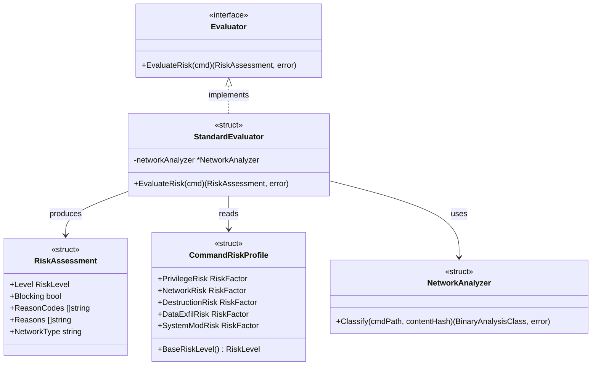

**矢印の意味**: `<|..` は実装、`-->` は利用/生成（ラベルで区別）。

**凡例（Legend）**: 本図は型の関係のみを示し、色分けクラスは用いない。

> 現行確認（既存コードとの対応）: `Evaluator.EvaluateRisk` は現在 `(runnertypes.RiskLevel, error)` を返す（`evaluator.go:12`）。`StandardEvaluator.networkAnalyzer` の現行型は `*security.NetworkAnalyzer`（`evaluator.go:17`）。`NetworkAnalyzer.IsNetworkOperation(cmdName string, args []string, contentHash string) (bool, bool, error)`（`network_analyzer.go:76`）を `Classify(cmdPath, contentHash) (BinaryAnalysisClass, error)` 相当へ置き換える（**`args` を除去**: 引数の URL/SSH 検出・プロファイル `NetworkType` 照合は評価器側へ移すため。§3.1 の責務境界を参照）。`CommandRiskProfile.BaseRiskLevel() runnertypes.RiskLevel` は既存（全 `RiskFactor` の最大値、`command_risk_profile.go:53`）。これらは本タスクで変更される **新規関係** であり、上図はその目標状態を示す。

#### LogRiskProfile のシグネチャ変更（現行 → 変更後、M-4 対応）

現行（`audit/logger.go:178`）は本番未呼び出し（デッドコード、背景 B）で、相関に必要なフィールド（`resolved_path`/`content_hash`/`decision`/`max_allowed_risk` 等）を持たない:

```go
// 現行
func (l *Logger) LogRiskProfile(ctx context.Context, commandName string,
    baseRiskLevel runnertypes.RiskLevel, riskReasons []string, networkType string)
```

引数爆発を避けるため、相関フィールドを **パラメータ構造体** に集約する（型定義のみ）:

```go
// 変更後（新規パラメータ型）。decision/max_allowed_risk は比較を行う層で設定する。
type RiskAuditEntry struct {
    CommandName    string
    ResolvedPath   string                // 取得不能時はセンチネル（"unresolved" 等、AC-56）
    ContentHash    string                // 取得不能時はセンチネル（"unverified" 等）
    RecordID       string                // 解析レコードの hash/schema、非使用時はその旨
    Assessment     RiskAssessment        // 実効リスク・reason codes
    MaxAllowedRisk runnertypes.RiskLevel
    Decision       string                // "allow" / "deny"
    Chain          []ExecutedArtifact    // 間接実行連鎖の全成果物（AC-11）
}

// ExecutedArtifact は間接実行で実際に実行/ロードされた成果物 1 件の監査情報。
type ExecutedArtifact struct {
    Path        string // 解決済み絶対パス
    ContentHash string // 検証済みハッシュ（取得不能時はセンチネル）
    Kind        string // "executable" / "preload" 等
}

func (l *Logger) LogRiskProfile(ctx context.Context, entry RiskAuditEntry)
```

### 3.3 間接実行リゾルバ（新規 `indirect_execution.go`）

検証対象と異なる実行可能/ライブラリを実行・ロードし得る形態を検出し、安全側に評価する（F-012/F-013/F-014、AC-54/55/59〜62/71/77〜87）。**一般原則**: 実際に実行・ロードされる全成果物を検証＋allowlist ゲートに通し、検証済み identity を exec/ロード時点まで束縛する。束縛不能な形態は拒否する。

対象（キュレートされたブロックリスト。網羅列挙はスコープ外、未知形態は安全側）:

| 形態 | 扱い | 関連 AC |
|------|------|---------|
| ラッパー（`env`/`timeout`/`xargs`/`nice` 等） | 実コマンドを抽出し再帰評価＋ゲート。抽出不能（COMMAND あり）は拒否。無コマンド起動は別扱い（`env` 単体は Medium 以上） | AC-59/60/77/78/84 |
| ラッパー供給の環境変数 | 既存の禁止環境変数検証（`environment_validation.go`）を適用。`LD_PRELOAD`/`LD_LIBRARY_PATH` 等は拒否 | AC-80 |
| `env -S`（split-string） | 分割後 argv を解釈。`sudo` 等は Critical。解釈不能は拒否 | AC-81 |
| シェル/インタプリタのインラインコード（`-c`/`-e`） | High 下限（F-015）。文字列内の隠れ sudo は確実な Critical 化を保証しない（限界明記） | AC-61 |
| 実行解決すり替え（`env PATH=…`） | 検証済み絶対パスで実行、または拒否 | AC-79 |
| `find`/`xargs` の実行アクション（`-exec`/`-execdir`/`-ok`/`-okdir`） | 対象を破壊判定＋ゲート＋検証済み絶対パス実行 | AC-62/82 |
| 直接スクリプト実行（shebang、`#!/usr/bin/env python`） | shebang インタプリタ連鎖を評価＋ゲート＋identity 束縛 | AC-86 |
| コマンド実行オプション（`rsync -e`/`tar --to-command`） | helper をゲート、または拒否 | AC-87 |
| 動的ローダ直接起動（`ld-linux*.so --preload`） | EXECUTABLE と preload を load-time 束縛/再検証、不能なら拒否 | AC-83 |
| 特権昇格トークン（`sudo`/`su`/`doas`） | 独立トークンとして出現すれば抽出可否によらず Critical | AC-59 |

### 3.4 コンポーネント責務と変更ファイル一覧

| ファイル | 区分 | 責務 / 変更内容 | 要件 | 更新が必要な既存テスト |
|---------|------|----------------|------|----------------------|
| `risk/evaluator.go` | 変更 | `EvaluateRisk` を `RiskAssessment` 返却に。全次元の最大値・reason code・coreutils 優先・引数条件・不確実の Blocking 化 | F-001/F-003/F-005/F-008/F-011 | `risk/evaluator_test.go`, `risk/coreutils_consistency_test.go` |
| `security/indirect_execution.go` | 新規 | 間接実行（ラッパー/シェル/ローダ/find-exec/shebang/オプション）の検出・抽出・ゲート・identity 束縛・拒否 | F-013/F-014 | （新規テスト追加） |
| `security/command_analysis.go` | 変更 | 破壊/システム変更を basename・symlink 解決対応に。危険引数パターンを実行時評価へ統合。symlink 解決失敗を fail-safe 化。`service`→High | F-002/F-008/F-012/F-011 | `security/command_analysis_test.go` |
| `security/network_analyzer.go` | 変更 | `IsNetworkOperation` を `Classify`（4 区分）に。ネットワークのみ=Medium、危険=High、不確実=Blocking | F-005 | `security/network_analyzer_test.go` |
| `security/coreutils.go` | 変更 | サブコマンド判別不能・未知を High。coreutils 優先（バイナリ解析次元抑制）の明示 | F-008/AC-68/AC-72 | `security/coreutils_test.go` |
| `security/command_risk_profile.go` | 変更 | システム変更の引数条件付き評価をプロファイルに反映（`SystemModRisk` の条件適用） | F-011 | 関連プロファイルテスト |
| `security/environment_validation.go` | 再利用 | ラッパー供給環境変数の検証に流用 | F-013/AC-80 | - |
| `runnertypes/config.go` | 変更 | `ParseRiskLevel` が `"unknown"` をエラーに | F-007 | `runnertypes/config_test.go` |
| `runnertypes/spec.go` | 変更 | `RiskLevel` フィールドコメントを実態へ修正 | F-004 | - |
| `resource/normal_manager.go` | 変更 | `RiskAssessment` 利用・`audit.Logger` 配線・decision 記録・deny 重大度下限 | F-003/AC-11/56/70 | `resource/normal_manager` 関連テスト |
| `resource/dryrun_manager.go` | 変更 | 同一評価器で実効リスク＋許可/拒否予告。`unknown` 区分・終了コード・CI オプション | F-006/F-009 | `resource/dryrun_manager` 関連テスト |
| `resource/default_manager.go` | 変更 | dry-run に `RiskEvaluator`・`audit.Logger` を配線 | F-009 | - |
| `audit/logger.go` | 変更 | `LogRiskProfile` に相関フィールド（resolved_path/content_hash/解析レコード識別/max_allowed_risk/decision/reason_codes）・引数マスキング・連鎖監査・deny 重大度下限 | F-003/AC-56/57/70/11 | `audit` 関連テスト |
| `group_executor.go` | 変更 | 検証済み identity を exec まで束縛（TOCTOU）。ラッパー/ローダ成果物の検証連携 | F-014/AC-64/76/79/83 | `group_executor_test.go` |
| `docs/dev/architecture_design/command-risk-evaluation.{ja.md,md}` | 変更 | 開発者向け文書を実装に整合 | F-004/F-005/F-006/AC-15/17/18 | - |
| `docs/dev/architecture_design/security-architecture.{ja.md,md}` | 変更 | 既存ポリシー記述の更新（§5.3 の例外明記を参照） | C-1/F-005 | - |
| `docs/user/risk_assessment.{ja.md,md}` | 変更 | ユーザー向けガイドを実装に整合 | F-010/AC-34〜38/50 | - |

> 依存（経緯）: `command-risk-evaluation.{ja.md,md}` は PR #724（マージ凍結中）にのみ存在する。本文書の更新作業はそのマージ後に行う。詳細は付録の決定履歴を参照。

### 3.5 dry-run の副作用契約（F-009/F-006）

dry-run モードが抑制する外部副作用と、許可する挙動を明示する:

| 項目 | normal | dry-run |
|------|--------|---------|
| コマンドの実際の exec | 行う | **行わない**（抑制） |
| ファイル書き込み・削除・ネットワーク送信 | コマンド次第 | **行わない**（コマンドを exec しないため） |
| リスク評価（同一ロジック） | 行う | 行う |
| `risk_level` 比較・許可/拒否予告の表示 | 拒否時はエラー | **表示**（allow/deny/unknown） |
| ハッシュ未取得時 | （通常は検証済み） | `unknown` 表示（実行時に再評価。拒否と誤断定しない） |
| ハードエラー（パス解決失敗・コマンド不在） | エラー中止 | エラー返却（preview を出さない） |
| 終了コード | 実行結果 | `unknown` を成功と区別（CI 向けに `unknown` を失敗扱いするオプションを提供） |
| 監査ログ | 出力 | 出力（dry-run である旨を含む） |

dry-run の出力区分は **allow / deny / unknown** の 3 値を明確に区別する（AC-31/46/58）:
- **allow**: `effectiveRisk <= maxAllowed` かつ非 Blocking。
- **deny**: `effectiveRisk > maxAllowed` または Blocking（不確実・identity 束縛不能）。実行時に拒否される予告。
- **unknown**: ハッシュ/解析レコードが dry-run 時に取得できず実行時判定を再現できない場合。**Blocking（不確実）と誤断定しない**（AC-46）。出力に「dry-run は本番実行時の許可を保証しない（本番で再評価され拒否され得る）」旨を含める（AC-58）。終了コードは成功と区別し、CI 向けに `unknown` を非ゼロ終了にするオプションを提供する（AC-58）。

### 3.6 委譲事項の確定（M-1/M-2/M-3/M-5 対応）

要件が「02 で確定」と委譲した事項を以下に確定する。

#### 3.6.1 systemctl サブコマンド分類（AC-49/F-011）

評価器が実効 `SystemModRisk` を導出する際のサブコマンド分類（確定リスト。網羅性は実装で維持、未知は安全側）:

- **変更系（High）**: `start` / `stop` / `restart` / `reload` / `reload-or-restart` / `enable` / `disable` / `mask` / `unmask` / `isolate` / `kill` / `set-property` / `set-default` / `daemon-reload` / `daemon-reexec` / `edit` / `revert` 等。
- **読み取り専用（Medium 下限）**: `status` / `show` / `cat` / `is-active` / `is-enabled` / `is-failed` / `list-units` / `list-unit-files` / `list-timers` / `list-sockets` / `list-dependencies` / `list-jobs` / `get-default` / `show-environment` 等（情報露出のため Low には落とさない）。
- **未知サブコマンド・判別不能 → High**（安全側既定）。
- **`service` は引数によらず High**（未検証 init スクリプト実行のため。AC-75）。`systemctl` の読み取り専用 Medium 下限は `service` には適用しない。

#### 3.6.2 検証済み identity の束縛契約（AC-64/76、TOCTOU）

不変条件として「検証で確定した実体と、リスク判定・実行が参照する実体が同一」を保証する。設計上の契約:

- **パス解決の一元化**: 検証時（`group_executor` のグループ検証フェーズ）に `ResolvePath` を行いハッシュを確定し、その **解決済み絶対パスと content hash を `RuntimeCommand` に保持** する。実行直前の **独立した再 `ResolvePath` を廃止** し、保持済みの解決済みパスを再利用する（現行の `executeCommandInGroup` 内の再解決は二重解決＝TOCTOU 窓であり、これを統合する）。
- **exec 時点の再突合**: やむを得ず再 stat する場合は、確定済み content hash と再突合し、不一致なら拒否する。リスク判定（coreutils の setuid チェックを含む）も同じ確定実体を参照する。
- これにより検証〜判定〜exec の全区間で identity が束縛される（AC-76）。

#### 3.6.3 監査ロガーの配線（M-5、AC-11/56/70）

`audit.Logger` を `ResourceManager`（normal/dry-run 双方）へ注入する。現行は `runner.go` で生成され executor 専用に渡るのみで、`ResourceManager` は保持していない。

- `resource.Config` に `AuditLogger *audit.Logger` フィールドを追加し、`NewDefaultResourceManager` で normal/dry-run 両マネージャへ渡す。
- `NormalResourceManager` / `DryRunResourceManager` が判定後に `LogRiskProfile(entry)` を呼ぶ。`decision`/`max_allowed_risk` はこの層で設定する。

#### 3.6.4 間接実行の対象範囲（F-013 確定）

§3.3 の表を本タスクの確定対象とする。**個別ベクトルの網羅列挙はスコープ外**であり、一般原則（全成果物のゲート＋identity 束縛、不能なら拒否、未知形態は安全側）＋ allowlist/ハッシュ固定 backstop で閉じる（要件スコープ外宣言）。

### 3.7 受入基準カバレッジ（AC トレーサビリティ概要）

各受入基準が反映される設計箇所の対応（詳細なテスト対応は `03_implementation_plan.md` の「Acceptance Criteria Verification」で確定）:

| AC 群 | 反映箇所 |
|------|---------|
| AC-01〜05, 22, 63（F-001 最大値・プロファイル反映・順序非依存・symlink 照合） | §3.1, §6.1 |
| AC-06〜10, 23, 44, 62, 82（F-002 絶対パス・find/xargs 対象） | §3.3, §3.4(command_analysis), §6.1 |
| AC-11〜14, 48, 56, 57, 69, 70（F-003 監査・reason code・deny 重大度） | §3.2(LogRiskProfile), §3.6.3, §6.2 |
| AC-15, 16（F-004 risk_level スコープ・コメント修正） | §3.4(spec.go), §5.3 |
| AC-17, 40〜43, 45, 51（F-005 不確実中止・分類・解析無効常時拒否） | §3.1(BinaryAnalysisClass), §4, §6.1 |
| AC-18, 30〜33, 39, 46, 58（F-006/F-009 dry-run） | §3.5, §3.6, §4 |
| AC-24〜26（F-007 unknown 拒否） | §3.4(config.go), §4 |
| AC-27〜29, 47, 68, 72（F-008 一貫性・優先順位・coreutils・引数パターン） | §3.1, §3.6.1, §5.3, §6.1 |
| AC-34〜38, 50（F-010 ユーザー文書） | §3.4(risk_assessment) |
| AC-49, 75（F-011 サブコマンド条件付き・service） | §3.1, §3.6.1 |
| AC-54, 55（F-012 symlink 失敗の安全側） | §3.4(command_analysis), §4 |
| AC-59〜61, 71, 77〜87（F-013 間接実行） | §3.3, §3.4(indirect_execution), §3.6.4 |
| AC-64, 65, 76（F-014 identity 束縛・ハッシュ次元） | §3.6.2, §3.4(group_executor) |
| AC-66, 67（脅威モデル・限界） | §5.2 |
| AC-73, 74, 85（F-015 任意コード実行 High） | §3.3, §5.3 |
| AC-19, 20, 21, 39（NF 後方互換・整合・品質ゲート） | §5.3, §7 |

## 4. エラーハンドリング設計

判定不能・不確実・エラーの三層を型レベルで区別する。

- **(1) エラー中止（`error` 返却）**: シンボリックリンクの解決失敗（深度超過・リンク先取得失敗・循環・解決不能）、coreutils のファイル情報取得エラー、予期しないレコード読込エラー。`EvaluateRisk` が `error` を返し、`NormalResourceManager` がコマンドを実行しない。symlink 解決失敗は本層（エラー中止）に **一本化** する（AC-54 が許す「エラー中止または内部 Critical 化」のうちエラー中止を採用。要件 §4 と整合）。なお現行 `network_analyzer.go` は symlink 深度超過を High 返却で扱っており、これを本層の error 中止へ変更する。symlink 走査ロジック `extractAllCommandNames` は `command_analysis.go`（security パッケージ）にあり深度超過フラグを返すのみで、High への写像は呼び出し側（評価器・ネットワーク解析）が行う。したがって「深度超過・解決失敗 → error 中止」への変更は **呼び出し側の写像変更** として実装する（共通走査関数自体は判定を持たない）。
- **(2) 無条件拒否（`RiskAssessment.Blocking=true`、内部 Critical 相当）**: バイナリ解析の不確実ケース（解析レコード欠落・スキーマ/ハッシュ不一致・非対応形式・想定外結果）、解析無効構成、間接実行で identity を束縛できない形態。`risk_level` によらずゲートで拒否する。
- **(3) リスク昇格（`Level=High`）**: 有効な解析で検出された危険な性質（dlopen/exec/svc/mprotect）。`risk_level="high"` で許可可能。
- **(4) dry-run 固有の `unknown`（判定保留）**: dry-run でハッシュ/解析レコードを取得できず実行時判定を再現できない場合（§3.5）。これは normal の (2) 無条件拒否とは **異なる状態** であり、dry-run でのみ現れる。Blocking（不確実）と取り違えず `unknown` として表示する（AC-46）。normal 実行時にはこの状態は発生せず、(1)〜(3) のいずれかに帰着する。

既存のエラー型 `runnertypes.ErrCommandSecurityViolation`（実行拒否）、`runnertypes.ErrInvalidRiskLevel`（`"unknown"` 含む設定値拒否、F-007）を継続利用する。間接実行の拒否は新規のセンチネルエラー（例: `ErrIndirectExecutionRejected`）で表現する。

```go
// 間接実行で検証済み identity を保持できない/抽出不能な場合の拒否（新規・例示）。
var ErrIndirectExecutionRejected = errors.New("indirect execution form cannot preserve verified identity")
```

## 5. セキュリティ考慮事項

### 5.1 脅威モデル

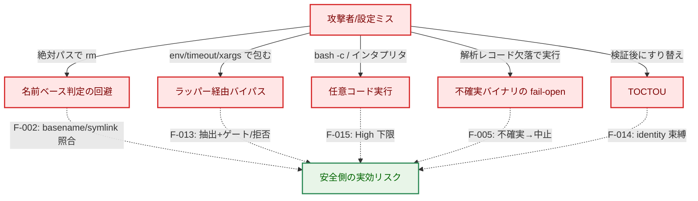

**矢印の意味**: 実線 A → T は「攻撃ベクトル」、点線 T -.-> M は「本設計の対策（緩和）」。

**凡例（Legend）**

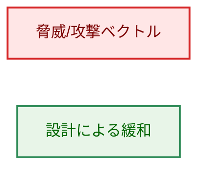

### 5.2 設計上の限界（明示）

- **ブロックリスト方式**: 未知コマンド・未知の間接実行形態は Low 通過し得る。**allowlist（`cmd_allowed`）＋ハッシュ固定（`verify_files`）の併用が前提**（AC-66/67）。
- **basename ベースのプロファイル**: ハードリンク/リネームによる名前すり替えには対応しない（symlink は F-012 で解決）。緩和は allowlist＋ハッシュ。
- **シェルインライン文字列**: `bash -c "sudo …"` の文字列内特権昇格は確実に Critical 化できない（不透明）。High 下限＋allowlist が backstop。
- **`output_file` 書き込み先**: リスク判定対象外（スコープ外、限界として明記）。

### 5.3 既存セキュリティ方針との関係

- **タスク 0135（coreutils 単一バイナリ分類）の保持**: 本設計は coreutils 分類がバイナリ解析より優先する 0135 の方針を **保持・明文化** する（例外ではない）。`echo` 等の安全サブコマンドは共有バイナリの解析シグナルによらず Low（ハッシュ検証は必要）。整合テストは `risk/coreutils_consistency_test.go` で継続検証する。
- **ファイル整合性検証（`docs/dev/architecture_design/security-architecture.md`）**: バイナリ解析次元の抑制（coreutils）と **ハッシュ検証は別次元** であり、ハッシュ検証は常に必要（F-014/AC-65）。

#### 既存アーキ文書ポリシーへの例外（C-1）

本設計は全社的アーキ文書 `docs/dev/architecture_design/security-architecture.md` の 2 つの記述を更新する。要件プロセスに従い、(1) 元ポリシーと所在、(2) 例外の理由、(3) 旧挙動を主張する既存テストを明記する。

1. **「Graceful degradation when security features are unavailable」（`security-architecture.md` の Fail-Safe Design 節、`:1039`）の反転**
   - (1) 元ポリシー: セキュリティ機能が利用不能な場合に graceful degradation（機能縮退して継続）する、という方針。
   - (2) 例外の理由: F-005/AC-51 により、バイナリ解析（＝ファイル検証）が無効な構成では **常時実行拒否**（degradation でなく fail-closed）とする。バイナリの素性を確認できない状態での実行を許さないため。dry-run は引き続き可能。`security-architecture.md` の当該記述を「解析/検証が無効な場合は実行を拒否する（dry-run は可）」へ改訂する。
   - (3) 旧挙動を主張するテスト: 解析無効時に Low 通過/実行継続を期待するテストがあれば更新が必要（解析無効関連の検証テスト）。本タスクで該当テストを洗い出し、常時拒否へ更新する。
2. **`EvaluateRisk` のシグネチャ記述（`security-architecture.md` の Risk Assessment Engine 節、`:417`）の更新**
   - (1) 元ポリシー記述: `func (e *StandardEvaluator) EvaluateRisk(cmd *runnertypes.Command) (runnertypes.RiskLevel, error)`。
   - (2) 理由: F-001/F-003/F-005 により戻り値を `RiskAssessment`（実効リスク＋reason code＋Blocking）へ拡張する（§1.3）。当該コード片を変更後シグネチャへ更新する。
   - (3) 旧シグネチャに依存する記述・図は本文書 §3.2 の目標状態に合わせて更新する。

- **意図的な振る舞い変更（移行影響）**: `claude` 等 Medium→High、`systemctl` 変更系 Low→High、`service` 全アクション High、インタプリタ/ビルド/パッケージスクリプトランナー High、`risk_level="unknown"` 設定エラー化。これらは AC-19 の移行ノートに記載する。**これらの値を前提とする既存テスト**（`risk/evaluator_test.go` の basename 期待値、`security/command_analysis_test.go`、`runnertypes/config_test.go`、`security/coreutils_test.go`、`security/network_analyzer_test.go`）は更新が必要。

## 6. 処理フロー詳細

### 6.1 リスク分類の流れ（F-001 最大値・F-008 単一源泉）

> 本図は処理フロー（処理ステップと判定）を示す。入力データ（`RuntimeCommand`、プロファイル、解析レコード）はシリンダーで §1.2 / §2.1 に示しているため、本フロー図では再掲しない。

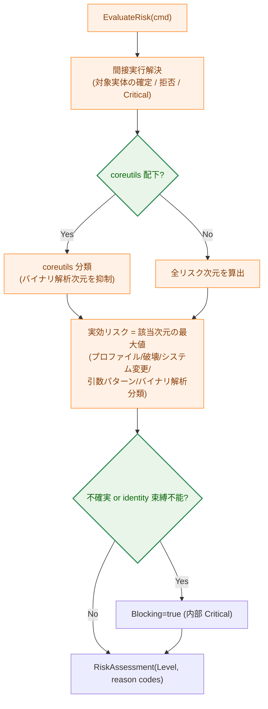

**矢印の意味**: 実線 A → B は処理の流れ、`{ }` は判定。

**凡例（Legend）**

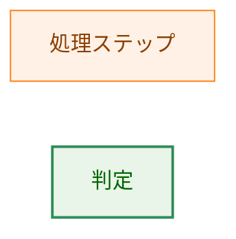

### 6.2 ゲートと監査（F-003/AC-11/56/70）

リスク比較ゲートは `effectiveRisk > maxAllowed`（または `Blocking=true`）で拒否する。監査エントリ（`command_risk_profile`）は、`resolved_path`・`content_hash`・解析レコード識別・`max_allowed_risk`・`decision`（allow/deny）・`reason_codes` を含み、間接実行連鎖では評価・実行・ロードされた全成果物の identity/hash を相関可能にする。deny イベントは decision に基づく重大度下限（Warn 以上）を適用し、リスクレベル対応のログレベル（AC-13）に埋もれないようにする。引数の機密はマスキング（AC-57、既存 redaction 機構と整合）。

## 7. テスト戦略

- **ユニットテスト**: 各 AC に最低 1 つの検証。とくに (a) 絶対パス入力（AC-06/07/08/44）、(b) 全次元最大値・順序非依存（AC-63）、(c) バイナリ解析 4 区分の網羅（AC-45）と reason code 網羅（AC-69）、(d) coreutils 優先（AC-72）・未知サブコマンド High（AC-68）、(e) `ParseRiskLevel("unknown")` エラー（AC-24）。
- **バイパス系（攻撃者視点）テスト**（AC-71）: ラッパー（`env sudo`/`env rm`/`env PATH=`/`env LD_PRELOAD=`/`env -S`）、シェル `-c`、find `-exec`/`-execdir`、shebang、`rsync -e`/`tar --to-command`、ld-linux。正常系直接呼び出しだけで終えない。
- **整合性テスト**: 実行時と dry-run の実効リスク一致（AC-20/39）。既存 `risk/coreutils_consistency_test.go` を維持・拡張。
- **監査テスト**: deny 時の出力・相関フィールド・重大度下限・連鎖カバレッジ（AC-11/56/70）。
- **後方互換テスト**: basename 入力の検出維持（AC-10）。
- **品質ゲート**: `make fmt` / `make test` / `make lint`（AC-21）。

トレーサビリティ（各 AC ↔ テスト）は `03_implementation_plan.md` の「Acceptance Criteria Verification」で対応付ける。

## 8. 実装優先順位（フェーズ）

1. **フェーズ 1 — 評価コア**: `RiskAssessment` 導入、`EvaluateRisk` の最大値化、`NetworkAnalyzer` の分類化、不確実→Blocking、coreutils 優先。`ParseRiskLevel("unknown")`（F-007）。F-001/F-002/F-005/F-007/F-008/F-011。
2. **フェーズ 2 — 間接実行**: `indirect_execution.go` 新規。ラッパー/シェル/ローダ/find-exec/shebang/オプションのゲート・identity 束縛・拒否。F-013/F-014/F-015。
3. **フェーズ 3 — 監査と dry-run**: `LogRiskProfile` 拡張・`NormalResourceManager`/`dryrun_manager` 配線・deny 重大度・unknown 区分。F-003/F-006/F-009。
4. **フェーズ 4 — ドキュメント**: 開発者/ユーザー向け文書整合、移行ノート。F-004/F-010、AC-19。PR #724 マージ後に開発者向け文書を反映。

各フェーズで `make test`/`make lint` を通す。

## 9. 将来の拡張性

- **間接実行ベクトルの追加**: 一般原則（全成果物のゲート＋identity 束縛、不能なら拒否）に基づき、新規ラッパー/オプション/ローダ形態は最小限の追加で対応可能。網羅列挙には依存しない。
- **リスク次元の追加**: `CommandRiskProfile` に新 `RiskFactor` を追加すれば最大値計算に自動的に寄与する。
- **解析バックエンドの拡張**: `BinaryAnalysisClass` 分類を保てば解析手法（ELF/Mach-O 等）の追加は評価コアに影響しない。

## 付録: 決定履歴（要約）

設計判断の経緯（不確実ケースの Critical 化、F-011 採用、coreutils 優先の明文化、間接実行の一般原則化、解析無効の常時拒否、`service` の High 化、静的バイナリの正しい理解 等）は `01_requirements.md` の Document Status コメントおよび PR #725 のレビュー履歴に記録がある。本文は現行設計の状態を記述し、本付録と git 履歴に経緯を限定する。
