# 実行時リスク判定の強化 — アーキテクチャ設計書

## Document Status

| Item | Value |
|---|---|
| Status | `approved` |
| Created | 2026-06-14 |
| Review date | 2026-06-15 |
| Reviewer | isseis |
| Comments | 2026-06-15: セキュリティレビュー（Critical 3・High 4・Medium 4）を反映 — 評価と実行の結合（`VerifiedCommandPlan` 中心設計、executor は plan のみ exec）、TOCTOU の fd ベース実行（fexecve/execveat）第一候補化、identity ゲートを coreutils 抑制より前段に配置、dry-run/normal の判定区別（当初案 `AssessmentStatus`/`EvaluationContext` は後の改訂で廃止し `Blocking`+`VerificationUnavailable` に簡素化。下記参照）、「統合評価モデル＋優先順位」への用語精緻化＋リスク次元優先順位表、`Classify` を全検証済み実行可能ファイルに適用、監査 `Decision` enum・`BlockingReason`・Chain の Role/Disposition、Critical の一貫扱い、systemctl argv 解析規則、フェーズの縦切り化＋リリースゲート。2026-06-15: 実装計画（03）レベルの詳細を点検しトリム — systemctl の argv 解析手順と監査ロガーの具体配線（Config フィールド/コンストラクタ）を契約レベルに圧縮し、具体は 03 へ移送。2026-06-15: 【isseis 指示】dry-run の `unknown` リスク状態を廃止（01 の AC-46/58 改訂と整合）。dry-run は normal と同じ read-only 解析で判定を決定的に再現し、出力は allow/deny の2区分。`AssessmentStatus`・`EvaluationContext`・`VerificationState` を削除、`EvaluateRisk(cmd)` へ簡素化、`Decision` enum から `Unknown` を除去、検証不能 deny は `VerificationUnavailable` 運用フラグで区別。2026-06-15: 機械可読コードを string 派生型化 — `ReasonCode` 型＋定数を導入し `ReasonCodes []ReasonCode` / `BlockingReason ReasonCode` に変更（列挙的文字列 Role/Disposition/ErrorClass も派生型化方針。AC-69 と親和）。2026-06-15: 【isseis 指示】取得不能値を安全化 — `RiskAuditEntry`/`ExecutedArtifact` の `ResolvedPath`/`ContentHash`/`RecordID` を `*string`（nil=不在）にし値内センチネル文字列を排除。固定マーカーはログ出力境界のみ。ContentHash 不在は nil でハッシュ突合は VerifiedIdentity を使用（AC-56 改訂と整合）。2026-06-15: 残りの列挙的文字列も専用型化 — `ErrorClass` / `ArtifactRole` / `ArtifactDisposition` を string 派生型＋定数で定義し、`RiskAuditEntry.ErrorClass`・`ExecutedArtifact.Role`/`Disposition` に適用。2026-06-15: テクニカルライター/シニア SWE 観点で 01⇄02 整合性レビューを実施し反映 — §3.2 クラス図に `Reasons []string` 追記と監査 `risk_factors`（AC-12）への対応明記、Comments の陳腐化記述（`AssessmentStatus`/`EvaluationContext`）訂正、§3.7 の AC-34〜38 行に §3.6.1/§6.1 参照追加・AC 重複の意図注記、§5.2/AC-66,67 行に root 判定系（§6.1/AC-29）への相互参照、§5.3 の C-1 を「02 設計レビューの C-1（01 F-013 の C-1 とは別系列）」と明記、§4(3) のリスク昇格を fail-closed 非該当と明記、§5.3 で現行 `EvaluateRisk` の引数型が既に `*runnertypes.RuntimeCommand` である旨を補記。2026-06-15: PR #726 自動レビュー（gemini/copilot/codex 計13件）を反映 — `VerifiedIdentity.FD` を `*int`（nil=不在、fd 0=stdin 誤認回避）、`BinaryAnalysisClass` のゼロ値を `Uncertain`（fail-closed）に並べ替え、`Classify` を `BinaryAnalysisResult`（区分＋根拠別 reason code, AC-69/41）返却に、`Decision` を string 派生型 allow/deny の2値に（int enum の数値ログ化を回避、エラー起因 deny は `ErrorClass` で区別）、`RiskAuditEntry` の重複 `BlockingReason` を削除（`Assessment` に内包）、`ExecutionMode` を audit ローカル string 型として定義（resource→audit→resource 循環依存回避）、責務表の `EvaluateRisk` 返却型を `VerifiedCommandPlan` に統一、評価器が検証済み identity/fd を単一 open で生成する旨を明記（TOCTOU）、§6.1 に F-015 任意コード実行次元を追加、find/xargs の子プロセス実行は fd 束縛不能なら拒否（パス書換のみで通さない）と明記、未知間接形態の fail-safe を §5.2 で明確化。AC-32 に解析利用可能時の限定子を復元（01）。2026-06-15: PR #726 自動レビュー第2巡（codex 6件）を反映 — §3.2 クラス図の `Classify` を `BinaryAnalysisResult` 返却に統一、identity 生成を評価器一箇所へ一元化（group_executor は `EvaluateRisk` を呼ぶのみ）と §3.6.2 明記、§4 を再構成しポリシー拒否（symlink 解決失敗・coreutils ファイル情報失敗・間接実行拒否を含む）を単一の監査される `Blocking` 経路へ集約・`error` 返却は真の想定外のみ＋その場合も中止前に監査エントリ出力（AC-56/70）、間接実行拒否をセンチネルエラーから `Blocking`+`ReasonIndirectExecutionRejected` へ変更、ld-linux の `--library-path` 等ローダ探索制御も検証/拒否対象に追加（AC-83）、共有 DTO（VerifiedCommandPlan/ExecutedArtifact 等）を下位中立パッケージへ配置し `risk -> audit -> risk` 循環を回避（責務表に行追加）。2026-06-15: PR #726 自動レビュー第3巡（codex 6件）を反映 — 拒否 plan 向けに `VerifiedCommandPlan.Identity` を `*VerifiedIdentity`（nil=検証済み identity なし）にし空文字センチネルを排除、`ExecutedArtifact` に `Identity *VerifiedIdentity` を追加し連鎖内の各成果物（shebang/loader/helper）も identity 束縛・不能なら拒否、`service <name> <action>` の init スクリプト（`/etc/init.d/<name>`）を間接実行成果物としてゲート（§3.3 行追加・§3.6.1 補記）、特権昇格 Critical 拒否でも `BlockingReason` を設定すると定義（Blocking=true/Level=Critical の両拒否で必須）、§5.3 の `security-architecture.md` 更新指示の戻り値を `VerifiedCommandPlan` に訂正、dry-run の失敗を「ポリシー拒否=deny 予告／分類不能障害=エラー」の2系統に明確化（01 AC-18/33・F-006 改訂）。2026-06-15: 【isseis 指示】アーキテクチャ文書として詳細すぎる内容をトリムし一般原則中心に整理 — 定数（ReasonCode/ErrorClass/ArtifactRole/ArtifactDisposition）のリテラル文字列値の網羅列挙を削除し型定義＋目的＋「完全な一覧は 03」へ、既存コード移行の考古学（内部関数名・`file:line` 引用・現行シグネチャ全文・写像実装手順）を圧縮し責務表/03 へ委譲、共有 DTO 配置ノートの型列挙を圧縮。型定義・インターフェース・一般原則・優先順位表・間接実行形態表は維持。2026-06-15: PR #726 自動レビュー第4巡（codex 9件）を反映 — §2.3 シーケンス図を修正（パス解決/検証/fd 取得を `EvaluateRisk` 内へ、許可時 exec を `base/executor` 経由に）、§2.2 コンポーネント図に dry-run マネージャ→監査の辺を追加、`RiskAssessment` に `ErrorClass` を追加し失敗起因拒否の分類を manager へ伝達（クラス図も更新）、`VerifiedCommandPlan` の実行内容フィールドは許可 plan のみ設定・監査 resolved_path は Identity から導出（空文字を実値化しない）、fd 所有権の原則を §3.6.2 に追記（close 機構の詳細は 03）、**P1: fd 不能時のフォールバックから再ハッシュのみの path exec を排除**（read-only ステージング or 拒否のみ。AC-76）。01 AC-17 を §4 の拒否/エラー2系統に整合（symlink/coreutils 失敗は拒否ケース）。陳腐化していた `Classify` 互換ノートはトリム済みで対応不要。2026-06-15: PR #726 自動レビュー第5巡を反映 — §2.1 全体図の `group_executor` ラベルを「EvaluateRisk を呼び plan を受領・実行を委譲」へ修正し §2.3/§3.6.2 と整合（解決/検証/identity 束縛は評価器が一度だけ）、01 AC-17 の括弧の全角半角不整合を修正。`ResolvedEnv` の env シリアライズ順安定化（map→[]string でキーソート）は 03 レベルの実装詳細として委譲。2026-06-15: PR #726 自動レビュー第6巡（codex 5件）を反映 — §3.3 表に「フラグは代表例・クラス単位で原則適用」注記を追加し ld-linux `--audit`・`tar --checkpoint-action=exec`・`service --status-all` 等の個別ベクトルを一般原則でカバー（網羅列挙は §3.6.4 によりスコープ外・03 で確定）、§4 で dry-run が再現するのは (1)(2) のみで (3) 予期しない内部エラーは dry-run でも error 返却と明記（AC-18/33 整合）、identity 束縛可否を評価段階で判定し不能なら Blocking deny とする原則を §3.6.2/責務表に明記（allow 監査後に executor が拒否して監査不整合が生じるのを防止、AC-70/76）。2026-06-15: PR #726 自動レビュー第7巡（codex 5件・すべて整合性）を反映 — §1.2 概念モデルを修正（`RuntimeCommand`=未解決入力、評価器が単一 resolve/verify/open で identity 生成、RecordStore は読取専用入力）、§3.5 dry-run の「ハードエラー」行を コマンド探索失敗等に限定し symlink 解決失敗を除外（deny 予告側）、責務表の `group_executor` を「manager 経由の呼び出し側に徹する（評価・ゲート・監査は manager 所有）」へ訂正＋§3.6.2 の対応記述も整合、束縛可否チェックを**副作用なし**（実ステージング書込は normal の exec 直前のみ）と明記し dry-run の read-only と AC-30/39 整合を両立、`xargs` をラッパー行から除外し子プロセス実行（find/xargs 行）の fd 束縛/拒否ルールへ一本化（AC-76/82） |

本書は `01_requirements.md`（status: `approved`）の機能要件 F-001〜F-015 / 受入基準 AC-01〜AC-87 を満たすための高レベル設計を定義する。実装詳細・擬似コード・アルゴリズムは含めない（それらは実装と `03_implementation_plan.md` で扱う）。

## 1. 設計の全体像

### 1.1 設計原則

1. **単一の評価パイプライン**: 実行時（normal）と dry-run が **同一のリスク評価ロジック** を用いる。両者の分裂（背景 H/I）を構造的に排除する。
2. **統合評価モデル＋明示的優先順位**: 複数の判定次元（プロファイル / coreutils / 危険引数 / 任意コード実行 / バイナリ解析）を、単一の統合評価モデルと明示的な優先順位（§6.1 のリスク次元表）で合成する。実行時と dry-run は同一のモデルを用いる（背景 H）。
3. **全リスク次元の最大値**: 実効リスクは該当する全リスク次元の最大値とし、評価順に依存しない（F-001）。早期 return による取りこぼしを排除する。
4. **評価と実行の結合**: 評価は実行内容（`VerifiedCommandPlan`）を生成し、executor はその plan のみを exec する。評価が見た実体と実行される実体を一致させる（§3.1）。
5. **fail-safe / fail-closed の明確な三層**: 「エラー中止」「無条件拒否（内部 Critical 化）」「リスク昇格（High、許可可能）」を区別する（用語は要件 §4）。バイナリの素性を確認できない不確実ケースは設定によらず実行を中止する（F-005）。
6. **検証済み identity の束縛**: 実際に実行・ロードされる成果物を、検証（ハッシュ）と allowlist のゲートに通し、**検証済み identity を exec/ロード時点まで束縛** する。束縛できない間接実行形態は拒否する（F-012/F-013/F-014）。
7. **多層防御の一層**: リスク判定はブロックリスト方式であり、未知コマンドは Low 通過し得る。allowlist（`cmd_allowed`）＋ハッシュ固定（`verify_files`）の併用を前提とする（脅威モデル、AC-66/67）。
8. **YAGNI / DRY**: 既存コンポーネント（プロファイル定義、バイナリ解析レコード、検証マネージャ、監査ロガー、環境変数フィルタ）を再利用し、責務の重複を作らない。

### 1.2 概念モデル

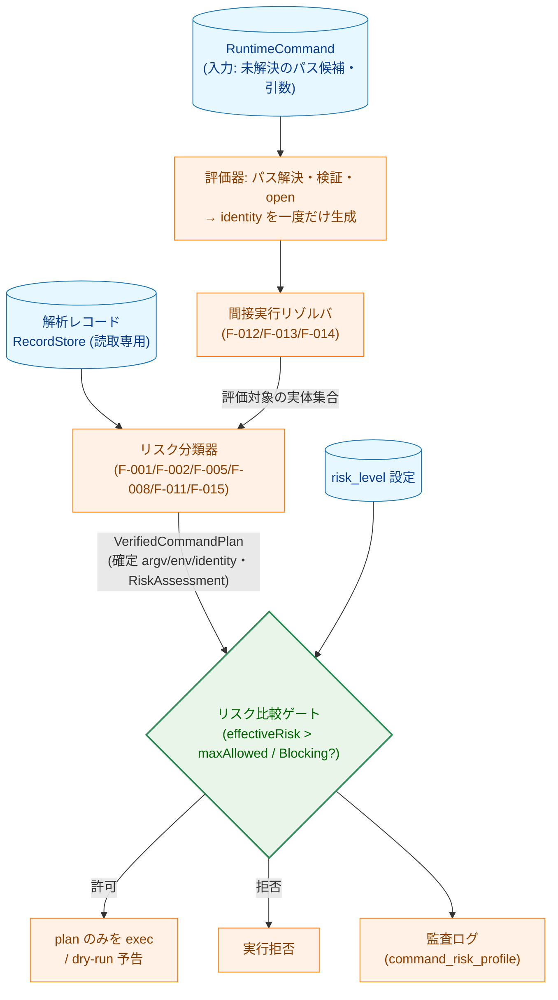

**矢印の意味**: 実線 A → B は「A の出力が B の入力になる（データ/制御の流れ）」を表す。`{ }` は判定ノード。評価器は `VerifiedCommandPlan` を生成し、EXEC は **その plan のみ** を exec する（元 argv/env を直接 exec しない）。

**凡例（Legend）**

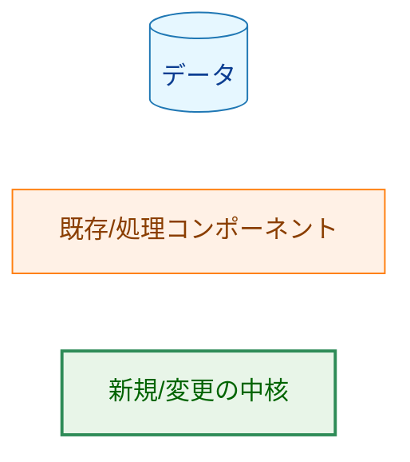

### 1.3 なぜ既存方式では不十分か（YAGNI 検討）

現行の `risk.StandardEvaluator.EvaluateRisk` は「ステップごとに早期 return」かつ戻り値が `(RiskLevel, error)` の 2 値である。これは次の要件を満たせない:

- **F-001（全次元の最大値）**: 早期 return は後段次元を取りこぼす。
- **F-003（reason code・監査）**: `(RiskLevel, error)` は判定根拠を返せない。
- **F-005（不確実と危険検出の区別）**: バイナリ解析の `(isNetwork, isHighRisk bool)` 2 値では「危険検出（High 維持）」と「不確実（中止）」を区別できない（情報が合流している）。

したがって、(a) 構造化された判定結果型（`RiskAssessment`）と (b) バイナリ解析シグナルの 3 値以上の分類が **必要最小限の変更** である。リスクレベルの段階定義自体は変更しない（スコープ外）。

## 2. システム構成

### 2.1 全体アーキテクチャ

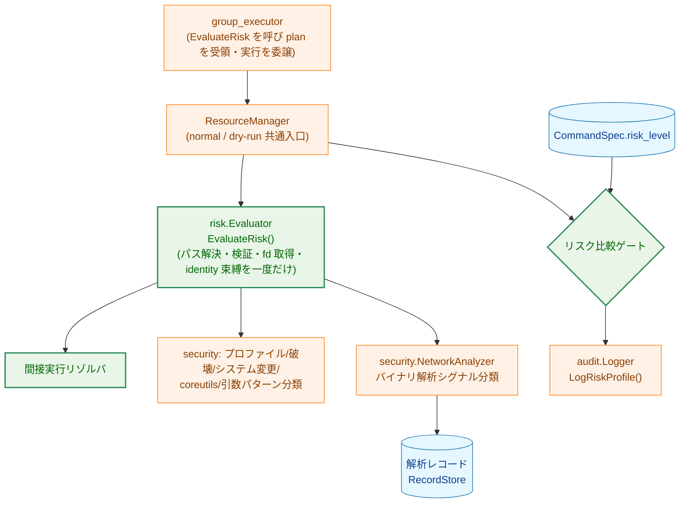

**矢印の意味**: 実線 A → B は「A が B を呼び出す / B に依存する」。`{ }` は判定。

**凡例（Legend）**

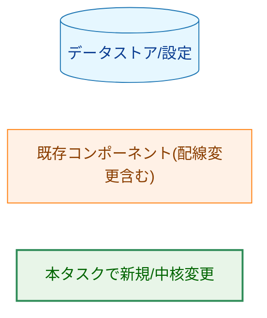

### 2.2 コンポーネント配置（パッケージ）

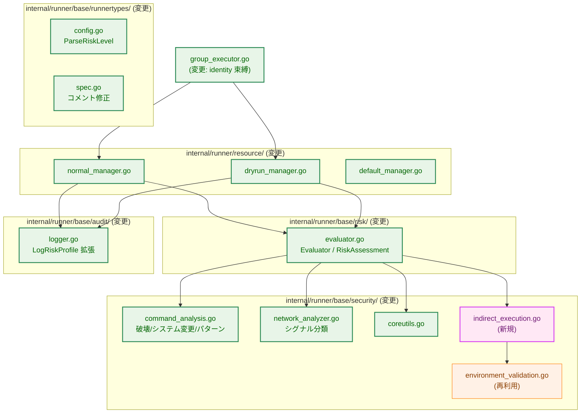

**矢印の意味**: 実線 A → B は「A が B を利用する」。

**凡例（Legend）**

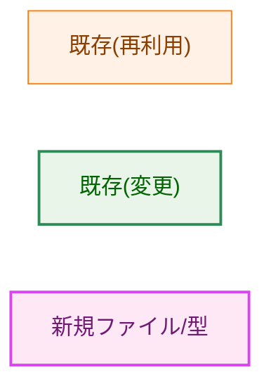

> 注: `indirect_execution.go` は新規 **ファイル** であり、既存 `internal/runner/base/security` パッケージ内に追加する（新規パッケージは作らない。DRY/責務集約のため）。

### 2.3 データフロー（実行時パス）

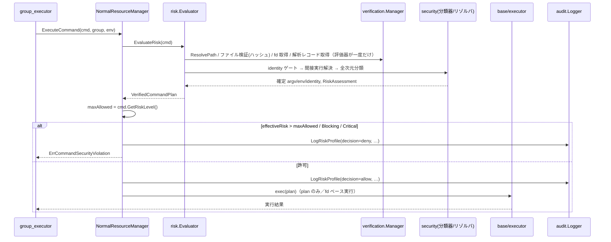

**矢印の意味**: 実線（→）は同期呼び出し、点線（-->>）は戻り値。`alt` は分岐。パス解決・検証・fd 取得は **評価器（`EvaluateRisk`）が一度だけ** 行い（事前の別経路解決は無い、AC-64/76）、exec は **`base/executor` が `VerifiedCommandPlan` のみ** を用いる（`group_executor` は exec の実行主体にならない）。

## 3. コンポーネント設計

### 3.1 主要型（インターフェース・型定義のみ）

#### 設計の中核: 評価と実行の結合（`VerifiedCommandPlan`）

**最重要の設計判断**: リスク評価の結果（リスクレベル）だけを返す設計では、評価が見た実体と executor が実際に exec する実体が一致する保証がない（例: `env PATH=/tmp rm` を評価時に `/usr/bin/rm` として検証しても、executor が元の argv を exec すると `/tmp/rm` が走り得る）。これでは AC-79/82/86/87（identity 保持）を **強制できない**。

そこで評価は **検証済み実行計画 `VerifiedCommandPlan`** を生成し、**executor はこの plan のみを exec する** ことを契約とする。元の argv/env を直接 exec することを禁止する。これにより「評価で確認した実体＝実行される実体」を型レベルで束縛する。

```go
// VerifiedCommandPlan は「実際に exec してよい確定済みの実行内容」を表す（新規）。
// executor はこの plan のみを実行し、元 argv/env を直接 exec してはならない。
type VerifiedCommandPlan struct {
    // 実行内容フィールド（ResolvedPath/Argv/Env）は **許可（実行可能）plan でのみ設定** する。
    // 検証成立前に拒否される plan（symlink 解決失敗等）では未設定（空）であり、**監査の
    // resolved_path はこれらではなく Identity から導出**する（Identity が nil なら不在として
    // 扱い、空文字を実値として記録しない。AC-56）。
    ResolvedPath string            // 実行対象の絶対パス（許可 plan のみ。監査の基準にはしない）
    ResolvedArgv []string          // 間接実行を展開・正規化した最終 argv（許可 plan のみ）
    ResolvedEnv  map[string]string // 禁止環境変数を除去/検証済みの env（許可 plan のみ）
    Identity     *VerifiedIdentity // exec 時点まで束縛する identity（下記）。nil = 検証済み identity が存在しない拒否 plan
    Artifacts    []ExecutedArtifact // 実行/ロードされる全成果物（監査・ゲート済み）
    Assessment   RiskAssessment    // 本 plan に対するリスク判定結果
}

// VerifiedIdentity は検証済み実体を exec 時点まで束縛するための識別子。
// fd ベース実行（§3.6.2）を第一候補とし、ContentHash は再突合用。
// **検証が成立した場合にのみ生成される**（成立していない拒否 plan では plan 側を nil にする）。
// したがって本構造体が存在する＝検証済みであり、ResolvedPath/ContentHash は常に実値を持つ
// （「不在」は VerifiedIdentity 自体の nil で表し、フィールド内にセンチネル空文字を入れない。AC-56）。
type VerifiedIdentity struct {
    FD          *int   // 検証済みファイルディスクリプタ（nil = FD なし。fexecve/execveat 用、可能な環境のみ）
    ResolvedPath string // 検証済み絶対パス（VerifiedIdentity が存在する時点で確定）
    ContentHash string // 確定 content hash（同上）
}
```

> **共有 DTO の配置（import 循環の回避）**: 評価器（`risk` パッケージ）が生成する `VerifiedCommandPlan` と、監査エントリ（`audit` パッケージ）が参照する型は重なる（`RiskAssessment`・`ExecutedArtifact` 等）。これらを評価側・監査側のどちらかに置くと `risk -> audit -> risk` の循環依存になる。よって **評価・監査の双方から参照される DTO** は、両者が依存できる **下位の中立パッケージ**（既存 `runnertypes`、または新規 `risktypes` 等）に置く方針とする。対象型の確定と配置先パッケージは `03_implementation_plan.md` で確定する。

#### リスク判定結果

評価結果を構造化し、reason code・判定根拠を運ぶ（F-001/F-003/F-005）。

> **dry-run の判定は決定的（`unknown` 状態を持たない）**: dry-run は normal と同じ read-only 解析を行い、実行時判定を allow/deny で正確に再現する。解析・検証が利用不能な環境でも AC-51 により実行時は必ず拒否されるため dry-run は **deny 予告** となる（§3.5）。よって「許可されるかもしれない」という曖昧な `unknown` リスク状態は設けない。評価は normal/dry-run でモード非依存（モードに応じた副作用＝exec か preview かは ResourceManager の責務）。

機械可読なコードは、生の `string` ではなく **string 派生型＋定義済み定数** で表現する（タイプミス防止・利用箇所の発見性・網羅性検証 AC-69 のため）。

```go
// ReasonCode は判定根拠の機械可読コード（string 派生型）。定数で定義し、生文字列は使わない。
type ReasonCode string

// 判定根拠ごとに定数を定義する（破壊操作・動的ロード・exec・特権昇格・coreutils 分類・
// 解析不確実・identity 束縛不能・間接実行拒否、およびバイナリ解析の各分岐 等）。
// 具体的な定数名・文字列値の完全な一覧は 03_implementation_plan.md で定義し、AC-69 で網羅をテストする。

// RiskAssessment は実効リスクとその判定根拠を表す（新規）。
type RiskAssessment struct {
    Level          runnertypes.RiskLevel // 実効リスク（全次元の最大値）
    Blocking       bool                  // true なら risk_level によらず拒否（不確実 / identity 束縛不能）
    BlockingReason ReasonCode            // 拒否（deny）理由コード。**Blocking=true または Level=Critical のいずれの拒否でも設定**（例: ReasonUncertainMissingRecord / ReasonPrivilegeEscalation）。許可時は空
    ErrorClass     ErrorClass            // 失敗起因の拒否（symlink 解決失敗・coreutils ファイル情報失敗 等）の分類。非失敗起因の拒否・許可時は空。監査エントリへそのまま転記する
    ReasonCodes    []ReasonCode          // 機械可読な判定根拠
    Reasons        []string              // 人間可読な根拠（プロファイル由来の Reason 等）。監査では `risk_factors` として出力（01 AC-12）
    NetworkType    string                // 監査用（none/always/conditional）
}

// Evaluator は実行時リスク判定の入口。VerifiedCommandPlan を生成する。
type Evaluator interface {
    EvaluateRisk(cmd *runnertypes.RuntimeCommand) (VerifiedCommandPlan, error)
}
```

> **入力は `RuntimeCommand` だが、検証済み identity（fd 含む）は評価器が生成する**: `RuntimeCommand` は path/hash しか持たないため、評価器自身がパス解決・ファイル検証・open を **一度だけ** 行い、その結果の fd・content hash を `VerifiedCommandPlan.Identity` に格納する。executor はこの plan の `Identity.FD`（可能環境）で実行し、**path から再解決・再 open しない**。評価と実行の間に解決をやり直さないことで AC-64/76 の TOCTOU 窓を閉じる（評価器が fd を握れない環境では `FD=nil` とし、§3.6.2 のフォールバックに従う）。

> 列挙的な文字列フィールド（`ExecutedArtifact.Role` / `Disposition`、`RiskAuditEntry.ErrorClass`）も、それぞれ専用の string 派生型＋定数で表現する（§3.2 で定義）。

> 現行の `EvaluateRisk(cmd) (runnertypes.RiskLevel, error)` を上記へ変更する。`error` は「エラー中止」（解決失敗・予期しないレコード読込エラー等）専用。設定によらず実行を中止する不確実ケースは `RiskAssessment.Blocking=true`＋`BlockingReason`（内部 Critical 相当）で表現する。**特権昇格は `Level=Critical`**（設定不可のため常に拒否。監査では `effective_risk=critical, decision=deny, blocking_reason=privilege_escalation` で一貫させる）。`Level=Critical` と `Blocking=true` はいずれも「必ず拒否」だが、前者はリスクレベル（特権昇格）、後者は不確実/identity 失敗という意味の異なる経路である。**両経路とも拒否時には `BlockingReason` を設定する**（Critical の特権昇格は `ReasonPrivilegeEscalation`）。これにより、`RiskAuditEntry` 側に独立した blocking-reason フィールドを持たなくても、Critical 拒否が理由コードを欠かない（`BlockingReason` は「Blocking=true または Level=Critical の拒否」で必ず埋まる、と定義する）。

バイナリ解析シグナルは 2 値 bool から **分類** に変更する（F-005/AC-45）。「危険検出（High）」と「不確実（中止）」を区別する。

```go
// BinaryAnalysisClass はバイナリ解析の判定区分（新規）。
// ゼロ値は最も安全側の Uncertain（中止）に割り当てる（fail-closed）。
// 初期化漏れ等でゼロ値のまま使われても「安全（Low）」へ倒れない。
type BinaryAnalysisClass int

const (
    BinaryAnalysisUncertain   BinaryAnalysisClass = iota // 0=ゼロ値: レコード欠落/不一致/非対応/想定外 → 中止(Blocking)
    BinaryAnalysisClean                                  // 危険シグナルなし → Low
    BinaryAnalysisNetwork                                // ネットワークのみ → Medium
    BinaryAnalysisHighRisk                               // dlopen/exec/svc/mprotect → High
)

// BinaryAnalysisResult は分類結果と、その根拠となった機械可読コードを運ぶ。
// dlopen/exec/svc/mprotect、レコード欠落/スキーマ不一致/解析非対応などの区別を
// reason code として保持し、AC-69/AC-41 の根拠別 reason code 出力を可能にする
// （Class への集約だけでは根拠が失われるため、分類器自身が根拠コードを返す）。
type BinaryAnalysisResult struct {
    Class       BinaryAnalysisClass
    ReasonCodes []ReasonCode // 例: binary_analysis_dynamic_load / ..._exec / uncertain_missing_record
}
```

コマンドリスクプロファイル（既存 `CommandRiskProfile`）はリスク定義の主たる源泉として継続利用する。プロファイルのフィールド構成（`PrivilegeRisk`/`NetworkRisk`/`DestructionRisk`/`DataExfilRisk`/`SystemModRisk` 各 `RiskFactor`、`NetworkType`、`NetworkSubcommands`）は維持する。

> 用語の精緻化（H-5 対応）: リスク判定は単一関数に集約されるわけではなく、複数の判定次元（プロファイル / coreutils / 危険引数 / F-015 / バイナリ解析）を **統合評価モデル＋明示的優先順位** で合成する。実行時と dry-run が同一のこの統合モデルを用いる点が「単一」の含意である。優先順位は §6.1 のリスク次元表で定義する。

**`Classify` の責務境界（M-8/H-6 対応）**: 現行 `NetworkAnalyzer.IsNetworkOperation` は「プロファイル `NetworkType` 照合・symlink 走査・引数ネットワーク検出・バイナリ解析」を 1 関数に内包している。本設計ではこれを分離する:

- `NetworkAnalyzer.Classify(cmdPath, contentHash) (BinaryAnalysisResult, error)` は **バイナリ解析シグナルの分類のみ** を担う（プロファイル照合・引数検出は含めない）。結果は分類区分（`BinaryAnalysisClass`）に加え、根拠別の reason code を保持し（dlopen/exec/svc/mprotect、レコード欠落/スキーマ不一致/非対応の区別）、AC-69/AC-41 の根拠別出力を満たす。
- **適用範囲**: coreutils 抑制対象を除く **全ての検証済み実行可能ファイル** に適用する。プロファイルの有無は skip 条件では **ない**。例: `curl`（プロファイルあり）でも、解析で exec/dlopen が検出されれば `BinaryAnalysisHighRisk`→High が最大値に合流する。
- プロファイル `NetworkType`（Always/Conditional）の照合と、引数の URL/SSH 検出は **評価器（`StandardEvaluator`）側のリスク次元算出** に置く。
- `BinaryAnalysisResult.Class` → リスクレベルの写像（Clean→Low、Network→Medium、HighRisk→High、Uncertain→Blocking）は **評価器** が行い、他次元と max を取る。`ReasonCodes` はそのまま `RiskAssessment.ReasonCodes` に合流する。プロファイル由来 Medium とバイナリ解析由来 Medium は同じ Medium として最大値に合流する。

**F-011 の引数条件付きシステム変更リスクの合成（M-2 対応）**: **評価器がコマンドのサブコマンドから実効 `SystemModRisk` レベルを導出し、プロファイルの静的 `SystemModRisk` の代わりに最大値計算へ合流させる**（実効リスク = 引数評価後の SystemModRisk を含む全次元の最大値）。プロファイルの静的 `SystemModRisk=High` を無条件に持ち込まないことで `systemctl status` が High に固定されるのを防ぐ（F-011 / AC-49）。`service` は引数によらず High（AC-75）。読み取り専用/変更系サブコマンドの確定リストは §3.6 を参照。

### 3.2 クラス関係（中核型）

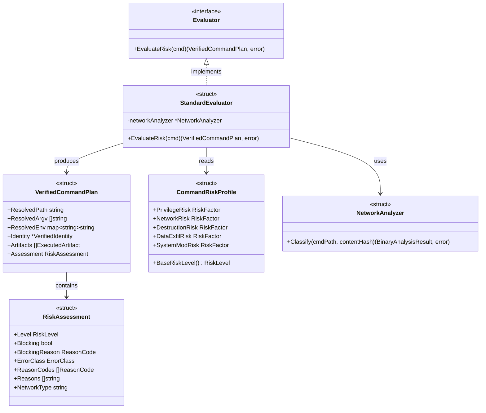

**矢印の意味**: `<|..` は実装、`-->` は利用/生成（ラベルで区別）。

**凡例（Legend）**: 本図は型の関係のみを示し、色分けクラスは用いない。

> 現行との対応（目標状態）: `EvaluateRisk` の現行戻り値は `(RiskLevel, error)`、`NetworkAnalyzer` の現行入口は引数も受け取る `IsNetworkOperation` で、これらを上図の目標シグネチャ（`VerifiedCommandPlan` 返却・`Classify`）へ変更する。`Classify` から引数（URL/SSH 検出）・プロファイル `NetworkType` 照合を外し評価器側へ移すのが要点（§3.1 の責務境界）。`CommandRiskProfile.BaseRiskLevel()` は既存を継続利用。変更対象ファイルと現行シグネチャの精確な対応は §3.4 の責務表および 03 を参照。

#### 監査エントリ型（M-4 対応）

現行の `LogRiskProfile` は本番未呼び出し（デッドコード、背景 B）で、相関に必要なフィールド（`resolved_path`/`content_hash`/`decision`/`max_allowed_risk` 等）を持たない。これを相関フィールドを集約した **パラメータ構造体** を受け取る形へ変更する（型定義のみ示す。現行シグネチャの精確な対応は 03）:

```go
// Decision は監査上の最終判定。AC-56 の `decision` 契約に合わせ allow/deny の
// **2 値のみ** とする（string 派生型。JSON ログにそのまま allow/deny を出す）。
// エラー中止（解決失敗・レコード読込エラー等）は decision としては deny とし、
// 失敗の種類は別フィールド `ErrorClass` で表現する（数値 enum にして 0/1/2 が
// ログに出ると AC-56 の契約が壊れるため int enum は採らない）。
type Decision string

const (
    DecisionAllow Decision = "allow"
    DecisionDeny  Decision = "deny"
)

// ExecutionMode は監査上の実行モード。`resource` パッケージの同名概念を import すると
// `resource -> audit -> resource` の循環依存になるため、audit ローカルに string 派生型で
// 定義する（共有が必要になればより下位のパッケージへ移す）。
type ExecutionMode string

const (
    ModeNormal ExecutionMode = "normal"
    ModeDryRun ExecutionMode = "dry-run"
)

// 列挙的な文字列値は専用の string 派生型＋定数で表現する（生文字列は使わない）。
// 各型の具体的な定数名・文字列値の完全な一覧は 03_implementation_plan.md で定義する。
type ErrorClass string         // エラー起因 deny の分類（symlink 解決失敗・レコード読込失敗 等）
type ArtifactRole string       // 間接実行成果物の役割（wrapper / inner / interpreter / preload / exec-target 等）
type ArtifactDisposition string // 成果物の処理結果（verified / rejected / allowlist-failed 等）

// 「取得できない値」は **値フィールドにセンチネル文字列を入れない**。在/不在を型で
// 明示し（ポインタ nil = 不在）、「不在を固定文字列で表示する」のは **ログ出力の境界のみ**
// で行う（在/不在を判定するロジックがセンチネル文字列を読む余地を作らない。AC-56）。
// とくに ContentHash の不在は nil で表し、ハッシュ突合（F-014）はこの値ではなく
// VerifiedIdentity（検証済み時のみ設定）を用いる。
//
// 変更後（新規パラメータ型）。decision/max_allowed_risk は比較を行う層で設定する。
type RiskAuditEntry struct {
    CommandName    string
    Mode           ExecutionMode         // normal / dry-run
    ResolvedPath   *string               // nil = パス未解決（解決失敗による deny 等）
    ContentHash    *string               // nil = 未検証（突合には使わない。下記注参照）
    RecordID       *string               // nil = 解析レコード非使用
    Assessment     RiskAssessment        // 実効リスク・reason codes・BlockingReason を内包
    MaxAllowedRisk runnertypes.RiskLevel
    Decision       Decision              // allow / deny（2 値）
    VerificationUnavailable bool         // dry-run で解析・検証が利用不能だった（deny だが環境起因。AC-58 の運用区別）
    ErrorClass     ErrorClass            // 失敗起因 deny の分類。Blocking 拒否では `Assessment.ErrorClass` を転記、plan を得られない error 返却経路（§4(3)）では manager が直接設定。空=失敗起因でない
    Chain          []ExecutedArtifact    // 間接実行連鎖の全成果物（AC-11）
}

// ExecutedArtifact は間接実行で実際に実行/ロードされた成果物 1 件の監査情報。
// 連鎖内の **各成果物**（shebang インタプリタ、ローダの preload/library、ラッパー
// helper 等）も exec/load 時点まで identity を束縛する必要があるため、主実行可能ファイルと
// 同様に自身の VerifiedIdentity（fd/ステージング）を持つ。束縛できない成果物（書込可能な
// パスを後から再 open され得る形態）は `Disposition=DispRejected` とし、その形態自体を
// 拒否する（path+hash だけでは検証〜exec/load 間の差し替えを防げないため。AC-83/86/87）。
type ExecutedArtifact struct {
    Path        string            // 解決済み絶対パス
    ContentHash *string           // nil = 未検証（突合に使わない。Identity がある場合はそちらが基準）
    Identity    *VerifiedIdentity // この成果物の検証済み identity（nil = 束縛不能 → 拒否対象）
    Role        ArtifactRole        // 役割（例: RoleWrapper / RoleInner / RolePreload）
    Disposition ArtifactDisposition // 処理結果（例: DispVerified / DispRejected）
}

func (l *Logger) LogRiskProfile(ctx context.Context, entry RiskAuditEntry)
```

> deny 系イベントの重大度下限（AC-70）と `Decision` の関係: `Decision=DecisionDeny`（Critical/Blocking/エラー起因を含む）は decision に基づく重大度下限（Warn 以上）を適用し、リスクレベル対応のログレベル（AC-13）に埋もれさせない（M-8 の Critical 一貫化を含む）。エラー起因の deny は `ErrorClass` で種別を区別する。

### 3.3 間接実行リゾルバ（新規 `indirect_execution.go`）

検証対象と異なる実行可能/ライブラリを実行・ロードし得る形態を検出し、安全側に評価する（F-012/F-013/F-014、AC-54/55/59〜62/71/77〜87）。**一般原則**: 実際に実行・ロードされる全成果物を検証＋allowlist ゲートに通し、検証済み identity を exec/ロード時点まで束縛する。束縛不能な形態は拒否する。

対象（キュレートされたブロックリスト。網羅列挙はスコープ外、未知形態は安全側）:

| 形態 | 扱い | 関連 AC |
|------|------|---------|
| ラッパー（`env`/`timeout`/`nice` 等。runner 自身が抽出した実コマンドを exec する形態） | 実コマンドを抽出し再帰評価＋ゲート。抽出不能（COMMAND あり）は拒否。無コマンド起動は別扱い（`env` 単体は Medium 以上） | AC-59/60/77/78/84 |
| ラッパー供給の環境変数 | 既存の禁止環境変数検証（`environment_validation.go`）を適用。`LD_PRELOAD`/`LD_LIBRARY_PATH` 等は拒否 | AC-80 |
| `env -S`（split-string） | 分割後 argv を解釈。`sudo` 等は Critical。解釈不能は拒否 | AC-81 |
| シェル/インタプリタのインラインコード（`-c`/`-e`） | High 下限（F-015）。文字列内の隠れ sudo は確実な Critical 化を保証しない（限界明記） | AC-61 |
| 実行解決すり替え（`env PATH=…`） | 検証済み絶対パスで実行、または拒否 | AC-79 |
| `find`/`xargs` の実行アクション（`-exec`/`-execdir`/`-ok`/`-okdir`） | 対象を破壊判定＋ゲート。ただし helper を呼ぶのは runner ではなく `find`/`xargs` の子プロセスのため、**絶対パスへの書き換えだけでは検証〜実行間の差し替え窓が残る**（書込可能 helper パスを置換可能）。AC-76/82 を満たすには、不変／fd 束縛された機構で実行するか、それが不能なら **拒否** する（単なるパス書き換えで通さない）。残存制約は §5.2 に明記 | AC-62/76/82 |
| サービス管理ラッパー（SysV `service <name> <action>`） | 実行される init スクリプト（`/etc/init.d/<name>`）を成果物として検証＋allowlist/ハッシュゲート＋identity 束縛する。束縛不能なら拒否。`service` 自体の High 分類（§3.6.1）に加え、init スクリプト実体をゲートに通すことで、許可された `service` が未検証/差し替え済みスクリプトを実行することを防ぐ | AC-75/82 |
| 直接スクリプト実行（shebang、`#!/usr/bin/env python`） | shebang インタプリタ連鎖を評価＋ゲート＋identity 束縛 | AC-86 |
| コマンド実行オプション（`rsync -e`/`tar --to-command`） | helper をゲート、または拒否 | AC-87 |
| 動的ローダ直接起動（`ld-linux*.so --preload` / `--library-path` / `--inhibit-cache` 等） | EXECUTABLE・preload に加え、**ローダのライブラリ探索を制御するオプション（`--library-path` 等）を検証**する。`--library-path` 指定時は探索先からの未検証ライブラリ読込を防ぐため、指定パス配下を allowlist/ハッシュゲート＋load-time 束縛するか、束縛不能なら **拒否**。`--preload` の有無に関わらずローダ経由の任意ライブラリ読込ベクトルを閉じる | AC-83 |
| 特権昇格トークン（`sudo`/`su`/`doas`） | 独立トークンとして出現すれば抽出可否によらず Critical | AC-59 |

> **表のフラグは代表例（クラス単位で原則を適用）**: 各行に挙げたオプション名は例示であり、**同じクラスに属する他のオプションにも同一の原則を適用する**。すなわち (i) ローダが追加のコード/ライブラリをロードする任意のオプション（preload・auditor・探索パス制御 等）、(ii) アーカイバ/同期ツール等が helper を実行させる任意のオプション（出力フィルタ・チェックポイントアクション 等）、(iii) 複数の実体を起動するサービス管理フォーム（個別アクション・全件列挙 等）は、いずれも「実行/ロードされる全成果物をゲート＋identity 束縛、不能なら拒否」（F-013 一般原則）の対象である。**個別フラグの網羅列挙はスコープ外**（§3.6.4）で、確定リストは `03_implementation_plan.md` で定義する。

### 3.4 コンポーネント責務と変更ファイル一覧

| ファイル | 区分 | 責務 / 変更内容 | 要件 | 更新が必要な既存テスト |
|---------|------|----------------|------|----------------------|
| 共有型パッケージ（`runnertypes` もしくは新規 `risktypes`。配置は 03 で確定） | 新規/変更 | `risk`/`audit` 双方が参照する DTO（`VerifiedCommandPlan`・`VerifiedIdentity`・`RiskAssessment`・`ExecutedArtifact`・`BinaryAnalysisClass`/`Result`・列挙型 `ReasonCode`/`ArtifactRole`/`ArtifactDisposition`/`ErrorClass`/`Decision`/`ExecutionMode`）を定義し `risk -> audit -> risk` 循環を回避 | F-003/F-014 | （新規テスト追加） |
| `risk/evaluator.go` | 変更 | `EvaluateRisk` を **`VerifiedCommandPlan` 返却**に（`RiskAssessment` は plan に内包。§1.3 の中核契約に一致し、検証済み argv/env/fd を伴わない `RiskAssessment` 単独返却にはしない）。全次元の最大値・reason code・coreutils 優先・引数条件・不確実の Blocking 化 | F-001/F-003/F-005/F-008/F-011/F-014 | `risk/evaluator_test.go`, `risk/coreutils_consistency_test.go` |
| `security/indirect_execution.go` | 新規 | 間接実行（ラッパー/シェル/ローダ/find-exec/shebang/オプション）の検出・抽出・ゲート・identity 束縛・拒否 | F-013/F-014 | （新規テスト追加） |
| `security/command_analysis.go` | 変更 | 破壊/システム変更を basename・symlink 解決対応に。危険引数パターンを実行時評価へ統合。symlink 解決失敗を fail-safe 化。`service`→High | F-002/F-008/F-012/F-011 | `security/command_analysis_test.go` |
| `security/network_analyzer.go` | 変更 | `IsNetworkOperation` を `Classify`（`BinaryAnalysisResult` 返却・4 区分＋根拠別 reason code）に。ネットワークのみ=Medium、危険=High、不確実=Blocking | F-005/AC-69 | `security/network_analyzer_test.go` |
| `security/coreutils.go` | 変更 | サブコマンド判別不能・未知を High。coreutils 優先（バイナリ解析次元抑制）の明示 | F-008/AC-68/AC-72 | `security/coreutils_test.go` |
| `security/command_risk_profile.go` | 変更 | システム変更の引数条件付き評価をプロファイルに反映（`SystemModRisk` の条件適用） | F-011 | 関連プロファイルテスト |
| `security/environment_validation.go` | 再利用 | ラッパー供給環境変数の検証に流用 | F-013/AC-80 | - |
| `runnertypes/config.go` | 変更 | `ParseRiskLevel` が `"unknown"` をエラーに | F-007 | `runnertypes/config_test.go` |
| `runnertypes/spec.go` | 変更 | `RiskLevel` フィールドコメントを実態へ修正 | F-004 | - |
| `resource/normal_manager.go` | 変更 | `RiskAssessment` 利用・`audit.Logger` 配線・decision 記録・deny 重大度下限 | F-003/AC-11/56/70 | `resource/normal_manager` 関連テスト |
| `resource/dryrun_manager.go` | 変更 | 同一評価器（read-only 解析）で実効リスク＋allow/deny 予告。検証不能 deny の運用区別（終了コード・CI オプション） | F-006/F-009 | `resource/dryrun_manager` 関連テスト |
| `resource/default_manager.go` | 変更 | dry-run に `RiskEvaluator`・`audit.Logger` を配線 | F-009 | - |
| `audit/logger.go` | 変更 | `LogRiskProfile` に相関フィールド（resolved_path/content_hash/解析レコード識別/max_allowed_risk/decision/reason_codes）・引数マスキング・連鎖監査・deny 重大度下限 | F-003/AC-56/57/70/11 | `audit` 関連テスト |
| `group_executor.go` | 変更 | `ResourceManager` 経由でコマンドを実行する呼び出し側に徹する（`EvaluateRisk`・risk 比較・`LogRiskProfile` は **manager が所有**。group_executor は自前で評価・ゲート・監査を持たない）。現行 `executeCommandInGroup` の実行直前の独立した再 `ResolvePath`（二重解決＝TOCTOU 窓）を廃止 | F-014/AC-64/76/79/83 | `group_executor_test.go` |
| `base/executor/executor.go` | 変更 | `VerifiedCommandPlan` のみを exec する契約（fd ベース実行 `fexecve`/`execveat` を第一候補、フォールバックは read-only ステージング。再ハッシュのみの path exec は不可。§3.6.2）。束縛可否は評価段階で確定済み（fd/ステージング不能なら評価で Blocking deny 済み）のため、executor はセキュリティ拒否判定を持たず viable plan を exec するのみ。元 argv/env の直接 exec を禁止 | F-014/AC-76/79 | `base/executor` 関連テスト |
| `docs/dev/architecture_design/command-risk-evaluation.{ja.md,md}` | 変更 | 開発者向け文書を実装に整合 | F-004/F-005/F-006/AC-15/17/18 | - |
| `docs/dev/architecture_design/security-architecture.{ja.md,md}` | 変更 | 既存ポリシー記述の更新（§5.3 の例外明記を参照） | C-1/F-005 | - |
| `docs/user/risk_assessment.{ja.md,md}` | 変更 | ユーザー向けガイドを実装に整合 | F-010/AC-34〜38/50 | - |

> 依存（経緯）: `command-risk-evaluation.{ja.md,md}` は PR #724（マージ凍結中）にのみ存在する。本文書の更新作業はそのマージ後に行う。詳細は付録の決定履歴を参照。

### 3.5 dry-run の副作用契約（F-009/F-006）

dry-run モードが抑制する外部副作用と、許可する挙動を明示する:

| 項目 | normal | dry-run |
|------|--------|---------|
| コマンドの実際の exec | 行う | **行わない**（抑制） |
| ファイル書き込み・削除・ネットワーク送信 | コマンド次第 | **行わない**（コマンドを exec しないため） |
| リスク評価（read-only 解析） | 行う | **行う**（normal と同じ。ハッシュ DB・解析レコードは読み取りのみ） |
| `risk_level` 比較・許可/拒否予告の表示 | 拒否時はエラー | **表示**（allow / deny の2区分） |
| 解析・検証が利用不能な環境 | （normal は AC-51 で拒否） | **deny 予告**＋「検証不能」運用注記（unknown にはしない） |
| ハードエラー（コマンド探索失敗・コマンド不在・分類不能な I/O 障害。**symlink 解決失敗は含まない**＝§4(1) の deny 予告） | エラー中止 | エラー返却（preview を出さない） |
| 終了コード | 実行結果 | deny は非ゼロ。検証不能 deny は専用コードで区別可（CI 向けオプション、AC-58） |
| 監査ログ | 出力 | 出力（dry-run である旨を含む） |

dry-run の出力区分は **allow / deny** の2区分とする（AC-31/46/58）。dry-run は read-only 解析で実行時判定を再現するため判定は決定的であり、`unknown`（許可されるかもしれない）という曖昧な分類は持たない。
- **allow**: `effectiveRisk <= maxAllowed` かつ非 Blocking。
- **deny**: `effectiveRisk > maxAllowed` または Blocking（不確実・identity 束縛不能）。実行時に拒否される予告。
- **検証不能 deny（環境起因）**: 解析・検証が利用不能な環境（解析オフ構成・ハッシュディレクトリ不可）では、AC-51 により実行時は必ず拒否されるため **deny** とする。ただし「この環境では検証できなかった（本番でも拒否）」旨の運用注記を併記し、CI 向けに通常 deny と区別できる終了コードオプションを提供する（AC-58。これはリスク分類ではなく環境起因の運用区別）。

### 3.6 委譲事項の確定（M-1/M-2/M-3/M-5 対応）

要件が「02 で確定」と委譲した事項を以下に確定する。

#### 3.6.1 systemctl サブコマンド分類（AC-49/F-011）

評価器が実効 `SystemModRisk` を導出する際のサブコマンド分類（確定リスト。網羅性は実装で維持、未知は安全側）:

- **変更系（High）**: `start` / `stop` / `restart` / `reload` / `reload-or-restart` / `enable` / `disable` / `mask` / `unmask` / `isolate` / `kill` / `set-property` / `set-default` / `daemon-reload` / `daemon-reexec` / `edit` / `revert` 等。
- **読み取り専用（Medium 下限）**: `status` / `show` / `cat` / `is-active` / `is-enabled` / `is-failed` / `list-units` / `list-unit-files` / `list-timers` / `list-sockets` / `list-dependencies` / `list-jobs` / `get-default` / `show-environment` 等（情報露出のため Low には落とさない）。
- **未知サブコマンド・判別不能 → High**（安全側既定）。
- **`service` は引数によらず High**（未検証 init スクリプト実行のため。AC-75）。`systemctl` の読み取り専用 Medium 下限は `service` には適用しない。さらに `service <name> <action>` は実行される init スクリプト（`/etc/init.d/<name>`）を間接実行成果物として検証＋ゲート＋identity 束縛する（§3.3）。High 分類だけでは許可済み `service` が未検証スクリプトを実行し得るため、スクリプト実体をゲートに通す（AC-82）。

**サブコマンド抽出の契約（M-9 対応）**: サブコマンドは **オプション・オプション終端（`--`）を正しく解釈する argv 解析** で特定する。サブコマンド省略時（情報表示用途）は読み取り専用相当（Medium 下限）、**一意に判別できない場合のみ High**（安全側）とする。既存の `findFirstSubcommand`（git 用オプション表流用）はこの契約を満たす解析へ置き換える。具体的な解析規則（対象オプション一覧・値を取るオプションの consume・結合形の扱い等）は `03_implementation_plan.md` で定義する。

#### 3.6.2 検証済み identity の束縛契約（AC-64/76、TOCTOU）

不変条件として「検証で確定した実体と、リスク判定・実行が参照する実体が同一」を保証する。AC-76 は「**exec 時点まで**束縛」を要求するため、パス再利用＋再 stat だけでは「再 stat 後〜exec の間」の差し替え窓が残る。設計上の契約（強い順）:

- **第一候補: fd ベース実行**: 検証時に開いた **検証済みファイルディスクリプタ（fd）を保持** し、`fexecve` / `execveat(AT_EMPTY_PATH)` 相当でその fd を直接 exec する。fd は inode を指すため、検証〜exec 間にパス名がすり替えられても **実行される実体は不変**（TOCTOU 窓を原理的に閉じる）。`VerifiedIdentity.FD` がこれを担う。
- **fd 実行が不能な環境のフォールバック**: **書込不能（不変）な実体に束縛できる手段に限る**。具体的には (b) **信頼済み read-only ステージング**（検証済み実体を書込不能領域へ複製し、そこから exec）を採る。**再ハッシュのみで path から exec する方式（rehash-then-path-exec）は採らない**: 再突合と path ベース exec の間に差し替え窓が残り、全ゲート通過後に別実体が実行され得る（AC-76 の同一 identity 保証に反する）。ステージングも fd 束縛も不能な場合は **拒否** する（「再 stat して継続」「再ハッシュして継続」はいずれも不可）。
- **パス解決・identity 生成の一元化（単一コンポーネント）**: `ResolvePath`／ファイル検証（ハッシュ確定）／fd 取得は **`EvaluateRisk`（評価器）が一度だけ** 行い、結果を `VerifiedCommandPlan.Identity` に格納する（§3.1 の入力 `RuntimeCommand` は未解決のパス候補・引数のみを持ち、identity は評価器が生成する）。`EvaluateRisk` を呼ぶのは `ResourceManager`（§2.3）であり、`group_executor` は manager を呼ぶ側に徹する。いずれの層も自前で別途 `ResolvePath`／fd 取得はしない。実行直前の **独立した再 `ResolvePath` を廃止** する（現行 `executeCommandInGroup` の二重解決＝TOCTOU 窓を統合）。リスク判定（coreutils の setuid チェックを含む）も評価器が確定した同じ実体（fd / 確定ハッシュ）を参照する。identity 生成箇所を評価器一箇所に集約することで、identity を out-of-band で受け渡す経路や再 open を排除する（AC-64/76）。
- これにより検証〜判定〜exec の全区間で identity が束縛される（AC-64/76）。実装環境（fexecve 可否）の確定は実装計画で行う。
- **fd の所有権（原則）**: `EvaluateRisk` が開いた fd は `VerifiedCommandPlan`（および各 `ExecutedArtifact`）が所有し、**plan のライフサイクル終了時に必ず閉じる**。許可 plan は exec 後、拒否 plan・dry-run preview・exec されない副成果物は監査出力後に解放する（拒否や preview が多い長時間実行で fd を漏らさない）。所有権を表す型（クローズ可能ラッパー等）と具体的な close 手順は `03_implementation_plan.md` で確定する。
- **束縛可否は評価段階で判定する（allow を出した後に executor が拒否しない）**: fd を取得できる、または **ステージングが実施可能**（書込不能ステージング領域が利用可能）であれば束縛可能とみなす。いずれも不能な実体は **評価段階で `Blocking=true`（deny）** とする。これにより許可（`decision=allow`）が記録されるのは exec 可能性が確定した plan のみとなり、§2.3 の allow ブランチ後に executor が identity 束縛失敗で拒否して「allow 監査と実 deny の不一致」や「deny 監査の欠落」が生じることを防ぐ（AC-70/76）。`base/executor` は viable な plan を exec するのみで、セキュリティ上の拒否判定は持たない。
- **可否判定は副作用なし（dry-run 整合）**: 評価段階で行うのは「fd を保持できているか」「ステージングが**実施可能か**」という **副作用のない可否チェック**であり、**実際のステージング複製（ファイル書き込み）は normal の exec 直前にのみ行う**。dry-run は read-only を保ちつつ（§3.5）同じ可否チェックで allow/deny を決めるため、normal が staging で許可する実体を dry-run が誤って deny することはない（AC-30/39 の整合を保つ。実書き込みはしない）。

#### 3.6.3 監査ロガーの配線（M-5、AC-11/56/70）

`audit.Logger` を `ResourceManager`（normal/dry-run 双方）へ **依存注入** する。現行は `runner.go` で生成され executor 専用に渡るのみで、`ResourceManager` は保持していないため、配線の追加を要する。`decision`/`max_allowed_risk` はリスク比較を行うこの層で設定し、判定後に監査エントリを出力する。注入経路の具体（Config フィールド・コンストラクタ）は `03_implementation_plan.md` で定義する。

#### 3.6.4 間接実行の対象範囲（F-013 確定）

§3.3 の表を本タスクの確定対象とする。**個別ベクトルの網羅列挙はスコープ外**であり、一般原則（全成果物のゲート＋identity 束縛、不能なら拒否、未知形態は安全側）＋ allowlist/ハッシュ固定 backstop で閉じる（要件スコープ外宣言）。

### 3.7 受入基準カバレッジ（AC トレーサビリティ概要）

各受入基準が反映される設計箇所の対応（詳細なテスト対応は `03_implementation_plan.md` の「Acceptance Criteria Verification」で確定）:

| AC 群 | 反映箇所 |
|------|---------|
| AC-01〜05, 22, 63（F-001 最大値・プロファイル反映・順序非依存・symlink 照合） | §3.1, §6.1 |
| AC-06〜10, 23, 44, 62, 82（F-002 絶対パス・find/xargs 対象） | §3.3, §3.4(command_analysis), §6.1 |
| AC-11〜14, 48, 56, 57, 69, 70（F-003 監査・reason code・deny 重大度） | §3.2(LogRiskProfile), §3.6.3, §6.2 |
| AC-15, 16（F-004 risk_level スコープ・コメント修正） | §3.4(spec.go), §5.3 |
| AC-17, 40〜43, 45, 51（F-005 不確実中止・分類・解析無効常時拒否） | §3.1(BinaryAnalysisClass), §4, §6.1 |
| AC-18, 30〜33, 39, 46, 58（F-006/F-009 dry-run） | §3.5, §3.6, §4 |
| AC-24〜26（F-007 unknown 拒否） | §3.4(config.go), §4 |
| AC-27〜29, 47, 68, 72（F-008 一貫性・優先順位・coreutils・引数パターン） | §3.1, §3.6.1, §5.3, §6.1 |
| AC-34〜38, 50（F-010 ユーザー文書） | §3.4(risk_assessment)。文書を合わせる確定値は §3.6.1（systemctl/service）・§6.1（次元優先順位） |
| AC-49, 75（F-011 サブコマンド条件付き・service） | §3.1, §3.6.1, §3.3（service の init スクリプト・ゲート） |
| AC-54, 55（F-012 symlink 失敗の安全側） | §3.4(command_analysis), §4 |
| AC-59〜61, 71, 77〜87（F-013 間接実行） | §3.3, §3.4(indirect_execution), §3.6.4 |
| AC-64, 65, 76（F-014 identity 束縛・ハッシュ次元） | §3.6.2, §3.4(group_executor) |
| AC-66, 67（脅威モデル・限界） | §5.2（root 判定系との適用パス・優先順位は §6.1 / AC-29 を参照） |
| AC-73, 74, 85（F-015 任意コード実行 High） | §3.3, §5.3 |
| AC-19, 20, 21, 39（NF 後方互換・整合・品質ゲート） | §5.3, §7 |

> 注: 一部の AC（例: AC-39）は複数の行に意図的に重複して現れる。これは 1 つの AC が複数の関心（例: dry-run の挙動と品質ゲート）にまたがって反映されるためで、各行はその AC の異なる側面の反映箇所を示す。正準なテスト対応は `03_implementation_plan.md` の「Acceptance Criteria Verification」で一意に確定する。

## 4. エラーハンドリング設計

「無条件拒否（policy deny）」「リスク昇格（許可可能）」「予期しない内部エラー」の三層を区別する。**ポリシー上の拒否はすべて監査される単一経路**（`Blocking` 判定）に集約し、`error` 返却は真に想定外の障害のみに限定する（AC-56/70 が要求する「解決失敗等でも `command_risk_profile` エントリを出す」を、deny 全種で満たすため）。

- **(1) 無条件拒否（`RiskAssessment.Blocking=true`、内部 Critical 相当。`error==nil`）**: 以下を **すべて Blocking 判定として `VerifiedCommandPlan` に載せて返す**（`error` は返さない）。これにより ResourceManager は normal/dry-run とも単一の deny 監査経路でエントリ（`decision=deny` ＋ `BlockingReason`、失敗由来は `ErrorClass` も）を出力でき、dry-run は決定的な deny 予告として再現できる。
  - バイナリ解析の不確実ケース（解析レコード欠落・スキーマ/ハッシュ不一致・非対応形式・想定外結果）
  - 解析無効構成
  - 間接実行で identity を束縛できない/抽出不能な形態（unbound `find -exec`、解釈不能ラッパー等。AC-84）
  - **シンボリックリンク解決失敗**（深度超過・リンク先取得失敗・循環・解決不能）。AC-54 が許す「エラー中止 **または内部 Critical 化**」のうち **内部 Critical 化（Blocking）** を採る（AC-56/70 の監査要求と AC-54/55 の fail-safe を同時に満たすため）。`ErrorClass` に symlink 解決失敗を併記する（現行は深度超過を High 扱いだが Blocking へ変更）。
  - **coreutils のファイル情報取得失敗**（`ErrorClass` 併記）
- **(2) リスク昇格（`Level=High`、許可可能）**: 有効な解析で検出された危険な性質（dlopen/exec/svc/mprotect）。`risk_level="high"` で許可可能であり、(1) と異なり **fail-closed には含めない**（用語は 01 §4 準拠）。
- **(3) 予期しない内部エラー（`error` 返却）**: 上記の deny 分類に当てはまらない **真に想定外の障害**（例: 予期しないレコード読込 I/O エラー）のみ。この場合も ResourceManager は **中止前に最小限の監査エントリ**（`decision=deny`、`ErrorClass`、解決済みであれば path）を出力してから実行を中止する（error 経路でも AC-56/70 の監査を欠かさない）。

dry-run は **(1) 拒否・(2) 許可可能を read-only 解析で再現** し、allow/deny の決定的予告を出す（§3.5）。**(3) の予期しない内部エラーは dry-run でも `error` を返す**（deny 予告には変換しない。AC-18/33 の「ハードエラー」系統）。dry-run 固有の `unknown` リスク状態は持たない（解析・検証が利用不能な環境は (1) と同じく deny に帰着し、「検証不能」は運用ステータスで区別する。AC-46/58）。

既存のエラー型 `runnertypes.ErrCommandSecurityViolation`（実行拒否）、`runnertypes.ErrInvalidRiskLevel`（`"unknown"` 含む設定値拒否、F-007）を継続利用する。間接実行の拒否は **`error` ではなく `Blocking=true` ＋ 専用 `BlockingReason`**（例: `ReasonIndirectExecutionRejected` / `ReasonIdentityUnbound`）で表現する（dry-run の deny 予告・監査の reason code を欠かさないため。AC-58/84）。`ReasonCode` には間接実行拒否用のコードを追加する。

## 5. セキュリティ考慮事項

### 5.1 脅威モデル

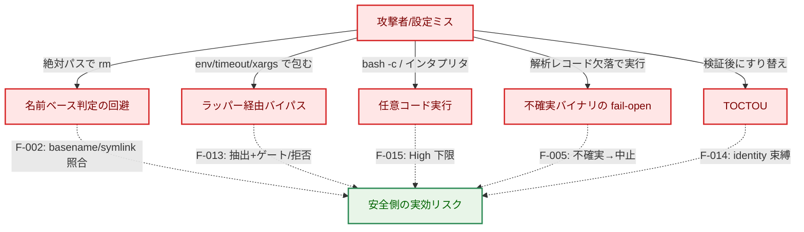

**矢印の意味**: 実線 A → T は「攻撃ベクトル」、点線 T -.-> M は「本設計の対策（緩和）」。

**凡例（Legend）**

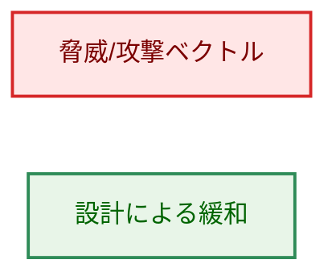

### 5.2 設計上の限界（明示）

- **ブロックリスト方式**: リスク判定で危険シグナルに該当しない **未知の通常コマンド** は Low 通過し得る。**allowlist（`cmd_allowed`）＋ハッシュ固定（`verify_files`）の併用が前提**（AC-66/67）。ただし、**別の成果物を実行・ロードし得る間接実行形態と認識できた**場合は別扱いで、F-013 の一般原則により安全側に倒す（抽出・identity 束縛が不能なら Low 通過させず拒否＝fail-safe。AC-84）。Low 通過の残存リスクは「runner が間接実行形態として認識すらできなかった未知ラッパー」に限られ、これは allowlist／ハッシュ固定で backstop する。
- **basename ベースのプロファイル**: ハードリンク/リネームによる名前すり替えには対応しない（symlink は F-012 で解決）。緩和は allowlist＋ハッシュ。
- **シェルインライン文字列**: `bash -c "sudo …"` の文字列内特権昇格は確実に Critical 化できない（不透明）。High 下限＋allowlist が backstop。
- **`find`/`xargs` の子プロセス実行**: helper を exec するのは runner ではなく `find`/`xargs` 自身であり、runner は fexecve の呼び出し主体になれない。よって検証済み identity を exec 時点まで束縛できず、fd 束縛／不変機構で実行できない限り差し替え窓が残る。本設計ではこの形態を fd 束縛不能なら拒否とする（§3.3）。
- **許可ラッパーのインナーコマンド fd 束縛（実装上の残存制約）**: `env`/`timeout` 等の許可ラッパーは runner が **ラッパー自身**を fd 束縛で exec する一方、インナーコマンドはラッパープロセスが PATH で解決・exec するため、インナーの実体は fd 束縛されない（インナーは名前ベースのゲートを PR-3 で受ける）。これは `find`/`xargs` と同列の残存制約であり、現行 main と同一の TOCTOU 特性（退行ではない）。インナーを runner が直接 exec し直す実行モデルでの fd 束縛は将来対応とする。
- **検証済み fd を伴わない実行（test/縮退時）**: executor は plan に検証済み fd が無い場合、解決済みパスを **再解決せずに** そのまま exec する（pre-Phase-2 と同一挙動）。production の許可 plan は評価器が必ず fd を開く（open 失敗は deny）ため本経路に到達せず、identity ゲートが未検証バイナリを許可 plan に到達させない。よって本経路は production の TOCTOU 保証を弱めない（テスト・検証無効構成向けの縮退経路）。
- **`output_file` 書き込み先**: リスク判定対象外（スコープ外、限界として明記）。
- **root 実行向け判定系との関係**: root 向けの危険判定（部分一致方式）と通常の実行時リスク判定（完全一致方式）は別系統である。適用パスと優先順位は §6.1 の次元優先順位表および AC-29 を参照（本タスクで両系統は統合しない。AC-67）。

### 5.3 既存セキュリティ方針との関係

- **タスク 0135（coreutils 単一バイナリ分類）の保持**: 本設計は coreutils 分類がバイナリ解析より優先する 0135 の方針を **保持・明文化** する（例外ではない）。`echo` 等の安全サブコマンドは共有バイナリの解析シグナルによらず Low（ハッシュ検証は必要）。整合テストは `risk/coreutils_consistency_test.go` で継続検証する。
- **ファイル整合性検証（`docs/dev/architecture_design/security-architecture.md`）**: バイナリ解析次元の抑制（coreutils）と **ハッシュ検証は別次元** であり、ハッシュ検証は常に必要（F-014/AC-65）。

#### 既存アーキ文書ポリシーへの例外（02 設計レビューの C-1）

> 注: ここでの `C-1` は **02 アーキテクチャレビュー**での指摘 ID であり、01 要件定義書 F-013 が参照する「C-1（間接実行バイパス）」とは別系列の ID（レビュー指摘 ID は文書ごとに独立）。

本設計は全社的アーキ文書 `docs/dev/architecture_design/security-architecture.md` の 2 つの記述を更新する。要件プロセスに従い、(1) 元ポリシーと所在、(2) 例外の理由、(3) 旧挙動を主張する既存テストを明記する。

1. **「Graceful degradation when security features are unavailable」（`security-architecture.md` の Fail-Safe Design 節、`:1039`）の反転**
   - (1) 元ポリシー: セキュリティ機能が利用不能な場合に graceful degradation（機能縮退して継続）する、という方針。
   - (2) 例外の理由: F-005/AC-51 により、バイナリ解析（＝ファイル検証）が無効な構成では **常時実行拒否**（degradation でなく fail-closed）とする。バイナリの素性を確認できない状態での実行を許さないため。dry-run は引き続き可能。`security-architecture.md` の当該記述を「解析/検証が無効な場合は実行を拒否する（dry-run は可）」へ改訂する。
   - (3) 旧挙動を主張するテスト: 解析無効時に Low 通過/実行継続を期待するテストがあれば更新が必要（解析無効関連の検証テスト）。本タスクで該当テストを洗い出し、常時拒否へ更新する。
2. **`EvaluateRisk` のシグネチャ記述（`security-architecture.md` の Risk Assessment Engine 節、`:417`）の更新**
   - (1) 元ポリシー記述: `func (e *StandardEvaluator) EvaluateRisk(cmd *runnertypes.Command) (runnertypes.RiskLevel, error)`。なお、現行コードの引数型は既に `*runnertypes.RuntimeCommand` であり（`security-architecture.md` の記述が旧型 `*runnertypes.Command` のまま陳腐化している）、本タスクでは引数型の差分も含めて当該記述を現行・目標状態に合わせて更新する。
   - (2) 理由: F-001/F-003/F-005/F-014 により戻り値を **`VerifiedCommandPlan`**（検証済み argv/env/identity＋`RiskAssessment` を内包）へ拡張する（§1.3 の中核契約。executor が identity 束縛を強制できるよう、`RiskAssessment` 単独返却にはしない）。当該コード片を変更後シグネチャへ更新する。
   - (3) 旧シグネチャに依存する記述・図は本文書 §3.2 の目標状態に合わせて更新する。

- **意図的な振る舞い変更（移行影響）**: `claude` 等 Medium→High、`systemctl` 変更系 Low→High、`service` 全アクション High、インタプリタ/ビルド/パッケージスクリプトランナー High、`risk_level="unknown"` 設定エラー化。これらは AC-19 の移行ノートに記載する。**これらの値を前提とする既存テスト**（`risk/evaluator_test.go` の basename 期待値、`security/command_analysis_test.go`、`runnertypes/config_test.go`、`security/coreutils_test.go`、`security/network_analyzer_test.go`）は更新が必要。

## 6. 処理フロー詳細

### 6.1 リスク分類の流れ（F-001 最大値・F-008 単一源泉）

> 本図は処理フロー（処理ステップと判定）を示す。入力データ（`RuntimeCommand`、プロファイル、解析レコード）はシリンダーで §1.2 / §2.1 に示しているため、本フロー図では再掲しない。

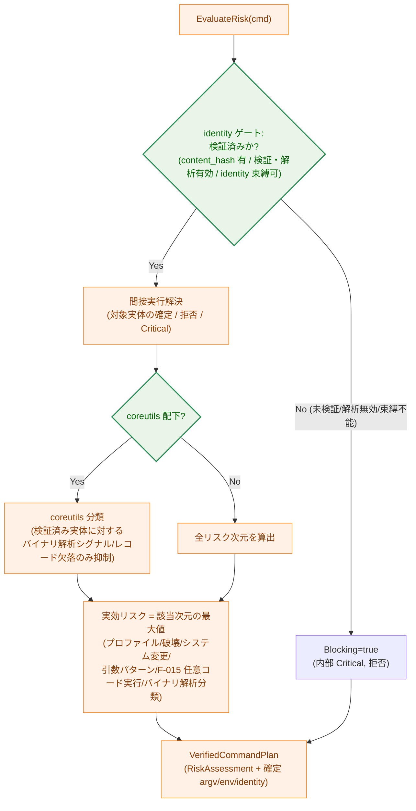

**矢印の意味**: 実線 A → B は処理の流れ、`{ }` は判定。

> **identity ゲートが coreutils 抑制より前にある理由（C-3 対応）**: coreutils 分類が抑制してよいのは「**検証済みバイナリに対する** バイナリ解析シグナル／解析レコード欠落」のみである。ハッシュ未検証・ファイル検証/解析が無効・identity を束縛できない場合は、coreutils 判定に入る **前に** Blocking（拒否）とする。これにより「coreutils 配下だからハッシュ未検証でも Low 通過」という AC-51/65 との衝突を防ぐ。

#### リスク次元の評価優先順位（H-5 対応）

実効リスクは下表の各次元の最大値だが、**ゲート（拒否）系は最大値計算より前段で短絡** する。優先順位（上が先）:

| 順位 | 次元 / ゲート | 効果 |
|------|-------------|------|
| 1 | identity ゲート（検証済み・解析有効・束縛可） | 不成立なら即 Blocking（拒否） |
| 2 | 間接実行の拒否（抽出不能/identity 保持不能/禁止 env 等） | 該当なら拒否 |
| 3 | 特権昇格（`sudo`/`su`/`doas`、トークン検出含む） | Critical（常に拒否） |
| 4 | coreutils 分類（検証済み実体に対するバイナリ解析抑制） | Low/Medium/High（バイナリ解析次元を除外して算出） |
| 5 | プロファイル要因（引数評価後の SystemModRisk 等を含む最大値） | 該当レベルを最大値へ |
| 6 | 危険引数パターン（`rm -rf`/`chmod 777` 等） | 該当レベルを最大値へ |
| 7 | 任意コード実行ランナー（F-015: シェル/インタプリタ `bash`/`python`/`node`、ビルド/タスクランナー `make`/`npm run`/`npx` 等） | 引数によらず **High** を最大値へ（AC-73/74/85） |
| 8 | バイナリ解析分類（Clean/Network/HighRisk、Uncertain は Blocking） | 該当レベルを最大値へ |

順位 4〜8 は「該当次元の最大値」を取る（順序非依存、F-001）。順位 1〜3 は拒否を短絡させるゲートである。順位 7（F-015）は、プロファイルやバイナリ解析の High シグナルに該当しないコマンド（例: `make`/`python` がプロファイル未登録の場合）でも、名前により High を確実に最大値へ持ち込むための独立次元である。

**凡例（Legend）**

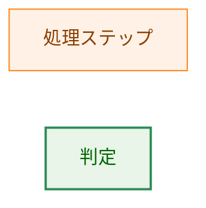

### 6.2 ゲートと監査（F-003/AC-11/56/70）

リスク比較ゲートは `effectiveRisk > maxAllowed`（または `Blocking=true`）で拒否する。監査エントリ（`command_risk_profile`）は、`resolved_path`・`content_hash`・解析レコード識別・`max_allowed_risk`・`decision`（allow/deny）・`reason_codes`、および人間可読な根拠 `risk_factors`（= `RiskAssessment.Reasons`、AC-12）を含み、間接実行連鎖では評価・実行・ロードされた全成果物の identity/hash を相関可能にする。deny イベントは decision に基づく重大度下限（Warn 以上）を適用し、リスクレベル対応のログレベル（AC-13）に埋もれないようにする。引数の機密はマスキング（AC-57、既存 redaction 機構と整合）。

## 7. テスト戦略

- **ユニットテスト**: 各 AC に最低 1 つの検証。とくに (a) 絶対パス入力（AC-06/07/08/44）、(b) 全次元最大値・順序非依存（AC-63）、(c) バイナリ解析 4 区分の網羅（AC-45）と reason code 網羅（AC-69）、(d) coreutils 優先（AC-72）・未知サブコマンド High（AC-68）、(e) `ParseRiskLevel("unknown")` エラー（AC-24）。
- **バイパス系（攻撃者視点）テスト**（AC-71）: ラッパー（`env sudo`/`env rm`/`env PATH=`/`env LD_PRELOAD=`/`env -S`）、シェル `-c`、find `-exec`/`-execdir`、shebang、`rsync -e`/`tar --to-command`、ld-linux。正常系直接呼び出しだけで終えない。
- **整合性テスト**: 実行時と dry-run の実効リスク一致（AC-20/39）。既存 `risk/coreutils_consistency_test.go` を維持・拡張。
- **監査テスト**: deny 時の出力・相関フィールド・重大度下限・連鎖カバレッジ（AC-11/56/70）。
- **後方互換テスト**: basename 入力の検出維持（AC-10）。
- **品質ゲート**: `make fmt` / `make test` / `make lint`（AC-21）。

トレーサビリティ（各 AC ↔ テスト）は `03_implementation_plan.md` の「Acceptance Criteria Verification」で対応付ける。

## 8. 実装優先順位（フェーズ）

各フェーズは **縦切り（評価＋ゲート＋監査が各段で破綻なく揃う）** とし、危険な中間状態（評価は強化されたが実行束縛が未配線で identity 保証がない、等）を作らない（M-10 対応）。

1. **フェーズ 1 — 評価コア＋拒否ゲート**: `RiskAssessment`/`VerifiedCommandPlan` 導入、`EvaluateRisk` の最大値化、identity ゲート、`NetworkAnalyzer` 分類化、不確実→Blocking、coreutils 優先、`ParseRiskLevel` の `"unknown"` 設定値拒否。**normal の拒否（deny）が機能し監査される所まで**を 1 段に含める。F-001/F-002/F-005/F-007/F-008/F-011。
2. **フェーズ 2 — 実行束縛＋間接実行**: `indirect_execution.go`、`VerifiedCommandPlan` の executor 契約（fd ベース実行/フォールバック）、ラッパー/シェル/ローダ/find-exec/shebang/オプションのゲート・identity 束縛・拒否。F-013/F-014/F-015。
3. **フェーズ 3 — dry-run preview＋監査拡張**: `LogRiskProfile` 拡張・`NormalResourceManager`/`dryrun_manager` 配線・deny 重大度・dry-run の allow/deny preview（read-only 解析）・検証不能 deny の運用区別。F-003/F-006/F-009。
4. **フェーズ 4 — ドキュメント**: 開発者/ユーザー向け文書整合、移行ノート、`security-architecture.md` の更新（§5.3 の例外）。F-004/F-010、AC-19。`command-risk-evaluation.{ja,md}` は PR #724 マージ後に反映（付録参照）。

**外部リリース可否ゲート**: 少なくとも「**normal の deny ＋ 監査出力 ＋ dry-run の preview**」が揃う（フェーズ 1〜3 完了）までは外部リリース不可とする。各フェーズで `make fmt`/`make test`/`make lint` を通す。

## 9. 将来の拡張性

- **間接実行ベクトルの追加**: 一般原則（全成果物のゲート＋identity 束縛、不能なら拒否）に基づき、新規ラッパー/オプション/ローダ形態は最小限の追加で対応可能。網羅列挙には依存しない。
- **リスク次元の追加**: `CommandRiskProfile` に新 `RiskFactor` を追加すれば最大値計算に自動的に寄与する。
- **解析バックエンドの拡張**: `BinaryAnalysisClass` 分類を保てば解析手法（ELF/Mach-O 等）の追加は評価コアに影響しない。

## 付録: 決定履歴（要約）

設計判断の経緯（不確実ケースの Critical 化、F-011 採用、coreutils 優先の明文化、間接実行の一般原則化、解析無効の常時拒否、`service` の High 化、静的バイナリの正しい理解 等）は `01_requirements.md` の Document Status コメントおよび PR #725 のレビュー履歴に記録がある。本文は現行設計の状態を記述し、本付録と git 履歴に経緯を限定する。
