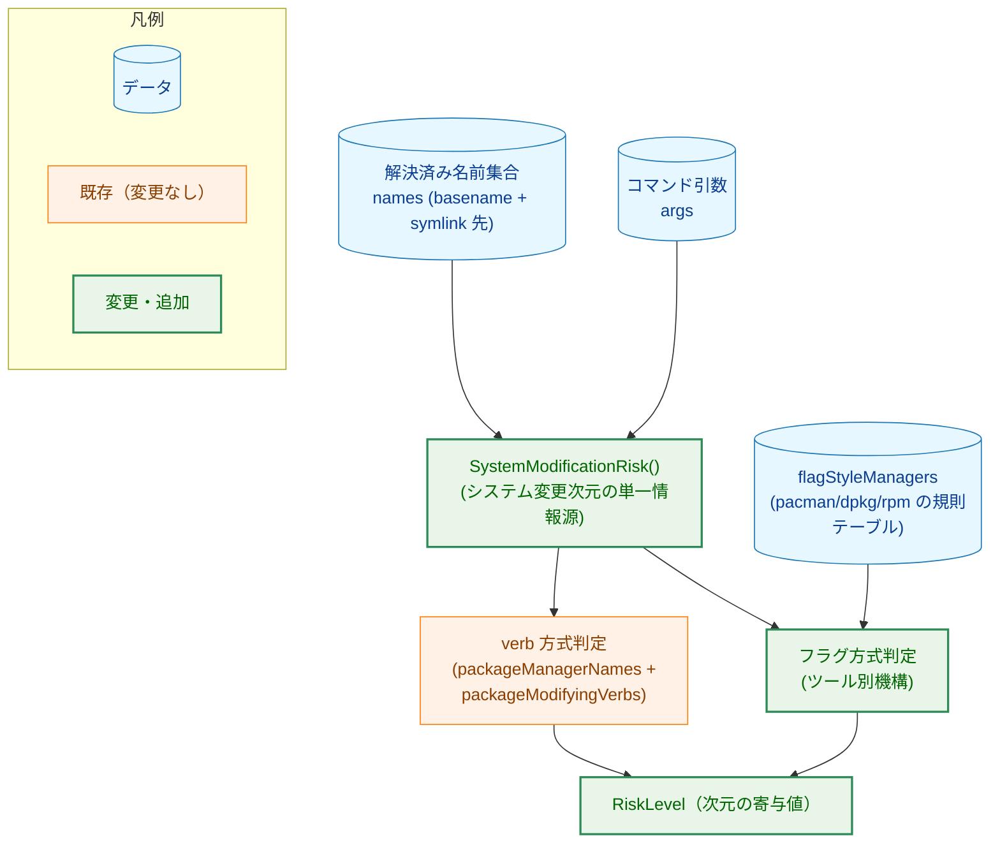
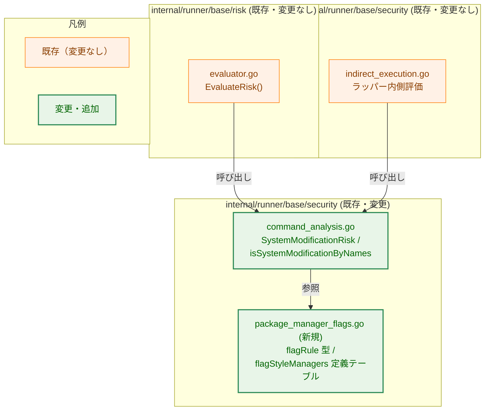
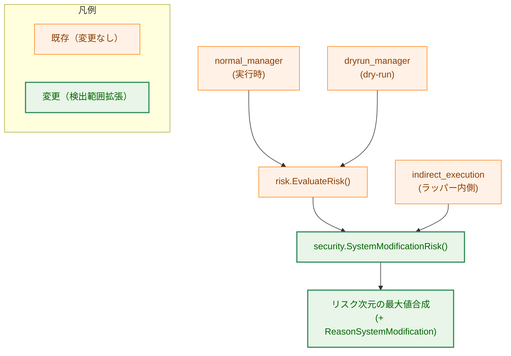
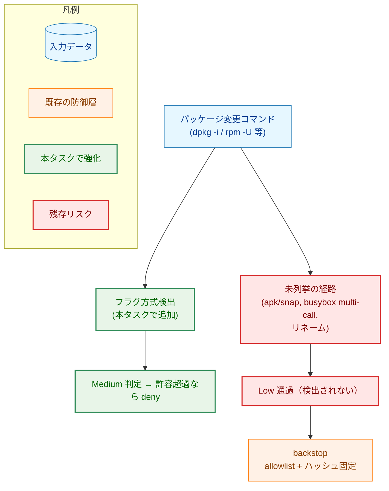
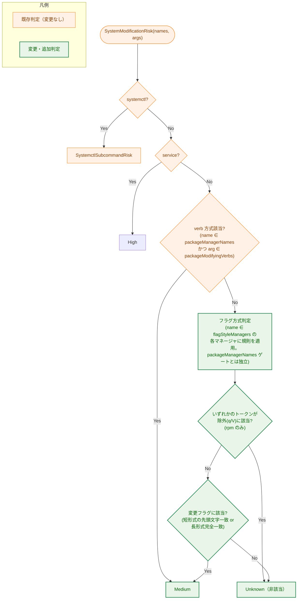

# パッケージマネージャのシステム変更検出の一般化（dpkg/rpm フラグ方式対応） — アーキテクチャ設計書

## Document Status

| Item | Value |
|---|---|
| Status | `approved` |
| Created | 2026-06-18 |
| Review date | 2026-06-18 |
| Reviewer | isseis |
| Comments | - |

関連文書: [01_requirements.md](01_requirements.md) / [00_notes.md](00_notes.md)

---

## 1. 設計の全体像

### 1.1 設計原則

- **データ駆動のツール別機構**: フラグ方式マネージャの「識別情報」と「検出規則」を 1 つの定義
  テーブルに集約する。判定本体にマネージャ名固有の分岐（現行の `isPacman`）を残さない（AC-10）。
- **単一の情報源（single source）**: システム変更判定は引き続き `SystemModificationRisk` 1 か所に
  集約する。実行時（normal）と dry-run は同一の top-level `EvaluateRisk` を共有するため、検出を追加
  するだけで両経路に一貫して反映される（AC-13 / NF-002）。ラッパー内側（RoleInner）の間接実行は
  0136 で確立した flat High floor に倒れる（sysmod を経由しないが結果は High ≥ Medium）ため、
  ラッパー経由の dpkg/rpm も AC-18 を満たす。
- **振る舞いを変えないリファクタの先行**: ツール別機構への置換（F-003）は pacman の既存挙動を
  保ったまま行い、その上に dpkg/rpm をデータとして追加する（NF-005）。
- **fail-safe を基本とし、rpm の照会のみ最小権限を優先**: フラグの先頭文字一致判定は安全側
  （過検出許容）を基本とするが、rpm の照会・検証操作（`-q`/`-V`）は最小権限のため非検出とする（F-002）。
- **既存責務の再利用（DRY）**: シンボリックリンク解決済みの名前集合（`names`）・リスク次元の最大値
  合成・監査ログ・reason code はすべて 0136 で確立済みの仕組みをそのまま使う。新規に作らない。

### 1.2 なぜ既存方式（pacman 固有実装）の単純拡張ではないのか（YAGNI 確認）

現行は pacman 専用関数 `isPacmanModifyingFlag` と判定本体の `isPacman` 分岐で実装されている。
dpkg/rpm を同方式で足すと、本体に `isDpkg`/`isRpm` 分岐と専用関数が増え、要件 AC-10（マネージャ名
固有の分岐を残さない）と NF-003（追加はデータ追加で完結）を満たせない。要件が「ツール別機構への
凝集」を明示的に求めるため、データ駆動テーブルを採用する。これは過剰設計ではなく、要件が要求する
最小の構造である（pacman/dpkg/rpm の 3 種を統一的に表現するために必要十分）。

### 1.3 概念モデル



> 矢印 A → B は「A を入力として B が処理・参照する」ことを表す。`SystemModificationRisk` は
> verb 方式（既存）とフラグ方式（ツール別機構へ刷新）の双方を評価し、該当すれば Medium を返す。
> `flagStyleManagers` は pacman/dpkg/rpm の検出規則を保持するデータテーブル。

---

## 2. システム構成

### 2.1 コンポーネント配置（パッケージ構造）

新規パッケージは導入しない。変更は `internal/runner/base/security` パッケージ内に閉じる。



> 矢印 A → B は「A が B を呼び出す／参照する」ことを表す。`evaluator.go` と
> `indirect_execution.go` が `SystemModificationRisk` を呼ぶ関係は**現行コードに既に存在する**
> （0136 で確立）。本タスクはその内部実装（`command_analysis.go` と新規
> `package_manager_flags.go`）のみを変更し、呼び出し側は変更しない。

### 2.2 データフロー（検出経路の共有）

実行時・dry-run・間接実行はいずれも同一の `SystemModificationRisk` に合流する。



> 矢印 A → B は「A が B を呼ぶ」ことを表す。normal/dry-run が同一 `EvaluateRisk` を共有する点と、
> 間接実行の内側評価が `SystemModificationRisk` を呼ぶ点は**現行コードの既存関係**であり、本タスクで
> 追加するものではない。検出範囲の拡張（dpkg/rpm）は top-level の `SystemModificationRisk` 内部に
> 閉じるため、normal/dry-run 両経路（AC-13）に自動的に波及する。間接実行の内側評価が
> `SystemModificationRisk` を呼ぶのは RoleInterpreter 経路で、**ラッパー内側（RoleInner）はその手前で
> 0136 の flat High floor に倒れる**（sysmod 非経由でも High ≥ Medium のため AC-18 を満たす）。

---

## 3. コンポーネント設計

### 3.1 ツール別検出規則の型（新規）

`package_manager_flags.go` に、フラグ方式マネージャ 1 種の検出規則を表す型と、その定義テーブルを置く。
HOW（文字集合・走査方法）は本節で確定する（要件 §4 冒頭の委譲事項）。

```go
// flagRule describes how one flag-style package manager selects a modifying
// operation from its option flags. All character matching is case-sensitive.
type flagRule struct {
    // modifyingShortChars: for a short-option token (-X, not --X), if its FIRST
    // character (immediately after the single dash) is one of these, the token
    // marks a modifying operation (pacman "SRU", dpkg "irP", rpm "iUFe"). The
    // mode selector is always the first short-option character in these tools, so
    // first-character matching avoids false positives from concatenated argument
    // values or single-dash long forms (see the rules below).
    modifyingShortChars string

    // modifyingLongForms: exact-match long options that are modifying
    // (e.g. "--install", "--purge", "--reinstall"). Matched whole-token.
    modifyingLongForms map[string]struct{}

    // excludeShortChars / excludeLongForms: if ANY token in args carries one of
    // these query/verify markers, the command is treated as non-modifying
    // regardless of modifying flags (rpm: short "qV", long "--query"/"--verify";
    // empty for pacman/dpkg). This encodes the least-privilege exception (F-002).
    excludeShortChars string
    excludeLongForms  map[string]struct{}
}

// flagStyleManagers maps a manager basename to its detection rule. It is a
// package-level map literal populated with one entry per flag-style manager
// (values listed in the table below). Adding a new flag-style manager = adding
// one entry here (AC-10 / NF-003).
var flagStyleManagers = map[string]flagRule{
    "pacman": { /* SRU / --sync,--remove,--upgrade / no exclude */ },
    "dpkg":   { /* irP / --install,--remove,--purge,--unpack,--configure / no exclude */ },
    "rpm":    { /* iUFe / --install,…,--reinstall,--import,… / exclude qV,--query,--verify */ },
}
```

判定の振る舞い（要件 AC を満たす規則）:

- **除外の優先（rpm のみ）**: `args` の**いずれかのトークン**が `excludeShortChars`/`excludeLongForms`
  に該当する場合、そのマネージャは非該当（Unknown 寄与なし）。これにより `rpm -qi`・`rpm -q -i`・
  `rpm -V` 等を非検出にする（AC-06 / AC-07）。
- **長形式は完全一致**: `--` で始まるトークンは `modifyingLongForms` との完全一致でのみ該当。
  照会用長形式（dpkg `--info`、rpm `--eval`/`--querytags` 等）を誤検出しない（AC-02 / AC-06）。
- **短形式は先頭文字一致（大小区別）**: `-` で始まり `--` でないトークンは、`-` の直後の
  **1 文字目**が `modifyingShortChars` に一致すれば該当（`-i`≠`-I` を厳密に区別。AC-03 / NF-001）。
  これら 3 ツールでは変更モード文字が常に先頭に来る（`pacman -Syu`／`rpm -ivh`／`dpkg -i`）ため、
  **引数連結オプション**（`rpm -E%{_libdir}`、`dpkg -D<level>` 等。先頭は `E`/`D` で非該当）や
  **単一ダッシュ長形式**（`dpkg -list`／`-search`。先頭は `l`/`s` で非該当）の途中文字に誤反応しない。
  なお非慣用・無効な並び（モード文字が先頭でない例 `rpm -hiv`、`pacman -yS`）は検出されないが、
  これは有効な使用には現れず、allowlist+ハッシュ固定の backstop で別途担保される（AC-66/67）。
- **退化トークンの扱い（実装上の防御）**: 単独の `-`（直後に文字がない）や単独の `--`、空文字列トークンは
  変更フラグにも除外フラグにも該当しない（非該当）。実装は 1 文字目を参照する前に長さを検査し
  （現行 `isPacmanModifyingFlag` の `len(arg) > 1` ガードを踏襲）、範囲外参照・パニックを起こさない。
- 上記いずれにも該当しなければそのマネージャは非該当。

各マネージャの規則値:

| マネージャ | modifyingShortChars | modifyingLongForms（完全一致） | exclude（照会/検証） |
|---|---|---|---|
| pacman | `SRU` | `--sync` / `--remove` / `--upgrade` | なし |
| dpkg | `irP` | `--install` / `--remove` / `--purge` / `--unpack` / `--configure` | なし |
| rpm | `iUFe` | `--install` / `--upgrade` / `--freshen` / `--erase` / `--reinstall` / `--import` / `--initdb` / `--rebuilddb` | short `qV`、long `--query` / `--verify` |

> 補足 1（pacman）: 短形式 `SRU` は現行 `isPacmanModifyingFlag` の文字集合をそのまま移送する。
> pacman の操作フラグ（`-S`/`-R`/`-U`）は常に先頭に来るため、先頭文字一致でも有効な使用の結果は
> 不変であり、`pacman -Ss`/`-Si`（先頭が `S`）を変更操作として検出する既存の過検出もそのまま
> 保持される。現行実装は any-char（`ContainsAny`）だが本タスクで先頭文字一致へ統一する。これにより
> 非慣用・無効な並び（例 `-yS`）では結果が変わり得るが、有効な pacman 使用に影響しないため許容する
> （AC-09 の範囲緩和。承認済み。01 §AC-09 参照）。
>
> 補足 2（dpkg の先頭文字一致の妥当性）: dpkg はモード選択を**単一の短オプションの先頭文字で行う**
> （`-i`/`-r`/`-P`）。照会用短オプション（`-l`/`-L`/`-s`/`-S`/`-p`/`-I`/`-c`）の先頭は `irP` に
> 非該当（大文字小文字を厳密に区別。`-I` は大文字で `i` と別）。先頭文字一致により、引数連結
> オプション（`-D<level>` 等）や単一ダッシュ長形式（`-list`/`-search`）の途中文字も誤検出しない。

### 3.2 既存判定関数の変更

| 関数 | 変更内容 |
|---|---|
| `isSystemModificationByNames(names, args)` | pacman 専用分岐（`_, isPacman := names["pacman"]` と `isPacmanModifyingFlag` 呼び出し）を削除し、`names` に含まれるフラグ方式マネージャを `flagStyleManagers` から引いて規則を適用する汎用ループに置換。**ゲートの分離が要点**: verb 方式判定は従来どおり `packageManagerNames` 所属で発火するが、フラグ方式判定は `flagStyleManagers` 所属で**独立に**発火する。dpkg/rpm は `packageManagerNames` に**追加しない**（追加すると verb スキャンも無駄に走るため）。これにより `packageManagerNames` に無い dpkg/rpm もフラグ方式ループに到達する。pacman は両集合に属し両スキャンを通るが、verb スキャンは `-S` 等に何も一致せず無害。 |
| `isPacmanModifyingFlag(arg)` | **削除**。規則は `flagStyleManagers["pacman"]` のデータへ移送。 |
| `SystemModificationRisk(names, args)` | シグネチャ・戻り値（`runnertypes.RiskLevel`）不変。内部で上記 `isSystemModificationByNames` を呼ぶ点も不変。 |

`SystemModificationRisk` のシグネチャ（現行のまま・変更なし）:

```go
// SystemModificationRisk derives the system-modification risk for a command from
// its resolved name set. Single source for the dimension, shared by the
// top-level evaluator and the wrapped-inner indirect-execution path.
func SystemModificationRisk(names map[string]struct{}, args []string) runnertypes.RiskLevel
```

### 3.3 コンポーネント責務一覧（新規・変更ファイル）

| ファイル | 区分 | 責務・変更内容 | 関連 AC | 更新が必要な既存テスト |
|---|---|---|---|---|
| `internal/runner/base/security/package_manager_flags.go` | 新規 | `flagRule` 型と `flagStyleManagers` 定義テーブル。フラグ方式の検出規則を 1 か所に集約。 | F-003 / AC-10 / NF-003 | （新規） |
| `internal/runner/base/security/command_analysis.go` | 変更 | `isSystemModificationByNames` を汎用ループへ置換。`isPacmanModifyingFlag` を削除。 | F-001 / F-002 / F-003 | `command_analysis_test.go` |
| `internal/runner/base/security/package_manager_flags_test.go` | 新規 | ツール別規則の単体テスト（dpkg/rpm/pacman の肯定・否定・境界）。 | AC-01〜AC-09 / NF-001 | （新規） |
| `internal/runner/base/security/command_analysis_test.go` | 変更 | `TestIsSystemModification_PackageManagerVerbs`（pacman ケースは退行検証として維持）・`TestIsSystemModification` に dpkg/rpm ケースを追加。 | AC-01〜AC-11 | 同左（拡張） |
| `internal/runner/base/risk/evaluator_test.go` | 変更 | dpkg/rpm の top-level 実効リスク（Medium。AC-12）と監査 reason code（AC-19）の検証を追加。最大値合成の不変条件は既存 `TestEvaluateRisk_MaxOfDimensionsOrderIndependent` を参照。 | AC-12 / AC-19 | 同左（拡張） |
| `internal/runner/base/security/indirect_execution_test.go` | 変更 | ラッパー/sudo 経由の dpkg/rpm 複合（`env dpkg -i`=High、`sudo rpm -U`=Critical。いずれも ≥ Medium で Medium が支配しない）の検証を追加。 | AC-14 / AC-18 | 同左（拡張） |
| `internal/runner/base/risk/package_manager_consistency_test.go` | 新規 | 同一 dpkg/rpm コマンド集合で実行時/dry-run が同一実効リスクを返すことを共有評価器で固定（`coreutils_consistency_test.go` と同方式）。 | AC-13 | （新規） |

ドキュメント変更（F-005。`docs/tasks/` 配下のスナップショットは対象外）:

| ファイル | 区分 | 変更内容 | 関連 AC |
|---|---|---|---|
| `docs/user/risk_assessment.ja.md` / `.md` | 変更 | §3.1 表に dpkg/rpm のフラグ方式変更操作を `medium` として追加。§8 移行ノートに破壊的変更（旧 `low`/未指定→Medium ブロック）・回避策・dry-run 確認を追記。§3.1 注記/§7 に検出限界（ラッパー込み・未列挙/multi-call/リネームは対象外）を追記。 | AC-16 / AC-20 / AC-21 |
| `docs/dev/architecture_design/command-risk-evaluation.ja.md` / `.md` | 変更 | 「システム変更リスク」節にフラグ方式（pacman/dpkg/rpm）検出と rpm 照会/検証除外規則を追記。 | AC-17 |
| `docs/translation_glossary.md` | 変更 | 新規用語（フラグ方式/verb 方式/照会/検証/システム変更/ツール別機構）の対訳を追加。 | AC-22 |

> 注 1: AC-15（0136 AC-34 の方針上書きの明記）は [01_requirements.md](01_requirements.md) §1.2 で既に満たされており、
> 本タスクで新たに変更するファイルではない（static 検証は 01 を対象とする）。
> 注 2: AC-04 / AC-08（絶対パス・symlink エイリアスでの検出）は、判定が 0136 で確立済みの解決済み名前集合
> `names`（basename + symlink 先を含む）に対して行われる既存仕組みをそのまま使うため、フラグ方式の新規規則
> でも自動的に成立する。新規ロジックは追加しない。
> 注 3: `command_analysis_test.go` の既存ヘルパ `isSystemModification(cmd, args)`（`isSystemModificationByNames`
> を呼ぶ）と `TestIsSystemModification_PackageManagerVerbs` の pacman ケース、`TestIsSystemModification` の
> crontab/mount 等のケースは、リファクタ後も同じ結果を返さなければならない（F-003 の振る舞い不変・回帰防止）。

---

## 4. エラーハンドリング設計

本タスクは分類（リスクレベル算出）のみを行い、新規のエラー型・エラー経路を導入しない。

- `SystemModificationRisk` はエラーを返さない純粋関数（戻り値は `runnertypes.RiskLevel` のみ）。判定不能・
  非該当は `RiskLevelUnknown` で表現し、上位の最大値合成に委ねる（既存仕様）。
- 不正な引数（未知フラグ・想定外トークン）は fail-safe 方針に従い「非該当（Unknown）」または「過検出
  （Medium）」のいずれかになり、例外やパニックを発生させない。
- 検出結果が許容リスクを超えた場合の deny・監査・終了コードは、0136 で確立した評価器／リソースマネージャ
  の既存経路（`EvaluateRisk` → 最大値合成 → `deny`／監査）がそのまま担う。本タスクで追加しない。

---

## 5. セキュリティ考慮事項

### 5.1 副作用コントラクト

本機能は**リスク分類のみ**を行い、ファイル書き込み・削除・ネットワーク送信などの外部副作用を一切
持たない。モード別の副作用差は以下のとおり（いずれも分類ロジックは同一）:

| モード | コマンド実行 | リスク分類 | 本タスクで変わる観測可能な点 |
|---|---|---|---|
| normal（実行時） | 行う（許容内なら） | `EvaluateRisk` 共有 | 新たに Medium 判定される dpkg/rpm が、許容上限 `low`/未指定では deny される |
| dry-run | **行わない**（副作用抑制） | `EvaluateRisk` 共有（同一） | 上記 deny を**事前に予告**できる（移行確認に利用。AC-20） |

> dry-run は「コマンド実行という副作用」のみを抑制し、リスク評価は normal と同一。したがって
> 新規検出は両モードで同じ分類になる（AC-13）。

### 5.2 脅威モデル（0136 から継承・本タスクの位置づけ）



> 矢印 A → B は「A が B へ至る経路」を表す。本タスクはフラグ方式検出を pacman 限定から dpkg/rpm へ
> 広げ、検出層を強化する。一方、未列挙マネージャ・multi-call・リネームは依然 Low 通過し得る（残存
> リスク）。これは 0136 の脅威モデル（ブロックリストは非有界、allowlist+ハッシュ固定が backstop。
> AC-66/67）の枠内であり、ユーザー文書に明記する（AC-21）。

### 5.3 fail-safe と最小権限のバランス（rpm 照会除外の位置づけ）

- 基本方針は fail-safe（過検出＝安全側）。dpkg/pacman は短形式の先頭文字一致で判定し、`pacman -Ss` の
  ような既存の過検出（先頭 `S`）も保持する（AC-09）。
- rpm のみ、照会・検証（`-q`/`-V`）を含むトークンがあれば非検出とする例外を設ける。これは 0136 の
  F-011（読み取り専用サブコマンドを最小権限のため Medium 下限に留める思想）と同方向の判断で、
  `rpm -qi` のような頻出照会を誤って Medium にしないためである。
- 除外を発火させるのは照会・検証の**モード規定フラグ**（`-q`/`-V`/`--query`/`--verify`）のみであり、
  修飾オプション（`--verbose`/`--nodeps`/`--force`）は除外を発火させない。したがって通常の変更操作の
  取りこぼしは生じない（`rpm -e --verbose`・`rpm -e --nodeps` は検出される。AC-05 / NF-001）。
- 例外として、変更モードと照会モードを**同時に明示**した矛盾した呼び出し（例 `rpm -e -q pkg`）は、
  AC-07 の「いずれかのトークンに `-q`/`-V` があれば非該当」規則により**意図的に Unknown（照会優先）**
  となる。これは非標準・矛盾した入力に対する最小権限側への fail-open であり、容認した上で境界テストで
  固定する（§6.2 参照）。「変更操作の取りこぼしを生まない」とは**通常の修飾子併用の範囲での主張**である。

> ポリシー例外の確認: 本設計は 0136/0135 が確立した「`SystemModificationRisk` を単一情報源とする」
> 「全次元の最大値を取る」方針を**保持**しており、他タスクのアーキテクチャ文書が定めた方針に対する
> 例外は導入しない。rpm 照会除外は本タスク要件（F-002）内で完結する fail-safe への意図的な緩和で
> あり、外部ポリシーの上書きではない。

### 5.4 監査追跡性（AC-19）

新規検出は既存の `ReasonSystemModification`（reason code `system_modification`）として最大値合成に
寄与する（`evaluator.go` / `indirect_execution.go` の既存呼び出し箇所）。許容超過時の deny は 0136 の
監査経路（相関フィールド: reason code・decision・解決済みパス等。AC-56）にそのまま記録される。
新たな reason code・監査スキーマ変更は行わない。

---

## 6. 処理フロー詳細

### 6.1 `SystemModificationRisk` 内のフラグ方式判定



> 矢印は制御フロー（判定の遷移）を表す。systemctl/service/verb 方式の判定順は現行を維持。フラグ方式
> 判定のみツール別機構へ刷新する。rpm の除外（q/V）は変更フラグ判定より**先**に評価し、照会・検証を
> 確実に優先する（AC-07）。

### 6.2 例: 主要コマンドの判定結果

| コマンド | 経路 | 結果 | 関連 AC |
|---|---|---|---|
| `dpkg -i pkg.deb` | 短形式の先頭 `i` | Medium | AC-01 |
| `dpkg --configure -a` | フラグ長形式 | Medium | AC-01 |
| `dpkg -l` / `dpkg --info` | 非該当 | Unknown | AC-02 |
| `dpkg -D<level>` / `dpkg -list` | 先頭 `D`/`l` で非該当（連結引数・単一ダッシュ長形式の誤検出回避） | Unknown | AC-02 |
| `rpm -Uvh pkg.rpm` | 短形式の先頭 `U` | Medium | AC-05 |
| `rpm -e --verbose pkg` | 短形式の先頭 `e`（修飾子は無影響） | Medium | AC-05 |
| `rpm -E%{_libdir}` / `rpm -D'...'` | 先頭 `E`/`D` で非該当（マクロ評価・定義の誤検出回避） | Unknown | AC-06 |
| `rpm --import KEY` | フラグ長形式 | Medium | AC-05 |
| `rpm -qi pkg` / `rpm -q -i pkg` | 除外（q を含む） | Unknown | AC-06 / AC-07 |
| `rpm -e -q pkg`（変更+照会の矛盾入力） | 除外優先（最小権限 fail-open） | Unknown | AC-07 |
| `pacman -Syu` | フラグ短形式 `S`/`U` | Medium | AC-09 |
| `pacman -Q` | 非該当 | Unknown | AC-09 |
| `env dpkg -i pkg.deb` | 間接実行（ラッパー内側 RoleInner は flat High floor） | High（≥ Medium） | AC-18 |
| `sudo rpm -U pkg.rpm` | 特権昇格次元が支配 | Critical | AC-14 / AC-18 |

---

## 7. テスト戦略

- **単体（ツール別規則）**: `package_manager_flags_test.go` で dpkg/rpm/pacman の規則を肯定・否定・境界
  （大小区別、長形式完全一致、rpm 除外、修飾子併用）で固定する（AC-01〜AC-09 / NF-001）。
- **回帰（振る舞い不変）**: `command_analysis_test.go` の既存 pacman・verb ケースがリファクタ後も同結果を
  返すことを確認（F-003 / AC-09 / AC-11）。
- **統合（実効リスク・複合・間接）**: `evaluator_test.go` で dpkg/rpm が Medium になること、他次元との
  最大値合成、ラッパー（`env`）・特権（`sudo`）複合を検証（AC-12 / AC-14 / AC-18）。
- **整合（実行時/dry-run）**: 共有評価器の出力固定テスト（`coreutils_consistency_test.go` と同方式）で
  同一コマンド集合の両経路一致を確認（AC-13）。
- **監査**: deny 時に `system_modification` reason code と相関フィールドが記録されることを検証（AC-19）。
- **文書整合（static）**: AC-15〜AC-17・AC-20〜AC-22 は対象ファイルの記述存在・日英整合で確認。

---

## 8. 実装の優先順位（フェーズ）

要件 NF-005（リファクタ先行）に従い、回帰の切り分けのため 2 段階に分ける。

1. **フェーズ 1（振る舞い不変リファクタ）**: `package_manager_flags.go` を新設し、pacman の既存規則を
   テーブルへ移送。`isSystemModificationByNames` を汎用ループへ置換、`isPacmanModifyingFlag` 削除。
   既存テスト（pacman・verb）が**変更なしで緑**であることを確認（F-003 / AC-09〜AC-11）。
2. **フェーズ 2（dpkg/rpm データ追加）**: `flagStyleManagers` に dpkg/rpm エントリを追加。単体・統合・
   整合・監査テストを追加（AC-01〜AC-08 / AC-12〜AC-19）。
3. **フェーズ 3（文書整合）**: ユーザー/開発者文書・用語集を更新（AC-15〜AC-17 / AC-20〜AC-22）。

詳細なステップ・チェックボックスは `03_implementation_plan.md` で管理する。

---

## 9. 将来の拡張性

- **新規フラグ方式マネージャの追加**: `flagStyleManagers` に 1 エントリ追加するだけで対応でき、判定本体の
  変更は不要（NF-003）。verb 方式マネージャの追加も既存の `packageManagerNames`/`packageModifyingVerbs`
  へのデータ追加で完結する。
- **検出範囲の段階的拡大**: スコープ外とした低価値操作（dpkg `--set-selections` 等、rpm `--restore` 等）や
  apk/snap/flatpak/gem 等は、必要が生じれば同じデータ追加方式で取り込める（個別判断は別タスク）。
- **rpm 厳密文法解析（論点 2 (B)）**: 将来 `excludeShortChars`/`excludeLongForms` の表現力で不足する場合、
  規則をモード先頭判定の述語へ拡張する余地がある。現時点では要件上不要（YAGNI）。

---

## 付録: 決定経緯（current-state とは分離）

本文は現行設計を記述する。設計に至る論点（pacman 限定の発端、AC-34 によるスコープ切り出し、判定精度
A/B/C の選択、検出対象マネージャの線引き、レビュー反映の経緯）は [01_requirements.md](01_requirements.md)
§1〜§6 および本タスクのコミット履歴（PR #742）に記録されている。重複を避けるためここでは再掲しない。
