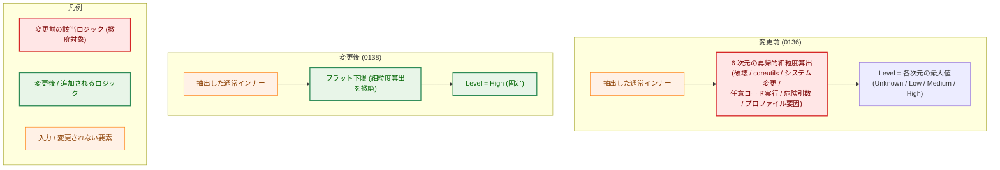
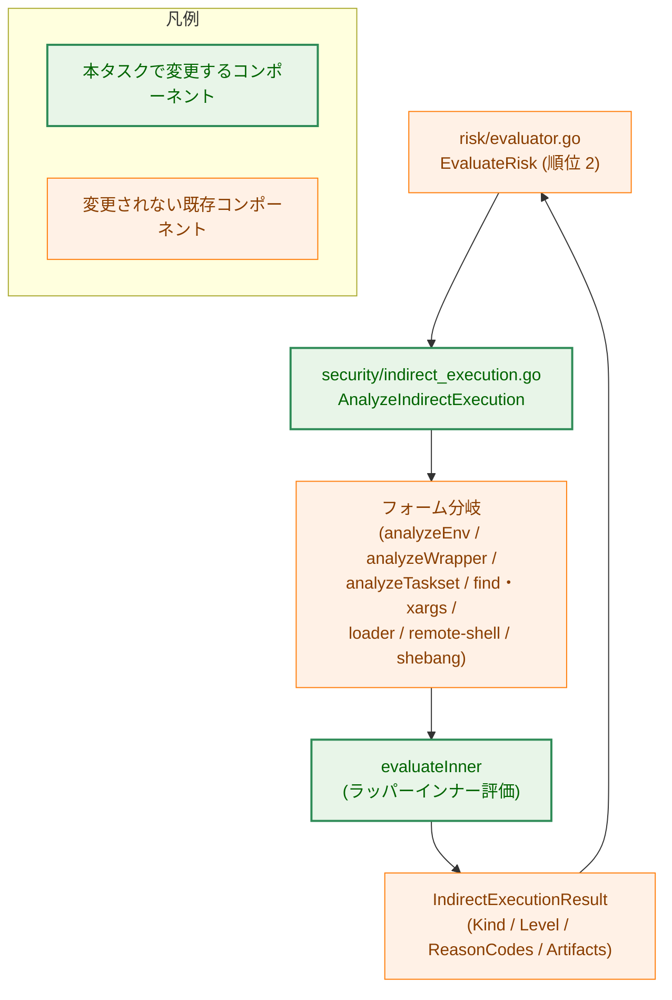
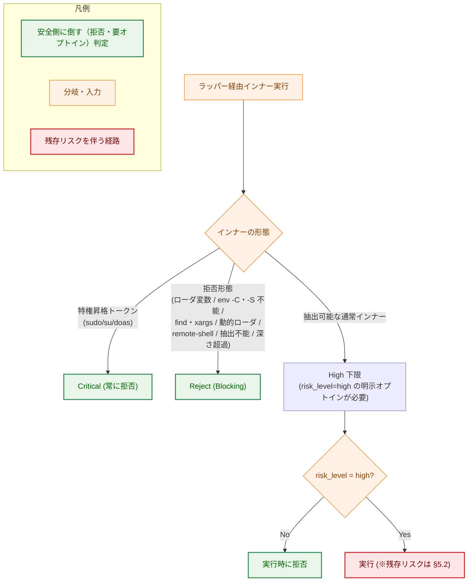
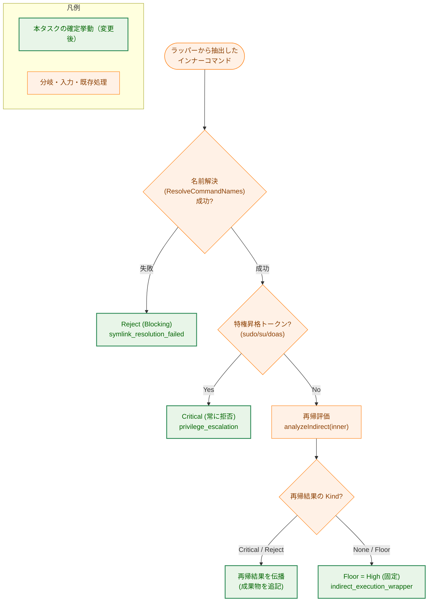

# 間接実行インナーコマンドのリスク一律 High 化 — アーキテクチャ設計書

## Document Status

| Item | Value |
|---|---|
| Status | `approved` |
| Created | 2026-06-17 |
| Review date | 2026-06-17 |
| Reviewer | isseis |
| Comments | - |

## 1. 設計の全体像

### 1.1 設計原則

本タスクは、ラッパー（`env`/`timeout`/`nice` 等）が内部で起動する**インナーコマンド**の実行時リスク扱いを、安全側かつ低コストに確定する。次の原則に従う。

- **Fail-safe・明示的オプトイン**: 抽出可能な通常インナーを伴うラッパー呼び出しは、インナーの内容によらず **一律 High 下限**とする。利用者が明示的に `risk_level = "high"` を設定しない限り実行されない。無害なインナー（`env echo` 等）であっても黙って Low で実行されることをなくす。
- **既存ディスポジションの保持（後退させない）**: 特権昇格（Critical）と拒否（Blocking）の判定は High 化より優先する。「一律 High」はこれらを上書きしない。インナー抽出（外側ラッパーの解析）自体も維持する。
- **YAGNI・複雑性の削減**: タスク 0136 が意図した「runner がラッパーセマンティクスを再実装し、抽出したインナーを自ら fd 束縛 exec する」設計を取り下げる。インナーの自動的なハッシュ検証・identity 束縛・fd 束縛を導入しない。本 runner では環境変数設定・タイムアウトは設定（`env`/`vars`・per-command timeout）で提供済みであり、ラッパー経由でインナーを実行する正統な用途は乏しい。
- **既存方針との整合**: ブロックリスト方式＋ allowlist（`cmd_allowed`）／ハッシュ固定（`verify_files`）の併用というリスク判定の前提（0136 AC-66/67）と整合する。インナーの実体固定が必要な場合は、利用者が `verify_files` に明示登録する（既存機構の延長）。

> **本タスクが変更するロジックは 1 箇所のみ**: 間接実行リゾルバ `indirect_execution.go` における**ラッパーのインナー評価（`evaluateInner`）の細粒度算出**だけを撤廃し、フラット High に置き換える。Critical・各種 Reject・無コマンド時の Medium 下限・インラインコード High・パッケージスクリプトランナー High・`service` High・shebang（直接スクリプト実行）のインタプリタ評価は**いずれも現状のまま保持**する。

### 1.2 概念モデル（変更前 / 変更後）

ラッパーのインナーコマンド評価の出力リスクが、細粒度の最大値から一律 High 下限へ単純化される様子を示す。



> 矢印 `A → B` は「A の出力が B の入力になる（評価の段階）」を表す。`env echo hi` の場合、変更前は coreutils 判定等で下限が Unknown/Low に留まり実質的にリスク下限を寄与しなかったが、変更後は一律 High となり明示的な `risk_level = "high"` なしには実行されない（AC-01）。

### 1.3 なぜ既存方式（0136 の細粒度算出＋保留設計）では不十分か（YAGNI 検討）

- **0136 の保留設計（インナー fd 束縛・ラッパー再実装）**: 各ラッパーのセマンティクスを runner 側へ作り込む大規模かつセキュリティクリティカルな変更であり、攻撃面を増やす（NF-002 に反する）。正統な用途が乏しいため、この複雑性を負担する要件上の根拠がない。よって取り下げる（F-003）。
- **0136 の細粒度算出**: インナーごとに 6 次元を再帰評価しても、インナーは fd 束縛・ハッシュ固定されないため、算出されたレベルの精度に見合うセキュリティ保証（実体の固定）が伴わない。むしろ無害インナー（`env echo`）が Low 通過し得る穴を残す。一律 High 下限＋明示オプトインの方が、より少ないコードで fail-safe を達成する。

## 2. システム構成

### 2.1 全体アーキテクチャ（評価経路における本変更の位置）

`StandardEvaluator.EvaluateRisk` の順位 2（間接実行）で `AnalyzeIndirectExecution` が呼ばれる。本変更はそのリゾルバ内部のラッパーインナー評価のみを変える。評価器・リソースマネージャ側の配線は変更しない。



> 矢印 `A → B` は「A が B を呼び出す／B へ結果を渡す」を表す。本タスクで挙動が変わるのは `evaluateInner`（ラッパーインナー評価）のみで、`EvaluateRisk` の順位 2 での結果（`IndirectExecutionResult`）の取り込み方（Critical→criticalPlan、Reject→Blocking、Floor→最大値へ合流）は変更しない。

### 2.2 コンポーネント配置（パッケージ）

本タスクで新規パッケージ・新規型は導入しない。変更は既存ファイルに閉じる。

- `internal/runner/base/security/indirect_execution.go`: ラッパーインナー評価ロジックと、実行時挙動を誤記したコメントを変更する（唯一のコード変更）。
- ドキュメント（`docs/user/`・`docs/dev/`・0136 タスクドキュメント）を本方式へ整合させる。

### 2.3 データフロー（実行時パス）

実行時パス自体は 0136 から変更しない。`AnalyzeIndirectExecution` は評価段階の判定（`IndirectCritical` / `IndirectReject` / `IndirectFloor`）と連鎖成果物（`Artifacts`）の記録のみを行い、その結果を `EvaluateRisk` が `VerifiedCommandPlan` へ取り込む。外側ラッパーのみが fd 束縛・ハッシュ検証の対象であり、インナーは対象外である点も変更しない（F-002）。

## 3. コンポーネント設計

### 3.1 主要型（既存・構造変更なし）

`IndirectExecutionResult` と `IndirectExecutionKind` は構造変更しない。ラッパーインナー評価が返す値の中身（`Kind` と `Level` の決まり方）のみが変わる。

```go
// 既存型（再掲・変更なし）。ラッパーインナー評価では、Critical/Reject を伝播し、
// それ以外は Kind=IndirectFloor かつ Level=High（固定）を返すようになる。
// Reasons フィールドは、evaluateInnerAs を共有する shebang インタプリタ評価
// （RoleInterpreter。直接スクリプト実行・本タスクではスコープ外で細粒度算出を維持）
// が引き続き profile reason を収集するため残す。ラッパーインナー（RoleInner）経路
// では profile reason を収集しなくなる。
type IndirectExecutionResult struct {
    Kind        IndirectExecutionKind
    Level       runnertypes.RiskLevel
    ReasonCodes []risktypes.ReasonCode
    Reasons     []string
    ErrorClass  risktypes.ErrorClass
    Artifacts   []risktypes.ExecutedArtifact
}
```

- ラッパーインナーの Floor が用いる reason code は、既存の `risktypes.ReasonIndirectExecutionWrapper`（`"indirect_execution_wrapper"`）を再利用する（新規 reason code は追加しない）。
- `Artifacts`（連鎖成果物の Path/Role）は**監査用途として保持**する。ただし 0136 が予定していた「実行層での fd 束縛・ハッシュゲート」は本タスクで取り下げるため（F-002/F-003）、成果物に identity / disposition を付与する後続ステップは存在しない。コード中の「fd 束縛は実行層で配線する」旨のコメントは実態に合わせて修正する（§3.4・AC-08）。

### 3.2 ラッパーインナー評価の挙動契約

`evaluateInner`（ラッパー経由インナー、すなわち `RoleInner`）の挙動を次のとおり確定する。

| 段階 | 処理 | 変更 | 関連 AC |
|------|------|------|---------|
| 1. 名前解決 | インナーの symlink 連鎖を strict 解決（`ResolveCommandNames`）。失敗は fail-closed で Reject（`ErrorClassSymlinkResolution`） | 維持 | AC-03/AC-06 |
| 2. 特権判定 | 解決名が特権昇格トークン（`sudo`/`su`/`doas`）なら Critical | 維持 | AC-02 |
| 3. 再帰 | `analyzeIndirect(inner, ...)` を再帰呼び出し。ネストしたラッパー内側の Critical / Reject を伝播（成果物を追記） | 維持 | AC-02/AC-03 |
| 4. 下限の確定 | 上記で Critical/Reject にならなければ、**6 次元の細粒度算出を行わず一律 `Level = High` の Floor を返す** | **変更** | AC-01 |

- **撤廃する細粒度算出（段階 4 の旧処理）**: `IsDestructiveFileOperation` / `CoreutilsCommandRisk` / `SystemModificationRisk` / `IsArbitraryCodeExecutionRunner` / `CheckDangerousArgPatterns` / プロファイル要因（`ResolveProfile`＋`ProfileFactorRisk`）のインナーへの適用。これに伴い、インナー由来の human-readable reason（プロファイル理由）の収集も行わなくなる。
- **インナー coreutils 分類失敗の Reject の取り扱い（fail-closed 分岐の吸収）**: 現状の `evaluateInner` は、インナーが coreutils ディレクトリ配下のときに `CoreutilsCommandRisk` の setuid 判定用 stat が失敗すると、fail-closed で Reject（`ReasonCoreutilsClassification`／`ErrorClassCoreutilsFileInfo`）を返す。細粒度算出の撤廃に伴いこの Reject 分岐は消え、当該ケースは一律 High に吸収される。これは後退ではない: (i) High は明示オプトイン（`risk_level = "high"`）なしには実行されず、(ii) 外側ラッパーバイナリ自体のハッシュ検証・identity ゲート（順位 1）は引き続き作用する。インナーの実体は元々 fd 束縛されない（§5.2）ため、インナー stat 失敗を個別に Reject する追加保証は本方式の前提に対して意味を持たない。
- **再帰の意義（段階 3 を維持する理由）**: ネスト（`env timeout sudo ls` の `sudo`、`env timeout env -C /tmp ls` の `env -C`）の Critical/Reject を検出するために必要であり、AC-02/AC-03 の「ネストしたラッパーの内側を含む」に対応する。再帰先が Floor/None を返す場合は段階 4 によりすべて High に潰れる。
- **`evaluateInner` 以外は不変**: 無コマンド時の Medium 下限（`analyzeEnv`／`analyzeWrapper`／`analyzeTaskset` の no-command 経路、AC-05）、インラインコード High（`hasInlineCode`）、パッケージスクリプトランナー High（`packageScriptRunnerRisk`）、`service` の init スクリプト High（`analyzeService`）、各種 Reject（ローダ制御変数・`env -C`・解釈不能な `env -S`・`find`/`xargs` 子プロセス実行・動的ローダ直接起動・`rsync -e`/`tar --to-command`・抽出不能ラッパー・深さ上限超過）は変更しない（AC-03/AC-04）。

### 3.3 スコープ外との境界: shebang（直接スクリプト実行）インタプリタ評価

**実装上の重要制約**: 現状、ラッパーインナー評価とインタプリタ評価は**同一関数 `evaluateInnerAs` を共有**する（`evaluateInner` は `evaluateInnerAs(..., RoleInner)` へ委譲し、`analyzeShebang` は `evaluateInnerAs(..., RoleInterpreter)` を呼ぶ）。要件のスコープ外（「shebang スクリプトのインタプリタ連鎖（直接スクリプト実行）の扱いは変更しない」）を守るため、**直接スクリプト実行（cmdPath 自身がスクリプト）の shebang インタプリタ評価は従来の細粒度算出を保持**する。したがってフラット High 化は、`role == RoleInner` の経路に限って適用する（`evaluateInnerAs` 内で `role` により分岐させるか、`evaluateInner` が細粒度算出へ委譲しない形に分離する）。これにより `RoleInterpreter` 経路が不変であることを設計上保証する。

> この区別が必要な理由（要件から自明でない制約の明示）: 直接スクリプト実行の shebang 連鎖までフラット High にすると、無害なインタプリタを持つスクリプト（例: `#!/bin/cat`）の直接実行が High になり、スコープ外の挙動を変更してしまう。したがってラッパーインナー経路と shebang インタプリタ経路を `role` で分離する。なお、ラッパーがスクリプトを包む場合（`timeout 5 ./script.sh`）は、ラッパーインナーとして一律 High になる（段階 3 の再帰で shebang の Critical/Reject は引き続き検出される）。

### 3.4 コンポーネント責務と変更ファイル一覧

| ファイル | 区分 | 責務 / 変更内容 | 要件 | 更新が必要な既存テスト |
|---------|------|----------------|------|----------------------|
| [indirect_execution.go](../../../internal/runner/base/security/indirect_execution.go) | 変更 | `evaluateInner`（ラッパーインナー評価）を細粒度算出からフラット High 下限へ単純化（§3.2）。実行時挙動を誤記したコメントを修正（下記 AC-08 対象）。`evaluateInnerAs` の `RoleInterpreter` 経路は維持（§3.3） | F-001/F-003/AC-01〜08 | [indirect_execution_test.go](../../../internal/runner/base/security/indirect_execution_test.go)（下表参照） |
| [risk_assessment.ja.md](../../../docs/user/risk_assessment.ja.md) / [risk_assessment.md](../../../docs/user/risk_assessment.md) | 変更 | §3（間接実行）・§8（移行ノートのラッパー記述）を本方式へ更新（一律 High／特権=Critical／一部 Blocking／インナーは自動検証・自動記録されない・実体固定は `verify_files` 明示登録） | F-004/AC-09 | - |
| [04_global_level.ja.md](../../../docs/user/toml_config/04_global_level.ja.md) / [04_global_level.md](../../../docs/user/toml_config/04_global_level.md) | 変更 | §4.6 `verify_files` の「コマンドは自動検証される」記述に、ラッパーのインナーは自動検証の対象外である注記を追加 | F-004/AC-09 | - |
| `06_command_level{.ja,}.md` / `05_group_level{.ja,}.md` / `README{.ja,}.md` | 変更 | 同趣旨の記述があれば整合（`risk_level`・`verify_files`/`cmd_allowed`・セキュリティ機能概説） | F-004/AC-09 | - |
| [security-architecture.md](../../../docs/dev/architecture_design/security-architecture.md) | 変更 | 間接実行リゾルバ（ラッパー）の記述を本方式（抽出は維持／Critical・拒否を優先／通常インナーは一律 High／インナーの fd 束縛・ラッパー再実装はしない）へ更新 | F-004/AC-10 | - |
| `docs/tasks/0136_*/02_architecture.md`（§3.3／§5.2） | 変更（注記のみ） | 0138 により当該設計・保留方針が変更された旨の最小限の参照注記（1〜2 行＋ 0138 への参照）を追加。既存記述は詳細改訂しない | F-003/AC-11 | - |
| `docs/tasks/0136_*/03_implementation_plan.md`（Step 2-2 の保留 `[-]` 項目、AC-60／AC-77 行周辺） | 変更（注記のみ） | 同上の最小限の参照注記を追加 | F-003/AC-11 | - |

#### AC-08 対象: 実行時挙動を誤記したコードコメント（`indirect_execution.go`）

次のコメントは「runner がインナーを再実装・exec する／fd 束縛する」前提で書かれており、本方式（runner はインナーを再実装・fd 束縛しない）へ修正する。

- `wrapperSpec` 型コメント（「The runner re-implements these wrappers (it execs the extracted inner command itself), so the inner command is identity-bindable…」）。
- `wrapperSpecs` 変数コメント（「the curated set of wrappers whose inner command the runner can extract and exec directly」）。
- `IndirectExecutionResult` 型コメント（「The actual fd binding and hash gating of each artifact … is wired in the execution layer」）。
- `analyzeIndirect` 内のラッパー分岐コメント（「Other wrappers the runner re-implements…」）。
- `IndirectFloor` 定数コメント（「a wrapped dangerous inner command -> their level」）。

> 修正後のコメント・識別子・文字列リテラルは英語で記述する（本リポジトリの Go ソース規約）。

#### 更新が必要な既存テスト（`indirect_execution_test.go`）

細粒度算出の撤廃により、インナーの個別次元レベルや個別 reason code／reason を検証していたテストは「一律 High／`indirect_execution_wrapper`」を期待する形へ更新する。

| テスト関数 | 現在の検証内容 | 更新方針 |
|-----------|--------------|---------|
| `TestIndirect_WrapperDestructive` | `env rm -rf` 等がラップなし同等以上（破壊次元 High） | フラット High を期待（結果値は High のまま。reason code は `indirect_execution_wrapper` へ） |
| `TestIndirect_WrapperProfileFactors` | プロファイル要因（`claude` 等）がインナーで合流 | フラット High を期待（プロファイル要因の合流は行わない） |
| `TestIndirect_WrappedRunnerReasonCodesDeduped` | 複数源泉の reason code の重複排除 | 単一 reason code（`indirect_execution_wrapper`）を期待する形へ更新（dedup 前提が無意味になるため `TestIndirect_WrappedRunnerSingleReasonCode` へ改名） |
| `TestIndirect_WrappedProfileReasonsCarried` | インナーのプロファイル human-readable reason の引き継ぎ | 引き継ぎを行わない前提へ更新（または削除し、代替で AC-01 を検証） |
| `TestIndirect_CoreutilsInnerFolded` | インナーの coreutils 分類の合流 | フラット High を期待（coreutils 分類の合流は行わない） |
| `TestIndirect_InnerCommandGated` | 0136 AC-77（インナーを allowlist/ハッシュゲート、通せなければ拒否） | 本方式で再定義（自動ゲートしない／一律 High・`verify_files` 明示登録）。テストは新方式を検証する形へ更新 |

> 維持されるテスト（変更しないか、結果値が High のまま不変）: `TestIndirect_WrapperSudoCritical`（AC-02）、`TestIndirect_WrapperNoCommandMedium`（AC-05）、`TestIndirect_UnextractableWrapperRejected`（AC-04）、各種 Reject 系（`TestIndirect_WrapperLoaderEnvRejected`／`TestIndirect_EnvChdirRejected`／`TestIndirect_EnvSplitString`／`TestIndirect_NestedWrapperAndDepthGuard`／`TestIndirect_FindXargsTargetGated`／`TestIndirect_DynamicLoaderGated`／`TestIndirect_BrokenSymlinkChainFailsClosed`／`TestIndirect_WrapperNameCollisionFailsClosed`／`TestIndirect_CommandExecOptionsGated`／`TestIndirect_ServiceInitScriptGated`／`TestIndirect_BypassAttackerScenarios`）、shebang 系（`TestIndirect_ShebangInterpreterGated`／`TestIndirect_ShebangLongLineNotTruncated`／`TestIndirect_ShebangFifoNotRead`、§3.3 によりスコープ外）。具体的な更新／追加テストの確定は `03_implementation_plan.md` で行う。

> 注（`role` 伝播の副作用）: `TestIndirect_ShebangInterpreterGated` はリスク Level（High）は不変だが、`role` 再帰伝播により env ベース shebang（`#!/usr/bin/env python`）では内側インタプリタも `RoleInterpreter` で記録されるため、`RoleInterpreter` アーティファクト数のアサーションのみ更新が必要になった（監査ログ専用メタデータの変更でセキュリティ挙動は不変）。詳細は `03_implementation_plan.md` Phase 1「実装上の差分」を参照。

## 4. エラーハンドリング設計

本タスクは新規エラー型・新規 reason code を導入しない。

- **Reject（Blocking）**: 名前解決失敗（`ReasonSymlinkResolutionFailed`／`ErrorClassSymlinkResolution`）、ローダ制御変数（`ReasonForbiddenEnvVar`）、その他の拒否形態（`ReasonIndirectExecutionRejected`）は現状の reason code・error class を維持する。
- **Critical**: 特権昇格は `ReasonPrivilegeEscalation`／`RiskLevelCritical` を維持する。
- **Floor（ラッパーインナー）**: `ReasonIndirectExecutionWrapper`／`RiskLevelHigh`。実行時は `risk_level = "high"` が設定されていなければ「実効リスク > 許可リスク」で拒否される（既存の許可判定経路をそのまま利用）。

## 5. セキュリティ考慮事項

### 5.1 脅威モデルと本方式の効果



> 矢印 `A → B` は「A の判定結果が B へ進む（評価／実行の流れ）」を表す。本方式により、無害インナーを含む全ての抽出可能インナーが明示オプトインなしには実行されなくなり（fail-safe 強化）、かつ既存の Critical・Reject 形態がネストして現れる場合も後退なく維持される。

**安全前提（フラット High が後退にならない根拠）**: 「特権昇格以外のインナー要因は Critical に達しない（Critical は特権昇格のみ）」という現行の不変条件に依存する。Critical は決して許可されないが High は明示オプトインで許可されうるため、将来この前提を崩す（非特権要因で Critical となる）プロファイルを追加する場合は、当該インナーを High に潰さず Critical を保持する必要がある。

### 5.2 設計上の限界（残存リスク）

- **インナーは fd 束縛・identity 束縛されない（TOCTOU）**: `risk_level = "high"` でオプトインしたラッパーのインナーは、runner による実行時の fd 束縛・identity 束縛を受けない。利用者が当該パスを `verify_files` に登録しても、それは**起動時のハッシュ検査（追加ファイルとしての検証）にとどまり**、ラッパーのインナーの実体を exec 対象へ束縛するものではない。ラッパーバイナリ（`env` 等）は実行時に自らパス解決して exec するため、検証済みファイルと実行時に解決・exec される実体が一致しない場合があり（`env mytool` 等）、検証後・exec 前のすり替え（TOCTOU）に対する保護は得られない。この限界はユーザー向け文書（AC-09）に明記する。これは `find`/`xargs` の子プロセス実行と同列の残存制約であり、現行 main と同一の TOCTOU 特性（退行ではない）。
- **ブロックリスト方式の前提は不変**: 「runner が間接実行形態として認識すらできなかった未知ラッパー」の Low 通過リスクは、allowlist（`cmd_allowed`）／ハッシュ固定（`verify_files`）で backstop する（0136 AC-66/67 と整合）。

### 5.3 既存セキュリティ方針・他タスクとの関係（0136 への影響）

本タスクは 0136 の一部 AC を論理的に改訂・取り下げ（supersede）する。**0136 の作業用ドキュメントは詳細改訂せず**、後続変更が分かる最小限の参照注記（→ 0138）のみを加えてスナップショットとして残す（AC-11）。論理的関係は本タスク 0138 側（本書および 01 要件定義書 §4）に記録する。

| 0136 AC | 旧定義（0136 当時） | 0138 による扱い | 旧挙動を主張する既存テスト |
|---------|--------------------|----------------|--------------------------|
| AC-60 | ラッパー破壊系がラップなし同等以上（細粒度の破壊次元） | **改訂**: 一律 High により充足され続ける。`env echo` 等の無害インナーも High になる点を明記 | `TestIndirect_WrapperDestructive` |
| AC-77 | 抽出インナーを allowlist/ハッシュゲートし、通せなければ拒否 | **取り下げ／再定義**: インナーは自動ゲートせず一律 High。実体固定は利用者が `verify_files` で行う | `TestIndirect_InnerCommandGated` |
| AC-59 | ラッパー `sudo` は Critical | **維持** | `TestIndirect_WrapperSudoCritical` |
| AC-78 | ラッパー単体は Medium 以上（抽出不能と区別） | **維持** | `TestIndirect_WrapperNoCommandMedium` |
| AC-84 | 抽出不能ラッパーは拒否 | **維持** | `TestIndirect_UnextractableWrapperRejected` |
| AC-82/83/86/87 | find/xargs・ローダ・shebang・コマンド実行オプション系の拒否/評価 | **維持**（ネストして現れる場合も維持） | 各 Reject／shebang テスト（§3.4） |

> 上表の 0136 ドキュメント該当箇所（`02_architecture.md` §3.3 のラッパー行・§5.2 の「許可ラッパーのインナーコマンド fd 束縛」残存制約、`03_implementation_plan.md` Step 2-2 の保留 `[-]` 項目・AC-60／AC-77 行）に AC-11 の最小限の参照注記を加える。

## 6. 処理フロー詳細

### 6.1 ラッパーインナー評価（`evaluateInner`）の判定フロー



> 矢印 `A → B` は「A の処理／判定の次に B へ進む」を表す。段階 4（`None / Floor → High`）が本タスクの変更点であり、細粒度算出を撤廃して一律 High を返す。それ以外（名前解決・特権判定・再帰による Critical/Reject 伝播）は維持する。

### 6.2 `EvaluateRisk` 順位 2 での結果取り込み（変更なし・参照）

`AnalyzeIndirectExecution` の戻り値の取り込み方は 0136 から変更しない。`IndirectCritical` → criticalPlan、`IndirectReject` → Blocking deny（identity は保持）、`IndirectFloor` → 実効リスク最大値へ Level・reason code を合流。詳細は 0136 `02_architecture.md` §6.1 を参照。

## 7. テスト戦略

- **単体テスト（`indirect_execution_test.go`）**: §3.4 の更新方針に従い、ラッパーインナーがフラット High になること（AC-01）、無害インナー（`env echo hi`／`timeout 5 echo hi`／`nice -n 10 build.sh`）が High になること、結果の reason code が `indirect_execution_wrapper` であることを検証する。
- **境界・エラー経路の維持確認**: 特権昇格（ネスト含む、AC-02）、各種 Reject（ローダ変数・`env -C`・解釈不能 `env -S`・find/xargs・動的ローダ・remote-shell・抽出不能・深さ超過・symlink 失敗、AC-03/AC-04）、ラッパー単体 Medium（AC-05）は既存テストで維持されることを確認する（結果値が不変であることの回帰確認）。
- **スコープ外の不変確認（§3.3）**: shebang（直接スクリプト実行）のインタプリタ評価テストが従来どおり通ること。
- **ドキュメント整合（AC-07/09/10/11）**: 各ドキュメントが本方式へ更新され、日本語版・英語版が整合していること。検証方法（`rg` による文言確認等）の具体は `03_implementation_plan.md` で定義する。
- **セキュリティテスト**: フラット High が既存の Critical/Reject を上書きしないこと（`TestIndirect_BypassAttackerScenarios` 等で攻撃シナリオの後退がないこと）。

## 8. 実装優先順位（フェーズ）

1. **Phase 1（コア・コメント）**: `indirect_execution.go` の `evaluateInner` をフラット High へ単純化し、AC-08 対象コメントを修正。関連単体テストを更新。`make fmt && make test && make lint` を緑にする。
2. **Phase 2（ユーザー向け文書・AC-09）**: `risk_assessment`・`toml_config/04_global_level`・関連ページを更新。日本語版（`.ja.md`）を先に更新・コミットし、英語版（`.md`）を `mktrans` で整合（翻訳ワークフロー準拠）。
3. **Phase 3（開発者向け文書・AC-10）**: `security-architecture.md` の間接実行リゾルバ記述を更新。
4. **Phase 4（0136 ドキュメント注記・AC-11）**: 0136 の該当箇所へ最小限の参照注記を追加。

> 詳細なステップ分解・PR 境界・AC トレーサビリティは `03_implementation_plan.md` で定義する。

## 9. 将来の拡張性

- 将来、非特権要因で Critical となるプロファイルを追加する場合は、§5.1 の安全前提に従い、当該インナーを High に潰さず Critical を保持する設計とする。
- インナーの実体固定（fd 束縛）が要件として再浮上した場合は、本タスクで取り下げた「ラッパー再実装による fd 束縛 exec」を別タスクとして再評価する。本タスクは攻撃面を増やさない範囲で fail-safe を確立することに留める（NF-002）。
