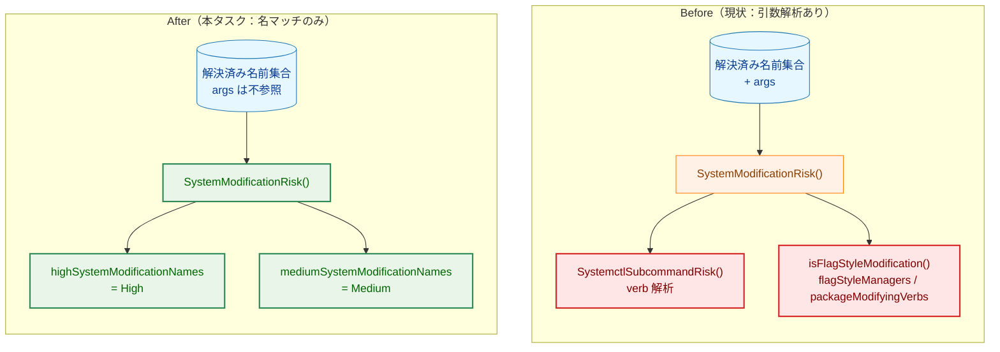
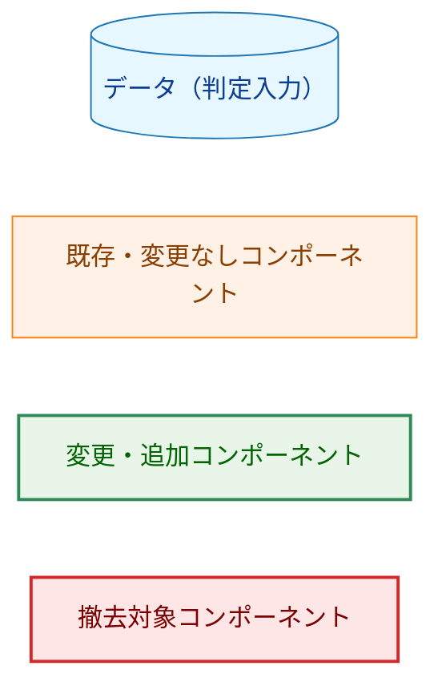
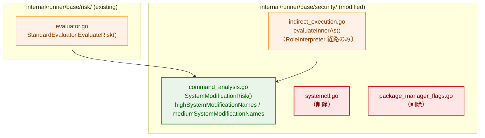
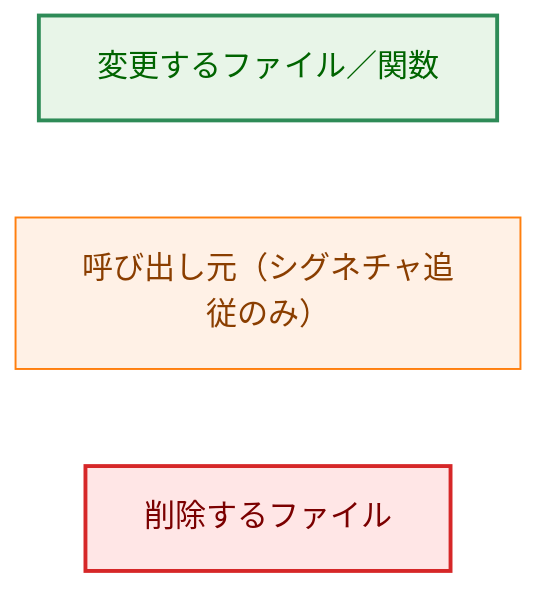
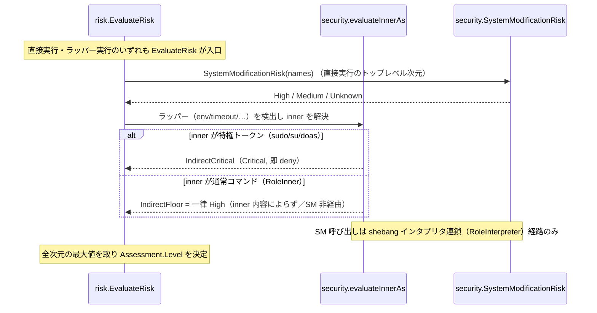
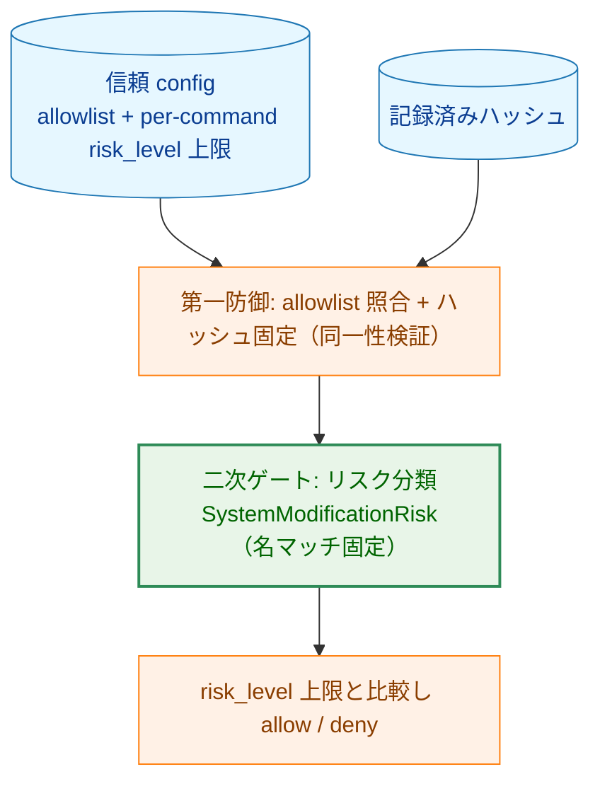
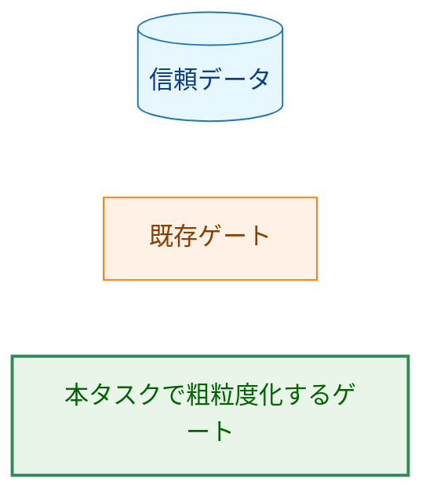
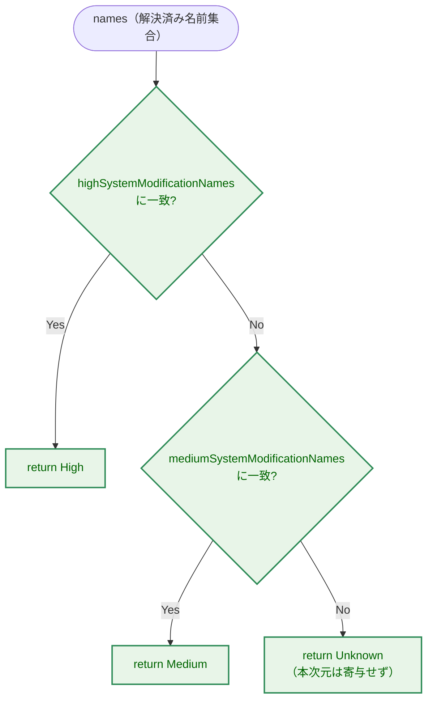

# システム変更リスク判定の粗粒度化（バイナリ名マッチへの単純化） — アーキテクチャ設計書

## Document Status

| Item | Value |
|---|---|
| Status | `draft` |
| Created | 2026-06-18 |
| Review date | - |
| Reviewer | - |
| Comments | - |

関連文書: [01_requirements.md](01_requirements.md)（承認済み要件）。本タスクの事前検討ノート
`00_notes.md` は後日追加予定。撤回対象の旧方針は
[0137/02_architecture.md](../0137_package_manager_modification_detection/02_architecture.md)。

---

## 1. 設計の全体像

### 1.1 設計原則

本タスクは、システム変更リスク判定（`SystemModificationRisk`）から
**引数（サブコマンド／フラグ）解析を撤廃し、解決済みバイナリ名のみで固定レベルを返す**
構造へ単純化する。設計を貫く原則は以下のとおり。

- **名マッチ単一基準**: システム変更次元の判定入力は「解決済み名前集合（basename と
  symlink 解決結果）」のみ。`args` を参照しない（AC-05）。
- **fail-safe な固定レベル**: パッケージマネージャ・`systemctl`・`service` は最悪ケース
  （未検証コードの特権実行）に倒して一律 **High**。その他の名マッチ系（`mount`/`mkfs` 等）は
  既存どおり **Medium** を維持する（AC-01/03/04/06）。
- **二次ゲートとしての位置づけ**: リスク判定は実セキュリティ制御の二次ゲートであり、
  第一防御は allowlist + ハッシュ固定 + コマンドごとの `risk_level` 上限。粗粒度化はこの
  前提のもとで保守コストを下げるための判断（0136 AC-66/67 と整合）。
- **単一の判定入口**: システム変更次元は `SystemModificationRisk` の 1 関数に集約し、
  トップレベル評価（`EvaluateRisk`）とラッパー経由のインナー評価
  （`AnalyzeIndirectExecution`）の双方が同じ実装を共有する。これにより実行時と dry-run、
  直接実行とラッパー実行で結論が分岐しない（AC-07/08）。

### 1.2 なぜ既存方式（サブコマンド／フラグ解析）を撤去し、名マッチへ単純化するのか（YAGNI）

本設計は「より単純な既存方式へ戻す」のではなく「**より精緻な既存方式を撤去して単純化する**」点が
特殊である。要件プロセスの YAGNI 確認は、通常「複雑な新方式を入れる前に単純方式で足りるか」を
問うが、本タスクではその答えが明確に「単純方式で足りる」であり、既存の精緻方式の方が過剰である。

- 現状は 2 系統の精緻判定を持つ:
  - **systemctl サブコマンド解析**（[systemctl.go](../../../internal/runner/base/security/systemctl.go)）:
    change/read-only/unknown verb を getopt スキャナで判別し Medium/High を出し分ける。
  - **パッケージマネージャのフラグ／verb 解析**
    （[package_manager_flags.go](../../../internal/runner/base/security/package_manager_flags.go) の
    `flagStyleManagers`／`isFlagStyleModification`、`command_analysis.go` の `packageModifyingVerbs`）:
    install/remove 系のみを Medium に分類し、照会系（`apt list`／`pacman -Q`）を除外する。
- この粒度が意味を持つのは「許可済みバイナリ上で `risk_level` 上限を変更操作検知のトリップワイヤに
  する」という極めて狭いシナリオのみで、実 config はこれに依存していない（要件 §1.1）。
- 本ツールの主目的（非特権ユーザーへ特権バッチ操作を委譲）では、照会系コマンドを単体で呼ぶ用途は
  ほぼ存在せず、サブコマンド単位の区別は実用上ゼロに近い。一方でスキャナ・フラグマップ・照会除外の
  コード量と保守コストは恒常的に発生する。
- 結論: 要件 §1.3 の決定どおり、**粒度を「名前のみ」に落とし、最悪ケース（install／change）へ
  倒して High に統一**する。精緻方式は要件を満たすために必要ではない（YAGNI）。

### 1.3 概念モデル

> 矢印 `A → B` は「A が B を入力として参照／呼び出す」関係を表す。色分けは凡例（Legend）を参照。



**Legend**



---

## 2. システム構成

### 2.1 コンポーネント配置（パッケージ構造）

判定ロジックは `internal/runner/base/security/` に閉じる。新規パッケージは導入しない
（既存の `security` パッケージ内のデータ定義と 1 関数を改変し、2 ファイルを削除する）。

> 矢印 `A → B` は「A が B を参照・呼び出す」関係。subgraph はパッケージ境界。
> 本図では赤（`problem`）クラスを、規約の「問題のある既存コード」ではなく**削除対象ファイル**の
> 意味でローカルに用いる（凡例参照）。



**Legend**



### 2.2 データフロー（判定経路の共有と AC-08 の経路）

`SystemModificationRisk` は 2 箇所から呼ばれる: トップレベル評価（`EvaluateRisk` の rank
「sysmod」次元）と、`indirect_execution.go` の `evaluateInnerAs` の **`RoleInterpreter` 経路
（直接スクリプト実行の shebang インタプリタ連鎖）のみ**。dry-run と実行時は同一の
`EvaluateRisk` を共有するため、両者で分類は一致する（AC-07）。

**AC-08（ラッパー／特権経由）は本次元とは別経路で成立する点に注意する**:

- ラッパー（`env`/`timeout`/`nice`/…）のインナー（`RoleInner`）は、`evaluateInnerAs` が
  **インナーの内容によらず一律 High floor を返す**（`indirect_execution.go` の RoleInner 分岐。
  ランナーはインナーを fd-bind/ハッシュ固定しないため、細粒度レベルは同一性保証で裏付けられない）。
  したがって `env dpkg -i pkg.deb`／`env systemctl restart nginx` は **High floor 由来で High**で
  あり、`SystemModificationRisk` を経由しない。
- `sudo`/`su`/`doas` は特権トークンとして検出され、`IndirectCritical`（または特権ゲート）で
  **Critical**。したがって `sudo dpkg -i pkg.deb`／`sudo systemctl restart nginx` は Critical。

> 矢印 `->>`（実線）は同期呼び出し、`-->>`（破線）は戻り値／分類結果を表す。



---

## 3. コンポーネント設計

### 3.1 システム変更分類の新データモデル（名集合 + 固定レベル）

引数依存の分類（`packageModifyingVerbs`／`flagStyleManagers`／systemctl verb 集合）を撤去し、
**2 つの名前集合と固定レベル**へ置き換える。判定は解決済み名前集合との集合一致（以下「名マッチ」
＝バイナリ名による集合一致）のみ。

この 2 集合は、現状の以下の定義を再編・置換するものである:

- 現状の `systemModificationCommandNames`（[command_analysis.go](../../../internal/runner/base/security/command_analysis.go) で
  `systemctl`/`service` と mount/fdisk/… を**一括で保持**）→ `systemctl`/`service` を High 側へ
  移し、残りを Medium 側へ分割する。
- 現状の `packageManagerNames`（apt/…/yarn の 10 種、引数 verb と併用して Medium 判定）→ High 側へ
  統合し、`dpkg`/`rpm` を新規に追加する（後述の注記参照）。

```go
// highSystemModificationNames: パッケージマネージャと service/init 管理の入口。
// これらは引数によらず High（未検証メンテナンススクリプト／unit/init スクリプトを特権実行し得る）。
var highSystemModificationNames = map[string]struct{}{
    // package managers（dpkg/rpm を新規に含める。AC-01）
    "apt": {}, "apt-get": {}, "yum": {}, "dnf": {}, "zypper": {},
    "pacman": {}, "brew": {}, "pip": {}, "npm": {}, "yarn": {},
    "dpkg": {}, "rpm": {},
    // service / init management（AC-03/04）
    "systemctl": {}, "service": {},
}

// mediumSystemModificationNames: 定義済み操作でシステム状態を変更する名マッチ系。
// 既存集合から systemctl/service を High 側へ移し、残りは Medium 維持（AC-06）。
var mediumSystemModificationNames = map[string]struct{}{
    "chkconfig": {}, "update-rc.d": {},
    "mount": {}, "umount": {}, "fdisk": {}, "parted": {},
    "mkfs": {}, "fsck": {}, "crontab": {}, "at": {}, "batch": {},
}
```

判定規則（優先順位）:

1. 解決済み名前集合のいずれかが `highSystemModificationNames` に一致 → **High**。
2. そうでなく `mediumSystemModificationNames` に一致 → **Medium**。
3. いずれにも一致しない → **Unknown**（本次元は寄与しない）。

`sudo`/`su`/`doas` はここに含めない（特権ゲートが Critical を担う）。名前が**実行バイナリ名ではなく
引数値としてのみ**現れる場合（`echo rpm` 等）は、`names` が解決済み実行コマンド名のみで構成される
ため一致せず、本次元の分類を受けない（AC-02）。

> **`dpkg`/`rpm` は新規検出（Low→High）**: これらは現状の `packageManagerNames`・`flagStyleManagers`
> のいずれにも含まれず（`flagStyleManagers` は現状 `pacman` のみ）、本次元では**未検出（実効 Low）**
> である。本タスクで High 集合へ追加するため、`dpkg`/`rpm` の変化は Medium→High ではなく
> **Low→High** となる。移行ノート（AC-10）では直近リリース挙動を baseline に正味差分として記述する。

> **`mkfs`/`fdisk` の実効レベルに関する注記（スコープ外の相互作用）**: 本次元は `mkfs`/`fdisk` を
> Medium とする（AC-06）が、これらは別次元の危険引数パターン
> （`CheckDangerousArgPatterns`／`dangerousCommandPatterns`、本タスクのスコープ外で不変）でも
> High に一致する。`EvaluateRisk` は全次元の最大値を取るため、**実効リスクは High** となる
> （回帰テスト [evaluator_test.go](../../../internal/runner/base/risk/evaluator_test.go) の
> `mkfs.ext4 → High` を参照）。AC-06 が言う「Medium 維持」は**本次元（システム変更次元）の
> 出力**を指し、実効最大値ではない。本タスクは危険引数パターン次元に触れないため、この実効値は
> 変わらない。

### 3.2 既存判定関数の変更（`SystemModificationRisk` シグネチャ）

`args` を参照しなくなるため、引数を落とした新シグネチャへ変更する（AC-05 を構造的に担保）。

```go
// 変更前:
//   func SystemModificationRisk(names map[string]struct{}, args []string) runnertypes.RiskLevel
//
// 変更後: args を取らない。
func SystemModificationRisk(names map[string]struct{}) runnertypes.RiskLevel
```

呼び出し元 2 箇所はシグネチャに追従する（ロジック変更なし）:

- [evaluator.go](../../../internal/runner/base/risk/evaluator.go) `evaluateDimensions`：
  `SystemModificationRisk(names, args)` → `SystemModificationRisk(names)`。
- [indirect_execution.go](../../../internal/runner/base/security/indirect_execution.go) `evaluateInnerAs`：
  `SystemModificationRisk(innerNames, innerArgs)` → `SystemModificationRisk(innerNames)`。この呼び出しは
  `RoleInterpreter` 経路（shebang インタプリタ連鎖）でのみ到達する。ラッパーインナー（`RoleInner`）は
  この行に到達する前に一律 High floor を返すため、本変更は AC-08 の結論に影響しない（§2.2 参照）。

内部ヘルパ `isSystemModificationByNames(names, args)` は引数解析（`packageModifyingVerbs`/
`flagStyleManagers`）を内包しており、本変更で不要になるため `SystemModificationRisk` 内へ
インライン化または単純な集合一致ヘルパへ置換し、`args` 依存を除去する。

### 3.3 撤去するシンボル（NF-001）

以下は撤去し、テストを含むコードベースに参照を残さない。

| 撤去・置換対象 | 定義場所 | 撤去後の扱い |
|---|---|---|
| `SystemctlSubcommandRisk`／`firstSystemctlSubcommand`／`systemctlChangeVerbs`／`systemctlReadOnlyVerbs`／`systemctlValueOptions`／`systemctlBoolOptions` | `systemctl.go` | ファイルごと削除。systemctl は `highSystemModificationNames` で High |
| `flagStyleManagers`／`flagRule`／`isFlagStyleModification`／`matchesShortFlag` | `package_manager_flags.go` | ファイルごと削除。フラグ方式の照会除外も撤廃 |
| `packageModifyingVerbs` | `command_analysis.go` | 削除。verb 方式の照会除外も撤廃 |
| `packageManagerNames` | `command_analysis.go` | 削除。`highSystemModificationNames` へ統合（`dpkg`/`rpm` 追加） |
| `systemModificationCommandNames`（systemctl/service を含む Medium 集合） | `command_analysis.go` | `highSystemModificationNames`（systemctl/service）と `mediumSystemModificationNames`（残り）へ分割置換 |
| `isSystemModificationByNames`（args 依存版） | `command_analysis.go` | 名集合一致のみへ置換（`SystemModificationRisk` 内へインライン化） |

### 3.4 コンポーネント責務一覧（新規・変更・削除ファイル）

| ファイル | 区分 | 責務／変更内容 | 更新が必要な既存テスト |
|---|---|---|---|
| [command_analysis.go](../../../internal/runner/base/security/command_analysis.go) | 変更 | `SystemModificationRisk` を名マッチ固定レベル化。`highSystemModificationNames`／`mediumSystemModificationNames` を定義。`packageManagerNames`／`packageModifyingVerbs`／`isSystemModificationByNames` を撤去・置換 | `command_analysis_test.go` の `TestIsSystemModification`／`TestIsSystemModification_PackageManagerVerbs`／`TestIsSystemModification_AbsolutePath`（照会系 false → High 期待へ改訂） |
| [systemctl.go](../../../internal/runner/base/security/systemctl.go) | 削除 | systemctl サブコマンド解析の撤去 | `systemctl_test.go`（ファイルごと削除） |
| [package_manager_flags.go](../../../internal/runner/base/security/package_manager_flags.go) | 削除 | フラグ方式検出の撤去 | （専用テストがあれば削除） |
| [evaluator.go](../../../internal/runner/base/risk/evaluator.go) | 変更 | `SystemModificationRisk` 呼び出しのシグネチャ追従 | `evaluator_test.go` の `TestEvaluateRisk_SystemctlSubcommandConditional`（status/show が Medium→High へ） |
| [indirect_execution.go](../../../internal/runner/base/security/indirect_execution.go) | 変更 | `SystemModificationRisk` 呼び出し（`RoleInterpreter` 経路）のシグネチャ追従のみ | 既存の indirect 系テストは結論不変（`env dpkg`/`env systemctl` は従来どおり一律 High floor 由来で High。回帰確認として追加可） |
| [docs/user/risk_assessment.ja.md](../../../docs/user/risk_assessment.ja.md) / [docs/user/risk_assessment.md](../../../docs/user/risk_assessment.md) | 変更 | systemctl／パッケージマネージャのサブコマンド粒度記述を削除し、固定レベル（いずれも High）へ更新（AC-11） | — |
| [docs/dev/architecture_design/command-risk-evaluation.ja.md](../../../docs/dev/architecture_design/command-risk-evaluation.ja.md) / [.md](../../../docs/dev/architecture_design/command-risk-evaluation.md) | 変更 | 開発者文書の「System Modification Risk」節（`SystemModificationRisk(names, args)` の旧シグネチャ・`SystemctlSubcommandRisk`・パッケージマネージャの verb-only Medium 記述）を、引数非依存の固定レベル（PM／systemctl=High）へ更新（F-005 §1.4 の文書整合） | — |
| [docs/user/toml_config/09_practical_examples.ja.md](../../../docs/user/toml_config/09_practical_examples.ja.md) / [.md](../../../docs/user/toml_config/09_practical_examples.md) ほか toml_config ガイド | 変更 | 実践例中の `apt-get`／`systemctl` を `risk_level=medium`／既定のまま使う箇所を `high` へ更新（追従できる例に修正）。`docs/user/toml_config/` 配下を横断検索し、PM／systemctl 例を持つ全ページを対象とする（F-005 §1.4） | — |
| [sample/risk-based-control.toml](../../../sample/risk-based-control.toml) | 変更 | `apt update`（`risk_level=medium`→`high`）、`systemctl restart`（`medium`→`high`）（AC-14） | — |
| [sample/timeout_examples.toml](../../../sample/timeout_examples.toml) | 変更 | `apt update`／`apt upgrade -y`（`risk_level` 無し＝既定 Low）に `risk_level="high"` を付与（AC-14） | — |

> 用語集（`docs/translation_glossary.md`）には該当語が無いことを確認済み。新規用語追加は不要。
> ユーザー文書の更新範囲: 要件 AC-11 は `risk_assessment` を名指しするが、F-005／§1.4 の
> 「文書を実装と一致させる」目的に基づき、PM／systemctl の例を含む `toml_config` 実践ガイドおよび
> 開発者文書 `command-risk-evaluation` も整合対象に含める（実装後に stale な例が残らないようにする）。
> 確定対象ページは実装時に `docs/user/toml_config/` と `docs/dev/architecture_design/` の横断検索で
> 列挙する。

### 3.5 他タスク方針への例外（インライン明記：AC-13）

本設計は、他タスクのアーキテクチャ文書が確立した方針に対する**意図的な例外（撤回）**である。
要件 F-005／AC-13 に基づき、ここに明記する。

- **(1) 原方針と所在**:
  - パッケージマネージャのフラグ方式検出（per-tool フラグマップ・rpm 照会除外）は
    [0137/02_architecture.md](../0137_package_manager_modification_detection/02_architecture.md)
    の §3.1（ツール別検出規則の型）・§5.3（rpm 照会除外）で確立。
  - systemctl のサブコマンド粒度（read-only=Medium／change=High／unknown=High）は
    `systemctl.go` 実装で確立（直近リリース挙動）。
- **(2) 例外とする理由**: §1.2 のとおり、これらの粒度は本ツールの脅威モデルに対して過剰で
  あり、実 config が依存していない。保守コストに見合わないため撤回し、名マッチ固定 High へ
  統一する（要件 §1.3 の決定）。
- **(3) 旧挙動を固定している既存テスト（改訂が必要）**:
  - `systemctl_test.go::TestFirstSystemctlSubcommand`／`TestSystemctlSubcommandRisk`
    （read-only=Medium、verb 解析を前提）→ ファイルごと削除。
  - `command_analysis_test.go::TestIsSystemModification`（`apt list`=false）／
    `TestIsSystemModification_PackageManagerVerbs`（`pacman -Q`=false、`apt list`=false）
    → 照会系も High（true）になるよう改訂。
  - `evaluator_test.go::TestEvaluateRisk_SystemctlSubcommandConditional`
    （`systemctl status`／`show`=Medium）→ いずれも High へ改訂。
    `TestEvaluateRisk_SystemctlChangeAndServiceHigh`／`TestEvaluateRisk_ServiceAllActionsHigh`
    は結論不変（維持）。

---

## 4. エラーハンドリング設計

本変更は分類ロジックの単純化であり、新しいエラー型・エラー経路を導入しない。

- `SystemModificationRisk` は純粋関数で、`error` を返さない（変更前後で不変）。判定不能時は
  `RiskLevelUnknown` を返し、本次元は寄与しないだけで deny を引き起こさない。
- リスク上限超過による deny の経路・エラー分類（`risktypes` の Blocking／ReasonCode 体系）は
  `EvaluateRisk` 側で従来どおり。本タスクで変わるのは「どの名前が High/Medium になるか」のみ。
- symlink 解決失敗・深さ超過などの fail-closed 経路（`ResolveCommandNames`）は不変。

---

## 5. セキュリティ考慮事項

### 5.1 副作用コントラクト（dry-run / 実行時の一貫性）

本機能は**リスク分類のみ**を行い、外部副作用（書き込み・削除・ネットワーク送信）を一切発生
させない。したがって `--dry-run` 等のモードが抑制／許可する副作用はない。重要な不変条件は
「分類結果がモードに依存しないこと」である。

- dry-run と実行時は同一の `risk.StandardEvaluator.EvaluateRisk` を共有し、その内部で同一の
  `SystemModificationRisk(names)` を呼ぶ。入力が解決済み名前集合のみ（環境非依存）であるため、
  同一コマンドに対し dry-run と実行時で分類は完全一致する（AC-07）。
- ラッパー経由のインナー分類は本次元（`SystemModificationRisk`）ではなく `evaluateInnerAs` の
  経路で決まる: `env dpkg -i pkg.deb`／`env systemctl restart nginx` はラッパーインナーの
  **一律 High floor** により High、`sudo dpkg -i pkg.deb`／`sudo systemctl restart nginx` は
  特権トークン検出により **Critical** となる（AC-08。§2.2 参照）。
- **直接実行**で本次元（`SystemModificationRisk`）により分類され deny されたコマンドの監査ログには、
  システム変更を示す理由コード `system_modification`（`risktypes.ReasonSystemModification`）が
  記録される（AC-09、現行の `addDimension` 経路で担保）。**ラッパー／特権経由は本次元を通らない**ため
  理由コードが異なる点に注意する: ラッパーインナー（`env dpkg` 等）は
  `indirect_execution_wrapper`（`ReasonIndirectExecutionWrapper`）、特権トークン（`sudo dpkg` 等）は
  `privilege_escalation`（`ReasonPrivilegeEscalation`）。AC-09 の `system_modification` 表明は
  直接実行の sysmod deny に限定して検証する（§7.2）。

### 5.2 脅威モデルと本タスクの位置づけ

> 矢印 `A → B` は「A を通過した後に B のゲートが評価される」順序を表す。



**Legend**



- 粗粒度化は二次ゲートの**過検出（fail-safe）方向**への変更であり、攻撃面を増やさない。照会系
  （`apt list` 等）が Medium/Low から High へ上がることで、誤って緩い `risk_level` のまま実行
  される余地が減る。
- 第一防御（allowlist + ハッシュ固定）は不変であり、本変更はそこに依存しない。

### 5.3 検出限界（AC-12）

粗粒度化後も以下は本次元で検出されず Low を素通りし得る。これは設計上の既知の限界であり、
安全運用は allowlist + ハッシュ固定を前提とする（0136 AC-66/67 と整合、ユーザー文書に明記）。

- 未列挙のマネージャ（`apk`／`snap`／`flatpak`／`gem` 等）。
- リネームされたバイナリ（名前集合に一致しない basename）。
- multi-call 形式（`busybox <pm>` 等、`busybox` の引数として現れる pm 名）。

### 5.4 外部サービス機能の利用

本タスクは Slack/IMAP 等の外部サービス API 機能を新規利用しない（**N/A**）。対象クライアント
環境での検証は不要。

---

## 6. 処理フロー詳細

### 6.1 `SystemModificationRisk` の判定フロー

> 矢印はフローの遷移。菱形は分岐条件。



### 6.2 代表コマンドの判定結果

直接実行の行は**本次元（`SystemModificationRisk`）の出力**を示す。末尾 2 行（`env`/`sudo` 経由）は
本次元ではなく `evaluateInnerAs`／特権ゲートで決まる**実効結果**であり、列に経路を併記する。

| コマンド例 | 判定（経路） | 根拠 AC |
|---|---|---|
| `apt list` / `dpkg -l` / `rpm -qa` / `pacman -Q` / `pip list` | High | AC-01（照会系も一律 High） |
| `apt install nginx` / `dpkg -i pkg.deb` / `rpm -Uvh pkg.rpm` | High | AC-01 |
| 引数なしの `dpkg` / `apt` | High | AC-01 |
| `systemctl status` / `systemctl list-units` / 引数なしの `systemctl` | High | AC-03（read-only も High へ） |
| `systemctl restart nginx` | High | AC-03 |
| `service nginx status` | High | AC-04 |
| `mount` / `umount` / `fdisk` / `parted` / `mkfs` / `fsck` / `crontab` / `at` / `batch` / `chkconfig` / `update-rc.d` | Medium | AC-06 |
| `echo rpm` / `grep systemctl /etc/x` | Unknown（非該当） | AC-02 |
| `env dpkg -i pkg.deb` / `env systemctl restart nginx` | High（ラッパーインナーの一律 High floor。本次元非経由） | AC-08 |
| `sudo dpkg -i pkg.deb` / `sudo systemctl restart nginx` | Critical（特権トークン検出） | AC-08 |

---

## 7. テスト戦略

### 7.1 単体テスト

- **名マッチ固定レベル（AC-01/03/04/06）**: `SystemModificationRisk(names)` 直接テスト。High 集合
  （PM 12 種 + systemctl/service）、Medium 集合（mount/.../update-rc.d）、Unknown（非該当名）を
  網羅。引数の有無で結果が変わらないこと（照会系も High）を肯定・否定で固定。
- **args 非参照（AC-05）**: 同一 `names` に対し、異なる `args`（install 系／照会系／空）で結果が
  不変であることを表明。シグネチャから `args` が消えることを利用。
- **名前が引数値のみ（AC-02）**: `echo rpm` 等で `names` に pm 名が入らないこと、非該当名が
  High/Medium を受けないことを確認。
- **symlink/absolute path（AC-01）**: `/usr/sbin/systemctl`、symlink エイリアス経由でも High。
  `systemctl-helper` のような部分一致は非該当であること。

### 7.2 統合テスト（evaluator 経由）

- **実行時＝dry-run（AC-07）**: 既存の共有評価器前提の回帰テストに、systemctl 照会系・dpkg/rpm の
  High を追加。
- **ラッパー／特権（AC-08）**: `env dpkg -i`／`env systemctl restart` が High 以上、
  `sudo dpkg`／`sudo systemctl` が Critical。
- **監査理由（AC-09）**: **直接実行**で本次元により deny された system-modification コマンドの
  Assessment に `ReasonSystemModification` が含まれること。ラッパー（`env dpkg`）は
  `ReasonIndirectExecutionWrapper`、特権（`sudo dpkg`）は `ReasonPrivilegeEscalation` を持つこと
  （本次元の理由コードではないことを区別して固定）。
- **Medium 維持（AC-06）**: `mount`/`crontab` 等が Medium。`mkfs`/`fdisk` は本次元 Medium だが
  実効 High（危険引数パターン次元）であることを既存テストで確認（不変）。

### 7.3 撤去・文書・config 検証

- **NF-001**: `SystemctlSubcommandRisk`／`flagStyleManagers`／`packageModifyingVerbs` 等への参照が
  テスト含め残らないことを grep で静的確認。
- **AC-10/11**: ユーザー文書（risk_assessment 日英）が固定レベル記述に更新されていることを静的確認。
- **AC-14**: `sample/risk-based-control.toml` 等が新固定レベル（High）の下で整合する
  （`risk_level` 付与済み）ことを検証。
- **NF-002**: `make fmt` → `make test` → `make lint` がすべて成功。

---

## 8. 実装の優先順位（フェーズ）

1. **Phase 1（判定本体）**: `command_analysis.go` に `highSystemModificationNames`／
   `mediumSystemModificationNames` を定義し、`SystemModificationRisk` を名マッチ固定レベル化
   （シグネチャから `args` 除去）。`packageModifyingVerbs`／`isSystemModificationByNames` 撤去。
2. **Phase 2（呼び出し元追従）**: `evaluator.go`／`indirect_execution.go` のシグネチャ追従。
3. **Phase 3（撤去）**: `systemctl.go`／`package_manager_flags.go` を削除（NF-001）。
4. **Phase 4（テスト改訂）**: §3.5 の旧挙動テストを改訂・削除し、§7 の新テストを追加。
5. **Phase 5（文書・config）**: risk_assessment 日英の更新（AC-11/10/12/13）、開発者文書
   `command-risk-evaluation` 日英および `toml_config` 実践ガイドの PM／systemctl 例の整合
   （F-005 §1.4）、sample config（`risk-based-control.toml`／`timeout_examples.toml` ほか
   横断検索で見つかる該当 config）の `risk_level` 追従（AC-14）。`docs/user/toml_config/`・
   `docs/dev/architecture_design/`・`sample/` を横断検索して残存例の網羅を確認する。
6. **Phase 6（緑化）**: `make fmt`／`make test`／`make lint`（NF-002）。

---

## 9. 将来の拡張性

- **対象名の追加**: 新しいパッケージマネージャや service 管理コマンドは、`highSystemModificationNames`
  へ 1 行追加するだけで High 化できる（コード分岐を増やさない）。検出限界（§5.3）の縮小は
  この方式で漸進的に行える。
- **Medium 集合のレベル見直し**: `parted`/`fsck`/`chkconfig`/`update-rc.d` 等の妥当性
  （High へ引き上げるか）や、コマンド置換・カーネルモジュール等の新観点は本タスクのスコープ外。
  別タスク（リスクレベル分類の見直し）で扱う。
- **粒度の再導入**: 万一、特定コマンドでサブコマンド粒度が再び必要になった場合は、`names` のみに
  依存する現構造の上に、その 1 コマンドだけ条件分岐を足す形で局所的に拡張できる（全体の getopt
  スキャナ復活は不要）。

---

## 付録: 決定経緯（current-state とは分離）

本文（§1〜§9）は変更後の到達状態を記述する。以下は撤回・置換された設計の経緯であり、
現行挙動の説明ではない。

- 本タスクは 0137（パッケージマネージャのフラグ方式検出：per-tool フラグマップ・rpm 照会除外）と、
  systemctl のサブコマンド粒度判定（read-only=Medium／change=High）を**置換（撤回）**する。
  詳細な撤回方針は要件 §1.2／§1.3 と本書 §3.5 を参照。
- 撤回の根拠は「粒度が脅威モデルに対し過剰で、実 config が依存せず、保守コストに見合わない」
  （要件 §1.1）。比較基準（baseline）は直近リリース挙動であり、未リリースの 0137 を本タスクが
  撤回する点を踏まえた正味差分はユーザー文書の移行ノート（AC-10）に記述する。
- 旧実装の詳細はバージョン管理履歴（`systemctl.go`／`package_manager_flags.go` の削除コミット）を
  参照。
