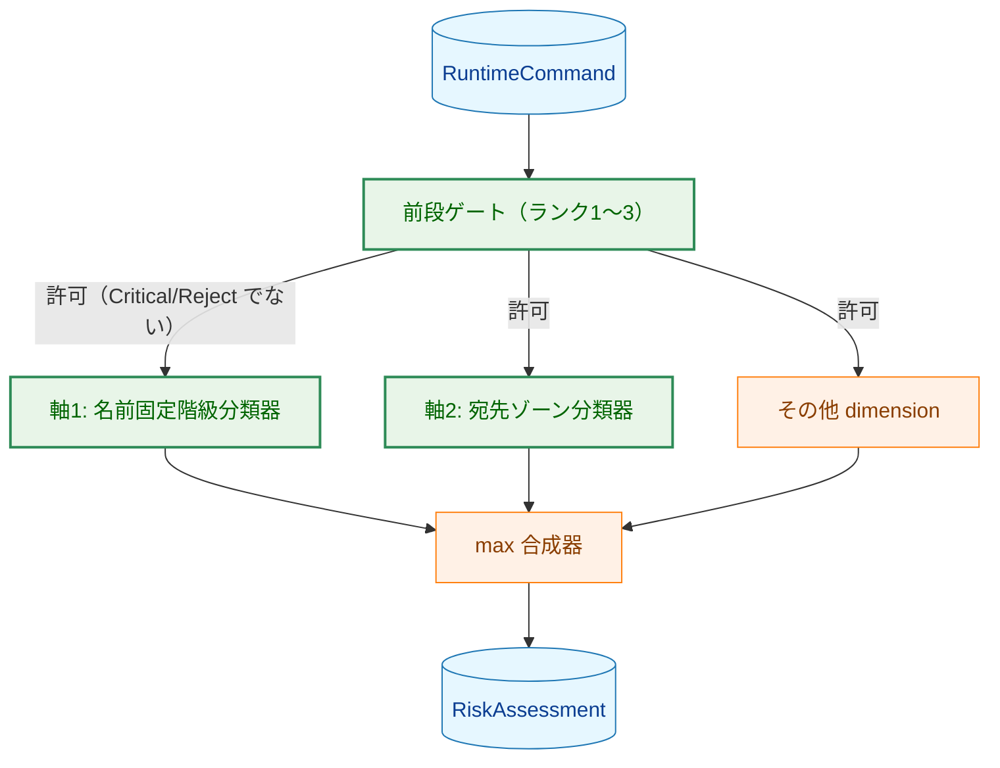
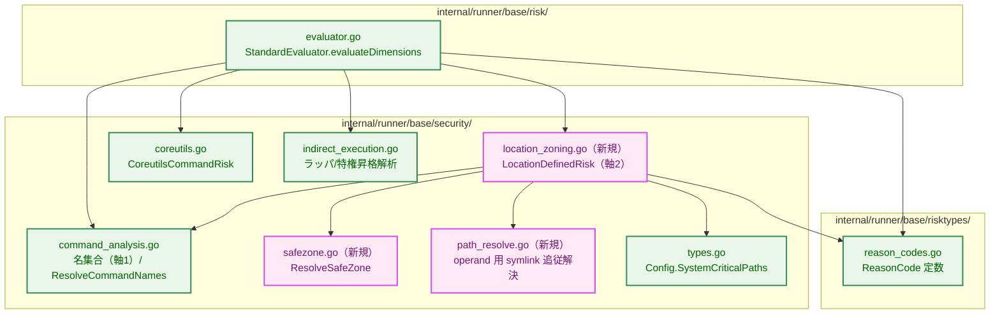
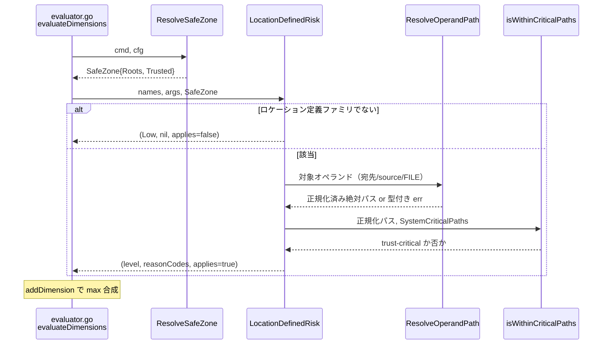
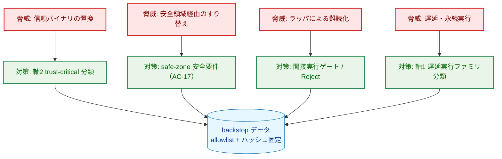
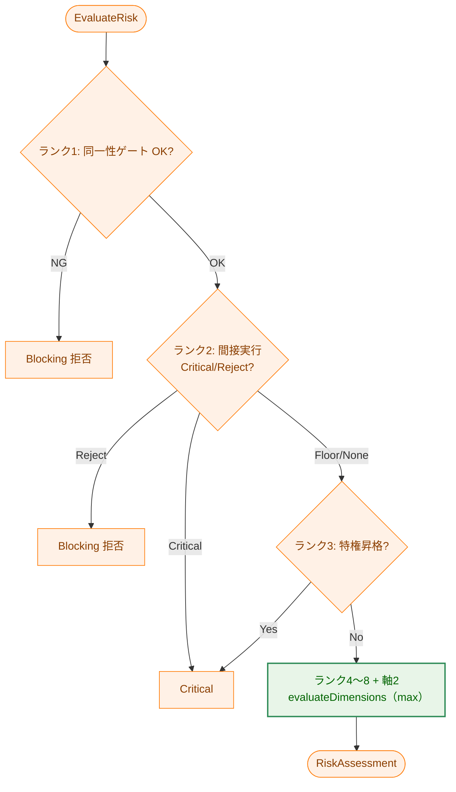
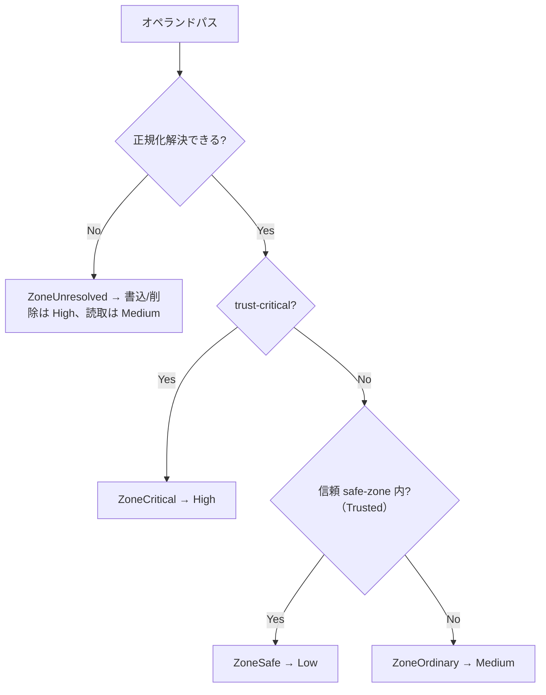

# コマンド名ベース リスクレベル分類の一貫化 — アーキテクチャ設計書

## Document Status

| Item | Value |
|---|---|
| Status | `draft` |
| Created | 2026-06-19 |
| Review date | - |
| Reviewer | - |
| Comments | - |

> 本書は [01_requirements.md](01_requirements.md)（`approved`）の受け入れ基準を実装可能な設計へ落とす。
> 既存の実装レベル解説は [command-risk-evaluation.ja.md](../../dev/architecture_design/command-risk-evaluation.ja.md)、
> 概念モデルは [risk-level-classification-guide.ja.md](../../dev/architecture_design/risk-level-classification-guide.ja.md)。
> 決定経緯（撤回案・タスク横断の判断）は本文ではなく末尾「付録: 決定履歴」に隔離する。

---

## 1. 設計の全体像

### 1.1 設計原則

1. **既存の max 合成を維持する**（AC-31）。最終リスク = 適用 dimension の最大値という現行
   `evaluateDimensions`（[evaluator.go](../../../internal/runner/base/risk/evaluator.go)）の骨格は変えない。
   本タスクは「各 dimension が返す値」を 2 軸モデルへ整理し、不足していた**軸2（宛先ゾーン）dimension**を
   追加する。
2. **軸1（名前固定）と軸2（宛先ゾーン）を分離する**（D1）。名前で固定レベルが決まるファミリは
   名集合で、引数の対象パスで決まるロケーション定義コマンドは新規のゾーン分類器で扱う。
3. **判定は決定的・副作用なし・read-only**（NF-003, AC-28）。ゾーン判定のパス解決は `lstat`/`readlink`
   等の読み取りのみで、実行時と dry-run で同一結果になる。
4. **降格（Low/Medium 化）は fail-closed**（AC-17, AC-18）。safe-zone への Low 降格は安全要件を満たす
   場合に限り、満たせなければより高い既定（ordinary=Medium）に倒す。

### 1.2 なぜ既存方式では足りないか（YAGNI 確認）

現行は「名前固定レベル（`SystemModificationRisk`）＋引数パターン（`CheckDangerousArgPatterns`）」の
2 系統で、いずれも**同一コマンドに単一レベル**しか与えられない。F-004 は `cp`/`mv`/`rm` を**宛先パスの
関数**として（`/usr/bin`→High、workdir→Low）分類することを要求し、これは名前固定でも引数パターン
（固定の語句一致）でも表現できない。したがって **宛先パスを正規化・ゾーン分類する新規 dimension（軸2）** が
必要になる。名前で一意に決まるファミリ（kernel/auth/boot 等）には引き続き名集合（軸1）を用い、過剰な
精密化はしない（D5）。

### 1.3 概念モデル（2 軸 × max）



> 矢印 `X → Y` は「X の出力が Y の入力になる」処理フローを表す。`GATE` が Critical/Reject を返す場合は
> 軸計算に進まず即時確定する（§6.1）。軸1=`SystemModificationRisk` 他、軸2=`LocationDefinedRisk`（新規）、
> max 合成=`addDimension`。
>
> **Legend**: 🟦 data=入力/出力データ / 🟧 process=既存コンポーネント（変更なし） / 🟩 enhanced=本タスクで追加・変更。

---

## 2. システム構成

### 2.1 コンポーネント配置（パッケージ構造）



> 矢印 `A → B` は「A が B を呼び出す/依存する」依存関係を表す。
>
> **Legend**: 🟩 enhanced=本タスクで改修する既存ファイル / 🟪 newpkg=新規ファイル。

### 2.2 データフロー（軸2 の評価）



> 矢印は同期呼び出し（`-->>` は戻り値）。本図はシーケンス図で配色クラスを用いないため凡例は不要。
> safe-zone は evaluator が先に解決して `LocationDefinedRisk` へ渡す（§3.4/§3.10）。解決失敗（型付き err）は
> Kind 依存 floor（書込/削除=High）へ倒す（§3.5, AC-18）。

---

## 3. コンポーネント設計

### 3.1 リスクレベル段階（変更なし）

`runnertypes.RiskLevel`（[config.go](../../../internal/runner/base/runnertypes/config.go)）の段数・
意味づけは維持する（スコープ外、§6）。**リスクの全順序は `Low(1) < Medium(2) < High(3) < Critical(4)`**。
`Unknown(0)` は**リスクの最小値ではなく「未判定／該当なし」の番兵**であり、リスクとして比較しない。max 合成
では `Unknown` を返した dimension は「寄与なし」を意味し（評価は `RiskLevelLow` を起点に積み上げる）、最終の
有効リスクが `Unknown` になることはない。

### 3.2 軸1: 名前固定階級（`command_analysis.go` の改修）

名前で固定レベルが決まるファミリを**意味のある名集合に再編**する。現行の
`highSystemModificationNames`／`mediumSystemModificationNames` を出発点に、High ファミリを追加し、
Medium 集合から High へ移すべきもの（`fdisk`/`parted`/`mkfs`/`fsck`）を移設する（AC-27, F-007）。

| 名集合（High。原則） | 対応 AC | 内容（代表例。確定列挙は実装で） |
|---|---|---|
| 破壊/デバイス初期化（①） | AC-01, AC-02, AC-03 | parted/fsck/wipefs/blkdiscard/sgdisk/gdisk/cgdisk/sfdisk/cfdisk/mkswap/mkfs(.\*)/fdisk/e2fsck/mke2fs/tune2fs/resize2fs/LVM 破壊系 |
| カーネル/モジュール・パラメータ（③/②） | AC-04 | insmod/modprobe/rmmod/kexec/sysctl |
| アカウント・認証 DB（②） | AC-05 | useradd/usermod/.../passwd/chage/newusers/vipw/vigr/visudo |
| ブート改変（②③） | AC-06 | grub-install/grub2-\*/efibootmgr/kernel-install/installkernel |
| サービス有効化（②） | AC-07 | chkconfig/update-rc.d（既存 PM/systemctl/service と同列） |
| 電源状態/ランレベル（②） | AC-07a | shutdown/reboot/halt/poweroff/telinit |
| ファイアウォール（②） | AC-08 | iptables/ip6tables/(ip6)tables-restore/nft/ufw/firewall-cmd |
| 能力付与（⑤） | AC-09 | setcap |
| 信頼境界の置換 intrinsic（④） | AC-10 | update-alternatives/dpkg-divert/alternatives/ldconfig |
| ジョブ/遅延・transient 実行（②③） | AC-10a | crontab/at/batch/systemd-run |

| 名集合（Medium。原則） | 対応 AC | 内容 |
|---|---|---|
| 限定スコープの system 変更 | AC-11, AC-12, AC-13 | LVM 作成/設定系・ip/ifconfig/route・mount/umount（既定） |

- `SystemModificationRisk(names)` は再編後の High 集合→High、Medium 集合→Medium、非該当→Unknown を返す
  （既存シグネチャ維持）。各ファミリは別 `map[string]struct{}` として定義し、`anyNameInSet` で照合する。
- `iptables-save`/`ip6tables-save`（stdout 出力）は High 集合に**含めない**（既定 Low）。`-f <file>` 出力は
  軸2 の zoning 対象（AC-08）。
- **High だが Critical にはしない**（AC-24）: kernel/auth/権限付与系（insmod・visudo・useradd 等）は本軸で
  High に固定するが Critical にはしない。これにより per-command の `risk_level` 明示許可で正当な特権バッチを
  実行可能に保つ（Critical は §3.6 の特権昇格ラッパに限定）。
- **記述方針（WHAT/HOW）**: 上表の「代表例」は非有界。distro 別名・完全列挙は実装時に各名集合へ追加する。

### 3.3 軸2: ロケーション定義ゾーン分類（新規 `location_zoning.go`）

宛先パスの関数でレベルが決まる「ロケーション定義コマンド」を評価する新規 dimension。

**責務**:
1. コマンドがロケーション定義ファミリか判定（名集合）。
2. コマンド別に**作用オペランド**を抽出（宛先/source/FILE/`if=`/`of=`/mountpoint）。
3. 各オペランドを正規化（§3.5 のパス解決）。
4. ゾーン分類（trust-critical / ordinary / safe-zone / unresolved）。
5. arg 軸の floor（再帰・setuid/権限付与・ブロックデバイス・機微 source・fail-safe）を適用。
6. 全 floor の max を返す。

**型定義（高レベル）**:

```go
// PathZone はロケーション定義コマンドのオペランドが属するゾーン。
type PathZone int

const (
    ZoneInvalid    PathZone = iota // ゼロ値＝未設定（プログラミングエラー検出用の番兵）
    ZoneUnresolved                 // 宛先不確定（AC-18 fail-safe。floor は Kind 依存で High/Medium）
    ZoneSafe                       // 信頼された safe-zone 内（Low 候補）
    ZoneOrdinary                   // 通常パス（Medium）
    ZoneCritical                   // trust-critical（High）
)

// LocationKind はロケーション定義コマンドの種別（オペランド抽出規則の切替に用いる）。
type LocationKind int

const (
    KindNotLocation LocationKind = iota
    KindWriteTarget   // cp/mv/install/tee/sponge/truncate/sed -i/redirect-writers
    KindCreate        // mkdir/touch（新規作成。対象パスを zoning）
    KindDeleteTarget  // rm/rmdir/unlink/shred
    KindLink          // ln（source も対象）
    KindDevice        // dd（if=/of=）
    KindMount         // mount/umount
    KindPermission    // chmod/chown/chgrp/setfacl/chattr（軸 A・⑤）
    KindArchive       // tar/unzip（展開先）
    KindMknod         // mknod（無条件 High）
)
```

> `ZoneInvalid=0` は §3.1 の `RiskLevelUnknown` と同じ番兵規律（既定構築/設定漏れを誤って Unresolved と
> 解釈しないため）。`KindNotLocation=0` は「ロケーション定義でない」を表す。

> 上記 enum と名集合の対応・確定メンバは実装で確定（WHAT/HOW 分離）。

**軸 A / 軸 B**（要件 F-004 の表をそのまま実装規則とする）:

- **軸 A（ゾーン非依存で High／拒否）**: 権限付与（setuid/setgid・world-write・trust-critical 所有権）→High
  （AC-20, AC-22a）。内側コマンド実行（`find -exec` 等）→**間接実行で Reject/Blocking**（§3.6, AC-22e。
  floor ではなく拒否）。
- **軸 B（ゾーン依存）**: trust-critical→High / ブロックデバイス IO→High / safe-zone 外ツリー再帰→High /
  機微 source 複製→Medium 下限 / **宛先不確定→High（書込/削除）または Medium（読取主体）** /
  ordinary→Medium / safe-zone→Low。

**`LocationKind` 別のオペランド抽出規則**（複数オペランドは各々を zoning し max。AC-31）:

| Kind | zoning 対象オペランド | 特則 |
|---|---|---|
| KindWriteTarget（cp/mv/install/tee/sponge/truncate/sed -i） | 書込先 FILE すべて（非フラグ引数）。`tee`/`sponge` は**全 FILE 引数**（AC-22d）、`-t/--target-directory` は宛先ディレクトリ | `install` の setuid/setgid・`-o`/`-g` は軸 A で High（AC-22a）。`cp -p`/`-a` の特権メタデータ複製は High（AC-22b） |
| KindCreate（mkdir/touch） | 作成対象パス | これらは coreutils 既定で Low。trust-critical 宛先（`mkdir /etc/x`）は軸2 で High に引き上げ（§3.8 で coreutils Low を抑止）。safe-zone なら Low |
| KindDeleteTarget（rm/rmdir/unlink/shred） | 削除対象の全オペランド（AC-22b）。`-r`/`-R` で safe-zone 外なら再帰 High（AC-22） | — |
| KindLink（ln） | **宛先と source（リンク先）の双方**。trust-critical source の safe-zone 別名は High（AC-22b） | — |
| KindDevice（dd） | `if=`/`of=` のデバイス/ファイル | ブロックデバイス→High、`/dev/null` 等の無害シンクは除外、機微 `if=`→Medium 下限（AC-21） |
| KindMount（mount/umount） | **mountpoint と source の双方**（`--bind`/`--rbind`/`--move` の trust-critical source、デバイス source `/dev/sdaN` を含む）。`umount` は対象 FS/ディレクトリ | `umount -a`（全 FS）は無条件 **High**（AC-19） |
| KindPermission（chmod/chown/chgrp/setfacl/chattr） | 変更対象パス（軸 A・⑤） | 権限拡大/setuid/`chattr -i`/trust-critical 対象→High（AC-20） |
| KindArchive（tar/unzip） | 展開先（`-C`/`-d`） | 展開ルート脱出メンバ・特権メタデータ復元は fail-safe High（AC-22e 注記） |
| KindMknod（mknod） | （対象に依らず） | 無条件 **High**（safe-zone へのデバイスノード生成。AC-16 注記） |

`find` の書込/破壊/実行アクション（AC-22e）は KindNotLocation 扱いとし、`-fprint*`（FILE 書込）は
KindWriteTarget と同じ FILE オペランド zoning、`-delete` は再帰破壊（AC-22）、`-exec`/`-execdir`/`-ok`/
`-okdir` は間接実行 Reject（§3.6）として扱う。読取専用検索は昇格しない。

**fail-closed パース契約（セキュリティ要件）**: オペランド抽出は軸2 の防御の要であり、パースの穴は
Low/Medium 降格バイパスになる。よって**曖昧・不明なフラグ（未知の値取りフラグが次トークンを消費、
`-t DIR`/`--target-directory=DIR`/clustered short flag/`--` 終端の誤解釈等）で書込先オペランドを一意に
特定できない場合は、当該オペランドを `ZoneUnresolved` とし、Kind に応じ High（書込/削除）へ倒す**
（Medium に倒さない）。「不明フラグ＝安全」とは絶対に仮定しない。フラグ表の網羅は実装で確定するが、
**未知フラグ時の fail-closed は設計レベルの不変条件**とする。

**公開関数（高レベル・シグネチャのみ）**:

```go
// LocationDefinedRisk は軸2を評価する。applies=false のとき本 dimension は寄与しない。
// 第2戻り値は付与する理由コード。SafeZone は呼び出し側（evaluator）が解決して渡す。
func LocationDefinedRisk(
    names map[string]struct{},
    args []string,
    sz SafeZone,
) (level runnertypes.RiskLevel, reasons []risktypes.ReasonCode, applies bool)
```

### 3.4 safe-zone の導出（新規 `safezone.go`）

```go
// SafeZone は Low 降格を許す信頼ディレクトリ集合。Trusted=false の場合は Low 降格を行わない。
type SafeZone struct {
    Roots   []string // 正規化済み絶対パス（run の EffectiveWorkDir / 出力先の親 / 専用 temp）
    Trusted bool     // AC-17(d): Low 降格を許す信頼前提を満たすか（下記「信頼判定」）
}

// ResolveSafeZone は実行コンテキストと信頼ポリシー（Config 由来）から SafeZone を構築する。
// 既存 dimension（SystemModificationRisk 等）と同じく free function とし、interface 化はしない
// （単一実装・テストシーム不要。入力を引数で受け純粋・read-only）。
func ResolveSafeZone(cmd *runnertypes.RuntimeCommand, cfg *security.Config) SafeZone
```

**safe-zone の起点ディレクトリ（AC-17(b)）**: 曖昧な `$HOME` ではなく、`RuntimeCommand.EffectiveWorkDir`
（フィールド。ディレクトリ＝その配下が safe-zone）および構成済みの専用 temp に限定する。共有 `/tmp` は
無条件 safe にしない。`$HOME` は含めない（§3.9 で既存 `EvaluateOutputSecurityRisk` との差として明記）。
**`OutputFile`（`Output()`）の親ディレクトリは safe-zone 根に含めない**——単一ファイルの親ディレクトリ全体を
safe にすると、その配下の*兄弟ファイル*（例 `/home/user/secrets/private_key`）への破壊操作まで Low に
降格してしまうため。出力リダイレクト先自体の扱いは既存 `EvaluateOutputSecurityRisk`（出力キャプチャ専用 API）
の所掌で、軸2 の safe-zone とは分離する。

**信頼判定（AC-17(d) TOCTOU、本書で確定。正直な限界も明記）**: 軸2 はオペランドを**パス文字列**として
外部コマンド（`cp`/`mv`/`rm`）に渡すだけで、**バイナリ実行のような fd バインドは行わない**。したがって
評価時の解決と外部コマンドの `open()` の間に**真の TOCTOU 窓が残る**。Low 降格は『緩和』なので、この窓を
最大限狭める保守的条件を課し、**満たせなければ降格しない（fail-closed）**:
- `Trusted=true` の条件 = 次をすべて満たすこと:
  (1) safe-zone の起点ディレクトリが **config の信頼ディレクトリ許可リスト**（新規ポリシー。既定は空）に
      含まれる、かつ
  (2) 起点ディレクトリから解決後の対象パスの**親まで**の各経路要素が**非特権ユーザから書込不可**
      （owner が**設定された run-as identity**、かつ world/group-writable でない）であること。
      **参照 identity は live euid ではなく config の run-as 値**とし、dry-run/runtime で一致させる（AC-28）。
  (3) 対象 leaf が既に存在し symlink の場合は **その指す先（最終ターゲット）を解決し、ターゲットのパスで
      zoning する**（`symlink→/etc/passwd` は ZoneCritical→High）。**「非 safe=Medium」では不十分**——`cp`/`mv`
      は書込時に leaf-symlink を dereference して `/etc/passwd` を上書きするため、Medium 止まりだと
      `risk_level=medium` 運用でバイパスされる。ターゲットを解決できない場合は `ZoneUnresolved`→High
      （書込/削除）に倒す。leaf-symlink を safe-zone とは扱わない。
- いずれも満たさない（既定）場合は `Trusted=false`。このとき `ZoneSafe` 該当パスは **Low ではなく
  ordinary（Medium）扱い**にフォールバックする。
- **正直な限界（§5.2 で再掲）**: 条件(2)自体が time-of-check であり窓を*狭める*に留まる。未存在 leaf は
  権限確認できず親までしか担保されない。よって **Low 降格は「最良努力の評価時判断」であり、バイナリ実行の
  ハッシュ＋fd バインドと同等の TOCTOU 保証ではない**。オペランドパスは一次防御（allowlist+ハッシュ）の
  対象外である点も明記する。
- 起点ディレクトリの存在/権限確認は read-only（NF-003）。

**trust-critical との優先（AC-17(c)）**: safe-zone が trust-critical と重複/配下なら safe-zone として
扱わない。max 合成で自然に満たされる（trust-critical=High > safe-zone=Low）が、ゾーン分類器は
trust-critical を優先評価して二重計上を避ける（§6.3）。

### 3.5 オペランド用パス解決（新規 `path_resolve.go`）

軸2 は「対象パスが**実際に**どこを指すか」を解決する必要がある（AC-14, AC-17(a)）。

- **`safefileio` は流用しない**。`safefileio` は TOCTOU 対策として symlink を **解決せず拒否（Reject）** する
  設計であり、「どこを指すか」を返さない。zoning には**symlink を安全に追従して最終パスを返す**専用解決が要る。
  （要件 §5 の「safefileio 再利用」は参考記述で、AC-17(a) が優先する。）
- 既存 `walkSymlinkChain`（[command_analysis.go](../../../internal/runner/base/security/command_analysis.go)、
  コマンド名解決用）と同型の**深さ制限つき symlink 追従＋サイクル検出**を、任意のオペランドパス向けに用意する。
- **未存在 leaf の扱い（重要・正規化契約）**: 書込/作成系（`cp x /newdir/y`）では宛先 leaf が未存在なのが通常
  ケース。leaf が存在しない場合は**存在する最深の親まで symlink 解決し、残りの末尾要素を正規化（`..`/`.`
  畳み込み）して合成**したパスをゾーン判定に用いる。これを欠くと作成系がすべて `ZoneUnresolved` に倒れ
  safe-zone→Low（AC-16）が成立しなくなる。親自体が symlink で trust-critical を指す場合はその解決先で判定。
  **leaf が既に存在し symlink の場合は、そのターゲットを解決してターゲットのパスで zoning する**
  （`symlink→/etc/passwd`→ZoneCritical→High。解決不可なら `ZoneUnresolved`→High）。事前作成 symlink によるすり替え
  （leaf を Medium に見せて critical を書く）を塞ぐ（§3.4 (3)）。
- 解決不能（深さ超過/親まで到達不能/`%{VAR}` 等で未確定）は `ZoneUnresolved`。**失敗理由を型付きエラーで返す**
  （`walkSymlinkChain` が `ErrSymlinkDepthExceeded`/`ErrSymlinkResolutionFailed` を返すのと同型）。理由は
  監査（§3.11）と理由コード付与に用いる。
- **`ZoneUnresolved` の floor は Kind 依存**: 書込/削除（KindWriteTarget/KindDeleteTarget/KindDevice 等）の
  未解決は **High**（trust-critical でないと証明できない＝最悪を仮定）、読取主体（cp の source 等）の未解決は
  Medium。`Medium` 据え置きは「`risk_level=medium` 運用で最も解析困難な入力が素通り」になるため採らない
  （SRE 指摘の fail-open 回避。AC-18 の「Low にしない」を Kind により High まで強める）。
- **性能/キャッシュ**: 解決は per-operand × per-component の `lstat`/`readlink` で実行ホットパス
  （`ExecuteCommand`）上にある。**評価単位で解決済み親→ゾーンをメモ化**し、**オペランド総数/総解決コストに
  上限**を設け、超過時は fail-closed（`ZoneUnresolved`→High）とする。NFS 等の低速 FS 上の workdir では
  レイテンシが増える点を運用注意として記す。
- 解決は read-only（NF-003）。

```go
// ResolveOperandPath は引数パスを正規化（symlink 追従）した絶対パスへ解決する。
// 解決不能時は型付き err を返す（呼び出し側は Kind に応じ High/Medium 下限へ倒す）。
func ResolveOperandPath(p string) (resolved string, err error)
```

### 3.6 間接実行・特権昇格の拡張（`indirect_execution.go` の改修）

既存の `AnalyzeIndirectExecution` / `wrapperSpecs` / 子プロセス実行解析（find/xargs）/ loader 変数拒否
（`isLoaderControlVar`）を**拡張**する。新規パッケージは作らない（既存責務に集約）。

| 改修点 | 対応 AC | 内容 |
|---|---|---|
| 特権昇格ファミリ拡張 | AC-23 | `pkexec`・`runuser`・`setpriv`・`capsh` を Critical 対象へ追加（現行 profile は `sudo`/`su`/`doas` のみ＝[command_analysis.go:31](../../../internal/runner/base/security/command_analysis.go) なので `pkexec` も未登録。同列に追加） |
| 実行ラッパ拡張 | AC-29 | `chroot`/`unshare`/`nsenter`（名前空間/ルート変更）、`flock`/`watch`（コマンド文字列）を `wrapperSpecs` 系へ追加。内側は既存 RoleInner の flat High floor |
| COMMAND 省略の暗黙シェル | AC-29 | `chroot/unshare/nsenter` が内側未指定なら暗黙シェル起動とみなし素通りさせない（High 以上） |
| サブコマンド実行 | AC-12 | `ip netns exec`/`ip vrf exec <cmd>` を内側ゲート対象に |
| ヘルパー実行オプション | AC-25 | `ssh -o ProxyCommand/LocalCommand`・`rsync -e/--rsh` を内側ゲート/拒否 |
| redundant-with-config | AC-29a | `env`/`timeout` を軸1 High に分類（§3.7）。内側ゲートは従来どおり |

- **RoleInner の flat High floor は維持**（AC-29a）。`nice`/`ionice`/`stdbuf`/`setsid` 等は追加 floor を
  課さないが、抽出可能ラッパの内側は引き続き High floor を受ける。

### 3.7 `env`/`timeout` の High 化（AC-29a, D13）

`env`/`timeout` は TOML（`env_vars`/`env_import`/`timeout`）に安全な代替があるため、直接呼び出しを軸1 で
High に分類する。**構造（確定）**: 専用名集合 `redundantWrapperNames` を定義し、`SystemModificationRisk`
と同様に**軸1 の固定 High 集合の一つ**として扱う（独立 dimension は作らない。理由コードは専用の
`ReasonRedundantWrapper` を付与＝§3.11）。内側コマンドは間接実行解析で引き続きゲートされ、最終は max
（`sudo env …`→Critical）。Critical にはしない（D3）。

### 3.8 ロケーション定義 applet の固定 High 抑止（AC-22c。**3 系統すべて**）

D7（`rm`/`dd` 等の格下げ）と safe-zone Low（AC-16）を成立させるには、これら applet に**固定 High を与える
既存の全系統**を抑止し、軸2（`LocationDefinedRisk`）へ一元化する必要がある。現行コードには固定 High の
発生源が **3 系統**あり、いずれか 1 つでも残ると max 合成で軸2 の降格を打ち消す。

| # | 固定 High の発生源 | 該当 applet | 抑止方針 |
|---|---|---|---|
| # | 固定 High の発生源（定義/経由ファイル） | 該当 applet |
|---|---|---|
| ① | `IsDestructiveFileOperation`→High（`destructiveCommandNames`=rm/rmdir/unlink/shred/dd。[command_analysis.go](../../../internal/runner/base/security/command_analysis.go)） | rm/rmdir/unlink/shred/dd |
| ② | `CoreutilsCommandRisk`→High（rm/dd=破壊系 High、cp/mv/不明=fail-safe High。[coreutils.go](../../../internal/runner/base/security/coreutils.go)） | coreutils 配下の rm/cp/mv/dd/ln/install/truncate 等 |
| ③ | profile `DestructionRisk`→High（定義 `commandProfileDefinitions`: `NewProfile("rm")/("dd").DestructionRisk(High)` は [command_analysis.go](../../../internal/runner/base/security/command_analysis.go)、合成は `ProfileFactorRisk`（[command_risk_profile.go](../../../internal/runner/base/security/command_risk_profile.go)）/ `applyProfileFactors`（[evaluator.go](../../../internal/runner/base/risk/evaluator.go)）経由） | rm/dd |

**抑止の条件（重要・fail-open 回避）**: 3 系統の固定 High は**冗長な安全網**であり、無条件に外すと
ロケーション applet の High backstop が軸2 の単一経路だけになる（軸2 のバグ＝即降格＝fail-open）。
よって**抑止は「軸2 が `ZoneSafe` かつ `SafeZone.Trusted=true` を積極的に返したとき**」に限定する:
- `ZoneSafe & Trusted` → ①〜③を抑止して Low に降格（D7 の意図する狭いケースのみ）。
- `ZoneOrdinary` / `ZoneCritical` / `ZoneUnresolved` / 解決エラー → **①〜③の既存 High net を残す**
  （軸2 は floor を*上げる*ことはできるが*下げない*）。これにより D7 の降格は「証明済み safe-zone」に厳密に限定され、
  それ以外では従来の冗長な High 防御が維持される。
- 抑止は**ロケーション定義 applet**に限る。`find -exec`/`rsync --delete` 等「引数による破壊/実行」は間接実行・
  arg 軸が担い、①〜③の安全網は非ロケーション applet には残す。
- coreutils 次元は引き続き「coreutils ディレクトリ配下の未知/読み取り applet」を fail-safe 分類する（論点2 の
  重複責務解消であり、安全網自体は撤去しない）。
- **影響テスト**は §7.2 に列挙。

### 3.9 軸2 と既存 `EvaluateOutputSecurityRisk` の統合（DRY）

既存 [file_validation.go](../../../internal/runner/base/security/file_validation.go) の
`EvaluateOutputSecurityRisk(path, workDir string) (runnertypes.RiskLevel, error)` は、**出力キャプチャ
（`output_file`）の宛先**を Critical/High/Low に分類する。軸2 はこれと**目的が異なる**（軸2 は任意の
コマンド引数オペランドのゾーン分類）が、判定要素が重なるため**部品を共有し、別々のレベル体系を作らない**。

| 要素 | 既存 `EvaluateOutputSecurityRisk` | 軸2 `LocationDefinedRisk` |
|---|---|---|
| 境界内包含判定 | `common.IsPathWithinDirectory`（セグメント境界） | **同じ `common.IsPathWithinDirectory` を再利用** |
| critical 集合とマッチ方式 | `OutputCriticalPathPatterns` 等への**部分文字列一致**（生パス） | `Config.SystemCriticalPaths` への**境界一致**を**正規化・symlink 解決後の絶対パス**に適用（AC-14） |
| safe-zone（Low） | WorkDir 配下 **および現在ユーザの `$HOME` 配下**を Low（`user.Current()` を実行時に読む） | WorkDir/出力先/専用 temp のみ（**`$HOME` は safe-zone にしない**。AC-17(b)） |

- **既存 `HasSystemCriticalPaths` は流用しない（C2 訂正）**: `HasSystemCriticalPaths`
  ([command_analysis.go](../../../internal/runner/base/security/command_analysis.go)) は**生の引数文字列**に
  対する境界 prefix スキャナで、正規化も symlink 解決もしない。これは AC-14 の「**解決後パス**で判定」要件と
  矛盾するため、そのままでは使えない。軸2 は新規述語
  `isWithinCriticalPaths(resolvedAbsPath string, criticalPaths []string) bool` を設け、`Config.SystemCriticalPaths`
  と `common.IsPathWithinDirectory`（および `/` はルート完全一致のみ）を**解決後パスに適用**する。再利用する
  のは部品（境界内包含ヘルパー・critical 集合）であって関数 `HasSystemCriticalPaths` そのものではない。
- **意図的な差異（インライン明記）**: 軸2 は `EvaluateOutputSecurityRisk` より**厳格**で、`$HOME` を Low と
  しない。理由は本ツールが特権バッチ委譲を主目的とし、`$HOME` が root/対象ユーザで曖昧なため（AC-17(b)）。
  両者は別 API として併存する（出力キャプチャの既存挙動は変えない）。
- **非決定性の構造的排除（SRE 指摘、NF-003/AC-28）**: `EvaluateOutputSecurityRisk` の Low 判定は
  `user.Current()` で**実行時の `$HOME` を読む**ため環境依存（root vs 委譲ユーザで結果が変わる）。軸2 は
  この経路に**絶対に到達してはならない**。共有するのは `user.Current()`/`$HOME` を**含まない純粋ヘルパー**
  （`IsPathWithinDirectory`・critical 述語）に限定し、それらを別ユニットへ抽出して両者が依存する形にする。
  軸2 の分類が `$HOME`/`HOME` env・euid の変化に対し不変であることをテストで保証する（§7.1）。

### 3.10 evaluator の結線（`evaluator.go` の改修）

`evaluateDimensions` に軸2 dimension を追加し、safe-zone コンテキストを渡す。

- 追加: `LocationDefinedRisk(names, args, safeZone)` を呼び、`applies` のとき `addDimension` で max 合成。
- 改修（**§3.8 の条件付き 3 系統抑止を適用**）: ロケーション定義 applet で**軸2 が `ZoneSafe & Trusted` を
  返したときに限り**、①`IsDestructiveFileOperation`→High、②`CoreutilsCommandRisk`→High、③profile の
  `DestructionRisk`→High を寄与させない（D7 の格下げ成立）。それ以外のゾーン/解決失敗では①〜③の High net を
  残す（fail-open 回避）。`find -exec`/`rsync --delete` 等「引数による破壊/実行」判定は間接実行・arg 軸に残す。
- safe-zone は `ResolveSafeZone(cmd, cfg)` で `RuntimeCommand` と `security.Config` から導出（§3.4）。

### 3.11 監査・理由コード（既存 `reason_codes.go` の拡張。NF-001）

軸2 と新カテゴリの監査可読性のため理由コードを**拡張**する（`reason_codes.go` は既存ファイル）。新規コードは
網羅性/一意性テスト（NF-001）に追従する。

```go
// 追加（最終名は実装で確定）
const (
    ReasonTrustBoundaryWrite ReasonCode = "trust_boundary_write" // ④ 信頼バイナリ/設定の置換・書込
    ReasonPermissionGrant    ReasonCode = "permission_grant"     // ⑤ setuid/所有権/能力の付与
    ReasonLocationZone       ReasonCode = "location_zone"        // 軸2 の宛先ゾーン由来
    ReasonRedundantWrapper   ReasonCode = "redundant_wrapper"    // env/timeout（§3.7）
)
```

- **軸1 新ファミリは family 別の理由コードを付与する**（`ReasonSystemModification` への一括集約をしない）。
  ロールアウトで多数のファミリが同時に Medium→High へ上がるため、`useradd`/`iptables`/`grub-install`/
  `crontab` を**監査ストリームで区別できる粒度**が必要（SRE 指摘のトリアージ性）。family→コード対応は実装で
  確定するが、「全部同一コード」は採らない（最低限カーネル/認証/ブート/FW/電源/スケジューラ/信頼境界を区別）。
- **denial を説明可能にする監査フィールド（必須）**: 軸2 由来の High/Medium は、`normal_manager.go` の監査
  エントリ（`RiskAuditEntry`）へ次を記録する: `{operand_index, raw_operand, resolved_path, zone, matched_critical_prefix, trusted, unresolved_reason}`。**解決後パスと一致した critical prefix が無いと、
  `$WORKDIR/out` が symlink で `/etc` を指して High になった理由を運用者が再現解析できない**（3 時の denial が
  デバッグ不能になる）。解決結果＝最重要の診断情報であり破棄しない。
- 既存コード（`ReasonDestructiveFileOperation`/`ReasonDangerousArgPattern`/`ReasonArbitraryCodeExecution`/
  `ReasonNetworkArgument`/`ReasonPrivilegeEscalation` 等）は引き続き使用する。

---

## 4. エラーハンドリング設計

- **解決失敗は fail-safe（Kind 依存の下限引き上げ）**: 軸2 のパス解決不能（`ResolveOperandPath` が
  型付き err を返す）は `ZoneUnresolved`。floor は **書込/削除/デバイス系は High、読取主体は Medium**
  （§3.5）。Medium 一律にしないのは、`risk_level=medium` 運用で「最も解析困難な入力（未解決宛先）が素通り」
  する fail-open を避けるため。コマンドを拒否（Blocking）にはしない（AC-18）。
- **間接実行の拒否は Blocking 維持**: `find -exec`/ヘルパー実行は identity-bind 不可のため既存どおり
  `IndirectReject`（Blocking 拒否）を返す（AC-22e）。これは軸2 の floor とは別系統。
- **判定中の I/O エラー**: 既存 `evaluateDimensions` は coreutils の file-info 失敗を `blockingAssessment` で
  fail-closed にしている。軸2 の read-only 解決中の I/O エラーは「未解決」として上記 Kind 依存 floor に倒し、
  評価全体は中断しない（軸2 の失敗で他 dimension の評価を妨げない）。
- 新規エラー型は `path_resolve.go` の解決失敗用センチネル（深さ超過/到達不能/未確定）に限り導入。理由コード
  へのマッピングは §3.11。

---

## 5. セキュリティ考慮事項

### 5.1 脅威モデル



> 矢印 `脅威 → 対策 → backstop` は緩和経路を表す。具体例: T1=`cp/mv/ln/install` の `/usr/bin` 書込、
> T2=ハードリンク/別名/TOCTOU、T3=`env`/`chroot`/`ip netns exec`、T4=`crontab`/`at`/`systemd-run`。
> リスク判定は**二次ゲート**であり、列挙漏れは allowlist + ハッシュ固定（一次防御）が backstop する
> （AC-26, 0136 AC-66/67）。
>
> **Legend**: 🟥 problem=脅威 / 🟩 enhanced=本タスクの対策 / 🟦 data=一次防御データ。

### 5.2 設計上のセキュリティ要点

- **降格の安全性と TOCTOU の正直な限界**（最重要）: 軸2 の Low 降格は AC-17(a)〜(d) をすべて満たすときのみ
  （不成立なら降格しない＝fail-closed）。ただし**オペランドはパス文字列として外部コマンドへ渡され、
  バイナリ実行のような fd バインドが無い**ため、評価時解決と外部コマンドの `open()` の間に**真の TOCTOU 窓が
  残る**。条件(2)（経路要素が書込不可）は窓を*狭める*に留まり、未存在 leaf は親までしか担保しない。よって
  **Low 降格は「最良努力の評価時判断」であり、ハッシュ＋fd バインドと同等の保証ではない**。一次防御
  （allowlist+ハッシュ）はバイナリのみを対象とし**オペランドパスは対象外**である点も明記する。降格を全面
  採用せず ZoneSafe&Trusted の狭いケースに限定し、それ以外は冗長な High net を残す（§3.8）のはこのため。
- **回避面と fail-closed パース**（重要）: 軸2 は今まで不要だった argv パース（書込先オペランド特定）に依存し、
  パースの穴は降格バイパスになる。**未知/曖昧フラグ→`ZoneUnresolved`→High（書込/削除）**の fail-closed 契約
  （§3.3）でこれを塞ぐ。
- **オペランド分類は FS 状態依存**: バイナリ名解決（`walkSymlinkChain`）は CWD 依存を避ける設計だが、軸2 は
  オペランドを symlink 解決する以上、評価時の FS 状態に依存する（受容する露出差。§3.5）。
- **dry-run/実行時一貫性**（AC-28）: 軸2 は read-only 解決のみで副作用がなく、参照 identity も config の run-as
  値に固定するため（§3.4）、両者で同一レベル。
- **検出限界の明示**（AC-26）: 名前ベース分類は非有界・列挙漏れ前提。AI=High は明示ケースの
  defense-in-depth で、一般的なデータ送信（Medium）と確実には区別しない。

### 5.3 既存ポリシーへの例外（インライン明記）

- **0139 AC-06（fdisk/mkfs=Medium 維持）への例外**: 0139 要件書
  [0139/01_requirements.md](../0139_coarse_system_modification_risk/01_requirements.md) は AC-06 で
  「fdisk/mkfs=Medium 維持」と記す。**現状の実レベルは不揃い**: `fdisk`/`mkfs` は `dangerousCommandPatterns`
  経由で実際には **High**、`parted`/`fsck` は `mediumSystemModificationNames` 由来で実際に **Medium**。
  本設計は **fdisk/mkfs/parted/fsck=High を正**として軸1（破壊/デバイス初期化ファミリ）へ集約し、
  parted/fsck を Medium→High に引き上げる（AC-27）。0139 のドキュメントは改変せず、本書と移行ノートで
  上書き関係を明示する。**影響テスト**: [evaluator_test.go](../../../internal/runner/base/risk/evaluator_test.go)
  `TestStandardEvaluator_EvaluateRisk_SystemModifications`、`command_analysis_test.go`（`mediumSystemModificationNames` 表明）。

---

## 6. 主要処理フローの詳細

### 6.1 評価全体（ランク構造の中での軸2）

既存の `EvaluateRisk` のランク順は維持する。



> 矢印は制御フロー、菱形は分岐条件、丸括弧は開始/終了。軸2 はランク4〜8 と同じ max 合成内に位置し、
> Critical/Reject の確定後には評価されない（AC-23 の Critical 優先と整合）。
>
> **Legend**: 🟧 process=既存ステップ / 🟩 enhanced=本タスクで軸2 を加えるステップ。

### 6.2 `--dry-run` の副作用契約

- 本タスクはリスク**判定**のみを変更し、コマンドの副作用（書込/削除/送信）は変更しない。
- 軸2 のパス解決は `--dry-run` でも実行時でも**同一の read-only 解決**を行い、同一レベルを返す（AC-28, NF-003）。
  dry-run はコマンドの外部副作用を抑止するが、リスク判定ロジックの分岐には影響しない。

### 6.3 ゾーン分類の判定順（単一オペランド）



> 矢印は制御フロー、菱形は分岐条件。本図は配色クラスを用いないため凡例は不要。各終端は
> ZoneCritical→High（AC-14）/ ZoneOrdinary→Medium（**AC-15**）/ ZoneSafe→Low（AC-16。Trusted 充足時のみ）/
> ZoneUnresolved→Kind 依存 floor（書込/削除=High、読取=Medium。AC-18）に対応。複数オペランド・arg 軸 floor
> （再帰/setuid/デバイス/機微 source）はこの単一判定の **max** を取る（AC-31）。trust-critical を safe-zone
> より先に判定して AC-17(c) を保証する。

### 6.4 ロールアウト（shadow / audit-only モード）

本変更は**引き上げ（多数のファミリと critical 宛先の cp/mv を Medium→High）と引き下げ（D7 の rm/dd を
safe-zone で Low）を同時に**行う実行ゲートの変更であり、移行ノート（AC-32/33）と sample config 追従
（AC-35）だけではフリート規模の破壊を検知できない（2 時のバッチが失敗して初めて気づく）。これを避けるため
**段階ロールアウト**を設計に含める:

- **shadow / audit-only モード（新規・1 リリース）**: 新ルールで分類し、**旧ルールとの差分（旧→新、newly-deny、
  newly-allow）を監査ログに出力**するが、**enforce は旧ルールのまま**。運用者が「どの config がどのコマンドで
  新たに deny されるか」「どのコマンドが Low へ緩和されるか」を事前に把握できる。1 リリース観測後に enforce を
  新ルールへ切替える。
- **緩和方向（D7）は最も大きく記録する**: High→Low/Medium へ下がる呼び出しは「旧ルールなら deny だったが新
  ルールで allow」を**明示的な監査イベント**として記録する（緩和こそ静かに通してはならない）。
- **高頻度破壊の個別周知**: `env`/`timeout`→High（AC-29a）は実 config で多用されるため、移行ノートで単独項目
  として強調し、shadow モードでの検出を推奨する。
- 既存実行経路（`ExecuteCommand`→`EvaluateRisk`、[normal_manager.go](../../../internal/runner/resource/normal_manager.go)）に
  「分類のみ・enforce しない」モードを足す形で実現する（read-only 評価を流用）。

---

## 7. テスト戦略

### 7.1 ユニットテスト

- **軸1 名集合**: 新 High ファミリ（kernel/auth/boot/FW/power/setcap/trust-boundary/scheduler）と Medium
  ファミリ（LVM 作成系/ip/mount）の名前→レベルを表明（AC-01〜AC-13）。
- **軸2 ゾーン分類**: trust-critical/ordinary/safe-zone/unresolved × 各 LocationKind の代表で
  level を表明。再帰（safe-zone 内 Low / 外 High）、setuid 付与、ブロックデバイス、機微 source、
  `Trusted=false`→ordinary(Medium) フォールバック、未存在 leaf の親解決、**leaf-symlink→ターゲット解決
  （`symlink→/etc/passwd`→High）**を網羅
  （AC-14〜AC-22e, AC-17）。
- **fail-closed パース**: 未知/曖昧フラグで宛先不確定 → `ZoneUnresolved`→High（書込/削除）を表明（§3.3）。
- **非決定性の不変性**: 軸2 分類が `$HOME`/`HOME` env と euid の変化に対し不変（§3.9, AC-28/NF-003）。
- **3 系統抑止のゲート**: `ZoneSafe&Trusted` のときのみ rm/dd 等が Low、`ZoneOrdinary`/`Unresolved` では
  ①〜③の High が残ることを表明（§3.8、fail-open 回帰防止）。
- **間接実行拡張**: runuser/setpriv/capsh=Critical、chroot/unshare/nsenter（COMMAND 有/無）、flock/watch、
  ip netns/vrf exec、ssh ProxyCommand、rsync -e、env/timeout=High（AC-23, AC-25, AC-29, AC-29a）。
- **max 合成**: 軸1×軸2 同時該当の最大値（例 `cp -a … /usr/bin`=High）、順序非依存（AC-31）。
- **dry-run 一貫性**: 同一コマンドで runtime/dry-run 同値（AC-28）。

### 7.2 更新が必要な既存テスト（破壊的変更）

| テスト | 変更理由 |
|---|---|
| [evaluator_test.go](../../../internal/runner/base/risk/evaluator_test.go) `TestStandardEvaluator_EvaluateRisk_DestructiveFileOperations` / `TestEvaluateRisk_AbsoluteRmRfHigh` | D7: `rm`/`dd` 等の無条件 High → 宛先ゾーン依存（safe-zone=Low）。期待値の見直し |
| `evaluator_test.go` の profile 系（`TestEvaluateRisk_ProfileFactorFloor` 等）/ `profile_builder_test.go` | §3.8 ③: `rm`/`dd` の profile `DestructionRisk`→High をロケーション定義経路で抑止することに伴う期待値変更 |
| `TestStandardEvaluator_EvaluateRisk_SystemModifications` ほか | fdisk/mkfs/parted/fsck=High、新 High/Medium ファミリの追加（AC-01〜AC-13, AC-27） |
| `coreutils_test.go` / `coreutils_consistency_test.go` | §3.8 ②: ロケーション定義 applet の coreutils 固定 High 抑止に伴う期待値変更 |
| `command_analysis_test.go` / `command_analysis_dangerous_test.go` | 名集合再編・`dangerousCommandPatterns` からの名前のみエントリ移設（論点2） |
| `indirect_execution_test.go` | ラッパ/特権昇格ファミリ拡張 |

### 7.3 統合・後方互換・文書整合

- 既存 sample／テスト config で本変更により引き上がるコマンドに `risk_level` を付与（AC-35, 0139 AC-14 と同型）。
- 移行ノート（引き上げ AC-32 / 引き下げ AC-33）を整備。
- **文書整合（AC-34）**: `docs/user/risk_assessment.{ja,}.md`・用語集 `docs/translation_glossary.md`・
  開発者向け `command-risk-evaluation.{ja,}.md` を本タスクの分類（軸1 High/Medium 名集合・軸2 3 ゾーン・
  Critical 尖鋭化）に一致するよう更新する。概念ガイド `risk-level-classification-guide.ja.md` の最終化と
  英語版作成は**実装完了後**（AC-36 の順序）。

---

## 8. 実装の優先順位（フェーズ）

| Phase | 内容 | 主な AC |
|---|---|---|
| P1 | 軸1 名集合の再編（High/Medium ファミリ化、fdisk/mkfs 等の移設） | AC-01〜AC-13, AC-27 |
| P2 | パス解決（`path_resolve.go`）＋ safe-zone 導出（`safezone.go`） | AC-14, AC-17, AC-18 |
| P3 | 軸2 ゾーン分類（`location_zoning.go`）＋ evaluator 結線＋ coreutils 整合 | AC-14〜AC-22e, AC-22c, AC-31 |
| P4 | 間接実行・特権昇格の拡張＋ env/timeout High | AC-23, AC-25, AC-29, AC-29a |
| P5 | 理由コード（family 別＋軸2）・**監査フィールド（resolved_path/zone/prefix 等）**・dry-run 一貫性 | AC-30, AC-28, NF-001 |
| P5a | **shadow/audit-only ロールアウトモード**（旧→新差分・newly-deny/allow をログ。enforce は旧のまま）（§6.4） | AC-32, AC-33 |
| P6 | 文書整合・移行ノート・既存 config 追従 | AC-32〜AC-35（AC-36 のガイド最終化は実装完了後） |

> 0139 との関係: 0139 の名マッチ・固定レベル方針の延長（論点2 の一元化リファクタ）として P1 を実施する。
> `dangerousCommandPatterns` に残る名前のみエントリ（mkfs/fdisk/format）は P1 で軸1 名集合へ移設する。

## 9. 将来拡張

- **分類の説明コマンド（`--explain`/classify-only）**: read-only 評価を流用し、コマンドを実行せずに
  per-operand の zone・解決後パス・一致 critical prefix・理由コードを出力する out-of-band 診断手段。
  3 時の denial を安全に切り分け（cap を上げて gate を無効化する以外の選択肢）にする。shadow モード（§6.4）と
  同じ分類経路を使う。
- **trust-critical 集合の拡張**: `/usr/local` 等は現状 `/usr` 配下として境界マッチで包含されるが、
  allowlist バイナリの配置運用に応じ `Config.SystemCriticalPaths` を拡張できる。
- **情報漏えい（read）モデル**: 機微 source の floor は本タスクで導入するが、完全な read 系分類は将来課題。
- **ファミリの確定列挙**: 各名集合は distro 別名を含め継続的に拡充できる（非有界・backstop は一次防御）。

---

## コンポーネント責務一覧（新規・変更ファイル）

| ファイル | 区分 | 責務 | 主な変更 |
|---|---|---|---|
| `security/command_analysis.go` | 変更 | 軸1 名集合・`SystemModificationRisk`・`ResolveCommandNames` | High/Medium ファミリ再編、fdisk/mkfs 等の移設、名前のみ危険パターンの移設 |
| `security/location_zoning.go` | 新規 | 軸2 ゾーン分類（`LocationDefinedRisk`・`PathZone`・`LocationKind`） | 新規 |
| `security/safezone.go` | 新規 | safe-zone 起点ディレクトリの導出・信頼判定（`SafeZone`・`ResolveSafeZone` 関数） | 新規 |
| `security/path_resolve.go` | 新規 | オペランド用 symlink 追従解決（`ResolveOperandPath`・型付き err・未存在 leaf 契約） | 新規 |
| `resource/normal_manager.go` | 変更 | `ExecuteCommand`・監査（`RiskAuditEntry`） | 監査フィールド追加（resolved_path/zone/prefix 等）、shadow/audit-only モード（§6.4） |
| `security/coreutils.go` | 変更 | coreutils applet 分類 | §3.8 ②: ロケーション定義 applet の固定 High 抑止（軸2 委譲） |
| `security/command_analysis.go`（profile 定義） / `security/command_risk_profile.go` | 変更 | `commandProfileDefinitions`・`ProfileFactorRisk` | §3.8 ③: `rm`/`dd` の `DestructionRisk`→High をロケーション定義経路で抑止 |
| `security/file_validation.go` | 変更（小・再利用） | `EvaluateOutputSecurityRisk` | §3.9: 境界内包含ヘルパー（`common.IsPathWithinDirectory`）・critical パス集合を軸2 と共有。出力キャプチャ既存挙動は不変 |
| `security/indirect_execution.go` | 変更 | ラッパ/特権昇格/子プロセス実行解析 | 特権昇格・実行ラッパ・ヘルパーオプション拡張 |
| `security/types.go` | 変更（小） | `Config.SystemCriticalPaths`・safe-zone 信頼ポリシー | safe-zone 信頼ディレクトリ許可リスト設定の追加 |
| `risk/evaluator.go` | 変更 | `evaluateDimensions` | 軸2 dimension 結線、§3.8 の 3 系統 High 抑止、safe-zone 受け渡し |
| `risktypes/reason_codes.go` | 変更 | `ReasonCode` 定数 | 新規理由コード追加（網羅性テスト追従） |

---

## 付録: 決定履歴（本文の現在状態と分離）

- 本設計の WHAT（どのファミリ/ゾーンをどのレベルにするか）は [01_requirements.md](01_requirements.md) で確定。
  決定 D1〜D13・論点・撤回案の経緯は [00_notes.md](00_notes.md) に隔離してある。
- 主要な設計上の選択:
  - **軸2 を新規 dimension として追加**（既存の名前固定/引数パターンでは宛先依存を表現できないため。§1.2）。
  - **`safefileio` を zoning に流用しない**（symlink を拒否する設計で「指す先」を返さないため。§3.5）。
  - **coreutils 固定 High をロケーション定義 applet で抑止**（軸2 へ責務一元化。§3.8、論点2）。
  - **env/timeout を Critical でなく High**（特権昇格しないため。D3/D13、§3.7）。
- 過去タスクとの関係: 0139（PM/systemctl 粗粒度化）の延長として軸1 を再編。0139 AC-06 のドキュメント乖離は
  本タスクで訂正（§5.3）。
