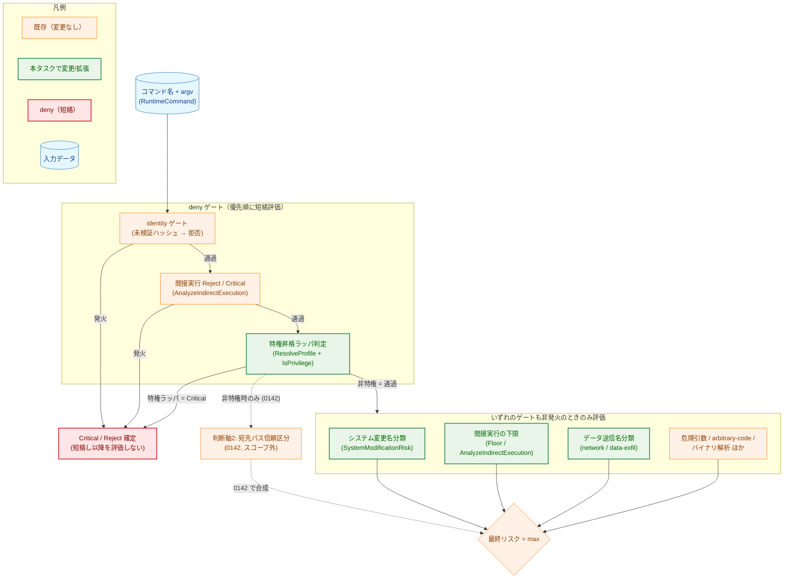
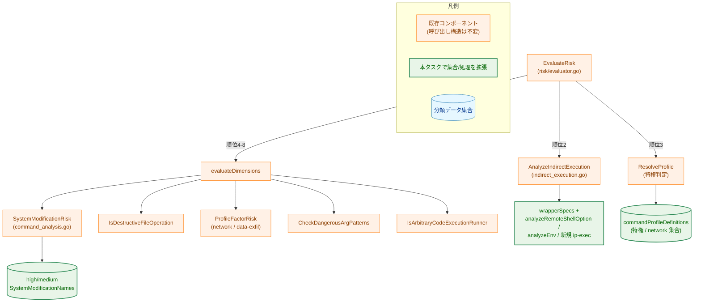
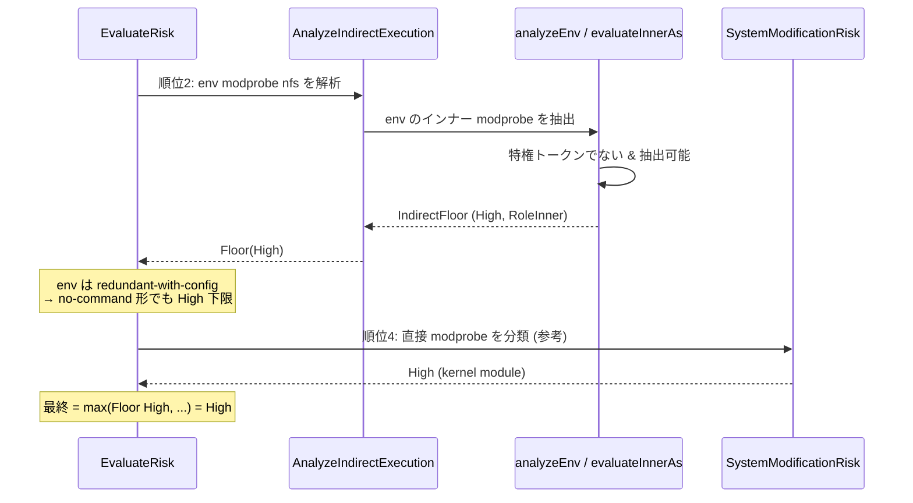
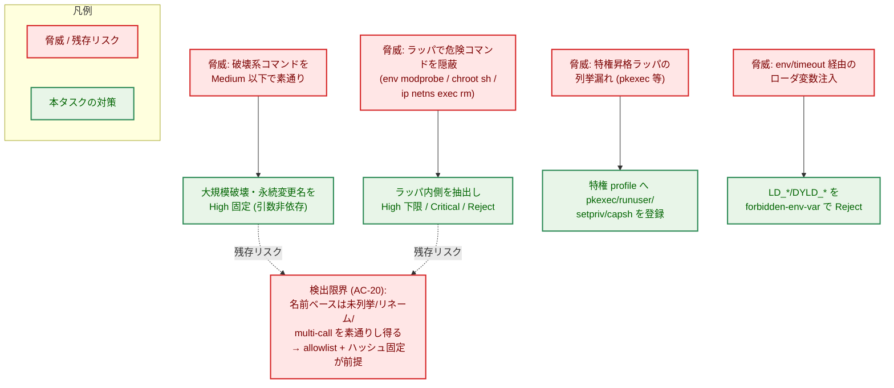
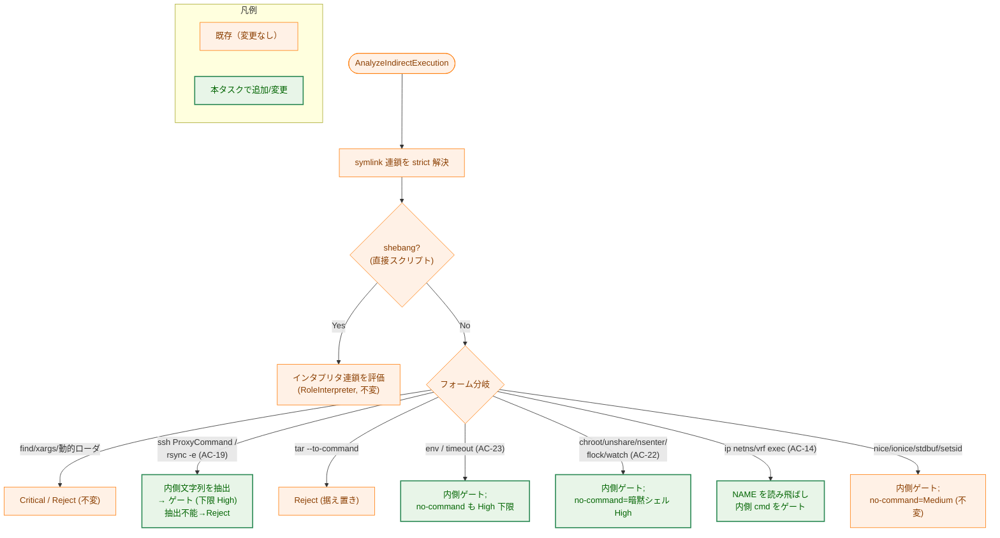

# 判断軸1: コマンド名分類の一貫化 — アーキテクチャ設計書

## Document Status

| Item | Value |
|---|---|
| Status | `approved` |
| Created | 2026-06-20 |
| Review date | 2026-06-21 |
| Reviewer | isseis |
| Comments | - |

> 本書は 0140 を 3 分割した第 1 タスク（判断軸1＝コマンド名分類）の設計である。要件は
> [01_requirements.md](01_requirements.md)、分割方針・根本原因への対処方針は
> [0140/00_decomposition.md](../0140_risk_level_classification_review/00_decomposition.md)、原典の確定アーキテクチャは
> [0140/02_architecture.md](../0140_risk_level_classification_review/02_architecture.md)（superseded）を参照する。
> 既存のリスク評価パイプライン（順位 1〜8）の全体像は
> [0136/02_architecture.md](../0136_runtime_risk_evaluation_enforcement/02_architecture.md)、間接実行リゾルバの全体像は
> [0138/02_architecture.md](../0138_indirect_inner_command_risk/02_architecture.md) を正とし、本書はそこへ
> 加える判断軸1 分の変更のみを記述する。

---

## 1. 設計の全体像

### 1.1 設計原則

- **判断軸1 は「コマンド名（とラッパ構造）だけで決まる固定レベル」に限定する**。argv 中の宛先パスの信頼区分判定
  （trust-critical/ordinary/safe-zone）は判断軸2（0142）の所掌であり、本タスクは触れない。最終リスクは、まず
  deny ゲート（identity・間接実行 Reject/Critical・特権 Critical）を優先順に短絡評価し、いずれも発火しない場合に
  限り残りの判定を max 合成して決まる（§1.2）。本タスクが整理した「名前で決まるレベル」のうち、特権昇格は
  短絡ゲート、それ以外（システム変更名・間接実行の下限（Floor）・データ送信ほか）は判断軸2 と max 合成される。
- **既存の判定へ素直に組み込む（DRY・YAGNI）**。本タスクは新しい評価経路や新レベルを追加しない。引き上げ対象は
  既存の名前ベース判定——システム変更名の評価基準（dimension）と、特権・間接実行の短絡ゲート——の
  **分類集合の拡張・再配置**として表現する。新しい分類関数や新しい `RiskLevel` 段階は導入しない
  （[01_requirements.md](01_requirements.md) §6）。
  - 用語: 本書では用語集（[translation_glossary.md](../../translation_glossary.md)）に倣い、**判断軸（axis）** を
    要件レベルの観点（判断軸1/判断軸2）に、**評価基準（dimension）** を `evaluateDimensions` が順位4-8 で max 合成する
    個々の評価因子の意味に限定して使う。特権・間接実行の Reject/Critical は短絡**ゲート**であって評価基準（dimension）
    ではない。
- **名前のみの粗粒度・fail-safe High**。名前で決まる分類は引数を見ない（`sysctl -a` のような read-only 形も
  例外を作らず High に倒す）。粗粒度ゆえの取りこぼしは安全側（過剰ブロック）に倒す。
- **後方互換不要＝新分類は直接適用（in-place 置換）**。ロールアウトフラグ・shadow 機構は設けない
  （[00_decomposition.md](../0140_risk_level_classification_review/00_decomposition.md) §3.2）。引き上げ／引き下げの
  周知（移行ノート）は 0143 が担う。
- **決定的・副作用なし・runtime==dry-run**。名前ベース判定は FS の内容や identity に依存せず（symlink 連鎖の
  メタデータ参照のみ）、runtime と dry-run で同一の結果を返す（NF-003）。

### 1.2 概念モデル

判断軸1 は、コマンド名・ラッパ構造から「固定のリスクレベル」を決める判定群である。評価は一律の並列ではなく、
まず **deny ゲート**（identity → 間接実行 Reject/Critical → 特権 Critical）を優先順に短絡評価し、いずれも
発火しない場合に**限り**、残りの評価基準と判断軸2 を並列に max 合成する。特権昇格ラッパ判定は「Critical を確定して
短絡するゲート」であり、判断軸2 とは排他である（特権ラッパはファイル操作コマンドでないため宛先パスを持たない）。



> 矢印 `A → B` は処理の流れを表す。`deny ゲート` は優先順（identity → 間接実行 → 特権）に評価し、`発火` した
> ゲートは Critical/Reject を確定して**短絡**する（以降を評価しない）。すべて `通過` したときに限り、残りの評価基準と
> 判断軸2（点線・0142 スコープ外）を `{ }`（ひし形＝max）で合成する。

> **特権昇格ラッパを「並列 max の一寄与」でなく「短絡ゲート」とする理由**: (1) Critical はリスクレベルの最上位で
> `max(Critical, X) = Critical` のため、短絡しても結果レベルを取りこぼさない（並列 max とレベル等価）。(2) 特権昇格
> ラッパは内側コマンドを透過実行するラッパでありファイル操作コマンドではないため、宛先パスを区分する判断軸2 とは
> 排他で、特権確定時に判断軸2 を評価する意味がない。(3) 既存 `EvaluateRisk` も順位3 で特権を短絡 Critical にしており
> （[risk/evaluator.go](../../../internal/runner/base/risk/evaluator.go)）、本モデルは実装に忠実。identity ゲートは
> 「未検証バイナリは分類自体を信頼できない」ため特権より前に置く（fail-closed）。

### 1.3 本タスクが変更する 4 経路と要件の対応

| # | 経路 | 変更内容 | 反映 AC |
|---|---|---|---|
| 1 | 特権昇格ラッパ（特権 profile） | Critical を特権昇格ラッパに限定し、profile を `pkexec`/`runuser`/`setpriv`/`capsh` まで拡張 | AC-16, AC-17 |
| 2 | システム変更名分類（`SystemModificationRisk`） | 大規模破壊・永続システム変更系を High に、限定スコープ系を Medium に再配置・拡張。`parted`/`fsck` を Medium→High に訂正 | AC-01〜AC-15, AC-21 |
| 3 | 実行ラッパ／間接実行（`indirect_execution.go`） | ラッパ集合に `chroot`/`unshare`/`nsenter`/`flock`/`watch` を追加、`env`/`timeout` を redundant-with-config として High 化、`ip netns/vrf exec`・`ssh -o ProxyCommand`/`rsync -e` のインナーを抽出ゲート | AC-14, AC-19, AC-22, AC-23 |
| 4 | データ送信名分類（network/data-exfil profile） | データ送信系の Medium 据え置きを担保（不足分の補完のみ。High 化＝書込先合成は 0142） | AC-18 |

加えて、検出限界（名前ベース AI 検出 vs 一般データ送信）の開発者向けドキュメント追記（AC-20）を含む。

---

## 2. システム構成

### 2.1 全体パイプライン中での位置づけ

本タスクは既存の `StandardEvaluator.EvaluateRisk`（順位 1〜8）の構造そのものは変えない。変更は、評価が
呼び出す**名前ベース分類器（`security` パッケージ）の分類集合**と**間接実行リゾルバのラッパ／オプション処理**に
限定される。下図で緑が本タスクで内容が変わるコンポーネント、橙が呼び出し構造として不変のコンポーネントである。



> 矢印 `A → B` は「A が B を呼び出す／B のデータを参照する」を表す。緑のノードは中身（分類集合・オプション処理）が
> 本タスクで拡張されるが、それを呼び出す評価フロー（橙）の構造・順位は変更しない。

### 2.2 コンポーネント配置

本タスクの変更は `internal/runner/base/security/` と `internal/runner/base/risk/` に閉じる。新規パッケージは
追加しない（DRY・YAGNI）。完了基準は触れる統合パッケージ（`./internal/runner/...` または `make test`）が
コンパイル・緑であること（NF-002）。

### 2.3 評価フロー（ラッパで包まれたコマンドの例）

`env modprobe nfs`（AC-22／AC-23）が評価される際の流れ。順位 1（identity ゲート）通過後、順位 2 の間接実行
リゾルバがラッパ `env` のインナー `modprobe` を抽出し、`RoleInner` のフラット High 下限を返す。直接の
`modprobe`（AC-04）も順位 4 の `SystemModificationRisk` で High に分類されるため、両経路は整合する。



> 本図は AC-22（`env modprobe` は High）と AC-23（`env`/`timeout` 自体が High）の整合を示す。インナーが
> 特権昇格ラッパ（`sudo` 等）なら `evaluateInnerAs` は Critical を返し、ローダ制御変数（`LD_PRELOAD` 等）は
> 従来どおり forbidden-env-var で Reject される（AC-23）。

---

## 3. コンポーネント設計

### 3.1 経路1: 特権昇格ラッパの限定と拡張（AC-16, AC-17）

Critical（無条件ブロック）は「任意の内側コマンドを透過実行する特権昇格ラッパ」に限定する。現状の特権 profile は
`sudo`/`su`/`doas` のみのため、`pkexec`/`runuser`/`setpriv`/`capsh` を `commandProfileDefinitions` の
`PrivilegeRisk(Critical, …)` profile へ新規登録する。これにより:

- 直接呼び出し（`/usr/bin/pkexec …`）が順位 3（`ResolveProfile` → `IsPrivilege`）で Critical になる。
- ネスト形（`env pkexec …` 等）は順位 2 の `evaluateInnerAs` → `isPrivilegeCommand`（profile 経由判定）で
  Critical になる。`isPrivilegeCommand` は profile を参照するため、profile への登録だけで両経路が同時に整う。

F-002 の権限付与／認証境界系（`visudo`/`useradd` 等）・カーネルモジュール（`insmod` 等）は High に留め、
Critical にはしない（AC-17。per-command の明示許可で正当な特権バッチを実行可能に保つ）。これらは経路2
（システム変更名分類 High）で扱う。

> 実装注意: `IndirectExecutionKind` の `IndirectCritical` の doc コメント（`indirect_execution.go`）は現状
> 「sudo/su/doas」を例示している。profile 拡張に合わせてこのコメントも `pkexec`/`runuser`/`setpriv`/`capsh` を
> 含む記述へ更新する。

インタフェース（既存・変更なし。profile 集合のエントリのみ追加）:

```go
// ResolveProfile は事前解決済みの名前集合から最も強い risk profile を返す（既存）。
func ResolveProfile(names map[string]struct{}) (profile CommandRiskProfile, found bool)

// IsPrivilege は profile が特権昇格を含むかを返す（既存）。
func (p CommandRiskProfile) IsPrivilege() bool
```

### 3.2 経路2: システム変更名分類の再配置・拡張（AC-01〜AC-15, AC-21）

名前のみ・引数非依存の固定レベル分類は、既存の評価基準（dimension）`SystemModificationRisk` へ集約する。本関数は
名前集合 → レベルの純関数であり、本タスクは**その背後の名前集合（High 層／Medium 層）を拡張**する。
レベルと理由コードのマッピングは既存のまま（`ReasonSystemModification`）で、新しい reason code は導入しない
（§7、NF-001。監査細分化の限界は §4 参照）。

**現状の名前集合（変更前）と本タスクの差分**: 現状の `highSystemModificationNames` はパッケージマネージャ群
＋`systemctl`/`service` のみ、`mediumSystemModificationNames` は `chkconfig`/`update-rc.d`/`mount`/`umount`/
`fdisk`/`parted`/`mkfs`/`fsck`/`crontab`/`at`/`batch` である。したがって本タスクの大半は **既存からの
移動ではなく純粋な新規追加（High／Medium）** であり、既存からの移動は Medium→High の 1 種のみである。内訳は次の
とおり:

- **Medium→High へ移動**: `parted`・`fsck`（AC-21）、`crontab`・`at`・`batch`（AC-12）、`chkconfig`・`update-rc.d`（AC-07）。
  これらは現状 Medium 集合にあり、High 集合へ移す。
- **新規 High 追加（現状は未分類＝Low）**: kernel/module（AC-04）、account/auth（AC-05）、bootloader（AC-06）、power（AC-08）、
  firewall（AC-09）、`setcap`（AC-10）、trust-intrinsic（AC-11）、`systemd-run`（AC-12）、大規模破壊・デバイス初期化
  `wipefs`/`blkdiscard`/`sgdisk`/`mkswap`/LVM 破壊系/`e2fsck` 系（AC-01〜AC-03）。
- **新規 Medium 追加（現状は未分類＝Low）**: LVM 作成系（AC-13）、`ip`/`ifconfig`/`route`（AC-14）。`mount`/`umount` は
  Medium 据え置き（AC-15）。

> **アップグレード時の影響（後方互換なし・直接適用の帰結）**: 上記は段階ロールアウト・shadow を伴わず enforce へ
> 直接適用される（§1.1）。よってアップグレード後、firewall（`iptables` 等）・kernel module（`modprobe` 等）・account
> （`useradd` 等）・bootloader・scheduler（`crontab`/`systemd-run` 等）・デバイス破壊系を **High 未満の `risk_level` で
> 実行していた既存 config は deny される**。これを緩和する実行時フラグは設けない。破壊的変更の周知（移行ノート）と
> sample/test config の追従は 0143 が担う（[00_decomposition.md](../0140_risk_level_classification_review/00_decomposition.md) §3.2）。

インタフェース（既存・シグネチャ変更なし）:

```go
// SystemModificationRisk は名前集合のみからシステム変更リスクを返す（引数は見ない）。
// 戻り値型・パッケージ prefix は既存のまま（runnertypes.RiskLevel）。
func SystemModificationRisk(names map[string]struct{}) runnertypes.RiskLevel
```

名前集合の再配置方針（確定列挙は実装成果物。代表例は [01_requirements.md](01_requirements.md) §4 を正とする）:

| 層 | 対象（代表例・AC） | レベル |
|---|---|---|
| High（大規模・不可逆破壊） | `parted`/`fsck.*`/`wipefs`/`blkdiscard`/`sgdisk`/`mkswap`（AC-01）、LVM 破壊系 `lvremove`/`vgremove`/…（AC-02）、`mkfs.*`/`fdisk`/`e2fsck`/…（AC-03） | High |
| High（永続システム変更・特権コード・権限付与・信頼境界） | kernel/module `insmod`/`modprobe`/`rmmod`/`kexec`/`sysctl`（AC-04）、account/auth `useradd`/…/`visudo`（AC-05）、bootloader `grub-install`/`efibootmgr`/…（AC-06）、boot service `chkconfig`/`update-rc.d`（AC-07）、power `shutdown`/`reboot`/…（AC-08）、firewall `iptables`/`nft`/`ufw`/`firewall-cmd`（AC-09）、`setcap`（AC-10）、trust-intrinsic `update-alternatives`/`dpkg-divert`/`ldconfig`（AC-11）、scheduler `crontab`/`at`/`batch`/`systemd-run`（AC-12） | High |
| Medium（限定スコープのシステム変更） | LVM 作成系 `lvcreate`/`vgcreate`/…（AC-13）、`ip`/`ifconfig`/`route`（AC-14）、`mount`/`umount`（AC-15） | Medium |

留意点:

- **`mkfs.*`/`fsck.*` 等のサフィックス付き派生名（現状の対象範囲を正確に）**: 現状 `CheckDangerousArgPatterns` は `mkfs.` プレフィクス
  （`strings.HasPrefix(n, "mkfs.")`）のみを High 特例化しており、`mkfs.ext4` は既に High。一方 **`fsck.*` のプレフィクス
  特例は存在せず**、`fsck.ext4` は現状 Medium（`mediumSystemModificationNames`）止まりである。また静的
  `dangerousCommandPatterns` には `mkfs`/`fdisk` はあるが `parted`/`fsck` は無い。したがって AC-01／AC-03 を満たすには、
  bare 名（`mkfs`/`fdisk`/`parted`/`fsck`）の High 化を `SystemModificationRisk` 側で担保することに加え、`mkfs.` と
  同様の **`fsck.*` 派生名規則** を追加する（bare 名集合だけでは `fsck.ext4` を捕捉できない）。`mkfs.` と `fsck.` で
  max 合成される。
- **`iptables-save`/`ip6tables-save`（stdout）**: 既定 Low のまま据え置く（`-f <file>` 出力先のパス信頼区分判定は
  0142）。High 名集合へは含めない（AC-09）。
- **`ip netns exec`/`ip vrf exec`**: `ip` 自体は Medium（AC-14）だが、これらサブコマンドは内側コマンドの間接実行で
  あり、経路3（§3.3）で別途扱う。

> **0139 AC-06 乖離の訂正（AC-21）**: 0139 は `fdisk`/`mkfs`=Medium を維持としていたが、実装は High だった。本タスクは
> `fdisk`/`mkfs`/`parted`/`fsck`=High を正として訂正する（`parted`/`fsck` を Medium→High へ引き上げる）。0139 の
> ドキュメントには触れず、訂正の文書反映は 0143。

### 3.3 経路3: 実行ラッパ／間接実行の拡張（AC-14, AC-19, AC-22, AC-23）

間接実行リゾルバ `AnalyzeIndirectExecution`（[0138](../0138_indirect_inner_command_risk/02_architecture.md)）の
ラッパ集合・オプション処理を拡張する。リゾルバの分岐構造（Critical/Reject/Floor の取り込み方）は変更しない。

インタフェース（既存・シグネチャ変更なし）:

```go
// AnalyzeIndirectExecution はコマンドが検証済み以外の成果物を実行/ロードするかを判定する（既存）。
func AnalyzeIndirectExecution(cmdPath string, args []string) IndirectExecutionResult

// IndirectExecutionResult / IndirectExecutionKind は既存型（再掲・変更なし）。
type IndirectExecutionResult struct {
    Kind        IndirectExecutionKind
    Level       runnertypes.RiskLevel
    ReasonCodes []risktypes.ReasonCode
    Reasons     []string
    ErrorClass  risktypes.ErrorClass
    Artifacts   []risktypes.ExecutedArtifact
}
```

#### (a) 名前空間/ルート変更・コマンド文字列ラッパの追加（AC-22）

`chroot`・`unshare`・`nsenter`（名前空間/ルート変更ラッパ）と `flock`・`watch`（コマンド文字列ラッパ）を
間接実行ファミリへ追加する。内側コマンドを抽出して `evaluateInnerAs` で評価し、外側で素通りさせない
（最終リスク = 内側評価値を High 以上に引き上げる＝`RoleInner` のフラット High 下限。特権トークンは Critical、
ローダ変数等の禁止形は Reject）。

> **ラッパの追加方法（`wrapperSpec` か専用ハンドラかの切り分け）**: 既存の `wrapperSpec` は
> 「`valueOpts`＋固定個数の `positionals` の後に COMMAND」しか表現できず、`nice`/`timeout` のような単純形にしか
> 適合しない。本タスクが追加する 5 コマンドはいずれもこの固定モデルに収まらず、**専用ハンドラ**（既存の
> `analyzeEnv`/`analyzeTaskset` と同様の per-command 関数）を要する。理由を以下に明示する。

- **no-command 形（COMMAND 省略形）= 暗黙シェル起動（High）**: `chroot /mnt`・`unshare`・`nsenter -t 1 -m` のように
  内側コマンドを伴わない形は、対象ツールがシェルを起動するため、内側未指定でも **High 下限** を返す
  （`unshare -r`・`nsenter -t 1` 等の特権/名前空間エスケープ形を素通りさせない）。これは汎用 `analyzeWrapper`
  （`nice`/`ionice`/`stdbuf`/`setsid` 等）の no-command **Medium** 下限とは異なるため、**汎用ラッパ経路には載せられない**
  （専用ハンドラで no-command 分岐を High に倒す）。なお `env`/`timeout` の no-command 形も §(c) により High になるが、
  その High は暗黙シェル起動ではなく redundant-with-config（安全な TOML 代替がある）に由来する別経路である。
- **`chroot NEWROOT [COMMAND]` の先頭の位置引数**: `chroot` は先頭に NEWROOT という位置引数（例 `/mnt`）を取り、
  その後に COMMAND が省略可能。固定 `positionals=1` モデルでは `chroot /mnt` の `/mnt` を内側コマンドと誤抽出する
  （`/mnt` は `/` 始まりのため `strings.HasPrefix(cmd, "-")` の reject ガードにも掛からない）。よって NEWROOT を
  読み飛ばしつつ no-command を判別する専用処理が要る。
- **`nsenter`/`unshare` の value-option grammar**: これらは値を取るオプションが `-t PID` 以外にも複数あり
  （`-S UID`・`-G GID`・`-w DIR` 等）、値を取らないオプション（`unshare -r` 等）と混在する。しかも値を取る集合は
  `nsenter` と `unshare` で異なる。`valueOpts` を取りこぼすと operand 境界を誤り、オプションの値（PID・UID/GID 等）を
  内側コマンドと誤抽出して内側の検証をすり抜ける（例: `nsenter -S 0 sh` の `0` を内側コマンドと誤判定し、本来の `sh` を
  ゲートし損なう＝fail-open）。よって実装では `-t` だけでなく**各ツールの値を取るオプションを網羅的に** `valueOpts` へ
  登録する。fail-closed 規約に従い、境界不確定は Reject、誤って `-` 始まりトークンを内側と判定した場合も Reject に倒す。
- **`flock`/`watch` のコマンド文字列形**: `flock <file> <cmd>` はトークン列だが、`flock -c "<cmd-string>"` と
  `watch "<cmd-string>"` は `/bin/sh -c` に渡されるシェルコマンド文字列であり、トークン列ではない。コマンド文字列の
  抽出は §(d) と同じ **シェルコマンド文字列の fail-closed 分割規約**（シェルメタ文字を含む文字列は抽出せず Reject）に従う。
  抽出可能な場合は first-token を内側コマンドとしてゲート（下限 High）、抽出不能形は Reject。

#### (b) `ip netns exec` / `ip vrf exec` の内側ゲート（AC-14）

`ip` は経路2 で Medium（AC-14）だが、`ip netns exec <NAME> <cmd>`・`ip vrf exec <NAME> <cmd>` は内側 `<cmd>` を
透過実行する間接実行形（AC-22 と同じ間接実行ファミリ）として扱う。`<NAME>` を読み飛ばして内側 `<cmd>` を抽出し、
`evaluateInnerAs`（`RoleInner`）でゲートする。最終リスク = 内側評価値を High 以上に引き上げる（下限 High）。

- 例: `ip netns exec ns rm -rf /` → 内側評価かつ最低 High、`ip netns exec ns modprobe x` → High。
- **間接実行として扱うのは `netns exec`／`vrf exec` の形のみ**。`exec` 以外のサブコマンド（`ip netns list`／`add`／
  `delete`、`ip vrf show` 等）は間接実行ではない（`IndirectNone`）として、通常の `ip`（Medium、経路2）で評価する。
  ブロックはしない。
- Reject になるのは、`netns`／`vrf` の `exec` 形であることは確定したが内側を安全に抽出できない場合に限る
  （`exec` の後に `<cmd>` が無い、`<NAME>` を抽出できない等）。すなわち「`exec` 形だが抽出不能」のみ fail-closed で
  Reject であり、非 `exec` サブコマンドは対象外。

#### (c) `env` / `timeout` を redundant-with-config として High 化（AC-23）

安全な TOML 代替がある実行ラッパ `env`（→ `env_vars`/`env_import`）・`timeout`（→ `timeout`）は、直接呼び出しを
High に分類する（無害に見える形も含む）。

- **挙動変更点**: 現状、`env`/`timeout` の **no-command 形**（`env FOO=bar` 単独、`timeout 5` 単独）は Medium 下限を
  返す。本タスクは `env`/`timeout` のラッパ自体下限を **High** に引き上げる（redundant-with-config 由来）。
- **内側ゲートは従来どおり**: 内側コマンドがあれば `evaluateInnerAs`（`RoleInner`）が既にフラット High を返すため、
  `env dpkg -i` は High、`sudo env …`／`env sudo …` は Critical のまま。`env` 経由のローダ制御変数（`LD_PRELOAD` 等）は
  従来どおり forbidden-env-var で Reject。Critical にはしない。
- **代替の無いラッパには課さない**: `nice`/`ionice`/`stdbuf`/`setsid` には redundant 由来の追加下限を課さない
  （no-command 形は従来どおり Medium）。ただし抽出可能ラッパ内側の一律 High 下限は維持する。

**実装上の注意（下限は 2 つの異なる経路に存在する）**: `env` の no-command 下限は `analyzeEnv` 内（複数箇所）で、
`timeout` の no-command 下限は `nice`/`ionice`/`stdbuf`/`setsid` 等と共有の汎用 `analyzeWrapper` 内で発行される。
`env` は `analyzeWrapper` を通らない（専用 `analyzeEnv` へ分岐する）ため、単一テーブルでは両者を駆動できない。
したがって、**no-command 下限のレベルを各パース箇所でラッパ名により切り替える**——`env`/`timeout` なら High、
それ以外は Medium とする（`timeout` 用には、汎用ラッパ経路の floor レベルをラッパ種別ごとに保持できるよう拡張する）。
この切り替えはパース箇所（ラッパ抽出時）で行うため、トップレベルでも他ラッパにネストされた `timeout`（例
`nice timeout 5`）でも一貫して High になる。レベル差のみで、reason code は既存の `ReasonIndirectExecutionWrapper` を
流用する。テストでトップレベル `timeout 5`=High とネスト `nice timeout 5`=High の双方を固定する（§7.1）。

#### (d) ヘルパー実行オプションの内側抽出（AC-19）— 既存 remote-shell 方針への例外

`ssh -o ProxyCommand=…`／`-o LocalCommand=…`・`rsync -e`/`--rsh=COMMAND` を、ローカルでヘルパーを実行させる
オプション名として検出し、間接実行として扱う。最終リスク = 内側コマンド文字列を抽出して内側ゲート
（評価値、下限 High）、抽出不能なら Reject。これはオプション名の検出であり、宛先パスの信頼区分解析ではない
（判断軸2 と区別。AC-19）。

> **シェルコマンド文字列の fail-closed 分割規約（最重要・fail-open 回避の要）**
>
> オプション値（`rsync -e` の値、`ssh -o ProxyCommand=` の値、§(a) の `flock -c`/`watch` 文字列）は、ツールが
> `/bin/sh -c` でシェル解釈する**コマンド文字列**であり、単純なトークン列ではない。素朴な「先頭トークンだけ取って
> ゲート」は fail-open になる（例: `rsync -e 'ssh; rm -rf /'` は `ssh`=Medium と判定し `; rm -rf /` を取りこぼす、
> `ssh -o ProxyCommand='nc %h %p; modprobe evil'` は `nc` と判定し trailer を取りこぼす、`rsync -e "$(printf sudo)"` は
> 置換のため `sudo`＝Critical を取りこぼす）。
>
> したがって**抽出は既存の `analyzeEnvSplitString`（`env -S`）と同一の fail-closed 分割規約に束縛する**:
> 値がシェルメタ文字（`\ ' " $ # \``、および `;` `|` `&` 等）を含む、あるいは忠実な whitespace 分割に還元できない
> 場合は **ゲートせず Reject**。クリーンに whitespace 分割できる値のみ first-token を内側コマンドとして評価し、
> **first-token 以降の全トークンを内側 args として持ち回る**（trailer を黙って捨てない。なお `;`/`|`/`&` を含めば
> 上記によりそもそも Reject）。これにより「抽出不能なら Reject」の安全性が担保され、0138 §3.4 の fail-closed 姿勢は
> 後退しない。
>
> **2 つの実装サブケース（難易度が異なる）**:
> 1. **`rsync -e`/`--rsh` の再分類**: `rsync` は既に `remoteShellOptionPrefixes`（`analyzeRemoteShellOption`）で
>    検出されている。本タスクはこれを「一律 Reject」から「値を上記の分割規約で抽出 → 内側ゲート（下限 High）、抽出不能なら
>    Reject」へ変更する（rsync を当該 Reject 経路から移管）。
> 2. **`ssh -o ProxyCommand=`/`LocalCommand=` の新規検出**: `ssh` は現状 `remoteShellOptionPrefixes` に存在せず
>    （rsync/tar のみ）、`-o KEY=VALUE` のサブオプション解析も存在しない。本タスクは rank-2 間接実行経路に
>    **新規サブパーサ**を追加する。これは `-o` を値オプションとして認識し（分離形 `-o ProxyCommand=…`・連結形
>    `-oProxyCommand=…`・分離値 `-o` `ProxyCommand=…`、および空白区切り形 `-o "ProxyCommand …"`）、その値の中の
>    `ProxyCommand`/`LocalCommand` を **`KEY=VALUE`（等号区切り）と `KEY VALUE`（最初の空白/タブ区切り）の両形式**で
>    認識し、コマンド文字列を上記の分割規約で抽出する。OpenSSH は等号区切りと空白区切りの両方を受け付けるため、
>    等号のみ対応にすると空白区切りの `ProxyCommand` を取りこぼして rank-2 ゲートをバイパスし、通常の `ssh`（Medium）
>    として通る fail-open になる。これは単純なオプション名一致である rsync `-e` より難易度が高く、別ケースとして扱う。`ssh` の Medium プロファイル
>    （AC-18）と本 High 下限は max 合成され実効 High になるが、検出は rank-2（プロファイル評価より前）で行う。

> **既存方針への意図的な例外（インライン明示）**
>
> - **原方針と所在**: [0138/02_architecture.md](../0138_indirect_inner_command_risk/02_architecture.md) §3.4
>   （及び脅威フロー図）は、remote-shell / 出力フィルタ系ヘルパー（`rsync -e`/`--rsh`・`tar --to-command`/
>   `--checkpoint-action`）を「ヘルパーが当該ツールの子プロセスから起動され identity 束縛できない」ため一律
>   **Reject** と定め、`analyzeRemoteShellOption`/`remoteShellOptionPrefixes` がこれを実装している。
> - **例外の理由**: AC-19 は `ssh -o ProxyCommand`/`rsync -e`/`--rsh` を「内側コマンド文字列を抽出してゲートする
>   間接実行形」に再分類する。インナーは依然 fd 束縛・ハッシュ検証できないため、抽出できた場合は他のラッパ内側
>   （`RoleInner`）と同じ **フラット High 下限**（特権トークンなら Critical）に倒し、**抽出不能なら従来どおり
>   Reject**（fail-closed は後退しない）。これにより「一律ブロック」から「明示オプトイン（`risk_level = "high"`）
>   下でのみ実行可」へ緩和され、他の抽出可能ラッパと整合する。`tar --to-command`/`--checkpoint-action` は AC-19 の
>   対象外であり、**Reject のまま据え置く**（コマンド文字列の抽出位置が `tar` のアーカイブ処理と不可分で、安全に
>   first-token を取り出せないため）。
> - **旧挙動を assert する既存テスト（要更新）**: `indirect_execution_test.go::TestIndirect_CommandExecOptionsGated`
>   は `rsync -e`/`--rsh`/`-essh`/`-avze ssh` を `IndirectReject` と assert している。これらは extract+gate（下限 High、
>   抽出不能のみ Reject）へ更新が必要。`tar --to-command`/`--checkpoint-action` のケースは Reject のまま据え置く。
>   `ssh -o ProxyCommand`/`LocalCommand` は新規ケースとして追加する。

### 3.4 経路4: データ送信名分類の Medium 据え置き（AC-18）

データ送信系 `curl`・`wget`・`scp`・`sftp`・`rsync`・`ssh`・`nc` はデータ送信の判断軸で Medium を維持する
（High へ引き上げない）。ローカル trust-critical 書込形（`curl -o /usr/bin/x` 等）の High 化、および
`max(名前 Medium, 書込先 High)` の合成は 0142 の所掌であり、本タスクは Medium 据え置きのみを担保する。

現状の `commandProfileDefinitions` の対象範囲を正確に述べる: `curl`/`wget`（Always, Medium）・`scp`/`ssh`（Always,
Medium）・`nc`/`netcat`/`telnet`（Always, Medium）は無条件 Medium。`rsync` は `ConditionalNetwork()`（サブコマンド
無し）であり、`ProfileFactorRisk` が Medium を返すのはリモートスタイル引数（`host:path` 形）が存在するときのみで、
ローカルのみの `rsync /a /b` は現状 Low である。`sftp` は profile が無く現状 Low。

本タスクは AC-18 の「データ送信の判断軸で Medium を維持」を満たすため、欠落しているデータ送信系（`sftp`）の Medium
network profile を補完する。`sftp` は `ssh`/`scp` と同質（常にリモート接続、AlwaysNetwork の Medium）であるため、
実装上は新規 profile を起こすのではなく既存の `NewProfile("ssh", "scp")` を `NewProfile("ssh", "scp", "sftp")` へ
拡張する（DRY）。`rsync` の Medium はリモートスタイル引数がある形に条件付き（無条件ではない）であり、これは
「データ送信の判断軸」としての据え置きであって、本タスクで無条件 Medium へ引き上げることはしない（書込先合成の
High 化は 0142）。それ以外のレベル変更は行わない。

### 3.5 検出限界の文書化（AC-20, `static`）

名前ベース AI 検出（`claude`/`gemini` 等 = High）は一般的なデータ送信（Medium）を塞ぐものではなく、salient な明示
ケースの defense-in-depth であること、未列挙/リネーム/multi-call が素通りし得ること（安全運用は allowlist＋ハッシュ
固定前提）を、開発者向けドキュメント `docs/dev/architecture_design/command-risk-evaluation.ja.md` に追記する。
ユーザー向け文書の最終整合・日英反映・移行ノートは 0143 が所有する（本 AC は doc 追記の有無を `static` 検証）。

### 3.6 コンポーネント責務（新規・変更ファイル一覧）

| ファイル | 区分 | 責務／変更内容 | 反映 AC | 要更新の既存テスト |
|---|---|---|---|---|
| `internal/runner/base/security/command_analysis.go` | 変更 | `commandProfileDefinitions` へ特権ラッパ（`pkexec`/`runuser`/`setpriv`/`capsh`）と `sftp` Medium を追加。`highSystemModificationNames`／`mediumSystemModificationNames` を拡張（大半は新規 High 追加。移動は `parted`/`fsck`/`crontab`/`at`/`batch`/`chkconfig`/`update-rc.d` の Medium→High のみ）。kernel/auth/boot/power/FW/setcap/trust-intrinsic/`systemd-run`/デバイス破壊系を High 新規追加、LVM 作成・`ip`/`ifconfig`/`route` を Medium 新規追加。`fsck.*` 派生名規則を追加（§3.2） | AC-01〜AC-18, AC-21 | `command_analysis_test.go::TestSystemModificationRisk`（`parted`/`fsck`/`crontab`/`at`/`batch`/`chkconfig`/`update-rc.d`=Medium）、`TestCommandRiskProfiles_PrivilegeEscalation`／`TestMigration_IsPrivilegeConsistency`（特権=sudo/su/doas のみ） |
| `internal/runner/base/security/indirect_execution.go` | 変更 | 専用ハンドラ（固定 `wrapperSpec` では表現不可、§3.3(a)）で `chroot`/`unshare`/`nsenter`/`flock`/`watch` を追加（no-command=High 下限）。`ip netns/vrf exec` の内側抽出。`env`/`timeout` の redundant-with-config High 下限（名前キー、ネストでも適用）。`rsync -e`/`--rsh` を Reject→抽出ゲート化（`analyzeRemoteShellOption` から移管）、`ssh -o ProxyCommand`/`LocalCommand` の新規 `-o` サブパーサ追加。コマンド文字列は §3.3(d) の fail-closed 分割規約に束縛。`tar --to-command`/`--checkpoint-action` は Reject 据え置き | AC-14, AC-19, AC-22, AC-23 | `indirect_execution_test.go::TestIndirect_CommandExecOptionsGated`（rsync=Reject。tar は据え置き）、`TestIndirect_WrapperNoCommandMedium`（env/timeout no-command=Medium） |
| `internal/runner/base/risk/evaluator.go` | 参照（基本不変） | 順位 1〜8 の構造・取り込み方は不変。本タスクの分類拡張は evaluator が既に呼ぶ `security` 関数群に閉じる。0142 が `evaluateDimensions` をこの上に構築する（[00_decomposition.md](../0140_risk_level_classification_review/00_decomposition.md) §2） | — | `evaluator_test.go::TestStandardEvaluator_EvaluateRisk_PrivilegeEscalation`（特権=sudo/su/doas のみ。pkexec 等を追加） |
| `docs/dev/architecture_design/command-risk-evaluation.ja.md` | 変更 | 名前ベース AI 検出の検出限界（AC-20）を追記 | AC-20 | （doc。`static` 検証） |

> **副作用契約（明示）**: 本タスクは `--dry-run`/`--force` 等の副作用切替フラグを新設しない。判断軸1 の分類は
> symlink 連鎖のメタデータ参照（`Lstat`/`Readlink`）のみで、書込・削除・ネットワーク送信を一切行わず、runtime と
> dry-run で同一の判定結果を返す（NF-003）。`env` 経由の `LD_*`/`DYLD_*` ローダ制御変数は分類段階で Reject される
> （実行に至らない）。

---

## 4. エラーハンドリング設計

本タスクは新しいエラー型を導入しない。判定の deny は既存の 2 形態（評価結果に載せる non-error）で表現する:

- **Critical（無条件ブロック）**: 特権昇格ラッパ。`IndirectCritical`／順位 3 の Critical plan。理由コード
  `ReasonPrivilegeEscalation`。
- **Reject（Blocking deny）**: 抽出不能なヘルパー実行オプション、`ip … exec` の内側欠落、ローダ制御変数
  （`ReasonForbiddenEnvVar`）、抽出不能ラッパ（`ReasonIndirectExecutionRejected`）。`tar --to-command`/
  `--checkpoint-action` は Reject 据え置き。

fail-closed の原則は既存どおり: 名前解決失敗（`ErrorClassSymlinkResolution`）、オプション境界の不確定
（unknown-arity）、内側コマンドの抽出不能はいずれも Reject に倒す。本タスクが追加する経路（ip-exec・新ラッパ・
ヘルパーオプション）も同じ fail-closed 規約に従う。

理由コード（reason code）は既存のもの（`ReasonSystemModification`／`ReasonIndirectExecutionWrapper`／
`ReasonPrivilegeEscalation`／`ReasonArbitraryCodeExecution`／`ReasonProfileNetwork`／`ReasonProfileDataExfil`／
`ReasonForbiddenEnvVar`／`ReasonIndirectExecutionRejected`）を流用し、**新規 `ReasonCode` は導入しない**
（§7、NF-001。監査ストリームの family 区別の最終化は 0143）。

> **監査粒度の限界（受容する時限リスクとして明示）**: 既存コードを流用する結果、本タスクが引き上げる多数の deny は
> 2 コードに収斂する——AC-01〜AC-15 の全域（`wipefs` から `apt list` まで）が `ReasonSystemModification`、env-redundant
> ／chroot-no-command／ip-exec／AC-19 ヘルパーオプションの全域が `ReasonIndirectExecutionWrapper`。加えて
> `evaluateInnerAs` の `RoleInner` フラット High 経路は人間可読 `Reasons` を持たず、`SystemModificationRisk` も
> per-command の reason 文字列を持たない。そのため、例えば「ディスク破壊 High」と「パッケージマネージャ High」、
> 「`chroot sh` deny」と「`env true` deny」は **監査ストリーム上で区別できない**。本タスクはこの粗さを許容し、
> family 区別（コード細分化）の最終化を 0143 へ委ねる。緩和として、deny 行には常に評価対象のコマンドライン
> （`ResolvedPath`/argv）が含まれるため、on-call は理由コードに加えコマンド名から原因を再構成できる。この時限リスクを
> 受容することを設計上の明示判断とする（0143 完了までの期間に限る）。

---

## 5. セキュリティ考慮事項

### 5.1 設計上のセキュリティ・パターン

- **fail-safe High（粗粒度の安全側）**: 名前のみで決まる分類は引数で例外を作らない。read-only に見える形
  （`sysctl -a`・`env`/`timeout` の no-command 形）も High に倒す。
- **ラッパ素通りの遮断**: 名前空間/ルート変更ラッパ・コマンド文字列ラッパ・ヘルパー実行オプションを通じて
  危険な内側コマンドを「外側で素通り」させない。内側を抽出して High 以上に引き上げ、特権昇格は Critical、
  抽出不能は Reject に倒す。
- **特権昇格の限定と網羅**: Critical を特権昇格ラッパに限定しつつ、profile への登録で直接形・ネスト形の両経路を
  同時に塞ぐ（`isPrivilegeCommand` が profile を参照するため、登録漏れによる片側バイパスを構造的に防ぐ）。

### 5.2 脅威モデル



> 矢印 `脅威 → 対策` は「当該脅威を当該対策が緩和する」を表す。点線 `対策 → 残存リスク` は、名前ベース粗粒度
> ゆえに対策後も残る検出限界を表す。残存リスクは本タスクで塞がず、文書化（AC-20）と運用前提（allowlist＋
> ハッシュ固定）で受容する。

### 5.3 TOCTOU / 決定性

名前ベース分類は symlink 連鎖を strict 解決（`ResolveCommandNames`、cycle/depth/解決失敗は fail-closed）した上で
名前集合に対して行う。identity の fd 束縛・ハッシュ検証は既存の順位 1 / 実行段階が担い、本タスクは変更しない。
ラッパ内側は元々 fd 束縛対象外であり（[0138](../0138_indirect_inner_command_risk/02_architecture.md) §5.2）、本タスクの
ヘルパーオプション抽出（AC-19）もこの前提を踏襲する（抽出できても内側はハッシュ検証されないため High 下限に倒す）。

---

## 6. 処理フロー詳細

### 6.1 間接実行リゾルバの分岐（本タスクの追加点を明示）



> 矢印 `A → B` は「A の判定の次に B へ進む」を表す。`{ }`（ひし形）は分岐点。緑が本タスクの追加/変更点で、
> いずれも内側コマンドを抽出して High 以上に倒す（抽出不能は Reject）という既存の `RoleInner` 規約に揃える。

### 6.2 組み込み／受け渡し（根本原因4 の明示）

[00_decomposition.md](../0140_risk_level_classification_review/00_decomposition.md) §3.4 が求める end-to-end の
組み込みを明示する。本タスクの分類拡張が実際に最終リスクへ反映される経路は次のとおり:

```
TOML (risk_level) → config loader → RuntimeCommand
  → EvaluateRisk
     ├ 順位2: AnalyzeIndirectExecution（新ラッパ/ip-exec/ヘルパーオプション）→ IndirectExecutionResult
     ├ 順位3: ResolveProfile（特権 profile 拡張）→ Critical
     └ 順位4-8: evaluateDimensions
          └ SystemModificationRisk（名前集合拡張）等 → RiskAssessment
  → max 合成 → RiskAssessment（Level/ReasonCodes/Reasons）
  → resource manager（enforce / dry-run 共通）→ audit logger
```

DTO・パッケージ依存は既存のまま（`security → risktypes → runnertypes` の一方向）。本タスクは新 DTO・新型を
追加しないため、import cycle の懸念は生じない（オペランド毎の監査 DTO 配置は 0142 の所掌）。完了ゲートは
中核 `security`/`risk` パッケージに加え、これらを使う統合パッケージ（`internal/runner`）がコンパイル・緑で
あること（NF-002）。

---

## 7. テスト戦略

### 7.1 単体テスト

- **システム変更名分類（AC-01〜AC-15, AC-21）**: `TestSystemModificationRisk` を表駆動で拡張。High 層・Medium 層の
  代表コマンドが期待レベルを返すこと、特に `parted`/`fsck`/`crontab`/`at`/`batch`/`chkconfig`/`update-rc.d` の
  Medium→High、kernel/auth/boot/power/FW/setcap/trust-intrinsic/`systemd-run`・デバイス破壊系の新規 High、LVM 作成・
  `ip`/`ifconfig`/`route` の新規 Medium を検証。`fsck.ext4` 等の派生名が High になること（`fsck.*` 規則）も検証。
- **特権ラッパ（AC-16, AC-17）**: `TestCommandRiskProfiles_PrivilegeEscalation`／`TestMigration_IsPrivilegeConsistency`／
  `evaluator_test.go::TestStandardEvaluator_EvaluateRisk_PrivilegeEscalation` に `pkexec`/`runuser`/`setpriv`/`capsh` を
  追加し、直接形・ネスト形（`env pkexec …`）が Critical になること、F-002 系（`visudo`/`insmod`）が High であって
  Critical ではないことを検証。
- **間接実行（AC-14, AC-19, AC-22, AC-23）**:
  - 新ラッパ `chroot`/`unshare`/`nsenter`/`flock`/`watch` の内側ゲート（High 下限／Critical／Reject）、no-command 形の
    暗黙シェル High。
  - `ip netns exec ns rm -rf /`=High・`ip netns exec ns modprobe x`=High、内側欠落=Reject。
  - `env`/`timeout` の no-command 形 = High（`TestIndirect_WrapperNoCommandMedium` の env/timeout ケースを High へ更新。
    `nice`/`ionice`/`stdbuf`/`setsid` は Medium 据え置きの回帰確認）。トップレベル `timeout 5`=High と、他ラッパに
    ネストした `nice timeout 5`=High の双方を固定し、名前キー適用がネスト深さに依らないことを検証。
  - `ssh -o ProxyCommand=…`/`rsync -e ssh`=High 下限・抽出不能=Reject（`TestIndirect_CommandExecOptionsGated` の
    rsync ケースを Reject→High/Reject へ更新、`tar` ケースは Reject 据え置きの回帰確認、ssh ケースを新規追加）。
    シェルコマンド文字列の fail-closed 分割規約の検証として、シェルメタ文字を含む値（`rsync -e 'ssh; rm -rf /'`・
    `ssh -o ProxyCommand='nc %h %p; modprobe x'`・置換形）が Reject になること、特権トークンを含む抽出可能形
    （`rsync -e 'sudo cmd'`）が Critical になることを検証。

### 7.2 統合テスト

- `EvaluateRisk` レベルで、引き上げ対象コマンドが deny されたとき対応する理由コードが評価結果に付与されること
  （NF-001）。`env modprobe`／直接 `modprobe` の整合（双方 High）。

### 7.3 セキュリティテスト

- バイパス回帰: 新ラッパ・ip-exec・ヘルパーオプション経由で危険な内側（`rm -rf`/`modprobe`/`sudo`）を素通り
  させないこと。特権ラッパ列挙漏れ（pkexec のネスト）が Critical を逃さないこと。
- 理由コード網羅性: `reason_codes_test.go::TestReasonCodes_AllDistinct` は本タスクで新規コードを追加しないため不変
  （回帰確認のみ）。

---

## 8. 実装優先順位

| Phase | 内容 | 反映 AC | 依存 |
|---|---|---|---|
| P1 | システム変更名集合の再配置・拡張（High/Medium 層）＋ `parted`/`fsck` 訂正 | AC-01〜AC-15, AC-21 | なし |
| P2 | 特権 profile 拡張（pkexec/runuser/setpriv/capsh）＋ AC-17 の High 据え置き確認 | AC-16, AC-17 | なし |
| P3 | 間接実行ラッパ拡張（chroot/unshare/nsenter/flock/watch・no-command High） | AC-22 | P1/P2（特権・名前集合参照） |
| P4 | `ip netns/vrf exec` 内側ゲート | AC-14 | P3 |
| P5 | `env`/`timeout` redundant-High・ヘルパーオプション抽出（ssh ProxyCommand・rsync -e） | AC-19, AC-23 | P3 |
| P6 | データ送信 Medium 補完（sftp）＋ 検出限界の開発者向け doc 追記 | AC-18, AC-20 | なし |

各 Phase 完了時に `make fmt`→`make test`→`make lint` を緑にする（NF-002）。

---

## 9. 将来拡張性

- **判断軸2（0142）との合成**: 本タスクは「コマンド名で決まるレベル」を整理し、0142 が `evaluateDimensions` の
  ディスパッチをこの上に構築してパス信頼区分の判定と max 合成する。名前集合・特権 profile・ラッパ集合を本タスクで
  単一箇所に集約しておくことで、0142 は分類関数を再実装せず参照できる。
- **監査の family 区別（0143）**: 本タスクは既存 reason code を流用し、引き上げ系の family 細分化（監査ストリームの
  区別）は 0143 が `ReasonCode` を追加して担う。本設計は新コードの追加余地を残す（`reason_codes_test.go` の網羅性
  テストはタスクごとに自コードを登録する方式）。
- **新ラッパ／新システム変更名の追加**: いずれも既存集合（`wrapperSpecs`／`*SystemModificationNames`／特権 profile）への
  エントリ追加で完結し、評価フローの構造変更を要さない。

---

## 付録: 決定履歴（bounded）

> 本体（§1〜§9）は現在の設計を記述する。以下は、要件・既存方針と異なる選択をした箇所の根拠のみを記録する。

- **新評価経路・新レベルを追加しない（YAGNI）**: 引き上げ要件は既存の名前ベース評価基準（dimension）への集合拡張で
  満たせるため、判断軸1 専用の新分類関数や新しい `RiskLevel` 段階は設けない。より一般的な「設定駆動の分類テーブル」化も
  検討余地はあるが、現要件（有限の固定名集合）には過剰であり採らない（[01_requirements.md](01_requirements.md) §6）。
- **rsync -e / ssh ProxyCommand の Reject→extract+gate 緩和（AC-19）**: 既存方針（0138 §3.4 の一律 Reject）からの
  意図的な例外。根拠・既存テストへの影響は §3.3(d) にインライン記載。`tar --to-command` を例外に含めない理由も同箇所。
- **`env`/`timeout` の no-command 形を High に引き上げ（AC-23）**: 0138 §3.4 が「no-command 形 = Medium 下限」を維持と
  していたのに対し、本タスクは redundant-with-config 由来で `env`/`timeout` のみ High へ引き上げる。`nice`/`ionice`/
  `stdbuf`/`setsid` は据え置く（§3.3(c)）。
- **ロールアウトフラグ・shadow を設けない**: 後方互換不要のため新分類を直接適用する
  （[00_decomposition.md](../0140_risk_level_classification_review/00_decomposition.md) §3.2）。
