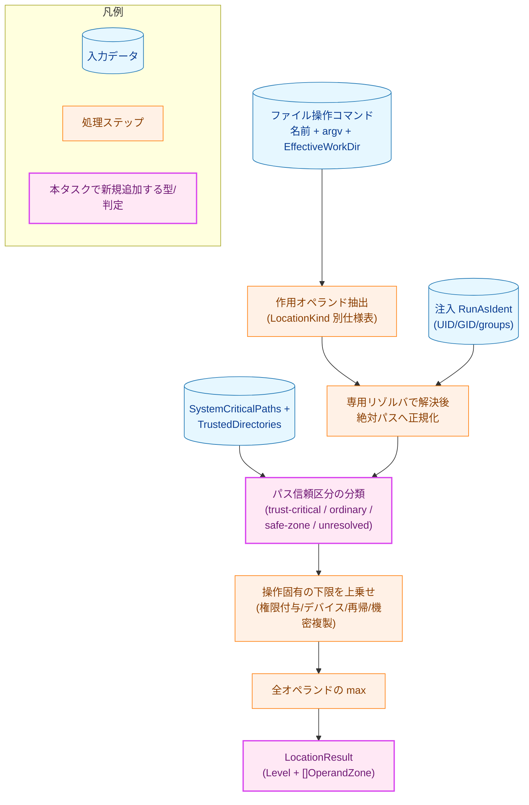
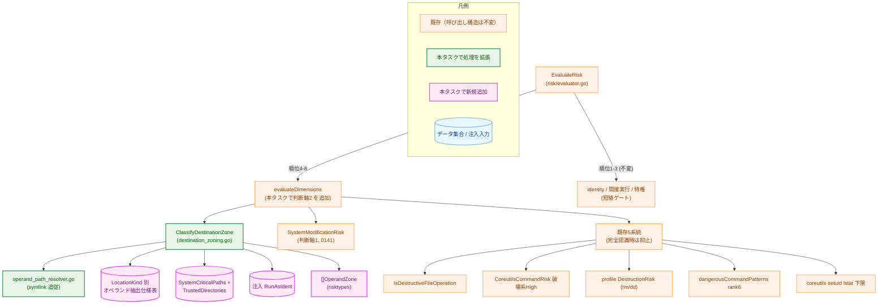
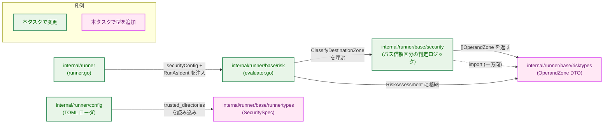
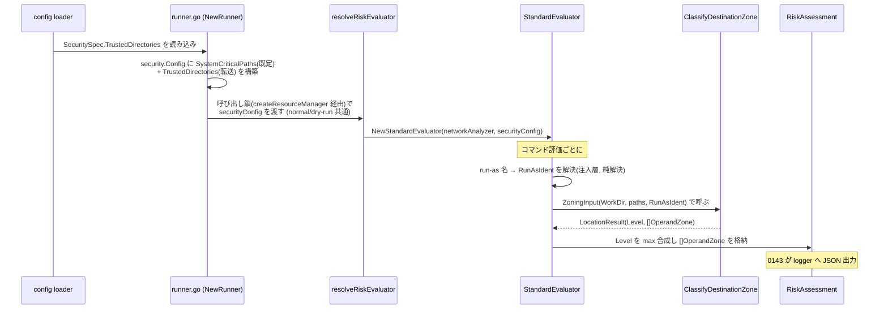
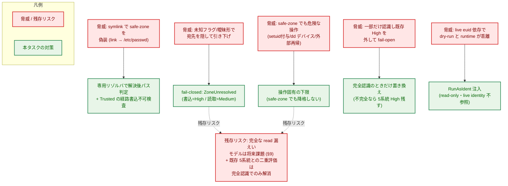
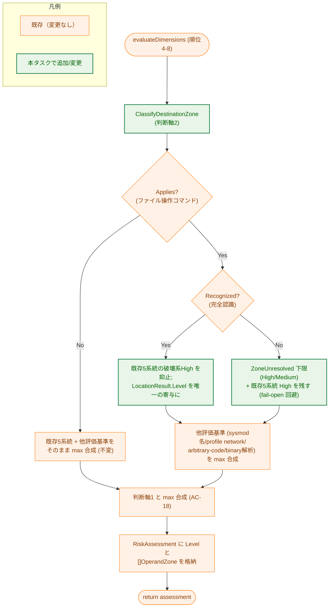
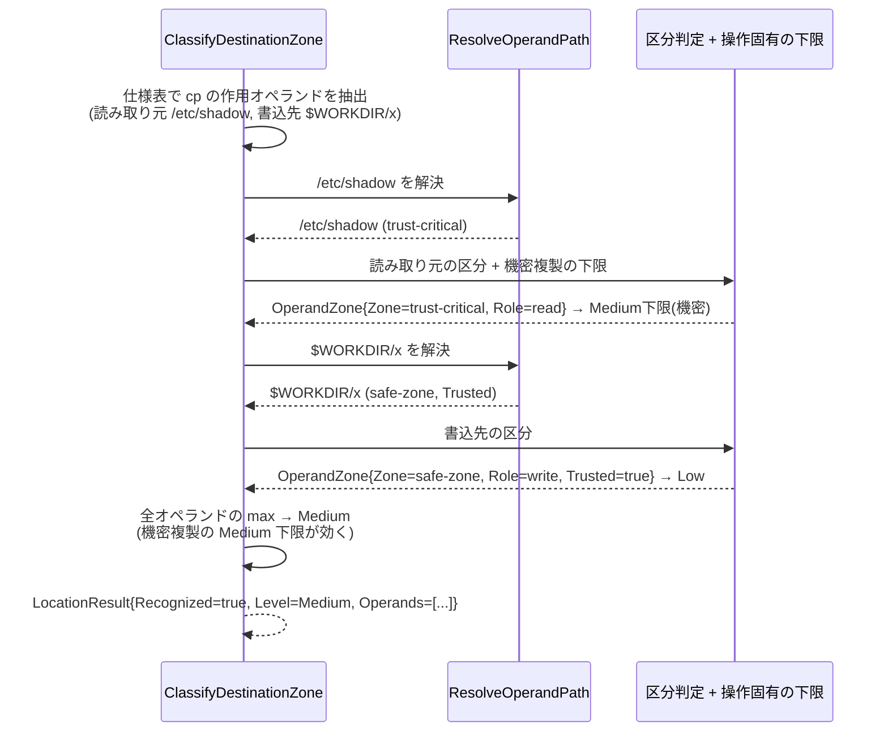

# 判断軸2: 宛先パス信頼区分の一貫化 — アーキテクチャ設計書

## Document Status

| Item | Value |
|---|---|
| Status | `approved` |
| Created | 2026-06-23 |
| Review date | 2026-06-23 |
| Reviewer | isseis |
| Comments | - |

> 本書は 0140 を 3 分割した第 2 タスク（判断軸2＝宛先パス信頼区分）の設計である。要件は
> [01_requirements.md](01_requirements.md)、分割方針・根本原因への対処方針は
> [0140/00_decomposition.md](../0140_risk_level_classification_review/00_decomposition.md)、原典の確定アーキテクチャは
> [0140/02_architecture.md](../0140_risk_level_classification_review/02_architecture.md)（superseded）を参照する。
> 既存のリスク評価パイプライン（順位 1〜8）の全体像は
> [0136/02_architecture.md](../0136_runtime_risk_evaluation_enforcement/02_architecture.md)、間接実行リゾルバは
> [0138/02_architecture.md](../0138_indirect_inner_command_risk/02_architecture.md)、判断軸1（コマンド名分類）は
> [0141/02_architecture.md](../0141_axis1_fixed_class_risk/02_architecture.md) を正とし、本書はそこへ加える
> 判断軸2 分の変更のみを記述する。本タスクは 0141 が再編した共有コード（`evaluateDimensions`・名前集合）の
> **完了後**にその上へ構築する。

---

## 1. 設計の全体像

### 1.1 設計原則

- **判断軸2 は「ファイル操作コマンドの作用先パスの信頼区分」で決まるレベルに限定する**。コマンド名やラッパ構造で
  決まる固定レベル（判断軸1）は 0141 の所掌であり、本タスクは触れない。最終リスクは判断軸1 と判断軸2 の
  **max 合成**で決まる（AC-18、§3.5）。
- **解決後パスで判定する（文字列前方一致では判定しない）**。すべてのパス信頼区分の判定は、symlink チェーンを
  追従する専用リゾルバ（§3.3）で得た正規化済み絶対パスに対して行う。`common.IsPathWithinDirectory` 単独の
  文字列照合は、`$WORKDIR/link → /etc/passwd` のような symlink を見破れないため**非適合**とする（AC-04(a)）。
- **fail-closed 既定**。オペランドの抽出・解決が不確実な形（未確定変数展開・未知の値取りフラグ・上限超過 等）は
  `ZoneUnresolved` に倒す。`ZoneUnresolved` のレベルはオペランドの役割で非対称——書込/削除先は **High**、
  読み取り元（`cp` のコピー元・`dd` の `if=`）は **Medium**（AC-05、§5.1）。
- **判断軸2 を「唯一の判定基準」とする（選択的 max 抑止を採らない）**。ファイル操作コマンドを**完全認識**できた
  ときに限り、これらを現在 High に分類している既存の 5 系統の判定を評価対象から外し、判断軸2 のパス信頼区分を
  唯一の寄与とする（AC-17、§3.4）。完全認識が成立しないときは既存 5 系統の High を残す（fail-open 回避）。
- **操作固有の下限は safe-zone でも降格しない**。権限付与・デバイス IO・safe-zone 外への再帰・機密ファイル複製は、
  宛先が safe-zone（通常なら Low）でも Low に降格させない（AC-08〜AC-12、§3.2）。
- **決定的・副作用なし・runtime==dry-run**。パス解決は `lstat`/`readlink` のみの read-only で、書込・削除・
  ネットワーク送信を一切行わない。結果は live euid・`$HOME` env に依存せず、注入された run-as identity に従う
  （AC-21・AC-22、§5.3）。
  - 用語: 0141 に倣い、**判断軸（axis）** を要件レベルの観点（判断軸1/判断軸2）に、**評価基準（dimension）** を
    `evaluateDimensions` が max 合成する個々の評価因子の意味に限定して使う。判断軸2 は単一の評価基準
    「宛先パス信頼区分」として `evaluateDimensions` に組み込まれる。

### 1.2 概念モデル

判断軸2 は、1 つのファイル操作コマンドについて (1) 作用オペランドを抽出し、(2) 各オペランドを解決後パスへ正規化し、
(3) パス信頼区分（trust-critical/ordinary/safe-zone/unresolved）へ分類し、(4) 操作固有の下限を上乗せし、(5) 全
オペランドの max を取って 1 つの `LocationResult` にまとめる、という段階処理である。`LocationResult` は
`evaluateDimensions` の中で判断軸1 の各評価基準と max 合成される。



> 矢印 `A → B` は処理の流れ（A の出力が B の入力になる）を表す。パス信頼区分の分類は条件分岐ではなく、解決後パスから
> 区分（trust-critical/ordinary/safe-zone/unresolved のいずれか 1 つ）を計算する処理ステップで、結果は下限の上乗せへ
> 進む（区分とレベルの対応は直後の表を参照）。本タスクは
> `RunAsIdent` と `SystemCriticalPaths`／`TrustedDirectories` を**外部から注入**し、解決・分類・下限の各段階は
> live identity・env を読まない純関数として実装する（決定性・AC-21）。

パス信頼区分とレベルの対応（条件はすべて解決後パス）:

| パス信頼区分 | 条件 | レベル | 操作固有の下限の影響 |
|---|---|---|---|
| **trust-critical** | `SystemCriticalPaths` に一致/配下 | High | （既に High） |
| **ordinary** | trust-critical でも safe-zone でもない | Medium | 下限で High へ上乗せされ得る |
| **safe-zone（Trusted）** | safe-zone 内かつ Trusted 充足 | Low | 下限で High へ上乗せされ得る（降格しない） |
| **safe-zone（非 Trusted）** | safe-zone 内だが Trusted 不成立 | Medium（フォールバック） | 同上 |
| **unresolved** | 解決/抽出不能・曖昧・上限超過 | 書込/削除先=High・読み取り元=Medium | （既に下限以上） |

### 1.3 本タスクが変更する経路と要件の対応

| # | 経路 | 変更内容 | 反映 AC |
|---|---|---|---|
| 1 | パス信頼区分モデル＋オペランド抽出 | `security` にパス信頼区分の判定ロジック（オペランド抽出仕様表・専用リゾルバ・区分判定・操作固有の下限）を新規追加 | AC-01〜AC-15 |
| 2 | データ送信の書込先合成 | データ送信系の書込先のパス信頼区分を判定し `max(名前 Medium〔0141〕, 書込先区分)` を合成 | AC-16 |
| 3 | 既存 High 判定の置き換え | 完全認識のとき `evaluateDimensions` が既存 5 系統を外し `LocationResult` を唯一の寄与にする | AC-17, AC-18 |
| 4 | 監査 DTO・config 組み込み・identity 注入 | `OperandZone` を `risktypes` に定義し `RiskAssessment` へ格納。`security.Config` と `RunAsIdent` を評価層へ通す | AC-19, AC-20, AC-21 |
| 5 | 決定性・解決コスト上限 | read-only・runtime==dry-run、メモ化＋オペランド/ホップ上限超過は fail-closed | AC-22, AC-23 |

---

## 2. システム構成

### 2.1 全体パイプライン中での位置づけ

本タスクは既存の `StandardEvaluator.EvaluateRisk`（順位 1〜8）の短絡ゲート構造（identity→間接実行→特権）は
変えない。変更は順位 4-8 の `evaluateDimensions` に閉じる。`evaluateDimensions` に判断軸2 の評価基準
（宛先パス信頼区分）を追加し、ファイル操作コマンドを完全認識したときは既存 5 系統の破壊系 High 寄与をこの
評価基準で置き換える。下図で緑が本タスクで処理が変わるコンポーネント、紫が新規追加、橙が構造として不変の
コンポーネントである。



> 矢印 `A → B` は「A が B を呼び出す／B のデータを参照する」を表す。既存 5 系統（E1〜E5）は橙のまま残るが、
> ファイル操作コマンドを完全認識したときだけ `evaluateDimensions` がこれらの破壊系 High 寄与を評価対象から
> 外し、`ClassifyDestinationZone` の結果を唯一の寄与とする（§3.4）。

### 2.2 コンポーネント配置

本タスクの変更は次の 4 パッケージにまたがる。新規パッケージは追加せず、既存パッケージへの型・関数の追加に
留める（DRY・YAGNI）。



> 矢印 `A → B` は「A が B へデータを渡す／B を呼ぶ」を表す。点線 `SEC ⇢ RT` は import 方向で、既存の
> `security → risktypes → runnertypes` の一方向依存を維持する（§3.1 の DTO 配置根拠）。完了基準は中核 2
> パッケージ（`security`/`risk`）だけでなく、本タスクが変更する統合パッケージ（`internal/runner`・
> `internal/runner/config`）までコンパイルが通ること（`./internal/runner/...` または `make test` が緑、NF-002）。

### 2.3 データフロー（組み込み・受け渡し、根本原因4 の明示）

[0140/00_decomposition.md](../0140_risk_level_classification_review/00_decomposition.md) §3.4 が求める
end-to-end の組み込みを示す。`SystemCriticalPaths`／`TrustedDirectories` と `RunAsIdent` が TOML から評価層へ
届く経路、`[]OperandZone` が `RiskAssessment` から監査へ届く経路を明示する。



> 矢印は呼び出し順を表す（シーケンス図のため色分けノードクラス・凡例は用いない）。run-as 名から UID/GID/groups への
> 解決は**パス信頼区分判定の外**（評価層の組み込み）で行い、precomputed `RunAsIdent` を `ZoningInput` へ注入する。
> `ClassifyDestinationZone` 以下は live identity を読まない（AC-21）。logger への JSON 出力は 0143 の所掌で、本タスクは
> `RiskAssessment` への格納までを担保する。

---

## 3. コンポーネント設計

> **本章の Go コード例の規約**: 本章の Go コード例（型・インタフェース・定数定義）のコメントは**英語で記述する**。
> ソース言語規約（`_context.md`: Go のコメント・識別子・文字列リテラルは英語）に合わせ、コード例をそのまま実装へ
> 転記しても非準拠コメントが混入しないようにするためである。コード例の外側の地の文・注釈は日本語のままとする。

### 3.1 監査 DTO とパス信頼区分の型（`risktypes`、AC-19）

オペランド毎の判定記録 DTO は `risktypes` に定義する。**配置根拠**: 監査キャリアは `risktypes.RiskAssessment`
へ埋め込むため、埋め込む型は `risktypes` から import 可能でなければならない（`risktypes` の依存は `runnertypes`
のみ）。DTO を `security` に置いて `RiskAssessment` から参照すると `risktypes → security` の逆向き依存が生じ、
既存の `security → risktypes` と合わせて循環する。よって DTO は `risktypes` へ置く
（[0140/00 §3.4](../0140_risk_level_classification_review/00_decomposition.md) の確定方針）。

```go
// PathTrustZone classifies a resolved (symlink-followed, absolute) operand path
// by how much trust a write/delete to it breaches. See §1.2 for the level mapping.
type PathTrustZone string

const (
    ZoneTrustCritical PathTrustZone = "trust-critical" // system-critical path -> High
    ZoneOrdinary      PathTrustZone = "ordinary"       // neither critical nor safe -> Medium
    ZoneSafeZone      PathTrustZone = "safe-zone"      // run-owned safe area -> Low (Trusted) / Medium (fallback)
    ZoneUnresolved    PathTrustZone = "unresolved"     // not resolvable -> fail-closed (High write / Medium read)
)

// OperandRole distinguishes a write/delete target from a read source. It drives
// the asymmetric fail-closed level for ZoneUnresolved (write=High, read=Medium):
// the worst case of a write is destruction, of a read is information exposure.
type OperandRole string

const (
    OperandRoleWrite OperandRole = "write" // destination of a write/delete
    OperandRoleRead  OperandRole = "read"  // source read for copy/reference (cp source, dd if=)
)

// OperandZone is the per-operand audit record. It is stored on RiskAssessment so
// both allow and deny paths can carry it to the audit logger (logger output is
// task 0143). An empty []OperandZone means axis 2 did not apply (not a
// file-operation command); an applied-but-unresolvable operand remains as an
// element with Zone == ZoneUnresolved.
type OperandZone struct {
    Index           int           // operand position within the command
    Raw             string        // operand as written on the command line
    Resolved        string        // symlink-followed absolute path (empty if unresolved)
    Zone            PathTrustZone // classified trust zone
    Role            OperandRole   // write/delete target vs read source
    MatchedCritical string        // the SystemCriticalPaths entry matched, if Zone == ZoneTrustCritical
    Trusted         bool          // satisfied the per-operand Trusted predicate (safe-zone Low only when true)
    UnresolvedErr   string        // human-readable cause when Zone == ZoneUnresolved
}

// RunAsIdent is the precomputed identity used for the Trusted predicate. It is
// resolved from the config run-as values OUTSIDE the zoning judgment (AC-21); the
// judgment never reads live identity (os.Geteuid/os.Getuid/user.Current).
type RunAsIdent struct {
    UID    uint32
    GID    uint32
    Groups []uint32
}
```

`RiskAssessment` に監査キャリアを 1 フィールド追加する（既存フィールドは不変）:

```go
// (excerpt: only the field added to RiskAssessment in risktypes/types.go)
type RiskAssessment struct {
    // ... existing fields (Level / Blocking / BlockingReason / ErrorClass /
    //     ReasonCodes / Reasons / NetworkType) unchanged ...

    // OperandZones carries the per-operand destination-zoning audit records
    // (axis 2). Empty when axis 2 did not apply; see OperandZone for the
    // empty-vs-unresolved contract consumed by task 0143.
    OperandZones []OperandZone
}
```

### 3.2 宛先パス信頼区分の判定ロジック（`security`、AC-01〜AC-15）

判断軸2 の中核は `security` パッケージに新規追加する。オペランド抽出・パス解決・区分判定・操作固有の下限を
すべて含む純関数として実装し、live identity・env を読まない（決定性）。`OperandZone` 群を含む
`LocationResult` を返す。

```go
// LocationKind classifies a file-operation command for operand extraction. Each
// kind maps to an extraction rule in the single spec table (AC-06). Unknown or
// ambiguous forms fall through to ZoneUnresolved (fail-closed).
type LocationKind int

const (
    KindNone           LocationKind = iota // not a file-operation command (axis 2 does not apply)
    KindCopyMove                           // cp/mv: destination + source(s)
    KindRemove                             // rm/rmdir/unlink/shred: all operands
    KindLink                               // ln: link target + link name
    KindInPlaceEdit                        // truncate/sed -i: edited FILE
    KindWriteFile                          // touch/mkdir/install/tee/sponge
    KindArchiveExtract                     // tar -x/unzip: extraction directory
    KindDeviceIO                           // dd: if=/of= by device kind
    KindMount                              // mount/umount: mountpoint + source
    KindPermission                         // chmod/chown/chgrp/setfacl/chattr
    KindFindDestructive                    // find -delete/-fprint*
    KindDataTransferWrite                  // curl -o/-O, wget, scp/sftp dest, rsync DEST
)

// ZoningInput is the precomputed, pure input to the zoning judgment. Every
// environment-dependent value is injected here so the judgment is deterministic
// and live-identity-free (AC-21, AC-22).
type ZoningInput struct {
    EffectiveWorkDir    string      // safe-zone origin (RuntimeCommand.EffectiveWorkDir)
    DedicatedTempDir    string      // configured dedicated temp (safe-zone origin)
    SystemCriticalPaths []string    // from security.Config (AC-01)
    TrustedDirectories  []string    // trusted-directory allowlist (AC-04(d))
    RunAsIdent          RunAsIdent  // injected identity for the Trusted predicate
    MaxOperands         int         // resolution-cost ceiling N (AC-23)
    MaxSymlinkHops      int         // resolution-cost ceiling M (AC-23)
}

// LocationResult is the axis-2 verdict for one command.
type LocationResult struct {
    Applies     bool                     // true when the command is a file-operation command
    Recognized  bool                     // full recognition: all operands resolved AND all argv parsed (AC-17)
    Level       runnertypes.RiskLevel    // max across operands and operation-specific floors
    Operands    []risktypes.OperandZone  // per-operand audit records (carrier)
    ReasonCodes []risktypes.ReasonCode   // zone-derived and floor reason codes
}

// ClassifyDestinationZone extracts the acting operands of a file-operation
// command, resolves each to an absolute symlink-followed path, classifies its
// trust zone, applies operation-specific floors, and folds the per-operand max.
// It reads no live identity and performs no writes (read-only lstat/readlink).
func ClassifyDestinationZone(input ZoningInput, names map[string]struct{}, cmdPath string, args []string) LocationResult
```

**オペランド抽出仕様表（AC-06／根本原因1）**: コマンド→`LocationKind`→オペランド抽出規則の対応を、コード内の
**単一テーブル**として持つ。要件本文・本設計は個別フラグを網羅列挙せず、既知コマンド×代表フラグの表駆動
テストで網羅性を担保する（§7.1）。仕様表が持つべき難所のエントリ（in-place 編集・`ln -s` 相対 target・
アーカイブ抽出 vs 一覧・末尾 `/` 削除・`dd` デバイス・権限/所有権付与・データ送信書込先）は
[01_requirements.md](01_requirements.md) §F-002 の表を正とする。未知/曖昧形は `ZoneUnresolved`（fail-closed）。

**操作固有の下限（AC-08〜AC-12、区分非依存）**: 次に該当するオペランドは、宛先が safe-zone でも Low に降格させず
High（または下限相当）を返す。これらは `ClassifyDestinationZone` 内で区分判定の後に上乗せされる。

| 下限 | High となる条件 | 反映 AC |
|---|---|---|
| 権限/所有権/属性付与 | setuid/setgid 付与・world-writable・trust-critical 所有権変更・`chattr -i` | AC-08, AC-09 |
| `dd` デバイス IO | `if=`/`of=` がブロック/危険キャラクタデバイス（`/dev/mem` 等）。無害シンク（`/dev/null`/`/dev/zero`）除外 | AC-10 |
| safe-zone 外への再帰 | `rm -r`/`cp -R` 等が safe-zone の外（ordinary/trust-critical）へ及ぶ | AC-11 |
| 機密ファイル複製 | 機密ファイル/trust-critical なコピー元の複製（`cp /etc/shadow $WORKDIR/x` 等）。読み取り元の Medium 下限 | AC-12 |

> **⑤ setuid 下限の流用（再パースしない）**: 権限付与下限のうち setuid/setgid シグナルは、新規 argv パースで
> 求めず、既存の lstat シグナル（`hasSetuidOrSetgidBit` 相当）をそのまま流用する。新規パースに置換すると lstat
> より弱くなり、setuid バイナリの High→Low 退行を招くため（AC-17 例外、[0140/00 §3.1](../0140_risk_level_classification_review/00_decomposition.md)）。

> **機密ファイルの判定集合（DRY）**: 機密ファイル（内容が秘匿情報のファイル）の判定は、既存の
> `Config.OutputCriticalPathPatterns` を流用する（認証 DB・SSH/鍵・資格情報・keystore 等）。フィールド定義と既定値は
> [security/types.go](../../../internal/runner/base/security/types.go)（`DefaultConfig`）にあり、消費ロジックは
> [security/file_validation.go](../../../internal/runner/base/security/file_validation.go) にある（要件 §F-003 は後者を
> 参照）。新規の機密ファイル集合は起こさない。完全な read 系分類は将来課題（§9）。

### 3.3 専用リゾルバ（`security`、AC-04(a)）

safe-zone・trust-critical の判定は、必ず symlink 追従後の正規化済み絶対パスに対して行う。`safefileio` は symlink を
解決せず拒否する設計のため流用できない。よって深さ制限つきの専用リゾルバを新規実装する
（`ResolveCommandNames`/`walkSymlinkChain` 型の追従）。

```go
// ResolveOperandPath resolves an operand to a normalized absolute path with the
// symlink chain followed (leaf and parents). A non-existent leaf is resolved to
// its deepest existing parent and the trailing components are folded in, so a
// not-yet-created destination still classifies by its real parent directory. A
// relative operand is resolved against base (the link's parent for `ln -s`
// relative targets, EffectiveWorkDir otherwise). It fails closed: a cycle, a
// depth-limit overflow, or a mid-chain readlink/lstat failure returns an error so
// the caller records ZoneUnresolved. It is read-only (lstat/readlink only).
func ResolveOperandPath(operand, base string, maxHops int) (resolved string, err error)
```

- (b) **safe-zone の起点**: `EffectiveWorkDir` と構成済み専用 temp に限定する。曖昧な `$HOME`・共有 `/tmp`・
  出力先の親ディレクトリは起点に含めない（AC-04(b)）。
- (c) **重複の優先**: safe-zone が trust-critical と重複/配下のときは trust-critical（High）を優先する（AC-04(c)）。
- (d) **Trusted 述語（TOCTOU 耐性、AC-04(d)）**: 解決後の各オペランドパスが `TrustedDirectories` 配下であり、かつ
  **safe-zone 起点（`EffectiveWorkDir`／専用 temp）の親より上位の経路要素**が run-as から書込不可（run-as 以外所有・
  group/other 非書込）のとき、そのオペランドを **Trusted** とする。
  - **書込不可検査の対象範囲（AC-03 との整合）**: safe-zone は run が所有し run-as から書込可能な領域であるため、起点
    ディレクトリ自身とその配下を「run-as から書込不可」にはできない（できれば run が書き込めず安全領域の用をなさない）。
    したがって書込不可検査の対象は**起点ディレクトリの親以上**に限定する。これにより run-as が安全領域の係留点を別の
    場所へ付け替える（repoint する）ことを防ぎつつ、起点配下への正当な書込は許す。起点配下に作られた symlink は専用
    リゾルバが追従して最終ターゲットで区分判定するため別途捕捉される。この限定により AC-03 の safe-zone=Low が到達可能に
    保たれる（起点配下まで書込不可を要求すると、run 所有の safe-zone は決して Trusted にならず Low 降格が成立しない）。
  - safe-zone の Low 降格は Trusted のときに限り、非 Trusted なら降格しない（fail-closed → Medium）。参照 identity は
    注入 `RunAsIdent`（live euid ではない）。leaf が既存 symlink なら最終ターゲットで区分判定する。
- (e) **メモ化の鍵とスコープ（AC-23）**: 解決のメモ化は 1 回の `ClassifyDestinationZone` 呼び出し（＝単一コマンド・
  単一 `RunAsIdent`）の内側にスコープし、鍵は**解決対象ノードの絶対パス（中間ノードを含む。relative なパスは基点ディレクトリと
  結合・正規化した、symlink 追従前の絶対パス）**とする。キャッシュするのは read-only な解決結果
  （`lstat`/`readlink`）のみで、identity 依存の Trusted 判定そのものはキャッシュしない（あるいは鍵へ identity を
  含める）。これにより同一 base/identity の前提が崩れず、クロス identity のキャッシュ誤用を避ける。

> **未存在 leaf の解決と決定性（AC-22 の前提を明示）**: 未存在 leaf を「最深の存在親」まで解決する規則は、評価時点で
> どの経路要素が存在するかに依存する。同一グループ内の先行コマンドが中間ディレクトリを作る（しかもそれが symlink で
> ある）と、dry-run（先行コマンド未実行）と runtime（実行済み）で最深の存在親が変わり、同一コマンド文字列でも
> レベルが変わりうる。よって AC-22 の「runtime==dry-run」は **「同一入力かつ同一ファイルシステム状態」** の範囲で
> 成立すると明記する。さらに fail-closed を優先し、**未存在 leaf の最深存在親が symlink のとき**はターゲットを
> 安全に確定できないため `ZoneUnresolved`（書込/削除=High）に倒す。これは
> [security-architecture.md の TOCTOU 既知制限](../../dev/architecture_design/security-architecture.md)（評価と実行の
> 間の競合は脅威モデル境界外）と整合し、評価と実行の間の残存競合は同制限の範囲で受容する。

### 3.4 既存 High 判定の置き換え（`risk`、AC-17・根本原因2）

`evaluateDimensions` に判断軸2 を組み込む。ファイル操作コマンドを**完全認識**したときに限り、当該コマンドを現在
High に分類している既存 5 系統の破壊系 High 寄与を評価対象から外し、`LocationResult.Level` を唯一の寄与とする。
他の評価基準（システム変更名・profile network・arbitrary-code・バイナリ解析）は引き続き寄与し、判断軸1 とは max
合成される（AC-18）。

**評価対象から外す既存 5 系統**:

| # | 既存判定 | 所在 |
|---|---|---|
| ① | `IsDestructiveFileOperation` | [command_analysis.go](../../../internal/runner/base/security/command_analysis.go) |
| ② | `CoreutilsCommandRisk` の破壊系 High | [coreutils.go](../../../internal/runner/base/security/coreutils.go) |
| ③ | profile `DestructionRisk`（`rm`/`dd`） | [command_analysis.go](../../../internal/runner/base/security/command_analysis.go) |
| ④ | `dangerousCommandPatterns`(rank6) の `{rm,-rf}`/`{dd,if=}` 等のコマンドエントリ | [command_analysis.go](../../../internal/runner/base/security/command_analysis.go) |
| ⑤ | coreutils の setuid/setgid lstat 下限 | [coreutils.go](../../../internal/runner/base/security/coreutils.go) |

**完全認識の定義（positive recognition、fail-open 回避）**: (a) 抽出された全オペランドが非 `ZoneUnresolved` の確定
区分を返し、かつ (b) オペランド抽出処理が全コマンドライン引数を解析しきった（未解析の非フラグトークン無し・パスを
運び得る未知の値取りフラグ無し）。この両条件が `LocationResult.Recognized == true` に対応する。

**不完全認識のとき**: 部分的/不確実なパース（一部オペランド未認識・未解析トークン残存・未知の値取りフラグ）は
`Recognized == false` とし、`LocationResult` は `ZoneUnresolved` の下限（書込/削除=High・読み取り元=Medium）を
返したうえで、**①〜⑤の High を残す**。これにより「一部だけ認識した」危険形が安全な区分と誤判定され Low で
素通りすること（fail-open）を防ぐ。

**③ の抑止は「破壊コンポーネント」粒度で行う（profile の他因子は残す）**: ③ profile `DestructionRisk` は独立した
評価基準ではなく、`ProfileFactorRisk(profile, args)` が複数のリスク因子を 1 つのレベルへ畳み込み、
`applyProfileFactors` が `Reasons`／`NetworkType` も併せて設定する（[evaluator.go](../../../internal/runner/base/risk/evaluator.go) の `applyProfileFactors`）。
よって「③ を外す」は profile-factor 経路ごと飛ばすことではなく、`applyProfileFactors`／`ProfileFactorRisk` に
**`DestructionRisk` コンポーネントのみを無効化するフラグを渡す**ことで実現する。これにより、その profile の他因子
（`NetworkRisk`／`DataExfilRisk` 等）と `NetworkType`／`Reasons` は引き続き適用される（AC-18 の max 合成を壊さない）。
現状 `DestructionRisk` を持つ profile は `rm`／`dd` のみで、両者は他因子を持たないため当面の実害はないが、将来
1 profile に破壊＋他因子が同居しても取りこぼし（他因子を落とす）／過剰（破壊 High を残す）を起こさないよう、
無効化は破壊コンポーネント粒度で定義する。

**置き換えの取りこぼし防止条件（①〜⑤ ⊆ §3.2 の下限・区分）**: 「5 系統をまとめて外す」が High の取りこぼし（fail-open）に
ならないことを保証するため、外す各系統が捕捉していた水準を判断軸2 のどの規則が同等以上に再確立するかを表で固定する。

| 外す系統 | 旧来の捕捉 | 判断軸2 での再確立 |
|---|---|---|
| ① `IsDestructiveFileOperation` | `rm`/`dd` 等の破壊を一律 High | 宛先区分（trust-critical=High・ordinary=Medium・safe-zone=Low）＋ safe-zone 外再帰の下限（AC-11） |
| ② coreutils 破壊系 High | coreutils 破壊サブコマンド High | 同上（区分＋操作固有の下限） |
| ③ profile `DestructionRisk` | `rm`/`dd` High | 同上 |
| ④ `dangerousCommandPatterns` rank6 | `{rm,-rf}` High・`{dd,if=}` High・`{chmod,777}` High・`{chown,root}` Medium | `rm -rf`＝再帰下限（AC-11）／区分、`dd if=`＝デバイス IO 下限（AC-10）、`chmod 777`＝world-writable 権限付与下限（AC-08, High）、`chown root`＝所有権変更（trust-critical 宛先は権限付与下限で High、ordinary 宛先は区分 Medium）で同等以上 |
| ⑤ coreutils setuid lstat 下限 | setuid/setgid バイナリ High | 既存 lstat シグナル（`hasSetuidOrSetgidBit` 相当）を権限付与下限が**そのまま流用**（再パースしない） |

> この取りこぼし防止条件をテストで固定する（§7.2）。とくに ④ の `chmod 777`／`chown root` が §3.2 の権限付与下限／区分で
> 同等以上のレベルになることを表明し、「外したが再確立されない隙間」を塞ぐ。

> **既存方針への意図的な例外（インライン明示・command 仕様の要請）**
>
> - **原方針と所在**: 既存のリスク評価パイプラインは、ファイル操作コマンド（`rm`/`cp`/`dd` 等）を引数に依らず
>   一律 High に分類してきた。これは上記 5 系統として実装され、[security-architecture.md §7](../../dev/architecture_design/security-architecture.md)
>   の「Risk-Based Command Control」（destructive operations = High）、[0136/02_architecture.md](../0136_runtime_risk_evaluation_enforcement/02_architecture.md)
>   の dimension max、[0138/02_architecture.md](../0138_indirect_inner_command_risk/02_architecture.md) の前提として
>   文書化されている。
> - **例外の理由**: 要件 D7（[01_requirements.md](01_requirements.md) §1・AC-17）は、信頼 safe-zone に閉じた破壊
>   （`rm -rf $WORKDIR/build`）を Low に引き下げつつ、trust-critical への破壊（`rm -rf /usr`）は High に保つことを
>   求める。引数に依らない一律 High はこの宛先依存を表現できない。よって本タスクは「宛先パス信頼区分」を導入し、
>   完全認識時にこれを唯一の判定基準とする。
> - **「選択的 max 抑止」を採らない理由（YAGNI／より単純案の不採用）**: 当初案は 5 系統を個別に無力化して最終 max を
>   下げる方式だった。最終リスクは複数判定の max で決まるため、5 系統のうち 1 つでも外し漏れると High が残る
>   （モグラ叩き的に実装漏れを生みやすい）。より単純に見えるこの選択的抑止は、要件（1 経路 = 1 箇所で取りこぼし
>   なく引き下げる）を満たせない。よって `evaluateDimensions` のディスパッチで 5 系統をまとめて外し、判断軸2 を
>   唯一の寄与に置き換える方式を採る（[0140/00 §3.1](../0140_risk_level_classification_review/00_decomposition.md)）。
> - **旧挙動を assert する既存テスト（要更新）**: 評価層で `rm`/`dd` を一律 High と表明している
>   [risk/coreutils_consistency_test.go](../../../internal/runner/base/risk/coreutils_consistency_test.go) の
>   `TestConsistency_RmAllForms`・`TestConsistency_DestructiveAbsolutePath`・`TestCoreutilsRiskConsistency_Setuid`、
>   および [risk/evaluator_test.go](../../../internal/runner/base/risk/evaluator_test.go) の破壊系ケースは、宛先依存
>   （safe-zone=Low／trust-critical=High／unresolved=High）へ更新が必要。なお `security` 層の単体テスト
>   （[coreutils_test.go](../../../internal/runner/base/security/coreutils_test.go) の `CoreutilsCommandRisk` 等）は
>   関数自体の挙動を変えないため不変で、置き換えは評価層（`evaluateDimensions`）のディスパッチに閉じる。
> - **非ファイル操作コマンドは不変**: 同名でも非ファイル操作用途（`find -exec` の内側実行・判断軸2 が扱わない未知
>   コマンド）では④等を無効化しない。`find -exec`/ProxyCommand/`rsync -e` 等の間接実行は従来どおり 0141/既存が担う。

> **アップグレード時の影響（後方互換なし・直接適用の帰結）**: 本タスクは段階ロールアウト/shadow を伴わず enforce へ
> 直接適用される（[0140/00 §3.2](../0140_risk_level_classification_review/00_decomposition.md)）。よってアップグレード後、
> 判定が変化する方向は次のとおり——運用者（operator）は自身の config の `risk_level` 上限を見直す材料とする:
> - **引き下げ（従来 High → 区分依存）**: 信頼 safe-zone に閉じた破壊（`rm -rf $WORKDIR/build`・`dd of=$WORKDIR/x`）は
>   Low、ordinary 宛先（`/srv` 等）は Medium になる。従来 High 必須だった config がより低い `risk_level` 上限で通る。
> - **引き上げ/横ばい（新たな下限・区分由来）**: 機密ファイル/trust-critical なコピー元の複製（`cp /etc/shadow …`）は
>   Medium 下限、データ送信の trust-critical 書込（`curl -o /usr/bin/x`）は High（名前 Medium との max）。従来これらを
>   低い `risk_level` で通していた config は deny されうる。
> これを緩和する実行時フラグは設けない。破壊的変更の周知（移行ノート）と sample/test config の追従は 0143 が担う。

### 3.5 データ送信の書込先合成（`risk`/`security`、AC-16）

データ送信系のファイル書込/削除形がローカルの trust-critical パスへ作用する場合は High とする。同一コマンドが
0141（名前による Medium 下限）と 0142（書込先のパス信頼区分）の両方で評価されるため、**max 合成の所有者・テストは
本タスク**。最終リスク = `max(データ送信の名前 Medium〔0141〕, 書込先のパス信頼区分)`。

- 書込先の抽出は §3.2 の仕様表（`KindDataTransferWrite`）で行う（`curl -o`/`-O`・`wget` 既定/`-O`/`-P`・
  `scp host:/x DEST`・`sftp` バッチ書込・`rsync … DEST`/`--delete`）。
- **必須テスト**（両寄与が同時に生きていることを検証）: (i) safe-zone 宛先 `curl <url> -o $WORKDIR/safe` は
  **Medium**（書込先 Low でも名前下限が効く）、(ii) trust-critical 宛先 `curl -o /usr/bin/x` は **High**（書込先が
  名前下限を上回る）。
  - **canary の落とし穴に注意**: `curl`/`wget` は本タスクと無関係に既存の network profile（Medium）を持つため、
    (i) で「レベル==Medium」だけを表明すると、0141 の名前下限が欠落/退行していても既存 profile の Medium で偽陽性に
    なる（両寄与の生存を検証できない）。よって (i) は**レベルではなく Medium の出所**を表明する——`RiskAssessment`
    の `ReasonCodes` に 0141 名前下限由来の理由コードが含まれること、または既存 Medium profile を持たないデータ送信
    書込形を選んで「Medium への唯一の経路が名前下限である」状況で検証する。
- **前提**: 0141 の名前による Medium 下限がリスク評価ロジックに組み込み済みであること（完了済み。§前文）。
- **`rsync` 二重コロン記法の隙間（本タスクで確定して塞ぐ）**: 既存の `hasNetworkArguments` が検出するリモート終端は
  `://`・`user@host:path`・`host:path`（`/` または `~` を含むパス）であり、rsync デーモンの**二重コロン bare module 形
  `host::module`**（末尾パス無し。`host::module/path` は `/` を含むため既に検出される）を取りこぼす。これにより
  `rsync src host::module` はリモート書込にもかかわらず egress（名前ベース Medium）が立たず Low になりうる。本タスクは
  この隙間を**確定して塞ぐ**（AC-16 の所掌。0141 のコマンド名分類スコープ外）。確定する設計は次のとおり:
  - **(1) 宛先オペランド抽出（`KindDataTransferWrite` の rsync）でリモート終端を判定する**: `host:path`・
    `user@host:path`・`rsync://…` に加え `host::module` をリモート宛先として認識する。リモート宛先のときは zone 判定の
    対象となるローカルパスが無いため、実効レベルは egress（名前ベース Medium）が支配する（ローカル宛先のときのみ
    書込先のパス信頼区分と max 合成する）。
  - **(2) `host::module` の egress 検出は `rsync` に限定する**: 二重コロンの左がホスト名様トークン（`[A-Za-z0-9.-]+`）で
    右がモジュール名様トークンの形（`host::module`）を検出条件に加え、`rsync src host::module` を egress Medium に分類する。
    ただし `hasNetworkArguments` は profile 無しの全コマンドへ広く適用される（`evaluator.go` の
    `!profileFound && HasNetworkArguments(args)`）ため、検出を**無条件に足すと過剰分類する**——`std::string`・`HTTP::Tiny`・
    `Namespace::Class` のような `::` を含む無関係な引数まで誤検出する（左側をホスト名様トークンに限定しても `std`／`HTTP` 等が
    合致するため防げない）。よって `host::module` 検出は**コマンド名が `rsync` のときだけ有効化**する——rsync 専用の引数解析
    （`KindDataTransferWrite` 抽出）に閉じ込めるか、`hasNetworkArguments` をコマンド名で gate する。`/` を含むトークンや純ローカル
    パスは巻き込まない。なお誤検出が起きても引き上げは Medium までで安全側（fail-safe）だが、無関係コマンドの過剰分類は避ける。
    `rsync` 全体を無条件 Medium へ格上げはしない（過剰分類を起こさず隙間だけ塞ぐ）。
  - **必須テスト**: `rsync src host::module` が Medium（egress 由来。理由コードで出所を表明）、純ローカル `rsync /a /b` が
    Low（過剰分類しない）、`rsync /local /usr/bin/x`（ローカル trust-critical 宛先）が High（書込先区分が支配）。

### 3.6 config 組み込みと identity 注入（AC-20, AC-21）

- **`security.Config` の組み込み（AC-20）**: 現状 `NewStandardEvaluator` は `*security.NetworkAnalyzer` のみを
  受け取り、`security.Config` を持たない。本タスクは `security.Config`（`SystemCriticalPaths` と
  `TrustedDirectories`）をリスク評価ロジックへ通すため、コンストラクタへ引数を 1 つ追加する。
  - **実際の受け渡し経路（要・複数関数のシグネチャ変更）**: `runner.go` は `NewRunner` 内で
    `security.DefaultConfig()` を構築し `TrustedGIDs` を `SecuritySpec` から転送するが、この `securityConfig`
    ローカルは `security.NewValidator` へ渡されるだけで、リスク評価ロジックを組み立てる `resolveRiskEvaluator` までは届いて
    いない。リスク評価ロジックを組む経路は `NewRunner` → `createResourceManager(opts, configSpec, validator)` →
    `createDryRunResourceManager`／`createNormalResourceManager` → `resolveRiskEvaluator(opts,
    verificationManager)` であり、いずれも `securityConfig` を引数に持たない。よって本タスクは `securityConfig`
    （または `SystemCriticalPaths`＋`TrustedDirectories` を束ねた小さなパス信頼区分判定用 config）を、この呼び出し鎖の
    各関数（`createResourceManager`・両 `create*ResourceManager`・`resolveRiskEvaluator`）へ通す。
    `resolveRiskEvaluator` は normal/dry-run の両経路で共有されるため、両モードへ同一に渡す（AC-22 の
    runtime==dry-run 一貫性のため）。テスト専用注入 `opts.riskEvaluator` だけに頼ると AC-01/AC-04 が configured
    環境で成立しないため、本番経路の組み込みを必須とする。
  - **根拠**: 無ければ configured 環境で AC-01/AC-04 がテスト注入でしか成立しない（[0140/00 §3.4](../0140_risk_level_classification_review/00_decomposition.md)）。

`StandardEvaluator` は既存フィールド（`networkAnalyzer`・注入可能な `openIdentity`）に加え、判断軸2 用に
`*security.Config` と run-as 解決ロジック（注入可能フィールド、AC-21）の 2 つを持つ。コンストラクタは `*security.Config`
引数を 1 つ追加し、run-as 解決ロジックは既定値（os/user ベース）を内部で設定する（テストは差し替え可能）。

```go
// NewStandardEvaluator gains a *security.Config argument so axis 2 can read the
// configured SystemCriticalPaths and TrustedDirectories (AC-20). The run-as
// identity resolver is an injectable field (default: os/user based) set inside
// the constructor, mirroring the existing openIdentity field. Existing argument
// and return type are otherwise unchanged.
func NewStandardEvaluator(networkAnalyzer *security.NetworkAnalyzer, securityConfig *security.Config) Evaluator
```

- **TOML 仕様（AC-20）**: `SecuritySpec`（[runnertypes/spec.go](../../../internal/runner/base/runnertypes/spec.go)）に
  信頼ディレクトリ許可リストのフィールドを追加し、`security.Config` に対応フィールドを足す。

```go
// SecuritySpec maps to the [security] section. A field is added alongside the
// existing TrustedGIDs.
type SecuritySpec struct {
    TrustedGIDs        []uint32 `toml:"trusted_gids"`        // existing
    TrustedDirectories []string `toml:"trusted_directories"` // new: trusted-directory allowlist (AC-04(d))
}
```

- **identity 注入の純粋性（AC-21）**: run-as 名から UID/GID/補助 group への解決は評価層（組み込み層）で行い、
  precomputed `RunAsIdent` を `ZoningInput` へ注入する。解決は既存の特権管理
  （[privilege/unix.go](../../../internal/runner/base/privilege/unix.go) の `user.Lookup`/`user.LookupGroup`）と
  同質の純解決で、テストが任意の identity を注入できるようリスク評価ロジックの注入可能フィールドとして持つ（既存の
  `openIdentity` フィールドと同じ注入パターン）。`ClassifyDestinationZone` 以下は live identity API
  （`os.Geteuid`/`os.Getuid`/`syscall`/`unix` の uid/gid/groups・`user.Current`）を読まない。
  - **run-as 未設定時の `RunAsIdent`（既定経路の確定）**: `RunAsUser()`/`RunAsGroup()` は未設定時に空文字を返す
    （大多数のコマンドはこの形）。空のとき `RunAsIdent` は **runner が起動時に確定した original 実行 identity**
    （`runner.go` が privilege 管理から得る originalUID／そのプライマリ・補助 group）を**注入時に一度だけ**
    解決して用いる。**判定時に `os.Geteuid()` を読むことは禁止**であり、空 run-as の identity も注入時に
    config／起動コンテキストから precompute する（live 参照しないため runtime と dry-run で同一。AC-21/AC-22）。
    `RunAsIdent` の zero 値（`UID:0`＝root）を「未設定」の暗黙既定にしてはならない（root は全パスを書込可能と
    みなされ Trusted 判定が degenerate になるため、明示的に original identity を注入する）。
  - **解決失敗時の扱い（fail-closed）**: 注入時に run-as 名が解決できない（未知ユーザー/グループ）場合は、
    当該コマンドの全オペランドを `ZoneUnresolved`（書込/削除=High・読み取り元=Medium）に倒す。Trusted 判定の
    基礎 identity が欠けたまま Low へ降格させない。
  - **補助ガード**: 上記 live-identity API を判断軸2 の組み込みコードが呼ばないことを grep ガードで補助する
    （主検証は差分テスト＝注入 identity を実 euid と変えて Trusted/Low 判定が変わることを表明、§7.3）。

### 3.7 コンポーネント責務（新規・変更ファイル一覧）

| ファイル | 区分 | 責務／変更内容 | 反映 AC | 要更新の既存テスト |
|---|---|---|---|---|
| `internal/runner/base/risktypes/operand_zone.go` | 新規 | `PathTrustZone`/`OperandRole`/`OperandZone`/`RunAsIdent` を定義 | AC-19, AC-05 | — |
| `internal/runner/base/risktypes/types.go` | 変更 | `RiskAssessment` に `OperandZones []OperandZone` を追加 | AC-19 | — |
| `internal/runner/base/risktypes/reason_codes.go` | 変更 | 判断軸2 の `ReasonCode` family を追加（§4）。網羅性/一意性テストを緑に保つ | NF-001 | `reason_codes_test.go::TestReasonCodes_AllDistinct`（新コードを登録） |
| `internal/runner/base/security/destination_zoning.go` | 新規 | `LocationKind`/`ZoningInput`/`LocationResult`・オペランド抽出仕様表・区分判定・操作固有の下限・`ClassifyDestinationZone` | AC-01〜AC-16 | — |
| `internal/runner/base/security/operand_path_resolver.go` | 新規 | symlink 追従の専用リゾルバ（leaf＋親・深さ制限・メモ化）・Trusted 述語 | AC-04, AC-23 | — |
| `internal/runner/base/security/network_analyzer.go`（`hasNetworkArguments`）／`command_analysis.go`（`containsSSHStyleAddress`） | 変更 | rsync デーモンの `host::module` 形をリモート終端として検出（§3.5）。検出は `rsync` コマンドに限定し、`std::string` 等の `::` 引数の過剰分類を避ける | AC-16 | `network_analyzer_test.go`／`command_analysis_test.go`（`rsync` の `host::module`=リモート、非 rsync の `std::string` 等は非ネットワーク、純ローカルは非ネットワークの回帰追加） |
| `internal/runner/base/security/types.go` | 変更 | `Config` に `TrustedDirectories []string` を追加 | AC-20 | — |
| `internal/runner/base/risk/evaluator.go` | 変更 | `evaluateDimensions` に判断軸2 を組み込み、完全認識時に既存 5 系統を抑止し `LocationResult` を唯一の寄与に。`NewStandardEvaluator` に `*security.Config` 引数追加。`RunAsIdent` 注入フィールド | AC-17, AC-18, AC-20, AC-21 | `coreutils_consistency_test.go::{TestConsistency_RmAllForms,TestConsistency_DestructiveAbsolutePath,TestCoreutilsRiskConsistency_Setuid}`、`evaluator_test.go`（破壊系ケース） |
| `internal/runner/runner.go` | 変更 | `security.Config` に `TrustedDirectories` を転送し、呼び出し鎖（`createResourceManager`・両 `create*ResourceManager`・`resolveRiskEvaluator`）へ securityConfig を通して `NewStandardEvaluator` へ渡す（§3.6）。normal/dry-run の両経路に同一に渡す | AC-20, AC-22 | — |
| `internal/runner/base/runnertypes/spec.go` | 変更 | `SecuritySpec` に `TrustedDirectories` を追加 | AC-20 | `spec_test.go`（`[security]` パース） |
| `internal/runner/config/loader.go` | 変更（必要時） | `[security] trusted_directories` の読み込み・転送（TOML デコードで自動マッピングなら最小） | AC-20 | — |

> **副作用契約（明示）**: 本タスクは `--dry-run`/`--force` 等の副作用切替フラグを新設しない。判断軸2 のパス解決は
> `lstat`/`readlink` のみの read-only で、ファイルの**書込・削除・リンク作成・ネットワーク送信を一切行わない**
> （作用先パスを「解決」するだけで作用そのものは行わない）。したがって**同一入力かつ同一ファイルシステム状態**で
> あれば runtime と dry-run で同一レベルを返す（AC-22、NF-003）。解決結果は注入 `RunAsIdent`・注入パス集合と評価時点の
> FS 状態のみに依存し、live euid・`$HOME` env には依存しない（未存在 leaf の FS 状態依存と fail-closed 扱いは §3.3 注）。

---

## 4. エラーハンドリング設計

本タスクは新しいエラー型を導入しない。判断軸2 の「解決/抽出できない」状況はエラー（`error` 返却）ではなく、
`OperandZone.Zone == ZoneUnresolved` と `LocationResult` のレベル（書込/削除=High・読み取り元=Medium）として
表現する。これによりリスク評価ロジックは単一の非エラー経路で処理でき、fail-closed が下限として常に効く。

- `ResolveOperandPath` の失敗（cycle・深さ超過・mid-chain の `readlink`/`lstat` 失敗）は `error` を返すが、呼び出し側
  （`ClassifyDestinationZone`）はこれを `ZoneUnresolved` へ畳み込み、原因を `OperandZone.UnresolvedErr` に記録する。
- 解決コスト上限（AC-23）の超過——1 コマンド評価あたりのオペランド総数 > N、または symlink ホップ総数 > M——も
  `ZoneUnresolved`（書込/削除=High）に倒す。これは `ExecuteCommand` ホットパスでの無制限 FS I/O・DoS を防ぐ
  ためで、メモ化（同一親の再解決をしない）により注入 `lstat`/`stat` の呼出回数を線形に収める。

判断軸2 が追加する `ReasonCode`（family）。既存 reason code とは別に新設し、本タスク内で網羅性/一意性テスト
（`reason_codes_test.go`）を緑に保つ（NF-001。family 区別の最終化は 0143）:

```go
// ReasonCode values added by axis 2 (snake_case string values).
const (
    ReasonTrustBoundaryWrite      ReasonCode = "trust_boundary_write"       // write/delete to a trust-critical path (AC-01)
    ReasonDestinationZone         ReasonCode = "destination_zone"           // Medium from an ordinary destination (AC-02)
    ReasonPermissionGrant         ReasonCode = "permission_grant"           // setuid/world-writable/ownership/attribute grant (AC-08, AC-09)
    ReasonDeviceIO                ReasonCode = "device_io"                  // dd block/dangerous character device (AC-10)
    ReasonRecursiveOutsideSafeZone ReasonCode = "recursive_outside_safe_zone" // recursion outside the safe-zone (AC-11)
    ReasonSensitiveSourceCopy     ReasonCode = "sensitive_source_copy"      // sensitive-file/trust-critical source copy (AC-12)
    ReasonUnresolvedDestination   ReasonCode = "unresolved_destination"     // fail-closed unresolved operand (AC-05)
)
```

> **監査粒度の限界（受容する時限リスクとして明示）**: 上記 family は判断軸2 のレベル由来を区別するが、family 区別の
> 最終化（監査ストリームでの細分化・オペランド毎の構造化 JSON 出力）は 0143 が担う。本タスクは
> `RiskAssessment.OperandZones` にオペランド毎の根拠（Index/Raw/Resolved/Zone/Trusted/UnresolvedErr）を格納する
> ところまでを担保し、構造化 JSON 出力は 0143 へ委ねる。
>
> **0142→0143 の間も deny は説明可能（on-call の穴を作らない）**: 本タスクの新 `ReasonCode` は
> `RiskAssessment.ReasonCodes` に追記する。既存のリスク評価結果は deny 行に `ReasonCodes` と評価対象コマンドライン
> （`ResolvedPath`/argv）を載せて既に logger へ出力されるため、0143 の構造化出力が未着でも、判断軸2 由来の deny は
> 「どの理由コードで・どのコマンドが」のレベルで説明できる。0143 で増えるのはオペランド毎の解決パス・区分の構造化
> 表示であり、deny の説明可能性そのものは本タスクで確保する。

---

## 5. セキュリティ考慮事項

### 5.1 設計上のセキュリティ・パターン

- **解決後パスで判定（symlink 回避）**: すべての区分判定は symlink 追従後の絶対パスで行い、`$WORKDIR/link → /etc`・
  `$HOME/../../etc` 等で safe-zone 判定が破れないようにする（AC-04(a)）。
- **fail-closed の非対称**: 解決/抽出不能は安全側へ倒す。書込/削除先は High（最悪＝破壊）、読み取り元は Medium
  （最悪＝情報露出）という脅威差に基づく**意図的な非対称**。「不明フラグ＝安全」とは仮定しない。完全な read
  モデルは将来課題（§9）。この非対称は「うっかり緩和」を防ぐため設計上明示する（AC-05）。
- **操作固有の下限は降格しない**: 権限付与・デバイス IO・safe-zone 外再帰・機密複製は宛先 safe-zone でも Low に
  しない（AC-08〜AC-12）。
- **完全認識のときだけ引き下げる**: 判断軸2 で既存 High を置き換えるのは完全認識のときに限り、不完全認識では既存
  5 系統の High を残す（fail-open 回避、AC-17）。

### 5.2 脅威モデル



> 矢印 `脅威 → 対策` は「当該脅威を当該対策が緩和する」を表す。点線 `対策 → 残存リスク` は対策後も残る限界を表す。
> 残存リスク（完全な read 漏えいモデル）は本タスクで塞がず、機密ファイルの Medium 下限と文書化（§9）で受容する。

### 5.3 TOCTOU / 決定性

- **TOCTOU 耐性（Trusted 述語、AC-04(d)）**: safe-zone の Low 降格は、解決後パスが `TrustedDirectories` 配下かつ
  safe-zone 起点の親以上の経路要素が run-as から書込不可（run-as 以外所有・group/other 非書込）のときに限る（検査範囲の
  根拠は §3.3(d)）。安全領域の係留点を run-as が付け替え不能なため、評価と実行の間に起点ごと宛先を差し替えても Low で
  素通りしない。係留点が付け替え可能（親が書込可能）なら降格せず Medium に倒れる。
- **決定性（AC-21, AC-22）**: パス解決は read-only（`lstat`/`readlink`）で、判定は注入 `RunAsIdent`・注入パス集合
  と評価時点の FS 状態に依存する。**同一入力かつ同一 FS 状態**であれば runtime と dry-run で同一レベルを返す。live
  euid・`$HOME` env は参照しない。未存在 leaf の最深存在親が symlink の場合は `ZoneUnresolved`（High）に倒し、FS 状態
  差による Low 取りこぼしを防ぐ（§3.3 注、TOCTOU 既知制限と整合）。
- **解決コスト上限（AC-23）**: メモ化＋オペランド総数上限 N／symlink ホップ総数上限 M で、ホットパスの FS I/O を
  抑え、上限超過は fail-closed（High）に倒す。M は既存のコマンド解決の `MaxSymlinkDepth`
  （[command_analysis.go](../../../internal/runner/base/security/command_analysis.go)）と同程度を再利用し、N は
  代表的なファイル操作のオペランド数を十分に上回る小さな定数（実装で確定）とする。最悪計算量は概ね N×M 回の
  `lstat` で、メモ化により同一親の再解決を除いて線形に収まる。具体値 N/M は実装で確定する。

---

## 6. 処理フロー詳細

### 6.1 `evaluateDimensions` 内の判断軸2 ディスパッチ



> 矢印 `A → B` は処理の流れ、`{ }`（ひし形）は分岐点。緑が本タスクで追加する処理。`Applies==No`（非ファイル操作）
> は完全に従来どおりで、判断軸2 は影響しない。`Applies==Yes && Recognized==Yes` のときだけ既存 5 系統の破壊系
> High を抑止し、`LocationResult` を唯一の寄与に置き換える（§3.4）。

### 6.2 1 コマンドの区分判定（複数オペランド）

`cp /etc/shadow $WORKDIR/x`（機密複製・複数オペランド）を例にした流れ:



> 矢印は呼び出し順を表す（シーケンス図のため色分けノードクラス・凡例は用いない）。各オペランドは `OperandZone` として
> 記録され（監査キャリア）、最終レベルは全オペランドの max。本例では書込先が safe-zone(Low) でも、機密ファイルの
> コピー元（読み取り元）の Medium 下限により全体が Medium になる（AC-07, AC-12）。

---

## 7. テスト戦略

### 7.1 単体テスト

- **オペランド抽出仕様表（AC-06, AC-06a）**: 既知コマンド×代表フラグの表駆動（網羅）テスト。難所（in-place 編集・
  `ln -s` 相対 target・アーカイブ抽出 vs 一覧・末尾 `/` 削除・`dd` デバイス・権限/所有権付与・データ送信書込先）を
  仕様表のエントリとして持ち、各エントリに対応するテスト行を置く。AC-08〜AC-16 で High/Medium 化と名指しされた全
  書込/削除/付与形が仕様表のテスト行を持つこと（AC 本文と仕様表のドリフト防止）。
- **パス信頼区分（AC-01〜AC-05）**: trust-critical（`/usr` 配下=High・`/` 完全一致のみ）、ordinary（`/srv`/`/opt`=
  Medium）、safe-zone（Trusted=Low／非 Trusted=Medium）、unresolved（書込=High・読取=Medium）。`/var`・`/var/log` は
  trust-critical なので ordinary フィクスチャに使わない。
- **専用リゾルバ（AC-04(a)）**: 必須——`cp evil $WORKDIR/link`（`link→/etc/passwd`）は **High**（ターゲット解決）で
  Low にならない。`ln -s` 相対 target がリンク親基点で解決されること。
- **操作固有の下限（AC-08〜AC-12）**: setuid 付与・`chmod 0777`・`chown root /usr/bin/x`・`chattr -i`・`dd` デバイス・
  safe-zone 外再帰・機密複製が safe-zone でも Low に降格しないこと。⑤ setuid が既存 lstat シグナル流用で High を
  保つこと。
- **複数オペランド（AC-07）**: 各オペランドの区分を判定し max を取ること（§6.2）。

### 7.2 既存 High 判定の置き換え（AC-17, AC-18）

- 観測可能プロパティ: 信頼 safe-zone `rm -rf $WORKDIR/build` = **Low**（④rank6・②coreutils の固定 High で打ち消され
  ない）、ordinary `rm /srv/app/cache.dat` = **Medium**、未知フラグで宛先不確実な `rm` = **High**（①〜⑤を残す）。
- max 合成（AC-18）: `cp -a … /usr/bin` = High（判断軸1×判断軸2 の最大）。順序非依存。
- データ送信書込先（AC-16）: (i) `curl <url> -o $WORKDIR/safe` = Medium、(ii) `curl -o /usr/bin/x` = High。

### 7.3 監査 DTO・identity 注入・決定性

- **DTO 格納（AC-19）**: 代表コマンド（`cp evil /usr/bin/ls`・symlink 経由・複数オペランド）で `RiskAssessment` から
  直接 `[]OperandZone` を読み、各要素の Index/Raw/Resolved/Zone/Trusted が期待どおりか表明。判断軸2 非適用コマンドで
  carrier が空、解決不能で `Zone==ZoneUnresolved` 要素を持つことも表明（空 vs 適用済み解決不能の区別、0143 が消費）。
- **identity 注入（AC-21、差分テストを主）**: 注入 `RunAsIdent` をテストプロセスの実 euid/gid と異なる値にし、
  Trusted/Low 判定が注入 identity に従って変わることを表明。補助として live-identity API の grep ガード。
- **決定性（AC-22）**: runtime と dry-run で同一レベルを返すこと。
- **解決コスト上限（AC-23）**: 多数オペランド・深い symlink チェーンで fail-closed（High）になり、メモ化により注入
  `lstat`/`stat` の呼出回数が線形に収まることを表明。

### 7.4 理由コード網羅性（NF-001）

`reason_codes_test.go::TestReasonCodes_AllDistinct` に本タスクの新 `ReasonCode` を登録し、網羅性/一意性を緑に
保つ（family 区別の最終化は 0143）。

---

## 8. 実装優先順位

| Phase | 内容 | 反映 AC | 依存 |
|---|---|---|---|
| P1 | DTO・型定義（`risktypes`: OperandZone/PathTrustZone/RunAsIdent、RiskAssessment 拡張）＋ reason code family | AC-05, AC-19, NF-001 | なし |
| P2 | 専用リゾルバ（symlink 追従・leaf＋親・深さ制限・メモ化）＋ Trusted 述語 | AC-04, AC-23 | P1 |
| P3 | オペランド抽出仕様表＋区分判定＋操作固有の下限（`ClassifyDestinationZone`） | AC-01〜AC-12 | P2 |
| P4 | `evaluateDimensions` 組み込み＋既存 5 系統の完全認識時抑止 | AC-17, AC-18 | P3 |
| P5 | データ送信書込先合成（rsync `host::module` 検出の追加含む） | AC-16 | P3 |
| P6 | config 組み込み（`security.Config`/`SecuritySpec`/ローダ/runner 転送）＋ identity 注入 | AC-20, AC-21 | P4 |
| P7 | 決定性・上限の統合テスト、grep ガード | AC-22, AC-23 | P4-P6 |

各 Phase 完了時に `make fmt`→`make test`→`make lint` を緑にする。完了基準は中核 2 パッケージに加え統合
パッケージ（`./internal/runner/...` または `make test` 全体）がコンパイル・緑であること（NF-002）。

---

## 9. 将来拡張性

- **完全な read 漏えい（情報露出）モデル**: 本タスクは機密ファイルの Medium 下限（読み取り元）を導入するが、
  read 専用コマンド（`cat` 等）を含む完全な read 系分類は将来課題（[0140/02 §9](../0140_risk_level_classification_review/02_architecture.md) を継承）。
  現在の `OperandRole`（write/read）と fail-closed の非対称は、将来 read モデルを足すときの拡張点になる。
- **オペランド抽出仕様表の拡張**: 新しいファイル操作コマンド/フラグは仕様表へのエントリ追加で完結し、評価フローの
  構造変更を要さない。未知/曖昧形は常に `ZoneUnresolved`（fail-closed）に倒れるため、列挙漏れは安全側に作用する。
- **監査の family 区別（0143）**: 本タスクは `RiskAssessment.OperandZones` に格納まで、logger への JSON 出力・
  family 区別の最終化は 0143。`reason_codes_test.go` の網羅性テストはタスクごとに自コードを登録する方式で、0143 の
  コード細分化に拡張余地を残す。

---

## 付録: 決定履歴（bounded）

> 本体（§1〜§9）は現在の設計を記述する。以下は、要件・既存方針と異なる選択をした箇所の根拠のみを記録する。

- **「判断軸2 を唯一の判定基準」方式（選択的 max 抑止の不採用）**: 既存 5 系統を個別に無力化する選択的 max 抑止は
  モグラ叩き的に実装漏れを生むため不採用とし、完全認識時に 5 系統をまとめて外して `LocationResult` を唯一の寄与に
  する方式を採る。根拠・既存テストへの影響は §3.4 にインライン記載
  （[0140/00 §3.1](../0140_risk_level_classification_review/00_decomposition.md)）。
- **専用リゾルバの新規実装（`safefileio` を流用しない）**: `safefileio` は symlink を解決せず拒否する設計のため、
  解決後パスでの区分判定（AC-04(a)）には流用できない。`common.IsPathWithinDirectory` 単独の文字列照合も symlink を
  見破れないため非適合。よって `ResolveCommandNames`/`walkSymlinkChain` 型の深さ制限つき追従リゾルバを新規実装する
  （§3.3）。
- **unresolved の High/Medium 非対称**: 書込/削除先 High・読み取り元 Medium は、破壊と情報露出の脅威差に基づく意図的な
  非対称。完全な read モデルは将来課題のため、現時点では機密ファイルの Medium 下限で部分的に塞ぐ（§5.1、AC-05）。
- **DTO の `risktypes` 配置**: import cycle 回避のため。`security` 配置案は `risktypes → security` の逆向き依存を生む
  （§3.1）。
- **ロールアウトフラグ・shadow を設けない**: 後方互換不要のため新分類を直接適用する
  （[0140/00 §3.2](../0140_risk_level_classification_review/00_decomposition.md)）。
