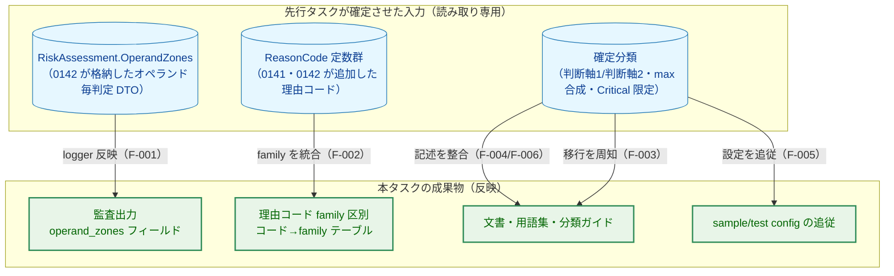
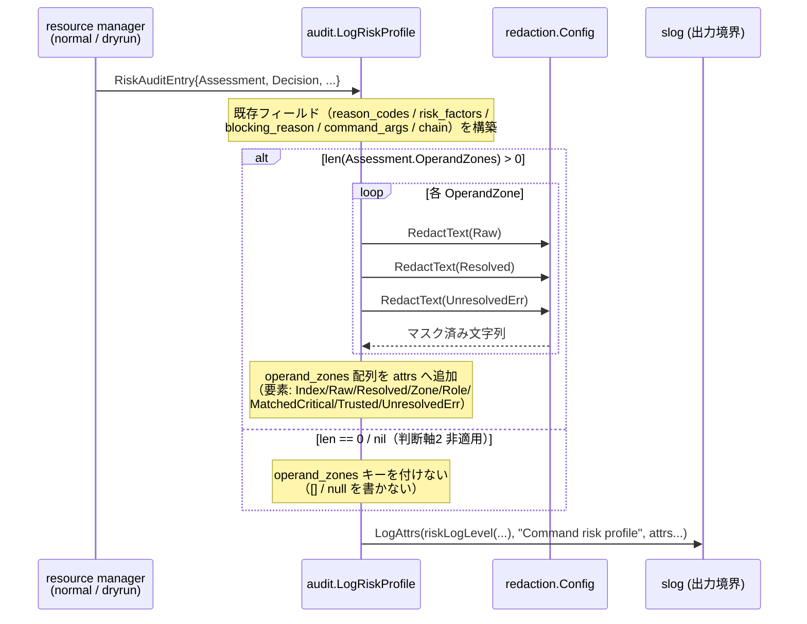
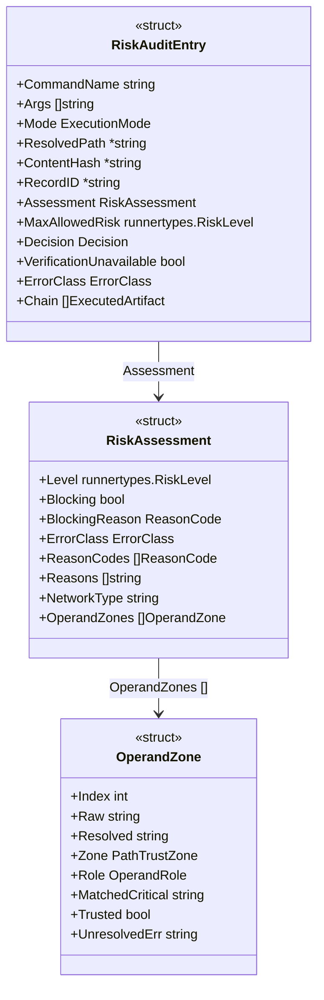
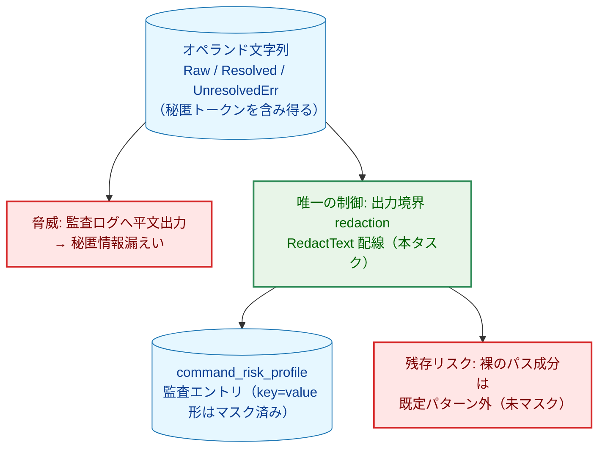
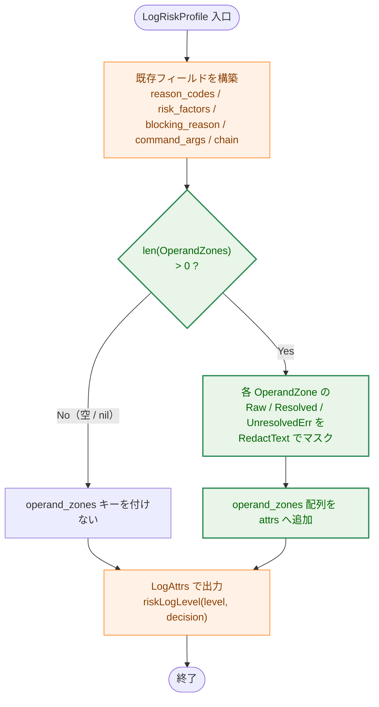

# 監査・文書整合 — アーキテクチャ設計書

## Document Status

| Item | Value |
|---|---|
| Status | `draft` |
| Created | 2026-06-25 |
| Review date | - |
| Reviewer | - |
| Comments | - |

> 本書は [01_requirements.md](01_requirements.md)（`approved`）を設計へ落とすものである。タスク分割の方針・根本原因は
> [0140/00_decomposition.md](../0140_risk_level_classification_review/00_decomposition.md) を、確定済みの分類ロジック・
> データ構造は先行タスク 0141（判断軸1）・0142（判断軸2）・0144（宣言的フラグ仕様）・0145（フラグ集合の実 CLI 整合）の
> 各 `02_architecture.md` を参照する。本タスクはこれら先行タスクが **実装済みで確定した挙動** を入力とし、新しい分類
> ロジックを追加しない（[01_requirements.md](01_requirements.md) §1・§3）。

---

## 1. 設計の全体像

### 1.1 設計原則

本タスクは横断成果物（監査出力・理由コードの family 区別・文書・sample config）を所有する **反映タスク** である。
分類の値そのものは決めず、先行タスクが確定させた分類結果を運用者が観測・理解できる形へ忠実に反映する。設計はこの
性格に従い、次の原則を貫く。

- **読み取り専用の反映（定義を一箇所に保つ）**: 分類結果の carrier（`RiskAssessment.OperandZones`）・分類・理由コードは
  先行タスクが定義済みであり、本タスクは新設しない。新設すると同一の分類結果が 2 箇所で定義され齟齬を生むため
  （[01_requirements.md](01_requirements.md) §3 B-1）。本タスクが新設するのは「監査出力への反映」と「family 区別の
  機械的根拠」だけである。
- **既存の存在条件・出力境界を範例とする（DRY）**: 監査フィールドの存在条件（`len()>0` ガード）と秘匿情報のマスク
  （出力境界での redaction）は、既存の `reason_codes`／`risk_factors`／`command_args` が採る扱いをそのまま踏襲し、
  新しい出力規約を導入しない。
- **決定性の維持（dry-run == runtime）**: 監査出力は同一の `RiskAssessment` に対し常に同一フィールドを書く。本タスクは
  パス解決・identity 評価・FS 副作用を監査経路へ新たに持ち込まない（決定性は 0142 が担保済み。
  [01_requirements.md](01_requirements.md) NF-003）。
- **フェイルクローズの周知（fail-loud / fail-silent の非対称）**: 破壊的変更のうち引き上げ（ブロック増）は実行時に
  config が deny されて気づける（fail-loud）が、引き下げ（許可増）は警告なく許可される（fail-silent）。後者は移行ノートが
  事前に気づける唯一の手段となるため、独立した見出しで提示することを設計要件とする（AC-05）。

### 1.2 概念モデル

本タスクが触れる 3 つの成果物と、それぞれが入力とする先行タスクの確定データの関係を示す。



> 矢印 A → B は「確定データ A を成果物 B へ反映する（B は A を読み取り専用入力とする）」を表す。エッジのラベルは
> 対応する機能要件（F-00x）を示す。

**凡例（Legend）**


---

## 2. システム構成

### 2.1 全体構成（コンポーネント配置）

監査出力に関わるコンポーネントと、本タスクで変更する箇所を示す。分類結果の生成（評価器）から監査出力までの
データ経路は既に存在し、本タスクが追加するのは出力側の 1 フィールドと family 区別だけである。

```mermaid
flowchart LR
    classDef data fill:#e6f7ff,stroke:#1f77b4,stroke-width:1px,color:#0b3d91;
    classDef process fill:#fff1e6,stroke:#ff7f0e,stroke-width:1px,color:#8a3e00;
    classDef enhanced fill:#e8f5e8,stroke:#2e8b57,stroke-width:2px,color:#006400;

    EVAL["risk/evaluator.go<br>StandardEvaluator"]
    PLAN[("VerifiedCommandPlan.Assessment<br>（OperandZones を内包）")]
    RM["resource/normal_manager.go<br>dryrun_manager.go"]
    ENTRY[("risktypes.RiskAuditEntry<br>（Assessment を保持）")]
    LOG["audit/logger.go<br>LogRiskProfile"]
    RED["redaction.Config<br>RedactText"]
    OUT[("command_risk_profile<br>監査エントリ（構造化ログ）")]
    RCG["risktypes/reason_codes.go<br>ReasonCode / ReasonFamily"]

    EVAL -->|"格納（0142 実装済み）"| PLAN
    PLAN -->|"Assessment 転記（実装済み）"| RM
    RM -->|"entry 構築（実装済み）"| ENTRY
    ENTRY --> LOG
    LOG -->|"operand_zones 出力（本タスク）"| OUT
    LOG -->|"Raw/Resolved/UnresolvedErr マスク（本タスク）"| RED
    RED --> OUT
    RCG -->|"family 区別（本タスク）"| LOG

    class PLAN,ENTRY,OUT data
    class EVAL,RM process
    class LOG,RED,RCG enhanced
```



> 矢印 A → B は「A が B を呼び出す／A のデータが B へ流れる」を表す。ラベルの「実装済み」は先行タスクで既に存在する
> 経路、「本タスク」は本設計で追加する経路を示す。

**凡例（Legend）**


`RiskAssessment.OperandZones` は評価器（`risk/evaluator.go` の `foldZoning` 等）で既に格納され、
`VerifiedCommandPlan.Assessment` → `RiskAuditEntry.Assessment` の経路で `LogRiskProfile` まで到達している。
したがって carrier の配線は不要で、本タスクの追加は **(1) `LogRiskProfile` での `operand_zones` 出力と
operand パス文字列の redaction 配線、(2) `reason_codes.go` への family 区別の追加** に限定される。

### 2.2 監査出力のデータフロー

`LogRiskProfile` が 1 件の `command_risk_profile` エントリを出力する流れを示す。`operand_zones` は既存フィールドと
同じ存在条件・出力境界に従って追加される。



> 矢印 A → B は「A が B を呼び出す」を表し、点線の戻り矢印は呼び出しの戻り値を表す。`alt`/`loop` は分岐・反復を示す。
> この図は処理の呼び出し順を表すシーケンス図のため、ノード色分けの凡例は持たない。

`LogRiskProfile` は allow／deny いずれの決定でも、また deny の error-return 経路でも常に書かれる
（[logger.go](../../../internal/runner/base/audit/logger.go) の既存契約）。`operand_zones` の存在可否は
**allow/deny ではなく carrier の有無** で決まる。carrier を伴う経路（評価器がプランを生成した allow／Blocking deny）
では `len()>0` のとき出力し、carrier を伴わない経路（プラン生成前に失敗する error-return の deny。
`emitErrorAudit`／`emitDryRunErrorAudit`）では `Assessment` が空のため自然に出力されない。これは「carrier が空＝
判断軸2 非適用」の規則（[01_requirements.md](01_requirements.md) AC-01）と一致する。

#### operand_zones の読み解き方（運用者向けデコード規則）

`operand_zones` の有無だけでは「リスク無し」と即断できない。`operand_zones` キーが **無い** 場合に 2 つの意味が
あり得るため、運用者（on-call）は同一エントリの `error_class`／`blocking_reason` と併せて次の 3 状態を判別する。

| エントリの形 | 意味 | 補足 |
|---|---|---|
| `operand_zones` 無し・`error_class` 無し | 判断軸2 が **非適用**（ファイル操作コマンドでない） | carrier が空。`Assessment` はあるが `OperandZones` が `len()==0`／nil |
| `operand_zones` 無し・`error_class` あり | 判断軸2 評価 **到達前に失敗** した deny（identity gate・パス解決・symlink 解決の失敗等） | error-return 経路。carrier 自体が存在しない。ファイル操作コマンドでも `operand_zones` は出ない |
| `operand_zones` あり（要素に `zone:"unresolved"` を含み得る） | 判断軸2 が **適用**。`unresolved` 要素は解決不能オペランドの fail-closed（write=High／read=Medium） | 空 carrier と異なり、解決不能は要素として残るため区別できる |

つまり「ファイル操作コマンドの deny なのに `operand_zones` が無い」場合は判断軸2 が **評価到達前に失敗** したことを
意味し（`error_class` が原因種別を示す）、「リスク無し」ではない。この区別は監査ストリームから deny を説明可能に
するための運用前提である。

---

## 3. コンポーネント設計

### 3.1 入力データ構造（先行タスクが定義済み・本タスクは読み取り専用）

`operand_zones` の出力元となる carrier の型を示す。これらは 0142 が定義し `RiskAssessment` へ格納済みであり、本タスクは
フィールドを **追加・変更しない**。監査出力は下記サブフィールドをそのまま構造化フィールドへ写す。



> 矢印 A → B（ラベル付き）は「A が B 型のフィールドを保持する（合成）」を表す。`[]` 付きラベルはスライス保持を示す。
> この図は型の保持関係を表すクラス図のため、ノード色分けの凡例は持たない。
>
> サブフィールドの意味（[operand_zone.go](../../../internal/runner/base/risktypes/operand_zone.go)）:
> - `Role`（write/read）は `ZoneUnresolved` の非対称 fail-closed（write=High／read=Medium）の根拠であり、
>   インシデント分析で「なぜその下限になったか」を再構成するために監査出力へ含める。
> - `Resolved` は symlink 解決後の絶対パス（解決不能なら空）、`UnresolvedErr` は `Zone==ZoneUnresolved` のときの
>   人間可読な原因。

### 3.2 監査出力の追加（F-001 / AC-01）

`audit.Logger.LogRiskProfile` に `operand_zones` フィールドの出力を追加する。シグネチャは変更しない。

```go
// audit パッケージ（変更なし。出力本体に operand_zones の構築を追加する）
func (l *Logger) LogRiskProfile(ctx context.Context, entry risktypes.RiskAuditEntry)
```

出力規約（既存フィールドの範例を踏襲する）:

- **存在条件**: `len(entry.Assessment.OperandZones) > 0` のときのみ `operand_zones` キーを付ける。空・nil では
  キー自体を付けない（`reason_codes`／`risk_factors`／`chain` と同じ `len()>0` ガード）。`operand_zones: []`／`null` を
  書かないことで grep・相関を壊さない。
- **要素形**: 各要素は `Index`／`Raw`／`Resolved`／`Zone`／`Role`／`MatchedCritical`／`Trusted`／`UnresolvedErr` を持つ
  構造化オブジェクト（`chain` が `[]map[string]string` を採るのと同型の表現）。`Zone`／`Role`／`MatchedCritical` は
  秘匿情報を含まない列挙値・固定パス名のためマスク対象外。
- **秘匿情報のマスク（配線）**: `Raw`／`Resolved`／`UnresolvedErr` の文字列は、`command_args` と同じ出力境界の
  redaction（`argRedactor.RedactText`）を **経由するよう本タスクで明示的に配線する**。`command_args` のマスクは別フィールド・
  別ループであり operand DTO には自動適用されないため（`chain` の `Path` が未マスクである既存傾向と同根）、配線の追加が
  必要である。
- **このマスクが唯一の防御線である（単一障害点・要テスト）**: 監査ログを包む `RedactingHandler`（Layer 2）は
  `slog.Any` で渡された **スライス／マップ形の要素までは再帰しない**（`LogValuer` でない slice 要素はそのまま通す。
  これが `chain` の `Path` が未マスクで残る理由でもある）。`operand_zones` も配列要素として渡すため、Layer 2 では
  保護されない。したがって `LogRiskProfile` 内の境界 redaction が **operand パス文字列に対する唯一の制御** となる。
  この単一障害点は AC-01 の漏えい否定テスト（§7.1・S-1）で必ず担保する。
- **マスクが捕捉する範囲（限界の明示）**: 再利用する `argRedactor`（`redaction.DefaultConfig()`）の `RedactText` は
  `key=value` 形式の秘匿トークン（`password=`／`token=`／`secret=`／`api_key=` 等）と認証ヘッダ（`Bearer `／`Basic `／
  `Authorization:`）のみを置換する。**パスの一区切りに裸で埋め込まれた資格情報**（例: パス成分としての API キー）は
  既定パターンに一致せずマスクされない。これは `command_args`／`chain.Path` と同じ既存の挙動・受容済みの残存リスクで
  あり、本タスクで新しいパターンは追加しない（YAGNI）。

> **なぜ既存の redaction を再利用するのか（YAGNI 確認）**: redaction 自体は既存の `redaction.Config` を再利用し、
> 新しい redactor やパターンは追加しない。不足しているのは「operand DTO のループから既存 redactor を呼ぶ配線」のみで
> ある。新規の秘匿機構を設けないことで、マスク規約が二重に定義されるのを避ける。将来 Layer 2 による二段防御を operand へも
> 効かせたい場合は、要素を `slog.Group`（`RedactingHandler` が再帰する形）として出力するか要素型に `LogValuer` を
> 実装する余地があるが、本タスクでは配列形・境界 redaction を採り、必須の保証は S-1 テストで与える。

### 3.3 理由コード family 区別の追加（F-002 / AC-03）

現状、`reason_codes.go` の family はコメント上のグルーピングに留まり機械的に強制されていない。インシデント相関で
「判断軸1（名前/profile）由来か判断軸2（パス信頼区分）由来か」等を機械的に区別する根拠を与えるため、コード→family の
明示マッピングを追加する。

```go
// reason_codes.go へ追加する型・テーブル・参照関数（高レベル定義）

// ReasonFamily は ReasonCode が属する family。監査ストリーム上で理由コードの
// 由来を機械的に区別するために用いる。
type ReasonFamily string

const (
    FamilyNameClassification ReasonFamily = "name_classification" // 判断軸1: 名前/profile 由来
    FamilyPrivilege          ReasonFamily = "privilege"           // 特権
    FamilyBinaryAnalysis     ReasonFamily = "binary_analysis"     // バイナリ解析シグナル由来
    FamilyUncertain          ReasonFamily = "uncertain"           // 不確実（fail-closed）
    FamilyRuntimeArgument    ReasonFamily = "runtime_argument"    // runtime・引数・形態 由来
    FamilyPathTrustZone      ReasonFamily = "path_trust_zone"     // 判断軸2: パス信頼区分 由来
)

// FamilyOf は code が属する family を返す。テーブルに無い code（family 未割当）は
// ok=false を返し、テストがこれを漏れとして検出する。
func FamilyOf(code ReasonCode) (ReasonFamily, bool)
```

設計上の要点:

- **テーブルかプレフィクス規約か（テーブルを採る理由）**: AC-03 はマッピングを「コード→family テーブル、または
  規約化したプレフィクス」のいずれでもよいとする。本設計はテーブルを採る。プレフィクス規約では `binary_analysis_*` の
  ように接頭辞を共有する family は表せるが、判断軸1 由来の `destructive_file_operation`／`system_modification`／
  `coreutils_classification` は共通接頭辞を持たず分類できないため、明示テーブルが必要になる。
- **family テーブルを唯一の列挙源とする（DRY）**: 全 `ReasonCode` を family へ写すテーブルを定義し、これを
  「コードの正準な列挙」として扱う。既存の網羅性・一意性テスト（`reason_codes_test.go` の
  ハードコード `all := []ReasonCode{...}`）はこのテーブルのキー集合から導出するよう改め、並行リストを廃する
  （[01_requirements.md](01_requirements.md) §3・S-2、および「リスト漏れはソース集合の range で検証」方針）。
- **family の網羅をテストで担保**: 「テーブルが全 `ReasonCode` を含む」ことの自動反映（Go は const ブロックを
  リフレクションで列挙できない）はテーブルを正準源とすることで達成し、新規 `ReasonCode` 追加時はテーブルへの
  追記が必須となる。さらに「テーブルの各 family 値が定義済み `ReasonFamily` のいずれかである」「重複・空値が無い」
  ことをテストで表明する（exhaustive/distinct だけでは family 区別を保証しないため、family 割当の網羅を別途表明）。
- **既存コードの意味・値は不変**: family の追加は分類・deny/allow に影響しない監査メタデータであり、既存 `ReasonCode`
  定数の文字列値・意味は変えない。新規 family を導入する場合のみテーブルを拡張する。

family 割当（既存のコメントグルーピングを踏襲。下表が全 36 コードの正準な割当であり、family テーブルはこの全件を
唯一の列挙源として保持する。新規コード追加時はテーブルへの追記が必須）:

| family | 含む `ReasonCode`（全件） |
|---|---|
| `name_classification` | `destructive_file_operation`／`system_modification`／`coreutils_classification`／`profile_destruction`／`profile_data_exfil`／`profile_network`／`profile_system_mod` |
| `privilege` | `privilege_escalation`／`profile_privilege` |
| `binary_analysis` | `binary_analysis_network`／`binary_analysis_dynamic_load`／`binary_analysis_exec`／`binary_analysis_svc`／`binary_analysis_mprotect_exec` |
| `uncertain` | `uncertain_missing_record`／`uncertain_schema_mismatch`／`uncertain_hash_mismatch`／`uncertain_unsupported_format`／`uncertain_unverified_identity`／`analysis_disabled` |
| `runtime_argument` | `arbitrary_code_execution`／`dangerous_arg_pattern`／`symlink_resolution_failed`／`identity_unbound`／`indirect_execution_rejected`／`indirect_execution_wrapper`／`forbidden_env_var`／`non_absolute_path`／`network_argument` |
| `path_trust_zone` | `trust_boundary_write`／`destination_zone`／`permission_grant`／`device_io`／`recursive_outside_safe_zone`／`sensitive_source_copy`／`unresolved_destination` |

> **family を監査ストリームへ出力するか**: AC-03 は「機械的に区別できる根拠の定義」を求めるものであり、family を
> 監査エントリへ新フィールドとして必ず書くことまでは要求しない。理由コードの値から `FamilyOf` で一意に family を
> 引けることが相関の基盤となる。本タスクのスコープでは `FamilyOf` の定義とテスト担保を必須とし、family の監査出力
> 自体は将来拡張（§9）に留める（YAGNI）。

### 3.4 文書・config 成果物（F-003〜F-006）

コードを伴わない成果物は次のとおり。バイリンガル文書は **日本語版を先に編集・コミットし、英語版へは `/mktrans` で
反映する**（直接両方を編集しない。[01_requirements.md](01_requirements.md) §3）。

- **移行ノート（F-003）**: ユーザー文書 [risk_assessment.ja.md](../../../docs/user/risk_assessment.ja.md) の既存
  「§8 移行ノート」に、引き上げ（AC-04）と引き下げ（AC-05）を記載する。引き下げは独立見出し／警告ブロックで提示し、
  引き上げリストへ埋没させない（§1.1 の fail-loud/fail-silent 非対称が根拠）。0145 由来の fail-closed 化
  （`recognized=true→false`）は引き上げ側の周知として明記する。NF-004 のログレベル運用注記（引き下げ対象の
  allow-Low は Debug に落ち `operand_zones` が本番ログ設定で失われ得る）も移行ノートへ記載する。
- **文書の整合（F-004）**: [risk_assessment.ja.md](../../../docs/user/risk_assessment.ja.md)・
  [command-risk-evaluation.ja.md](../../../docs/dev/architecture_design/command-risk-evaluation.ja.md) を確定分類へ整合し、
  旧記述（`fdisk`/`mkfs`=Medium、`rm`/`dd` の無条件 High）を除去確認する。0144/0145 を反映し、検出限界の節を
  「宣言的フラグ仕様＋単一 getopt パーサ＋完全性メタテスト」の現行アーキテクチャへ更新し、過剰認識（実 CLI に無い
  フラグの受理）を旧制約として残さない。用語集
  [translation_glossary.md](../../../docs/translation_glossary.md) へ未登録語（`オペランド毎判定`・`移行ノート`）を
  追加する。
- **sample/test config 追従（F-005）**: 引き上げ・fail-closed 化対象コマンドを使う既存 config を grep で網羅列挙し、
  必要な `risk_level` を付与するか、新分類下で意図した deny/allow になることを確認する。
- **分類ガイド最終化（F-006）**: [risk-level-classification-guide.ja.md](../../../docs/dev/architecture_design/risk-level-classification-guide.ja.md)
  を確定挙動へ改訂し Status を `draft` から確定へ遷移、その後に英語版を `/mktrans` で新規作成する。

### 3.5 コンポーネント責務一覧（新規・変更ファイル）

| ファイル | 区分 | 責務 / 変更内容 | 更新が必要な既存テスト |
|---|---|---|---|
| [internal/runner/base/audit/logger.go](../../../internal/runner/base/audit/logger.go) | 変更 | `LogRiskProfile` に `operand_zones` 出力を追加。`Raw`/`Resolved`/`UnresolvedErr` を `argRedactor.RedactText` 経由でマスク配線。存在条件は `len()>0` ガード | [audit/logger_test.go](../../../internal/runner/base/audit/logger_test.go)（`command_risk_profile` 出力の表明テストに operand_zones の存在/非存在/漏えい否定を追加） |
| [internal/runner/base/risktypes/reason_codes.go](../../../internal/runner/base/risktypes/reason_codes.go) | 変更 | `ReasonFamily` 型・コード→family テーブル・`FamilyOf` を追加。既存 `ReasonCode` の値・意味は不変 | [risktypes/reason_codes_test.go](../../../internal/runner/base/risktypes/reason_codes_test.go)（`TestReasonCodes_AllDistinct` のハードコード `all` リストを family テーブル由来へ置換し、family 網羅テストを追加） |
| [docs/user/risk_assessment.ja.md](../../../docs/user/risk_assessment.ja.md) → [risk_assessment.md](../../../docs/user/risk_assessment.md) | 変更 | §8 移行ノート（AC-04/AC-05/NF-004）と分類表の整合。英語版は `/mktrans` 反映 | （文書のみ。テスト無し） |
| [docs/dev/architecture_design/command-risk-evaluation.ja.md](../../../docs/dev/architecture_design/command-risk-evaluation.ja.md) → [command-risk-evaluation.md](../../../docs/dev/architecture_design/command-risk-evaluation.md) | 変更 | 検出限界・フラグ解析の節を 0144/0145 現行アーキテクチャへ更新。`operand_zones` を監査セクションへ追記 | （文書のみ） |
| [docs/dev/architecture_design/risk-level-classification-guide.ja.md](../../../docs/dev/architecture_design/risk-level-classification-guide.ja.md) → `risk-level-classification-guide.md`（新規） | 変更/新規 | ガイドを確定挙動へ改訂し Status 遷移。英語版を `/mktrans` で新規作成 | （文書のみ） |
| [docs/translation_glossary.md](../../../docs/translation_glossary.md) | 変更 | `オペランド毎判定`・`移行ノート` 等の未登録語を追加し訳語統一 | （文書のみ） |
| [sample/](../../../sample/) 配下の該当 config | 変更 | 引き上げ・fail-closed 化対象コマンドへ `risk_level` 付与、または意図した結果の確認 | config をロードする統合テスト（`make test` 全体） |

---

## 4. エラーハンドリング設計

本タスクは新しいエラー型・失敗経路を導入しない。監査出力は **best-effort のログ出力** であり、`LogRiskProfile` は
error を返さない（既存契約）。設計上のエラーハンドリングは次の方針に従う。

- **出力は決定を変えない**: `operand_zones` の構築・redaction は監査出力の一部であり、deny/allow の判定には影響しない。
- **operand パスのマスクは二段防御ではない（単一制御）**: 一般のログ秘匿は Layer 1（出力前のフィールド単位 redaction）と
  Layer 2（全ハンドラを包む `RedactingHandler`）の二段で守られる
  （[security-architecture.md](../../../docs/dev/architecture_design/security-architecture.md) の
  "Secure Logging and Sensitive Data Protection"／"Security Architecture Patterns"）。ただし `RedactingHandler` は
  `slog.Any` で渡されたスライス／マップ形の要素までは再帰しないため（`chain.Path` が未マスクで残るのと同じ理由）、
  配列形の `operand_zones` は Layer 2 の保護を受けない。したがって本タスクが `LogRiskProfile` で行う境界 redaction が
  operand パス文字列の **唯一の制御**（単一障害点）であり、その健全性は漏えい否定テスト（§7.1・S-1）で担保する。
- **family 未割当はテストで検出**: `FamilyOf` がテーブルに無いコードへ `ok=false` を返す経路は、実行時エラーではなく
  テストで漏れを検出するための表明点である（実行時には全コードが割当済みであることをテストが保証する）。
- **新規エラー型**: N/A（本タスクは型を追加しない）。

---

## 5. セキュリティ考慮事項

### 5.1 脅威モデル

本タスクが新たに生じさせ得る主な脅威は **監査ログ経由の秘匿情報漏えい** である。オペランドの Raw/Resolved パスや
解決失敗メッセージには `key=value` 形式の秘匿トークンが現れ得るため、出力前のマスクが必須となる。
配列形フィールドである `operand_zones` は `RedactingHandler`（Layer 2）の再帰対象外であり、後述の境界 redaction が
唯一の制御となる（§4）。



> 矢印 A → B は「データ A が経路 B を通る／脅威 A に対策 B を適用する／対策 B に残存リスク B' が伴う」を表す。

**凡例（Legend）**


### 5.2 セキュリティ設計パターン

- **出力境界での秘匿情報のマスク（S-1）**: `Raw`/`Resolved`/`UnresolvedErr` を `command_args` と同一の redaction
  （`RedactText`）へ通す。これは `key=value` 形式の秘匿トークン・認証ヘッダを置換する範囲であり、裸でパス成分に
  埋め込まれた資格情報は対象外（§3.2 の限界）。漏えい否定テスト（§7.1・S-1）は **`key=value` を含むパスがマスク
  される** ことを表明し、裸のパス成分は受容済み残存リスクとして扱う。Layer 2 が配列形を再帰しない以上、この境界
  redaction が唯一の制御である（§4）。
- **緩和コマンドの監査証跡の消失（観測性の後退・NF-004）**: 本タスクが引き下げる破壊的コマンド（safe-zone/ordinary の
  `rm`/`dd`/`shred`/`unlink`/`rmdir`）は allow かつ Low になると `riskLogLevel` で Debug 出力となり、本番のログレベル
  設定では `operand_zones` を含むエントリごと失われ得る。deny は Warn 下限で必ず説明可能だが、**危険コマンドの allow を
  事後に正当化する根拠（どのゾーンだから許可されたか）が既定設定では残らない** 観測性の後退である。本タスクは
  `riskLogLevel` の挙動を変えず、運用回避策（緩和コマンドの監査証跡を残すにはログレベルを Debug 以下にする）を
  移行ノート（AC-05・§3.4）へ運用注記として記載する。
- **フェイルクローズを観測できるようにする（fail-silent 防止）**: 引き下げ（許可増）は実行時に警告なく許可される
  ため、移行ノートで独立した見出しを設けて提示することと、対象の sample/test config を漏れなく洗い出して追従させる
  ことを設計要件とする。これは実行時ガードではなく、緩和が監査されないまま本番に投入されるのを防ぐため、事前に
  気づけるようにする手段である。
- **改ざん耐性（出力の決定性）**: `operand_zones` は carrier から決定的に導出され、allow/deny 双方および dry-run/normal
  双方で同一に出力される。攻撃者が経路を選んで operand 記録だけを抑止することはできない（出力可否は carrier の有無で
  決まり、意図に依存しない）。
- **権限・特権**: 本タスクは特権昇降の経路を変更しない。監査出力の追加のみで、blast radius は構造化ログのスキーマ
  （新規キー `operand_zones` の追加）に限定される。

### 5.3 ログスキーマの後方互換（運用注記）

`operand_zones` は既存エントリへ **追加されるオプショナルキー** である。`command_risk_profile` を解析する既存の
ログ消費側は、未知キーを許容する必要がある（キーは `len()>0` のときのみ現れるため、判断軸2 非適用コマンドでは
従来どおり現れない）。この追加はキー削除・既存キーの意味変更を伴わないため、ログ消費側の段階移行（shadow）は不要。

---

## 6. 処理フロー詳細

### 6.1 `operand_zones` 出力の判定フロー

`LogRiskProfile` 内での `operand_zones` 出力可否と redaction の流れを示す。



> 矢印 A → B は「処理 A の次に処理 B へ進む」を表し、菱形は分岐条件を示す。

**凡例（Legend）**


### 6.2 副作用契約（フラグ／モード別）

本タスクは `--dry-run`／`--force` 等の **新しいフラグ・モードを導入しない**。既存の実行モード（`ModeNormal`／
`ModeDryRun`）に対する副作用は次のとおり。

| モード | FS 書込/削除 | ネットワーク送信 | 監査出力（`operand_zones` 含む） |
|---|---|---|---|
| `ModeNormal`（実行） | 本タスクは追加しない | 本タスクは追加しない | carrier があれば出力（決定的） |
| `ModeDryRun`（プレビュー） | 追加しない（プレビューのため元来書込なし） | 追加しない | carrier があれば出力（normal と同一） |

監査出力は両モードで同一の `RiskAssessment` から同一フィールドを書く。本タスクは FS 副作用・非決定な入力
（live identity 等）を監査経路へ持ち込まないため、NF-003／AC-28（runtime==dry-run）は本タスクのスコープでは自明に
充足する（[01_requirements.md](01_requirements.md) NF-003）。唯一の「副作用」である構造化ログ出力はモード非依存で
等価である。

---

## 7. テスト戦略

### 7.1 単体テスト（AC-01 / AC-03）

- **operand_zones 出力（AC-01）**: 代表コマンド（`cp evil /usr/bin/ls`・symlink 経由・複数オペランド）で
  `command_risk_profile` エントリを捕捉し、`operand_zones` 各要素の `Index`/`Raw`/`Resolved`/`Zone`/`Role`/`Trusted` が
  carrier の値どおりに出力されることを表明。carrier が空のコマンドではキーが **無い** こと、deny 経路でも出力される
  ことを表明。
- **漏えい否定テスト（AC-01 / S-1）**: `Raw`/`Resolved`/`UnresolvedErr` に秘匿パターン（資格情報を含むパス等）を持つ
  オペランドを与え、出力で当該秘匿値が **マスクされている** ことを表明（存在テストではなく漏えいの否定）。
- **family 区別（AC-03）**: `FamilyOf` が全 `ReasonCode` に対し定義済み `ReasonFamily` を返すこと（family 割当の網羅）、
  family テーブルから導出した列挙で既存の一意性・非空テストが緑であることを表明。

### 7.2 統合テスト（AC-02 / AC-07）

- **deny 時の理由コード記録（AC-02, end-to-end）**: 判断軸1 由来（`insmod`＝`system_modification`）・判断軸2 由来
  （trust-critical 書込＝`trust_boundary_write`）・危険引数パターン由来（`dd if=`＝`dangerous_arg_pattern`）の代表 deny を
  捕捉し、`reason_codes`／`blocking_reason` に正しい理由コードが記録されることを表明。判断軸2 由来コードは
  [reason_codes.go](../../../internal/runner/base/risktypes/reason_codes.go) の "axis 2" ブロックの定数名を正確に引く（S-3）。
- **sample/test config 追従（AC-07）**: 列挙した config が `make test` 内でロード・評価でき、テスト用 config が新分類で
  意図せず deny されないことを表明（意図的に deny を検証する config はその旨を明示）。

### 7.3 文書検証（AC-04〜AC-06 / AC-08）

文書系 AC は textual/documentation presence の静的確認を主とする（[requirements_process.md](../../../docs/dev/developer_guide/requirements_process.md) §4）。

- **移行ノート（AC-04/AC-05）**: 引き上げと引き下げが同一移行ノート内に存在し、引き下げが独立見出し／警告ブロックで
  提示され、見落とされないことを確認。
- **文書の整合（AC-06）**: (a) 確定分類の全コマンドが分類表に反映、(b) 旧記述（`fdisk`/`mkfs`=Medium・`rm`/`dd` 無条件
  High）の除去確認、(c) 0139 との上書き関係を移行ノートで明示、の充足で完了とする。
- **ガイド最終化（AC-08）**: (a) ガイドの分類記述が AC-06 の分類表と齟齬なし、(b) Status が確定へ遷移、(c) 英語版が
  存在し日本語版と構造一致、の 3 点で完了とする。

---

## 8. 実装の優先順位

[01_requirements.md](01_requirements.md) §3 のとおり、本タスクは 0141・0142・0144・0145 がマージされ `make test` が緑で
あることを着手の前提とする。本タスク内の順序は次のとおり。

1. **Phase 1 — コード（監査・family）**: `operand_zones` 出力＋redaction 配線（AC-01）、`ReasonFamily`／`FamilyOf`／
   family テーブル＋テスト（AC-03/NF-001）、deny 理由コードの end-to-end テスト（AC-02）。`make test`/`make lint`/
   `make fmt` を緑に保つ。
2. **Phase 2 — sample/test config 追従（AC-07）**: 引き上げ・fail-closed 化対象コマンドの grep 網羅と `risk_level` 付与。
3. **Phase 3 — 文書（日本語版）**: 移行ノート（AC-04/AC-05/NF-004）→ ユーザー/開発者文書の整合（AC-06）→ 用語集 →
   分類ガイド改訂（AC-08）の順に日本語版を編集・コミット。
4. **Phase 4 — 英語版反映**: 各日本語版確定後に `/mktrans` で英語版を反映・新規作成（AC-06/AC-08）。

---

## 9. 将来拡張性

- **family の監査出力**: 本タスクでは `FamilyOf` の定義に留め、family を `command_risk_profile` の新フィールドとして
  出力することは行わない（YAGNI）。将来、相関のために family をログへ直接書く要求が生じた場合は、`operand_zones` と
  同じ存在条件・出力境界の規約に従って追加できる。
- **read 系情報漏えいモデル**: 機密ファイル下限（0142）の文書反映は本タスクで行うが、完全な read 系分類の導入は
  将来課題であり本タスクでも導入しない（[01_requirements.md](01_requirements.md) §6・0140/02 §9 を継承）。

---

## 付録: 決定履歴（本文の現在状態と分離）

> 本文は監査・文書整合の現在の設計を記述する。以下は本タスク固有の設計判断のうち、要件・先行タスク方針からの
> 含意を明示しておくべきものに限る（経緯の網羅は git 履歴・先行タスクの `02_architecture.md` を参照）。

- **carrier を新設せず既存経路に沿って反映する判断**: `RiskAssessment.OperandZones` は 0142 が定義・格納済みで、
  `RiskAuditEntry.Assessment` 経由で `LogRiskProfile` まで既に到達している。本タスクで carrier・分類・コードを新設すると
  分類結果が 2 箇所で定義され齟齬を生むため、出力側の反映のみを追加する（[01_requirements.md](01_requirements.md) §3 B-1）。
- **family を「テーブル＝唯一の列挙源」とする判断**: 既存テストはハードコードの `all` リストで全 `ReasonCode` を列挙して
  いたが、family 追加に合わせてこれを family テーブル由来へ統合し、並行リストの二重管理を廃する。Go は const ブロックを
  リフレクションで列挙できないため、テーブルを正準源とし、新規コード追加時のテーブル追記をテストで強制する。
- **family を監査出力へ書かない判断（YAGNI）**: AC-03 は「機械的に区別できる根拠の定義」を求めるもので、family の
  ログ出力までは要求しない。理由コード値から `FamilyOf` で一意に引ければ相関の基盤は満たされるため、出力は将来拡張
  （§9）に留める。
</content>
</invoke>
