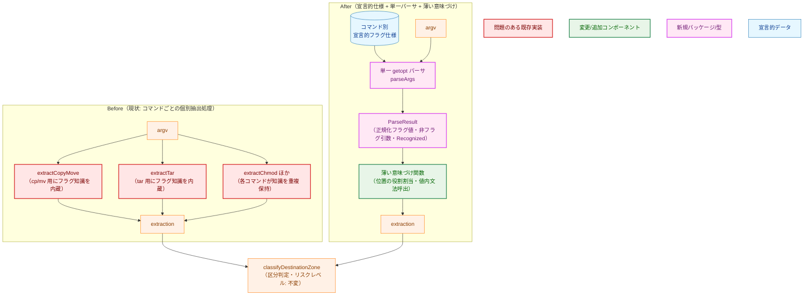
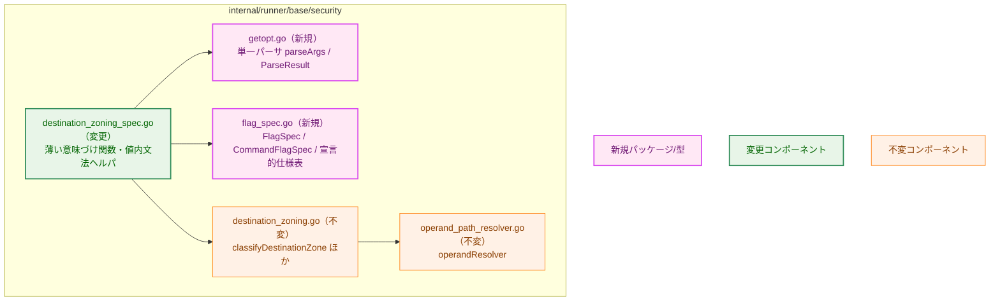
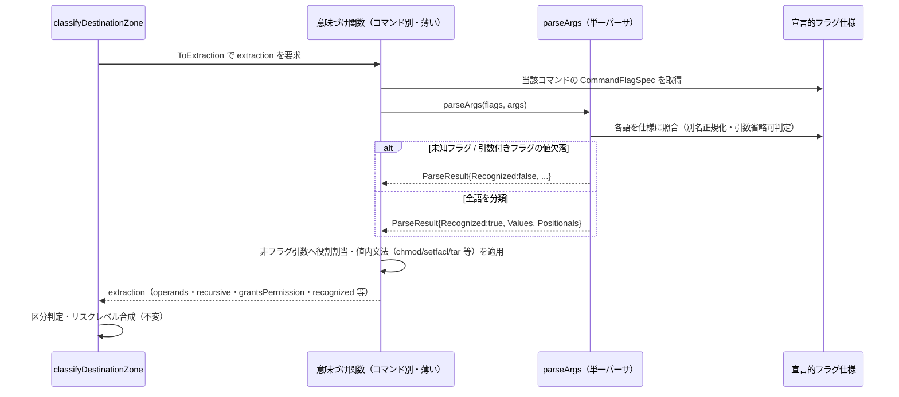
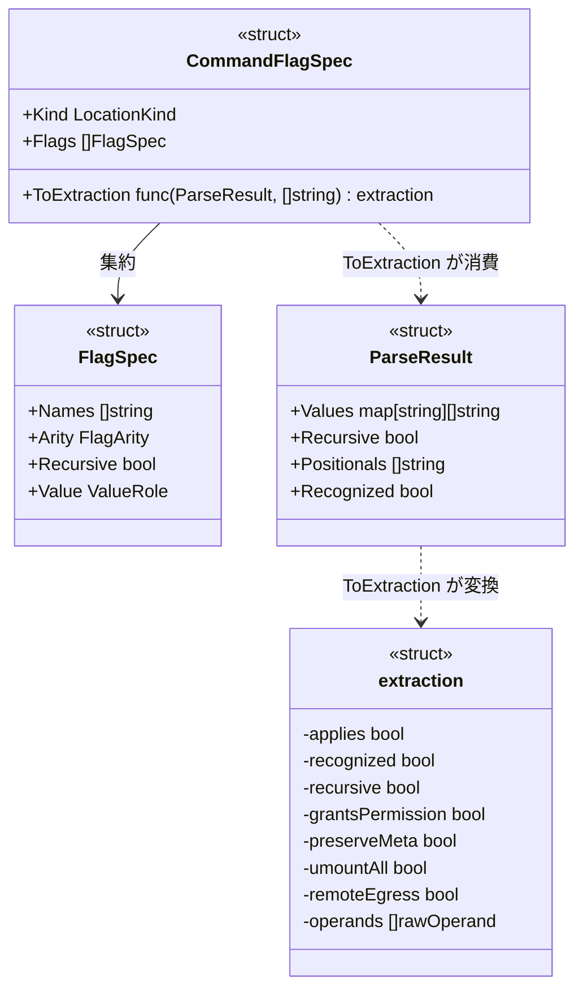
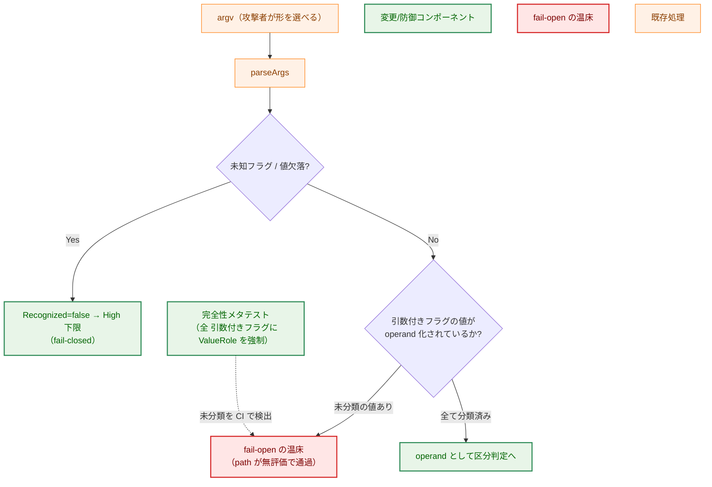
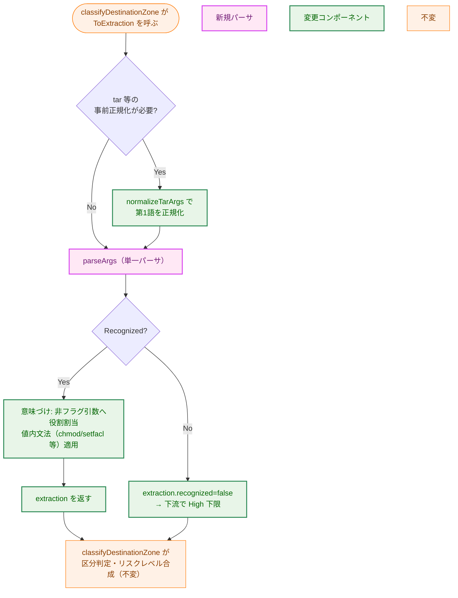

# オペランド抽出の宣言的フラグ仕様化（単一 getopt パーサ） — アーキテクチャ設計書

## Document Status

| Item | Value |
|---|---|
| Status | `draft` |
| Created | 2026-06-24 |
| Review date | - |
| Reviewer | - |
| Comments | - |

> 本書は [01_requirements.md](01_requirements.md) の設計である。用語（オペランド・引数付きフラグ・真偽フラグ・
> 再帰フラグ・引数省略可・非フラグ引数）は要件定義書 §1 の定義に従う。本タスクは 0142 で確定した抽出層の
> 集中リファクタであり、観測可能な挙動（リスクレベル・`Operands`・`ReasonCodes`・`Recognized`・`Applies`）を変えない。
> 背景・既存設計は [0142/02_architecture.md](../0142_axis2_destination_zoning/02_architecture.md) §3.2（best-effort 抽出と
> fail-closed 保証）および §9（本リファクタの切り出し）を参照する。

## 1. 設計の全体像

### 1.1 設計原則

- 分離: argv の「フラグ解析」（全コマンド共通・データ駆動）と「意味づけ」（コマンド固有・薄い関数）を分ける。
  フラグ知識（どの表記が同一フラグか、引数を取るか、省略可か、再帰か）は**コードからデータへ**移す。
- 挙動保存: 抽出層の内部構造のみを変え、`extraction` の出力と下流（区分判定・リスクレベル）を一切変えない。
  0142 の全テストは無改変で緑に保つ（AC-09）。
- fail-closed の保存: 未知/曖昧形・引数欠落は `Recognized=false` に倒し、下流が High 下限へ落とす（AC-11）。
  この安全保証は抽出精度ではなく `Recognized` contract が担う（0142 §3.2 を継承）。
- 完全性の構造化: 「引数付きフラグを宣言したが値（path）を使い忘れる」fail-open クラスを、レビューでなく
  メタテストで機械的に塞ぐ（AC-07）。

### 1.2 なぜ既存方式では不足か（YAGNI 検討）

既存は「コマンドごとの個別抽出処理」で、各処理が独自にフラグ知識を再実装している。この構造は 0142 のレビューで
別名・引数省略可・値内文法の取りこぼしを 4 ラウンドにわたり再発させた（いずれも fail-closed へ縮退し実害ある
fail-open は個別修正済みだが、温床は残存）。要件 F-001〜F-003 が求めるのは「別名追加・引数省略可・fail-closed の
統一をデータ 1 箇所で完結させ、取りこぼしを構造的に不能にする」ことであり、これは個別抽出処理の改良では達成
できない（各処理が知識を重複保持する限り再発の余地が残る）。よってデータ駆動の単一パーサへ置き換える。

### 1.3 概念モデル（Before / After）



> 凡例（色分け）: オレンジ=既存・不変、緑=変更/追加、紫=新規、青=宣言的データ、赤=問題のある既存実装。
> 矢印 A → B は「A の出力を B が入力として消費する」データの流れを表す。下段右の `classifyDestinationZone`
> 以降（区分判定・リスクレベル）は本タスクで一切変更しない。

## 2. システム構成

### 2.1 コンポーネント配置

リファクタは `internal/runner/base/security` パッケージ内に閉じる。新規 2 ファイルを追加し、抽出処理の
本体（`destination_zoning_spec.go`）を薄い意味づけへ置き換える。区分判定（`destination_zoning.go`）と
リゾルバ（`operand_path_resolver.go`）は変更しない。



> 凡例: 紫=新規ファイル/型、緑=変更、オレンジ=不変。矢印 A → B は「A が B を呼び出す/依存する」を表す。

### 2.2 データフロー



> 矢印は呼び出し方向、点線矢印（`-->>`）は戻り値を表す。`parseArgs` は副作用を持たない純関数で、
> live identity も環境も参照しない（NF-003）。

## 3. コンポーネント設計

### 3.1 型定義（高レベル）

宣言的フラグ仕様は「同一フラグの全表記を 1 エントリ」にまとめ、引数の有無・省略可否・再帰・値の役割を保持する。

```go
// FlagArity は、フラグが引数を取るか、取る場合に必須か省略可かを表す。
type FlagArity int

const (
    ArityNone     FlagArity = iota // 真偽フラグ（引数なし）
    ArityRequired                  // 引数付きフラグ（引数必須。付随形または次の語で必ず値を取る）
    ArityOptional                  // 引数付きフラグ（引数省略可。付随形 --flag=V / -oV のみ。分離後続語は取らない）
)

// ValueRole は、引数付きフラグが捕捉した値の意味づけ。ValueUnset（ゼロ値）は未分類で、
// 完全性メタテストが失敗する（= 宣言漏れの検出）。
type ValueRole int

const (
    ValueUnset   ValueRole = iota // 未分類（ゼロ値。メタテストで失敗させるための番兵）
    ValueNonPath                  // path でない値（無視してよいと明示）
    ValueWrite                    // 値は書込先オペランド
    ValueRead                     // 値は読取元オペランド
)

// FlagSpec は 1 つの論理フラグの宣言的仕様。別名（短縮形・長形式）は Names に集約する。
type FlagSpec struct {
    Names     []string  // すべての表記（例: ["-t", "--target-directory"]）。Names[0] を正規キーとする
    Arity     FlagArity
    Recursive bool      // 再帰フラグ（例: -r/-R/-a）
    Value     ValueRole // Arity が引数付き（Required/Optional）のときの値の役割
}

// CommandFlagSpec は 1 コマンドの宣言的仕様と、解析結果を extraction へ写す意味づけ関数。
type CommandFlagSpec struct {
    Kind         LocationKind
    Flags        []FlagSpec
    ToExtraction func(ParseResult, []string) extraction
}
```

> アリティ不変条件（移行時に必ず守る）: 各フラグの `Arity` は**実 CLI の有効アリティと現行実装の挙動に一致**させる。
> 現行で次の語を必ず消費するフラグ（install `-o`/`-g`、curl `-o` 等）は `ArityRequired` を保つ。`ArityOptional` は実 CLI で
> 省略可なフラグ（例 `tar --one-top-level`）にのみ付与する。これは「必須→省略可」への誤分類で値（path）を取りこぼす
> fail-open（要件 §1 の経路 (1)）を防ぐための要件であり、移行時のチェック項目とする（§7）。
>
> `ToExtraction` の第 2 引数（生 argv）は、getopt に乗らない値文法（dd の `if=`/`of=` や chattr の属性トークン。§3.5）の
> ためにのみ用いる。通常の getopt コマンドはフラグ値を `ParseResult.Values` から取得し、生 argv を再走査しない。

単一パーサの入出力:

```go
// ParseResult は単一 getopt パーサの出力。フラグ値は表記別名を正規化済み。
// 引数なしフラグ（真偽/再帰）は Values に空スライスで現れ、キーの存在が「出現」を表す
// （出現フラグを別マップで二重管理しない）。
type ParseResult struct {
    Values      map[string][]string // 正規キー（Names[0]）→ 捕捉した値（引数なしは空スライス）
    Recursive   bool                // 再帰フラグが 1 つ以上出現したか
    Positionals []string            // 非フラグ引数（フラグでもフラグの値でもない語）
    Recognized  bool                // 全語を分類できたか（false は fail-closed）
}

// parseArgs は全コマンドが共有する唯一のフラグ解析器。宣言的仕様（フラグ集合のみ。Kind/ToExtraction には
// 依存しない）を消費し argv を統一的に解析する。一元処理する形式: --flag=value / 付随短縮値 -C/usr /
// 短縮連結 -rf / -- / 引数省略可 / 別名正規化。未知フラグ・引数必須フラグの値欠落は Recognized=false
// （語は暗黙に捨てない）。総 argv 長に対して線形・副作用なし・live identity/環境を参照しない。
func parseArgs(flags []FlagSpec, args []string) ParseResult
```

> 決定性の制約（NF-003）: `ToExtraction` は `Values` を**正規キーの直接参照のみ**で読み、`for range` で走査しない。
> オペランドの順序は `Positionals`（スライス）と各フラグの明示参照から決め、map の反復順に依存させない。
> これにより `Operands`/`ReasonCodes` の順序が実行ごとに揺れない（観測可能挙動の同一性、AC-10）。
>
> 短縮連結中の引数付きフラグの規則: クラスタ内で引数付きフラグ（`ArityRequired`/`ArityOptional`）に達したら、その文字以降の
> クラスタ残余をその付随値として解釈する。残余が無い場合、`ArityRequired` は次の語を値に取り、`ArityOptional` は値なしとする
> （分離後続語は取らない）。例: `tar -xzf a.tar` は `-f`（値）が末尾なので次の語 `a.tar` を値に取る。`sed -ir` は省略可引数フラグ
> `-i` がクラスタ内に来た形で、`r` は `-i` の付随値であり `-i -r` とは解さない（GNU getopt の「省略可引数は付随形のみ」に一致）。
> この曖昧になりやすい形の解釈は `getopt_test.go` の表で固定する（AC-03/AC-06）。

### 3.2 値内文法ヘルパ（既存・不変）

フラグの「値の中身」の文法は汎用 getopt の範囲外で、既存の純関数ヘルパが担う。意味づけ関数から呼び出す。
本タスクで挙動は変えない。

| ヘルパ | 役割 |
|---|---|
| `chmodGrantsHigh(mode string) bool` | chmod の数値/シンボリックモードの setuid・world-write 付与判定 |
| `aclGrantsWrite(entry string) bool` | setfacl エントリの書込付与判定（default ACL の接頭辞シフト含む） |
| `tarMode(args) / normalizeTarArgs(args)` | tar の第1語限定モード解析（`xzf` 形を `-xzf` へ正規化） |
| `isRemoteTerminus(arg string) bool` | rsync/scp の遠隔終端判定（`host:path`・`host::module`・IPv6） |
| `isChattrMode(token string) bool` | chattr の属性トークン（`+i` 等）とフラグの判別 |

### 3.3 コンポーネント責務

| ファイル | 区分 | 責務 | 備考 |
|---|---|---|---|
| `getopt.go` | 新規 | 単一 getopt パーサ `parseArgs` と `ParseResult` | フラグ形式を一元処理（F-002） |
| `flag_spec.go` | 新規 | `FlagSpec`/`CommandFlagSpec`/`FlagArity`/`ValueRole` と全コマンドの宣言的仕様表 | フラグ知識のデータ化（F-001） |
| `destination_zoning_spec.go` | 変更 | `zoningSpecs` を `CommandFlagSpec` 参照へ移行。getopt 適合コマンドの個別抽出処理を `ToExtraction`（非フラグ引数の役割割当・値内文法呼出）へ縮小し、重複フラグ集合定義と旧 `scanFlags` を撤去。事前正規化が必要なコマンド（tar・chattr）は属性/モードトークンを分離してから `parseArgs` に通し、getopt 非適合（dd の key=value）のみ専用の `ToExtraction` を維持する（§3.5） | 値内文法ヘルパ（`tarMode`/`isChattrMode` 等）は存置 |
| `destination_zoning.go` | 不変 | `classifyDestinationZone` ほか区分判定・リスクレベル合成 | `extraction` 入力契約は不変 |
| `operand_path_resolver.go` | 不変 | パス解決・Trusted 述語 | 本タスク対象外（0142 PR-2 で確定） |
| `getopt_test.go` | 新規 | 単一パーサの表駆動テスト（AC-03〜AC-06）・大入力/長連結の病的ケース | |
| `flag_spec_test.go` | 新規 | 完全性メタテスト（AC-07）・アリティ不変条件チェック・回帰代表ケース（AC-08） | |
| `extraction_diff_test.go` | 新規 | 差分テスト: 旧実装（凍結）と新実装を生成コーパスで突き合わせ、`extraction` を全フィールド一致で検証（§7） | 挙動保存の主たる担保 |
| `destination_zoning_test.go` | 不変 | 既存の挙動テスト（AC-09）。**期待値変更があれば本タスク不適合** | 無改変で緑が必須 |
| `risk/live_identity_guard_test.go` | 変更（0142 既存） | 対象ファイル集合に `getopt.go`・`flag_spec.go` を追加（NF-003 静的ガードの再利用。§7） | 新規ガードは作らない |

### 3.4 型関係



> 矢印 A --> B は「A が B を保持/集約」、点線 A ..> B は「A が B を生成/消費」を表す。

### 3.5 コマンドの解析形態

「単一パーサ＋薄い `ToExtraction`」が成り立つのは getopt 文法に乗るコマンドである。一部は前処理または別文法を要し、
意味づけがそのぶん厚くなる。設計はこの 3 形態を明示的に区別する（「すべてが薄い」とは主張しない）。

| 形態 | 対象 | 取り扱い |
|---|---|---|
| getopt 適合（大多数） | cp/mv/rm/ln/touch/install/chmod/chown/setfacl/tee/find/curl/wget/scp/rsync 等 | 宣言的 `Flags` ＋ `parseArgs` ＋ 薄い `ToExtraction`（`ParseResult` のみ参照） |
| 事前正規化が必要 | tar・chattr | tar: `normalizeTarArgs` で第1語（`xzf` 形）を `-xzf` へ正規化してから `parseArgs` に通す（`tarMode` はモード判定に存置）。chattr: `isChattrMode` に合致する属性モードトークン（`+i`/`-a`/`=j` 等）を `parseArgs` の前に分離する。マイナス始まりの属性削除（例 `chattr -i file` の `-i`）は getopt の未知フラグと衝突するため、この事前分離が必須。残りの通常フラグ（`-v`/`-p`/`-R` 等）は `FlagSpec` で宣言し `parseArgs` が処理する（フラグ知識はデータ側に保つ） |
| getopt 非適合 | dd（`if=`/`of=` の key=value のみ。フラグを持たない） | `Flags` を空にし、`ToExtraction` 内で生 argv を専用解析（従来挙動を維持）。完全性メタテストは宣言フラグが無いため自明に通り、挙動保存は差分テスト（§7）で担保 |

> このため要件 F-002 の「単一パーサが全 argv を扱う」は「getopt 形式を一元化する」意であり、key=value や属性トークンの
> ような非 getopt 文法までパーサに取り込む意味ではない。tar・chattr は事前正規化で getopt 形へ整えてから `parseArgs` に通し、
> フラグ知識は宣言データへ寄せる（重複実装を避ける）。dd の key=value のみを意図的な例外として `ToExtraction` 側に残す。

## 4. エラーハンドリング設計

- 解析の失敗は例外でなく `ParseResult.Recognized=false` で表す。意味づけ関数はこれを
  `extraction.recognized=false` に写し、下流 `classifyDestinationZone` が High 下限へ倒す（既存挙動）。
- 新規のエラー型は導入しない。`extraction`/`LocationResult` の表現（bool フラグ・`RiskLevel`）を踏襲する。
- 不能化の経路（すべて fail-closed）: 未知フラグ／引数必須フラグの値欠落／必須の非フラグ引数欠落／
  解決不能オペランド（リゾルバ側、不変）。「語を暗黙に捨てる」分岐を設けないことで保証する（AC-04/AC-11）。
- 可観測性の既知ギャップ（挙動保存の範囲）: 上記の複数原因はいずれも同一の `Recognized=false`＋
  `ReasonUnresolvedDestination` に畳まれるため、`LocationResult` だけでは「フラグの打ち間違い」と「真に解析不能な
  敵対的 argv」を区別できない。本タスクは現行の単一理由コード挙動をそのまま保存する（退行なし）。原因の細分提示
  （どの解析条件で `Recognized=false` になったか）は logger 出力を扱う 0143 の所掌とし、本設計では差分テスト（§7）が
  失敗原因まで突き合わせることでデバッグ可能性を補う。

## 5. セキュリティ考慮事項

本リファクタはセキュリティ境界（解決・区分判定）を変えず、抽出層の構造のみを変える。安全保証は引き続き
fail-closed `Recognized` contract が担う（0142 §3.2 を継承）。設計が新たに塞ぐのは「実装の取りこぼしによる
fail-open」の温床である。一方で、攻撃者が影響を与えられる攻撃対象領域は従来どおりコマンドの argv のみで、その背後の
解析実装を再編するだけであり、外部入力経路・特権操作・ファイル/ネットワーク I/O を新たに増やすことは一切ない。
新パーサは同一入力に対する純関数で fail-closed を保つため、攻撃者が悪用できる経路は生じない。

### 5.1 脅威モデル（fail-open 経路と封鎖）



> 矢印は制御フロー、点線矢印は「メタテストが当該状態を検出して防ぐ」関係を表す。
> 赤の温床は、引数付きフラグの値（path）が `ValueRole` 未宣言（`ValueUnset`）のまま分類されずに通過する経路で、
> 完全性メタテスト（AC-07）がビルド時に落とす。
>
> メタテストが担保する範囲の限定: 本テストは「宣言済みの引数付きフラグに役割が**付いている**こと（宣言の完全性）」を
> 保証するが、(a) `ToExtraction` が宣言済みの値を**実際に operand へ消費している**こと、(b) 実 CLI に存在するフラグの
> **宣言漏れがない**こと、までは保証しない。(a) は差分テスト（§7。各 `ValueWrite`/`ValueRead` フラグに目印となる値を与え、
> その値が `extraction.operands` に現れることを確認）が担保する。(b) のうち未宣言フラグは、未知フラグとして
> `Recognized=false`（fail-closed）に倒れ、かつ差分テストと回帰コーパス（AC-08）で検出する。したがって脅威図の構造的封鎖は
> 「メタテスト＋差分テスト」の組で成立する。

### 5.2 保存する不変条件

- 決定性・read-only: パーサは純関数で、live identity（uid/gid/環境）も実 FS も参照しない（NF-003）。`ToExtraction` は
  `ParseResult.Values` を map 反復で読まない（§3.1 決定性制約）ため、`Operands`/`ReasonCodes` の順序も実行非依存。
- 計算量: `parseArgs` は総 argv 長に対して線形（長い短縮連結や大量 argv でも二次にならない）。代表的な病的入力を
  パーサ単体テストに含める（§7）。オペランド総数の上限は既存の `MaxOperands`（解決段、不変）が引き続き担う。
- 挙動同一: `zoningSpecs` に登録された全対象コマンド（別名キーを含む全エントリ）×代表フラグで `LocationResult`
  （`Applies`/`Recognized`/`Level`/`Operands`/`ReasonCodes`）がリファクタ前と同一（AC-10）。既存テストは無改変で緑（AC-09）。
  AC-10 の母数はハードコードした件数でなく `zoningSpecs` の実エントリ集合を直接 range して網羅する（件数のずれを防ぐ）。

## 6. 処理フロー詳細



> 矢印は制御フロー。菱形は分岐。`parseArgs` 後の意味づけは薄く保ち、フラグ解析の重複をここに戻さない。

## 7. テスト戦略

挙動保存（F-004）の主たる担保は、固定の表ではなく**差分テスト**に置く。パーサの書き換えで最も起きやすい退行は
「誰も表に書かなかった入力形」での差異であり、書き換えた本人が編む固定表（AC-09/AC-10）は独立したオラクルになりにくい
ためである。

- 差分テスト（`extraction_diff_test.go`, 挙動保存の主担保）: 旧実装（個別抽出処理）をビルドタグまたは凍結コピーで
  残し、各コマンド×{各フラグの全形: `-x` / `-x=v` / `-xv` / `-x v` / 連結 / `--long` / `--long=v` / 引数省略可の付随形・分離形 /
  `--` / 先頭 `-` / 空語 / 重複フラグ}＋少量のファズ argv の生成コーパスで、`old.extract(argv)` と新実装の `extraction` を
  **全フィールド一致**（`recognized`/`recursive`/`grantsPermission`/`preserveMeta`/`umountAll`/`remoteEgress`/operand の順序・
  role・base）で照合する。getopt 非適合（dd・chattr）の異常形（`dd if=` 欠落、`chattr +i` 等）もコーパスに含める。
  この差分が緑であることを各コマンド移行のゲートとする（§8）。
- 単体（単一パーサ, `getopt_test.go`）: 表駆動で全フラグ形式を網羅（AC-03）。語を暗黙に捨てない・未知/欠落で
  `Recognized=false`（AC-04）。別名正規化で表記違いが同一結果（AC-05）。引数省略可は付随形のみ・分離後続語を
  消費しない（AC-06）。大量 argv・長い短縮連結の病的入力で線形・fail-closed を確認。
- 完全性メタテスト／不変条件（`flag_spec_test.go`）:
  - 全コマンド仕様の各引数付きフラグが `ValueRole != ValueUnset` を持つ（operand 化 or 非 path 明示）。未分類は失敗（AC-07）。
  - アリティ不変条件（§3.1）: 現行で次の語を消費するフラグが `ArityOptional` に誤分類されていないことを、旧実装の
    挙動（または明示の許可リスト）と突き合わせて検証する（C-2 の fail-open を防ぐ）。
- 仕様データ駆動（AC-01/AC-02）: フラグ仕様が単一テーブルで定義されることを確認し、既存の引数付きフラグへ別名を 1 つ
  `Names` に追加すると、コード分岐を増やさずに当該別名経由で値が取得できるようになることをテストで表明。
- 回帰代表ケース（AC-08）: 別名表記・引数省略可・`sed -e`・chmod シンボリック setuid・setfacl default ACL・
  chown `--from`/`--reference`・ln シンボリック/ハードリンク・tar 第1語限定モード解析。
- 挙動保存（AC-09/AC-10）: 既存 `destination_zoning_test.go`・`operand_path_resolver_test.go` を**無改変**で緑に保つ。
  さらに `zoningSpecs` の全エントリ（件数はハードコードせず実集合を range）×代表フラグで `LocationResult` 同一性を固定。
  AC-09/AC-10 は例示ベースであり、未列挙の入力形は上記差分テストが補完する（残存リスクの明示）。
- fail-closed（AC-11）: 未知/曖昧形・値欠落・必須非フラグ引数欠落・解決不能で `Recognized=false`→High 下限。
- 静的ガード（NF-003 補助）: 新規 `getopt.go`・`flag_spec.go` を 0142 の live-identity 静的ガード
  （`risk/live_identity_guard_test.go::TestNoLiveIdentityInZoning`）の対象ファイル集合へ**追加**する（新規ガードは作らず既存を
  再利用）。同ガードの禁止 API 集合（`os`/`syscall`/`unix` の uid/gid/euid/egid/groups・環境（Getenv/Environ 等）・プロセス生成
  （StartProcess/ForkExec/Exec）・live FS パス解決（filepath.Abs/EvalSymlinks/Glob）・`os/user` の Current/Lookup*）を流用し、
  `parseArgs`/`ToExtraction` が live identity・環境・非決定 API を参照しないことを機械検証する。これは best-effort な denylist で、
  権威ある担保は決定性テストと差分テスト（挙動・read-only）が持つ。
- 非機能（NF-001/NF-003）: `make fmt`/`make test`/`make lint` 緑、`./internal/runner/...` コンパイル。決定性・read-only。

## 8. 実装優先順位

- フェーズ 1: `getopt.go`（`parseArgs`/`ParseResult`）と単一パーサの表駆動テスト（AC-03〜AC-06）。
- フェーズ 2: `flag_spec.go`（型＋全コマンドの宣言的仕様表）と完全性メタテスト＋アリティ不変条件（AC-07）。
  旧実装を凍結して差分テスト基盤（§7）を用意する。
- フェーズ 3: 個別抽出処理を **1 コマンドずつ** `CommandFlagSpec`＋`ToExtraction` へ移行（`parseArgs` を消費）。各コマンドの
  移行で差分テストと既存テストが緑であることを確認してから次へ進む。全コマンド移行後に旧 `scanFlags` と重複フラグ集合を
  撤去（値内文法ヘルパは存置）。回帰代表ケース（AC-08）。
- フェーズ 4: 挙動同一性の確認（AC-09 既存テスト無改変緑・AC-10 `LocationResult` 同一）と fail-closed（AC-11）。

> ロールアウト安全性: 本タスクは永続状態も外部 API も持たない純関数の内部リファクタのため、本番のフィーチャーフラグや
> 段階的展開は不要。代わりに**コマンド単位の切替**を採り、移行中は `zoningSpecs` に旧 `extract` 経路と新 `CommandFlagSpec`
> 経路が一時的に共存してよい。各コマンドの切替を独立した変更として差分テスト緑でゲートすることで、退行の影響半径を
> 1 コマンドに限定し、移行全体を通じて常に緑のチェックポイントを保つ。

## 9. 将来拡張性

- コマンド/フラグ追加: 新コマンドは `CommandFlagSpec` エントリ＋薄い意味づけ関数の追加で完結。新しいフラグ表記は
  当該 `FlagSpec.Names` への追記で完結し、解析コードの分岐追加を要さない（NF-002）。
- 完全な read 漏えいモデル: read 専用コマンドを含む完全な read 系分類は引き続き将来課題
  （[0142/02 §9](../0142_axis2_destination_zoning/02_architecture.md) を継承）。`ValueRole` の write/read 区分が拡張点。
- 監査の family 区別（0143）: 本タスクは抽出層に閉じ、logger 出力・family 区別は 0143 の所掌。

---

## 付録: 決定履歴

> 本体（§1〜§9）は本リファクタ後の設計を記述する。以下は要件・既存方針と異なる選択をした箇所の根拠のみを記録する。

- 本リファクタは 0142/02 §9 が「後続タスク 0144 予定」として切り出した内容の実現である。0142 の fail-closed
  `Recognized` contract（§3.2）・区分判定・操作固有の下限・コマンド別特則は**不変**で、本タスクはそれらの意味を
  変えない（要件 F-004/F-005）。したがって既存方針への例外は導入しない（既存方針の構造的強化に当たる）。
- 既存 `destination_zoning_test.go` の期待値は変更しない方針とする。期待値変更が必要になった場合は挙動変更とみなし、
  本タスクの不適合として扱う（要件 AC-09）。
- データ送信書込形（`KindDataTransferWrite`: curl/wget/scp/sftp/rsync）の抽出規則とネットワーク下限合成は 0142 P5 で確定済みの
  挙動である。本リファクタはこれを**そのまま保存**する（意味変更はしない。要件スコープ §2 Out）。差分テストの対象に含める。
