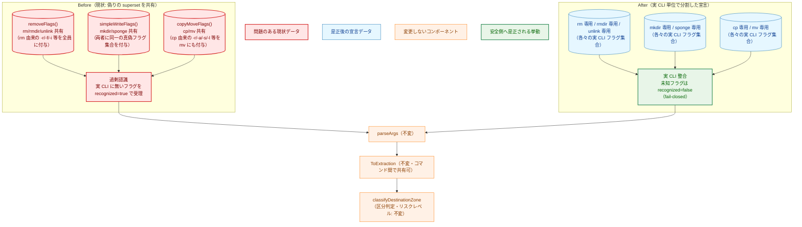
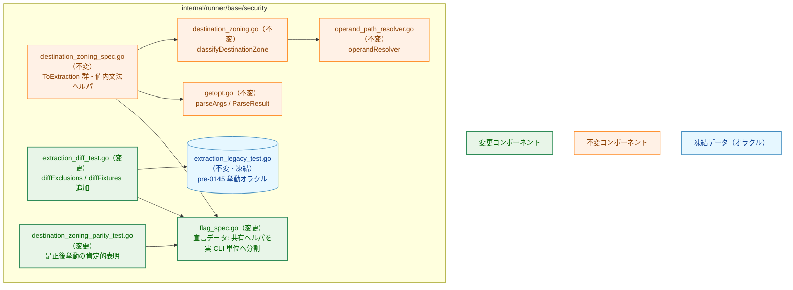
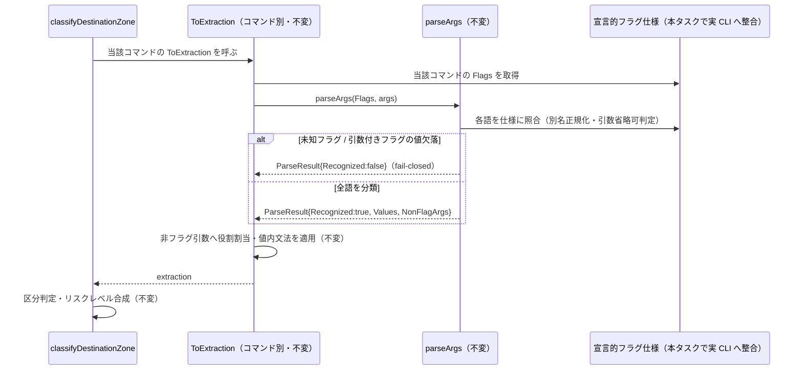
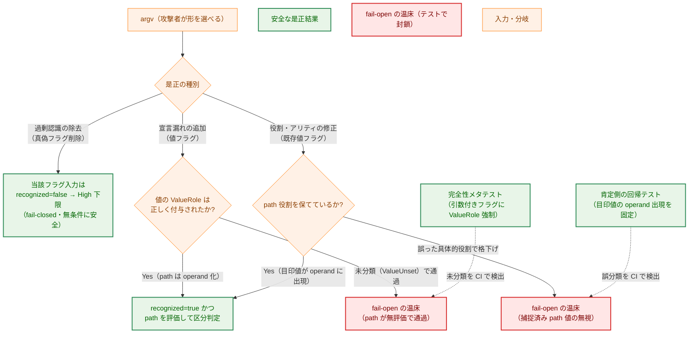
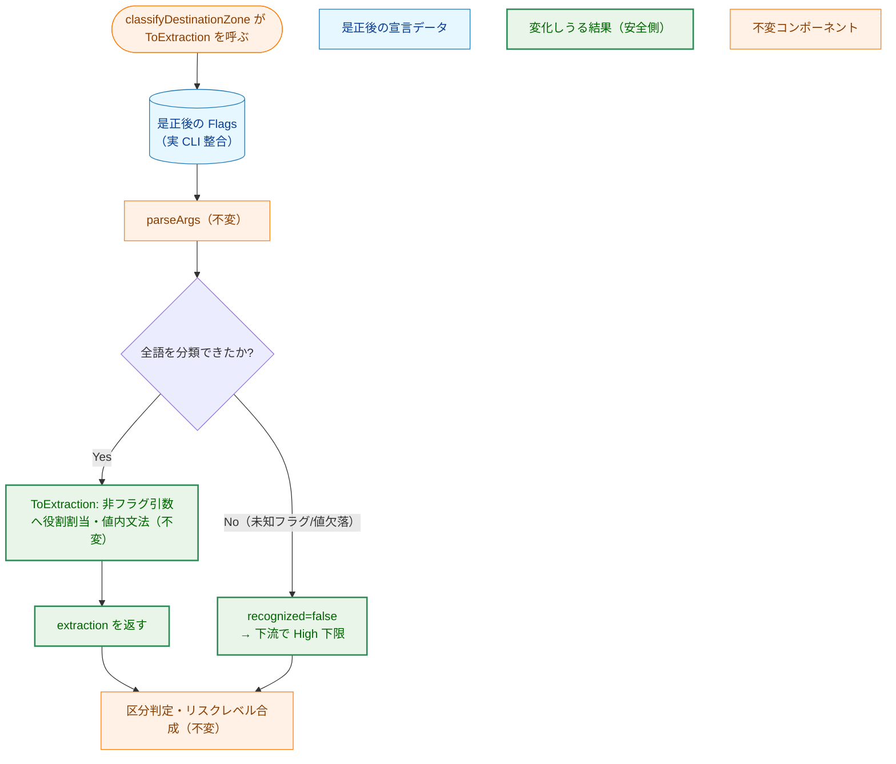

# コマンド別フラグ仕様の実 CLI 整合（過剰認識・宣言漏れの是正） — アーキテクチャ設計書

## Document Status

| Item | Value |
|---|---|
| Status | `draft` |
| Created | 2026-06-25 |
| Review date | - |
| Reviewer | - |
| Comments | - |

> 本書は [01_requirements.md](01_requirements.md) の設計である。用語（オペランド・引数付きフラグ・真偽フラグ・
> 再帰フラグ・引数省略可・非フラグ引数）は [0144/01_requirements.md](../0144_declarative_operand_extraction/01_requirements.md) §1 の定義に従う。
> 本タスクは 0144（宣言的フラグ仕様化）が用意した宣言的フラグ仕様表（`flag_spec.go` の `CommandFlagSpec` 群）を
> **データとして編集する**タスクであり、パーサ（`parseArgs`）・意味づけ関数（`ToExtraction`）・区分判定・リゾルバの
> コードは変更しない。0144 は挙動保存リファクタだったが、本タスクは限定的かつ安全側の**挙動変更**を伴う点が異なる。
> 既存設計の前提は [0144/02_architecture.md](../0144_declarative_operand_extraction/02_architecture.md)（宣言的仕様＋単一パーサ）
> および [0142/02_architecture.md](../0142_axis2_destination_zoning/02_architecture.md) §3.2（best-effort 抽出と fail-closed 保証）を参照する。

## 1. 設計の全体像

### 1.1 設計原則

- **データのみの編集**: 是正は宣言的フラグ仕様（`FlagSpec` 群）の編集で完結させる。`parseArgs`（単一 getopt パーサ）・
  各コマンドの `ToExtraction`（意味づけ）・区分判定（`classifyDestinationZone`）・リゾルバ（`operandResolver`）の
  コードには触れない。これは 0144 の NF-002（フラグ知識をデータ側に閉じる）を継承する。
- **典拠駆動**: 各コマンドの宣言フラグ集合は、当該コマンドの権威ある仕様（GNU coreutils 等の man ページ）を典拠として
  突き合わせる。典拠は実装計画に明記する（AC-01）。
- **安全側の挙動変更のみ**: 挙動変化は「過剰認識の除去」と「宣言漏れの追加」の 2 方向に限る。前者は `recognized` を
  `true→false`（fail-closed 方向）へ倒すのみで常に安全。後者は `recognized` を `false→true`（緩和方向）へ動かしうるため、
  値の役割（`ValueRole`）を正しく割り当て、path 値の取りこぼし（fail-open）を生じさせない（§5）。
- **意図的逸脱の明示**: 本タスクの挙動変化はすべて、0144 の差分テストが基準とする凍結オラクル（pre-0145 挙動）からの
  **意図的逸脱**である。各逸脱を差分テストの逸脱登録機構へ当該コマンド×当該入力形に厳密一致で登録し、変化を肯定側の
  回帰テストで表明する（§7、AC-02/AC-04）。

### 1.2 なぜ既存の共有ヘルパでは不足か（YAGNI / DRY 検討）

0144 は挙動保存のため、複数コマンドが**同一の汎用フラグ集合**を共有する形を踏襲した。具体的には
`removeFlags()`（`rm`/`rmdir`/`unlink` が共有）・`simpleWriteFlags()`（`mkdir`/`sponge` が共有）・
`copyMoveFlags()`（`cp`/`mv` が共有）である。これらは**実 CLI が異なるコマンドに同一の上位集合（superset）を当てている**ため、
実在しないフラグを真偽フラグとして受理する過剰認識の温床になっている（要件 §1.1）。

実 CLI 上、これらのコマンドのフラグ集合は本来一致しない。例えば `rm` は `-r`/`-R`/`-f`/`-i`/`-d` を持つが、`rmdir` の
オプションは `-p`/`-v`/`--ignore-fail-on-non-empty` に限られ、`unlink` には実質的にオプションが無い。同様に `cp` は
再帰・リンク作成・デリファレンス系フラグを持つが、`mv` は持たない。したがって本タスクでは、**実 CLI が一致するコマンドだけが
仕様を共有する**ように共有ヘルパを分割（de-share）する。

> 各コマンドについて「どのフラグが実在し、どれが過剰認識か」の正確な切り分け（per-command の真偽）は、フェーズ 1 の
> man ページ棚卸し（§8、AC-01）で典拠ごとに確定する。共有ヘルパが付与する真偽フラグ集合の中にも、コマンドによっては
> 実在するもの（例 `mkdir` の `-p`/`-v`）と実在しないもの（例 `mkdir` の `-a`/`-c`/`-h`/`-f`/`-i`/`-r`）が混在する点に注意する。
> 本節と §1.3 の図は構造（偽りの superset の共有）を示す概略であり、特定コマンドの正確な過剰認識フラグ集合は要件 §1.1 と
> フェーズ 1 の典拠に従う。

これは DRY への違反ではない。共有が正しいのは集合が**真に同一**のときに限られ、集合が異なる以上、共有は「偽りの superset」を
強制して過剰認識を生む（要件 §1.1 が指摘した不正確さの構造的原因）。一方、**意味づけ関数（`ToExtraction`）は引き続き共有してよい**。
`extractRemove`/`extractSimpleWrite`/`extractCopyMove` はフラグ集合を引数（`ParseResult`）として受け取り解釈ロジックのみを担うため、
フラグ集合が分かれても同一関数を共有でき、AC-03a（解釈ロジック不変）を満たす（§3.2）。

### 1.3 概念モデル（Before / After）



> 凡例（色分け）: 赤=問題のある現状データ、青=是正後の宣言データ、オレンジ=本タスクで変更しないコンポーネント、
> 緑=安全側へ是正される挙動。
> 矢印 A → B は「A の出力／データを B が消費する」流れを表す。本タスクが触れるのは左右段の**データ（青/赤）のみ**であり、
> `parseArgs` 以降（パーサ・意味づけ・区分判定）は一切変更しない。

## 2. システム構成

### 2.1 コンポーネント配置

本番コードの変更は `internal/runner/base/security/flag_spec.go` の**宣言データ 1 ファイルに閉じる**。共有ヘルパ
（`removeFlags`/`simpleWriteFlags`/`copyMoveFlags`）を実 CLI 単位の宣言へ分割し、各コマンドの `Flags` を実 CLI に整合させる。
意味づけ関数を収める `destination_zoning_spec.go`、パーサ `getopt.go`、区分判定 `destination_zoning.go`、
リゾルバ `operand_path_resolver.go` は変更しない。テスト側は、差分テストの逸脱登録（`extraction_diff_test.go`）と
肯定側の回帰テスト（`destination_zoning_parity_test.go`）を更新する。



> 凡例: 緑=本タスクで変更、オレンジ=不変、青=凍結データ。矢印 A → B は「A が B を呼び出す/参照する」依存を表す。

### 2.2 データフロー（不変）

実行時のデータフローは 0144 から変わらない。本タスクは `F`（宣言的フラグ仕様）の中身を実 CLI へ整合させるのみで、
`parseArgs` と `ToExtraction` の処理は同一である。



> 矢印は呼び出し方向、点線矢印（`-->>`）は戻り値を表す。本タスクで実 CLI へ整合させるのは `F` の中身のみで、
> その結果として一部入力の `Recognized`／operand 集合が変わる（§5）。`parseArgs` は副作用を持たない純関数で、
> live identity も環境も参照しない（NF-003 を継承）。

## 3. コンポーネント設計

### 3.1 是正の 3 カテゴリと安全方向

本タスクの各編集は次の 3 カテゴリのいずれかに属する。型定義（`FlagSpec`/`FlagArity`/`ValueRole`）は 0144 から不変で、
本タスクは**値（データ）を変えるのみ**である。

| カテゴリ | 内容 | `recognized` への影響 | 安全方向 |
|---|---|---|---|
| 過剰認識の除去 | 実 CLI に無い真偽フラグを `Flags` から削除する（共有ヘルパの分割を含む） | 当該フラグを含む入力で `true→false` | 常に安全（fail-closed 方向。§5.1） |
| 宣言漏れの追加 | 実 CLI にあるフラグを `Flags` へ追加する | 当該フラグを含む入力で `false→true` | 値の役割を正しく付与すれば安全（§5.2） |
| 表記・アリティ・役割の修正 | 別名（短縮/長形）・`Arity`・`ValueRole` を実 CLI へ合わせる | フラグにより異なる | 役割と上限を保存して確認（§5.2） |

> 過剰認識の除去で削除されるフラグは、要件 §1.2 のとおり**すべて真偽フラグ（値を取らない）**である。真偽フラグの削除は、
> その語を含む入力を `recognized=false`（fail-closed）へ倒すだけで、path 値を新たに取りこぼすことはない。したがって
> このカテゴリは無条件に安全である。

### 3.2 解釈ロジックの保存（AC-03a）

フラグ集合を変えても、非フラグ引数の**解釈ロジック**（`ToExtraction` の役割割当）は変更しない。とくに次の現行解釈は保存する。

| コマンド | 解釈ロジック（保存対象） | 依存するフラグ仕様 |
|---|---|---|
| `sed` | `-e`/`-f`（スクリプト指定）が有ればすべての非フラグ引数を対象ファイルとし、無い場合のみ先頭の非フラグ引数をインラインスクリプトとして除く | `-e`/`-f` の `ArityRequired` と `-i`/`--in-place` の `ArityOptional` を保存 |
| `chown`/`chgrp` | `--reference` 使用時のみ所有者/グループ指定の非フラグ引数を省略でき、`--from`（フィルタ）はそれを省略しない | `--reference`/`--from` の `ArityRequired` を保存 |
| `ln` | `-t`/`--target-directory` 指定時はその値を書込先とし非フラグ引数を読取元にする。非指定時は `-s`/`--symbolic` の有無で相対ターゲットの解決基準（リンク親 vs. 作業ディレクトリ）が変わる | `-t`/`--target-directory` の `ArityRequired`＝`ValueWrite` と `-s`/`--symbolic` の真偽フラグ判定を保存 |

> これらは抽出のパス解決を左右する特殊なフラグであり、表記・アリティ・役割を正確に保つことが AC-01／AC-03a の要点である。
> 是正でこれらの解釈が変わる場合は挙動変更とみなし、F-002（安全性確認・意図的逸脱の明示）に従う。
> なお `touch -r`（参照ファイル＝`ArityRequired`）は共有真偽フラグ `-r` を上書きする値フラグであり、現行どおり値フラグとして
> 保つ（`touch` の過剰認識除去対象は真偽フラグ `-p`/`-v`/`-i` であって `-r` ではない）。

#### 宣言フラグと独立な生 argv 信号（保存必須の不変条件）

一部の `ToExtraction` は、特定の制御信号を**宣言フラグ集合（`Flags`）からではなく、生 argv を対象とした全トークン一致
（クラスタを分割しない `hasAny`）から**算出する。これらは設計上 `Flags` から意図的に切り離されている。代表例:

| 信号 | コマンド | 算出元（生 argv） |
|---|---|---|
| `preserveMeta`（メタ保持＝権限 High 下限の要因） | `cp`/`mv` | `-a`/`--archive`/`-p`/`--preserve`（うち `-p`/`--preserve` は**そもそも宣言フラグでない**） |
| ディレクトリ作成モード | `install` | `-d`/`--directory` |
| シンボリックリンク判定 | `ln` | `-s`/`--symbolic` |
| 一覧表示モード（書込なし） | `unzip` | `-l`/`-Z`（**意図的に未宣言**） |
| リモート名保存 | `curl` | `-O` |
| 全アンマウント | `umount` | `-a` |

> **不変条件**: 過剰認識除去や共有ヘルパ分割は、上記の生 argv スキャンを**変更も削除もしてはならない**。これらは
> `Flags` の構成と独立であり、フラグを `Flags` から削除しても生 argv スキャンが対象トークンを見失わないからこそ、
> 「削除フラグを含まない入力では operand 抽出が不変」（§5.1）が成立する。とくに `cp`/`mv` の `preserveMeta` は
> `-p`/`--preserve` を**宣言せずに**生 argv から読むため、`Flags` 整理の際に「未宣言だから不要」と誤って生 argv スキャンを
> 削ると、`cp` のメタ保持 High 下限を取りこぼす fail-open になる。この信号群は §3.4 の `destination_zoning_spec.go`（不変）に
> 属し、本タスクの編集対象外である。

### 3.3 意図的逸脱の登録機構（差分テスト）

0144 の差分テスト `TestExtractionDifferential` は、**凍結オラクル**（`legacyZoningSpecs`、pre-0145 挙動）と本番経路を
生成コーパスで突き合わせ、`extraction` 構造体全体を `reflect.DeepEqual` で一致検証する。本タスクは挙動を変えるため、
変わる入力は凍結オラクルと**意図的に**食い違う。この食い違いを差分テストの逸脱登録機構へ登録する。

- 凍結オラクル（`extraction_legacy_test.go`）は**再凍結しない**。pre-0145 挙動を表す独立オラクルとして保ち、
  本タスクの是正を「オラクルからの意図的逸脱」として明示することで、変化の所在を可視化する。
- 逸脱は既存の `diffExclusions`（コマンド→述語）へ追記する。現状この機構には 0144 で確定した長形再帰フラグの逸脱
  （`cp`/`mv` の `--recursive`/`--archive`、`rm`/`rmdir`/`unlink` の `--recursive`）が登録済みで、本タスクの是正は
  同じ機構の自然な拡張である。
- 各述語は**当該コマンド×当該入力形に厳密一致**させ、無関係な入力（同じフラグの別位置・別形）を巻き込まない（AC-04）。
  具体的には既存 `isLongRecursionDeviation` と同様に**argv の長さと全トークンを完全一致**で判定し（`args[0]=="-r"` のような
  位置を問わない緩い一致は禁止）、各述語に man ページ典拠を記すコメントを添える。これにより、後日この逸脱が正当か否かを
  典拠と突き合わせて確認できる。
- 過剰認識除去で `Flags` から削除したフラグは `diffCorpus` の自動生成対象から外れるため、是正対象入力（例 `sponge -r FILE`）を
  `diffFixtures` へ明示追加して差分テストに乗せ、肯定側の回帰テスト（§3.4）で新挙動を表明する。

### 3.4 コンポーネント責務

| ファイル | 区分 | 責務 | 備考 |
|---|---|---|---|
| `flag_spec.go` | 変更 | 共有ヘルパ（`removeFlags`/`simpleWriteFlags`/`copyMoveFlags`）を実 CLI 単位の宣言へ分割し、各 `CommandFlagSpec` の `Flags` を実 CLI のフラグ集合・表記・アリティ・値役割へ整合させる（F-001） | 型定義・`parseArgs`・`ToExtraction` は不変 |
| `destination_zoning_spec.go` | 不変 | `ToExtraction` 群（`extractRemove`/`extractSimpleWrite`/`extractCopyMove`/`extractSed`/`extractOwner`/`extractLink` 等）・値内文法ヘルパ | 解釈ロジックを保存（AC-03a） |
| `getopt.go` | 不変 | `parseArgs`/`ParseResult` | パーサ文法・挙動を変えない（スコープ Out） |
| `destination_zoning.go` | 不変 | `classifyDestinationZone` ほか区分判定・リスクレベル合成 | |
| `operand_path_resolver.go` | 不変 | パス解決・Trusted 述語 | |
| `extraction_diff_test.go` | 変更 | `diffExclusions` へ各是正の意図的逸脱を厳密一致で追加。是正対象入力を `diffFixtures` へ追加（AC-04） | 凍結オラクルは不変 |
| `extraction_legacy_test.go` | 不変（凍結） | pre-0145 挙動オラクル | 再凍結しない |
| `destination_zoning_parity_test.go` | 変更 | 是正後の `recognized=false`（過剰認識除去）と新規受理（宣言漏れ追加）を肯定的に表明（AC-02） | 差分テストと独立なオラクル |
| `flag_spec_test.go` | 不変（データ駆動メタテストは無改変で緑） | 完全性メタテスト・アリティ不変条件・別名追加テスト（AC-06） | データ駆動のメタテストは `commandFlagSpecs` を走査するため無改変で緑 |
| `destination_zoning_test.go`／`operand_path_resolver_test.go` | 原則不変 | 既存挙動テスト（AC-07） | 意図的に変える期待値のみ根拠付きで更新 |

> 既存の挙動テスト（`destination_zoning_test.go`・`operand_path_resolver_test.go`）は、対象コマンドを**実 CLI に存在する
> フラグ**（例 `mkdir -m 0777`）または非フラグ引数で用いており、過剰認識される偽フラグ（`mkdir -a` 等）を入力に使っていない。
> したがって原則として無改変で緑を保つ見込みである。期待値変更が必要になった入力は、F-002 の安全側挙動変化に該当することを
> 根拠として実装計画に記録する（AC-07。無根拠の期待値変更は不適合）。

### 3.5 型定義（再掲・不変）

本タスクは下記の型を**変更しない**。是正はこれらの型のインスタンス（宣言データ）を編集するだけである。型の意味は
[0144/02_architecture.md](../0144_declarative_operand_extraction/02_architecture.md) §3.1 を参照。

```go
// FlagSpec は 1 つの論理フラグの宣言的仕様。別名（短縮形・長形式）は Names に集約する。
type FlagSpec struct {
    Names     []string  // すべての表記。Names[0] を正規キーとする
    Arity     FlagArity // ArityNone / ArityRequired / ArityOptional
    Recursive bool      // 再帰フラグ（-r/-R/-a 等）
    Value     ValueRole // 引数付きフラグの値の役割。ArityNone では ValueUnset
}

// CommandFlagSpec は 1 コマンドの宣言的仕様と意味づけ関数。
type CommandFlagSpec struct {
    Kind         LocationKind
    Flags        []FlagSpec
    ToExtraction func(ParseResult, []string) extraction
}
```

> `ValueRole` は `ValueUnset`/`ValueNonPath`/`ValueWrite`/`ValueRead` を取り、`Arity == ArityNone` の真偽フラグは
> `ValueUnset` でなければならない（完全性メタテストが機械検証。AC-06）。宣言漏れの追加で値フラグを足す際は、その値が path なら
> `ValueWrite`/`ValueRead`、非 path なら `ValueNonPath` を正確に付与する（§5.2）。

## 4. エラーハンドリング設計

- 新規のエラー型は導入しない。解析の失敗は 0144 と同じく `ParseResult.Recognized=false` で表し、`ToExtraction` が
  `extraction.recognized=false` に写し、下流 `classifyDestinationZone` が High 下限へ倒す（既存挙動）。
- 本タスクが変えるのは「どの入力が `Recognized=false` になるか」の集合のみである。過剰認識を除いた結果、従来 `true` だった
  一部入力が `false`（fail-closed）になり、宣言漏れを足した結果、従来 `false` だった一部入力が `true` になる。
- 可観測性の既知ギャップ（0144 から継承）: 複数原因が同一の `Recognized=false`＋`ReasonUnresolvedDestination` に畳まれる点は
  本タスクでも変わらない。原因の細分提示は 0143 の所掌であり、本設計の範囲外である。
- 本タスク固有の差分（運用注意）: 本タスクの目的は「より多くの argv 形を `Recognized=false` へ寄せる」ことであり、上記の既知ギャップに
  該当する入力**母数を増やす**。例えば従来通った `mv -a` を意図して打ったオペレータが拒否された場合、ログだけでは
  「フラグ認識を厳格化した」ためか「path が真に解決不能」かを区別できない。原因細分（0143）が入るまでの暫定緩和として、
  本タスクで新たに拒否される代表入力の集合（過剰認識除去の対象）を逸脱登録・実装計画に記録し、インシデント対応時に
  「既知の過剰認識除去」と突き合わせられるようにする。

## 5. セキュリティ考慮事項

本タスクは抽出するフラグ集合の**精度**を上げるのみで、セキュリティ境界（解決・区分判定）・攻撃対象領域・特権操作・
ファイル/ネットワーク I/O を一切変えない。安全保証は引き続き fail-closed な `Recognized` contract が担う
（[0142/02 §3.2](../0142_axis2_destination_zoning/02_architecture.md) を継承）。サブシステム全体は read-only（live identity 不参照・
副作用なし）で、本タスクの変更がこれに影響しない（NF-003）。

### 副作用契約（read-only の徹底）

本サブシステムは外部副作用（書込・削除・ネットワーク送信）を一切行わず、入力 argv からリスク区分（`LocationResult`）を
算出するだけである。フラグ集合の是正が変えるのは**算出されるリスク区分**のみで、外部副作用の発生・抑止には関与しない。
リスク区分の変化方向は次の 2 つに限られ、いずれも「より制限的（High 下限）へ倒す」か「実 CLI に忠実な区分へ正す」だけで、
保護を緩める方向には働かない（§5.1／§5.2）。`--dry-run`/`--force` のような副作用を切り替えるモードは本タスクに存在しないため、
副作用の抑止/許可契約は **N/A** である。

### 5.1 過剰認識除去の安全性（無条件に fail-closed 方向）

過剰認識される偽フラグはすべて真偽フラグ（値を取らない）である（要件 §1.2）。これを削除すると、当該フラグを含む入力は
未知フラグとして `recognized=false` に倒れ、下流が High 下限を課す。これは「本来却下すべき入力をより厳しく扱う」方向であり、
新たな fail-open（path 値の取りこぼし）を生まない。削除されるのが真偽フラグに限られるため、operand（path）の抽出結果は
当該フラグを**含まない**入力では一切変わらない。

### 5.2 宣言漏れ追加・役割修正の安全性（役割割当が要）

宣言漏れの追加（§3.1 カテゴリ 2）と、既存フラグの役割・アリティ修正（§3.1 カテゴリ 3）はいずれも、値フラグの path 値が
operand 化されず**無評価で通過**する fail-open を生みうる。具体的な危険源は次の 2 つである。

- **追加方向**: 新たに受理する値フラグに `ValueRole` を付け忘れる、または誤って `ValueNonPath` を付け、path 値を operand に
  しない。
- **修正方向**: 既存の path 運搬フラグを `ValueWrite`/`ValueRead`→`ValueNonPath` へ**格下げ**する、または `ArityRequired`→
  `ArityOptional` へ変えて次語の path 値を取りこぼす。

これらを次で防ぐ。

- 追加・修正する値フラグには実 CLI に即した正しい `ValueRole`（path なら `ValueWrite`/`ValueRead`、非 path なら
  `ValueNonPath`）と `Arity` を付与する。
- 完全性メタテスト（AC-06）は「引数付きフラグが**何らかの**具体的 `ValueRole` を持つ（`ValueUnset` でない）」ことのみを
  機械検証する。すなわち**役割の付け忘れ（`ValueUnset`）は検出するが、誤った具体的役割（path を `ValueNonPath` と誤分類する等）は
  検出できない**。この残存リスクは構造テストでは塞げないため、肯定側の回帰テストで補う。
- したがって `ValueRole` または `Arity` を path 役割へ／から変更する各フラグについては、その捕捉値が `extraction.operands` に
  期待どおり**現れる（または正しく現れない）**ことを `destination_zoning_parity_test.go` で確認する。この確認は**肯定的
  アサーション**として目印値で固定し、凍結オラクルとも差分逸脱とも独立なオラクルとする（§7）。役割修正は凍結オラクル
  （旧＝誤った可能性のある挙動）と食い違って当然であり、差分逸脱に吸収すると退行を隠しうるため、独立オラクルでの肯定的検証を
  必須とする。



> 矢印は制御フロー、点線矢印は「テストが当該状態を検出して防ぐ」関係を表す。過剰認識除去（左経路）は無条件に安全であり、
> 宣言漏れ追加（中経路）は `ValueRole` の付与が、役割・アリティ修正（右経路）は path 役割の保存が安全性の条件になる。
> 中経路の未分類（`ValueUnset`）は完全性メタテスト（AC-06）が落とすが、右経路の**誤った具体的役割**はメタテストでは検出できず、
> 肯定側の回帰テスト（AC-02）が目印値で塞ぐ。

### 5.3 保存する不変条件

- 決定性・read-only: パーサ・意味づけは純関数で、live identity も実 FS も参照しない（NF-003 を継承。0144 の静的ガードを流用）。
- fail-closed contract: 未知フラグ／引数付きフラグの値欠落／必須非フラグ引数欠落／解決不能オペランドはすべて
  `Recognized=false`→High 下限（0142/0144 を継承、本タスクで不変）。
- 既存挙動: 実 CLI に存在するフラグ・非フラグ引数のみを使う既存テストは無改変で緑（§3.4、AC-07）。

## 6. 処理フロー詳細（是正後）



> 矢印は制御フロー、菱形は分岐。本タスクは入口の `Flags`（青）を実 CLI へ整合させるだけで、`parseArgs` 以降の処理は
> 0144 と同一である。是正の結果、`recognized` の真偽が変わる入力が生じる（§5）。

## 7. テスト戦略

- **過剰認識除去の表明（AC-02）**: §1.1 の代表入力（`sponge -r FILE`／`mkdir -a DIR`／`touch -p FILE`／`unlink -r FILE`／
  `rmdir -r DIR`／`mv -s SRC DST`）を肯定側の回帰テスト（`destination_zoning_parity_test.go`）で `recognized=false` と表明する。
  同入力を `diffFixtures` にも追加し、凍結オラクル（`recognized=true`）との意図的逸脱として `diffExclusions` へ厳密一致で登録する（AC-04）。
  単独形に加え、削除フラグを含む**クラスタ形**（例 `mv -rf`／`sponge -rv`）の代表入力も各 de-share コマンドにつき最低 1 つ
  固定する。クラスタ形は §3.2 の生 argv スキャンと相互作用しうるため、より高リスクな入力形として明示的に網羅する。
- **完全性の強制（リスト漏れ防止）**: 是正で**削除した過剰認識フラグの集合**を単一のソース集合として定義し、各フラグについて
  「当該コマンド×当該フラグ入力が本番経路で `recognized=false` になる」ことをメタテストで `range` 検証する。`diffFixtures` の
  手書き並行リストに依存して個別に書き写すと、書き漏れた削除フラグの挙動変化が**どのテストも赤にならず暗黙に未検証**になるため、
  ソース集合を直接走査して機械的に網羅する（並行リストの二重管理を避ける）。
- **実 CLI 整合の網羅（AC-01/AC-03）**: 各対象コマンドの宣言フラグ集合を man ページ典拠で突き合わせ、表記（短縮/長形）・
  アリティ（真偽/引数必須/引数省略可）・値役割が一致することを確認する。引数省略可（`tar --one-top-level`・`sed -i`）の
  付随形のみ消費する規則は 0144 の `getopt_test.go` が固定済みで、本タスクでフラグ集合を変えても緑を保つ。
- **解釈ロジック保存（AC-03a）**: `sed` の `-e`/`-f` 有無による対象ファイル判定、`chown`/`chgrp` の `--reference`/`--from` による
  所有者指定省略、`ln` の `-s`/`--symbolic` による解決基準を、是正前後で不変であることを回帰テストで確認する。
- **完全性・不変条件（AC-06）**: 0144 のメタテスト（`flag_spec_test.go`：`Names` 非空・`ArityNone`→`ValueUnset`・引数付き→
  具体的 `ValueRole`・別名重複なし・アリティ不変条件）を是正後も緑に保つ。とくに宣言漏れで足した値フラグの `ValueRole` 付与漏れは
  ここで落ちる。
- **挙動保存（AC-05/AC-07）**: 差分テストは登録した意図的逸脱を除き全コーパスで緑を保ち、すべての変化が安全側
  （過剰認識除去 = `true→false`、宣言漏れ追加で path 値の取りこぼしなし）であることを担保する。既存の
  `destination_zoning_test.go`・`operand_path_resolver_test.go` は原則無改変で緑（§3.4）。
- **非機能（NF-001/NF-003）**: `make fmt`/`make test`/`make lint` 緑。決定性・read-only は 0144 の静的ガードが継続検証する。

## 8. 実装優先順位

- **フェーズ 1（典拠確定）**: 全対象コマンドについて man ページのフラグ集合・表記・アリティ・値役割を棚卸しし、過剰認識
  （削除すべき真偽フラグ）と宣言漏れ（追加すべきフラグ）を一覧化する。典拠を実装計画に明記する（AC-01）。
- **フェーズ 2（共有ヘルパ分割）**: `removeFlags`/`simpleWriteFlags`/`copyMoveFlags` を実 CLI 単位の宣言へ分割し、
  各コマンドの `Flags` を整合させる（§1.2）。意味づけ関数は共有のまま保つ（AC-03a）。
- **フェーズ 3（逸脱登録と肯定表明）**: 是正で変わる入力を `diffFixtures` へ追加し `diffExclusions` へ厳密一致で登録、
  かつ回帰テストで新挙動を肯定的に表明する（AC-02/AC-04）。完全性メタテスト・既存挙動テストの緑を確認する（AC-06/AC-07）。
- **フェーズ 4（安全性確認）**: すべての挙動変化が安全側であること（§5）を差分テストと回帰テストで確認し、各逸脱の理由を
  コメント・実装計画に記録する（AC-05）。

> ロールアウト安全性: 本タスクは永続状態も外部 API も持たない純関数サブシステムの内部精度改善であり、フィーチャーフラグや
> 段階的展開は不要。是正は**コマンド単位**で進められ、各コマンドの編集後に差分テスト（登録済み逸脱以外は緑）・完全性メタテスト・
> 既存挙動テストが緑であることをゲートとすることで、退行の影響半径を 1 コマンドに限定し、常に緑のチェックポイントを保つ。
> ただし影響半径が 1 コマンドに収まるのは、§3.2 の「宣言フラグと独立な生 argv 信号」を変更しない限りである。`cp`/`mv` のように
> 生 argv 信号（`preserveMeta`）を共有するコマンドでこの不変条件を破ると、編集対象でない側のコマンドにも影響が及ぶため、
> 本タスクは `Flags` データの編集に閉じ、生 argv スキャンを含む `destination_zoning_spec.go` には触れない（§2.1）。

## 9. 将来拡張性

- 新コマンド/新フラグの追加は引き続き `CommandFlagSpec`／`FlagSpec.Names` の追記で完結し、パーサや区分判定のコード分岐を
  要さない（NF-002 を継承）。本タスクで共有ヘルパを実 CLI 単位へ分割したことにより、以後はコマンドごとに独立してフラグ集合を
  保守でき、偽りの superset による過剰認識の再発を構造的に抑止する。
- read 専用コマンドを含む完全な read 系分類は引き続き将来課題（[0142/02 §9](../0142_axis2_destination_zoning/02_architecture.md) を継承）。
  `ValueRole` の write/read 区分が拡張点である。
- 失敗原因の細分提示（どの解析条件で `Recognized=false` になったか）は 0143（logger 出力）の所掌であり、本タスクの範囲外。

---

## 付録: 決定履歴

> 本体（§1〜§9）は是正後の設計を記述する。以下は要件・既存方針と異なる選択をした箇所の根拠のみを記録する。

- **本タスクは 0144 が挙動保存のため意図的に先送りした精度改善である**（[0144/01 §5](../0144_declarative_operand_extraction/01_requirements.md)）。
  0142 のレベル規則・区分判定・操作固有の下限・リゾルバは確定済みで、本タスクはそれらの意味を変えず、抽出するフラグ集合の
  正確さのみを正す（要件 §2 Out）。
- **0144 の「挙動保存」原則に対する意図的逸脱**: 0144/02 §5 および同 `destination_zoning_test.go` は「期待値変更があれば
  不適合」とする厳格な挙動保存を課していた。本タスクはこの原則に**意図的な例外**を設け、限定的かつ安全側の挙動変更を許す。
  (1) 元方針の所在: [0144/02_architecture.md](../0144_declarative_operand_extraction/02_architecture.md) §1.1・§5・§7（挙動保存 AC-09/AC-10）。
  (2) 例外の理由: 0144 はフラグ知識をデータ化する基盤づくりで、精度の是正は別タスク（本 0145）へ切り出された（0144/01 §5）。
  本タスクの目的そのものが「実 CLI への整合＝挙動の是正」であるため、挙動保存はここでは成立しえない。
  (3) 旧挙動を表明する既存テスト: 差分テスト `TestExtractionDifferential`（`extraction_diff_test.go`）が凍結オラクル一致を
  表明しており、本タスクで変わる入力を `diffExclusions` へ追加して更新する。`destination_zoning_test.go`／
  `operand_path_resolver_test.go` は実 CLI 上のフラグのみを用いるため原則無改変だが、万一期待値変更が要る入力は F-002 の
  安全側変化に該当することを根拠に更新する（AC-07）。
- **長形再帰フラグの先行逸脱（0144 で決定済み）**: `cp`/`mv` の `--recursive`/`--archive`、`rm`/`rmdir`/`unlink` の
  `--recursive` が `recognized=false→true` になる逸脱は 0144 のフェーズで既に `diffExclusions` に登録済みである
  （[0144/02 付録](../0144_declarative_operand_extraction/02_architecture.md)）。本タスクの過剰認識除去はこれと**同じ逸脱登録機構**を用いる、
  方向の異なる（`true→false`）拡張である。
