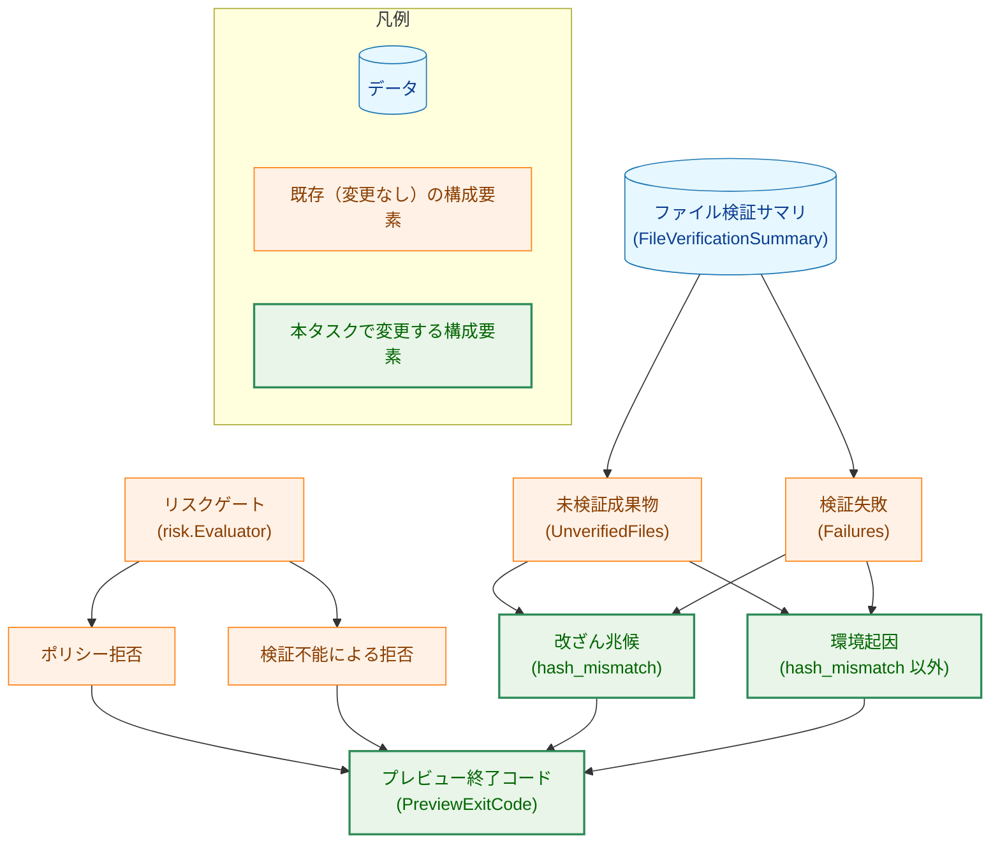
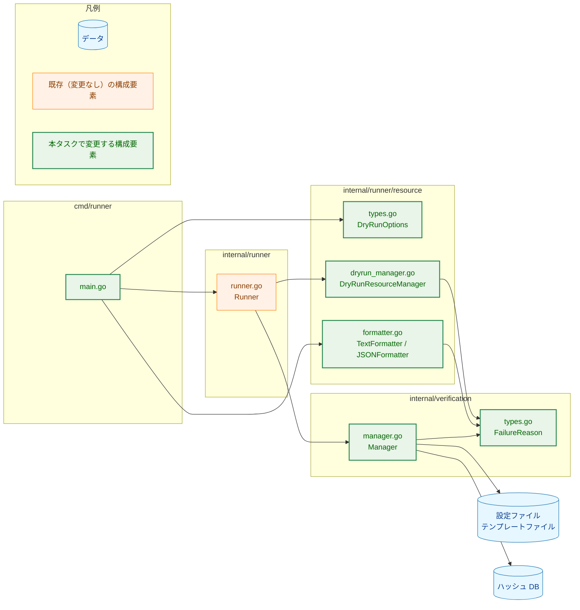
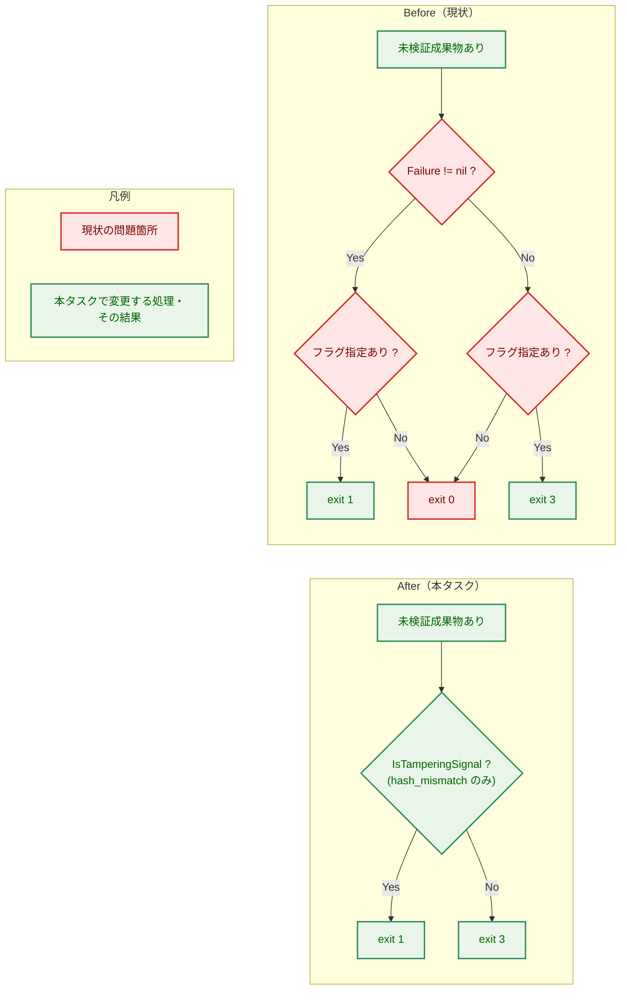
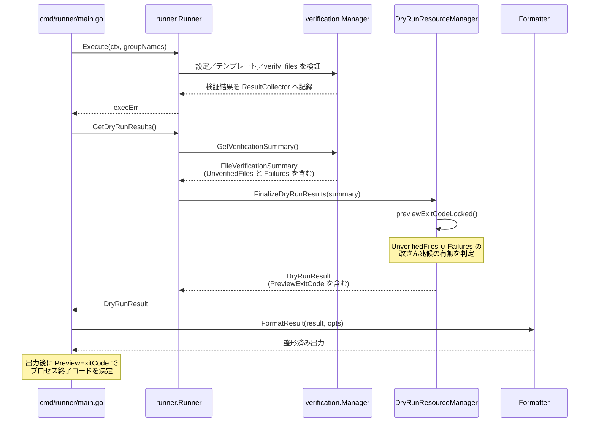
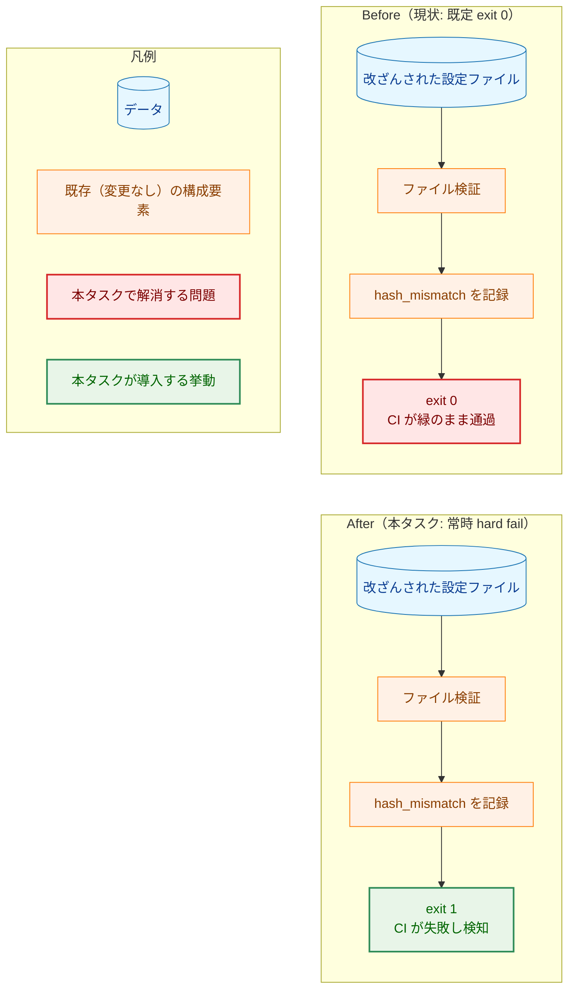
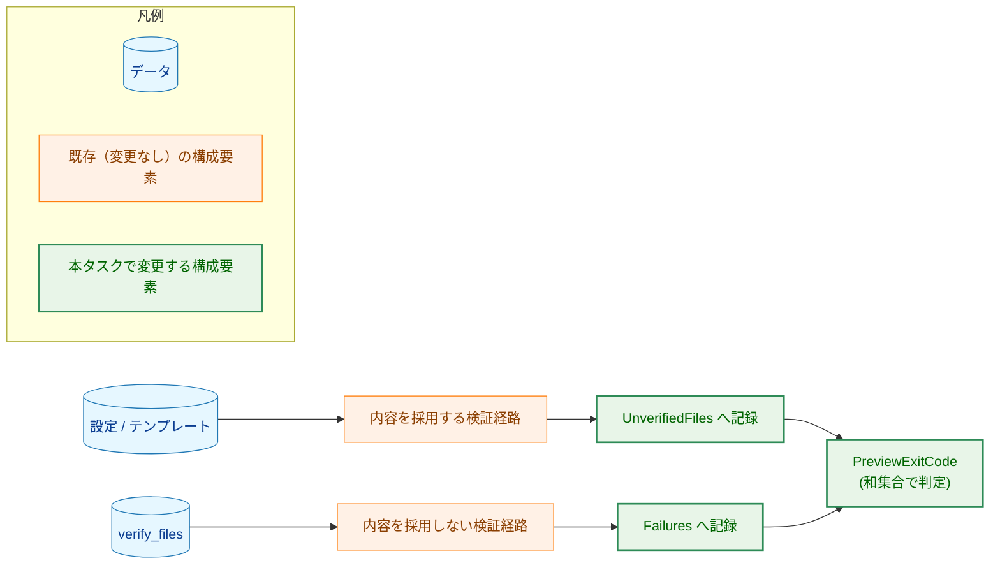
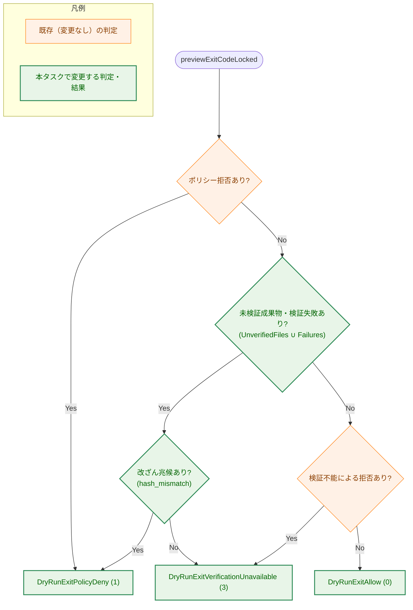

# dry-run における未検証成果物の常時 hard fail 化（`-dry-run-fail-unverified` 削除） — アーキテクチャ設計書

## Document Status

| Item | Value |
|---|---|
| Status | `draft` |
| Created | 2026-07-16 |
| Review date | - |
| Reviewer | - |
| Comments | 設計レビューを受け、`verify_files` の検証失敗を終了コードへ反映する F-005 を要件へ追加し、本設計へ反映した（§5.5）。要件書は再承認待ち（`draft`）。残る論点は §10 参照 |

## 1. 設計の全体像

### 1.1 本タスクが変更する範囲

本タスクは **dry-run プレビューの終了コードを決める部分だけ** を変更する。コマンド列の展開、
ファイル検証の実行、レポートの出力内容は一切変更しない。したがって設計は、
`DryRunResourceManager.previewExitCodeLocked` という 1 つの判定関数と、そこへ入力を渡す
経路の整理に集約される。

用語を先に定義する。本書では以下の語を一貫して使用する。

| 用語 | 意味 |
|---|---|
| 未検証成果物 | ハッシュ検証に成功しないまま dry-run プレビューが **内容を採用した** 設定ファイル／テンプレートファイル。`verification.FileVerificationSummary.UnverifiedFiles` に記録される |
| 検証失敗 | ファイル検証が失敗として記録された事象。`FileVerificationSummary.Failures` に記録される。`verify_files`（`global.verify_files` / `groups[].verify_files`）は検証失敗としてのみ記録される（内容を採用しないため）。未検証成果物とは記録先が異なるが、**終了コードの判定材料には両方を含める**（§5.5 参照） |
| 改ざん兆候 | 検証を実際に試行し、記録済みハッシュとの不一致を検出した状態。`hash_mismatch` のみが該当する |
| 環境起因 | 検証を試行できなかった、または不一致以外の理由で検証が完了しなかった状態。改ざんの積極的な証拠を伴わない |
| ポリシー拒否 | リスクゲート（`risk.Evaluator`）が、リスクポリシー違反を理由に下す拒否 |
| 検証不能による拒否 | リスクゲートが、コマンドの同一性を検証できないことを理由に下す拒否。未検証成果物とは別の概念 |

### 1.2 設計原則

1. **フェイルクローズドを既定にする**（NFR-01）。未検証成果物を採用した dry-run は常に
   非ゼロ終了する。この挙動を無効化する設定・フラグは設けない。
2. **判定の軸を 1 つに統一する**（F-002）。「検証を試行し、記録との不整合を実際に検出したか」
   だけが改ざん兆候と環境起因を分ける軸である。この軸は 1 つの共有述語として実装し、
   表示側と終了コード側の双方からこれを参照する。
3. **未検証成果物に由来する終了コードを表示と一致させる**。未検証成果物が理由で exit 1 と
   なるのは `UNVERIFIED-TAMPER` と表示される場合だけである。逆に、`UNVERIFIED-TAMPER` と
   表示されれば、それが未検証成果物に由来する限り必ず exit 1 となる。ただし
   exit 1 は未検証成果物以外の理由（リスクゲートによるポリシー拒否、`verify_files` の
   `hash_mismatch`（`Failures` セクションに `security_risk: high` として表示。§5.5）、
   および §5.6 に挙げる一般的な実行時エラー）でも返るため、「exit 1 ならば
   `UNVERIFIED-TAMPER` 表示がある」とは限らない。改ざん兆候の表示面は 2 つある
   （未検証成果物側の `UNVERIFIED-TAMPER` マーカーと、検証失敗側の `security_risk: high`）。
4. **削除であって追加ではない**（YAGNI・NFR-03）。本タスクは分岐とフィールドを減らす。
   互換のための no-op フラグや移行期間用の設定は追加しない。

### 1.3 概念モデル

dry-run プレビューの終了コードは、独立した 2 系統の入力から決まる。1 つはリスクゲートが
下すコマンド単位の判定、もう 1 つはファイル検証の結果である。ファイル検証の結果には、内容を
採用した未検証成果物（`UnverifiedFiles`）と、内容を採用しない検証失敗（`Failures`）の
2 種類があり、**終了コードは両者の和集合から判定する**。本タスクは後者の分類規則を変更し、
両系統を終了コードへ対応づける写像から、フラグによる分岐を取り除く。



矢印 A → B は「A が B の判定材料になる（A から B が導かれる）」ことを表す。

> 図の読み方: `改ざん兆候` と `環境起因` の分類規則、および `プレビュー終了コード` を決める
> §1.4 の 5 段階の優先順位（判定ロジック）が本タスクの変更対象である。リスクゲート自体の
> 判定ロジックは変更しない（要件書「スコープ外」）。`FileVerificationSummary` のうち
> 終了コードの判定材料になるのは `UnverifiedFiles` と `Failures` の両方であり、いずれか
> 一方にでも `hash_mismatch` があれば改ざん兆候として扱う。`Failures` を判定材料へ加えるのは
> 本タスク（F-005）で新設した挙動であり、§5.5 で詳述する。

### 1.4 分類規則と終了コード

F-002 が定める分類を、判定の軸とともに再掲する。

| `UnverifiedReason` | 区分 | 終了コード |
|---|---|---|
| `skipped_no_validator` | 環境起因 | `3` |
| `verify_failed_hash_directory_not_found` | 環境起因 | `3` |
| `verify_failed_hash_file_not_found` | 環境起因 | `3` |
| `verify_failed_hash_mismatch` | 改ざん兆候 | `1` |
| `verify_failed_file_read_error` | 環境起因 | `3` |
| `verify_failed_permission_denied` | 環境起因 | `3` |

すなわち **`hash_mismatch` のみが exit 1、他のすべての理由は exit 3** である。

この表は未検証成果物（`UnverifiedFiles`）の `UnverifiedReason` を軸に示しているが、**同じ軸を
検証失敗（`Failures`）にも適用する**（F-005）。`Failures` の各要素は `FailureReason` を持ち、
`hash_mismatch` のみを改ざん兆候（exit 1）、他を環境起因（exit 3）とする。したがって終了コードは
`UnverifiedFiles` と `Failures` の **和集合** に対して判定し、いずれか一方にでも `hash_mismatch`
があれば exit 1 となる。

複数の事象が同時に発生した場合の優先順位は以下のとおり（高い順）。以下で「未検証成果物・検証失敗」
とは `UnverifiedFiles` と `Failures` の和集合を指す。

1. リスクゲートによるポリシー拒否 → `1`（AC-12。他の事象に影響されない）
2. 改ざん兆候（`hash_mismatch`）を含む未検証成果物・検証失敗 → `1`（AC-10、AC-13、AC-20、AC-21、AC-23）
3. 環境起因のみの未検証成果物・検証失敗 → `3`（AC-07、AC-08、AC-09、AC-11、AC-22）
4. リスクゲートによる検証不能による拒否 → `3`（AC-04）
5. 上記のいずれでもない → `0`（AC-05）

順位 1 と 2 はいずれも `1` を返すため両者の相対順序は結果に影響しないが、順位 2 が順位 3・4 より
上位であることが AC-13・AC-23（改ざん兆候が環境起因のコードに埋没しない）を担保する。

### 1.5 dry-run の副作用契約

`-dry-run` は「プレビューであり実行しない」モードだが、副作用が皆無ではない。本タスクの
分類（とくに AC-08 の検証方法）はこの契約に依存するため、明示しておく。

| 副作用 | dry-run での扱い |
|---|---|
| コマンドの実行（`execve`） | **抑止する**。リスク評価はファイルを `O_RDONLY` で開くのみ |
| 出力ファイルの書き込み・削除 | **抑止する** |
| 通知の送信（Slack 等へのネットワーク送信） | **抑止する** |
| ハッシュディレクトリの作成 | **抑止しない**。存在せず、かつ作成可能な場合は起動時に作成される |
| ログファイルへの書き込み・監査ログ出力 | **抑止しない**。プレビューも監査エントリを出力する |

本タスクはこの契約を変更しない。終了コードの決定のみを変更する。

#### 1.5.1 ハッシュディレクトリの扱いと `hash_directory_not_found` の到達性

ハッシュディレクトリが起動時に自動作成される点は AC-08 の設計に直接影響する。実測により、
存在しないハッシュディレクトリを指定して dry-run を実行すると、ディレクトリが作成された
うえで各ファイルが `verify_failed_hash_file_not_found` となり、
`hash_directory_not_found` は発生しないことが確認されている（要件書 §1「前提・依存」）。

ただしこの実測は **ハッシュディレクトリを作成できる環境で得られたもの** であり、すべての
環境には一般化できない。作成に失敗した場合（権限不足など）、dry-run ではエラーが握り潰されて
バリデータが未構成のままとなり、全ファイルが `skipped_no_validator`（exit 3）となる。また
`hash_directory_not_found` は、ディレクトリ作成後にそれが削除された場合（TOCTOU）には
依然として発生しうる。

したがって `hash_directory_not_found` は **実運用ではまれで、E2E では再現できない経路** で
ある。本書ではこの経路に対し、防御的に分類を定義する。検証はユニットテストで担保する
（§7 参照）。

## 2. システム構成

### 2.1 パッケージ依存関係

本タスクで変更するのは既存の 3 パッケージのみで、新規パッケージは追加しない。



矢印 A → B は「A が B を参照する（A が B に依存する）」ことを表す。

依存の向きは `cmd/runner` → `internal/runner` → `internal/runner/resource` →
`internal/verification` の一方向であり、`internal/verification` は `resource` を参照しない。
ファイル検証サマリが `DryRunResourceManager` へ渡る経路は依存関係ではなくデータの流れで
あり、§2.3 のシーケンス図で示す。

`internal/verification/manager.go` は、削除するフラグに言及する doc comment のみを更新する
ため「変更する構成要素」として色分けしている（§3.5）。

### 2.2 変更の概要（Before / After）

終了コード判定からフラグによる分岐が消え、分類の軸が入れ替わる。



矢印 A → B は「A の次に B を評価する（処理の流れ）」ことを表す。菱形は分岐条件を表す。

Before 図で問題として色分けした箇所は 2 つある。第一に、`Failure != nil`（＝検証を試行して
失敗した）を改ざん兆候とみなす軸が、`hash_file_not_found` のような環境起因の状況まで
改ざん兆候に含めてしまう。第二に、フラグ未指定時に未検証成果物が exit 0 へ倒れるため、
`hash_mismatch` を含む場合ですら CI が緑になる。After ではフラグ分岐が消え、軸が
`hash_mismatch` のみに絞られる。

### 2.3 データフロー

未検証成果物が記録されてから終了コードとして反映されるまでの経路を示す。この経路自体は
既存のものであり、本タスクは `previewExitCodeLocked` の内部判定のみを変更する。



`Execute` と `GetDryRunResults` は `main.go` から別々に呼ばれる。ファイル検証サマリが
終了コードの判定材料に加わるのは後者の中であり、この順序が §3.3 のサマリ不在時の契約に
関係する。

## 3. コンポーネント設計

### 3.1 共有述語 `IsTamperingSignal`

#### 3.1.1 なぜ既存の判定関数をそのまま使えないか

現在、「改ざん兆候か否か」の判定は 2 か所に別々の基準で存在し、**両者は一致していない**。

| 箇所 | 関数 | 現在の基準 |
|---|---|---|
| 終了コード側 | `hasTamperingSignal`（`resource/dryrun_manager.go`） | `Failure != nil`（＝検証を試行して失敗した全理由） |
| 表示側 | `formatUnverifiedMarker` / `securityRiskForFailureReason`（`resource/formatter.go`） | `ReasonHashMismatch` のみ |

つまり **表示側は既に F-002 が求める基準を実装している** 一方、終了コード側だけが広すぎる
基準を使っている。

この不一致は現状では表面化していない。フラグ未指定時は終了コード側の分岐に到達する前に
exit 0 へ倒れるためである。しかし常時有効化すると、`hash_file_not_found`（ブートストラップ
工程で正常に発生する）が「ポリシー拒否」として exit 1 で報告されることになる。これが
要件書 §1 の指摘する問題であり、F-002 が是正の対象とするものである。

したがって本タスクで必要なのは新しい分類機構の追加ではなく、**終了コード側を表示側の基準へ
寄せたうえで、両者が同じ述語を参照するようにすること** である（DRY）。既存の実装を各所で
書き換えるだけでは、同じ基準が複数箇所へ分散したまま残り、将来また乖離する。

#### 3.1.2 述語の配置

述語は `FailureReason` 型が定義されている `internal/verification` に置く。判定対象は
検証理由のみであり、`resource` パッケージの都合に依存しないためである。

判定対象の型が 2 つあるため、述語も 2 段構えとする。

```go
// internal/verification/types.go

// IsTamperingSignal reports whether the failure reason is concrete evidence of
// tampering, as opposed to an environment cause that merely prevented
// verification from completing.
func (r FailureReason) IsTamperingSignal() bool

// IsTamperingSignal reports whether this unverified file usage carries a
// tampering signal. A usage with no failure reason (skipped_no_validator) is
// an environment cause, never a tampering signal.
func (u UnverifiedFileUsage) IsTamperingSignal() bool
```

`UnverifiedFileUsage.Failure` は `*FailureReason` であり、`skipped_no_validator` の場合は
`nil` である。この nil の扱い（＝「理由が記録されていない未検証成果物は環境起因」）自体が
分類規則の一部であるため、`UnverifiedFileUsage` 側にも述語を置き、nil 判定を型の内側へ
閉じ込める。これがないと、呼び出し側 2 か所（`resource` パッケージ内）に nil ガードが
重複し、§3.1.1 で述べた乖離のリスクが（両方を正しく直さない限り）再燃してしまう。

述語の参照先は以下のとおり。`FailureReason.IsTamperingSignal` は、未検証成果物（`Failure`
フィールド）と検証失敗（`FileVerificationFailure.Reason`）の双方に適用できる。

| 参照元 | 用途 | 使用する述語 |
|---|---|---|
| `resource/dryrun_manager.go` の `hasTamperingSignal`（未検証成果物） | 終了コード | `UnverifiedFileUsage.IsTamperingSignal` |
| `resource/dryrun_manager.go` の検証失敗判定（新設、F-005） | 終了コード | `FailureReason.IsTamperingSignal`（`FileVerificationFailure.Reason` に適用） |
| `resource/formatter.go` の `formatUnverifiedMarker` | `UNVERIFIED-TAMPER` 表示 | `UnverifiedFileUsage.IsTamperingSignal` |
| `resource/formatter.go` の `securityRiskForFailureReason` | `security_risk: high` 注釈 | `FailureReason.IsTamperingSignal` |

表示側の基準は変わらないため **出力は回帰しない**（AC-14、AC-24）。参照先を述語へ差し替える
のみである。終了コード側は、F-005 により検証失敗（`Failures`）に対する判定を新設する
（§3.3）。

> **`securityRiskForFailureReason` の適用範囲**: 同関数は未検証成果物セクションだけでなく、
> 検証失敗（`FileVerificationFailure`）セクションの注釈にも使われる。すなわち「`hash_mismatch`
> のみ `high`」という基準は両セクションで共有される。本タスクはこの共有関係を維持する
> （現状と同じ基準・同じ出力）。

> **区別が必要な既存関数**: `internal/verification/result_collector.go` の `getSecurityRisk` /
> `determineLogLevel` は、`hash_mismatch` 以外にも `medium` / `low` を返す別軸の関数であり、
> 検証失敗のログ出力に用いる。本タスクの述語とは軸が異なるため統合せず、変更もしない
> （要件書「スコープ外」）。

### 3.2 `DryRunOptions` からのフラグ削除

`FailOnVerificationUnavailable` フィールドを削除する。JSON タグ
`fail_on_verification_unavailable` も併せて消えるが、本フィールドはプロセス内での受け渡しに
のみ使われており、外部入出力の経路は存在しない。

```go
// internal/runner/resource/types.go

// DryRunOptions holds options for dry-run execution
type DryRunOptions struct {
    DetailLevel      DryRunDetailLevel `json:"detail_level"`
    OutputFormat     OutputFormat      `json:"output_format"`
    ShowSensitive    bool              `json:"show_sensitive"`
    VerifyFiles      bool              `json:"verify_files"`
    ShowTimings      bool              `json:"show_timings"`
    ShowDependencies bool              `json:"show_dependencies"`
    MaxDepth         int               `json:"max_depth"`

    HashDir string `json:"hash_dir"`
    // FailOnVerificationUnavailable は削除する（本タスク）
}
```

終了コード定数（`DryRunExitAllow` = 0 / `DryRunExitPolicyDeny` = 1 /
`DryRunExitVerificationUnavailable` = 3）は値・名称ともに維持する。ただし削除するフラグに
言及する doc comment が 2 か所ある（`DryRunExitVerificationUnavailable` の定義、および
`DryRunResult.PreviewExitCode` フィールド）。いずれも §1.4 の優先順位へ書き換える（NFR-03）。

### 3.3 `DryRunResourceManager` の判定

`failOnVerificationUnavailable` フィールドを削除し、`previewExitCodeLocked` の分岐を
§1.4 の優先順位どおりに単純化する。公開シグネチャは変更しない。

```go
// internal/runner/resource/dryrun_manager.go

// PreviewExitCode returns the process exit code for the dry-run preview.
func (d *DryRunResourceManager) PreviewExitCode() int

// SetFileVerification records the file-verification summary used by PreviewExitCode.
func (d *DryRunResourceManager) SetFileVerification(summary *verification.FileVerificationSummary)

// hasTamperingSignal reports whether any unverified file usage carries a
// tampering signal.
func hasTamperingSignal(usages []verification.UnverifiedFileUsage) bool

// hasFailureTamperingSignal reports whether any recorded verification failure
// carries a tampering signal (F-005). Covers failures recorded as Failures
// rather than adopted content, e.g. verify_files.
func hasFailureTamperingSignal(failures []verification.FileVerificationFailure) bool
```

`hasTamperingSignal` は引き続き `resource` パッケージ内の非公開関数として残す。判定基準
そのものは §3.1 の述語へ委譲し、本関数は `[]verification.UnverifiedFileUsage` を走査して
各要素の `UnverifiedFileUsage.IsTamperingSignal`（nil 安全）を呼ぶ責務のみを持つ。F-005 に
対応するため、検証失敗（`[]verification.FileVerificationFailure`）を走査して各要素の
`FileVerificationFailure.Reason` に `FailureReason.IsTamperingSignal` を適用する
`hasFailureTamperingSignal` を同様に新設する。両者は経由する述語こそ異なるが、最終的には
いずれも `FailureReason.IsTamperingSignal` に帰着する（§3.1.2）。

**終了コードの判定（`previewExitCodeLocked`）**: §1.4 の優先順位を、`UnverifiedFiles` と
`Failures` の和集合に対して評価する。具体的には次の順で判定する。

1. `previewPolicyDeny` が真 → `DryRunExitPolicyDeny`
2. `UnverifiedFiles` または `Failures` に `hash_mismatch` がある
   （`hasTamperingSignal` または `hasFailureTamperingSignal` が真）→ `DryRunExitPolicyDeny`
3. `UnverifiedFiles` または `Failures` が 1 件以上ある → `DryRunExitVerificationUnavailable`
4. `previewVerificationUnavailable` が真 → `DryRunExitVerificationUnavailable`
5. それ以外 → `DryRunExitAllow`

順位 2・3 の入口条件が、現状の `UsedUnverifiedContent` から「未検証成果物または検証失敗が
存在する」へ広がる点が F-005 の中核である。設定/テンプレートの `hash_mismatch` は
`UnverifiedFiles` と `Failures` の両方に現れるが、順位 2 は和集合に対する存在判定であるため
二重には数えられず、結果は一意に定まる。

**ファイル検証サマリが不在（`nil`）の場合の契約**: `previewExitCodeLocked` はファイル検証
由来の判定（未検証成果物・検証失敗の双方）を飛ばし、リスクゲート由来の判定のみで終了コードを
決める。これは現状の挙動であり、本タスクでも維持する。dry-run の本番経路ではサマリが必ず
存在する。
`createDryRunResourceManager` は `verificationManager` が `nil` なら初期化エラーを返し、
dry-run では `resultCollector` が必ず構成されるためである。したがって、この `nil` のケースは
防御的な分岐であり、到達するのはテストからの直接呼び出しに限られる。この分岐が実運用で
フェイルオープンを生むことはない。

### 3.4 `cmd/runner` のフラグ削除

`dryRunFailUnverified` 変数と対応する `flag.BoolVar` 定義、および `DryRunOptions` への
代入を削除する。Go の `flag` パッケージは未定義フラグを受け取るとエラーメッセージを出力して
非ゼロ終了するため、フラグ削除だけで AC-01（no-op として黙って受理しない）が成立する。
互換のための受理処理は追加しない（NFR-01）。

`main.go` の `dryRunPreviewCode = result.PreviewExitCode` 以降の終了コード反映経路は
変更しない。

### 3.5 コンポーネント責務一覧

| ファイル | 対応要件 | 変更内容 | 影響する既存テスト |
|---|---|---|---|
| `internal/verification/types.go` | F-002, F-005 | `FailureReason.IsTamperingSignal` と `UnverifiedFileUsage.IsTamperingSignal` を追加（§3.1.2） | なし（新規テストを追加） |
| `internal/verification/types_test.go` | F-002 | **新規**。述語のユニットテスト（§7.1） | 本ファイル自体 |
| `internal/runner/resource/types.go` | F-001 | `DryRunOptions.FailOnVerificationUnavailable` を削除。`DryRunExitVerificationUnavailable` 定数と `DryRunResult.PreviewExitCode` フィールドの doc comment を §1.4 の優先順位へ書き換え（NFR-03） | `security_test.go` |
| `internal/runner/resource/dryrun_manager.go` | F-001, F-002, F-005 | `failOnVerificationUnavailable` フィールドと関連分岐を削除。`hasTamperingSignal` の基準を述語へ委譲。検証失敗を判定する `hasFailureTamperingSignal` を新設し、`previewExitCodeLocked` の入口条件を `UnverifiedFiles` と `Failures` の和集合へ拡張（§3.3）。`PreviewExitCode` / `previewExitCodeLocked` の doc comment、および削除フラグに言及する `fileVerification` フィールドの doc comment を更新（NFR-03） | `security_test.go` |
| `internal/runner/resource/formatter.go` | F-002 | `formatUnverifiedMarker` / `securityRiskForFailureReason` の判定を述語へ委譲（出力は不変） | `formatter_test.go`（期待値は不変） |
| `internal/verification/manager.go` | F-001 | 削除するフラグに言及する doc comment（425 行目付近）を更新（NFR-03） | なし |
| `cmd/runner/main.go` | F-001 | `dryRunFailUnverified` 変数・`flag.BoolVar` 定義・`DryRunOptions` への代入を削除 | `integration_dryrun_verification_test.go` |
| `internal/runner/resource/security_test.go` | F-001, F-002, F-005 | 旧既定（exit 0）を期待する全ケースの期待値を更新（フラグ設定の有無を問わない）。`TestHasTamperingSignal` の分類期待値を是正。検証失敗（`Failures`）由来の終了コードのユニットテストを追加（§7.1、§5.4） | 本ファイル自体 |
| `cmd/runner/integration_dryrun_verification_test.go` | F-001, F-004, F-005 | 共通ヘルパーを修正。`TestDryRunE2E_AllSuccess` を修正、`TestDryRunE2E_HashDirectoryNotFound` を削除、フラグ拒否の E2E を追加。`verify_files` の `hash_mismatch` を含む E2E を追加（§7.2、§7.3） | 本ファイル自体 |
| `docs/user/runner_command.md` / `.ja.md` | F-003 | フラグ節を削除し、終了コード表をフラグ非依存の記述へ更新。破壊的変更と移行方法を明記 | `static` 検証 |
| `docs/translation_glossary.md` | F-003 | 新規用語（改ざん兆候 / tampering signal、未検証成果物）を追加。変更履歴行（733 行目）は履歴として維持し、§7.3 の grep 除外対象に含める | `static` 検証 |

## 4. エラーハンドリング設計

本タスクは新しいエラー型を追加しない。既存のエラー分類をそのまま用いる。

- **未定義フラグ**（AC-01）: Go の `flag` パッケージが標準のエラーメッセージと usage を出力し、
  非ゼロ終了する。独自のエラー型は定義しない。
- **未検証成果物・検証不能による拒否**: いずれも Go の `error` としては表現されない。これらは
  「プレビューの判定結果」であり、`DryRunResult.PreviewExitCode` として返される。dry-run の
  レポート出力自体は正常に完了する（`Status: success`）。この点は現行と同じで、本タスクでも
  変更しない。
- **ハードエラー**（パス解決失敗、不正な `risk_level` など）: 現行どおり `error` として
  返され、プレビューを中断する。本タスクの対象外。

### 4.1 終了コードの根拠の追跡可能性

未検証成果物によって非ゼロ終了する場合、`detailed` / `full` の詳細レベルでは
`UNVERIFIED` / `UNVERIFIED-TAMPER` セクションが理由（`Reason:` 行）とファイルパスを提示する
ため、終了コードの根拠を出力から追跡できる。`verify_files`（`Failures`）による非ゼロ終了も
同じ詳細レベルで `Failures` セクションに理由とファイルパスが提示される。

ただし **`-dry-run-detail summary` では追跡できない**。同セクションは
`DetailLevel >= DetailLevelDetailed` でのみ出力されるため、`summary` 指定時は非ゼロ終了
（1 または 3）でありながら、その根拠が標準出力に現れない。現状はこの組み合わせでも exit 0 で
あるため実害がないが、本タスク以降は「説明のない拒否」となる。

本書はこれを **既知の限界** として記録する。解消には出力内容の変更が必要であり、要件書が
明示的にスコープ外としている（「dry-run 出力の表示内容の変更」）ため、本タスクでは扱わない。
§10 に要件レベルの論点として挙げる。

## 5. セキュリティ考慮事項

### 5.1 本変更のセキュリティ上の位置づけ

本変更は既定値を安全側へ倒すものであり、新たな攻撃面を追加しない。中心的な効果は、
**検証対象ファイルの `hash_mismatch`（改ざん兆候）を含む dry-run が CI を緑にすることが
なくなる** 点にある。検証対象には設定ファイル・テンプレートファイル（未検証成果物として記録）
に加え、`verify_files`（検証失敗として記録）が含まれる。後者を終了コードへ反映するのは
F-005 で新設した挙動である（§5.5）。

残る限界が 1 つある。exit 1 は改ざん兆候以外の理由でも返るため、終了コードだけでは改ざんを
特定できない（§5.6）。

### 5.2 脅威モデル



矢印 A → B は「A が B を引き起こす（因果の流れ）」ことを表す。

この図は設定ファイル／テンプレートファイルの経路を示すが、`verify_files` の `hash_mismatch` も
F-005 により同じく exit 1 となる（記録経路の違いは §5.5 で詳述する）。

### 5.3 分類変更に伴う設計上の判断

- **環境起因を exit 3 に倒すと改ざんを見逃すのではないか**: 見逃さない。`hash_mismatch` は
  exit 1 に維持され、環境起因と混在する場合も exit 1 が優先される（AC-13）。exit 3 も
  非ゼロであり、CI の既定設定では失敗として扱われる。環境起因と改ざん兆候を分離する目的は
  「どちらも失敗させたうえで、原因を終了コードで区別できるようにする」ことであって、
  環境起因を許容することではない。
- **無効化手段の不在**（NFR-01）: 本挙動を無効化するフラグ・環境変数・設定項目は設けない。

### 5.4 攻撃者による exit 1 → exit 3 の格下げ（残存リスク）

`file_read_error` / `permission_denied` を環境起因とする判断（要件書 Q-02）には、攻撃者が
**改ざん兆候を環境起因へ格下げできる** という帰結がある。設定ファイルを読めなくする
（`chmod 000`）、ハッシュ記録を削除する、ハッシュディレクトリを読めなくする、といった操作は
いずれも exit 1 を exit 3 へ変える。ハッシュディレクトリごと読めなくすれば、全ファイルが
`skipped_no_validator` となり一律 exit 3 になる（§1.5.1）。

この格下げによって **実行が許可されることはない**。dry-run は実行経路ではなく、非 dry-run は
従来どおりフェイルクローズドである。したがって影響は実行の可否ではなく **CI における検知** に
限られる。

しかし「非ゼロだから安全」という論拠は不十分である。1 と 3 を分ける目的（§1.2 原則 2）は、
自動化に両者を区別させることである。しかも §1.5.1 や F-003 は、exit 3 を「ブートストラップ
工程で正常に発生する」ものとして説明している。そのため運用者が `exit 3` を許容する CI 設定
（例: `[ $? -eq 3 ] && exit 0`）を書いた瞬間、上記の格下げは検知回避の経路になる。

**したがって F-003 のドキュメントでは、次の運用規則を明記する**: dry-run の非ゼロ終了は
すべて失敗として扱うこと。exit 3 は原因究明のための診断情報であり、成功として扱ってよい
状態ではない。

### 5.5 検証失敗（`Failures`）の終了コード反映（F-005）

**`verify_files`（`global.verify_files` / `groups[].verify_files`）の検証失敗も、dry-run の
終了コードへ反映する。** これらの `hash_mismatch` は exit 1、他の理由は exit 3 となる
（§1.4 の分類軸と同一）。

記録経路は、設定ファイル・テンプレートファイルと `verify_files` とで異なる。前者は検証に
失敗してもなお **内容を読んで採用する** ため、未検証成果物（`UnverifiedFiles`）として記録される
（設定ファイルの `hash_mismatch` は `Failures` と `UnverifiedFiles` の両方に現れる）。一方
`verify_files`（`VerifyGlobalFiles` / `VerifyGroupFiles`）は内容を採用しないため、失敗を
`Failures` にのみ記録する。従来 `previewExitCodeLocked` は `UsedUnverifiedContent` を入口条件と
していたため `Failures` のみの検証失敗は終了コードに現れなかった。F-005 は入口条件を両者の
和集合へ広げ、この差を解消する（§3.3）。

終了コードの判定は `Failures` の由来を区別しない。そのため本判定は `Failures` に記録される
任意の検証失敗へ自動的に適用される。env ファイル検証（`VerifyEnvironmentFile`）も同じ
`Failures` 経路を使うが、**現時点で production の呼び出し元が存在しない**（テストのみが
呼び出す）。したがって env ファイルは防御的な対象として AC-21 で分類を定義するに留め、
E2E ではなくユニットテストで担保する（`hash_directory_not_found` に対する §1.5.1 / AC-08 と
同じ扱い）。



矢印 A → B は「A が B へ流れる（データの経路）」ことを表す。

F-005 により、本タスクは目的（`hash_mismatch` を CI で検知する）を検証対象ファイル全般に対して
達成する。`verify_files` は任意の成果物をハッシュで固定するための機構であり、改ざん検知の
主要な対象であるため、これを終了コードへ反映することが常時 hard fail 化の目的に不可欠である。

**バリデータ未構成時の挙動と痕跡の限界**: ハッシュディレクトリを作成できない環境（§1.5.1）では
バリデータが `nil` となり、`verifyFile` は検証をスキップして **何も記録しない**（`Failures` にも
`UnverifiedFiles` にも現れない）。この場合、`verify_files` の改ざんは個別には記録されず、
`UNVERIFIED-TAMPER` マーカーも `security_risk: high` も付かない。ただし設定ファイル自体は
`skipped_no_validator` として `UnverifiedFiles` に記録され exit 3 となるため、dry-run 全体が
exit 0 になって改ざんが完全に見過ごされることはない。すなわちこの環境では、`verify_files` の
改ざんの **痕跡はレポートから消え、他の要因（設定ファイルの `skipped_no_validator`）による
一括の exit 3 のみが残る**。攻撃者がハッシュディレクトリを書込み不能にできる場合、これは
§5.4 の exit 1 → exit 3 格下げに加えて **痕跡自体の消去** を意味する。運用規則（非ゼロ終了は
すべて失敗として扱う）は §5.4 のとおりであり、この痕跡消去のケースにも同じ規則が当てはまる。

**環境依存性（determinism）**: 同一の改ざんされた `verify_files` ファイルであっても、終了コードは
実行環境のハッシュディレクトリの状態に依存する。バリデータ構成時は exit 1（`hash_mismatch`）、
未構成時は exit 3（上記）となる。CI で特定の入力に対し一定の終了コードを前提とする運用は避け、
非ゼロ終了そのものを失敗の判定に用いること。

### 5.6 exit 1 の多義性

`mainWithExitCode` は、プレビュー由来でない一般的な失敗（設定パース失敗、パス解決失敗、
不正な `risk_level`、実行エラー）に対しても `1` を返す。したがって本タスク後、dry-run の
exit 1 は「ポリシー拒否」「`hash_mismatch`」「設定ファイルの記述ミス」のいずれをも意味しうる。

終了コードだけで改ざんを特定することはできない。運用者は `UNVERIFIED-TAMPER` マーカーと
`security_risk: high` 注釈をレポート本文で確認する必要がある（§4.1 の詳細レベルの制約に
注意）。終了コード体系の再設計は要件書が明示的にスコープ外としているため、本タスクでは
この多義性を解消しない。

### 5.7 既存ポリシーへの例外

本設計は、タスク 0146 の設計文書が記録した既定挙動を意図的に覆す。

- **元ポリシーの所在**: `docs/tasks/0146_security_hardening/02_architecture.md` §3.4.3
  「hard fail の提供・終了コード・既定（AC-14）」。同節は「**既定（フラグなし）**: dry-run は
  継続。未検証内容は UNVERIFIED として明示するが終了コードは 0（正常系 dry-run を
  回帰させない）」と定め、その根拠を「既定 exit 0 は『dry-run はプレビューであり実行しない』
  という前提に基づく」としている。同節はまた、検証失敗（`hash_mismatch`・not-found を含む）を
  一括して「改ざん兆候（policy deny 相当）」に分類している。
- **例外とする理由**: 第一に、フラグは終了コードのみを変え、プレビュー本体は同一であるため、
  0146 が既定 exit 0 の根拠とした「ローカルでのプレビュー目視」はフラグ常時有効でも成立する
  （要件書 §1）。残る差分は終了コードだけを見る自動化のみであり、そこでは非ゼロが安全側の
  既定である。第二に、0146 の分類は not-found を改ざん兆候に含めるため、常時有効化すると
  ブートストラップ工程が「ポリシー拒否」と誤報される。
- **旧挙動を前提とする既存テスト**: 以下はいずれも旧既定（exit 0）または旧分類を前提と
  しており、期待値の更新が必要である。**フラグを設定していないテストも含む** 点に注意する。

  | テスト | 場所 | 旧期待 | 新期待 |
  |---|---|---|---|
  | `TestDryRun_UnverifiedContentExitCode` | `security_test.go:278` | フラグ有無で分岐 | フラグ引数を除去し、分類ごとに 1 / 3 |
  | `TestDryRun_VerificationUnavailableExitCode` | `security_test.go:153` | フラグ未指定時 exit 0 | exit 3（AC-04）。フラグ指定ケースは重複のため統合 |
  | `TestDryRun_AnalysisUnavailableDenyPreview` | `security_test.go:129` | exit 0 | exit 3（AC-04） |
  | `TestHasTamperingSignal` | `security_test.go:242` | `hash_file_not_found` → `true` | `false`（F-002 の中核的な是正） |
  | `TestDryRun_SetFileVerificationNilClears` | `security_test.go:365` | フラグ指定で exit 0 | フラグ引数を除去（§3.3 の nil 契約は不変） |

  テスト単位の詳細は `03_implementation_plan.md` で管理する。
- **過去タスク文書の扱い**: 0136 / 0146 の文書は意思決定の履歴記録であり改訂しない
  （要件書「スコープ外」）。現行挙動の記述は本書および `docs/user/` 配下が担う。

## 6. 処理フロー詳細

### 6.1 プレビュー終了コードの決定



矢印 A → B は「A の次に B を評価する（処理の流れ）」ことを表す。菱形は分岐条件を表す。

現状との差分は 3 点である。第一に、`フラグ指定あり?` の分岐がすべて消える。第二に、
`改ざん兆候あり?` の基準が `Failure != nil` から `hash_mismatch` のみへ狭まる。第三に、
未検証成果物・検証失敗の判定対象が `UnverifiedFiles` と `Failures` の和集合へ広がる（F-005）。

`未検証成果物・検証失敗あり?` は、ファイル検証サマリが存在し、かつ `UnverifiedFiles` または
`Failures` が 1 件以上あることを指す。`改ざん兆候あり?` は、そのいずれかに `hash_mismatch` が
あることを指す。サマリが `nil` の場合は「No」の枝へ進む（§3.3）。

また現状の実装では、フラグ未指定の場合、未検証成果物があっても改ざん兆候を伴わなければ
`検証不能による拒否あり?` の判定へ落ちる経路が存在する。本設計では未検証成果物があれば
その時点で 1 または 3 が確定するため、この経路へは到達しない。

### 6.2 AC と設計要素の対応

| AC | 対応する設計要素 |
|---|---|
| AC-01 | §3.4（`flag` 定義の削除により未定義フラグエラー）、§7.3 |
| AC-02 | §3.2、§3.3、§3.4（3 つのフィールド・変数の削除） |
| AC-03 | §1.4、§6.1（未検証成果物は必ず 1 または 3） |
| AC-04 | §6.1（検証不能による拒否 → 3） |
| AC-05 | §6.1（いずれの事象もなければ 0）、§7.2（AC-18 の E2E） |
| AC-06 | §2.1（dry-run 経路のみを変更）、§7.4 |
| AC-07〜AC-09、AC-11 | §1.4 分類表、§3.1 述語（`hash_mismatch` 以外は 3） |
| AC-10 | §1.4 分類表、§3.1 述語（`hash_mismatch` → 1） |
| AC-12 | §1.4 優先順位 1、§6.1（ポリシー拒否 最優先） |
| AC-13 | §1.4 優先順位 2、§3.1（走査で 1 件でも該当すれば 1） |
| AC-14 | §3.1.2（表示側は基準不変・参照先のみ差し替え） |
| AC-15〜AC-17 | §3.5（ドキュメント更新） |
| AC-18、AC-19 | §7.2（E2E テストの是正） |
| AC-20、AC-21 | §3.3（`hasFailureTamperingSignal`）、§5.5、§6.1（`Failures` の `hash_mismatch` → 1） |
| AC-22 | §1.4、§3.3（`Failures` の `hash_mismatch` 以外 → 3） |
| AC-23 | §1.4 優先順位 2、§3.3（和集合に対する存在判定） |
| AC-24 | §3.1.2（表示側は基準不変） |

## 7. テスト戦略

### 7.1 ユニットテスト

- **述語**（`internal/verification/types_test.go`、新規）: `FailureReason` の 5 値すべてに対し
  `IsTamperingSignal` の戻り値を検証する（`hash_mismatch` のみ `true`）。あわせて
  `UnverifiedFileUsage.IsTamperingSignal` について、`Failure == nil`（`skipped_no_validator`）が
  `false` を返すことを検証する。
- **終了コード**（`internal/runner/resource/security_test.go`、既存を更新）: `DryRunOptions` から
  フラグ指定を除去し、`UnverifiedReason` ごとに期待終了コードを検証する。AC-07〜AC-13 の
  各分類、および混在ケース（AC-13）を網羅する。`hash_directory_not_found`（AC-08）は E2E で
  再現できないため、ここで担保する（§1.5.1）。旧既定を前提とするケースの是正対象は §5.7 の
  表に挙げたとおりで、フラグ未設定のテストも含む。
- **検証失敗由来の終了コード**（`internal/runner/resource/security_test.go`、追加、F-005）:
  `Failures` のみを持つファイル検証サマリ（`UnverifiedFiles` は空）を入力に、以下を検証する。
    - `hash_mismatch` → `DryRunExitPolicyDeny`（AC-20）
    - `hash_mismatch` 以外 → `DryRunExitVerificationUnavailable`（AC-22）
    - `Failures` の `hash_mismatch` と環境起因の未検証成果物が混在する場合、
      `DryRunExitPolicyDeny` が優先される（AC-23）

  AC-21（env コンテキストの `hash_mismatch`）は、env ファイル検証に production の呼び出し元が
  無いため、`Failures` に env コンテキストの `hash_mismatch` を持つサマリを直接与えるユニット
  テストで担保する（判定は由来を問わないため AC-20 と同じ経路を通る）。
- **表示の非回帰**（`internal/runner/resource/formatter_test.go`、既存）: 期待値を変更せずに
  通ることをもって AC-14 を担保する。

### 7.2 統合テスト（E2E）

`cmd/runner/integration_dryrun_verification_test.go` を是正する。

- **AC-18**: `TestDryRunE2E_AllSuccess` を、対象ファイルのハッシュを事前記録したうえで
  dry-run を実行するよう修正し、`Verified: 2` / `Failed: 0` かつ exit 0 を検証する。
- **AC-19**: `TestDryRunE2E_HashDirectoryNotFound` を削除する。同テストは
  `TestDryRunE2E_HashFilesNotFound` とセットアップ・期待が完全に同一であり、かつ runner が
  ハッシュディレクトリを自動作成するため `hash_directory_not_found` を E2E で再現できない。
  当該理由の検証は AC-08 のユニットテストへ一本化する（DRY）。

**共通ヘルパーの修正が必要**: `runDryRunCommand` は `require.NoError(t, err, "dry-run should
succeed")` を含み、非ゼロ終了をテスト失敗として扱う。本変更後、ハッシュを事前記録しない
dry-run は exit 3 を返す。そのため、このヘルパー、および同種の `require.NoError` を持つ
以下のテストは、そのままでは失敗する。対象は `TestDryRunE2E_HashFilesNotFound`、
`TestDryRunE2E_JSONOutput`、`TestDryRunE2E_MixedResults`、`TestDryRunE2E_NoSideEffects`、
および独自に `require.NoError` を持つ `TestDryRunE2E_AllSuccess` である。ヘルパーは
終了コードを呼び出し側へ返し、各テストが期待コードを明示的に検証する形へ改める。とくに
`TestDryRunE2E_MixedResults` は「exit 0（dry-run never fails）」というコメント付きで
exit 0 を表明しており、本タスクの主旨と正面から矛盾するため、期待値を exit 3 へ更新する。
影響を受けるテスト単位の一覧と個別の期待値は `03_implementation_plan.md` で管理する。

- **AC-20（F-005 の E2E）**: `verify_files` に列挙したファイルのハッシュを改ざん状態で事前記録
  （実体と不一致のハッシュを登録）したうえで dry-run を実行し、`hash_mismatch` により exit 1
  となることを検証する。設定ファイル自体は正しく記録し、終了コードが `verify_files` の
  改ざんのみに起因することを明確にする。

### 7.3 セキュリティテスト

- **フラグ不在の確認**（AC-01）: `-dry-run-fail-unverified` を指定した起動が非ゼロ終了する
  ことを `cmd/runner/integration_dryrun_verification_test.go` の E2E で検証する。
- **無効化手段の不在**（NFR-01、NFR-03）: `-dry-run-fail-unverified` および削除対象シンボルが
  残存しないことを、リポジトリ全体の grep による `static` 検証で担保する。除外対象は、
  凍結された過去タスク文書（`docs/tasks/0136*`、`docs/tasks/0146*`）、本タスクの文書
  （`docs/tasks/0147*`）、および `docs/translation_glossary.md` の変更履歴行に限る。

### 7.4 回帰テスト

- **AC-06**（非 dry-run 経路の不変性）: 本タスクは dry-run 経路のみを変更するため、専用の
  新規テストは追加せず、既存の通常実行系テストスイートが `make test` で無変更のまま通ることを
  もって担保する。

## 8. 実装優先順位

| Phase | 内容 | 対応要件 |
|---|---|---|
| 1 | `IsTamperingSignal`（2 つの述語）の追加とユニットテスト。表示側 2 か所を述語へ委譲（出力不変） | F-002 |
| 2 | 終了コード判定の書き換え（`hasTamperingSignal` の委譲、`hasFailureTamperingSignal` の新設、入口条件の和集合化、フラグ分岐の削除）とユニットテスト更新 | F-001, F-002, F-005 |
| 3 | `DryRunOptions` フィールド・`cmd/runner` フラグ・関連 doc comment の削除 | F-001 |
| 4 | E2E テストの是正（ヘルパー修正、AC-18、AC-19、AC-01 の E2E 追加、AC-20 の `verify_files` 改ざん E2E 追加） | F-001, F-004, F-005 |
| 5 | ユーザードキュメントと用語集の更新（§5.4 の運用規則、`verify_files` の終了コード反映を含む） | F-003, F-005 |

Phase 1 を先に行うことで、表示側の期待値が不変であることを確認したうえで終了コード側を
寄せられる。Phase 2 と 3 は、フラグを残したまま判定を変えると一時的に不整合な状態が生じる
ため、同一 PR 内で完結させる。

## 9. 将来の拡張性

- **分類の見直し**: 新しい `FailureReason` が追加された場合、`IsTamperingSignal` の 1 か所を
  更新すれば表示と終了コードの双方へ一貫して反映される。既定（`hash_mismatch` 以外は環境起因）
  は exit 1 の誤報を生まない側に倒れる。ただし新理由が真の改ざん兆候である場合は exit 3 へ
  **過小分類** されるため、`FailureReason` の追加時は `IsTamperingSignal` の更新を必須とする
  （過小分類されても非ゼロ終了である点をもって安全とみなせない理由は §5.4 を参照）。
- **終了コード体系**: `0` / `1` / `3` の 3 値体系は維持する（要件書「スコープ外」）。将来
  さらに細分する必要が生じた場合も、写像は `previewExitCodeLocked` に集約されているため
  影響範囲は限定的である。§5.6 の多義性を解消する場合はここが起点になる。
- **本タスクで意図的に行わないこと**: 猶予期間付きの警告モード、無効化フラグ、段階的
  ロールアウト用の設定は導入しない（NFR-01、YAGNI）。破壊的変更はドキュメントでの周知
  （F-003）によって扱う。

## 10. 承認前に判断が必要な論点

設計レビューで判明した論点のうち、`verify_files` の検証失敗の扱いは、利用者の判断により
**F-005 として本タスクのスコープへ取り込んだ**（要件書 F-005 / AC-20〜AC-24、本書 §5.5）。
これに伴い要件書はスコープ拡張のため再承認が必要な状態（`draft`）に戻している。env ファイル
検証は production の呼び出し元が無いため、AC-21 として防御的に分類を定義するに留めた。

残る論点は 1 件で、本設計では解消しない。

- **論点: `-dry-run-detail summary` では非ゼロ終了の根拠が出力されない**（§4.1）。
  解消には出力内容の変更が必要で、要件書がスコープ外としている。後続タスクとするか、
  本タスクのスコープへ加えるかの判断を要する。

### 影響範囲に関する注記

本変更の影響は、フラグを指定している CI に限られない。**フラグを指定していない既存の dry-run
呼び出しも、ハッシュ DB が未整備であれば exit 0 から exit 3 へ変わる。** 前者は grep で
列挙できるが、後者は列挙できず、影響範囲を事前に限定できない。F-003 のドキュメント（AC-16）は
フラグ利用者向けの移行手順（フラグを除去すれば同一挙動）に加えて、この場合の移行手順
（ハッシュを記録するか、dry-run の非ゼロ終了を受け入れる）も扱う必要がある。

## 付録 A: 決定履歴

> 本節は経緯の記録である。現行設計の説明は §1〜§10 を参照。

- **0136**: `-dry-run-fail-unverified` を「検証不能による拒否（環境起因）」向けのオプトイン
  フラグとして導入。
- **0146（F-004）**: フラグ増殖を避けるため、同フラグの対象を未検証成果物全般へ拡張し、
  原因別に終了コードを分離。既定は exit 0 のまま据え置き（§3.4.3）。
- **0147（本タスク）**: 既定 exit 0 の根拠を再検討した結果、フラグは終了コードのみを変える
  ため「プレビュー目視」用途は常時有効でも成立すると判断。フラグを削除し常時有効化するとともに、
  0146 の分類（検証失敗を一律に改ざん兆候とみなす）を `hash_mismatch` のみへ是正した。
  詳細な検討経緯は要件書 §1 および §5（Q-01〜Q-03）を参照。
