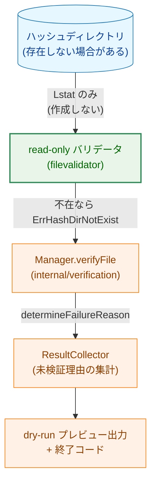
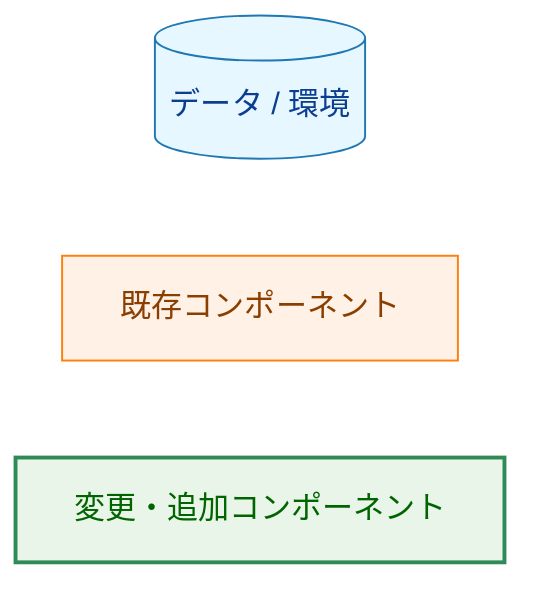
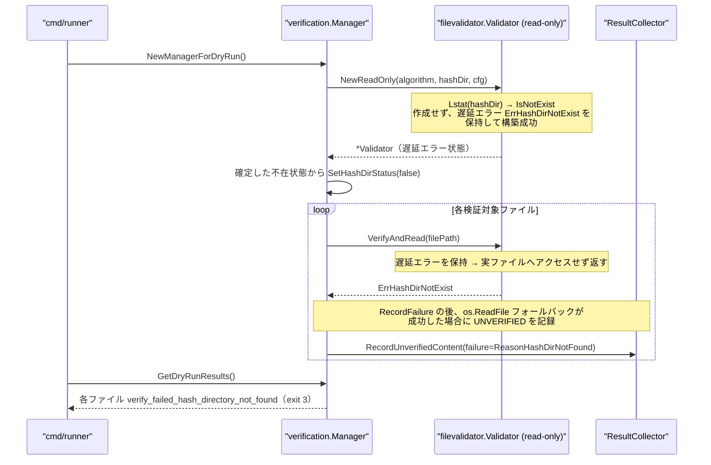
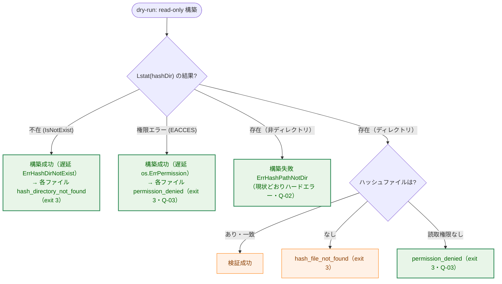
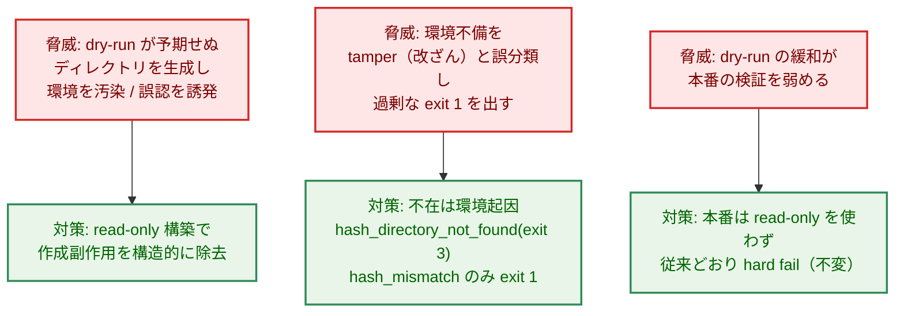

# dry-run でハッシュディレクトリを作成しない（read-only 検証） — アーキテクチャ設計書

## Document Status

| Item | Value |
|---|---|
| Status | `draft` |
| Created | 2026-07-17 |
| Review date | - |
| Reviewer | - |
| Comments | - |

## 1. 設計の全体像

### 1.1 本タスクが変更する範囲

本タスクは、dry-run 実行時のハッシュディレクトリの扱いを「無条件作成（副作用あり）」から
「read-only 検証（副作用なし）」へ変更する。変更は次の 3 パッケージにまたがる。

- `internal/fileanalysis`（`NewStore` の `os.MkdirAll`）— 作成を伴わない read-only 構築経路を追加する。
- `internal/filevalidator`（`New`）— 作成を伴わない read-only バリデータ構築経路を追加する。
- `internal/verification`（`newManagerInternal`、dry-run マネージャ生成）— dry-run では read-only
  経路を使い、不要になった権限フォールバックを除去する。

本番実行（`NewManagerForProduction`）と `record` コマンドの経路は変更しない。両者は従来どおり
`filevalidator.New`（＝作成を含む）を使う。

### 1.2 設計原則

- **副作用の除去**: dry-run はプレビューであり、外部状態（ファイルシステム）へ書き込まない。
  dry-run 経路で発生する唯一の書き込み副作用はハッシュディレクトリの `os.MkdirAll` であり、
  これを構造的に除去する（F-001、NFR-01）。
- **分類の忠実化**: ディレクトリ不在という環境事実を、それが起きた層の理由
  （`hash_directory_not_found`）でそのまま報告する。空ディレクトリを作ってしまうことによる
  `hash_file_not_found` への格下げ、およびバリデータ不在による `skipped_no_validator` への
  一括りを行わない（F-002）。
- **既存経路の再利用（DRY）**: dry-run マネージャは既にハッシュディレクトリの存在を
  `fs.FileExists` で確認し、`ResultCollector.SetHashDirStatus` へ記録している。新しい判定機構を
  追加せず、read-only 化した検証経路とこの既存機構を整合させる。
- **YAGNI**: 新しい未検証理由値・新しい終了コード・設定フラグを一切追加しない。既存の
  `ReasonHashDirNotFound` と `determineFailureReason` の写像をそのまま活用する。

### 1.3 概念モデル



> 矢印 A → B は「A が B へ値・制御を渡す」ことを表す。エッジ上のラベルは受け渡される情報の
> 種類を示す。

**Legend**:



本書の各図は `docs/dev/developer_guide/mermaid_reference.md` の標準 `classDef`（`data` = 青 /
`process` = 橙 / `enhanced` = 緑 / `problem` = 赤）に従う。上記 Legend を全図共通の凡例とし、
以降の図では個別の Legend ブロックを省略する。

### 1.4 dry-run の副作用契約

read-only 化により、dry-run 検証経路が及ぼす外部副作用を次のとおり定義する。この契約は本設計の
中核であり、実装はこれを厳守する。

| 操作 | 本番 / `record` | dry-run（本タスク後） |
|---|---|---|
| ハッシュディレクトリの `os.MkdirAll` | 行う（`filevalidator.New`） | **行わない**（read-only 構築） |
| ハッシュファイルの書き込み（`SaveRecord`） | `record` のみ行う | 行わない（元より dry-run 経路に無い） |
| ハッシュディレクトリ／ファイルの読み取り（`Lstat` / `Verify`） | 行う | 行う |
| ネットワーク送信 | なし | なし |

すなわち read-only モードが抑止する副作用は「ハッシュディレクトリの作成」ただ 1 点であり、それ以外の
読み取り操作はすべて従来どおり許可する。`Verify` 系メソッドは元来ハッシュファイルを読むだけで
書き込まないため、抑止対象は `NewStore` の `os.MkdirAll` に限定される。

## 2. システム構成

### 2.1 パッケージ依存関係


> 矢印 A → B は「パッケージ A が B を呼び出す（依存する）」ことを表す。緑のノードは本タスクで
> read-only 構築経路を追加・変更するパッケージ。

依存方向は既存と同じ（`verification` → `filevalidator` → `fileanalysis`）であり、本タスクは
各パッケージに「作成を伴わない構築経路」を追加するのみで、依存グラフの形は変えない。

### 2.2 変更の概要（Before / After）

```mermaid
flowchart TD
    classDef process fill:#fff1e6,stroke:#ff7f0e,stroke-width:1px,color:#8a3e00;
    classDef problem fill:#ffe6e6,stroke:#d62728,stroke-width:2px,color:#7b0000;
    classDef enhanced fill:#e8f5e8,stroke:#2e8b57,stroke-width:2px,color:#006400;
    classDef data fill:#e6f7ff,stroke:#1f77b4,stroke-width:1px,color:#0b3d91;

    subgraph Before["Before（現状：不在ディレクトリ）"]
        B1["dry-run: filevalidator.New"]
        B2["NewStore: os.MkdirAll"]
        B3[("空ディレクトリが生成される")]
        B4["各ファイル: hash_file_not_found<br>(格下げ)"]
        B1 --> B2 --> B3 --> B4
        class B2 problem
    end

    subgraph After["After（本タスク：不在ディレクトリ）"]
        A1["dry-run: filevalidator.NewReadOnly"]
        A2["NewStoreReadOnly: Lstat のみ"]
        A3[("ディレクトリは作られない")]
        A4["各ファイル: hash_directory_not_found<br>(忠実)"]
        A1 --> A2 --> A3 --> A4
        class A1,A2 enhanced
    end

    class B1 process
    class B3,A3 data
    class B4 process
    class A4 enhanced
```



### 2.3 データフロー（不在ディレクトリの dry-run）



本図の「遅延エラー」とは、構築時に検出したハッシュディレクトリの利用不能事由を即座に構築失敗と
せず `Validator` に保持し、`Verify` 実行時に返す仕組みを指す（詳細は後述の §3.1）。

## 3. コンポーネント設計

### 3.1 read-only 構築の設計

不在ディレクトリで「作成せず・構築を失敗させず・per-file で忠実な理由を返す」を実現する。
中核は次の 2 点である。

1. ハッシュディレクトリが利用不能（不在・権限不足）という事実は **`Validator` の遅延エラー状態**
   として保持し、`Verify` 系メソッドが実ファイルへアクセスする前に当該エラーを返す。
2. `fileanalysis.Store` は「ディレクトリが存在する」場合にのみ構築する。不在の判断は
   `filevalidator` 層で完結させ、`Store` に dry-run 専用の状態を持ち込まない。

#### `internal/filevalidator`: read-only Validator（遅延エラー状態）

`New` は `NewStore`（作成）→ `NewResolvedPath` → `newValidator`（`Lstat` で不在なら
`ErrHashDirNotExist` を返して構築失敗）の順に進む。read-only 版は自層で `Lstat` を行い、
ディレクトリの状態に応じて構築を分岐する。構築が成功する状態では、利用不能事由を遅延エラーとして
保持し、読み取り操作時に返す。

```go
// NewReadOnly はハッシュディレクトリを作成しない Validator を構築する。
// hashDir の状態に応じて次のように振る舞う。
//   - 存在しディレクトリ: NewStoreReadOnly で store を構築（作成しない）。通常の read-only 検証。
//   - 存在しない: 遅延エラー ErrHashDirNotExist を保持した Validator を返す（構築は成功）。
//   - 存在するがディレクトリでない: ErrHashPathNotDir を返す（構築失敗＝ハードエラー。Q-02）。
//   - Lstat が権限エラー等で失敗: 遅延エラー（os.ErrPermission 由来）を保持した Validator を返す
//     （構築は成功。Q-03）。
// 遅延エラーを保持した Validator では、Verify / VerifyWithHash / VerifyAndRead は
// 実ファイルへアクセスせず、保持した遅延エラーを返す。
func NewReadOnly(algorithm HashAlgorithm, hashDir string, cfg ValidatorConfig) (*Validator, error)
```

**Q-01（パス解決）への対応**: `common.NewResolvedPath` は `EvalSymlinks` を用いるため不在パスでは
必ず失敗する。したがって不在時はパス解決を行わず、`NewReadOnly` は解決済みパスを持たない遅延エラー
状態の Validator を返す。`Verify` 系メソッドは、`calculateHash`（対象ファイルのハッシュ計算）や
`store.Load`（ハッシュファイル読み取り）へ進む**前**に遅延エラーの有無を確認し、保持していれば
それを返す。これにより不在時でも構築が成功し、`fileValidator` が nil に落ちて AC-04 が禁じる
`skipped_no_validator` へ転ぶ事態を防ぐ。

`determineFailureReason` は `ErrHashDirNotExist` → `ReasonHashDirNotFound`、`os.ErrPermission`
→ `ReasonPermissionDenied` を既に写像している（`result_collector.go`）ため、新しい写像は追加しない。

#### `internal/fileanalysis`: read-only Store（作成しない、存在前提）

`NewStore` は不在時に `os.MkdirAll` で作成する。read-only 版は作成を行わないが、不在状態は
`filevalidator` 層で処理済みのため、`NewStoreReadOnly` は「ディレクトリが存在する」ことを前提に
構築する。`Store` 本体（フィールド・`Load`）は変更せず、dry-run 専用の状態を持ち込まない。

```go
// NewStoreReadOnly は analysisDir を作成しない Store を構築する。
// analysisDir が存在しディレクトリであることを前提とし、その場合は従来の NewStore と同じく
// 解決済みパスで Store を構築する（os.MkdirAll を呼ばない点のみ異なる）。
// analysisDir が存在しない、またはディレクトリでない場合はエラーを返す（呼び出し側の
// filevalidator.NewReadOnly が事前に状態を判定しており、通常このエラー経路には至らない）。
func NewStoreReadOnly(analysisDir string, pathGetter common.HashFilePathGetter) (*Store, error)
```

#### `internal/verification`: dry-run での read-only 採用

`newManagerInternal` は現状、dry-run でも `filevalidator.New`（作成を含む）を呼び、
`os.ErrPermission` 時のみバリデータを nil 化して続行するフォールバック（`manager.go` の
`opts.isDryRun && errors.Is(err, os.ErrPermission)` 分岐）を持つ。本タスクでは dry-run のとき
`filevalidator.NewReadOnly` を呼ぶ。作成を行わず、かつ不在・権限不足を遅延エラー状態として
構築成功させるため、当該フォールバック分岐は不要となり除去する（NFR-03）。

この置き換えにより、旧フォールバックが `skipped_no_validator` へ一括りにしていた権限不足ケースは、
遅延エラー経由で `permission_denied`（exit 3）として忠実に報告されるようになる（分類の忠実度が
向上）。また dry-run の構築経路で `fileValidator` が nil になることはなくなり、
`skipped_no_validator` は `fileValidatorEnabled = false`（dry-run が設定しない）経由でのみ到達可能な
状態となる。

**プレビュー表示との単一情報源化**: 既存のヘッダ表示 `SetHashDirStatus` は現状、per-file 判定とは
別の `fs.FileExists(hashDir)` 呼び出しから導出しており、二重プローブによる不整合（ヘッダは「存在」
なのに各行は不在、の齟齬）の余地がある。本設計では `SetHashDirStatus` を `NewReadOnly` が確定した
ディレクトリ状態から導出し、ヘッダと per-file 報告を単一の判定に統一する。

### 3.2 状態遷移：ハッシュディレクトリの状態と結果



> 矢印 A → B は「分岐 A の結果として B に至る」ことを表す。緑のノードは本タスクで挙動が変わる、
> あるいは新たに到達可能になる結果。

### 3.3 コンポーネント責務一覧

| ファイル | 変更種別 | 責務 | 更新が必要な既存テスト |
|---|---|---|---|
| `internal/fileanalysis/file_analysis_store.go` | 変更 | `NewStoreReadOnly` を追加。`os.MkdirAll` を呼ばず、ディレクトリ存在を前提に構築（`Store` のフィールド・`Load` は不変） | `internal/fileanalysis/*_test.go` に read-only 構築の単体テストを追加 |
| `internal/filevalidator/validator.go` | 変更 | `NewReadOnly` を追加。`Validator` に遅延エラー状態を持たせ、不在・権限不足では `Verify` 系が実ファイルへアクセスせず当該エラーを返す | `internal/filevalidator/*_test.go` に read-only 構築・不在時／権限時 Verify の単体テストを追加 |
| `internal/verification/manager.go` | 変更 | dry-run で `filevalidator.NewReadOnly` を使用。`os.ErrPermission` フォールバック分岐を除去。`SetHashDirStatus` を `NewReadOnly` の確定状態から導出 | `TestReadAndVerifyFileWithReadFallback_NoValidator_DryRunRecordsUnverified`（`manager_test.go`）は `withFileValidatorDisabledInternal()` 経由で nil バリデータを強制しており引き続き成立するが、コメントの前提（「ハッシュディレクトリが書き込み不可の dry-run」）が実態と合わなくなるためコメントを更新。`verify_failed_hash_file_not_found` を期待するケースはいずれもディレクトリ存在前提であり対象外 |
| `internal/verification/manager_production.go` | 変更（軽微） | `logDryRunManagerCreation` のログ属性を read-only 構築に整合させる | 該当なし |
| `cmd/runner/integration_dryrun_verification_test.go` | 変更 | 不在ハッシュディレクトリの忠実な E2E を新規追加（AC-10）。既定ハッシュディレクトリを不在パスへ差し替える | 本ファイルに `TestDryRunE2E_NoSideEffects` が既存。新規テストと責務が重複しない範囲で追加 |
| `docs/user/runner_command.md` / `.ja.md` | 変更 | dry-run が作成しないこと・不在時 `hash_directory_not_found`（exit 3）を明記（F-003、AC-07/08） | 該当なし |

## 4. エラーハンドリング設計

### 4.1 既存エラー型の再利用

本タスクは新しいエラー型・未検証理由値を追加しない。関係するエラーと写像は既存のものを用いる。

| エラー（発生源） | `determineFailureReason` の写像 | 報告形式 | 終了コード |
|---|---|---|---|
| `filevalidator.ErrHashDirNotExist` | `ReasonHashDirNotFound` | `verify_failed_hash_directory_not_found` | 3 |
| `filevalidator.ErrHashFileNotFound` | `ReasonHashFileNotFound` | `verify_failed_hash_file_not_found` | 3 |
| `os.ErrPermission` | `ReasonPermissionDenied` | `verify_failed_permission_denied` | 3 |
| `filevalidator.ErrHashPathNotDir`（構築時） | 写像対象外（構築失敗としてハードエラー） | — | — |

### 4.2 構築失敗と per-file 報告の切り分け

read-only 構築が「不在」を状態として保持することで、環境事実（ディレクトリ不在）は**構築失敗**では
なく**per-file の未検証理由**として報告される。これにより:

- 不在 → per-file `hash_directory_not_found`（プレビュー継続、exit 3）。
- 非ディレクトリ → 構築失敗（ハードエラー、現状の dry-run 挙動を維持）。

構築を失敗させないことは AC-04（`skipped_no_validator` にしない）を満たすための必須条件である。

## 5. セキュリティ考慮事項

### 5.1 本変更のセキュリティ上の位置づけ

本変更はセキュリティ既定値を安全側へ倒すものである。

- **副作用の削減**: dry-run が本番環境のファイルシステムへ書き込まなくなる。攻撃面・運用リスクの
  いずれも縮小方向である。
- **分類の忠実化**: 環境事実（ディレクトリ不在）を実態どおり報告するため、運用者がプレビュー結果
  から状態を誤認しにくくなる。
- **本番経路の不変性**: 本番実行は従来どおり不在ハッシュディレクトリで hard fail する（AC-09）。
  検証手段が無い状態でのコマンド実行は依然として拒否される（fail-closed を維持）。

不在ハッシュディレクトリに対する dry-run の終了コード 3（非ゼロ）は、本番がこの構成で
**実行を拒否する**ことをプレビューとして忠実に示す信号である。本番は検証手段の欠如を検知した
時点で即座に hard fail するのに対し、dry-run は各検証対象の未検証理由を列挙してから終了する。
両者の終了の仕方（本番は即時中断し、dry-run は列挙後に終了する）が異なるのは設計上の意図であり、
いずれも「検証できない構成では実行しない」という同一の結論を表す。

### 5.2 脅威モデル



> 矢印 脅威 → 対策 は「左の脅威に対し右の対策で緩和する」ことを表す。

### 5.3 設計上の判断（Q-01〜Q-03）

要件書 §4 の検討事項に対する本設計の決定。

- **Q-01（パス解決）**: 不在時はパス解決（`EvalSymlinks`）を行わず raw パスを保持し、read-only
  Store の「不在」状態から直ちに `hash-directory-not-exist` を返す（§3.1）。これにより不在時でも
  バリデータ構築が成功し、AC-04 を満たす。
- **Q-02（存在するが非ディレクトリ）**: **現状どおりハードエラー**（`ErrHashPathNotDir` /
  `ErrAnalysisDirNotDirectory`）とする。現在の dry-run も非ディレクトリでは構築に失敗して
  hard fail しており（`filevalidator.New` → `NewStore` の非ディレクトリ検査）、本タスクはこの
  挙動を変えない。理由: 非ディレクトリのハッシュパスは「まだ記録していない」正常な不在とは異なる
  明確な誤設定であり、exit 3 として静かに報告するとその誤設定を隠蔽する。本タスクの主眼は「不在」
  ケースの是正に限る（YAGNI）。
  この判断には運用上の非対称がある。不在は exit 3 でプレビューを継続するのに対し、非ディレクトリは
  プレビュー出力を一切得られないまま dry-run 全体が中断する。これは誤設定を確実に表面化させる
  ためのトレードオフであり、非ディレクトリのハッシュパスでは本番も同様に hard fail するため、
  プレビューとしての忠実性（本番挙動との一致）は保たれる。
- **Q-03（権限不足）**: 2 つの経路を区別する。
  - **ディレクトリが存在するが読取権限が無い場合**: 構築は成功する（`Lstat` と `EvalSymlinks` は
    対象ディレクトリの親に実行権があれば成功する）。per-file の読み取りで `os.ErrPermission` が
    生じ `permission_denied`（exit 3）として忠実に報告される。
  - **ディレクトリが不在で、かつ親ディレクトリを辿れない（`Lstat` が `EACCES`）場合**: 作成を
    行わなくても `NewStore` 相当の先頭 `os.Lstat(analysisDir)` は権限エラーを返す。この事実を
    受け、`NewReadOnly` は `Lstat` が `IsNotExist` 以外のエラー（権限エラー等）を返した場合、
    構築を失敗させず、その `os.ErrPermission` 由来のエラーを遅延エラーとして保持する（§3.1）。
    結果として各検証対象は `permission_denied`（exit 3）として報告され、dry-run は中断せず
    プレビューを継続する。

  この設計により、旧フォールバック（作成失敗の `os.ErrPermission` 時にバリデータを nil 化し
  `skipped_no_validator` として扱って続行）が果たしていた「dry-run を中断させない」性質は維持しつつ、
  分類を `skipped_no_validator` から `permission_denied` へ忠実化する。旧フォールバック分岐は
  この遅延エラー機構に置き換えて除去する（NFR-03）。すなわち「作成を行わないのでフォールバックが
  到達不能になる」のではなく、**フォールバックが担っていた継続動作を遅延エラー機構が引き継ぐ**点に
  注意する。旧フォールバックが出力していた `slog.Info("Hash directory not writable in dry-run
  mode…")` の情報は、per-file の `permission_denied` ログ（`logVerificationFailure`）が代替する。

### 5.4 既存ポリシーとの関係

本設計は他タスクのアーキテクチャ文書が定めたポリシーへ例外を持ち込まない。0147 が定めた
「未検証理由 → 終了コード」の写像（環境起因 = exit 3、改ざん兆候 = exit 1）はそのまま用いる。
0147 は「dry-run がハッシュディレクトリを自動作成する」当時の実測を前提に `hash_directory_not_found`
を E2E で再現不能な防御的定義として扱い、重複 E2E テスト `TestDryRunE2E_HashDirectoryNotFound` を
削除した。本タスクは同経路を**再現可能**にするため忠実な E2E を新規追加する（0147 の決定の
巻き戻しではなく、実態変更に伴う新規テスト）。詳細は付録 A。

## 6. 処理フロー詳細

### 6.1 AC と設計要素の対応

| AC | 設計要素 |
|---|---|
| AC-01（作成しない） | §1.4 副作用契約、§3.1 read-only Store/Validator（`os.MkdirAll` 不実行） |
| AC-02（正常系の非回帰） | §3.2「存在（ディレクトリ）」経路は従来どおり |
| AC-03（`hash_directory_not_found`、格下げ無し） | §3.1 不在状態 Validator が `ErrHashDirNotExist` を返す → §4.1 写像 |
| AC-04（`skipped_no_validator` にしない） | §3.1 不在時も構築成功（Q-01）、§4.2 構築失敗との切り分け |
| AC-05（exit 3） | §4.1 `ReasonHashDirNotFound` → exit 3（0147 の写像） |
| AC-06（`verify_files` / env も環境起因） | §4.1 同一写像が全検証対象へ適用（`verifyFile` 経由） |
| AC-07 / AC-08（ドキュメント） | §3.3 責務一覧の `docs/user/` 更新 |
| AC-09（本番・`record` 不変） | §1.1 本番／`record` は `filevalidator.New` を継続使用 |
| AC-10（忠実な E2E） | §3.3 `cmd/runner/integration_dryrun_verification_test.go` の新規テスト |

### 6.2 AC-06 の全検証対象への適用

`hash_directory_not_found` の報告は、特定の呼び出し箇所ではなく `Manager.verifyFile` /
`verifyFileWithHash` / `readAndVerifyFileWithReadFallback` という共通経路上で
`determineFailureReason` により行われる。設定ファイル・テンプレート・`global.verify_files` /
`groups[].verify_files`・env ファイルはいずれもこの共通経路を通るため、不在ディレクトリでは
すべて同一理由（環境起因、exit 3）で報告される。個別の検証対象種別ごとに分岐を追加する必要は
ない。

## 7. テスト戦略

### 7.1 ユニットテスト

- `internal/fileanalysis`: `NewStoreReadOnly` が (a) 不在時に作成せずエラーを返す、
  (b) 存在時は従来どおり解決済みパスで構築する、(c) 非ディレクトリでエラーを返す、を検証。
- `internal/filevalidator`: `NewReadOnly` が (a) 不在時にディレクトリを作成しない（作成有無を
  ファイルシステムで確認）、(b) 不在状態 Validator の `Verify` / `VerifyWithHash` /
  `VerifyAndRead` が `ErrHashDirNotExist` を返す、(c) 存在・記録済みで検証成功、(d) 親を辿れない
  不在（`Lstat` 権限エラー）で構築が成功し `Verify` 系が `os.ErrPermission` 由来のエラーを返す、
  を検証。(d) は今回除去する旧フォールバックが担っていた「中断させない」挙動の後継であり、
  現状テストが存在しないため新規に固定する。
- `internal/verification`: dry-run マネージャが不在ディレクトリで各検証対象を
  `ReasonHashDirNotFound` として記録し、`skipped_no_validator` にも `hash_file_not_found` にも
  ならないこと、および親を辿れない不在では `ReasonPermissionDenied` として記録し dry-run が中断
  しないことを検証。

### 7.2 統合テスト（E2E）

- **新規（AC-10）**: 既定ハッシュディレクトリを不在パスへ差し替えた dry-run を実行し、
  (a) 実行後に当該パスが作成されていない、(b) 各検証対象が
  `verify_failed_hash_directory_not_found` として報告される、(c) 終了コードが 3、を単一テストで
  検証する（`cmd/runner/integration_dryrun_verification_test.go`）。
- **回帰**: 既存 `TestDryRunE2E_AllSuccess` / `TestDryRunE2E_NoSideEffects` /
  `TestDryRunE2E_HashFilesNotFound` が read-only 化後も従来どおり成立することを確認（AC-02、
  既存挙動の非回帰）。

### 7.3 セキュリティテスト

- 本番実行（非 dry-run）で不在ハッシュディレクトリを指定した場合に従来どおり hard fail する
  ことを確認（AC-09）。
- `record` コマンドが不在ハッシュディレクトリを従来どおり自動作成することを確認（AC-09）。

## 8. 実装優先順位

| フェーズ | 内容 | 対応 AC |
|---|---|---|
| 1 | `internal/fileanalysis` に `NewStoreReadOnly` を追加 + 単体テスト | AC-01 の基盤 |
| 2 | `internal/filevalidator` に `NewReadOnly` を追加 + 単体テスト | AC-01, AC-03, AC-04 |
| 3 | `internal/verification` の dry-run を read-only 化・権限フォールバック除去 + 単体テスト | AC-03〜AC-06, NFR-03 |
| 4 | 忠実な E2E を新規追加 | AC-10 |
| 5 | ユーザードキュメント更新（`docs/user/`） | AC-07, AC-08 |

依存関係により下層（`fileanalysis`）から上層（`verification`、E2E）へ順に進める。

## 9. 将来の拡張性

- read-only 構築は、将来「書き込みを伴わない検証専用モード」を他コマンド（例: 検証結果の
  監査ダンプ）へ展開する際の基盤として再利用できる。ただし本タスクでは dry-run のみを対象と
  する（YAGNI）。
- 非ディレクトリ（Q-02）を将来 dry-run で soft-report したくなった場合は、`determineFailureReason`
  への写像追加で拡張可能な構造としている（本タスクでは追加しない）。

## 付録 A: 決定履歴

本文は現行挙動（本タスク適用後）を記述する。以下は設計判断の背景であり、現行挙動の説明ではない。

- **0147 との関係**: 0147 は dry-run がハッシュディレクトリを自動作成する当時の実測を前提に、
  未検証理由 `hash_directory_not_found` を「E2E で再現不能な防御的定義」とみなし、重複していた
  E2E テスト `TestDryRunE2E_HashDirectoryNotFound` を削除した（0147 AC-19）。本タスクは作成副作用
  そのものを除去して同経路を再現可能にするため、実態に即した E2E を新規追加する。両文書は矛盾
  しない。0147 のタスク文書は当時の意思決定の記録として凍結し、改訂しない（要件書 §1 スコープ外）。
- **read-only を新設した理由（なぜ既存の `filevalidator.New` を使い続けないか）**: `New` は構築時に
  `os.MkdirAll` で必ずディレクトリを作成する。この作成こそが除去対象の副作用であり、既存構築経路
  では F-001 / NFR-01 を満たせない。`record` と本番はこの作成挙動を必要とするため `New` を温存し、
  dry-run のためだけに作成しない構築経路を追加する。
