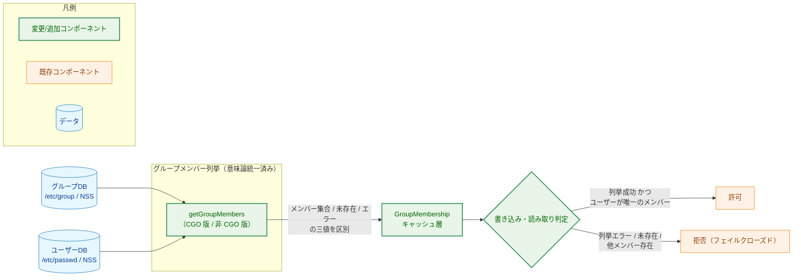
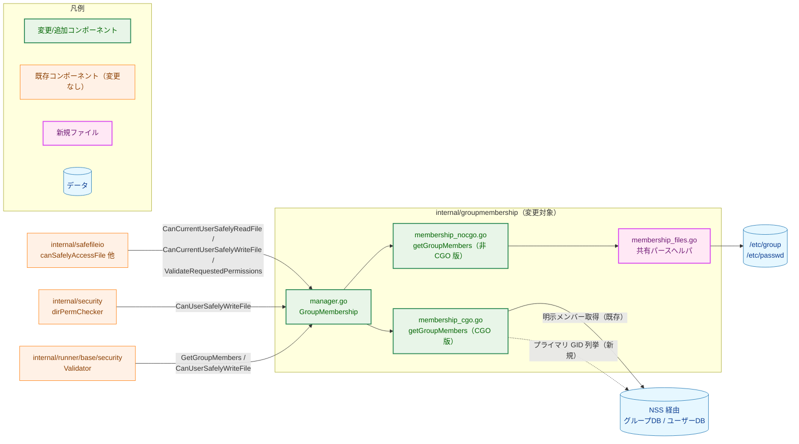
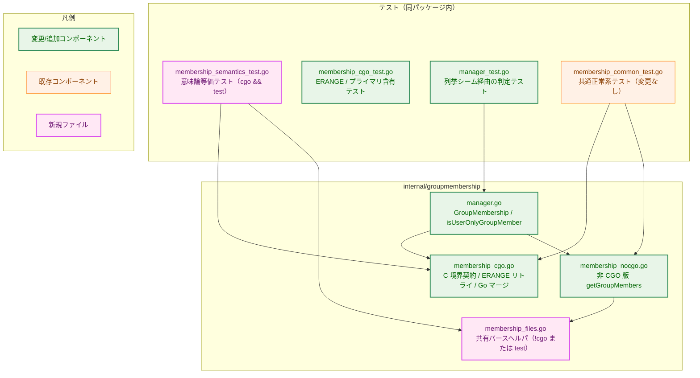
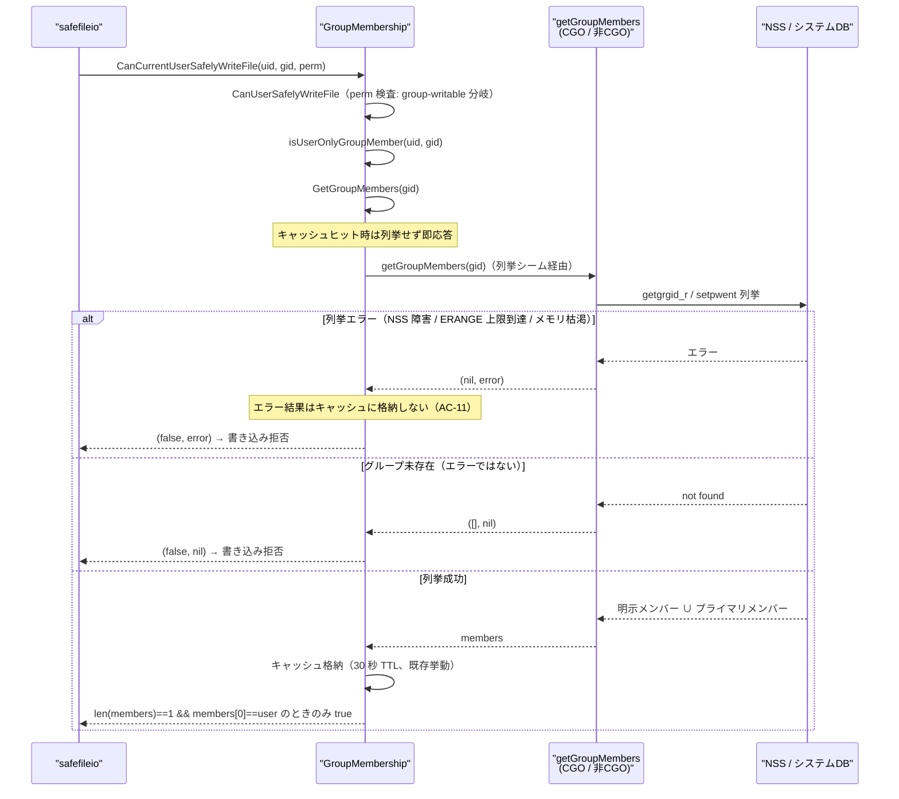
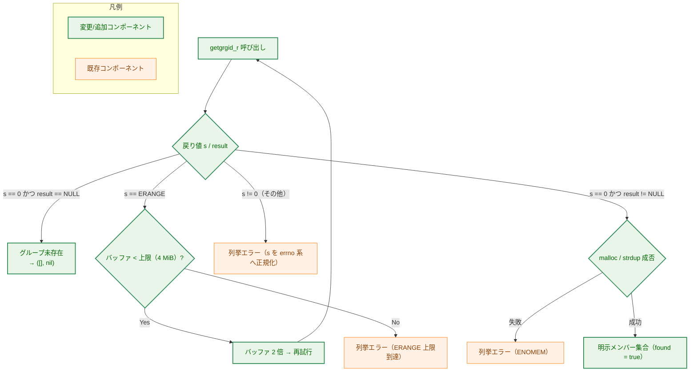
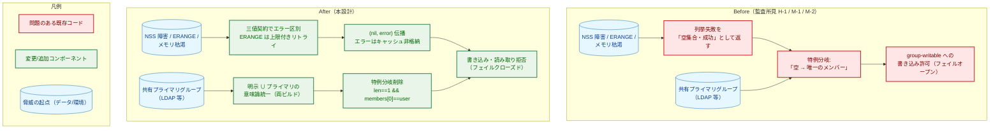
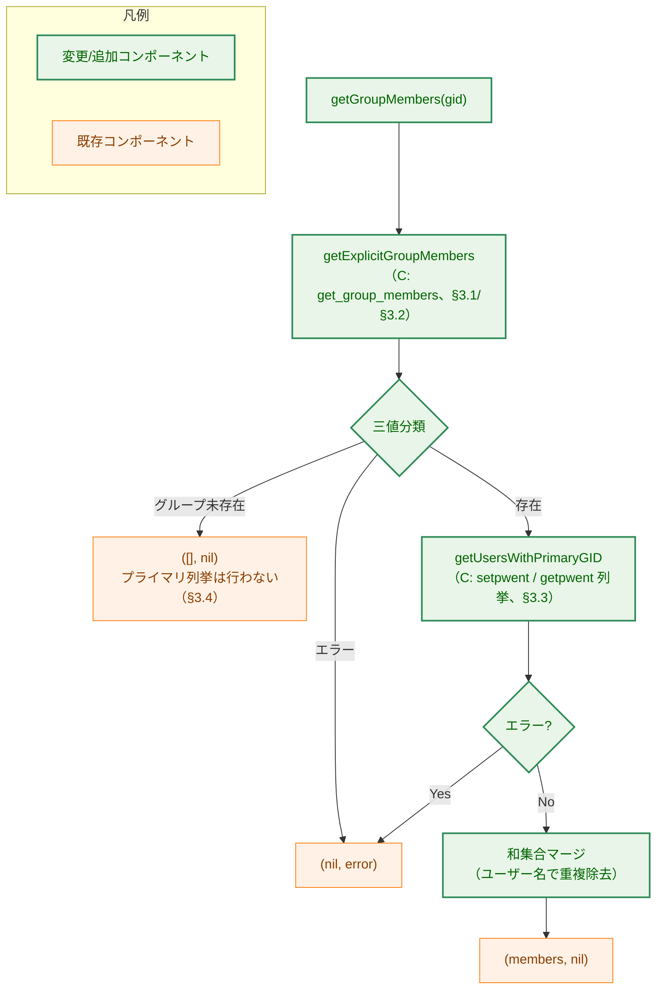
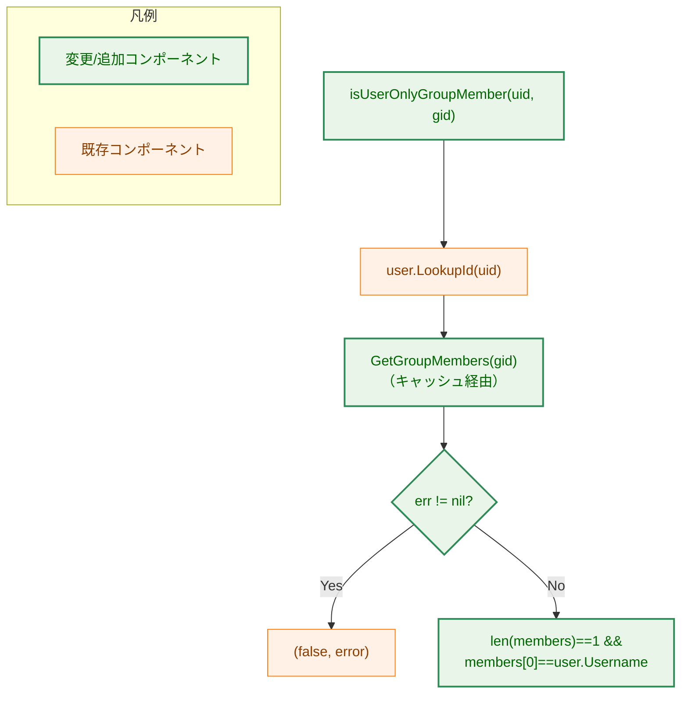

# groupmembership グループメンバー列挙 fail-closed 是正 — アーキテクチャ設計書

## Document Status

| Item | Value |
|---|---|
| Status | `approved` |
| Created | 2026-07-19 |
| Review date | 2026-07-19 |
| Reviewer | isseis |
| Comments | - |

## 0. 本書の位置づけ

本書は [`01_requirements.md`](01_requirements.md)（status: `approved`）で定義した振る舞い（WHAT）を、
実現機構（HOW）へ落とし込む設計文書である。対象は監査所見
[`../0149_security_code_smell_audit_fable/findings/D1_groupmembership.md`](../0149_security_code_smell_audit_fable/findings/D1_groupmembership.md)
の H-1（CGO 版のエラー握りつぶしによるフェイルオープン）、M-2（CGO 版・非 CGO 版の意味論不一致）、
M-1（`isUserOnlyGroupMember` の「明示メンバー 0 人 → 唯一のメンバー」特例分岐）の 3 件であり、
要件 F-001〜F-004（AC-01〜AC-13）に対応する。

要件書が設計判断に委ねた論点と、本書で結論を確定する箇所は次の通りである。

- **ERANGE リトライの上限値・拡大戦略**（要件「残存する留意点」、非機能要件）→ §3.2 で確定する。
- **意味論統一の境界ケース**（グループ未存在時のプライマリメンバー列挙の扱い、AC-07 関連）→ §3.4 で確定する。
- **CGO 版でプライマリメンバーをどう列挙するか**（M-1/M-2 是正の中核となる実現機構）→ §3.3 で確定する。

対象パッケージは `internal/groupmembership` のみであり、呼び出し元パッケージ
（`internal/safefileio`、`internal/security`、`internal/runner/base/security`）の仕様変更は行わない
（要件「スコープ対象外」）。用語は [`docs/translation_glossary.md`](../../translation_glossary.md)
に従う（「フェイルクローズド」「フェイルオープン」等）。

---

## 1. 設計の全体像

### 1.1 設計原則

1. **フェイルクローズド徹底**: グループメンバー列挙の失敗を「メンバー 0 人・成功」に縮退させない。
   列挙 API がエラーを返した場合は、書き込み判定・読み取り判定の双方で拒否側に倒す。
   新たなフェイルオープンを導入しない。
2. **意味論の単一化**: 「メンバー集合とは何か」を仕様として一意に定め（明示メンバー ∪ プライマリメンバー）、
   CGO 版・非 CGO 版の両実装が同じ集合を返すようにする（環境前提は §3.3、残存リスクは §5.4）。
   セキュリティ判定結果をビルド構成に依存させない。
3. **公開 API の不変**: `GetGroupMembers` / `IsUserInGroup` / `CanUserSafelyWriteFile` 等の公開シグネチャと
   `(bool, error)` 契約は変更しない。呼び出し元は無修正のまま利用できる（非機能要件）。
4. **既存資産の再利用（DRY）**: C 境界の防御パターン（`unsafe.Slice`、count 境界検証 `validateGroupMemberCount`、
   `free_string_array` による解放）は踏襲する。`/etc/group`・`/etc/passwd` のパース処理は新規に作らず、
   既存の非 CGO 版実装を共有ファイルへ移して両ビルドのテストから再利用する。
5. **単純さの優先（YAGNI）**: 要件が求める 3 件の是正に閉じ、キャッシュ機構（30 秒 TTL）や
   権限ビット検査など既存の良好な防御層には手を入れない。

### 1.2 コンセプトモデル

本タスクの中核は「列挙結果の三値（成功・未存在・エラー）を区別し、エラーを拒否へ写像する」ことにある。
列挙の情報源（グループ DB・ユーザー DB）から判定（許可/拒否）までの一方向の流れを、
変更後の姿で示す。



> 実線矢印 A → B は「A から B へデータ（メンバー集合・エラー等）が渡る」ことを表す。
> 円柱形はデータ（システムの情報源）、矩形はコンポーネント、菱形は判定を表す。
> 凡例のノードは色分けの意味のみを示し、相互関係は表さない。
> NSS（Name Service Switch）: `/etc/nsswitch.conf` の設定に従い、グループ DB・ユーザー DB の
> 参照先（files・SSSD・winbind 等）を切り替える libc の仕組み。

現行コードでは、CGO 版の列挙失敗が「メンバー 0 人・成功」に化け、`isUserOnlyGroupMember` の特例分岐を
経由して ALLOW 側へ到達する経路（フェイルオープン）が存在する。本設計はこの経路を、
列挙層での三値区別（§3.1）と特例分岐の削除（§3.5）によって閉じる。

---

## 2. システム構成

### 2.1 全体アーキテクチャ

`internal/groupmembership` は、ファイルの読み書き安全性を判定する 3 つの呼び出し元から利用される
既存パッケージである。変更は同パッケージ内部に閉じ、呼び出し関係の構造は変わらない。



> 実線矢印 A → B は「A が B を呼び出す（または参照する）」ことを表す。`NIM → SHR` と `SHR → ETC` は
> §3.6 の共有化後に成立する関係（現行は `NIM` が `ETC` を直接参照しており、共有化で `SHR` 経由に移る）であり、
> その他の実線矢印は現行コードにも存在する関係である。
> 破線矢印は本タスクで新たに追加する関係（CGO 版からのプライマリ GID 列挙）を表す。
> `MGR → CIM` と `MGR → NIM` はビルドタグで排他選択される代替関係であり、同一バイナリに共存しない。

呼び出し元 3 経路はいずれも `(bool, error)` 契約で利用しており、列挙エラーをエラーとして上位へ伝播する
構造は現行のまま維持される（§6.3 で各経路のフェイルクローズド波及を確認する）。

### 2.2 コンポーネント配置

変更・新規ファイルの配置を示す。新規パッケージは追加せず、すべて `internal/groupmembership` 内に収める。



> 矢印 A → B（`graph` 記法の `-->`）は「A が B のシンボルを利用する」ことを表す。
> `SEM → CIM` の利用は cgo ビルドかつ test タグ時のみコンパイルされる。
> `CMT` は共通テストからビルド別の `getGroupMembers` を呼ぶため `CIM`・`NIM` の双方に利用関係を持つ
> （ビルドタグで排他選択）。

### 2.3 データフロー

セキュリティ上の中核経路である「group-writable ファイルへの書き込み判定」を、
列挙結果の三値別に示す。



> `A->>B` は同期呼び出し、`A-->>B` は戻り値を表す。`alt` ブロックは列挙結果の三値に対応する。
> いずれの状態でも「列挙失敗が許可に化ける」経路は存在しない。
> 列挙シームは §3.5 で導入する、テストから列挙関数を差し替えるための非公開フィールドを指す
> （本番コードの経路は変わらない）。

---

## 3. コンポーネント設計

### 3.1 CGO 版列挙の C 境界契約（F-001 / AC-01, AC-03, AC-04, AC-05）

現行の C 関数 `get_group_members` は「グループ未存在」「`getgrgid_r` エラー」「`malloc`/`strdup` 失敗」を
すべて NULL 返却で表現しており、Go 側から区別できない。これを、エラー出力パラメータを持つ
**三値契約**へ変更する。

```c
// C 側契約（シグニチャのみ）
//   戻り値 non-NULL          : 成功。*count_out にメンバー数（0 以上）
//   戻り値 NULL && *err_out == 0 : グループ未存在（エラーではない）
//   戻り値 NULL && *err_out != 0 : 列挙エラー。*err_out に errno 系の値
//   buf_initial / buf_max    : ERANGE リトライ用バッファの初期サイズと上限（§3.2）
char** get_group_members(gid_t gid, int* count_out, int* err_out,
                         size_t buf_initial, size_t buf_max);
```

`getgrgid_r` の戻り値 `s` と結果ポインタ `result` から次の通り分類する（AC-01）。

- `s == 0 && result == NULL` → グループ未存在（`*err_out = 0`）
- `s == ERANGE` → バッファ拡大して再試行（§3.2）。上限到達時は `*err_out = ERANGE`
- `s != 0`（その他） → `*err_out = s`（`s == -1` を返すプラットフォーム向けに `errno` へ正規化）
- `s == 0 && result != NULL` → 成功。`malloc`/`strdup` 失敗時は `*err_out = ENOMEM`（AC-03）
- `s == 0 && result != NULL` かつ `gr_mem` が NULL または空 → 成功（`*count_out = 0`）。
  未存在とみなしてはならない（未存在扱いすると §3.4 の早期リターンによりプライマリ列挙が省かれ、
  メンバー集合が過小になるため）

`buf_initial`・`buf_max` は Go 側ラッパが §3.2 の非公開パッケージ変数を呼び出しのたびに読み、
引数として引き渡す。C 側は状態を持たず、テスト用の値差し替えは Go 側変数への代入だけで完結する。

Go 側はこの三値を次の内部インターフェースへ写像する。

```go
// Go 側内部インターフェース（シグニチャのみ）
//   err != nil      : 列挙エラー（ErrGroupMemberEnumeration を %w でラップ）
//   found == false  : グループ未存在
//   それ以外        : 明示メンバー集合（空の場合あり）
func getExplicitGroupMembers(gid uint32) (members []string, found bool, err error)
```

これにより、Go 関数 `getGroupMembers`（CGO 版）は、C 側がエラーを報告した場合に必ず
`(nil, non-nil error)` を返し（AC-04）、グループ未存在の場合には従来通り `([]string{}, nil)` を返す
（AC-05、正常系の維持）。C から受け取る count の境界検証（`validateGroupMemberCount`）と
`free_string_array` による解放、`unsafe.Slice` による変換は既存パターンを踏襲する。

### 3.2 ERANGE リトライとバッファ上限（F-001 / AC-02）

`getgrgid_r` が `ERANGE` を返した場合、バッファを**倍々で拡大**して再試行する。
上限に達した場合は無限リトライやメモリ枯渇を招かないよう、エラーとして扱う（フェイルクローズド）。

設計上の確定値は次の通りである（要件「残存する留意点」への回答）。

| 項目 | 値 | 根拠 |
|---|---|---|
| 初期バッファサイズ | `sysconf(_SC_GETGR_R_SIZE_MAX)`、取得不可なら 16384 | 現行コードと同じ起点を維持 |
| 拡大戦略 | 2 倍ずつ | `getgrgid_r` の定石パターン（監査所見の推奨どおり） |
| 上限 | 4 MiB | 既存のメンバー数上限 `maxGroupMembers = 65536` の全員分を収められる、実用上の余裕を持つ値であり、非機能要件の「数 MB 程度」に合致 |

テスト可能性のため、初期サイズと上限は**非公開のパッケージ変数**として保持する。
Go 側ラッパは呼び出しのたびにこれらの値を読み、§3.1 の `buf_initial`・`buf_max` 引数として
C 関数へ引き渡すため、テストは Go 側変数への代入だけで振る舞いを差し替えられる。

```go
// 非公開（パッケージ内テストから差し替え可能）
var grBufferInitialSize int          // 0 の場合は sysconf 値（取得不可なら 16384）
var grBufferMaxSize = 4 * 1024 * 1024 // 4 MiB
```

本番コードはこれらを変更しない。テストでの利用は次の規約に従う（`make test` が CGO_ENABLED=1 で
`-race` 付きで実行するため、競合と設定戻し忘れを防ぐ）。

- `t.Parallel()` を使用しない
- 変更した値は `t.Cleanup` で必ず復元する
- これらの変数を差し替えるテストと、列挙を並行実行するテストを同時に走らせない

テストは初期値を極小（例: 16 バイト）に設定して実 NSS 呼び出しで
ERANGE → 拡大 → 成功の経路を決定的に検証し、上限を同様に小さく設定して上限到達 → エラーの経路
（AC-04 のエラー伝播そのもの）を検証する。さらに初期値に確保不能な巨大値（例: 2^62。
ユーザアドレス空間を大きく超えるため `malloc` が即座に失敗する）を設定すれば、`malloc` 失敗 →
ENOMEM → `(nil, non-nil error)` の経路（AC-03）も同じ仕組みで決定的に検証できる。
これにより、通常環境では再現が困難な失敗系の分岐を、フォールトインジェクション機構なしに
実コードのまま試験できる。

### 3.3 プライマリメンバー列挙（F-002 / AC-06）

CGO 版が非 CGO 版と同じ意味論（明示メンバー ∪ プライマリメンバー）を返すには、
「指定 GID をプライマリ GID とするユーザー」の列挙が必要である。

**なぜ既存の単純なアプローチ（`/etc/passwd` のパース再利用）では要件を満たせないか**:
M-1 が対象とする環境は「複数ユーザーが同一プライマリグループを共有する環境（LDAP 等）」であり、
ディレクトリサービスで管理されるユーザーは `/etc/passwd` に現れない。ファイルパース方式では
要件 F-002 の意味論（NSS 経由で見えるプライマリメンバーを含めること）を満たせないため、
CGO 版は NSS 経由の列挙を新たに行う。これは新機構の導入だが、要件が直接要求するものであり、
より単純な代替は存在しない。

**この機構の保証が成立する前提**: 主要なディレクトリ NSS バックエンドは、既定では
`getpwent` による完全なユーザー列挙を返さない（SSSD は `enumerate = false` が既定、
winbind は `winbind enum users = no` が既定、macOS の OpenDirectory はローカルノードのみを列挙する）。
したがって M-1 是正の保証（「プライマリグループの唯一のメンバーが本人 1 名として列挙結果に現れる」）は、
NSS の passwd 列挙が完全なユーザー集合を返す環境（files バックエンド（`/etc/group`・`/etc/passwd`
を直接読む構成）、または列挙を有効化した
SSSD/winbind）で成立する。列挙が部分的な環境での残存リスクと判定方向は §5.4 に記録する。

NSS 経由の列挙は、`setpwent` → `getpwent` ループ → `endpwent` を **1 回の C 呼び出し内**で完結させる
C 関数として実現する。

```c
// C 側契約（シグニチャのみ）。エラー出力の形式は get_group_members と同じ
char** get_users_with_primary_gid(gid_t gid, int* count_out, int* err_out);
```

- `getpwent` が返す各エントリの `pw_gid` を対象 GID と比較し、一致した `pw_name` を即座に `strdup` して蓄積する
- ループ終端（NULL 返却）とエラーの区別は `errno` で行う。各 `getpwent` 呼び出しの直前に
  `errno = 0` を設定し、NULL 返却時に `errno != 0` なら列挙エラー、`errno == 0` ならデータ終端と
  判定する（NSS プラグインが内部処理で `errno` を設定したまま残す既知の挙動への対策）
- `malloc`/`strdup` 失敗は `*err_out = ENOMEM`
- 列挙全体は 1 回の C 呼び出し内で行うため、`endpwent` はエラーパスを含め必ず対で呼ばれる
- 一致ユーザーが 0 人の場合は「成功・`*count_out = 0`」を返す。本関数では三値契約の中間状態
  （未存在）は使用せず、Go 側インターフェースは `([]string, error)` の二値となる

**`getpwent_r` ではなく `getpwent` を選ぶ理由**: 対象プラットフォーム（Linux / macOS）のうち
macOS には `getpwent_r` が存在しない（ポータビリティ確認済み。`getgrgid_r` は両プラットフォームに存在する）。
`getpwent` は静的領域を返すスレッドセーフでない API だが、次の 2 層の防御で安全に使う。

1. 文字列は C 側で即座に `strdup` するため、静的領域の上書きは問題にならない
2. パッケージレベルの `sync.Mutex` で列挙 C 呼び出し全体をシリアライズする。ロック順序は
   「キャッシュロック（`cacheMutex`）→ 列挙ミューテックス」の一方向に固定し、列挙ミューテックス
   保持中にキャッシュロックを取得する経路を作らない（逆順取得によるデッドロックの防止）。
   `GetGroupMembers` はキャッシュの書き込みロック下で列挙を呼ぶため公開 API 経路では
   既にシリアライズされているが、直接呼び出し（テスト等）にも備える

なお、この防御が成立する前提として、本パッケージはプロセス内で
`setpwent`/`getpwent`/`endpwent` の**唯一の呼び出し元**であり続ける必要がある
（現行コードベースに該当する他の呼び出し元は存在しないことを確認済み）。
この不変条件はコードコメントで明記し、破られた場合の影響は §5.4 に記録する。

### 3.4 Go 側マージと意味論統一の境界（F-002 / AC-06, AC-07）

CGO 版 `getGroupMembers` は、§3.1 と §3.3 の結果を和集合マージ（ユーザー名ベースの重複除去）して返す。
重複除去は非 CGO 版と同じく `map[string]struct{}` による集合表現で行い、順序は保証しない
（AC-07 は順不同の集合比較）。

```go
// CGO 版 getGroupMembers の契約（シグニチャのみ）
//   明示メンバー ∪ プライマリメンバー（重複なし）を返す
//   列挙のいずれかがエラーなら (nil, error)
//   グループ未存在なら ([], nil)。この場合プライマリメンバー列挙は行わない
func getGroupMembers(gid uint32) ([]string, error)
```

**境界ケースの確定**（要件「残存する留意点」への回答）:
非 CGO 版は「グループが `/etc/group` に存在しない」場合、プライマリ GID 一致ユーザーの列挙を行わずに
空集合を早期リターンする（`membership_nocgo.go:24-26`）。CGO 版もこれに倣い、
§3.1 の `found == false` の場合はプライマリ列挙を呼ばずに `([], nil)` を返す。
これにより「同一の `/etc/group`・`/etc/passwd` 相当の入力」という AC-07 の前提のもとで、
両実装は未存在グループに対しても同じ結果（空集合）を返す。
なお、NSS のグループ DB とユーザー DB が食い違う環境（グループは LDAP のみ・ユーザーはローカルのみ等）
では両実装の結果が一致し得ないが、これは AC-07 の前提外であり、残存リスクとして §5.4 に記録する。

### 3.5 `isUserOnlyGroupMember` の簡素化と列挙シーム（F-003 / AC-08〜AC-11）

F-002 により「プライマリグループの唯一のメンバーは列挙結果に本人 1 名として現れる」ことが
両ビルドで保証される（完全列挙環境において。§3.3 の前提参照）ため、`isUserOnlyGroupMember` から
プライマリ GID 条件分岐（`manager.go` の `if uint32(userPrimaryGID) == groupGID` ブロック）を
**完全に削除**し、単純なメンバー数とユーザー名の一致判定のみに簡素化する（AC-08）。

```go
// 簡素化後の契約（シグニチャのみ）
//   len(members) == 1 && members[0] == user.Username のときのみ true
//   GetGroupMembers がエラーを返した場合は (false, error)（既存の伝播を維持）
func (gm *GroupMembership) isUserOnlyGroupMember(userUID int, groupGID uint32) (bool, error)
```

あわせて、分岐削除により不要となるプライマリ GID の取得・パース処理（`user.Gid` の変換）は
デッドコードとして除去する。これに伴い、現行の「`user.Gid` がパース不能ならエラーを返す」経路は
消えるが、このエラーは判定の許否に影響しない付随的なものであり、除去による判定結果への影響はない。

また、テストから列挙の失敗を差し替え可能にするため、`GroupMembership` に非公開の列挙シームを設ける。

```go
type GroupMembership struct {
    membershipCache       map[uint32]groupMemberCache
    cacheMutex            sync.RWMutex
    cleanupCounter        int
    enumerateGroupMembers func(gid uint32) ([]string, error) // 新規: New() がビルド別の getGroupMembers で初期化
}
```

**なぜこのシームが必要か**: AC-09（列挙エラー時に `(false, error)` を返す）と
AC-11（エラー結果をキャッシュせず再試行する）を単体テストで検証するには、
`getGroupMembers` の失敗を決定的に引き起こす必要がある。現行コードはビルドタグで決まる
パッケージ関数を直接呼ぶため失敗を注入する手段がなく、これらの AC はテスト不能である。
公開 API を変えずにテスト可能性を確保する最小の変更として、非公開フィールドによる差し替えを採る。
本番コードはこのフィールドを変更せず、パッケージ内テストのみが使用する。

`GetGroupMembers` が列挙エラーを返した場合、現行コードは既に「キャッシュへ格納せずにエラーを返す」
（エラー時はキャッシュ書き込みへ到達しない）ため、AC-11 は構造的には現行どおり満たされる。
本タスクではその契約を明示し、列挙シーム経由のテストで固定する（§7.1）。

### 3.6 共通パースヘルパの共有化（F-002 / AC-07 のための有効化変更）

AC-07（CGO 版と非 CGO 版が同じメンバー集合を返すことのテスト確認）を実現するには、
CGO ビルドのテスト内で「非 CGO 版の意味論に基づく期待集合」を `/etc/group`・`/etc/passwd` から
計算する必要がある。現在これらのパース処理は `membership_nocgo.go`（`//go:build !cgo`）内にあり、
CGO ビルドからは参照できない。

そこで、パース関連のヘルパ（`groupEntry`、`parseGroupLine`、`parsePasswdLine`、`findGroupByGID`、
`findUsersWithPrimaryGID`）を新規ファイル `membership_files.go` へ**移動**し、
ビルドタグを `//go:build !cgo || test` とする。

- 非 CGO ビルドでは従来通りコンパイルされ、非 CGO 版 `getGroupMembers` から利用される（振る舞い不変）
- CGO ビルドでは test タグ時のみコンパイルされ、意味論等価テスト（§7.2）から利用される
- CGO の本番ビルド（test タグなし）ではコンパイル対象外のため、デッドコードにはならない

ロジックの変更は行わず、移動のみとする（DRY: パース実装の複製を避ける）。

### 3.7 コンポーネント責務一覧

| ファイル | 変更種別 | 責務 |
|---|---|---|
| `internal/groupmembership/membership_cgo.go` | 変更 | C 境界の三値契約（AC-01/03/05）、ERANGE リトライ（AC-02）、プライマリメンバー列挙 C 関数、Go 側マージ（AC-06） |
| `internal/groupmembership/manager.go` | 変更 | `isUserOnlyGroupMember` の特例分岐削除（AC-08）、列挙シーム導入（AC-09/11 のテスト可能性） |
| `internal/groupmembership/membership_files.go` | 新規 | `/etc/group`・`/etc/passwd` パースヘルパの共有（AC-07 のテストを可能にする。`!cgo \|\| test`） |
| `internal/groupmembership/membership_nocgo.go` | 変更 | 共有ヘルパ利用への切り替え（振る舞い不変） |
| `internal/groupmembership/membership_semantics_test.go` | 新規 | 意味論等価テスト（AC-07。`cgo && test`） |
| `internal/groupmembership/membership_cgo_test.go` | 変更 | ERANGE リトライ・上限到達テスト（AC-02/04）、確保失敗テスト（AC-03）、プライマリメンバー含有テスト（AC-06）追加 |
| `internal/groupmembership/manager_test.go` | 変更 | 列挙シーム経由の判定・キャッシュテスト（AC-08/09/11/12/13）追加 |
| `internal/groupmembership/membership_common_test.go` | 変更なし | 未存在グループ → 空集合・成功（AC-05）の共通正常系を両ビルドで維持 |
| `internal/groupmembership/membership_nocgo_test.go` | 変更なし | 移動後の共有ヘルパ（`membership_files.go` のシンボル）を引き続き検証 |
| `internal/groupmembership/validate_permissions_test.go` | 変更なし | 権限ビット検査（本タスクの対象外）を維持 |

### 3.8 受け入れ基準と設計の対応

| AC | 設計上の対応 | 主な検証（§7） |
|---|---|---|
| AC-01 | §3.1 三値契約（`s == 0 && result == NULL` と `s != 0` の区別） | C 契約分類のテスト（CGO ビルド） |
| AC-02 | §3.2 倍々リトライ + 4 MiB 上限 | バッファ境界変数による ERANGE 誘発テスト |
| AC-03 | §3.1 `*err_out = ENOMEM` | 巨大初期バッファによる確保失敗テスト（CGO ビルド） |
| AC-04 | §3.1 Go 側 `(nil, error)` マッピング | ERANGE 上限到達テスト（エラー非 nil） |
| AC-05 | §3.1 未存在 → `([], nil)` | 既存共通テスト（両ビルド） |
| AC-06 | §3.3 / §3.4 和集合マージ | CGO 版プライマリメンバー含有テスト |
| AC-07 | §3.4 境界確定 / §3.6 共有化 | 意味論等価テスト |
| AC-08 | §3.5 特例分岐削除 | `isUserOnlyGroupMember` 単体テスト（列挙シーム経由） |
| AC-09 | §3.5 / §6.3 書き込み経路の伝播 | 列挙エラー差し替え → `(false, error)` テスト |
| AC-10 | §3.5 正常系の維持 | 既存 manager テストの両ビルド通過 |
| AC-11 | §3.5 / §4.3 エラー非キャッシュ | 列挙シームで失敗→成功の再試行テスト |
| AC-12 | §6.3 読み取り経路の非回帰分析 | `IsUserInGroup` 回帰テスト |
| AC-13 | §6.3 読み取り経路の伝播 | 列挙エラー差し替え → 読み取り拒否テスト |

---

## 4. エラーハンドリング設計

### 4.1 エラー分類と伝播方針

列挙レイヤの出口で、結果を「成功（集合）」「未存在（空・成功）」「エラー」の三値に一意に分類する。
「エラー」と「未存在」の混同は許容しない（AC-01）。



> 実線矢印 A → B は処理の遷移を表す。菱形は条件分岐、矩形は処理または結果の分類を表す。
> 「列挙エラー」に分類された経路は、Go 側で必ず non-nil error へ写像される（§3.1）。

### 4.2 エラー型定義

列挙失敗を表す新規センチネルエラーを 1 種だけ導入する。エラー原因の分岐（NSS 障害・ERANGE 上限・
メモリ枯渇）は errno 系の詳細を `%w` でラップして診断可能にし、呼び出し元が `errors.Is` で
判定すべき種別は増やさない（いずれもフェイルクローズドで処理が同じため、YAGNI）。

```go
// ErrGroupMemberEnumeration is returned when group member enumeration fails
// due to NSS errors, buffer limit exhaustion, or memory allocation failure.
var ErrGroupMemberEnumeration = errors.New("group member enumeration failed")
```

- メッセージには対象 GID と errno 系詳細を含める（例: `group member enumeration failed: gid 100: ...`）
- 「グループ未存在」はエラーではないため、本エラーを返さない（AC-05）
- 既存のセンチネル（`ErrInvalidGroupMemberCount`、`ErrFileNotOwner` 等）は変更しない
- 本エラーはビルドタグを持たない `manager.go` に配置し、CGO・非 CGO 両ビルドのコードとテストから
  参照可能とする

### 4.3 キャッシュとエラーの関係（AC-11）

`GetGroupMembers` は列挙エラーをキャッシュに格納しない。これは現行コードの構造
（エラー時はキャッシュ書き込みへ到達しない）で既に満たされており、本タスクで変更しない。
この契約により、一時的な NSS 障害による誤判定（フェイルオープン/誤拒否）が最大 TTL の間
キャッシュに固定化されることを防ぐ。後続の呼び出しは列挙を再試行する。成功結果のキャッシュ挙動（30 秒 TTL、
定期クリーンアップ）は非機能要件どおり変更しない。

なお、エラーをキャッシュしないことの副作用として、NSS 障害の継続中は判定のたびに列挙
（passwd 全走査を含む）が再試行される。これは一時障害の固定化を防ぐ本契約の意図した
トレードオフであり、増幅の評価は §5.5 に記す。

---

## 5. セキュリティ考慮事項

### 5.1 セキュリティ設計

本タスクは、監査の総評で「同一のフェイルオープン構造的リスクに合流する」とされた 3 件の是正であり、
設計の骨格は次の 2 点である。

1. **列挙失敗を許可根拠にしない**（H-1 是正）: 列挙レイヤでエラーを三値の一つとして区別し、
   判定レイヤへ必ずエラーとして伝播する（§3.1、§4.1）。
2. **「空集合は失敗を意味しない」を保証したうえで特例を削除する**（M-2 → M-1 是正）:
   意味論統一により「プライマリグループの唯一のメンバーは列挙結果に本人 1 名として現れる」ことを
   両ビルドで保証し（NSS の passwd 列挙が完全なユーザー集合を返す環境に限る。§3.3、§5.4）、
   「明示メンバー 0 人 → 唯一のメンバー」の仮定を取り除く（§3.4、§3.5）。

呼び出し元（`safefileio` 等）は現行の `(bool, error)` 契約のままで、列挙エラー時には
エラー経路で拒否されるため、呼び出し元側の変更は不要である。

### 5.2 脅威モデル



> 実線矢印 A → B は「A が B に（誤った/正しい）判定根拠を与える」因果を表す。
> 円柱形は脅威の起点となる環境要因、矩形はコード中の処理を表す。

| 脅威 | 現行の成立経路 | 本設計での対策 |
|---|---|---|
| T-1: 列挙失敗の空集合化 → 書き込み許可 | H-1: NULL 一括返却 → 特例分岐 → 許可 | §3.1 三値契約 + §3.5 特例削除。エラーは拒否へ |
| T-2: 共有プライマリグループでの誤許可 | M-1: 「明示メンバー 0 人 → 唯一のメンバー」 | §3.3 NSS 列挙 + §3.4 意味論統一で他メンバーが見える（NSS の passwd 列挙が完全な環境に限る。部分列挙環境の残存リスクは §5.4） |
| T-3: ビルド構成による判定結果の変動 | M-2: CGO 版は `gr_mem` のみ | §3.4 両ビルド同一集合（files バックエンド環境で AC-07 検証。ディレクトリ NSS 環境は §5.4 の残存リスク） |
| T-4: バッファ無限拡大によるメモリ枯渇 | （新機構の導入に伴う新規リスク） | §3.2 の 4 MiB 上限。超過は列挙エラー（拒否側） |
| T-5: 一時障害のキャッシュ固定化 | 現行は構造上発生しない | §4.3 で契約を明示しテストで固定（AC-11） |

### 5.3 副作用契約

本タスクは新規のフラグ・モード・オプションを導入しない。振る舞いの変更は無条件に適用され、
CGO ビルド・非 CGO ビルドの双方で常にフェイルクローズドとなる。

- 本パッケージ自身は外部副作用を持たない（システム DB の読み取りのみ。書き込み・削除・
  ネットワーク送信は行わない）
- 呼び出し元が起こす副作用（`safefileio` 経由のハッシュファイル書き込み等）は、列挙失敗時に
  これまで許可され得たものが**拒否**へ変わり得る。これは意図したフェイルクローズド変更であり、
  可用性への影響（一時的な NSS 障害時に書き込み系操作がエラーになる）として明示する
- 抑止される副作用: 列挙失敗時・他メンバー存在時の group-writable ファイルへの書き込み許可判定。
  許可される副作用: 上記に該当しない従来どおりの判定（変更なし）

**アップグレード時の恒久的な許可 → 拒否の反転（移行ノート）**:
一時的な NSS 障害による拒否に加え、以下の環境ではアップグレード後に**継続的な**拒否へ
振る舞いが変わる。いずれも「不安全だった許可」を「拒否」へ是正する意図した変更である。

1. **共有プライマリグループ環境**（M-1 是正の対象そのもの）: 特例分岐で許可されていた
   ユーザー所有・group-writable なファイル・ディレクトリへの書き込み系判定が拒否となる。
   ハッシュ記録や `ValidateDirectoryPermissions`（runner 起動時のディレクトリ検査）が
   失敗し得る。
2. **プライマリ GID に対応するグループ DB エントリが存在しない環境**: CGO 版では従来
   NULL → 空集合 → 特例分岐で許可されていたが、§3.4 の早期リターン以降はメンバー 0 人と
   判定され拒否となる。最小構成のコンテナやディレクトリ設定不備の環境で起こり得る。
3. **列挙が部分的な NSS 環境**（§5.4）: 列挙に本人が現れない場合は拒否となる
   （可用性方向の影響）。

段階的ロールアウト機構や旧挙動へ戻すランタイムオーバーライドは設けない。理由は 2 点ある。
第一に、拒否はサイレントなデータ破壊ではなく明示的なエラーとして即座に表面化し、是正措置
（後述）も単純である。第二に、オーバーライドはフェイルオープン経路の再導入にほかならない。

**是正措置と事前検知**: 拒否が発生した場合の是正は、(a) 対象ファイル・ディレクトリから
group-writable ビットを外す、(b) 当該グループのメンバーを実行者のみにする、のいずれかである。
アップグレード前の事前検知として、保護対象のパス（ハッシュディレクトリ、設定ファイル、
出力先）に「グループに複数メンバーがいる group-writable なファイル・ディレクトリ」がないかを
確認する手順を運用ドキュメントで案内する。

**拒否の診断可能性**: 列挙エラーに起因する拒否には `ErrGroupMemberEnumeration`
（GID・errno 詳細付き）が呼び出し元のエラーチェインに含まれるため、ログから他の拒否と区別できる。
一方、「他メンバーが存在する」ことに起因する拒否（本タスクで新たに頻発しうる拒否の種類）は、
現行の公開 API 契約どおり `(false, nil)` で返り、`safefileio` では一般的な
`ErrInvalidFilePermissions` のメッセージに集約される。この拒否理由のメッセージ分離
（センチネルエラー化）は L-4 の別 Issue で扱う範囲であり、本タスクでは公開 API 不変の制約から
現行形状を維持する。運用上は、当該メッセージが出た場合に対象グループのメンバー構成
（`getent group` 等）を確認する診断手順を案内する。

### 5.4 残存リスク（本タスクでは解消しない）

- **NSS 非可視メンバー（L-2、対象外）**: 非 CGO 版はローカルファイルのみを参照するため、
  ディレクトリ管理のメンバーは見えない。別 Issue（#860 の L-2）で扱う。
- **列挙が部分的な NSS 環境での残存するフェイルオープン**: SSSD（`enumerate = false` が既定）、
  winbind（`winbind enum users = no` が既定）、macOS OpenDirectory（ローカルノードのみ列挙）では、
  `getpwent` による列挙が完全なユーザー集合を返さない（§3.3 の前提）。この環境で、
  被害ユーザーのみが明示メンバー（`gr_mem`）に列挙され、かつ他ユーザーが同一プライマリ GID を
  共有する場合、和集合は `{被害ユーザー}` となり `isUserOnlyGroupMember` は許可を返し得る
  （他のプライマリメンバーも実際には書き込み可能なのに）。これは非 CGO 版の L-2 と同系統の
  残存リスクである。本タスクの変更はこの面を悪化させない（特例分岐削除により
  「明示メンバー 0 人 → 許可」の経路は閉じ、露出はむしろ縮小する）が、完全には解消しない。
  完全な解消は #860 の L-2 とあわせて別 Issue で扱う。
- **ディレクトリ NSS 環境での両ビルド非等価**: 列挙を有効化したディレクトリ NSS を使う CGO 版は
  ディレクトリ管理のユーザーまで見えるが、非 CGO 版は見えない。同一の `/etc/group`・
  `/etc/passwd` を持つ 2 台でも、nsswitch 設定が異なれば判定結果が変わり得る。
  AC-07 の等価検証は files バックエンド環境に限られ（§7.2）、ディレクトリ NSS 環境での等価性は
  検証不能な残存リスクとして受け入れる。
- **NSS データソース間の食い違い**: グループ DB とユーザー DB が異なるバックエンドを持つ環境では、
  CGO 版と非 CGO 版の結果が一致し得ない（AC-07 の前提外、§3.4）。
- **passwd 列挙ストリームのプロセス全体の不変条件**: §3.3 のミューテックスは本パッケージ内の
  `setpwent`/`getpwent`/`endpwent` 呼び出しのみをシリアライズし、本パッケージがプロセス内で
  これらの唯一の呼び出し元であり続けることを前提とする。将来この不変条件が破られた場合、列挙結果が
  途中で打ち切られてメンバーが過小になる（フェイルオープン方向）。ミューテックスでは検知できない。
  加えて、この前提は「本パッケージ以外の `setpwent`/`getpwent`/`endpwent` 直接呼び出しがないこと」
  だけでは不十分である場合がある。一部の NSS バックエンド実装（特定バージョンの `nss_ldap`・
  `nss_sss` 等）は、列挙系 API（`getpwent`）とキー検索系 API（`getpwnam_r`/`getpwuid_r`、
  すなわち `os/user.LookupId`・`os/user.Current` が内部で使う経路）との間で、コネクションプールや
  内部バッファを共有することがある。この場合、本パッケージの列挙ミューテックス保持中に他の
  goroutine が `os/user` 経由でキー検索を行っただけでも、両者が同一プロセス内・別スレッドで
  非同期に glibc/NSS 内部状態へアクセスすることになり、ミューテックスの対象外であるため破損しうる。
  この経路は「唯一の呼び出し元」という不変条件を守っていても閉じない残存リスクであり、
  完全な解消には NSS バックエンド側の保証（files バックエンド限定運用等）が必要になる。
- **監査所見 M-3 / M-4 / L-1 / L-3 / L-4**: 要件どおり対象外。`SUDO_UID` 信頼、
  `getProcessEUID` の命名乖離、キャッシュスライスの共有、パース不正行を黙って読み飛ばす挙動、
  `(false, nil)` と `(false, err)` の混在は別 Issue で扱う。なお L-4 の診断可能性への影響は
  §5.3「拒否の診断可能性」に記録した。
- **TOCTOU（I-2）**: 判定結果の有効性は「呼び出し元が開いた fd の fstat 値を渡す」契約に依存する
  現行どおりの責務分界であり、本タスクでは変更しない。

### 5.5 パフォーマンスと可用性への影響

- **列挙コスト**: キャッシュミス 1 回ごとに、CGO 版は `getgrgid_r`（既存）に加えて passwd DB の
  全走査（`setpwent`/`getpwent`）を 1 回行う。files バックエンドでは `/etc/passwd` 1 ファイル分の
  走査であり、非 CGO 版が従来から行っているコストと同程度である。30 秒 TTL のキャッシュにより、
  同一 GID の走査頻度は TTL 窓ごとに最大 1 回に制限される。
- **列挙を有効化した大規模 LDAP 環境**: `getpwent` の各反復が NSS 往復となり、全走査に
  秒〜分単位の時間とディレクトリ負荷がかかり得る。本設計は列挙を既存どおりキャッシュ
  書き込みロック下で行うため、低速な走査の間は他の GID・他の goroutine のメンバーシップ判定も
  （キャッシュヒットを含め）待機する。これは現行コードが `getgrgid_r` について既に持つ構造と
  同一のロック構造であり、本タスクでロック構造は変更しない。
  **定量的な影響の目安**: files バックエンド（キャッシュミス時 1 回あたり `/etc/passwd` 1 ファイル
  読み取り、通常 1 ms 未満）と比較し、往復ごとに数 ms〜数十 ms かかるディレクトリ NSS では、
  数千〜数万ユーザー規模で 1 回のキャッシュミスあたり数秒〜数十秒の走査時間になり得る
  （エントリ数にほぼ線形。1 エントリあたりのコストはバックエンドのレイテンシに依存するため
  環境ごとに実測が必要）。バッチランナーとしての本ツールの実行時間予算（1 回の `record`/`verify`
  実行あたり）に対しこの遅延が無視できない場合は、対象環境で列挙を無効化する
  （`enumerate = false` のまま運用する。files バックエンドに揃える）ことを推奨する。
  大規模ディレクトリ環境での遅延はディレクトリ健全性の問題と相関付けて監視できるよう、
  運用上の既知事項として記録する。ロック外列挙（singleflight 等）への再構成は複雑性の増大であり
  本タスクでは採らない（YAGNI。§9 の拡張余地に記録）。
- **件数上限**: `maxGroupMembers`（65536）の count 検証は、各列挙結果と和集合マージ後の
  最終集合の双方に適用する。上限超過は列挙エラー（拒否側）であり、無制限のメモリ確保は
  発生しない。大規模グループ（上限超過）に属するファイルは継続的に拒否となるが、
  これはフェイルクローズドの意図した挙動である。
- **障害時の再試行増幅**: エラーはキャッシュされない（AC-11）ため、NSS 障害の継続中は
  判定のたびに全走査が再試行される。これは一時障害の固定化を防ぐ AC-11 の意図した
  トレードオフである。指数バックオフ等の負荷軽減は設けない。バッチランナーという短命プロセスの
  用途では、障害継続中の再試行回数は実行時間で自然に制限されるためである。

---

## 6. 処理フロー詳細

### 6.1 CGO 版 `getGroupMembers` の処理フロー



> 実線矢印 A → B は処理の遷移を表す。菱形は条件分岐を表す。
> 非 CGO 版のフローは従来どおり（`/etc/group` 検索 → 未存在なら早期リターン →
> `/etc/passwd` 走査 → 和集合）であり、変更しない。

### 6.2 簡素化後の `isUserOnlyGroupMember`



> 実線矢印 A → B は処理の遷移を表す。プライマリ GID 条件分岐は削除済みであり、
> このフローに「空集合なら許可」の経路は存在しない。

### 6.3 呼び出し経路別のフェイルクローズド波及確認（F-004 / AC-09, AC-12, AC-13）

書き込み判定だけでなく、読み取り判定経路への波及を確認する。

**書き込み経路（AC-09）**: `GetGroupMembers` のエラーは `isUserOnlyGroupMember` →
`CanUserSafelyWriteFile` の group-writable 分岐へ `(false, error)` として伝播し、
書き込みは許可されない。現行コードも同じ構造であり、H-1 是正後は「エラーが実際に発生しうる」
ようになるだけで、伝播構造の変更はない。

**読み取り経路（AC-12 / AC-13）**: `IsUserInGroup` は、列挙にフォールバックする前に
「プライマリ GID 一致」（`manager.go:138`）と「補助グループ集合」（`userInfo.GroupIds()`）で
判定を確定し、列挙にはフォールバックしない。AC-06 により列挙結果へ追加されるプライマリメンバーは、
いずれも先立つプライマリ GID 一致判定で既に `true` と判定されるユーザーである。
したがって列挙結果の拡大は `IsUserInGroup` の判定結果を変えず（AC-12）、
非メンバーは引き続き `false` となる。列挙エラー時は `IsUserInGroup` がエラーを返し、
`CanCurrentUserSafelyReadFile` の group-writable 分岐は読み取りを許可しない（AC-13、現行構造どおり）。

`internal/runner/base/security` の `Validator.isUserInGroup`（`file_validation.go:318-346`）は
書き込み系の利用（`checkWritePermission` 経由の出力書き込み権限チェック）であるが、構造は
`IsUserInGroup` と同型（プライマリ一致 → `GetGroupMembers` フォールバック、エラーはそのまま伝播）
であり、AC-12/AC-13 と同じ結論（意味論拡大による非回帰・列挙エラー時の拒否）が成立する。

---

## 7. テスト戦略

テストはすべて同パッケージ内の標準的な `*_test.go` に配置し、既存の命名規約に従う。
`make test` は Linux 上で CGO_ENABLED=1（`-race` 付き）と CGO_ENABLED=0 の双方を実行するため、
両ビルドでの検証が CI で自動的に行われる（macOS では CGO_ENABLED=1 のみ）。

### 7.1 単体テスト

バッファ境界変数や列挙シームを差し替えるテストは、§3.2 の規約（`t.Parallel()` 不使用、
`t.Cleanup` による復元）に従う。

- **AC-01 / AC-04 / AC-05（C 契約の三値分類）**: 未存在 GID（99999）で `([], nil)` を確認する
  既存共通テスト（`TestGetGroupMembers_InvalidGID_Common`）を両ビルドで維持する。
  エラー分類は §3.2 のバッファ境界変数で上限を極小化し、実 NSS 呼び出しで上限到達エラーを
  発生させて `(nil, non-nil error)` を確認する（CGO ビルド）。
- **AC-02（ERANGE リトライ）**: 初期バッファを極小（例: 16 バイト）に設定し、実在グループの列挙が
  ERANGE → 拡大 → 成功することを確認する（CGO ビルド）。
- **AC-03（`malloc`/`strdup` 失敗の伝播）**: 初期バッファに確保不能な巨大値（例: 2^62。
  ユーザアドレス空間を大きく超えるため `malloc` が即座に失敗する）を設定し、実呼び出しで
  `malloc` 失敗 → `(nil, non-nil error)` を確認する（CGO ビルド）。`strdup` 失敗は同一の
  `err_out` チャネルを通るため、本テストで ENOMEM の分類・伝播経路を担保する。
- **AC-06（プライマリメンバー含有）**: 実行ユーザーのプライマリ GID を列挙し、結果に
  実行ユーザー名が含まれることを確認する（CGO ビルド。§7.2 と同じ files バックエンド前提）。
  ただし `user.Current()` が失敗する環境、または実行ユーザーのプライマリ GID に対応する
  グループエントリが存在しない環境（任意の UID/GID で起動したコンテナ等。§3.4 の境界ケースに
  該当し実装の欠陥ではない）ではスキップする。
- **AC-08（特例分岐の削除）**: 列挙シームで列挙結果を固定し、`isUserOnlyGroupMember` が
  `[]` → `false`（**挙動変更点**: 旧来はプライマリグループで `true`）、`[user]` → `true`、
  `[user, other]` → `false`、`[other]` → `false` を返すことを確認する（両ビルド）。
- **AC-09（書き込み経路のフェイルクローズド）**: 列挙シームで列挙エラーを返し、
  `isUserOnlyGroupMember` が `(false, error)`、`CanUserSafelyWriteFile` の group-writable 分岐が
  書き込みを許可しないことを確認する（両ビルド）。
- **AC-10（正常系の非回帰）**: 既存の manager テスト（所有者書き込み許可、group-writable の
  排他メンバー判定等）が両ビルドで通過することを確認する。
- **AC-11（エラー非キャッシュ）**: 列挙シームで「1 回目は失敗・2 回目は成功」を返し、
  列挙関数が 2 回呼ばれること、成功後にキャッシュへ格納されることを確認する（両ビルド）。
- **AC-12（読み取り経路の非回帰）**: 実行ユーザーについてプライマリ GID → `true`、
  非所属 GID → `false`、列挙シームでメンバーに含める → `true` を確認する（両ビルド）。
- **AC-13（読み取り経路のフェイルクローズド）**: 非所属 GID に対して列挙シームで列挙エラーを返し、
  `IsUserInGroup` がエラーを返し、`CanCurrentUserSafelyReadFile` の group-writable 分岐が
  読み取りを許可しないことを確認する（両ビルド）。

### 7.2 統合テスト（意味論等価、AC-07）

新規 `membership_semantics_test.go`（`//go:build cgo && test`）で、CGO 版 `getGroupMembers` の結果と、
§3.6 の共有パースヘルパがシステムの `/etc/group`・`/etc/passwd` から計算する期待集合
（明示メンバー ∪ プライマリメンバー）を、`/etc/group` に現れる全 GID について集合比較する
（重複なし・順不同）。本テストは実 NSS と実ファイルを跨ぐ、統合テストとしての位置づけとする。

**実行前提とスキップ判定**: 本テストは NSS が files バックエンドのみで構成される環境
（CI コンテナ等）を前提とする（AC-07 の「同一の `/etc/group`・`/etc/passwd` 相当の入力」という
前提に対応）。スキップ判定は次の手順で行い、環境依存による不安定化を防ぐ。

- Linux: `/etc/nsswitch.conf` を読み、`passwd`・`group` 両データベースのソースに
  `files`（および `systemd`）以外が含まれる場合はスキップする。
  `/etc/nsswitch.conf` が存在しない場合は files バックエンドとみなして実行する。
- macOS: OpenDirectory は常にディレクトリサービスであり、files のみの構成を判定できないため、
  無条件にスキップする（理由をテストログに明示する）。

**検証の限界**: 上記の結果、AC-07 の等価性が実際に検証されるのは files バックエンド環境に
限られる。ディレクトリ NSS 環境での等価性は検証不能な残存リスクとして受け入れ、§5.4 に記録する。
files バックエンドでの検証は、C 側のマージ・`strdup`・重複除去の実装の正当性を実データで
確認する意義を持つ。

### 7.3 セキュリティテスト

- §7.1 の AC-08（`[]` → `false`）、AC-09、AC-13 が、旧来のフェイルオープン経路の
  回帰防止テストとして機能する
- バッファ上限到達が DoS（メモリ枯渇）ではなく拒否に写像されることを、上限極小化テストで確認する

### 7.4 既存テストへの影響

- **旧来のフェイルオープン挙動（列挙失敗 → 空集合・成功）を直接検証する既存テストは存在しない**。
  失敗を差し替えるシームが現行コードになく、当該挙動はテスト不能だったためである。
  したがって「旧契約に合わせて更新すべき既存テスト」はない。
- `membership_common_test.go` の未存在グループテストは AC-05 で維持する正常系であり、変更不要
  （要件書の記載どおり）。
- `manager_test.go` の macOS スキップ付きテスト（`staff` グループは複数メンバーのため拒否、
  というコメントを伴うもの）は、意味論統一後も `staff` の列挙結果が
  {明示メンバー `root`} ∪ {プライマリメンバー} で 2 名以上となるため、拒否の結論は変わらず、
  テストの更新は不要である。
- 共有パースヘルパの移動（§3.6）に伴い、`membership_nocgo_test.go` は移動先ファイルの
  シンボルを引き続き利用できる（ビルドタグ `!cgo` は `!cgo || test` に包含される）。

---

## 8. 実装の優先順位

要件書の連鎖（H-1 → M-2 → M-1）に沿い、各フェーズ完了時点でテストがグリーンとなる順序とする。

### Phase 1: F-001（H-1、AC-01〜AC-05）— フェイルクローズド化
- C 関数の三値契約化、ERANGE リトライ（4 MiB 上限）、Go 側マッピング
- `ErrGroupMemberEnumeration` 導入、バッファ境界変数、列挙シーム導入
- CGO ビルドの契約テスト追加
- この時点で列挙失敗は `(nil, error)` となり、特例分岐は残るが「失敗の空集合化」経路は閉じる

### Phase 2: F-002（M-2、AC-06, AC-07）— 意味論統一
- プライマリメンバー列挙 C 関数（`getpwent` + ミューテックス）、Go 側和集合マージ
- 共有パースヘルパの `membership_files.go` への移動、意味論等価テスト追加
- この時点で共有プライマリグループ環境の判定は拒否側へ変わる（意図したフェイルクローズド変更。
  完全列挙環境ではプライマリメンバーが列挙に現れるため、特例分岐は実質到達不能となる）

### Phase 3: F-003（M-1、AC-08〜AC-11）— 特例分岐の削除
- `isUserOnlyGroupMember` の簡素化、列挙シーム経由の判定・キャッシュテスト追加
- Phase 2 完了後、完全列挙環境では `userPrimaryGID == groupGID` かつ `len(members) == 0` が
  成立し得ない（本人が列挙に現れる）ため、削除しても正常系は壊れない。
  部分列挙環境では空集合があり得るが、削除後の判定は拒否側（フェイルクローズド）となる
  （§5.3 の移行ノート参照）

### Phase 4: F-004（AC-12, AC-13）— 読み取り経路の確認
- `IsUserInGroup` 回帰テスト、読み取り経路のフェイルクローズドテスト追加
- 両ビルドでの全テスト（`make test`）と `make lint` の通過を確認

---

## 9. 将来の拡張性

- **NSS 非可視メンバー（L-2）の解消**: 非 CGO 版の扱い（NSS 未使用環境への限定明示、または
  非 CGO 版の group-writable 許可判定の常時拒否化）は別 Issue の設計判断であり、
  本設計の意味論統一はそのいずれとも両立する。
- **列挙シームの活用**: §3.5 の非公開シームはテスト専用だが、将来メトリクスや
  診断用ラッパを挟む余地を残す。
- **判定 API のエラー形状統一（L-4）**: 「拒否は常にセンチネルエラー」への統一が別 Issue で
  採用された場合、本設計の `ErrGroupMemberEnumeration` はその分類体系に従う。
- **`getpwent` 系列の置き換え**: 将来プラットフォーム要件が変わりスレッドセーフな列挙 API が
  両対象プラットフォームで利用可能になれば、C 関数の内部実装のみ差し替え可能な構造
  （三値契約は不変）とした。
- **ロック外列挙（singleflight 等）**: 大規模ディレクトリ環境での走査遅延が実害となった場合、
  キャッシュ書き込みロックの外で列挙を行い重複実行を抑止する再構成の余地を残す（§5.5）。
  現行のロック構造は既存コードと同一であり、本タスクでは変更しない。

---

## 付録: 決定履歴（要点）

- **三値契約の実現方法**: 戻り値構造体ではなく、既存の `count` out-param パターンを拡張した
  `err_out` out-param とした。既存の `free_string_array`・count 境界検証・`unsafe.Slice` の
  防御構造をそのまま再利用できるため（§3.1）。
- **`getpwent_r` 不採用の理由**: macOS に `getpwent_r` が存在しないため、両対象プラットフォームで
  利用可能な `getpwent` を採用し、即時 `strdup` + パッケージレベルミューテックスで安全性を確保した（§3.3）。
- **CGO 版でファイルパースを再利用しない理由**: M-1 の対象環境は LDAP 等の共有プライマリグループ
  環境であり、`/etc/passwd` パースではディレクトリ管理ユーザーを列挙できず要件を満たせないため（§3.3）。
- **バッファ上限 4 MiB の根拠**: 既存のメンバー数上限（65536）の全員分を収められる余裕を持ち、
  非機能要件の「数 MB 程度」に合致する値として確定（§3.2）。
- **列挙シームの導入理由**: AC-09 / AC-11 を単体テスト可能にする最小の変更として、
  公開 API を変えない非公開フィールド方式を採用（§3.5）。
- **未存在グループでの早期リターン踏襲**: AC-07 の等価性を境界ケースでも保つため、
  CGO 版も非 CGO 版と同じく「未存在ならプライマリ列挙を行わず空集合」を採用（§3.4）。
- **バッファサイズの C 関数への引き渡し**: C 側をステートレスに保ち、テスト用の値差し替えを
  Go 側変数のみで完結させるため、`buf_initial`/`buf_max` を C 関数の引数とした（§3.1、§3.2）。
- **列挙完全性の前提の切り分け**: `getpwent` による完全列挙は主要ディレクトリバックエンドで
  既定無効のため、M-1/M-2 の保証は files または列挙有効環境に限定し、部分列挙環境の影響は
  残存リスクとして §5.4 に分離して記録した（§3.3、§5.1）。
- **ロック順序の明文化**: 列挙ミューテックスは「キャッシュロック → 列挙ミューテックス」の
  一方向に固定し、逆順取得を禁止する（§3.3）。
