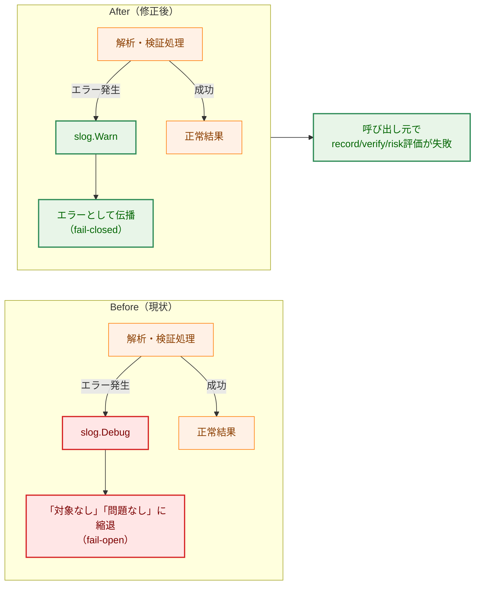
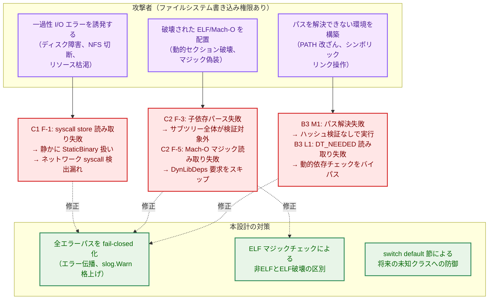
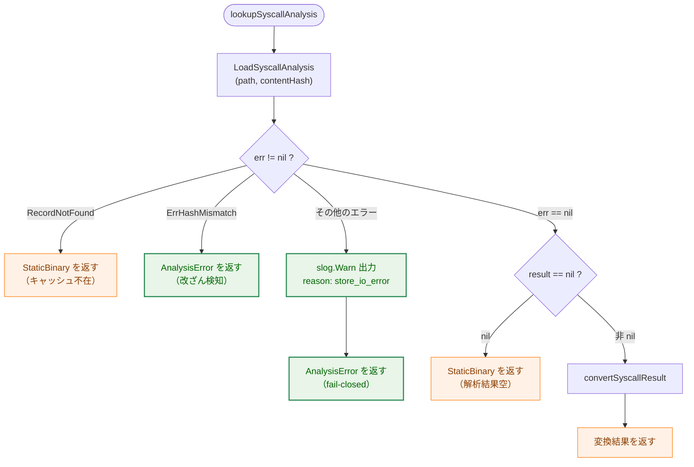
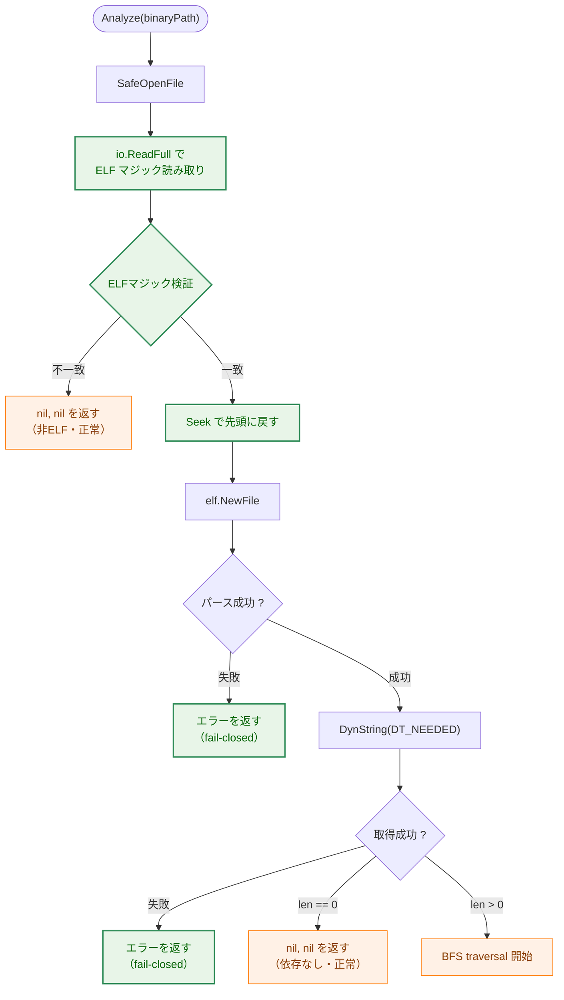
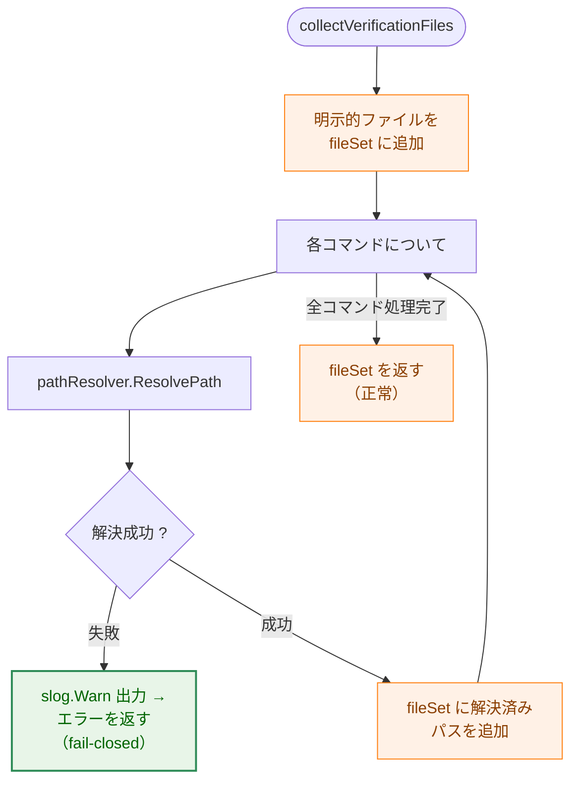

# アーキテクチャ設計書: エラー処理の縮退による fail-open パターンの横断修正（残件）

## Document Status

| Item | Value |
|---|---|
| Status | `draft` |
| Created | 2026-07-19 |
| Review date | - |
| Reviewer | - |
| Comments | - |

## 関連ドキュメント

- 要件定義書: [01_requirements.md](./01_requirements.md)
- セキュリティアーキテクチャ: [security-architecture.md](../../dev/architecture_design/security-architecture.md)

---

## 1. 設計の全体像

### 1.1 設計原則

本設計の核心は、以下の1つの設計原則に集約される:

> **「解析不能・エラー」と「対象なし・問題なし」を型／制御フロー上で区別し、前者を一律 fail-closed に倒す。**

現状コードには、エラーをログ出力のみで握りつぶし「依存なし」「ネットワーク機能なし」「検証成功」に縮退させる fail-open パターンが、6つの異なるパッケージに横断的に存在する。本設計では、これら6箇所すべてに対して一貫した修正を適用する。

具体的には:
- エラーハンドリングの `default` 節 / `slog.Debug` 握りつぶし を `slog.Warn` へ格上げし、エラーを呼び出し元へ伝播させる。
- `(false, nil)` や `(nil, nil)` で「問題なし」と偽る箇所を、`(false, err)` またはエラー伝播に変更する。
- `switch` 文に `default` 節を追加し、未知の値が追加された場合の安全側への倒れ込みを保証する。

### 1.2 概念モデル

**矢印の意味**: 矢印 A → B は「A の後に B が実行される（制御フロー）」を表す。

| 解析結果 | 制御判断 |
|---|---|
| 解析成功 + 危険検出あり | fail-closed（危険として報告） |
| 解析成功 + 危険検出なし | 安全（そのまま通過） |
| 解析不能・エラー | fail-closed（危険とみなして拒否） |

---

## 2. システム構成

### 2.1 修正対象パッケージの関係

| 修正対象パッケージ | 修正対象関数 | 所見 ID | 呼び出し元 |
|---|---|---|---|
| `internal/security/elfanalyzer/` | `standard_analyzer.go` — `lookupSyscallAnalysis` | C1 F-1 | `AnalyzeNetworkSymbols` |
| `internal/dynlib/elfdynlib/` | `analyzer.go` — `Analyze`, `parseELFDeps` | C2 F-3 | record コマンド（dynlib 解析） |
| `internal/dynlib/machodylib/` | `analyzer.go` — `parseMachODeps`, `HasDynamicLibDeps` | C2 F-3, C2 F-5 | record コマンド / runner（dynlib 解析 / ErrDynLibDepsRequired 判定） |
| `internal/verification/` | `manager.go` — `collectVerificationFiles`, `hasDynamicLibraryDeps` | B3 M1, B3 L1 | runner（group_executor） |
| `internal/runner/base/risk/` | `evaluator.go` — `applyBinaryAnalysis` | A5 Low-3 | `EvaluateRisk` |

### 2.2 コンポーネント配置

| 修正対象ファイル | 修正対象関数 | 所見 ID | 修正内容概要 |
|---|---|---|---|
| `internal/security/elfanalyzer/standard_analyzer.go` | `lookupSyscallAnalysis` | C1 F-1 | `default` エラーを fail-closed 化 |
| `internal/dynlib/elfdynlib/analyzer.go` | `Analyze`, `parseELFDeps` | C2 F-3 | 子依存パース失敗・トップレベルエラーを fail-closed 化 |
| `internal/dynlib/machodylib/analyzer.go` | `Analyze`, `HasDynamicLibDeps` | C2 F-3, C2 F-5 | `parseMachODeps` 失敗を fail-closed 化、`Seek`/`io.ReadFull` 失敗を fail-closed 化 |
| `internal/verification/manager.go` | `collectVerificationFiles`, `hasDynamicLibraryDeps` | B3 M1, B3 L1 | パス解決失敗・`DynString` エラーを fail-closed 化 |
| `internal/runner/base/risk/evaluator.go` | `applyBinaryAnalysis` | A5 Low-3 | `default` 節追加 |

---

## 3. コンポーネント設計

### 3.1 C1 F-1: `lookupSyscallAnalysis` の fail-closed 化

#### 3.1.1 現状

`standard_analyzer.go:297-332` の `lookupSyscallAnalysis` は、`LoadSyscallAnalysis` の戻り値エラーを以下の3ケースに分岐する:

1. `ErrRecordNotFound`: キャッシュ不在 → `StaticBinary` を返す（正常なフォールバック）。
2. `ErrHashMismatch`: ハッシュ不一致 → `AnalysisError` を返す（fail-closed、改ざん検知）。
3. `default`: 想定外の I/O エラー等 → `slog.Debug` でログ出力し、`StaticBinary` として素通りする（fail-open）。

`default` ケースで `StaticBinary` が返ると、呼び出し元の `AnalyzeNetworkSymbols` はこれを「ストアにエントリなし」と同一視し、`NoNetworkSymbols` へフォールスルーする。verify 時の一過性 I/O エラーでネットワーク syscall 検出が漏れる可能性がある。

#### 3.1.2 修正後

`default` 節の挙動を変更する:
- ログレベルを `slog.Debug` から `slog.Warn` に格上げする。
- 戻り値を `binaryanalyzer.AnalysisError`（fail-closed）に変更する。
- エラー文脈は `ErrSyscallAnalysisHighRisk` によるラップで上位に伝播させる。

運用上のトレーサビリティを確保するため、ログ出力には `"reason"` 構造化フィールドを追加し、値 `"store_io_error"` を設定する。これにより、オンコールエンジニアがログから「インフラ障害」と「本物のセキュリティ検知（`ErrSyscallAnalysisHighRisk` に一致するケース）」を区別できる。

> **設計判断**: 既存の `ErrHashMismatch` ケースが使う `ErrSyscallHashMismatch` と、新しい `default` ケースが使う `ErrSyscallAnalysisHighRisk` は異なる sentinel error である。呼び出し元は `errors.Is(err, ErrSyscallHashMismatch)` でハッシュ不一致（改ざん検知）を、`errors.Is(err, ErrSyscallAnalysisHighRisk)` で解析系エラー（I/O 障害または高リスク検知）を区別できる。両者とも `AnalysisError` を返す点で制御フロー上の fail-closed 動作は同一だが、エラー種別の区別は監視・アラート設計に必要である。

#### 3.1.3 責務表

| ファイル | 関数/構造体 | 責務 | 変更種別 |
|---|---|---|---|
| `internal/security/elfanalyzer/standard_analyzer.go` | `lookupSyscallAnalysis` | syscall analysis store の検索。想定外エラーを fail-closed（AnalysisError）で返す | 修正 |
| `internal/security/elfanalyzer/standard_analyzer.go` | `AnalyzeNetworkSymbols` | 呼び出し元。AnalysisError を受け取った場合の既存の挙動で正しく動作する | 変更不要 |
| `internal/security/elfanalyzer/analyzer_test.go` | `TestLookupSyscallAnalysis_StoreIOError` | 新規追加 | 追加 |

#### 3.1.4 インタフェース変更

なし。`lookupSyscallAnalysis` は非公開関数であり、戻り値の型（`binaryanalyzer.AnalysisOutput`）も変更しない。

#### 3.1.5 呼び出し元への影響

`lookupSyscallAnalysis` の呼び出し元（`AnalyzeNetworkSymbols`、同ファイル:168-195）は、既に `AnalysisError` を正しく上位に伝播するコードパスを持つため、追加の変更は不要である。

---

### 3.2 C2 F-3: 子依存パース失敗の fail-closed 化

#### 3.2.1 現状（ELF側）

**トップレベル解析**（`elfdynlib/analyzer.go:115-127`）: `elf.NewFile` 失敗・`DynString(DT_NEEDED)` エラーをいずれも `nil, nil`（依存なし）に縮退する（`//nolint:nilerr`）。

**BFS traversal 中の子依存パース失敗**（`elfdynlib/analyzer.go:207-218`）: `ErrDTRPATHNotSupported` のみ上位に伝播し、それ以外のパース失敗は `slog.Debug` + `continue` で子の traversal をスキップする（fail-open）。

#### 3.2.2 現状（Mach-O側）

**BFS traversal 中の子依存パース失敗**（`machodylib/analyzer.go:215-221`）: `slog.Debug` + `continue` で子の traversal をスキップする（fail-open）。

#### 3.2.3 修正後

**ELF トップレベル解析**: ELF マジックチェックを導入する。`elfdynlib` パッケージ内に `isELFMagic` 関数と ELF マジックバイト定数を新規定義する（`elfanalyzer` への新規依存を避けるため、パッケージ内で独立して定義する）。処理の分岐は以下のとおり:

1. ファイル先頭から ELF マジック（4 バイト）を読み取る。読み取りに失敗するかマジックが不一致の場合は、非 ELF ファイルとして `nil, nil` を返す（正常系のスクリプト等に対応）。
2. マジック一致時は、Seek で先頭に戻したのち `elf.NewFile` を試行する。`elf.NewFile` 失敗時はエラーを返す（fail-closed）。
3. `elf.NewFile` 成功時は `DynString(DT_NEEDED)` を試行する。エラー時はエラーを返す（fail-closed）。`len(needed) == 0` の時のみ `nil, nil` を返す（依存なし・正常）。

> **なぜ既存の単純なアプローチでは要件を満たせないか**: 現在の ELF `Analyze` は `elf.NewFile` の失敗を一律 `nil, nil`（依存なし）に縮退させている。AC-05 は「ELF マジックを持つファイルのパース失敗をエラーとして区別すること」を要求しているため、単純にエラーを返すだけでは不十分であり、非 ELF ファイル（スクリプト等）の正常系パスを維持するためのマジックチェックが必須である。

**BFS traversal 中の子依存パース失敗（ELF・Mach-O 共通）**: `slog.Debug` を `slog.Warn` に格上げし、`continue` を `return nil, err`（ELF）/ `return nil, nil, err`（Mach-O）に変更する。ログ出力には `"reason": "child_parse_error"` 構造化フィールドを追加する。

**C2 F-3 の影響範囲（blast radius）**: BFS traversal 中に1つの子依存パースが失敗すると、当該バイナリの **全依存の記録が失敗** する（AC-04 が「解析全体の失敗」を要求しているため）。依存ツリーの一部に破壊された `.so` / `.dylib` が1つでも含まれると、当該バイナリの record 全体が失敗する。実運用への影響:
- `/usr/lib` の1つの共有ライブラリの破損が、それに依存する多数のバイナリの record を阻害しうる。
- 対応策として、エラーメッセージに失敗した子ライブラリのパスを明示し、どのファイルが原因かを運用者が特定できるようにする。

#### 3.2.4 責務表

| ファイル | 関数/構造体 | 責務 | 変更種別 |
|---|---|---|---|
| `internal/dynlib/elfdynlib/analyzer.go` | `Analyze` | ELF トップレベル解析。マジックチェック導入、エラー伝播 | 修正 |
| `internal/dynlib/elfdynlib/analyzer.go` | `Analyze`（BFSループ内） | 子依存パース失敗をエラー伝播 | 修正 |
| `internal/dynlib/machodylib/analyzer.go` | `Analyze`（BFSループ内） | 子依存パース失敗をエラー伝播 | 修正 |
| `internal/dynlib/elfdynlib/analyzer_test.go` | `TestAnalyze_TopLevelELFMagicMismatch` 他 | 新規追加 | 追加 |
| `internal/dynlib/elfdynlib/analyzer_test.go` | `TestAnalyze_ChildParseFailure` | 新規追加 | 追加 |
| `internal/dynlib/machodylib/analyzer_test.go` | `TestAnalyze_ChildParseFailure` | 新規追加 | 追加 |

#### 3.2.5 インタフェース変更

なし。`Analyze` の戻り値シグネチャ（ELF: `([]fileanalysis.LibEntry, error)`、Mach-O: `([]fileanalysis.LibEntry, []AnalysisWarning, error)`）は変更しない。エラー伝播は既存のエラーリターンパスを使用する。

#### 3.2.6 呼び出し元への影響

- `Analyze` の呼び出し元（`cmd/record/main.go` 経由の `filevalidator`）は、既に `Analyze` のエラーを record 失敗として扱っているため、追加の変更は不要。
- ただし、これまでエラーを握りつぶして続行していたケースがエラーになるため、実運用環境で一過性の I/O エラー等により record が失敗する可能性が増加する。このリスクは `01_requirements.md` の「リスクと留意事項」で既に特定されており、ユーザー向けエラーメッセージの品質確保と、構造化ログによる原因特定容易性の向上が実装時の課題となる。
- 既存テストのうち、破壊された ELF ファイルや不正な Mach-O ファイルの解析が「エラーとして返る」ことを期待していないテスト（もし存在すれば）は、修正が必要。
  - `internal/dynlib/elfdynlib/analyzer_test.go`: AC-04/AC-05/AC-06 に対応する fail-closed テストを新規追加する（既存テストの修正は不要と見込まれる）。
  - `internal/dynlib/machodylib/analyzer_test.go`: 同上（AC-06 に対応するテストを新規追加）。

---

### 3.3 C2 F-5: `HasDynamicLibDeps` の fail-closed 化

#### 3.3.1 現状

`machodylib/analyzer.go:617-632` の単一アーキテクチャ Mach-O パスでは、`Seek` 失敗（2箇所）と `io.ReadFull` 失敗がいずれも `return false, nil`（fail-open）に縮退する。`HasDynamicLibDeps` は runner 側で `ErrDynLibDepsRequired` をトリガするゲートであり、I/O エラーを誘発できる状況ではこのゲートが黙ってスキップされ得る。

#### 3.3.2 修正後

- `Seek` 失敗（2箇所）: I/O エラーとしてエラーを返す。
- `io.ReadFull` 失敗: `io.EOF` / `io.ErrUnexpectedEOF` はファイルが Mach-O ヘッダ長（4バイト）に満たないことを示し、非 Mach-O ファイルの正常ケースであるため `(false, nil)` を返す。それ以外のエラーは I/O エラーとしてエラーを返す（fail-closed）。
- ログ出力には `"reason": "io_error"` 構造化フィールドを追加する。

> **Seek/ReadFull でのディスクリプタ再利用**: `HasDynamicLibDeps` の既存実装では、`Seek` の型アサーション `file.(io.Seeker)` に失敗すると Seek ブロック全体がスキップされる（fail-open）。これは `safefileio.SafeOpenFile` が返す File が常に `io.Seeker` を実装するため、通常は発生しない。ただし、将来 `safefileio` の File 型が `io.Seeker` を実装しなくなった場合、このコードパスで ELF/Mach-O マジックが読み取れず、分析不能になる。このリスクは現在の実装では顕在化しないが、`safefileio` の変更時に注意が必要である。

#### 3.3.3 責務表

| ファイル | 関数/構造体 | 責務 | 変更種別 |
|---|---|---|---|
| `internal/dynlib/machodylib/analyzer.go` | `HasDynamicLibDeps` | Mach-O バイナリの動的依存有無判定。I/O エラーをエラー伝播 | 修正 |
| `internal/dynlib/machodylib/analyzer_test.go` | `TestHasDynamicLibDeps_SeekError` | 新規追加 | 追加 |
| `internal/dynlib/machodylib/analyzer_test.go` | `TestHasDynamicLibDeps_ReadFullError` | 新規追加 | 追加 |

#### 3.3.4 インタフェース変更

なし。`HasDynamicLibDeps` の戻り値シグネチャ `(bool, error)` は変更しない。

#### 3.3.5 呼び出し元への影響

- `internal/verification/manager.go:725` の `hasMachODynamicLibraryDeps` は `HasDynamicLibDeps` のエラーを既に上位に伝播しているため、追加の変更は不要。
- 既存テストは normal FileSystem を使用し、エラー注入は行っていないため、修正不要。

---

### 3.4 B3 M1: `collectVerificationFiles` の fail-closed 化

#### 3.4.1 現状

`verification/manager.go:264-277` の `collectVerificationFiles` は、`pathResolver.ResolvePath` の失敗を `slog.Warn` + `continue` で握りつぶし、当該コマンドを検証対象集合から静かに除外する。`collectVerificationFiles` の戻り値は `map[string]struct{}` であり、エラーを返せないシグネチャである。

#### 3.4.2 修正後

`collectVerificationFiles` のシグネチャを `(map[string]struct{}, error)` に変更する。パス解決失敗時は `slog.Warn` を出力した上でエラーを返す（fail-closed）。

呼び出し元 `VerifyGroupFiles`（同ファイル:196）は、`collectVerificationFiles` の戻り値エラーをチェックし、`OpError` にラップして上位に伝播する。`VerifyGroupFiles` の外部シグネチャ（`(*Result, error)`）は変更不要である。

ログ出力には `"reason": "path_resolution_failed"` 構造化フィールドを追加する。

#### 3.4.3 責務表

| ファイル | 関数/構造体 | 責務 | 変更種別 |
|---|---|---|---|
| `internal/verification/manager.go` | `collectVerificationFiles` | 検証対象ファイルの収集。戻り値の型に `error` を追加、パス解決失敗をエラー伝播 | 修正 |
| `internal/verification/manager.go` | `VerifyGroupFiles` | 呼び出し元。エラーハンドリングを追加 | 修正 |
| `internal/verification/manager_test.go` | `TestCollectVerificationFiles_PathResolutionFailure` | 新規追加 | 追加 |

#### 3.4.4 インタフェース変更

`collectVerificationFiles` は非公開関数であり、公開インタフェースへの影響はない。`VerifyGroupFiles`（公開メソッド）の外部シグネチャは変更なし。

#### 3.4.5 呼び出し元への影響

- `VerifyGroupFiles` の直接の呼び出し元（`internal/runner/group_executor.go`）は、既に `VerifyGroupFiles` のエラーを上位に伝播しているため、追加の変更は不要。
- `internal/verification/manager_test.go`: `TestVerifyGroupFiles_*` 系のテストで、パス解決不可能なコマンドを含むグループの検証がエラーを返すようになる。AC-11/AC-12/AC-13 に対応するテストケースを新規追加する。

---

### 3.5 B3 L1: `hasDynamicLibraryDeps` の fail-closed 化

#### 3.5.1 現状

`verification/manager.go:711-715` の `hasDynamicLibraryDeps` は、`elfFile.DynString(elf.DT_NEEDED)` のエラーを `(false, nil)`（依存なし）に縮退する（fail-open）。動的セクションが破壊された ELF は `ErrDynLibDepsRequired` を回避し、dynlib 検証要求をバイパスし得る。

#### 3.5.2 修正後

`DynString` のエラーと `len(needed) == 0` を分離する:
- `DynString` エラー時: `(false, err)` を返す（fail-closed）。
- `len(needed) == 0` 時: `(false, nil)` を返す（依存なし・正常）。
- `len(needed) > 0` 時: `(true, nil)` を返す（依存あり）。

#### 3.5.3 責務表

| ファイル | 関数/構造体 | 責務 | 変更種別 |
|---|---|---|---|
| `internal/verification/manager.go` | `hasDynamicLibraryDeps` | ELF バイナリの動的依存有無判定。DynString エラーをエラー伝播 | 修正 |
| `internal/verification/manager_test.go` | `TestHasDynamicLibraryDeps_DynStringError` | 新規追加 | 追加 |

#### 3.5.4 インタフェース変更

なし。`hasDynamicLibraryDeps` は非公開関数であり、戻り値シグネチャ `(bool, error)` は変更しない。

#### 3.5.5 呼び出し元への影響

- `verifyDynLibDeps`（同ファイル:664）は `hasDynamicLibraryDeps` のエラーを `fmt.Errorf` でラップして上位に伝播しているため、追加の変更は不要。
- `verifyDynLibDeps` の呼び出し元 `VerifyCommandDynLibDeps`（同ファイル:592）は、このエラーを `VerifyCommandChains` → `group_executor` へ伝播する。dry-run モード時、`group_executor` は検証エラーを `ResultCollector` に記録し、致命的エラーとしては扱わない既存のパスが存在する。したがって、B3 L1 の修正は dry-run モードの非致命的挙動を変更しない。

---

### 3.6 A5 Low-3: `applyBinaryAnalysis` の `default` 節追加

#### 3.6.1 現状

`evaluator.go:461-477` の `applyBinaryAnalysis` は、`BinaryAnalysisClass` の switch で `Uncertain`/`HighRisk`/`Network`/`Clean` の4定数のみを列挙し、`default` 節がない。将来クラスが追加された場合、switch を素通りして無寄与（実質 Clean 扱い）になる。

> **既存テストがアサートする挙動**: `internal/runner/base/risktypes/types_test.go:16-28`（`TestBinaryAnalysisClass_ZeroValueIsUncertain`）はゼロ値が `BinaryAnalysisUncertain` であることを確認している。このテストは型の定義に対する静的アサーションであり、修正後も変更不要である。

#### 3.6.2 修正後

`default` 節を追加する。既存の `Uncertain` ケースと同様に `blockingAssessment("", "")` を用いて Blocking を返す。ReasonCodes は `result.ReasonCodes` を引き継ぐ。

新規の ReasonCode や ErrorClass の追加は不要であり、既存の空文字パターン（`blockingAssessment("", "")`）を踏襲する。これは既存の `Uncertain` ケースと完全に同一のシグネチャであり、両者の Blocking 挙動は一致する。

- 戻り値の型: `*risktypes.RiskAssessment`（nil でない Blocking アセスメント）
- 既存4クラスの挙動: 変更なし

#### 3.6.3 責務表

| ファイル | 関数/構造体 | 責務 | 変更種別 |
|---|---|---|---|
| `internal/runner/base/risk/evaluator.go` | `applyBinaryAnalysis` | バイナリ解析結果のリスク評価。`default` 節で未知クラスを Blocking に倒す | 修正 |
| `internal/runner/base/risk/evaluator_test.go` | `TestApplyBinaryAnalysis_UnknownClass` | 新規追加 | 追加 |

#### 3.6.4 インタフェース変更

なし。`applyBinaryAnalysis` は非公開関数であり、戻り値シグネチャは変更しない。

#### 3.6.5 呼び出し元への影響

- `evaluateDimensions`（同ファイル:337）は `applyBinaryAnalysis` の `blocked` 戻り値（非 nil）を既に正しく処理しているため、追加の変更は不要。
- 既存の4クラスに関するテストは影響を受けない（AC-18）。

---

## 4. エラーハンドリング設計

### 4.1 共通パターン

全6箇所の修正に共通するエラーハンドリングパターン:

1. `slog.Debug` による握りつぶし → `slog.Warn` へ格上げ
2. エラーを握りつぶして「問題なし」を返す → エラーを呼び出し元に伝播
3. `switch` の `default` なし → `default` 節で fail-closed

### 4.2 エラーメッセージと構造化ログ設計

各修正箇所では、`slog.Warn` の出力に以下の構造化フィールドを追加し、オンコールエンジニアがログのみから障害のカテゴリを特定できるようにする:

| 修正箇所 | `"reason"` フィールド値 | エラーメッセージの方向性 |
|---|---|---|
| C1 F-1 | `"store_io_error"` | syscall store の想定外 I/O エラーを区別 |
| C2 F-3 (ELF child) | `"child_parse_error"` | 子 ELF パース失敗を区別 |
| C2 F-3 (Mach-O child) | `"child_parse_error"` | 子 Mach-O パース失敗を区別 |
| C2 F-5 | `"io_error"` | Seek/ReadFull 失敗を区別 |
| B3 M1 | `"path_resolution_failed"` | コマンドパス解決失敗を区別 |
| B3 L1 | 構造化ログなし（エラー伝播のみ） | DynString エラーは fmt.Errorf ラップで上位に伝播 |

### 4.3 新規エラー型

新規のエラー型は導入しない。既存のエラー型を以下のとおり再利用する:

| 修正箇所 | 使用する既存型 / パターン |
|---|---|
| C1 F-1 | `binaryanalyzer.AnalysisOutput{Result: binaryanalyzer.AnalysisError}`, `ErrSyscallAnalysisHighRisk` によるラップ |
| C2 F-3 | `fmt.Errorf("...: %w", err)` によるラップ |
| C2 F-5 | `fmt.Errorf("...: %w", err)` によるラップ |
| B3 M1 | `OpError` によるラップ |
| B3 L1 | `fmt.Errorf("...: %w", err)` によるラップ |
| A5 Low-3 | `blockingAssessment("", "")` — 既存の `Uncertain` ケースと同一パターン |

### 4.4 一過性 I/O エラーへの対応

本修正により、一過性の I/O エラー（NFS 切断、ディスク I/O エラー、tmpfs バックプレッシャー等）が発生した場合、各処理が fail-closed（エラー伝播）に倒れる。本設計では以下の理由からリトライループやサーキットブレーカーパターンを導入しない:

1. **セキュリティクリティカルパスにおける再試行の危険性**: 検証・解析が失敗した場合、再試行によって偶然成功しても、その間にファイルが改ざんされた可能性を排除できない。fail-closed で即座に停止することが安全側の挙動である。
2. **OS/ファイルシステムレベルの再試行**: I/O エラーの多くは OS カーネルまたは NFS クライアントが透過的に再試行する。Go の `os` パッケージに到達するエラーは、OS レベルで回復不能と判断されたものである。
3. **運用側の対応**: 一時的な環境障害（NFS マウントの再マウント、ディスク容量の回復等）は、運用者が環境を修復した後に record/verify を再実行することで対応する。これにより、意図しないタイミングでの再試行によるセキュリティ境界の曖昧化を回避する。

---

## 5. セキュリティ考慮事項

### 5.1 脅威モデル

**矢印の意味**: 実線矢印 A → B は「攻撃シナリオ A が脆弱性 B を突く」、点線矢印 A -→ B は「脆弱性 A が対策 B によって修正される」ことを表す。

#### Legend
| Class | 意味 |
|---|---|
| `threat`（紫） | 攻撃者 / 攻撃手法 |
| `enhanced`（緑） | 修正対象コンポーネント / 対策 |
| `problem`（赤） | 問題のある既存コード / 脆弱性 |

### 5.2 セキュリティ設計パターン

本設計は、以下の既存セキュリティアーキテクチャ原則に完全に合致する:

- **Fail-Safe Design**（[security-architecture.md](../../dev/architecture_design/security-architecture.md) 第3節）: 「Default deny for all operations」を全エラーパスに適用する。
- **Defense-in-Depth**: 本修正は防御層の一貫性を高めるものであり、新たな防御層を追加するものではない。
- **fail-closed の一貫性**: 既に fail-closed として実装されている `ErrHashMismatch` ケースと、今回 fail-closed 化する `default` ケースの間にあった非対称性を解消する。

### 5.3 副作用と影響範囲

- **record/verify の失敗率上昇**: これまでエラーを握りつぶして続行していた環境（一過性の I/O エラー等）では、record/verify が失敗するようになる。ユーザーへの影響を最小化するため、エラーメッセージは具体的な原因（どのファイルの、どの操作が、どのような理由で失敗したか）を含める。構造化ログフィールド（§4.2）により、オンコールエンジニアは障害カテゴリをプログラム的に特定できる。
- **C2 F-3 BFS traversal の影響範囲**: 依存ツリー中の1つの破壊されたライブラリが、当該バイナリの全依存記録を失敗させる（§3.2.3 参照）。
- **dry-run モード**: 本修正は dry-run モードにおいて以下の挙動となる:
  - C1 F-1, C2 F-3, C2 F-5, B3 L1: 修正対象関数がエラーを返した場合、呼び出し元の group_executor は検証エラーを `ResultCollector` に記録し、dry-run では致命的エラーとして扱わない（既存の dry-run パスがこの挙動を維持する）。
  - B3 M1: `VerifyGroupFiles` の `collectVerificationFiles` エラーは `OpError` として返る。group_executor の dry-run パスは `VerifyGroupFiles` のエラーを `ResultCollector` に記録し、プレビュー継続が可能である。
  - dry-run と runtime の間で、一過性 I/O エラーにより結果が分岐する可能性は存在する。しかし、これは fail-closed 方針の不可避の帰結である。すなわち、fail-closed の定義上 dry-run は失敗を報告する側に倒れるため、dry-run が「安全」と報告した後に runtime が失敗することは起こらない。
- **後方互換性**: 正常系（エラーが発生しないケース）の挙動は変更されない。すべての AC が正常系のリグレッション防止を要求している。

### 5.4 ロールアウト安全性

本修正のデプロイにあたり、以下のリスクと推奨手順を考慮する:

- **record データの再取得**: C2 F-3 修正後、依存ツリーに破壊されたライブラリを含むバイナリの record が新たに失敗するようになる。デプロイ前に、影響を受けるバイナリを特定するために、修正後のバイナリで `record --dry-run` を実行し、失敗するバイナリの一覧を事前に取得することを推奨する。
- **段階的ロールアウト**: strict/lenient モードのトグルは本設計では提供しない（YAGNI）。fail-closed への移行は一括で行い、事前テストで影響範囲を確認する。
- **アラート設計**: C1 F-1 の `"reason": "store_io_error"` ログに対するアラートを設定し、syscall store の I/O 障害を検知できるようにする。

---

## 6. 処理フロー詳細

### 6.1 C1 F-1: `lookupSyscallAnalysis` のエラーハンドリングフロー

**矢印の意味**: 矢印 A → B は「A の判定結果により B の処理が実行される」ことを表す。`enhanced` クラス（緑）のノードが修正後の追加/変更部分。

#### Legend
| Class | 意味 |
|---|---|
| `process`（橙） | 既存の挙動（変更なし） |
| `enhanced`（緑） | 修正対象の挙動 |

### 6.2 C2 F-3: ELF `Analyze` のトップレベルフロー

**矢印の意味**: 矢印 A → B は「A の次に B が実行される」ことを表す。`enhanced` クラス（緑）のノードが修正後の追加/変更部分。

#### Legend
| Class | 意味 |
|---|---|
| `process`（橙） | 既存の挙動（変更なし） |
| `enhanced`（緑） | 修正対象の挙動 |

### 6.3 B3 M1: `collectVerificationFiles` のフロー

**矢印の意味**: 矢印 A → B は「A の次に B が実行される」ことを表す。`enhanced` クラス（緑）のノードが修正後の変更部分。

#### Legend
| Class | 意味 |
|---|---|
| `process`（橙） | 既存の挙動（変更なし） |
| `enhanced`（緑） | 修正対象の挙動 |

---

## 7. テスト戦略

### 7.1 単体テスト戦略

各修正箇所に対して、以下のカテゴリのテストを追加する:

| AC | テスト対象 | テスト種別 | テスト内容 |
|---|---|---|---|
| AC-01 | `lookupSyscallAnalysis` | 単体 | 想定外エラー時に `AnalysisError` が返ること |
| AC-02 | `lookupSyscallAnalysis` | 単体 | `RecordNotFound` 時に `StaticBinary` が返ること（既存挙動維持） |
| AC-03 | `lookupSyscallAnalysis` | 単体 | 想定外エラー時に `slog.Warn` レベル以上のログが出力されること |
| AC-04 | `elfdynlib.Analyze`（BFS traversal） | 単体 | 子 ELF パース失敗がエラーとして伝播すること |
| AC-05 | `elfdynlib.Analyze`（トップレベル） | 単体 | ELF マジックあり + パース失敗がエラーとして伝播すること、非ELF は nil, nil が返ること |
| AC-06 | `machodylib.Analyze`（BFS traversal） | 単体（darwin ビルドタグ） | 子 Mach-O パース失敗がエラーとして伝播すること |
| AC-07 | `elfdynlib.Analyze`, `machodylib.Analyze` | 単体 + 統合 | 正常系（依存あり/なし、多階層依存）が従来どおり成功すること |
| AC-08 | `HasDynamicLibDeps` | 単体（darwin ビルドタグ） | `Seek` 失敗時に `(false, err)` が返ること |
| AC-09 | `HasDynamicLibDeps` | 単体（darwin ビルドタグ） | `io.ReadFull` 失敗（非EOF）時に `(false, err)` が返ること |
| AC-10 | `hasMachODynamicLibraryDeps` | 単体 | AC-08/AC-09 のエラーが上位に伝播すること |
| AC-11 | `collectVerificationFiles` | 単体 | パス解決失敗時にエラーが返ること |
| AC-12 | `VerifyGroupFiles` | 単体 | パス解決失敗により検証なし実行経路が存在しないこと |
| AC-13 | `VerifyGroupFiles` | 単体 | 正常系のパス解決が従来どおり成功すること |
| AC-14 | `hasDynamicLibraryDeps` | 単体 | `DynString` エラー時に `(false, err)` が返ること |
| AC-15 | `verifyDynLibDeps` | 単体 | `hasDynamicLibraryDeps` のエラーが検証失敗として伝播すること |
| AC-16 | `hasDynamicLibraryDeps` | 単体 | DT_NEEDED なし（正常系）が `(false, nil)` を返すこと |
| AC-17 | `applyBinaryAnalysis` | 単体 | 未知クラスが Blocking を返すこと |
| AC-18 | `applyBinaryAnalysis` | 単体 | 既存4クラスの挙動が変更されないこと |

### 7.2 テストファイル構成

- `internal/security/elfanalyzer/analyzer_test.go`: AC-01, AC-02, AC-03 のテストを追加
- `internal/dynlib/elfdynlib/analyzer_test.go`: AC-04, AC-05, AC-07 のテストを追加
- `internal/dynlib/machodylib/analyzer_test.go`: AC-06, AC-07, AC-08, AC-09 のテストを追加
- `internal/verification/manager_test.go`: AC-10, AC-11, AC-12, AC-13, AC-14, AC-15, AC-16 のテストを追加
- `internal/runner/base/risk/evaluator_test.go`: AC-17, AC-18 のテストを追加

### 7.3 統合テスト戦略

- 多階層依存・循環依存を持つ実バイナリに対する record/verify の正常系テスト（AC-07）
- 正常にパス解決できるコマンドのみで構成されるグループの検証テスト（AC-13）

### 7.4 セキュリティテスト戦略

- 破壊された ELF（DT_NEEDED セクション破壊）に対する `hasDynamicLibraryDeps` のエラー伝播確認
- syscall analysis store に対する I/O エラー注入テスト
- `applyBinaryAnalysis` への不正な `BinaryAnalysisClass` 値の注入テスト

---

## 8. 実装優先順位

### 8.1 フェーズ分割

| Phase | 修正箇所 | 依存関係 | リスク |
|---|---|---|---|
| Phase 1 | A5 Low-3（`applyBinaryAnalysis`） | なし | 低（`default` 節の追加のみ） |
| Phase 2 | B3 L1（`hasDynamicLibraryDeps`） | なし | 低（条件分岐の分離のみ） |
| Phase 3 | B3 M1（`collectVerificationFiles`） | なし | 中（シグネチャ変更あり） |
| Phase 4 | C1 F-1（`lookupSyscallAnalysis`） | なし | 低（`default` 節の変更のみ） |
| Phase 5 | C2 F-5（`HasDynamicLibDeps`） | なし | 低（エラー伝播追加のみ） |
| Phase 6 | C2 F-3（ELF/Mach-O 子依存パース） | なし | 中（マジックチェック導入あり） |

全フェーズは互いに独立しており、並行して実装可能である。

### 8.2 実装順序の根拠

フェーズを変更量とリスクで昇順に並べている。Phase 1（A5 Low-3: `default` 節追加のみ）から着手し、Phase 6（C2 F-3: マジックチェック導入）を最後にすることで、各修正の影響を個別に確認しながら進められる。

---

## 9. 将来の拡張性

### 9.1 設計上の考慮点

- **エラー型の統一**: 現状、各パッケージが独自のエラー型を使用している。将来的に「エラー握りつぶしによる fail-open」パターンを静的に検出する lint ルールを導入できるよう、エラーハンドリングのパターンを統一することが考えられる。ただし、本タスクのスコープ外であり、YAGNI の原則から本設計では扱わない。
- **slog.Warn の頻度**: ログレベルを `Debug` から `Warn` に格上げする箇所（AC-03, AC-04, AC-06）は、実運用上のログ出力量に影響を与えうる。`01_requirements.md` の非機能要件に従い、実装後にログ出力量の検証を行う必要がある。
- **パフォーマンス**: ELF `Analyze` のマジックチェックは、解析対象バイナリ1件あたり `io.ReadFull(4)` + `Seek(0, SeekStart)` の2回の追加 syscall を発生させる。1回の record 処理で数万のバイナリを解析するユースケースでは線形のオーバーヘッドとなるが、追加コストは1バイナリあたり O(1) であり、ハッシュ計算（ファイル全体の読み取り）に比べて無視できる。`safefileio.SafeOpenFile` が返す File は Linux/macOS ともに `io.Seeker` を実装しており、Seek の型アサーション失敗による分析不能化は発生しない。
- **未着手の類似パターン**:
  - `internal/filevalidator/validator.go` の `//nolint:nilerr` パターン（`validator.go:1587`: Symtab 不在を空スライスに縮退、`validator.go:1652`: Mach-O パース失敗を `nil, nil` に縮退）は、本タスクと同型の fail-open パターンである。これらは record パス（`cmd/record/main.go`）のみに影響し、verify 時の fail-open には該当しない。`01_requirements.md` のスコープ定義に従い本タスクでは対象外とするが、将来のタスクで対応可能である。
  - D1 (groupmembership) L-2/L-3: `01_requirements.md` スコープ外。未着手。

### 9.2 決定履歴

> 本設計は新規作成であり、削除・置換された過去の設計は存在しない。git 履歴を参照すること。
