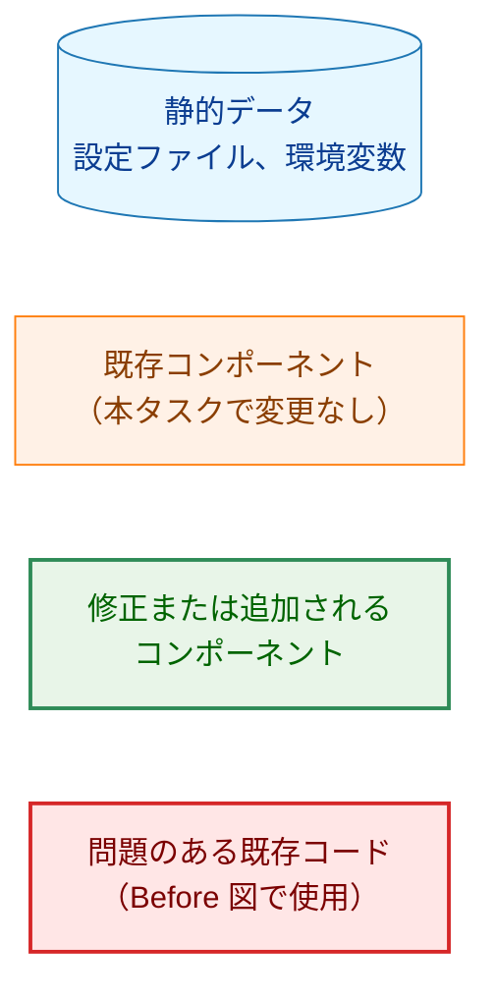
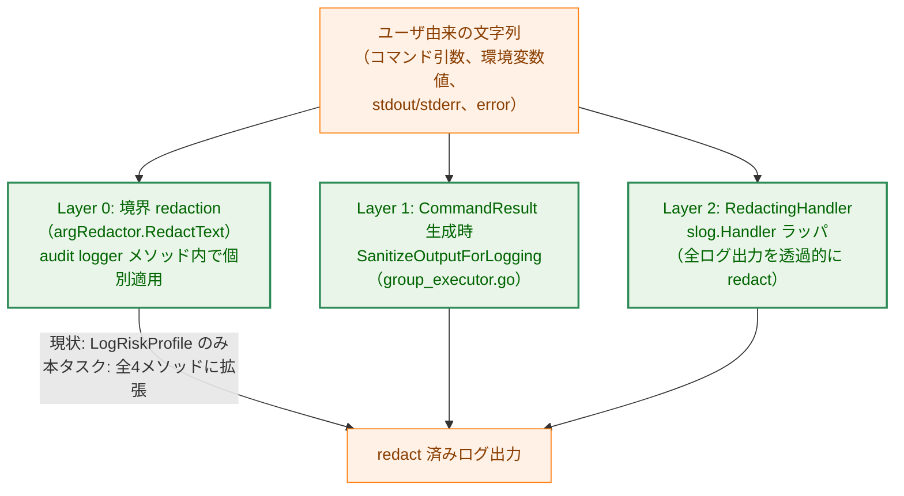
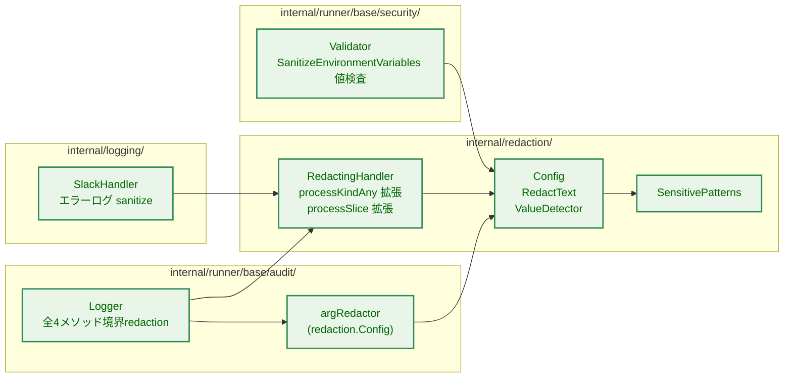
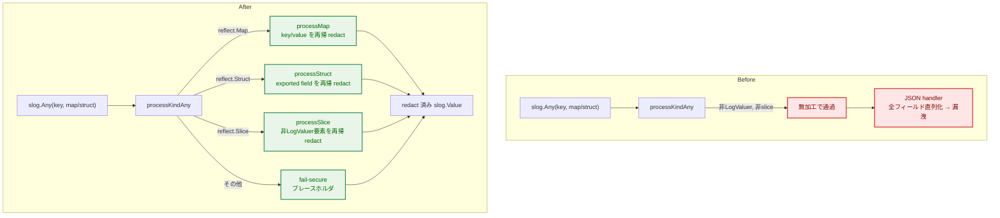
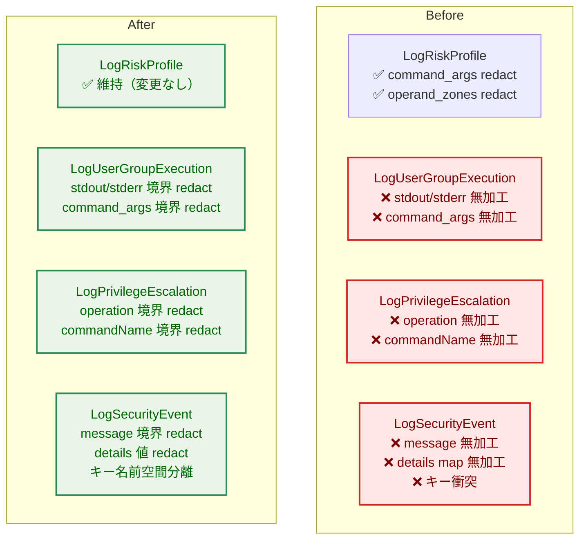
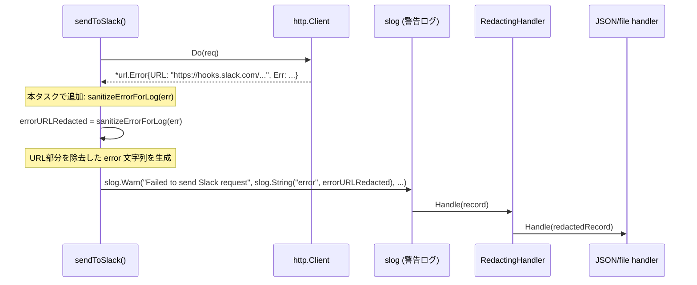
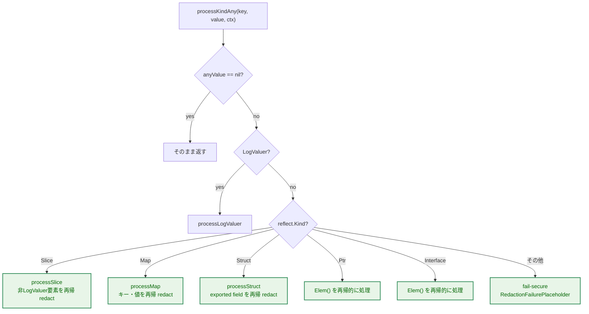
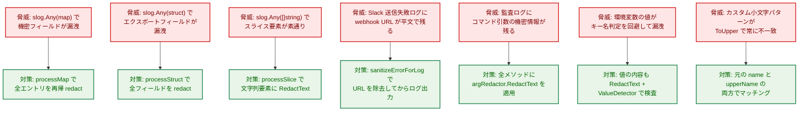
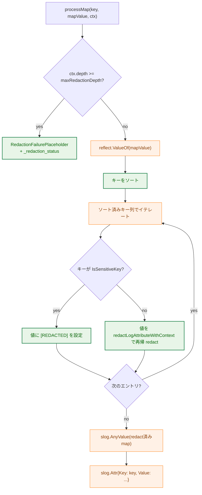
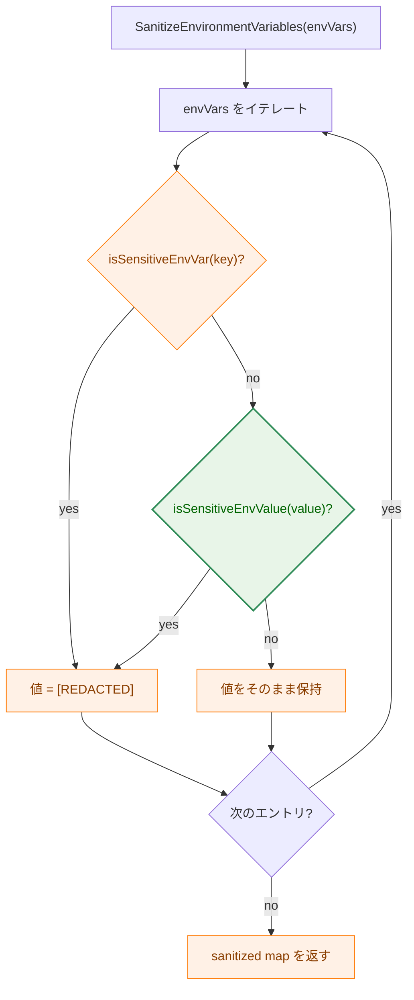

# アーキテクチャ設計書: redaction 境界の不統一を解消（メッセージ本文・map/slice・監査ログ）

## Document Status

| Item | Value |
|---|---|
| Status | `draft` |
| Created | 2026-07-20 |
| Review date | - |
| Reviewer | - |
| Comments | - |

## 凡例（本ドキュメント共通）



各図は本凡例のクラス定義に従う。個別の Legend ブロックは省略する。

## 1. 設計の全体像

### 1.1 設計原則

本タスクは、`internal/redaction`、`internal/logging`、`internal/runner/base/audit`、`internal/runner/base/security` の 4 パッケージに分布する redaction 欠落所見を統一的に解消する。設計は以下を原則とする。

1. **単一不変条件の確立**: 「audit/logging パッケージを通る文字列は必ず redaction される」という不変条件を全メソッドに適用する。
2. **既存パターンへの準拠**: `LogRiskProfile` が確立した境界 redaction（`argRedactor.RedactText`）のパターンを他メソッドに拡張する。新規メソッドや抽象化の導入は行わない。
3. **fail-secure の一貫性**: 既存の `RedactionFailurePlaceholder` フォールバック、`maxRedactionDepth` 制限、panic recovery の方針を全追加経路に適用する。
4. **API 後方互換性**: 公開メソッドのシグネチャを一切変更しない。呼び出し側の修正を必要としない形で redaction の適用範囲のみを拡張する。
5. **DRY**: 既存の `Config.RedactText`、`ValueDetector.Mask`、`SensitivePatterns` を再利用し、同等の redaction を別実装しない。

### 1.2 概念モデル

本設計が扱う redaction の防御線は以下の 3 層に分類される。



**矢印の意味**: INPUT → Layer は「その Layer が当該データに対して redaction を適用する」ことを表す。Layer → OUTPUT は「redaction 済みデータが下流（ログファイル・syslog・Slack）へ到達する」ことを表す。

**補足**: Layer 0（境界 redaction）は `RedactingHandler` 非経由の logger へ出力する際の安全網である。また、0143 タスクの設計判断により、`slog.Any` の map/struct/slice 要素に対しては Layer 0 が唯一の防御線でもあった。本タスクの F-001（`processKindAny` の map/struct 再帰）と F-002（`processSlice` の非 LogValuer 要素再帰）により、`slog.Any` で渡されたスカラ map/struct だけでなく、`chain`（`[]map[string]string`）や `operand_zones`（`[]map[string]any`）のようなスライス内包 map の要素に至るまで Layer 2 が再帰的に redact するようになる。これにより境界 redaction は「唯一の防御線」から「Layer 2 と重複する防御線（defense-in-depth）」に位置づけが変わる。

### 1.3 不変条件マップ

| 不変条件 | 現状 | 本タスク後 |
|---|---|---|
| `slog.Any` の map/struct 要素が redaction を素通りしない | 未保証（D2 M-1） | 保証（F-001） |
| `slog.Any` の非 LogValuer スライス文字列要素が redaction を素通りしない | 未保証（D2 M-1） | 保証（F-002） |
| audit.Logger の全 4 メソッドで境界 redaction が対称に適用される | LogRiskProfile のみ（A7 M-1〜M-3） | 保証（F-004〜F-006） |
| Slack webhook URL がエラーログに平文で残らない | 未保証（D2 M-3） | 保証（F-003） |
| SanitizeEnvironmentVariables が値の内容でも判定する | キー名のみ（A4 M-2） | 保証（F-007） |
| 機密パターンを含まない通常データは変化しない | 保証（既存） | 維持（全 AC の正常系回帰テスト） |

## 2. システム構成

### 2.1 全体アーキテクチャ（修正後）



**矢印の意味**: A → B は「A が B に依存する / B を呼び出す」ことを表す。

### 2.2 Before / After 比較: RedactingHandler の KindAny 処理



**矢印の意味**: 実線矢印（`-->`）はデータフローの遷移を表す。ラベル付き矢印（`-->|label|`）は分岐条件を示す。

### 2.3 Before / After 比較: 監査ログの境界 redaction



**矢印の意味**: 本図のノード配置は各メソッドの相対的な防御レベルを示し、矢印は使用しない（Before / After の比較のみ）。

### 2.4 Slack エラーログ sanitize のデータフロー



**矢印の意味**: 実線矢印は同期的な関数呼び出し、破線矢印は戻り値を表す。

## 3. コンポーネント設計

### 3.1 修正対象パッケージと責任分割

本タスクの修正は以下の 4 パッケージに分布する。各パッケージの修正範囲は、既存のプライベート実装を拡張し、公開 API シグネチャは変更しない：

| パッケージ | 責任 | 修正内容 |
|---|---|---|
| `internal/redaction` | RedactingHandler による再帰的 redaction の拡張 | F-001: map/struct 要素の再帰 redaction、F-002: slice 非 LogValuer 要素の再帰 redaction |
| `internal/logging` | Slack ハンドラのエラーログ安全性向上 | F-003: エラー値から webhook URL を除去 |
| `internal/runner/base/audit` | 監査ログメソッドの統一的な境界 redaction | F-004, F-005, F-006: LogUserGroupExecution, LogPrivilegeEscalation, LogSecurityEvent の 3 メソッドに統一的に境界 redaction を適用、details キー名前空間分離 |
| `internal/runner/base/security` | 環境変数サニタイズの防御強化 | F-007: 値内容ベースの redaction 検査、キー名の大文字小文字非対称性解消 |

**不変部分**（本タスクでは変更しない）:
- 既存の RedactingHandler プライベート実装の根本的な再設計
- SensitivePatterns, ValueDetector の仕様変更
- 公開メソッドのシグネチャ変更

### 3.2 RedactingHandler: map/struct 再帰（F-001）

#### 3.2.1 processKindAny の拡張

現状の `processKindAny`（`redactor.go:522-543`）は「LogValuer → processLogValuer」「slice → processSlice」「その他 → 無加工通過」の 3 分岐である。これを以下のように拡張する。



**矢印の意味**: 菱形ノードは判定分岐、矩形ノードは処理を表す。分岐ラベルは条件の成否を示す。

#### 3.2.2 processMap（新規追加）

map 型の値を受け取り、各キー・値を再帰的に redact する。以下の設計原則に従う：

- **決定論的出力順序**: map のキーをソートしてからイテレートする。ソート順は、キーを文字列化した値の辞書順である。これにより `map[string]any` 構築時の反復順序が決定論的になる。なお、実際のログ出力の決定性は下流のハンドラに依存する。JSON ハンドラ（`json.Marshal`）は map キーをソートして出力するが、text ハンドラ等の非 JSON ハンドラでは Go の map 反復順序のランダム性により出力順序は保証されない。本設計では map 構築段階での決定性確保を目的とし、出力レイヤの順序保証は各ハンドラの責務とする。
- **非文字列キーの統一化**: 出力形式を `map[string]any` に統一するため、非文字列キーは文字列化する。出力には元のキーが存在したことの痕跡が残される。
- **深度制限**: 再帰深度が上限に達した場合、安全側に倒してプレースホルダを返す（§4.2 参照）。
- **キー機密性判定**: キーが機密パターンに一致する場合、値全体を redact する。非文字列キーのキー名パターン判定はスキップ。
- **値の再帰処理**: 各エントリを再帰処理に通し、値の型に応じた適切な redaction を適用。
- **fail-secure（panic 回復）**: 反射操作中の予期しない panic を recover し、プレースホルダを返す。

#### 3.2.3 processStruct（新規追加）

任意の struct 型を受け取り、リフレクションで exported フィールドを列挙し、各フィールドを再帰的に redact する。出力形式は `map[string]any` に統一し、JSON ハンドラが自然に処理できる構造で返す。

- **深度制限**: 再帰深度が上限に達した場合、プレースホルダを返す。
- **フィールド走査**: exported フィールドのみを対象とし、フィールド名をキーとして構築。フィールドに `json` 構造体タグが付与されている場合はタグで指定された名前をキーとして使用する（例: `json:"field_name"`）。`json:"-"` タグが付与されたフィールドは除外する。タグのオプション（`omitempty`、`string` 等）は無視し、キー名の決定のみに使用する。json タグが存在しない場合は Go のフィールド名をそのままキーとする。
- **フィールド値 redaction**: 各フィールド値を再帰処理に通す。文字列型は直接 redaction、複合型は再帰。
- **フォールバック条件**: すべてのフィールドが unexported である struct、自己参照を含む循環参照 struct、反射操作が panic する struct は安全側プレースホルダにフォールバック。
- **fail-secure（panic 回復）**: 反射操作中の予期しない panic を recover し、プレースホルダを返す。

**設計判断**: 現状の processKindAny は非 LogValuer・非 slice 型を無加工で通す。このため `slog.Any("details", map[string]any{"api_key": "..."})` の `api_key` 値が redaction を素通りし、機密情報が JSON 直列化される。AC-01〜AC-04 が「型に依存せず redaction される」不変条件を要求するため、map/struct の再帰処理は必須である。

### 3.3 RedactingHandler: processSlice の非 LogValuer 要素再帰 redaction（F-002）

現状の `processSlice`（`redactor.go:728-730`）は「Non-LogValuer element: keep as-is」としてすべての非 LogValuer 要素を無加工で通す。これにより、`slog.Any("chain", chain)`（`[]map[string]string`）や `slog.Any("operand_zones", zones)`（`[]map[string]any`）のような**スライスに含まれる map 要素**が一切 redaction されずに素通りする。これは `logger.go:283-289` のコメントが明示的に警戒しているケースそのものである。

修正後の `processSlice` は、非 LogValuer 要素を単純に素通りさせるのではなく、`redactLogAttributeWithContext` に再帰的に通す。この再帰呼び出しにより、`redactLogAttributeWithContext` 内の `slog.KindAny` 分岐が `processKindAny` を呼び出し、要素の型に応じて `processMap`、`processStruct`、`RedactText`（文字列の場合）等の適切な処理にディスパッチされる。

処理の流れ:
1. 各要素に対して LogValuer インタフェースの実装有無を判定し、LogValuer の場合は既存通り `processLogValuer` で解決→再帰 redact する（既存のまま）
2. LogValuer でない要素は、一時的な `slog.Attr{Key: elementKey, Value: slog.AnyValue(element)}` を作成し、`redactLogAttributeWithContext` に再帰的に通す（新規）
   - 文字列要素 → `KindString` 分岐が `RedactText` を適用
   - map 要素（`chain` の各 `map[string]string`、`operand_zones` の各 `map[string]any`）→ `KindAny` 分岐 → `processMap`
   - struct 要素 → `KindAny` 分岐 → `processStruct`
   - プリミティブ型（int, bool 等）→ そのまま通過
3. 戻り値のスライスは `[]any` に変換される（既存の型変換仕様を維持、AC-08）

**「なぜ既存のアプローチでは不十分なのか」**: 現状は `[]string{"--password=hunter2"}` の各要素が LogValuer でないため無加工で通り、かつ `[]map[string]string` の各 map 要素も同様に無加工で通る。前者は AC-06 が要求する文字列要素の redaction を満たさず、後者は `chain` や `operand_zones` の `path` フィールド等が機密情報でなくとも redaction の対象外となる構造的欠陥である。非 LogValuer 要素を一律に `redactLogAttributeWithContext` へ再帰させることで、両方の問題を一貫した方法で解消する。

### 3.4 Slack エラーログ sanitize（F-003）

#### 3.4.1 修正方針

Slack 送信失敗時のエラーログから webhook URL を除去する。HTTP クライアントが返す `*url.Error` には URL フィールドが含まれ、ログに出力されると平文で露出する。

修正方針は、**エラー値をログに渡す前に、構造的に URL 部分を除去する**ことである。エラー値に対してヘルパー関数を適用し、返される文字列値をログに記録する。

#### 3.4.2 エラーサニタイズヘルパー（新規追加）

非公開ヘルパー関数を追加し、エラー値を処理する。処理優先順位は以下の通り：

1. **`*url.Error` の直接検出**: エラーが `*url.Error` 型である場合、その `Err` フィールド（URL ラップ前のエラー）のメッセージのみを抽出。URL フィールドを明示的に除外する。`Err` フィールドが `nil` の場合があるため、nil チェックを行い、nil の場合は `url.Error` の文字列表現（`Error()` メソッドの返り値）をフォールバックとして使用する。これにより `*url.Error` が nil inner error で構築された場合の panic を防止する。
2. **ラップチェーンの走査**: エラーが別の型にラップされている場合（例: `fmt.Errorf("...: %w", urlErr)`）、チェーンを走査して `*url.Error` を探索。見つかった場合はその `Err` フィールドを使用。
3. **フォールバック**: ラップチェーンに `*url.Error` が含まれない場合、エラー文字列全体に `RedactText` を適用。これにより、URL 形式でない機密パターンも検出される。

**設計判断**: `*url.Error` の構造的な抽出を優先する理由は、Slack webhook URL 形式に特化したパターンマッチングよりも確実に URL を除去できるためである。エラー型の構造に基づく処理により、誤検出や漏洩漏れのリスクを最小化する。

これにより、エラー種別情報（タイムアウト、DNS エラー、接続拒否等）は保持されつつ、webhook URL のみが除去される。

### 3.5 監査ログの境界 redaction 統一（F-004, F-005, F-006）

#### 3.5.1 共通方針

監査ログ出力では、既に確立した redaction メカニズム（`argRedactor.RedactText`）を全メソッドで一貫して適用する。これは既存の `LogRiskProfile` の実装パターンに準ずるものである。

各メソッドは、ユーザ由来の文字列フィールド（コマンド引数、stdout/stderr、操作名など）をログに出力する前に、機密パターンの検出と masking を行う。

#### 3.5.2 LogUserGroupExecution（F-004）

以下のユーザ由来フィールドに境界 redaction を適用する：

- コマンド引数（複数行まとめて渡される値）
- 展開後のコマンド引数
- コマンド実行失敗時の標準出力・標準エラー出力

各値は `RedactText` を経由して masking される。

#### 3.5.3 LogPrivilegeEscalation（F-005）

以下のユーザ由来フィールドに境界 redaction を適用する：

- 操作名（operation）
- コマンド名（commandName）

#### 3.5.4 LogSecurityEvent（F-005, F-006）

**メッセージの redaction（F-005）**:

メッセージフィールドをログに出力する前に `RedactText` を適用。

**詳細情報（details）の処理（F-006）**:

`details` は任意の key-value 情報を保持する。処理方針は以下の通り：

- **文字列値**: `RedactText` を適用してから `slog.String` で出力。
- **数値・真偽値**: redaction 不要。そのまま出力。
- **複合型（map/struct/slice）**: `slog.Any` で出力。Layer 2（RedactingHandler）の再帰 redaction に委ねる。

この設計は層別責任の分離である。Layer 0（境界 redaction）は文字列値の直接 masking を担当。Layer 2 は複合型の再帰的な redaction を担当。

**キー名前空間分離**:

`details` のキーに `"detail_"` プレフィックスを付与する。既存のスキーマキー（`severity`、`audit_type`、`decision` など）と衝突を防ぐため。

**後方互換性**: キー名の変更により、既存のログ監視クエリやアラートルールの属性参照パスが変化する。詳細は §9.4 を参照。

### 3.6 SanitizeEnvironmentVariables の拡張（F-007）

#### 3.6.1 値ベース redaction の追加

現状は環境変数のキー名が機密パターンに一致する場合のみ値を redact する。修正後は、キー名が機密と判定されなかった場合でも、値の内容を検査する。

**判定メカニズム**:

`RedactText` に値を渡し、その戻り値が入力と異なる場合に「値が機密パターンを含む」と判定する。これは既存の `RedactText` の契約（検出時に出力を変更、非検出時は入力を変更なく返す）に基づいている。

`ValueDetector.Mask` を含むため、PEM 秘密鍵ヘッダや JWT 等の値形式も検出対象となる。

値が機密と判定された場合、置換値は `[REDACTED]` で統一（`RedactText` の出力は使用せず、検出の成否のみを利用）。

#### 3.6.2 大文字小文字の処理統一

現状は環境変数キー名をすべて大文字に変換してからマッチングする。そのため、ユーザが設定したカスタムパターンが小文字のみを含む場合（例: `my_secret`）、大文字化によってマッチしなくなる。

修正方針:

既存のカスタムパターンマッチング処理に加えて、元のキー名（大文字化前）でのマッチングも試行する。これにより大文字・小文字両方のパターンを同時にサポート。既存の大文字パターン（`PASSWORD` など）は既存の処理で捕捉され、新規の小文字パターンも取り込める。

### 3.7 型定義・インタフェース（変更なし）

本タスクでは新規の公開型やインタフェースを導入しない。すべての修正は既存の型定義を変更せず、非公開の実装を拡張する形式で行う。

## 4. エラーハンドリング設計

### 4.1 エラー種別

本タスクで新規に導入するエラー種別はない。既存のエラー種別と fail-secure 方針を全追加経路に一貫して適用する。

### 4.2 fail-secure 方針（既存・変更なし、監査可能性を強化）

| 失敗シナリオ | 適用箇所 | フォールバック |
|---|---|---|
| 再帰深度超過（`maxRedactionDepth`） | processMap, processStruct, processSlice | `RedactionFailurePlaceholder` |
| reflect 操作の panic | processMap, processStruct | recover → `RedactionFailurePlaceholder` |
| LogValue() の panic | processLogValuer（既存） | recover → `RedactionFailurePlaceholder` |
| regex コンパイル失敗 | compileRedactionRegex（既存） | `RedactionFailurePlaceholder` |
| processMap/processStruct の内部エラー | `redactLogAttributeWithContext` 呼び出し元 | errorCollector 記録 → `RedactionFailurePlaceholder` |

**すべてのフォールバックは機密情報を含まない**。`RedactionFailurePlaceholder` は `"[REDACTION FAILED - OUTPUT SUPPRESSED]"` であり、元の値のいかなる部分文字列も含まない。

**監査可能性の強化**: フォールバック発生時、ログレコードに `_redaction_status` 属性を追加する。この属性の値は発生した失敗シナリオを示す文字列（例: `"depth_exceeded"`, `"panic_recovered"`, `"unsupported_kind"`）であり、プレースホルダと同一のログエントリに記録される。これにより、オンコール対応者がログエントリ単体で redaction 失敗の理由を特定できる。`failureLogger` による Debug レベルの詳細ログは補助的な情報として引き続き利用可能であり、`_redaction_status` は独立した監査証跡として機能する。

### 4.3 processKindAny のフォールバック拡張

現状の `processKindAny` は「3. Unsupported type: pass through」として未知の型を無加工で通過させる。本修正では、map/struct/Ptr/Interface を明示的に処理した後も捕捉されない型（Func, Chan, UnsafePointer 等）に対しては、**安全側に倒して `RedactionFailurePlaceholder` を返す**。

**影響調査**: コードベース内の `slog.Any` 呼び出し箇所を監査した結果、Func, Chan, UnsafePointer 型の値を `slog.Any` 経由でログ出力している箇所は存在しない。したがって、このフォールバック拡張によって既存のログ出力から情報が欠落するリスクは実質的にゼロである。これは現状の「無加工通過」が機密漏洩のリスクを抱えるのに対し、安全側プレースホルダへの置換は監査情報の損失よりも漏洩防止を優先する fail-secure 判断に合致する。

## 5. セキュリティ考慮事項

### 5.1 脅威モデル



**矢印の意味**: 脅威 → 対策は「当該脅威に対して当該対策を適用する」ことを表す。

### 5.2 再帰深度制限（DoS 防止）

- `maxRedactionDepth`（値: 10）を map/struct の再帰処理にも適用する
- 深度超過時は `RedactionFailurePlaceholder` を返し、それ以上の再帰を行わない
- 深度超過は `failureLogger` に Debug レベルで記録され、かつログエントリに `_redaction_status: "depth_exceeded"` が付与される（Slack には送信されない）

### 5.3 機密情報の残留リスク評価

| 経路 | 修正前リスク | 修正後リスク | 残留リスク |
|---|---|---|---|
| `slog.Any` map/struct 要素 | 高（全エクスポートフィールドが漏洩） | 低（全エントリ/フィールドが redact 対象） | 深度制限超過時のプレースホルダ置換による情報損失（`_redaction_status` で説明可能） |
| `slog.Any` スライス文字列要素 | 中（RedactText 非適用） | 低（RedactText 適用） | なし |
| Slack エラーログ | 高（webhook URL が平文） | 低（URL 除去） | URL 除去によりトラブルシューティング情報が一部欠落（AC-10 により許容） |
| 監査ログ（LogUserGroupExecution 他） | 高（コマンド引数の機密情報が平文） | 低（境界 redact 適用） | なし |
| 環境変数サニタイズ | 中（値内容の機密情報が素通り） | 低（値検査追加） | ValueDetector の検出限界（未知の機密形式は未検出） |

### 5.4 例外ポリシー

本設計は、以下の既存アーキテクチャドキュメントで確立された設計判断に対する**例外を導入しない**。すべての修正は既存の設計方針の**拡張**である。

| 既存ポリシー | 出典 | 本設計での扱い |
|---|---|---|
| Layer 2（RedactingHandler）は map/struct/slice 要素に再帰しないため、境界 redaction が唯一の防御線となる | `0143_risk_audit_and_docs/02_architecture.md:290-294`、および `logger.go:283-289` のコメント | **本タスクで Layer 2 の再帰制限を解消する**。F-001 により `processKindAny` が map/struct を再帰処理し、F-002 により `processSlice` が非 LogValuer 要素（文字列および map/struct を含む）を `redactLogAttributeWithContext` 経由で再帰処理する。これにより、`slog.Any` で渡された `[]map[string]string`（`chain`）や `[]map[string]any`（`operand_zones`）の内部要素も Layer 2 で redact される。境界 redaction は「唯一の防御線」から「Layer 2 と重複する防御線（defense-in-depth）」に昇格する。既存のテスト（`TestLogRiskProfile_OperandZoneMasking`）は、境界 redaction の有効性を引き続き検証する。Layer 2 が再帰するようになっても、境界 redaction のテストは防御の冗長性検証として価値を持つため、修正不要である。 |
| 二重防御（Layer 1 + Layer 2） | `docs/dev/architecture_design/security-architecture.md:517-519` | **維持・拡張**。F-004〜F-006 は Layer 1 相当（CommandResult 生成前の監査ログ出力）に境界 redaction を追加するものであり、二重防御の補強である。 |

### 5.5 RedactText の panic 時安全性

RedactingHandler の新規再帰経路（processMap, processStruct）内で `RedactText` が regex のバグ等により panic した場合でも、recover 機構が panic を捕捉し、`RedactionFailurePlaceholder` を返す。これは既存の `processLogValuer` における panic recovery と同じ設計であり、redaction 失敗がログ出力全体を停止させることはない。

## 6. 処理フロー詳細

### 6.1 processMap の処理フロー



**矢印の意味**: 実線矢印はフロー遷移、菱形ノードは条件判定を表す。

### 6.2 SanitizeEnvironmentVariables の拡張後フロー



**矢印の意味**: 実線矢印はフロー遷移、菱形ノードは条件判定を表す。

## 7. テスト戦略

### 7.1 単体テスト戦略

本タスクのテストは、RedactingHandler を経由しない素の `slog.Logger` を監査ロガーに注入し、出力された JSON ログをパースして redaction の成否を検証するパターンで統一する。これは `logger_test.go` の既存テスト（`TestLogRiskProfile_ArgMasking`、`TestLogRiskProfile_OperandZoneMasking` 等）と同じパターンである。

すべての不在検証テストには **positive control**（redaction が無効な場合に機密文字列が出現することを確認するテストケース）を含め、テスト自体が漏洩を検出できることを保証する。

| AC | テスト内容 | 想定テスト関数 |
|---|---|---|
| AC-01 | map の機密キー redaction | `TestRedactingHandler_MapRedaction` |
| AC-02 | map の値内容 redaction（キー名非機密） | `TestRedactingHandler_MapRedaction/ValueContentDetection` |
| AC-03 | ネスト map の再帰 redaction | `TestRedactingHandler_MapRedaction/NestedMap` |
| AC-04a | struct のフィールド redaction | `TestRedactingHandler_StructRedaction` |
| AC-04b | フォールバック対象 struct（unexported only, 循環参照） | `TestRedactingHandler_StructRedaction/FallbackStructs` |
| AC-05 | 非機密 map/struct の内容保持 | `TestRedactingHandler_MapRedaction/NoSensitiveContent`、`TestRedactingHandler_StructRedaction/NoSensitiveContent` |
| AC-06 | スライス文字列要素の redaction | `TestRedactingHandler_SliceStringElementRedaction` |
| AC-07 | 非機密スライス文字列要素の内容保持 | `TestRedactingHandler_SliceStringElementRedaction/NoSensitiveContent` |
| AC-08 | 混在型スライスのパニックなし処理 | `TestRedactingHandler_SliceStringElementRedaction/MixedTypes` |
| AC-09 | *url.Error から URL 除去 | `TestSanitizeErrorForLog`（`slack_handler_test.go`） |
| AC-10 | sanitize 後もエラー種別情報が残る | `TestSanitizeErrorForLog/ErrorTypePreserved` |
| AC-11 | LogUserGroupExecution stdout/stderr 境界 redact | `TestLogUserGroupExecution_OutputMasking` |
| AC-12 | LogUserGroupExecution command_args 境界 redact | `TestLogUserGroupExecution_ArgMasking` |
| AC-13 | 非機密 stdout/stderr の内容保持 | `TestLogUserGroupExecution_OutputMasking/NoSensitiveContent` |
| AC-14 | LogPrivilegeEscalation commandName 境界 redact | `TestLogPrivilegeEscalation_Masking` |
| AC-15 | LogSecurityEvent message 境界 redact | `TestLogSecurityEvent_Masking` |
| AC-16 | 非機密値の内容保持（AC-14/AC-15 のサブテスト） | `TestLogPrivilegeEscalation_Masking/NoSensitiveContent`、`TestLogSecurityEvent_Masking/NoSensitiveContent` |
| AC-17 | LogSecurityEvent details 値 redact（文字列値） | `TestLogSecurityEvent_DetailsRedaction` |
| AC-18 | details キーの衝突防止（`severity` 等） | `TestLogSecurityEvent_DetailsKeyCollisionPrevention` |
| AC-19 | 非機密 details の判別可能性保持 | `TestLogSecurityEvent_DetailsRedaction/NoSensitiveContent` |
| AC-20 | 非機密キー名・機密値の環境変数 redaction | `TestSanitizeEnvironmentVariables_ValueBasedDetection` |
| AC-21 | 非機密キー名・非機密値の内容保持 | `TestSanitizeEnvironmentVariables_ValueBasedDetection/NoSensitiveContent` |
| AC-22 | 小文字カスタムパターンの一致 | `TestValidator_isSensitiveEnvVar_CustomLowercasePattern` |

### 7.2 既存テストへの影響

本タスクの修正により、以下の既存テストの振る舞いが変化する可能性がある。

| テスト | 影響 | 対応 |
|---|---|---|
| `TestLogRiskProfile_OperandZoneMasking` | 境界 redaction に加えて Layer 2 も再帰するようになるが、redaction 結果は同一（二重 redact は冪等） | **修正不要**。テストのアサーションは引き続き成立する |
| `TestLogRiskProfile_ArgMasking` | 同上 | **修正不要** |
| `TestRedactingHandler_*` 全般 | `processKindAny` の挙動変更により、map/struct を入力するテストが影響を受ける可能性がある | 新規テストでカバーし、既存テストのパスを確認 |
| `TestSlackHandler_WithRedactingHandler` | Slack エラーログ sanitize の追加により、`slog.Any("error", err)` から `slog.String("error", ...)` に変更される | テストログ出力の形式が変わる可能性があるため、テスト側の検証ロジックを更新する |

## 8. 実装優先順位

### 8.1 フェーズ分割

**フェーズ 1: RedactingHandler のコア修正（F-001, F-002）**
- `processKindAny` に map/struct/Ptr/Interface の分岐を追加
- `processMap` の実装
- `processStruct` の実装
- `processSlice` の非 LogValuer 要素再帰 redaction（文字列に加えて map/struct 要素も `redactLogAttributeWithContext` 経由で再帰処理）
- 単体テスト（AC-01〜AC-08）

**フェーズ 2: Slack エラーログ sanitize（F-003）**
- `sanitizeErrorForLog` ヘルパー関数の追加
- `sendToSlack` 内の 5 箇所の `slog.Any("error", ...)` を置換
- 単体テスト（AC-09, AC-10）

**フェーズ 3: 監査ログの境界 redaction 統一（F-004, F-005, F-006）**
- `LogUserGroupExecution` の修正
- `LogPrivilegeEscalation` の修正
- `LogSecurityEvent` の修正（message, details）
- 単体テスト（AC-11〜AC-19）

**フェーズ 4: 環境変数サニタイズの拡張（F-007）**
- `SanitizeEnvironmentVariables` の値ベース redaction 追加
- `isSensitiveEnvVar` の大文字小文字非対称性解消
- 単体テスト（AC-20〜AC-22）

### 8.2 依存関係と実装順序

フェーズ間の実装依存は以下の通り:

```
Phase 1
  │
  ├──→ Phase 2 （実装上のコード依存なし、並列着手可）
  │      ただし Phase 1 完了後にテスト確認することが推奨される
  │
  ├──→ Phase 3 （実装上のコード依存なし、並列着手可）
  │      ただし Phase 1 完了後にテスト確認することが推奨される
  │
  └──→ Phase 4 （SanitizeEnvironmentVariables が ValueDetector に依存するが、
                  ValueDetector は既存コードであり Phase 1 の変更に依存しない）
```

Phase 1 が RedactingHandler のコア機能を拡張するため、全フェーズのテスト成立の前提となる。Phase 2〜4 は実装上は Phase 1 と独立しているが、Phase 1 の修正によって既存テストが壊れないことを確認してから着手することを推奨する。

## 9. 将来の拡張性

### 9.1 設計上の考慮点

- **processStruct の出力形式**: 出力形式は `map[string]any` に統一されている。将来、struct の型情報を保持した redact 済みオブジェクトの生成が必要になった場合は、`processStruct` の戻り値型を拡張可能な設計とする（戻り値を `any` とし、map 形式に加えて元の型を復元するオプションを追加できる）。
- **ValueDetector の拡張**: `SanitizeEnvironmentVariables` での値検査に `ValueDetector` を使用するため、`ValueDetector` の検出パターンが増えれば環境変数サニタイズのカバレッジも自動的に向上する（DRY）。
- **プレフィックス戦略の再利用**: `LogSecurityEvent` の `detail_` プレフィックス付与パターンは、将来他のメソッドで同様のキー衝突問題が発生した際に再利用可能である。

### 9.2 設計上の制約

- **`maxRedactionDepth` の共有**: `processMap` と `processStruct` は `processLogValuer` や `processSlice` と同じ `maxRedactionDepth`（値: 10）を共有する。深いネスト構造の redaction では深度超過により情報が欠落する可能性があるが、深度上限は DoS 防止のために必要であり、現状の設定（10）は実用的なネスト深さに対して十分である。
- **サポート対象の map キー型**: `processMap` はすべての comparable キー型を `reflect.MapRange` 経由でサポートする。非文字列キーは `fmt.Sprint(key)` で文字列化して出力 map に格納する。出力先は常に `map[string]any` である。

### 9.3 パフォーマンス上の考慮事項

本設計が導入する再帰的なリフレクションベースの処理は、`Handle` 呼び出しのホットパスに新たなコストを追加する。以下に性能上の考慮点と許容範囲を示す。

- **`Handle` 呼び出しあたりのレイテンシ予算**: 現状の `Handle` は属性の文字列 redaction のみを行い、典型的な呼び出しでマイクロ秒オーダーの処理時間である。本修正による map/struct 再帰の追加は、入力サイズに比例したオーバーヘッドを追加する。`maxRedactionDepth=10` が再帰深度そのものを制限するが、各レベルのイテレーションコスト（map の全エントリ走査、struct の全フィールド走査）は制限されない。
- **最悪ケース入力**:
  - 10,000 エントリの `map[string]string` → 全エントリの `RedactText` 処理
  - 500 フィールドの struct → 全フィールドの `reflect` 走査 + `RedactText`
  - 200 エントリの環境変数 map → `SanitizeEnvironmentVariables` が全値に `RedactText` を呼び出す
- **許容性の判断**: ログ出力はコマンド実行のクリティカルパスではない。ログレコードあたりの処理時間増加がミリ秒オーダーに収まる限り、コマンド実行走行への影響は無視できる。実装時にはベンチマークテストを追加し、現状の `Handle` 処理時間からの増加率を計測すること。
- **ベンチマーク要件**: 以下のケースでベンチマークテストを作成すること:
  - `BenchmarkHandle_WithLargeMap`（1,000 エントリの `map[string]string`）
  - `BenchmarkHandle_WithWideStruct`（50 フィールドの struct）
  - `BenchmarkSanitizeEnvironmentVariables_WithLargeEnv`（200 エントリ）

### 9.4 ロールアウトと移行戦略

本設計は複数の観測可能な出力変更を導入する。本番環境への展開にあたっては以下の戦略を推奨する。

#### 9.4.1 観測可能な変更点

| 変更 | 影響範囲 | 観測される差異 |
|---|---|---|
| `processKindAny` の map/struct 再帰 | 全 `slog.Any(map/struct)` 出力 | map/struct の値が再帰的に redact される。非機密データの出力順序が変化する（map キーのソートによる）。JSON のネスト構造が変化する（struct → `map[string]any`）。 |
| `processKindAny` の catch-all フォールバック | 全 `slog.Any(未知の型)` 出力 | 該当する呼び出しは存在しないと監査済み。影響なし。 |
| `processSlice` の文字列要素 redact | 全 `slog.Any([]string)` 出力 | スライス内の文字列要素に `RedactText` が適用される。 |
| `detail_` プレフィックス | `LogSecurityEvent` の details 属性 | 属性キー名が `"detail_source_uid"` 等に変化する。旧キー名 `source_uid` を参照するログクエリ・SIEM ルール・ダッシュボードは更新が必要。 |
| Slack エラーログ sanitize | Slack 送信失敗ログ | `"error"` 属性が `slog.Any` から `slog.String` に変化し、値から URL が除去される。 |
| `SanitizeEnvironmentVariables` の値検査 | 環境変数サニタイズ出力 | キー名非機密だが値が機密形式の環境変数が新たに `[REDACTED]` になる。 |

#### 9.4.2 推奨ロールアウト手順

1. **非本番環境での事前検証**: 全フェーズを非本番環境にデプロイし、修正前後のログ出力を比較する。特に `detail_` プレフィックス変更の影響を受けるログ監視設定を洗い出す。
2. **ログ監視設定の更新**: `LogSecurityEvent` の `details` から展開される属性キーを参照しているログクエリ、SIEM ルール、アラート定義を新しいキー名（`detail_*`）に更新する。
3. **本番展開**: 全フェーズを単一のリリースとして本番環境に展開する。本設計ではフィーチャーフラグやシャドウモードを導入しない。これは以下の理由による:
   - 変更の性質上、新旧の redaction が同時に異なる出力を生成する状態は監査ログの一貫性を損なう
   - すべての変更は fail-secure であり、redaction の誤検出（過剰 redaction）のリスクは漏洩のリスクよりも低い
   - `detail_` キー名変更以外の変更はすべて透過的（属性値を redact するのみで、属性の有無や構造を変えない）である
4. **緊急ロールバック手順**: 万一、過剰な redaction により監査情報が失われる問題が発生した場合、本タスクの変更を revert することで全 redaction 拡張を無効化できる。その間、RedactingHandler（Layer 2）の既存機能と `LogRiskProfile` の境界 redaction は引き続き動作する。

#### 9.4.3 後方互換性の担保

- 全公開 API シグネチャは変更されない
- `RedactingHandler` の挙動変更は、非機密データの出力順序（map キーのソート）を除き、機密データを含まない正常系ログの内容を変更しない
- `detail_` プレフィックス変更は唯一の破壊的変更であり、リリースノートに明示的に記載する

## 10. 決定履歴

本設計の策定過程で検討・却下された設計代替案を以下に記録する。

| 検討案 | 却下理由 |
|---|---|
| processStruct の出力形式を「フィールド名=値 の文字列連結」にする | 構造化ログとしての可読性が損なわれ、JSON パース後のフィールド検索が不可能になるため。`map[string]any` は下流の JSON ハンドラが自然に処理できる形式である |
| LogSecurityEvent の details キー衝突防止に、details 全体を `slog.Group("details", ...)` でネストする | `slog.Group` を用いるとキー衝突は防止できるが、RedactingHandler が既に KindGroup を再帰処理するため防御の二重化は不要。かつ、グループ化によりログの JSON 構造が一段深くなり、既存のログクエリがより大きな影響を受ける。プレフィックス方式はフラットなキー構造を維持する |
| `isSensitiveEnvValue` に専用の検出メソッドを新設する | `RedactText` が既に `ValueDetector` を含む包括的な検出を行っており、別メソッドの新設は DRY 違反となる。`RedactText` の「出力変更＝機密検出」の契約は既存テストで検証済みである |
| Slack エラーログ sanitize に専用のエラーラッパー型を導入する | `*url.Error` は標準ライブラリの型であり、ラッパー型の導入は最小限の修正という原則に反する。非公開ヘルパー関数による変換で十分である |
