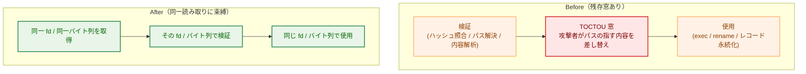
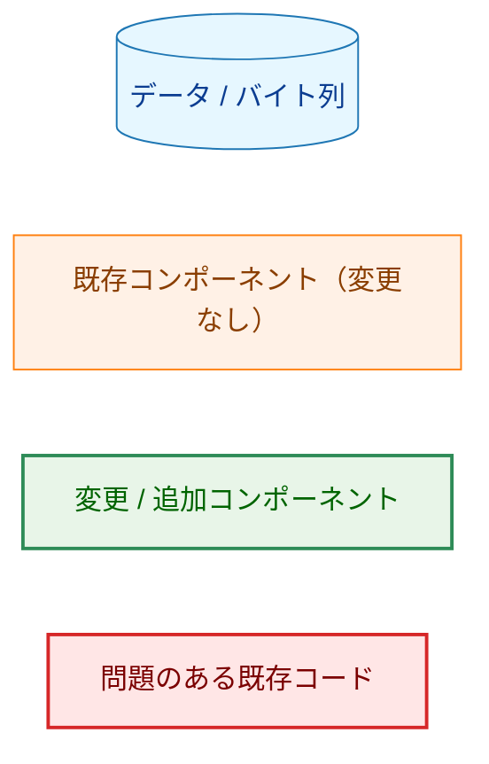
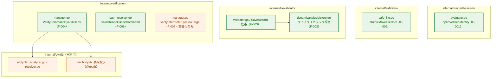
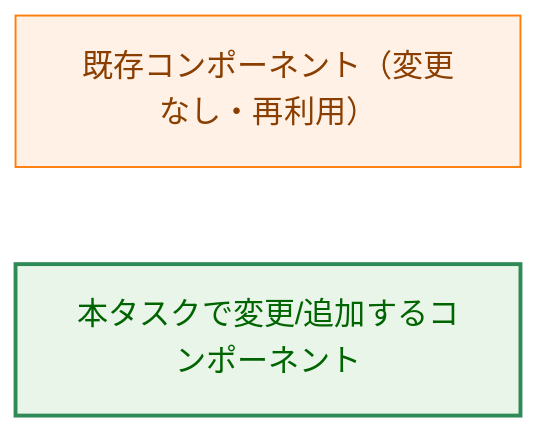
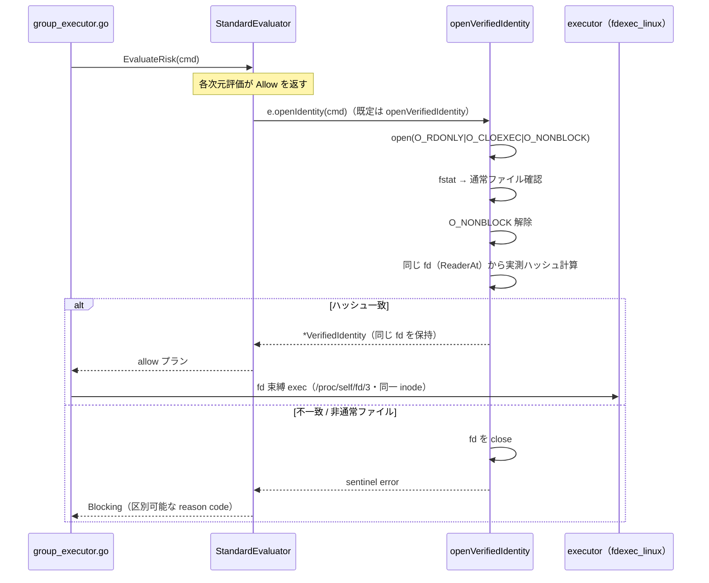
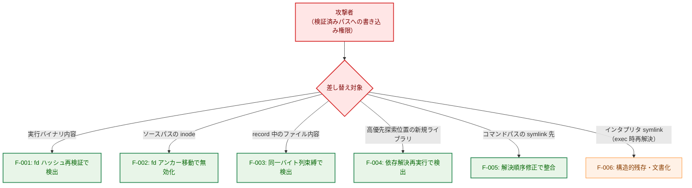
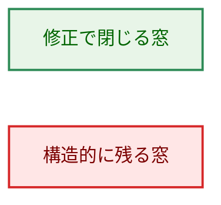
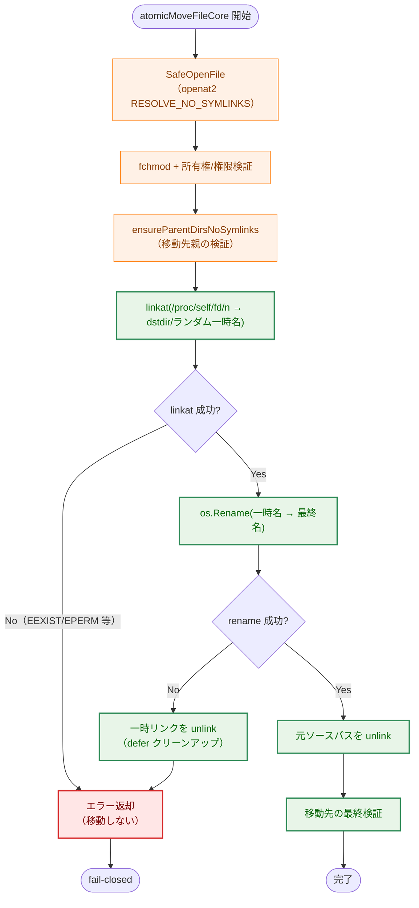
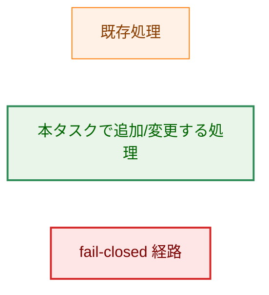
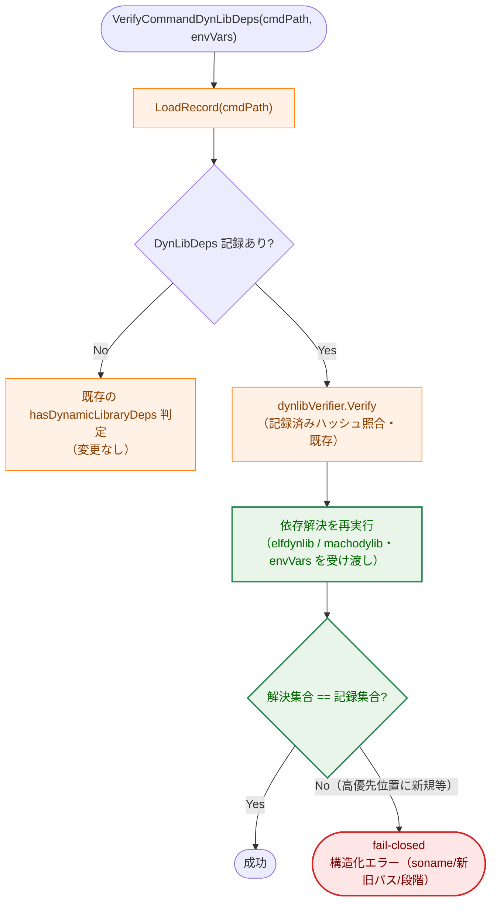

# アーキテクチャ設計書: 検証(verify)と使用(open/exec)間の TOCTOU 残存窓を閉じる

## Document Status

| Item | Value |
|---|---|
| Status | `approved` |
| Created | 2026-07-21 |
| Review date | 2026-07-26 |
| Reviewer | isseis |
| Comments | - |

## 関連文書

- 要件定義書: [01_requirements.md](01_requirements.md)
- セキュリティアーキテクチャ: [security-architecture.md](../../dev/architecture_design/security-architecture.md)
- Mermaid 記法リファレンス: [mermaid_reference.md](../../dev/developer_guide/mermaid_reference.md)

---

## 1. 設計の全体像

### 1.1 設計目的

本タスクは、既存の主要経路で徹底されている単一の設計原則である「検証(verify)は開いた fd の内容そのものを検査し、使用(exec/read)はその同じ fd（または同一の読み取り結果）から行う」が及んでいない 5 系統の残存箇所を、原則に沿って修正する。いずれも「検証済みパスへの書き込み権限」を攻撃者の前提条件とする多層防御の一角であり、単独で成立する脆弱性ではないが、原則の一貫性を回復するために埋める。

### 1.2 設計原則

- **同一読み取りの原則（本タスクの中心原則）**: ハッシュ検証・内容解析・実行/移動は、可能な限り同一の fd または同一のバイト列に束縛する。パス名で別々に開き直す経路を排除し、「検証した内容」と「使用する内容」の同一性を構造的に保証する。
- **fail-closed**: 同一性が確認できない場合（内容ハッシュ不一致、通常ファイルでない、解決結果不一致）は、副作用（exec・move・レコード永続化）を行わずエラーを返す。正常系（改ざんなし）の成功結果・出力には回帰を与えない。
- **既存部品の再利用（DRY）**: 依存解決には既存の `DynLibAnalyzer` / `LibraryResolver` を、安全な open には既存の `SafeOpenFile`（openat2 `RESOLVE_NO_SYMLINKS`）を再利用し、ローダ探索や symlink 排除ロジックを再実装しない。
- **構造的に排除できない残存窓の明示（YAGNI 的線引き）**: カーネルが exec 時に shebang パスを再解決する窓のように、アプリケーション層で完全排除が困難なものは、前提条件と残余リスクを本文書に明記し、コード側の対処は将来タスクへ委ねる。

### 1.3 コンセプトモデル

各修正が閉じる「検証時点」と「使用時点」の間の窓を、共通の TOCTOU 構造として示す。



**凡例（Legend）**

矢印 `A → B` は「A の後に B が起きる時間順」を表す。



---

## 2. システム構成

### 2.1 対象コンポーネントの配置

本タスクは 5 パッケージにまたがる独立した修正の集合であり、新規パッケージは追加しない。各修正の配置を示す。

矢印 `A → B` は「A が B を呼び出す/利用する」ことを表す。



**凡例（Legend）**



### 2.2 各修正の対応関係

| 修正 | 対象 | 中心となる手段 | 対応 AC |
|---|---|---|---|
| F-001 | `openVerifiedIdentity` | open した fd から実測ハッシュを計算し `ExpandedCmdContentHash` と照合、`fstat` で通常ファイル確認、`O_NONBLOCK` を安全網に付与 | AC-01〜04 |
| F-002 | `atomicMoveFileCore` | 検証済み fd の inode を `linkat`(`/proc/self/fd`) でアンカーし移動、パス名 rename への差し替えを排除 | AC-05, 06 |
| F-003 | `SaveRecord` 経路 / `dynamicanalysis.store` | 対象ファイルを 1 回だけ open した共有 fd（`io.ReaderAt`）に、ハッシュ計算と全解析を束縛。ライブラリ解析結果は store 境界で実測ハッシュを `lib.Hash` と照合 | AC-07〜09 |
| F-004 | `VerifyCommandDynLibDeps` | verify 時に `DynLibAnalyzer`（ELF）/ `machodylib`（Mach-O）で依存解決を再実行し、record 済み集合との一致を確認。`envVars` を受け入れる | AC-10, 11 |
| F-005 | `validateAndCacheCommand` | `EvalSymlinks` を検証より先に実行し、解決済みパスに対して存在・通常ファイル・実行ビットを検証 | AC-12, 13 |
| F-006 | `verifyInterpreterSymlinkTarget` | 残余リスクを本文書に明記（コード変更なし） | AC-14 |

### 2.3 データフロー（F-001 の例）

F-001 は本タスクの中心原則を最も端的に示すため、代表例として fd 束縛実行までの流れを示す。



---

## 3. コンポーネント設計

コード例は高レベルのシグネチャ・型・エラー型定義に限定する。具体的アルゴリズムは実装（および `03_implementation_plan.md`）に委ねる。

### 3.1 F-001: `openVerifiedIdentity` のハッシュ再検証

現状の `openVerifiedIdentity`（[evaluator.go](../../../internal/runner/base/risk/evaluator.go)）は `syscall.Open(O_RDONLY|O_CLOEXEC)` した fd をそのまま `VerifiedIdentity` に格納し、内容の照合を行わない。修正後は同じ fd に対して次を行う。

- open 時に `O_NONBLOCK` を付与する（パスが FIFO に差し替えられた場合の無期限ブロックを防ぐ安全網）。
- `fstat` により通常ファイルであることを確認する（保証の本質）。通常ファイル確認後に `O_NONBLOCK` を解除する。通常ファイルに対する `O_NONBLOCK` は no-op である点に注意する。
- **同じ fd** から実測ハッシュを計算し、`cmd.ExpandedCmdContentHash` と比較する。ハッシュ計算は `io.NewSectionReader`（`pread` 相当）等で行い、fd のオフセットを進めない（fd は後続の exec 束縛でも共有されるため）。fd をハッシュ計算にも exec 束縛にも用いることで、この fd が指す inode を検証と exec の双方に束縛する。exec は `/proc/self/fd/<n>` 経由で同一 inode を開き直すため、fd のオフセットには依存しない。
- 不一致・非通常ファイルの場合は fd を close し、区別可能な sentinel error を返す。

> **残余リスク（inode 内容の in-place 書き換え）**: 本修正は「検証と exec を同一 inode に束縛する」ことを保証するが、攻撃者が同じ inode を別の fd で開いて in-place で内容を上書きする窓（ハッシュ計算〜exec syscall の間）は構造的に残る。exec 進行中は `ETXTBSY`（`deny_write_access`）が効くが、この検査〜exec の隙間には効かない。前提条件は F-006 と同じ「検証済みパスへの書き込み権限」であり、[5.4 節](#54-f-001-inode-内容の-in-place-書き換えの残余リスク) に残余リスクとして明記する。
>
> なお、`open`+`fstat` は「通常ファイル確認前に inode を open する」ため、キャラクタ/ブロックデバイスへ差し替えられた場合に open 時副作用を持ち得る。`O_NONBLOCK` が FIFO・一部デバイスの open ブロックを防ぐが、副作用の完全排除には `O_PATH` open→`fstat`→`/proc/self/fd/<n>` 再 open が必要である。本タスクでは通常ファイル確認（`fstat`）を主要な保証とし、この点も 5.4 節に記す。

呼び出し元の `allowedPlan` は、この sentinel error を識別して個別の reason code を持つ Blocking 判定にマップする。現状は open 失敗を一律 `ReasonIdentityUnbound` にしているため、拒否理由を区別できるよう分岐を追加する。

```go
// openVerifiedIdentity の戻り値シグネチャは現状を維持し、失敗理由を sentinel
// error で表現する（allowedPlan がこれを reason code に対応付ける）。
func openVerifiedIdentity(cmd *runnertypes.RuntimeCommand) (*risktypes.VerifiedIdentity, error)

// 新規 sentinel error（filevalidator ではなく risk パッケージに定義）
var (
    ErrIdentityHashMismatch  = errors.New("verified identity content hash mismatch")
    ErrIdentityNotRegular    = errors.New("verified identity is not a regular file")
)
```

新規 reason code（`internal/runner/base/risktypes/reason_codes.go` へ追加）:

```go
const (
    ReasonIdentityHashMismatch ReasonCode = "identity_hash_mismatch"
    ReasonIdentityNotRegular   ReasonCode = "identity_not_regular_file"
)
```

両コードは既存の `ReasonIdentityUnbound` と同じく `reasonFamilies` マップに `FamilyRuntimeArgument` として登録し、`totalReasonCodes` を +2 する必要がある（`TestReasonFamily_AllCodesAssigned` が全コードの family 割り当てを強制するため）。

### 3.2 F-002: `AtomicMoveFile` のソース同一性保証

現状の `atomicMoveFileCore`（[safe_file.go](../../../internal/safefileio/safe_file.go)）は、`SafeOpenFile`（openat2 `RESOLVE_NO_SYMLINKS`）で開いた fd に対して fchmod・所有権/権限検証を行うが、最終的な移動は `os.Rename(absSrc, absDst)` とパス名で実行する。検証時点と rename 時点の間にソースパスが別 inode へ差し替えられると、検証していない inode が移動され得る。

**採用方式（fd アンカー方式）**: 検証済みの fd が指す inode を、パス名を介さず移動先ディレクトリへ束縛する。Linux では次の手順を採る。

1. 検証済み fd の inode を、移動先ディレクトリ内の一時名へ `linkat(AT_FDCWD, "/proc/self/fd/<n>", dstdir, tmpname, AT_SYMLINK_FOLLOW)` でハードリンクする。これは fd が指す inode そのものを参照するため、ソースパスの差し替えの影響を受けない。
2. 一時名から最終名へ `os.Rename`（同一ディレクトリ内・原子的置換）する。一時名は本処理が生成した信頼できる名前であり、差し替え窓を持たない。
3. 元のソースパスを unlink する。

これにより、移動される inode は必ず検証済み fd の inode と一致する。同一性が確認できない場合（`linkat` 失敗等）は rename を行わずエラーを返す（fail-closed）。

**運用上の失敗モードと対処**（現状の単一 `os.Rename` にはなかったものを新たに導入するため明示する）:

- **一時リンクのリーク/ロールバック**: `linkat` 成功後〜`rename` 成功前にクラッシュ/失敗すると、移動先ディレクトリに一時ハードリンクが残る。`linkat` 以降のすべての失敗経路で一時名を unlink する `defer` ベースのクリーンアップを設ける。（非 Linux 経路のロールバック欠如 B1 F-4 はスコープ外だが、本修正が Linux 上に同種の状態を新設するため、ここで対処する。）
- **一時名の予測可能性（`EEXIST` による妨害）**: `linkat` は既存 `newpath` を上書きせず `EEXIST` を返すため、予測可能な一時名は攻撃者による事前作成で移動を妨害され得る。一時名はランダムサフィックスを含む予測困難な名前とし、`EEXIST` はエラーとして扱う。
- **`fs.protected_hardlinks`（近年のディストロで既定 =1）**: 非 root の実行者は、自身が所有せず書き込み権も持たないファイルへ `linkat` できず `EPERM` になり得る。`os.Rename` にはこの制約がないため、非 root デプロイでの新規失敗モードとなる。既存の `AtomicMoveFile` 呼び出し元（例: `internal/runner/output/file.go`）が非 root で他所有ファイルを移動していないかを実装時に確認し、回帰する場合は前提条件として明記する。
- **`unlink(src)` 失敗時のセマンティクス**: `rename` 成功後に元ソースの `unlink` が失敗した場合、両名が同一 inode を指す状態になる。この場合の返り値（エラーとするか、移動先は成立済みとして警告に留めるか）を定義する。本設計では「移動先は成立済み・元ソース残存」を警告付き成功ではなくエラーとして扱い、呼び出し元が後始末できるようにする。

> **なぜ stat ベースの (dev, ino) 照合では不十分か**: AC-05 が明記するとおり、`os.Rename` がパス名で解決される以上、rename 直前に `(dev, ino)` を照合しても、照合時点と rename 時点の間に別 inode へ差し替える窓が残る。窓を構造的に閉じるには、パス名ではなく fd の指す inode を直接移動対象にする fd アンカー方式が必要である。

> **前提条件（AC-05）**: 本保証は、移動先ファイルの親ディレクトリが信頼できる所有者（root、または 0o710 等の厳格な権限を持つ信頼できるユーザー）によって保護されていることを前提とする。この前提は既存の `ensureParentDirsNoSymlinks` による親ディレクトリ検証と同じ信頼境界に立つ。

> **非 Linux 経路**: `/proc/self/fd` に依存する fd アンカー方式は Linux 前提である。非 Linux フォールバック経路の TOCTOU（B1 F-2 系統）は本タスクのスコープ外（[01_requirements.md](01_requirements.md) スコープ節）であり、非 Linux では従来挙動を維持する。

```go
// AtomicMoveFile / atomicMoveFileCore のシグネチャは現状を維持する。
func (fs *osFS) AtomicMoveFile(srcPath, dstPath string, requiredPerm os.FileMode) error
func atomicMoveFileCore(absSrc, absDst string, requiredPerm os.FileMode, fs FileSystem) error
```

### 3.3 F-003: record 時のハッシュ計算と解析の一貫性

対象ファイルの記録は `SaveRecord`（[validator.go](../../../internal/filevalidator/validator.go)）を起点とし、その内部で (1) `resolveShebangInfo`（`shebang.Parse` によるスクリプト先頭行の解析）が **`saveRecordCore` を呼ぶ前に**独立して open する。続く `saveRecordCore` 配下で (2) `calculateHash`、(3) `analyzeRecordTarget`（`AnalyzeNetworkSymbols` / `analyzeELFSyscalls` / `analyzeMachoSyscalls` / `analyzeDynLibDeps`）が、いずれも同一パスを独立に open して読む。読み取りの合間にファイルが差し替えられると、`ContentHash` と解析結果（および shebang 情報）が食い違ったレコードが永続化され得る。

**採用方式（共有 fd への束縛）**: 対象ファイルを `SaveRecord` の起点で 1 回だけ安全に open（`SafeOpenFile`）し、その fd を単一の「内容ソース」として shebang 解析・ハッシュ計算・各内容解析へ渡す。`ContentHash` はこの fd から計算し、各解析器も同じ fd（`io.ReaderAt` / `io.NewSectionReader`）を入力に受け取る。ファイルが差し替えられても、記録される `ContentHash`・解析結果・shebang 情報は常に同一 inode の同一読み取りに対応する。

> **共有 fd（`io.ReaderAt`）を採り、全バイトのメモリ読み込みは避ける**: 対象ファイルの上限は既存の `maxFileSize`（`validator.go` で `1 << 30` = 1 GiB）である。全バイトを単一 `[]byte` に読み込む方式は、既存の `calculateHash`（`algorithm.Sum(f)` によるストリーミング）や `computeFileHash`（大きな共有ライブラリ向けにストリーミングする旨のコメントあり）の最適化を後退させ、最大 1 GiB を常駐させる。共有 fd を `io.ReaderAt` として各解析器へ渡せば、同一 inode への束縛（AC-07 の要求）を満たしつつ全バイト常駐を避けられる。`debug/elf.NewFile` は `io.ReaderAt` を受け取るため、`io.NewSectionReader(fd, 0, size)` で再 open なしに解析できる。

解析器（`shebang`、`binaryanalyzer`、ELF/Mach-O syscall 解析、`elfdynlib`）は現状パス名を受け取るため、同一 fd（`io.ReaderAt`）を受け取れるよう入力経路を拡張する。`$ORIGIN` はバイナリ位置（`parentPath`）から導出されるため、`elfdynlib` の署名を変えず DRY を保つ。

> **なぜ「解析後に再ハッシュして照合」ではなく同一読み取りか**: 再ハッシュ照合は窓を狭めるだけで、各解析器が別々に open している構造自体は残る。AC-07 は「同一の読み取り（共有 fd または読み込み済みバイト列）に基づく」ことを要求しており、窓を構造的に排除するには入力の一本化が必要である。

**ライブラリ解析のハッシュキー照合（AC-08）**: 現状の `analyzeOneLibrary`（[validator.go](../../../internal/filevalidator/validator.go)）はサイズ検査用の open と ELF 解析用の再 open が分かれ、解析結果がハッシュキー `lib.Hash` に対応する保証がない。加えて、通常経路（store 有効時）では `loadOrAnalyzeLibrary`→ `dynamicanalysis.store.LoadOrAnalyzeAndStore(lib.Path, lib.Hash)` → `Analyzer.AnalyzeLibrary(libPath)`（[interfaces.go](../../../internal/dynamicanalysis/interfaces.go)）と辿る過程で `lib.Hash` が interface 境界で脱落し、`analyzeOneLibrary` 到達時には空である。したがって照合を `analyzeOneLibrary` に置くと通常経路で機能しない。

そこで照合は、期待ハッシュ `libHash` と解析入力の双方を持つ store 境界（`LoadOrAnalyzeAndStore`） に置く。すなわち、解析に用いた読み取りから実測ハッシュを計算し `libHash` と比較し、不一致なら解析結果を記録せず fail-closed（エラー）とする。store を渡さない経路（`loadOrAnalyzeLibrary` が record の `LibEntry` を直接渡す）では、その `LibEntry.Hash` が空でないため `analyzeOneLibrary` 側で照合できる。両経路をカバーするため、[store.go](../../../internal/dynamicanalysis/store.go) と [validator.go](../../../internal/filevalidator/validator.go) の双方に照合点を持たせる。

```go
// store 境界。libHash は期待ハッシュ（呼び出し元が保持するハッシュキー）。
func (s *store) LoadOrAnalyzeAndStore(libPath, libHash string) (*Result, error)

// analyzeOneLibrary は解析入力から実測ハッシュを算出し lib.Hash と照合する
// （store-nil 経路で lib.Hash が非空のときに機能）。戻り値シグネチャは現状を維持する。
func (v *Validator) analyzeOneLibrary(lib fileanalysis.LibEntry) (*dynamicanalysis.Result, error)

// 新規エラー型（ハッシュキー不一致）
var ErrLibraryHashKeyMismatch = errors.New("library analysis hash does not match recorded hash key")
```

### 3.4 F-004: verify 時の依存解決再実行

現状の `verifyDynLibDeps`（[manager.go](../../../internal/verification/manager.go)）は record 済みの `DynLibDeps` のハッシュ照合のみを行い、ローダの探索アルゴリズムを再実行しない。record 時に存在しなかったライブラリが、より優先順位の高い探索位置（`DT_RUNPATH` の `$ORIGIN` 相対、Mach-O `@rpath` 候補等）に後から置かれると、記録済みライブラリに触れずに実際のロード対象を差し替えられる。

**採用方式（依存解決の再実行と集合一致）**: verify 時に既存の `DynLibAnalyzer.Analyze`（ELF。内部で `LibraryResolver.Resolve` を呼ぶ）および `machodylib` の依存解決（Mach-O `@rpath`）を再実行し、現在の探索で解決される依存パス集合を得る。これを record 済み集合と比較し、一致しない場合（特に record 時より優先順位の高い位置に新規ライブラリが出現した場合）は verify を失敗させる。探索ロジックは既存の `dynlib` サブパッケージを再利用し再実装しない（DRY）。

**`envVars` の受け入れと消費先の明示（AC-10）**: `VerifyCommandDynLibDeps` はコマンドの実行環境 `envVars` を受け入れる。これによりインターフェースの署名が変わる。

```go
// 変更前
VerifyCommandDynLibDeps(cmdPath string) error
// 変更後
VerifyCommandDynLibDeps(cmdPath string, envVars map[string]string) error
```

> **`envVars` は現状の解決結果には影響しない（正直な設計上の位置づけ）**: 本タスクで再利用する ELF 解決器は環境を一切参照しない。`$ORIGIN` はバイナリ位置（`parentPath`）から導出され（[resolver.go](../../../internal/dynlib/elfdynlib/resolver.go)）、`LD_LIBRARY_PATH` は「record が無視し runner が消去する」既存ポリシーにより探索経路から意図的に除外され続ける。したがって `envVars` は `VerifyCommandDynLibDeps` の境界で受け取り解決層へ渡す（AC-10「受け入れ」を満たす）が、現状の ELF/Mach-O 解決結果は環境非依存である。この設計により、既存 `elfdynlib`/`machodylib` の署名を変えず DRY を保つ。環境が実際に解決へ影響する形（例: 将来 `$LIB`/`$PLATFORM` 等の環境依存置換を扱う）へ拡張する場合は、`Analyze`/`Resolve` の署名変更を伴う別対応とし、本タスクでは `LD_LIBRARY_PATH` を探索に復活させない（セキュリティポリシーの維持）。要件レビューでは、AC-10 の「使用する」を「解決層へ渡す（現状の解決結果は環境非依存）」と解釈することの可否を確認されたい。

> **前提（record 環境と verify 環境の同一性）と正当な変化（benign drift）**: 本方式は verify 時の**ライブ・ファイルシステム**に対して探索を再実行する。したがって record を行ったホストと verify を行うホストでライブラリ配置（`/etc/ld.so.cache`、アーキ既定ディレクトリ、`$ORIGIN` 相対の内容）が一致していることが前提となる。`apt upgrade` や `ldconfig` による正当な変化、あるいは record ホストと prod ホストの配置差は、集合不一致として verify 失敗になり得る。運用契約として「システムライブラリ構成を変更したら record を再実行する」ことを明記する。攻撃形（record 済み解決パスより高優先の位置に新規ライブラリが出現）と正当な追加を区別できるよう、集合比較は少なくとも「record 済みの各 soname が同一パスへ解決され続けているか」を核とし、判定理由を構造化エラー（下記）に含める。段階的導入（フラグによるオプトイン）が必要かは要件レビューで確認されたい。

**監査可能性（構造化エラー）**: 拒否理由をオンコール担当が説明できるよう、不一致時のエラーには変化した soname・record 済み解決パス・今回解決されたパス・シャドーイングした探索段階を含める。既存の schema 不一致・record 欠損の soft-fail 判定（`isDeferredHashDirUnavailable` 等）は変更しない。

> **既存テストへの影響**: 署名変更は広範に波及する。(a) `internal/verification` の直接呼び出しテスト（`manager_test.go`、`manager_macho_test.go`、`shebang_chain_verifier_test.go` 等）。(b) `ManagerInterface`（`interfaces.go`）とモック（`testutil/testify_mocks.go` および `testify_mocks_test.go`）。(c) `.On("VerifyCommandDynLibDeps", …)` / `AssertCalled` のモック期待をもつ `internal/runner` 配下のテスト（`group_executor_test.go`、`integration_dual_defense_test.go`、`e2e_slack_redaction_test.go`、`command_output_capture_test.go` 等）は、testify の引数数不一致で実行時に失敗するため、第 2 引数のマッチャ追加が必要。(d) 呼び出し元 [group_executor.go](../../../internal/runner/group_executor.go)。`group_executor.go` では `finalEnv` を dynlib 検証より前に用意する。

### 3.5 F-005: `PathResolver` の Stat/EvalSymlinks 順序

現状の `validateAndCacheCommand`（[path_resolver.go](../../../internal/verification/path_resolver.go)）は `os.Stat`（symlink 追従）で存在・通常ファイル・実行ビットを確認した後、別システムコールの `filepath.EvalSymlinks` で正規化する。2 呼び出しの間にリンク先を差し替えられると、実行可否チェックとキャッシュされる解決済みパスが別ファイルを指し得る。

**採用方式（解決を先に、検証を解決済みパスに）**: `filepath.EvalSymlinks` を先に実行して canonical パスを得て、その解決済みパスに対して `os.Lstat`（symlink を追従しない）で存在・通常ファイル・実行ビットを検証し、同じ解決済みパスをキャッシュする。canonical パスに対し `Lstat` を用いることで、`EvalSymlinks` と検証の間に葉（leaf）へ symlink を挿入された場合でも、検証対象が解決結果と異なる別ファイルになることを検出できる（symlink 追従の `os.Stat` を canonical パスに使うと、挿入された leaf symlink の先が検証されキャッシュ文字列と乖離し得る）。これにより「検証対象パス」と「キャッシュされる解決済みパス」が常に同一のパス解決結果を指す。

> **窓の範囲（過大主張を避ける）**: 本修正は「検証対象とキャッシュ対象が同一解決結果を指す」という AC-12 の要求を満たすが、`EvalSymlinks` と `Lstat` は別システムコールであり、この 2 呼び出しの完全な原子化までは行わない。実行されるコマンドバイナリそのものの inode 束縛は F-001 の fd 束縛実行が担う。キャッシュされた解決パスを exec 以外で消費する経路（例: `verify_files` エントリ等の非 exec 消費者）については、消費時点までの再差し替え窓が残り得るが、これは本タスクのスコープ外である。

> **なぜ fd ベース検証ではなく順序入れ替え+Lstat か（YAGNI）**: AC-12 は「`EvalSymlinks` を検証より先に実行する、または fd ベースの検証に置き換える」の選択肢を認めている。順序入れ替え＋canonical パスへの `Lstat` で AC-12 の要求（検証対象とキャッシュ対象の一致）は満たせ、この経路が扱う「実行可否チェックとキャッシュの整合」に fd ベース検証を追加導入する必要はない。

```go
// validateAndCacheCommand のシグネチャは現状を維持する。
func (pr *PathResolver) validateAndCacheCommand(path, cacheKey string) (string, error)
```

### 3.6 F-006: shebang インタプリタ symlink 検査の残余リスク

`verifyInterpreterSymlinkTarget`（[manager.go](../../../internal/verification/manager.go)）はコード変更を行わない。残余リスクの文書化のみが成果物であり、その配置先を本文書の [5.3 節](#53-f-006-shebang-インタプリタ再解決の残余リスクac-14) に確定する。

### 3.7 コンポーネント責務表（新規・変更ファイル）

| ファイル | 変更種別 | 責務 | 更新が必要な既存テスト |
|---|---|---|---|
| `internal/runner/base/risk/evaluator.go` | 変更 | `openVerifiedIdentity` にハッシュ再検証・`fstat`・`O_NONBLOCK` を追加。`allowedPlan` が sentinel error を reason code に対応付け | `internal/runner/base/risk/*_test.go`（identity 系の成功/失敗経路） |
| `internal/runner/base/risktypes/reason_codes.go` | 変更 | `ReasonIdentityHashMismatch` / `ReasonIdentityNotRegular` を追加し `reasonFamilies` / `totalReasonCodes` を更新 | `reason_codes_test.go`（`TestReasonFamily_AllCodesAssigned`） |
| `internal/safefileio/safe_file.go` | 変更 | `atomicMoveFileCore` を fd アンカー方式（`linkat`）へ変更＋一時リンクのクリーンアップ | `internal/safefileio/*_test.go`（AtomicMoveFile 系） |
| `internal/filevalidator/validator.go` | 変更 | `SaveRecord` 起点で共有 fd を開き、shebang/ハッシュ/各解析へ渡す。`analyzeOneLibrary` に `lib.Hash` 照合を追加 | `internal/filevalidator/*_test.go`（SaveRecord / analyze 系） |
| `internal/dynamicanalysis/store.go`, `interfaces.go` | 変更 | `LoadOrAnalyzeAndStore` の store 境界で `libHash` と実測ハッシュを照合（AC-08 の通常経路） | `internal/dynamicanalysis/*_test.go` |
| 各解析器（`shebang` / `binaryanalyzer` / ELF・Mach-O syscall / `elfdynlib`）の入力経路 | 変更 | パス名に加え共有 fd（`io.ReaderAt`）入力を受け取れるよう拡張 | 各解析器の `*_test.go` |
| `internal/verification/manager.go` | 変更 | `VerifyCommandDynLibDeps` に `envVars` を追加し依存解決を再実行、構造化エラーを返す | `manager_test.go` / `manager_macho_test.go` / `shebang_chain_verifier_test.go` |
| `internal/verification/interfaces.go` | 変更 | `ManagerInterface.VerifyCommandDynLibDeps` の署名変更 | — |
| `internal/verification/testutil/testify_mocks.go` | 変更 | モックの署名を追従 | `testify_mocks_test.go` |
| `internal/runner/*_test.go`（モック期待） | 変更 | `.On("VerifyCommandDynLibDeps", …)` / `AssertCalled` に第 2 引数マッチャを追加 | `group_executor_test.go` / `integration_dual_defense_test.go` / `e2e_slack_redaction_test.go` / `command_output_capture_test.go` 等 |
| `internal/verification/path_resolver.go` | 変更 | `validateAndCacheCommand` を「解決→canonical パスへ `Lstat` 検証」順へ入れ替え | `path_resolver` 系テスト |
| `internal/runner/group_executor.go` | 変更 | `VerifyCommandDynLibDeps` 呼び出しに `finalEnv` を渡す（`finalEnv` の算出を dynlib 検証前へ移動） | — |
| `docs/tasks/0155.../02_architecture.md` | 追加 | F-006 残余リスクの文書化（本節） | — |

---

## 4. エラーハンドリング設計

- **F-001**: `openVerifiedIdentity` は `ErrIdentityHashMismatch` / `ErrIdentityNotRegular` を返す。`allowedPlan` は `errors.Is` で判別し、対応する reason code（`ReasonIdentityHashMismatch` / `ReasonIdentityNotRegular`）を持つ Blocking 判定を生成する。これは既存の `ReasonIdentityUnbound`（open 自体の失敗）と区別可能であり、audit ログに記録される（AC-04）。
- **F-002**: `linkat` 失敗・一時名生成失敗は既存の `atomicMoveFileCore` のエラー返却規約（`fmt.Errorf("...: %w", err)`）に従い、rename を行わずに返す（fail-closed、AC-06）。`linkat` 成功後の失敗経路では `defer` で一時リンクを unlink してから返す（リーク防止）。`unlink(src)` 失敗はエラーとして返す（[3.2 節](#32-f-002-atomicmovefile-のソース同一性保証)の失敗モード参照）。
- **F-003**: ライブラリのハッシュキー不一致は `ErrLibraryHashKeyMismatch` として返す。通常経路では store 境界（`LoadOrAnalyzeAndStore`）で、store-nil 経路では `analyzeOneLibrary` の既存 fail-fast（ファイル欠損・サイズ超過）と同じ経路で、レコード永続化を中止する（AC-08）。
- **F-004**: 依存解決の再実行結果が record 集合と不一致の場合は、変化した soname・record 済み解決パス・今回解決されたパス・シャドーイング段階を保持する構造化エラー（`dynlib.ErrLibraryHashMismatch` に準じた新規エラー型）を返し、audit ログへ到達させる。既存の schema 不一致・record 欠損の soft-fail 判定（`isDeferredHashDirUnavailable` 等）は変更しない。
- **F-005**: `EvalSymlinks` 失敗・解決済みパスの検証失敗は、既存の `ErrCommandNotFound` を包む形式を維持する（AC-13 の正常系回帰なし）。

エラー型はすべて `errors.Is` / `errors.AsType` で判別可能な形で定義し、文字列マッチに依存しない（プロジェクト方針）。

---

## 5. セキュリティ考慮事項

### 5.1 脅威モデル

全 5 系統に共通する攻撃者像は、検証済みパス（またはその親経路の symlink、インタプリタパス）への書き込み権限を持ち、検証時点と使用時点の間に対象を差し替えるというものである。



**凡例（Legend）**: 矢印 `A → B` は攻撃の分岐と、それを閉じる修正への対応を表す。



### 5.2 副作用の抑止契約

本タスクは新規のモード/フラグを導入しないが、各 fail-closed 判定が抑止する外部副作用を明示する。

| 修正 | fail-closed 時に抑止される副作用 | 正常系で許可される副作用 |
|---|---|---|
| F-001 | コマンドの exec（fd 束縛実行そのものを行わない） | 検証済み内容の exec |
| F-002 | `os.Rename`/`linkat` による移動（ファイルは移動されない） | 検証済み inode の移動 |
| F-003 | 解析レコードの永続化（`store.Update` を行わない） | 変更前と同一内容のレコード生成 |
| F-004 | コマンド実行（呼び出し元 `group_executor` がエラーで実行を中止） | 依存集合が一致する場合の実行継続 |
| F-005 | 解決済みパスのキャッシュ・以降の実行 | 検証済み解決パスの返却とキャッシュ |

いずれも dry-run のプレビューには影響しない（既存の dry-run soft-fail 判定を維持）。

### 5.3 F-006: shebang インタプリタ再解決の残余リスク（AC-14）

`verifyInterpreterSymlinkTarget` は、`/bin/sh` 等のインタプリタパスを `filepath.EvalSymlinks` で検査し record 時の解決先と比較する。しかし実際のスクリプト実行時には、カーネルが exec 時点で shebang 行のインタプリタパスを再解決する。検査合格後〜exec の間にシンボリックリンクを差し替えられると、検証済みでないインタプリタが起動し得る。

- **(a) 構造的に完全排除が困難な理由**: この再解決はカーネルの exec 実装（shebang 行のパスをカーネルが開き直す）に起因する。アプリケーション層で検査した fd をインタプリタ起動に束縛する手段（例: `execveat` 等によるインタプリタの fd 束縛起動）は、スクリプト実行経路では標準の `os/exec` に存在せず、大きなアーキテクチャ変更を要する。
- **(b) 悪用の前提条件**: 攻撃者がインタプリタパスの symlink を差し替える権限（当該パスまたはその親ディレクトリへの書き込み権限）を持つこと。これは本システムの信頼境界の外側（[security-architecture.md](../../dev/architecture_design/security-architecture.md) の TOCTOU 節）に位置する。
- **(c) 残余リスクとして許容する判断**: 前提条件が信頼境界の外側にあり、かつ完全排除が大きなアーキテクチャ変更を要することから、本タスクでは残余リスクとして許容し文書化にとどめる。コード側での fd 束縛インタプリタ起動は将来タスク（[01_requirements.md](01_requirements.md) スコープ外節）とする。

> 上記は既存のセキュリティアーキテクチャ文書が「Known Security Limitations / TOCTOU」で述べる方針（file integrity verification と信頼境界による多層防御で緩和し、完全排除は `fexecve` 相当が必要なため見送る）と整合する。本タスクは同方針を shebang インタプリタ経路に適用したものである。

### 5.4 F-001: inode 内容の in-place 書き換えの残余リスク

F-001 は「検証と exec を同一 inode に束縛する」ことを保証するが、次の窓は構造的に残るため、F-006 と同じ枠組みで明記する。

- **(a) 完全排除が困難な理由**: fd は inode を束縛するが、内容そのものを凍結しない。攻撃者が同じ inode を別 fd で開き、ハッシュ計算〜exec syscall の間に in-place で上書きすると、検証済みハッシュと exec 時の内容が乖離し得る。exec 進行中の書き込みは `ETXTBSY`（`deny_write_access`）が防ぐが、この検査〜exec の隙間には効かない。また `open`+`fstat` はデバイスノードへ差し替えられた場合に open 時副作用を持ち得る（`O_NONBLOCK` が一部を緩和するが完全排除には `O_PATH` 経由の再 open が必要）。
- **(b) 悪用の前提条件**: 攻撃者が検証済みパスの指す inode への書き込み権限を持つこと。これは本システムの信頼境界の外側（[security-architecture.md](../../dev/architecture_design/security-architecture.md) の TOCTOU 節）に位置する。
- **(c) 残余リスクとして許容する判断**: 前提条件が信頼境界の外側にあり、窓が open〜exec の極めて短い区間に限られること、および完全凍結には大きな追加機構を要することから、本タスクでは残余リスクとして許容し文書化にとどめる。`fstat` による通常ファイル確認とハッシュ照合により、record 時と異なる inode/内容の大半は検出される。

---

## 6. 処理フロー詳細

### 6.1 F-002: fd アンカー移動の判断フロー

矢印 `A → B` は処理の順序を表す。



**凡例（Legend）**



### 6.2 F-004: verify 時依存解決の判断フロー

矢印 `A → B` は処理の順序を表す。



**凡例（Legend）**


---

## 7. テスト戦略

各 AC に対し、正常系（改ざんなし・回帰防止）と異常系（TOCTOU 窓を突く・fail-closed 確認）の双方を用意する（[01_requirements.md](01_requirements.md) Success Criteria）。

### 7.1 ユニットテスト

- **F-001**: (a) 内容一致時に `VerifiedIdentity` が返る（AC-03）。(b) fd 内容を検証済みハッシュと不一致にすると Blocking かつ `ReasonIdentityHashMismatch`（AC-01, 04）。(c) パスを FIFO に差し替えた場合に非通常ファイルとして拒否（AC-02）。fd 差し替えは注入可能な `identityOpener`（既存のテスト用フィールド）またはテスト用ファイルで再現。
- **F-002**: (a) 改ざんなしの移動が成功し内容が保たれる（AC-06 正常系）。(b) 検証後にソースパスを別 inode へ差し替えても、移動されるのは検証済み inode であること（AC-05）。(c) `linkat` 後の rename 失敗で一時リンクがリークしないこと（クリーンアップ）。(d) 一時名の `EEXIST` がエラーになること。
- **F-003**: (a) 変更前と同一内容のレコード生成（AC-09）。(b) 読み取り後の差し替えを模し、`ContentHash`・解析結果・shebang 情報が同一 inode の同一読み取りに対応すること（AC-07）。(c) store 境界（通常経路）および `analyzeOneLibrary`（store-nil 経路）でハッシュキー不一致時に `ErrLibraryHashKeyMismatch`（AC-08）。
- **F-004**: (a) 環境不変の正常系で成功（AC-11）。(b) record 後に高優先探索位置へ新規ライブラリを配置すると verify 失敗（AC-10）。(c) 構造化エラーが soname・新旧パスを保持すること。record ホストと verify ホストのライブラリ配置差（正当な変化, benign drift）の扱いは運用契約（[3.4 節](#34-f-004-verify-時の依存解決再実行)）に従う。
- **F-005**: (a) 通常構成で解決済みパスが返りキャッシュされる（AC-13）。(b) 解決順序により、検証対象とキャッシュ対象が同一解決結果を指すこと（AC-12）。

### 7.2 統合テスト

`group_executor` 経由で F-001（exec 拒否）・F-004（実行中止）が end-to-end で fail-closed になることを確認する。

### 7.3 セキュリティ/静的検証テスト

- **F-006**: 本文書 5.3 節に (a)(b)(c) が記載されていることの静的確認（AC-14）。`03_implementation_plan.md` の完了チェック項目としても追跡する。

---

## 8. 実装優先順位

独立性の高い順・影響範囲の小さい順に段階分けする。

1. **Phase 1（局所・低リスク）**: F-005（`PathResolver` 順序入れ替え）、F-001（`openVerifiedIdentity`）。単一関数の変更で完結し、reason code 追加を伴う。
2. **Phase 2（署名変更を伴う）**: F-004（`VerifyCommandDynLibDeps` の `envVars` 追加）。インターフェース・モック・呼び出し元・既存テストの追従が必要。
3. **Phase 3（入力経路の拡張）**: F-003（同一バイト列束縛）。各解析器の入力経路拡張を伴うため範囲が広い。
4. **Phase 4（fd アンカー移動）**: F-002（`linkat` 方式）。Linux 固有処理の追加。
5. **Phase 5（文書化）**: F-006 の残余リスク記載（本文書で実施済み、実装計画で完了追跡）。

---

## 9. 将来拡張性

- **shebang インタプリタの fd 束縛起動**: F-006 の残余窓をコード側で閉じる場合、`execveat` 等によるインタプリタの fd 束縛起動を別タスクで検討する。本文書 5.3 節の前提条件が変わらない限り、既存経路との後方互換を保った追加として設計できる。
- **同一バイト列束縛の適用範囲拡大**: F-003 で導入する「内容スナップショット」入力経路は、将来 verify 側の解析（現状は主に record 側）にも展開でき、record/verify 双方で同一読み取り原則を一貫させる余地がある。
- **非 Linux の fd アンカー移動**: F-002 は Linux 前提だが、他 OS の同等プリミティブ（例: `fchmodat`/`renameat` 系の組み合わせ）が利用可能になれば、同じ fail-closed 契約のまま拡張できる。

---

## 付録: 決定履歴

本文書の本文は現行の設計状態を記述する。過去の代替案（stat ベース (dev, ino) 照合、解析後の再ハッシュ照合、`LD_LIBRARY_PATH` の探索復活等）を採らなかった理由は、各コンポーネント設計節の「なぜ〜ではないか」ブロックに要約した。より詳細な検討経緯は Git 履歴および [01_requirements.md](01_requirements.md) を参照。
