# アーキテクチャ設計書: 環境変数 denylist の一元化と非対称・抜けの解消

## Document Status

| Item | Value |
|---|---|
| Status | `draft` |
| Created | 2026-07-24 |
| Review date | - |
| Reviewer | - |
| Comments | - |

## 関連文書

- 要件定義: [01_requirements.md](01_requirements.md)
- Mermaid 記法: [mermaid_reference.md](../../dev/developer_guide/mermaid_reference.md)
- セキュリティアーキテクチャ全体: [security-architecture.md](../../dev/architecture_design/security-architecture.md)

---

## 1. 設計の全体像

### 1.1 設計原則

本タスクは新機能の追加ではなく、既に3箇所に重複実装されている「禁止環境変数名の判定」を単一の判定関数へ集約し、あわせて判定対象の抜けを埋めるリファクタである。したがって設計原則は次のとおりとする。

- **判定ロジックとリストのみを一元化する**: 「どの変数名を禁止とみなすか」の知識を1箇所に集約する。一方で「禁止と判定した後に何をするか」（実行層は削除、config 層はロードエラー、security 層は Reject）は各層の既存責務であり、統一しない。
- **各層の既存挙動を保存する**: 一元化は各層の外部から観測できる挙動を変えないことを原則とし、変える場合（denylist の拡張、大文字小文字の扱いの統一）は本書で意図的な変更として明示する。
- **単一の典拠**: 禁止変数の一覧は [01_requirements.md](01_requirements.md) の「対象変数リスト（暫定）」節を唯一の典拠とし、実装コードとテストはそのリストに追随する。判定関数のテストは同リストを直接 range して網羅する（AC-06）。
- **DRY / YAGNI**: 既存の `internal/runner/base/environment` パッケージ（allowlist ベースの `Filter` を持つ）に判定関数を追加するにとどめ、新規パッケージや設定駆動の拡張機構は設けない。

### 1.2 用語

本書では以下の用語を一貫して用いる。

| 用語 | 意味 |
|---|---|
| denylist | 子プロセスへ渡してはならない環境変数名の集合。prefix 一致リストと完全一致リストからなる。 |
| 動的ローダ制御変数 | 動的リンカ（`ld.so`/dyld）や glibc の挙動を制御し、検証済みバイナリの読み込むライブラリを変え得る変数（`LD_*`, `DYLD_*`, `GCONV_PATH`, `GLIBC_TUNABLES` 等）。 |
| インタプリタ起動時コード注入変数 | 検証済みインタプリタ（シェル/Python/Perl 等）の起動時に任意コードを実行させ得る変数（`BASH_ENV`, `PYTHONPATH` 等）。 |
| 実行層 | 最終的な子プロセス環境を組み立てる `internal/runner/base/executor`。 |
| config 層 | TOML 設定を読み込み展開する `internal/runner/config`。 |
| security 層 | `env NAME=VALUE cmd ...` 形式の間接実行を静的にリスク分類する `internal/runner/base/security`。 |

### 1.3 概念モデル

集約後は、3つの呼び出し箇所がいずれも `environment` パッケージの単一判定関数を参照する。判定結果に対する各層の挙動は層ごとに異なる。

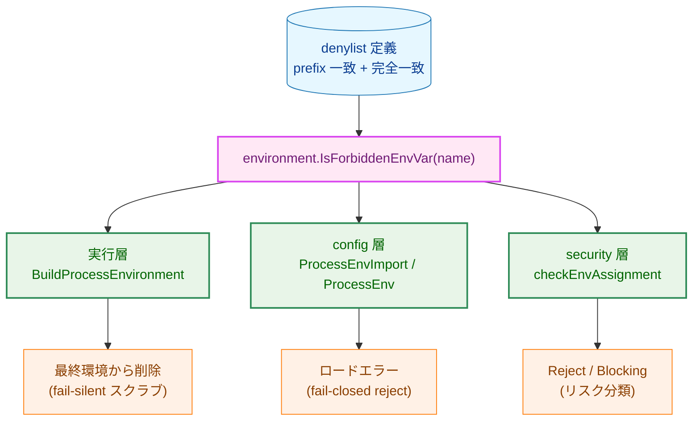

**矢印の意味**: この図は評価の流れを表す。`A → B` は「A の出力を B が消費する」（denylist 定義 → 判定関数 → 各層が判定結果を消費 → 層ごとの挙動）という向きであり、パッケージ依存の向き（§2.1 の import 方向）とは逆になる点に注意する。すなわち実行時には各層が判定関数を呼び出す（依存は層 → 関数）が、本図はデータ・判定結果の流れを示すため関数 → 層の向きに描いている。

**凡例**:

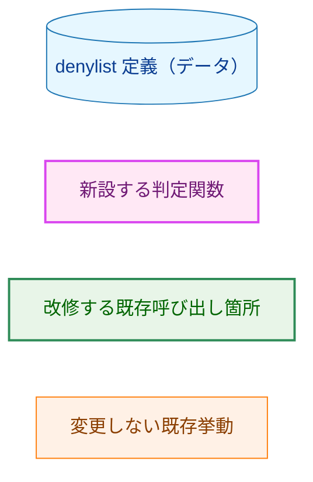

### 1.4 変更前後の対比

改修前は各層が独立のリストと判定を持ち、カバレッジが非対称だった。具体的には、実行層・config 層は `LD_*` と固定5個のみを対象とし `DYLD_*`・`GLIBC_TUNABLES`・インタプリタ起動時コード注入変数を含まず、config 層は `env_import` のみを検査して `env_vars` を検査していなかった。security 層は `LD_*`/`DYLD_*` を持つが固定5個・`GLIBC_TUNABLES`・インタプリタ変数を含んでいなかった。改修後は単一関数を共有し、これらのカバレッジが3層で揃う。

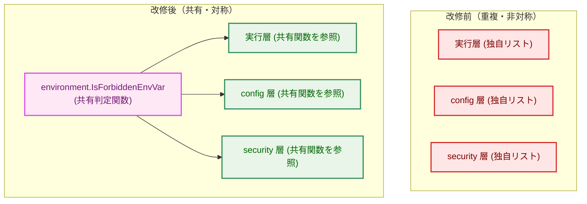

**矢印の意味**: 改修後の図で `A → B` は「B が A を参照する」ことを表す。

**凡例**:

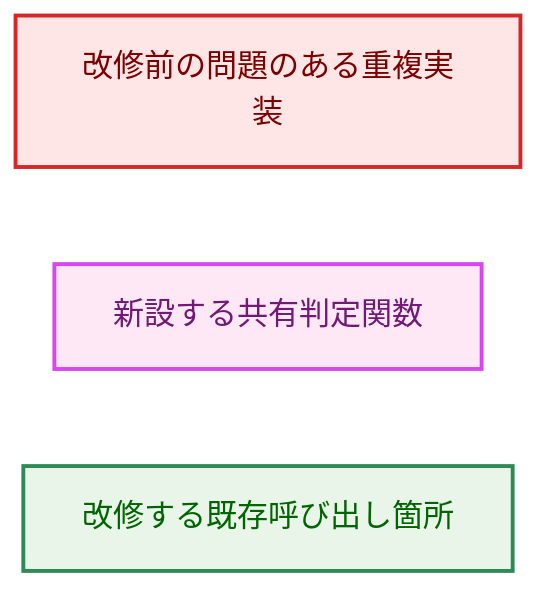

---

## 2. システム構成

### 2.1 パッケージ配置

判定関数の置き場所は、要件で指定された `internal/runner/base/environment` とする。同パッケージは既に allowlist ベースの `Filter` を持ち、環境変数の取り扱いを責務とするため、denylist 判定の追加は責務上も自然であり、既存 `Filter` の挙動・インターフェースには手を加えない（スコープ外）。

依存の向きは以下のとおりで、循環は生じない。`environment` は `common` と `runnertypes` のみに依存するため、実行層・config 層・security 層のいずれから参照されても循環しない。config 層は既に `environment` を import 済みである。

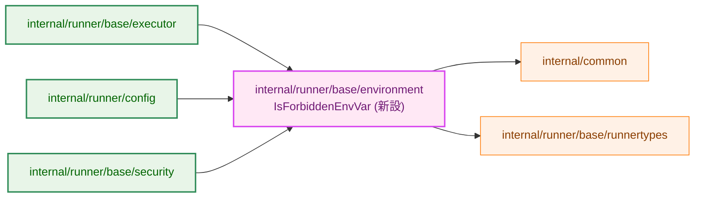

**矢印の意味**: `A → B` は「A が B を import する」というパッケージ依存の向きを表す。

**凡例**:

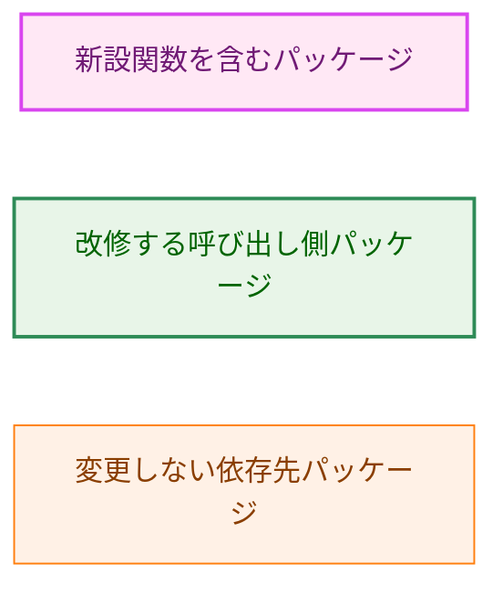

### 2.2 config 層の判定呼び出し箇所

config 層では、既存の `ProcessEnvImport`（`env_import` を処理）に加え、`ProcessEnv`（`env_vars` を処理）でも同じ判定関数を呼び出す。これにより「TOML に直書きした denylist 該当 KEY」も config ロード時にエラーとなる（AC-07）。両者は同一の判定関数と同系統のエラー型 `ErrForbiddenEnvVar` を用いる（AC-08）。

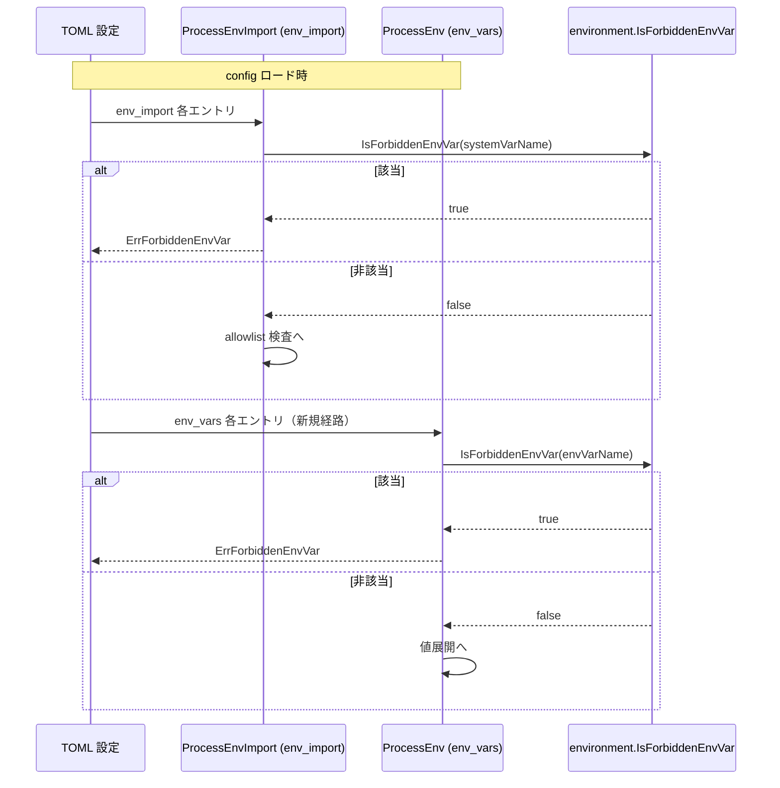

**矢印の意味**: 実線 `->>` は呼び出し、破線 `-->>` は戻り値を表す（シーケンス図の標準記法）。色分けクラスは用いないため凡例は不要である。

---

## 3. コンポーネント設計

### 3.1 新設する判定関数（`environment` パッケージ）

`environment` パッケージに、変数名を受け取り denylist 該当有無を返す公開関数を新設する。prefix 一致リストと完全一致リストはパッケージ内部（非公開）に定義し、関数のみを公開インターフェースとする。3つの呼び出し箇所は自前のリスト定義を削除し、この関数を参照する（AC-01, AC-03）。

```go
// Package environment (追加分の高レベルインターフェース)

// IsForbiddenEnvVar reports whether name is on the process-environment denylist:
// a dynamic-loader control variable (LD_*, DYLD_*, and the exact-match locale/
// resolver names) or an interpreter startup code-injection variable (BASH_ENV,
// PYTHONPATH, ...) that must never reach a child process.
//
// Matching is case-sensitive (see 02_architecture.md 6.2 for rationale).
// The canonical list of names is docs/tasks/0156_.../01_requirements.md.
func IsForbiddenEnvVar(name string) bool
```

判定の内訳（prefix 一致 / 完全一致の別、および具体的な変数名）は [01_requirements.md](01_requirements.md) の「対象変数リスト（暫定）」を唯一の典拠とする。同節に列挙された「実装時に採否を再検討する候補」（`BASH_FUNC_*`, `RUBYLIB`, `PYTHONHOME`, `LESSOPEN`/`LESSCLOSE`）の扱いは実装時に判断し、確定した内容を要件側のリストへ反映する。本書では個別名を再掲しない（二重管理の回避）。

### 3.2 コンポーネント責務一覧

新設・改修するファイルと、既存挙動を保存する必要から更新が要るテストを以下に示す。

| ファイル | 区分 | 責務 / 変更内容 | 更新が要る既存テスト |
|---|---|---|---|
| `internal/runner/base/environment/denylist.go`（新規、ファイル名は実装時確定） | 新設 | `IsForbiddenEnvVar` と prefix/完全一致リストを定義。 | （新規テストを追加） |
| `internal/runner/base/environment/denylist_test.go`（新規） | 新設 | prefix 一致・完全一致・非該当・大文字小文字を検証。対象変数リストを range して網羅検証（AC-02, AC-06, AC-13）。 | — |
| `internal/runner/base/executor/environment.go` | 改修 | `BuildProcessEnvironment` の inline スクラブ（`LD_` prefix + 固定5個）を `environment.IsForbiddenEnvVar` 呼び出しに置換。削除挙動は維持（AC-09）。 | `internal/runner/base/executor/environment_test.go`（`TestBuildProcessEnvironment_AllLDVarsRemoved` 等。DYLD_/GLIBC_TUNABLES/インタプリタ変数の削除ケースを追加） |
| `internal/runner/config/expansion.go` | 改修 | `forbiddenEnvVarPrefixes`/`forbiddenEnvVarExact`/`isForbiddenEnvVar` を削除し `environment.IsForbiddenEnvVar` に置換。`ProcessEnv`（env_vars）にも同判定を追加（AC-07, AC-08）。 | `internal/runner/config/expansion_test.go`, `internal/runner/config/expansion_unit_test.go`（`isForbiddenEnvVar` 直接参照テストを共有関数向けに更新。env_vars KEY 拒否ケースを追加） |
| `internal/runner/base/security/indirect_execution.go` | 改修 | `isLoaderControlVar` を削除し、`checkEnvAssignment` から `environment.IsForbiddenEnvVar` を呼ぶ。Reject/Blocking 分類は維持（AC-10）。 | `internal/runner/base/security/indirect_execution_test.go`（DYLD_/固定5個/GLIBC_TUNABLES/インタプリタ変数の Reject ケースを追加。§6.3 の挙動拡張に対応）、`internal/runner/base/risk/evaluator_test.go`（`TestEvaluateRisk_IndirectExecutionDeny`。Reject の end-to-end 回帰点。拡張分の Reject ケースを追加） |
| `docs/user/security-risk-assessment.md` / `.ja.md` | 改修 | denylist 拡張後の対象範囲に整合（AC-11）。 | — |
| `docs/dev/architecture_design/security-architecture.md` / `.ja.md` | 改修 | 「Environment Manipulation」節等を拡張後の denylist に整合（AC-11）。 | — |

> 既存の `ProcessEnv` は現状 `env_vars` KEY に対し `security.ValidateVariableName`（形式検査）のみを行い denylist 検査を行っていない。本改修はこの経路に denylist 検査を1件追加するもので、形式検査の順序・既存エラー型は変えない。

---

## 4. エラーハンドリング設計

判定関数 `IsForbiddenEnvVar` は `bool` を返すのみでエラーを持たない。エラー化は各呼び出し層の責務であり、既存のエラー型・エラー系統をそのまま用いる。

| 層 | 該当時の返却 | エラー型 / 分類 | 既存/新規 |
|---|---|---|---|
| 実行層 | なし（該当変数を map から削除するのみ、fail-silent） | — | 既存挙動を維持 |
| config 層（env_import） | `error` | `ErrForbiddenEnvVar`（`internal/runner/config/errors.go`） | 既存 |
| config 層（env_vars、新規経路） | `error` | 同上 `ErrForbiddenEnvVar` を用いる（AC-08） | 判定は既存、経路が新規 |
| security 層 | `IndirectExecutionResult`（Reject） | `risktypes.ReasonForbiddenEnvVar` を理由コードとする Reject/Blocking | 既存 |

エラーメッセージ設計:

- config 層の env_vars 経路は、既存の env_import 経路と同一のメッセージ様式（`%w: <NAME> ... (level: <level>)`）に揃え、利用者が「どちらの経路で拒否されたか」ではなく「どの変数が禁止か」を一貫して読み取れるようにする。フィールド（level, 変数名）は既存 detail エラー群と整合させる。

---

## 5. 主要処理フロー

### 5.1 実行層: 最終環境からの削除

実行層は system/vars/command のすべての出所をマージした後、denylist 該当変数を出所を問わず削除する（fail-silent スクラブ、AC-09）。この「マージ後に一括削除」という順序・挙動は現状のまま維持し、判定だけを共有関数へ委譲する。

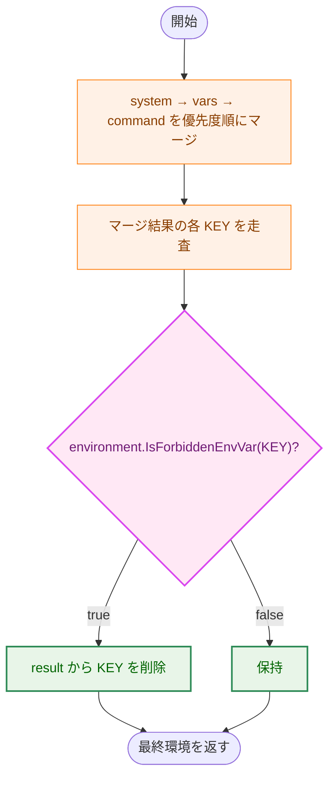

**矢印の意味**: 実線 `A → B` は処理の遷移順を表す。分岐ラベル（`true`/`false`）は判定結果に応じた経路を表す。

**凡例**:

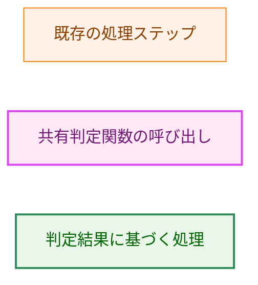

### 5.2 security 層: 間接実行の Reject 分類

security 層は `env NAME=VALUE cmd ...` の各割り当てトークンについて、KEY が denylist 該当なら Reject（Blocking）へ倒す（AC-10）。判定を共有関数へ委譲することで、従来 `isLoaderControlVar` が扱っていた `LD_*`/`DYLD_*` に加え、完全一致リストとインタプリタ起動時コード注入変数も Reject 対象へ広がる（§6.3 参照）。

---

## 6. セキュリティ考慮事項

### 6.1 脅威モデル

本タスクが対処するのは「検証済みのコマンド/インタプリタに対し、環境変数経由でコードやライブラリを注入する攻撃」である。`LD_PRELOAD` に代表される動的ローダ制御変数だけでなく、`BASH_ENV`・`PYTHONPATH` 等の「インタプリタが起動時に読むファイルを差し替える変数」も同じ注入経路であり、一方だけを塞ぐのは非対称である。本タスクは3層すべてで同一の denylist を適用することでこの非対称を解消する。

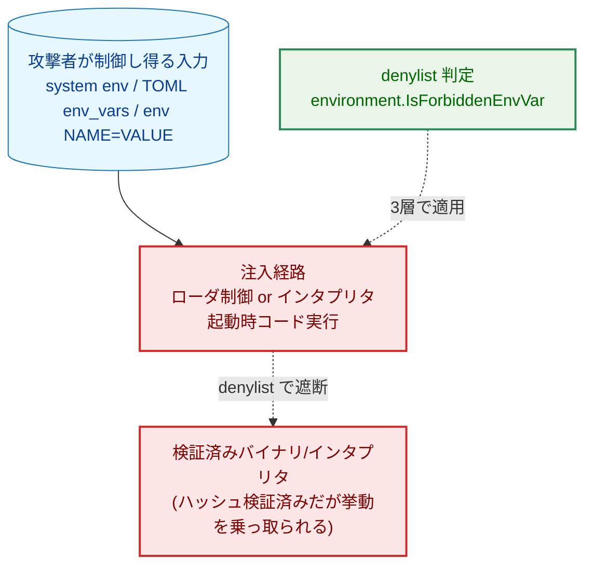

**矢印の意味**: 実線 `A → B` は攻撃の流れ（A が B へ至る）を表す。破線はその流れに対する防御の適用点を表す。

**凡例**:

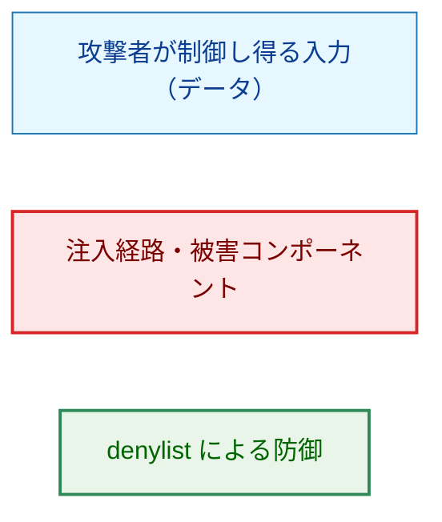

### 6.2 大文字小文字の扱い（case セマンティクス）

一元化前の3実装は case の扱いが非対称だった（実行層・config 層は case-sensitive、security 層は `strings.ToUpper` による case-insensitive）。共有判定関数は **case-sensitive**（変数名を正規化せず、正確なスペルのみを denylist と照合する）を採用する（AC-12）。

**根拠**:

- Unix の環境変数名は case-sensitive であり、`execve(2)` は環境をバイト列としてそのまま子プロセスへ渡す。動的ローダ（glibc の `ld.so`）およびシェル/Python/Perl 等のインタプリタは、いずれも正確なスペル（`LD_PRELOAD` 等）のみを解釈し、`ld_preload` のような別綴りは無視する。したがって攻撃能力を持つのは正確なスペルのみであり、case-sensitive 照合で実際の攻撃面を過不足なく捉えられる。
- case-insensitive 化は `ld_preload` のような「ローダが解釈しない無害な変数」まで拒否する過剰防御であり、正当な設定を誤って弾く可能性がある一方、遮断すべき攻撃面を増やさない。
- 3層のうち2層（実行層・config 層）が既に case-sensitive であり、case-sensitive を採ることでこれら2層の観測挙動は不変に保てる（AC-13 の「従来 case-sensitive だった executor/config の挙動が意図せず変化しない」を満たす）。

**security 層への影響（意図的な挙動変更）**: security 層の旧 `isLoaderControlVar` は `strings.ToUpper` で case-insensitive 照合していた。この正規化はコード上のコメントで「小文字綴り（`ld_preload` 等）をすり抜けさせないため」という fail-closed 目的が明記された意図的な選択である。本設計はこの正規化を不要と評価して case-sensitive へ変更する。根拠は §6.2 冒頭と同じで、動的ローダ・インタプリタは正確なスペルのみを解釈するため小文字綴りは子プロセスで攻撃能力を持たず、正規化は誤検知（無害な変数の拒否）を増やすだけで防御面を広げないためである。したがって共有関数を case-sensitive とすることで security 層は `env ld_preload=... cmd`（小文字綴り）を Reject しなくなるが、これは実際の攻撃面ではないため防御上の後退ではない。既存テスト `internal/runner/base/security/indirect_execution_test.go` は `LD_PRELOAD`・`DYLD_*` を大文字綴りでのみ検証しており（`internal/runner/base/risk/evaluator_test.go` の `TestEvaluateRisk_IndirectExecutionDeny` も同様に大文字綴り）、この変更で失敗する既存アサーションは存在しない。case セマンティクスを固定するため、case-sensitive を明示検証する単体テスト（`ld_preload` が非該当、`LD_PRELOAD` が該当）を新設する（AC-13）。

### 6.3 security 層のカバレッジ拡張（意図的な挙動変更）

旧 `isLoaderControlVar` は prefix（`LD_`/`DYLD_`）のみを判定し、完全一致リスト（`GCONV_PATH` 等）やインタプリタ起動時コード注入変数を含んでいなかった。共有関数へ委譲することで、security 層の Reject 対象はこれらへ拡張される（AC-05, AC-06）。すなわち `env GCONV_PATH=... cmd` や `env BASH_ENV=... cmd` が新たに Reject（Blocking）となる。これは要件が求める3層の対称化そのものであり、意図的な拡張である。既存 security テストにこれらを「非 Reject」と断言するアサーションは存在しないため、この拡張で失敗する既存テストはなく、新規に Reject ケースのテストを追加する。

### 6.4 他アーキテクチャ文書のポリシーとの関係

本設計は他タスクのアーキテクチャ文書が確立したポリシーへ例外を持ち込むものではない。security 層の Reject 分類（`internal/runner/base/security`、Task 0138/0144 系の間接実行リスク評価）や実行層の環境隔離（`security-architecture.md` の Environment Variable Isolation）の枠組みはそのまま維持し、判定リストのみを差し替える。したがって「既存ポリシーへの例外」に該当する項目はない（該当なし）。

### 6.5 変数名構築による判定回避への耐性

security 層の間接実行解析は、`%{VAR}` 展開を済ませた `RuntimeCommand.ExpandedArgs` を対象に実行される。したがって `env %{X}_PRELOAD=... cmd` のように内部変数展開で禁止変数名を組み立てても、判定は展開後の最終的な変数名に対して行われ、denylist を回避できない。この fail-closed の性質は本タスクの改修後も維持される（判定関数の呼び出し位置は既存と同じ展開後段階のため）。

### 6.6 実行層 fail-silent スクラブの可観測性に関する残存ギャップ

実行層の削除は fail-silent であり、AC-09 によりこの挙動は維持する。この設計には既知の可観測性ギャップが残る点を明示する。

- `env_vars`・`env_import` に denylist 該当 KEY を書いた場合は config 層が `ErrForbiddenEnvVar` で明示的に拒否するため、ログから拒否理由を説明できる（本タスクで新設する env_vars 経路も同様）。
- 一方、`env_allowlist` に denylist 該当変数名を列挙した場合は、config ロードは成功し、実行時に実行層のスクラブで黙って除去される。この経路はエラーもログも出さないため、「設定した変数がなぜ子プロセスに渡らないのか」をログから説明できない。この挙動は既存コード（`internal/runner/config/errors.go` の `ErrForbiddenEnvVar` 付近のコメント）でも「env_allowlist 上の禁止変数は silently ineffective」と既に明記されている残存事項であり、本タスクの denylist 拡張によって黙って除去される変数の集合が広がる（`DYLD_*`, `GLIBC_TUNABLES`, `PYTHONPATH` 等が加わる）。

本タスクでは、実行層の役割を「最終防衛線としての冪等なスクラブ」と位置づけ、この経路を fail-silent のまま維持する（AC-09 準拠）。`env_allowlist` エントリに対する config ロード時の明示拒否や、スクラブ時のログ出力は、AC-09 の「fail-silent スクラブは変更しない」という制約と整合を取る必要があるため、本タスクのスコープ外とし、将来の可観測性改善（別タスク）の候補として記録する。利用者影響は、denylist 該当変数を意図的に子プロセスへ渡す正当なユースケースが現時点で存在しない（要件のスコープ外・エスケープハッチ非提供）ことから限定的である。

### 6.7 ロールアウトと後方互換性（破壊的変更を含む）

本タスクは denylist を拡張するため、**改修前に有効だった一部の設定が改修後にロードエラーになる破壊的変更を含む**。影響と移行手順を以下に整理する。

- **破壊的変更の内容**: `env_vars` または `env_import` で、新たに denylist へ加わる変数（`DYLD_*`、`GLIBC_TUNABLES`、および `BASH_ENV`・`PYTHONPATH`・`NODE_OPTIONS`・`GIT_SSH_COMMAND` 等のインタプリタ起動時コード注入変数）を指定していた設定は、改修後は config ロード時に `ErrForbiddenEnvVar` で失敗する。エラーは該当グループのロードを止めるため、影響範囲は当該変数を含むグループ全体に及ぶ。
- **移行手順（dry-run による事前検知）**: dry-run 実行は本番と同じ config ロード・リスク評価経路を通るため、アップグレード前に dry-run を実行することで、新たにエラー化する設定を切り替え前に検出できる。運用手順として「アップグレード前に対象設定を dry-run し、`ErrForbiddenEnvVar` が出ないことを確認する」ことを推奨する。
- **エラーの説明可能性**: `ErrForbiddenEnvVar` のメッセージは禁止変数名と level を含む。利用者が「なぜ拒否されたか」「何を消せばよいか」を理解できるよう、ドキュメント（AC-11 で更新するセキュリティ文書）に、対象変数の一覧と拒否の根拠、および該当変数を `env_vars`/`env_import` から除く対処を記載する。
- **`ENV` 変数の扱いに関する留意**: 対象変数リストには `ENV` が含まれる。`ENV` は `ENV=production` 等の一般的なデプロイ変数として広く使われるため、denylist 化による誤ブロックの発生頻度が他の変数より高い一方、POSIX の `$ENV` はおもに対話シェルで解釈され、本ランナーの非対話実行における注入強度は相対的に低い（非対話スクリプト経路の主ベクタは既に採用済みの `BASH_ENV` である）。このトレードオフは実装時に再評価し、採用を維持する場合はその判断を明記する。判定が過剰と結論する場合は要件（[01_requirements.md](01_requirements.md) 対象変数リスト）へ差し戻して調整する。

### 6.8 対象外（本タスクで扱わない）

- A4 M-2（`SanitizeEnvironmentVariables` の値ベース redaction 不足）: denylist とは別系統であり対象外。
- インタプリタ変数の denylist に対するエスケープハッチ（明示許可上書き）: YAGNI により見送り。
- `env` 経由間接実行の allowlist 方式への転換: 本タスクは denylist 拡充で対応する。

---

## 7. テスト戦略

### 7.1 単体テスト（`environment` パッケージ）

- prefix 一致（`LD_*`, `DYLD_*`）・完全一致（`GLIBC_TUNABLES` 等）・非該当ケースをそれぞれ検証する（AC-02）。
- 網羅検証（AC-06）は、`environment` パッケージが持つ denylist 定義（完全一致リスト）を **テストコード側で直接 range** し、各エントリが `IsForbiddenEnvVar` で該当することを確認する。これによりリストへの追加が自動的にテスト対象へ反映され、複製表とメタテストの二重管理を避けられる。ただしこの range テストが照合するのは「コード上のリスト」であり、要件（[01_requirements.md](01_requirements.md)「対象変数リスト（暫定）」）が意図する集合とコード上のリストが一致していること自体は、この自己参照的なテストでは保証されない。要件とコードの一致は、要件リストを唯一の典拠としてコードへ反映し、レビューで突き合わせることで担保する（AC-06 を「コードとテストの内部整合」ではなく「要件充足」まで含めて満たすための前提）。prefix 一致（`LD_*`, `DYLD_*`）については代表的な変数名（`LD_PRELOAD`, `DYLD_INSERT_LIBRARIES` 等）で該当を検証する。
- case-sensitive セマンティクスの検証（`ld_preload` 非該当・`LD_PRELOAD` 該当、AC-13）。

### 7.2 各層の統合的挙動テスト

- **実行層**: `DYLD_*`・`GLIBC_TUNABLES`・インタプリタ起動時コード注入変数が、出所（system/vars/command）を問わず最終環境から削除されることを検証（AC-04, AC-05, AC-06, AC-09）。既存の LD_* / 固定5個の削除テストが引き続き pass することも確認。
- **config 層**: `env_import` と `env_vars` の両方で denylist 該当 KEY がロードエラーになること、両者が同一エラー型 `ErrForbiddenEnvVar` を返すことを検証（AC-04〜AC-08）。
- **security 層**: `env NAME=VALUE cmd` 形式で denylist 該当割り当てが Reject（Blocking）に分類されること、および §6.3 の拡張分（完全一致リスト・インタプリタ変数）も Reject されることを検証（AC-05, AC-06, AC-10）。`indirect_execution_test.go` の解析関数レベルに加え、`internal/runner/base/risk/evaluator_test.go` の `TestEvaluateRisk_IndirectExecutionDeny`（`EvaluateRisk` 経由の end-to-end 回帰点）でも拡張分の Reject を検証する。

### 7.3 静的検証

- 3パッケージから独自リスト定義（`forbiddenEnvVarPrefixes`/`forbiddenEnvVarExact`/`isForbiddenEnvVar`/`isLoaderControlVar`）が削除され重複が残っていないことを `grep` 等で確認（AC-03）。
- `make test` / `make lint` がグリーンであること。

---

## 8. 実装の優先順位

1. **フェーズ1（基盤）**: `environment` パッケージに `IsForbiddenEnvVar` とリスト定義を新設し、単体テスト（AC-01, AC-02, AC-06, AC-13）を通す。対象変数リストの範囲（採否候補の確定含む）をここで固める。
2. **フェーズ2（実行層）**: `BuildProcessEnvironment` を共有関数へ委譲。既存削除テストの継続 pass と新規変数の削除テストを確認（AC-04, AC-05, AC-06, AC-09）。
3. **フェーズ3（config 層）**: `isForbiddenEnvVar` を共有関数へ置換し、`ProcessEnv`（env_vars）へ判定を追加。env_import/env_vars 双方のエラーテスト（AC-07, AC-08）。
4. **フェーズ4（security 層）**: `isLoaderControlVar` を共有関数へ置換。case セマンティクスとカバレッジ拡張のテスト（AC-10, §6.2, §6.3）。
5. **フェーズ5（文書）**: セキュリティ関連ドキュメントを拡張後の denylist に整合（AC-11）。
6. **フェーズ6（静的検証）**: 重複定義が残っていないことの確認（AC-03）と全体グリーン化。

---

## 9. 将来拡張性

- **denylist への変数追加**: 追加は `environment` パッケージのリスト定義1箇所の編集で3層すべてに反映される。AC-06 のテストが要件リストを range する構成のため、要件側リストへの追記に追随したテスト更新のみで網羅が保たれる。
- **エスケープハッチ（明示的許可上書き）**: 現時点では YAGNI により実装しない（要件スコープ外）。将来ビルドツール等が正当に `PYTHONPATH` 等を必要とする事例が問題化した場合に、別タスクで allowlist 併用機構を検討する余地を残す。判定関数が単一箇所に集約されていることで、そうした拡張の導入点も一意になる。
- **動的（実行時）な denylist 更新**: 対象外。リストは静的なコード内定義を維持する。

---

## 付録: 決定履歴

- 判定ロジックとリストのみを一元化し、検知後の挙動（削除/ロードエラー/Reject）は層ごとに保存する方針は、要件（[01_requirements.md](01_requirements.md) 目的節）に基づく。
- case セマンティクスを case-sensitive に統一した経緯・根拠は §6.2 に記す。旧 security 層の case-insensitive（`strings.ToUpper`）は本タスクで case-sensitive へ変更する。
</content>
</invoke>
