# アーキテクチャ設計書: フィルタ未実装・命名と実装の乖離の整理（デッドコード削除含む）

## Document Status

| Item | Value |
|---|---|
| Status | `draft` |
| Created | 2026-07-26 |
| Review date | - |
| Reviewer | - |
| Comments | - |

## 関連文書

- 要件定義: [01_requirements.md](01_requirements.md)
- 要件プロセス: [requirements_process.md](../../dev/developer_guide/requirements_process.md)
- Mermaid 記法リファレンス: [mermaid_reference.md](../../dev/developer_guide/mermaid_reference.md)
- テスト構成ガイド: [test_organization.md](../../dev/developer_guide/test_organization.md)
- パッケージ構成リファレンス: [package_reference.md](../../dev/developer_guide/package_reference.md)
- セキュリティアーキテクチャ: [security-architecture.ja.md](../../dev/architecture_design/security-architecture.ja.md) / [security-architecture.md](../../dev/architecture_design/security-architecture.md)
- 関連 Issue: [#864](https://github.com/isseis/go-safe-cmd-runner/issues/864)

---

## 1. 設計の全体像

### 1.1 本設計が対象とする構造

本タスクは新機能を追加しない。4 つのパッケージに共通して現れる次の構造を取り除く。

**防御を示唆する名前と、実装が行うことのずれ。** `Filter`（絞り込む）、`EUID`（実効ユーザー ID）、`changeUserGroup`（ユーザーとグループを変更する）といった識別子は、読み手に「ここで検査や権限降格が行われている」と伝える。しかし実装はいずれもそれを行っていない。読み手が名前を信じてコードを読み進めると、実際には存在しない防御層を勘定に入れてしまうことになる。

この構造がもたらす害は 2 つある。第一に、監査のたびに「この名前は本当か」を実装まで降りて確かめる必要が生じ、確認の手間が積み上がる。第二に、将来の変更者が名前を信じて戻り値を転用したとき、本人は防御を通したつもりのまま防御を素通りさせてしまう。要件定義書はこれを「誤用一歩手前の footgun（誤って自分を撃つ仕掛け）」と呼んでいる。

### 1.2 設計原則

- **名前を実装に合わせる。** 実装を名前に合わせる（＝本当にフィルタする、本当に降格する）方向は採らない。実効的な検査は既に別の層に存在しており、そちらへ寄せるのが正しい構造だからである。個別の根拠は各 Phase の節に記す。
- **到達しないコードは残さない。** 特権 syscall を含む到達不能なコードは、分岐条件が一行変わるだけで有効化される。検証されないまま有効化される経路を作らないため、削除する。
- **削除で失われる制約は、別の形で置き換える。** 到達不能なコードを消すと、そのコードを「呼ばせない」ために存在していた条件分岐やテストも一緒に消える。消してよいのは条件が構造的に成り立ち続ける場合だけであり、そうでない場合は静的検査などの代替手段を用意する（§2.2.4、§7.2）。
- **外部から観測できる挙動を変えない。** 本タスクは削除・改名・doc 修正に限る。例外は Phase 3 の一点のみで、これは §5.4 に切り出して明示する。
- **Phase 間に依存を作らない。** 4 つの Phase は別パッケージを触る。どの順で実施しても、またどれかを見送っても、他が成立する構成にする。

### 1.3 概念モデル

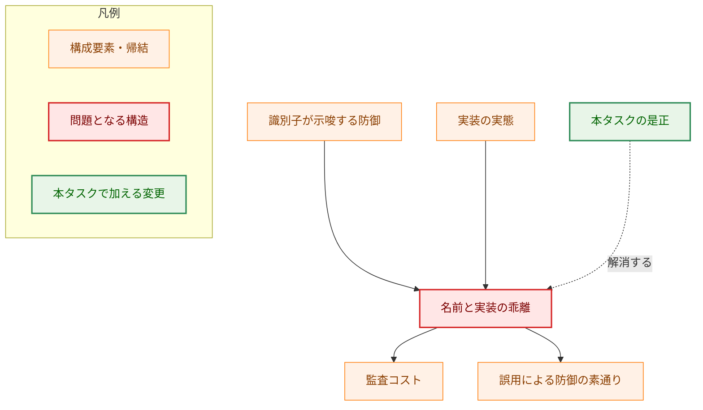

実線の矢印 A → B は「A が B を生じさせる」を表す。破線の矢印はラベルどおり「A が B を解消する」を表し、実線が表すのとは逆の関係（生じさせるのではなく取り除く）であることを示す。

### 1.4 4 箇所の対応関係

| Phase | パッケージ | 識別子が示唆すること | 実装が行っていること | 実効的な検査の所在 |
|---|---|---|---|---|
| 1 | `runner/base/environment` | allowlist による環境変数の絞り込み | 全変数をそのまま複製 | §1.5 のとおり 2 箇所（`config.ProcessEnvImport` と `executor.BuildProcessEnvironment`） |
| 2 | `runner/base/privilege` | 対象ユーザーへの権限降格 | root への昇格のみ | `executor` の `syscall.Credential`（[executor.go:217-222](../../../internal/runner/base/executor/executor.go)） |
| 3 | `groupmembership` | 実効 UID（EUID）の取得 | 実 UID（real UID）の取得 | 該当なし（名前のみの問題） |
| 4 | `fileanalysis` | `cmd/record` が使う解析結果ストア | どこからも呼ばれない | 該当なし（本番経路が存在しない） |

Phase 1 と Phase 2 は「実効的な検査が別の層に既にある」ため、名前を実装に合わせる方向が正しい。Phase 3 は検査の所在の問題ではなく、単に名前が事実と異なる。Phase 4 は検査でも何でもなく、単に到達しないコードである。

### 1.5 環境変数の検査が実際に行われている 2 箇所

Phase 1 の前提として、`Filter` が行っていない allowlist 照合が実際にはどこで行われているかを明確にする。設計調査の結果、**照合は 1 箇所ではなく 2 箇所**にある。

1. **`config.ProcessEnvImport`**（[expansion.go:281-347](../../../internal/runner/config/expansion.go)）: `env_import` で宣言されたシステム環境変数について、変数名の検証、denylist 判定、allowlist 照合、重複定義の拒否を設定展開時に行う。違反は設定ロードエラーになる。
2. **`executor.BuildProcessEnvironment`**（[environment.go:49-92](../../../internal/runner/base/executor/environment.go)）: 子プロセス環境を組み立てる際、Step 1 で生のシステム環境を `runtimeGlobal.EnvAllowlist()` で絞り込んで取り込む。すなわち `env_import` で宣言していないシステム変数も、allowlist に載っていれば子プロセスへ渡る。最後に `environment.IsForbiddenEnvVar`（[denylist.go](../../../internal/runner/base/environment/denylist.go)、0156 で追加）による denylist 除去が全変数に対して適用される。

この 2 箇所はどちらも `Filter` を経由しない。したがって `Filter` の削除はいずれの検査にも影響しない。一方で「allowlist 判定ロジックが分散している」こと自体は 0149 監査の A3 F-7 が指摘した所見であり、要件定義書のスコープ外節が別途検討としている。本タスクでは統合しない。

この節を設けた理由は、Phase 1 の安全性が「allowlist 照合は別の層にある」という前提に依存しており、その別の層を 1 箇所と誤認したまま設計すると前提の検証が不完全になるためである。

---

## 2. システム構成

### 2.1 Phase 1: `environment` パッケージの縮退と `Runner` のデッドコード削除

#### 2.1.1 現状

`environment.Filter` は `NewFilter(allowList []string)` で allowlist を受け取り `globalAllowlist` に保持するが、このフィールドを読むコードは存在しない。`FilterSystemEnvironment` / `FilterGlobalVariables` は allowlist 照合を行わず、空の変数名を捨てて残りを複製するだけである。

`Runner.LoadSystemEnvironment` はその戻り値を `Runner.envVars` に格納するが、`envVars` を読むコードも存在しない。結果として `cmd/runner/main.go:421` の呼び出しは、全システム環境変数（機密値を含む）の複製をプロセス寿命の間メモリに保持するだけの処理になっている。

一方 `ParseSystemEnvironment` は [expansion.go:866](../../../internal/runner/config/expansion.go) の `ExpandGlobal` から呼ばれる現役の機能であり、`runtime.SystemEnv` の唯一の構築元である。したがって本 Phase はパッケージの削除ではなく、提供する機能をシステム環境の列挙だけに絞り込む**縮退**となる。

```mermaid
flowchart TD
    classDef data fill:#e6f7ff,stroke:#1f77b4,stroke-width:1px,color:#0b3d91;
    classDef process fill:#fff1e6,stroke:#ff7f0e,stroke-width:1px,color:#8a3e00;
    classDef problem fill:#ffe6e6,stroke:#d62728,stroke-width:2px,color:#7b0000;
    classDef enhanced fill:#e8f5e8,stroke:#2e8b57,stroke-width:2px,color:#006400;

    subgraph Before["変更前"]
        BENV[("os.Environ()")]
        BPARSE["Filter.ParseSystemEnvironment"]
        BFILT["Filter.FilterSystemEnvironment"]
        BLOAD["Runner.LoadSystemEnvironment"]
        BVARS[("Runner.envVars")]
        BEXP["config.ExpandGlobal"]
        BSYS[("RuntimeGlobal.SystemEnv")]
        BIMP["config.ProcessEnvImport"]

        BENV --> BPARSE
        BPARSE --> BFILT
        BFILT --> BLOAD
        BLOAD --> BVARS
        BPARSE --> BEXP
        BEXP --> BSYS
        BSYS --> BIMP
    end

    subgraph After["変更後"]
        AENV[("os.Environ()")]
        APARSE["environment.ParseSystemEnvironment"]
        AEXP["config.ExpandGlobal"]
        ASYS[("RuntimeGlobal.SystemEnv")]
        AIMP["config.ProcessEnvImport"]

        AENV --> APARSE
        APARSE --> AEXP
        AEXP --> ASYS
        ASYS --> AIMP
    end

    subgraph Legend["凡例"]
        L1[("データ")]
        L2["変更のない既存コンポーネント"]
        L3["削除対象"]
        L4["変更後のコンポーネント"]
    end

    class BENV,BVARS,BSYS,AENV,ASYS,L1 data
    class BPARSE,BEXP,BIMP,AEXP,AIMP,L2 process
    class BFILT,BLOAD,L3 problem
    class APARSE,L4 enhanced
```

矢印 A → B は「A の出力が B の入力になる」を表す。変更前の図で `BFILT → BLOAD → BVARS` の経路は、終端の `BVARS` が誰からも読み出されず、以降のどこにも接続しない。この行き止まりが Phase 1 で削除する範囲である。

#### 2.1.2 設計判断: 型を残さずパッケージ関数にする

`globalAllowlist` を削除すると `Filter` はフィールドを 1 つも持たない構造体になり、残る操作は `ParseSystemEnvironment` の 1 つだけになる。状態を持たない型にコンストラクタとメソッドを付けたままにすると、呼び出し側に「保持された設定に基づいて動く」という誤った印象を与え続ける。これは本タスクが取り除こうとしている構造そのものである。

したがって型を廃し、`environment.ParseSystemEnvironment()` というパッケージ関数にする。関数本体は現行のまま移す（AC-03 が要求する出力の同一性は、本体を変更しないことで保証する）。

> **より単純な既存手法で足りないか（YAGNI 検討）**
> 「`Filter` 型を残したまま `SystemEnvReader` などに改名するだけ」で AC-01・AC-02 は形式的には満たせる。これを採らないのは、AC-01 が allowlist 引数の削除を要求する結果、コンストラクタが引数なし・構造体がフィールドなしになり、型の存在自体が意味を失うためである。呼び出し側に無意味な生成処理を残すことになり、要件定義書の目的（誤読を招く構造の除去）に反する。

#### 2.1.3 同一処理の重複と、その扱い

`executor` パッケージに、`ParseSystemEnvironment` と処理が一致する非公開関数 `getSystemEnvironment`（[environment.go:105-114](../../../internal/runner/base/executor/environment.go)）が存在する。どちらも `os.Environ()` を走査し `common.ParseKeyValue` で分解して `map[string]string` を返すもので、動作に差はない。`getSystemEnvironment` は `BuildProcessEnvironment` から呼ばれる現役のコードである。

Phase 1 は「システム環境の列挙を、実態に即した名前の単一の関数として提供する」ことを目的とするため、重複を放置すると目的が半分しか達成されない。したがって `executor.getSystemEnvironment` を削除し、呼び出しを `environment.ParseSystemEnvironment()` に置き換える。

依存の向きに問題はない。`executor` は既に `environment` を import している（denylist 判定 `environment.IsForbiddenEnvVar` を 0156 で導入した際に追加された）。処理内容が同一のため、`BuildProcessEnvironment` の出力は変わらない。

#### 2.1.4 連鎖して不要になる要素

`FilterGlobalVariables` を削除すると、その引数型である `Source`（`SourceSystem` / `SourceEnvFile`）を参照するコードが本番・テストの双方から消える。要件定義書は `Source` に言及していないが、AC-02 の帰結として必ず未使用になるため、本設計では削除対象に含める。

同様に、`filter.go` 冒頭のパッケージコメントは「allowlist-based access control」と述べているが、Phase 1 後のパッケージが提供するのはシステム環境の列挙（改名後の `system_env.go`）と denylist 判定（`denylist.go`）であり、allowlist は扱わない。パッケージコメントも実態に合わせて書き換える。

ファイル名も実態に合わせる。`filter.go` にフィルタは存在しないため `system_env.go` へ、`filter_test.go` は `system_env_test.go` へ改名し、空の `filter_benchmark_test.go` は削除する。

### 2.2 Phase 2: `privilege` パッケージの到達不能な降格パスの削除

#### 2.2.1 現状

`executionContext.needsUserGroupChange` が `true` になるのは `OperationUserGroupDryRun` のみである（[unix.go:154-166](../../../internal/runner/base/privilege/unix.go)）。dry-run では `changeUserGroupInternal` が `dryRun=true` で呼ばれ、ログ出力後に早期リターンする。したがって同関数の後半にある `Setegid` / `Seteuid` の実行、`Seteuid` 失敗時の EGID ロールバック、ロールバック失敗時の `emergencyShutdown` は、本番のどの操作からも到達しない。

`performElevation` 内のロールバックブロック（[unix.go:182-186](../../../internal/runner/base/privilege/unix.go)）も同様である。このブロックは `needsPrivilegeEscalation` と `needsUserGroupChange` が同時に `true` である場合にのみ意味を持つが、その組み合わせを生む operation は存在しない。

実際のユーザー切り替えは executor が担っている。[executor.go:217-222](../../../internal/runner/base/executor/executor.go) が `syscall.Credential` を構築し、子プロセスの起動時にカーネルが execve の時点で UID・GID・補助グループを一括して適用する。親プロセスの実効 UID を書き換える方式と異なり、切り替えと実行の間に隙間が生じない。

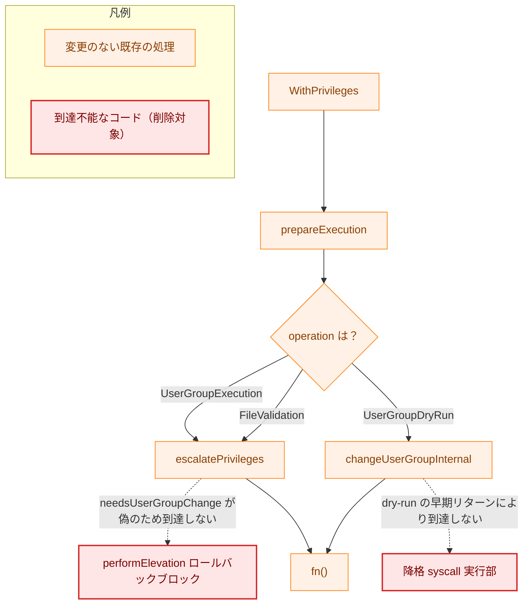

実線の矢印 A → B は「A から B へ制御が渡る」を表す。破線の矢印は「コード上は接続しているが、ラベルに示した理由で実行されない経路」を表し、Phase 2 の削除対象を示す。分岐ラベルは `prepareExecution` が判定する operation の種別である。

なお、子プロセスへの `syscall.Credential` の適用は本図に含めていない。`Credential` は `WithPrivileges` を呼ぶ前に executor 側で構築され（[executor.go:217-222](../../../internal/runner/base/executor/executor.go)）、`fn()` の内部で execve 時にカーネルが適用するものであり、本図が表す privilege パッケージ内の制御フローとは、担当するコンポーネントも実行順序も異なるためである。

#### 2.2.2 削除範囲と、残す処理

削除するのは「実際に降格する」部分だけである。dry-run で行われる**ユーザー名・グループ名の解決**は残す。この解決は単なるログ用の飾りではなく、検証として機能している。[dryrun_manager.go:287-290](../../../internal/runner/resource/dryrun_manager.go) は `WithPrivileges` が返したエラーを受けて解析結果の `SecurityRisk` を `high` に引き上げるため、`user.Lookup` の失敗は dry-run の出力に現れる。

ただし、この解決が実行時の解決と**同じ検査ではない**ことを明記する。両者は別実装であり、次の差がある。

| | dry-run 経路 | 実行時経路 |
|---|---|---|
| 実装 | `changeUserGroupInternal`（改名後 `resolveUserGroupForDryRun`） | `risktypes.ResolveRunAsIdent`（[runas_ident.go:55-89](../../../internal/runner/base/risktypes/runas_ident.go)） |
| ユーザー・グループ名の解決 | 行う | 行う |
| 補助グループの列挙 | 行わない | 行う（`u.GroupIds()`） |
| 補助グループ列挙失敗時 | 検知しない | executor が `ErrRunAsIdentityResolution` で実行を拒否（[executor.go:205-213](../../../internal/runner/base/executor/executor.go)） |

したがって、補助グループの列挙だけが壊れている構成では、dry-run が `[INFO: User/Group configuration validated]` を出したのちに実行が失敗し得る。この乖離は Phase 2 以前から存在し、本タスクで作り込むものではない。ただし本設計が dry-run 側の処理を「検証」と位置づける以上、その検証が実行時検査の一部しか行っていない（真部分集合である）ことを記録しておく必要がある。統合（dry-run 側も `ResolveRunAsIdent` に委譲する）は挙動変更を伴うため本タスクでは行わず、§9 に検討事項として残す。

削除に伴い、テスト注入フィールド `syscallSeteuid` / `syscallSetegid` を参照するコードがなくなる（`escalatePrivileges` と `restorePrivileges` は [unix.go:294](../../../internal/runner/base/privilege/unix.go) と [unix.go:324](../../../internal/runner/base/privilege/unix.go) で `syscall.Seteuid` を直接呼んでおり、注入フィールドを使っていない）。AC-13 に従い両フィールドと `newPlatformManager` での初期化を削除する。

同じく `executionContext.originalEGID` は削除後に読み出し元を失う。`originalEUID` は現時点で既にどこからも読まれていない。両者を削除し、saved-set 検査に使う `originalSUID` / `originalSGID` は残す。

#### 2.2.3 改名

| 現在の名前 | 変更後 | 理由 |
|---|---|---|
| `changeUserGroupInternal(userName, groupName string, dryRun bool, originalEGID int) error` | `resolveUserGroupForDryRun(userName, groupName string) error` | 変更（change）はもう行わない。dry-run 専用の解決処理であることを名前に表す。`dryRun` は常に真、`originalEGID` はロールバック専用のため引数ごと削除する |

`WithUserGroup` は改名しない。これは `runnertypes.PrivilegeManager` インターフェース（[config.go:198](../../../internal/runner/base/runnertypes/config.go)）の一部であり、改名はインターフェース変更を伴う。要件定義書のスコープ外節が挙動変更・API 変更を対象外としているため、AC-15 に従い doc コメントで実フローを明示するに留める。

> **`WithUserGroup` について確認した事実**
> `WithUserGroup` を呼び出す本番コードは存在しない。executor は `WithPrivileges` を直接呼んでおり（[executor.go:236](../../../internal/runner/base/executor/executor.go)）、`WithUserGroup` の呼び出しはテストのみである。`IsUserGroupSupported` も同様である。両者はインターフェースのメソッドセットに属するため `make deadcode` では検出されない。本タスクではインターフェースに手を入れないため削除しないが、この事実は §9 で今後の検討事項として扱う。

#### 2.2.4 削除で失われる制約の置き換え

現状、「親プロセスが対象ユーザーへ降格しない」という性質は 2 つの独立した仕組みで保たれている。

1. `prepareExecution` が `needsUserGroupChange = true` にするのは `OperationUserGroupDryRun` のときだけである。
2. `performElevation` が `isDryRun := Operation == OperationUserGroupDryRun` を計算して渡し（[unix.go:180](../../../internal/runner/base/privilege/unix.go)）、`changeUserGroupInternal` が dry-run のとき早期リターンする（[unix.go:558-567](../../../internal/runner/base/privilege/unix.go)）。

降格コードを削除すると 2 が消え、性質は 1 の真偽値ひとつに依存することになる。これは §1.2 が問題視した「分岐条件が一行変わるだけで有効化される」状態そのものであり、しかも改名後の関数は名前で dry-run を前提としながら、それを自ら検査しない。将来 `prepareExecution` に新しい `case` が追加され、そこで真偽値が立てば、名前が前提とする条件を満たさないまま呼ばれる。

そこで**真偽値そのものを廃止する**。`executionContext.needsUserGroupChange` を削除し、`performElevation` は `execCtx.elevationCtx.Operation == runnertypes.OperationUserGroupDryRun` を直接判定して `resolveUserGroupForDryRun` を呼ぶ。operation が条件そのものになるため、真偽値の設定漏れや誤設定といった失敗の型が構造的に存在しなくなる。

同じ真偽値は `restorePrivilegesAndMetrics`（[unix.go:232](../../../internal/runner/base/privilege/unix.go)）の metrics 記録条件にも現れる。現在の条件式 `panicValue == nil && (needsPrivilegeEscalation || needsUserGroupChange)` は、この分岐に入る時点で `needsPrivilegeEscalation` が偽であるため実質 `needsUserGroupChange` のみに依存している。ここも同じ operation 判定に置き換える。dry-run で `RecordElevationSuccess` が記録される挙動は維持する（§5.3）。

真偽値の廃止だけでは、降格 syscall が再び privilege パッケージに現れることは防げない。これは §7.2 の静的検査で担保する。

### 2.3 Phase 3: `getProcessEUID` の命名と実装の整合

#### 2.3.1 現状

`getProcessEUID`（[manager.go:490](../../../internal/groupmembership/manager.go)）は `user.Current()` を用いる。Go 標準ライブラリの `os/user` は `getuid(2)`、すなわち**実 UID** でユーザーを引く。関数名、doc コメント（"the actual EUID of the running process"）、呼び出し元 `CanCurrentUserSafelyWriteFile` のコメント（"use the actual EUID (not SUDO_UID)"）、`getPermissionCheckUID` の sudo 判定コメント（"EUID must be 0"）のいずれも事実と異なる。

呼び出し経路は 2 つあり、SUDO_UID の扱いが異なる。

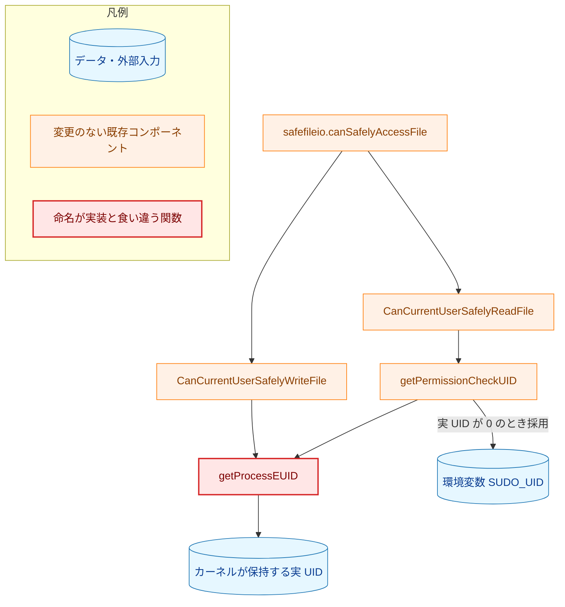

矢印 A → B は「A が B を呼び出す、または B から値を得る」を表す。読み取り経路のみが `getPermissionCheckUID` を経由し、SUDO_UID による差し替えを受ける。書き込み経路は `getProcessEUID` を直接呼ぶため差し替えを受けない。

#### 2.3.2 設計判断: 実 UID を正とする

要件定義書の「方針判断の記録」に従い、実 UID を仕様として確定し、名前とコメントをそれに合わせる。`os.Geteuid()` へ切り替える案を採らない理由を、運用形態ごとに示す。

まず、現状を正確に述べる。`getPermissionCheckUID` の sudo 分岐（[manager.go:451-455](../../../internal/groupmembership/manager.go)）は「実 UID が 0」で発火する。`sudo` は既定で実 UID も 0 にするため、**sudo 運用では現時点で既に、読み取り経路で権限判定に用いる UID が環境変数 `SUDO_UID` の値になっている**。これは変更前後で変わらない。未検証の環境変数が権限判定に用いる UID になり得ること自体は 0149 監査の D1 M-2 が指摘した所見であり、要件定義書のスコープ外節が本タスクの対象外としている。本タスクはこの状態を改善も悪化もさせない。

そのうえで、`os.Geteuid()` へ切り替えた場合に**新たに**生じる差は、setuid バイナリ運用（実 UID が 0 以外、ファイル検証中のみ EUID が 0）に現れる。次に挙げる読み取り・書き込みの両経路が、`OperationFileValidation` による特権昇格（`syscall.Seteuid(0)` 済み）の内側からも実行されるためである。

- **読み取り経路**: 現状は実 UID が 0 でないため sudo 分岐に入らず、`SUDO_UID` は無視される。EUID セマンティクスにすると昇格中は EUID が 0 と判定されて分岐が発火し、`SUDO_UID` が新たに権限判定に用いる UID になる。sudo 運用では既に起きていることを、setuid 運用にも広げることになる。
- **書き込み経路**: 現状は実 UID（一般ユーザー）で判定するため、root 所有ファイルへの書き込みは拒否される。EUID セマンティクスにすると `CanUserSafelyWriteFile(0, ...)` となり、root として任意のファイルへの書き込みが安全と判定される。ハッシュファイルなど root のみが書けるべき対象の保護意図（[manager.go:276-278](../../../internal/groupmembership/manager.go) のコメント）と逆行する。

いずれも安全側の判定を緩める方向であり、命名整合という本タスクの目的に対して副作用が大きい。したがって権限判定に用いる UID は変えない。

#### 2.3.3 変更内容

| 現在 | 変更後 |
|---|---|
| `getProcessEUID() (int, error)` | `getProcessRealUID() (int, error)` |
| 実装: `user.Current()` → `strconv.Atoi(currentUser.Uid)` | 実装: `os.Getuid()` |
| doc: "returns the current user's EUID" / "the actual EUID" | doc: 実 UID を返すこと、および SUDO_UID を考慮しないことを記す |

`user.Current()` をやめる理由は名前の整合そのものではなく、依存の削減にある。同関数は UID から passwd エントリを引くため、NSS（Name Service Switch）や `/etc/passwd` に依存し、エントリが存在しない UID では失敗する。権限判定は UID・GID・パーミッションビットの比較のみで完結し、passwd エントリを必要としない。`os.Getuid()` は同じ値をカーネルから直接得るため、この依存と失敗経路が消える。あわせて `user.Current()` のプロセス内キャッシュも不要になる。

なお、`user.Current()` のキャッシュは現状では実害を生んでいない。実 UID は `seteuid` では変化しないため、キャッシュされた値と再取得した値は常に一致する。要件定義書が挙げるキャッシュの問題は潜在的なものであり、本設計はそれを「実害の除去」ではなく「依存の削減」として扱う。

**戻り値の `error` を残す理由。** §4.2 は「失敗経路を持たない `error` 戻り値は誤解を招くため除く」という方針を採るが、本関数はその例外とする。`os.Getuid()` 自体は失敗しないため、範囲検査（`< 0` および `> math.MaxUint32`）は通常到達しない。それでも残すのは、この検査が呼び出し側の gosec 抑制コメントの根拠になっているからである。[manager.go:311-315](../../../internal/groupmembership/manager.go) の `#nosec G115` は「`getPermissionCheckUID()` で検証済み」であることを理由に `uint32` への変換を許可している。検査を削れば、この抑制の根拠が失われる。到達しない分岐を残す点は §1.2 の原則と一見矛盾するが、削除対象である「防御を装う分岐」とは性質が異なり、別の箇所の安全性の根拠を実際に支えている。この判断を doc コメントに明記する。

この変更に伴う挙動変化は §5.4 に記す。

### 2.4 Phase 4: `fileanalysis` の未使用ストアの削除

#### 2.4.1 現状

`internal/fileanalysis/syscall_store.go` が定義する `SyscallAnalysisStore` インターフェース、`syscallAnalysisStore` 実装、`NewSyscallAnalysisStore`、`SaveSyscallAnalysis`、`LoadSyscallAnalysis`、および `SyscallAnalysisResult` 型は、いずれも本番コードから参照されていない。参照はテスト 2 ファイルのみである。

`make deadcode`（`cmd/record` / `cmd/runner` / `cmd/verify` を起点とする到達可能性解析）も、このファイルの 3 関数を到達不能として報告する。

```
internal/fileanalysis/syscall_store.go:47:6: unreachable func: NewSyscallAnalysisStore
internal/fileanalysis/syscall_store.go:53:32: unreachable func: syscallAnalysisStore.SaveSyscallAnalysis
internal/fileanalysis/syscall_store.go:79:32: unreachable func: syscallAnalysisStore.LoadSyscallAnalysis
```

インターフェースの doc コメントが述べる "Used directly by `cmd/record` for saving/loading syscall analysis" は事実ではない。`cmd/record` が syscall 解析結果を永続化する経路は `filevalidator` → `fileanalysis.Store.Update` であり、本ファイルを通らない。

`elfanalyzer` 側には注入点だけが存在する。`StandardELFAnalyzer.syscallStore` は `elfanalyzer.SyscallAnalysisStore`（`fileanalysis` のものとは別型）を受け取るが、これを実装する型は本番コードに存在せず、`NewStandardELFAnalyzerWithSyscallStore` 自体も到達不能である。`fileanalysis` 側のストアは両者を橋渡しするアダプタとして書かれた形跡があるが、どこにも組み込まれないまま残っている。

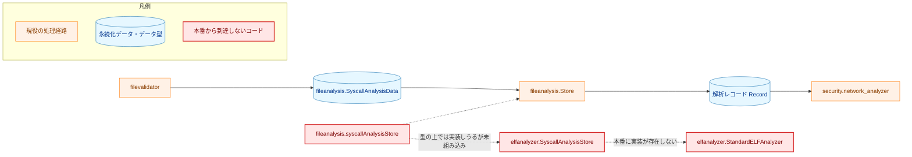

実線の矢印 A → B は「A から B へデータまたは制御が渡る現役の経路」を表す。破線の矢印は「型の上では接続しうるが、本番コードへ組み込まれていない関係」を表す。

#### 2.4.2 削除範囲

`internal/fileanalysis/syscall_store.go` をファイルごと削除する。同ファイルに含まれる `SyscallAnalysisResult` 型も削除対象である。

削除しないものを明示する。

- `fileanalysis.SyscallAnalysisData`（[schema.go:169](../../../internal/fileanalysis/schema.go) で定義）は別の型であり、`filevalidator`・`security/network_analyzer`・`dynamicanalysis` が使う現役の型である。名前が似ているため取り違えに注意する。
- `elfanalyzer.SyscallAnalysisStore`（[elfanalyzer/syscall_store.go](../../../internal/security/elfanalyzer/syscall_store.go)）も別型であり、要件定義書のスコープ外節に従い残す。
- `elfanalyzer.NewStandardELFAnalyzerWithSyscallStore` も同様に残す。

この結果、Phase 4 後は `elfanalyzer` の注入点に対する実装が、本番コード・テストダブルのいずれとしてもリポジトリ内に存在しなくなる（`analyzer_test.go` のモックは残る）。これは意図した状態であり、syscall 解析結果の永続化を有効化する時点で改めて設計する（§9）。

削除によるテストカバレッジの損失はない。`internal/security/elfanalyzer/syscall_analyzer_integration_test.go` は当該ストアを「record コマンドのストア処理を模倣する」ものとしてコメントしているが、前述のとおり `cmd/record` の実際の永続化経路は `filevalidator` → `fileanalysis.Store.Update` であり、このテストが検証しているのは本番に存在しない経路である。したがって §3.5 では当該ケースを**削除**する方針を採る（`fileanalysis.Store` を直接使う形へ書き換える案は、前提が事実でないテストを延命することになるため採らない）。

#### 2.4.3 `SaveSyscallAnalysis` の不整合バグを修正しない理由

要件定義書は AC-24 に「維持する場合は ContentHash 不一致時に他フィールドをクリアする」という代替条件を残しているが、本設計は削除を採る。修正して維持する場合、`ContentHash` が変わったときに `DynLibDeps` / `ShebangChain` / `SymbolAnalysis` / `AnalysisWarnings` をクリアする実装（[validator.go](../../../internal/filevalidator/validator.go) の `analyzeDynLibDeps` が行っているのと同種の処理）を書き、そのためのテストを維持し続けることになる。呼び出し元が存在しない API に対してその負担を負う理由がない。将来必要になった時点で、古い内容に由来する解析結果が残らない仕組み（stale データ防止）を備えた形で新規に設計するほうが確実である。

---

## 3. コンポーネント設計

### 3.1 Phase 1 の型定義

変更前（[filter.go](../../../internal/runner/base/environment/filter.go)）:

```go
type Filter struct {
    globalAllowlist map[string]struct{}
}

func NewFilter(allowList []string) *Filter
func (f *Filter) ParseSystemEnvironment() map[string]string
func (f *Filter) FilterSystemEnvironment() (map[string]string, error)
func (f *Filter) FilterGlobalVariables(envFileVars map[string]string, src Source) (map[string]string, error)

type Source string

const (
    SourceSystem  Source = "system"
    SourceEnvFile Source = "env_file"
)
```

変更後（`system_env.go`）:

```go
// ParseSystemEnvironment returns every entry of os.Environ() that parses as
// key=value. No access control is applied here; the effective allowlist and
// denylist checks live in the config and executor layers.
func ParseSystemEnvironment() map[string]string
```

`Filter` 型、`NewFilter`、`FilterSystemEnvironment`、`FilterGlobalVariables`、`Source` 型とその定数、および 6 個の未使用 sentinel エラー（`ErrGroupNotFound` / `ErrVariableNameEmpty` / `ErrInvalidVariableName` / `ErrDangerousVariableValue` / `ErrVariableNotFound` / `ErrVariableNotAllowed`）は削除する。

`executor` からは非公開関数 `getSystemEnvironment() map[string]string` を削除する（§2.1.3）。

`Runner`（[runner.go:60-75](../../../internal/runner/runner.go)）からは次を削除する。

```go
// 削除するフィールド
envVars   map[string]string
envFilter *environment.Filter

// 削除するメソッド
func (r *Runner) LoadSystemEnvironment() error
```

### 3.2 Phase 2 の型定義

次の図は Phase 2 適用**後**の状態を示す。本 Phase に関係するメンバのみを抜粋しており、`prepareExecution` / `performElevation` / `escalatePrivileges` / `restorePrivileges` / `restorePrivilegesAndMetrics` / `handleCleanupAndMetrics` / `emergencyShutdown` / `getReadSavedIDs` / `GetCurrentUID` / `GetOriginalUID` / `GetMetrics` は変更がないため省略している。

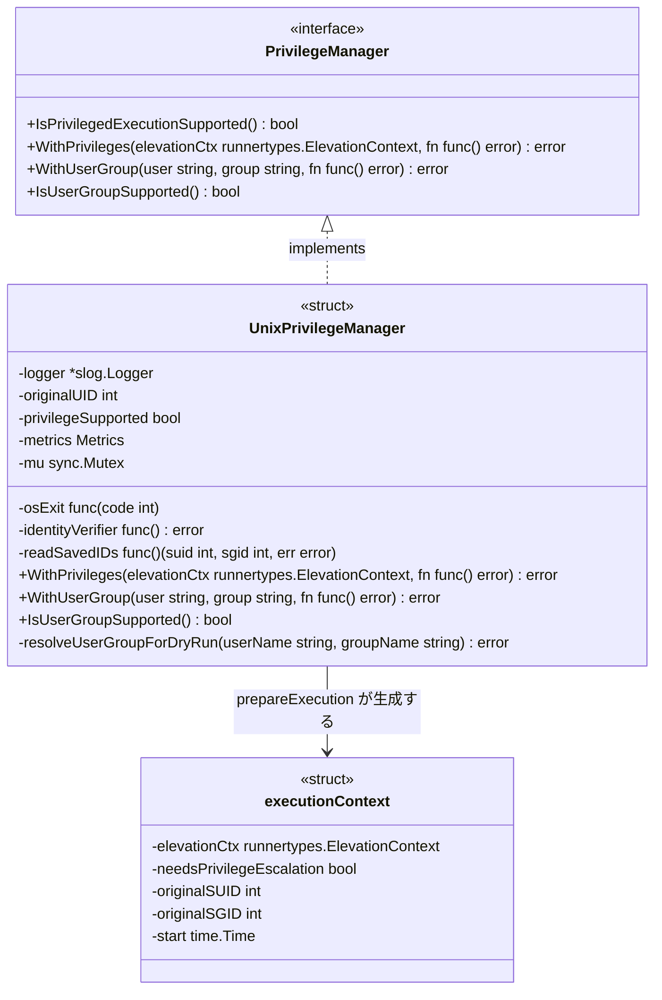

矢印は Mermaid classDiagram の標準記法に従う。`<|..` は「実装関係」、`-->` はラベルどおり「生成・保持の関係」を表す。

削除するのは `syscallSeteuid func(uid int) error`、`syscallSetegid func(gid int) error`、`executionContext.originalEUID`、`executionContext.originalEGID`、`executionContext.needsUserGroupChange` の 5 フィールド、および `changeUserGroupInternal` である。`needsUserGroupChange` を削除する理由は §2.2.4 に記した。

`resolveUserGroupForDryRun` の責務は、ユーザー名から UID を、グループ名から GID を解決し（グループ未指定時はユーザーのプライマリグループにフォールバック）、解決結果をログに出力することである。解決に失敗した場合はエラーを返す。プロセスの識別情報（UID・GID・補助グループ）は一切変更しない。

### 3.3 Phase 3 の型定義

```go
// 変更前
func getProcessEUID() (int, error)   // 実装は user.Current()

// 変更後
func getProcessRealUID() (int, error) // 実装は os.Getuid()
```

シグネチャは変わらない。`error` を残す理由は §2.3.3 に記した。呼び出し元 `getPermissionCheckUID() (int, error)` および `CanCurrentUserSafelyWriteFile(fileUID, fileGID uint32, filePerm os.FileMode) (bool, error)` のシグネチャも変わらず、コメントのみを修正する。

### 3.4 Phase 4 の削除対象

```go
// internal/fileanalysis/syscall_store.go — ファイルごと削除
type SyscallAnalysisResult struct {
    common.SyscallAnalysisResultCore
}

type SyscallAnalysisStore interface {
    LoadSyscallAnalysis(filePath string, expectedHash string) (*SyscallAnalysisResult, error)
    SaveSyscallAnalysis(filePath, fileHash string, result *SyscallAnalysisResult) error
}

func NewSyscallAnalysisStore(store *Store) SyscallAnalysisStore
```

### 3.5 コンポーネント責務表

「更新が必要な既存テスト」は、当該変更によって修正・削除が必要になるテストを示す。コンパイルが通らなくなるものを含む。

| Phase | ファイル | 変更内容 | 更新が必要な既存テスト |
|---|---|---|---|
| 1 | `internal/runner/base/environment/filter.go` → `system_env.go` | 改名。`Filter` 型・`NewFilter`・`Filter*` メソッド・`Source` 型・未使用 sentinel 6 個を削除。`ParseSystemEnvironment` をパッケージ関数化。パッケージコメントを書き換え。不要になる `errors` / `log/slog` の import を削除 | — |
| 1 | `internal/runner/base/environment/filter_test.go` → `system_env_test.go` | 改名し全面書き換え。`TestFilterGlobalVariables_SourceSystem` は allowlist 外の変数が通過することを期待値として固定しており、対象 API ごと消える | 同ファイル全体 |
| 1 | `internal/runner/base/environment/filter_benchmark_test.go` | 削除（`package environment` の 1 行のみ） | — |
| 1 | `internal/runner/base/executor/environment.go` | `getSystemEnvironment` を削除し、`BuildProcessEnvironment` の呼び出しを `environment.ParseSystemEnvironment()` に置換（§2.1.3）。不要になる `os` import を確認 | `environment_test.go`（`getSystemEnvironment` を直接参照する箇所があれば） |
| 1 | `internal/runner/config/expansion.go` | `environment.NewFilter(spec.EnvAllowed).ParseSystemEnvironment()` を `environment.ParseSystemEnvironment()` に変更（:866） | — |
| 1 | `internal/runner/runner.go` | `envVars` / `envFilter` フィールド、`LoadSystemEnvironment` メソッド、`NewRunner` 内の `envFilter` 生成（:323）と `envVars` 初期化（:343）を削除。`environment` の import が他に用途を持たなければ削除 | `runner_test.go`: **`:72` の `assert.NotNil(t, runner.envVars)`（コンパイルエラーになる）**、および `:803, :928, :1117, :1222, :1298, :1457` の `LoadSystemEnvironment()` 呼び出し |
| 1 | `cmd/runner/main.go` | `LoadSystemEnvironment()` 呼び出しを削除（:421） | `integration_workdir_test.go`（:195, :630）、`integration_auto_vars_test.go`（:103）、`integration_test_helpers.go`（:83） |
| 1 | `internal/runner/e2e_shebang_test.go` / `e2e_dynlib_verification_test.go` | `LoadSystemEnvironment()` 呼び出しを削除 | 同左（:223 / :90, :161） |
| 2 | `internal/runner/base/privilege/unix.go` | `changeUserGroupInternal` を `resolveUserGroupForDryRun` に改名し降格処理を削除。`performElevation` のロールバックブロックを削除。`needsUserGroupChange` を廃止し operation 直接判定に置換（§2.2.4）。`restorePrivilegesAndMetrics` の metrics 条件（:232）も同様に置換。`syscallSeteuid` / `syscallSetegid` / `originalEUID` / `originalEGID` を削除。`WithUserGroup` / `WithPrivileges` の doc を整備。**根拠コメント 3 箇所（:118-122 の `current_user -> root -> target_user` フロー説明、:222-225、:236-240）は Phase 2 後に前提が失われるため書き換える** | `unix_privilege_test.go`: `TestChangeUserGroupInternal_SeteuidFailure_EgidRollbackSuccess`（:509）と `..._EgidRollbackFailure`（:541）は削除。`TestChangeUserGroupInternal_NotCalledForUserGroupExecution`（:145）と `..._NotCalledForUserGroupDryRun`（:187）は注入フィールドに依存するため書き換え。**`:616-617` の `executionContext` リテラルが `originalEUID` / `originalEGID` を設定しており、コンパイルエラーになる**。`needsUserGroupChange` を設定する 14 箇所、および `identity_linux_test.go` / `identity_other_test.go` の各 1 箇所は、フィールド廃止に伴い `elevationCtx.Operation` の設定へ置換 |
| 3 | `internal/groupmembership/manager.go` | `getProcessEUID` を `getProcessRealUID` に改名し `os.Getuid()` へ変更。範囲検査を残す根拠を doc に明記。`getPermissionCheckUID`・`CanCurrentUserSafelyWriteFile` のコメントを修正。`os/user` の import が他に用途を持たなければ削除 | `manager_test.go`（該当があれば追随） |
| 4 | `internal/fileanalysis/syscall_store.go` | ファイル削除 | — |
| 4 | `internal/fileanalysis/syscall_store_test.go` | ファイル削除 | 同左 |
| 4 | `internal/security/elfanalyzer/syscall_analyzer_integration_test.go` | 当該ケース（:261-290）を削除（§2.4.2 の理由による） | 同左 |
| 1 | `docs/dev/architecture_design/security-architecture.ja.md` / `.md` | §3 の `Filter` 構造体引用（:167-170）を実態に合わせる。Phase 1 の PR に含める（§7.3） | — |

### 3.6 パッケージ構成への影響

`package_reference.md` は `runner/base/environment/` を「Environment variable processing and filtering」と記述している。Phase 1 後もパッケージ自体は残り、責務はシステム環境の列挙と denylist 判定になる。パッケージの新設・削除は発生しないため、`package_reference.md` のディレクトリ一覧の変更は不要である。

---

## 4. エラーハンドリング設計

本タスクはエラー型を新設しない。既存のエラーの扱いに関する設計判断は次のとおりである。

### 4.1 削除する sentinel エラー

`environment` パッケージの 6 個の sentinel は、本番・テストのいずれからも返却も比較もされていない。うち `ErrGroupNotFound` は `internal/runner/runner.go:36` と `internal/runner/cli/filter.go:13` にも同一メッセージの別インスタンスが存在し、`errors.Is` で相互にマッチしない同名 sentinel が三重に存在する状態にある。この状態では、呼び出し側が誤って `environment` 側の sentinel と比較したとき、比較は常に偽となり分岐が気づかれないまま素通りする。`environment` 側の 6 個を削除し、現役の 2 個（`runner` / `cli`）は残す。

### 4.2 常に nil を返すエラー戻り値の除去

`FilterSystemEnvironment` / `FilterGlobalVariables` は `error` を返すが失敗経路を持たない。呼び出し側の `LoadSystemEnvironment` はこれを丁寧にラップしており、レビュー時に「ここで危険値の検証が行われ、失敗し得る」という誤った印象を与える。両関数の削除により、この誤解を招くシグネチャは消える。残る `ParseSystemEnvironment` は元から `error` を返さない。

この方針の唯一の例外は `getProcessRealUID` である。理由は §2.3.3 に記した（他所の gosec 抑制がその範囲検査に依拠しているため、到達しなくても残す）。

なお `FilterGlobalVariables` が持つ空変数名の検出（`slog.Warn` を出して読み飛ばす分岐）も同時に消える。この分岐は `os.Environ()` 経由では到達不能である。`common.ParseKeyValue`（[string.go:59-65](../../../internal/common/string.go)）が空キーを `ok=false` で拒否するため、`ParseSystemEnvironment` の時点で既に除外されているからである。実効的な防御は失われない。

### 4.3 Phase 2 で削除するエラー経路

`emergencyShutdown("egid_rollback_failure_after_seteuid_failure")` は到達不能なため削除する。`performElevation` のロールバックブロック内の `emergencyShutdown(restoreErr, "user_group_change_failure")` も同様である。

現役の `emergencyShutdown` 呼び出し（特権復元失敗、identity 検証失敗、saved-set 読み取り失敗、saved-set 不一致）はいずれも `needsPrivilegeEscalation` 側の経路にあり、影響を受けない。

### 4.4 Phase 3 で消える失敗経路

`user.Current()` は passwd エントリを引けないときエラーを返し、そのエラーは呼び出し元を通じて `safefileio` に伝わり、ファイルアクセスは拒否される。`os.Getuid()` はエラーを返さないため、この失敗経路は消える。これは fail-closed（エラー時に安全側へ倒す）から fail-open（エラー時に許可側へ倒す）への変化であり、詳細と対応は §5.4 に記す。

範囲検査が返す `ErrUIDOutOfBounds` は残す（§2.3.3）。

---

## 5. セキュリティ考慮事項

### 5.1 本タスクが取り除く脅威

本タスクは新しい攻撃対象領域を作らず、既存の攻撃対象領域を直接塞ぐものでもない。取り除くのは「将来の変更が防御を壊しやすい構造」である。

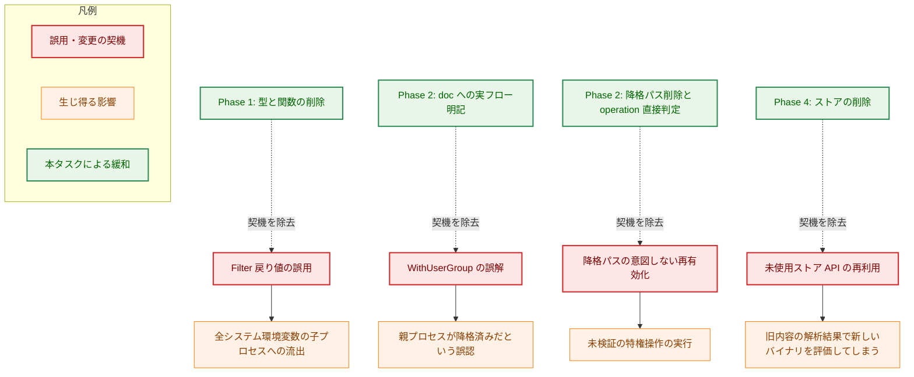

実線の矢印 A → B は「A の誤用が生じたとき B に至る」を表す。破線の矢印はラベルどおり「A が B の契機を取り除く」を表し、実線とは異なる関係であることを示す。

### 5.2 現時点で防御が成立していることの確認

本タスクの前提として、上記の影響が**現時点では発生していない**ことを確認した。

- 子プロセスへ渡る環境変数は、§1.5 に示した 2 箇所（`config.ProcessEnvImport` の allowlist・denylist 検査と、`executor.BuildProcessEnvironment` の allowlist 絞り込み＋`environment.IsForbiddenEnvVar` による denylist 除去）で統制されている。`Filter` の戻り値はいずれの経路にも流入していない。`Runner.envVars` は読み出し元を持たない。
- 対象ユーザーへの降格は `syscall.Credential` により execve 時に適用される（[executor.go:217-222](../../../internal/runner/base/executor/executor.go)）。親プロセスの識別情報は対象ユーザーへ変更されず、この点は Phase 2 の前後で変わらない。
- syscall 解析ストアは本番経路を持たないため、不整合レコードは生成されていない。

### 5.3 Phase 2 のセキュリティ上の不変条件

Phase 2 は特権管理コードに触れるため、次の不変条件が保たれることを設計上の要件とする。

| 不変条件 | 根拠 |
|---|---|
| `OperationUserGroupExecution` および `OperationFileValidation` における root 昇格と復元の挙動が変わらない | `escalatePrivileges` / `restorePrivileges` に手を入れない。両者は `syscall.Seteuid` を直接呼んでおり、削除する注入フィールドを使っていない |
| 復元後の identity 検証（`ErrIdentityLeak`）と saved-set 不変条件検査が変わらない | `restorePrivilegesAndMetrics` の検証部は `needsPrivilegeEscalation` でゲートされており、削除対象はそれ以外の分岐にある |
| panic 時の特権復元が変わらない | `handleCleanupAndMetrics` の recover → 復元 → 再 panic の流れに触れない |
| dry-run が識別情報を変更しない | 変更後の dry-run 経路には識別情報を書き換える syscall が存在しない。この性質は §7.2 の静的検査で継続的に担保する |
| dry-run で `RecordElevationSuccess` が記録される挙動が変わらない | §2.2.4 の metrics 条件の置換は、真偽値を等価な operation 判定に置き換えるものであり、記録の有無を変えない |

### 5.4 Phase 3 に伴う挙動変化（fail-closed から fail-open へ）

本タスクは挙動不変を原則とするが、Phase 3 に一点だけ例外がある。**この変化は fail-closed から fail-open への変化である。**

**変化する条件**: プロセスの実 UID に対応する passwd エントリを引けない場合。具体的な引き金は次のとおりで、本リポジトリはどちらのビルド構成もテスト対象としている（`Makefile` の `test-ci-cgo1` / `test-ci-cgo0`）。

- **cgo 有効**: NSS 経由で解決するため、LDAP / SSSD の障害や停止、`nsswitch.conf` の設定不備で失敗し得る。
- **cgo 無効（`osusergo`）**: `/etc/passwd` を直接読むため、最小構成コンテナでファイルが存在しない場合や、passwd エントリを持たない任意の UID を割り当てて実行した場合に失敗する。

**変化の内容**: 現在は `user.Current()` がエラーを返し、`CanCurrentUserSafelyReadFile` / `CanCurrentUserSafelyWriteFile` がそのエラーを返し、`safefileio` は `ErrInvalidFilePermissions` としてファイルアクセスを拒否する。ハッシュファイルと設定ファイルの読み書きがこの経路を通るため、現在は**実行そのものが止まる**。変更後は `os.Getuid()` が常に成功するため拒否は起きず、通常どおり UID・GID・パーミッションビットによる判定が行われる。

**この変化を受け入れる理由**: 権限判定に必要なのは UID の値のみであり、passwd エントリの存在は必要条件ではない。エントリがないことを理由にファイルアクセスを拒否するのは、権限モデルとして意味のある判断ではなく、`user.Current()` を使っていたことの副作用である。判定そのものは変更前と同じ入力・同じ規則で行われる。

**判定内容が変わらないことの根拠**: `user.Current()` は cgo の有無にかかわらず UID として `getuid(2)` の値を用いる。したがってエントリを引けた場合に返る UID は `os.Getuid()` と同一である。値が変わるのは「エラーが返っていた場合」だけであり、その場合は判定自体が行われていなかった。

**要件・検証との関係**: AC-20 は 3 ケースで UID が従来と一致することを求めるが、3 ケースはいずれも passwd エントリが引ける前提であり、この変化を捕捉しない。したがって次を追加で行う。

- passwd エントリを引けない状況で権限判定が実行され、エントリがある場合と同じ判定結果を返すことを検証するテストを追加する（`osusergo` ビルドタグ、または UID 取得の差し替え口を用いる）。
- これまで本条件で起動できなかった構成が起動するようになるため、リリースノートに記載する。

以上は要件定義書の **AC-25** として追加済みである。

### 5.5 副作用の契約

Phase 2 は dry-run 経路のコードを変更するため、dry-run が許す副作用と禁じる副作用を明示する。変更後の `OperationUserGroupDryRun` は次を守る。

| 副作用 | 可否 | 備考 |
|---|---|---|
| プロセスの実効 UID / GID の変更 | 禁止 | Phase 2 でこれを行うコードが経路から消える |
| 補助グループの変更 | 禁止 | 同上 |
| 子プロセスの生成 | 禁止 | dry-run のコールバックは何もしない（no-op、[dryrun_manager.go:282](../../../internal/runner/resource/dryrun_manager.go)） |
| ファイルの書き込み・削除 | 禁止 | 本経路に該当処理なし |
| ネットワーク送信 | 禁止 | 本経路に該当処理なし |
| ユーザー・グループ名の名前解決（`user.Lookup` / `user.LookupGroup` / `user.LookupGroupId`） | 許可 | 検証のために必要。NSS への読み取り問い合わせのみ |
| ログ出力（`slog.Info`） | 許可 | 解決結果の記録。変数の値は出力しない |

`OperationUserGroupExecution`（非 dry-run）の契約は次のとおりである。親プロセスは root へ昇格するのみで、識別情報を対象ユーザーへ変更しない。対象ユーザーへの切り替えは子プロセスの `syscall.Credential` により execve 時に行われる。

ここで、要件定義書の AC-15 が doc コメントへの記載を求める文言のうち「`RunAsUser`・`RunAsGroup` は解決とログのために渡される」という部分は、`OperationUserGroupExecution` については事実と異なる。`prepareExecution` は同 operation で dry-run 解決を呼ばないため、privilege パッケージは `elevationCtx.RunAsUser` / `RunAsGroup` を読まない（読むのは dry-run 経路と `WithUserGroup` のコンテキスト構築だけである）。実行時の名前解決とログ出力は executor 側（`risktypes.ResolveRunAsIdent`）が行う。

この文言をそのまま doc コメントに書くと、本タスクが除こうとしている「名前・記述と実装のずれ」を新たに作ることになる。したがって doc コメントには次の形で記す。

- `OperationUserGroupExecution` では、privilege パッケージは root への昇格のみを行い、`RunAsUser` / `RunAsGroup` を参照しない。
- 対象ユーザーへの切り替えと、その前提となる識別情報の解決は executor が行い、`syscall.Credential` として execve 時に適用される。
- `RunAsUser` / `RunAsGroup` が privilege パッケージ内で解決・ログ出力されるのは `OperationUserGroupDryRun` の場合だけである。

AC-15 の文言自体も、上記に合わせて要件定義書を修正済みである。

### 5.6 監査可能性

Phase 2 の変更後も、dry-run におけるユーザー・グループ解決の失敗は `WithPrivileges` の戻り値として呼び出し元へ伝わり、[dryrun_manager.go:287-290](../../../internal/runner/resource/dryrun_manager.go) が解析結果の `SecurityRisk` を `high` に引き上げ、`Impact.Description` に失敗内容を追記する。運用者が dry-run の出力から失敗の理由を追える点は変わらない。

ただし、この監査可能性には次の限界があり、Phase 2 はこれを改善しない。

- dry-run のユーザー・グループ検証は `d.privilegeManager != nil && IsPrivilegedExecutionSupported()` で囲まれている（[dryrun_manager.go:274](../../../internal/runner/resource/dryrun_manager.go)）。setuid 設定のない開発機や CI では `WithPrivileges` が呼ばれず、出力は `[WARNING: User/Group privilege management not supported]` のみになる。検証が行われないこと自体は出力に現れるが、検証結果は得られない。
- 失敗内容は `Impact.Description` への文字列連結として現れ、`slog` の構造化属性にはならない。ログを機械処理する監視には向かない。

いずれも Phase 2 のスコープ外であり、§9 に検討事項として残す。

削除する `emergencyShutdown` 呼び出しは到達不能なものに限られるため、実際に出力され得る監査ログの種類は減らない。

---

## 6. 処理フロー詳細

### 6.1 Phase 1 変更後: システム環境変数が設定展開に至る流れ

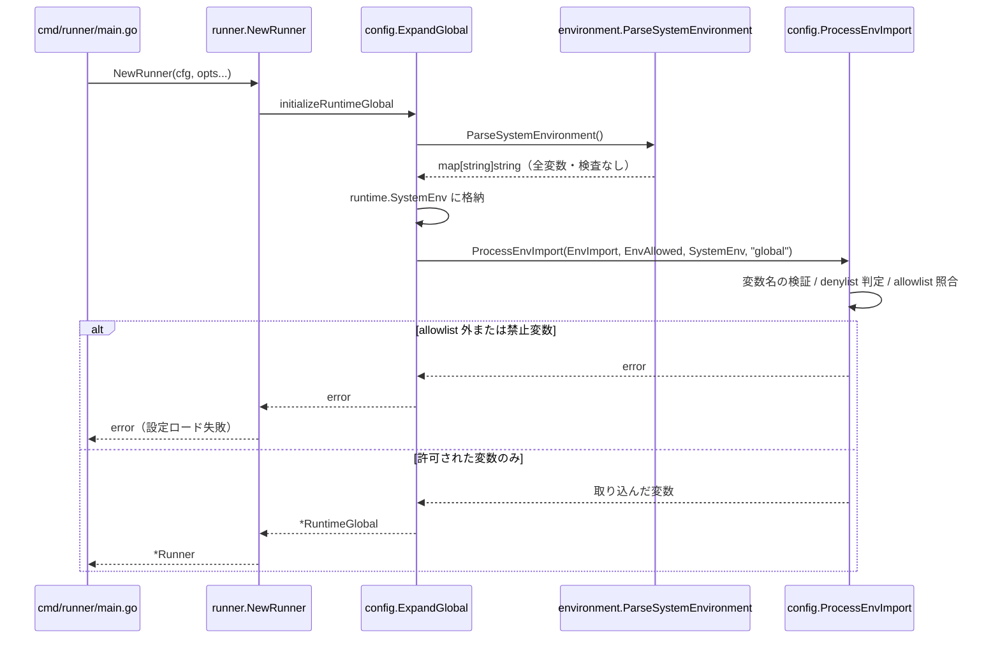

変更前に存在した `main.go` からの `LoadSystemEnvironment()` 呼び出しはこの流れから消える。`ParseSystemEnvironment` が「検査なしの全変数」を返すことと、検査が `ProcessEnvImport` で行われることが、呼び出し順序として明示される。なお、子プロセス環境の組み立て時にはこれとは別に `executor.BuildProcessEnvironment` が allowlist と denylist を適用する（§1.5）。

### 6.2 Phase 2 変更後: 特権操作の分岐

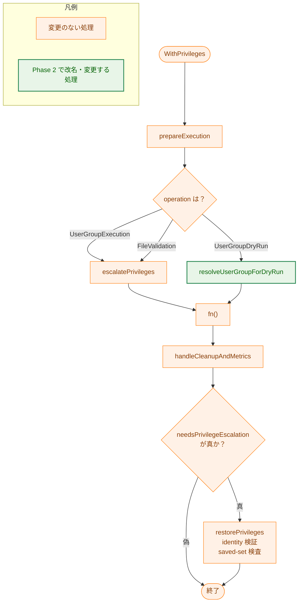

矢印 A → B は「A の完了後に B へ進む」を表す。分岐ラベルは条件を示す。`Q` の分岐は §2.2.4 のとおり `elevationCtx.Operation` を直接判定するものであり、中間の真偽値を経由しない。変更前に存在した「dry-run 経路から降格 syscall へ進む枝」と「昇格と降格が同時に必要な場合のロールバック枝」は、この図に現れない（どちらも到達不能だったため、削除しても流れは変わらない）。

### 6.3 Phase 3 変更後: 権限チェック UID の決定

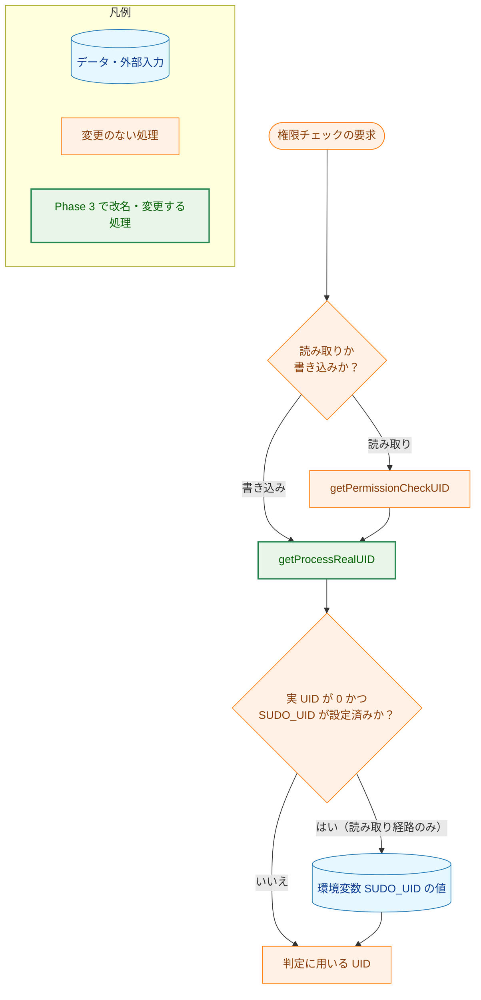

矢印 A → B は「A の完了後に B へ進む」を表す。書き込み経路が `getPermissionCheckUID` を経由しないため SUDO_UID の分岐に入らない点は、変更前後で同じである。sudo 運用では実 UID が 0 になるため、読み取り経路では現在も変更後も `SUDO_UID` の分岐が発火する（§2.3.2）。

---

## 7. テスト戦略

### 7.1 単体テスト

| Phase | 検証対象 | 方針 |
|---|---|---|
| 1 | `ParseSystemEnvironment` | `os.Environ()` の各エントリが `key=value` として解釈できる限りキー・値ともに保持されること、`=` を含まないエントリが除外されることを検証する。既存 `filter_test.go` のうち解析挙動を見ていたケース（空値、値に特殊文字を含む場合）を新 API 向けに引き継ぐ |
| 1 | `ExpandGlobal` の `SystemEnv`（AC-03） | 変更前後で `runtime.SystemEnv` の内容が一致することを確認する。関数本体を変更しないため、既存の config 層テストが回帰検出として機能する |
| 1 | `BuildProcessEnvironment`（§2.1.3） | `getSystemEnvironment` の置換前後で出力が一致すること。既存の `environment_test.go`（allowlist 取り込み・denylist 除去のケース）が回帰検出として機能する |
| 2 | `resolveUserGroupForDryRun` | 存在しないユーザー名でエラーを返すこと、グループ未指定時にユーザーのプライマリグループへフォールバックすること、識別情報を変更しないことを検証する |
| 2 | `WithPrivileges` の 3 operation（AC-16） | `OperationUserGroupExecution` で昇格と復元が行われること、`OperationUserGroupDryRun` で識別情報が変化しないこと、いずれの経路でも親プロセスの EUID/EGID が対象ユーザーへ変わらないこと |
| 3 | `getProcessRealUID` | `os.Getuid()` と同じ値を返すこと |
| 3 | `getPermissionCheckUID`（AC-20） | (a) `SUDO_UID` 未設定、(b) `SUDO_UID` 設定済みかつ実 UID が 0、(c) `SUDO_UID` 設定済みかつ実 UID が 0 以外、の 3 ケースで返る UID が変更前と一致すること |
| 3 | passwd エントリ欠如時の挙動（§5.4） | エントリを引けない状況で権限判定が実行され、エントリがある場合と同じ判定結果を返すこと |

**Phase 2 の単体テストだけでは AC-16(c) を担保できない。** 現行テストは注入フィールド `syscallSeteuid` / `syscallSetegid` の呼び出し有無で「降格しないこと」を検証しているが、Phase 2 で注入フィールドは消える。代わりに識別情報の読み取り値が変化しないことを確認する方法も、非 root で動く CI では有効でない。降格 syscall が呼ばれても `EPERM` で失敗するため識別情報は変わらず、テストが通ってしまうからである。つまり失敗を検出できない。この穴は §7.2 の静的検査と §7.4 の特権環境テストで埋める。

### 7.2 静的検査

要件定義書の AC には「特定の識別子が存在しないこと」を求めるものが多い（AC-01, AC-02, AC-04, AC-05, AC-07, AC-08, AC-09, AC-11, AC-17, AC-21）。これらは `rg` による不存在確認で検証する。具体的な検索式は `03_implementation_plan.md` で定める。

**降格 syscall の再混入を防ぐ検査（Phase 2）。** §7.1 の理由により、AC-16(c) を動的テストで担保できない。代わりに次の静的検査を導入し、`03_implementation_plan.md` で検証手段として位置づける。

- `internal/runner/base/privilege` において `syscall.Seteuid` / `syscall.Setegid` / `syscall.Setresuid` / `syscall.Setresgid` が現れるのは `escalatePrivileges` と `restorePrivileges` の内部に限られ、その引数は `0` または `m.originalUID` のいずれかであること。

これは「親プロセスは root への昇格と原状復帰以外の識別情報変更を行わない」という不変条件（§5.3）を、コードの形として直接検査するものである。§2.2.4 で真偽値を廃止したことと合わせ、削除した動的ガードの代替になる。

**`make deadcode` の適用範囲。** 同コマンドは `cmd/record` / `cmd/runner` / `cmd/verify` を起点とする到達可能性解析であり、Phase 4 の削除対象 3 関数を現に到達不能として報告している。Phase 4 適用後にこの 3 行が報告から消えることを確認する。

ただし `make deadcode` は Phase 1・Phase 2 の検証には使えない。`LoadSystemEnvironment` は `main.go` から呼ばれており到達可能であり（値が読まれないだけである）、`WithUserGroup` はインターフェースのメソッドセットに属するため到達可能と判定される。「到達するが結果が使われない」「インターフェース経由でのみ到達する」という状態は静的到達可能性解析では検出できない。この 2 つの Phase については `rg` による参照確認とレビューで担保する。

### 7.3 ドキュメントの追随

[security-architecture.md](../../dev/architecture_design/security-architecture.md) と [security-architecture.ja.md](../../dev/architecture_design/security-architecture.ja.md) の §3「環境変数の分離」は、`Filter` 構造体を次の形で引用している（両ファイルとも :167-170）。

```go
// Location: internal/runner/environment/filter.go:31-50
type Filter struct {
    config          *runnertypes.Config
    globalAllowlist map[string]bool
}
```

この引用は現時点で既に不正確である（パスは `internal/runner/base/environment/filter.go`、`config` フィールドは存在せず、`globalAllowlist` の型は `map[string]struct{}`）。Phase 1 適用後は構造体そのものが存在しなくなる。

**この修正は Phase 1 の PR に含めることを必須とする。** セキュリティ設計文書が、削除済みの型を allowlist フィルタとして説明し続ける状態は、本タスクが解消しようとしている「記述と実装の乖離」を、より広く読まれる文書で再生産することになるためである。Phase 1 のマージ条件に含める。

**対応する AC は要件定義書へ追加済みである。** 当初この設計を書いた時点では要件定義書が AC-01〜AC-24 のみを定義しており、ドキュメント整合の AC を持たなかった（前例の 0156 における AC-11 に相当するものがない）。`requirements_process.md` は AC を `01_requirements.md` に置くことを求めており、`03_implementation_plan.md` が AC を新設することはできないため、要件定義書の改訂を提案し、承認を得て次を追加した。

- **F-005 / AC-26**: 上記の構造体引用が `security-architecture.ja.md` / `.md` に存在せず、記述が Phase 1 適用後の実装と整合していること。
- **AC-25**: §5.4 の挙動変化（passwd エントリを引けない場合の fail-closed → fail-open）に対するテストとリリースノート記載。

日本語版を先に修正し、英語版へは `/mktrans` で反映する（バイリンガル文書の編集順序に従う）。

なお、同じ §5「特権管理」も `UnixPrivilegeManager` の構造体を古いパス・古いフィールド構成で引用している（:275, :287, :320）。Phase 2 はこの構造体からフィールドを削除するため不正確さが増すが、既存の乖離の度合いが大きく、本タスクのスコープ（#864 の該当箇所）を超えて全面的な更新が必要になる。Phase 2 では立ち入らず、§9 の検討事項とする。

### 7.4 特権環境での確認（Phase 2）

Phase 2 が触るコードは root または setuid-root 環境でのみ意味を持つ。§7.1 のとおり非特権 CI では降格の有無を判別できないため、Phase 2 のマージ前に特権環境での確認を行う。既存の `make integration-test`（setuid バイナリを用いる統合テスト）を実施先とし、次を確認する。

1. `run_as_user` を指定したコマンドの子プロセスが、対象ユーザーの UID・GID・補助グループで動作すること。
2. 実行後に特権が復元され（`Privileges fully restored` のログ）、EUID と UID が一致すること。
3. 同じ設定を `--dry-run` で実行したとき `[INFO: User/Group configuration validated]` が出力され、親プロセスの識別情報が変化しないこと。
4. 存在しないユーザーを指定した `--dry-run` で `SecurityRisk` が `high` に引き上げられること。

### 7.5 回帰確認

本タスクは挙動不変を原則とするため、削除対象に直接依存していたテスト（§3.5 の「更新が必要な既存テスト」欄）を除き、既存テストが無修正で通ることが最も強い回帰の証拠になる。各 Phase 完了時に `make fmt` → `make test` → `make lint` を実行する。

Phase 1 は `cmd/runner` の統合テストと `internal/runner` の E2E テストが `LoadSystemEnvironment` を呼んでいるため、呼び出し削除後もコマンド実行時の環境変数解決が従来どおりであることを、これらのテストが確認する（AC-09）。

Phase 3 は cgo 有効・無効の両構成でテストする（`make test-ci-cgo1` / `make test-ci-cgo0`）。§5.4 の挙動変化がビルド構成に依存するためである。

---

## 8. 実装優先度

### 8.1 Phase の依存関係

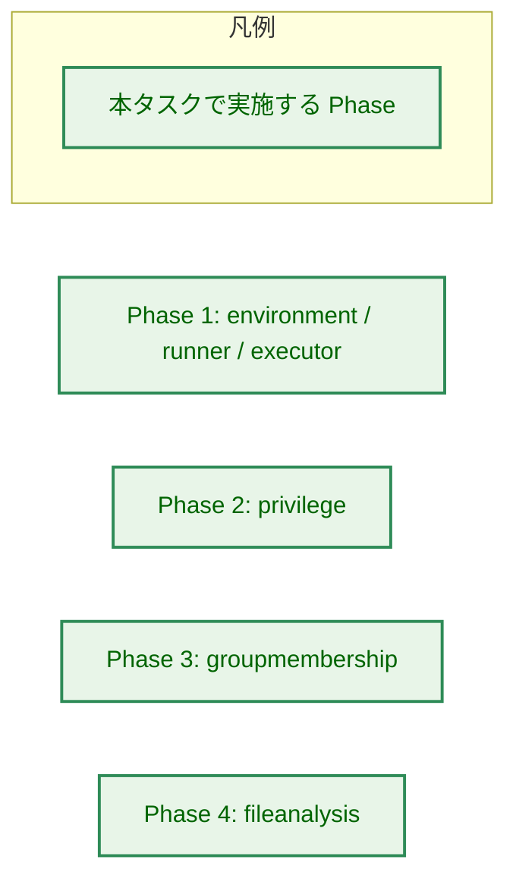

4 つの Phase の間に矢印はない。触るパッケージが重ならず、共有する型も呼び出し関係もないためである。任意の順序で実施でき、いずれかを見送っても他が成立する。

### 8.2 推奨順序

依存はないが、レビューの負荷とリスクの観点から次の順を推奨する。

1. **Phase 4**（`fileanalysis`）— 削除のみ。`make deadcode` が到達不能を機械的に裏づけており、判断の余地が最も小さい。
2. **Phase 3**（`groupmembership`）— 変更は 1 関数。ただし §5.4 の fail-open 化について合意と、追加テスト・リリースノートが必要。
3. **Phase 1**（`environment` / `runner` / `executor`）— 変更範囲は広いが、いずれも削除と改名。テストの更新点が多い。§7.3 のドキュメント修正を同一 PR に含める。
4. **Phase 2**（`privilege`）— 特権管理コードに触れるため最後に置く。他 Phase が完了していれば、問題が起きた際の切り分け範囲が狭まる。§7.2 の静的検査と §7.4 の特権環境確認をマージ条件とする。

### 8.3 PR 構成

1 Phase = 1 PR を基本とする。Phase 1 は `environment` パッケージの縮退、`executor` の重複削除、`Runner` のデッドコード削除がコンパイルの通る単位として一体（`Runner.envFilter` が `*environment.Filter` を保持する）であるため、分割せず 1 PR とし、§7.3 のドキュメント修正も同 PR に含める。

---

## 9. 将来の拡張性

本タスクは削除が中心であり、拡張点を新設しない。調査の過程で判明した、本タスクのスコープ外にある検討事項を記録する。

- **`WithUserGroup` と `IsUserGroupSupported` の扱い。** どちらも本番の呼び出し元を持たず、`runnertypes.PrivilegeManager` インターフェースに属することでのみ生存している。インターフェースからの削除は API 変更であり本タスクの対象外だが、Phase 2 で `WithUserGroup` の実体が「root へ昇格するだけ」であることが doc として明示された後は、インターフェースに残す意味を改めて検討できる。

- **dry-run と実行時で別実装になっている識別情報の解決。** §2.2.2 のとおり、dry-run 側は補助グループを列挙せず、実行時側の検査の真部分集合になっている。dry-run 側を `risktypes.ResolveRunAsIdent` に委譲すれば乖離は解消し、`user.Lookup` の二重呼び出し（0149 監査 A1 L-1）も同時に解決する。挙動変更を伴うため別タスクとする。

- **dry-run 検証の監査可能性。** §5.6 の 2 つの限界（特権非対応環境での検証スキップ、構造化属性ではない文字列連結）は Phase 2 では改善しない。dry-run の出力形式を扱うタスクで併せて検討する。

- **allowlist 判定の分散。** §1.5 のとおり allowlist の適用は 2 箇所にある（0149 監査 A3 F-7）。0156 が denylist を一元化したのと同様の整理が可能だが、`env_import` と直接取り込みで意味論が異なるため、統合の可否を含めて別途検討する。

- **syscall 解析結果の永続化。** Phase 4 後、`elfanalyzer` の `SyscallAnalysisStore` 注入点には実装が存在しない状態になる。この機能を有効化する際は、`ContentHash` が変わったときに他の解析フィールドを無効化する stale データ防止を最初から備えた形で設計する。削除する `SaveSyscallAnalysis` はこの防止機構を持っていなかった。

- **`security-architecture` の §5「特権管理」の全面更新。** §7.3 に記したとおり、同節の構造体引用は本タスク以前から実態と乖離している。ドキュメント全体の棚卸しとして別途扱うのが適切である。

- **`environment` パッケージの責務の再整理。** Phase 1 後、同パッケージはシステム環境の列挙（`system_env.go`）と denylist 判定（`denylist.go`）という 2 つの独立した機能を持つ。現時点では規模が小さく分割の必要はないが、いずれかが成長した場合は分割を検討する余地がある。

---

## 10. 受入基準と設計の対応

各 AC を、それを実現する設計上の判断がどの節に記されているかで対応づける。AC とテストの対応づけは `03_implementation_plan.md` で行う。

| AC | 対応する設計箇所 |
|---|---|
| AC-01 | §2.1.2（型を廃しパッケージ関数化）、§3.1 |
| AC-02 | §2.1.2、§2.1.4（ファイル名の追随）、§3.1 |
| AC-03 | §2.1.2（関数本体を変更しない）、§6.1、§7.1 |
| AC-04 | §2.1.4（パッケージコメントの書き換え）、§3.1 |
| AC-05 | §4.1（三重定義の解消と残す 2 個の明示） |
| AC-06 | §4.2（および §2.3.3 の例外） |
| AC-07 | §2.1.4、§3.5 |
| AC-08 | §3.1（`Runner` から削除するフィールド） |
| AC-09 | §3.5（呼び出し元と影響テストの列挙）、§7.5 |
| AC-10 | §2.1.4（`denylist.go` に手を入れない）、§3.5 |
| AC-11 | §2.2.2（削除範囲）、§4.3 |
| AC-12 | §2.2.1、§2.2.2 |
| AC-13 | §2.2.2（注入フィールドが到達不能パス専用であることの確認） |
| AC-14 | §2.2.3（改名表）、§2.2.4（真偽値の廃止）、§3.2 |
| AC-15 | §5.5（副作用の契約。当初文言の誤りと修正内容もここに記す） |
| AC-16 | §5.3（保つべき不変条件）、§6.2、§7.1、§7.2（静的検査による補完）、§7.4 |
| AC-17 | §2.3.3、§3.3 |
| AC-18 | §2.3.3（`os.Getuid()` への変更と理由）、§5.4 |
| AC-19 | §2.3.1（不正確なコメントの所在）、§2.3.3 |
| AC-20 | §5.4（判定内容が変わらない根拠と、AC が捕捉しない範囲）、§7.1 |
| AC-21 | §2.4.2、§3.4 |
| AC-22 | §3.5（更新が必要なテスト）、§2.4.2（削除を選ぶ理由） |
| AC-23 | §2.4.2（削除しないものの明示） |
| AC-24 | §2.4.3（代替条件を採らない理由） |
| AC-25 | §5.4（fail-closed → fail-open 変化の条件・受容理由・必要な対応）、§7.1 |
| AC-26 | §7.3（セキュリティ設計文書の追随と、Phase 1 PR に含める理由）、§8.3 |

---

## 付録 A: 決定履歴

本タスクの検討過程で採らなかった案と、その理由を記録する。本文（§1〜§10）は変更後の状態を記述しており、以下は設計判断の背景のみを扱う。

**A-1. `environment` パッケージに allowlist 適用を復活させる案（A3 F-1 の対応案 2）。** 採らない。実効的な allowlist 照合は既に §1.5 の 2 箇所で行われており、`environment` 側でも適用すると三重適用になる。要件定義書のスコープ外節がこの案を明示的に排除している。

**A-2. `Filter` 型を残して改名するだけの案。** 採らない。理由は §2.1.2 の YAGNI 検討に記した。

**A-3. Phase 2 で到達不能な降格パスを残し、doc コメントの明記のみで済ませる案（A1 M-2 の対応案 2）。** 採らない。要件定義書の「方針判断の記録」が削除を主・doc 明記を従と定めている。本設計はその方針に従い、削除と doc 明記の両方を行い、さらに削除で失われるガードを §2.2.4 と §7.2 で置き換える。

**A-4. Phase 2 で `needsUserGroupChange` を `needsUserGroupValidation` に改名して残す案。** 採らない。改名しても「真偽値の設定を誤ると、名前が前提とする条件を満たさないまま dry-run 用関数が呼ばれる」という失敗の型が残る。operation を直接判定すれば、その失敗の型自体が存在しなくなる（§2.2.4）。

**A-5. Phase 3 で `os.Geteuid()` へ切り替える案（D1 M-4 の対応案 1）。** 採らない。理由は §2.3.2 に記した。要件定義書の「方針判断の記録」と同じ結論だが、本設計では sudo 運用で既に `SUDO_UID` 分岐が発火している事実を踏まえ、この案が新たな差を生むのは setuid バイナリ運用に限られることを明確にしている。

**A-6. Phase 3 で `getProcessRealUID` の `error` 戻り値を削る案。** 採らない。範囲検査は呼び出し側の `#nosec G115` 抑制の根拠になっており、削ると抑制の正当性が失われる（§2.3.3）。

**A-7. Phase 4 でストアを維持し不整合バグを修正する案（AC-24）。** 採らない。理由は §2.4.3 に記した。

**A-8. Phase 4 で `syscall_analyzer_integration_test.go` を `fileanalysis.Store` 直接利用に書き換える案。** 採らない。当該テストは「record コマンドのストア処理の模倣」を標榜するが、`cmd/record` の実際の経路は `filevalidator` → `Store.Update` であり、書き換えても前提が事実でないテストを延命することになる（§2.4.2）。

**A-9. 0156 との関係。** [0156](../0156_env_denylist_consolidation/) の設計書は `internal/runner/base/environment` を「allowlist ベースの `Filter` を持つ」パッケージと記述し、`Filter` を自身のスコープ外としていた。0157 はその `Filter` を対象に含めるが、0156 が追加した `denylist.go` には手を入れない。両タスクのスコープは補完関係にあり、方針の衝突はない。0156 の設計書における `Filter` の記述は、Phase 1 適用後は当時の状態の記録として読まれる。
