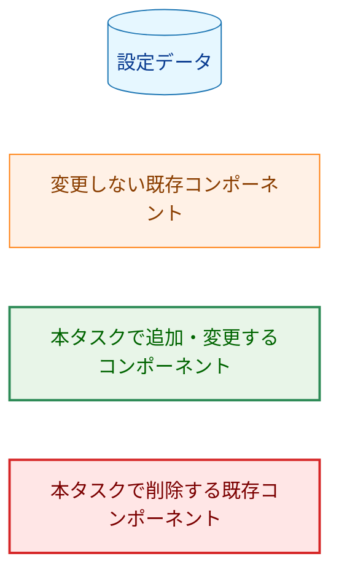
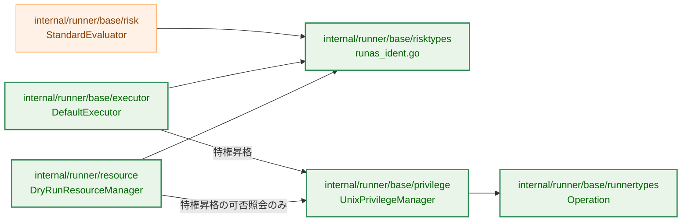
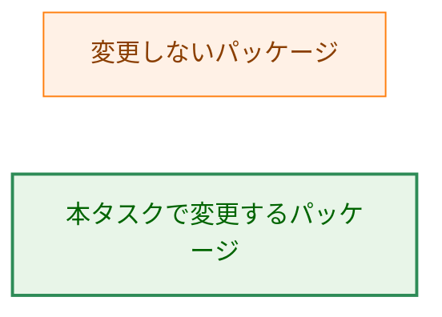
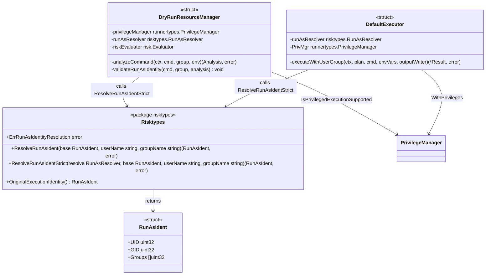
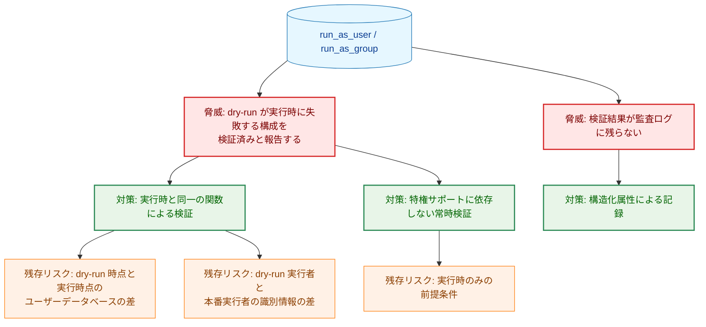
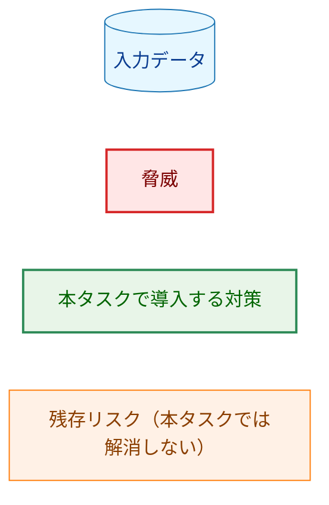
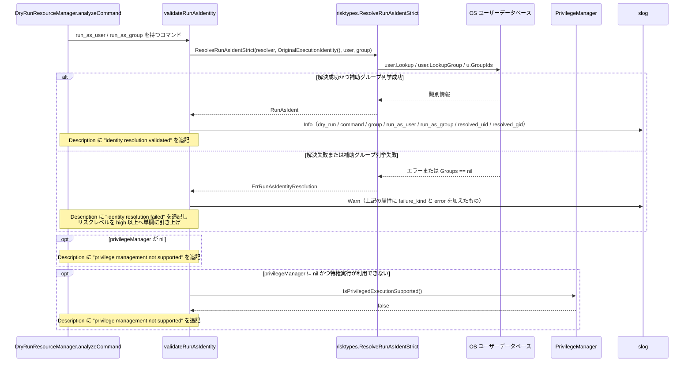
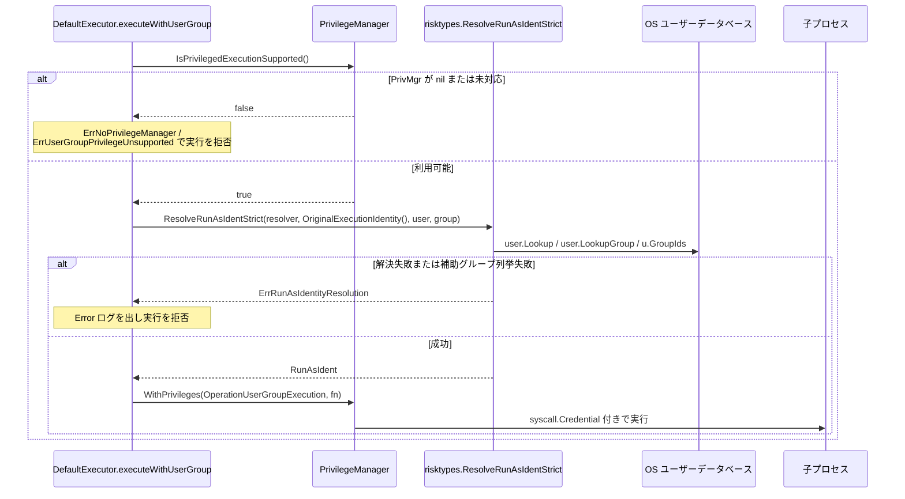

# アーキテクチャ設計書: dry-run のユーザー・グループ検証を実行時の識別情報解決に統合する

## Document Status

| Item | Value |
|---|---|
| Status | `approved` |
| Created | 2026-07-27 |
| Review date | 2026-07-28 |
| Reviewer | isseis |
| Comments | - |

## 関連文書

- 要件定義: [01_requirements.md](01_requirements.md)
- 要件プロセス: [requirements_process.md](../../dev/developer_guide/requirements_process.md)
- Mermaid 記法リファレンス: [mermaid_reference.md](../../dev/developer_guide/mermaid_reference.md)
- テスト構成ガイド: [test_organization.md](../../dev/developer_guide/test_organization.md)
- パッケージ構成リファレンス: [package_reference.md](../../dev/developer_guide/package_reference.md)
- セキュリティアーキテクチャ: [security-architecture.ja.md](../../dev/architecture_design/security-architecture.ja.md) / [security-architecture.md](../../dev/architecture_design/security-architecture.md)
- コマンドリスク評価: [command-risk-evaluation.ja.md](../../dev/architecture_design/command-risk-evaluation.ja.md) / [command-risk-evaluation.md](../../dev/architecture_design/command-risk-evaluation.md)
- 前タスク: [0157 デッドコード削除・命名整理](../0157_dead_code_naming_cleanup/02_architecture.md)
- 関連 Issue: [#918](https://github.com/isseis/go-safe-cmd-runner/issues/918)

---

## 1. 設計の全体像

### 1.1 用語

本書で繰り返し使う語をここで定義する。

| 用語 | 意味 |
|---|---|
| **run-as 識別情報** | コマンドを実行する主体の UID・GID・補助グループの組。型としては `risktypes.RunAsIdent` |
| **基準識別情報** | run-as 識別情報を組み立てる出発点。`risktypes.OriginalExecutionIdentity()` が返す、プロセス起動時の実 UID / 実 GID / 補助グループ |
| **解決** | 設定値の `run_as_user` / `run_as_group`（名前）を OS のユーザーデータベースに問い合わせ、run-as 識別情報に変換すること |
| **検証** | 解決が成功するかどうかを確かめること。dry-run が行うのは検証であり、識別情報の切り替えは行わない |
| **fail-closed 判定** | 解決の結果を、成功か失敗かに振り分ける判定。名前を引けなかった場合に加え、補助グループを列挙できず run-as 識別情報が不完全になった場合も失敗として扱う |
| **パス信頼区分の判定** | 判断軸2。コマンドが作用するパスを解決し、その信頼区分（trust-critical / ordinary / safe-zone）に分類してリスクを判定する処理。詳細は [command-risk-evaluation.ja.md](../../dev/architecture_design/command-risk-evaluation.ja.md) |

### 1.2 本設計が解こうとしている問題

`run_as_user` / `run_as_group` を持つコマンドについて、dry-run と実行時が同じ問いに別々の実装で答えている。

- dry-run 経路: `privilege.UnixPrivilegeManager.resolveUserGroupForDryRun`（[unix.go:469](../../../internal/runner/base/privilege/unix.go)）
- 実行時経路: `risktypes.ResolveRunAsIdent`（[runas_ident.go:55](../../../internal/runner/base/risktypes/runas_ident.go)）

前者は補助グループを列挙しない。後者は列挙し、列挙に失敗した場合は executor が `ErrRunAsIdentityResolution` で実行を拒否する（[executor.go:204-213](../../../internal/runner/base/executor/executor.go)）。その結果、補助グループの列挙だけが失敗する構成では、dry-run が「検証済み」と報告したうえで実行が失敗する。dry-run が誤った安心を与える状態である。

本設計は、dry-run 側の独自実装を削除し、両経路が**同一の関数**を呼ぶ構造にする。同一であることを人手のレビューではなく呼び出し構造で保証する点が要点である。

### 1.3 本設計が保証する範囲としない範囲

保証するのは**識別情報の解決結果の一致**だけである。dry-run が「実行できる」ことを保証するわけではない。実行時の `executeWithUserGroup` は、識別情報を解決する前に次の 2 つの前提条件を検査し、満たさなければ解決に到達せず実行を拒否する（[executor.go:157-165](../../../internal/runner/base/executor/executor.go)）。

| 前提条件 | 失敗時のエラー |
|---|---|
| `PrivMgr` が `nil` でない | `ErrNoPrivilegeManager` |
| `IsPrivilegedExecutionSupported()` が真 | `ErrUserGroupPrivilegeUnsupported` |

dry-run はこの 2 条件を再現せず、代わりに警告として伝える（§3.4）。したがって setuid 設定のない開発機では、「識別情報の解決は妥当だが、この環境では実行できない」という組み合わせが出力され得る。これは意図した挙動であり、出力の文言でも区別する。同様に、コマンドの検証（`Validate`）や特権コマンド固有の検査（`validatePrivilegedCommand`）も実行時のみの関門であり、本設計の対象外である。

### 1.4 設計原則

- **判定を 1 か所に置く。** 「解決」と「解決結果が不完全な場合の fail-closed 判定」を 1 つの関数にまとめ、dry-run と実行時の双方がその関数だけを呼ぶ。判定の同一性をコメントや規約ではなく、呼び出し先が同じであることで担保する。
- **検証に特権を要求しない。** 解決は OS のユーザーデータベースを読むだけであり、特権も識別情報の変更も不要である。したがって特権サポートの有無によって検証の実施・不実施を切り替えない。
- **dry-run の副作用契約を変えない。** 本設計が dry-run に追加するのはユーザーデータベースの読み取りのみである。書き込み・削除・コマンド実行・プロセス識別情報の変更はいずれも行わない（§5.2）。
- **到達不能なコードを残さない。** 委譲によって呼び出し元を失う dry-run 専用の特権経路は削除する。0157 が同じ原則で降格パスを削除した直後に、同じ性質のコードを残さない。
- **fail-closed の方向にのみ挙動を変える。** 本設計による判定結果の変化は「これまで見逃していた失敗を検知するようになる」方向だけである。これまで失敗としていたものを成功に変える変更は含まない。

### 1.5 なぜ既存の単純な方法では足りないのか

「dry-run 側の `resolveUserGroupForDryRun` に補助グループの列挙を書き足す」という、より小さな変更も考えられる。これを採らない理由は次のとおりである。

- 要件 F-001 は「同一の判定であることを構造的に保証する」ことを求めている。同じ処理を 2 か所に書く方式では、片方だけが変更される可能性が残り、今回の乖離が再発する。書き足しは重複の解消にならない。
- 基準識別情報の不一致（dry-run は実効 ID、実行時は実 ID）も残る。AC-06 はこの不一致の解消を求めている。書き足しでこれも直すなら、結局 `ResolveRunAsIdent` と同じ実装を書き写すことになる。

したがって、既存実装の削除と `risktypes` への委譲を採る。`user.Lookup` の二重呼び出し（AC-17）は書き足しでも局所的に直せるため、この判断の根拠には含めない。委譲の結果として副次的に解消されるだけである。

### 1.6 概念モデル

```mermaid
flowchart TD
    classDef data fill:#e6f7ff,stroke:#1f77b4,stroke-width:1px,color:#0b3d91;
    classDef process fill:#fff1e6,stroke:#ff7f0e,stroke-width:1px,color:#8a3e00;
    classDef enhanced fill:#e8f5e8,stroke:#2e8b57,stroke-width:2px,color:#006400;
    classDef problem fill:#ffe6e6,stroke:#d62728,stroke-width:2px,color:#7b0000;

    subgraph Before["変更前"]
        BCFG[("run_as_user / run_as_group")]
        BDRY["DryRunResourceManager"]
        BPRV["privilege.resolveUserGroupForDryRun"]
        BEXE["executor.executeWithUserGroup"]
        BRES["risktypes.ResolveRunAsIdent"]
        BCFG --> BDRY
        BCFG --> BEXE
        BDRY --> BPRV
        BEXE --> BRES
        class BPRV problem
        class BDRY,BEXE,BRES process
        class BCFG data
    end

    subgraph After["変更後"]
        ACFG[("run_as_user / run_as_group")]
        ADRY["DryRunResourceManager"]
        AEXE["executor.executeWithUserGroup"]
        ASTR["risktypes.ResolveRunAsIdentStrict"]
        ARES["risktypes.ResolveRunAsIdent"]
        ACFG --> ADRY
        ACFG --> AEXE
        ADRY --> ASTR
        AEXE --> ASTR
        ASTR --> ARES
        class ASTR enhanced
        class ADRY,AEXE,ARES process
        class ACFG data
    end
```



矢印 A → B は「A が B を呼び出す（A の判定が B の結果に依存する）」ことを表す。

**Legend**



変更前の図で `privilege.resolveUserGroupForDryRun` だけが `risktypes.ResolveRunAsIdent` に接続していない点が、本タスクが取り除く乖離である。変更後は 2 つの呼び出し元が同じ `ResolveRunAsIdentStrict` に集まる。

---

## 2. システム構成

### 2.1 パッケージ構成と依存関係



矢印 A → B は「パッケージ A が B に依存する」ことを表す。

**Legend**



依存の向きは変更前と同じで、新しいパッケージも新しい依存関係も追加しない。変更後に `resource` から `privilege` へ残る依存は、`IsPrivilegedExecutionSupported()` による警告出力の判定だけになる（`WithPrivileges` の呼び出しは無くなる）。

`risk.StandardEvaluator` は既に `risktypes.ResolveRunAsIdent` を注入して使っており（[evaluator.go:101](../../../internal/runner/base/risk/evaluator.go)）、本タスクでは変更しない。リスク評価ロジックはパス信頼区分の判定に渡す入力を組み立てる目的で解決を行い、失敗を `IdentityUnresolved` として扱う。fail-closed 判定の対象が「パス信頼区分の判定の信頼性」であって「実行可否」ではないため、`ResolveRunAsIdentStrict` には寄せない（この判断の詳細は §3.2）。

### 2.2 コンポーネントの責務と変更対象ファイル

| ファイル | 区分 | 責務・変更内容 |
|---|---|---|
| `internal/runner/base/risktypes/runas_ident.go` | 変更 | `RunAsResolver` 型・`ErrRunAsIdentityResolution`・`ResolveRunAsIdentStrict` を追加。`ResolveRunAsIdent` 自体は変更しない |
| `internal/runner/base/executor/executor.go` | 変更 | 解決と fail-closed 判定を `ResolveRunAsIdentStrict` に委譲。`ErrRunAsIdentityResolution` の定義を削除し `risktypes` のものを使う |
| `internal/runner/resource/dryrun_manager.go` | 変更 | dry-run の検証を `ResolveRunAsIdentStrict` に委譲。特権サポート依存を解消し、構造化ログを追加 |
| `internal/runner/base/privilege/unix.go` | 変更 | `resolveUserGroupForDryRun` / `buildUserGroupLogAttrs` と dry-run 専用分岐・関連 doc コメントを削除 |
| `internal/runner/base/runnertypes/config.go` | 変更 | `OperationUserGroupDryRun` の定義を削除 |
| `internal/runner/base/privilege/testutil/mocks.go` | 変更 | `OperationUserGroupDryRun` の `case` と対応する記録文字列を削除 |
| `internal/runner/base/risktypes/testutil/` | 新規 | dry-run と実行時の一致テストが共有するケース表とスタブリゾルバ（§7.2） |
| `internal/runner/base/executor/test_helpers.go` | 変更 | `WithRunAsResolver` の引数型を `risktypes.RunAsResolver` に揃える |
| `docs/dev/architecture_design/command-risk-evaluation.ja.md` / `.md` | 変更 | dry-run の失敗表示に関する例外の記録（§5.7、AC-23） |

論理的な責務の配置は次のとおりである。

| 位置 | 責務 |
|---|---|
| `risktypes.ResolveRunAsIdent` | 名前から run-as 識別情報への変換（既存、変更なし） |
| `risktypes.ResolveRunAsIdentStrict` | 上記の呼び出しと、解決結果が不完全な場合の fail-closed 判定（新規） |
| `executor.DefaultExecutor` | 実行前に `ResolveRunAsIdentStrict` を呼び、失敗時は実行を拒否する |
| `resource.DryRunResourceManager` | dry-run のプレビュー時に `ResolveRunAsIdentStrict` を呼び、結果を `Analysis` と構造化ログに反映する |
| `privilege.UnixPrivilegeManager` | 実行時の root への昇格のみ。識別情報の解決は行わない（本タスクで解決コードを削除） |

---

## 3. コンポーネント設計

### 3.1 共有する解決・判定関数

`internal/runner/base/risktypes/runas_ident.go` に、解決と fail-closed 判定をまとめた関数を追加する。

```go
// RunAsResolver is the injectable form of ResolveRunAsIdent.
type RunAsResolver func(base RunAsIdent, userName, groupName string) (RunAsIdent, error)

// ErrRunAsIdentityResolution reports that a run-as identity could not be
// established completely (uid/gid/supplementary groups).
var ErrRunAsIdentityResolution = errors.New("failed to resolve run-as identity (uid/gid/supplementary groups)")

// ErrRunAsSupplementaryGroupsUnavailable reports that supplementary groups could
// not be enumerated for the target user.
var ErrRunAsSupplementaryGroupsUnavailable = errors.New("supplementary groups could not be enumerated")

// ResolveRunAsIdentStrict resolves a run-as user/group name pair and fails closed
// when the resolved identity is incomplete.
func ResolveRunAsIdentStrict(resolve RunAsResolver, base RunAsIdent, userName, groupName string) (RunAsIdent, error)
```

契約は次のとおりである。

- `resolve` がエラーを返した場合は、そのエラーを `ErrRunAsIdentityResolution` で包んで返す。
- `resolve` が成功しても `Groups == nil` の場合は `ErrRunAsSupplementaryGroupsUnavailable` を `ErrRunAsIdentityResolution` で包んで返す。`errors.Is(err, ErrRunAsIdentityResolution)` が真である点は変わらず、加えて `errors.Is(err, ErrRunAsSupplementaryGroupsUnavailable)` で補助グループ列挙の失敗だけを名指しできる。`ResolveRunAsIdent` は補助グループを列挙できないとき `Groups` に `nil` を入れてエラーを返さない契約であり（要件の「対象外」節のとおり本タスクでこの契約は変更しない）、その不完全さを失敗に変換するのがこの関数の役目である。
- 成功時は解決された `RunAsIdent` を返す。プロセスの識別情報は読み取りのみで、変更しない。
- `resolve` が `nil` の場合は `ResolveRunAsIdent` を用いる。注入の既定値は呼び出し側のコンストラクタで与える（§3.3）。したがってこの分岐は、構造体リテラルから直接生成された場合の保険である。panic させずに既定動作へ倒すことを意図している。

**この判定が検知しない不完全さ。** `supplementaryGroups`（[runas_ident.go:94-106](../../../internal/runner/base/risktypes/runas_ident.go)）は `u.GroupIds()` 自体が失敗した場合にのみ `nil` を返す。列挙には成功したが個々の GID の数値変換に失敗した要素がある場合、変換に失敗した要素を除いた、**要素の欠けた非 nil のスライス**が返る。`Groups == nil` の判定はこの部分的な欠落を検知しない。これは本タスクの変更前から実行時経路が持つ性質であり、`ResolveRunAsIdent` の契約に触れずに直すことはできないため、本タスクでは変更しない（要件の「対象外」節、`ResolveRunAsIdent` 自体の契約変更）。§9 に検討事項として残す。dry-run と実行時が同じ検知範囲を持つという本タスクの目的は、この制限があっても満たされる。

`ErrRunAsIdentityResolution` は現在 `executor` パッケージにある（[executor.go:42](../../../internal/runner/base/executor/executor.go)）。`risktypes` は `executor` に依存できない（依存の向きが逆）ため、この番兵エラー（sentinel error）を `risktypes` へ移動し、`executor` 側の定義は削除する。両方に同名の変数を残すと同じ概念に 2 つの名前が付くため、別名の再エクスポートは行わない。`executor.ErrRunAsIdentityResolution` を参照している既存テスト（[executor_usergroup_test.go](../../../internal/runner/base/executor/executor_usergroup_test.go)）は `risktypes.ErrRunAsIdentityResolution` を参照するよう更新する。

`RunAsResolver` 型は、現在 3 か所に個別に書かれている同一シグネチャ（[executor.go:65](../../../internal/runner/base/executor/executor.go) の無名関数型、[evaluator.go:71](../../../internal/runner/base/risk/evaluator.go) の非公開型 `runAsResolver`、および本タスクで追加する dry-run 側のフィールド）のうち、executor と dry-run の 2 つを揃える。`risk` パッケージの非公開型は本タスクで触らない（§3.2 のとおりリスク評価ロジックは変更対象外であり、型の統一だけのために変更を持ち込まない）。§9 に整理対象として残す。

### 3.2 リスク評価ロジックを統合対象に含めない理由

`risk.StandardEvaluator` も同じ `ResolveRunAsIdent` を呼ぶが、`ResolveRunAsIdentStrict` には切り替えない。リスク評価ロジックが解決を行う目的は、パス信頼区分の判定に渡す識別情報を組み立てることであって、実行可否を決めることではない。補助グループを列挙できない場合、パス信頼区分の判定側は「主グループだけが見えている」状態で判定を続ける。これは識別情報を過大に信頼しない、安全側の方向に働く（[runas_ident.go:91-93](../../../internal/runner/base/risktypes/runas_ident.go) のコメントを参照）。ここを一律に失敗へ倒すとパス信頼区分の判定方針そのものを変えることになる。この判定方針は 0142 系の設計判断であり、要件定義書の「対象外」節が本タスクから除外している。

この結果、`ResolveRunAsIdent` は `ResolveRunAsIdentStrict` の外側にも呼び出し元を持ち続ける。新たな呼び出し元が非 strict 版を選ぶと、本タスクが取り除いた乖離が再び生じ得るため、呼び出し元を静的検査で固定する（§7.4）。

### 3.3 dry-run 側の構成



矢印 A → B は「A が B を呼び出す、または B を返す」ことを表す（辺のラベルがどちらかを示す）。この図は色分類を用いないため Legend は不要である。`Risktypes` はパッケージであり、そのパッケージレベル関数を 1 つの箱にまとめて示している。`OriginalExecutionIdentity` は `sync.OnceValue` で包まれた `func() RunAsIdent` 型の変数であり、呼び出し形は関数と同じである。

`DryRunResourceManager` に注入可能なフィールド `runAsResolver risktypes.RunAsResolver` を追加する。既定値は `NewDryRunResourceManagerWithOutput` で `risktypes.ResolveRunAsIdent` を設定する（executor のコンストラクタと同じ扱い）。コンストラクタの引数は増やさない。テストは同じ `resource` パッケージ内にあるため（[usergroup_dryrun_test.go](../../../internal/runner/resource/usergroup_dryrun_test.go) は `package resource`）、フィールドへ直接代入して差し替えられる。オプション関数を用意しないのは、現時点で外部パッケージからの注入要求がないためである（YAGNI）。

`analyzeCommand` から呼ばれる `validateRunAsIdentity` が、検証・ログ出力・`Analysis` への反映をまとめて担う。

### 3.4 dry-run 出力の構成

`cmd.HasUserGroupSpecification()` が真のとき、`Impact.Description` に次の順で追記する。

| 条件 | 追記される内容 |
|---|---|
| 検証成功 | `[INFO: User/Group identity resolution validated]` |
| 検証失敗 | `[ERROR: User/Group identity resolution failed: <理由>]` |
| 上記に続けて、`privilegeManager == nil` または `IsPrivilegedExecutionSupported() == false` の場合のみ | `[WARNING: User/Group privilege management not supported]` |

検証結果は特権サポートの有無に関わらず必ず 1 件出力される。警告はそれとは独立に、実行時に特権昇格ができない環境であることを伝える（AC-07 / AC-10）。変更前は両者が排他だったため、警告が出るときは検証結果が得られなかった。変更後は両方が並ぶことがあり、その組み合わせは「識別情報の解決は妥当だが、この環境では実行できない」を意味する（§1.3）。文言を `configuration validated` から `identity resolution validated` に改めるのは、検証したのが設定全体ではなく識別情報の解決だけであることを明示するためである。既存テストの文字列期待値を更新する（§7.5）。

**リスクレベルの引き上げは単調である。** 検証失敗時、`Impact.SecurityRisk` は現在値と `high` を比較して高い方にする。文字列としての上書きは行わない。`analyzeCommand` は先に `evaluateCommandRisk` を呼び、そこで実効リスクを `Impact.SecurityRisk` に設定している（[dryrun_manager.go:361](../../../internal/runner/resource/dryrun_manager.go)）。実効リスクが `critical` のコマンドで検証も失敗した場合、単純な上書きは `critical` を `high` へ**引き下げて**しまう。比較には `runnertypes.RiskLevel` の順序を用いる（`Impact.SecurityRisk` は `evaluateCommandRisk` が `RiskLevel` として算出した結果を `.String()` したものであるため、比較は文字列ではなく `RiskLevel` の値で行う。`ParseRiskLevel` はユーザー設定用であり `"critical"` を拒否するため、内部比較には使えない。）。変更前の実装は単純な上書きであり、この引き下げは既存の欠陥である。本タスクで併せて修正する。

警告のみの場合はリスクレベルを変更しない（変更前と同じ）。

### 3.5 privilege パッケージからの削除

| 削除・修正対象 | 位置 |
|---|---|
| `resolveUserGroupForDryRun` | [unix.go:469](../../../internal/runner/base/privilege/unix.go) |
| `buildUserGroupLogAttrs`（同関数専用のヘルパ） | [unix.go:455 付近](../../../internal/runner/base/privilege/unix.go) |
| `OperationUserGroupDryRun` の定義 | [config.go:162](../../../internal/runner/base/runnertypes/config.go) |
| `prepareExecution` の `case OperationUserGroupDryRun` | [unix.go:152](../../../internal/runner/base/privilege/unix.go) |
| `performElevation` の dry-run 分岐 | [unix.go:172-176](../../../internal/runner/base/privilege/unix.go) |
| `restorePrivilegesAndMetrics` の dry-run 専用 metrics 記録分岐 | [unix.go:224-225](../../../internal/runner/base/privilege/unix.go) |
| モックの `case` と記録文字列 `"user_group_dry_run:"` | [testutil/mocks.go:39-41](../../../internal/runner/base/privilege/testutil/mocks.go) |
| `WithPrivileges` の doc コメント（`RunAsUser` / `RunAsGroup` が解決されるのは dry-run のときだけ、と述べている箇所） | [unix.go:88-90](../../../internal/runner/base/privilege/unix.go) |
| `restorePrivilegesAndMetrics` 冒頭の「dry-run は識別情報を変えないので復元不要」コメント | [unix.go:215-217](../../../internal/runner/base/privilege/unix.go) |
| saved-set 検査前の「dry-run は識別情報を変えない」コメント | [unix.go:231-232](../../../internal/runner/base/privilege/unix.go) |

doc コメントの 3 か所は、削除後は存在しない `Operation` を説明する文になるため、単に語を消すのではなく、変更後の事実（`WithPrivileges` は昇格を伴う `Operation` しか受け付けない、識別情報を変えない経路は無くなった）を述べる形に書き直す。AC-15 の静的検査（`OperationUserGroupDryRun` の参照が残らない）は、コメント中の参照も対象である。

削除後、`prepareExecution` の `switch` に残るのは `OperationUserGroupExecution` と `OperationFileValidation` であり、いずれも `needsPrivilegeEscalation = true` になる。`needsPrivilegeEscalation` が偽になる経路が存在しなくなるため、`restorePrivilegesAndMetrics` の `else if` 分岐は削除して構わない。未知の `Operation` は `default` に落ちて `ErrUnsupportedOperationType` を返す（AC-16、既存の fail-closed 挙動の維持）。

`runnertypes.Operation` には `prepareExecution` が扱わない定数（`OperationFileHashCalculation` / `OperationCommandExecution` / `OperationFileAccess` / `OperationHealthCheck`）が他にも存在する。これらは既に `default` の fail-closed に委ねられており、本タスクの対象ではない（削除するのは、本タスクの委譲によって新たに呼び出し元を失う `OperationUserGroupDryRun` のみである）。同様に、`ElevationContext` の `RunAsUser` / `RunAsGroup` は削除後 privilege 側に読み手が無くなるが、executor が値を設定して監査ログに載せる用途が残るため、フィールド自体は削除しない。

削除により、`privilege` パッケージから `user.Lookup` / `user.LookupGroup` / `user.LookupGroupId` の呼び出しが無くなる（AC-18）。`os/user` と `strconv` の import も不要になる。`syscall` は昇格・復元処理で引き続き使う。

**0157 が維持した挙動への例外（`RecordElevationSuccess`）。** 0157 の [02_architecture.md](../0157_dead_code_naming_cleanup/02_architecture.md) §2.2.4 および §5.3 の不変条件表は、「dry-run で `RecordElevationSuccess` が記録される挙動が変わらない」ことを明示的な維持対象としていた。本設計はこれを取り止める。0157 の時点では `OperationUserGroupDryRun` に本番の呼び出し元があり、この不変条件は意味を持っていた。本タスクの委譲でその呼び出し元自体が無くなるため、維持すべき挙動の前提が失われる。これが取り止める理由である。dry-run では実際の特権昇格が起きないため、昇格成功として計上する意味も薄い。この挙動を検査している既存テストは [unix_privilege_test.go](../../../internal/runner/base/privilege/unix_privilege_test.go) の `RecordElevationSuccess` を確認するケース（dry-run 用 metrics 記録の維持を目的に追加されたもの）であり、削除する（§7.5）。運用への影響は §8.1 に記す。

---

## 4. エラーハンドリング設計

### 4.1 エラーの種別と扱い

| 状況 | エラー | dry-run の扱い | 実行時の扱い |
|---|---|---|---|
| `run_as_user` が解決できない | `ErrRunAsIdentityResolution`（`user.Lookup` のエラーを包む） | リスクレベルを `high` 以上に、`Description` に追記、`slog` 1 件 | 実行拒否 |
| `run_as_group` が解決できない | `ErrRunAsIdentityResolution`（`user.LookupGroup` のエラーを包む） | 同上 | 実行拒否 |
| 補助グループを列挙できない | `ErrRunAsIdentityResolution`（`ErrRunAsSupplementaryGroupsUnavailable` を包む） | 同上 | 実行拒否 |
| `PrivMgr` が `nil` | `ErrNoPrivilegeManager` | 検証は行い、別途警告を出力（§3.4） | 実行拒否（解決の前段で判定） |
| 特権実行が利用できない | `ErrUserGroupPrivilegeUnsupported` | 同上 | 実行拒否（解決の前段で判定） |
| 未知の `Operation` で `WithPrivileges` を呼ぶ | `ErrUnsupportedOperationType` | 該当なし（dry-run は `WithPrivileges` を呼ばない） | 実行拒否 |

いずれも `errors.Is` で判別できる。dry-run は検証失敗を理由にエラーを返さない。プレビューの目的は「実行したら何が起きるか」を伝えることであり、検証失敗もその報告内容の一部だからである。この扱いは変更前と同じである。

### 4.2 構造化ログ

`run_as_user` / `run_as_group` を持つコマンドの検証について、成否いずれの場合も `slog` レコードを 1 件出力する。属性は次のとおりである。

| 属性 | 内容 | 成功時 | 失敗時 |
|---|---|---|---|
| `dry_run` | 常に `true`。dry-run 由来のレコードだけを抽出できるようにする | ○ | ○ |
| `command` | コマンド名（`cmd.Name()`） | ○ | ○ |
| `group` | 設定のコマンドグループ名 | ○ | ○ |
| `run_as_user` | 設定値の `run_as_user` | ○ | ○ |
| `run_as_group` | 設定値の `run_as_group` | ○ | ○ |
| `resolved_uid` / `resolved_gid` | 解決された UID / GID | ○ | — |
| `failure_kind` | 失敗の種別（下記） | — | ○ |
| `error` | 失敗理由 | — | ○ |

`failure_kind` は機械可読な列挙値とし、少なくとも `user_unknown` / `group_unknown` / `supplementary_groups_unavailable` / `lookup_error` を区別する。`error` 文字列を正規表現で解析しなくても、AC-04 が挙げる 4 ケースを監視側で切り分けられるようにするためである。

出力レベルは成功時 `slog.Info`、失敗時 `slog.Warn` とする。dry-run は処理を中断せず、プレビューを最後まで出すためである（実行時の同じ失敗は処理を止めるため `slog.Error` であり、この差は意図的である）。

成功時にもレコードを出すのは、変更前の `resolveUserGroupForDryRun` が成功時に `dry_run` 属性付きの `slog.Info` を出力しており（[unix.go:474-484](../../../internal/runner/base/privilege/unix.go)、[unix.go:553-561](../../../internal/runner/base/privilege/unix.go)）、その属性でログを絞り込む運用が想定されているためである（同関数のコメントが明記している）。この記録は変更後も残す。

属性に含めるのはコマンド名・グループ名・ユーザー名・グループ名・解決結果の数値 ID・失敗種別・失敗理由だけであり、環境変数の値やコマンド引数は含めない（AC-13）。`Impact.Description` への人間可読な追記は従来どおり残す（AC-12）。構造化ログは監視の機械処理向け、`Description` は dry-run 出力の読み手向けという役割分担である。

実行全体を識別する `run_id` は、現時点で `DryRunResourceManager` に渡されていない（dry-run 結果のメタデータが持つ `RunID` は結果オブジェクト内の値であり、ログ属性としては流れていない）。相関は `dry_run` / `command` / `group` の組で行う。`run_id` の伝播は本タスクの範囲を超えるため §9 に残す。

---

## 5. セキュリティ考慮事項

### 5.1 変更の方向

本タスクの変更は fail-closed の方向のみである。

- dry-run が検知する失敗が増える（補助グループ列挙の失敗）。減る失敗はない。
- dry-run が新たに特権を要求することはない。むしろ `WithPrivileges` の呼び出しが 1 か所減る。
- プロセスの識別情報を変更する経路は増えない。削除により、`privilege` パッケージ内で識別情報を扱うコードはさらに減る。
- リスクレベルの引き上げを単調にすることで（§3.4）、`critical` のコマンドが `high` として表示される現在の引き下げが無くなる。

### 5.2 dry-run の副作用契約

dry-run が許す副作用と抑止する副作用を明示する。0147 / 0148 が固定した契約を本タスクでも維持する（AC-21）。

| 種別 | 変更前 | 変更後 |
|---|---|---|
| コマンドの実行 | 行わない | 行わない |
| ファイルの作成・書き込み・削除 | 行わない | 行わない |
| プロセスの UID / GID / 補助グループの変更 | 行わない | 行わない |
| ネットワーク送信（通知など） | dry-run の対象外 | 変更なし |
| OS ユーザーデータベースの読み取り | 行う（`user.Lookup` / `user.LookupGroup`） | 行う（加えて `u.GroupIds()`） |

唯一増えるのは補助グループ列挙のための読み取りである。読み取りのみで、書き込みや識別情報の変更を伴わない。

**ユーザーデータベース参照のコストと失敗特性。** OS のユーザーデータベース参照は NSS の設定によっては外部ディレクトリサービス（LDAP / sssd など）への問い合わせになる。`u.GroupIds()` は `user.Lookup` よりも重く、失敗しやすい操作である。本設計はこれを `run_as` 指定のあるコマンドごとに 1 回追加する。同じ `run_as_user` を持つコマンドが N 個ある設定では N 回の問い合わせが発生する。結果をキャッシュする案は採らない。キャッシュはプレビュー中の一貫性を高める一方で、参照結果が古くなるという新たな状態を持ち込む。加えて、要件（1 コマンドあたりの呼び出し回数を増やさない）はキャッシュなしでも満たされる（YAGNI）。ディレクトリサービスの一時障害時には、設定が正しくても全コマンドが検証失敗として報告され得る。この状況を設定の誤りと区別できるよう、失敗種別を `lookup_error` として記録する（§4.2）。

### 5.3 脅威モデル



矢印 A → B は「A が B につながる（脅威が対策で受け止められる、対策に残存リスクが伴う）」ことを表す。

**Legend**



### 5.4 残存リスク

**R1: 検証時点と実行時点の差。** dry-run と実行は別プロセス・別時刻で行われる。その間にユーザーデータベースが変われば、dry-run が成功と報告した構成が実行時に失敗し得るし、その逆もあり得る。本設計はこの時間差を解消しない。解消できるのは「同時点であれば同じ判定になる」ことまでである。この性質は変更前から存在するものであり、本設計は、時間差によって生じる見落としを減らす方向にのみ働く。実行時は実行の直前に必ず自前で解決し直し、その結果だけを `syscall.Credential` に渡すため（[executor.go:196-220](../../../internal/runner/base/executor/executor.go)）、dry-run の結果を実行時が信用する構造にはなっていない。したがって、この時間差が実行時の防御を弱めることはない。

同じ性質は 1 回の実行の内側にもある。リスク評価ロジック（パス信頼区分の判定用）と executor（`Credential` 用）は、同一コマンドについて別々に解決を行い、その間には検証やパス解決が挟まる。評価がある識別情報で行われ、実行が別の識別情報で行われる余地が残る。両者の解決が行われる間隔が短いこと、およびリスク評価ロジック側の解決が失敗時に安全側へ倒れること（§3.2）から、本タスクでは許容する。1 回の解決結果を両者で共有する案は §9 に残す。

**R2: dry-run 実行者と本番実行者の差。** `run_as_group` のみを指定した場合、UID と補助グループは基準識別情報、すなわち**そのプロセスを起動した実ユーザー**のものになる（§6.3）。運用者が手元で行う dry-run と、cron や systemd が root で行う本番実行とでは基準識別情報が異なるため、解決結果も異なる。時間差ではなく起動者の差に由来するため、同時に実行しても一致しない。この形式の検証を予測的に使うには、本番と同じ識別情報で dry-run を実行する必要がある。

また、`OriginalExecutionIdentity()` は `os.Getgroups()` が失敗した場合に `Groups` が `nil` のまま返る（[runas_ident.go:35-40](../../../internal/runner/base/risktypes/runas_ident.go)）。この場合、`run_as_group` のみを指定した形式では、設定に問題がなくても `ResolveRunAsIdentStrict` が失敗する。原因が設定ではなく基準識別情報側にあることを運用者が判別できるよう、この失敗は `failure_kind` を分けて記録する（§4.2 の `supplementary_groups_unavailable` に対し、基準識別情報由来であることが分かる値を用いる）。

**R3: 実行時のみの前提条件。** §1.3 のとおり、dry-run は特権管理の可用性やコマンド検証を再現しない。`[INFO: ... validated]` と `[WARNING: ... not supported]` が並ぶ出力は「識別情報の解決は妥当だが、この環境では実行できない」を意味する。

### 5.5 環境依存性

`ResolveRunAsIdent` と `OriginalExecutionIdentity` はいずれも実行環境の状態を読む。したがって dry-run の検証結果は環境に依存する。依存する要素は次のとおりである。

| 要素 | 内容 |
|---|---|
| ユーザーデータベースの内容 | `/etc/passwd` / `/etc/group` および NSS が参照する外部ソース |
| 起動者の識別情報 | 基準識別情報（§5.4 の R2） |
| ビルド構成とプラットフォーム | `u.GroupIds()` の挙動は cgo の有無と OS に依存する |

3 つ目は本タスクで新たに dry-run 側に持ち込む依存である。リリースバイナリは `CGO_ENABLED=0` でビルドされ（[.github/workflows/release.yml](../../../.github/workflows/release.yml)）、本リポジトリは補助グループ関連で cgo 版と非 cgo 版の実装を使い分けている（`internal/groupmembership/membership_cgo.go` / `membership_nocgo.go`、および Makefile の注記「macOS では group membership に cgo が必要」）。`u.GroupIds()` が非 cgo ビルドで失敗する環境があれば、本設計の fail-closed 判定によって、その環境の dry-run は `run_as` 指定のある全コマンドを検証失敗として報告する。

ただしこの依存は実行時経路が既に持っているものである。executor は同じ `u.GroupIds()` の結果で実行可否を決めており、失敗する環境では実行も拒否される。したがって dry-run の報告は実行時の結果と一致しており、本設計の目的に照らせば正しい振る舞いである。新たに壊れるのは「dry-run だけが通っていた」状態であり、これは要件が意図した変更（AC-19）である。

実装時に次の組み合わせで `u.GroupIds()` の挙動を確認し、結果を実装計画に記録する。確認できない組み合わせがある場合は、未確認であることを明示する。

| 組み合わせ | 確認内容 |
|---|---|
| Linux + `CGO_ENABLED=1` | 補助グループが列挙できること |
| Linux + `CGO_ENABLED=0`（リリース構成） | 同上 |
| macOS + `CGO_ENABLED=1` | 同上 |
| 最小構成のコンテナ（`/etc/group` が最小） | 失敗するか、空リストになるか |

### 5.6 監査可能性

運用者が dry-run の検証結果を追う経路は 2 つになる。

1. dry-run 出力の `Impact.Description`（人が読む）
2. `slog` の構造化レコード（監視が機械処理する。§4.2）

変更前も `privilege` パッケージが `dry_run` 属性付きの構造化レコードを出していたが、それが得られるのは特権サポートのある環境に限られ、失敗の詳細（どの検査で失敗したか）は `Impact.Description` の文字列にしか現れなかった。変更後は、どの環境でも成否両方のレコードが得られ、失敗種別が個別の属性になる。0157 の [02_architecture.md](../0157_dead_code_naming_cleanup/02_architecture.md) §5.6 が挙げた 2 つの限界（特権非対応環境での検証スキップ、文字列連結による失敗詳細）は、これで解消する（AC-22）。

### 5.7 dry-run の失敗表示に関する既存方針への例外

**元の方針とその所在。** [command-risk-evaluation.ja.md](../../dev/architecture_design/command-risk-evaluation.ja.md) の「拒否 / エラー / High 許可の区別（dry-run の失敗時挙動）」は、dry-run のプレビューにおいて「失敗を High として表示継続することは決してない」と定めている。失敗はリスクレベルに丸め込まず、deny 予告かハードエラーとして表面化させる、というのがその方針である。

**本設計が例外となる点。** 本設計のユーザー・グループ検証の失敗は、この方針に反して `Impact.SecurityRisk` を `high` へ引き上げる形で表示され、deny 予告にも終了コードにも反映されない。

**例外とする理由。** 検証失敗を deny 扱いとして終了コードに反映するかどうかは、dry-run の deny 判定全体の設計に属する別論点である。要件定義書の「対象外」節は、これを本タスクから明示的に除外している。本タスクは検証内容の統合を目的としており、表示区分の変更は行わない。したがって変更前の扱い（`high` への引き上げ）を維持する。ただし、F-002 により検証が全環境で行われるようになるため、この方針との差異が現れる頻度は増える。

**この扱いを検査している既存テスト。** [usergroup_dryrun_test.go](../../../internal/runner/resource/usergroup_dryrun_test.go) の `invalid_user_group_specification` が、検証失敗時に `Impact.SecurityRisk` が `high` になることを検査している。本タスクではこの期待値を維持したまま、単調な引き上げ（§3.4）の検査を追加する。

**文書の追随。** 上記の差異を `command-risk-evaluation.ja.md` および英語版に注記として記録する（AC-23）。方針そのものは変更せず、run-as 識別情報の検証失敗が現時点で例外であること、および解消は deny 判定全体の設計に属することを記す。

---

## 6. 処理フロー詳細

### 6.1 dry-run におけるユーザー・グループ検証



実線の矢印 A → B は「A が B を呼び出す・記録する」ことを、破線の矢印は戻り値を表す。`Note` は当該参加者の内部状態の更新を表す。`PrivilegeManager` への問い合わせは検証の後に行い、検証の実施可否には影響しない。`privilegeManager` が `nil` の場合は問い合わせ自体を行わず、警告のみを追記する。

### 6.2 実行時の識別情報解決（変更後）



矢印の意味は §6.1 と同じである。コマンド検証（`Validate` / `validatePrivilegedCommand`）は特権管理の確認と解決の間で行われるが、本設計の対象外のため図では省略している。

変更点は、解決と `Groups == nil` の判定が `ResolveRunAsIdentStrict` の内側に移ることだけである。executor から見た失敗の種別（`ErrRunAsIdentityResolution`）は従来どおりである。ログ記録の形は変わる（§8.1）。

### 6.3 引数の組み合わせごとの解決結果

`ResolveRunAsIdent` の既存の契約により、次のようになる（AC-05 / AC-06）。

| `run_as_user` | `run_as_group` | UID | GID | 補助グループ |
|---|---|---|---|---|
| 指定あり | 空 | 指定ユーザーの UID | 指定ユーザーの主グループの GID | 指定ユーザーのもの |
| 指定あり | 指定あり | 指定ユーザーの UID | 指定グループの GID | 指定ユーザーのもの |
| 空 | 指定あり | 基準識別情報の UID | 指定グループの GID | 基準識別情報のもの |

基準識別情報は `OriginalExecutionIdentity()`（実 UID / 実 GID）である。変更前の dry-run 実装が使っていた `syscall.Geteuid()` / `syscall.Getegid()`（実効 ID）は用いない。setuid バイナリとして起動された場合、実効 ID は root であり、これを既定値にすると dry-run が実行時と異なる識別情報を前提にしてしまう。3 行目の形式が起動者に依存する点については §5.4 の R2 を参照。

なお、`run_as_user` と `run_as_group` がいずれも空のコマンドは `HasUserGroupSpecification()` が偽であり、そもそも検証の対象にならない（変更前と同じ）。

---

## 7. テスト戦略

### 7.1 単体テスト

| 対象 | 内容 | 主な AC |
|---|---|---|
| `risktypes.ResolveRunAsIdentStrict` | `resolve` がエラーを返す／`Groups == nil` を返す／成功する／`resolve` が `nil` の 4 系統 | AC-03 |
| 同上 | §6.3 の 3 行を表駆動で確認（主グループへの既定、基準識別情報の使用） | AC-05 / AC-06 |
| `resource.DryRunResourceManager` | 解決成功／ユーザー名解決失敗／グループ名解決失敗／補助グループ列挙失敗の 4 ケースで、`Impact.Description` とリスクレベルを確認 | AC-01 / AC-02 / AC-03 / AC-12 |
| 同上 | 実効リスクが `critical` のコマンドで検証も失敗した場合、リスクレベルが `critical` のままであること（単調な引き上げ、§3.4） | AC-20 |
| 同上 | `privilegeManager` が `nil` の場合と `IsPrivilegedExecutionSupported()` が偽の場合に、検証結果と警告の両方が出力されること | AC-08 / AC-09 / AC-10 |
| 同上 | 検証成功時・失敗時の `slog` レコードの属性（`failure_kind` を含む）と、機密値が含まれないこと | AC-11 / AC-13 |
| 同上 | `run_as_user` / `run_as_group` を持たないコマンドで、出力が変更前と変わらないこと | AC-20 |
| 同上 | 補助グループ列挙が失敗する構成で、変更前は成功扱いだった入力が検証失敗として報告されること | AC-19 |
| `executor.DefaultExecutor` | 既存の解決失敗テストが `risktypes.ErrRunAsIdentityResolution` で通ること | AC-04 |
| `privilege.UnixPrivilegeManager` | 未知の `Operation` に対する `ErrUnsupportedOperationType` | AC-16 |

補助グループ列挙の失敗は実 OS では再現しにくいため、注入した `RunAsResolver` が `Groups == nil` を返すことで再現する（要件のリスク表に挙げた緩和策）。

`slog` レコードの捕捉には、テスト用ハンドラを設定した `*slog.Logger` を用いる。`DryRunResourceManager` は現在パッケージレベルの `slog` を直接呼んでおり、プロセス全体の既定ロガーを差し替えるとテストの並行実行に影響する。検証に用いるロガーは注入可能なフィールドとして持たせ、既定値を `slog.Default()` とする（executor が `Logger` フィールドを持つのと同じ形）。

### 7.2 統合テスト（dry-run と実行時の一致）

AC-04 は 4 ケース（解決成功・ユーザー名解決失敗・グループ名解決失敗・補助グループ列挙失敗）について、dry-run の検証結果と実行時の解決結果が一致することをテストで示すよう求めている。

4 ケースのスタブ `RunAsResolver` とケース表は、`executor` と `resource` の双方から使えるよう `internal/runner/base/risktypes/testutil/`（パッケージ名 `risktypestestutil`）に置く（テスト構成ガイドの「複数パッケージから使うヘルパは `testutil/` に置く」に従う）。同じ表を両パッケージのテストが読み、

- `resource` 側: dry-run のリスクレベルが `high` 以上になるか
- `executor` 側: 実行が `ErrRunAsIdentityResolution` で拒否されるか

を確認する。ケース表が 1 つであるため、片方だけにケースを足して乖離が生じることを防げる。ただしこのテストが固定するのは**識別情報の解決に関する一致**だけであり、実行時のみの前提条件（§1.3）による差は対象外である。

### 7.3 セキュリティテスト

| 対象 | 方法 | AC |
|---|---|---|
| dry-run がプロセスの識別情報を変更しないこと | `run_as` 指定を含む設定の dry-run を実行し、前後で `os.Getuid` / `os.Getgid` / `os.Getgroups` が一致することを確認する | AC-07 |
| 識別情報を変更する呼び出しが新しい位置に現れないこと | `privilege` パッケージにある静的ガード（[identity_mutation_guard_test.go](../../../internal/runner/base/privilege/identity_mutation_guard_test.go)）および `risk` パッケージの同種のガード（[live_identity_guard_test.go](../../../internal/runner/base/risk/live_identity_guard_test.go)）と同じ方式のガードを `risktypes` と `resource` にも用意する | AC-07 / AC-21 |
| dry-run が副作用を持たないこと | 既存の dry-run 副作用テスト（0147 / 0148 が追加したもの）が変更後も通ること | AC-21 |

2 行目を設ける理由は、本タスクが privilege 側の dry-run 経路を削除することで、0146 が追加した「dry-run 前後で euid / egid / gid が変わらない」回帰テスト（[unix_privilege_test.go](../../../internal/runner/base/privilege/unix_privilege_test.go)）が一緒に消えるためである。検証の実体が `resource` と `risktypes` に移る以上、ガードもそこへ移す必要がある。

### 7.4 静的検査

| 対象 | 方法 | AC |
|---|---|---|
| `resolveUserGroupForDryRun` / `buildUserGroupLogAttrs` の不在 | `rg` による検索。`make deadcode` も併用 | AC-14 |
| `OperationUserGroupDryRun` の不在（コメント中の参照を含む） | 同上 | AC-15 |
| `privilege` パッケージに run-as 解決が残らないこと | `privilege` 配下に `user.Lookup` / `user.LookupGroup` / `user.LookupGroupId` が現れないことを検索で確認 | AC-18 |
| `user.Lookup` の呼び出しが 1 回に減ること | `runas_ident.go` の中で `user.Lookup` が 1 か所しか現れないことを検索で確認する。dry-run 1 コマンドあたりの解決回数は、名前解決 1 回（`ResolveRunAsIdent` が UID・primary GID・補助グループを 1 回の `user.Lookup` から得る）である。パス信頼区分の判定が有効な場合、リスク評価ロジックも別途 1 回解決するため、dry-run 全体での解決回数は 1 コマンドあたり 2 回になる（変更前もリスク評価ロジックの分は同じであり、増えていない） | AC-17 |
| `ResolveRunAsIdent` の呼び出し元が `ResolveRunAsIdentStrict` と `risk.NewStandardEvaluator` に限られること | `rg` による検索。リスク評価ロジックが例外である理由は §3.2 | F-001 の構造的保証 |
| 設計文書の追随 | 本書 §5.6 に 0157 の指摘が解消されたことを記録済み（AC-22）。`docs/dev/architecture_design/` については、`OperationUserGroupDryRun` および dry-run のユーザー・グループ検証を直接説明する記述は 2026-07-27 時点で存在しないが、`command-risk-evaluation.ja.md` の「拒否 / エラー / High 許可の区別」が本設計と抵触するため、日本語版・英語版の双方に §5.7 の例外を注記する | AC-22 / AC-23 |

### 7.5 更新・削除が必要な既存テスト

| ファイル | 対応 |
|---|---|
| [internal/runner/resource/usergroup_dryrun_test.go](../../../internal/runner/resource/usergroup_dryrun_test.go) | `mockPriv.ElevationCalls` に `user_group_dry_run:...` が記録されることを前提とした検証を削除し、注入リゾルバによる検証に置き換える。`[INFO: User/Group configuration validated]` などの文字列期待値を新しい文言に更新する。「特権非対応時は警告のみ」を前提とするケースは、検証結果と警告の両方を期待するよう更新（AC-09 / AC-19） |
| [internal/runner/base/privilege/unix_privilege_test.go](../../../internal/runner/base/privilege/unix_privilege_test.go) | `resolveUserGroupForDryRun` の直接呼び出し、`OperationUserGroupDryRun` を使うケース、dry-run 時の `RecordElevationSuccess` を検証するテスト、dry-run 前後の識別情報不変を検証するテスト（§7.3 で移設）を削除 |
| [internal/runner/base/privilege/unix_test.go](../../../internal/runner/base/privilege/unix_test.go) | `OperationUserGroupDryRun` を使うケースを削除、または他の operation に置き換える |
| [internal/runner/base/privilege/manager_test.go](../../../internal/runner/base/privilege/manager_test.go) | 同上 |
| [internal/runner/base/privilege/testutil/mocks.go](../../../internal/runner/base/privilege/testutil/mocks.go) | `OperationUserGroupDryRun` の `case` と記録文字列を削除 |
| [internal/runner/base/executor/executor_usergroup_test.go](../../../internal/runner/base/executor/executor_usergroup_test.go) | `executor.ErrRunAsIdentityResolution` の参照を `risktypes.ErrRunAsIdentityResolution` に変更 |

---

## 8. 実装の優先順位

| Phase | 内容 | 依存 |
|---|---|---|
| 1 | `risktypes` に `RunAsResolver` / `ErrRunAsIdentityResolution` / `ResolveRunAsIdentStrict` を追加し、単体テストを書く | なし |
| 2 | `executor` を `ResolveRunAsIdentStrict` の呼び出しに置き換え、番兵エラーの定義を削除して参照を更新する | Phase 1 |
| 3 | `DryRunResourceManager` の検証を `ResolveRunAsIdentStrict` へ委譲し、特権サポート依存を外し、リスクレベルの単調な引き上げと構造化ログを実装する | Phase 1 |
| 4 | `privilege` / `runnertypes` から dry-run 専用経路と関連コメントを削除し、関連テストを整理する | Phase 3 |
| 5 | AC-04 の一致テスト、セキュリティテスト（識別情報ガードの移設）、静的検査、文書の追随 | Phase 2 / 3 / 4 |

Phase 2 と Phase 3 は互いに独立で、順序を入れ替えてもよい。Phase 4 を Phase 3 より先に行うと、dry-run が `OperationUserGroupDryRun` を使えなくなり、中間状態が壊れる。したがって Phase 4 は Phase 3 の完了後に行う。

### 8.1 移行時の影響

**設定と CLI。** 設定ファイル形式・CLI オプションに変更はない。既存の設定はそのまま動く。実行時のコマンド実行挙動も変わらない（変わるのはログとエラーメッセージの形であり、実行可否の判定ではない）。したがって段階的な切り替えや、本番と並行して走らせる事前検証（shadow 実行）は用意しない。新しい検査で dry-run が失敗を報告する場合の対処は、ユーザーデータベースまたは設定を直すことである。

**dry-run 出力の変化。**

- これまで `[WARNING: ...not supported]` だけを出していた環境（setuid 設定のない開発機・CI）で、検証結果が新たに出力されるようになる（AC-08 / AC-09）。その結果、解決できない `run_as_user` を持つ設定は、この環境で初めて `high` として現れ得る。
- 補助グループを列挙できない構成では、dry-run のリスクレベルが変更前の値から `high` に変わる（AC-19）。これは実行時に失敗する構成を事前に知らせるという意図した変更である。
- 実効リスクが `critical` のコマンドで検証も失敗する場合、変更前は `high` と表示されていたものが `critical` のままになる（§3.4）。リスクをより高く見せる側、すなわち安全側への修正である。
- 検証結果の文言が `configuration validated` から `identity resolution validated` に変わる（§3.4）。
- 上記以外の入力では、リスクレベルと終了コードは変更前と一致する（AC-20）。検証失敗は `previewPolicyDeny` / `previewVerificationUnavailable` に影響しないため、終了コードは表示リスクレベルの変化に連動しない（§5.7）。

**ログと metrics の変化。**

- dry-run の構造化ログの出力元が `privilege` から `resource` に移り、メッセージ本文と属性名が変わる。`dry_run` 属性は維持する（§4.2）が、`target_uid` / `current_euid` などの属性名は `resolved_uid` などに変わる。これらのメッセージ本文や属性名で絞り込んでいる監視設定は更新が必要である。
- 実行時の失敗ログが 1 件に統合される。変更前は `"Failed to resolve run-as identity"` と `"Failed to resolve run-as supplementary groups"` の 2 種類のメッセージがあり、返るエラーの文字列表現も異なっていた（[executor.go:198-212](../../../internal/runner/base/executor/executor.go)）。変更後は失敗種別を属性で表す。番兵エラー（`ErrRunAsIdentityResolution`）による判定は変わらないが、メッセージ文字列に依存した監視は更新が必要である。
- dry-run 時の `RecordElevationSuccess`（metrics）が記録されなくなる（AC-15、§3.5）。dry-run では実際の特権昇格が起きないため、昇格成功として計上する意味が薄い。この系列を参照している運用がある場合は影響を受ける。

---

## 9. 将来の拡張性

- **`ResolveRunAsIdent` の契約変更。** 補助グループ列挙の失敗を `nil` ではなくエラーで返す形に変えれば、`ResolveRunAsIdentStrict` の判定の一部は不要になる。併せて、個々の GID の変換失敗による部分的な欠落（§3.1）も検知できるようになる。`Groups == nil` を「補助グループなし」と解釈する呼び出し元が将来現れた場合の扱いを含めた検討が要るため、本タスクでは行わない。
- **検証失敗の終了コードへの反映。** 現在、dry-run の検証失敗は表示リスクレベルを上げるだけで、deny 予告にも終了コードにも反映されない。§5.7 の例外を解消するには、deny 判定全体の設計として扱う必要がある。
- **1 回の実行内での解決結果の共有。** リスク評価ロジックと executor が同一コマンドについて別々に解決している点（§5.4 の R1）は、解決結果を計画に載せて引き回すことで解消できる。
- **`run_id` の伝播。** dry-run の構造化ログに実行識別子を載せられるようにする（§4.2）。
- **リゾルバ型の統一。** `risk` パッケージの非公開型 `runAsResolver` を `risktypes.RunAsResolver` に揃える（§3.1）。
- **リスク評価ロジックの統合。** §3.2 のとおり、リスク評価ロジックの解決は目的が異なるため統合しない。パス信頼区分の判定における `IdentityUnresolved` の扱いを見直す際に、まとめて検討する余地がある。

---

## 付録 A: 受入基準と設計・検証の対応

| AC | 設計 | 検証 |
|---|---|---|
| AC-01 / AC-02 | §3.1、§4.1、§6.1 | §7.1 |
| AC-03 | §3.1、§6.1 | §7.1 |
| AC-04 | §3.1、§1.3 | §7.2 |
| AC-05 / AC-06 | §6.3 | §7.1 |
| AC-07 | §3.1、§5.2 | §7.3 |
| AC-08 / AC-09 | §3.4、§6.1 | §7.1 |
| AC-10 | §3.4 | §7.1 |
| AC-11 | §4.2 | §7.1 |
| AC-12 | §3.4、§4.2 | §7.1 |
| AC-13 | §4.2 | §7.1 |
| AC-14 / AC-15 | §3.5 | §7.4 |
| AC-16 | §3.5 | §7.1 |
| AC-17 | §1.5 | §7.4 |
| AC-18 | §3.5 | §7.4 |
| AC-19 | §8.1 | §7.1 |
| AC-20 | §3.4、§8.1 | §7.1 |
| AC-21 | §5.2 | §7.3 |
| AC-22 | §5.6 | §7.4 |
| AC-23 | §5.7 | §7.4 |

## 付録 B: 方針判断の記録

本タスクに至る経緯（0157 が乖離を記録して統合を別タスクに送った理由、Issue #918 が保留していた 2 点の決着）は [01_requirements.md](01_requirements.md) の「背景」「方針判断の記録」に記載されている。本書の本文は変更後の構造のみを述べ、そこに至る判断の履歴は繰り返さない。

本書で新たに決めた設計判断は次のとおりである。

1. **共有関数を `risktypes` に置く。** `executor` にも `privilege` にも置かない。両方から依存できる下層のパッケージであり、既に `RunAsIdent` と `ResolveRunAsIdent` が置かれているためである。専用パッケージ（例: `internal/runner/base/runas`）に切り出す案も考えられ、凝集の面ではそちらが素直である（`risktypes` はリスク評価の型を集めたパッケージであり、実行拒否の番兵エラーは本来その主題ではない）。それでも切り出さないのは、移動対象が既存の型・関数を含む広範囲に及び、本タスクの目的（判定の一元化）に対して変更量が見合わないためである（YAGNI）。run-as 識別情報に関する要素が今後さらに増えるようなら、そのときに切り出しを検討する。
2. **番兵エラー `ErrRunAsIdentityResolution` を `executor` から `risktypes` へ移す。** 別名の再エクスポートは行わない（§3.1）。
3. **リスク評価ロジックは統合対象に含めない。** 代わりに呼び出し元を静的検査で固定する（§3.2、§7.4）。
4. **リスクレベルの引き上げを単調にする。** 変更前の単純な上書きは `critical` を `high` へ引き下げる欠陥を含んでおり、本タスクが同じ箇所を触るため併せて修正する（§3.4）。
5. **解決結果のキャッシュを導入しない。** 参照結果が古くなる状態を持ち込まないため（§5.2）。
