# アーキテクチャ設計書: 権限チェックの基準UIDの決定方針を呼び出し元の明示指定へ変更

## Document Status

| Item | Value |
|---|---|
| Status | `draft` |
| Created | 2026-07-29 |
| Review date | - |
| Reviewer | - |
| Comments | 要件書「検討事項」が有力視していたフェイルクローズド案を採らず、既定値案を採る。理由は §3.10 に記載する。この判断はレビューでの確認を要する |

## 用語

本書で繰り返し使う用語を先に定義する。

| 用語 | 意味 |
|---|---|
| 基準UID | 読み取り安全性チェックが「このユーザーの視点で読めるか」を判定する際に用いる UID。現行実装の `permissionCheckUID` に相当する |
| 基準UID決定方針 | 基準UIDをどう決めるかの規則。本設計では `RealUIDOnly` と `SudoAware` の2種を定義する |
| 実 UID | `os.Getuid()` が返すプロセスの実ユーザー ID |
| 読み取り安全性チェック | `GroupMembership.CanCurrentUserSafelyReadFile` による、ファイルのパーミッションとグループ構成に基づく読み取り可否判定 |
| プロセス既定方針 | プロセス全体に対して1度だけ設定される基準UID決定方針。個別に指定のない `GroupMembership` はこれに従う |
| 最終既定方針 | インスタンスにもプロセスにも方針が指定されなかったときに用いる方針。本設計では `RealUIDOnly` とする |

## 1. 設計の全体像

### 1.1 設計目標

- 基準UIDの決定を、環境変数 `SUDO_UID` の有無からの推測ではなく、呼び出し元バイナリが選んだ方針に基づいて行う。
- `runner` バイナリの読み取り判定経路から `SUDO_UID` の参照を取り除く。
- `record` / `verify` の読み取り判定は、外部から観測できる挙動を変えない。
- パッケージ変数 `defaultFS`（`main` 実行前に生成される）にも方針を届ける。
- 方針の指定漏れが、権限判定を緩める方向へ倒れないようにする。

### 1.2 設計原則

- **明示指定**: 基準UID決定方針は、実行環境から推測せず、バイナリごとに `main` パッケージが宣言する。
- **危険な方針だけを明示指定にする**: `SUDO_UID` を信頼する `SudoAware` は宣言しない限り選ばれない。指定漏れは常に厳しい側の `RealUIDOnly` へ倒れる。
- **ビルド構成に依存しない**: 判定結果はビルドタグによって変わらない。テストビルドと本番ビルドで同じ既定方針を用いる（`docs/tasks/0151_groupmembership_failclosed/02_architecture.md` §1.1 の設計原則2に従う）。
- **単一の解決地点**: 基準UIDを解決する処理は `internal/groupmembership` の1関数に集約し、他パッケージへ判定ロジックを分散させない。
- **効かない設定を置かない**: 基準UIDを参照しない生成箇所（`NewDirectoryPermChecker()`、`internal/runner/runner.go:301`）には方針指定を追加しない。
- **既存責務の再利用**: `resolvePermissionCheckUID` / `parseSudoUID` が持つ `SUDO_UID` 解析ロジックは、方針分岐を加えた上で維持する。

### 1.3 コンセプトモデル

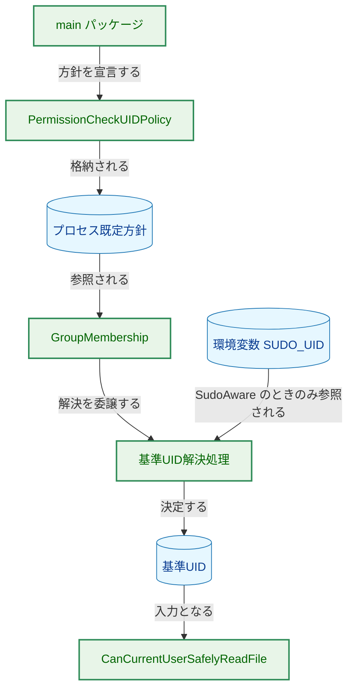

矢印 A → B は「A が B を生み出す、または B へ値を渡す」ことを表す（矢印に付したラベルで関係を補足する）。図中のコンポーネントはすべて本タスクで変更または追加する。

**凡例（Legend）**

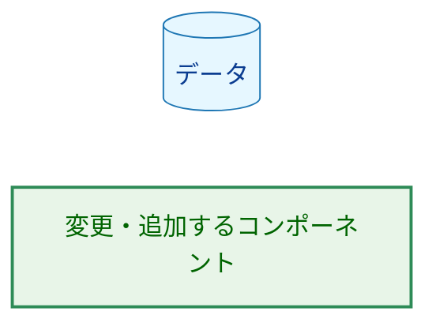

## 2. システム構成

### 2.1 変更前と変更後の判定経路

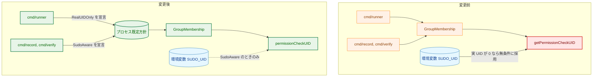

矢印 A → B は「A が B を呼び出す、または B へ値を渡す」ことを表す。破線は条件付きの参照を表す。

**凡例（Legend）**

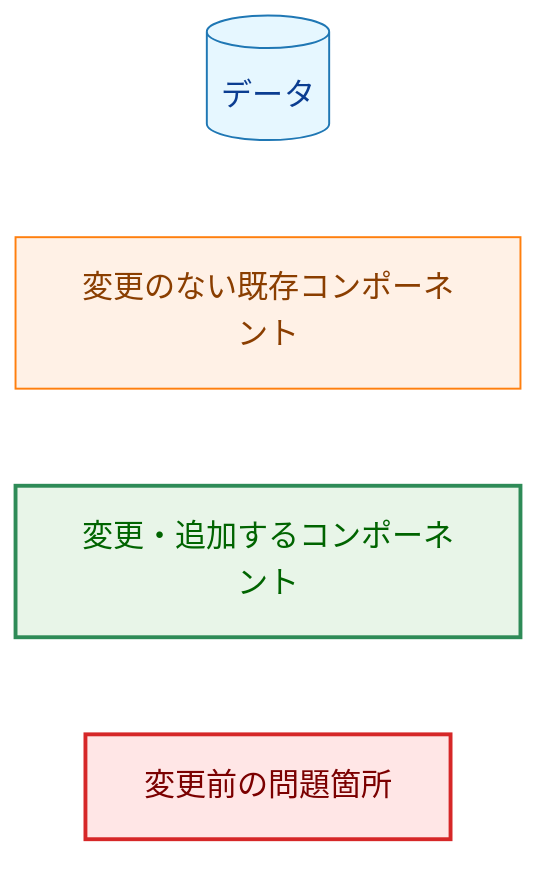

### 2.2 コンポーネント配置

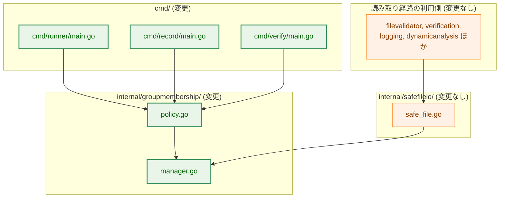

矢印 A → B は「A が B に依存する、または B へ設定を与える」ことを表す。

**凡例（Legend）**

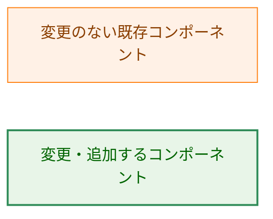

`internal/safefileio` は変更しない。`osFS` は従来どおり `groupmembership.New()` を引数なしで呼び、生成された `GroupMembership` はプロセス既定方針に従う。したがって `FileSystemConfig` へのフィールド追加も、中間コンストラクタのシグネチャ変更も発生しない。

### 2.3 方針の設定から利用までの流れ

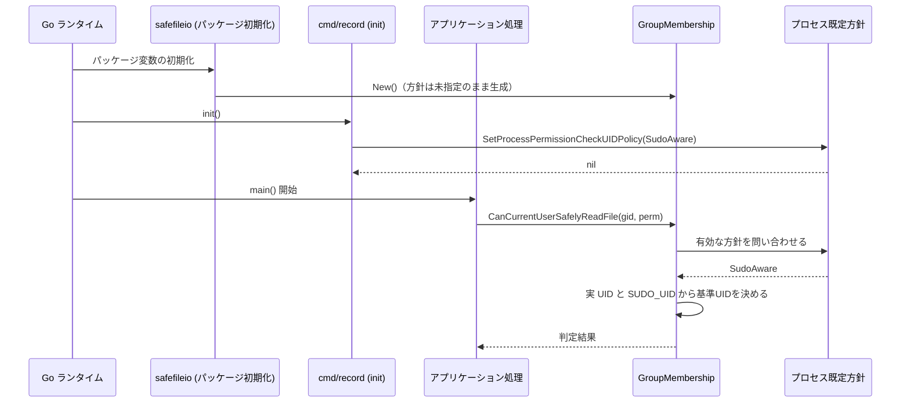

生成時点では方針が決まっていなくてよく、判定を実行する時点で決まっていればよい。この遅延解決によって、`main` より前に生成される `defaultFS` も扱える。

## 3. コンポーネント設計

### 3.1 型定義

```go
// PermissionCheckUIDPolicy は、読み取り安全性チェックの基準UIDをどう決めるかを表す。
type PermissionCheckUIDPolicy int32

const (
    // PolicyUnset はゼロ値であり、この階層では方針が指定されていないことを表す。
    // 判定に用いる方針としては選ばれず、次の階層へ委ねる意味を持つ（§3.4）。
    PolicyUnset PermissionCheckUIDPolicy = iota

    // RealUIDOnly は常にプロセスの実 UID を基準UIDとする。SUDO_UID は読まない。
    RealUIDOnly

    // SudoAware は、実 UID が 0 のとき環境変数 SUDO_UID の値を基準UIDとして採用する。
    // SUDO_UID の値は数値としての妥当性しか検査しておらず、実在するユーザーかどうかは
    // 確認していない。すなわちこの方針は、当該バイナリを root として起動できる者が
    // 基準UIDを任意に指定できることを受け入れる。宣言した場合にのみ選ばれる。
    SudoAware
)

// String は方針名を返す。エラーメッセージおよびログ出力で用いる。
func (p PermissionCheckUIDPolicy) String() string
```

`int` ではなく `int32` を基底型としているのは、保持に用いる `sync/atomic`（§3.3）の `atomic.Int32` や `atomic.LoadInt32` / `atomic.CompareAndSwapInt32` にそのまま渡せる幅だからである。`int` はプラットフォーム依存の幅を持ち、これらの関数にそのまま使えないため、別の `int32` フィールドへの変換を挟む必要が生じてしまう。

`RealUIDOnly` / `SudoAware` という名称は `01_requirements.md` の AC-01 で指定されている。`SudoAware` は「sudo を認識する」としか読めないため、上記のとおり信頼前提をドキュメントコメントで明示する（「検討事項」の「型の名称」への回答）。ゼロ値だけが `Policy` を前置しているのは、これが方針の選択肢ではなく「選択がないこと」を表す特別な値だからである。

### 3.2 生成 API

```go
// Option は GroupMembership の生成オプションを表す。
type Option func(*GroupMembership)

// WithPermissionCheckUIDPolicy は、この GroupMembership インスタンスに限って
// 基準UID決定方針を指定する。指定した場合はプロセス既定方針より優先される。
//
// 本番コードから呼んではならない。バイナリ全体の方針は
// SetProcessPermissionCheckUIDPolicy で宣言する（理由は §5.5）。
func WithPermissionCheckUIDPolicy(p PermissionCheckUIDPolicy) Option

// New は GroupMembership を生成する。オプションを渡さない場合、
// 基準UID決定方針はプロセス既定方針に従う。
func New(opts ...Option) *GroupMembership
```

`New()` は可変長引数になるため、既存の呼び出し箇所はすべてそのままコンパイルが通る。対象は、本番コードの4箇所（`internal/safefileio/safe_file.go:38`、`internal/security/dir_permissions_unix.go:35`、`internal/runner/runner.go:301`、`internal/safefileio/testutil/mock.go:51`）と、テストコードの9箇所（`internal/safefileio/safe_file_cleanup_test.go:191`、`internal/safefileio/safe_file_test.go:569`、`internal/runner/runner_test.go:93`、`internal/runner/base/security/validator_test.go:115,126,138`、`internal/runner/base/security/file_validation_test.go:241,456,1450`）である。いずれも無修正で最終既定方針 `RealUIDOnly` を継承する。これらのテストは現在 sudo 環境を前提としていないため、挙動も変わらない。

### 3.3 プロセス既定方針

```go
// SetProcessPermissionCheckUIDPolicy は、プロセス全体の基準UID決定方針を設定する。
// 各バイナリの main パッケージの init から1度だけ呼ぶ。
// 既に同じ値が設定されている場合は何もせず nil を返す。
// 異なる値が設定済みの場合、または PolicyUnset を渡した場合はエラーを返し、
// 設定済みの値は変更しない。
// p が RealUIDOnly / SudoAware のいずれでもない場合（例えば
// PermissionCheckUIDPolicy(99) のような不正なキャストの結果）もエラーを返す。
func SetProcessPermissionCheckUIDPolicy(p PermissionCheckUIDPolicy) error

// ProcessPermissionCheckUIDPolicy は、現在のプロセス既定方針を返す。
// 未設定の場合は PolicyUnset を返す。
func ProcessPermissionCheckUIDPolicy() PermissionCheckUIDPolicy
```

保持には `sync/atomic` の整数型を用い、設定は compare-and-swap で行う。読み取りは atomic ロードのみで、既存の `cacheMutex` とは独立している。これにより `go test -race` を含む並行実行で競合しない（「検討事項」の「プロセス全体の既定値機構を採る場合の安全性」への回答）。可変なプロセス全体の状態はこの1つだけであり、他に導入しない。

**設定より前に判定が走る余地**: Go は、インポートされたパッケージの初期化をすべて終えてから `main` パッケージの `init()` を実行し、その後 `main()` を呼ぶ。したがって `defaultFS` を含むパッケージ変数の生成は方針の設定より前に完了しているが、方針は生成時ではなく判定時に解決されるため問題にならない（§3.4）。

方針の設定より前に読み取り安全性チェックが実行されうるのは、インポートされたパッケージの `init()` の中で直接実行される場合と、パッケージ初期化中に起動された goroutine から実行される場合の2通りである。2026-07-29 時点で、本番コードの `init()` は `cmd/runner/main.go:55`（フラグ定義のみ）と `internal/runner/base/security/command_analysis.go:237`（メモリ上のスライス分割のみ）の2つだけであり、どちらもファイル読み取りを行わず goroutine も起動しない。パッケージ変数の初期化子も同様で、`internal/safefileio/safe_file.go:49` の `defaultFS` は生成のみを行う。

仮に将来この不変条件が破られても、最終既定方針 `RealUIDOnly` が適用されるため、判定が緩む方向へは倒れない。起こりうるのは `record` / `verify` で `SudoAware` の宣言が間に合わず読み取りが失敗することであり、厳しい側の失敗である。

### 3.4 方針の解決と基準UIDの決定

#### 3.4.1 有効な方針の解決

読み取り安全性チェックの実行時に、以下の順で有効な方針を決める。

| 順位 | 参照先 | 用途 |
|---|---|---|
| 1 | インスタンスの方針（`WithPermissionCheckUIDPolicy` で指定） | 個別指定。テスト専用 |
| 2 | プロセス既定方針 | 各バイナリの `main` が宣言した方針 |
| 3 | 最終既定方針 `RealUIDOnly` | 上位2つがいずれも `PolicyUnset` のとき |

最終既定方針は定数であり、ビルドタグや実行環境によって変わらない。したがって「方針が決まらずエラーになる」状態は存在しない。

この解決処理は、各参照先の値が `RealUIDOnly` / `SudoAware` / `PolicyUnset` のいずれかであることを前提としている。この前提は `SetProcessPermissionCheckUIDPolicy`（§3.3）の入力検証によって保証されるため、ここで想定外の値に対する panic やデフォルトケースによる防御的処理は行わない。

#### 3.4.2 基準UIDの決定

有効な方針が決まったあとの基準UIDの決め方は次のとおりで、`SudoAware` の列は現行の `resolvePermissionCheckUID` の挙動と一致する（AC-13 の表と同じ）。

| 実 UID | `SUDO_UID` | `RealUIDOnly` | `SudoAware` |
|---|---|---|---|
| 0 | 未設定 | 0 | 0 |
| 0 | 有効値 `N` | 0 | `N` |
| 0 | 不正値 | 0 | エラー |
| 非 0 | 未設定 | 実 UID | 実 UID |
| 非 0 | 有効値 | 実 UID | 実 UID |
| 非 0 | 不正値 | 実 UID | 実 UID |

`RealUIDOnly` の列では `SUDO_UID` の値が結果に一切影響しない。実装上も、この方針では環境変数の読み取り自体を行わない（AC-09）。

### 3.5 テスト用の差し替え口

基準UID解決の中核は、有効な方針・実 UID・環境変数取得関数の3つを引数で受け取る純粋関数として実装する。現行の `resolvePermissionCheckUID` が実 UID を引数で受け取っている構造を引き継ぎ、これに有効な方針を引数として加えた形である。

この1つの差し替え口に集約する理由は、`getProcessRealUID()`（`internal/groupmembership/manager.go:514`）が `os.Getuid()` を直接呼んでおり、本タスクではこれを変更しないためである。したがって、非 root でテストを実行する場合、実 UID が 0 のときの挙動は公開メソッド経由では再現できない。§3.4.2 の表のうち `RealUIDOnly` と `SudoAware` で結果が異なる行はすべて実 UID が 0 の行であるから、AC-04〜AC-06、AC-09、AC-11〜AC-13 の検証はこの純粋関数に対して行う。`GroupMembership` に環境変数取得関数のフィールドを持たせる案は、同じ依存に対する2つ目の差し替え口となるため採らない。

AC-09 が求める「`RealUIDOnly` の判定中に `SUDO_UID` が読まれないこと」は、呼び出し回数を数える環境変数取得関数を渡して検証する。実 UID を 0 として `RealUIDOnly` で解決したときは呼び出し回数が 0 であり、同じ条件で `SudoAware` を用いたときは 1 以上である。この対比を取らないと、実 UID が 0 でないために読まれなかっただけの状態と区別できない。

### 3.6 最終既定方針を `RealUIDOnly` とする理由

最終既定方針は、インスタンスにもプロセスにも指定がないときに適用される。これを `RealUIDOnly` とすることで、次が成り立つ。

- **宣言漏れが脆弱側へ倒れない**: `SUDO_UID` を信頼する `SudoAware` は、明示的に宣言したバイナリでしか選ばれない。`cmd/runner` の宣言を削除しても、方針は `RealUIDOnly` のままであり、本タスクが排除した `SUDO_UID` 参照は復活しない。すなわち、指定漏れによって 0149 監査の D1 M-3（`SUDO_UID` が無検証であること）の攻撃対象領域が再び開くことはない。
- **宣言漏れが検出可能な形で現れる**: `cmd/record` / `cmd/verify` の宣言を削除すると、`sudo` 実行時の基準UIDが呼び出し元ユーザーから 0 へ変わり、グループ書き込み可能なファイルの読み取りが失敗する。厳しい側の機能退行であり、権限の抜け穴ではない。
- **ビルド構成に依存しない**: テストビルドと本番ビルドで同じ既定方針が適用される。`docs/tasks/0151_groupmembership_failclosed/02_architecture.md` §1.1 の設計原則2「セキュリティ判定結果をビルド構成に依存させない」（同文書は `approved`、対象パッケージも同じ `internal/groupmembership`）に適合する。
- **既存テストが無修正で通る**: 読み取り安全性チェックは `safefileio.SafeReadFile` を通じて多数のパッケージのテストから間接的に実行される。既定方針があるため、これらは影響を受けない。

宣言の有無そのものを検出したい箇所（AC-07、AC-08、AC-10）は、判定結果ではなく `ProcessPermissionCheckUIDPolicy()` の戻り値を直接検査する。最終既定方針と `cmd/runner` の宣言値がどちらも `RealUIDOnly` であるため、判定結果を見るだけでは宣言の有無を区別できないためである（§7.2）。

### 3.7 各バイナリの宣言

| バイナリ | 宣言する方針 | 宣言箇所 | 根拠 |
|---|---|---|---|
| `runner` | `RealUIDOnly` | `cmd/runner/main.go` の `init()` | root 所有 + setuid ビットのバイナリを一般ユーザーが起動する運用であり、sudo 経由は想定外 |
| `record` | `SudoAware` | `cmd/record/main.go` に `init()` を新設 | `sudo record` が想定運用であり、呼び出し元ユーザー視点の判定を維持する |
| `verify` | `SudoAware` | `cmd/verify/main.go` に `init()` を新設 | `sudo verify` が想定運用であり、同上 |

`runner` の宣言は最終既定方針と同じ値であり、挙動を変えるためではなく意図を明示するために置く。これにより AC-07 / AC-08 が検査対象を持つ。

`cmd/runner/main.go` には既にフラグ定義を行う `init()` があるため、そこに1行加える。`cmd/record` / `cmd/verify` には `init()` がないため新設する。設定を `main()` の先頭ではなく `init()` に置くのは、`main()` から呼ばれるあらゆる読み取りより前に実行されることを言語仕様によって保証するためである。加えてこの配置なら、テストバイナリでも同じ宣言が実行されるため、AC-08 / AC-10 を実行時に検証できる。

### 3.8 型の関係

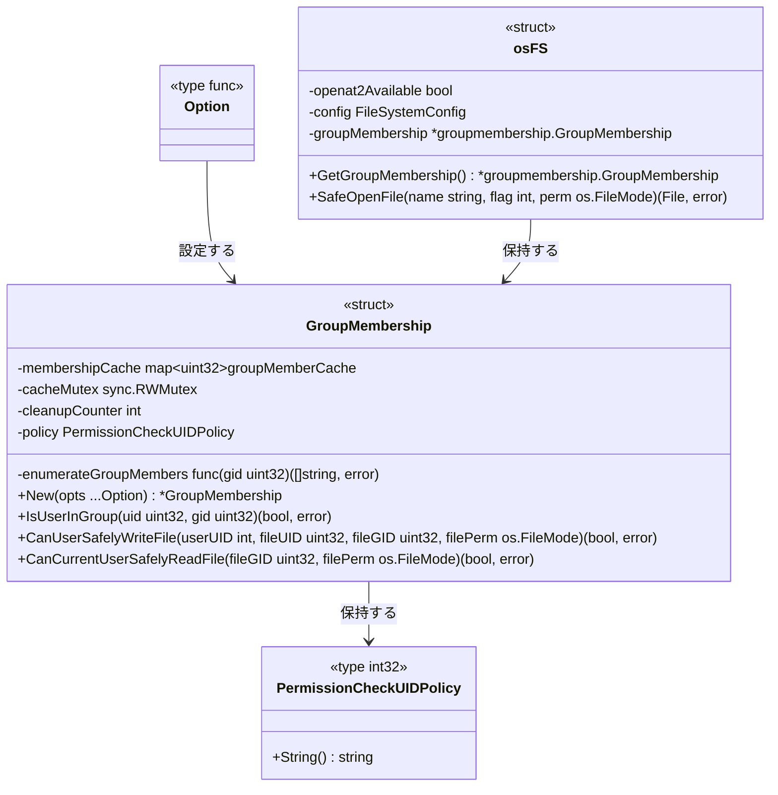

矢印 A → B は「A が B を保持または設定する」ことを表す。本タスクの判定経路に関わる要素のみを抜粋しており、`GetGroupMembers` / `ValidateRequestedPermissions` / `ClearCache` / `GetCacheStats` / `CanCurrentUserSafelyWriteFile`、および `osFS` の `IsOpenat2Available` / `Remove` / `AtomicMoveFile` は変更しないため省略した。`policy` フィールドが本タスクで追加するもので、他は現行の `internal/groupmembership/manager.go` および `internal/safefileio/safe_file.go` の定義そのままである。

### 3.9 コンポーネント責務表

| ファイル | 区分 | 責務 | 更新が必要な既存テスト |
|---|---|---|---|
| `internal/groupmembership/policy.go` | 新規 | `PermissionCheckUIDPolicy` 型、`String()`、`Option`、`WithPermissionCheckUIDPolicy`、プロセス既定方針の設定・取得、最終既定方針の定数 | - |
| `internal/groupmembership/manager.go` | 変更 | `New` の可変長オプション化、`policy` フィールド追加、`getPermissionCheckUID`（現在は445行目のパッケージ関数）を `GroupMembership` のメソッドへ変更し、方針分岐を導入 | `manager_test.go` の `TestGetPermissionCheckUID`（パッケージ関数を直接呼ぶ）、`TestResolvePermissionCheckUID`（方針引数を取らない現行シグネチャに依存） |
| `internal/groupmembership/test_helpers_policy.go` | 新規（`//go:build test`） | プロセス既定方針をテスト内で退避・復元するヘルパー | - |
| `internal/groupmembership/policy_test.go` | 新規 | 方針の解決順序、最終既定方針、AC-12 / AC-13 の組み合わせ、`SUDO_UID` 不読み取りの検証 | - |
| `cmd/runner/main.go` | 変更 | `init()` で `RealUIDOnly` を宣言 | - |
| `cmd/record/main.go` | 変更 | `init()` を新設し `SudoAware` を宣言 | - |
| `cmd/verify/main.go` | 変更 | `init()` を新設し `SudoAware` を宣言 | - |
| `cmd/runner/main_test.go` | 変更 | プロセス既定方針が `RealUIDOnly` であることの検証を追加（AC-07, AC-08） | - |
| `cmd/record/main_test.go` | 変更 | プロセス既定方針が `SudoAware` であること、およびその状態での基準UID解決結果の検証を追加（AC-10, AC-11） | - |
| `cmd/verify/main_test.go` | 変更 | 同上（AC-10, AC-11） | - |
| `docs/user/runner_command.ja.md` | 変更 | `sudo runner` 実行時の挙動変化を記載（AC-16） | - |
| `docs/user/runner_command.md` | 変更 | 上記の英訳を `/mktrans` で反映 | - |
| `CHANGELOG.md` | 変更 | `sudo runner` 利用者向けの破壊的挙動変更として記載 | - |

`internal/safefileio` および読み取り経路の利用側パッケージは変更しない。

### 3.10 設計判断

#### 未指定時の扱い: 既定値案を採り、フェイルクローズド案は採らない

`01_requirements.md`「検討事項」は3案を挙げ、「ゼロ値を不正とし未指定のまま使われたらエラーを返す」フェイルクローズド案を「本タスクの目的と最も整合する」と評価していた。本設計はこれを**採らず**、`RealUIDOnly` を最終既定方針とする案を採る。要件書の評価を覆す判断であるため、根拠を示す。

フェイルクローズド案について要件書は、「`defaultFS` のようにパッケージ初期化時に生成される実体があるため、生成はできるが利用前に設定が必要というライフサイクルが成立するか」を併せて検討すべき点として挙げていた。このライフサイクルは、本番バイナリについては成立する。問題はテストにある。`defaultFS` はすべてのテストバイナリにも存在し、`safefileio.SafeReadFile` を経由する読み取りは多数のパッケージのテストから実行される。未設定をエラーとすると、これらが一斉に失敗する。

この副作用を避ける手段として、ビルドタグ `test` の有無で既定方針を切り替える案（本番ビルドでは未指定をエラーとし、テストビルドでは `RealUIDOnly` を既定とする）を検討したが、以下の理由で退けた。

1. **既存の承認済み設計原則に反する**: `docs/tasks/0151_groupmembership_failclosed/02_architecture.md` §1.1 の設計原則2 は、同じ `internal/groupmembership` パッケージについて「セキュリティ判定結果をビルド構成に依存させない」と定めている。
2. **ビルドタグの実態と合わない**: `test` タグが付かないテスト実行が現に存在する。`make elfanalyzer-integration-test`（`Makefile:487`）と `make libccache-integration-test`（`Makefile:493`）は `-tags integration`、`make performance-test`（`Makefile:599`）は `-tags performance` で実行され、いずれも `safefileio` を経由する。3つとも CI の `test-ci` に含まれる。
3. **本番と異なる挙動の実行ファイルが生成される**: `Makefile:174,178,182` は `build/test/{record,verify,runner}` を `-tags test` でビルドし、`make e2e-test` はこれを実行する。切り替え案では、e2e テストが検証する実行ファイルと出荷される実行ファイルで既定方針が異なることになる。
4. **本番側のコードが lint されない**: `golangci-lint` は `--build-tags test` 付きで実行される（`Makefile:24`）ため、`!test` 側のファイルは検査対象外になる。
5. **可変なグローバル状態が増える**: AC-15 の検証にはビルドタグで決まる既定方針を一時的に書き換える必要があり、`go test -race` 下で同期対象がもう1つ増える。

既定値案を採ることで、フェイルクローズド案が守ろうとしていた性質は別の形で確保される。守るべきは「指定漏れが `SUDO_UID` の無検証な信頼へ倒れないこと」であり、既定値を厳しい側の `RealUIDOnly` に置けば、`SudoAware` は宣言なしには決して選ばれない。これは危険な方針だけに明示指定を求める構造であり、「推測をやめて明示指定にする」という目的にも適合する。

AC-15 は「既定値を持つ方針を採る場合は、その既定値が意図した側であることをテストで固定する」と、この選択を明示的に許容している。

#### 伝播機構: プロセス既定方針を採る

コンストラクタ引数だけで伝播させる案は、`defaultFS` が `main` より前に生成されるため単独では成立しない（`01_requirements.md` が必須条件として挙げている点）。`FileSystemConfig` へのフィールド追加や中間コンストラクタのシグネチャ変更も、`defaultFS` には届かない。

`defaultFS` そのものを廃止して呼び出し側に `FileSystem` を渡させる案も検討したが、`safefileio.SafeReadFile` は `internal/filevalidator/validator.go:1452`、`internal/runner/config/loader.go:127`、`internal/fileanalysis/file_analysis_store.go:109,161` から使われており、本タスクの目的から離れた大規模な変更になる。本タスクでは採らない。

したがってプロセス単位の設定機構が必要になる。可変なプロセス全体の状態を導入することの代償は、次の3点で抑える。

- 設定は compare-and-swap による1度きりで、異なる値への再設定はエラーとする。実行中に方針が入れ替わらないため、判定と利用の間に矛盾が生じる窓がない。
- インスタンス方針が常にプロセス既定方針より優先されるため、テストは他のテストへ影響を与えずに方針を指定できる。
- 保持と参照はいずれも atomic 操作のみで行う。可変なプロセス全体の状態はこの1つだけとする。

#### 効かない生成箇所には方針を渡さない

`internal/security/dir_permissions_unix.go:35` の `NewDirectoryPermChecker()` と `internal/runner/runner.go:301` は、3バイナリの `main` から方針を渡しやすい位置にあるが、これらが使う `CanUserSafelyWriteFile` は実 UID を直接受け取るため基準UIDを参照しない。ここに方針指定を追加すると、後から読む者に「ここで方針が効いている」と誤解させる。`01_requirements.md`「対象外」の方針どおり追加しない。

## 4. エラーハンドリング設計

### 4.1 エラー型

```go
// ErrPermissionCheckUIDPolicyConflict は、プロセス既定方針に対して
// 設定済みの値と異なる値を設定しようとしたときに返される。
var ErrPermissionCheckUIDPolicyConflict = errors.New("process-wide permission check UID policy is already set to a different value")
```

追加するエラーはこれだけである。最終既定方針があるため「方針が決まらない」エラーは存在しない。既存の `ErrSudoUIDOutOfRange`（`SUDO_UID` が uint32 の範囲外）はそのまま維持し、`SUDO_UID` が数値として解釈できない場合に `strconv` のエラーを包む現行の扱いも変えない。

### 4.2 エラーメッセージの方針

既存のエラーメッセージの文面は変更しない。`CanCurrentUserSafelyReadFile` が返す `ErrFileWorldWritable` / `ErrGroupWritableNonMember` / `ErrPermissionsExceedMaximum` はいずれも現行のままとする。これらは `internal/safefileio/safe_file.go:445,492` で `ErrInvalidFilePermissions` に包まれて呼び出し元へ渡るが、その構造も変えない。

方針名と基準UIDをエラー本文へ追加する案は検討したが、採らない。`01_requirements.md`「対象外」が「利用した事実と値の監査ログ記録」を明示的に [#941](https://github.com/isseis/go-safe-cmd-runner/issues/941) へ送っており、どの AC もエラー本文の内容を要求していないためである。`String()` は `ErrPermissionCheckUIDPolicyConflict` のメッセージ組み立てとテストの失敗表示に用いる。

プロセス既定方針の設定に失敗した場合、各 `main` の `init()` では回復手段がないため panic とする。設定値はビルド時に固定された定数であるため、この経路が実行時の入力によって起きることはない。ただし将来、インポートされたパッケージが先に別の値を設定するようになった場合は、リンク構成だけを原因として起こりうる。その場合も panic はいかなる読み取りよりも前に起きるため、誤った方針で判定が行われることはない。

## 5. セキュリティ考慮事項

### 5.1 脅威モデル

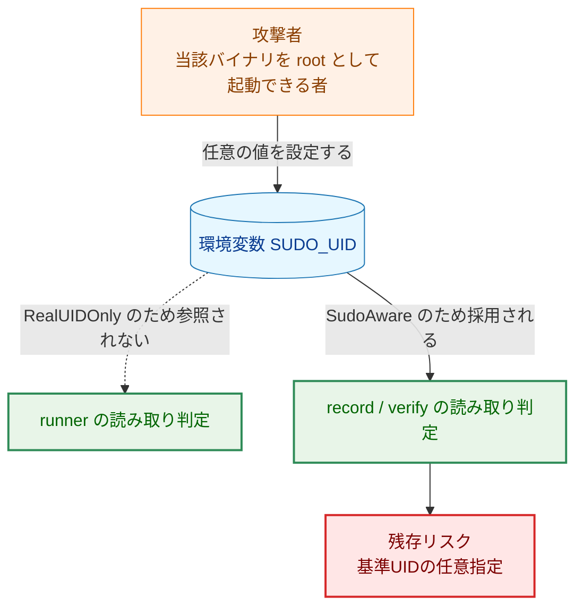

矢印 A → B は「A が B に影響を与える」ことを表す。破線は本設計によって断たれる影響を表す。

**凡例（Legend）**

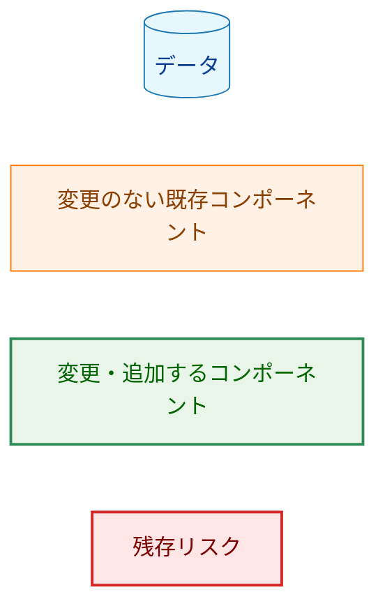

### 5.2 本設計が閉じるもの・閉じないもの

| 項目 | 変更前 | 変更後 |
|---|---|---|
| `runner` の読み取り判定で `SUDO_UID` が効くか | 効く（`sudo runner` 時） | 効かない |
| `record` / `verify` の読み取り判定で `SUDO_UID` が効くか | 効く | 効く（変更なし） |
| `SUDO_UID` の値の実在確認 | 行わない | 行わない（対象外。[#941](https://github.com/isseis/go-safe-cmd-runner/issues/941)） |
| `SUDO_UID` を採用した事実の記録 | 行わない | 行わない（対象外。[#941](https://github.com/isseis/go-safe-cmd-runner/issues/941)） |
| 宣言漏れによる `SUDO_UID` 参照の復活 | 概念が存在しない | 起こらない（最終既定方針が `RealUIDOnly`） |

`SUDO_UID` の値自体の検証と、その利用を記録することは、`01_requirements.md`「対象外」のとおり本タスクに含まない。これらは [#941](https://github.com/isseis/go-safe-cmd-runner/issues/941) で扱う。D1 M-3 の攻撃対象領域は解消ではなく、3バイナリから2バイナリへの縮小である。

この結果、`record` / `verify` が `SUDO_UID` を採用したことは実行時に記録されない。root の cron に `SUDO_UID` が残留する事故シナリオ（`01_requirements.md`「背景」）は、`record` / `verify` については引き続き検出できないままである。検出手段の追加は、値の検証と併せて [#941](https://github.com/isseis/go-safe-cmd-runner/issues/941) で扱う。

### 5.3 挙動が厳しくなる方向への変化

`sudo runner` で起動した場合、基準UIDが呼び出し元ユーザーから 0 へ変わる。読み取り判定はグループ書き込み可能なファイルについて「基準UIDがそのファイルのグループに属するか」を見るため、root が当該グループの構成員でなければ、従来通っていた読み取りが拒否されうる。

これは権限の抜け穴ではなく機能退行であり、フェイルクローズド側への変化である。想定運用（setuid ビット付き `runner` を一般ユーザーが起動）では実 UID が一般ユーザーのままであるため影響しない。root の cron から `runner` を直接起動する場合も `SUDO_UID` が設定されないため、変更前からすでに基準UIDが 0 であり影響しない。

利用者への周知は AC-16 の文書更新と `CHANGELOG.md` への記載で行う。

### 5.4 副作用の範囲

基準UID決定方針は読み取り可否の判定にのみ影響し、ファイルの書き込み・削除・ネットワーク送信のいずれも増減させない。書き込み判定（`CanUserSafelyWriteFile` 系）は従来どおり実 UID を直接受け取り、本タスクの影響を受けない。方針の違いによって抑止または許可される外部副作用は存在しない。

### 5.5 インスタンス方針の悪用可能性

`WithPermissionCheckUIDPolicy` はインスタンス方針をプロセス既定方針より優先させるため、`runner` の依存グラフ内のどこかでこの関数が `SudoAware` 付きで呼ばれると、本タスクが閉じた `SUDO_UID` 参照が局所的に復活する。プロセス既定方針を検査する AC-08 のテストはこれを検出しない。

現時点で本番コードにそのような呼び出しはなく、§3.2 のドキュメントコメントで本番コードからの呼び出しを禁じる。加えて、`forbidigo` などの lint ルールでテストファイル以外からの呼び出しを機械的に禁止することを推奨する。ただし lint ルールの追加は `01_requirements.md` のスコープ外であり、実装計画時に採否を判断する。

## 6. 処理フロー詳細

### 6.1 基準UIDの決定

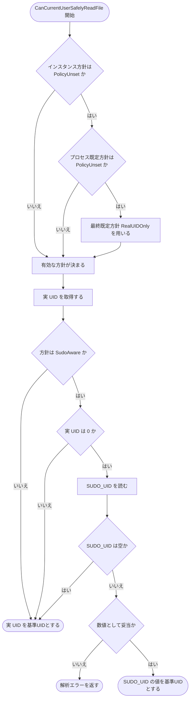

矢印 A → B は「A の次に B を評価する」ことを表す。菱形は分岐条件を表す。この図は色分けを用いないため凡例はない。

`RealUIDOnly` の経路には `SUDO_UID` を読む節点が現れない。これが AC-09 の根拠である。また、方針の解決がエラーで終わる枝は存在しない。

### 6.2 プロセス既定方針の設定

`SetProcessPermissionCheckUIDPolicy` の観測可能な結果は3通りである。

| 呼び出し時の状態 | 引数 | 結果 |
|---|---|---|
| 未設定 | `RealUIDOnly` または `SudoAware` | 設定され `nil` を返す |
| 設定済み | 設定済みの値と同じ | 何もせず `nil` を返す |
| 設定済み | 設定済みの値と異なる | 値を変えず `ErrPermissionCheckUIDPolicyConflict` を返す |
| 任意 | `PolicyUnset` | 値を変えずエラーを返す |

## 7. テスト戦略

### 7.1 単体テスト

すべて `internal/groupmembership` パッケージ内に置く。実 UID は純粋関数の引数として与えるため、root 権限を必要としない。

| 対象 | 内容 | 対応 AC |
|---|---|---|
| 型と生成 API | `RealUIDOnly` / `SudoAware` の定義、`WithPermissionCheckUIDPolicy` による指定 | AC-01, AC-02 |
| 基準UID解決の純粋関数 | `RealUIDOnly` について、実 UID が 0 / 非 0 × `SUDO_UID` 未設定 / 有効値 / 不正値の全組み合わせで実 UID が返る | AC-04, AC-12 |
| 同上 | `SudoAware` について、同じ全組み合わせが §3.4.2 の表と一致する | AC-05, AC-06, AC-13 |
| 同上 | `SUDO_UID` を採用する条件下（実 UID = 0、有効な `SUDO_UID`）で、変更前の `resolvePermissionCheckUID` と同じ UID を返す | AC-11 |
| 環境変数取得関数の呼び出し回数 | 実 UID = 0 で `RealUIDOnly` は 0 回、`SudoAware` は 1 回以上（§3.5 の対比） | AC-03, AC-09 |
| 方針の解決順序 | インスタンス方針 > プロセス既定方針 > 最終既定方針の優先順位 | AC-02 |
| 最終既定方針 | インスタンスにもプロセスにも指定がないとき `RealUIDOnly` が適用される | AC-14, AC-15 |
| 設定の一度きり | 同じ値の再設定は `nil`、異なる値は `ErrPermissionCheckUIDPolicyConflict`、`PolicyUnset` はエラー | AC-14 |

### 7.2 結合テスト

| 対象 | 内容 | 対応 AC |
|---|---|---|
| `cmd/runner` のテストバイナリ | `ProcessPermissionCheckUIDPolicy()` が `RealUIDOnly` を返す | AC-07, AC-08 |
| `cmd/record` / `cmd/verify` のテストバイナリ | `ProcessPermissionCheckUIDPolicy()` が `SudoAware` を返す | AC-10 |
| `cmd/record` / `cmd/verify` のテストバイナリ | 上記の方針の下で、実 UID = 0 かつ有効な `SUDO_UID` を与えたときの基準UID解決結果が変更前と一致する | AC-10, AC-11 |
| `safefileio` 経由の判定 | インスタンス方針を指定した `GroupMembership` を持つ `FileSystem` で、解決された基準UIDが指定した方針に従う | AC-07, AC-10 |

いずれも `ProcessPermissionCheckUIDPolicy()` の戻り値を直接検査する。読み取りの成否を見るだけでは不十分である。`cmd/runner` の宣言値は最終既定方針と同じ `RealUIDOnly` であるため、宣言を削除しても読み取りの成否は変わらないからである（§3.6）。

AC-08 はソースコードの検索では検証しない。`SudoAware` の実装コードは共有パッケージ経由で `runner` バイナリにもリンクされるため、方針の違いは実行時設定であって記述の有無では表せない。テストバイナリの `init()` が本番と同じ宣言を実行することを利用し、実行時に確かめる。

### 7.3 セキュリティテスト

- `RealUIDOnly` において、`SUDO_UID` にどのような値（有効値、不正値、極端に長い文字列）が設定されていても、実 UID が 0 の場合を含めて判定結果が変わらないことを検証する。
- プロセス既定方針を宣言しない状態で解決を行い、`SudoAware` ではなく `RealUIDOnly` が適用されることを検証する（宣言漏れが脆弱側へ倒れないことの確認）。

### 7.4 並行性とテストの独立性

プロセス既定方針は一度設定すると異なる値へ変更できない。テストへの影響を次のように扱う。

- 方針を切り替える必要があるテストは、プロセス既定方針ではなくインスタンス方針（`WithPermissionCheckUIDPolicy`）を用いる。他のテストへ影響せず、`t.Parallel()` も使える。
- プロセス既定方針そのものを対象とするテスト（§7.1 の「設定の一度きり」）は、`internal/groupmembership` のテストバイナリ内で退避・復元ヘルパー（`test_helpers_policy.go`）を用い、`t.Cleanup` で元の値へ戻す。これらのテストは `t.Parallel()` を使わない。
- `cmd/*` のテストバイナリでは、プロセス既定方針は各 `init()` が設定した値のまま変更しない。§7.2 のテストは読み取り専用である。

`go test -race` の通過を成功条件に含める。

### 7.5 テスト対象外の確認事項

`make integration-test`（本番タグでビルドした `build/runner` を実行する唯一の Make ターゲット）は `test-ci` に含まれず、sudo と Slack webhook を必要とする。したがって CI は本番タグのバイナリを実行しない。本設計では最終既定方針があるため、宣言漏れがあっても本番バイナリが起動不能になることはなく、この CI 構成の穴が本タスクの受け入れを妨げることはない。ただし宣言漏れ自体は §7.2 のテストで検出する。

## 8. 実装優先順位

| フェーズ | 内容 | 対応 AC |
|---|---|---|
| 1 | `PermissionCheckUIDPolicy` 型、`Option`、プロセス既定方針、最終既定方針の追加 | AC-01, AC-02 |
| 2 | `getPermissionCheckUID` のメソッド化と方針分岐、純粋関数への差し替え口導入、既存テストの更新 | AC-03〜AC-06, AC-09, AC-11〜AC-15 |
| 3 | 3バイナリの `main` での方針宣言と、実行時検証テストの追加 | AC-07, AC-08, AC-10 |
| 4 | 利用者向け文書と `CHANGELOG.md` の更新（日本語版のあと `/mktrans` で英語版） | AC-16 |

各フェーズは単独で `make test` が通る状態を保てる。最終既定方針があるため、フェーズ3が未了でも本番バイナリは `RealUIDOnly` で正常に動作する。ただしその状態では `record` / `verify` が sudo 実行時に機能退行するため、フェーズ2と3は同一 PR にまとめる。

## 9. 将来の拡張性

- **`SUDO_UID` の値の検証と利用記録（[#941](https://github.com/isseis/go-safe-cmd-runner/issues/941)）**: `user.LookupId` による実在確認と `log/slog` への記録は、`SudoAware` の解決処理の内側に閉じて追加できる。方針の型や伝播機構には影響しない。§5.2 で残るとした「採用の事実を検出できない」問題は、この追加で解消される。
- **方針の追加**: `PermissionCheckUIDPolicy` は列挙型であり、別の決定規則（例: 明示した UID を用いる方針）が必要になった場合も、解決処理の分岐と定数の追加で済む。
- **`runner` を root として直接実行する形態への対応（[#921](https://github.com/isseis/go-safe-cmd-runner/issues/921)）**: 検討する場合、`runner` の宣言を変えるか、起動形態に応じて宣言を切り替えることになる。宣言箇所が `init()` の1行に集約されているため変更範囲は限定される。
- **`defaultFS` の廃止**: 将来 `safefileio` のパッケージ関数群を廃して呼び出し側に `FileSystem` を渡す形にした場合、プロセス既定方針は不要になり、インスタンス方針だけで完結する。

## 付録A: 決定履歴

> 本文は現行の設計を記述している。以下は、検討過程で採らなかった案とその理由の記録である。

- **未指定を不正とするフェイルクローズド案**: `01_requirements.md`「検討事項」が有力視していた案。本番バイナリでは成立するが、テストバイナリに存在する `defaultFS` のために多数のパッケージのテストが失敗する。§3.10 を参照。
- **ビルドタグで既定方針を切り替える案**: 上記の副作用を避けるために検討したが、0151 の設計原則2 に反すること、`integration` / `performance` タグでのテスト実行を取りこぼすこと、`build/test/*` が本番と異なる挙動になること、`!test` 側が lint されないこと、可変なグローバル状態が増えることから退けた。§3.10 に5点の根拠を記載している。
- **`SudoAware` を既定値とする案**: `runner` の指定漏れが本タスクで排除したはずの `SUDO_UID` 参照として残るため採らない。
- **`FileSystemConfig` へのフィールド追加**: `defaultFS` に届かないため単独では成立しない。§3.10 を参照。
- **中間コンストラクタのシグネチャ変更**: 同上に加え、`internal/dynamicanalysis`、`internal/security/elfanalyzer`、`internal/security/machoanalyzer`、`internal/filevalidator` など多数のパッケージに波及するため採らない。
- **`GroupMembership` に環境変数取得関数のフィールドを持たせる案**: 純粋関数への引数渡しと二重の差し替え口になるため採らない。§3.5 を参照。
- **エラー本文へ方針名と基準UIDを追加する案**: どの AC も要求しておらず、`01_requirements.md`「対象外」が利用記録を [#941](https://github.com/isseis/go-safe-cmd-runner/issues/941) へ送っているため採らない。§4.2 を参照。
