# アーキテクチャ設計書: `SUDO_UID` の実在確認と採用事実の記録

## Document Status

| Item | Value |
|---|---|
| Status | `draft` |
| Created | 2026-07-30 |
| Review date | - |
| Reviewer | - |
| Comments | - |

## 0. 本書の位置づけ

本書は [`01_requirements.md`](01_requirements.md)（status: `approved`）が定めた振る舞いを実現機構へ落とし込む設計文書である。対象は監査所見 [D1 M-3](../0149_security_code_smell_audit_fable/findings/D1_groupmembership.md) のうち、先行タスク 0160 が [#941](https://github.com/isseis/go-safe-cmd-runner/issues/941) へ送付した2点、すなわち「`SUDO_UID` の値を無検証で採用していること」と「採用した事実が観測できないこと」である。

対象パッケージは `internal/groupmembership` のみである。0160 が導入した基準UID決定方針（`RealUIDOnly` / `SudoUIDAware`）の型と伝播機構はそのまま用い、変更は `SudoUIDAware` の解決処理の内側に閉じる。これは [0160 の 02_architecture.md](../0160_permission_check_subject_explicit/02_architecture.md) §9 が本タスクについて想定していた変更範囲と一致する。

要件書が設計判断へ委ねた6つの論点と、本書で結論を確定する箇所の対応は次のとおりである。

| 要件書「検討事項」の論点 | 結論を示す箇所 |
|---|---|
| 実在確認の実装手段と非 CGO ビルドでの挙動 | §3.2、§3.7.1、§3.7.5 |
| 実在確認結果の再利用（キャッシュ）の要否 | §3.4、§3.7.2 |
| 記録を1回に制限する機構の置き場所 | §3.3、§3.7.3 |
| `LookupId` の差し替え口 | §3.1、§3.7.6 |
| 記録するログの属性名と文言 | §4.3 |
| `LookupId` 自体の失敗と「ユーザーが存在しない」の区別 | §4.1、§4.2 |

用語は [`docs/translation_glossary.md`](../../translation_glossary.md) と次節「用語」に従う。

## 用語

0160 で定義済みの用語のうち、本書で用いるのは 基準UID、基準UID決定方針、実 UID、読み取り安全性チェック の4つである。定義は [0160 の 02_architecture.md](../0160_permission_check_subject_explicit/02_architecture.md) 「用語」節による。要点は、基準UIDが「読み取り安全性チェックが誰の視点で判定するか」を表す UID であること、基準UID決定方針がそれを実 UID だけで決めるか `SUDO_UID` も見るかの選択であることの2つである。本書で新たに用いる用語を次に定義する。

| 用語 | 意味 |
|---|---|
| 実在確認 | ある UID がユーザーデータベース上に存在するユーザーを指すことの確認 |
| 実在確認のメモ | 実在を確認できた UID を `GroupMembership` のインスタンス単位で覚えておき、同じ UID への照会を繰り返さないための記録 |
| 採用 | 基準UID決定方針が `SudoUIDAware` のときに、`SUDO_UID` の値を基準UIDとして用いること |
| 採用事実の記録 | 採用によって基準UIDが実 UID と異なる値になったことを `log/slog` へ警告として出力すること |
| センチネルエラー | `errors.Is` による判別のためにパッケージが公開する固定のエラー値 |
| ユーザーデータベース | ユーザーの属性を引くための情報源。CGO 有効時は NSS（`/etc/passwd`、LDAP、SSSD 等のバックエンド）、無効時は `/etc/passwd` のみ |
| ユーザーデータベース種別 | 当該ビルドがどちらのユーザーデータベースを参照するかを表す値。CGO 有効時は `nss`、無効時は `passwd-file` |

## 1. 設計の全体像

### 1.1 設計目標

- `SUDO_UID` を採用する直前に実在確認を行い、確認できない場合は基準UIDを返さずエラーとする。
- 実在確認が失敗する2つの原因（ユーザーが実在しない／確認処理そのものが失敗した）を、いずれもフェイルクローズドに倒したうえで、`errors.Is` によって区別できるようにする。
- 採用によって基準UIDが実 UID と異なる値になった事実を、プロセスごとに1回だけ警告として記録する。
- 実在確認の追加によって、ユーザーデータベースへの照会回数が処理対象ファイル数に比例して増えないようにする。
- 拒否が発生したとき、運用者が原因（値の誤り／照会の失敗／参照したユーザーデータベース種別）を判別できるようにする。
- `RealUIDOnly` を宣言するバイナリ（`runner`）の挙動を一切変えない。実在確認も記録も実行されない。
- root 権限のないテスト環境で、実在確認とログ出力の両方を差し替えて全分岐を検証できるようにする。

### 1.2 設計原則

- **フェイルクローズド徹底**: 実在を確認できなかった場合は、原因が確定的（実在しない）か一時的（確認処理の失敗）かによらず拒否側へ倒す。この方針は [0151 の 02_architecture.md](../0151_groupmembership_failclosed/02_architecture.md) §1.1 の設計原則1 と同じ向きである。
- **判定規則をビルド構成に依存させない**: 同じ入力に対して同じ規則を適用し、CGO の有無で分岐を設けない（0151 §1.1 の設計原則2）。ただし規則が同一であっても、参照するユーザーデータベースの見え方がビルド構成によって異なるため、**判定結果は環境によって一致しないことがある**。この差は本設計では解消せず、原因を判別できるようにすることで対処する（§3.7.5、§5.5）。原則が保証するのは規則の同一性であり、結果の同一性ではない。本書はこの区別を一貫して用いる。
- **単一の解決地点を保つ**: 実在確認と記録は 0160 が集約した基準UID解決処理の内側に置く。他パッケージへ判定ロジックを分散させない。
- **差し替え口を1箇所に集約する**: 外部依存（環境変数、ユーザーデータベース、記録の出力）は、いずれも基準UID解決処理への引数として渡す。0160 が退けた「`GroupMembership` にフィールドとして持たせる案」（同 §3.5、付録A）は本タスクでも採らない。
- **単純さの優先（YAGNI）**: 公開 API のシグネチャは変更しない。新たに導入する状態は、実在確認の結果を再利用するためのインスタンス単位の記録と、記録を1回に制限するためのプロセス単位のフラグの2つに限る。
- **記録は観測のためだけに行う**: 記録は判定結果に影響を与えない。記録の失敗（ハンドラのエラー等）によって読み取り判定が変わることはない。

### 1.3 コンセプトモデル

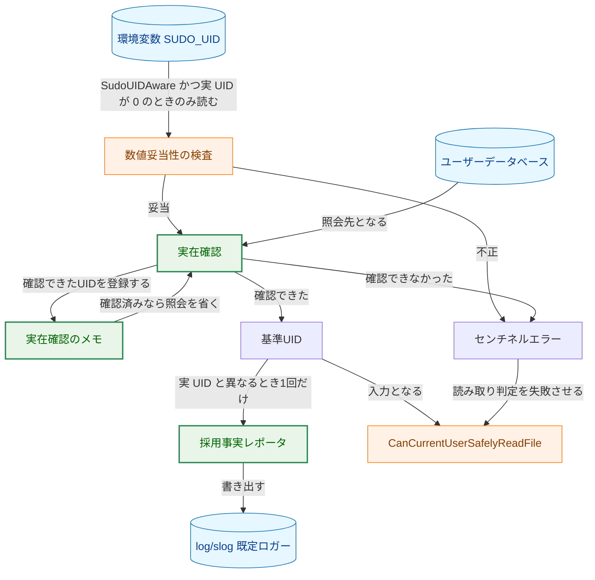

矢印 A → B は「A が B へ値を渡す、または A の結果として B へ進む」ことを表す（矢印に付したラベルで条件を補足する）。円柱はデータの入出力先を表す。`数値妥当性の検査` は 0160 から変更しない既存処理であり、`実在確認`・`実在確認のメモ`・`採用事実レポータ` が本タスクで追加するコンポーネントである。`基準UID` と `センチネルエラー` は解決処理の戻り値であり、データの入出力先ではないため円柱を用いない。

**凡例（Legend）**

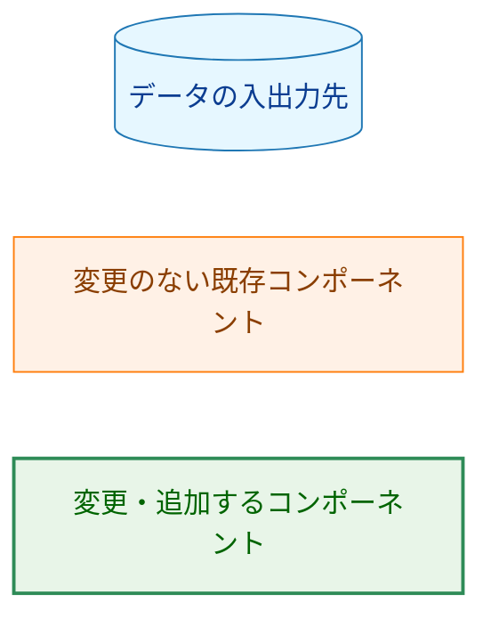

## 2. システム構成

### 2.1 変更前と変更後の解決経路

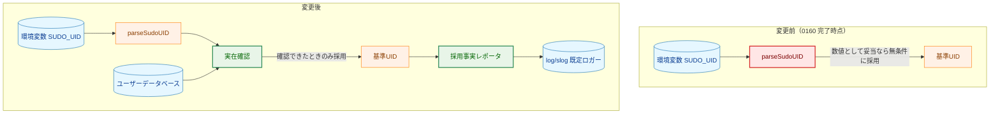

矢印 A → B は「A が B へ値を渡す、または A の次に B を評価する」ことを表す。円柱はデータの入出力先を表す。この図は `SudoUIDAware` かつ実 UID が 0 かつ `SUDO_UID` が設定済みの経路のみを描いており、それ以外の経路は 0160 から変更がない。実在確認のメモは §1.3 に示したため、本図では省いた。

**凡例（Legend）**

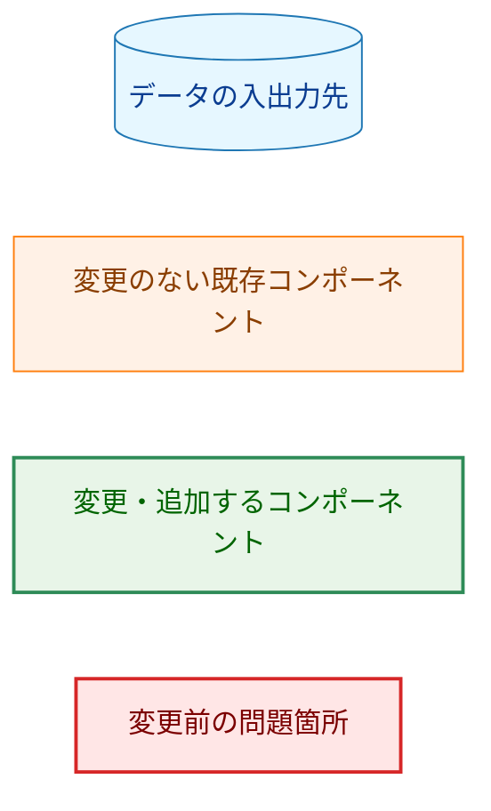

### 2.2 コンポーネント配置

本タスクが変更するコードはすべて `internal/groupmembership` 内にある。ファイルごとの配置は現行の構成に従う。すなわち基準UID解決処理（`resolvePermissionCheckUID`、`parseSudoUID`、定数 `sudoUIDEnvVar`、`ErrSudoUIDOutOfRange`）は `manager.go` にあり、`policy.go` には基準UID決定方針の型とプロセス既定方針だけがある。本タスクではこの分担を変えず、実在確認・記録・新しいエラー変数のいずれも `manager.go` に加える。既存の `ErrSudoUIDOutOfRange` と同じファイルに置くことで、§4.1 がひとまとまりとして示す4つのエラーが、ファイルをまたいで散らばらない。

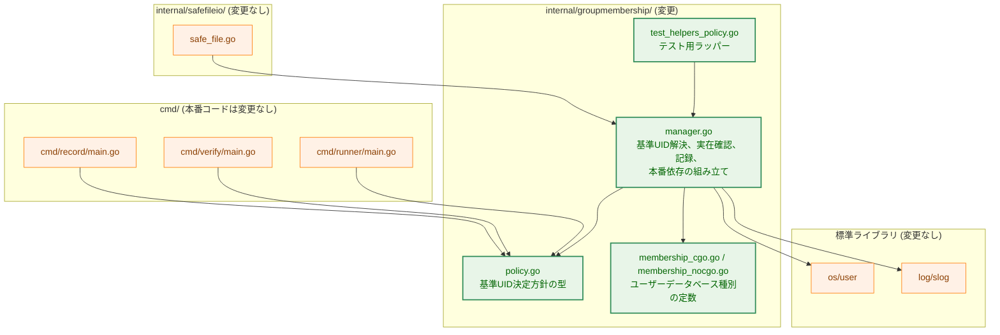

矢印 A → B は「A が B に依存する、または B へ設定を与える」ことを表す。

**凡例（Legend）**

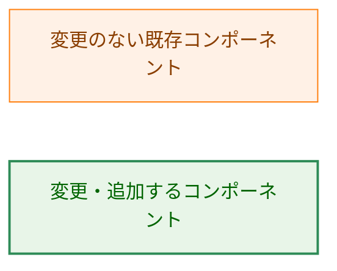

`cmd/record` / `cmd/verify` / `cmd/runner` の本番コードは変更しない。0160 が置いた `init()` での方針宣言がそのまま有効であり、本タスクは宣言の意味を変えずに `SudoUIDAware` の内部処理だけを強化する。`internal/safefileio` も変更しない。

`policy.go` の変更は `SudoUIDAware` 定数のドキュメントコメントの更新だけである（§3.8）。`os/user` と `log/slog` への依存は `manager.go` に閉じる。

### 2.3 採用と記録の流れ

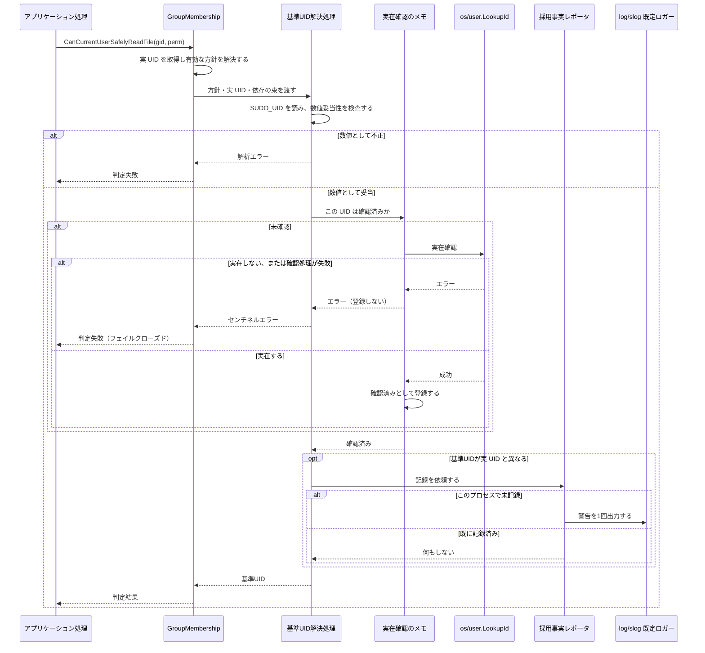

`SudoUIDAware` かつ実 UID が 0 かつ `SUDO_UID` が設定済みの場合のみを描いている。`RealUIDOnly` の場合、および実 UID が 0 でない場合は、`SUDO_UID` の読み取りから記録までのすべてが実行されない。シーケンス図は色分けを用いないため凡例はない。

## 3. コンポーネント設計

### 3.1 基準UID解決の依存関係の束

0160 の `resolvePermissionCheckUID` は、環境変数取得関数 `getenv` を引数で受け取る形でテスト可能性を確保していた。本タスクは差し替えたい外部依存を3つに増やすため、これらを1つの構造体にまとめて渡す。

```go
// permissionCheckUIDDeps bundles the external dependencies that the
// SudoUIDAware branch consults while resolving the permission check UID.
// getPermissionCheckUID supplies the production values; in-package tests
// replace each field. All fields must be non-nil; the RealUIDOnly branch
// reads none of them.
type permissionCheckUIDDeps struct {
    // getenv reads an environment variable (os.Getenv in production).
    getenv func(name string) string

    // verifyUserExists reports whether a user with the given UID exists. A
    // nil error means the user exists. It passes through whatever os/user
    // returns so that the caller can classify the failure.
    verifyUserExists func(uid int) error

    // reportAdoption records that the permission check UID was taken from
    // SUDO_UID. It is the single seam for the record: production binds both
    // the destination logger and the once-per-process guard into it.
    reportAdoption func(policy PermissionCheckUIDPolicy, realUID, permissionCheckUID int)
}

// resolvePermissionCheckUID resolves the UID used by the read-safety check
// from the effective policy, the process's real UID, and deps.
func resolvePermissionCheckUID(policy PermissionCheckUIDPolicy, realUID int, deps permissionCheckUIDDeps) (int, error)
```

引数を個別に並べるのではなく構造体にまとめる理由は2つある。第一に、関数値が3つ並ぶシグネチャでは、呼び出し側が引数の順序を誤りやすい。第二に、`RealUIDOnly` の経路ではどのフィールドも使わないため、「これらは `SudoUIDAware` の分岐が使う依存の集合である」という区分を型として表せる。

記録の依存を `reportAdoption` 1つのフィールドに集約し、出力先ロガーと1回制限の機構を別々のフィールドとして持たせないのは、両者が単独では意味を持たず、常に組にして使われるからである。フィールドを2つに分けると、解決処理が「一方のフィールドの値をもう一方のフィールドのメソッドへ渡す」形になり、型が組み合わせの正しさを保証できない。§1.2 の「差し替え口を1箇所に集約する」に従い、記録に関する差し替え口は1つとする。

`reportAdoption` は `realUID` と `permissionCheckUID` という2つの `int` を隣接して受け取る。値の入れ替えは型では検出できないため、記録の内容を組み立てる箇所を §3.3 のレポータ1箇所に限り、§7.1 の「記録の内容」のテストで両者に異なる値を与えて属性ごとに検証する。

`getProcessRealUID()` は 0160 と同じく変更しない。したがって実 UID が 0 のときの挙動は非 root のテストでは公開メソッド経由では再現できず、検証はこの関数に対して行う（0160 §3.5 と同じ構造）。この制約が検証範囲に与える影響は §7.6 に整理する。

### 3.2 実在確認の差し替え口と既定実装

差し替え口は `os/user` との境界に置き、エラーの分類は解決処理側で行う。

```go
// lookupUserByUID reports whether a user with the given UID exists in the
// user database. It returns the error from os/user unchanged so that the
// caller can distinguish "no such user" from a lookup failure.
func lookupUserByUID(uid int) error
```

この境界の引き方には次の意図がある。分類規則（`user.UnknownUserIdError` を「実在しない」、それ以外を「確認処理の失敗」と読む規則。§4.2）はセキュリティ判定の一部であり、テストで固定すべき対象である。分類を既定実装の側に置くと、差し替えたテストでは分類規則が実行されなくなる。そのため既定実装は `user.LookupId` の呼び出しと戻り値の受け渡しに限り、分類は解決処理に置く。

戻り値を `error` のみとし `*user.User` を返さないのは、実在確認が「存在するか」だけを必要とし、ユーザー名やプライマリ GID を使わないためである。

差し替え口のフィールド名は `lookup`（引く）ではなく `verifyUserExists` とした。「用語」節の「実在確認」に対応させることで、戻り値を `error` のみに絞ったのが意図的な設計であることを名前から読み取れるようにするためである。既定実装の名前だけは、実際に `user.LookupId` を呼ぶ処理であるため `lookupUserByUID` とする。

既存の `IsUserInGroup`（`manager.go:148`）と `isUserOnlyGroupMember`（`manager.go:187`）も `user.LookupId` を呼ぶが、これらは戻り値の `Username` と `Gid` を使うため、同じ差し替え口を共有できない。既定実装は `user.LookupId` を1行呼ぶだけであり共有すべき処理を持たないため、重複は生じない。3箇所を共通の差し替え口へ寄せる整理は本タスクの対象外とし、§9 に将来の課題として記録する。

### 3.3 採用事実の記録と1回制限

記録の内容と1回制限を1つの型に閉じる。

```go
// sudoUIDAdoptionReporter emits the record that SUDO_UID was adopted as the
// permission check UID. It emits at most one record for its lifetime, so a
// single instance shared by the whole process satisfies "once per process".
// It is the only place that builds the record's message and attributes.
type sudoUIDAdoptionReporter struct {
    reported atomic.Bool
}

// report emits the adoption record to logger unless one has already been
// emitted. It has no return value: a failure to record must not change the
// read-safety verdict.
func (r *sudoUIDAdoptionReporter) report(logger *slog.Logger, policy PermissionCheckUIDPolicy, realUID, permissionCheckUID int)
```

`getPermissionCheckUID` は、パッケージレベルに1つだけ置いたこの型の実体と `slog.Default()` を `reportAdoption` へ束ねて渡す。ロガーを実体に保持させず呼び出しごとに渡すのは、`slog.Default()` を記録の時点で解決するためである（AC-11）。

1回制限を `GroupMembership` のインスタンス単位ではなくプロセス単位で持つ理由は、同一プロセス内に複数の `GroupMembership` が存在するためである。`record` の実行時には、`internal/safefileio` のパッケージ変数 `defaultFS` が持つもの、`NewFileSystem()` が生成するもの、`NewDirectoryPermChecker()` が生成するものが並存しうる。インスタンス単位で持つと、`SUDO_UID` の採用が同一プロセスで複数回記録される。

`atomic.Bool` の compare-and-swap で「未記録から記録済みへ」の遷移を1回に限定するため、複数の goroutine が同時に読み取り安全性チェックを実行しても記録は1回である。参照も更新も atomic 操作のみで行い、既存の `cacheMutex` とは独立している。「記録済み」から「未記録」へ戻す経路は設けない。

#### 0160 が定めた「可変なプロセス全体の状態は1つだけ」への例外

0160 の 02_architecture.md §3.10（status: `approved`）は、`internal/groupmembership` について「保持と参照はいずれも atomic 操作のみで行う。可変なプロセス全体の状態はこの1つだけとする」と定めている。ここで言う「1つ」は 0160 が導入した `processPermissionCheckUIDPolicy` である。本設計はパッケージレベルの `sudoUIDAdoptionReporter` の実体を追加するため、この制約に対する意図的な例外となる。例外を許容する根拠は次のとおりである。

- 状態が保持するのは「記録を出したか」の1ビットのみであり、セキュリティ判定の入力にならない。この値がどちらであっても、返る基準UIDとエラーは変わらない。
- 遷移は `false` から `true` への一方向のみで、戻す経路が存在しない。実行中に判定の前提が入れ替わる窓が生じない。
- 参照と更新は atomic 操作のみで行い、0160 §3.10 が求めた「atomic 操作のみ」という条件は満たす。
- テストはこの実体を書き換えない。1回制限を対象とするテストは新しいレポータの実体を生成して用いる（§7.1、§7.5）。

0160 のテストのうち「可変なプロセス全体の状態が1つだけであること」を検査するものは存在しない（`policy_test.go` は方針の設定・解決のみを検査する）。したがってこの例外によって更新が必要になる既存テストはない。

例外を作らずに済ませる方法として、記録の1回制限をレポータの実体ではなく `sync.OnceFunc` で表す案も検討したが、`sync.OnceFunc` が包む関数は引数を取れないため、記録する UID を渡せない。プロセス単位のフラグそのものは避けられないため、型として明示する現在の形を採る。

### 3.4 実在確認結果の再利用

実在確認の結果は `GroupMembership` のインスタンス単位で再利用する。

```go
// sudoUIDExistenceMemo remembers the UIDs whose existence has already been
// confirmed, so that repeated read-safety checks do not re-query the user
// database. Only confirmations are remembered; a failed check is always
// re-queried. In practice it holds at most one entry, because SUDO_UID does
// not change during the lifetime of a record or verify process.
type sudoUIDExistenceMemo struct {
    mu        sync.Mutex
    confirmed map[int]struct{}
}

// verify returns nil if uid has already been confirmed; otherwise it calls
// lookup and, on success, records uid as confirmed.
func (m *sudoUIDExistenceMemo) verify(uid int, lookup func(uid int) error) error
```

`GroupMembership` はこの実在確認のメモ（以下「メモ」）を1つ持ち、`getPermissionCheckUID` はメモと `lookupUserByUID` を束ねて `verifyUserExists` を組み立てる。解決処理はメモの存在を知らない。

再利用が必要な理由は、読み取り安全性チェックが処理対象ファイル数よりはるかに多く実行されることである。`record` が動的リンクされた実行ファイルを1つ記録する際、`internal/filevalidator/validator.go` は対象ファイル本体（`validator.go:387`、`validator.go:1409`）に加えて依存する共有ライブラリのそれぞれを `SafeOpenFile` で開く（`validator.go:798`、`validator.go:1735`、`validator.go:1887`）。1ファイルの記録で読み取り安全性チェックが数十回実行されることは珍しくなく、数十ファイルをまとめて記録すれば総数は数百から数千に達する。

再利用がない場合の負荷は、ユーザーデータベースのバックエンドによって大きく異なる。`files` バックエンドであれば1回の照会は無視できる時間であり、同じ読み取り安全性チェックに続くファイル読み取りとハッシュ計算が処理時間の大半を占める。しかし `nss_ldap` や `nss_sss` を用い、かつローカルキャッシュに命中しない環境では、1回の照会がネットワーク往復となる。この環境は §3.7.5 と §5.5 でも主要な検討対象として扱っており、そこでの照会回数を数千回に増やす設計は受け入れられない。

メモに関する契約を次のように定める。

- **成功のみを記録する**: 実在確認が失敗した結果は記録しない。一時的な障害を根拠に、以降のすべての判定を確定的に失敗させないためである。
- **有効期間を設けない**: 記録はインスタンスの生存期間にわたって有効である。有効期間を設けないのは、`record` / `verify` が短命なバッチプロセスであり、かつ古くなった「実在する」という記録が判定を緩める方向へ働かないためである（根拠は §5.5 の時間差の項）。既存のグループメンバーシップキャッシュ（30 秒 TTL）と有効期間を揃えないのはこの理由による。
- **並行安全である**: 複数の goroutine から同時に呼ばれても記録が壊れないよう、ミューテックスで保護する。ロック順序は既存の `cacheMutex` とは独立しており、両者を同時に保持する経路は存在しない。

失敗を記録しないため、ユーザーデータベースが停止している環境では照会がファイルごとに繰り返される。この場合の所要時間は §5.5 に残存リスクとして記載する。

### 3.5 基準UIDの決定表

0160 §3.4.2 の表に実在確認の列を加えた形が本タスクの完成形である。`RealUIDOnly` の列は 0160 から変更がない。

| 実 UID | `SUDO_UID` | 実在確認 | `RealUIDOnly` の基準UID | `SudoUIDAware` の基準UID | 記録 |
|---|---|---|---|---|---|
| 0 | 未設定 | 実施しない | 0 | 0 | なし |
| 0 | `0` | 実施する（成功） | 0 | 0 | なし |
| 0 | `0` | 実施する（実在しない） | 0 | エラー | なし |
| 0 | 有効値 `N`（`N` ≠ 0） | 実施する（成功） | 0 | `N` | あり |
| 0 | 有効値 `N`（`N` ≠ 0） | 実施する（実在しない） | 0 | エラー | なし |
| 0 | 有効値 `N`（`N` は 0 を含む） | 実施する（確認処理が失敗） | 0 | エラー | なし |
| 0 | 不正値 | 実施しない | 0 | エラー | なし |
| 非 0 | 未設定 / 有効値 / 不正値 | 実施しない | 実 UID | 実 UID | なし |

`RealUIDOnly` の列では実在確認の欄の値が結果に影響しない。実装上も、この方針では `SUDO_UID` の読み取り自体を行わないため、実在確認の呼び出しも記録も発生しない。

処理の順序は「数値妥当性の検査 → 実在確認 → 記録」である。この順序には次の意味がある。

- 数値として不正な値に対しては実在確認を行わない。ユーザーデータベースへの照会を、範囲内の数値に限定する。
- 記録は実在確認の成功後にのみ行う。したがって記録された基準UIDは常に実在が確認済みの値であり、運用者はログに現れた UID を実在するユーザーとして扱える。
- `SUDO_UID` が `0` の場合も実在確認を行う。基準UIDが実 UID と一致するため記録は行わないが、確認を省くと「実 UID と同じ値なら未検証で通る」という抜け道ができる。

### 3.6 型の関係

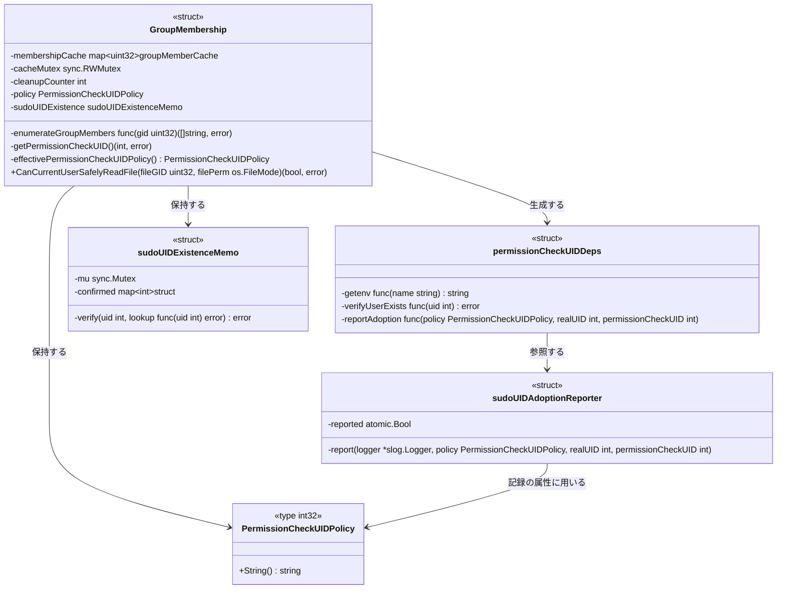

矢印 A → B は「A が B を保持、生成、または参照する」ことを表す。`permissionCheckUIDDeps`・`sudoUIDAdoptionReporter`・`sudoUIDExistenceMemo` が本タスクで追加する型であり、`GroupMembership` の `sudoUIDExistence` フィールドが本タスクで追加するフィールドである。それ以外は現行の `internal/groupmembership/manager.go` および `policy.go` の定義そのままである。図には本タスクの経路に関わる要素のみを抜粋しており、`GroupMembership` の `New` / `GetGroupMembers` / `IsUserInGroup` / `isUserOnlyGroupMember` / `CanUserSafelyWriteFile` / `CanCurrentUserSafelyWriteFile` / `ValidateRequestedPermissions` / `ClearCache` / `GetCacheStats`、および `Option` 型は変更しないため省略した。クラス図は色分けを用いないため凡例はない。

### 3.7 設計判断

#### 3.7.1 実在確認は `os/user` の `LookupId` で行う

要件書「検討事項」が挙げた実装手段のうち、`os/user` の `LookupId` を採る。判断の根拠は次のとおりである。

- 同一パッケージ内の `IsUserInGroup` と `isUserOnlyGroupMember` が既に `user.LookupId` を使っており、ユーザーデータベースの見え方をこれらと揃えられる。別の手段（`/etc/passwd` の直接パース等）を採ると、同じパッケージ内で実在性の定義が2つになる。
- `LookupId` は「見つからない」を専用のエラー型 `user.UnknownUserIdError` で返し、それ以外の失敗と区別できる（§4.2）。要件書「検討事項」の最後の論点が求める区別を、標準ライブラリの契約として得られる。
- CGO 版・非 CGO 版のいずれも `user.UnknownUserIdError` を返す。本リポジトリがビルドに用いる Go（`go.mod` 宣言は 1.26.2）の `os/user/cgo_lookup_unix.go` および `os/user/lookup_unix.go` で確認した。分類規則はビルド構成によらず成立する。

`SUDO_USER` との突き合わせや親プロセスの UID との突き合わせを行わない根拠は要件書「突き合わせを対象外とする根拠」に記載済みであり、本設計はそれを踏襲する。

#### 3.7.2 実在確認結果はインスタンス単位で再利用し、TTL 付きキャッシュは導入しない

要件書「検討事項」は、`record` が多数のファイルを処理する際に同じ値に対して `LookupId` が繰り返し実行される点を挙げ、プロセス内での再利用の要否と、再利用する場合の有効期間・並行安全性の決定を求めていた。結論は §3.4 に定めたとおりであり、要点は次の3つである。

- **再利用する**: 照会回数が処理対象ファイル数に比例せず、共有ライブラリの数だけさらに増える。ディレクトリ NSS 環境では1回の照会がネットワーク往復であり、再利用しない設計は成立しない。
- **有効期間を設けない**: 「実在する」という記録が古くなっても判定は緩まない（§5.5）。有効期間を設けるとその管理が必要になるうえ、既存のグループメンバーシップキャッシュとは性質が異なるため、期間を揃える意味もない。
- **プロセス単位ではなくインスタンス単位で持つ**: プロセス単位にすると、記録の1回制限（§3.3）に加えて2つ目のプロセス全体の状態を導入することになる。インスタンス単位であれば、読み取りの大半を担う `defaultFS` の1インスタンス内で再利用が効き、照会回数は事実上インスタンス数（数個）に収まる。

なお `record` / `verify` の実行では、`SUDO_UID` と実 UID はプロセスの生存期間を通じて変わらないため、メモが保持する項目は1件である。

#### 3.7.3 1回制限はレポータ型の内部状態として持つ

§3.3 に述べたとおり、パッケージレベルに `sudoUIDAdoptionReporter` の実体を1つ置き、それを `reportAdoption` へ束ねて解決処理へ渡す。0160 §3.10 の制約に対する例外であることと、その根拠は §3.3 の本文中に記載した。

「解決処理がパッケージレベルの `atomic.Bool` を直接参照する」という案も検討したが採らない。その形ではテストが状態を初期化する手段（`//go:build test` 付きの reset ヘルパー）を必要とし、プロセス全体の状態をテストが書き換える構成になる。これは、0160 §7.4 が `t.Parallel()` の使用を制限した理由と同じである。レポータの実体を依存として束ねる形にすれば、テストは新しい実体を渡すだけでよく、プロセス全体の状態に触れずに1回制限そのものを検証できる。

#### 3.7.4 記録は「異常の検出」ではなく「採用の記録」である

AC-07 は、採用によって基準UIDが実 UID と異なる値になった場合に警告を出すことを求めている。`sudo record` / `sudo verify` を一般ユーザーが実行するのは想定運用そのものであるため、**この警告は通常運用の実行1回ごとに1件出力される**。すなわちこの記録は異常の指標ではなく、「この実行では基準UIDが `SUDO_UID` によって決まった」という事実の記録である。設計上、次の帰結を明示しておく。

- 期待される出現頻度は、`sudo record` / `sudo verify` の実行1回あたり1件である。記録の有無だけを見て事故を判別することはできない。
- 事故シナリオ（root の cron に `SUDO_UID` が残留した状態での実行）の検出は、「対話的な `sudo` 実行が行われていない文脈でこの記録が現れること」によって成立する。cron や systemd unit から起動された実行のログにこの記録があれば、そこには残留した `SUDO_UID` がある。運用者はログの出所によって実行文脈を区別する必要がある。
- 記録に「事故か正常か」を判別する属性は含めない。判別に使えそうな `SUDO_USER` / `SUDO_GID` の参照は要件書「対象外」で除外されており、端末の有無や親プロセスの情報から推定する方法は環境によって当たらないため採らない。属性で判別する案の検討は §9 に将来の課題として残す。

この位置づけを踏まえ、§5.1 の脅威モデルと §5.2 の対比表では「記録によって検出できる」ではなく「記録と実行文脈の対照によって検出できる」と述べる。

#### 3.7.5 非 CGO ビルドでも判定規則を分けず、参照したユーザーデータベース種別を診断に出す

要件書「検討事項」は、非 CGO ビルドでは LDAP/SSSD 管理のユーザーが「実在しない」と判定されエラーになる点を挙げ、許容するか扱いを分けるかの決定を求めていた。本設計は**判定規則を分岐させず許容する**。加えて、運用者が原因を判別できるようにするため、参照したユーザーデータベース種別を診断情報として出す。

判定規則を分岐させないのは 0151 §1.1 の設計原則2「セキュリティ判定結果をビルド構成に依存させない」に従った判断である。同原則は同じ `internal/groupmembership` パッケージについて定められており、`approved` 状態の設計文書である。したがって、同原則に対する例外は作らない。

ただし §1.2 に述べたとおり、規則が同一であっても結果は環境によって一致しない。非 CGO ビルドをディレクトリ NSS 環境で使うと、`sudo record` の呼び出し元ユーザーがディレクトリ管理であった場合に読み取りが失敗する。これは 0149 の L-2 が指摘した既知の制約と同じ性質のものであり、0151 §5.4 が「ディレクトリ NSS 環境での両ビルド非等価」として既に残存リスクとして記録している。相違点は、L-2 の現れ方がフェイルオープン方向（他メンバーが見えず「唯一のメンバー」と誤判定される）であるのに対し、本タスクが増やす現れ方はフェイルクローズド方向であることであり、安全側である。

この結果、`ErrSudoUIDUserNotFound` には対処が正反対の2つの意味が生じる。「その UID は本当に存在しないので環境設定を直す」と「非 CGO ビルドなのでユーザーが見えていないだけであり、CGO 有効でビルドし直す」である。これを区別できるようにするため、ビルドタグで決まる定数としてユーザーデータベース種別（CGO 有効時 `nss`、無効時 `passwd-file`）を持ち、エラーメッセージと採用事実の記録の双方に含める。既に `membership_cgo.go` / `membership_nocgo.go` というビルドタグ付きファイルの対があるため、定数はそこへ置く。この定数は判定の分岐には一切用いないため、0151 の設計原則2 に反しない。同原則が禁じているのはビルド構成に依存する**判定結果**であって、ビルド構成を示す**診断情報**ではない。

非 CGO ビルドでのみ実在確認を省略する案は採らない。それは 0151 の設計原則2 に反するうえ、非 CGO ビルドで本タスクの防御が丸ごと失われることを意味する。逆に非 CGO ビルドで `SudoUIDAware` 自体を禁止する案も採らない。要件書「対象外」が方針の型と伝播機構の変更を除外しており、また `record` / `verify` が非 CGO ビルドで一切使えなくなる過大な影響を持つ。

#### 3.7.6 差し替え口は解決処理への引数に集約する

要件書「検討事項」は、実在確認とロガーを既存の `getenv` と同じく引数として渡すか別方式を採るかの決定を求めていた。本設計は引数渡しに揃える。

0160 付録A は「`GroupMembership` に環境変数取得関数のフィールドを持たせる案」を、同じ依存に対する2つ目の差し替え口になることを理由に退けている。実在確認と記録の出力についても同じ論が成り立つ。フィールドとして持たせると、`New()` のオプションで指定する経路と引数で渡す経路の2系統ができ、どちらが有効かがインスタンスごとに変わる。差し替え口を解決処理の引数1箇所に集約することで、有効な依存が呼び出し地点から一目で分かる。

§3.4 のメモは差し替え口ではなくインスタンスの状態であるため、この判断と矛盾しない。メモは `verifyUserExists` の内側に隠れており、解決処理からは1つの関数値として見える。

§3.1 に述べたとおり、依存が3つに増えるため個別の引数ではなく構造体1つとして渡す。これは差し替え口の数を増やすものではなく、1つの差し替え口の形を整えるものである。

### 3.8 コンポーネント責務表

| ファイル | 区分 | 責務 | 更新が必要な既存テスト・既存記述 |
|---|---|---|---|
| `internal/groupmembership/manager.go` | 変更 | `permissionCheckUIDDeps` / `sudoUIDAdoptionReporter` / `sudoUIDExistenceMemo` の3型、パッケージレベルのレポータ実体、`lookupUserByUID`、`resolvePermissionCheckUID` への実在確認と記録の追加、`getPermissionCheckUID` での本番依存の組み立て、§4.1 の2つのエラー変数、`GroupMembership` への `sudoUIDExistence` フィールド追加 | `resolvePermissionCheckUID`（465-484行目）のドキュメントコメント: 引数の記述と、返しうるエラーの記述が変わる。`getPermissionCheckUID`（446-456行目）のドキュメントコメント: 返しうるエラーの記述が変わる |
| `internal/groupmembership/policy.go` | 変更 | 変更はドキュメントコメントのみ | `SudoUIDAware` 定数のコメント（24-31行目）: 「`SUDO_UID` の値は数値としての妥当性しか検査しておらず、実在するユーザーかどうかは確認していない」が偽になる。「root として起動できる者が基準UIDを任意に指定できる」も「任意の**実在する**ユーザーの UID を指定できる」へ狭める |
| `internal/groupmembership/membership_cgo.go` | 変更 | ユーザーデータベース種別の定数（`nss`） | - |
| `internal/groupmembership/membership_nocgo.go` | 変更 | ユーザーデータベース種別の定数（`passwd-file`） | - |
| `internal/groupmembership/test_helpers_policy.go` | 変更（`//go:build test`） | 他パッケージのテストから解決処理を呼ぶためのラッパーの更新（§7.3） | - |
| `internal/groupmembership/manager_test.go` | 変更 | 実在確認・記録・メモに関するテストの追加 | `TestGetPermissionCheckUID`: 期待値の根拠を記したコメントを実在確認込みの規則へ更新する |
| `internal/groupmembership/policy_test.go` | 変更 | 依存の束を渡す形への移行 | `TestResolvePermissionCheckUID_RealUIDOnly` / `TestResolvePermissionCheckUID_SudoUIDAware` / `TestResolvePermissionCheckUID_EnvAccess`（いずれも `getenv` のみを引数に取る現行シグネチャに依存する） |
| `cmd/record/main_test.go` | 変更 | 新しいラッパーのシグネチャへの移行 | `TestRecordDeclaresSudoUIDAwarePolicy`（420行目） |
| `cmd/verify/main_test.go` | 変更 | 同上 | `TestVerifyDeclaresSudoUIDAwarePolicy`（190行目） |
| `cmd/runner/main_test.go` | 変更 | 同上 | `TestRunnerDeclaresRealUIDOnlyPolicy`（349行目） |
| `docs/dev/architecture_design/security-architecture.ja.md` | 変更 | 50行目の基準UID解決規則の記述を実在確認込みの規則へ更新（AC-17） | - |
| `docs/dev/architecture_design/security-architecture.md` | 変更 | 上記の英訳を `/mktrans` で反映（AC-17） | - |
| `docs/user/record_command.ja.md` | 変更 | `SUDO_UID` が実在しないユーザーを指す場合に実行が失敗すること、対処方法、および採用が警告として記録されることを記載（AC-18、§5.3） | - |
| `docs/user/verify_command.ja.md` | 変更 | 同上（AC-18） | - |
| `docs/user/record_command.md` / `docs/user/verify_command.md` | 変更 | 上記の英訳を `/mktrans` で反映（AC-18） | - |
| `docs/translation_glossary.md` | 変更 | 「実在確認」「採用」「採用事実の記録」「センチネルエラー」「ユーザーデータベース種別」の追加（AC-19） | - |
| `CHANGELOG.md` | 変更 | 実在しない `SUDO_UID` を指す環境での挙動変更と対処方法を記載（§5.3） | - |

`internal/safefileio`、`cmd/record` / `cmd/verify` / `cmd/runner` の本番コードは変更しない。3つの `main.go` の `init()` に付されたコメント（`cmd/record/main.go:29`、`cmd/verify/main.go:32`、`cmd/runner/main.go:84`）と `docs/user/runner_command.ja.md:1856` の記述は、いずれも `runner` が `RealUIDOnly` である点と `record` / `verify` が `SudoUIDAware` である点だけを述べており、本タスクによって偽にならないことを確認した。

## 4. エラーハンドリング設計

### 4.1 エラー型

```go
// ErrSudoUIDUserNotFound is returned when the SUDO_UID value is a valid
// number but no user with that UID exists in the user database.
var ErrSudoUIDUserNotFound = errors.New("SUDO_UID does not refer to an existing user")

// ErrSudoUIDUserLookupFailed is returned when the existence check for the
// SUDO_UID value could not be completed, so the user can neither be
// confirmed to exist nor confirmed to be absent (for example a transient
// NSS failure).
var ErrSudoUIDUserLookupFailed = errors.New("failed to verify that SUDO_UID refers to an existing user")
```

追加するエラーはこの2つであり、既存の `ErrSudoUIDOutOfRange` と同じ `manager.go` に置く。`ErrSudoUIDOutOfRange`（`SUDO_UID` が uint32 の範囲外）と、`SUDO_UID` が数値として解釈できない場合に `strconv` のエラーを包む扱いは 0160 から変更しない。したがって `SudoUIDAware` の解決処理が返しうるエラーは4種となり、`errors.Is` によって相互に区別できる。

両エラーは `os/user` が返した元のエラー値をラップして保持する。ただし**元の失敗原因を `errors.Is` で辿れる範囲には標準ライブラリ由来の限界がある**。`os/user` の CGO 版は照会失敗を `fmt.Errorf("user: lookup userid %d: %v", uid, err)` と `%v` で整形して返すため、内側の `syscall.Errno`（`ECONNREFUSED` 等）は文字列へ平坦化され値としては失われる。AC-04 が求める「元の失敗原因を `errors.Is` で辿れる形で保持する」は、本設計では次の意味で満たす。

- `ErrSudoUIDUserLookupFailed` および `ErrSudoUIDUserNotFound` 自体は `errors.Is` で判別できる。
- `os/user` が返したエラー値をラップして保持するため、その値に対する `errors.Is` は成立し、メッセージも呼び出し元まで伝わる。
- その内側の `errno` を `errors.Is` で判別することは CGO 版ではできない。これは `os/user` の実装に由来する制約であり、本設計で回避しない。回避するには `os/user` を使わず `getpwuid_r` を直接呼ぶ必要があり、§3.7.1 が退けた「パッケージ内で実在性の定義が2つになる」問題を招く。

この制約は運用上ほぼ影響しない。`ErrSudoUIDUserLookupFailed` に対する対処は原因の `errno` によらず「ユーザーデータベースの状態を確認して再実行する」であり、`errno` の値そのものはメッセージから読める。

### 4.2 エラーの分類規則

実在確認の戻り値を次の規則で3つに分類する。

| `verifyUserExists` の戻り値 | 分類 | 返すエラー | 基準UID |
|---|---|---|---|
| `nil` | 実在する | なし | `SUDO_UID` の値 |
| `user.UnknownUserIdError` に一致する | 実在しない（確定的） | `ErrSudoUIDUserNotFound` | 返さない |
| それ以外のエラー | 確認できなかった（不確定） | `ErrSudoUIDUserLookupFailed` | 返さない |

判定には `errors.AsType[user.UnknownUserIdError]` を用いる。`user.UnknownUserIdError` は `int` を基底とする値型であり、`os/user` の CGO 版・非 CGO 版のいずれも見つからない場合にこの型を返す。値型に対する `errors.AsType` の用法は `internal/runner/resource/dryrun_manager.go:386` に先例がある。

2つの原因を区別する理由は、運用者の取るべき対処が異なるためである。`ErrSudoUIDUserNotFound` は設定の誤りまたは `SUDO_UID` の残留を示し、再実行しても解消しない。`ErrSudoUIDUserLookupFailed` はユーザーデータベースの一時的な障害でありうるため、再実行が有効な場合がある。一方で、どちらも基準UIDを返さずフェイルクローズドに倒す点は同じであり、区別は診断のためだけに存在する。

ただしこの区別は完全ではない。一部の NSS バックエンドは、ディレクトリサービスへの接続失敗を「見つからない」として返すことがある。その場合、一時障害が `ErrSudoUIDUserNotFound` として現れる。判定はいずれの分類でも拒否であるため、セキュリティ上の意味は変わらず、影響は診断の精度に限られる。

### 4.3 エラーメッセージと記録の文言

#### エラーメッセージ

エラーメッセージは既存の書式に揃え、`SUDO_UID` の値、対象 UID、参照したユーザーデータベース種別（§3.7.5）を含める。種別を含めるのは、非 CGO ビルドでユーザーが見えていないだけの場合と本当に存在しない場合を運用者が判別できるようにするためである。

加えて、`cmd/record/main.go:149-157` の慣行（`remediation` 属性と、平易な文で示すやり直し手順）に倣い、両エラーには対処を示す文を含める。`ErrSudoUIDUserNotFound` については「`SUDO_UID` が引き継がれた古い値でないか確認し、対話的な `sudo` から実行し直す」、`ErrSudoUIDUserLookupFailed` については「ユーザーデータベースの状態を確認して再実行する」を示す。これがないと、`internal/safefileio` が `ErrInvalidFilePermissions` で包む（`safe_file.go:447`、`safe_file.go:494`）ため、運用者にはファイルのパーミッションの問題に見えてしまう。

既存のエラー（`ErrFileWorldWritable`、`ErrGroupWritableNonMember`、`ErrPermissionsExceedMaximum`）の文面は変更しない。`internal/safefileio` の包み方も変えない。

#### 拒否は `log/slog` へは記録しない

本設計が `log/slog` へ出力するのは採用事実の1件のみであり、拒否は記録しない。要件書 AC-15 の表が、実在確認に失敗する3つの行すべてについて記録を「なし」と定めているためである。

その結果、拒否は構造化されたログとしては観測できない。拒否が運用者に届く経路は次のとおりであり、これを確認した。`internal/safefileio` の `canSafelyAccessFile` / `canSafelyReadFromFile` がエラーを `ErrInvalidFilePermissions` で包み（`safe_file.go:447`、`safe_file.go:494`。いずれも `%w` を2つ使うため元のエラーは保持される）、`cmd/record/main.go:285` および `cmd/verify/main.go:176` が対象ファイルごとに標準エラー出力へ表示して終了コードを非ゼロにする。すなわち拒否は「標準エラー出力のテキストとして、ファイルごとに1行」という形でのみ現れ、`log/slog` を集約する監視からは見えない。この非対称（正常系は構造化ログ、失敗系は標準エラー出力のみ）は AC-15 の制約に従った結果であり、拒否も構造化ログへ出す案は §9 に将来の課題として残す。

#### 採用事実の記録

採用事実の記録は、次の内容を持つ1件の警告として出力する。

| 項目 | 値 |
|---|---|
| レベル | `slog.LevelWarn` |
| 出力先 | `reportAdoption` に束ねられた `*slog.Logger`。本番では `slog.Default()` |
| メッセージ | `Permission check UID taken from SUDO_UID instead of the real UID; if this process was not started via sudo, SUDO_UID may be a stale value inherited from the environment` |
| 属性 `permission_check_uid` | 採用した基準UID（整数） |
| 属性 `real_uid` | プロセスの実 UID（整数） |
| 属性 `source_env_var` | 採用の根拠となった環境変数名。定数 `sudoUIDEnvVar` の値であり常に `SUDO_UID` |
| 属性 `permission_check_uid_policy` | 基準UID決定方針の名称。`PermissionCheckUIDPolicy.String()` の値であり、この経路では常に `sudo-uid-aware` |
| 属性 `user_database_source` | 参照したユーザーデータベース種別。`nss` または `passwd-file`（§3.7.5） |

前4つが AC-08 が要求する内容であり、`user_database_source` は §3.7.5 の判断により追加する。

メッセージ本文に「sudo 経由でないなら残留を疑え」という趣旨を含めるのは、§3.7.4 のとおりこの記録が正常運用でも出力されるため、本文だけを読んだ運用者が解釈の手がかりを得られるようにするためである。ただし §3.7.4 に述べたとおり、本文の存在は判別可能性を与えるものではない。判別は実行文脈との対照によって行う。

属性名は既存のログ出力の命名規則（`internal/security/dir_permissions_unix.go:90` の `path` / `mode`、`internal/runner/group_executor.go:482` の `group` 等）に合わせ、snake_case とした。

`source_env_var` と `permission_check_uid_policy` はこの経路では常に同じ値になるが、属性として出力する。AC-08 が両者を記録内容として要求しており、また運用者が「なぜこの UID になったのか」を推測せずに読めるようにするためである。

正常系の他の事実（実在確認の成功、`RealUIDOnly` の選択、メモの命中）は記録しない。読み取り安全性チェックはファイルごとに、また共有ライブラリごとに実行されるため、これらを記録すると `record` の実行1回で大量の出力が生じる。

## 5. セキュリティ考慮事項

### 5.1 脅威モデル

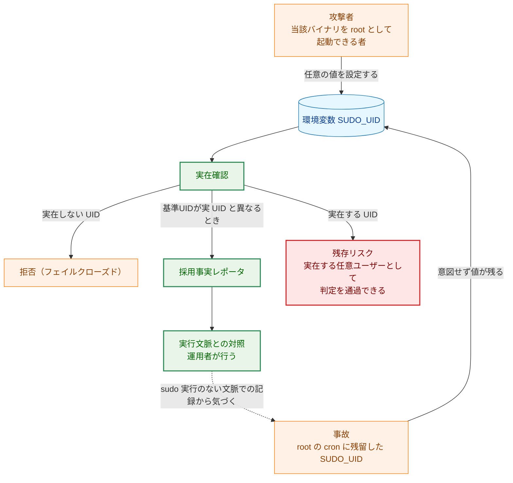

矢印 A → B は「A が B に影響を与える、または A の結果として B へ進む」ことを表す。破線は本設計によって新たに可能になる検出経路を表す。

**凡例（Legend）**

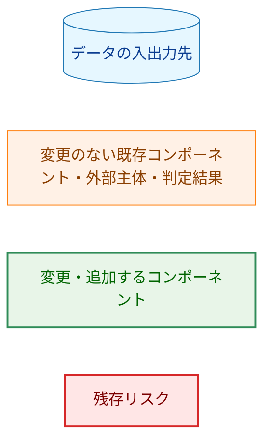

### 5.2 本設計が閉じるもの・閉じないもの

0160 §5.2 の表を本タスクの完了後の状態へ更新した形が次である。

| 項目 | 0160 完了時点 | 本タスク完了後 |
|---|---|---|
| `runner` の読み取り判定で `SUDO_UID` が効くか | 効かない | 効かない（変更なし） |
| `record` / `verify` の読み取り判定で `SUDO_UID` が効くか | 効く | 効く（変更なし） |
| `SUDO_UID` の値の実在確認 | 行わない | 行う。確認できない場合は拒否 |
| 実在しない UID の混入 | 通る | 通らない |
| `SUDO_UID` を採用した事実の記録 | 行わない | 警告として1回記録する |
| root cron への `SUDO_UID` 残留の事後検出 | できない | 記録と実行文脈の対照によってできる（§3.7.4） |
| 拒否の構造化ログへの記録 | 概念が存在しない | 行わない。標準エラー出力のテキストのみ（§4.3） |
| 実在する任意ユーザーの UID を指定すること | 可能 | 可能（残存リスク） |

要件書「本タスクで解消されないもの」のとおり、`SUDO_UID` に実在する任意ユーザーの UID を設定し、そのユーザーの視点で読み取り安全性チェックを通過させる操作は引き続き可能である。実在確認が排除するのは「実在しない UID の混入」と「残留による誤設定」であり、当該バイナリを root として起動できる者に対する防御ではない。

ここで実在確認が課す条件の弱さを明示しておく。実在確認はユーザーデータベース上に UID があることだけを見る。ログインシェルが `/usr/sbin/nologin` であるか、アカウントがロックまたは期限切れであるか、システム用の UID 範囲に属するかは一切問わない。したがってグループ書き込み可能なファイルの読み取りを通したい攻撃者は、`getent group <gid>` でそのグループの構成員を調べ、その UID を指定すればよく、条件は容易に満たされる。シェル・ロック状態・UID 範囲による追加の検証は本タスクの対象外とする。この位置づけは D1 M-3 の「直接の権限昇格ではなく、多層防御の欠落および誤設定への耐性の問題」という評価を引き継ぐ。

### 5.3 挙動変更の影響範囲と移行

本タスクは、これまで成功していた実行が失敗するようになる変更を含む。影響範囲と対処を次に示す。

#### 影響を受ける環境

失敗が起きるのは「`sudo record` / `sudo verify` を実行したが `SUDO_UID` の実在を確認できない」場合である。`sudo` 自身は呼び出し元ユーザーを解決してから `SUDO_UID` を設定する。したがって `sudo` を経由した通常の実行でこの条件が成立するのは、次の2つの場合に限られる。1つは、`sudo` と `record` / `verify` とで、参照するユーザーデータベースの見え方が食い違う場合。もう1つは、照会そのものが失敗する場合である。具体的には次の4つである。

| 環境 | 成立する理由 | 対処 |
|---|---|---|
| 非 CGO ビルドの `record` / `verify` + LDAP/SSSD 管理のユーザー | `sudo` は動的リンクされ NSS 経由でユーザーを解決するが、非 CGO ビルドは `/etc/passwd` しか見ない（§3.7.5） | CGO 有効でビルドし直す。エラーメッセージの `passwd-file` が手がかりになる |
| ユーザーデータベースの一時障害（LDAP/SSSD の停止、ネットワーク断） | 照会が失敗する | 復旧後に再実行する。`ErrSudoUIDUserLookupFailed` で判別できる |
| root の cron・systemd unit に `SUDO_UID` が残留し、その UID が既に削除されている | 残留値が実在しない UID を指す | `SUDO_UID` を環境から除く。本タスクが検出を目的とした事故そのものであり、失敗は意図した挙動である |
| `/etc/passwd` が無いか、あってもほぼ空のコンテナイメージ（`scratch` 系、一部の distroless）。非 CGO ビルドを root で実行し、`SUDO_UID` が引き継がれている場合 | 参照先にユーザーが1件もない。`SUDO_UID` が `0` の場合も §3.5 の3行目に該当して失敗する | `SUDO_UID` を環境から除く、または `/etc/passwd` を用意する |

#### 対処手段

いずれの環境でも、環境変数を除いて実行する方法がある。`sudo env -u SUDO_UID record ...` あるいは対話的な `sudo -i` からの実行である。ただしこれは**判定条件を等価に保つ回避策ではない**。`SUDO_UID` を除くと基準UIDが 0 になるため、グループ書き込み可能なファイルについては「root がそのグループに属するか」で判定されることになり、多くの場合それまで通っていた読み取りが通らなくなる。すなわち判定は緩む側ではなく厳しい側へ動く。安全側の回避策であるが、記録の生成自体が失敗する可能性がある点を利用者向け文書に明記する。

この回避策が環境変数の操作だけで成立するため、本設計は実在確認を無効化する専用のフラグや設定を追加しない。回避手段を新たに設けると、それは「実在確認を素通りさせる」経路になり、本タスクの目的と衝突する。

#### 段階的な移行を行わない判断

警告のみを出して拒否しない版を先に出す段階的移行も検討したが採らない。理由は次の3点である。

- 要件書 AC-02 は実在確認の失敗を拒否と定めており、警告のみの段階を設けることは要件を満たさない状態を出荷することになる。
- 影響を受ける環境は上表の4つに限られ、いずれも `sudo` と当該バイナリの参照先の食い違いか、事故そのものである。広く分布する構成が一斉に壊れる性質の変更ではない。
- 影響のうち最も可能性が高い「非 CGO ビルド + ディレクトリ NSS」は、`record` を1回試すだけで判明し、エラーメッセージが原因と対処を示す。事前の観測期間を置く価値が小さい。

`CHANGELOG.md` には、実在しない `SUDO_UID` を指す環境で `record` / `verify` が失敗するようになる点と、上表の対処を記載する。利用者向け文書（AC-18）にも同じ内容を記載する。

### 5.4 副作用の範囲

本設計が増減させる外部副作用を明示する。

| 副作用 | 本設計による変化 |
|---|---|
| ユーザーデータベースへの読み取り照会 | `SudoUIDAware` かつ実 UID が 0 かつ `SUDO_UID` が範囲内の数値である場合に限り増える。回数は `GroupMembership` インスタンスごとに1回であり、処理対象ファイル数にも共有ライブラリ数にも比例しない（§3.4）。ただし照会が失敗する環境では、失敗をメモしないため読み取り安全性チェックごとに再照会される |
| `log/slog` への書き出し | 上記の条件が成立し、かつ採用によって基準UIDが実 UID と異なった場合に限り、プロセス全体で1件の警告が増える |
| 標準エラー出力への書き出し | 実在確認に失敗した場合、`record` / `verify` が対象ファイルごとにエラー行を出力する（§4.3） |
| 実行時間 | 照会が成功する環境では、インスタンスごとに1回の照会分のみ増える。照会が失敗し続ける環境では、読み取り安全性チェックの回数 × 照会のタイムアウトが加算される（§5.5） |
| ファイルの書き込み・削除 | 変化しない |
| ネットワーク送信 | `record` / `verify` は `internal/logging` のハンドラを設定しないため、追加した警告が外部へ送信されることはない。ただしユーザーデータベースのバックエンドが LDAP/SSSD の場合、実在確認そのものがネットワーク照会となる |
| 読み取り判定の結果 | `SUDO_UID` が実在しないユーザーを指す場合、または確認処理が失敗した場合にのみ、成功から失敗へ変わる。それ以外では変化しない |

本タスクは新しいフラグやモードを追加しないため、副作用を切り替える設定は存在しない。書き込み安全性チェック（`CanUserSafelyWriteFile` 系）は従来どおり実 UID を直接受け取り、`SUDO_UID` にも本タスクの追加処理にも触れない。

### 5.5 残存リスク

- **実在する任意ユーザーの UID の指定**: §5.2 のとおり。実在確認が課す条件は弱く、当該バイナリを root として起動できる者に対する防御にはならない。
- **非 CGO ビルドとディレクトリ NSS の組み合わせ**: §3.7.5 のとおり、判定結果がビルド構成によって一致しない。フェイルクローズド方向であり、原因は `user_database_source` から判別できるが、解消はしない。0151 §5.4 が記録済みの残存リスクの新たな現れ方である。
- **一時障害の「見つからない」への縮退**: §4.2 のとおり、NSS バックエンドによっては接続失敗が `ErrSudoUIDUserNotFound` として現れる。判定は拒否のままであり、影響は診断の精度に限られる。
- **照会のタイムアウトを制御できない**: `os/user` の `LookupId` は文脈もタイムアウトも受け取らないため、応答の遅いユーザーデータベースに対する照会を打ち切る手段がない。照会が成功する環境ではインスタンスごとに1回で済むが（§3.4）、失敗し続ける環境では失敗をメモしないため、読み取り安全性チェックの回数だけタイムアウトが積み上がる。この状況ではそもそも全ファイルの処理が失敗するため、実行が長引くこと自体の影響は限定的だが、応答が返らない照会に対して `record` が長時間停止して見える点は避けられない。
- **実在確認から実際の利用までの時間差**: 実在確認の成功後、その UID が判定に使われるまでの間にユーザーが削除される余地がある。この窓が判定を緩める方向へ働くことはない。分岐ごとの理由は次のとおりである。
    - ファイルがグループ書き込み可能な場合（`manager.go:335`）: `IsUserInGroup` が同じ UID を改めて `user.LookupId` で引く（`manager.go:148`）。削除されていればそこで失敗するため、判定は厳しい側へ動く。
    - グループ書き込み可能でない場合: 残る検査（world-writable の判定と許可ビットの上限検査。`manager.go:330`、`manager.go:351`）はパーミッションのみに依存し、基準UIDは判定に入らない。

    分岐によらない理由もある。実在確認は 0160 の挙動に対して拒否条件を1つ加えるだけであり、判定を緩める条件は追加しない。
- **`os/user` の照会と `getpwent` 列挙の並行実行**: 0151 §5.4 が記録している残存リスクである。一部の NSS バックエンドは列挙系 API とキー検索系 API で内部状態を共有することがあり、`internal/groupmembership` の列挙ミューテックス（`membership_cgo.go:302`）の保持中に別の goroutine が `os/user` 経由でキー検索を行うと状態が破損しうる。本タスクは `os/user` の呼び出し地点を1つ増やす。

    この破損経路が現状で成立しないのは、`record` / `verify` が読み取り安全性チェックを逐次実行し、これらを並行に駆動する仕組みが存在しないためである（`internal/filevalidator`、`internal/verification`、`internal/safefileio`、`cmd/record`、`cmd/verify` に並行実行の仕組みは無い）。この不変条件は本設計が依拠する前提であり、将来 `record` を並行化する場合は 0151 §5.4 の残存リスクと併せて再評価する必要がある。なおメモ（§3.4）によって照会回数がインスタンスあたり1回に抑えられるため、増える機会は本設計以前に見積もられる量より小さい。
- **記録の欠落**: 本タスクの記録は `log/slog` の既定ロガー、すなわち標準エラー出力へ書かれる。記録は本設計が持つ唯一の構造化された信号であり、失われると §3.7.4 の検出手段が成立しない。
    - 検出対象の事故シナリオは root の cron からの実行である。cron の標準エラー出力を `/dev/null` へ捨てる、あるいは MTA を無効化してメールが届かない構成は珍しくない。すなわち唯一の信号は、それを最も必要とする文脈でこそ失われやすい。代替の出力先は用意しない。検出を機能させるには cron 実行の標準エラー出力を保存する運用が必要であり、この点を利用者向け文書に記載する。
    - 出力先も一致しない。`record` / `verify` はエラー表示用の書き込み先を引数で受け取る（`cmd/record/main.go:88`、`cmd/verify/main.go:50`）が、`slog.Default()` は実際の `os.Stderr` へ書く。警告とファイルごとのエラー行が同じ宛先に出る保証はない。
- **`SUDO_UID` が実行中に変化する場合**: 記録を1回に制限する設計（§3.3）は、`SUDO_UID` が実行中に変わらないことを前提としている。`record` / `verify` は環境変数を書き換えないため現状は成立する。しかし `internal/groupmembership` は汎用のパッケージであり、将来長命なプロセスや `os.Setenv` を行うプロセスがこれを使う場合、最初の採用だけが記録されて以降の異なる採用が記録されない。記録が誤った内容を示すことになるため、その場合は1回制限の見直しが必要である（§9）。

## 6. 処理フロー詳細

### 6.1 `SudoUIDAware` の解決フロー

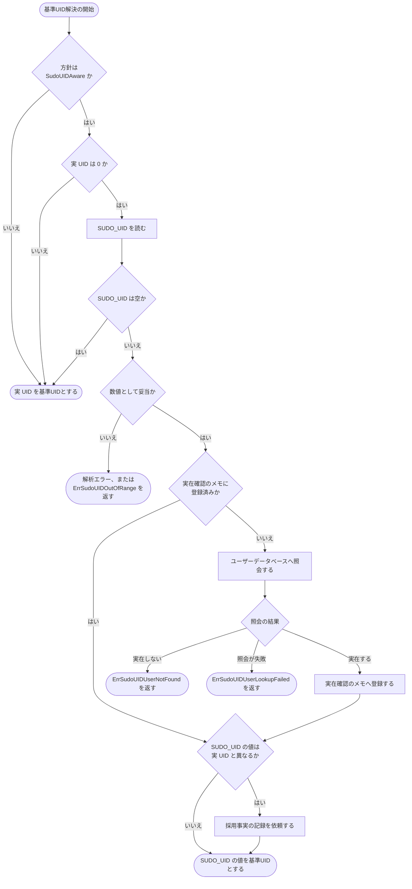

矢印 A → B は「A の次に B を評価する」ことを表す。菱形は分岐条件を表す。この図は色分けを用いないため凡例はない。

`RealUIDOnly` の経路には実在確認も記録も現れない。これが AC-12 と AC-13 の根拠である。0160 §6.1 の図に対して、`実在確認のメモに登録済みか` 以降の分岐が本タスクで追加される部分である。

### 6.2 記録の1回制限

`sudoUIDAdoptionReporter` は「未記録」と「記録済み」の2状態を持ち、遷移は一方向である。

| 呼び出し時の状態 | `report` の動作 | 遷移後の状態 |
|---|---|---|
| 未記録 | 警告を1件出力する | 記録済み |
| 記録済み | 何もしない | 記録済み |

状態遷移は `atomic.Bool` の compare-and-swap で行うため、複数の goroutine が同時に `report` を呼んでも出力は1件である。プロセス内で「記録済み」から「未記録」へ戻る経路は存在しない。テストは新しい実体を生成することで未記録状態から検証を始める。

## 7. テスト戦略

### 7.1 単体テスト

すべて `internal/groupmembership` パッケージ内に置く。実 UID・環境変数・実在確認・記録の出力のいずれも引数として与えるため、root 権限を必要とせず、実際のユーザーデータベースにも依存しない。

| 対象 | 内容 | 対応 AC |
|---|---|---|
| 決定表の全行 | §3.5 の表の各行について、返る基準UID・エラーの有無と種類・記録の有無を検証する | AC-15 |
| 実在確認の成功 | 実 UID 0、`SUDO_UID` が有効値かつ実在する場合に、その値が基準UIDとして返る | AC-01 |
| 実在確認の失敗（実在しない） | `user.UnknownUserIdError` を返す実在確認を渡し、基準UIDが返らず `ErrSudoUIDUserNotFound` を含むエラーになる | AC-02, AC-03 |
| センチネルの区別 | `ErrSudoUIDUserNotFound` が `ErrSudoUIDOutOfRange`、`strconv.ErrSyntax`、`ErrSudoUIDUserLookupFailed` と `errors.Is` で相互に区別できる | AC-03 |
| 実在確認の失敗（確認できなかった） | 任意のエラーを返す実在確認を渡し、`ErrSudoUIDUserLookupFailed` と、渡したエラー値そのものの両方が `errors.Is` で辿れる | AC-04 |
| 数値として不正な値 | 数値でない値・負数・`math.MaxUint32` 超過について、実在確認が一度も呼ばれず 0160 と同じエラーが返る（呼び出し回数で検証） | AC-05 |
| 実 UID が 0 以外 | `SUDO_UID` の値によらず実在確認が呼ばれず、実 UID が返る | AC-06 |
| 記録の内容 | `slog` のテスト用ハンドラで1件の警告を捕捉し、レベルが `slog.LevelWarn`、属性が §4.3 の5つを含むことを検証する。`real_uid` と `permission_check_uid` には異なる値を与え、入れ替わりを検出する | AC-07, AC-08 |
| 記録の1回制限 | 同一のレポータ実体で解決を複数回実行し、記録が1件だけであることを検証する | AC-09 |
| 記録を行わない条件 | `SUDO_UID` 未設定、および `SUDO_UID` が `0` で基準UIDが実 UID と一致する場合に記録が出力されない | AC-10 |
| `RealUIDOnly` での非実行 | 実 UID 0 かつ有効な `SUDO_UID` を与えても、実在確認の呼び出し回数が 0 であり記録も出力されない。同条件の `SudoUIDAware` との対比を取る | AC-12, AC-13 |
| `RealUIDOnly` の既存挙動 | 実 UID と `SUDO_UID` の全組み合わせで環境変数が読まれず実 UID が返る（0160 の既存テストを新シグネチャへ移行して維持） | AC-14 |
| 実在確認結果の再利用 | 同一のメモに対して同じ UID を複数回検証し、照会の呼び出し回数が1回であることを検証する。失敗した結果は登録されず、次回に再照会されることも検証する | - |
| メモの並行安全性 | 複数 goroutine から同時にメモを検証し、`go test -race` で競合が検出されないことを確認する | - |
| 差し替え口の網羅性 | 実在確認と記録の出力の双方を差し替えた状態で上記すべてが実行できる | AC-16 |

`RealUIDOnly` での非実行を「呼び出し回数 0」だけで判定しないのは、0160 §3.5 と同じ理由である。実 UID が 0 でないために呼ばれなかった状態と区別するため、同一条件の `SudoUIDAware` で呼び出し回数が 1 になることを併せて確認する。

### 7.2 セキュリティテスト

- 実在しない UID、確認処理が失敗する UID のいずれについても、`resolvePermissionCheckUID` が基準UIDを返さないことを確認する（フェイルクローズドの確認）。読み取り安全性チェックはこのエラーをそのまま呼び出し元へ返すため、公開メソッド `CanCurrentUserSafelyReadFile` を経由した検証は行わない（理由は §7.6）。
- `SUDO_UID` が `0` の場合にも実在確認が実行されることを確認する。実 UID と同じ値なら未検証で通る抜け道がないことの確認である。
- 記録用のロガーがエラーを返すハンドラであっても、基準UIDの解決が成功し値が返ることを確認する（§1.2 の「記録は観測のためだけに行う」の確認）。
- 実在確認が失敗した結果がメモに登録されないことを確認する。一時的な失敗が以降の判定を確定的に失敗させない、という §3.4 の契約の確認である。

### 7.3 結合テスト

| 対象 | 内容 | 対応 AC |
|---|---|---|
| `cmd/record` / `cmd/verify` のテストバイナリ | 0160 で追加した「`SudoUIDAware` の宣言下で有効な `SUDO_UID` が採用される」検証を、実在確認を差し替えた新しいラッパー経由で維持する | AC-01 |
| `cmd/runner` のテストバイナリ | `RealUIDOnly` の宣言下で `SUDO_UID` が採用されないことの検証を維持する | AC-12, AC-14 |
| `slog` 既定ロガーへの出力 | 既定ロガーを差し替えたうえで、本番と同じ依存の組み立てで解決を実行し、記録が既定ロガー経由で出力されることを確認する | AC-11 |

`test_helpers_policy.go` のラッパーは、`permissionCheckUIDDeps` が非公開であるため、テストから依存を指定できる公開の構造体を伴う形へ変更する。関数値を並べた位置引数にしないのは、§3.1 が構造体を選んだ理由（関数値の順序を誤りやすい）が、パッケージ外の呼び出し地点にもそのまま当てはまるからである。ラッパーは呼び出しごとに新しいレポータ実体を用いるため、1回制限の検証はパッケージ内のテストで行う。この点をラッパーのドキュメントコメントに明記する。

### 7.4 並行性とテストの独立性

- `sudoUIDAdoptionReporter` の1回制限と `sudoUIDExistenceMemo` の並行安全性は、複数 goroutine から同時に呼ぶテストで `go test -race` により確認する。
- パッケージレベルのレポータ実体はテストから書き換えない。1回制限を対象とするテストは新しい実体を生成して用いるため、`t.Parallel()` を使えて他のテストへ影響しない。
- `slog` の既定ロガーを差し替えるテスト（§7.3 の AC-11）はプロセス全体の状態を変更するため、`t.Parallel()` を使わず `t.Cleanup` で元へ戻す。

`go test -race` の通過を成功条件に含める。

### 7.5 更新が必要な既存テスト

§3.8 の責務表に記載したとおり、次のテストが `resolvePermissionCheckUID` のシグネチャ変更によって更新を要する。

| ファイル | テスト | 更新内容 |
|---|---|---|
| `internal/groupmembership/policy_test.go` | `TestResolvePermissionCheckUID_RealUIDOnly` | 依存の束を渡す形へ変更。実在確認の呼び出し回数の検証を追加（AC-12） |
| `internal/groupmembership/policy_test.go` | `TestResolvePermissionCheckUID_SudoUIDAware` | 依存の束を渡す形へ変更。§3.5 の表に合わせて実在確認の行を追加（AC-15） |
| `internal/groupmembership/policy_test.go` | `TestResolvePermissionCheckUID_EnvAccess` | 依存の束を渡す形へ変更 |
| `internal/groupmembership/manager_test.go` | `TestGetPermissionCheckUID` | 期待値の根拠を記したコメントを実在確認込みの規則へ更新 |
| `cmd/record/main_test.go` | `TestRecordDeclaresSudoUIDAwarePolicy` | 新しいラッパーの呼び出しへ変更 |
| `cmd/verify/main_test.go` | `TestVerifyDeclaresSudoUIDAwarePolicy` | 同上 |
| `cmd/runner/main_test.go` | `TestRunnerDeclaresRealUIDOnlyPolicy` | 同上 |

### 7.6 テストで到達できない範囲

`getProcessRealUID()` は `os.Getuid()` を直接呼び、本タスクでは変更しない（§3.1）。したがって非 root でのテストでは、公開メソッド `CanCurrentUserSafelyReadFile` から実 UID が 0 の分岐へ到達できない。この制約により、次の3点はテストで検証できず、コードレビューによる確認に委ねる。`requirements_process.md` §4 が求める「各 AC に少なくとも1つの検証」は、対応する純粋関数に対するテストで満たしている。ここに挙げるのは、それでもなお残る部分である。

| 検証できない内容 | 影響する AC | 代替の確認手段 |
|---|---|---|
| `getPermissionCheckUID` が、パッケージレベルのレポータ実体を渡すこと（呼び出しごとに新しい実体を作っていないこと） | AC-09 の「プロセス毎に1回」がプロセス全体で成立すること | コードレビュー。レポータ実体はパッケージレベルの変数1つのみであり、他に生成箇所が本番コードに存在しないことを確認する |
| `getPermissionCheckUID` が `slog.Default()` を記録の出力先として渡すこと | AC-11 | コードレビュー。§7.3 の AC-11 のテストは、同じ組み立てを再現して既定ロガーへ出ることを確認する |
| `lookupUserByUID` の既定実装が実際のユーザーデータベースを引くこと | AC-01（本番経路） | コードレビュー。`user.LookupId` を呼ぶ1行であり、分類規則は解決処理側にあるためテスト対象に含まれる（§3.2） |

この3点を差し替え可能にするには `getProcessRealUID` にも差し替え口を設ける必要があり、0160 §3.5 が「同じ依存に対する2つ目の差し替え口を作らない」として避けた構造に近づく。本タスクではその変更を行わず、検証範囲の限界として記録する。

## 8. 実装優先順位

| フェーズ | 内容 | 対応 AC |
|---|---|---|
| 1 | エラー変数2つ、ユーザーデータベース種別の定数、`sudoUIDAdoptionReporter` 型と `report`、パッケージレベルのレポータ実体、`sudoUIDExistenceMemo` 型の追加とその単体テスト | AC-03（型の定義部分）、AC-09 |
| 2 | `permissionCheckUIDDeps` 型の追加、`resolvePermissionCheckUID` のシグネチャ変更、`lookupUserByUID` の追加、`GroupMembership` への `sudoUIDExistence` フィールド追加、`getPermissionCheckUID` での本番依存の組み立て、`test_helpers_policy.go` のラッパー更新、`internal/groupmembership` と `cmd/*` の既存テストの移行 | AC-12〜AC-14 |
| 3 | 実在確認とエラー分類、採用事実の記録の組み込み、§3.5 の決定表と記録に関するテストの追加 | AC-01〜AC-11, AC-15, AC-16 |
| 4 | 既存のドキュメントコメントの更新（`policy.go` の `SudoUIDAware`、`manager.go` の2つの関数）、開発者向け文書・利用者向け文書・用語集の更新（日本語版のあと `/mktrans` で英語版）、`CHANGELOG.md` への記載 | AC-17〜AC-19 |

フェーズ1は既存の挙動を変えないため、単独で `make test` が通る。フェーズ2はシグネチャ変更を含み、`test_helpers_policy.go` のラッパーも同時に変わるため、`internal/groupmembership` と `cmd/*` の既存テストの移行を同一フェーズで行わないとコンパイルできない。

フェーズ2完了時点では実在確認は行われないため、この状態で出荷すると本タスクの目的を満たさない。フェーズ3を分けるのは、フェーズ2までで差し替え口が整い、実在確認と記録の追加が純粋な機能追加として検証できる状態になるためである。フェーズ1からフェーズ3までを1つの PR とし、フェーズ4を続く PR とする構成を想定する。

## 9. 将来の拡張性

- **記録に事故と正常を判別する情報を持たせる**: §3.7.4 のとおり、現在の記録は正常運用でも出力されるため、それ単独では事故を判別できない。判別情報を持たせるには要件書「対象外」が除外した `SUDO_USER` / `SUDO_GID` の参照、あるいは起動文脈の推定が必要になる。要件の見直しと併せて検討する。
- **拒否を構造化ログへも記録する**: §4.3 のとおり、現在は拒否が標準エラー出力のテキストとしてのみ現れる。AC-15 が拒否時の記録を「なし」と定めているため本タスクでは追加しないが、`log/slog` を集約する監視から拒否が見えない点は運用上の弱さである。要件の見直しと併せて検討する。
- **`user.LookupId` 呼び出しの共通化**: §3.2 のとおり、パッケージ内には `user.LookupId` の呼び出しが3箇所になる。`*user.User` を返す共通の差し替え口へ寄せれば、`IsUserInGroup` と `isUserOnlyGroupMember` もユーザーデータベースを差し替えたテストが書けるようになる。同種の呼び出しは `internal/runner/base/security/file_validation.go:320` にもあるが、こちらは書き込み経路で実 UID を用いるため本タスクの経路とは無関係であり、共通化の対象に含めるかは別途判断する。
- **1回制限の前提の見直し**: §5.5 のとおり、記録を1回に制限する設計は `SUDO_UID` が実行中に変わらないことを前提としている。長命なプロセスや環境変数を書き換えるプロセスが `internal/groupmembership` を使うようになった場合は、採用ごとに記録する形へ見直す。
- **実在確認の条件の強化**: §5.2 のとおり、現在の実在確認はログインシェル・ロック状態・UID 範囲を見ない。誤設定への耐性をさらに高めたい場合は、システム用 UID 範囲の除外などを検討できる。ただし正当な運用を弾く恐れがあるため、運用実態の確認が先に必要である。
- **`SUDO_GID` の実在確認**: 本タスクは `SUDO_GID` を参照しない（要件書「対象外」）。将来グループを基準とした判定を導入する場合、同じ構造で実在確認と記録を追加できる。
- **記録の送信先の拡張**: 記録は `*slog.Logger` へ書くため、将来 `record` / `verify` が `internal/logging` のハンドラを設定するようになれば、Slack 等への送信も追加の変更なしに機能する。その場合は §5.4 の「ネットワーク送信は増えない」という記述と §5.5 の機微情報の評価を送信先に応じて見直す必要がある。また §3.7.4 のとおり記録は正常運用でも出力されるため、送信先を追加する際は通知量の見積もりが必要である。

## 付録A: 決定履歴

> 本文は現行の設計を記述している。以下は、検討過程で採らなかった案の索引である。理由は各節に記載しており、ここでは案と参照先のみを示す。

| 採らなかった案 | 参照先 |
|---|---|
| 実在確認結果を再利用しない（照会をファイルごとに行う） | §3.4、§3.7.2 |
| 実在確認結果を有効期間付きでプロセス単位にキャッシュする | §3.7.2 |
| 記録の1回制限を `sync.OnceFunc` で表す | §3.3 |
| 記録の1回制限をパッケージレベルの `atomic.Bool` として解決処理が直接参照する | §3.7.3 |
| 非 CGO ビルドで実在確認を省略する | §3.7.5 |
| 非 CGO ビルドで `SudoUIDAware` を禁止する | §3.7.5 |
| 実在確認と記録の出力を `GroupMembership` のフィールドとして持たせる | §3.7.6 |
| 既定実装の側で `os/user` のエラーを分類する | §3.2 |
| 実在確認で `*user.User` を受け取り、記録にユーザー名を含める | §3.2、§4.3 |
| `SUDO_UID` が実 UID と一致する場合に実在確認を省略する | §3.5 |
| 実在確認の成功や方針の選択を毎回記録する | §4.3 |
| 実在確認を無効化するフラグや設定を設ける | §5.3 |
| 拒否せず警告のみを出す版を先に出す段階的移行 | §5.3 |
| `getpwuid_r` を直接呼んで `errno` を保持する | §4.1 |
