# アーキテクチャ設計書: entrypoints の run-id 検証・特権降格完全化・verify TOCTOU fail-closed化

## Document Status

| Item | Value |
|---|---|
| Status | `approved` |
| Created | 2026-08-05 |
| Review date | 2026-08-05 |
| Reviewer | isseis |
| Comments | - |

## 関連文書

- 要件定義書: [01_requirements.md](01_requirements.md)
- 監査所見: [docs/tasks/0149_security_code_smell_audit_fable/findings/E1_entrypoints.md](../0149_security_code_smell_audit_fable/findings/E1_entrypoints.md)
- セキュリティアーキテクチャ: [docs/dev/architecture_design/security-architecture.md](../../dev/architecture_design/security-architecture.md)
- Mermaid 記法: [docs/dev/developer_guide/mermaid_reference.md](../../dev/developer_guide/mermaid_reference.md)

> **設計中に要件を1件改訂している**: `verify` の fail-closed 判定対象を、TOCTOU チェックの全違反からハッシュディレクトリとその祖先ディレクトリの違反へ限定した。理由と経緯は §9 に記載する。要件側は AC-19 の改訂と AC-28 の追加として反映済み。

---

## 1. 設計の全体像

### 1.1 設計原則

本タスクは3つの独立した欠陥（run ID の未検証、起動時特権降格の不完全さ、`verify` の TOCTOU〔Time-Of-Check-To-Time-Of-Use。チェック時点と使用時点の間の状態変化を突く競合状態〕チェックが違反を検出しても実行を続ける fail-open）を扱う。共通する設計原則は次の4点である。

**P-1: 信頼境界の入口で検証する（Validate at the boundary）**
ユーザーが制御できる値は、プロセスに取り込む最初の地点で検証する。これにより以降の層は「検証済みの値しか流れてこない」ことを前提にできる。run ID は `runner` のフラグ解析直後が唯一の入口であり、そこを塞げば下流のログファイル名・`RUN_SUMMARY` 行・Slack 通知・dry-run 出力のすべてが保護される。

**P-2: 検証されていない値を出力経路に渡さない**
拒否の報告そのものが攻撃経路になってはならない。既存の起動前エラー報告 `logging.HandlePreExecutionError` は、渡された run ID を標準出力の `RUN_SUMMARY` 行と標準エラー出力に埋め込む。したがって不正な run ID を拒否する際に、その値を報告関数へ渡すと、拒否した瞬間にログ行注入が成立する。本設計では、不正値を原文のまま出力に載せないことでこれを構造的に回避する（診断に必要な最小限の情報の扱いは §3.1 で定義する）。

**P-3: 多層防御（Defense in Depth）**
入口検証（P-1）を通過していれば理論上到達しない箇所にも、独立した防御を置く。ログファイル名の構築側でも run ID を再検証し、入口検証を経ない呼び出し（テストからの直接呼び出しや将来の別経路）でもログディレクトリの外にファイルが作られないようにする。この方針は [security-architecture.md](../../dev/architecture_design/security-architecture.md) の Defense-in-Depth と、特権復帰後の二層検証（実効ユーザーIDの一致検査と saved-set-uid/gid の不変検査）に倣う。

**P-4: 疑わしいときは拒否する（Fail-closed）**
信頼の起点であるハッシュディレクトリの権限チェックで違反を検出したら、検証結果を返さずに終了する。`verify` の検証結果は運用者や監視スクリプトが信頼判断に使うため、「信頼できない状態で `OK` を返す」ことは「何も返さない」ことより危険である。

### 1.2 コンセプトモデル

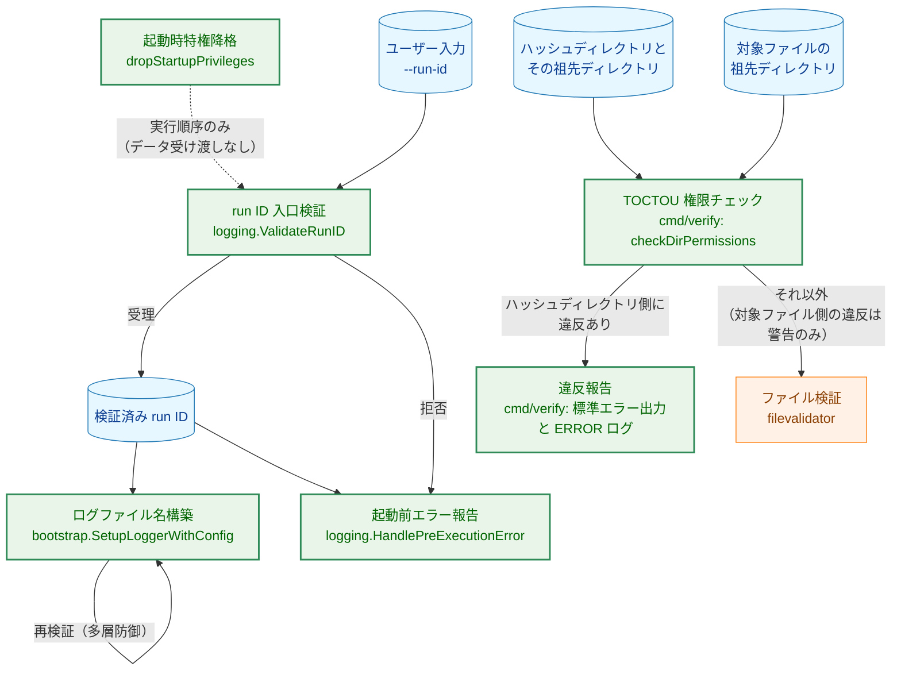

矢印 A → B は「A の出力または制御が B へ渡ること」を表す。`BOOT` から `GATE` への破線矢印のみ例外で、両者の間にデータの受け渡しはなく、`BOOT`（起動時特権降格）が `GATE`（run ID 検証）より先に実行される、という起動順序のみを表す（§3.2.2）。`LOGNAME` から自身への矢印は、同一コンポーネント内で独立した再検証を行うことを表す。`runner` 系と `verify` 系は別プロセスであり、報告先も別である。`cmd/verify` は `internal/logging` に依存しないため、`VGATE` から `SUMMARY` への経路は存在しない。`VGATE` は2種類のディレクトリ集合を検査するが、fail-closed の引き金になるのはハッシュディレクトリ側の違反だけである（§3.4・§9）。

**Legend**

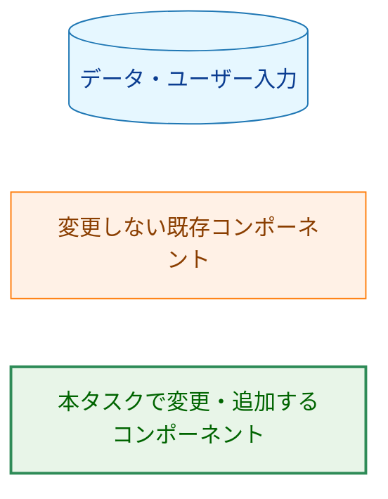

### 1.3 要件定義書の未決事項に対する決定

要件定義書の「未決事項」に挙げられた2件を、本書で次のとおり決定する。

#### D-1: `--run-id` の受理形式は `^[A-Za-z0-9_-]{1,64}$` とする

厳密な ULID（Crockford Base32・26文字）に限定する案は採らない。理由は、利用者向け文書 [docs/user/runner_command.ja.md](../../user/runner_command.ja.md) が `-run-id` の主要ユースケースとして「外部システムとの連携」を挙げ、次の形式を推奨例として明示しているためである。

| 文書中の推奨例（行） | 展開後の値の例 | 厳密 ULID | 本決定の許可リスト |
|---|---|---|---|
| `-run-id my-custom-run-001`（914） | `my-custom-run-001` | 拒否 | 受理 |
| `-run-id "gh-${GITHUB_RUN_ID}"`（943） | `gh-12345678` | 拒否 | 受理 |
| `-run-id "jenkins-${BUILD_NUMBER}"`（946） | `jenkins-42` | 拒否 | 受理 |
| `-run-id "backup-$(date +%Y%m%d-%H%M%S)"`（949） | `backup-20260805-143000` | 拒否 | 受理 |
| `-run-id 01K2YK812JA735M4TWZ6BK0JH9`（917） | 同左 | 受理 | 受理 |

厳密 ULID を採ると、文書が推奨している4例すべてが起動時に拒否される。`--run-id` は「外部システムの ID と実行を紐付ける」ために存在するフラグであり、自動生成される ULID しか受け付けないなら、このフラグの存在意義そのものが失われる。一方、許可リスト `^[A-Za-z0-9_-]{1,64}$` は要件（AC-05・AC-06・AC-07）が要求する安全性をすべて満たす。

- パス区切り文字 `/`、および `.`（したがって `..` も）を含まないため、ログディレクトリの外を指すファイル名を構築できない（AC-05）。
- 空白・改行・NUL・ESC を含むあらゆる制御文字を含まないため、`RUN_SUMMARY` 行や標準エラー出力の行構造を壊せない（AC-06）。
- 長さ上限 64 により、ログファイル名の長さが予測可能な範囲に収まる（AC-07）。ファイル名は `{hostname}_{timestamp}_{runID}.json` であり（[logger.go:138](../../../internal/runner/bootstrap/logger.go#L138)）、run ID 以外の固定部分は timestamp 16 文字・区切り2文字・拡張子5文字の計23文字である。`common.GetHostname` はホスト名を切り詰めないため、`NAME_MAX`（一般に255バイト）に収まるかどうかは、ホスト名が168バイト以下であるかに依存する。上限64は「run ID がファイル名長の主因にならない」ことを保証する値として選んだ。

`^[A-Za-z0-9_-]{1,64}$` は自動生成される ULID を包含するため、`GenerateRunID` の出力は常に受理される。既存テストが渡している run ID 値との適合性は §3.7 と §7.3 で扱う。

#### D-2: `verify` の fail-closed 時の終了コードは 3 とする

`record` と同じ exit 1 に揃える案は採らない。理由は、`verify` の exit 1 が既に「1件以上のファイルで検証が失敗した」という別の意味を持っているためである。

要件定義書の背景 M-3 は、この設計が守ろうとしている対象を「それを信頼判断に使う運用者や監視スクリプト」と定義している。監視スクリプトにとって「ファイルが改ざんされた（要調査・要復旧）」と「チェック結果自体が信頼できない（要ディレクトリ権限修正）」は取るべき対処が異なる。両者を同じ exit 1 にまとめると、この設計が守ろうとしている当の利用者が両者を区別できなくなる。`record` の exit 1 が曖昧でないのは、`record` にはこの経路以外に exit 1 を返す検証失敗が存在しないためである。`verify` にはこの前提が当てはまらない。

**exit 2 を使わない理由**: Go ランタイムは未捕捉の panic でプロセスを **exit 2** で終了させる。`cmd/verify` には到達可能な panic が2箇所ある（[main.go:35](../../../cmd/verify/main.go#L35) のポリシー宣言失敗、[main.go:86](../../../cmd/verify/main.go#L86) のチェッカー初期化失敗）。exit 2 を TOCTOU 違反に割り当てると「違反を検出した」と「verify がクラッシュした」が同じコードになり、区別可能にするという D-2 の目的そのものを損なう。したがって未使用の 3 を割り当て、2 は Go ランタイム予約として §4.2 の表に明記する。

後方互換性の観点では exit 3 は安全である。利用者向け文書 [docs/user/verify_command.ja.md](../../user/verify_command.ja.md) が示す判定パターンは `if verify ...; then`（97行目）と `EXIT_CODE=${PIPESTATUS[0]}; if [[ $EXIT_CODE -eq 0 ]]`（641〜642行目）であり、いずれも「0 か否か」で分岐する。exit 3 はどちらでも失敗側へ分岐するため、既存スクリプトの判定結果は変わらない。

`verify` の終了コード契約は §4.2 にまとめる。

---

## 2. システム構成

### 2.1 全体構成（Before / After）

```mermaid
flowchart TD
    classDef process fill:#fff1e6,stroke:#ff7f0e,stroke-width:1px,color:#8a3e00;
    classDef enhanced fill:#e8f5e8,stroke:#2e8b57,stroke-width:2px,color:#006400;
    classDef problem fill:#ffe6e6,stroke:#d62728,stroke-width:2px,color:#7b0000;

    subgraph BeforeR["Before: cmd/runner 起動"]
        B1["flag.Parse"]
        B2["run ID 確定<br>（検証なし）"]
        B3["ハッシュディレクトリ検査"]
        B4["Seteuid のみ"]
        B5["mainWithExitCode"]
        B1 --> B2 --> B3 --> B4 --> B5
        class B2,B4 problem
    end

    subgraph AfterR["After: cmd/runner 起動"]
        A1["dropStartupPrivileges"]
        A2["ブートストラップ run ID 生成"]
        A3["flag.Parse"]
        A4["resolveRunID"]
        A5["ハッシュディレクトリ検査"]
        A6["mainWithExitCode"]
        A1 --> A2 --> A3 --> A4 --> A5 --> A6
        class A1,A2,A4 enhanced
        class A3,A5,A6 process
    end

    subgraph BeforeV["Before: cmd/verify"]
        C1["TOCTOU 権限チェック"]
        C2["警告記録のみで続行"]
        C3["ファイル検証"]
        C1 --> C2 --> C3
        class C2 problem
    end

    subgraph AfterV["After: cmd/verify"]
        D1["checkDirPermissions"]
        D2{"ハッシュディレクトリ側に<br>違反あり?"}
        D3["違反報告と exit 3"]
        D4["ファイル検証"]
        D1 --> D2
        D2 -->|"あり"| D3
        D2 -->|"なし"| D4
        class D1,D2,D3 enhanced
        class D4 process
    end

    class B1,B3,B5,C1,C3 process
```

矢印 A → B は「A の完了後に B が実行されること」を表す。判定ノードから出る矢印のラベルは判定結果を表す。

**Legend**

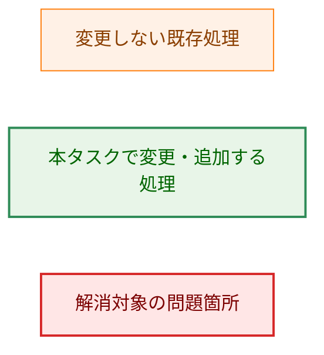

### 2.2 コンポーネント配置

新規パッケージは追加しない。run ID の形式定義は、その生成側 `GenerateRunID` を既に持っている `internal/logging` に置く。さらに `GenerateRunID` を新設の `runid.go` へ移動し、「正規の run ID とは何か」を定める生成・検証・形式説明の3要素を1ファイルに集約する。

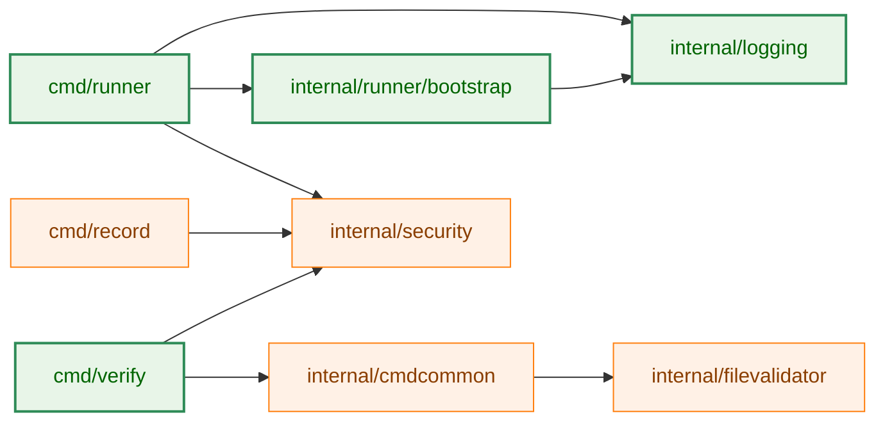

矢印 A → B は「パッケージ A が B を直接 import すること」を表す。図中の依存関係はすべて現行コードに既に存在するものであり、本タスクで新設する依存はない。`cmd/verify` は `filevalidator` を直接 import せず、`cmdcommon.CreateValidator` 経由で利用する。

**Legend**

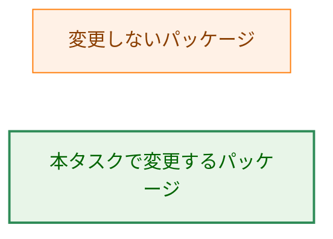

### 2.3 データフロー: run ID の伝播

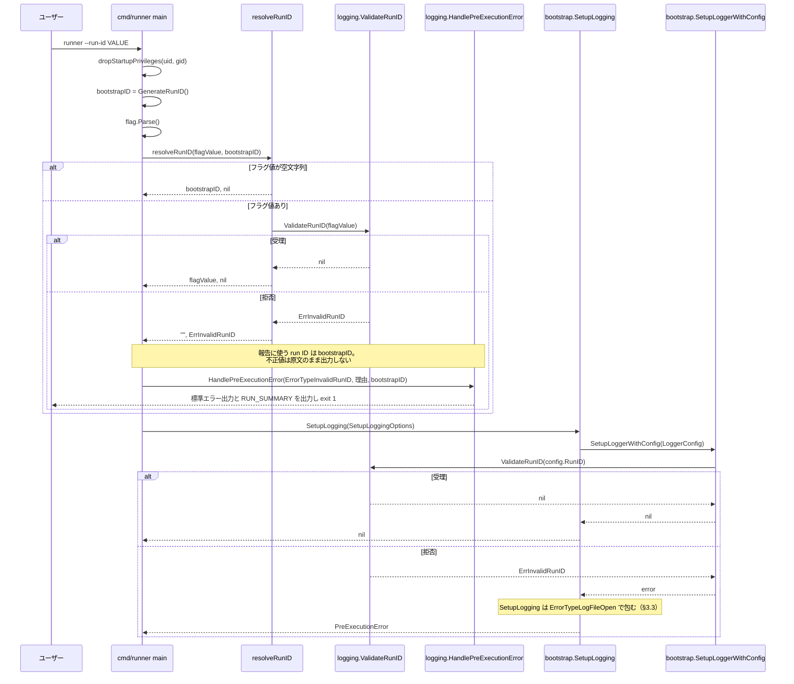

---

## 3. コンポーネント設計

### 3.1 変更: run ID の形式定義（`internal/logging/runid.go`）

run ID の受理形式を1箇所で定義し、入口検証（`cmd/runner`）と多層防御（`bootstrap`）の両方から利用する。既存の `GenerateRunID` は `safeopen.go` からこのファイルへ移す。

```go
// internal/logging/runid.go

// MaxRunIDLength is the maximum number of characters a run ID may contain.
const MaxRunIDLength = 64

// RunIDFormatDescription describes the accepted run ID format. It is safe to
// print: it is derived from MaxRunIDLength and never contains any part of a
// rejected value.
var RunIDFormatDescription = fmt.Sprintf("1-%d characters, each of A-Z a-z 0-9 '_' '-'", MaxRunIDLength)

// ErrInvalidRunID is returned when a run ID does not match the accepted format.
var ErrInvalidRunID = errors.New("invalid run ID")

// GenerateRunID generates a new ULID for run identification.
// Its output always satisfies ValidateRunID.
func GenerateRunID() string

// ValidateRunID reports whether runID matches the accepted format, returning an
// error wrapping ErrInvalidRunID when it does not.
//
// The returned error never contains the rejected value verbatim. When the value
// contains a disallowed byte, the error identifies that byte's index and its
// Go-quoted form (%q), which escapes newline, NUL, ESC and quote characters.
func ValidateRunID(runID string) error
```

**設計上の要点**

- `ValidateRunID` が返すエラーは、拒否された値を原文のまま含まない。これは P-2 を関数の契約として担保するものであり、この契約があるおかげで呼び出し側は「エラーメッセージをそのまま出力してよいか」を都度考えなくて済む。
- ただし「理由の分類と長さだけ」では診断に不十分である。CI が `--run-id "$SOME_VAR"` を渡して拒否された場合、原因が末尾の改行なのか、Windows ランナー由来の CR なのか、区切り文字の `:` なのかを、利用者が判別できない。そこで**最初に違反したバイトの位置と `%q` 形式**をエラーに含める。`%q` は改行・NUL・ESC・引用符をすべてエスケープするため、1バイトの `%q` 表現は行構造を壊せず、P-2 を破らない。値全体は依然として出力しない。
- 許可リストによる判定であり、拒否すべき文字を列挙する方式は採らない（AC-04）。
- 空文字列は `ValidateRunID` としては拒否する（長さ1以上を要求）。「未指定と同一に扱う」という AC-02 の判断は `resolveRunID`（§3.2.2）の責務であり、空文字列を検証関数に渡す前に分岐する。この分離により、`bootstrap` 側の多層防御（§3.3）では空文字列も正しく拒否される。

### 3.2 変更: `cmd/runner/main.go`

#### 3.2.1 起動時特権降格

```go
// cmd/runner/main.go

// startupPrivilegeStage identifies which step of the startup privilege drop failed.
type startupPrivilegeStage string

const (
    stageSetegid startupPrivilegeStage = "setegid"
    stageSeteuid startupPrivilegeStage = "seteuid"
)

// startupPrivilegeError reports a failure of the startup privilege drop.
type startupPrivilegeError struct {
    Stage startupPrivilegeStage
    Err   error
}

// dropStartupPrivileges drops the effective GID to targetGID and then the
// effective UID to targetUID, returning a *startupPrivilegeError identifying the
// failed stage. Production calls dropStartupPrivileges(syscall.Getuid(), syscall.Getgid());
// tests pass a target the process cannot reach in order to exercise the failure path.
func dropStartupPrivileges(targetUID, targetGID int) error

// reportStartupPrivilegeFailure reports err through HandlePreExecutionError using
// a freshly generated run ID, and returns the process exit code.
func reportStartupPrivilegeFailure(err error) int
```

`targetUID` / `targetGID` を引数にする理由は、テスト容易性のためである。非特権ユーザーで実行されるテストが `dropStartupPrivileges(os.Getuid(), 0)` を呼ぶと、本物の `syscall.Setegid(0)` が `EPERM` を返すため、syscall を差し替えることなく失敗経路を実際に検証できる。この設計なら、§5.2 の「差し替え口を設けない」方針を守ったまま、AC-15・AC-16 を振る舞いとして検証できる。`startupPrivilegeStage` はこのテストが「どの段階で失敗したか」を主張するために読むフィールドであり、消費者のない型ではない。

#### 3.2.2 起動シーケンス

| 順 | 処理 | 根拠 |
|---|---|---|
| 1 | `dropStartupPrivileges(Getuid(), Getgid())`（実効グループID → 実効ユーザーID） | AC-14 |
| 2 | ブートストラップ run ID（起動直後に自動生成する run ID）の生成 | AC-18 |
| 3 | `flag.Parse()` | AC-14 |
| 4 | `resolveRunID(runIDFlag, bootstrapID)` | AC-01〜AC-10 |
| 5 | ハッシュディレクトリの絶対パス検査（既存） | 変更なし |

**AC-14 が保証する範囲の正確な定義**: Go はすべてのパッケージの `init()` を `main()` より前に実行する。`cmd/runner` の `init()` は全フラグの登録と `groupmembership.SetProcessPermissionCheckUIDPolicy` の呼び出しを行い（[main.go:56-91](../../../cmd/runner/main.go#L56-L91)）、これは特権を保持したまま走る。Go ランタイム自身の初期化（`GODEBUG` 等の環境変数解釈を含む）も同様である。したがって本設計が保証できるのは「`main()` の本体で最初に実行される処理が特権降格であること」であり、「プロセス開始から一切の入力処理が行われないこと」ではない。この境界は Go の言語仕様上回避できない。§7.2 のガードテストは、この残存する攻撃対象領域が将来黙って広がらないよう、`cmd/runner` に `init()` が追加されていないことも検査する。

**実効グループIDを実効ユーザーIDより先に降格する理由**: 特権を手放す操作は、プロセスがまだ既知の特権状態にある間に一度で済ませるべきである。実効ユーザーIDを先に落とすと、以降の実効グループIDの降格が成功するかどうかは saved-set-gid の状態と各カーネルの権限判定に依存し、前提が増える。順序を固定することでこの依存を排除する。

**降格失敗時の run ID（AC-18）**: 手順1は手順2より前にあるため、降格に失敗した時点ではブートストラップ run ID がまだ存在しない。`reportStartupPrivilegeFailure` はこの経路でのみ `GenerateRunID` を呼んで ID を確定する。これにより、正常系では降格前に `main()` 本体の処理を何も実行せず、かつ失敗報告の run ID も空にならない。

#### 3.2.3 `--run-id` の受理判定

判定は `main()` から切り出した純関数に置く。`cmd/runner/main_test.go` は `main()` を呼ばずフラグ変数を直接操作する構造であるため、判定ロジックが `main()` 本体にインラインで存在すると、AC-01〜AC-03 を単体テストで検証できない。

```go
// cmd/runner/main.go

// resolveRunID returns the run ID to use for this execution. An empty flagValue
// (unset, or explicitly empty) yields bootstrapID. Any other value must satisfy
// logging.ValidateRunID; otherwise the returned error wraps logging.ErrInvalidRunID.
func resolveRunID(flagValue, bootstrapID string) (string, error)
```

| 入力 | 挙動 | AC |
|---|---|---|
| フラグ未指定 | ブートストラップ run ID をそのまま採用 | AC-01 |
| `--run-id=""` | 未指定と同一に扱い、ブートストラップ run ID を採用 | AC-02 |
| 受理形式に合致 | 指定値を採用 | AC-03 |
| 受理形式に不一致 | `ErrorTypeInvalidRunID` で報告し exit 1 | AC-04〜AC-10 |

`--run-id=""` を未指定と同一に扱うのは、現行実装が「空文字列なら自動生成」で分岐しており、Go の `flag` パッケージでは未指定と明示的な空文字列を区別できないためである。区別できない以上、エラーにすると `--run-id="$UNSET_VAR"` のような既存の呼び出しが壊れるだけで、防げる攻撃はない。

### 3.3 変更: `internal/runner/bootstrap/logger.go`（多層防御）

`SetupLoggerWithConfig` の入口で `LoggerConfig.RunID` を `logging.ValidateRunID` で検証し、不合格ならログファイルを一切作らずにエラーを返す。

```go
// internal/runner/bootstrap/logger.go（既存の定義、シグネチャ変更なし）

type LoggerConfig struct {
    Level         slog.Level
    LogDir        string
    RunID         string
    ConsoleWriter io.Writer
}

func SetupLoggerWithConfig(config LoggerConfig, forceInteractive, forceQuiet bool) error
```

**設計上の要点**

- 検証は `config.LogDir` が空かどうかに関わらず、関数の先頭で行う。run ID はログファイル名以外にも構造化ログ属性 `run_id` や Slack 通知へ流れるため、ファイル出力の有無で防御の有無が変わるべきではない。
- 独自に `filepath.Base(runID) == runID` を書くのではなく `logging.ValidateRunID` を再利用する。同じ「安全な run ID」の定義が2箇所に分かれると、片方だけが更新されて防御に穴が開く。`ValidateRunID` は `filepath.Base` 相当のチェックより厳しいため、AC-11 が求める「ログディレクトリ直下から外れる run ID の拒否」を包含する。
- `SetupLoggerWithConfig` は既に `error` を返すため、シグネチャの変更は不要である。
- **利用者から見えるエラー種別**: `cmd/runner` は `SetupLoggerWithConfig` を直接呼ばず、`bootstrap.SetupLogging` を経由する（[environment.go:85-101](../../../internal/runner/bootstrap/environment.go#L85-L101)）。`SetupLogging` は下位のエラーをすべて `ErrorTypeLogFileOpen` の `PreExecutionError` に包むため、この多層防御が発火した場合の利用者向け種別は `invalid_run_id` ではなく `log_file_open_failed` になる。本設計はこれを許容する。この層は、入口検証（§3.2.3）を通過した値では到達しない最終防壁である。ここに到達したなら、それは呼び出し側のバグを意味する。利用者が種別で自動対応すべきなのは入口検証の拒否のほうであり、そちらは `invalid_run_id` として正しく報告される。ラップされた内側のエラーには `ErrInvalidRunID` が保持されるため、原因はメッセージから判別できる。

### 3.4 変更: `cmd/verify/main.go`（fail-closed 化）

TOCTOU 権限チェックの戻り値を評価し、違反が1件以上あればファイル検証に進まずに終了する。

```go
// cmd/verify/main.go

// Exit codes returned by run(). 2 is deliberately unused: the Go runtime exits
// with status 2 on an uncaught panic (see §1.3 D-2).
const (
    exitOK                   = 0
    exitVerificationFailed   = 1
    exitUntrustedEnvironment = 3
)

// toctouChecker is the directory permission checker used by checkDirPermissions.
// nil means construct one via security.NewDirectoryPermChecker; tests replace it.
var toctouChecker security.DirectoryPermChecker

// checkDirPermissions runs the TOCTOU permission check on the directories this
// operation touches and reports whether verification may proceed. Only a
// violation on the hash directory or one of its ancestors is fail-closed; each
// such violation is logged at ERROR level and the reason is written to stderr.
// Violations confined to a target file's ancestors keep the shared check's
// warning behaviour and do not stop the run.
func checkDirPermissions(cfg *verifyConfig, stderr io.Writer) bool
```

**判定対象を2つに分ける（AC-19・AC-28）**

fail-closed の引き金になるのはハッシュディレクトリ側の違反だけである。この区別は、既存の `security.CollectTOCTOUCheckDirs` を引数を変えて2回呼ぶことで得られる。同関数の変更は不要である。

| 集合 | 収集方法 | 違反時の扱い |
|---|---|---|
| ハッシュディレクトリ集合 | `CollectTOCTOUCheckDirs(nil, nil, absHashDir)` | fail-closed（ERROR ログ・標準エラー出力・exit 3） |
| 対象ファイル集合 | `CollectTOCTOUCheckDirs(absFiles, nil, "")` からハッシュディレクトリ集合を除いた差分 | 従来どおり警告のみ。検証は継続する |

対象ファイル集合からハッシュディレクトリ集合を差し引くのは、重複する祖先ディレクトリに対して警告が二重に出るのを避けるためである。対象ファイルがハッシュディレクトリ配下に置かれている場合、その祖先はハッシュディレクトリ集合に含まれるため fail-closed の対象になる。これは安全側への倒し方として正しい。

判定順序はハッシュディレクトリ集合を先とする。fail-closed が確定した時点で、対象ファイル集合のチェックは行わない。

**設計上の要点**

- 判定関数の形（違反時に各違反を ERROR で記録し、標準エラー出力に理由を書いて `false` を返す）は `cmd/record/main.go` の `checkDirPermissions`（[main.go:102](../../../cmd/record/main.go#L102)）に揃える。`record` が既に fail-closed であり（Task 0146、コミット `be92e759`）、両コマンドが同じ信頼の起点を守る以上、挙動と診断メッセージの形が揃っているほうが運用者にとって予測可能である。
- **チェッカーの差し替え口**: `record` は `deps` 構造体の `toctouChecker` フィールド（[main.go:53](../../../cmd/record/main.go#L53)）で違反を注入できるようにしている。`verify` にも同等の差し替え口が必要である。これがないと、既定のハッシュディレクトリを使う経路（AC-23）のテストが CI ホストの実際のディレクトリ権限に依存し、環境によって結果が変わる。`verify` は既に `validatorFactory`・`mkdirAll`・`ensurePermissionCheckUID` をパッケージ変数で差し替える方式を採っている（[main.go:24-29](../../../cmd/verify/main.go#L24-L29)）ため、`toctouChecker` も同じ方式に揃える（`record` の `deps` 構造体を `verify` に持ち込むと、`verify` 側の既存3変数と二重の注入方式が並立する）。
- 共有部品 `security.CollectTOCTOUCheckDirs` と `security.RunTOCTOUPermissionCheck` はそのまま再利用し、変更しない（要件定義書のスコープ外項目）。
- 違反の ERROR 記録は、`RunTOCTOUPermissionCheck` が内部で出力する WARN ログに**加えて**行う（AC-20）。共有関数の WARN を ERROR に変更しないのは、同関数が §3.5 の4つの呼び出し元で共有されており、`verify` の都合で共有部品のログレベルを変えると他の呼び出し元の運用に影響するためである。ERROR を付けるのは fail-closed の判定対象となったハッシュディレクトリ側の違反だけであり、対象ファイル側の違反は WARN のまま残す。ログレベルが「実行を止めたかどうか」に対応するため、オンコール担当者はログだけで両者を区別できる。

**既知の重複と、fail-closed 化によって顕在化するリスク**: `cfg.files` と `cfg.hashDir` を絶対パス化しシンボリックリンクを解決する前処理は、`record` の同名関数とほぼ同一である（監査所見 L-2、[#986](https://github.com/isseis/go-safe-cmd-runner/issues/986)）。この重複は要件定義書でスコープ外と定められているため本タスクでは共通化しない。ただし L-2 は単なる重複ではなく、`filepath.Abs` と `filepath.EvalSymlinks` の失敗を握り潰して未解決パスにフォールバックする欠陥を含む（[main.go:88-107](../../../cmd/verify/main.go#L88-L107)）。この欠陥が生むのは、現在は誤った警告にすぎない。しかし fail-closed 化後は、誤った exit 3 と「検証0件」を生む。誤検知が起きた場合、利用者から見た出力は真の違反と区別できない。本タスクはこのリスクを受容するが、L-2 の優先度を上げる根拠として記録する。

### 3.5 TOCTOU 権限チェックの全呼び出し元

AC-20 は「共有の TOCTOU チェック処理が出力する警告レベルのログに加えて ERROR を記録する」ことを求めている。この判断が他の呼び出し元と整合していることを確認するため、`security.RunTOCTOUPermissionCheck` の呼び出し元を全数調査した結果を示す。

| # | 呼び出し元 | 現行の違反時の挙動 | 本タスクでの変更 |
|---|---|---|---|
| 1 | [cmd/runner/main.go:366](../../../cmd/runner/main.go#L366) `runTOCTOUCheck` | fail-closed。`PreExecutionError`（`ErrorTypeFileAccess`）を返して起動中断。違反ごとの ERROR ログはなく、件数のみをメッセージに含む | 変更しない |
| 2 | [internal/runner/group_executor.go:372](../../../internal/runner/group_executor.go#L372) | fail-closed。`ErrTOCTOUViolation` を返してグループ実行を中断 | 変更しない |
| 3 | [cmd/record/main.go:138](../../../cmd/record/main.go#L138) `checkDirPermissions` | fail-closed。違反ごとに ERROR ログと是正方法、標準エラー出力にメッセージ、exit 1 | 変更しない |
| 4 | [cmd/verify/main.go:109](../../../cmd/verify/main.go#L109) | **fail-open**。WARN のみで続行 | **本タスクで fail-closed 化**（ハッシュディレクトリ側の違反に限る。§9） |

fail-open は4箇所のうち `verify` のみである。本タスクの変更後、ハッシュディレクトリに関する違反については全呼び出し元が fail-closed になる。`verify` だけは対象ファイルの祖先ディレクトリの違反を警告に留める点で他と異なるが、これは `verify` の役割（対象ファイルが改ざんされていないかを判定すること）から導かれる意図的な差である（§9.2）。

### 3.6 既存ポリシーへの例外: Task 0089 の AC-M2S-5

本設計は、先行タスクで定められたポリシーを意図的に置き換える。実装者が既存テストの失敗を「回帰」と誤認しないよう、ここに明示する。

**(1) 元のポリシーとその所在**
[docs/tasks/0089_security_audit_fixes/01_requirements.md:51](../0089_security_audit_fixes/01_requirements.md) の **AC-M2S-5** が挙動ポリシーを定めている。

> AC-M2S-5: 検査で問題が検出された場合、`runner` は実行開始前にエラー終了し、`record` と `verify` は警告のみで継続できること

同文書:53 の **AC-M2S-7** は、この挙動を検証するテストの追加を求めるテスト要件である。実装状況は [04_implementation_plan.md:370-371](../0089_security_audit_fixes/04_implementation_plan.md) の2エントリで追跡されている。

**(2) 例外とする理由**
このポリシーは既に部分的に覆されている。`record` は Task 0146（コミット `be92e759` "fix(0146): fail-closed on TOCTOU permission violations in record"）で fail-closed 化され、AC-M2S-5 のうち `record` に関する部分は失効した。本タスクは残る `verify` について同じ判断を適用する。理由は要件定義書の背景 M-3 のとおりである。`verify` は `-hash-dir` で任意のディレクトリを指定できる。そのハッシュディレクトリ側で違反が検出される状況とは、「攻撃者がハッシュ記録を差し替えられる状況」そのものである。その状態で `OK`／exit 0 を返せば、検証結果は意味を失う。

**(3) 旧挙動を検証している既存テストと必要な更新**

| テスト | 場所 | 現在の主張 | 必要な更新 |
|---|---|---|---|
| `TestRunTOCTOU_ContinuesOnWorldWritableDir` | [cmd/verify/main_test.go:155](../../../cmd/verify/main_test.go#L155) | world-writable ディレクトリでも exit 0 で継続し、ファイルが処理される | **アサーションの変更は不要**。下記参照 |

このテストは**対象ファイル**の親ディレクトリを world-writable にし、ハッシュディレクトリには健全な一時ディレクトリを渡す構成である。§9.2 の限定により、この構成は fail-closed の対象外であり、exit 0 と「1件処理された」という主張はそのまま成立する。

ただし**テストが通る理由が変わる**。現在は「`verify` は違反があっても中断しないから」通っているが、変更後は「この違反はハッシュディレクトリ側ではないから」通る。したがって次を更新する。

- 関数コメントの「verify does NOT abort on TOCTOU violations — it only logs a warning」は、変更後は誤りになるため書き換える。
- AC-M2S-7 への参照を本タスクの AC-28 へ更新する。
- テスト名を、対象ファイル側の違反であることが分かる名前へ改める（例: `TestRunTOCTOU_ContinuesWhenOnlyTargetDirViolates`）。

fail-closed 側は、ハッシュディレクトリを world-writable にした構成の新規テストで検証する（§7.1）。`verify` の fail-open 挙動を主張する他のテストは存在しない（`test/security/` 配下を含め全数確認済み）。

### 3.7 コンポーネント責務表

| ファイル | 区分 | 責務・変更内容 | 対応 AC |
|---|---|---|---|
| `internal/logging/runid.go` | 新規 | run ID の受理形式の定義、`ValidateRunID`、`ErrInvalidRunID`、`MaxRunIDLength`、`RunIDFormatDescription`、および `safeopen.go` から移設した `GenerateRunID` | AC-04〜AC-07 |
| `internal/logging/safeopen.go` | 変更 | `GenerateRunID` を `runid.go` へ移設（残る責務は安全なファイルオープンとログディレクトリ検証） | — |
| `internal/logging/runid_test.go` | 新規 | 受理形式の境界値・拒否ケース、エラーが入力値を原文のまま含まないことの検証 | AC-04〜AC-07, AC-09 |
| `internal/logging/pre_execution_error.go` | 変更 | `ErrorTypeInvalidRunID` の追加 | AC-08 |
| `cmd/runner/main.go` | 変更 | `dropStartupPrivileges`・`reportStartupPrivilegeFailure`・`resolveRunID` の追加、起動順序の並べ替え | AC-01〜AC-10, AC-14〜AC-18 |
| `cmd/runner/main_test.go` | 変更 | `resolveRunID` の単体テストを追加。`setupTestFlags` は `init()` のフラグ定義を写しているため、フラグ定義に変更が入る場合は追随が必要 | AC-01〜AC-03, AC-17 |
| `cmd/runner/startup_privilege_test.go` | 新規 | `dropStartupPrivileges` の失敗経路（実 syscall による `EPERM`）と `reportStartupPrivilegeFailure` の単体テスト | AC-15, AC-16, AC-18 |
| `cmd/runner/startup_order_guard_test.go` | 新規 | `dropStartupPrivileges` 内の呼び出し順序、`main` 内での降格と `flag.Parse` の前後関係、識別子変更系 syscall の許可リスト、`init()` の増加検知を静的に検証（§7.2） | AC-14 |
| `cmd/runner/integration_pre_execution_error_test.go` | 変更 | run ID 拒否時に不正値が標準出力・標準エラー出力に出ないこと、ログファイルが作られないことの検証を追加 | AC-08, AC-09, AC-10 |
| `internal/testutil/identitymutationguard/helpers.go` | 変更 | `CallSite` に位置情報を追加し、追跡対象を呼び出し側から指定できるようにする（§7.2 が必要とする拡張） | AC-14 |
| `internal/runner/bootstrap/logger.go` | 変更 | `SetupLoggerWithConfig` 先頭での `RunID` 再検証 | AC-11, AC-12 |
| `internal/runner/bootstrap/logger_test.go` | 変更 | 不正な `RunID` でログファイルが作られないことの検証を追加。既存の `RunID` 値15箇所（7呼び出し）はすべて新形式を満たすため修正不要 | AC-11〜AC-13 |
| `internal/runner/bootstrap/environment_test.go` | 回帰確認のみ | `SetupLoggerWithConfig` を直接2箇所、`SetupLogging` 経由で3箇所呼ぶ。`RunID` 値はすべて新形式を満たすため修正不要 | AC-13 |
| `cmd/runner/integration_logger_test.go` | 回帰確認のみ | `SetupLoggerWithConfig` を直接3箇所呼ぶ。`RunID` 値はすべて新形式を満たすため修正不要 | AC-13 |
| `cmd/verify/main.go` | 変更 | `checkDirPermissions` の追加、ハッシュディレクトリ側違反の fail-closed 化、`toctouChecker` 差し替え口、終了コード定数の導入 | AC-19〜AC-23, AC-28 |
| `cmd/verify/main_test.go` | 変更 | ハッシュディレクトリ側違反の fail-closed テストを新設（既定ディレクトリと `-hash-dir` 明示の両ケース）。`TestRunTOCTOU_ContinuesOnWorldWritableDir` はアサーションを変えず、コメントと名前を AC-28 向けに更新（§3.6）。`TestRunUsesDefaultHashDirectoryWhenNotSpecified` に `toctouChecker` のスタブ注入を追加し、ホストの `/usr/local` の権限に依存しないようにする（§7.1） | AC-19〜AC-23, AC-28 |
| `docs/user/runner_command.ja.md` / `.md` | 変更 | `-run-id` の受理形式と拒否挙動。あわせて849行目のログファイル名記述（現行コードと不一致）を修正 | AC-24 |
| `docs/user/verify_command.ja.md` / `.md` | 変更 | fail-closed 挙動（ハッシュディレクトリ側の違反に限ること、対象ファイル側は警告のまま継続すること）と終了コード表（0 / 1 / 3、および 2 の予約） | AC-25 |
| `CHANGELOG.ja.md` / `CHANGELOG.md` | 変更 | 破壊的変更2件と、影響有無を事前に判定する手順（§8.2） | AC-26 |
| `docs/translation_glossary.md` | 変更 | 新規用語があれば追加 | AC-27 |

---

## 4. エラーハンドリング設計

### 4.1 エラー型と種別の判別方法

```go
// internal/logging/pre_execution_error.go（追加）

// ErrorTypeInvalidRunID represents a --run-id value that does not match the
// accepted format.
const ErrorTypeInvalidRunID ErrorType = "invalid_run_id"
```

既存の `ErrorType` を流用せず新設する理由は、AC-08 が「エラーの種別がプログラムから判別できる」ことを求めているためである。`ErrorTypeRequiredArgumentMissing` は引数の欠落、`ErrorTypeBuildConfig` はビルド時設定の誤りを表しており、いずれも「ユーザーが与えた値の形式が不正」とは意味が異なる。

**AC-08 を満たす判別手段の定義**: 判別はプロセス外部から行う。`--run-id` の拒否は `main()` が `HandlePreExecutionError` を呼んで `os.Exit(1)` する経路であり（既存の特権降格失敗の報告と同じ形）、`*PreExecutionError` の値が呼び出し元へ返るわけではない。したがって判別の手がかりは、次の3つの出力に現れる `invalid_run_id` トークンである。

| 出力先 | 形式 | 生成箇所 |
|---|---|---|
| 標準エラー出力 | `Error: invalid_run_id` で始まるブロック | [pre_execution_error.go:99](../../../internal/logging/pre_execution_error.go#L99) |
| 標準出力 | `RUN_SUMMARY` 行の直前の `Error: invalid_run_id` | [pre_execution_error.go:124](../../../internal/logging/pre_execution_error.go#L124) |
| 構造化ログ | 属性 `error_type=invalid_run_id` | [pre_execution_error.go:113](../../../internal/logging/pre_execution_error.go#L113) |

プロセス内の `errors.Is`／`errors.As` による種別判別は成立しないことに注意する。`PreExecutionError.Is` は `_, ok := target.(*PreExecutionError)` を返す実装であり（[pre_execution_error.go:63-66](../../../internal/logging/pre_execution_error.go#L63-L66)）、`Type` フィールドを見ないため、そもそも `ErrorType` の違いを区別できない。`resolveRunID` が返すエラーは `logging.ErrInvalidRunID` をラップするため、Go コード内で判別が必要な場合は `errors.Is(err, logging.ErrInvalidRunID)` を使う。

### 4.2 終了コード契約

**`cmd/runner`**（変更なし。本タスクで追加される拒否経路も既存の慣習に従う）

| コード | 意味 |
|---|---|
| 0 | 正常終了 |
| 非0 | 起動前エラーまたは実行エラー。`--run-id` 形式不正（exit 1）と起動時特権降格失敗（exit 1）を含む |

**`cmd/verify`**

| コード | 意味 | 変更 |
|---|---|---|
| 0 | 全ファイルの検証が成功 | 変更なし |
| 1 | 引数エラー、バリデータ生成失敗、または1件以上のファイルで検証が失敗 | 変更なし |
| 2 | 予期しない異常終了（Go ランタイムが未捕捉 panic に対して使用）。本コマンドが明示的に返すことはない | 明文化 |
| 3 | **ハッシュディレクトリまたはその祖先ディレクトリ**の TOCTOU 権限チェックで違反を検出。検証結果が信頼できないため、ファイルを1件も検証していない。対象ファイル側のみの違反はこのコードを返さない（§9） | 新規（D-2） |

### 4.3 副作用契約

ハッシュディレクトリ側の権限チェックで違反を検出した場合に `verify` が行う／行わない副作用を明示する。契約が曖昧だと、実装によって「どこまで進んでから止まるか」が変わる。対象ファイル側のみの違反では fail-closed とならないため、この表は適用されない（従来どおり検証が進む）。

| 副作用 | fail-closed 時 | 備考 |
|---|---|---|
| ハッシュディレクトリの作成（`mkdirAll`） | **発生しうる** | 引数解析時に実行されるため、権限チェックより前に完了している。AC-19 の但し書きのとおり本タスクのスコープ外（L-3） |
| ハッシュ記録ファイルの読み取り | 発生しない | バリデータの生成自体を行わない |
| 対象ファイルの読み取り・ハッシュ計算 | 発生しない | `Verify` を1件も呼ばない |
| 対象ファイル集合の権限チェック | 発生しない | ハッシュディレクトリ側で fail-closed が確定した時点で打ち切る（§3.4） |
| 標準出力への `Verifying N files...` 等の進捗出力 | 発生しない | 検証を開始しないため |
| 違反ごとの ERROR ログと標準エラー出力への理由メッセージ | 発生する | AC-20・AC-21 |
| ファイルの書き込み・削除・ネットワーク送信 | 発生しない | `verify` はいずれの経路でも行わない |

**出力先についての注意**: `verify` は `slog.SetDefault` を呼ばないため、共有チェックの WARN も新設の ERROR も、既定のテキストハンドラ経由で**標準エラー出力**に出る。`fmt.Fprintln` による理由メッセージも標準エラー出力である。つまり違反1件につき標準エラー出力に3行（WARN・ERROR・理由メッセージ）が並ぶ。JSON 構造化ログや `run_id` 属性は付かない。オンコール担当者が出力だけから拒否理由を説明できるという要件は満たすが、`runner` のような機械可読ログにはならない。

`cmd/runner` の `--run-id` 拒否時の副作用契約は次のとおり。

| 副作用 | 拒否時 |
|---|---|
| ログファイルの作成 | 発生しない（`SetupLogging` に到達しない。AC-08） |
| ログディレクトリの作成 | 発生しない |
| 設定ファイルの読み込み | 発生しない |
| 標準出力への `RUN_SUMMARY` 行 | 発生する（`run_id` はブートストラップ run ID。AC-09） |
| 標準エラー出力への理由メッセージ | 発生する（不正値を原文のまま含まない。AC-09, AC-10） |
| Slack 通知 | `HandlePreExecutionError` の既存挙動に従い `slack_notify` 属性が付くが、この時点で Slack ハンドラは未登録のため実際の送信は発生しない |

---

## 5. セキュリティ考慮事項

### 5.1 脅威モデル

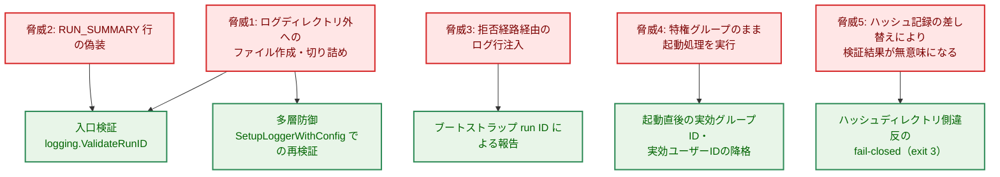

矢印 脅威 → 対策 は「その脅威をその対策で緩和すること」を表す。

**Legend**

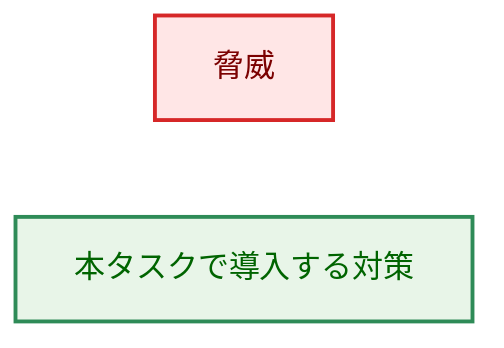

### 5.2 特権降格にテスト用の差し替え口を設けない理由

AC-15・AC-16 は「降格に失敗した場合の fail-closed」を求めており、これを振る舞いとして検証するには `syscall.Setegid`／`syscall.Seteuid` を失敗させる必要がある。素直な方法はパッケージ変数による差し替え（`var setegid = syscall.Setegid`）だが、本設計はこれを採らない。

そのパターンは、このリポジトリ自身のセキュリティガードが検出対象としているものだからである。[internal/testutil/identitymutationguard](../../../internal/testutil/identitymutationguard/helpers.go) は、識別子変更系 syscall の「呼び出し」だけでなく「値としての参照」（`ValueRef`）も検出する。その理由はパッケージのドキュメントに次のように書かれている。

> Such a reference can be invoked later through that variable or field, which a call-site scan alone cannot follow.

つまり「後から差し替えられる識別子変更関数への参照」は、このプロジェクトが明示的に危険と見なしているパターンである。setuid-root で起動する唯一のバイナリである `runner` に、その参照を新設するのは方針に反する。既存の `internal/runner/base/privilege` パッケージも同じ立場を取っており、`osExit`・`identityVerifier`・`readSavedIDs` を差し替え可能にする一方で、`syscall.Seteuid` 自体は [unix.go:270](../../../internal/runner/base/privilege/unix.go#L270)・[unix.go:300](../../../internal/runner/base/privilege/unix.go#L300) で直接呼んでいる。

**差し替え口を設けずに振る舞いを検証する方法**: 差し替えるのは syscall ではなく**降格先の ID** である（§3.2.1）。非特権ユーザーで走るテストが `dropStartupPrivileges(os.Getuid(), 0)` を呼べば、本物の `syscall.Setegid(0)` が `EPERM` を返す。これにより「識別子変更関数への値参照をコードに持ち込まない」ことと「実 syscall の失敗経路を実際に検証する」ことが両立する。

### 5.3 残存リスク

| リスク | 内容 | 扱い |
|---|---|---|
| saved-set-gid の保持 | `syscall.Setegid` は実効グループIDのみを変更する。setgid 構成で配布された場合、saved-set-gid は特権グループのまま残り、以後のコードが `setegid(sgid)` で復帰できる。実効ユーザーID側は `privilege` パッケージが `Seteuid(0)` で特権を再取得するため saved の保持が必要だが、グループID側に再取得の呼び出しは本番コードに存在しない（`Setgid`・`Setresgid`・`Setgroups` の呼び出しはゼロ）。したがってグループIDは不可逆に手放すほうが安全である | 要件 AC-14 が「実効グループIDの降格」と定めているため、本タスクは `Setegid` を採る。不可逆化（`Setgid`）は実グループIDも変更し、ファイル作成時のグループ所有やログディレクトリの group 読み取りに影響する。別タスクで影響を評価したうえで判断する |
| 補助グループ | `syscall.Setgroups` による降格は要件でスコープ外。setgid 構成では補助グループが残る | 別タスク |
| saved-set-uid | 起動時降格後も saved-set-uid は root のまま。これは `privilege` パッケージが後から特権を再取得するために必要な意図的設計 | 監査所見 I-1（別タスク）で文書化 |
| ログディレクトリ内の上書き | 許可リストはパストラバーサルを閉じるが、ログディレクトリ**内**の既存ファイルの上書きは閉じない。ログファイルは `O_CREATE｜O_WRONLY｜O_TRUNC` で開かれるため（[logger.go:140](../../../internal/runner/bootstrap/logger.go#L140)）、既存ファイルと同名になる run ID を指定すると切り詰められる。ファイル名にはホスト名と秒精度のタイムスタンプが含まれ、これらは攻撃者が選べないため、成立条件は限定的である。D-1 が再利用可能な ID を許容する以上、利用者向け文書の既存の注意書き（「同じRun IDを複数回使用するとログファイルが上書きされる可能性があります」）が該当する | 受容。AC-24 の文書更新でこの注意書きを維持する |
| L-2 の誤検知が exit 3 を生む | §3.4 の「既知の重複」を参照 | 受容。L-2 の優先度を上げる根拠として記録 |

### 5.4 外部サービス連携

本タスクは Slack API を含む外部サービスの新機能を利用しない。run ID は既存の Slack ハンドラのフィールドへ流れるが、その形式は入口検証によって従来より狭くなるだけであり、Slack 側の表示に影響する新しい要素は導入しない。したがって Slack クライアント側での追加検証は不要である。

---

## 6. 処理フロー詳細

### 6.1 `cmd/runner` の起動フロー

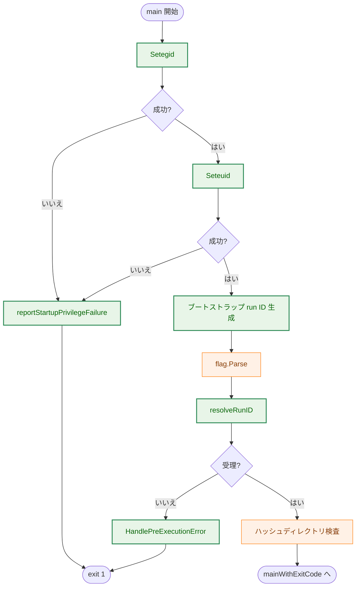

矢印 A → B は「A の次に B を実行すること」を表す。判定ノードから出る矢印のラベルは判定結果を表す。各ノードで発生する副作用は §4.3 の表に記載する。

**Legend**

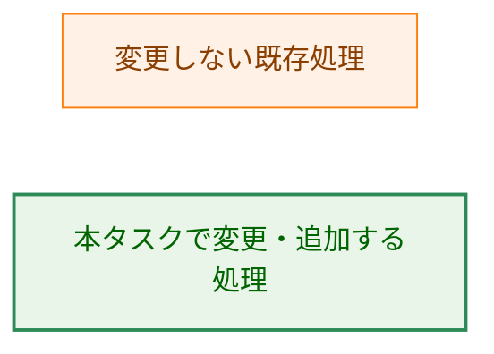

### 6.2 `cmd/verify` の fail-closed フロー

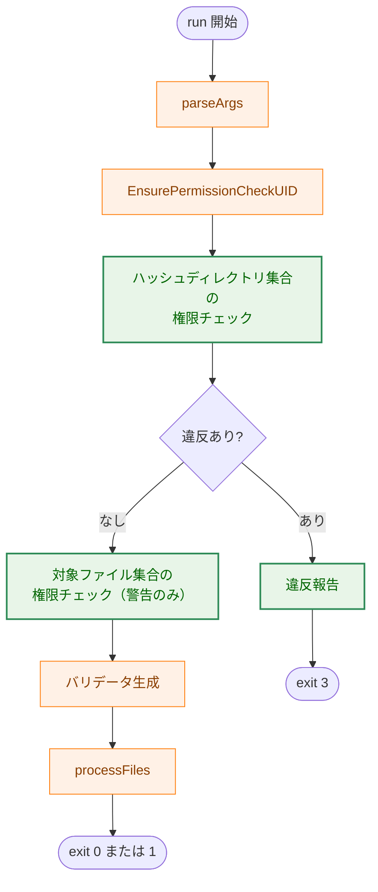

矢印 A → B は「A の次に B を実行すること」を表す。判定ノードから出る矢印のラベルは判定結果を表す。2つの権限チェックはいずれも `checkDirPermissions` の内部で行われる（§3.4）。`parseArgs` はハッシュディレクトリの作成を含み、これは権限チェックより前に完了する（§4.3）。

**Legend**


---

## 7. テスト戦略

### 7.1 単体テスト

- **`internal/logging/runid_test.go`**: 受理形式の境界（長さ1、長さ64、長さ65）、許可文字の全種別、拒否ケース（`/`・`..`・空白・実際の改行文字・NUL・ESC・マルチバイト文字・空文字列）、`RunIDFormatDescription` が受理形式を正しく説明していること、および「返されたエラーに入力値が原文の部分文字列として現れないこと」。最後の観点は P-2 を守る要であるため拒否ケースごとに検査する。§3.1 の方針により違反バイト1個の `%q` 表現はエラーに含まれるため、この主張は「原文のまま（未エスケープで）現れないこと」として検査する。
- **`cmd/runner/main_test.go`**: `resolveRunID` の全分岐（未指定・空文字列・受理・拒否）。
- **`cmd/runner/startup_privilege_test.go`**: §7.2 の振る舞いテスト。
- **`internal/runner/bootstrap/logger_test.go`**: 不正な `RunID` を渡すとエラーが返り、ログディレクトリにファイルが1件も作られないこと（AC-11・AC-12）。
- **`cmd/verify/main_test.go`**: ハッシュディレクトリ側の違反ありで exit 3 かつ `Verify` が1件も呼ばれないこと、違反なしで従来どおりであること。既定ディレクトリのケースは `toctouChecker` に違反を返すスタブを注入して駆動し、CI ホストの実ディレクトリ権限に依存させない。`-hash-dir` 明示のケースは実際の world-writable ディレクトリでも駆動する（AC-19〜AC-23）。
- **`cmd/verify/main_test.go`（適用範囲の限定）**: 対象ファイルの親ディレクトリのみが world-writable で、ハッシュディレクトリは健全という構成で、exit 3 にならず全ファイルが検証されること（AC-28）。既存の `TestRunTOCTOU_ContinuesOnWorldWritableDir` がまさにこの構成であり、アサーションは変更せずコメントと名前のみ更新して AC-28 の検証テストとする（§3.6）。fail-closed 側はハッシュディレクトリを world-writable にした構成で新設する。

**既定ハッシュディレクトリを使う既存テストへの影響**

`checkDirPermissions` が fail-closed になることで、既定ハッシュディレクトリを使うテストは実際のファイルシステムに依存するようになる。該当するのは [`TestRunUsesDefaultHashDirectoryWhenNotSpecified`](../../../cmd/verify/main_test.go#L129) である。同テストは `mkdirAll` のみスタブして `run()` を呼ぶため、変更後は `cmdcommon.DefaultHashDirectory`（既定値 `/usr/local/etc/go-safe-cmd-runner/hashes`）とその祖先に対して本物の権限チェックが走る。

多くの環境では、ハッシュディレクトリ自体が存在せず（`RunTOCTOUPermissionCheck` は存在しないディレクトリを読み飛ばす）、`/usr/local`・`/usr`・`/` は root 所有 `0755` のため違反にならない。しかしこの結果は**テストを実行するホストの `/usr/local` の所有者と権限に依存する**。ホスト構成が変われば同じテストが落ちる。

したがって、既定ハッシュディレクトリを経由するテストには `toctouChecker` に「違反を返さないスタブ」を注入し、ホスト非依存にする。`record` は既に fail-closed であり、違反なしのケースでも同じくスタブを注入している（[cmd/record/main_test.go:316](../../../cmd/record/main_test.go#L316)）。この先例に揃える。

**方針**: `cmd/verify` において `checkDirPermissions` に到達するテストは、検査結果を主張したいテストであるか否かを問わず、必ず `toctouChecker` を注入する。実ファイルシステムの権限に依存してよいのは、`-hash-dir` に自分で作成した一時ディレクトリを渡し、その権限を意図的に操作するテストだけとする。

### 7.2 特権降格の検証方法（AC-14〜AC-16）

**振る舞いテスト（AC-15・AC-16・AC-18）**: §5.2 のとおり降格先 ID を引数化することで、syscall を差し替えずに失敗経路を検証する。

- 非特権ユーザーで `dropStartupPrivileges(os.Getuid(), 0)` を呼ぶと `syscall.Setegid(0)` が `EPERM` で失敗する。戻り値の `*startupPrivilegeError` の `Stage` が `stageSetegid` であること、かつ `syscall.Geteuid()` が呼び出し前から変化していないこと（＝ `Seteuid` へ進んでいないこと）を主張する。これが AC-15 の実質である。
- `reportStartupPrivilegeFailure` に合成したエラーを渡し、`ErrorTypePrivilegeDrop` として報告されること、報告に含まれる run ID が空でなく `ValidateRunID` を通過すること（AC-18）、失敗した段階がメッセージから判別できること、戻り値が非0であることを主張する。
- root で実行された場合は `Setegid(0)` が成功してしまうため、このテストは非特権ユーザーでのみ意味を持つ。実効ユーザーIDが 0 のときは `t.Skip` する。

**静的検証（AC-14）**: `cmd/runner` にガードテストを置き、次を主張する。

1. `dropStartupPrivileges` の本体で `syscall.Setegid` の呼び出しが `syscall.Seteuid` の呼び出しより前に出現する。
2. `main` の本体で `dropStartupPrivileges` の呼び出しが `flag.Parse` の呼び出しより前に出現する。
3. `cmd/runner` の製品コードに現れる識別子変更系 syscall は、`dropStartupPrivileges` 内の2つだけである（許可リスト方式）。
4. `cmd/runner` の `init()` 関数が現在の1個から増えていない（§3.2.2 の残存面が黙って広がらないようにする）。

主張1・2は関数の**本体**を対象とすることに注意する。降格処理は `dropStartupPrivileges` に切り出されるため、`main` の本体を走査しても `Setegid`／`Seteuid` は見つからず、主張が空振りで成功してしまう。走査対象の取り違えは、セキュリティガードとして最も危険な失敗のしかたである。

**共通部品の拡張が必要**: 主張3は既存の [identitymutationguard](../../../internal/testutil/identitymutationguard/helpers.go) がそのまま提供する。しかし主張1・2は現状の共通部品では表現できない。

- `CallSite` は `{FuncName, SyscallName, CallExpr string}` であり、**位置情報を持たない**。したがって「A が B より前」を判定できない。
- `isTrackedImportPath` は import パスを `syscall`／`unix` に限定しており、`flag.Parse` は追跡対象にできない。

したがって `identitymutationguard` に次の拡張を加える（§3.7 に変更ファイルとして計上済み）。

- `CallSite` に位置情報（`token.Pos` 相当）を追加し、呼び出し順序を判定できるようにする。
- 追跡対象の関数集合を呼び出し側から追加指定できるようにし、`flag.Parse` を対象に含められるようにする。

この拡張は `internal/runner/resource` と `internal/runner/base/risktypes` の既存ガードテストにも影響するため、既存の呼び出しが後方互換で動くこと（追加フィールドは既存の主張に影響しない）を確認する。

**要件プロセスガイドとの整合**: [requirements_process.md:193](../../dev/developer_guide/requirements_process.md#L193) は「a `static` check alone is sufficient **only for criteria that are purely about textual/documentation presence**」と定めている。AC-14 は振る舞いに関する基準であり、静的検証だけでは要件を満たさない。本設計では AC-14 の実行順序を静的検証で、AC-15・AC-16 の fail-closed 性を振る舞いテストで担保し、両者を合わせて AC-14〜AC-16 の検証とする。AC-14 単独については、静的検証を主たる手段とする。これは意図的な逸脱である。順序どおりに実行されれば降格は成功し、観測できる痕跡が残らないため、「実行時に順序を観測する」テストが成立しないためである。

### 7.3 統合テスト

- **`cmd/runner`**: `--run-id` の受理／拒否を、実際のフラグ解析経路を通して検証する。拒否ケースでは標準出力・標準エラー出力の全文を捕捉し、不正値が原文のまま含まれないことを主張する（AC-09）。ログディレクトリを指定したうえで、拒否後にディレクトリ内にファイルが存在しないことも検証する（AC-08）。
- **回帰**: 次が無変更で通過すること（AC-13・AC-17・AC-22）。
  - `cmd/runner/main_test.go` の `TestShortFlags`・`TestShortFlagsEquivalence`
  - `internal/runner/bootstrap/logger_test.go`（`SetupLoggerWithConfig` を7箇所で呼ぶ）
  - `internal/runner/bootstrap/environment_test.go`（直接2箇所、`SetupLogging` 経由3箇所）
  - `cmd/runner/integration_logger_test.go`（直接3箇所）
  - `cmd/verify/main_test.go` の TOCTOU 以外のテスト
  - 上記が渡す `RunID` 値は全数確認済みで、すべて `^[A-Za-z0-9_-]{1,64}$` を満たす。

### 7.4 セキュリティテスト

- パストラバーサル（`../../etc/cron.d/evil`、`/tmp/evil`、`..`）を `--run-id` に与え、ログディレクトリ外にファイルが作られないことをファイルシステム上で確認する。
- **実際の改行文字**を含む値（Go の文字列リテラルで `"x\nRUN_SUMMARY run_id=fake exit_code=0"`）を argv 要素として与え、標準出力に `RUN_SUMMARY` 行が1行しか現れないことを確認する。パーセントエンコード表記（`%0A`）は `%` が許可リスト外であるため別の理由で拒否され、改行の扱いを検査したことにならない。
- `bootstrap.SetupLoggerWithConfig` を入口検証を経ずに直接呼び、同じパストラバーサル値でファイルが作られないことを確認する（AC-12）。

### 7.5 Acceptance Criteria とテストの対応

| AC | 検証方法 | 主な検証場所 |
|---|---|---|
| AC-01, AC-02, AC-03 | test | `cmd/runner/main_test.go`（`resolveRunID`） |
| AC-04, AC-05, AC-06, AC-07 | test | `internal/logging/runid_test.go`, `cmd/runner` 統合テスト |
| AC-08 | test | `cmd/runner` 統合テスト（`invalid_run_id` トークンとファイル非作成） |
| AC-09 | test | `internal/logging/runid_test.go`（エラー文字列）, `cmd/runner` 統合テスト（出力全文） |
| AC-10 | test | `cmd/runner` 統合テスト |
| AC-11, AC-12 | test | `internal/runner/bootstrap/logger_test.go` |
| AC-13 | test | 既存の5ファイルが無変更で通過（§7.3） |
| AC-14 | static | `cmd/runner/startup_order_guard_test.go`（§7.2 の逸脱理由を参照） |
| AC-15, AC-16 | test | `cmd/runner/startup_privilege_test.go`（実 syscall の `EPERM`） |
| AC-17 | test | 既存 `cmd/runner/main_test.go` が無変更で通過 |
| AC-18 | test | `cmd/runner/startup_privilege_test.go` |
| AC-19, AC-20, AC-21, AC-23 | test | `cmd/verify/main_test.go`（ハッシュディレクトリを world-writable にした新設テスト） |
| AC-22 | test | 既存 `cmd/verify/main_test.go` が無変更で通過 |
| AC-28 | test | `cmd/verify/main_test.go`（対象ファイル側のみ違反の構成。既存 `TestRunTOCTOU_ContinuesOnWorldWritableDir` を転用） |
| AC-24, AC-25, AC-26, AC-27 | static | 文書の記載確認 |

---

## 8. 実装優先順位と移行

### 8.1 実装フェーズ

3つの機能は相互に独立しており、並行して実装できる。ただし F-001 と F-002 は `logging.ValidateRunID` を共有するため、Phase 1 を先に完了させる。

| Phase | 内容 | 対応 F | 前提 |
|---|---|---|---|
| 1 | `internal/logging/runid.go` と `ErrorTypeInvalidRunID` の追加、`GenerateRunID` の移設 | F-001, F-002 の基盤 | なし |
| 2 | `identitymutationguard` の拡張（位置情報と追跡対象の指定） | F-003 の基盤 | なし |
| 3 | `cmd/runner` の起動順序変更・`resolveRunID`・ガードテスト・振る舞いテスト | F-001, F-003 | Phase 1, 2 |
| 4 | `bootstrap.SetupLoggerWithConfig` の多層防御 | F-002 | Phase 1 |
| 5 | `cmd/verify` の fail-closed 化（判定対象の2分割を含む）とテストの追加・更新 | F-004 | なし |
| 6 | 利用者向け文書・CHANGELOG・用語集の更新 | F-005 | Phase 3〜5 |

Phase 5 は他と依存関係がないため、Phase 1 と並行して着手できる。

### 8.2 移行と後方互換性

本タスクは2つの破壊的変更を含む。`--run-id` の形式厳格化は、影響を受ける利用者が「自分の CI が渡している値」を見れば判定できるため、CHANGELOG に受理形式を明記すれば足りる。一方 `verify` の fail-closed 化については、自分の環境が影響を受けるかどうかを利用者が**事前に知る手段が現状ない**。

- `verify` は `slog.SetDefault` を呼ばないため、現行の WARN は既定ハンドラ経由で標準エラー出力に出る。利用者向け文書が示す運用パターン（`if verify ...; then`、GitHub Actions での実行）では標準エラー出力は成功時に読まれないため、実質的に「今日すでに違反が出ている」ことに気づけない。
- したがってアップグレードで初めて exit 3 に遭遇することになる。

対策として、CHANGELOG（AC-26）に**アップグレード前に影響有無を判定する手順**を記載する。具体的には、現行版の `verify` を実行し、標準エラー出力の `TOCTOU permission check violation` 警告のうち**ハッシュディレクトリまたはその祖先を指すもの**があるかを確認する手順を示す。判定対象がハッシュディレクトリ側に限定されている（§9）ため、確認すべきパスは通常1本の祖先チェーンだけであり、利用者の負担は小さい。

この限定により、影響を受ける利用者の範囲そのものも大きく狭まる。`sudo verify` で利用者のホームディレクトリ配下のファイルを検証する運用（利用者向け文書が示す使い方）は、ハッシュディレクトリが健全であれば従来どおり動作する。

**バイパス手段は設けない**。`record` が「No bypass flag is provided; fix the directory permissions with chmod and re-run」という方針を採っており（[cmd/record/main.go:97-98](../../../cmd/record/main.go#L97-L98)）、同じ信頼の起点を守る `verify` で方針を変える理由がない。違反が正当で修正できない場合の唯一の対処は、ハッシュディレクトリを権限の適切なパスへ移すことである。この点も CHANGELOG と利用者向け文書に明記する。

---

## 9. fail-closed の適用範囲をハッシュディレクトリに限定する理由

`verify` の fail-closed が「TOCTOU チェックの全違反」ではなく「ハッシュディレクトリとその祖先ディレクトリの違反」に限定されているのは、次の制約と信頼モデルによる。この節は §3.4 の設計判断の根拠であり、実装時に範囲を広げてはならない理由を示す。

> この限定は設計中に判明した §9.1 の事実を受けたものであり、要件側は AC-19 の改訂と AC-28 の追加として反映済みである（`01_requirements.md` の Document Status を参照）。

### 9.1 制約: 権限チェックは `sudo` 実行時に実 UID を root と見なす

`security.RunTOCTOUPermissionCheck` が呼ぶ `ValidateDirectoryPermissions` は、比較対象の UID として `os.Getuid()` を直接読む（[dir_permissions_unix.go:41](../../../internal/security/dir_permissions_unix.go#L41)）。一方 `cmd/verify` は「`sudo verify ...` として起動される」ことを前提に `SudoUIDAware` ポリシーを宣言している（[cmd/verify/main.go:32-34](../../../cmd/verify/main.go#L32-L34)）。

`sudo` 経由では `os.Getuid()` が 0 になるため、所有者書き込み可の判定（[dir_permissions_unix.go:165-169](../../../internal/security/dir_permissions_unix.go#L165-L169)）は「root 以外が所有する書き込み可能ディレクトリ」をすべて違反と見なす。つまり `sudo verify ~/bin/script.sh` は、`/home/alice`（uid 1000 所有）で違反を出す。これは利用者向け文書が示す使い方であり（[verify_command.ja.md:133](../../user/verify_command.ja.md)）、攻撃でも設定ミスでもない。同文書 :599 は、権限エラーの対処として `sudo` の付与をむしろ推奨している。

現状この違反は破棄される WARN なので実害がない。しかし全違反を fail-closed の対象にすると、この正当な利用が exit 3 と「検証結果は信頼できない」というメッセージで停止する。同じファイルシステム状態に対して `verify foo` と `sudo verify foo` が別の終了コードを返すことにもなり、結果が実行方法に依存する。

### 9.2 信頼モデル: 信頼が崩れるのはハッシュディレクトリ側だけである

そもそも「対象ファイルの祖先ディレクトリが書き込み可能である」ことは fail-closed の理由にならない。要件定義書 M-3 の信頼モデルがその根拠である。

ハッシュディレクトリは信頼の起点であり、ここが書き換え可能ならハッシュ記録を差し替えられるため、検証結果に意味がなくなる。これに対し対象ファイルが書き込み可能なディレクトリに置かれていることは、`verify` がまさに改ざんの有無を確かめるべき状況そのものである。ハッシュ記録が保護されている限り、書き換えられたファイルは検証失敗（exit 1）として正しく報告される。検証を拒否したのでは、`verify` は自分の仕事を放棄することになる。

したがって適用範囲の限定は、§9.1 の誤検知を避けるための妥協ではなく、fail-closed が守るべき資産を正しく捉えた結果である。

### 9.3 この限定によって残るもの

対象ファイル側の違反は従来どおり警告として記録され、検証は継続する（AC-28）。オンコール担当者から見ると、ログレベルが「実行を止めたかどうか」に対応する（§3.4）。

なお §9.1 の制約そのもの（`sudo` 実行時に実 UID を root と見なすこと）は解消していない。ハッシュディレクトリを利用者のホームディレクトリ配下に置いて `sudo verify` を実行すると、依然として fail-closed になる。これは「root 以外が書き込めるハッシュディレクトリ」であり、限定後の判定基準では正しい fail-closed である。基準 UID の解決結果を `DirectoryPermCheckOptions.RealUID` へ渡す改修は、共有部品 `internal/security` の挙動変更にあたり要件のスコープ外であるため、本タスクでは扱わない。

---

## 10. 将来の拡張性

- **受理形式の変更**: 形式の定義が `internal/logging/runid.go` の1箇所に集約されるため、将来より厳しく（または緩く）する場合の変更点は1ファイルに閉じる。入口検証と多層防御が同じ関数を使うため、両者が食い違うことはない。
- **GID の不可逆な降格**: `dropStartupPrivileges` は「起動時に手放す識別子」を1箇所に集めた関数であるため、§5.3 に挙げた saved-set-gid の不可逆化や補助グループの降格を追加する場合の変更点が明確である。その際は §7.2 のガードテストの許可リストに1エントリを加えることになり、変更が意図的であることがレビューで可視化される。
- **他コマンドへの `--run-id` 展開**: `record`・`verify` に将来 `--run-id` を追加する場合、`logging.ValidateRunID` をそのまま呼べばよい。
- **TOCTOU チェックの共通化**: ハッシュディレクトリに関する違反の扱いが全4呼び出し元で揃うため、L-2 の解決時に「絶対パス化・収集・チェック・違反報告」をまとめた共通ヘルパーへ集約しやすくなる。その際は、`verify` が必要とする「ハッシュディレクトリ集合と対象ファイル集合を分けて扱う」という区別を共通ヘルパーの引数として表現することになる。本タスクはその前提条件を整える位置づけになる。

---

## 付録A: 決定履歴

> 本文は現行の設計を記述している。以下は本書作成時に検討して採用しなかった案とその理由であり、実装時の判断材料としてのみ参照すること。

| 検討した案 | 不採用の理由 |
|---|---|
| `--run-id` を厳密な ULID に限定する | 利用者向け文書が推奨する外部システム連携の例4件すべてが拒否され、フラグの存在意義が失われる（§1.3 D-1） |
| `verify` の fail-closed を exit 1 とする | `verify` の exit 1 は既に「検証失敗」を意味しており、本設計が守る対象である監視スクリプトが両者を区別できなくなる（§1.3 D-2） |
| `verify` の fail-closed を exit 2 とする | Go ランタイムが未捕捉 panic に exit 2 を使い、`verify` には到達可能な panic が2箇所ある。「違反」と「クラッシュ」が同じコードになる（§1.3 D-2） |
| `syscall.Setegid`／`Seteuid` をパッケージ変数で差し替え可能にする | このリポジトリのセキュリティガードが危険と見なす「識別子変更関数への値参照」を、setuid-root バイナリに新設することになる。降格先 ID の引数化で同等のテスト到達性が得られる（§5.2） |
| AC-15・AC-16 を静的検証のみで担保する | 要件プロセスガイドは振る舞いに関する基準に静的検証のみを認めていない。降格先 ID の引数化により実 syscall での検証が可能（§7.2） |
| `bootstrap` 側の多層防御を `filepath.Base(runID) == runID` で独自実装する | 「安全な run ID」の定義が2箇所に分かれ、片方だけが更新されて防御に穴が開く（§3.3） |
| `verify` の TOCTOU 前処理を `record` と共通化する | 重複部分は監査所見 L-2 の対象であり、要件定義書でスコープ外と定められている（§3.4） |
| TOCTOU チェックの全違反を fail-closed の対象とする（改訂前の AC-19） | `sudo verify ~/bin/script.sh` のような文書化された正当な利用が停止する。fail-closed が守るべき資産はハッシュディレクトリであり、対象ファイル側の書き込み可能性は `verify` が検出すべき状況そのものである（§9） |
| `DirectoryPermCheckOptions.RealUID` に基準UIDの解決結果を渡す改修で §9.1 の制約を解消する | 共有部品 `internal/security` の挙動変更にあたり、要件定義書でスコープ外と定められている（§9.3） |
| `verify` に `record` の `deps` 構造体を持ち込む | `verify` は既にパッケージ変数による差し替え方式を採っており、二重の注入方式が並立する（§3.4） |
| 拒否メッセージに不正値を全体としてエスケープして含める | 値全体を出力すると、エスケープ処理の欠陥がそのまま注入経路になる。違反バイト1個の `%q` 表現に限定すれば、診断可能性を得つつ P-2 を保てる（§3.1） |
