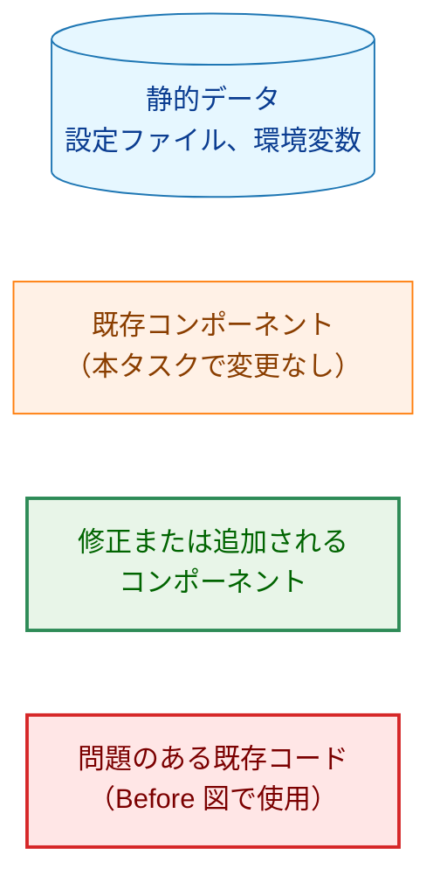
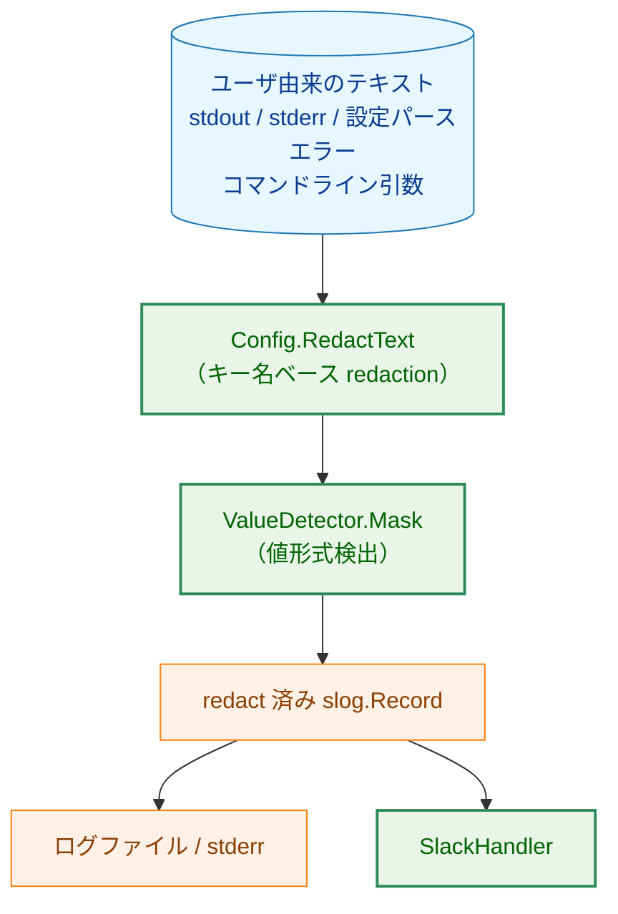
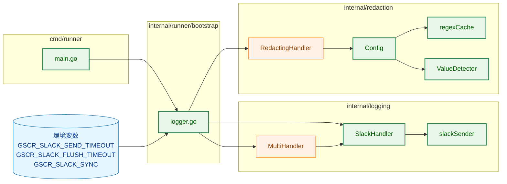
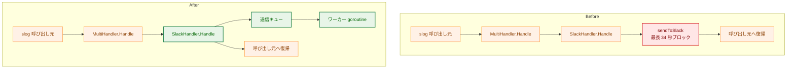
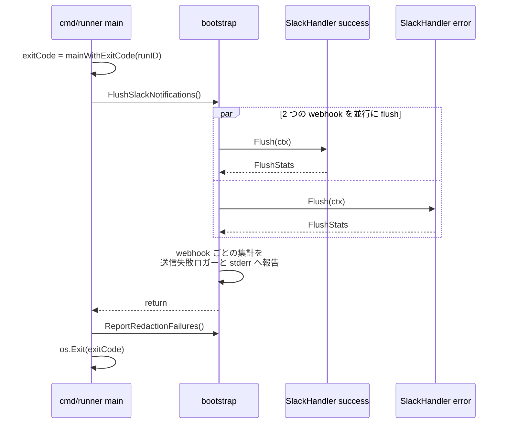
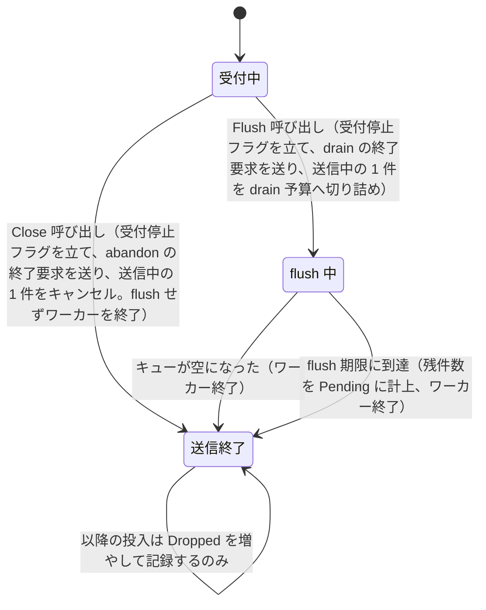
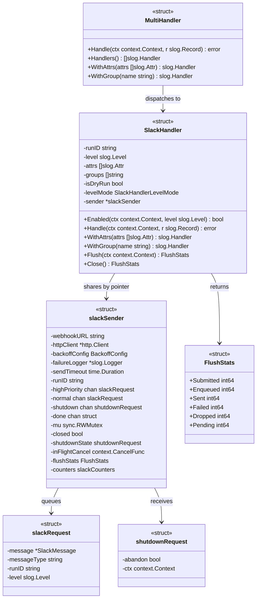
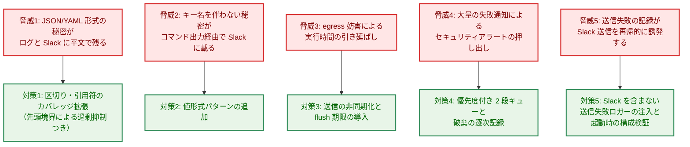
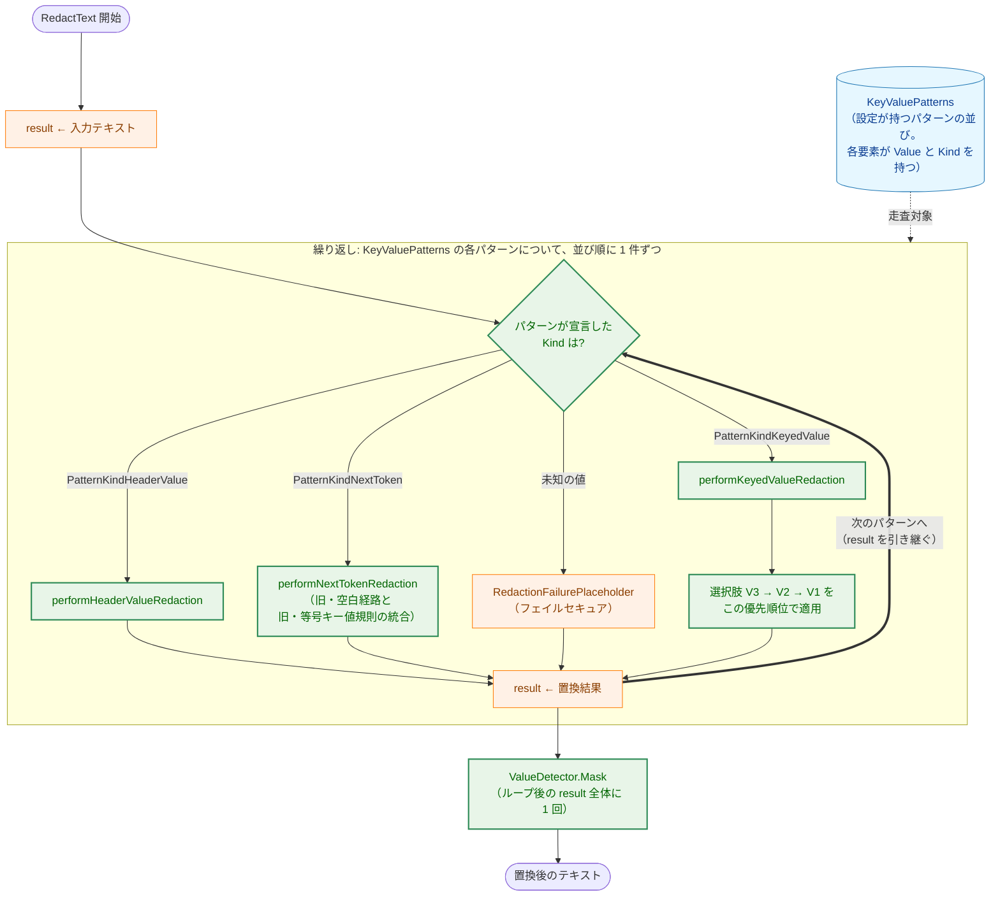
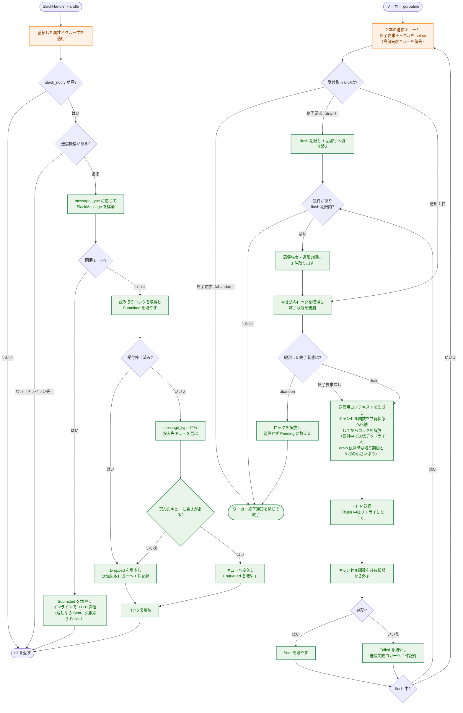

# アーキテクチャ設計書: redaction のカバレッジ拡張と Slack 送信の非同期化

## Document Status

| Item | Value |
|---|---|
| Status | `approved` |
| Created | 2026-08-07 |
| Review date | 2026-08-09 |
| Reviewer | isseis |
| Comments | - |

## 用語

本書で繰り返し使う語を先に定義する。

| 用語 | 意味 |
|---|---|
| キー名ベース redaction | `password` のようなキー名を手掛かりに、その直後の値を置換する層。`Config.RedactText` が `KeyValuePatterns` の各キーについて適用する |
| 値形式検出 | キー名の文脈なしに、値そのものの形式（`AKIA...`、PEM ブロック等）から秘密を判定する層。`ValueDetector.Mask` が担う |
| 区切り | キー名と値の間に置かれる文字列。`=` または `:` と、その前後に置かれてもよい空白（半角スペースと水平タブ）からなる |
| キー名の先頭境界 | キー名の直前に許される文字の条件。`monkey` の中の `key` のような部分一致を防ぐために課す。0154 が定義した「境界 redaction」（呼び出し境界で `RedactText` を適用すること）とは別の概念である |
| 送信キュー | Slack 送信要求を貯めるバッファ付きチャネル。`SlackHandler.Handle` が投入し、ワーカー goroutine が取り出す |
| ワーカー | 送信キューから要求を取り出し、HTTP 送信とリトライを行う goroutine |
| 送信機構 | 1 つの webhook 設定に対する送信キュー・ワーカー・カウンタをまとめて所有する内部構造（`slackSender`）。`WithAttrs` / `WithGroup` で派生した `SlackHandler` はこれをポインタで共有する（3.4.4） |
| flush | プロセス終了時に、送信キューに残った通知を送り切る処理 |
| flush 期限 | flush 全体に許す時間の上限。既定は 15 秒で、`GSCR_SLACK_FLUSH_TIMEOUT` で変更できる（3.4.6） |
| 受付停止 | `Flush` または `Close` の呼び出しにより、送信機構が新しい通知の受け入れをやめた状態。以降に到着した通知は破棄される（3.4.7） |
| 終了要求 | 待機中のワーカーを起こして終了させるために送る制御メッセージ。終了モード（`drain` / `abandon`）と flush 期限を運ぶ（3.4.7） |
| `drain` / `abandon` | 終了モードの 2 値。`drain` は `Flush` から送られ、残件を送信してから終了する。`abandon` は `Close` から送られ、送信せず直ちに終了する |
| 破棄 | 送信キューが満杯、または受付停止後の到着により、通知を送信せずに捨てること |
| 送信失敗ロガー | Slack 送信の失敗・破棄を記録するためのロガー。`SlackHandler` を含まない出力先だけで構成される。`NewSlackHandler` が `bootstrap` から渡された Phase 1 の葉ハンドラ（`phase1BaseHandlers`。`phase1FailureLogger` と同じ材料）から構築する |

## 凡例（本ドキュメント共通）



各図は本凡例のクラス定義に従う。個別の凡例ブロックは省略する。開始・終了を表すスタジアム型ノードは制御の起点と終点を示すだけで、上記のいずれのクラスにも属さない。

## 1. 設計の全体像

### 1.1 設計原則

本タスクは 0149 監査 D2 の未対応 Medium 3 件（M-2 / M-4 / M-5）を、`internal/redaction` と `internal/logging` を中心とした変更で解消する。設計は以下を原則とする。

1. **既存挙動の非退行を優先する**: `RedactText` は任意のテキストに適用されるため、拡張は「これまで置換されなかった秘密を置換する」方向に働かせ、既存テストが固定している文字列は変えない。
2. **過剰 redaction を悪化させない**: 区切り文字の拡張はマッチ機会を増やすため、キー名の先頭境界という抑制条件を同時に導入する。抑制しきれず新たに置換される範囲が残る場合は、その範囲を具体例とともに明示し、意図した変更として文書化する。
3. **外部サービスをクリティカルパスから外す**: Slack への HTTP 送信は呼び出し元の goroutine から切り離す。ログ呼び出しが要するのはキューへの投入だけとする。
4. **重要な通知を優先する**: 通知が捨てられる状況では、セキュリティアラートのような重要度の高い通知が、実行サマリのような日常的な通知に押し出されないようにする。
5. **失敗を構造的に観測可能にする**: 非同期化により送信失敗は戻り値から消える。代わりに、Slack を含まない出力先へ必ず記録され、プロセス終了時に集計が報告される経路を用意する。投入・送信・失敗・破棄・残件の各カウンタは、合計が一致する形で定義する。
6. **再入を構造的に不可能にする**: 送信失敗の記録が新たな Slack 送信を誘発しないことを、実行時の判定ではなく、送信失敗ロガーの構成検証（起動時）によって保証する。
7. **DRY**: 既存の `Config.RedactText`、`ValueDetector`、`MultiHandler`、`bootstrap` の Phase 1 ハンドラ構成をそのまま再利用し、同等の仕組みを別実装しない。

### 1.2 概念モデル

機密情報が外部へ到達する経路と、本タスクが強化する地点を示す。



**矢印の意味**: A → B は「A の出力が B の入力になる」ことを表す。

本タスクが変更するのは緑で示した 3 つである。`Config.RedactText` は区切りと引用符のカバレッジを広げ（M-2）、`ValueDetector.Mask` は検出できる秘密の形式を増やし（M-4）、`SlackHandler` は送出をログ呼び出し元から切り離す（M-5）。

### 1.3 設計判断の一覧

01_requirements.md の「検討事項」に対する決定を先にまとめる。各判断の根拠は該当する節で述べる。

| 検討事項 | 決定 | 根拠を述べる節 |
|---|---|---|
| 引用符なしで空白を含む値の扱い | 現行どおり最初の空白で止める | 3.2.2 |
| 区切り文字拡張の適用範囲 | 2 種類の先頭境界を用意し、キーを 3 群に分けて使い分ける。一般的な英単語であるキーには厳しい先頭境界を課す | 3.2.4 |
| 引用符の対応範囲 | `"..."` と `'...'` の 2 種。エスケープされた引用符は非対応。閉じ引用符がない場合は行末まで置換する | 3.2.5 |
| 既存 3 規則の統合可否 | 統合しない。キー値規則のみ拡張する。ただしどの規則を使うかはパターンが `Kind` として宣言し、キー文字列の形から導出しない | 3.2.1 |
| 正規表現の事前コンパイル | `NewConfig` が各パターンをコンパイルし `Config` が保持する（当初は上限付きキャッシュ。3.2.9 を受けて変更） | 3.2.7 |
| JWT パターンの誤検出 | ドット 2 個固定、先頭 2 セグメントに最小長を課し、署名部は空を許す | 3.3.2 |
| Slack webhook URL パターンの採否 | 採用する。TOML の `slack_allowed_host` を注入し、同ホスト配下の全パスを対象とする。固定パターンは持たない | 3.3.3 |
| 非同期化の方式 | 優先度 2 段のバッファ付きキュー ＋ ワーカー 1 本。満杯時は同一優先度の新しい通知を即時破棄する | 3.4.2 |
| デッドラインの設計 | 実行中は 1 件あたり 40 秒（既存のリトライ方針を維持）、flush 中は 1 件 1 回試行、flush 全体で 15 秒 | 3.4.6 |
| 破棄・失敗の記録経路 | `bootstrap` が Slack を含まない葉ハンドラの並びを注入し、`NewSlackHandler` が起動時に検証してロガーを構築する | 3.4.8 |
| flush の公開インターフェース | `SlackHandler.Flush` を公開し、`bootstrap` が生成済みハンドラを保持して呼ぶ | 3.4.9 |
| `WithAttrs` / `WithGroup` とワーカーの共有 | 派生インスタンスは送信機構（キューとワーカー）をポインタで共有する | 3.4.4 |
| ドライラン時の扱い | `Handle` 内の投入前で分岐し、送信機構自体を生成しない | 3.4.10 |
| `error` 値のログ属性（実装時に発見した欠陥） | `Error()` の結果を文字列として redaction する。構造体として歩かない | 3.7 |

### 1.4 不変条件マップ

| 不変条件 | 現状 | 本タスク後 |
|---|---|---|
| `key: value` / `key = value` / `"key": "value"` の値が置換される | 未保証（D2 M-2） | 保証（F-001。ただし 3.2.4 の群分けによる限定あり） |
| 引用符で囲まれ空白を含む値が、閉じ引用符まで置換される | 未保証（D2 M-2） | 保証（F-001） |
| 拡張により新たに置換される範囲が、明示した 1 ケースに限られる | 該当なし | 保証（F-002、3.2.6） |
| GitHub fine-grained PAT / 追加の Slack プレフィックス / JWT が値形式で検出される | 未保証（D2 M-4） | 保証（F-003） |
| 1 回のログ呼び出しが Slack の応答時間に依存しない | 未保証（D2 M-5） | 保証（F-004） |
| プロセス終了が有限時間で完了する | 保証（同期送信の最大 34 秒を含む） | 保証（flush 期限 15 秒） |
| 送信失敗・破棄が Slack を含まない出力先に記録される | 未保証（`slog.Default()` 経由） | 保証（F-006） |
| 投入要求の総数が、キュー投入分と破棄分の和に一致し、キュー投入分が送信・失敗・残件の合計と一致する | 該当なし | 保証（3.4.7） |
| 通知の内容が、Slack への投入前にログファイルへ書き終わっている | 保証（ハンドラの登録順による） | 維持（2.4。強制終了時に配送は失われても内容は残る） |

## 2. システム構成

### 2.1 全体アーキテクチャ



**矢印の意味**: A → B は「A が B に依存する、または B を呼び出す」ことを表す。`MultiHandler` から `SlackHandler` への辺は `slog.Handler` としての委譲であり、現行の実装どおりである。

### 2.2 Before / After 比較: Slack 送信の同期性



**矢印の意味**: A → B は「A が B へ制御を渡す」ことを表す。After 図で `SlackHandler.Handle` から 2 本の矢印が出ているのは、キューへの投入と呼び出し元への復帰が同一の呼び出し内で完結することを表す。

### 2.3 プロセス終了時のデータフロー

`bootstrap.AddSlackHandlers` は成功通知用とエラー通知用の 2 つの `SlackHandler` を生成しうる。両者はそれぞれ独立した送信機構（キューとワーカー）を持つため、flush も集計も webhook ごとに行う。



flush を `ReportRedactionFailures` より前に置く理由は、`run` の実行中に発行された Slack 宛レコードを先に送り切るためである。`ReportRedactionFailures` の出力先は送信失敗ロガーと stderr であり Slack を含まないため、この順序で新たな未送信通知が生じることはない。

### 2.4 プロセス終了の種別と通知の損失範囲

非同期化により、送信キューに滞留した通知はプロセスが消えれば失われる。同期送信では 1 件ずつ送り切ってから次へ進むため、失われるのは送信中の 1 件だけだった。この差を終了の種別ごとに整理する。

| 終了の種別 | flush の有無 | 失われる通知 |
|---|---|---|
| 正常終了（`run` が復帰） | 行う | flush 期限内に送り切れなかった分（件数を報告） |
| SIGTERM / SIGINT（`systemctl stop`、通常の `reboot`、Ctrl-C） | 行う | 同上 |
| flush 実行中の 2 回目の SIGINT | 行わない | キューの残り全部 |
| 回復されない panic | 行わない | キューの残り全部 |
| SIGKILL、OOM kill、電源断、ハードウェア障害 | 行わない | キューの残り全部 |

**通常のリブートは flush される**。`cmd/runner` は `signal.NotifyContext` で SIGINT と SIGTERM を捕捉しており、`systemctl stop` や `reboot` が最初に送るのは SIGTERM である。したがってシグナル受信 → `run` の復帰 → flush という経路をたどる。systemd の既定の停止猶予（`TimeoutStopSec`、通常 90 秒）は flush 期限（15 秒）より十分に長いため、猶予内に flush が完了する。ただし `run` の後始末（一時ディレクトリの削除等）に時間がかかり猶予を使い切ると、SIGKILL が flush の前に届く。

**残る損失経路と、その大きさ**。上表の下 3 行では、キューに滞留していた通知がすべて失われる。滞留する件数は、通知の発生速度と Slack の応答速度の差で決まる。Slack が正常なら送信は毎秒 1 件程度で進み、滞留はほぼ発生しない（損失は実質 0〜1 件）。滞留が積み上がるのは、Slack が劣化しているか、失敗コマンドが大量に発生して通知が毎秒 1 件を超えて生成される場合である。前者では同期送信でも通知は届かないため、非同期化による正味の悪化は**後者、すなわち「Slack は正常だが通知の生成が送信より速い」状態で強制終了された場合**に限られる。

**通知内容そのものは失われない**: `MultiHandler` はハンドラを登録順に呼び、`AddSlackHandlers` は Phase 1 のハンドラ（コンソール・ログファイル）の**後ろ**に Slack ハンドラを追加する。したがって 1 件のレコードは、Slack のキューへ投入される前に JSON ログファイル（0600）へ同期的に書き終わっている。Slack への配送が失われても、`run_id` で特定できる完全な記録がログファイルに残る。この順序は本設計が依存する不変条件であり、Slack ハンドラを Phase 1 のハンドラより前に置く変更を禁じる。

**永続キューを導入しない理由**: プロセスの再起動をまたぐ再送は 01_requirements.md でスコープ外とされている。加えて、キューをディスクへ永続化すると、redact 済みとはいえ Slack へ送る本文をログファイルとは別のファイルに二重に置くことになり、保護すべきファイルが 1 つ増える。上記のとおり内容自体はログファイルに残るため、永続キューが救うのは「配送そのもの」だけであり、対価に見合わない。強制終了下でも配送を確実にしたい運用では、`GSCR_SLACK_SYNC=1`（3.4.11）で同期送信に戻す選択肢がある。

以上の損失範囲と、同期モードという選択肢は、利用者向け文書に記載する（AC-34）。

## 3. コンポーネント設計

### 3.1 変更対象と責任分割

| ファイル | 区分 | 責務 |
|---|---|---|
| `internal/redaction/redactor.go` | 変更 | `performKeyedValueRedaction` の区切り・引用符カバレッジ拡張（F-001, F-002）。`Config` のフィールド非公開化と `NewConfig` の追加（3.2.9） |
| `internal/redaction/regex_cache.go` | 新規のち削除 | 上限付きキャッシュ。3.2.7 の方針変更により事前コンパイルへ移行し、不要になった |
| `internal/redaction/value_detector.go` | 変更 | 値形式パターンの追加（F-003） |
| `internal/logging/handler_chain.go` | 新規 | 送信失敗ロガーに渡されたハンドラの Slack 非依存性の検証（3.4.8） |
| `internal/logging/slack_sender.go` | 新規 | 送信キュー、ワーカー、flush、カウンタ（F-004, F-005, F-006） |
| `internal/logging/slack_handler.go` | 変更 | `Handle` を投入のみに変更、`Flush` / `Close` の公開、送信失敗ロガーの構成検証（F-004, F-006） |
| `internal/runner/bootstrap/logger.go` | 変更 | 生成した `SlackHandler` の保持、送信失敗ロガーと環境変数由来設定の注入、`FlushSlackNotifications` の提供（F-005, F-006） |
| `cmd/runner/main.go` | 変更 | 正常終了経路での `FlushSlackNotifications` 呼び出し（F-005） |
| `docs/user/security-risk-assessment.ja.md` | 変更 | 値形式検出の対象一覧と限界、Slack 通知の配送方式（F-007, AC-33, AC-34） |
| `docs/user/security-risk-assessment.md` | 変更 | 上記の英語版。`/mktrans` で反映（AC-33, AC-34） |
| `docs/dev/architecture_design/security-architecture.md` | 変更 | `SlackHandler` の構造体定義を 2 箇所（§9 と §14）で再掲しており、`webhookURL` / `httpClient` / `backoffConfig` が `slackSender` へ移ることを反映する |
| `docs/dev/architecture_design/security-architecture.ja.md` | 変更 | 上記の日本語版。英語版と同じ 2 箇所を更新する |
| `docs/translation_glossary.md` | 変更 | 本タスクで導入した用語の追加（AC-35） |

#### 更新が必要な既存テスト

本設計は既存テストが前提としている構成・挙動のうち、以下を変更する。

| テスト | 変更内容 |
|---|---|
| `internal/logging/slack_handler_test.go` の `&SlackHandler{...}` 構造体リテラル構築（16 箇所） | 送信機構はコンストラクタでのみ生成されるため、`Handle` から送信経路へ到達するテストは `NewSlackHandler` による構築へ移行する。`WithAttrs` / `WithGroup` / `Enabled` のみを検証し送信経路へ到達しないテストは、3.4.3 の nil 送信機構の契約によりそのまま通る |
| `TestSlackHandler_Handle_WithMockServer` | サーバ障害時に `Handle` がエラーを返すことを検証している。非同期化後は投入に成功すれば `nil` を返すため、`Flush` を呼んでから `FlushStats.Failed` を検証する形に変更する |
| `TestSlackHandler_SendToSlack_Retry` | モックサーバがリクエストを受けたことを `Handle` 復帰直後に検証している。`Flush` を同期点として挟む形に変更する |
| `TestSlackHandler_WithRedactingHandler` | 構造体リテラルで構築したハンドラを `RedactingHandler` 越しに呼び、送信を同期的に検証している。`NewSlackHandler` による構築と `Flush` による同期点の両方が必要である |
| `TestNewSlackHandlerWithOptions` | 送信失敗ロガーの構成検証が加わるため、正常系のオプションに `FailureHandlers` を与えるケースと、`SlackHandler` を含む場合・検証できない型を含む場合にそれぞれ構成エラーになるケースを追加する |
| `TestNewSlackHandlerWithOptions` の削除フィールドへの直接参照（6 箇所） | `webhookURL` / `httpClient` / `backoffConfig` を 3.5 のとおり `slackSender` へ移すため、`handler.sender` 越しの参照へ書き換える。書き換えないとコンパイルできない |

`internal/logging/slack_handler_benchmark_test.go` は `SlackHandler` を構築せず、`slackSender` へ移す 3 フィールドも参照していないため（`createBenchmarkCommandResults` と `BenchmarkExtractCommandResults*` のみを含む）、変更を要しない。

`internal/redaction/redactor_test.go` の既存ケースは、3.2 の設計により期待値が変化しない（AC-08）。`performKeyedValueRedaction` のシグネチャも変更しないため、これを直接呼び出していた `TestPerformKeyValuePatternRedaction` はそのまま通った（同テストはステップ 2-7 で上位テストとの重複により削除）。`internal/redaction` と `internal/logging` の外で `RedactText` の結果を完全一致で検証しているテストは `internal/runner/base/security/logging_security_test.go`（`api_key=abc123def`、`Authorization: Bearer ...`）であり、いずれも隣接 `=` 形とヘッダー値規則のみを使うため影響を受けない。

### 3.2 キー名ベース redaction の拡張（F-001, F-002）

#### 3.2.1 3 規則の維持と、経路の宣言化

`performKeyValueRedaction` は 3 つの規則に分岐する。本設計はこの 3 分岐を維持し、キー値規則（`performKeyedValueRedaction`）のみを拡張する。

3 規則を統合しない理由は次の 2 点である。第 1 に、ヘッダー値規則は「行末まで置換し、`Bearer`/`Basic` のスキーム名を保持する」というキー値規則とは異なる終端規則を持ち、統合すると 1 つの生成規則に 2 種類の終端規則を同居させることになる。第 2 に、統合は AC-06・AC-07 が守るべき既存挙動を書き換えるリスクを持ち込むだけで、本タスクが解消すべき取りこぼしはキー値規則にしか存在しない（YAGNI）。

**どの規則を適用するかは、パターン文字列の形から導出せず、パターン自身が宣言する**（レビューで方針変更。当初はキー文字列に `:` / 空白 / `=` が含まれるかを `strings.Contains` で調べて振り分けていた）。`Config.KeyValuePatterns` の要素型を `string` から次の構造体へ変える。

```go
type PatternKind int

const (
    PatternKindKeyedValue  PatternKind = iota // キー名。区切り・引用符・値の範囲は redaction 側が解釈する
    PatternKindNextToken                      // 認証スキーム。直後の 1 トークンを置換する
    PatternKindHeaderValue                    // ヘッダー名。コロン以降を行末まで置換する
)

type KeyValuePattern struct {
    Literal string // 入力中で一致させるテキスト
    Kind    PatternKind
}
```

導出をやめる理由は 3 点である。第 1 に、パターンの意図（`DefaultKeyValuePatterns` のコメントが「キー」「特別扱いする資格情報」と書き分けていたもの）と、実際の振り分け（別ファイルの `strings.Contains`）が離れた場所にあり、両者が一致している保証がなかった。第 2 に、`Config.KeyValuePatterns` は公開フィールドであり、利用者がコロンや空白を含むキー名（`Primary key` など）を追加すると、意図しない規則へ黙って流れる。第 3 に、キー値規則の内部にあった「キーが `=` を含む場合」の分岐（下記）が、次トークン規則と同一の正規表現を生成しており、宣言化によってそのまま統合できる。

**`=` を含むキーの規則の帰属**: `Authorization=` のようにキーが `=` を含む場合の規則（キーの直後の非空白列を置換する）は、生成する正規表現 `(?i)(<エスケープ済み>)(\S+)` と置換処理が次トークン規則と完全に一致する。したがって**独立した規則としては持たず、`PatternKindNextToken` に統合する**。以降の 3.2.2〜3.2.6 は、キー値規則（`PatternKindKeyedValue`）についての設計である。

**フィールド名を `Value` にしない理由**: パターン文字列を保持するフィールドは `Literal` と名付ける。`internal/redaction` では「value」は一貫して**置換される秘密**を指しており（`unquotedValue`、`sepValue` / `adjValue`、`matchedValueSpan`、`IsSensitiveValue`）、パターン文字列を `Value` と呼ぶと意味が逆転する。`Kind` の定数名が `PatternKindKeyedValue` のように「何が置換されるか」を名乗るため、この衝突は文章にも現れる（「Value をキーとする値」）。`Literal` にすることで両者が両立する。

**`Kind` は literal の分類ではなく指示である**（レビューで判明）: 3 つの `Kind` は `Literal` の集合を分割しない。`"password="` のように、キー値規則でも次トークン規則でも一致しうる literal が存在する。したがって「どの `Kind` に当てはまるか」ではなく「どの `Kind` がそのテキストを正しく読むか」で選ぶ。判断基準は次のとおりである。

| `Literal` が指すもの | 選ぶ `Kind` |
|---|---|
| キー名（末尾に区切りを書いたかどうかを問わない） | `PatternKindKeyedValue` |
| ヘッダー名 | `PatternKindHeaderValue` |
| 名前ではなく、秘密が直後に続くトークン（認証スキーム） | `PatternKindNextToken` |

**キー形の literal では、キー値規則が次トークン規則を厳密に包含する**（実測で確認）。`"password="` を両方の `Kind` で比較すると、次トークン規則が置換する入力（`password=secret`、`xpassword=secret`、`PaSsWoRd=secret`）はキー値規則もすべて置換し、加えてキー値規則は `password: secret` / `password = secret` / `"password": "secret"` の 3 形を捕捉する。さらに引用符付きの値では、次トークン規則が最初の空白で止まって `password=[REDACTED] b"` と秘密の後半を平文で残すのに対し、キー値規則は閉じ引用符まで置換する。すなわちキー形の literal に次トークン規則を選ぶ理由は存在せず、選ぶと取りこぼす。次トークン規則が必要なのは `Bearer ` / `Basic ` のように **literal がそもそもキー名ではない**場合に限られる。この非対称性は `PatternKind` のドキュメンテーションコメントに記載する。

**未知の `Kind` の扱い**: `switch` の `default` は `RedactionFailurePlaceholder` を返す（フェイルセキュア）。宣言された集合の外の `Kind` は入力ではなくプログラミングエラーであり、解釈を推測するより出力を抑止するほうが安全である。これは正規表現のコンパイルに失敗した場合の既存の扱いと同じである。なお `PatternKindKeyedValue` をゼロ値に置くことで、`KeyValuePattern{Value: "password"}` のように `Kind` を書き忘れた場合は、最も仮定の少ないキー値規則に落ちる。

**この分岐はログを出さない**（レビューで判明）。`RedactText` は `RedactingHandler.Handle` の内側で動き、本番では `slog.Default()` がその `RedactingHandler` そのものである（`bootstrap.setupLogger`）。したがってここで `slog.Warn` を呼ぶと、警告自体が同じ `Config` を通って redact され、同じ `default` 分岐に再入して無限再帰する（実測でスタックオーバーフローを確認した）。`failureLogger` への迂回路は `Config` にはなく（`failureLogger` は `RedactingHandler` 側の資産である）、プレースホルダー自体が「redaction が抑止された」ことの可視の信号であるため、沈黙させる。この性質は回帰テストで固定する（7.1）。

**群分けは導出のまま**: 3.2.4 の群 A・群 B・群 C は `Kind` と違い、キー文字列から導出したままとする。ある語が英語の散文に頻出するかどうかはパターンの作者が宣言できる種類の事柄ではなく、言語の性質だからである（3.2.4、9 章）。

**規則が供給する区切りを `Literal` が重複して持つ場合**（レビューで判明）: キー値規則とヘッダー値規則はどちらも区切りを自分で生成するため、`"Authorization: "` や `"password="` のように区切りまで書かれた `Literal`（`PatternKind` 導入前の書き方）をそのまま使うと、区切りを 2 回要求する正規表現になり**何にも一致しない**。すなわち取りこぼす方向の失敗であり、秘密が平文のまま出る。

**正規化ではなく検証で落とす**（再レビューで方針変更。当初は `Literal` 末尾の空白・`:`・`=` を除去して正規化していた）。正規化は誤ったパターンを動くようにする一方で、**誤りと正しい定義を区別できなくする**。区別がつかなければ誤りは表面化せず、次に誰かがそのパターンを複製した時点で伝播する。代わりに `KeyValuePattern.validate()` を設け、次の 3 つを誤りとして報告する。

| 条件 | 返す番兵エラー |
|---|---|
| `Literal` が空 | `ErrPatternLiteralEmpty` |
| `PatternKindKeyedValue` / `PatternKindHeaderValue` の `Literal` 末尾が空白・`:`・`=` | `ErrPatternSeparatorRedundant` |
| `Kind` が宣言された集合の外 | `ErrPatternKindUnknown` |

`PatternKindNextToken` は 2 行目の対象外である。区切りを自分で持つことがその `Kind` の定義であり、重複しようがない。

**検証をどこで走らせるか**: `Config` はコンストラクタを持たない（3.2.7 の理由により、構造体リテラルでも構築されうる）ため、型として通過を保証できない。したがって次の 2 点で担保する。第 1 に `TestDefaultKeyValuePatterns_AreValid` が既定パターン全件を検証し、既定を壊す編集を CI で落とす。第 2 に `DefaultConfig()` が構築時に検証し、違反があれば panic する（`DefaultSensitivePatterns` が同じ状況で採っている扱いに揃える。プロセス開始時に 1 回だけ走るためコストはない）。`TestKeyValuePattern_RedundantSeparatorWouldFailOpen` は、検証が拒否するパターンが実際に何も置換しないことを固定し、この検証が様式の問題ではなく取りこぼしの防止であることを示す。

この検証をどう強制するかは 3.2.9 で扱う。

**ヘッダー値規則のパターンの正規化**: 既定パターンを `"Authorization: "` から `"Authorization"` へ変え、**コロンとその前後の空白を規則側の正規表現が供給する**（`(?i)(<ヘッダー名>)([ \t]*:[ \t]*)((?:bearer |basic )?)[^\r\n]*`）。従来はパターン文字列に含まれる `": "` がそのまま正規表現へ入るため、コロンの直後に空白がないヘッダーに一致しなかった。`Authorization:Bearer abc` が置換されていたのは次トークン規則の `"Bearer "` が拾っていたためであり、`authorization:abc123` のようにスキーム名を持たない形は**平文のまま残っていた**（`DefaultKeyValuePatterns` のコメントは「コロン規則が空白の有無を両方扱う」と記していたが、これは誤りであった）。宣言化と同時にこれを是正する。

これは振る舞いの変更であり、AC-09 の除外規定に該当する。新たに置換されるのは「ヘッダー名 + コロン」の形であって、ヘッダー名だけが散文に現れる形（`Authorization failed for user bob`）は正規表現がコロンを要求するため置換されない。取りこぼしの是正としてこの拡大を受け入れる。パターンの `Literal` はヘッダー名のみとする（末尾にコロンが書かれていた場合は上記の正規化が取り除く）。この契約は `PatternKindHeaderValue` のドキュメンテーションコメントに記載する。

#### 3.2.2 値の終端規則

引用符で囲まれていない値は、現行どおり最初の空白で終端する。行末まで置換する案は採らない。

**値の先頭が `{` または `[` の場合は V2 を適用しない**（実装時に追加した規則）。値がオブジェクトや配列のとき、区切りを `:` へ広げた V2 は「最初の空白で終端する」規則を満たす空白を持たないため、`{"password":{"a":1},"port":80}` のような空白のない構造化データで行の残り全体を飲み込み、兄弟フィールドを消して括弧の対応を壊す。この形では V2 を一致させず、拡張前と同じく無置換のまま残す。区切りが `=` の場合は V1 が従来どおり `\S+` として一致するため、既存の置換結果は変わらない（AC-08）。値そのものが機密であるケース（`password: {...}`）は取りこぼすが、値が構造化データであるということはその中の個々のフィールドがキー名ベースの層で個別に評価されることを意味するため、多層防御としての損失は限定的である。

採らない理由は、既存テストが固定している挙動と直接衝突するためである。`user=john password=secret token=abc123` は現在 `user=john password=[REDACTED] token=[REDACTED]` になるが、行末まで置換すると `user=john password=[REDACTED]` となり、後続の `token=` の捕捉自体が消える。同様に `password=secret Bearer token123` の既存期待値も崩れる。すなわち行末終端は AC-08 を満たせない。

**残存リスク**: 引用符なしで空白を含む値（`password=my secret phrase`）は 2 語目以降が平文で残る。値の終端を機械的に判定する手段がないため、この形式は redaction の限界として `docs/user/security-risk-assessment.ja.md` に記載する（AC-33）。

#### 3.2.3 値の形と選択肢の優先順位

キー値規則が扱う値の形を、次の 3 つに拡張する。

| 番号 | 形 | 例 | 現行 | 本タスク後 |
|---|---|---|---|---|
| V1 | 隣接した `=` と非空白値 | `password=secret` | 置換される | 置換される（変更なし） |
| V2 | 空白を含みうる区切りと非空白値 | `password: secret`、`password = secret` | 置換されない | 置換される |
| V3 | 引用符付きの値 | `password="abc def"`、`"password": "secret"` | 引用符内の最初の空白までしか置換されない | 閉じ引用符まで置換される |

3 つの形は互いに排他ではない。`password="abc def"` は V3 にも V1 にも同じ位置から一致し、V1 の一致（`password="abc`）は V3 の一致の真部分文字列である。Go の `regexp` は同一開始位置では先に書いた選択肢を優先するため、**選択肢の順序を V3 → V2 → V1 と定める**。この順序により、引用符付きの値は必ず V3 として扱われ、AC-01 が満たされる。

先頭境界（3.2.4）を満たさない入力は V3 と V2 のどちらにも一致せず、V1 へ落ちる。これは意図した挙動であり、既存の置換結果を保つために必要である。たとえば `monkey="a b"` は V1 として `monkey=[REDACTED] b"` になり、現行と同じ結果になる。

#### 3.2.4 キー名の先頭境界とキーの群分け

区切りを `:` と空白入りに広げると、キー名が無関係なテキストの一部に一致する機会が増える。これを防ぐため、**V2 と V3 にのみキー名の先頭境界を課す**。V1 には課さない。V1 に遡って課すことは D2 L-5（既存の過剰 redaction）の是正にあたり、01_requirements.md でスコープ外とされているためである。

先頭境界は 2 種類を用意し、キーを 3 群に分けて使い分ける。

| 群 | 先頭境界 | 意図 | 既定のキー |
|---|---|---|---|
| 群 A | テキストの先頭、または英数字以外の文字 | 語として具体的で、通常の文章に現れても機密の文脈である可能性が高い | `password`、`api_key` |
| 群 B | `_`、`-`、`.`、`"`、`'` のいずれか | 一般的な英単語であり、診断メッセージの散文中に頻出する | `key`、`token`、`secret` |
| 群 C | 課さない | キー自身が英数字以外の文字で始まり、環境変数名の接尾辞としての一致を意図している（`DB_KEY=x`） | `_PASSWORD`、`_TOKEN`、`_KEY`、`_SECRET` |

**群 B の二重引用符付き値に対する例外**（実装時に追加した規則）: 群 B のキーであっても、**二重引用符で囲まれた値の選択肢（V3 の `"` 版）にだけは群 A と同じ緩い先頭境界を適用する**。区切りの直後に引用符が来るという形は散文が生み出さない構造上の合図であり、ここに厳しい先頭境界を課すと `TOKEN="abc def"` が V1 へ落ちて `TOKEN=[REDACTED] def"` となり、秘密の後半が平文で残る。環境変数のダンプ（`env` の出力、`set -x` のトレース）はこの形を最も高い頻度で生むため、取りこぼしの実害が大きい。

この例外が緩めるのは**キー名の先頭境界**であって、区切りと引用符の隣接そのものではない。したがって適用範囲は `TOKEN="..."` のような行頭の形に限られず、英数字以外の文字（空白・`,`・`(`・`/` など）に続く任意の位置で成立する。たとえば `Please set token="my secret note" before continuing` は `Please set token="[REDACTED]" before continuing` になる。散文の途中であっても「区切りの直後に二重引用符が来る」形は構造化された代入であり、そこに現れる値を機密として扱うのは上記の根拠のとおりである。

一方 **単一引用符の版（V3 の `'` 版）は緩めない**。`unexpected token: '}'` が同じ形を取り、3.2.6 が「置換されない」と定めた例そのものだからである。また `monkey="a b"` は `key` の直前が英数字の `n` であり緩い先頭境界も満たさないため、この例外を入れても V1 へ落ちる現行の結果は変わらない。

**群の判定規則**: 利用者は `NewConfig(WithAdditionalKeyValuePatterns(...))` で任意のキーを追加しうる（3.2.9。当初は `Config.KeyValuePatterns` が公開フィールドであることを前提にしていたが、コンストラクタ必須化にともないオプション経由に変わった。追加できるという前提そのものは変わらない）。群は列挙ではなくキー文字列からの導出で決まる。`RedactText` が 1 つのパターンを処理する際、次の順に判定する。最初に一致した分岐で確定し、どのようなパターンも必ずいずれかに落ちる。

1. パターンの `Kind` が `PatternKindHeaderValue` → ヘッダー値規則（3.2.1、本節の群分けは適用されない）
2. パターンの `Kind` が `PatternKindNextToken` → 次トークン規則（3.2.1、同上）
3. パターンの `Kind` が上記以外の未知の値 → `RedactionFailurePlaceholder`（3.2.1、同上）
4. `Kind` が `PatternKindKeyedValue` で、キーの先頭が英数字以外 → **群 C**
5. `Kind` が `PatternKindKeyedValue` で、キーが「一般語キー一覧」に完全一致（大文字小文字は区別しない） → **群 B**
6. 上記以外 → **群 A**

判定 1〜3 はパターンが宣言した `Kind` を読むだけであり、キー文字列の形を調べない。判定 4〜6 のみがキー文字列からの導出である（その理由は 3.2.1 末尾および 9 章）。

「一般語キー一覧」は `internal/redaction` のパッケージレベルの定数であり、初期値は `key`、`token`、`secret` の 3 語である。この一覧は設定項目にしない。ある語が散文に頻出するかどうかは英語の語彙の性質であってキー文字列の形からは導けず、利用者が個別に判断できる種類の設定ではないためである。一覧の拡張はコード変更として行う（9 章）。

**既定キー以外を追加した場合の挙動**: 判定規則の 6 により、利用者が追加した通常のキー（`passphrase`、`credential` 等）は群 A として扱われ、緩い先頭境界が適用される。ただし判定は 5 が先であるため、追加したキーが一般語キー一覧に一致する場合は、誰が追加したかによらず群 B（厳しい先頭境界）になる。ある語が散文に頻出するかどうかは英語の語彙の性質であって、利用者の宣言によって変わらないためである。これを既定にする理由は 2 つある。第 1 に、`WithAdditionalKeyValuePatterns` でキーを追加する行為は「このキー名は機密を示す」という利用者の明示的な宣言であり、その宣言を広く尊重するほうが意図に沿う。第 2 に、群 B を既定にすると、追加したキーが利用者の予想より狭くしか一致しなくなり、しかも群 A へ移す手段がない。取りこぼしよりも過剰 redaction のほうがフェイルセキュアである。

その代償として、利用者が `name` や `value` のような一般的な英単語をキーに追加した場合、散文中の `name: foo` のような箇所まで置換される。この挙動は判定規則から予測できるため、利用者向け文書に「一般的な英単語をキーに追加すると散文が置換されうる」旨を記載する。

群 B に厳しい先頭境界を課す理由は、緩い先頭境界（英数字以外）では**半角スペースが条件を満たしてしまう**ためである。それを許すと、`Primary key: id`、`license key: MIT`、`unexpected token: '}'`、`sort key: name` といった通常の診断出力が軒並み置換され、運用者が読むログの可読性を大きく損なう。群 B の先頭境界を「識別子の途中に現れる文字（`_`、`-`、`.`）または引用符」に限ると、散文中の `key:` は一致せず、`aws_secret_access_key: SECRET` や `db-token: abc` のような設定・構造化データ中のキーは一致する。

群 A に緩い先頭境界を採る理由は、AC-03 が `password: secret` を行頭を含む任意の位置で置換することを求めており、厳しい先頭境界では満たせないためである。

`\b`（単語境界）は使わない。`\b` はアンダースコアを単語構成文字として扱うため、`aws_secret_access_key: x` の `key` は条件を満たさなくなり、01_requirements.md 調査結果1 が前提としている捕捉経路（`key` による AWS Secret Access Key の捕捉）を壊してしまう。

**群 B の限定と AC-05**: AC-05 は「キーの形により適用範囲を限定する設計判断を採る場合は、限定の対象と根拠が 02_architecture.md に記載され、限定されたキーについてはその旨をテストで固定する」ことを許している。本節が限定の対象（群 B）と根拠を定め、7.1 が該当するテストを定める。

**区切りに含める空白**: 区切りの前後に許す空白は半角スペースと水平タブのみとし、改行は含めない。既存の `performColonPatternRedaction` が `[ \t]*` を用いているのと同じ扱いである。改行を許すと `password:` の次の行の内容まで置換され、AC-09・AC-10 を脅かす。

#### 3.2.5 引用符の扱い

対応する引用符は `"` と `'` の 2 種とする。バッククォートは、シェルのコマンド置換やコードブロックの区切りとして現れる頻度が高く、値の囲みと解釈すると過剰 redaction を招くため対象外とする。

エスケープされた引用符（`"a\"b"`）は対象とする。値の内側を「バックスラッシュとその次の 1 文字」または「引用符・バックスラッシュ・改行以外の 1 文字」の繰り返しとして表し、エスケープされた引用符で値が終わらないようにする。

当初この形は対象外としていた（頻度に対してパターンの複雑さと誤検出の検証コストが見合わないという YAGNI の判断）。これを覆したのは、レビューで**取りこぼしが現行実装より悪化する**ことが判明したためである。現行の V1 は `password=\S+` であり `password="a\"b"` を行末まで飲み込んでいたのに対し、対象外とした V3 は `password="[REDACTED]"b"` となり、エスケープ引用符より後の秘密の断片が平文で残る。当初の判断は「捕捉できない」ことの是非のみを秤にかけており、「現行より漏れる」ことを勘定に入れていなかった。

その代償として、囲みの構文がバックスラッシュをエスケープとして扱わない場合（末尾がバックスラッシュの Windows パス等）、値が次の引用符まで延びて過剰 redaction になる。フェイルセキュアな方向の誤りであり、行の構文を判別する手段もないため受け入れる（7.1 のテストで結果を固定する）。

なお、開き引用符と閉じ引用符が同種であることを要求するには後方参照が必要であり、RE2 はこれを持たない。本設計は `"` 用と `'` 用の選択肢を分けて書くことでこの制約を回避する。

**キー名側の引用符**: JSON 形式（`"password": "secret"`）では、キー名の直後に閉じ引用符が置かれる。V2 と V3 は、キー名と区切りの間に閉じ引用符（`"` または `'`）が 1 つあることを許し、それを置換後の文字列にそのまま残す。キー名の前の開き引用符は先頭境界の条件（群 A では英数字以外、群 B では引用符）によって自然に満たされるため、独立した要素としては扱わない。この規則により `"password": "secret"` は `"password": "[REDACTED]"` となり、JSON としての構造が壊れない（AC-02）。

**値側の引用符**: 開き引用符と閉じ引用符を保持し、その内側だけを置換する。

**閉じ引用符が存在しない場合**（ログ行の切り詰め等）は、行末まで置換する。開き引用符は「ここから引用符付きの値が始まる」という強い手掛かりであり、終端が失われている以上、残りを平文で残すほうが危険であるという判断による。

#### 3.2.6 判定例と、新たに置換される範囲

| 入力 | 結果 | 理由 |
|---|---|---|
| `password=secret` | 置換される（現行と同じ） | V1 |
| `monkey=abc` | 置換される（現行と同じ） | V1 には先頭境界を課さない |
| `monkey="a b"` | `monkey=[REDACTED] b"`（現行と同じ） | 群 B の先頭境界を満たさず V3 に落ちない |
| `password: secret` | 置換される | 群 A、V2 |
| `password = secret` | 置換される | 群 A、V2 |
| `password="abc def"` | `password="[REDACTED]"` | V3 |
| `"password": "secret"` | `"password": "[REDACTED]"` | 群 A、V3、キー名側の閉じ引用符を保持 |
| `password="a\"b"` | `password="[REDACTED]"` | V3、エスケープ引用符では値が終わらない（3.2.5） |
| `password="C:\" user="bob"` | `password="[REDACTED]"bob"` | V3、末尾のバックスラッシュによる過剰 redaction（3.2.5） |
| `aws_secret_access_key: SECRET` | 置換される | 群 B、先頭境界 `_` |
| `db-token: abc` | 置換される | 群 B、先頭境界 `-` |
| `Primary key: id` | 置換されない | 群 B、先頭境界が半角スペース |
| `unexpected token: '}'` | 置換されない | 同上 |
| `map[key:value]` | 置換されない | 群 B、先頭境界が `[` |
| `configMapKeyRef: {key: LOG_LEVEL}` | 置換されない | 群 B、先頭境界が `{` |
| `keyboard: qwerty` | 置換されない | `key` の直後が `b` であり区切りではない |
| `/usr/local/key/path` | 置換されない | `key` の直後が `/` であり区切りではない |
| `--timeout=30` | 置換されない | どのキーにも一致しない |
| `password:\nsecret` | 置換されない | 区切りの空白に改行を含めない |
| `{"password":{"a":1},"port":80}` | 置換されない | 値の先頭が `{` のため V2 を適用しない（3.2.2） |
| `TOKEN="abc def"` | `TOKEN="[REDACTED]"` | 群 B だが二重引用符版の V3 は緩い先頭境界（3.2.4） |
| `unexpected token: '}'` | 置換されない | 単一引用符版の V3 は緩めない（3.2.4） |
| `failed to read password: permission denied` | `failed to read password: [REDACTED] denied` | 群 A、V2。下記の第 2 類に該当する |
| `Public-key: not supported` | `Public-key: [REDACTED] supported` | 群 B、先頭境界 `-`。下記の第 2 類に該当する |
| `token: ghp_xxx`（行頭・インデント直後を含む） | 置換されない | 群 B、先頭境界が半角スペースまたは行頭。下記の残存リスクを参照 |
| `secret = abc` | 置換されない | 同上。`=` の前後に空白があると V1 にも一致しない。下記の残存リスクを参照 |

**新たに置換される範囲（AC-09 の除外規定に該当する変更）**: 以下の 2 類が該当する。いずれも 7.1 のテストで結果を固定し、利用者向け文書にも記載する。

**第 1 類**: 群 B のキーが引用符付きで現れる構造化データは、秘密でなくても置換される。たとえば AWS CLI の JSON 出力に含まれる `"key": "us-east-1"` は `"key": "[REDACTED]"` になる。これは AC-09 が明示的に対象から除いている形（短く一般的なキーが、引用符で囲まれた構造化データのフィールド名として現れる場合）であり、本設計が独自に置く例外ではない。AC-09 が挙げる根拠のとおり、AC-02（JSON 形式の捕捉）を満たすには「キー名側の引用符とコロンを伴う形」を捕捉せざるを得ず、キー名だけでは値が秘密か否かを判別できない。したがって境界規則を強めてこの形を落とすことは、AC-02 を壊すため採らない。加えて、JSON/YAML のフィールド名として `key` / `token` / `secret` が使われている箇所は、秘密を格納する用途である可能性が実際に高い。

**第 2 類**（実装時に判明。当初この節は該当が第 1 類の 1 件のみであると記していたが、これは誤りであった）: 群 A のキーが散文の途中でコロンを伴って現れる場合、続く最初の語が置換される。例: `failed to read password: permission denied` → `failed to read password: [REDACTED] denied`、`could not parse api_key: unexpected EOF` → `could not parse api_key: [REDACTED] EOF`。これは AC-03 が `password: secret` を任意の位置で置換することを求めている以上、避けられない。`password: <秘密>` と `password: <散文>` は形の上で区別できず、値が秘密か否かを判別する手段がないためである。第 1 類と同じく、取りこぼしよりも過剰 redaction のほうがフェイルセキュアであるという判断に基づいて受け入れる。失われるのはメッセージの最初の 1 語のみであり、残りは読める。

群 B のキーにもこの類は生じる（レビューで判明。当初この段落は「群 B のキーにはこの類は生じない」と記していたが、これは誤りであった）。厳しい先頭境界が排除するのは半角スペースと行頭に限られ、`_` / `-` / `.` / 引用符が直前にある散文は V2 に一致する。例: `Public-key: not supported` → `Public-key: [REDACTED] supported`、`unable to open id_rsa.key: permission denied` → `unable to open id_rsa.key: [REDACTED] denied`。群 A と同じ理由で受け入れる。むしろ `api_key:` や `--api-key:` を捕捉するためにはこの境界が必要であり、同じ形を取る散文だけを除外する手段はない。

**残存リスク（群 B の取りこぼし）**: 上記の裏返しとして、群 B のキー（`key` / `token` / `secret`）は**引用符のない YAML では捕捉されない**。`token: ghp_xxx` のように行頭・インデント直後・空白の直後に現れる形は、厳しい先頭境界を満たすものが直前にないため V2 に一致しない。YAML は JSON に次いで秘密を格納する形式として一般的であり、この取りこぼしは実害を伴いうる。

同じ原因により、**区切りが `=` であっても前後に空白があれば捕捉されない**（`secret = abc`）。区切りが `:` の場合と異なるのは V1 による救済の有無だけであり、V1（`secret=\S+`）は `=` がキーに接している形しか拾わないため、空白を挟むとどの選択肢にも一致しない。ただし値が引用符で囲まれていれば V3 の緩い先頭境界により捕捉される（`secret = "abc"`）ため、TOML や `key = "value"` 形式の設定ファイルという最も現実的な発生源は覆われている。

それでもこの境界を緩めないのは、`Primary key: id` と `unexpected token: '}'`（3.2.6 が「置換されない」と定めた例）が同じ形であり、半角スペースを境界に含めた瞬間に両者が置換されるためである。行頭と改行だけを境界に加えれば最上位の YAML キーは捕捉できるが、インデントされたキーは依然として取りこぼすため部分的な解決にとどまり、選択肢を 1 本増やす対価に見合わないと判断した。多層防御としては、値形式検出（3.3）が `ghp_` などの既知フォーマットを、キー名に依存せず捕捉する。利用者側の回避策として、より特定的なキー名（`auth_token` など。群 A に分類される）を `KeyValuePatterns` に追加できる。この制限は AC-33 に従い利用者向け文書へ記載する。

#### 3.2.7 正規表現の事前コンパイル

`RedactText` は呼び出しのたびに `KeyValuePatterns` の全パターンについて正規表現をコンパイルしていた（D2 L-1）。本タスクでパターンが複雑化し、かつ `RedactText` は長いコマンド出力に対して呼ばれるため、コンパイルを呼び出し経路から外す。

**当初はグローバルなキャッシュを採ったが、3.2.9 のコンストラクタ必須化を受けて事前コンパイルへ移行した**（再レビューで方針変更）。キャッシュ方式を選んだ理由は「`Config` がコンストラクタを通った保証がないため、構築時にコンパイルするとリテラル構築の `Config` でパターンが空になる」ことだったが、3.2.9 でその前提が消えた。加えて、公開 API の変更は本プロジェクト外に利用者がいないため制約にならない。

**方式**: `NewConfig` が各パターンを `compiledPattern` に変換して `Config` に保持し、`RedactText` はそれを走らせるだけにする。テキストに依存しない処理をすべて構築時に寄せる。

| 構築時に 1 回 | 従来は呼び出しごと |
|---|---|
| `regexp.QuoteMeta(Literal)` | 同左 |
| 正規表現文字列の組み立て（キー値規則は約 200 文字） | 同左 |
| `regexp.Compile` | キャッシュ命中時は不要だったが、キー文字列としての長い文字列のハッシュ計算と `sync.Map` 探索が必要 |
| 置換テンプレート（`"${1}"` + `$` エスケープ済みプレースホルダー） | 同左 |
| `keyValueValueGroups`（`SubexpIndex` × 4 の名前探索） | 同左 |
| エラーコンテキスト用の `map[string]string` | 同左 |

**実測**（Apple M3 Pro、`-benchtime 3s -count 3` の中央値）:

| ベンチマーク | キャッシュ方式 | 事前コンパイル | 差 |
|---|---|---|---|
| `BenchmarkRedactText` | 33.8 µs / 6312 B / 77 allocs | 31.3 µs / 2247 B / 36 allocs | −7% / −64% / −53% |
| `BenchmarkRedactText_NoSensitiveData` | 30.3 µs / 5448 B / 69 allocs | 27.4 µs / 1443 B / 30 allocs | −10% / −74% / −57% |
| `DefaultConfig()` | 16.0 µs | 91.5 µs | 起動時 1 回 × 2 箇所 |

時間の改善は 1 割弱にとどまる。残りは正規表現の実行そのものであり、どちらの方式でも変わらない。一方**確保バイト数は約 1/3、確保回数は約半分**になる。`RedactText` はログ 1 行ごと・コマンド出力ごとに呼ばれるため、GC 圧の削減として意味がある。

**性能以外の利得**（こちらを主たる根拠とする）:

1. **コンパイル失敗が構築時のエラーになる**。従来は `compileRedactionRegex` が失敗時に `slog.Warn` を呼んでいたが、`RedactText` は `RedactingHandler.Handle` の内側で動き、本番では `slog.Default()` がその `RedactingHandler` であるため、3.2.1 と同じ再帰ハザードを抱えていた（現状の入力からは到達不能なだけである）。実行時にはコンパイル失敗を報告する手段がないのだから、実行時にコンパイルするべきではない。
2. **不正な `Kind` も構築時に落ちる**。実行時のフェイルセキュア分岐は到達不能になる。
3. **グローバル可変状態が消える**。`sync.Map` のキャッシュ、`atomic.Int64` のエントリ数、256 件の上限とその「並行実行の境界で上限をわずかに超えうる」という近似性、テスト間でのキャッシュ共有がすべて不要になる。`regex_cache.go`（30 行）と `regex_cache_test.go`（145 行）、`compileRedactionRegex`（39 行）、各規則の `if re == nil` 分岐を削除できる。

**代償**: `DefaultConfig()` が 16 µs から 92 µs になる（起動時に 2 回のみ）。また従来は 2 つの `Config` がキャッシュ経由で 12 個の正規表現を共有していたが、事前コンパイルでは各 `Config` が自前で持つため 24 個になる。いずれも実害はない。

**並行性**: コンパイル済みの `*regexp.Regexp` は並行利用可能であり、`NewConfig` の復帰後は読み取りしか行わないため、`Config` を複数 goroutine で共有できる（AC-32。`TestRedactText_ConcurrentUse` が `-race` 下で固定する）。

#### 3.2.8 キーの部分文字列による事前判定（実装したのち撤回）

キャッシュはコンパイル費用を消すが、走査費用は消さない。3.2.3 で選択肢が 4 本になった結果、正規表現プログラムが大きくなり、キー 1 個あたりの走査が拡張前より重くなった。実測で `RedactText` が 1.91 倍、置換対象を含まない入力では 2.14 倍に劣化した。`RedactLogAttribute` は文字列属性ごとに `RedactText` を呼ぶため、後者（何も置換しない経路）が実運用では支配的である。

この劣化への対応として、テキストを 1 度だけ ASCII 小文字化し、キーが大文字小文字を無視して出現するときだけ正規表現を走らせる事前判定を実装した（どの選択肢もキーをリテラルとして必要とするため、出現しないキーは一致しえない）。ただし Go の正規表現は Unicode の規則で大文字小文字を畳み込む（U+212A KELVIN SIGN が `(?i)k`、U+017F LATIN SMALL LETTER LONG S が `(?i)s` に一致する）ため、ASCII 小文字化との不一致が redaction を弱めうる。これを避けるには非 ASCII のテキストで事前判定を無効化する必要があり、`asciiLowered` / `keyCanOccur` / `containsASCIIFold` / `hasASCIIFoldPrefix` の 4 ヘルパと、その正しさを固定する 2 本のテストを要した。

**撤回する**。効果を実運用の尺度で測り直した結果、複雑さに見合わないと判断した。

- 通常のログ行では 1 行あたり約 23 µs（29.1 µs → 5.71 µs）。1 回の実行で 1,000 行を出しても合計 23 ms であり、子プロセスの起動 1 回分と同程度で、runner の実行時間としては観測できない。
- 差が出るのは [`audit.Logger`](../../../internal/runner/base/audit/logger.go) がコマンド失敗時に stdout / stderr 全体を 1 つの文字列として `RedactText` に渡す経路のみ。70 KB の出力で key=value 段が 29.4 ms → 0.155 ms となり、入力長に比例するため 1 MB なら 420 ms 対 2 ms の差になる。
- ただしその 70 KB の測定において、事前判定適用後の総費用の 98%（7.15 ms / 7.3 ms、約 9.5 MB/s）は `ValueDetector.Mask` が占める。大きな出力の redaction 費用を詰めるなら、次に見るべきはそちらであり、事前判定が最適化した段ではない。

撤回により、拡張前（main）比 1.91 倍・2.14 倍の劣化を受け入れる。上記のとおり実行時間としては現れないため、許容する。将来 `ValueDetector.Mask` を含めた大きな出力の redaction 費用が問題になった場合は、ここではなくその段から着手する。

なお、事前判定を再び入れる場合は非 ASCII のテキストと非 ASCII のキーの双方を安全側に倒す必要がある。`TestRedactText_CaseAndNonASCII` が `paſſword=s3cr3t` を含む形でこの落とし穴を固定してあり、素朴なバイト比較の事前判定を足すと失敗する。

#### 3.2.9 `Config` の構築をコンストラクタに限定する

3.2.1 の検証は、`Config` が検証を通ったことを保証できて初めて意味を持つ。当初は「本番の構築点は `DefaultConfig()` のみ」という規約に依存していたが、これは型ではなく慣習による担保であり、`Config` が公開フィールドを持つ限り破れる。実測すると、`internal/redaction` の外での構築は `DefaultConfig()` の 2 箇所のみ、構造体リテラル構築は 0 箇所、フィールドに触るのは `Placeholder` の読み取り 3 箇所のみであった。すなわち公開フィールドは、**使われていない拡張点のために型の保証を捨てている**状態だった。

**フィールドを非公開にし、コンストラクタを必須にする**。`placeholder` / `patterns` / `keyValuePatterns` / `valueDetector` を非公開にし、読み取り用に `Placeholder()` を設ける。これにより、パッケージ外から**動作する `Config` を構造体リテラルで組む手段がなくなる**。検証はコンストラクタ 1 箇所に置けば必ず走る。

**拡張点は残す**。3.2.4 が「利用者が任意のキーを追加しうる」ことを群 A 既定の根拠にしているため、この能力を失うと当該の設計判断が宙に浮く。関数オプション方式のコンストラクタで、検証を必ず通る形の拡張点として提供する。

```go
func NewConfig(opts ...Option) (*Config, error)
func WithPlaceholder(placeholder string) Option
func WithAdditionalKeyValuePatterns(patterns ...KeyValuePattern) Option
```

`WithPlaceholder` はオプション適用後に `ValueDetector` を構築することで、キー名ベース層と値形式検出層の両方に効かせる。`DefaultConfig()` は `NewConfig()` を呼び、エラー時は panic する（オプションなしで失敗しうるのは既定パターン自体が壊れている場合だけであり、呼び出し側に回復手段がない。`DefaultSensitivePatterns` と同じ扱い）。

**ゼロ値への対処**: 非公開化後も、パッケージ外から `redaction.Config{}` のゼロ値を作ることだけは型として禁じられない。ゼロ値の `RedactText` はパターンを 1 つも持たないため全ステップが空回りし、**入力をそのまま返す**（実測で確認）。すなわち fail-open である。そこで非公開の `validated` フィールドを設け、`RedactText` と `RedactLogAttribute` の冒頭で検査し、未検証なら `RedactionFailurePlaceholder` を返す。パターン全走査ではなく真偽値 1 個の検査であり、パターンは `NewConfig` の復帰後に変化しないため、毎回検証し直す必要はない。

さらに `NewRedactingHandler` は未検証の `Config` を受け取った時点で panic する。このハンドラは `config.patterns` を直接参照するため、ゼロ値ではログ出力の途中で nil パニックになる。構成時に落としたほうが、メッセージが対処可能な場所で出る。

**採らなかった案**:

- **消費側での検証**: `NewRedactingHandler` にのみ検証を置く案。Layer 1（`security.Validator`、`audit.logger`）は `RedactingHandler` を通らず `RedactText` を直接呼ぶため、カバー範囲が部分的になる。消費点は今後増える側であり、構築点 1 箇所で済む本案のほうが安定する。
- **`RedactText` で毎回パターンを検証する案**: 呼び出しごとに全パターンを走査することになり、しかも違反時に採れる手段が（3.2.1 の再帰の危険からログを出せず）`RedactionFailurePlaceholder` を返すことに限られる。`validated` の真偽値検査で同じ結果が O(1) で得られる。

### 3.3 値形式検出パターンの追加（F-003）

`valueDetectorPatterns` に以下を追加する。既存 7 種のパターンは変更しない。`Mask` は `$` を `$$` へ 1 回だけ置換したプレースホルダーを全パターンで共用しており、この手順も変更しない。追加パターンも同じ置換手順（`ReplaceAllString`）で適用するため、プレースホルダーに `$` を含む設定でも秘密が再注入されることはない（AC-16）。

#### 3.3.1 追加パターンの仕様

| 名前 | 検出対象 | 形の仕様 | 置換後 |
|---|---|---|---|
| `githubPAT` | GitHub fine-grained PAT | `github_pat_` に続く英数字とアンダースコアが 30 文字以上、両端は単語境界 | 全体をプレースホルダーに置換 |
| `slackPrefixToken` | Slack の `xapp-` / `xoxe-` / `xoxs-` トークン | 3 つのプレフィックスのいずれかに続くハイフン区切りの英数字が 10 文字以上 | 全体をプレースホルダーに置換 |
| `jwt` | JWT | 3.3.2 参照 | 全体をプレースホルダーに置換 |
| `webhookHostURL`（`ValueDetector` のインスタンス単位、3.3.3） | 設定された webhook ホスト配下の URL | `https://<slack_allowed_host>[:port]/` に続くパス文字列 | スキーム・ホスト・権限部を終える `/` までを保持し、以降をプレースホルダーに置換 |

既存の `slackToken`（`xox[bpar]-` の 3 セグメント構造）は変更せずに残す。`xapp-`/`xoxe-`/`xoxs-` は同じ 3 セグメント構造を取らないため、既存パターンに文字クラスを足すのではなく別パターンとして追加する（AC-12）。

**適用順序**: `Mask` は各パターンを直前の結果に対して順に適用する。追加パターンは既存 7 種の**後**に、`githubPAT` → `slackPrefixToken` → `jwt` → `webhookHostURL` の順で適用する。既存パターンを先に走らせることで、既存の検出結果と置換後の見た目が変わらないことを保証する。`webhookHostURL` を最後に置くのは、URL 中のパス文字列が他のパターンに部分一致した場合でも、ホスト名を保持した読みやすい形が最終結果になるようにするためである。

#### 3.3.2 JWT パターンの誤検出対策

JWT は `eyJ` で始まる Base64URL 文字列であるが、同じ文字種の非 JWT 文字列にも一致しうる。誤検出を抑えるため、次の 3 条件を課す。

1. **セグメント数はドット 2 個で固定する**。ドットが 1 個または 3 個以上の文字列には一致させない。
2. **ヘッダ部とペイロード部に最小長を課す**。実際の JWT ヘッダは最短でも 20 文字程度になるため、それぞれ 10 文字以上を要求する。
3. **署名部は空を許す**。`alg=none` の JWT は署名部が空であり、この形は「署名検証を回さない」設定の兆候として、むしろ検出してログから消す価値がある。

この条件により、`eyJ` で始まるがドットを含まない文字列や、短い断片は置換されない（AC-15）。

#### 3.3.3 Slack webhook URL パターン

webhook URL のパス部分そのものが credential であるため、値形式検出に追加する（01_requirements.md 調査結果2）。既存の `sanitizeErrorForLog` は `*url.Error` からのみ URL を除去するため、設定値のログ出力やコマンド出力への混入といった他の経路は覆えていない。値形式検出への追加は、この隙間を埋める多層防御として意味を持つ。

検出は TOML の `slack_allowed_host` を注入した単一のパターン（`webhookHostURL`）のみで行い、そのホスト配下の**全パス**を置換する（AC-36）。Slack 互換サービス（Mattermost 等）やプロキシを使う構成では webhook URL のホストが `hooks.slack.com` ではなく、パス接頭辞も `/services/` とは限らない（Mattermost は `/hooks/<token>`）。ホストごとのパス形式を本パッケージが事前に知ることはできないため、「設定された webhook ホストの URL のパスは credential である」という設定由来の宣言をそのまま規則にする。ホスト名は置換後も残るため、どのエンドポイントに送信したかは診断できる。

`hooks.slack.com` を無条件に対象とする固定パターンは持たない。value-based 検出がここで守るべきは「このプロセス自身が送信する webhook」であり、設定されていないホスト宛の webhook URL がたまたまコマンド出力等に混入する場合まで守る必要性は薄い（YAGNI）。それを別枠の固定パターンで守ろうとすると、Slack 互換サービスの URL 形式を検出漏れにする一方向けの保護にしかならず、かつ設定ホストが `hooks.slack.com` と一致する既定構成では二重置換の回避という余分な懸念も抱え込む。

注入の経路は次のとおりで、`internal/redaction` から `internal/logging` への依存は発生しない。渡るのはホスト名という文字列 1 個であり、`SlackHandlerOptions` を読むわけではないためである（当初案はこれを層構造の逆転として退けていたが、注入であれば逆転しない）。

- `redaction.WithWebhookHost(host string) Option` を追加し、`Config` がホスト名を保持する。
- `NewConfig` がホスト名を検証してパターンをコンパイルし、`ValueDetector` に渡す。検証に失敗した場合は `ErrInvalidWebhookHost` を返して `Config` を構築しない。ホスト名を整形して受け入れることはしない（「Reject, don't normalize」）。空文字は「webhook ホストの設定なし」を表す正当な値であり、エラーとしない。
- `bootstrap.AddSlackHandlers` が `SlackLoggerConfig.AllowedHost` を渡して `Config` を構築し、`NewRedactingHandler` に与える。

**Phase 1 との関係**: `SetupLoggerWithConfig`（Phase 1）は TOML 読み込み前に走るため、ホストが未確定の `Config`（`webhookHostURL` が nil）を使う。この間は webhook URL の value-based 検出が働かない。webhook URL は TOML と環境変数から得られるため、Phase 1 のログに設定由来の webhook URL が現れることはなく、この間隙が扱わずに済ませているのはそれ以外の経路（コマンド出力への混入等）に限られる。この間隙を埋めるだけの固定パターンを持ち込むことは上記の理由により正当化しにくいため、そのまま残す。Phase 2（`AddSlackHandlers`）でホストが確定し次第、検出は直ちに有効になる。

**`audit`/`security.Validator` への配線**: どちらも `RedactText`/`SanitizeOutputForLogging` で文字列をログ出力前に直接マスクしており、以前はここだけ package 単位の `redaction.DefaultConfig()`（`webhookHostURL` なし）を固定で使っていた。実害は `slog.Default()` の `RedactingHandler` 側でも同じ webhook URL がもう一度マスクされることで防げていたが、`RedactingHandler` を持たないロガーへ直接書く経路ができた場合には保険が効かない latent な gap だった。

呼び出し順を確認すると、`audit.NewAuditLogger` と `runner.go` 側の `security.NewValidator` はどちらも `runner.NewRunner` の中で、TOML 読み込み・`AddSlackHandlers`(Phase 2)より後に構築されており、host は既知である。そこで `audit.NewAuditLogger(*redaction.Config)` と `security.WithRedactionConfig(*redaction.Config)` を追加し、`bootstrap.AddSlackHandlers`/`SetupSlackLogging` が構築した `*redaction.Config` を `runner.WithRedactionConfig` 経由でそのまま両方に配線した(値を使い回すことで、`WithWebhookHost` の二重構築による食い違いも避けている)。nil のときは従来どおり `DefaultConfig()` にフォールバックする。`resource.NewDefaultResourceManager` 内の `security.NewValidator(nil)`(`cfg.OutputManager` が nil のときのみ通るフォールバック)は、本番の呼び出し経路(`runner.go`)では常に `OutputManager` を渡すため到達しない。テストのみが通る経路であり配線しなかった。

唯一配線できないのは `bootstrap.NewVerificationManager()` が構築する `security.Validator` で、これは TOML 読み込み**前**に構築されるため構造的に host を知り得ない(3.3.3 冒頭の Phase 1 と同じ制約)。ここだけは `DefaultConfig()` のままで残る限界であり、解消するには検証マネージャの構築時期そのものを変更する必要があるため本タスクでは行わない(issue #1010)。

#### 3.3.4 AWS Secret Access Key を追加しない理由

01_requirements.md 調査結果1 のとおり、AWS Secret Access Key（40 文字の Base64 風文字列）は自己識別可能な形式を持たず、同じ文字種・長さの非機密文字列と値だけでは区別できない。値形式検出に加えると誤検出が広範に発生する。キー名ベースの層では `aws_secret_access_key=...` が `key` によって既に捕捉されており、3.2 の拡張により JSON/YAML 形式にも同じ捕捉が及ぶ（`key` の直前が `_` であり群 B の先頭境界を満たす）。したがって新規パターンは追加しない。

#### 3.3.5 値形式検出のテストは層を分離する

値形式検出（3.3）のテストは、**入力にキー名を含めてはならない**。`RedactText` はキー名ベース層を先に適用するため、`GITHUB_TOKEN=ghp_...` のような入力は値形式検出が働かなくても置換され、「置換された」というアサーションが両層のどちらで満たされたか区別できない。

実際にこの誤りが混入していた（棚卸しで発見）。`TestRedactText_ValueBasedDetection` の 7 行のうち 4 行（`export KEY=AKIA...`、`GITHUB_TOKEN=ghp_...`、`SLACK_TOKEN=xoxb-...`、`Authorization: Bearer eyJ...`）は `valueDetector` を nil にしても通っており、AC-11〜AC-13 の裏付けとして機能していなかった。

**対策**: 各ケースについて、`valueDetector` を外した `Config` が入力を素通しすることをテスト内で先に検証する。これによりキー名を含む入力を書いた時点でテストが落ち、同じ誤りが再発しない。

**例外**: `Bearer` 形式は分離できない。値形式検出の `bearerToken` パターンが `PatternKindNextToken` の `"Bearer "` と同じリテラルに固定されているためである。この形式の値形式検出としての検証は `value_detector_test.go` の単体テストが担い、`RedactText` 層では両層を合わせた結果のみを固定する。

### 3.4 Slack 送信の非同期化（F-004, F-005, F-006）

#### 3.4.1 型定義

本節が用いる「受付停止」「終了要求」「`drain` / `abandon`」「flush 期限」は冒頭の用語表で定義した語である。それぞれが解決する並行性の問題は 3.4.5〜3.4.7 で述べる。

```go
// slackSender owns the send queues and the worker goroutine for one webhook
// configuration. It is shared by pointer across handlers derived via
// WithAttrs / WithGroup so that the worker count stays bounded. The concurrency
// rules for each field are in the shared-state table in 3.4.7.
type slackSender struct {
    webhookURL    string
    httpClient    *http.Client
    backoffConfig BackoffConfig
    failureLogger *slog.Logger
    sendTimeout   time.Duration
    // runID is copied from SlackHandlerOptions.RunID at construction. Per-request
    // records take the run ID from slackRequest, but the aggregate record that
    // Flush emits (the per-message_type breakdown of 3.4.8) belongs to no single
    // request, so it reads run_id from here.
    runID string

    // highPriority and normal are the two send queues. They are never closed;
    // see 3.4.7.
    highPriority chan slackRequest
    normal       chan slackRequest

    // shutdown carries the one and only termination request to a worker parked
    // on empty queues. Capacity 1, so the send never blocks.
    shutdown chan shutdownRequest
    // done is closed by the worker just before it returns.
    done chan struct{}

    mu sync.RWMutex
    // The following are guarded by mu.
    closed         bool
    shutdownState  shutdownRequest    // zero value until Flush or Close sets it
    inFlightCancel context.CancelFunc // nil unless a send is in flight
    flushStats     FlushStats

    counters slackCounters
}

// slackRequest is one queued notification. It carries only what the worker
// needs: the payload to POST, and the fields the failure logger records when
// the send fails or the notification is dropped (3.4.8). The record body is
// deliberately absent from the failure path, so nothing beyond these fields is
// retained for logging.
type slackRequest struct {
    message     *SlackMessage
    messageType string
    runID       string
    level       slog.Level
}

// shutdownRequest tells the worker how to terminate. It is both the element of
// the shutdown channel and the value stored in slackSender.shutdownState, so a
// worker that has just dequeued a request observes the same instruction as one
// parked in select (3.4.6).
type shutdownRequest struct {
    // abandon is false for a drain (Flush) and true for an abandon (Close).
    abandon bool
    // ctx carries the flush deadline. The worker derives each send's timeout
    // from it while draining.
    ctx context.Context
}

// slackCounters holds the cumulative counters behind FlushStats. They are
// atomic rather than mu-guarded because Handle increments Submitted and
// Dropped while holding only the read lock.
type slackCounters struct {
    submitted atomic.Int64
    enqueued  atomic.Int64
    sent      atomic.Int64
    failed    atomic.Int64
    dropped   atomic.Int64
}

// FlushStats reports a sender's delivery accounting. Every counter except
// Pending is cumulative since the sender was created. Dropped notifications
// never enter a queue, so they are not part of Enqueued; the accounting is a
// two-level partition and both equations hold when Flush returns:
//
//	Submitted == Enqueued + Dropped
//	Enqueued  == Sent + Failed + Pending
//
// Substituting the second into the first gives the flat breakdown of every
// notification that ever reached the enqueue decision point:
//
//	Submitted == Sent + Failed + Dropped + Pending
type FlushStats struct {
    // Submitted is the total number of notifications that reached the enqueue
    // decision point, i.e. those that passed the slack_notify, dry-run and
    // nil-sender checks. Each one is either enqueued or dropped.
    Submitted int64
    // Enqueued is the number of notifications accepted into a send queue.
    Enqueued int64
    // Sent is the number of notifications delivered successfully.
    Sent int64
    // Failed is the number of notifications whose send attempts all failed.
    Failed int64
    // Dropped is the number of notifications discarded without any send
    // attempt, either because the queue was full or because the sender had
    // stopped accepting.
    Dropped int64
    // Pending is the number of enqueued notifications still undelivered when
    // Flush returned, including one that was in flight when the deadline
    // expired or when Flush cancelled the in-flight runtime attempt.
    Pending int64
}

// SlackHandlerOptions gains the following fields.
type SlackHandlerOptions struct {
    // ... existing fields unchanged ...

    // FailureHandlers are the leaf handlers that receive send failures and
    // drops. NewSlackHandler builds the failure logger over them itself, so the
    // failure path cannot be an arbitrary *slog.Logger whose chain would have to
    // be inferred by a scan. Every element must be verifiably Slack-free:
    // a stdlib leaf handler, one of this package's leaf handlers, a MultiHandler
    // over such handlers, or a handler that opts in via SlackFreeHandler.
    // NewSlackHandler rejects anything else. When empty, a stderr-only logger is
    // used.
    FailureHandlers []slog.Handler
    // SendTimeout bounds one notification's delivery including retries
    // (optional, defaults to defaultSendTimeout).
    SendTimeout time.Duration
    // HighPriorityQueueSize and NormalQueueSize override the two send queues'
    // capacities. They exist as test seams for exercising overflow behaviour
    // without enqueueing the full production capacity; production code leaves
    // both zero and gets defaultHighPriorityQueueSize / defaultNormalQueueSize.
    HighPriorityQueueSize int
    NormalQueueSize       int
    // Synchronous disables the worker and sends inline. It is a debugging
    // escape hatch selected by GSCR_SLACK_SYNC, not a supported mode.
    Synchronous bool
}

// Flush stops accepting new notifications, sends the worker a drain request
// carrying ctx, re-bounds the send that is in flight to the drain budget so it
// cannot outlive ctx under the longer runtime deadline, and waits for the
// worker to terminate. The drain request is what wakes a worker parked on empty
// queues, so Flush returns even when nothing was ever enqueued. An in-flight
// send that finishes within that budget is delivered; one that does not is
// reported as Pending. It is safe to call concurrently and repeatedly; calls after the first
// send no request and return the same accounting without re-draining.
func (s *SlackHandler) Flush(ctx context.Context) FlushStats

// Close stops accepting notifications, sends the worker an abandon request,
// cancels the send that is in flight outright, and waits for the worker to terminate
// without draining. It exists for teardown paths that have no notifications worth
// delivering, such as AddSlackHandlers unwinding after a partial failure. When
// Flush already requested a drain, Close does not override it; it waits for the
// worker and returns the same accounting.
func (s *SlackHandler) Close() FlushStats

// SlackFreeHandler is implemented by handlers that assert they never route
// records into Slack, directly or through anything they wrap. It is the opt-in
// that lets a handler this package cannot recognise -- a test double, say -- be
// used as a FailureHandlers element. Implementing it is an assertion by the
// handler's author, not something NewSlackHandler can verify.
type SlackFreeHandler interface {
    slog.Handler
    // SlackFree is a marker method; it does nothing.
    SlackFree()
}

// ErrFailureLoggerContainsSlackHandler is returned by NewSlackHandler when a
// FailureHandlers element is, or wraps, a SlackHandler and would route send
// failures back into Slack.
var ErrFailureLoggerContainsSlackHandler = errors.New("failure handler contains a SlackHandler")

// ErrFailureLoggerUnverifiableHandler is returned by NewSlackHandler when a
// FailureHandlers element is of a type it cannot verify as Slack-free. The
// check fails closed: an unrecognised handler is rejected rather than assumed
// safe, because a wrapper that hides what it wraps is exactly the case a scan
// would silently pass.
var ErrFailureLoggerUnverifiableHandler = errors.New("failure handler cannot be verified as Slack-free")
```

`bootstrap` 側の追加インターフェースは次のとおり。

```go
// FlushSlackNotifications flushes every Slack handler registered by
// AddSlackHandlers and reports the per-webhook accounting to the failure
// logger and to stderr. It is a no-op when no Slack handler was configured.
// It mirrors ReportRedactionFailures: it reports rather than returns, and it
// does not influence the process exit code.
func FlushSlackNotifications()
```

#### 3.4.2 キューとワーカーの構成

**通知の発生源**: `slack_notify` を伴うレコードは、実行サマリだけではない。現行の発生源は次の 5 箇所である。

| 発生源 | `message_type` | 発生頻度 |
|---|---|---|
| `internal/runner/runner.go` | `command_group_summary` | グループごとに 1 件 |
| `internal/runner/base/audit/logger.go` | `user_group_command_failure` | 失敗したコマンドごとに 1 件 |
| `internal/runner/base/audit/logger.go` | `privilege_escalation_failure` | 特権昇格に失敗したコマンドごとに 1 件 |
| `internal/runner/base/audit/logger.go` | `security_alert` | Critical / High のセキュリティイベントごとに 1 件 |
| `internal/logging/pre_execution_error.go` | `pre_execution_error` | 実行前エラーごとに 1 件 |

すなわち通知数はグループ数ではなく**コマンド数と失敗数に比例する**。100 コマンドがすべて失敗する構成では 100 件超の通知が短時間に発生し、Slack Incoming Webhook の実効スループット（毎秒 1 件程度）では捌ききれない。したがって**キュー溢れは Slack が正常な状態でも起こりうる**。さらに、コマンドの終了コードに影響を与えられる攻撃者は、大量の失敗通知を意図的に発生させてキューを埋め、後続のセキュリティアラートを押し出すことができる。

**優先度付きの 2 段キュー**: この抑止のため、送信キューを優先度で 2 本に分ける。ワーカーは高優先度キューを先に空にしてから通常キューを処理する。片方が満杯でも他方の受け入れには影響しない。

| キュー | 対象 `message_type` | 容量 |
|---|---|---|
| 高優先度 | `security_alert`、`privilege_escalation_failure`、`pre_execution_error` | 32 |
| 通常 | `command_group_summary`、`user_group_command_failure`、その他 | 128 |

容量はコマンド数を基準に定めた。通常キューの 128 は、一般的な設定のコマンド総数を上回る値である。高優先度キューの 32 は、セキュリティアラートと特権昇格失敗が 1 回の実行で 32 件を超える状況が既に異常事態であり、その場合は件数の報告で足りるという判断による。メッセージ 1 件あたりの保持サイズ（出力は 1000 文字、stderr は 500 文字で切り詰め済み）を掛けても、両キュー合わせて数百 KB に収まる。

両方の容量を `SlackHandlerOptions` から個別に上書きできるようにする（3.4.1）。溢れの挙動（破棄と記録、AC-29）は両キューで検証すべきであり、上書き手段が通常キューにしかないと、高優先度キューの溢れを試すために既定容量の 32 件を投入する必要が生じる。テストが本番の容量という定数に結び付くと、容量を見直すたびにテストの前提が崩れる。容量ごとに独立した上書きを用意すれば、いずれのキューも容量 1 で溢れを再現できる。

**ワーカーを 1 本にする理由**: 各キューの内部で通知の順序が保たれる。実行サマリ・特権操作の失敗通知・セキュリティアラートは時系列で読まれるため、同じ優先度の通知どうしで順序が逆転すると運用者の判断を誤らせる。ワーカーが複数あると、同一キューから取り出した通知どうしでも送信の完了順が入れ替わるため、この保証が失われる。なお優先度をまたぐ追い越しは起こる。後から発生したセキュリティアラートが、先に積まれた通常の通知を追い越して先に届く。これは優先度設計から意図した帰結であり、アラートが先に届くことこそ望ましい挙動である。また同時接続が 1 本に制限されるため、Slack 側のレート制限に抵触しにくい。送信ごとに goroutine を起こす案は、同一キュー内の順序が保たれず、同時接続数も制御できないうえ、Slack が応答しないときに goroutine 数が通知数に比例して増えるため採らない。

**満杯時は同一優先度の新しい通知を即時破棄する**。短時間の待機を挟む案は、待機時間だけログ呼び出し元をブロックし、非同期化の目的そのものを損なう。最古を破棄する案は、リングバッファの排他制御を要するうえ、優先度分離を入れた本設計では利得が小さい。即時破棄なら投入は常に有界時間で完了する（AC-17）。

**通知の遅延**: ワーカーが 1 本であるため、キューに積まれた通知の到達は直列である。Slack が応答しない状態では、通常キューの末尾に積まれた通知が送信されるまで最悪で「キュー長 × 送信デッドライン」の時間がかかる。この遅延は上限を設けず、代わりに flush 期限（3.4.6）でプロセス終了時の影響を断ち切る。最悪遅延の目安は利用者向け文書に記載する（AC-34）。

#### 3.4.3 送信機構の構築と nil 送信機構の契約

送信機構は `NewSlackHandler` の中でのみ生成される。`SlackHandler` を構造体リテラルで構築した場合、送信機構は nil になる。この場合 `Handle` は**メッセージを構築せず、送信もせず、nil を返す**。ログ出力の途中で panic を起こすことは、ログ経路の障害としては最も悪い形であるため、nil 送信機構は「Slack へ送らないハンドラ」として安全側に定義する。`Flush` と `Close` も nil 送信機構ではゼロ値の `FlushStats` を返す。

なお同期モード（3.4.11）はこの契約の対象ではない。同期モードでも `NewSlackHandler` は `slackSender` を生成し、キューとワーカーだけを持たない形にするため、送信機構は nil にならない。

#### 3.4.4 派生インスタンスとの共有

`WithAttrs` / `WithGroup` は新しい `SlackHandler` を返すが、送信機構はポインタでコピーされ、キューとワーカーは共有される。したがって 1 つの webhook 設定に対するワーカー数は、派生インスタンスをいくつ生成しても 1 本のままである（AC-21）。`Flush` と `Close` はどの派生インスタンスから呼んでも同じ送信機構に作用する。

#### 3.4.5 送信機構の状態遷移

以降の 3.4.6〜3.4.9 は、送信機構が受付中なのか flush 中なのか、またワーカーがどこにいるのかによって挙動を切り替える。先に状態を定義しておく。ここで定義する 2 つの状態は独立である。**送信機構の状態**は送信機構全体が受付を続けているかどうかを表し、**ワーカーの位置**は 1 本のワーカー goroutine が処理のどこにいるかを表す。

**送信機構の状態**: 状態は 3 つであり、`Flush` / `Close` の呼び出しと flush の完了だけで遷移する。この状態遷移は、ワーカーを持つ送信機構、すなわち非同期モードのものだけに適用される。

| 状態 | ワーカー | `Handle` からの投入 | 抜ける契機 |
|---|---|---|---|
| 受付中 | 稼働中 | 受け付ける（キューに空きがなければ `Dropped`） | `Flush` または `Close` の呼び出し |
| flush 中 | 残件を送信中 | 受け付けない（`Dropped` に計上して記録） | キューが空になる、または flush 期限に到達 |
| 送信終了 | 終了済み | 受け付けない（`Dropped` に計上して記録） | なし（終端） |



矢印 A → B は「イベントによる A から B への遷移」を表す。「送信終了」状態ではワーカー goroutine は既に終了している。送信キューのチャネル自体は閉じないため、クローズ済みチャネルへの送信は構造的に発生しない（AC-27）。

**ワーカーの位置**: 「受付中」から出る 2 本の遷移を flush 期限の内側で完結させるには、ワーカーがどこにいても引き戻せなければならない。ワーカーの取りうる位置は次の 3 つで尽きており、それぞれ引き戻す手段が異なる。3.4.6 以降の設計は、この 3 つを漏れなく塞ぐことを目的としている。

| ワーカーの位置 | 引き戻す手段 | 定義箇所 |
|---|---|---|
| 待機中（キューが空で `select` にいる） | 終了要求チャネル | 3.4.7 |
| 取り出した直後（`select` を抜けたが送信前） | 終了状態（終了モードと flush 期限） | 3.4.6、3.4.7 |
| 送信中（HTTP 送信の内側にいる） | 送信中の 1 件のキャンセル関数（`Flush` は drain 予算のタイマー経由、`Close` は即時） | 3.4.6、3.4.7 |

3 者は補い合う関係にあり、どれか 1 つでも欠けると、その位置にいるワーカーが flush 期限を超えて居座る。「取り出した直後」が独立した位置として必要になる理由は 3.4.6 の「取り出しと登録のあいだの窓」で述べる。

「受付中」から出る 2 本の遷移では、受付停止フラグを立てた直後に、同じロックの下で終了要求を送り、保持しているキャンセル関数を仕掛ける。終了要求は待機中のワーカーを起こす。キャンセル関数は、`Flush`（drain）では drain 中の 1 件と同じ予算（残り flush 期限と 5 秒の小さいほう）のタイマーで、`Close`（abandon）では即座に呼ばれ、いずれも送信中のワーカーの実行時デッドライン（40 秒）を打ち切る。これによりワーカーがどの位置にいても「flush 中」の処理は flush 期限（15 秒）の内側で完結する。予算内に完了した 1 件は `Sent` に、打ち切られた 1 件は `Pending` に数える。キューが一度も使われなかった送信機構では、ワーカーは終了要求を受け取ってそのまま「送信終了」へ移る。

**同期モードの扱い**: 同期モード（3.4.11）の送信機構はキューもワーカーも持たず、送信は `Handle` の中で完結する。したがって上表の 3 つの位置はいずれも存在せず、`Flush` / `Close` は受付停止フラグを立てるだけで「受付中」から「送信終了」へ直接移る。

#### 3.4.6 デッドライン

| 対象 | 既定値 | 環境変数 | 根拠 |
|---|---|---|---|
| 実行中の 1 件の送信全体（リトライ込み） | 40 秒 | `GSCR_SLACK_SEND_TIMEOUT` | 既存のリトライ方針（HTTP タイムアウト 5 秒 × 4 回、バックオフ 2+4+8 秒）を完走したときの最悪値は 34 秒である。スケジューリングの揺らぎを吸収する余裕を持たせ、正常なリトライを途中で切らない値として 40 秒を置く。ハングした接続に対する最終的な安全網であり、通常は発火しない |
| flush 中の 1 件の送信 | 残り flush 期限と 5 秒の小さいほう | - | flush 中はリトライを行わず 1 回だけ試行する。限られた期限内で 1 件に固執するより、より多くの通知を送り出すほうが望ましいためである |
| flush 全体 | 15 秒 | `GSCR_SLACK_FLUSH_TIMEOUT` | flush 中は 1 件あたり最大 5 秒であるため、Slack が無応答でも 3 件程度は試行できる。到達可能な Slack なら 1 件 1 秒未満で完了し、通常のキュー残量なら期限に達しない |

実行中のリトライ回数とバックオフ間隔は変更しない。非同期化によってリトライの所要時間はログ呼び出し元に波及しなくなるため、リトライ方針を弱める動機がない。一方 flush 中にリトライを行わないのは、flush 期限（15 秒）が 1 件分のリトライ列（34 秒）より短く、リトライを許すと最初の 1 件で期限を使い切ってしまうためである。この 2 つのモードの切り替えにより、「実行中は粘り強く、終了時は数をさばく」という挙動になる。

**flush 開始時に送信中だった 1 件の扱い**: `Flush` が呼ばれた時点で送信中の通知は、実行中の 40 秒デッドラインで作られたコンテキストの下にあり、そのままでは flush 期限（15 秒）を超えて居座りうる。これを防ぐため、ワーカーは送信中の 1 件の `context.CancelFunc` を共有状態に保持し、`Flush` と `Close` は受付停止フラグを立てた直後に同じロックの下でそれを仕掛ける（3.4.7）。ただし `Flush` はそれを即座に呼ばず、drain 中の 1 件と同じ予算（残り flush 期限と 5 秒の小さいほう）のタイマーに載せる。**即座に打ち切ると、終了直前に発行された通知――flush がまさに送り届けるためにある 1 件――が、あと数ミリ秒で完了するところで捨てられる**ためである（実装時に e2e テストがこの取りこぼしを検出した）。予算を与えても flush 期限を超えないことは変わらない。`Close`（abandon）は送り届けるべきものがないため即座に打ち切る。実行中の試行は遅くとも予算の満了で終わり、以降の処理はすべて flush 期限の内側で進む。ワーカーが送信中ではなく待機中である場合は、同時に送られる終了要求（3.4.7）が終了モードと flush 期限付きコンテキストを運び、ワーカーはこれを受け取って flush 中の送信規則へ切り替える。中断された通知はキューから取り出し済みで送信も完了していないため、`Pending` に数える（期限切れ時に送信中だった 1 件と同じ扱いである）。この仕組みにより、`Flush` が flush 期限内に戻ることと、戻った時点でワーカー goroutine が終了していることの両方が成り立つ。

**取り出しと登録のあいだの窓**: ただし、ワーカーが「キューから 1 件取り出す」と「キャンセル関数を共有状態へ登録する」を別々に行うと、その 2 つの操作のあいだに `Flush` が割り込む窓が残る。この窓では、`Flush` は書き込みロックの下でキャンセル関数が nil であることしか観測できず、打ち切る対象がないものとして終了要求を送って待機に入る。一方ワーカーは、取り出した 1 件に対して通常どおり 40 秒の実行時コンテキストを張り、HTTP 送信の中でブロックする。ワーカーは `select` へ戻らないため終了要求を受け取れず、`Flush` は 15 秒の期限を超えて待たされたうえ、戻った時点でもワーカーは生きている。すなわち flush 期限とワーカー終了保証の両方が同時に破れる。

この窓を塞ぐため、ワーカーは**終了状態の観測とキャンセル関数の登録を同じロックの下で一体に行う**。すなわち、1 件を取り出した後に書き込みロックを取り、その 1 回の臨界区間の中で、終了状態（受付停止フラグ・終了モード・flush 期限、3.4.7）を読み、そこから送信用コンテキストを決め、そのキャンセル関数を共有状態へ格納してからロックを解放する。コンテキストの決め方は次のとおりである。

| ロック取得時に観測した状態 | 送信用コンテキスト |
|---|---|
| 終了要求なし（受付中） | 実行時デッドライン（40 秒）で生成する |
| `drain` を観測した | flush 期限を基準に、残り期限と 5 秒の小さいほうで生成する（flush 中の送信規則） |
| `abandon` を観測した | 送信そのものを行わず、その 1 件を `Pending` に数えて終了処理へ移る |

登録より前に終了状態を観測できるのは同じロックの下だからであり、逆に `Flush` が書き込みロックを取れたときには、ワーカーは臨界区間の外、すなわち「まだ取り出していない（したがって `select` で終了要求を受け取れる）」か「既に登録を終えている（したがってキャンセル関数が観測できる）」かのいずれかにいる。宙に浮いた 1 件は存在しない。

flush では高優先度キューを先に処理する。期限内に送り切れない場合、失われるのは通常キューの通知である。

送信に用いるコンテキストは、`slog` のログ呼び出し由来のコンテキストから切り離し、ワーカー側で新たに生成する。理由は、ログ呼び出し元のコンテキストをそのまま持ち越すと、`cmd/runner` が `signal.NotifyContext` で作るコンテキストのキャンセルによって、終了時にこそ送りたい通知が送信直前で打ち切られてしまうためである。

#### 3.4.7 共有状態と受付停止の同期

非同期化に伴って導入する共有状態は次のとおりである。

| 状態 | 型 | 触れる主体 | 保護 |
|---|---|---|---|
| 高優先度キュー / 通常キュー | バッファ付きチャネル | `Handle` を呼んだ各 goroutine、ワーカー | チャネル自身 |
| 受付停止フラグ | `bool` | `Handle`、`Flush`、`Close` | 本節で述べる `sync.RWMutex` |
| 終了要求チャネル | 容量 1 のバッファ付きチャネル（要素は終了要求） | `Flush`、`Close`（送信）、ワーカー（受信） | チャネル自身。送信が 1 回だけであることは受付停止フラグが保証する |
| 終了状態（終了モードと flush 期限） | 終了要求と同じ要素（未要求時はゼロ値） | `Flush`、`Close`（設定）、ワーカー（読み取り） | 受付停止フラグと同じ `sync.RWMutex` |
| 送信中の 1 件のキャンセル関数 | `context.CancelFunc`（未送信時は nil） | ワーカー（設定・解除）、`Flush`、`Close`（呼び出し） | 受付停止フラグと同じ `sync.RWMutex` |
| `Submitted` / `Enqueued` / `Sent` / `Failed` / `Dropped` | `atomic.Int64` | `Handle` を呼んだ各 goroutine、ワーカー | 型自身 |
| ワーカー終了通知 | チャネル | ワーカー、`Flush`、`Close` | チャネル自身 |
| flush 結果 | `FlushStats` | `Flush` | 受付停止フラグと同じ `sync.RWMutex` |

**受付停止と投入の同期**: 受付停止フラグをアトミック変数にするだけでは足りない。`Handle` がフラグを読んだ直後に `Flush` がフラグを立て、flush の最後にキューが空だと判断したとする。この直後に投入が成立すると、その通知は送信されず、`Dropped` にも `Pending` にも計上されない。すなわち、失われたのに失われた記録が残らない。この経路は `go test -race` では検出できない。

これを防ぐため、受付停止フラグを `sync.RWMutex` で保護する。`Handle` は読み取りロックを取った状態で「フラグの確認」と「キューへの非ブロッキング投入」を行い、`Flush` と `Close` は書き込みロックを取ってフラグを立てる。書き込みロックが取れた時点で投入中の `Handle` は存在しないため、その後の flush はキューの全内容を観測できる。読み取りロックは複数の `Handle` が同時に保持できるため、ログ呼び出しの並行性は損なわれない。

**終了要求チャネルがなぜ必要か**: 受付停止フラグは `Handle` の投入を止めるためのものであり、ワーカーを起こす手段にはならない。ワーカーは 2 本の送信キューからの受信で待つが、両キューは意図して閉じない（後述）ため、キューが空のあいだワーカーは受信でブロックしたままになる。この状態のワーカーはフラグを観測する機会を持たず、`Flush` や `Close` はワーカーの終了を待ち続けることになる。すなわち、通知が 1 件も積まれていない送信機構（実行中に Slack 通知が発生しなかった場合や、直前の通知をすべて送り終えた場合）に対する `Flush` が戻らない。これは例外的な状況ではなく、通常終了の大半で起こる経路である。フラグを定期的に観測させるためにワーカーを短い周期でポーリングさせる案は、待機中の goroutine が無用に起き続けるうえ、終了の応答性が周期に縛られるため採らない。

そこで、ワーカーへの制御経路として容量 1 の**終了要求チャネル**を設ける。ワーカーの待機は、2 本の送信キューとこのチャネルに対する `select` とする（キューの優先度は、高優先度キューだけを見る非ブロッキングな `select` を先に置くことで保つ）。終了要求は次の 2 つを運ぶ。

| 要素 | 内容 |
|---|---|
| 終了モード | `drain`（`Flush` から。残件を送信してから終了する）または `abandon`（`Close` から。送信せず直ちに終了する） |
| flush 期限付きコンテキスト | flush 全体の期限。ワーカーはこれを基準に 1 件あたりの期限（残り期限と 5 秒の小さいほう、3.4.6）を決める |

`Flush` と `Close` は、書き込みロックの中で受付停止フラグを立てるのと同時に、同じ内容（終了モードと flush 期限）を**終了状態**としても記録する。終了要求チャネルは待機中のワーカーを起こすための経路であり、終了状態は、ちょうど 1 件を取り出したところのワーカーが `select` へ戻らずに終了モードを知るための経路である（3.4.6 の「取り出しと登録のあいだの窓」）。両者は同じ書き込みロックの中で設定されるため、内容が食い違うことはない。そのうえで `Flush` と `Close` は、**フラグを立てたのが自分だった場合に限り**終了要求を送る。送信は 1 回だけであるため、容量 1 のチャネルへの送信がブロックすることはない。フラグが既に立っていた呼び出し（`Flush` の 2 回目以降、および `Flush` 後の `Close`）は要求を送らず、ワーカー終了通知チャネルを待って記録済みの `FlushStats` を返す。したがって、先に `Flush` が発行した `drain` を後続の `Close` が `abandon` へ上書きすることもない。要求を受け取ったワーカーは、`abandon` なら即座に、`drain` なら高優先度キュー・通常キューの順に、空になるか flush 期限に達するまで送信を続けてから、ワーカー終了通知チャネルを閉じて終了する。

送信中の 1 件のキャンセル関数は、これとは別に依然として必要である。ワーカーが HTTP 送信の最中にいるときは `select` に戻っていないため、終了要求だけでは実行時デッドライン（40 秒）を短縮できないためである。これで 3.4.5 に挙げたワーカーの 3 つの位置に対する引き戻し手段がすべて揃う。

**カウンタの整合**: 破棄はキューへ入る前に決まるため、`Dropped` は `Enqueued` に含まれない。したがって整合は 2 段の分割として定める。`Submitted` は投入要求の総数、すなわち `slack_notify`・ドライラン・nil 送信機構の各判定を通過して投入の可否判定に到達した通知の件数である。`Flush` が戻る時点で次の 2 式が成り立つ。

- `Submitted == Enqueued + Dropped`
- `Enqueued == Sent + Failed + Pending`

第 2 式を第 1 式へ代入すると、投入の可否判定に到達した全通知の内訳が 1 段の式として得られる。

- `Submitted == Sent + Failed + Dropped + Pending`

期限切れ時に送信中だった 1 件と、`Flush` が中断した送信中の 1 件（下記）は、キューからは取り出し済みで完了もしていないため `Pending` に数える。これらの式は 7.3 のテストで固定する。

**送信中の 1 件の中断**: `Flush` と `Close` は、書き込みロックを取って受付停止フラグと終了状態を設定した後、同じロックの下で保持しているキャンセル関数（非 nil のとき）を仕掛ける。`Close` は即座に呼び、`Flush` は drain 予算のタイマーに載せる（3.4.6）。これにより、実行時デッドライン（40 秒）で作られた送信中のコンテキストは遅くとも drain 予算の満了でキャンセルされ、残りの処理は flush 期限（15 秒）の内側で進む。ワーカー側は 1 件を取り出すたびに、書き込みロックを取って「終了状態の観測」と「キャンセル関数の格納」を 1 つの臨界区間で行い（3.4.6）、その送信が終わったら同じロックの下で nil に戻す。取り出しと登録を別々の臨界区間に分けないことが、`Flush` からも終了要求からも届かない 1 件が生じる窓を消す。

**送信キューは閉じない**: チャネルを閉じないため、クローズ済みチャネルへの送信は構造的に発生しない。受付停止後の投入はロックによって排除され、仮に通ってもバッファに入るだけでブロックも panic もしない（AC-27）。

#### 3.4.8 破棄・失敗の記録経路と再入防止

送信失敗と破棄は、`NewSlackHandler` が `SlackHandlerOptions.FailureHandlers` から構築する送信失敗ロガーへ記録する。`bootstrap` が渡すのは `phase1BaseHandlers`、すなわち Phase 1 で構築したコンソールとファイルのハンドラの並びである。これは `phase1FailureLogger` の材料と同一であり（`bootstrap` は同じ並びから `MultiHandler` を作ってロガーにしている）、新たなハンドラ構成を作るわけではない（DRY）。ロガーではなくハンドラの並びを受け取る理由は次項で述べる。

**記録の粒度**: 破棄と送信失敗は、発生した時点で 1 件ずつ記録する。集計だけでは「どの通知が失われたか」が運用者に分からず、AC-26 の意図を満たさないためである。記録に含めるのは `message_type`、`run_id`、レコードのログレベル、および理由（`queue_full` / `sender_closed` / `send_failed`）であり、**通知の本文は含めない**（AC-29）。本文は同じ実行の JSON ログファイルに完全な形で残っているため、`run_id` と `message_type` で突き合わせられる。flush 時にはこれに加えて、webhook ごとに `message_type` 別の内訳を付けた集計を出力する。この集計レコードは特定の `slackRequest` に紐づかないため、`run_id` は要求ごとの値ではなく `slackSender.runID`（構築時に `SlackHandlerOptions.RunID` から取る。3.4.1）から取る。これにより、1 件ごとの記録と flush 時の集計を同じ `run_id` で突き合わせられる。

**現行の `slog` 呼び出しの置き換え**: `sendToSlack` が使っている `slog.Debug` / `slog.Warn` / `slog.Error` / `slog.Info` は、すべてこの送信失敗ロガーへの呼び出しに置き換える。これにより、送信に関する記録が起点となって新たな Slack 送信が発生しない（AC-30）。なお `slack_handler.go` にはこれ以外に、`NewSlackHandler`・ドライラン分岐・`extractCommandResultsFromGroup` からの `slog.Debug` 呼び出しがある。これらは送信失敗の記録ではないため AC-30 の対象外だが、`SlackHandler.Enabled` が `slog.LevelInfo` 未満を除外するため Slack へは届かない。この理由づけを保つため、これらは Debug レベルのまま維持する。

**任意のロガーの走査では AC-31 を保証できない**: 送信失敗の記録経路を `*slog.Logger` として受け取り、その連鎖を `Handler()` / `Handlers()` で走査して `*SlackHandler` を探す方法は、`slog.Handler` が連鎖を公開する手段を定めていないため、原理的に不完全である。どちらのメソッドも持たないハンドラが `*SlackHandler` を包んでいると、走査は連鎖の先を観測できないまま「Slack を含まない」と判定する。この誤判定は、記録が Slack へ戻る構成をそのまま通してしまう。走査が救えるのは連鎖を公開するハンドラだけであり、「入れ子の `SlackHandler` をすべて検出する」とは主張できない。

**検証可能なハンドラだけを受け付ける**: そこで、記録経路をロガーではなく**葉ハンドラの並び**（`FailureHandlers`）として受け取り、ロガーの構築を `NewSlackHandler` 自身が行う。`NewSlackHandler` は並びの各要素を次の規則で分類し、**認識できない型は拒否する**（fail closed）。

| 要素の型 | 判定 |
|---|---|
| `*SlackHandler` | `ErrFailureLoggerContainsSlackHandler` |
| `*slog.JSONHandler`、`*slog.TextHandler`、`slog.DiscardHandler` | 受理（標準ライブラリの葉ハンドラであり、他のハンドラを包まない） |
| `*ConditionalTextHandler`、`*InteractiveHandler` | 受理（本パッケージの葉ハンドラ） |
| `*MultiHandler` | `Handlers()` の各要素へ再帰し、同じ規則を適用する |
| `SlackFreeHandler` を実装する型 | 受理（実装者による明示的な表明。テストダブル用の逃げ道） |
| 上記以外 | `ErrFailureLoggerUnverifiableHandler` |

この形では、受理される構成の Slack 非依存性は走査による推論ではなく型による構造的な性質になる。`*MultiHandler` は本パッケージの型であり `Handlers()` が全要素を返すことが分かっているため、再帰は完全である。認識できない包み込みは安全側に倒して拒否されるため、「連鎖を隠すハンドラが素通りする」経路が消える。`bootstrap` が渡す `phase1BaseHandlers` はこの規則をすべて満たす。加えてこの並びには `AddSlackHandlers` が要素を追加しない（Slack ハンドラは新しい `MultiHandler` の材料として別に連結される）ため、記録経路が Slack を含まないことは起動処理の構造からも従う。

`RedactingHandler` を受理対象に含めないのは、記録経路として必要がないためである（`bootstrap` の失敗ロガーも `MultiHandler` と葉ハンドラだけで構成されている）。仮に必要になっても、`internal/logging` は import 循環のため `*redaction.RedactingHandler` を型として名指しできない。`internal/redaction` のテストが `logging.NewMultiHandler` を使っており、逆向きの import は循環を作るためである。この制約は `slack_handler.go` の `TODO(0154-import-cycle)` コメントに既に記録されている。`RedactingHandler` 側が `SlackFreeHandler` を実装すれば受理できるが、必要になるまで行わない（YAGNI）。

判定は `internal/logging/handler_chain.go` に置く。`redaction.containsRedactingHandler` とは異なり、任意のハンドラを走査するのではなく既知の型を許可する形であるため、両者は構造が異なる。共通化しない理由（import 循環）をコメントとして残す点は変わらない。

`NewRedactingHandler` は同種の違反を panic で扱うが、本設計はエラー返却とする。`NewSlackHandler` は既にエラーを返すシグネチャを持っており、`AddSlackHandlers` がそのエラーを起動処理の失敗として扱えるためである。いずれにせよ違反は起動時に検出され、実行時の無限ループには至らない（AC-31）。この差異の位置づけは 5.5 で述べる。

`FailureHandlers` が空の場合は、stderr のみに書くロガーを内部で構築する。`slog.Default()` へフォールバックしない理由は、既定ロガーが `AddSlackHandlers` 以降は `SlackHandler` を含むためである。

#### 3.4.9 ライフサイクルと flush の呼び出し経路

`bootstrap` は `AddSlackHandlers` で生成した `*logging.SlackHandler` をパッケージレベルの変数に保持し、`FlushSlackNotifications` から各ハンドラの `Flush` を呼ぶ。ワーカーは送信機構の生成時（`NewSlackHandler` の中）に起動し、`Flush` または `Close` で終了する。

ワーカーが所有者を失う経路を塞ぐため、`AddSlackHandlers` に次の 2 つの規則を課す。

1. **自身のエラー経路**: 成功通知用ハンドラの生成に成功した後にエラー通知用ハンドラの生成が失敗した場合、既に生成済みのハンドラを `Close` してからエラーを返す。
2. **再呼び出し**: 呼び出し時に既にハンドラが登録されていれば、それらを `Close` してから新しいものに置き換える。既存の `phase1BaseHandlers` が代入で更新されるのと同じ扱いであり、テストが `AddSlackHandlers` を複数回呼ぶ既存の使い方（`internal/runner/bootstrap/logger_test.go`）を壊さない。

`MultiHandler` に「flush 可能なハンドラを走査する」責務を持たせる案は採らない。`MultiHandler` は現在レコードの分配だけを担っており、ライフサイクル管理の責務を足すと関心が増える。また既定ロガーは `AddSlackHandlers` によって差し替えられるグローバル状態であり、走査の起点をそのグローバルに求めると、差し替えのタイミングに依存した不確実さが入り込む。`bootstrap` が生成物を直接保持する形は、既存の `phase1BaseHandlers` や `redactionReporter` と同じ構造であり、整合が取れる。

`FlushSlackNotifications` が期限付きコンテキストを内部で構築し、`GSCR_SLACK_FLUSH_TIMEOUT` または既定値（15 秒）を適用する。戻り値を持たず、報告を自身で行う形は `ReportRedactionFailures` と同じである。未送信通知の有無で終了コードを変えないのは、通知の欠落はコマンド実行の成否とは独立した事象であり、終了コードの意味を曖昧にするためである。

**`record` / `verify` への影響**: 両コマンドは `AddSlackHandlers` を呼ばず、`SlackHandler` を構成しない。`FlushSlackNotifications` の呼び出しも `cmd/runner/main.go` にのみ追加する。したがって両コマンドの終了処理は変わらない（AC-28）。

#### 3.4.10 ドライランと副作用の境界

`isDryRun` の分岐は `Handle` の中、キューへの投入より前に置く。加えて、ドライランでは送信機構そのものを生成しない。外部副作用を持たないと定義されたモードで、キューとワーカーという状態を持つ必要がないためである。

| 動作 | ドライラン時 |
|---|---|
| Slack への HTTP 送信 | 行わない（AC-22） |
| 送信機構（キューとワーカー）の生成 | 行わない |
| メッセージの構築 | 行わない |
| `Flush` の呼び出し | 行う。送信機構が nil のためゼロ値を返して即座に完了する |
| ログファイル・stderr への書き込み | 通常どおり行う |

#### 3.4.11 同期モードという退避手段

`GSCR_SLACK_SYNC=1` が設定されている場合、`NewSlackHandler` は `slackSender` を生成するが、送信キューを確保せず、ワーカー goroutine も起動しない。`Handle` は `SlackMessage` を構築したあと、キューへ投入する代わりに `slackSender` の送信経路をその場で呼び出す（本タスク以前の挙動）。

**環境変数を解釈する場所**: `internal/logging` は環境変数を読まない。2.1 の構成図のとおり、`GSCR_SLACK_SYNC` を含む 3 つの環境変数を読んで値を解釈するのは `bootstrap/logger.go` であり、`internal/logging` が持つのは環境変数名の定数だけである。同期モードの選択は `SlackHandlerOptions.Synchronous` として `NewSlackHandler` へ渡る。`internal/logging` が環境を直接読むと、テストと `bootstrap` 以外の呼び出し元で挙動が暗黙に変わり、3 つの環境変数の解釈場所も分散する。

**`slackSender` 自体は生成する**: 送信に必要な状態（`webhookURL`、`httpClient`、`backoffConfig`、`failureLogger`、`sendTimeout`）は 3.5 のとおりすべて `slackSender` が持ち、`SlackHandler` 側には残さない。加えて 3.4.3 は、送信機構が nil のハンドラを「メッセージを構築せず、送信もせず、nil を返す」ものと定めている。したがって同期モードで `slackSender` の生成まで省くと、`GSCR_SLACK_SYNC=1` が「同期送信する」どころか「何も送らない」設定になってしまう。同期モードで省くのはキューとワーカーだけである。ドライラン（3.4.10）が送信機構そのものを生成しないのとは、この点で異なる。ドライランは送信自体を行わないモードであるため、送信の手段を持つ必要がない。

| 動作 | 同期モード時 |
|---|---|
| `slackSender` の生成 | 行う（送信に必要な状態を持つため） |
| 送信キューの確保・ワーカー goroutine の起動 | 行わない |
| メッセージの構築 | 行う（`Handle` の中、送信の直前） |
| Slack への HTTP 送信 | `Handle` の中でインラインに行う。既存のリトライとバックオフの方針はそのまま適用する |
| `Flush` / `Close` の呼び出し | 行う。待つべきワーカーも残件も存在しないため、ゼロ値の `FlushStats` を返す |

Slack 通知が届かない事象を調査するとき、送信結果をログ呼び出しと同じ順序で観測できる手段があることは切り分けの時間を大きく縮める。これはデバッグ用の退避手段であり、通常運用で使う設定ではないことを利用者向け文書に明記する。

### 3.5 クラス図



`webhookURL`、`httpClient`、`backoffConfig` は現行では `SlackHandler` のフィールドだが、送信の実行主体が `slackSender` へ移るため、これら 3 つも `slackSender` へ移す。`SlackHandler` 側には残さない。

`runID` は `SlackHandler` と `slackSender` の双方が持つ。`SlackHandler` 側は通知の本文とキュー投入する `slackRequest` の組み立てに用い、`slackSender` 側は flush 時の集計レコードに `run_id` を付けるために用いる（3.4.8）。両者は `NewSlackHandler` が同じ `SlackHandlerOptions.RunID` から設定するため、値は常に一致する。

この配置の帰結として、`SlackHandler` は `slackSender` を経由せずに送信することができない。同期モード（3.4.11）で `slackSender` を生成する（キューとワーカーだけを持たない）のはこのためである。`highPriority` / `normal` の 2 本のチャネルと、ワーカーに関わる状態（終了要求チャネル、ワーカー終了通知、`inFlightCancel`）は、同期モードでは未使用のゼロ値のままとなる。

### 3.6 `Config` と `ValueDetector`（シグネチャ変更なし）

```go
// Unchanged. The extension is confined to the regexes NewConfig compiles
// (3.2.7); RedactText itself only runs them.
func (c *Config) RedactText(text string) string

// Unchanged. The extension is confined to valueDetectorPatterns.
func (d *ValueDetector) Mask(text string) string
```

### 3.7 `error` 値のログ属性の扱い（実装時に発見した欠陥の修正）

**症状**: `slog.Any("error", err)` の形でログに渡した `error` の本文が、`RedactingHandler` によって `[REDACTION FAILED - OUTPUT SUPPRESSED]` に置き換わり、診断情報が失われていた。

**原因**: `processKindAny` は `slog.LogValuer` だけを特別扱いし、`error` インタフェースを見ていなかった。そのため `error` 値は構造体としてリフレクションで歩かれ、`processStruct` に到達する。`errors.New` が返す `*errorString` も `fmt.Errorf` が返す `*fmt.wrapError` も、本文を非公開フィールドに持ちエクスポートされたフィールドを 1 つも持たないため、「エクスポートされたフィールドが 0 個ならプレースホルダーを返す」というフェイルセキュア分岐に必ず落ちていた。エクスポートされたフィールドを持つ独自のエラー型も、`Error()` が組み立てる本文ではなくフィールドのマップとして出力されていた（`map[Op:open Path:/etc/passwd]`）。

**規則**: `processKindAny` の `LogValuer` 判定の直後に `error` 判定を置き、`Error()` の結果を文字列属性として `redactLogAttributeWithContext` に戻す。これにより error 属性は、同じ本文を文字列で渡した場合とまったく同じ redaction を受ける。redaction の強度は変わらず、失われていた診断情報だけが戻る。

- **`LogValuer` を優先する**: 両方を実装する型は `LogValue()` の指定に従う。
- **`Error()` は recover の下で呼ぶ**: 呼び出し側のコードであり、`LogValue()` と同じ理由でパニックがハンドラの外へ出てはならない。パニック時はプレースホルダーを返す。
- **非 nil のインタフェースに入った nil ポインタは呼ばない**: `processKindAny` のポインタ分岐が nil をそのまま通すのに合わせ、`Error()` を呼ばずに値を通す。
- **再帰深度**: 他の `process*` と同様に上限に達した場合はプレースホルダーを返す。

**波及**: `bootstrap` が `slog.SetDefault` にこのハンドラを設定しているため、本欠陥は本番の全ログ経路に及んでいた。`slog.Any("error", err)` ないし `"error", err` の形で error 値を渡している非テスト箇所は 57 件ある（`err.Error()` と文字列化している箇所は影響を受けていなかった）。

**`*url.Error` との関係**: 修正前は `Op` / `URL` / `Err` のフィールドマップとなり、`URL` の値が `IsSensitiveValue` によって個別に `[REDACTED]` へ置換されていた。修正後は `Error()` の本文全体が `IsSensitiveValue` に一致し、属性全体が `[REDACTED]` になる。いずれも webhook URL は露出せず、`sanitizeErrorForLog`（3.3.3）による既存の防御も変わらない。

## 4. エラーハンドリング設計

### 4.1 エラー種別

```go
// Existing, unchanged.
var (
    ErrServerError       = errors.New("server error")
    ErrClientError       = errors.New("client error")
    ErrInvalidWebhookURL = errors.New("invalid webhook URL")
)

// Added.
var (
    ErrFailureLoggerContainsSlackHandler = errors.New("failure handler contains a SlackHandler")
    ErrFailureLoggerUnverifiableHandler  = errors.New("failure handler cannot be verified as Slack-free")
)
```

### 4.2 エラーの扱い

| 状況 | 扱い | 検出時期 |
|---|---|---|
| `FailureHandlers` に `SlackHandler` が含まれる | `NewSlackHandler` が `ErrFailureLoggerContainsSlackHandler` を返し、`AddSlackHandlers` 経由で起動が失敗する | 起動時 |
| `FailureHandlers` に Slack 非依存性を検証できない型が含まれる | `NewSlackHandler` が `ErrFailureLoggerUnverifiableHandler` を返し、`AddSlackHandlers` 経由で起動が失敗する（fail closed。3.4.8） | 起動時 |
| `AddSlackHandlers` が 2 つ目のハンドラ生成に失敗 | 生成済みハンドラを `Close` してからエラーを返す | 起動時 |
| 正規表現のコンパイル失敗 | 現行どおり `RedactionFailurePlaceholder` を返す（フェイルセキュア） | 実行時 |
| Slack への送信失敗（全リトライ後） | 送信失敗ロガーへ 1 件ずつ記録し、`Failed` を増やす。`Handle` の戻り値には現れない | 実行時 |
| 送信キューが満杯 | 破棄し、送信失敗ロガーへ 1 件ずつ記録して `Dropped` を増やす | 実行時 |
| 受付停止後の到着 | 同上（理由は `sender_closed`） | 終了時 |
| flush の期限切れ | 残件を `Pending` に入れて返す。`bootstrap` が webhook ごとに報告する | 終了時 |

`Handle` が送信失敗を返さなくなることは、呼び出し側から見た退行ではない。`slog.Logger` はハンドラの戻り値のエラーを破棄しており、`MultiHandler` が集約したエラーを観測している呼び出し元は存在しない。

### 4.3 エラーメッセージの設計

送信失敗・破棄の記録には、破棄された通知の本文を含めない。記録するのは `message_type`、`run_id`、ログレベル、理由である（AC-29）。本文は既に redaction を経ているが、Slack へ送るはずだった内容をエラー経路へ横流しする必要はなく、含めないほうが情報の露出面が小さい。本文が必要な場合は、同じ `run_id` の JSON ログファイルを参照する。

エラー文字列からの webhook URL 除去は、既存の `sanitizeErrorForLog` をそのまま用いる。

## 5. セキュリティ考慮事項

### 5.1 脅威モデル



**矢印の意味**: 脅威 → 対策は「その脅威に対して当該対策が働く」ことを表す。

### 5.2 非同期化に伴う新規リスクと評価

| リスク | 評価 | 緩和 |
|---|---|---|
| キュー溢れでセキュリティアラートが Slack に届かない | 中。Slack が正常でも、失敗コマンドが大量に発生すれば起こりうる。コマンドの終了コードに影響を与えられる攻撃者は、これを意図的に誘発できる | 高優先度キューを分離し、通常通知の氾濫がアラートを押し出さないようにする（3.4.2）。破棄は 1 件ずつ記録する |
| flush 期限内に送り切れず通知が失われる | 中 | 高優先度キューを先に処理する。残件数を webhook ごとに報告する（AC-26） |
| 通知の到達が大きく遅延する | 中。ワーカー 1 本の直列処理のため、最悪でキュー長 × 送信デッドライン | 遅延の上限は設けない。ログファイルと stderr への出力は同期のままであり、一次記録は遅延しない。目安を利用者向け文書に記載する |
| 強制終了（SIGKILL、OOM kill、電源断、リブート時の停止猶予切れ）でキューの残りが失われる | 中。同期送信では失われるのは送信中の 1 件だけだった。正味の悪化は「Slack は正常だが通知の生成が送信より速い」状態に限られる | 通常のリブート（SIGTERM）は flush される。通知の内容は投入前にログファイルへ同期的に書かれているため、配送のみが失われる。損失範囲を 2.4 に整理し、利用者向け文書に記載する。同期送信へ戻す退避手段を用意する（3.4.11） |
| 送信失敗が `Handle` の戻り値から見えなくなる | 低。`slog.Logger` は元々ハンドラのエラーを破棄している | 送信失敗ロガーへの逐次記録と `FlushStats.Failed` |
| ワーカー goroutine が終了せずプロセスが残る | 低 | ワーカーは `Flush` または `Close` で必ず終了する。送信中の 1 件は保持したキャンセル関数が drain 予算（`Close` では即座）で打ち切るため、実行時デッドライン（40 秒）が flush 期限（15 秒）を超えて残ることはない（3.4.6、3.4.7）。所有者を失う経路（`AddSlackHandlers` のエラー経路、再呼び出し）は 3.4.9 で塞ぐ |
| 送信失敗ロガーの出力が背景 goroutine から発生し、対話的なコンソール出力と交錯する | 低 | ログ行番号を数える既存の `DefaultLogLineTracker` はアトミック操作を用いており競合しないが、コンソール出力の順序は非決定的になる。コンソール出力の順序に依存するテストを書かない |

### 5.3 redaction の拡張に伴うリスク評価

| リスク | 評価 | 緩和 |
|---|---|---|
| 群 B のキーが引用符付きで現れる構造化データの過剰 redaction | 中。`"key": "us-east-1"` のような非機密フィールドが置換される | 3.2.6 で意図した変更として明示し、テストと利用者向け文書で固定する |
| 群 A のキーが散文中で置換される | 低。`password` / `api_key` が散文に現れる場合、その直後の語は機密である可能性が高い | 値の終端が最初の空白であるため、影響は 1 語に留まる |
| 引用符なしで空白を含む値の平文残存 | 中 | 3.2.2 のとおり終端判定が不可能なため受容し、限界として文書化する（AC-33） |
| JWT パターンの誤検出による診断性低下 | 低 | ドット数の固定と最小長で抑える。誤検出候補をテストで固定する（AC-15） |
| 正規表現の実行時間の増大 | 低 | Go の正規表現エンジン（RE2）はバックトラックを行わず、入力長に対して線形時間で動作する。パターンが複雑になっても病的な実行時間にはならない |
| コンパイル済み正規表現を通じた情報の混線 | 低 | `Config` が保持するのはコンパイル済み正規表現と置換テンプレートのみで、置換対象のテキストは保持しない。グローバルなキャッシュを廃したため（3.2.7）、`Config` をまたいで共有される状態もない |

### 5.4 外部サービス機能の利用に関する検証

本設計は Slack API の新機能を導入しない。送信するペイロードは現行と同一の `SlackMessage`（`text` / `attachments`）であり、Incoming Webhook のインターフェースも変更しない。変更は送信を行う goroutine とタイミングのみである。したがって対象クライアント環境（Slack）での追加検証は不要であり、既存の `make slack-notify-test` および `make slack-group-notification-test` が到達性と表示の非退行を確認する手段となる。

### 5.5 他の設計文書のポリシーとの関係

本設計は既存のポリシーに対する例外を 1 件持つ。加えて、再入防止の検証手段そのものを 0154 の走査方式から変更する（下記）。

| 項目 | 内容 |
|---|---|
| 原ポリシー | 「送信失敗ロガー相当のロガーに自分自身を含む構成は、`panic` で即座に失敗させる」。`internal/redaction/redactor.go` の `NewRedactingHandler` が実装し、0154 の設計書 §5.4 が方針として記載している |
| 本設計での扱い | `NewSlackHandler` は同種の違反を `panic` ではなくエラー返却で扱う |
| 理由 | `NewSlackHandler` は既に `(*SlackHandler, error)` を返すシグネチャを持ち、呼び出し元の `AddSlackHandlers` がエラーを起動処理の失敗として扱える。`panic` を足す必要がない。検出時期（起動時）と結果（実行に進ませない）は原ポリシーと同一である |
| 影響を受ける既存テスト | なし。`NewRedactingHandler` の `panic` を検証しているテスト（`internal/redaction/redactor_test.go`）は変更しない。新設の検証に対応するテストは `TestNewSlackHandlerWithOptions` に追加する（3.1） |

**検証手段の差異**: `NewRedactingHandler` は任意の `*slog.Logger` の連鎖を走査して `RedactingHandler` を探すが、`NewSlackHandler` は葉ハンドラの並びを受け取り、既知の型だけを受理する（3.4.8）。走査方式は連鎖を公開しないハンドラを見落とすため、AC-31 が求める「起動時に必ず拒否する」保証を満たさないためである。`internal/redaction` 側の走査を同じ方式へ改めることは本タスクの範囲外とし、変更しない。

これ以外の点では、0154 が確立した「redaction は既存の `Config.RedactText` / `ValueDetector` を再利用し、同等の処理を別実装しない」方針を踏襲している。

## 6. 処理フロー詳細

### 6.1 キー名ベース redaction の判定フロー



**記法**: 実線の細い矢印 A → B は「A の次に B を実行する」ことを表す。破線はデータの参照、円柱はデータ、菱形は分岐条件である。角丸の枠は繰り返しの範囲を表し、枠内が 1 回の反復の本体である。太い矢印は次の反復への復帰を表す。

**ループの位置づけ**: この繰り返しは実装の `for _, pattern := range c.KeyValuePatterns` に対応する。反復の回数は `KeyValuePatterns` の要素数で決まり、途中での打ち切りはない。したがって「まだパターンが残っているか」は分岐として書かず、繰り返し範囲そのものとして表している。

**反復間で引き継がれる状態**: 各反復が更新するのは `result` ただ 1 本である。4 つの結果が「result ← 置換結果」の 1 点に合流するのは、どの規則を通っても更新先が同じ `result` だからである。すなわち各パターンの処理は互いに独立ではなく、直前のパターンによる置換後のテキストを入力として受け取る（3.2.4 の判定規則はこの前提の下で適用される）。ループを抜けた後の `result` が `ValueDetector.Mask` の入力となる。

**分岐が 1 つの菱形である理由**: 図中の菱形は 3.2.4 の判定規則 1〜3 に対応する。パターンは `Kind` をちょうど 1 つ持ち、3 つの行き先は排他的であるため、逐次の「はい／いいえ」ではなく多方向の分岐 1 つで表せる（`Kind` の宣言化より前は、`"Authorization: "` がコロンと空白の両方を含むように条件が排他的でなく、優先順位を保つために菱形を段に分ける必要があった）。規則 4〜6（群 A・群 B・群 C の判定）は「選択肢 V3 → V2 → V1 を適用」の内部で、キーごとに先頭境界を決めるために行われる。`ValueDetector.Mask` をループの外に置く順序は、構造化された key=value の組を先に精密に隠し、その後で残りのテキストに含まれる裸の秘密を拾うという既存の設計意図によるものであり、変更しない。

### 6.2 Slack 送信の処理フロー



**矢印の意味**: A → B は「A の次に B を実行する」ことを表す。上段は `Handle` を呼んだ goroutine、下段はワーカー goroutine の流れであり、両者は送信キューと終了要求チャネルを介してのみつながる。ワーカーが送信キューだけでなく終了要求チャネルも `select` に含めるのは、キューが空で待機しているワーカーを `Flush` / `Close` が起こせるようにするためである（3.4.7）。ワーカーが送信の直前にキャンセル関数を共有状態へ格納するのは、待機中ではなく送信中のワーカーに対して、`Flush` / `Close` が送信中の 1 件を打ち切れるようにするためである（3.4.6、3.4.7）。`Flush` はこれを drain 予算のタイマーに載せるため、予算内に完了した 1 件はそのまま `Sent` になる。打ち切られて終わった 1 件は送信失敗としては扱わず、`Failed` ではなく `Pending` に数える。図で「終了状態の観測」と「キャンセル関数の格納」が 1 つのロック区間に収まっているのは、取り出した直後に `Flush` が割り込んで、どちらの経路からも届かない 1 件が生じるのを防ぐためである（3.4.6）。`abandon` を観測した 1 件は送信せずに `Pending` へ数える。同期モード（3.4.11）はメッセージ構築の直後に分岐し、キューを経ずに `Handle` の中で送信を完了させる。この経路には下段のワーカーが関与しないため、`Pending` は生じない。

## 7. テスト戦略

### 7.1 単体テスト

**`internal/redaction`**

| 観点 | 内容 | 対応 AC |
|---|---|---|
| 引用符付きの値 | `"..."` / `'...'`、内部に空白を含む場合、閉じ引用符がない場合 | AC-01, AC-04 |
| JSON 形式 | `"password": "secret"` の構造保持（キー名側の閉じ引用符と値側の引用符） | AC-02, AC-04 |
| YAML 形式・空白入り区切り | `password: secret`、`password = secret` | AC-03, AC-04 |
| 選択肢の優先順位 | `password="abc def"` が V1 ではなく V3 として処理されること。`monkey="a b"` が V1 へ落ちること | AC-01 |
| キーの群分け | `KeyValuePatterns` の全キーについて表駆動で検証する。群 A は 3 形式すべて、群 B は引用符付きと識別子内境界のみ、群 C は現行どおり | AC-05 |
| 群の判定規則 | 既定の 12 パターンのうち `PatternKindKeyedValue` のものが 3.2.4 の判定規則で意図した群に落ちること。および、一覧にないキー（`passphrase`）を `KeyValuePatterns` へ追加すると群 A として扱われること | AC-05 |
| `Kind` による振り分け | 3 つの `Kind` がそれぞれの規則へ届くこと。同じ文字列（`"Authorization: "`）でも宣言した `Kind` によって結果が変わり、コロンや空白から規則が導出されないこと。未知の `Kind` が `RedactionFailurePlaceholder` になること。`Kind` を省略した `KeyValuePattern` がキー値規則に落ちること（ゼロ値の契約） | AC-05, AC-06 |
| 未知の `Kind` の非再帰 | `slog.Default()` が当の `Config` を使う `RedactingHandler` である状態で未知の `Kind` を処理しても、再帰せずプレースホルダーを返すこと（3.2.1） | AC-05 |
| `Config` の構築経路 | `NewConfig` が追加パターンも既定と同じく検証すること（不正なら `Config` を返さない）。`WithPlaceholder` がキー名ベース層と値形式検出層の両方に効くこと。ゼロ値 `Config` が `RedactText` / `RedactLogAttribute` で `RedactionFailurePlaceholder` を返し、`NewRedactingHandler` が panic すること（3.2.9） | AC-05 |
| 区切りの重複 | `Literal` が規則の供給する区切りを重ねて持つ場合（`"Authorization: "` をヘッダーとして、`"password="` をキーとして宣言）を `validate()` が `ErrPatternSeparatorRedundant` で拒否すること。`PatternKindNextToken` の `"Bearer "` は拒否されないこと。空の `Literal` と未知の `Kind` もそれぞれの番兵エラーになること。既定パターン全件が検証を通ること。拒否されるパターンが実際に何も置換しない（＝取りこぼす）ことも併せて固定する（3.2.1） | AC-05 |
| プレースホルダーの `$`（接頭辞・ヘッダー値規則） | `$1` を含むプレースホルダーが展開されず、秘密が再注入されないこと | AC-16 |
| ヘッダー値規則の空白 | `Authorization: x` / `Authorization:x` / `Authorization : x` / `Authorization:\t\tBearer x` がいずれも置換され、コロンを伴わない `Authorization failed for user bob` が置換されないこと | AC-06 |
| 既存挙動の非退行 | `Authorization: Bearer xxx`、`Bearer xxx`、`Basic xxx`、`PatternKindNextToken` が自前の等号を持つ場合 | AC-06, AC-07, AC-08 |
| 過剰 redaction の非悪化 | 3.2.6 の判定例をすべて固定する。特に `Primary key: id`、`unexpected token: '}'`、`map[key:value]`、`password:\nsecret` | AC-09 |
| 意図した過剰 redaction | `"key": "us-east-1"` が置換されること、およびそれが意図した変更である旨のコメント | AC-09 |
| 長文の非退行 | 置換対象を含まない長いテキストの結果一致 | AC-10 |
| 値形式パターン | fine-grained PAT、`xapp-`/`xoxe-`/`xoxs-`、JWT、webhook URL、既存 `xoxb-` 等の維持 | AC-11, AC-12, AC-13 |
| 自由テキスト中の検出 | コマンド標準出力に相当する文字列への埋め込み。**入力にキー名を含めない**こと自体をテスト内で検証する（キー名ベース層が先に置換してしまうと、値形式検出を通らずにテストが通ってしまうため。3.3.5） | AC-14 |
| 誤検出の固定 | `github_pattern`、`xapple`、`eyJ` で始まる非 JWT 文字列 | AC-15 |
| プレースホルダーの `$` | `$1` を含むプレースホルダーで秘密が再注入されないこと | AC-16 |
| 並行利用 | 1 つの `Config` を複数 goroutine で共有して `RedactText` を呼んでも結果が同じで競合しないこと（`-race` 下で実行） | AC-32 |

**`internal/logging`**

| 観点 | 内容 | 対応 AC |
|---|---|---|
| 呼び出し時間 | 応答しないモックサーバに対し、`Handle` の所要時間がキュー投入時間のみで決まること | AC-17 |
| 他ハンドラへの非波及 | `MultiHandler` 経由で Slack 到達不能時も他ハンドラの書き込みが遅延しないこと | AC-18 |
| 送信デッドライン | `SendTimeout` に短い値を注入し、期限で送信が打ち切られること | AC-19 |
| メッセージ内容の同一性 | 同期実装と同じ `SlackMessage` が構築されること、構築が投入前に完了すること | AC-20 |
| ワーカー数の有界性 | `WithAttrs` / `WithGroup` を多数回適用しても goroutine 数が増えないこと | AC-21 |
| ドライラン | 送信機構が生成されず、HTTP 送信が一切発生しないこと | AC-22 |
| 優先度 | 通常キューを満杯にした状態でも高優先度の通知が受け入れられ、先に送信されること | AC-24, AC-29 |
| 両キューの溢れ | 容量を 1 に上書きし、通常キューと高優先度キューのそれぞれで溢れが破棄・記録されること。本番の容量（128 / 32）に依存せずに検証する | AC-29 |
| flush | 期限内の送信完了、期限切れ時の残件数、受付停止後の到着の破棄、複数回呼び出しの冪等性 | AC-23, AC-25, AC-26, AC-27 |
| 送信中の 1 件の中断 | 応答しないモックサーバへの送信が実行時デッドライン（40 秒）で進行中に `Flush` を呼び、flush 期限内に戻ること、その 1 件が `Pending` に計上されること、ワーカーが終了していることを検証する | AC-21, AC-25 |
| 待機中のワーカーの flush | 通知を 1 件も投入していない送信機構と、投入済みの通知をすべて送り終えた送信機構の双方に対し、`Flush` および `Close` が flush 期限よりも十分短い時間で戻り、ワーカーが終了すること。終了要求チャネルがないとこの経路はデッドロックするため、テストは短い制限時間を設けて失敗を検出可能にする | AC-23, AC-25 |
| ライフサイクル | `Close` でワーカーが終了すること。`Flush` 後に goroutine が残らないこと | AC-21 |
| nil 送信機構 | 構造体リテラルで構築したハンドラの `Handle` が panic せず nil を返すこと | AC-27 |
| 破棄の記録 | 破棄ごとに `message_type` と理由が記録され、本文が含まれないこと | AC-29 |
| 記録経路 | 送信失敗の記録が Slack を含まない出力先へ書かれること | AC-30 |
| 構成検証 | `FailureHandlers` に `SlackHandler` を直接含む構成、`MultiHandler` 越しに含む構成、および Slack 非依存性を検証できない型（`Handler()` / `Handlers()` を持たない独自ハンドラ）を含む構成が、いずれも起動時に拒否されること。とくに最後のケースは、走査に頼る設計なら素通りしていた構成であることをコメントで示す | AC-31 |
| 検証の逃げ道 | `SlackFreeHandler` を実装したテストダブルが `FailureHandlers` として受理されること | AC-31 |
| 同期モード | `Synchronous` が真のとき、キューとワーカーを持たず、`Handle` の中でインラインに送信すること。`Handle` が返った時点で HTTP 送信が完了しており、`Flush` はゼロ値を返すこと | - |

**`internal/runner/bootstrap`**

| 観点 | 内容 | 対応 AC |
|---|---|---|
| flush の呼び出し | `FlushSlackNotifications` が登録済みハンドラすべてを flush し、webhook ごとに集計を報告すること | AC-23, AC-26 |
| ハンドラの登録順 | `AddSlackHandlers` が構築する `MultiHandler` で、Slack ハンドラが Phase 1 のハンドラより後ろに並ぶこと（2.4 の不変条件） | AC-24 |
| ライフサイクル | 2 つ目のハンドラ生成に失敗したとき 1 つ目が `Close` されること。`AddSlackHandlers` の再呼び出しで前回のハンドラが `Close` されること | - |
| Slack 未構成時 | Slack ハンドラがない場合に `FlushSlackNotifications` が no-op であること | AC-28 |

### 7.2 統合テスト

- `cmd/runner` の正常終了経路で、実行の最後に発行される通知が Slack に到達することを、モックサーバを立てて検証する（AC-24）。
- Slack を到達不能にした状態で `runner` を実行し、実行全体の所要時間の増加が flush 期限に収まることを確認する（Success Criteria）。
- `make slack-notify-test` / `make slack-group-notification-test` により、実サービスでの表示が変わらないことを確認する。

### 7.3 セキュリティテスト

- `go test -race ./internal/logging/... ./internal/redaction/...` を通す。複数 goroutine から同時にログを出力し、その最中に `Flush` を呼ぶ経路を含める（AC-32）。
- カウンタの不変条件 `Submitted == Enqueued + Dropped`、`Enqueued == Sent + Failed + Pending`、およびこの 2 つから導かれる `Submitted == Sent + Failed + Dropped + Pending` が、並行投入と flush を組み合わせた条件下で成立することを検証する。とくにキュー溢れによる破棄を含む条件で、破棄が `Enqueued` に混入しないことを確かめる。これは競合検出器では捕まらない論理的な取りこぼしを検出する（3.4.7）。
- **取り出しと登録の境界**: ワーカーがキューから 1 件取り出した直後、まだ HTTP 送信を始めていない時点で `Flush` を呼ぶ経路を検証する。応答しないモックサーバと、取り出しの直後に同期点を設けるテスト用フック（送信開始前にワーカーを待たせ、その間に `Flush` を呼ぶ）を用いて、この 1 件が 40 秒の実行時デッドラインではなく flush 期限の下で扱われること、`Flush` が flush 期限内に戻ること、戻った時点でワーカー goroutine が終了していること、その 1 件が `Pending` に計上されることを確かめる。`abandon`（`Close`）でも同じ境界を検証し、送信が 1 回も発生しないことを確認する。終了状態の観測とキャンセル関数の登録を別々の臨界区間へ分けると、このテストは flush 期限超過として失敗する（3.4.6）。競合検出器はこの経路を報告しないため、期限とワーカー終了を明示的に検査する必要がある。
- 秘密を含むテキストに対する置換後の文字列に、元の値の断片が一切含まれないことを検証する（AC-04）。

## 8. 実装優先順位

### 8.1 フェーズ分割

| フェーズ | 内容 | 対応 AC |
|---|---|---|
| Phase 1 | 正規表現のコンパイルを呼び出し経路から外す（挙動を変えないリファクタリング。当初はキャッシュ、のち事前コンパイルへ移行） | 前提 |
| Phase 2 | キー名ベース redaction の区切り・引用符拡張とテスト | AC-01〜AC-10 |
| Phase 3 | 値形式パターンの追加とテスト | AC-11〜AC-16 |
| Phase 4 | `slackSender` の導入と `SlackHandler` の非同期化、既存テストの移行 | AC-17〜AC-22, AC-27, AC-29〜AC-32 |
| Phase 5 | `bootstrap` と `cmd/runner` の flush・ライフサイクル経路 | AC-23〜AC-28 |
| Phase 6 | 利用者向け文書、開発者向け文書、用語集の更新 | AC-33〜AC-35 |

### 8.2 依存関係

Phase 1 は Phase 2 の前提である（拡張後のパターンを毎回コンパイルする状態を作らない）。Phase 2 と Phase 3 は互いに独立で、どちらを先に実装してもよい。Phase 4 は Phase 5 の前提である。Phase 6 は Phase 2〜5 の決定が固まった後に行う。

## 9. 将来の拡張性

- **値形式パターンの追加**: `valueDetectorPatterns` への追加は既存の構造をそのまま使える。新しい形式が現れた場合、パターンと誤検出テストを 1 件ずつ足せばよい。
- **一般語キー一覧の拡張**: 3.2.4 の一覧に語を足せば、その語は群 A から群 B へ移り、散文中での過剰 redaction が減る。過剰 redaction の報告を受けた語を追加する運用を想定している。逆に、利用者が語ごとに群を指定できる設定項目は設けない。`KeyValuePattern` は既に構造体であるため、必要になれば群を表すフィールドを足す拡張はできるが、現時点では要求がない（YAGNI）。加えて 3.2.1 のとおり、群は `Kind` と違って「宣言できる種類の事柄」ではないため、フィールド化が正しい形になるとは限らない。
- **新しい規則の追加**: 区切りや終端の異なる新しい形（たとえば `--password <値>` のようなコマンドライン引数形）が必要になった場合、`PatternKind` に定数を 1 つ足し、`performKeyValueRedaction` の `switch` に分岐を 1 つ足す。既存パターンの `Kind` は変わらないため、追加が既存の振り分けを動かすことはない。これは、キー文字列の形から規則を導出していた頃には成立しなかった性質である（新しい形を導入するたびに、既存キーがその条件に一致しないことを確認する必要があった）。
- **配送先の追加**: `slackSender` が確立する「優先度付きキュー ＋ ワーカー ＋ flush ＋ 送信失敗ロガー」の形は、将来 Slack 以外の外部通知先を追加する際にも同じ構造で適用できる。ただし本タスクでは共通化の抽象は導入しない（YAGNI）。
- **到達保証**: 永続キューやプロセス再起動をまたぐ再送は、本タスクのスコープ外である（採らない理由は 2.4）。必要になった場合、送信キューを永続化層に差し替える形で拡張できる。その際、ログファイルに残る `run_id` 付きのレコードを再送の入力とすれば、キューの内容を別ファイルへ二重に保存せずに済む。
- **過剰 redaction の是正**: D2 L-5（`key` / `basic` の部分一致）の解消は本タスクの対象外だが、3.2.4 で導入する先頭境界の仕組みは、V1（隣接 `=` 形）へ適用範囲を広げる形でそのまま再利用できる。

## 付録 A: Acceptance Criteria と設計の対応

| AC | 対応する設計 |
|---|---|
| AC-01, AC-04 | 3.2.3 選択肢の優先順位、3.2.5 引用符の扱い |
| AC-02 | 3.2.5（キー名側の引用符の保持による JSON 構造の維持） |
| AC-03 | 3.2.4 群 A の先頭境界 |
| AC-05 | 3.2.4 キーの群分け（群 B の限定と根拠）、7.1 |
| AC-06, AC-07 | 3.2.1 3 規則の維持と、経路の宣言化 |
| AC-08 | 3.2.2 値の終端規則、3.1 更新が必要な既存テスト |
| AC-09 | 3.2.4 先頭境界、3.2.6 判定例と新たに置換される範囲、5.3 |
| AC-10 | 3.2.4、7.1 |
| AC-11, AC-12 | 3.3.1 追加パターンの仕様 |
| AC-13, AC-15 | 3.3.2 JWT パターンの誤検出対策 |
| AC-14 | 3.3.1（値形式検出はキー名の文脈に依存しない） |
| AC-16 | 3.3（`Mask` の置換手順を変更しない） |
| AC-17 | 3.4.2 即時破棄による有界時間の投入 |
| AC-18 | 3.4.2、6.2 |
| AC-19 | 3.4.6 デッドライン（`GSCR_SLACK_SEND_TIMEOUT`） |
| AC-20 | 3.4.10、6.2（メッセージ構築は投入前に完了する） |
| AC-21 | 3.4.4 派生インスタンスとの共有、3.4.9 ライフサイクル |
| AC-22 | 3.4.10 ドライランと副作用の境界 |
| AC-23 | 2.3 プロセス終了時のデータフロー、2.4 終了種別ごとの損失範囲、3.4.7 終了要求チャネル、3.4.9 |
| AC-24 | 3.4.2 優先度付きキュー、3.4.6 flush 中の送信規則、2.4 ハンドラ登録順の不変条件 |
| AC-25 | 3.4.6 flush 全体の期限、3.4.7 終了要求チャネル |
| AC-26 | 3.4.8 記録の粒度、3.4.9 報告 |
| AC-27 | 3.4.7 受付停止と投入の同期、3.4.3 nil 送信機構の契約、3.4.5 |
| AC-28 | 3.4.9（`record` / `verify` への影響） |
| AC-29 | 3.4.2、3.4.8、4.3 |
| AC-30, AC-31 | 3.4.8 破棄・失敗の記録経路と再入防止、5.5 |
| AC-32 | 3.4.7 共有状態、7.3 |
| AC-33, AC-34, AC-35 | 3.1 変更対象（文書）、Phase 6 |

## 付録 B: 決定履歴

本タスクで採用しなかった案と、その理由を記録する。本文は現在の設計のみを述べており、以下は経緯の参照用である。

- **値を行末まで置換する案**（01_requirements.md 検討事項 (b)）: 既存テストが固定している `user=john password=secret token=abc123` の結果を壊し、後続キーの捕捉も失わせるため不採用（3.2.2）。
- **全キーに一律の緩い先頭境界（英数字以外）を課す案**: 半角スペースが先頭境界の条件を満たすため、`Primary key: id` や `unexpected token: '}'` のような通常の診断出力が軒並み置換される。キーを群に分ける方式を採用（3.2.4）。
- **`\b`（単語境界）を用いる案**: アンダースコアを単語構成文字として扱うため、`aws_secret_access_key` の捕捉経路を壊す（3.2.4）。
- **3 つの redaction 規則を 1 つの生成規則に統合する案**: ヘッダー値規則とキー値規則で終端規則が異なり、統合の利得より既存挙動を壊すリスクが上回るため不採用（3.2.1）。ただし次トークン規則と「キーが `=` を含む場合」の規則は生成する正規表現が同一であったため、この 2 つのみ統合した（3.2.1）。
- **どの規則を使うかをキー文字列の形（`:` / 空白 / `=` の有無）から導出し続ける案**: パターンの意図と実際の振り分けが別の場所に置かれ、コロンや空白を含むキー名を追加すると意図しない規則へ黙って流れる。`PatternKind` による宣言方式を採用（3.2.1）。
- **上限付きのグローバル正規表現キャッシュ**: 当初採用したが、3.2.9 でコンストラクタが必須になり前提が消えたため、事前コンパイルへ移行して撤去した。実測で確保バイト数が約 1/3 になり、コンパイル失敗と不正な `Kind` が構築時のエラーになり、グローバル可変状態が消える（3.2.7）。
- **AWS Secret Access Key の値形式パターン追加**: 自己識別可能な形式を持たず誤検出が広範になるため不採用。キー名ベースの層で既に捕捉されている（3.3.4）。
- **送信ごとに goroutine を起こす案**: 同一キュー内の順序が保たれず、同時接続数も制御できないため Slack のレート制限に抵触しやすい。加えて Slack 到達不能時に goroutine が通知数に比例して増えるため不採用（3.4.2）。なお優先度をまたぐ追い越しはワーカー 1 本の設計でも意図して起こる（3.4.2）。
- **優先度を持たない単一キューの案**: 失敗コマンドが大量に発生したとき、日常的な通知がセキュリティアラートを押し出す。優先度 2 段に分離（3.4.2）。
- **キュー満杯時に最古を破棄する案／短時間待機する案**: 前者は排他制御を要し優先度分離を入れた後は利得が小さく、後者は投入時間が有界でなくなるため不採用（3.4.2）。
- **flush 中も実行中と同じリトライ方針を用いる案**: 1 件分のリトライ列（34 秒）が flush 期限（15 秒）を超えるため、最初の 1 件で期限を使い切る。flush 中は 1 回試行に切り替える（3.4.6）。
- **受付停止フラグだけでワーカーを終了させる案**: 送信キューを閉じない設計では、キューが空のあいだワーカーは受信でブロックしたままフラグを観測できず、`Flush` が戻らない。送信キューを閉じてワーカーに終了を伝える案も、受付停止と投入の競合（3.4.7）を完全には排除できない以上、クローズ済みチャネルへの送信による panic の可能性を残す。別経路の終了要求チャネルを設ける（3.4.7）。
- **ワーカーにフラグを周期的にポーリングさせる案**: 待機中の goroutine が無用に起き続け、終了の応答性も周期に縛られるため不採用（3.4.7）。
- **`MultiHandler` に flush 走査の責務を持たせる案**: レコード分配に限られていた関心にライフサイクル管理が混ざり、グローバル状態である既定ロガーへの依存も生じるため不採用（3.4.9）。
- **送信失敗ロガーを `slog.Default()` へフォールバックさせる案**: `AddSlackHandlers` 以降の既定ロガーは `SlackHandler` を含むため、AC-30 を構造的に破る。stderr のみのロガーを内部で構築する（3.4.8）。
- **任意の `*slog.Logger` を受け取り連鎖の走査で検証する案**: `slog.Handler` は連鎖を公開する手段を定めていないため、`Handler()` / `Handlers()` を持たないハンドラが `SlackHandler` を包む構成を「Slack を含まない」と誤判定する。検証済みの葉ハンドラの並びを受け取り、認識できない型を拒否する形に改める（3.4.8）。
- **ハンドラの検証を `internal/redaction` と共通化する案**: `internal/redaction` のテストが `internal/logging` を import しており、逆向きの import は循環になる。加えて `NewSlackHandler` の検証は走査ではなく既知の型の許可であり、`redaction.containsRedactingHandler` とは構造が異なる。第 3 のパッケージへの切り出しは対価が見合わないため、別実装を受け入れる（3.4.8）。
