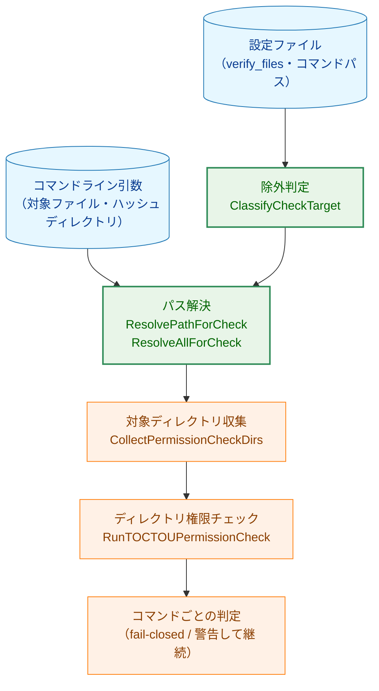
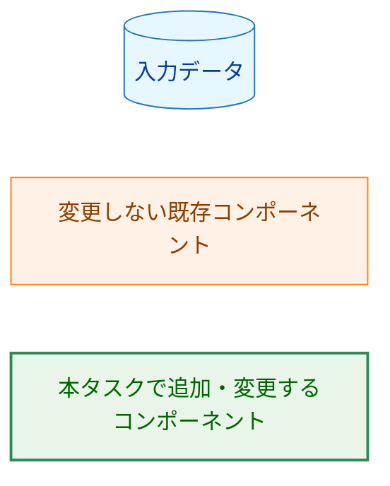
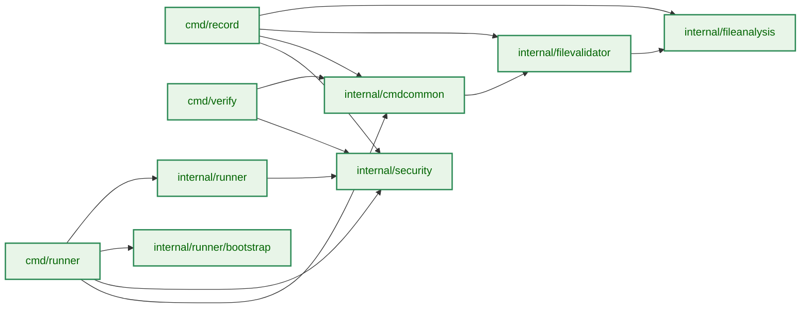
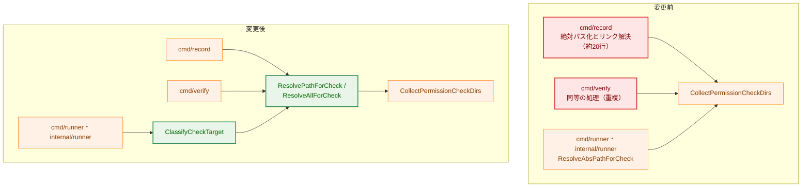
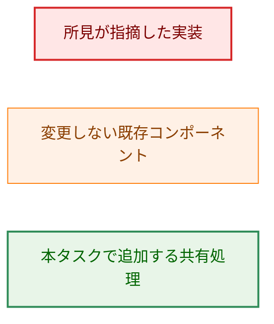
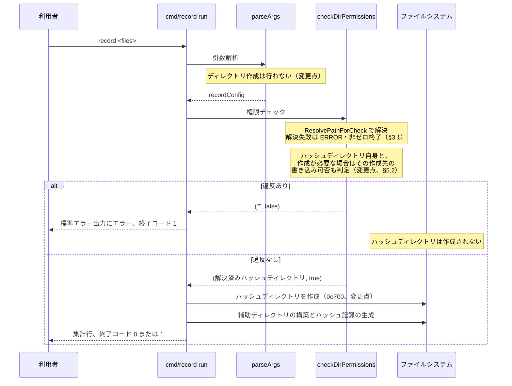
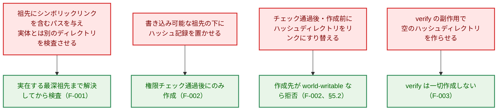
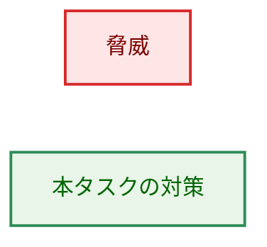
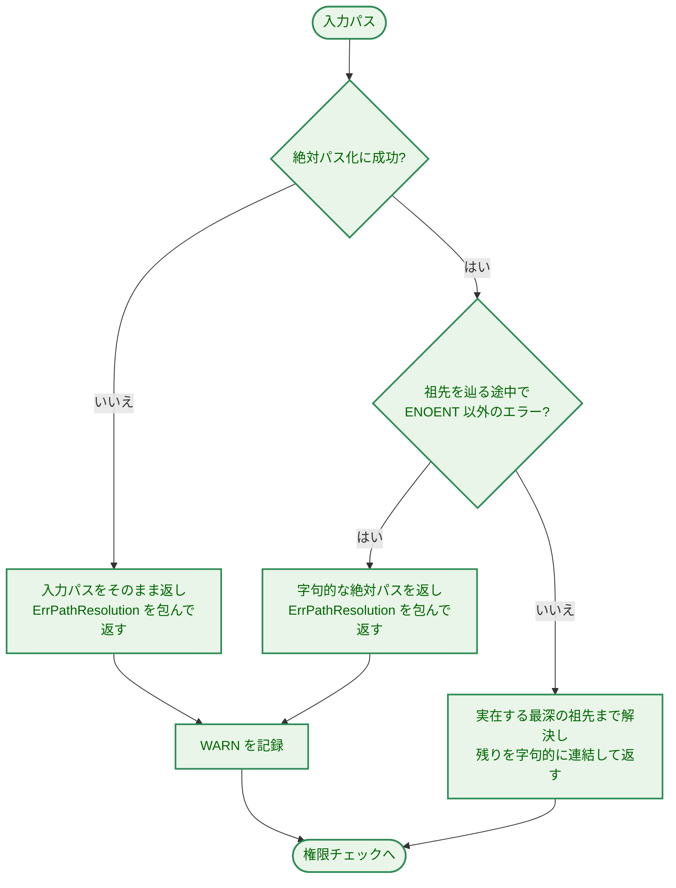

# アーキテクチャ設計書: entrypoints の残 Low/Info 所見（パス解決・起動処理の整理）

## Document Status

| Item | Value |
|---|---|
| Status | `approved` |
| Created | 2026-08-14 |
| Review date | 2026-08-14 |
| Reviewer | isseis |
| Comments | - |

## 関連文書

- 要件定義書: [01_requirements.md](01_requirements.md)
- 先行タスク: [0162 entrypoints の run-id 検証・特権降格完全化・verify TOCTOU fail-closed 化](../0162_entrypoint_runid_privilege_toctou_hardening/02_architecture.md)
- 関連ポリシー: [0148 dry-run でハッシュディレクトリを作成しない](../0148_dry_run_hash_directory_no_create/01_requirements.md)
- 監査所見: [E1_entrypoints.md](../0149_security_code_smell_audit_fable/findings/E1_entrypoints.md)

---

## 1. 設計の全体像

### 1.1 このタスクが変える4つのこと

本タスクは、`runner`・`record`・`verify` という3つのエントリポイントの起動処理に散らばった11件の所見をまとめて解消する。個々の所見は小さいが、変更の中身は次の4つに集約できる。

1. **権限チェックに渡すパスの決め方を1箇所にまとめる**（F-001）。現在は `record` と `verify` にほぼ同じ約20行が重複し、解決に失敗しても黙って未解決のパスへ倒れる。これを共有処理に置き換え、失敗した事実を記録する。
2. **書き込みの副作用を、検証を通過した後だけに限る**（F-002・F-003）。`record` はハッシュディレクトリの作成を権限チェックの後ろへ移し、`verify` は作成そのものをやめる。
3. **起動処理の観測性と防御を揃える**（F-004〜F-011）。除外件数の記録（F-004）、ログファイル名のタイムゾーン整合（F-005）、panic の廃止（F-006）、dry-run 出力形式の分岐の防御（F-007）、Slack 環境変数エラーの二重出力の解消（F-008）、IPv6 正規化の統一（F-009）、依存注入様式の統一（F-010）、特権降格の設計意図のコメント追記（F-011）。
4. **利用者から見た挙動の変化を文書に反映する**（F-012）。`verify` の終了コード表、ログファイル名の命名規則、CHANGELOG、用語集。

### 1.2 設計原則

| 原則 | 本設計での現れ方 |
|---|---|
| 検証の前に書き込まない | ハッシュディレクトリの作成は、TOCTOU 権限チェックを通過した後にのみ行う（F-002）。`verify` は読み取り専用に徹する（F-003） |
| DRY | パス解決と除外判定を共有処理に集約し、3コマンドの重複を消す（F-001・F-004）。権限チェッカ初期化失敗の panic は、各コマンドのエラー報告経路へ置き換える（F-006・§3.3） |
| 宣言し、推測しない | チェック対象から除外する理由を列挙型で表し、除外の判定を1箇所に持つ（§3.2） |
| 拒否し、丸めない | `verify` はハッシュディレクトリが存在しなければ作成せずエラーにする（F-003） |
| 沈黙しない | 解決失敗と除外は、件数としてログに残る（F-001・F-004） |
| YAGNI | 権限チェックの処理そのもの、`record` と `verify` の fail-closed 判定は変更しない |

### 1.3 要件定義書の未決事項に対する決定

要件定義書 §未決事項の5件を、以下のとおり決定する。決定の根拠は本文の該当節に記す。

| 未決事項 | 決定 | 根拠の所在 |
|---|---|---|
| L-5 の解決方向 | タイムスタンプを UTC に変換し、`Z` 表記を正しくする | §6.4 |
| `verify` がハッシュディレクトリ不在で終了する際の終了コード | `3`（環境が信頼できない）。原因の判別は標準エラー出力の識別トークンで行う | §4.3 |
| パス解決失敗時のログレベルと `verify` での提示方法 | 構造化ログに `WARN`。`verify` が fail-closed で終了する際は標準エラー出力の1行でも示す | §3.1・§4.2 |
| 除外パスの記録内容（L-4） | 件数のみ。除外理由ごとの内訳を持つ。パス自体は記録しない | §5.5・§6.3 |
| 権限チェッカ初期化失敗時の終了コード（L-7） | `record` は `1`、`verify` は `3` | §4.3 |

### 1.4 概念モデル

3つのエントリポイントは、いずれも「利用者または設定が指定したパス」を「権限チェックの対象ディレクトリ集合」に変換してから、共有のチェック処理に渡す。本タスクは、この変換部分を共有コンポーネントに切り出す。



矢印 A → B は「A の出力が B の入力になる」というデータの流れを表す。

**Legend**



---

## 2. システム構成

### 2.1 パッケージ配置

新規パッケージは追加しない。共有処理は、既に同種の処理を持つ既存パッケージに置く。



矢印 A → B は「A が B を import する」という依存関係を表す。図に現れるパッケージはすべて本タスクで変更する。

**Legend**


配置の理由は次のとおり。

- **パス解決と除外判定は `internal/security`**。同パッケージには既に `ResolveAbsPathForCheck`・`CollectPermissionCheckDirs`・`RunTOCTOUPermissionCheck` があり、解決と除外はその前段にあたる同じ関心事である。`internal/cmdcommon` に置くこともできる（`internal/verification` が既に `cmdcommon` を import しており、依存の循環は生じない）が、`cmdcommon` は3つの CLI コマンドのための層であり、`internal/runner`（グループ実行時の権限チェック）からそこへ依存させると層の向きが逆流する。
- 権限チェッカの生成は `internal/security` のまま動かさない。3コマンドが共有すべきものは生成関数そのものであり、それは既に同パッケージに1つだけある。`internal/cmdcommon` に委譲だけのラッパーを置いても何も束ねられない（§3.3）。
- **ハッシュディレクトリの期待パーミッション定数は `internal/fileanalysis`**。同パッケージの `NewStore` がこのディレクトリを実際に作成する（`os.MkdirAll`）ため、定数は作成処理と同じ場所に置く。`cmd/record` から `internal/fileanalysis` への import は循環しない（`fileanalysis` は `internal/common` と `internal/safefileio` にのみ依存する）。

### 2.2 変更前後の対比（パス解決）



矢印 A → B は「A が B を呼び出す」という制御の流れを表す。

**Legend**



### 2.3 `record` の起動シーケンス

`record` では、ハッシュディレクトリの作成位置が引数解析から権限チェックの後ろへ移る。権限チェックには、ハッシュディレクトリを新規に作成する場合にのみ働く追加の判定が入る（理由は §5.2）。



---

## 3. コンポーネント設計

### 3.1 共有パス解決（F-001）

現行の `security.ResolveAbsPathForCheck` は、絶対パスでなければ「対象外」を返し、`filepath.EvalSymlinks` が失敗すれば入力パスをそのまま返す。対象がまだ存在しない場合、`EvalSymlinks` は必ず失敗するため、祖先にシンボリックリンクを含む未作成パスでは、リンクを辿る前の見かけ上のディレクトリだけが検査される。

本設計では、この関数を次の共有処理で置き換える。

```go
// Package security

// ErrPathResolution はパス解決に失敗したことを表す番兵エラー。
// 呼び出し側は errors.Is で判定する。
var ErrPathResolution = errors.New("failed to resolve path for permission check")

// ResolvePathForCheck は、権限チェックの対象として使うパスを返す。
// 相対パスはプロセスの作業ディレクトリを基準に絶対パス化する。
// 対象がまだ存在しない場合は、実在する最深の祖先までシンボリックリンクを
// 解決し、残りの部分を字句的に連結した結果を返す。
// 解決できなかった場合も検査可能なパスを返し、あわせて ErrPathResolution を
// 包んだエラーを返す。
func ResolvePathForCheck(path string) (string, error)

// ResolveAllForCheck は複数のパスをまとめて解決する。
// 解決に失敗したパスについて logger に WARN を1件ずつ記録し、失敗件数を返す。
// 返すパス列の要素数は入力と同じで、失敗した要素にも検査可能なパスが入る。
func ResolveAllForCheck(paths []string, logger *slog.Logger) (resolved []string, failures int)
```

#### 解決失敗の扱い

解決に失敗しても、そのパスを検査対象から外すことはしない。外すと、ハッシュディレクトリのように fail-closed の根拠になるパスが黙って未検査になり、fail-open を生む。返すパスは次のとおり。

| 失敗の種類 | 返すパス | 実際に起きる条件 |
|---|---|---|
| 絶対パス化に失敗 | 入力パスをそのまま返す | `os.Getwd` の失敗のみ（作業ディレクトリが削除された場合など）。通常運用では起きない |
| 祖先を辿る途中で `ENOENT` 以外のエラー（`EACCES`・`ENOTDIR` など） | 字句的に正規化した絶対パス | 読み取り権限のない祖先ディレクトリを経由するパス。通常ファイルを祖先に持つパス（`/etc/passwd/sub` など）も同じ経路に入る |
| 実在する最深の祖先のリンク解決に失敗 | 字句的に正規化した絶対パス | リンク切れのシンボリックリンク、リンクのループ（`ELOOP`）、および祖先の判定とリンク解決の間に対象が消えた場合 |
| 未実在部分に `..` が含まれる | 実在する最深の祖先（入力より短いパス） | `-d /a/gone/../b/hashes` のように、まだ作られていない要素の後ろに `..` が続く場合 |

上3行は後段の `ValidateDirectoryPermissions` が違反を報告する（相対パスは `ErrInvalidPath`、読み取れないディレクトリは stat 失敗）ため、解決失敗は結果として fail-closed に倒れ、その理由が WARN ログと `verify` の標準エラー出力（AC-05）から分かる。

**最終行だけはこの形にならない**。返るのは実在する健全なディレクトリであり得るため、それを検査しても違反は出ない一方、実際に作られる（あるいは読み書きされる）のは入力パスが指す別の木である。すなわち、この失敗は返り値だけでは fail-closed にならない。したがって**ハッシュディレクトリの解決失敗は、呼び出し側が明示的に拒否する**。`record` は `checkDirPermissions` で非ゼロ終了する（ステップ 2-1）。対象ファイル群（`ResolveAllForCheck`）は記録・検証の対象そのものであり、未実在部分を持つ時点で後段が失敗するため、従来どおり WARN のみとする。

祖先を辿る途中の `ENOENT` は失敗ではない。これは「対象がまだ存在しない」という通常の状態であり、実在する最深の祖先まで遡って解決を続ける（AC-02）。

**遡る前にパスを字句的に正規化しない**。`filepath.Clean` は `..` を字句的に畳むため、シンボリックリンクの後ろに `..` が続くパス（`/b/link/../sibling`）で、リンク先ではなくリンクが置かれている側の木を検査対象にしてしまう。これは AC-03 が防ごうとしている取り違えそのものである。したがって遡りは生のパスを1要素ずつ削る形で行い、各候補の解決はカーネル（`os.Lstat`）に任せる。相対パスの絶対パス化も同じ理由で `filepath.Join` を使わない。`Join` は連結結果の全体を正規化するため、相対パス側に含まれる `..` が同じように畳まれてしまうためである。作業ディレクトリは `os.Getwd` が返す実体パス（シンボリックリンクを含まない）なので、単純な連結で足りる。未作成の残り部分については、その要素が実在しない以上シンボリックリンクでもあり得ないため、字句的な連結で差し支えない。

#### 相対パスの扱い（AC-06 の解釈）

AC-06 の「3コマンドで一致する」は、「共有処理に到達したパスの扱い」として解釈する。`ResolvePathForCheck` は相対パスを常にプロセスの作業ディレクトリ基準で絶対パス化し、3コマンドはこの同一の関数を使う。

一方、`runner` は設定ファイル由来の相対パスを共有処理に渡さない。設定ファイルのパスは `runner` プロセスの作業ディレクトリとは無関係であり（グループごとの展開後に初めて意味が決まる）、作業ディレクトリ基準で絶対化すると無関係なディレクトリ木を検査して「チェックは通った」と報告してしまうためである。この除外は §3.2 の判定に一本化され、件数として記録される（F-004）。

なお `record`・`verify` は `sudo` 経由で起動されるため、相対パスの基準となる作業ディレクトリは呼び出した利用者のものである。これは現行と同じ挙動であり、本設計で変えない。

#### 2つの関数を用意する理由

`ResolvePathForCheck` は単発の解決（`record`・`verify` のハッシュディレクトリ）に、`ResolveAllForCheck` は列の解決（`record`・`verify` の対象ファイル群、`runner` の起動時チェックとグループ実行時チェックが集めたパス列）に使う。`record` と `verify` はハッシュディレクトリと対象ファイル群で失敗時の扱いが異なる（前者は fail-closed の根拠、後者は警告のみ）ため、両者をまとめて1回で解決する形にはできない。WARN の記録を共有処理の内部に置くのは、`RunTOCTOUPermissionCheck` が違反を内部で記録するのと同じ様式に揃え、3コマンドが個別に記録処理を書かないようにするためである。

`runner` の2経路が列側を使うのは、解決失敗の WARN 記録（AC-04）を呼び出し側に書き写さないためである。`runner` はハッシュディレクトリについても解決失敗を拒否の根拠にはせず（`record` と異なり、ここでの不在は通常経路である）記録のみを行うので、1要素の列として同じ関数に渡す。`CollectPermissionCheckDirs` の第2引数がもともと列であるため、受け渡しにも変換が要らない。

### 3.2 チェック対象の除外判定（F-004）

現行では、除外は2つの形で表現されている。`cmd/runner/main.go` の `resolveStaticAbsPath` が `%{` を含むパスを弾き、相対パスは `ResolveAbsPathForCheck` が `false` を返すことで結果的に弾かれる。`internal/runner/group_executor.go` も後者に依存している。

`ResolvePathForCheck` は相対パスを弾かなくなるため、この2箇所には新たに明示的な除外判定が必要になる。判定を各所に書けば AC-01・AC-27 が求める「同一ロジックの重複を残さない」に反するため、判定自体を共有処理として1箇所に置く。

```go
// Package security

// CheckSkipReason は、パスをディレクトリ権限チェックの対象から外した理由を表す。
// ゼロ値は「外さない」であり、値が増えても既定は検査する側に倒れる。
type CheckSkipReason int

const (
    CheckSkipNone CheckSkipReason = iota
    CheckSkipVariableReference // 未展開の変数参照を含む
    CheckSkipRelative          // 相対パス
)

// PathExpansionState は、変数参照について呼び出し元が知っている事実を宣言する。
// ゼロ値は入力について最も少ししか仮定しない側、すなわち検査する側である。
type PathExpansionState int

const (
    PathExpanded               PathExpansionState = iota // 未展開の参照を含まない
    PathHasUnexpandedReference                           // 未展開の参照を含む
)

// ClassifyCheckTarget は、設定ファイル由来のパスを起動時チェックの対象に
// できるかどうかを判定する。対象にできない場合はその理由を返す。
func ClassifyCheckTarget(path string, state PathExpansionState) CheckSkipReason
```

#### 未展開参照は文字列から推論せず、宣言として受け取る

`security` パッケージはパスの文字列から未展開参照の有無を判定できない。展開の構文には
エスケープがあり（`\%{` は文字としての `%{` に展開される、[expansion.go](../../../internal/runner/config/expansion.go) 参照）、
`%{` を含むことは未展開である証拠にならないためである。`%{` の有無で除外すると、
エスケープを使った実在しうる絶対パスが権限チェックから静かに外れる（fail-open）。

判定に必要な事実を知っているのは設定層だけなので、設定層が宣言する。

```go
// Package config

// HasVariableReference は、展開が解決する変数参照が残っているかを報告する。
// 展開自身と同じパーサを使うため、エスケープ規則が二重管理にならない。
func HasVariableReference(input string) bool
```

**この判定は展開前のテンプレートに対してのみ行う。** 展開は冪等ではなく、`\%{X}` の
展開結果である文字としての `%{X}` を再びテンプレートとして読めば参照に見える。
したがって展開後の値から事実を復元することはできず、展開する側が答えを記録して
持ち回る必要がある。起動時チェックにおける呼び出し元の対応は次のとおり。

| パスの出所 | 起動時点の状態 | 宣言する値 |
|---|---|---|
| `runtimeGlobal.ExpandedVerifyFiles` | 展開済み | `PathExpanded`（構成上必ず展開済みであるため判定不要） |
| `g.VerifyFiles`・`cmd.Cmd` | 未展開のテンプレート | `HasVariableReference` の結果に対応する値 |

この関数は `cmd/runner/main.go` の起動時チェックと `internal/runner/group_executor.go` のグループ実行時チェックの両方が使う。理由が列挙型で返るため、F-004 の内訳カウントはこの戻り値をそのまま数えるだけでよい。

`record`・`verify` はこの判定を使わない。これらのパスは利用者がコマンドラインで与えたものであり、作業ディレクトリ基準の絶対化に意味があるためである。

### 3.3 権限チェッカ初期化失敗のエラー化（F-006）

3コマンドは `security.NewDirectoryPermChecker()` の失敗時に、同一のコメントと同一の panic を持っている。重複しているのはこの panic ブロックであって、生成の呼び出しそのものではない。生成関数は `internal/security` に既に1つしかなく、3コマンドはそれを呼んでいるだけである。

したがって解消の方向は、生成を包む新しいヘルパーを足すことではなく、panic を各コマンドのエラー報告経路へ置き換えることである（ステップ 2-2・3-2・4-2）。置き換え後に残る処理は、`runner` なら起動前エラーとして機械可読サマリ行を出す、`record`・`verify` なら標準エラー出力へ出して固有の終了コードで終わる、というコマンドごとに異なるものになる。ここは共通化の対象ではない。

`internal/cmdcommon` に委譲だけのラッパー（`func NewDirectoryPermChecker() (security.DirectoryPermChecker, error) { return security.NewDirectoryPermChecker() }`）を置く案は採らない。シグネチャが委譲先と同一であるため、注入口の既定値には `security.NewDirectoryPermChecker` をそのまま代入でき、ラッパーは何も束ねない。置いた場合に増えるのは `cmdcommon → security` の import 辺と、読む者が「ここで何かが足されている」と探す手間だけである（YAGNI）。

テストからチェッカを差し替える必要がある場合は、生成関数を呼ばない関数を注入口へ与える（`record`・`verify` は `deps.newPermChecker`、`runner` は `runTOCTOUCheck` の引数）。既定値は3コマンドとも `security.NewDirectoryPermChecker` である。生成そのものを差し替えるため、失敗経路も含めて検証できる。

現行実装では `security.NewDirectoryPermChecker()` は常に nil エラーを返す（`internal/security/dir_permissions_unix.go`）。したがって現行の panic は到達不能である。それでもエラー経路を用意するのは、(1) 戻り値の型がエラーを許しており、実装が将来失敗し得ること、(2) 到達不能な panic を残すと「失敗したらスタックトレースで止まる」という誤った運用前提が残ること、の2点による。この事実は AC-24 のテスト方針にも影響する（§7.1）。

`runner` では、生成関数を `runTOCTOUCheck` の引数として受け取る形にする。パッケージレベルの可変変数を増やさずに失敗経路を検証できるようにするためである。

### 3.4 `verify` の読み取り専用化と依存注入（F-003・F-010）

`verify` は現在、引数解析時に `mkdirAll` でハッシュディレクトリを作成し、`cmdcommon.CreateValidator`（内部で `filevalidator.New`）でバリデータを作る。`filevalidator.New` は `fileanalysis.NewStore` を経由してディレクトリを作成するため、**`mkdirAll` の削除だけでは書き込み副作用は消えない**（AC-14）。

既存の `filevalidator.NewReadOnly` はまさにこの用途のために存在する。ハッシュディレクトリを作成せず、アクセスできない場合は構築自体は成功したうえで、`Verify` が遅延エラーを即座に返す。`verify` はこれを使う。

`internal/cmdcommon` には読み取り専用の生成関数を追加し、返す型は `*filevalidator.Validator` とする。`filevalidator.FileValidator` インターフェース（`SaveRecord`・`Verify`・`VerifyWithHash`・`VerifyAndRead`・`LoadRecord`）は変更しない。既存の `cmdcommon.CreateValidator` は `verify` が唯一の呼び出し元であり、本変更で本番の呼び出し元が無くなるため削除する（`make deadcode` の対象になる）。

```go
// Package cmdcommon

// CreateReadOnlyValidator はハッシュディレクトリを作成しないバリデータを返す。
func CreateReadOnlyValidator(hashDir string) (*filevalidator.Validator, error)
```

#### ハッシュディレクトリの状態を先頭で1回だけ報告する

`verify` は、ファイルごとに同じエラーを繰り返すのではなく、実行の先頭で1回だけ診断して終了する必要がある（AC-12・AC-13）。遅延エラーをそのまま `Verify` に任せると、1件目のファイルに対して `FAILED` 行が出てから理由が分かることになり、「そのファイルの検証に失敗した」と読めてしまう。ディレクトリ不在は特定のファイルの問題ではないため、この提示は誤りである。

既存の `Validator.HashDirAvailable() bool`（`internal/verification` が使用）は可否しか返さず、不在と権限不足を区別できない。両者は利用者に示すべき対処が異なる（§4.2）ため、理由を返すアクセサを追加し、`HashDirAvailable` はその上に再定義して状態の出所を1つに保つ。

```go
// Package filevalidator

// HashDirError は、読み取り専用構築時に検出したハッシュディレクトリの
// アクセス不能（不在・権限不足など）を返す。問題がなければ nil。
// New で構築した Validator では常に nil。
func (v *Validator) HashDirError() error
```

#### 依存注入様式の統一

`verify` の依存注入は `record` と同じ `deps` 構造体様式に揃える（AC-38・AC-39）。パッケージレベルの可変変数（`validatorFactory`・`mkdirAll`・`ensurePermissionCheckUID`・`toctouChecker`）は廃止する。`mkdirAll` は F-003 により不要になる。

```go
// Package main (cmd/verify)

// deps は verify コマンドの差し替え可能な依存をまとめる。
// 呼び出し箇所から依存関係が見え、テストがグローバル状態に触れずに済む。
type deps struct {
    validatorFactory func(hashDir string) (hashValidator, error)
    // newPermChecker はディレクトリ権限チェッカを生成する。
    // 既定値は security.NewDirectoryPermChecker。
    newPermChecker func() (security.DirectoryPermChecker, error)
    // resolvePathForCheck は権限チェック対象のパスを解決する。
    // 既定値は security.ResolvePathForCheck。
    resolvePathForCheck      func(path string) (string, error)
    ensurePermissionCheckUID func() error // nil なら既定実装
}

// hashValidator は verify が必要とするバリデータの最小の口。
type hashValidator interface {
    Verify(filePath string) error
    HashDirError() error
}
```

### 3.5 ハッシュディレクトリ期待パーミッションの一本化（F-003）

同じディレクトリに対する期待パーミッションが、現在3箇所に異なる値で存在する。

| 場所 | 現在の値 | 変更後 |
|---|---|---|
| `cmd/record/main.go: hashDirPermissions` | `0o700` | `fileanalysis.HashDirPerm` を参照 |
| `cmd/verify/main.go: hashDirPermissions` | `0o750` | 削除（作成しなくなるため） |
| `internal/fileanalysis/file_analysis_store.go: dirPermission` | `0o750` | `HashDirPerm` として公開し、これを唯一の定義とする |

統一する値は `0o700` とする。ハッシュディレクトリは信頼の起点であり、所有者以外に内容を見せる必要が無いためである。3つの値のうち最も狭いものを選ぶことで、統一によって権限が広がる環境が生まれない。

#### この値が塞がないもの（分離運用）

`record` の実行者と `runner` の実行者が異なる構成（管理者が記録し、より権限を限ったユーザーが実行する）では、`runner` 実行者がハッシュを読める必要がある。`runner` は起動直後に実効 UID を実 UID へ降格し（`cmd/runner/main.go`）、以後のハッシュ照合はそのユーザーの権限で行うためである。

この構成を `0o700` は塞がない。`HashDirPerm` が決めるのは新規作成時の値だけで、その後の権限を強制しないためである。権限チェッカ（`internal/security/dir_permissions_unix.go`）が拒否するのは書き込みビットのみ（sticky 無しの world-writable、および trusted group 以外への group-writable）であり、グループへの読み取り許可は拒否しない。したがって `chgrp` + `0o750` は起動時チェックを通る。

`0o750` を既定にしても、この構成が自動的に成立するわけでもない。`record` は通常 sudo 実行であり、作られるディレクトリのグループは root になるため、グループを付け替える明示操作はどちらの既定値でも必要である。すなわち既定値の選択はこの構成の成否を決めない。決めるのは運用者の `chgrp` であり、その操作が「誰に読ませるか」の意思の記録になる。

以上から、既定は最も狭い `0o700` とし、広げる場合の手順を利用者向け文書に記す（AC-47）。

```go
// Package fileanalysis

// HashDirPerm はハッシュディレクトリを新規作成するときのパーミッション。
const HashDirPerm os.FileMode = 0o700
```

この統一が及ぶのは新規作成時のみである。`os.MkdirAll` は既存ディレクトリのパーミッションを変更しないため、既に `0o750` で作られている環境（`verify` が先に実行された環境や、`0o750` 時代の `fileanalysis.NewStore` が作った環境）はそのまま残る。この差は自然には解消しないため、運用上の注意として CHANGELOG に記す（§9）。

#### ハッシュディレクトリ配下のサブディレクトリ

`record` は実行中にハッシュディレクトリ配下へ3つのサブディレクトリを作る。

| 作成箇所 | 対象 | パーミッション |
|---|---|---|
| `internal/libccache/cache.go` | `<hashDir>/lib-cache` | `0o755` |
| `internal/libccache/macho_cache.go` | 同上 | `0o755` |
| `internal/dynamicanalysis/store.go` | `<hashDir>/<StoreSubDir>` | `0o755` |

これらはハッシュディレクトリそのものの期待パーミッションではないため、AC-15 の対象外として値を変更しない。ただし、いずれも `os.MkdirAll` であるため、ハッシュディレクトリが存在しない状態で先に呼ばれるとハッシュディレクトリ自身を `0o755` で作ってしまう。したがって §2.3 のとおり、`record` はこれらの構築より前にハッシュディレクトリを `HashDirPerm` で明示的に作成する。この順序は実装上の前提条件であり、テストで固定する（§7.4）。

### 3.6 コンポーネント責務表

| ファイル | 区分 | 責務と変更内容 | 更新が必要な既存テスト |
|---|---|---|---|
| `internal/security/path_resolution.go`・`internal/security/check_targets.go` | 変更 | `ResolvePathForCheck`・`ResolveAllForCheck`・`ClassifyCheckTarget` を追加し、`ResolveAbsPathForCheck` を置き換える（F-001・F-004） | `internal/security/path_resolution_test.go`・`internal/security/check_targets_test.go` |
| `internal/cmdcommon/common.go` | 変更 | `CreateReadOnlyValidator` を追加し、`CreateValidator` を削除（F-003） | `internal/cmdcommon/common_test.go` |
| `internal/fileanalysis/file_analysis_store.go` | 変更 | `dirPermission` を `HashDirPerm` として公開し、値を `0o700` に（F-003） | `internal/fileanalysis` のディレクトリ作成・パーミッションのテスト |
| `internal/filevalidator/validator.go` | 変更 | `HashDirError()` を追加し、`HashDirAvailable()` をその上に再定義（F-003） | なし |
| `cmd/record/main.go` | 変更 | ディレクトリ作成を権限チェック後へ移動し、作成が必要な場合は sticky ビットの例外を適用しない（F-002）、共有パス解決の利用（F-001）、panic 廃止（F-006）、`cacheDir` の重複計算の解消（F-010） | `TestHashDirPermissions_0o700`、`TestRunUsesDefaultHashDirectoryWhenNotSpecified`、`TestRunTOCTOU_*` |
| `cmd/verify/main.go` | 変更 | ディレクトリ作成の廃止（F-003）、共有パス解決の利用（F-001）、panic 廃止（F-006）、`deps` 様式への移行（F-010）、終了コード説明コメントの更新（F-006） | `cmd/verify/main_test.go` 全体（パッケージレベル変数の差し替えを前提としているため） |
| `cmd/runner/main.go` | 変更 | 除外判定の共有化と件数記録（F-004）、panic 廃止（F-006）、Slack 環境変数エラーの二重出力の解消（F-008）、出力形式選択の関数化と `default` 追加（F-007）、特権降格コメントの追記（F-011） | `cmd/runner/main_test.go`、`cmd/runner/startup_order_guard_test.go` |
| `internal/runner/group_executor.go` | 変更 | 除外判定と解決を共有処理へ差し替え（F-001・F-004） | `internal/runner` のグループ実行時 TOCTOU テスト |
| `internal/runner/bootstrap/logger.go` | 変更 | ログファイル名タイムスタンプを UTC に（F-005） | `internal/runner/bootstrap/logger_test.go` のログファイル名検証 |
| `internal/runner/bootstrap/config.go` | 変更 | `normalizeSlackAllowedHost` の IPv6 分岐で小文字化（F-009） | `internal/runner/bootstrap/config_test.go: TestNormalizeSlackAllowedHost` |
| `docs/user/verify_command.ja.md` / `.md` | 変更 | ハッシュディレクトリを作成しないこと、不在時の終了コードと識別トークン、終了コード表と対処手順・例示スクリプトの改訂（AC-43） | なし |
| `docs/user/runner_command.ja.md` / `.md` | 変更 | ログファイル名の命名規則と例を、実際の書式（`T` 区切り・UTC）に修正（AC-44） | なし |
| `CHANGELOG.ja.md` / `CHANGELOG.md` | 変更 | `verify` の作成廃止・終了コードの意味の拡張、ログファイル名の変更、パス解決変更による新規検出（AC-45） | なし |
| `docs/translation_glossary.md` | 変更 | 本タスクで導入した用語の追加（AC-46） | なし |

先行タスク 0148 の実装計画は `TestHashDirPermissions_0o700` を「既存・無変更」として自身の AC-09 の根拠に挙げている。本タスクではこのテストの検証位置が変わる（引数解析の直後ではなく、権限チェック通過後の作成を対象にする）が、「`record` が作るハッシュディレクトリは `0o700`」という主張自体は変わらないため、0148 の AC-09 は引き続き成立する。

---

## 4. エラーハンドリング設計

### 4.1 エラー型

新しいエラー型は最小限にとどめる。

```go
// Package security
// パス解決の失敗を表す番兵エラー。解決結果のパスは返るため、
// 呼び出し側は「検査は続けるが、記録は残す」ために使う。
var ErrPathResolution = errors.New("failed to resolve path for permission check")
```

`verify` のハッシュディレクトリ関連は、既存の `filevalidator.ErrHashDirNotExist`・`ErrHashPathNotDir` と `os.ErrPermission` をそのまま使う。新しい型は作らない。

### 4.2 メッセージ設計

| 場面 | 出力先 | 内容の方針 |
|---|---|---|
| パス解決の失敗（AC-04） | 構造化ログ `WARN` | 対象パスと失敗理由。1パスにつき1件 |
| `verify` の fail-closed 終了時にパス解決失敗があった（AC-05） | 標準エラー出力 | 解決に失敗した旨と当該パス。**実装時の変更**: 権限違反メッセージへの追記ではなく、独立した原因として独自の識別トークンを持つ1行にした（下記） |
| `verify` のハッシュディレクトリ不在（AC-13） | 標準エラー出力 | 「ハッシュディレクトリが存在しない」ことと当該パス、`record` で記録を作る旨。ハッシュ照合の失敗（改ざん検出）と読み違えない語にする |
| `verify` のハッシュディレクトリが読めない（権限不足） | 標準エラー出力 | 「存在するが記録に届かない」ことと当該パス、権限を確認する旨。**実装時の変更**: `HashDirError()` だけではこの状態を検出できない（`NewReadOnly` はディレクトリを `Lstat` するだけで、これは親の権限しか要さない）ため、段階 4 でハッシュディレクトリの検索権限を明示的に確かめる。判定は `os.Stat(<dir>/.)`。ハッシュ記録の読み取りに要るのは検索権限だけで一覧権限は要らないため、ディレクトリ自体を開く確認では検索専用ディレクトリを誤って拒否する |
| 起動時 TOCTOU チェックの除外（AC-17） | 構造化ログ `INFO` | 検査したディレクトリ数と、除外・スキップ件数の内訳 |
| 権限チェッカ初期化の失敗（AC-25・AC-26） | `runner` は起動前エラー経路、`record`・`verify` は標準エラー出力 | スタックトレースを出さない |

AC-05 のために標準エラー出力にも1行を出すのは、`verify` が fail-closed で終了したとき、利用者が最初に見るのが標準エラー出力であり、そこに手掛かりが無ければ構造化ログを読みに行く動機すら生まれないためである。

`verify` が終了コード 3 で終わる原因は複数あるため（§4.3）、各メッセージには機械的に判別できる固定トークンを含める。呼び出し元スクリプトはこのトークンを見て原因を分ける。トークンの具体的な文字列は実装計画で定め、利用者向け文書に一覧を載せる（AC-43）。

**実装時の変更（ステップ 3-4）**: ハッシュディレクトリのパス解決の失敗を、権限違反メッセージへの追記ではなく独立した原因（トークン `path_resolution_failed`）とした。§3.1 の失敗表の最終行のとおり、解決に失敗したパスの返り値は入力とは別の木の健全な祖先であり得る。それを検査して通過させると fail-open になるため、`record` と同じく `verify` も解決の失敗それ自体で終了する。結果として、この失敗は権限違反と同時には起きず、権限違反メッセージへ追記する形にはならない。

### 4.3 終了コード

`verify` の終了コードは 0162 で定義済みであり、本タスクは `3` の意味を広げる。

| 終了コード | 現在の意味 | 本タスク後の意味 |
|---|---|---|
| 0 | 全ファイルの検証が成功 | 変更なし |
| 1 | 引数エラー、バリデータ生成失敗、1件以上の検証失敗 | 変更なし。加えて、ハッシュディレクトリのパスがディレクトリでない場合（下記の実装時の変更を参照） |
| 2 | 未捕捉 panic（Go ランタイム） | 変更なし（§5.4 参照） |
| 3 | ハッシュディレクトリ側の TOCTOU 権限違反 | 次の4つ。(a) ハッシュディレクトリ側の TOCTOU 権限違反、(b) ハッシュディレクトリの不在または読み取り不能、(c) 権限チェッカの初期化失敗、(d) ハッシュディレクトリのパス解決の失敗（実装時の追加。§4.2 を参照）。いずれも「検証を1件も実施していない」状態を表す |

`3` を選ぶ理由は次の2つである。

1. **改ざん検出との判別**。`1` に寄せると、「改ざんを検出した」と「検証を実施できなかった」が同じ終了コードになる。前者は対応が必要な検出であり、後者は環境の問題である。呼び出し元スクリプトが取り違えると、未整備を改ざんとして扱うか、その逆になる。
2. **プロジェクト内の既存の対応関係との整合**。タスク 0147・0148 は `runner` の dry-run において、ハッシュディレクトリ不在（`verify_failed_hash_directory_not_found`）を「環境起因」に分類し、終了コード `3` に対応付けている。`verify` を同じ値にすることで、2つのコマンドが同じ事象に同じ終了コードを返す。

複数の原因を1つの終了コードにまとめる代償として、現行の利用者向け文書とスクリプト例が示す対処（ディレクトリの権限を修正する）は、(b) と (c) には当てはまらない。この点は放置できないため、原因ごとの識別トークン（§4.2）を用意し、`docs/user/verify_command.ja.md` の終了コード表・対処の記述・スクリプト例をあわせて改訂する（AC-43）。既存の監視ルールが「終了コード 3 = 改ざんの可能性」として警報を上げている場合、未整備のホストで警報が上がるようになるため、CHANGELOG にも記す（AC-45）。

**実装時の変更（ステップ 3-4）: 「ディレクトリでない」の判定位置**。上表は `ErrHashPathNotDir` によるバリデータ生成の失敗として終了コード `1` になるとしていたが、§6.2 の順序では段階 3 の `ValidateDirectoryPermissions` が先にこのパスへ到達し、`ErrInvalidDirPermissions`（`... is not a directory`）として権限違反を報告してしまう。すなわちバリデータ生成まで届かず、設定ミス（`-d` の指定先が通常ファイル）が終了コード `3`（改ざんの疑い）として警報に化け、案内も「平文ファイルのパーミッションを直せ」という無意味なものになる。そこで、段階 3 の権限チェックの直前に `os.Lstat` による判定を置き、実在してディレクトリでない場合は終了コード `1` で終える。上表の意味（終了コード `1`）は変えず、その実現箇所だけがバリデータ生成から段階 3 の入口へ移る。あわせて、この終了にも識別トークン（`hash_dir_not_a_directory`）を付ける。終了コード `1` は通常の検証失敗（改ざんの検出）と同じ値であり、トークンが無ければ呼び出し元は地の文の照合でしか両者を区別できないためである。すなわちトークンは「終了コード 3 の原因を分ける印」ではなく「検証を1件も行わずに終わった理由の印」である。

**実装時の変更（ステップ 3-4）: 読み取り専用バリデータを解決済みパスで構築する**。`filevalidator.NewReadOnly` は `os.Lstat` で判定するため、ハッシュディレクトリ自身がシンボリックリンクだと `ErrHashPathNotDir` で構築に失敗する。§3.4 が `New` から `NewReadOnly` への切り替えを決めた結果、シンボリックリンクのハッシュディレクトリを使う構成が動かなくなっていた。解決済みパスで構築すれば、検査した対象と読み取る対象が一致し（§5.3 の考え方と同じ）、この退行も解消する。

`record` は現在 `0` と `1` しか返さず、環境起因を区別する体系を持たない。本タスクでこの体系を導入するのは要件の範囲外であるため、権限チェッカ初期化失敗も `1` とする。

---

## 5. セキュリティ考慮事項

### 5.1 脅威モデル

本タスクが影響するのは、ハッシュディレクトリを信頼の起点とする改ざん検出の成立条件である。



矢印 A → B は「脅威 A に対して対策 B が対応する」という対応関係を表す。

**Legend**



### 5.2 まだ存在しない名前に sticky ビットの例外を適用しない

ハッシュディレクトリが既に存在する通常の運用では、権限チェックが祖先とディレクトリ自身の両方を検査するため、作成順序の入れ替えは何も変えない。問題になるのは、ハッシュディレクトリがまだ無い状態での実行である。

作成順序を「作成 → チェック」から「チェック → 作成」へ入れ替えると、この場合に限って、それ自体が新しい隙を作る。順を追うと次のようになる。

1. チェック時点でハッシュディレクトリは存在しない。`RunTOCTOUPermissionCheck` は存在しないディレクトリを黙って読み飛ばす（`fs.ErrNotExist` を無視する）ため、検査されるのは祖先だけである。
2. 祖先が sticky ビット付きの world-writable ディレクトリ（`/tmp` など）である場合、既存のチェックはこれを安全とみなして通過させる。
3. チェック通過から `os.MkdirAll` までの間に、攻撃者がそのパス名を自分の管理下のディレクトリへのシンボリックリンクとして作成できる。`os.MkdirAll` は既存のリンクを辿って成功するため、以後のハッシュ記録は攻撃者のディレクトリに書かれる。

入れ替え前の順序では、この状況は検出できていた。`os.MkdirAll` の後に `EvalSymlinks` でリンクを解決し、その実体の祖先を検査するため、攻撃者所有のディレクトリが違反として報告されるからである。

根本原因は 2 にある。sticky ビットが与える保護は「既存のエントリを、所有者以外が削除・改名できない」ことであって、まだ存在しない名前には及ばない。したがって sticky ビットを根拠に world-writable なディレクトリを安全とみなせるのは、対象がそこに既に在る場合に限られる。

根本原因の「まだ存在しない名前に sticky ビットの保護は及ばない」という点は、作成先だけの話ではない。`record` がこれから作る名前は2種類あり、どちらも同じ性質を持つ。

| これから作る名前 | 保護が及ばない理由 |
|---|---|
| ハッシュディレクトリ自身（未作成の場合） | 上記 1〜3 のとおり。チェック通過から `os.MkdirAll` までの間に、そのパス名をシンボリックリンクとして先回りで作れる |
| ハッシュ記録ファイル（常に） | ハッシュディレクトリが world-writable であれば、`record` がまだ処理していないファイルのハッシュ記録を第三者が先回りで置ける。その記録は以後 `verify`・`runner` に信頼される |

2行目は、ハッシュディレクトリが sticky 付き world-writable（`/tmp/hashes` を `1777` で運用する等）のときに現に通っていた。`ValidateDirectoryPermissions` は sticky があれば world-writable を安全とみなすためである。ハッシュディレクトリは信頼の起点であり、その中の名前を第三者が作れる状態は、ディレクトリ自身の名前を作れる状態と同じ重さを持つ。

そこで本設計では、`record` の権限チェックに次の判定を足す。

> ハッシュディレクトリ自身が world-writable であれば、sticky ビットの有無にかかわらず違反として扱う。ハッシュディレクトリがまだ存在しない場合は、その作成先（実在する最深の祖先）に同じ判定を適用する。

この判定により、書き込みに進むのは「利用者以外が名前を作れない場所」だけになる。チェック通過から `os.MkdirAll` までの間にそのパス名を作れるのは、その時点で既に書き込みを許されている相手だけになる。§5.3 のとおり、そうした相手は競合を仕込まなくても同じことができるため、時間差は攻撃の足場にならない。作成後の再検査は不要である。

この判定は `record` の呼び出し側に置き、共有のチェック処理（`ValidateDirectoryPermissions`）の判定規則は変更しない。要件定義書がスコープ外とする「TOCTOU 権限チェック処理そのものの挙動変更」に当たらないようにするためである。`verify` は書き込まないため対象外であり、`runner` は本番のハッシュディレクトリを作成しないため影響を受けない。

- 拒否は作成・書き込みの前に起きるため、AC-08（違反が検出された場合はハッシュディレクトリが作成されない）は例外なく成立する。
- world-writable なディレクトリの直下にハッシュディレクトリを置く運用が必要な場合、利用者が先に自分でディレクトリを作り、他者が書けないモード（`0o700` など）を与えれば `record` は通る。バイパス用のフラグは設けない。

#### 判定できない場合も違反として扱う

この判定は書き込みの直前に走るため、「安全と確認できなかった」も違反に含める。実装（`cmd/record/main.go` の `checkHashDirWriteSafety`）は次の4つで拒否する。

| 拒否する状況 | 理由 |
|---|---|
| ハッシュディレクトリの存在確認が `ENOENT` 以外で失敗 | 既存かどうかが決まらず、どちらの判定に進むかも決まらない |
| 作成先が求まらない（絶対パスでない、祖先を stat できない） | 書き込み先の安全性を確認する手段が無い |
| 作成先がディレクトリそのものでない | 検査は `os.Stat` ではなく `os.Lstat` で行う。作成先がシンボリックリンクだった場合、`os.Stat` が返すモードはリンク先のものであり、そのリンク先の祖先は検査されていない一方、`os.MkdirAll` はリンクを辿ってそこへ書く |
| ハッシュディレクトリ自身または作成先が world-writable | 上記の主判定 |

### 5.3 チェックと使用の間の時間差

パス解決と権限チェックの間、およびチェックと実際の読み書きの間には時間差がある。この時間差は本タスクで新しく生まれるものではなく、現行実装にも同じ形で存在する。ただしこれは攻撃の足場にはならない。理由は次のとおり。

時間差を突くには、検査対象の祖先ディレクトリへ書き込めることが要る。チェックを通過した時点で、そこに書き込めるのは次の3者に限られている。

| 書き込める者 | 通過を許している規則 |
|---|---|
| root | 権限ビットによらず書き込める。あわせて、ディレクトリの所有者は root か実行ユーザーのいずれかに限られる（それ以外の所有者は違反） |
| 実行ユーザー本人 | 自分が所有する場合。group-writable であれば、そのグループの唯一のメンバーが自分である場合に限る |
| 信頼グループのメンバー | root 所有かつ group-writable で、グループが root（macOS では admin）の場合 |

信頼できない第三者はチェックの時点ですべて違反として弾かれている。そして残る3者は、時間差を突く必要がない。祖先に書き込める者は、競合を仕込まなくてもハッシュ記録を直接置き換えられるためである。競合が意味を持つのは「直接は書けないが、隙を突けば書ける」相手だけであり、その相手はここには残っていない。

したがってこの時間差は、塞ぐべき隙ではなく正常な運用の範囲である。エラーとして扱えば、成立する構成が無くなる。ハッシュディレクトリは root が所有して書き込める場所に置くことが前提であり、`record`・`verify` は `sudo` 経由で動く。root や管理者を攻撃者として扱う場合は、バイナリ自体の差し替えが可能であり、この層の防御では対処できない。

ただし上の表が成り立つのは、対象ディレクトリが sticky 付き world-writable でない場合に限る。sticky 付き world-writable なディレクトリは既存のチェックを通過し、そこには「まだ名前を作れる第三者」が残る。これが §5.2 の2件（未作成のハッシュディレクトリ自身と、ハッシュディレクトリ内のハッシュ記録ファイル）であり、いずれも書き込み前の拒否で閉じた。閉じた後は、チェックを通過したディレクトリに書き込めるのは上の表の3者だけになる。

### 5.4 `verify` に残る panic（AC-28）

本タスクで権限チェッカ初期化の panic は無くなるが、`init` における権限チェック基準 UID ポリシーの宣言（`groupmembership.SetProcessPermissionCheckUIDPolicy`）の失敗による panic は残る。これはプロセス起動直後、引数解析より前に起きる実装上の不整合であり、通常の運用で到達し得ない。`cmd/verify/main.go` の終了コードの説明コメントは、この1点のみが残ることを示すように更新する。

### 5.5 除外パスをログに残さない理由（AC-17）

起動時 TOCTOU チェックの除外は件数のみを記録し、パス文字列は記録しない。除外されるのは「未展開の変数参照を含むパス」と「相対パス」であり、前者は設定ファイル由来の未展開文字列を含む。秘匿処理（redaction）はキー名と値の書式に基づいて働くため、パス文字列の一部として現れる値までは保証できない。件数と理由の内訳があれば AC-17・AC-18 は満たせる。

---

## 6. 主要処理フロー詳細

### 6.1 パス解決（F-001）



矢印は処理の遷移を表し、分岐のラベルは条件の判定結果を表す。

**Legend**


パス全体が実在する場合、「実在する最深の祖先」はパス自身であり、結果はシンボリックリンクを解決した実体パスになる。まだ存在しない場合は、その置かれる先の実体側の祖先ディレクトリが検査対象になる（AC-02・AC-03・AC-10）。

### 6.2 `verify` の起動判定（F-003）

`verify` は次の順序で判定する。順序は「安いチェックから」ではなく「信頼の起点から」で決まっている。

1. 引数解析（ディレクトリは作成しない）
2. 権限チェック基準 UID の解決
3. ハッシュディレクトリ側の TOCTOU 権限チェック（違反なら終了コード 3、対象ファイルには触れない）。**実装時の変更**: この段階の入口で、パスの解決（失敗なら終了コード 3）と「実在してディレクトリでない」の判定（該当なら終了コード 1）も行う。理由は §4.2・§4.3 の実装時の変更を参照
4. 読み取り専用バリデータの構築と `HashDirError()` の判定（不在・開けない場合は終了コード 3）
5. 対象ファイル側の TOCTOU 権限チェック（違反は警告のみ、継続）
6. ファイルごとの検証

3 と 4 の順序は、「信頼できないディレクトリに対しては、そこに何が在るかを調べる前に止まる」という 0162 の方針を維持する。なお 3 は、ディレクトリが存在しない場合には違反を報告しない（存在しないディレクトリは読み飛ばされる）。不在の診断は 4 が担う。

### 6.3 起動時 TOCTOU チェックの可観測化（F-004）

`runner` の `runTOCTOUCheck` は、チェック実行後に1件の `INFO` を記録する。除外が0件の実行でも同じ記録を出す。除外が起きたときだけ記録する方式では、記録が無いことが「除外なし」なのか「記録処理まで到達しなかった」のかを区別できないためである（AC-18）。

記録する属性は次のとおり。

| 属性 | 意味 |
|---|---|
| 収集したディレクトリ数 | `CollectPermissionCheckDirs` が返した数 |
| 実際に検査した数 | 上記のうち、存在して検査が行われた数 |
| 存在せず読み飛ばした数 | 存在しないため検査されなかった数 |
| 変数参照による除外件数 | `CheckSkipVariableReference` の数 |
| 相対パスによる除外件数 | `CheckSkipRelative` の数 |

「存在せず読み飛ばした数」を含めるのは、これが F-004 の目的（起動時チェックが保証している範囲を観測可能にする）に直接効くためである。`RunTOCTOUPermissionCheck` は存在しないディレクトリを黙って読み飛ばす。さらに §6.1 の解決は、まだ存在しない末尾部分を字句的に連結するため、存在しないディレクトリが収集対象に入る場面はむしろ増える。「収集 N 件・除外 0 件」だけを見た運用者が「N 件すべてが検査された」と読むことを防ぐ必要がある。

除外は違反として扱わず、チェックの合否には影響しない（AC-19）。

#### 存在しないディレクトリの記録レベル

`ValidateDirectoryPermissions` は `Lstat` の失敗を `ERROR` で記録していたが、これは不在（`ENOENT`）にも及んでいた。`verify` がハッシュディレクトリを作らなくなり（F-003）、`record` が作成を権限チェックの後ろへ移した（F-002）結果、不在は両コマンドの通常経路になる。同関数の呼び出し元はいずれも不在の扱いを自分で決めている（`RunTOCTOUPermissionCheck` は読み飛ばしとして数え、`internal/verification` と `internal/runner/base/security` は返るエラーを失敗として報告する）ため、共有関数が `ERROR` を出すことは、どの呼び出し元も求めていない判定を先に述べることにあたる。

そこで、不在の場合のみ記録レベルを `DEBUG` に下げ、それ以外の stat 失敗（＝検査そのものができない）は `ERROR` のまま残す。返すエラーは変えないので、失敗として扱う呼び出し元の挙動は変わらない。記録自体は `DEBUG` に残るため、`DEBUG` を有効にすればどのディレクトリが検査対象から外れたかは追える。ただし各コマンドの既定は `INFO` であり、そこでは何も現れない。既定レベルで見える形にするのは呼び出し元の役目で、件数を持つ `TOCTOUCheckResult.Skipped` を起動時チェックが §6.3 の `INFO` に出す（フェーズ4）。それまでの間、既定レベルには不在の記録が残らない。判定規則そのものは変更していない。

グループ実行時のチェック（`internal/runner/group_executor.go`）も同じ除外判定を使うが、件数の記録は起動時チェックにのみ入れる。F-004 の要件は起動時チェックの保証範囲を対象としており、グループ実行時のチェックは実行の直前に fail-closed で働く別の層だからである。グループ側の可観測化は本タスクの対象外とし、必要になった時点で同じ属性を足せばよい。

### 6.4 ログファイル名タイムスタンプ（F-005）

現在のログファイル名は `<ホスト名>_<タイムスタンプ>_<run ID>.json` であり、タイムスタンプは `time.Now().Format("20060102T150405Z")` で生成される。この書式文字列の `Z` はリテラル文字であって、値はローカル時刻である。

**決定: 時刻を UTC に変換する**（`time.Now().UTC()`）。`Z` を外す案と比較しての理由は次のとおり。

| 観点 | UTC に変換（採用） | `Z` を外す |
|---|---|---|
| ファイル名の構成（AC-23） | 桁数・区切り・要素順が変わらない | 1文字短くなり、固定長で切り出す収集スクリプトが壊れる |
| タイムゾーン設定の変更（AC-22） | 常に UTC のため成立する | ファイル名がタイムゾーンを主張しなくなるので、複数ホストのログを突き合わせる際に別途情報が要る |
| ホスト間の名前順の並び | 全ホストで時系列と一致する | ホストのタイムゾーンが異なると一致しない |

**移行時の注意**。UTC より進んだタイムゾーン（JST など）のホストでは、アップグレード後のファイル名がアップグレード前のファイル名より辞書順で前に来る期間が、時差の分だけ生じる。同一ディレクトリ内で「辞書順で最大のファイル名＝最新の実行」とみなしている収集スクリプトは、その期間、古いファイルを最新として拾う。既存ファイルの名前は変わらないため、影響は移行直後に限られる。この点を CHANGELOG に記す（AC-45）。

### 6.5 Slack 環境変数検証エラーの単一出力（F-008）

現在は `cmd/runner/main.go` が `fmt.Fprintln(os.Stderr, err.Error())` で1回出力し、返した `PreExecutionError` を `logging.HandlePreExecutionError` が受けてもう1回出力している。直接出力の側を削除し、起動前エラー経路に一本化する（AC-31）。

`HandlePreExecutionError` は `Details: <メッセージ>` の形でメッセージ全文を標準エラー出力へ書くため、複数行の使用方法の案内は失われない（AC-32）。終了コードも経路が変わらないため不変である（AC-33）。

### 6.6 dry-run 出力形式の分岐（F-007）

現在、出力形式による `resource.Formatter` の選択は `executeRunner` の中に直接書かれた `switch` であり、`default` が無い。これを小さな選択関数として切り出し、未知の値に対してエラーを返すようにする（AC-29）。

```go
// Package main (cmd/runner)

// newDryRunFormatter は出力形式に対応するフォーマッタを返す。
// 未知の形式にはエラーを返し、未初期化のフォーマッタを使わせない。
func newDryRunFormatter(format resource.OutputFormat) (resource.Formatter, error)
```

関数として切り出すのは、`cli.ParseDryRunOutputFormat` が未知の文字列を先に弾くため、コマンドラインからは `default` に到達できないためである。関数にすれば、不正な `resource.OutputFormat` 値を直接渡す単体テストで防御が働くことを確認できる（§7.1）。

### 6.7 許可 Slack ホストの IPv6 正規化（F-009）

`normalizeSlackAllowedHost` は、ホスト名分岐では `strings.ToLower` を適用するが、IPv6 リテラル分岐では `url.Hostname()` の結果をそのまま返す。IPv6 分岐にも小文字化を適用して揃える（AC-34）。

**この変更が観測可能な挙動を変えないことの確認**（AC-35・AC-36）。現行の下流はいずれも大文字小文字を区別しない。

- 許可判定: `internal/logging/slack_handler.go` の `validateWebhookURL` は、URL 側と許可ホスト側の双方に `strings.ToLower` を適用してから比較する。
- 秘匿処理: `internal/redaction/value_detector.go` の `compileWebhookHostPattern` は `(?i)` 付きの正規表現を生成する。

つまり AC-35・AC-36 は現行実装でも成立している。本変更の実質的な効果は、正規化結果そのものを一致させること（AC-34）と、下流の大文字小文字畳み込みへの暗黙の依存を無くすことである。この事実はテスト設計に影響する（§7.1）。

正規化を `strings.ToLower` にとどめ、`netip` による完全な正準化（ゼロ圧縮など）を行わないのは、許可判定が URL 中のホスト文字列との一致で行われるためである。設定側だけを正準化すると、URL が展開形で書かれている場合に一致しなくなる。要件は大文字小文字の統一のみを求めており（AC-34）、それ以上は行わない。

---

## 7. テスト戦略

### 7.1 個別に注意が必要な受け入れ基準

| 受け入れ基準 | 注意点 | 方針 |
|---|---|---|
| AC-24（panic しない） | 現行の `security.NewDirectoryPermChecker` は常に成功するため、そのままでは失敗経路を再現できない | チェッカ生成関数そのものを明示的な注入口（`record`・`verify` は `deps.newPermChecker`、`runner` は `runTOCTOUCheck` の引数）として渡し、失敗を返す実装を注入して検証する |
| AC-29（未知の出力形式） | `cli.ParseDryRunOutputFormat` が先に弾くため、コマンドライン入力では `default` に到達できない | §6.6 の `newDryRunFormatter` に不正な `resource.OutputFormat` 値を直接渡す単体テストとする |
| AC-35・AC-36 | 下流が大文字小文字を区別しないため、変更前でもテストが通ってしまう | 正規化関数の戻り値そのものを検証する AC-34 のテストを主とし、AC-35・AC-36 は退行防止（現行挙動の固定）と位置づけて実装計画に明記する |
| AC-03（シンボリックリンク解決） | 解決前後の両方のディレクトリが同じ権限だと、どちらを検査したのか判別できない | リンク先の祖先だけが違反状態になるよう配置し、違反が検出されることで解決が働いたと言えるテストにする |
| AC-08（違反時に作成されない） | ディレクトリの不在だけを見ると、作成に失敗しただけの場合と区別できない | 実行前に不在であることを確認し、実行後も不在であること、かつ終了コードが権限違反のものであることを併せて検証する |
| AC-14（何も作成しない） | ハッシュディレクトリだけを見ても、バリデータ経由の作成を見落とす | ハッシュディレクトリの親を実行前後で比較し、新規エントリが1件も増えていないことを検証する |
| AC-04（解決失敗のログ） | 通常の未作成パスは「失敗」ではないため、そのままでは WARN が出ない | 読み取り権限のない祖先を持つパスを用意し、`ENOENT` 以外の失敗を再現する |

### 7.2 単体テスト

- `internal/security`: `ResolvePathForCheck` の4経路（全体が実在、途中まで実在、`ENOENT` 以外の失敗、絶対パス化の失敗）と、相対パスの絶対パス化。`ResolveAllForCheck` の失敗件数と WARN 記録。`ClassifyCheckTarget` の3つの戻り値。
- `internal/cmdcommon`: `CreateReadOnlyValidator` がハッシュディレクトリを作成しないこと。権限チェッカ生成の失敗経路は各コマンドの注入口（`deps.newPermChecker`・`runTOCTOUCheck` の引数）に失敗を返す実装を与えて検証する（§3.3 のとおり `cmdcommon` にラッパーは置かない）。
- `internal/runner/bootstrap`: ログファイル名が UTC であること（プロセスのタイムゾーンを変えて確認、AC-21・AC-22）とファイル名の構成が変わらないこと（AC-23）。`normalizeSlackAllowedHost` の IPv6 大文字入力（AC-34）。
- `internal/filevalidator`: `HashDirError()` が不在時に `ErrHashDirNotExist` を、読み取り不能時に権限エラーを返し、正常時に nil を返すこと。
- `internal/fileanalysis`: 新規作成したディレクトリのパーミッションが `HashDirPerm` であること。

### 7.3 統合テスト

- `cmd/record`: 権限違反時にディレクトリが作られないこと（AC-08）、違反が無ければ作られ記録が生成されること（AC-09）、ハッシュディレクトリが不在でも権限チェックが実施されること（AC-10）、作成に失敗した場合に非ゼロ終了し標準エラー出力に出ること（AC-11）。
- `cmd/verify`: ハッシュディレクトリ不在での終了コードとメッセージ（AC-12・AC-13）、いかなる引数でも新規作成が起きないこと（AC-14）、パス解決失敗時の標準エラー出力（AC-05）。
- `cmd/runner`: 除外0件と1件以上でのログの差（AC-17・AC-18）、除外があってもチェックの合否が変わらないこと（AC-19）、Slack 環境変数エラーが1回だけ出ること（AC-31）。

### 7.4 セキュリティテスト

本タスクは書き込みの順序と検査対象の決め方を変えるため、次の5点は通常の機能テストとは別に、攻撃者の視点で条件を作って確認する。

- **リンク経由の祖先が検査されること**（AC-03、§6.1）。見かけ上の祖先は健全、リンク先の祖先だけが違反という配置で、違反が報告されること。
- **作成先が守られていない場合に拒否すること**（§5.2）。sticky ビット付きの world-writable ディレクトリの直下に未作成のハッシュディレクトリを指定して `record` を実行し、ディレクトリが作られないまま非ゼロ終了すること。あわせて、同じ場所に `0o700` で既に存在するハッシュディレクトリを指定した場合は通ることを確認し、判定の範囲を固定する。
- **ハッシュディレクトリ自身が world-writable な場合に拒否すること**（§5.2）。既存のハッシュディレクトリを sticky 付き world-writable にして `record` を実行し、ハッシュ記録が書かれないまま非ゼロ終了すること。**sticky を付けるのは必須である**。付けなければ共有チェックが単独で弾いてしまい、`record` 側の判定が無くてもテストが通る。したがってテストはまず共有チェックがこのディレクトリを受理することを表明し、そのうえで `record` 側の判定に固有のメッセージで拒否を確認する。
- **解決できないハッシュディレクトリパスを拒否すること**（§3.1 の失敗表の最終行）。未実在部分に `..` を含むパスを world-writable な親（sticky の有無の両方）の下に指定し、何も作られないまま非ゼロ終了すること。`WARN` で流す実装では、健全な祖先が検査されて通過し、別の木にハッシュディレクトリが作られる。
- **サブディレクトリ構築より前にハッシュディレクトリが作られること**（§3.5）。ハッシュディレクトリが不在の状態から `record` を実行し、作成の時点で配下がまだ空であること（モードの比較だけでは umask 077 の環境で `libccache` の `0o755` も `0o700` に落ちるため、順序を直接表明する）。

### 7.5 退行防止

要件定義書が「既存テストが通過する」と定めている受け入れ基準（AC-07・AC-16・AC-20・AC-30・AC-37・AC-41）は、既存テストの通過をもって確認する。ただし §3.6 の表に挙げたテストは、本設計の変更に追随して書き換える必要がある。書き換えたテストが依然として元の観点を検証していることを、実装計画のトレーサビリティ節で示す。

---

## 8. 実装優先度

依存関係の順に4段階へ分ける。共有処理を先に作り、それを使う側を後から移す。

| フェーズ | 内容 | 対応する機能要件 |
|---|---|---|
| 1 | 共有処理の追加（`ResolvePathForCheck`・`ResolveAllForCheck`・`ClassifyCheckTarget`・`CreateReadOnlyValidator`・`fileanalysis.HashDirPerm`・`Validator.HashDirError`） | F-001・F-003・F-004・F-006 の基盤 |
| 2 | `record` の移行（パス解決・作成順序と作成先の判定・panic 廃止・重複計算の解消） | F-001・F-002・F-006・F-010 |
| 3 | `verify` の移行（パス解決・作成廃止・`deps` 様式・panic 廃止・終了コード） | F-001・F-003・F-006・F-010 |
| 4 | `runner`・`internal/runner`・`bootstrap`（除外判定と件数記録・panic 廃止・二重出力・分岐の防御・タイムスタンプ・IPv6 正規化・コメント）と文書 | F-004・F-005・F-007・F-008・F-009・F-011・F-012 |

フェーズ2と3は互いに独立しており、順序を入れ替えてもよい。フェーズ4の各項目も相互に独立している。

**段階的な導入について**。フェーズ4に含まれる `internal/runner/group_executor.go` の移行は、起動時チェックの移行（`cmd/runner/main.go`）と同じリリースで行う。両者を分けると、起動時チェックとグループ実行時チェックが異なる解決規則で動く期間が生まれ、片方だけが違反を報告する状態の切り分けが難しくなるためである。パス解決の変更によって新たに違反が検出され得る点（§9）は、リリース単位ではなく CHANGELOG の事前確認手順で扱う。

---

## 9. 移行と後方互換

パス解決の変更は、既存環境でこれまで通っていたチェックが通らなくなる（あるいはその逆の）可能性を持つ。影響と対処は次のとおり。

| 変化 | 起きる条件 | 現れ方 | 対処 |
|---|---|---|---|
| 新たに違反が検出される | ハッシュディレクトリや検証対象が、実体側の祖先に権限の緩いディレクトリを持つシンボリックリンク経由のパスである | `runner` は起動時に、`record` は終了コード 1 で、`verify` は終了コード 3 で停止する | 実体側の祖先ディレクトリの権限を修正する |
| これまでの違反が出なくなる | 見かけ上のパスにシンボリックリンク要素があり、`ErrInsecurePathComponent` で違反になっていた | 停止していた実行が通るようになる | 解決後の実体側が検査されるため、保証は弱まらない |
| `verify` の終了コード 3 の原因が増える | ハッシュディレクトリが未整備、または権限チェッカの初期化に失敗 | 未整備のホストで終了コード 3 | 識別トークン（§4.2）で原因を分ける |
| ログファイル名の時刻がずれる | ローカルタイムゾーンが UTC でない | 移行直後、名前の辞書順と時系列が一致しない期間が生じる | §6.4 |
| 新規作成のハッシュディレクトリが `0o700` になる | ハッシュディレクトリを新規に作る場合のみ | グループ読み取りを前提にした運用があると読めなくなる | 既存ディレクトリは変わらない。必要なら明示的に権限を設定する |
| `record` が world-writable な場所へのハッシュディレクトリ作成を拒否する | `record -d` に、`/tmp` 直下など world-writable なディレクトリの下の、まだ作成されていないパスを指定している場合（本番既定のハッシュディレクトリは該当しない） | `record` が終了コード 1 で停止する | 先に利用者自身がディレクトリを作れば通る（§5.2）。恒久的には、書き込みが制限されたパスへハッシュディレクトリを移す |

CHANGELOG には、0162 と同じく、アップグレード前に影響の有無を判定する手順を載せる（AC-45）。パス解決の変更については、ハッシュディレクトリと検証対象のパスに対し `readlink -f` で実体を求め、その祖先の権限を確認する手順を示す。

---

## 10. 将来の拡張性

- **`record` への環境起因終了コードの導入**。本タスクでは `verify` のみが `3` を持つ。`record` にも同じ区別を入れる場合、本設計の `3` の意味定義（検証・記録を1件も行っていない）をそのまま流用できる。
- **`verify` の終了コード 3 の原因分離**。識別トークンでの判別が運用上不足だと分かった場合、原因ごとに別の終了コードを与える余地がある。その際も「1 は改ざん検出、3 以降は環境起因」という区分は維持できる。
- **グループ実行時チェックの可観測化**。§6.3 の除外件数の記録は、同じ属性をグループ実行時チェックにも足せる形にしてある。
- **`internal/runner/bootstrap` のグローバル可変状態の構造体化**（[#1019](https://github.com/isseis/go-safe-cmd-runner/issues/1019)）。本タスクは同ファイルのタイムスタンプ生成のみを触るため、その変更と競合しない。
- **Phase 1／Phase 2 間のエラーの Slack 通知**（[#1018](https://github.com/isseis/go-safe-cmd-runner/issues/1018)）。本タスクは `ValidateSlackWebhookEnv` の出力経路を1本に減らすため、通知経路を後から足す際の分岐点も1箇所になる。

---

## 付録A: 受け入れ基準と設計の対応

| 受け入れ基準 | 対応する節 |
|---|---|
| AC-01（共有処理の利用・重複の解消） | §3.1・§3.2・§2.2 |
| AC-02・AC-03（最深祖先までの解決） | §3.1・§6.1 |
| AC-04（解決失敗の記録） | §3.1・§4.2・§7.1 |
| AC-05（`verify` の fail-closed 出力での提示） | §4.2 |
| AC-06（相対パスの扱い） | §3.1 |
| AC-07（既存の権限チェックテストの通過） | §7.5 |
| AC-08・AC-09・AC-10（作成順序） | §2.3・§5.2・§7.3 |
| AC-11（作成失敗時の報告） | §7.3（現行挙動の維持） |
| AC-12・AC-13（ハッシュディレクトリ不在の診断） | §3.4・§4.2・§4.3・§6.2 |
| AC-14（`verify` は作成しない） | §3.4・§7.1 |
| AC-15（パーミッションの一本化） | §3.5 |
| AC-16（既存の `verify` テストの通過） | §7.5 |
| AC-17・AC-18（除外の記録） | §5.5・§6.3 |
| AC-19・AC-20（合否は変わらない） | §6.3・§7.5 |
| AC-21・AC-22・AC-23（ログファイル名） | §6.4・§7.2 |
| AC-24・AC-25・AC-26・AC-27（panic 廃止と共通化） | §3.3・§7.1 |
| AC-28（残る panic の説明） | §5.4 |
| AC-29・AC-30（出力形式の分岐） | §6.6・§7.1 |
| AC-31・AC-32・AC-33（Slack 環境変数エラー） | §6.5・§7.3 |
| AC-34・AC-35・AC-36・AC-37（IPv6 正規化） | §6.7・§7.1 |
| AC-38・AC-39（`verify` の依存注入） | §3.4 |
| AC-40（`record` の重複計算） | §3.6（`cacheDir`） |
| AC-41（外部から観測できる挙動の維持） | §7.5 |
| AC-42（特権降格の設計意図のコメント） | §3.6（`cmd/runner/main.go` の行） |
| AC-43（`verify` の利用者向け文書） | §3.6・§4.3 |
| AC-44（ログファイル名に言及する文書） | §3.6（`docs/user/runner_command.ja.md`） |
| AC-45（CHANGELOG） | §6.4・§9 |
| AC-46（用語集） | §3.6（`docs/translation_glossary.md`） |

---

## 付録B: 決定履歴

> 本文は変更後の姿を記述している。以下は、採用しなかった案とその理由の記録である。

- **`verify` のハッシュディレクトリ不在を終了コード `1` にする案**: 改ざん検出と環境未整備が同じ値になり、呼び出し元スクリプトが区別できないため採用しなかった（§4.3）。
- **ログファイル名から `Z` を外す案**: ファイル名が1文字短くなり、固定長で切り出す収集スクリプトへの影響が UTC 変換より大きいため採用しなかった（§6.4）。
- **除外パスの文字列をログに残す案**: 設定ファイル由来の未展開文字列を含み、秘匿処理の保証範囲外であるため採用しなかった（§5.5）。
- **IPv6 リテラルを `netip` で完全に正準化する案**: 許可判定が URL 中のホスト文字列との一致で行われるため、設定側だけを正準化すると展開形の URL と一致しなくなるため採用しなかった（§6.7）。
- **ハッシュディレクトリの期待パーミッションを `0o750` に統一する案**: 3つの候補値のうち最も広く、統一によって権限が広がる環境が生まれるため採用しなかった（§3.5）。
- **`verify` でハッシュディレクトリ不在を1件目の `Verify` のエラーから判定する案**: 新しいアクセサを足さずに済むが、1件目のファイルに対して `FAILED` 行が出てから理由が分かるため、ディレクトリの問題がファイルの問題として提示される。採用しなかった（§3.4）。
- **`record` が作成後にディレクトリを再チェックする案**: 作成順序の入れ替えが作る隙は塞げるが、防御が「書いてから検出する」形になり、設計原則の「検証の前に書き込まない」に反する。また違反時にディレクトリが残るため、AC-08 に例外を作る。作成前に拒否する現行の設計（§5.2）を採った。
- **共有チェッカの sticky ビット例外そのものを廃止する案**: 判定規則の変更は複数の呼び出し元に及び、要件定義書がスコープ外とする「TOCTOU 権限チェック処理そのものの挙動変更」に当たるため採用しなかった（§5.2）。
- **`internal/common` にハッシュディレクトリのパーミッション定数を置く案**: 実際に作成を行うのは `internal/fileanalysis` であり、汎用パッケージに特定ディレクトリの定数を置くと定義と使用箇所が離れるため採用しなかった（§2.1）。
