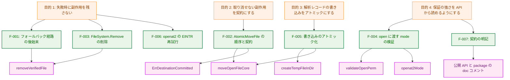
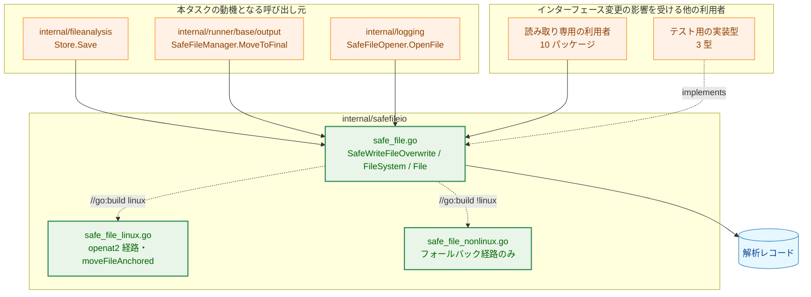
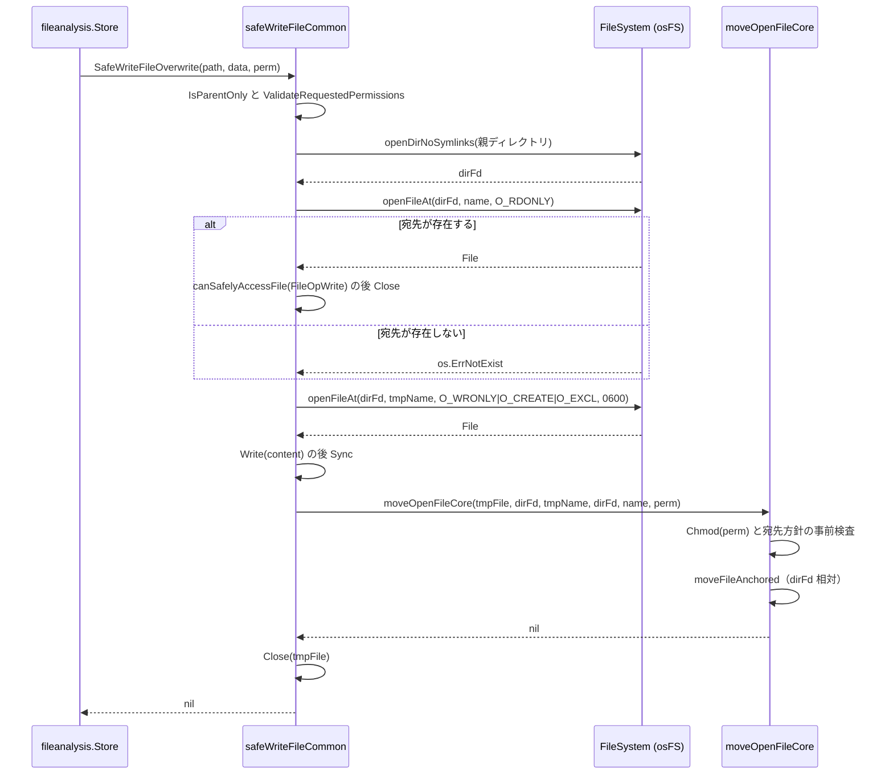
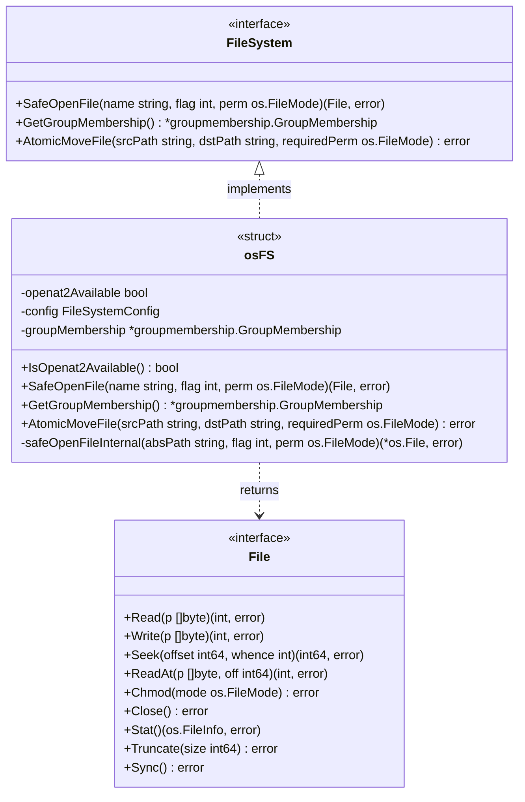
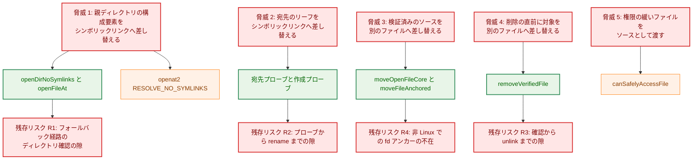
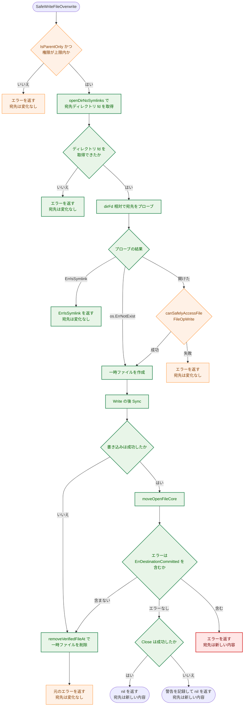
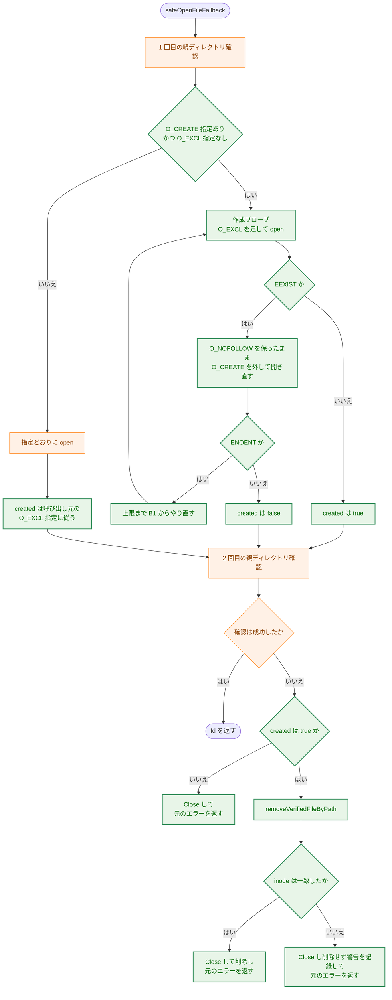

# アーキテクチャ設計書: safefileio の残所見（資源リーク・失敗時契約・書き込みのアトミック化）

## Document Status

| Item | Value |
|---|---|
| Status | `approved` |
| Created | 2026-08-20 |
| Review date | 2026-08-21 |
| Reviewer | isseis |
| Comments | - |

## 関連文書

- 要件定義: [01_requirements.md](01_requirements.md)
- 先行タスク: [0155 verify〜use 間の残存 TOCTOU ギャップ](../0155_toctou_verify_use_residual_gaps/02_architecture.md)（`moveFileAnchored` を導入し、本書の書き込み経路もこれを再利用する）
- 関連 ADR: [resolved-path-symlink-enforcement-adr.ja.md](../../dev/architecture_design/resolved-path-symlink-enforcement-adr.ja.md)（リーフのシンボリックリンクを検知して拒否するという設計前提）
- セキュリティ設計: [security-architecture.md](../../dev/architecture_design/security-architecture.md) § 4 Secure File Operations
- 利用者向け: [security-risk-assessment.ja.md](../../user/security-risk-assessment.ja.md)「前提と限界」節

**用語**: 本書では `internal/fileanalysis` が保存するファイルを **解析レコード** と呼ぶ。要件定義書が「ハッシュマニフェスト」と呼んでいるものと同じである。

---

## 1. 設計の全体像

### 1.1 設計目的

`internal/safefileio` は、シンボリックリンク攻撃と TOCTOU（検査時点と使用時点のずれ）を防ぐファイル入出力を提供するパッケージである。本タスクは、このパッケージが**エラーを返したときの状態**を整えることを目的とする。現状は、エラーを返しながら fd（ファイル記述子）を閉じずに漏らす、作成したファイルを残す、宛先を切り詰めたまま放置する、といった経路がある。

達成する状態は次の 4 つである。

1. 失敗した操作は、fd も作成済みファイルも一時ファイルも残さない。
2. 原理的に取り消せない副作用（`rename` 済みの宛先）は、公開 API の doc コメントに契約として書き、呼び出し元がそれを判別できる sentinel エラーを用意する。
3. 解析レコードの書き込みは、成功して新しい内容になるか、失敗して元の内容のまま残るかのどちらかにする。途中の状態を宛先に残さない。
4. 環境によって保証の強さが違うこと（`openat2` の有無）を、コードの公開 API からも読めるようにする。

### 1.2 設計原則

- **fd を操作の起点にする。** 検証した対象に後から操作するときは、パス名で開き直さない。ファイルについては、検証した fd をそのまま次の処理へ渡す。ディレクトリについては、一度開いた fd を起点にして単一のファイル名で操作し、絶対パスを解決し直さない。削除するときも「fd が指す inode」と「削除しようとしている名前の inode」が一致することを確かめる。これは 0155 が `moveFileAnchored` で採った方針の踏襲であり、本タスクではその適用範囲を書き込み経路と、パスの解決そのものへ広げる。
- **副作用の前に検査を済ませる。** 取り消せない副作用（`rename`）より前に、その副作用が生む状態が検査を通ることを確かめる。検査に落ちるなら副作用を起こさない。「実行してから検査して、落ちたので失敗を返す。ただし結果は残る」という形を作らない。
- **失敗したら閉じる（fail-closed）。** 同一性を確認できないときは、削除せずに警告を記録し、元のエラーを返す。後始末の失敗が、元の失敗を覆い隠すことがあってはならない。
- **正規化するな、拒否せよ。** 呼び出し元が渡した安全でない権限は、こちらで狭めてから受け入れるのではなく拒否する。`os.FileMode` の特殊ビットも黙って落とさず、固定のエラー値で拒否する。
- **既存の道具を使う。** 一時ファイルを作って差し替える処理は、本タスクで新設せず `moveFileAnchored` を含む既存の移動処理を共有する。
- **契約は読み手のいる場所に書く。** 限界の説明は内部関数ではなく、公開 API（`SafeOpenFile`・`SafeReadFile`・`SafeWriteFileOverwrite`・`AtomicMoveFile`）と package コメントに置く。

### 1.3 コンセプトモデル

本タスクの 7 つの要件は、達成する状態（§ 1.1 の 1〜4）ごとに次のように対応する。



矢印 A → B は「A を実現する下位の要素が B である」ことを表す。F-006 は `openat2` の一過性の失敗を呼び出し元へ漏らさないための変更であり、既存の関数の内部だけで完結するため対応する新しい要素を持たない。F-008（監査文書への反映）は設計要素を持たないためこの図には現れない（対応は § 3.9 と § 8 にある）。

**Legend**


---

## 2. システム構成

### 2.1 対象コンポーネントの配置

コードの変更は `internal/safefileio` の内部に閉じる。パッケージ外に波及するのは、`FileSystem` インターフェースから `Remove` を取り除くことと、`File` インターフェースに `Sync` を加えることの 2 つで、いずれもインターフェースの形が変わるため**すべての実装型**が影響を受ける。本番の実装は `osFS` と `*os.File` であり追加の作業は要らないが、テスト用の実装型は 3 つあり、いずれも手書きでメソッドを列挙しているため修正が必要である（§ 3.9）。



実線の矢印 A → B は「A が B を呼び出す、または B を読み書きする」ことを表す。破線の矢印はラベルの示す関係（インターフェースの実装、ビルドタグによる択一）を表す。`S2` と `S3` はビルドタグで排他であり、同時に存在することはない。「読み取り専用の利用者」は `SafeOpenFile`／`SafeReadFile` だけを使う 10 パッケージ（`shebang`・`dynamicanalysis`・`security/elfanalyzer`・`security/machoanalyzer`・`filevalidator`・`verification`・`libccache`・`dynlib/elfdynlib`・`dynlib/machodylib`・`runner/config`）で、`Remove` も `Sync` も使っていないため、インターフェースの形が変わっても修正は要らない。

**Legend**


### 2.2 所見と設計要素の対応関係

| 所見 | 要件 | 設計上の扱い | 主な変更箇所 |
|---|---|---|---|
| F-3 資源リーク | F-001 / AC-01〜05 | フォールバック経路の 2 回目検査失敗時に fd を閉じ、自分が作成した場合のみ inode 同一性を確認して削除 | § 3.3 |
| F-4-1 chmod 順序 | F-002 / AC-06・07・07a・07b | 検証を fchmod より前に移し、宛先の権限方針の検査も `rename` より前へ移す | § 3.4 |
| F-4-2 移動後の宛先 | F-002 / AC-08・09 | ロールバックは実装せず、`ErrDestinationCommitted` で判別可能にしたうえで doc に契約を明記 | § 3.4・§ 5.2 |
| F-5 `Remove` | F-003 / AC-10〜13 | `FileSystem` から削除し、内部の後始末は `removeVerifiedFile` が担う | § 3.5 |
| F-6 mode の扱い | F-004 / AC-14〜17 | 権限ビット以外を sentinel エラーで拒否し、`O_CREATE` の無い呼び出しでは mode=0 を渡す | § 3.1 |
| F-7 書き込みのアトミック化 | F-005 / AC-18〜25 | 一時ファイルへ書き、fd を保ったまま `moveOpenFileCore` で差し替える | § 3.6・§ 6.1 |
| F-9 `EINTR` | F-006 / AC-26〜28 | `openat2` ラッパで再試行する | § 3.2 |
| F-2 / F-8 契約の明記 | F-007 / AC-29〜33 | package コメントと公開 API の doc コメントに追記（挙動は変えない） | § 3.7 |
| 監査文書への反映 | F-008 / AC-34〜38 | `98_remaining_issues.md`・`findings/B1_safefileio.md`・利用者向け文書を更新 | § 3.9・§ 7.3 |

### 2.3 新しい書き込み経路のデータフロー

`SafeWriteFileOverwrite` の内部実装 `safeWriteFileCommon` は、宛先を直接開いて切り詰める方式から、同じディレクトリに一時ファイルを作って差し替える方式に変わる。次の図は成功する経路だけを示した概略である。失敗時の分岐と後始末は § 6.1 の判断フローが正であり、両者が食い違う場合は § 6.1 に従う。



実線の矢印は同期的な呼び出しを、破線の矢印はその戻り値を表す。要点は 2 つある。ディレクトリを 1 回だけ開いて、以降のすべての操作をその fd と単一の名前を起点に行うこと、そして `moveOpenFileCore` が一時ファイルの fd をそのまま受け取ることである（§ 3.4.1・§ 3.6.2）。

---

## 3. コンポーネント設計

### 3.1 `SafeOpenFile` に渡す権限の検証と正規化（F-004）

現状、`perm` は経路ごとに違う意味で扱われている。フォールバック経路の `os.OpenFile` は Go の `os.FileMode`（setuid を `1<<23` で表す独自表現）を POSIX のビットへ変換し、`O_CREATE` が無ければ mode を無視する。一方 Linux 経路は `uint64(perm)` をそのままカーネルへ渡すため、特殊ビットは誤った値として届き、`O_CREATE` の無い呼び出しで `perm` が非ゼロだと `openat2(2)` は `EINVAL` を返す。同じ引数で経路により結果が変わる。

対策は 2 段構えとする。

1. **共通の入口で拒否する。** `osFS.SafeOpenFile` が、経路を選ぶ前に `validateOpenPerm` で `perm` を検査し、下位 9 ビット（`os.ModePerm`）以外のビットが立っていれば新しい sentinel エラー `ErrUnsupportedFileMode` を返す。setuid・setgid・sticky（AC-14 が挙げるビット）だけでなく、`os.ModeDir`・`os.ModeAppend` など `perm.Perm()` が黙って捨てるビットもここで拒否する。捨てるのは正規化であり、「正規化するな、拒否せよ」に反するためである。ここは両経路の共通の通り道なので、1 か所の検査で経路間の一致（AC-14）が得られる。
2. **Linux 経路だけが変換を持つ。** `openat2Mode` が、ファイルを作りうる呼び出し（`O_CREATE` または `O_TMPFILE`）でのみ `perm.Perm()` を返し、それ以外では 0 を返す。`safeOpenFileInternal` はその結果を `openHow.mode` に渡す。特殊ビットは 1 で既に拒否されているため、ここに残る変換は 9 ビットのコピーだけで済む。

`O_CREATE` の無い呼び出しで `perm` を拒否せず 0 として扱うのは、`os.OpenFile` が同じ引数をどう解釈するかに合わせるためである（AC-15 が両経路の成否の一致を求めている）。「正規化するな、拒否せよ」の対象は呼び出し元の意図が壊れている入力であり、ここは Unix の open(2) が元から定めている引数解釈に従っているにすぎない。ただし副作用として、**`O_CREATE` 無しで非ゼロの `perm` を渡すという呼び出し側の誤りを検出する手段は失われる**。現在それを検出しているのは `openat2` の `EINVAL` だけであり、これは Linux 経路でしか起きず、フォールバック経路では元から検出されていなかった。経路間の一致を優先してこの検出を手放す。`O_TMPFILE` は本リポジトリのどの呼び出し元も使っていないが、判定は `O_CREATE` だけでなく `O_TMPFILE` も見る。当初の設計は「`O_TMPFILE` を使う呼び出しが将来加わってもカーネルが `EINVAL` を返して失敗が表面化する」と述べていたが、これは誤りであった（2026-08-21 に Linux 6.12 で実測して訂正）。カーネルの `build_open_flags()` は `O_CREAT` と `O_TMPFILE` の**いずれか**があれば mode を読むため、`O_TMPFILE` で mode 0 を渡すと `EINVAL` にはならず、権限 `0000` のファイルが黙って作られる。一方フォールバック経路の `os.OpenFile` はこの場合も mode をカーネルへ渡すため `perm` どおりの権限になる。`O_CREATE` だけを見る判定は、本節が消そうとしている経路間の食い違いをそのまま作り出す。なお `unix.O_TMPFILE` は `O_DIRECTORY` を含むビットパターンであるため、判定は積が非ゼロかではなく `flag&unix.O_TMPFILE == unix.O_TMPFILE` の一致で行う（さもないと素のディレクトリ open が「作りうる」と誤判定される）。

既存の `GroupMembership.ValidateRequestedPermissions` はこの検査を代替できない。同関数は `perm & 0o7777` で判定するが、`os.ModeSetuid` は `1<<23` にあるためこのマスクで落ちてしまい、特殊ビットは検出されない。加えて同関数は `SafeOpenFile` からは呼ばれておらず、`safeWriteFileCommon` と `atomicMoveFileCore` だけが呼んでいる。したがって新しい検査は重複ではない。

なお `groupmembership` の `MaxAllowedReadPerms = 0o6775` は setuid・setgid を明示的に許しており、一見すると新しい検査と矛盾する。両者は対象が違う。`MaxAllowedReadPerms` が制限するのは**すでにディスク上にあるファイルの権限**であり、POSIX のビット表現で表される。`ErrUnsupportedFileMode` が制限するのは**このパッケージが `open(2)` へ渡す `os.FileMode` の値**であり、Go 独自のビット表現で表される。同じ値についての判断ではないので、方針の対立にはならない。この点を § 3.1 相当の doc コメントにも 1 文で書く。

```go
// errors.go に追加する sentinel エラー
var (
    // ErrUnsupportedFileMode indicates that the requested file mode contains
    // bits outside os.ModePerm, which this package does not pass through to
    // the kernel.
    ErrUnsupportedFileMode = errors.New("unsupported file mode bits")

    // ErrDestinationCommitted indicates that a move or overwrite already
    // replaced the destination before the failure being reported occurred,
    // so the destination now holds the new content.
    ErrDestinationCommitted = errors.New("destination already replaced before failure")
)
```

### 3.2 `openat2` の `EINTR` 再試行（F-006）

`openat2` は `syscall.Syscall6` の直呼びで、`errno` をそのまま返している。Go ランタイムの非同期プリエンプション（SIGURG）などでシグナルが届くと `EINTR` が呼び出し元へ抜ける。

`openat2` を再試行するラッパにし、実際のシステムコール発行を `rawOpenat2` へ切り出したうえで、その呼び出しを差し替え点 `openat2Syscall` 経由にする。テストはこの差し替え点を差し替えて `EINTR` を返させることで再試行を検証する（AC-28）。差し替え点は `//go:build !test` と `//go:build test` の 2 ファイルで同名の関数を排他的に定義する形で用意し、本番ビルドには差し替え可能な値を一切残さない（`internal/security` の `getwd` と同じ形。2026-08-21 承認。`03_implementation_plan.md` § 1「本タスクで新規に必要になる差し替え点」）。既存の `linkatFunc`・`generateTempLinkName` は素のパッケージ変数のままだが、セキュリティ上重要な open 経路に本番でも書き換えうる値を増やさないため、新設分はこの形に倣わない。同ファイルの既存コメントどおり、このパッケージのテストは `t.Parallel()` を使わない。

再試行の回数に上限は設けない。`EINTR` は処理が始まる前の中断を意味するので、再試行はやり直しであって重複実行にはならない。Go 標準ライブラリの `os` パッケージも同じ扱いをしている。`EINTR` 以外の `errno` は現在と同じ形でそのまま返し、`ELOOP`・`EEXIST`・`ENOENT` の既存の対応付け（`ErrIsSymlink`・`ErrFileExists`・`os.ErrNotExist`）は変わらない（AC-27）。

### 3.3 フォールバック経路の後始末（F-001）

`safeOpenFileFallback` は「親ディレクトリ確認 → `O_NOFOLLOW` で open → 再確認」の二段階でシンボリックリンク攻撃を検出する。2 回目の確認が失敗したときに、開いた fd を閉じず、`O_CREATE` で作ってしまったファイルも残す。この 2 つを後始末する。検証方式そのものは変更しない（要件の対象外）。

**削除してよいかの判断は 2 つの条件の論理積である。**

- **自分が作成したか。** `O_CREATE` は「無ければ作る」であり、開けた後に「作ったのか既にあったのか」を fd から知る方法はない。そこで、呼び出し元が `O_CREATE` を指定していて `O_EXCL` を指定していない場合に限り、まず `O_EXCL` を足して開く（**作成プローブ**）。成功すれば作成したことが確定する。`EEXIST` で失敗すれば対象が既に存在するということなので、`O_CREATE` と `O_EXCL` を外して開き直し、作成していないものとして扱う。
- **削除対象が同じ inode か。** 2 回目の確認が失敗したということは、そのパスが指す先を信用できないということである。開いている fd を `Stat` した結果と、パスを `Lstat` した結果の `Dev`・`Ino` が一致するときにだけ削除する。一致しない、あるいは確認自体が失敗した場合は削除せず、`slog.Warn` で記録して元のエラーを返す（AC-03）。

作成プローブについては、次の 3 点を実装が守らなければならない。

- **リーフがシンボリックリンクの場合。** `O_EXCL` を伴う `open` は、リーフがシンボリックリンクであれば（リンク先が存在しない場合も含めて）`EEXIST` を返す。したがってシンボリックリンクは「既に存在する」分岐へ入る。開き直しでは `O_NOFOLLOW` を必ず維持し、そこで `ErrIsSymlink` が返るようにする。`EEXIST` を「通常のファイルが存在した」と解釈する実装にしてはならない。ADR が求めるリーフのシンボリックリンクの拒否が失われる。
- **内部由来の `EEXIST` を外へ出さない。** この経路で内部的に発生した `EEXIST` を、呼び出し元へ `ErrFileExists` として見せてはならない。`ErrFileExists` は呼び出し元自身が `O_EXCL` を指定した場合にのみ返す。
- **開き直しの `ENOENT`。** プローブと開き直しの間に対象が消されると `ENOENT` になる。ここは上限回数までプローブからやり直し、それでも決着しない場合は最後のエラーを返す。上限を超えた場合に成功を装うことはしない。上限を設けるのは、消しては作るを繰り返す相手に対して無限に回らないようにするためである。

この経路には次の 2 つの副作用がある。いずれも本番構成（Linux 5.6+）では発生しない。`openat2` 経路には 2 回目の確認が無く、作成プローブも動かないためである。

- `O_CREATE` を `O_EXCL` なしで指定する呼び出し元（本番では `internal/runner/bootstrap/logger.go` のログファイル 1 か所）にとって、open が 2 回のシステムコールに分かれる。ここが**成功していた呼び出しが `ENOENT` で失敗しうる新しい経路**であり、要件定義書の Success Criteria が挙げる「挙動の変化は 2 つに限られる」に含まれていない 3 つ目の変化である（§ 10）。
- 同じ呼び出し元は `O_TRUNC` も指定している。開き直しの時点で対象が自分の作ったものではないと分かっていても、`O_TRUNC` を維持する以上その内容は切り詰められる。これは変更前の 1 回の `open` でも同じく起きることであり、新たな破壊ではない。

代案として「削除は呼び出し元が `O_EXCL` を指定した場合に限り、`O_CREATE` 単独の場合は警告だけを記録する」という形も検討した。プローブが不要になり上の副作用も消えるが、`O_CREATE` 単独で実際に作成した場合にファイルが残るため AC-02 を満たせない。AC-02 を優先してプローブを採る。

**同一性の確認は既存の `verifySameFile` を使う。** 0155 が `moveFileAnchored` の中に置いたものと同じ判断なので、重複実装を避けて Linux 専用ファイル `safe_file_linux.go` から共通ファイル `safe_file.go` へ移す。同時に引数の型を `*os.File` から `File` インターフェースへ広げる。フォールバック経路と § 3.6 の書き込み経路では、対象がインターフェース値（テストではモック）として渡ってくるためである。`*os.File` は `File` を満たすので `moveFileAnchored` からの呼び出しは変わらない。なお `safe_file.go` は `syscall.Stat_t` を既に使っており（`getFileStatInfo`）、このパッケージが実質的に Unix 専用であることは本タスク以前からの前提である。移動によってその前提が新たに生じるわけではない。

削除そのものは新しい内部ヘルパにまとめる。対象の指し方が 2 通りあるため、関数も 2 つ用意する。`removeVerifiedFileByPath`（パス名で指す。ディレクトリ fd を持たないこのフォールバック経路が使う）と `removeVerifiedFileAt`（ディレクトリ fd と名前で指す。§ 3.6 の書き込み経路が使う）である。同一性の比較そのものは `verifySameFile` の 1 か所に置き、参照の仕方だけが違う。フォールバック経路では同一性の確認・`Close`・`os.Remove` の順で行う。`Close` を `os.Remove` より前に置くのは、fd を握ったままの削除に利点が無く、`Close` の失敗も併せて記録できるためである。判断と警告記録を 1 か所に集約する。`Close` と `os.Remove` の間にディレクトリエントリが差し替えられる隙は残る（§ 5.3 の R3）。

### 3.4 移動処理の分割と契約（F-002）

#### 3.4.1 ディレクトリ fd への固定と `moveOpenFileCore` への分割

移動処理には 2 つの変更を同時に加える。

**(1) パス名による開き直しを無くす。** `atomicMoveFileCore` は現在、ソースをパス名で開いてから移動までを一続きで行っている。ここから、**すでに開かれ検証済みのソースを受け取って移動する部分**を `moveOpenFileCore` として切り出し、§ 3.6 の書き込み経路は自分で作った一時ファイルの fd をこの関数へ直接渡す。書き込み経路が公開 API の `AtomicMoveFile` を呼ぶ形にすると、一時ファイルをパス名で開き直すことになる。作成と開き直しのあいだに、宛先ディレクトリへの書き込み権限を持つ相手が別のファイルを `rename` で被せれば、移動されるのは相手の inode である。ソース検証は `CanCurrentUserSafelyReadFile(gid, mode)` を通り**所有者 UID を見ない**（F-8 の非対称性そのもの）ため、攻撃者が所有する `0644` のファイルは検査を通ってしまう。fd を渡す形にすればこの隙は生じない。

**(2) 操作の起点をディレクトリ fd に固定する。** 移動と書き込みに関わるファイル操作は、絶対パスではなく「検証済みのディレクトリ fd と単一のファイル名」を起点に行う。現在は `ensureParentDirsNoSymlinks` がパスの構成要素を `Lstat` で歩いて確認した後、`os.Rename` がカーネル側で同じパスをもう一度解決する。この二度目の解決があるかぎり、そのあいだに構成要素を差し替える隙が残る。起点を fd に固定すれば二度目の解決が無くなり、隙も無くなる。fd はディレクトリの inode を指していて名前解決を経ないため、「確認したディレクトリ」と「書き込むディレクトリ」が別物になることが原理的に起こらない。

このために内部プリミティブを 2 つ追加する。

| 関数 | 責務 |
|---|---|
| `openDirNoSymlinks` | ディレクトリをシンボリックリンクを辿らずに開いて fd を返す。openat2 が使える場合は `openat2(AT_FDCWD, dir, O_DIRECTORY, RESOLVE_NO_SYMLINKS)` の 1 回の呼び出しで済み、パスの走査そのものが無い。それ以外では `ensureDirNoSymlinks` で構成要素を確認し、**そこで返る解決済みのパス**を `O_DIRECTORY` と `O_NOFOLLOW` で開く |
| `openFileAt` | 開いたディレクトリ fd を起点に、単一のファイル名でファイルを開く。openat2 経路では `openat2(dirfd, name, …)`、フォールバック経路では `unix.Openat(dirfd, name, …, O_NOFOLLOW)` を使う |

**ディレクトリ fd を開くときのアクセスモードは Linux では `O_PATH` とする。** `O_RDONLY` で開くと、以降の
`openat`／`renameat`／`linkat`／`unlinkat`／`fstatat` には要らない**読み取り権限**をディレクトリに要求する
ことになり、書き込みと検索だけを許す投函用ディレクトリ（`0o733` など）への移動が、本タスクの前は通っていた
のに拒否されるようになる。`O_PATH` は中身へのアクセスを一切求めないため、パス名で操作していたときと同じ
権限で足りる。非 Linux には `O_PATH` に相当する手段が無いので `O_RDONLY` のままとし、読み取り権限を要する
制限が残る（非 Linux は開発・限定用途に限るという F-2 と同じ判断による）。

どちらの経路を採るかは `osFS.openat2Available` にしか無いため、この 2 つは `*osFS` のメソッドとして実装し、フォールバック版だけを自由関数（`openDirNoSymlinksFallback`・`openFileAtFallback`）として共通ファイルに置く。これに伴い `atomicMoveFileCore` は `FileSystem` ではなく `*osFS` を受け取る（呼び出し元は `(*osFS).AtomicMoveFile` の 1 か所だけであり、モックは渡らない）。単一の構成要素であることの確認は `validateOpenAtName` に 1 か所化し、ディレクトリ fd 相対に名前を扱うすべての関数（`openFileAt`・`verifySameFileAt`・`moveFileAnchored`・`linkFileToTempName`）が自分で呼ぶ。

`openFileAt` は、両経路とも既存の `SafeOpenFile` と同じ sentinel エラーへ対応付ける。`ELOOP`（フォールバック経路では `isNoFollowError` が判定するもの）は `ErrIsSymlink`、`EEXIST` は `ErrFileExists`、`ENOENT` は `os.ErrNotExist` である。§ 3.6.2 の分岐はこの対応付けに依存する。

`ensureDirNoSymlinks` は既存の `ensureParentDirsNoSymlinks` から本体を切り出したものだが、**解決済みのディレクトリパスも返す**点が異なる。現在の実装は、allowlist に載る OS 管理のシンボリックリンクを辿って走査を続けるが、その解決結果を内部で捨てている。`openDirNoSymlinks` が元のパスをそのまま `O_NOFOLLOW` で開くと、**開こうとしているディレクトリ自身がその種のシンボリックリンクである場合**に `ELOOP` となり、`ErrIsSymlink` で失敗してしまう。解決済みのパスを返して、それを開く。

影響する範囲は狭い。allowlist は macOS の `/tmp`・`/var`・`/etc` の 3 つだけで（`IsAllowedOSManagedSymlink` は macOS 以外では常に false を返す）、`O_NOFOLLOW` はパスの最後の構成要素にしか効かない。したがって壊れるのは `/tmp/foo.json` のように**これらの直下**へ書く場合に限られ、`/tmp/sub/foo.json` は `tmp` が途中の構成要素なので通常どおり辿られて問題にならない。Linux では allowlist が一致しないため、解決済みのパスは入力と同じになり、この変更は何も変えない。

現在の実装がこの問題を起こさないのは、`os.OpenFile(absPath, flag|O_NOFOLLOW)` の `O_NOFOLLOW` がファイルのリーフにしか効かず、親ディレクトリの解決はカーネルに任せているためである。

`ensureParentDirsNoSymlinks(absPath)` は `ensureDirNoSymlinks(filepath.Dir(absPath))` を呼んで解決済みパスを捨てるラッパとして残るので、この関数を使う他の経路は変わらない。

責務の分担は次のとおりになる。

| 関数 | 責務 |
|---|---|
| `atomicMoveFileCore` | `requiredPerm` の上限検査、移動元と移動先の両方のディレクトリ fd の取得、ソースを `openFileAt` で開く、ソースを `FileOpRead` で検証、`moveOpenFileCore` の呼び出し |
| `moveOpenFileCore` | 開かれたソースと、移動元・移動先のディレクトリ fd および名前を**受け取る**。fchmod、宛先の権限方針の事前検査、`moveFileAnchored` による移動、移動後の同一性確認 |
| `moveFileAnchored` | ディレクトリ fd とファイル名を受け取り、inode を宛先へ移す（§ 3.4.5） |

#### 3.4.2 検査と副作用の順序

現在は `srcFile.Chmod(requiredPerm)` が `canSafelyAccessFile` によるソース検証より前にある。検証が失敗すると、操作は失敗したのにソースの権限だけが変わって残る。検証を先に、fchmod を後に置く（AC-06）。fchmod は開いた fd に対する操作なので、順序を変えても対象がずれることはない。

この入れ替えは並べ替えにとどまらず、**受け入れる入力の範囲を狭める**。ソース検証は `CanCurrentUserSafelyReadFile(gid, mode)` を通るため、`mode` を fchmod の前後どちらで読むかで結果が変わる。現在は、権限の緩いソースでも先に `requiredPerm` へ狭められてから検査されるので通過する。入れ替え後は元の権限のまま検査される。新たに拒否されるのは、`CanCurrentUserSafelyReadFile` が拒否する次の 3 つである。

- other から書き込み可能（world-writable）なソース。無条件に拒否される。
- group から書き込み可能で、**そのグループに実行者が属していない**ソース。実行者が属している場合は従来どおり通過する。
- 権限が `MaxAllowedReadPerms`（`0o6775`）を超えるソース。

要件定義書 AC-07a は「group または other から書き込み可能な権限を持つソースが拒否される」と書いているが、読み取り側の方針は group 書き込み可を一律には拒否しない。実際の挙動は上記のとおりであり、AC-07a の記述は修正が必要である（§ 10）。テストもこの条件を明示的に作らなければ環境によって結果が変わる（§ 7.1）。

いずれにせよ変更の方向は、安全でないソースを「直してから受け入れる」のをやめて拒否する側であり、CLAUDE.md の「正規化するな、拒否せよ」に沿う。本番の呼び出し元は `internal/runner/base/output` の `MoveToFinal` だけで、そのソースは同パッケージが `0600` で作る一時ファイルなので影響を受けない（AC-07b）。

#### 3.4.3 宛先の権限方針を `rename` より前に検査する

現在は、移動後の宛先を開き直して `canSafelyAccessFile(FileOpWrite)` で検査している。この検査が失敗すると、`rename` は既に済んでいるため「宛先は置き換わったのにエラーが返る」状態になる。しかもこれは攻撃時だけの話ではない。`ValidateRequestedPermissions` は `requiredPerm` に `0o664`（`MaxAllowedWritePerms`）まで許すのに対し、`CanUserSafelyWriteFile` は group 書き込み可のファイルに「所有者本人であり、かつそのグループの唯一の構成員であること」を要求する。共有グループの下で `requiredPerm=0o664` を渡すと、正規の利用でこの状態になる。

`moveOpenFileCore` では、fchmod の直後・`rename` の前に、**同じ fd に対して** `canSafelyAccessFile(FileOpWrite)` を実行する。移動される inode は fchmod 済みのその inode そのものであり、移動後に宛先へ現れる対象と同一なので、判定結果は一致する。したがってこの前倒しは、正規の利用における「置き換わったのにエラー」を副作用の前の拒否へ変える。

移動後に残す検証は、**権限の検査ではなく同一性の確認**に変わる。権限はすでに移動前に確かめた fd のものであり、同じ inode を再度検査しても新しいことは分からないためである。確認は `verifySameFile` を宛先ディレクトリ fd と宛先名に対して行い（`fstatat` を使う）、握ったままのソース fd と `Dev`・`Ino` を突き合わせる。**宛先をパス名で開き直すことはしない。** ここで失敗するのは差し替えが起きた場合であり、そのときは § 3.4.4 の契約が適用される。

これは `AtomicMoveFile` の挙動の変化であり、`requiredPerm=0o664` のような呼び出しの結果が「宛先を置き換えたうえでエラー」から「何も起こさずエラー」へ変わる。副作用が減る方向であり、本タスクの目的に沿う。本番の呼び出し元は `0600` を渡すため影響を受けない。

#### 3.4.4 失敗時の契約（AC-08・09）

`rename` が成功した後に宛先の検証が失敗した場合、宛先にはファイルが残る。これは 0155 が `moveFileAnchored` の doc コメントで既に宣言している意図的な設計であり、本タスクはこれを変えない。宛先を削除するロールバックは、`AtomicMoveFile` が既存ファイルの置換にも使われる以上、**移動前にそこにあった内容を復元しない**。失敗時に元の内容まで消える方が、検証に失敗したファイルが宛先に残るより悪い。

一方、呼び出し元がその状態を**判別できない**ことは問題である。現在は `rename` 前の失敗も後の失敗も `fmt.Errorf` で包まれた文字列の違いでしか区別できず、区別しようとすればエラー文字列の中身を見ることになる。CLAUDE.md の「Declare, don't infer」に反する。`rename` に到達した後のすべての失敗に sentinel エラー `ErrDestinationCommitted` を包ませ、`errors.Is` で判別できるようにする。§ 6.1 の分岐と § 5.2 の契約表はこの sentinel に基づく。

`AtomicMoveFile` の doc コメントには次の 4 点を追記する。

- 宛先への移動が成功した後の検証が失敗した場合、エラーを返しつつ宛先にはファイルが残る。
- そのエラーは `ErrDestinationCommitted` を含み、`errors.Is` で判別できる。
- 移動前に宛先にあったファイルは、その場合も復元されない。
- 宛先を削除するロールバックを行わないのは、上書き時に元の内容を復元できないためである。

#### 3.4.5 `moveFileAnchored` のディレクトリ fd 対応

現在の `moveFileAnchored(srcFile File, absSrc, absDst string)` は絶対パスを受け取る。これを、移動元と移動先それぞれについて「ディレクトリ fd とファイル名」を受け取る形へ変える。0155 が導入した関数の書き換えであり、要件が F-002 に挙げた範囲（chmod の順序と doc コメント）を超える。この拡張は 2026-08-20 に承認された（§ 10）。

- **Linux**: 手順は 0155 のままである。`/proc/self/fd` 経由の `linkat` で inode をハードリンクし、`rename` で宛先へ被せ、移動元を削除する。変えるのは、リンクと rename の対象を宛先ディレクトリ fd 相対にすること、移動元の削除を `unlinkat(srcDirFd, srcName, 0)` にすることの 2 点である。inode に固定するという 0155 の不変条件はそのまま保たれ、そこにディレクトリの固定が加わる。
- **非 Linux**: 現在の `os.Rename(absSrc, absDst)` を `unix.Renameat(srcDirFd, srcName, dstDirFd, dstName)` に置き換える。`renameat` はディレクトリ fd 相対なので、パスの再解決が無くなる。ただし inode への固定は依然としてできない（`/proc/self/fd` に相当する仕組みが無いため）。直前に `fstatat(srcDirFd, srcName, AT_SYMLINK_NOFOLLOW)` で開いている fd との同一性を確認して隙を狭めるにとどまる（§ 5.3 の R4）。

`os.Rename` から生の `renameat` へ移ることで、宛先が既存のディレクトリである場合に呼び出し元が受け取る errno が変わる。`os.Rename` は宛先を `lstat` してからカーネルの `EISDIR` を `EEXIST` に差し替えており（Go の `os.rename`）、`internal/runner/base/output` はその `fs.ErrExist` を見て「最終パスが既に使われている」と判断する。両経路とも `EISDIR` の場合だけ `EEXIST` と元の errno の両方を包んで返し、この契約を保つ。

書き込み経路では移動元と移動先が同じディレクトリになるため、両方の引数に同じ fd を渡す。Linux 経路ではそのぶん一時ハードリンクを 1 つ余計に作ることになるが、同一ディレクトリを特別扱いして分岐を増やすより、inode に固定するという不変条件を 1 つの手順で保つ方を採る。

### 3.5 `FileSystem.Remove` の削除（F-003）

`FileSystem.Remove` は `os.Remove` の素通しであり、同じインターフェースに同居する他のメソッドが行う安全性検査を一切持たない。本番の呼び出し元は 1 つも無い。「safefileio のインターフェースを使っているから安全」という誤解の余地を残すだけなので、インターフェースと実装から取り除く。取り除く対象は `osFS.Remove` のほか、テスト用の実装型 3 つが持つ `Remove`（うち `internal/safefileio/testutil` のものは公開されており、`RemoveFunc`・`RemoveCalls` も併せて不要になる）である。これらに対する呼び出し回数の検証は現在どのテストにも存在しないため、削除によって失われる検証はない。

本タスクが新たに必要とする後始末（§ 3.3 のフォールバック経路、§ 3.6 の一時ファイル）は、`Remove` では担えない。これらはいずれも fd の同一性を確認したうえで削除する必要があり、パス名だけを受け取る `Remove` にはその情報が無いためである。後始末は `removeVerifiedFile`（パッケージ内部の関数、インターフェースのメソッドではない）が担う。これが要件の指摘した「F-5 の結論は F-7 の設計に依存する」という関係の解である。`Remove` を残す理由は生じない。

`internal/common` の `FileSystem.Remove` は名前が似ているが別のインターフェースであり、`internal/runner/base/output` に本番の呼び出し元を持つ。本タスクは触れない（AC-12）。

### 3.6 完全性が重要な書き込みのアトミック化（F-005）

#### 3.6.1 なぜ既存の方式では足りないのか

現在の `safeWriteFileCommon` は、宛先を `O_WRONLY|O_CREATE` で開き、検証し、`Truncate(0)` してから `Write` する。`Truncate` の後・`Write` の完了前に失敗すると、宛先には切り詰められたファイルか途中までの内容が残る。この形のままでは AC-18（失敗時に宛先が書き込み前の内容のままであること）を満たせない。宛先を 1 つの inode として上書きしている限り、内容が「古いまま」か「新しくなった」かのどちらかである状態は作れないためである。したがって、別の inode に書いてから差し替える方式が必要になる。

差し替えの仕組みは新設しない。同じパッケージの移動処理が、宛先の親ディレクトリ検査・fd にアンカーした移動を既に備えている。要件が指摘したとおり、道具はあるのに使われていないという状態だったので、これを共有する（§ 3.4.1）。

なお `internal/dynamicanalysis/store.go` と `internal/libccache/cache.go` には、同一内容の `writeFileAtomic`（`os.CreateTemp` → `Chmod` → `os.Rename`）が既に 1 つずつ存在する。これらはシンボリックリンクの検査も所有者検査も持たないが、対象がそれぞれのストア／キャッシュ用ディレクトリであり、本タスクの対象である解析レコードとは守るべき対象が異なる。要件のスコープ外でもあるため、本タスクでは統合しない。将来これらを `SafeWriteFileOverwrite` へ寄せる余地があることを § 9 に記す。4 つ目の実装を増やさないために、ここに存在を明記しておく。

#### 3.6.2 新しい経路

1. **入口の検査。** `IsParentOnly` の要求（AC-22）と `ValidateRequestedPermissions(perm, FileOpWrite)` は現状のまま先頭で行う。
2. **宛先ディレクトリ fd の取得。** `openDirNoSymlinks(filepath.Dir(absPath))` で宛先の親ディレクトリを開く。以降のファイル操作はすべてこの fd と単一のファイル名を起点に行い、絶対パスを解決し直さない（§ 3.4.1）。
3. **宛先のプローブ。** `openFileAt(dirFd, name, os.O_RDONLY, 0)` で宛先を開く。`ErrIsSymlink` なら一時ファイルを作る前に拒否する（AC-20）。`os.ErrNotExist` なら宛先が無いということで次へ進む。開けた場合は `canSafelyAccessFile(FileOpWrite)` で既存の宛先の権限・所有者を検査し、開いたファイルを閉じる。
4. **一時ファイルの作成。** 同じディレクトリ fd の下に、`.safefileio-write-` で始まるランダムな名前で `O_WRONLY|O_CREATE|O_EXCL` で作る。権限は `perm` ではなく固定の `0600` とする。最終的な権限は § 3.4 の fchmod が設定するので一時ファイルが `perm` を持つ必要はなく、書いている途中の内容が `perm` の広さで他者に見えることも避けられる。名前が衝突した場合（`ErrFileExists`）は上限回数まで名前を変えて再試行する。作成も `openFileAt` を通るので、この経路もシンボリックリンクの検査を受ける。
5. **書き込みと同期。** 内容を書き、`Sync` でデータをディスクへ送る。
6. **差し替え。** 一時ファイルの fd を保ったまま `moveOpenFileCore` を呼ぶ。移動元と移動先には同じディレクトリ fd を渡し、名前だけが一時ファイル名と宛先名で異なる。
7. **後始末。** `ErrDestinationCommitted` を含まない失敗（＝`rename` に到達していない）では、fd を握ったまま `removeVerifiedFileAt(dirFd, tmpName)` で一時ファイルを削除する（AC-21）。確認は `fstatat`、削除は `unlinkat` で、どちらもディレクトリ fd 相対である。`ErrDestinationCommitted` を含む失敗では削除を試みない。その時点で一時ファイルの名前は、消えているか、こちらの inode ではないものを指しているかのどちらかであり、どちらの場合も削除の対象にならないためである。この場合は § 5.4 の警告を記録する。

プローブを置く理由は 2 つある。第一に、リーフのシンボリックリンクの拒否を維持するためである。`rename` はシンボリックリンク自体を置き換えるので、リンク先が書き換わる危険はない。しかし ADR が設計前提として宣言している「リーフのシンボリックリンクを検知して拒否する」が、拒否ではなく黙って置き換えるという挙動に変わってしまう。第二に、既存の宛先に対する書き込み権限の検査を維持するためである。従来はこの検査が宛先を開いた直後に行われていた。プローブを置かないと、この検査は移動後の宛先に対してしか行われず、実質的に消える。

プローブは `O_RDONLY` で開くため、**宛先が書き込み可能だが読み取り不可の場合に新たに失敗する**。`canSafelyAccessFile(FileOpWrite)` が受け入れる権限（`0o200` 単独など、所有者が読めない形）がこれに当たる。従来は `O_WRONLY|O_CREATE` で開いていたため通過していた。本番の解析レコードは `0600` なので影響しないが、挙動の差分として § 3.6.4 に記す。

一時ファイルの段階で失敗した場合、呼び出し元へ返るエラーは、利用者が見たことのないランダムな一時ファイル名ではなく宛先のパスを名指しするように包む。宛先のディレクトリが存在しない場合は、手順 2 のディレクトリ fd の取得がその時点で失敗し、エラーはディレクトリのパスを指す。従来のように一時ファイルの作成まで進んでから分かりにくい形で失敗することはない。

一時ファイルの名前生成は、`safe_file_linux.go` の `randomTempName` を接頭辞を引数に取る形へ一般化して共通ファイルへ移し、`moveFileAnchored` の一時ハードリンク名生成と共有する。上限つき再試行の考え方も既存の `maxLinkatAttempts` と同じであり、名前と定数はどちらの用途にも当てはまる `ErrTempNameExhausted`・`maxTempNameAttempts` へ改名して共通ファイルへ移す。テストが差し替えている `generateTempLinkName` の差し替え点は、接頭辞を取る形に変えたうえで維持する。

#### 3.6.3 `Sync` を `File` インターフェースへ加える

クラッシュや電源断に対して「古い内容か新しい内容のどちらか」を保証するには、`rename` の前に一時ファイルのデータがディスクに届いている必要がある。`File` インターフェースに `Sync() error` を追加する。本番の実装 `*os.File` は既に持っている。手書きでメソッドを列挙しているテスト用の実装型 2 つ（`internal/safefileio/safe_file_cleanup_test.go` の `mockFile`、`internal/security/machoanalyzer/analyzer_test.go` の `largeFakeFile`）には追加が必要である。

宛先ディレクトリ自身の `fsync` は行わない。本タスクが必要とする不変条件は「宛先は古い内容か新しい内容のどちらかである」ことであり、ディレクトリの `fsync` が追加で保証するのは「`rename` 済みであることがクラッシュ後も残る」ことである。これが欠けた場合に見えるのは古い内容であり、不変条件は破れない。宛先ファイルが初めて作られる場合も同じで、クラッシュ後に見えるのは「ファイルが無い」状態、すなわち書き込み前の状態である。ディレクトリを開く仕組みをこのパッケージに新設する必要も生じるため、範囲に含めない。

#### 3.6.4 コストと挙動の差分

**コスト。** 1 回の書き込みあたり create・write・fsync・link・rename が各 1 回増える。このうち無視できないのは `fsync` である。耐久性のあるストレージでの `fsync` は一般に 0.5〜10 ms を要し、数十マイクロ秒で済む他の操作とは桁が違う。書き込みは `record` 実行時に対象ファイル 1 件につき 1 回発生するので、対象が数百件なら合計で 0.1〜数秒の増加になりうる。1 件あたりの ELF／Mach-O 解析とハッシュ計算がミリ秒〜数十ミリ秒であることを踏まえると、これは同じ桁の増加であり「測定に現れない」とは言えない。要件定義書 F-7 の「数十マイクロ秒の追加は測定に現れない」という見積もりは `fsync` を含まない時点のものであり、修正が必要である（§ 10）。

それでもこのコストを受け入れる。破損した解析レコードは後段の検証で改ざんと区別できず、`record` は対話的な操作で 1 回のコマンド実行の中に収まるからである。CLAUDE.md の性能方針に従い、実装時に `record` 実行の wall time を変更の前後で実測し、絶対値を `03_implementation_plan.md` に記録する。

**挙動の差分。** 次の 3 点は外部から見える差分である。いずれも本番の呼び出し元（`internal/fileanalysis` の `Store.Save`、`perm=0o600`）では観測されないが、設計上の帰結として明記する。

- **宛先の権限は `perm` そのものになる。** 従来は `O_CREATE` による作成時に umask が適用され、また宛先が既に存在する場合は既存の権限がそのまま維持されていた。新しい経路では `moveOpenFileCore` の fchmod が `perm` を無条件に設定する。差が出るのは、`perm` に umask が落とすビットが含まれる場合と、既存の宛先の権限が `perm` と異なる場合である。後者には、利用者が意図して `0640` に変更した解析レコードが次の `record` で `0600` に戻る、という形も含まれる。
- **宛先が読み取り不可の場合に失敗する。** § 3.6.2 のプローブが `O_RDONLY` で開くためである。
- **フォールバック経路で `O_CREATE` を `O_EXCL` なしに使う open が、`ENOENT` で失敗しうる。** § 3.3 の作成プローブによる。

#### 3.6.5 変更しないこと

`filePath.IsParentOnly()` の要求は維持する。`NewResolvedPath` で作られたパスはリーフのシンボリックリンクが既に解決されており、リーフのシンボリックリンクの検出ができなくなるため、従来どおり `ErrInvalidFilePath` で拒否する（AC-22）。`internal/fileanalysis` のレコード形式は変更しないので、既存のレコードファイルはそのまま読める（AC-25）。

### 3.7 挙動を変えずに契約を明記する所見（F-007）

**フォールバック経路の限界（F-2）。** package コメントに、`openat2` が使える環境とフォールバック経路とで保証の強さが異なること、後者は競合の隙を狭めるが排除はしない best-effort であることを書く。公開 API 4 つ（`SafeOpenFile`・`SafeReadFile`・`SafeWriteFileOverwrite`・`AtomicMoveFile`）の doc コメントからは、package コメントへの参照でこの限界に到達できるようにする。記述内容は `docs/user/security-risk-assessment.ja.md`「前提と限界」節と揃え、本番ターゲットが Linux 5.6+ であること、非 Linux は開発・限定用途に限ることの 2 点を同じ内容にする（AC-29〜31）。所見の主推奨である非 Linux 向けの dirfd ウォーク実装は採らない。判断の根拠は `01_requirements.md`「背景」節にある。

**読み取り検査の非対称性（F-8）。** `canSafelyReadFromFile` の doc コメントに、読み取り検査が所有者 UID を見ず `(gid, mode)` だけで判定すること、それが意図的であることを書く。理由は 2 点で、いずれも `01_requirements.md`「背景」節の F-8 に対応する（AC-32）。

- 所有者の妥当性はディレクトリ権限監査（`internal/security/dir_permissions_unix.go`）が担っており、ファイル単位の読み取り検査はそれを重複させない。
- 読み手と所有者が異なることは、`record` の分離運用が成立するための条件である。所有者の一致を要求すると本番構成が動かなくなる。

この非対称性は § 3.4.1 で述べた「ソースをパス名で開き直してはならない」理由でもある。読み取り検査が所有者を見ない以上、開き直した先が攻撃者のファイルであっても検査は通ってしまう。両者を結び付けて doc コメントにも 1 文で書く。

doc コメントはすべて英語で書く（AC-33。CLAUDE.md のソース言語規約と一致）。

### 3.8 インターフェースの変更



`Read`・`Write`・`Seek`・`ReadAt` は `File` が埋め込む `io.Reader`・`io.Writer`・`io.Seeker`・`io.ReaderAt` に由来する。この図は本タスク適用後の姿であり、`FileSystem` からは `Remove(name string) error` が、`osFS` からはその実装が取り除かれている。`File` の `Sync() error` が追加分である。`safeOpenFileInternal` は § 3.1 の `openat2Mode` が使われる場所であり、ビルドタグごとに別の実装を持つ（Linux では `openat2`、それ以外では `safeOpenFileFallback`）。

### 3.9 コンポーネント責務表

| ファイル | 区分 | 責務と変更内容 |
|---|---|---|
| `internal/safefileio/safe_file.go` | 変更 | `ErrDestinationCommitted` を `rename` 到達後の失敗に付ける（`moveOpenFileCore` が担う。移動そのものの成否は `moveFileAnchored` から返る）。`FileSystem` から `Remove` を削除。`File` に `Sync` を追加。`SafeOpenFile` に `validateOpenPerm` の呼び出しを追加。`atomicMoveFileCore` から `moveOpenFileCore` を分割し、検証と fchmod の順序を入れ替え、宛先の権限方針の検査を `rename` より前へ移す。`safeWriteFileCommon` を一時ファイル方式へ変更。`safeOpenFileFallback` に作成プローブと後始末を追加。`verifySameFile` をここへ移動し引数を `File` に一般化。`ensureParentDirsNoSymlinks` から `ensureDirNoSymlinks` を切り出す。`openDirNoSymlinksFallback`・`openFileAtFallback`・`removeVerifiedFileByPath`・`removeVerifiedFileAt`・`createTempFileInDir`・`randomTempName`（接頭辞対応）・`validateOpenPerm`・`maxTempNameAttempts` を追加。併せて経路をまたいで共有する補助を追加する（`verifySameFileAt`・`fdStatOf`・`compareInode`・`validateOpenAtName`・`openPermBits`・`mapOpenErrno`・`mapDirOpenErrno`・`mapRenameErrno`・`closeDirFd`）。`openDirNoSymlinks`・`openFileAt` 自体は経路の選択を持つため `*osFS` のメソッドとしてプラットフォーム別ファイルに置く。移動後の宛先検証をパス名での開き直しから `verifySameFile` による同一性確認へ変更。`AtomicMoveFile`・`SafeWriteFileOverwrite`・`SafeReadFile`・`canSafelyReadFromFile` および package コメントに契約を追記 |
| `internal/safefileio/safe_file_linux.go` | 変更 | `openat2` を `EINTR` 再試行ラッパにし、システムコール発行を `rawOpenat2` へ切り出して差し替え点 `openat2Syscall`（ビルドタグで排他的に定義する 2 ファイル方式）経由で呼ぶ。`openat2Mode` を追加し `safeOpenFileInternal` から使う。`moveFileAnchored` をディレクトリ fd と名前を受け取る形へ変え、`linkat` と `rename` を宛先ディレクトリ fd 相対に、`unlinkat` を移動元ディレクトリ fd 相対にする（§ 3.4.5）。`verifySameFile` も `fstatat` によるディレクトリ fd 相対の参照に対応させる。`openDirNoSymlinks`・`openFileAt` の openat2 版を実装する。`rename` 到達後の失敗に `ErrDestinationCommitted` を付ける。`verifySameFile`・`randomTempName`・`maxLinkatAttempts` の移動と改名に伴う参照の更新 |
| `internal/safefileio/safe_file_nonlinux.go` | 変更 | package コメントのフォールバック経路の限界に関する記述を共通の表現に揃える。`moveFileAnchored` を `unix.Renameat` によるディレクトリ fd 相対の移動へ変え、直前に `fstatat` で同一性を確認する（§ 3.4.5）。`openDirNoSymlinks`・`openFileAt` のフォールバック版を実装する |
| `internal/safefileio/overrides_linux.go` | 新規 | 本番ビルド（`//go:build linux && !test`）の `openat2Syscall`。`rawOpenat2` を直接呼ぶだけの関数で、差し替え可能な値を持たない |
| `internal/safefileio/test_helpers_overrides_linux.go` | 新規 | テストビルド（`//go:build linux && test`）の `openat2Syscall` と、その差し替え用のパッケージ変数 `openat2SyscallOverride` |
| `internal/safefileio/errors.go` | 変更 | `ErrUnsupportedFileMode`・`ErrDestinationCommitted` を追加。`ErrTempLinkNameExhausted` を `ErrTempNameExhausted` へ改名 |
| `internal/safefileio/testutil/mock.go` | 変更 | 公開されている `MockFileSystem` から `Remove`・`RemoveFunc`・`RemoveCalls` を削除。`internal/runner/base/output`・`internal/verification`・`internal/dynlib/elfdynlib`・`internal/dynlib/machodylib` のテストが利用するが、いずれも `RemoveCalls` を検証していないため呼び出し側の修正は不要 |
| `internal/security/machoanalyzer/analyzer_test.go` | 変更 | `largeFakeFile` に `Sync` を追加し、`largeFakeFS` から `Remove` を削除（インターフェースの形の変更に追従するだけで、検証内容は変えない） |
| `internal/safefileio/safe_file_test.go` | 変更 | mode の検証・拒否のテスト（AC-14〜17）、アトミック書き込みのテスト（AC-18〜24）を追加。`TestSafeWriteFileOverwrite_FileCloseError` は § 4.2 の新しい `Close` の扱いに合わせて見直す |
| `internal/safefileio/safe_file_cleanup_test.go` | 変更 | `mockFileSystem` から `Remove`・`removeFunc`・`removeCallCount`・`getRemoveCallCount` を削除。`mockFile` に `Sync` を追加。§ 7 のとおり、後始末の検証は実ファイルシステム上のテストへ移し、モックを使うテストは同一性を確認できない分岐の検証に限る |
| `internal/safefileio/safe_file_linux_test.go` | 変更 | `EINTR` 再試行のテスト（AC-26〜28）を追加。`verifySameFile`・`randomTempName` の移動と改名に伴う参照の更新 |
| `docs/user/security-risk-assessment.ja.md` | 変更 | 引用している `safeOpenFileInternal` と `safeOpenFileFallback` のコード片を変更後の実装に合わせる（AC-38）。英語版は `/mktrans` で反映 |
| `docs/dev/architecture_design/security-architecture.md` | 変更 | § 4 が引用する `openat2()` の本体を `EINTR` 再試行後の形に更新する。同節の `ensureParentDirsNoSymlinks()` の引用は変更不要。この文書は英語のみで対訳を持たない |
| `docs/tasks/0149_security_code_smell_audit_fable/98_remaining_issues.md` | 変更 | § 2 B1 の残件を解消済みとして整理（AC-34・35・37） |
| `docs/tasks/0149_security_code_smell_audit_fable/findings/B1_safefileio.md` | 変更 | F-2〜F-9 に対応結果を追記。所見の原文は書き換えない（AC-36） |

**本タスクで挙動が変わるため更新が必要な既存テスト**

| テスト | 現在の前提 | 本タスク後 |
|---|---|---|
| `safe_file_cleanup_test.go` の `TestSafeWriteFileOverwrite_NoCleanupOnError`（3 サブテスト） | `mockFileSystem.Remove` の呼び出し回数が 0 であること | 検証対象の `Remove` が消える。モック経由では `removeVerifiedFile` は同一性を確認できない分岐しか通らないため（§ 7.1）、「宛先の内容が変わらないこと」「一時ファイルが残らないこと」の検証は § 7.2 の実ファイルシステム上のテストへ移す |
| `safe_file_cleanup_test.go` の `TestFileCleanup_Integration` | 上書き失敗時に既存ファイルが削除されないこと | 実ファイルシステム上で、失敗時に宛先の内容が保たれ一時ファイルが残らないことの検証に統合する |
| `safe_file_test.go` の `TestSafeWriteFileOverwrite_FileCloseError` | 宛先ファイルの `Close` 失敗がエラーとして返ること | 差し替え後の `Close` 失敗は警告になりエラーを返さない（§ 4.2）。差し替え前に失敗を注入する形へ変更する |

`safe_file_test.go` の `TestValidateFilePermissions`・`TestCanSafelyWriteToFile`・`TestValidateFileOperationDifferences` は、既存の宛先に対する権限検査を § 3.6.2 のプローブが引き継ぐため、期待結果は変わらない。

---

## 4. エラーハンドリング設計

### 4.1 エラーの種類と使い分け

| エラー | 区分 | 返す条件 |
|---|---|---|
| `ErrUnsupportedFileMode` | 新規 | `SafeOpenFile` の `perm` に `os.ModePerm` の外のビットが含まれる |
| `ErrDestinationCommitted` | 新規 | `rename` が成功した後に失敗した。これを含むエラーは「宛先は新しい内容に置き換わっている」ことを意味する |
| `ErrIsSymlink` | 既存 | パスの構成要素またはリーフがシンボリックリンクである。`SafeWriteFileOverwrite` では宛先プローブが返す |
| `ErrFileExists` | 既存 | 呼び出し元が `O_EXCL` を指定していて、対象が既に存在する。フォールバック経路の作成プローブが内部で受け取った `EEXIST` はこれに変換しない |
| `ErrSourceIdentityMismatch` | 既存 | fd が指す inode とパスが指す inode が一致しない |
| `ErrTempNameExhausted` | 改名 | 一時的な名前の割り当てが上限回数を超えて失敗した（ハードリンク名・一時ファイル名の双方に用いる。旧名 `ErrTempLinkNameExhausted`） |
| `ErrInvalidFilePermissions` | 既存 | `canSafelyAccessFile`・`canSafelyReadFromFile` の検査に失敗した |

### 4.2 失敗の扱い

後始末は元のエラーを覆い隠してはならない。どの経路でも、呼び出し元へ返るのは**最初に起きた失敗**であり、後始末の失敗は `slog.Warn` で記録するにとどめる。記録には対象パスと理由を含め、運用者が「なぜ削除されなかったか」を後から追えるようにする（§ 5.4）。

`Close` の扱いは変わる。既存の `safeWriteFileCommon` は、他に失敗が無いときに限り `Close` の失敗をエラーとして返している。これはデータが確実に届いたことを確認するための扱いだった。新しい経路では `Sync` がその役目を担い、`Close` は `rename` が成功した後に呼ばれる。この時点で `Close` の失敗を返すと、宛先は新しい内容になっているのにエラーが返るという状態を、攻撃でも権限異常でもない場面で作ることになる。したがって**差し替え後の `Close` の失敗は `slog.Warn` に記録し、エラーとしては返さない**。差し替えより前に失敗して後始末に入る経路では、`Close` の失敗はこれまでどおり記録の対象である。

---

## 5. セキュリティ考慮事項

### 5.1 脅威モデル

このパッケージが想定する攻撃者は、対象ファイルまたはその親ディレクトリに対して書き込み権限を持ちうるローカルの一般ユーザーである。



矢印 T → D は「脅威 T に対して防御 D が働く」ことを、矢印 D → R は「防御 D に残るリスクが R である」ことを表す。

**Legend**


### 5.2 副作用の契約

公開 API が失敗を返したときに何が残るかを、失敗した段階ごとに定める。この表が `AtomicMoveFile` と `SafeWriteFileOverwrite` の doc コメントの根拠になる。「対象ファイル」は、`SafeOpenFile` では開こうとしたファイル、移動と書き込みでは宛先を指す。

| API | 失敗した段階 | 対象ファイル | ソース／一時ファイル | fd |
|---|---|---|---|---|
| `SafeOpenFile`（openat2 経路） | open 失敗 | 変化なし | 該当なし | 生成されない |
| `SafeOpenFile`（フォールバック経路） | 1 回目の親ディレクトリ確認 | 変化なし | 該当なし | 生成されない |
| `SafeOpenFile`（フォールバック経路） | 作成プローブの開き直し | 呼び出し元が `O_TRUNC` を指定していれば切り詰められる | 該当なし | 生成されない |
| `SafeOpenFile`（フォールバック経路） | 2 回目の親ディレクトリ確認 | 自分が作成した場合は削除。同一性を確認できない場合は残し警告を記録 | 該当なし | Close する |
| `AtomicMoveFile` | ディレクトリ fd の取得・ソース検証 | 変化なし | ソースの権限も内容も変化なし（fchmod はまだ実行されていない。AC-06） | Close する |
| `AtomicMoveFile` | fchmod 後の宛先の権限方針の事前検査 | 変化なし | ソースの権限は `requiredPerm` に変わっている。内容は変化なし | Close する |
| `AtomicMoveFile` | `rename` より前（ハードリンク作成など） | 変化なし | 一時ハードリンクを削除 | Close する |
| `AtomicMoveFile` | `rename` より後（`ErrDestinationCommitted`） | **移動後の内容が残る。移動前の内容は復元されない** | ソースのパスが残る場合がある | Close する |
| `SafeWriteFileOverwrite` | 宛先ディレクトリ fd の取得 | 変化なし | 作成前なので存在しない | 生成されない |
| `SafeWriteFileOverwrite` | 宛先プローブ・一時ファイル作成・書き込み・`Sync` | 変化なし | 一時ファイルを削除 | Close する |
| `SafeWriteFileOverwrite` | 差し替え前の検査（fchmod・宛先の権限方針） | 変化なし | 一時ファイルを削除 | Close する |
| `SafeWriteFileOverwrite` | 差し替え後（`ErrDestinationCommitted`） | **新しい内容が残る** | 削除を試みない。残る場合があり警告を記録 | Close する |
| `SafeWriteFileOverwrite` | 差し替え後の `Close` | 新しい内容が残る（成功として `nil` を返す） | 該当なし | 警告を記録 |

`SafeWriteFileOverwrite` の `ErrDestinationCommitted` の行が AC-18 の境界である。`rename` が成功した時点で新しい内容は可視になり、その後に失敗しても取り消さない。該当するのは移動後の宛先検証の失敗と移動元の削除失敗であり、§ 3.4.3 の前倒しによって、いずれも差し替えが起きたことを示す状況に限られる。この境界も `SafeWriteFileOverwrite` の doc コメントに書き、呼び出し元は `errors.Is(err, ErrDestinationCommitted)` で判別できる。

同じ行の「一時ファイルが残る場合がある」ため、`AtomicMoveFile` と `SafeWriteFileOverwrite` のどちらも、`ErrDestinationCommitted` を伴う失敗の後は宛先ディレクトリに `.safefileio-` で始まるエントリが残りうる。AC-21 が求める「一時ファイルが残らない」は、差し替えに到達しなかった失敗についての保証である。

`FileSystemConfig.DisableOpenat2` は、経路の選択だけを変える試験用の設定であり、この表の副作用の契約は変えない。変わるのは § 5.3 の R1 の有無だけである。

### 5.3 残存リスク

| # | 隙 | 内容 | 判断 |
|---|---|---|---|
| R1 | フォールバック経路のディレクトリ確認 | `openat2` が使えない環境では、`openDirNoSymlinks` が「`ensureDirNoSymlinks` による構成要素の確認」と「`O_DIRECTORY` での open」の 2 段階に分かれるため、そのあいだに構成要素を差し替えられる隙が残る。同じ理由で `safeOpenFileFallback` の二段階検証にも隙が残る | 本番ターゲットは Linux 5.6+ であり、そこでは `openat2` の 1 回の呼び出しでディレクトリを開くのでこの隙は無い。フォールバック経路は開発・限定用途に限る。契約として明記して close する（F-2）。なお **fd を得た後の操作にはこの隙は無い**。以降はディレクトリ fd 相対で行われ、パスの再解決が起きないためである |
| R2 | 宛先プローブから `rename` まで | プローブの後にリーフがシンボリックリンクへ差し替えられると、`rename` はそれを黙って置き換える。拒否されるはずのものが置き換えられる | リンク先への書き込みには至らない（`rename` はシンボリックリンク自体を置き換える）ので、機密性・完全性の侵害には至らない。失われるのは拒否という通知だけである。「リーフがシンボリックリンクでなければ rename する」という操作はシステムコールとして存在しないため、この隙は原理的に閉じられない。攻撃には宛先ディレクトリへの書き込み権限が必要で、その状態は `internal/security` のディレクトリ権限監査が別途拒否する |
| R3 | 同一性確認から削除まで | 確認と削除は別の操作なので、そのあいだに名前を差し替えられると無関係なファイルを削除しうる。書き込み経路（`removeVerifiedFileAt`）ではディレクトリ fd 相対に行うため、差し替えられるのは名前だけで親の構成要素は関係しない。フォールバック経路（`removeVerifiedFileByPath`）はディレクトリ fd を持たないためパス名で行い、その `Lstat` と `os.Remove` は、すでに信用できないと判明した親ディレクトリを通る | どちらの場合も影響は限定される。差し替えが成功するには、こちらが握っている inode と `Dev`・`Ino` が一致するエントリを用意する必要があり、それはこちらの inode へのハードリンクに限られる。fd をアンカーにした削除はシステムコールとして存在しない。フォールバック経路の親構成要素の分は R1 と同じ性質であり、同じ判断による |
| R4 | 非 Linux の移動 | `moveFileAnchored` は非 Linux では `renameat` による移動であり、inode ではなく名前を指定する。したがってディレクトリは固定されるが、移動元の名前が直前に差し替えられた場合、`fstatat` による同一性確認と `renameat` のあいだの隙は残る | 非 Linux は開発・限定用途に限るという F-2 と同じ判断による。inode へ固定する手段（`/proc/self/fd` 経由の `linkat`）が Linux にしか無いため、この隙は当該環境では閉じられない。0155 の時点では非 Linux はパス名による `os.Rename` でディレクトリの固定すら無かったので、本タスクで狭まる方向の変化である |

**本タスクで解消した隙**: 設計の初期案では、`ensureParentDirsNoSymlinks` によるパスの確認と `os.Rename` によるパスの再解決のあいだに、親ディレクトリの構成要素を差し替えられる隙があった。これは従来の `openat2(RESOLVE_NO_SYMLINKS)` による 1 回の open には無かったもので、書き込み経路をアトミック化した副作用として生じるはずだったものである。§ 3.4.1 のディレクトリ fd への固定により、二度目のパス解決そのものが無くなったため、この隙は残存リスクではなくなった。同時に、`internal/security` のディレクトリ権限監査（「使用時点の防御は `safefileio` が担う」と自身の doc コメントに書いている）と本パッケージが互いを防御の根拠として指し合う状態も生じなくなった。

### 5.4 監査可能性

運用者が事後に状況を判断できるよう、次の事象を `slog.Warn` で記録する。いずれも対象パスと理由を含める。

- **宛先が置き換わったうえで失敗した**（`ErrDestinationCommitted`）。宛先のパスと失敗した検証の内容を記録する。運用者が「レコードを作り直せばよい」のか「宛先の内容を攻撃者が選んだ可能性があるので隔離すべき」なのかを判断するために必要であり、記録すべき事象のうち最も重要である。
- inode の同一性を確認できず、作成済みファイルまたは一時ファイルを削除しなかった（`ErrSourceIdentityMismatch` を含む）。
- 同一性は確認できたが `os.Remove` が失敗した。
- 差し替え後の `Close` が失敗した（§ 4.2 によりエラーとしては返さないため、記録が唯一の痕跡になる）。
- フォールバック経路の 2 回目の親ディレクトリ確認が失敗した（攻撃の可能性を示す事象であり、後始末の成否と独立して記録する）。

権限検査による拒否は、本タスクで新たに発生しうる分類（§ 3.4.2）を含む。現在のエラーはパスと文言だけで、どの規則で落ちたのかが分からない。拒否の記録には対象の `mode`・`uid`・`gid` と、判定を下した規則（world-writable・グループ非所属・上限超過のいずれか）を含める。

一時ファイルは、プロセスがクラッシュした場合や `ErrDestinationCommitted` を伴う失敗の後に残りうる。名前が `.safefileio-write-` で始まるためパッケージ由来であることは分かるが、それだけではどの実行が残したのかを追えない。書き込みが失敗した時点の警告に一時ファイルのパスを含め、実行の記録と突き合わせられるようにする。残ったファイルを自動で回収する仕組みは設けない。宛先ディレクトリを列挙する本番コードは無いため他の処理に影響せず、運用者が必要に応じて削除すればよい。この点は利用者向け文書には書かず、本書と警告メッセージに留める。

---

## 6. 処理フロー詳細

### 6.1 `safeWriteFileCommon` の判断フロー



矢印は処理の進行順を表し、菱形から出る矢印のラベルは分岐の条件を表す。ディレクトリ fd を取得した後の操作はすべてその fd 相対に行われ、絶対パスは解決し直されない。赤で示した終端が、エラーを返しながら宛先が変化する唯一の経路である（§ 5.2）。

**Legend**


### 6.2 `safeOpenFileFallback` の後始末の判断フロー



矢印は処理の進行順を表し、菱形から出る矢印のラベルは分岐の条件を表す。`B4` の開き直しで対象がシンボリックリンクだった場合は、`O_NOFOLLOW` により `ErrIsSymlink` が返って呼び出し元へ伝わる（§ 3.3）。

**Legend**


---

## 7. テスト戦略

環境依存を避けるため、権限に関するテストは umask をテスト内で固定し、グループの条件は「実行者が属さないグループ」を明示的に用意して作る。実行者の主グループに依存した期待値を置かない。

### 7.1 ユニットテスト

- **mode の検証と正規化（AC-14〜17）**: `perm` に setuid・setgid・sticky を含めた `SafeOpenFile` が両経路で `ErrUnsupportedFileMode` を返すこと。`O_CREATE` を伴わない呼び出しの成否が両経路で一致すること。`O_CREATE` を伴う呼び出しで作成されるファイルの権限が本タスクの前後で変わらないこと。経路の切り替えは `FileSystemConfig.DisableOpenat2` で行う。
- **`EINTR` 再試行（AC-26〜28）**: システムコール発行の差し替え点を差し替えて、1 回目に `EINTR`、2 回目に成功を返させる。`EINTR` 以外の `errno` の対応付けが変わらないことも併せて確認する。
- **フォールバック経路の後始末（AC-01〜05）**: 実ファイルシステム上で 2 回目の親ディレクトリ確認を失敗させ、fd が Close されていること、`O_CREATE` で作成した場合はファイルが残らないこと、既存ファイルを開いただけの場合は削除されないことを分岐ごとに確認する。inode が一致しない分岐は、`removeVerifiedFile` にモックの `File` を渡す形でも検証できる。モックの `Stat` が返す `syscall.Stat_t` は `Dev`・`Ino` を持たないため実在のパスとは決して一致せず、モック経由では一致する分岐を作れない。この制約を踏まえ、削除が実際に行われることの検証は § 7.2 に置く。
- **OS 管理シンボリックリンクの直下への書き込み**: `openDirNoSymlinks` が解決前のパスを開いていないことを確認する。`SafeTempDir` は `EvalSymlinks` でパスを解決してから返すため、既存のテストはこの条件を作れない。テストは allowlist に載るディレクトリ（macOS の `/tmp`）の直下へ直接書き、成功することを確かめる。実行するかどうかは `runtime.GOOS` ではなく `common.IsAllowedOSManagedSymlink("/tmp")` が true かどうかで判定し、前提が成り立たない環境では自動的に skip する。CI が Linux だけであってもこのテストは無害であり、macOS で開発する場合にだけ意味を持つ。
- **モックによる差し替え点について**: `atomicMoveFileCore` のソース open が `fs.SafeOpenFile` からパッケージ内の `openFileAt` へ変わるため、`FileSystem` のモックでソースの open を差し替えることができなくなる。移動経路のテストは実ファイルシステム上で行う（§ 7.2）。`FileSystem` インターフェースにディレクトリ操作を足してモック可能性を保つ案は採らない。読み取り専用の 10 パッケージに、実装する必要のないメソッドを増やすことになるためである。
- **移動処理の順序（AC-06・07・07a・07b）**: ソース検証を失敗させ、ソースの権限が呼び出し前から変化していないこと。world-writable のソースが拒否されること。実行者が属さないグループに対して group 書き込み可のソースが拒否されること。`0600` のソースが従来どおり移動できること。
- **差し替え前の拒否（§ 3.4.3）**: `requiredPerm` が移動後の宛先検査を通らない値のとき、`rename` の前にエラーになり宛先が変化しないこと。

### 7.2 統合テスト

- **アトミックな書き込み（AC-18〜21・23・24）**: 実ファイルシステム上で、書き込みの途中に失敗を起こし、宛先の内容が書き込み前のままであること、宛先ディレクトリに一時ファイルが残らないことの両方を確認する。宛先がシンボリックリンクの場合は、リンク先のファイルが書き換わっていないことと、シンボリックリンク自体が置き換えられていないことの両方を確認する（エラーが返ることだけを見ない）。
- **レコードの往復（AC-25）**: `internal/fileanalysis` の解析レコードを保存して読み戻し、本タスクの前後で同じレコードが得られること。既存のレコードファイルが変更なしに読めること。
- **`internal/runner/base/output` の移動（AC-07b・12）**: 一時ファイルの移動が本タスクの前後で同じ結果になること。`internal/common` の `FileSystem.Remove` の挙動が変わっていないこと。

### 7.3 静的検証と文書の検査

- `make deadcode` が、`Remove` の削除に起因する新たな未使用シンボルを報告しないこと（AC-13）。
- `go tool cover -func` を `Remove` 関連テストの整理の前後で比較し、失われる関数単位のカバレッジが無いこと（AC-11）。
- doc コメントの追記（AC-29〜33）と監査文書の更新（AC-34〜38）は目視による静的確認とする。AC-31 は `security-risk-assessment.ja.md`「前提と限界」節との読み合わせ、AC-37 は同文書の B1 以外の節の差分が空であることの確認、AC-38 は引用された 2 つの関数のコード片と実装の突き合わせで行う。
- AC-22（`NewResolvedPath` 由来のパスの拒否）は既存の `TestResolvedPathModeEnforcement` が引き続き担う。
- **テストが理由どおりに失敗できることの確認**: 後始末処理・順序入れ替え・`EINTR` 再試行のそれぞれについて、対象の処理を取り除くとテストが失敗することを確認し、取り除いた方法と結果をコミットメッセージに記す（AC-05・07・28）。

### 7.4 外部サービスへの依存

本タスクは Slack その他の外部サービスの機能を新たに使用しない。対象クライアント環境での検証は該当しない（N/A）。

---

## 8. 実装優先順位

依存関係の少ない順に 5 段階へ分ける。各段階の終わりで `make test` と `make lint` が通る状態を保つ。

| 段階 | 内容 | 対応する要件 | 先行条件 |
|---|---|---|---|
| Phase 1 | `ErrUnsupportedFileMode` の追加、`validateOpenPerm`・`openat2Mode` による mode の検証と正規化、`openat2` の `EINTR` 再試行 | F-004・F-006 | なし |
| Phase 2 | `verifySameFile` の共通ファイルへの移動と `File` への一般化、`removeVerifiedFile`・`randomTempName`（接頭辞対応）の追加と `ErrTempNameExhausted` への改名、`safeOpenFileFallback` の作成プローブと後始末 | F-001 | Phase 1 |
| Phase 3 | `ensureDirNoSymlinks` の切り出しと、`openDirNoSymlinks`・`openFileAt` の両経路分の実装。`moveFileAnchored` をディレクトリ fd と名前を受け取る形へ変更（§ 3.4.5） | F-002・F-005 の前提 | Phase 2 |
| Phase 4 | `ErrDestinationCommitted` の追加、`moveOpenFileCore` の分割と検査順序の変更、`File` への `Sync` 追加、`safeWriteFileCommon` の一時ファイル方式への変更、`FileSystem.Remove` の削除とテスト用実装型 3 つの追従 | F-002・F-003・F-005 | Phase 3 |
| Phase 5 | package コメントと公開 API の doc コメントの追記、`security-risk-assessment.ja.md`・`security-architecture.md`・監査文書の更新、英語版の `/mktrans` 反映 | F-007・F-008 | Phase 4 |

Phase 3 を独立させたのは、ディレクトリ fd のプリミティブが移動経路と書き込み経路の両方の土台になるためである。ここだけを先に入れて既存の挙動が変わらないことを確かめてから、Phase 4 で経路を組み替える。Phase 4 で `Remove` の削除と一時ファイルの後始末を同じ段階に置くのは、後者が前者の代替手段だからである（§ 3.5）。順序を分けると、どちらか一方だけが入った状態で後始末の手段が無い、あるいは使われない `Remove` が残る中間状態が生じる。

## 9. 将来拡張性

- **非 Linux 経路の dirfd ウォーク。** § 5.3 の R1 を原理的に解消したい場合は、`openat` でルートからコンポーネント単位に降りる方式が候補になる。その際は `ensureDirNoSymlinks` が持つ OS 管理シンボリックリンクの allowlist を新方式へ移し、判断が 2 か所に分かれないようにする必要がある。本タスクでは採らない。
- **`writeFileAtomic` の統合。** `internal/dynamicanalysis/store.go` と `internal/libccache/cache.go` の 2 つの同一実装（§ 3.6.1）は、守るべき対象を再評価したうえで `SafeWriteFileOverwrite` へ寄せる候補である。寄せる場合は `common.NewResolvedPathParentOnly` を通すパスの取り回しが前提になる。
- **ディレクトリの `fsync`。** クラッシュ後に「新しい内容であること」まで保証する要求が出た場合は、§ 3.6.3 の判断を見直し、ディレクトリを開く仕組みをパッケージに加える。

---

## 10. 要件との差分（解消済み）

設計の過程で、承認済みの `01_requirements.md` の記述が実装と合わないことが分かった箇所が 4 件あった。2026-08-20 にいずれも「設計側の挙動を正とし、要件定義書の記述を修正する」と判断され、`01_requirements.md` は修正済みである。本節はその経緯の記録であり、現時点で未決の判断は無い。

| # | 箇所 | 元の記述の問題 | 修正後 |
|---|---|---|---|
| 1 | AC-07a | 「group または other から書き込み可能な権限を持つソースが拒否される」と書かれていたが、読み取り側の方針は group 書き込み可を一律には拒否せず、実行者がそのグループに属していれば通す（§ 3.4.2） | 拒否の対象を「other から書き込み可能」「実行者が属さないグループから書き込み可能」「`MaxAllowedReadPerms` 超過」の 3 つに限定して明記 |
| 2 | AC-18 / AC-21 | 「宛先は書き込み前の内容のまま」「一時ファイルが残らない」が無条件の保証として書かれていたが、差し替え（`rename`）到達後の失敗には当てはまらない（§ 5.2） | 「差し替えに到達する前の失敗について」の限定を加え、到達後は `ErrDestinationCommitted` で判別できることを併記 |
| 3 | AC-19 | 「宛先の内容と権限が本タスクの前と同一」と書かれていたが、宛先の権限は `perm` そのものになる（§ 3.6.4） | 権限は「`perm` と一致する」に改め、本タスクの前と結果が変わる 2 つの条件（umask が落とすビットを含む新規作成、既存の宛先の権限が `perm` と異なる場合）を明記 |
| 4 | 背景 F-7 の性能見積もり | 「数十マイクロ秒の追加は測定に現れない」は `fsync` を含まない時点の見積もりだった（§ 3.6.4） | `fsync` を含めた 0.5〜10 ms／件の見積もりに改め、受け入れる理由と、実測値を `03_implementation_plan.md` に記録する義務を追加 |

### 10.1 スコープの拡張（2026-08-20 承認）

`moveFileAnchored` をディレクトリ fd と名前を受け取る形へ変えること（§ 3.4.5）は、要件が F-002 に挙げた範囲（chmod の順序の入れ替えと doc コメントの明記）を超える。0155 が導入した関数の書き換えでもある。それでも本タスクに含めるのは、パスの二度目の解決を無くすことが、書き込み経路をアトミック化した副作用として生じる隙（§ 5.3 の「本タスクで解消した隙」）を、前提条件への依存ではなく仕組みとして閉じる唯一の方法だからである。非 Linux の移動が名前ベースからディレクトリ fd 相対になる副次的な効果もある（R4）。この拡張は 2026-08-20 に承認された。

Success Criteria の「挙動の変化は次の 2 つに限られる」も、本設計に合わせて 6 つへ改めた。追加されたのは、宛先の権限が `perm` になること（§ 3.6.4）、宛先が読み取り不可の場合に失敗すること（§ 3.6.2）、`requiredPerm` が宛先検査を通らない場合に差し替え前に失敗すること（§ 3.4.3。副作用が減る方向の変化）、そしてフォールバック経路の作成プローブによる `ENOENT`（§ 3.3）である。

---

## 付録: 決定履歴

本タスクで、所見の主推奨とは異なる形で close した項目と、その判断の所在を記す。判断の根拠は `01_requirements.md`「背景」節にあり、ここでは対応関係のみを示す。

| 所見 | 主推奨 | 本タスクの決定 |
|---|---|---|
| F-2 | 非 Linux でも dirfd ウォークでパス解決を再実装する | 実装しない。本番ターゲットが Linux 5.6+ に限定されており、allowlist の判断が二重化するため。契約の明記で close |
| F-4-2 | 宛先の削除によるロールバック、または契約の明記 | ロールバックは実装しない。0155 の意図的な設計と衝突し、上書き時に元の内容を復元しないため。契約の明記と `ErrDestinationCommitted` による判別可能化で close |
| F-5 | `ensureParentDirsNoSymlinks` の適用、または安全性検査なしと明記 | どちらも採らず削除する。本番の呼び出し元が存在しないためであり、本番で使われないインターフェースを削除した 0157・0166 と同じ基準による |
| F-8 | 読み取り検査に所有者 UID を加えることの検討 | 挙動は変えない。ディレクトリ権限監査との重複であり、対称化すると分離運用の本番構成が動かなくなるため。doc コメントへの明記で close |
