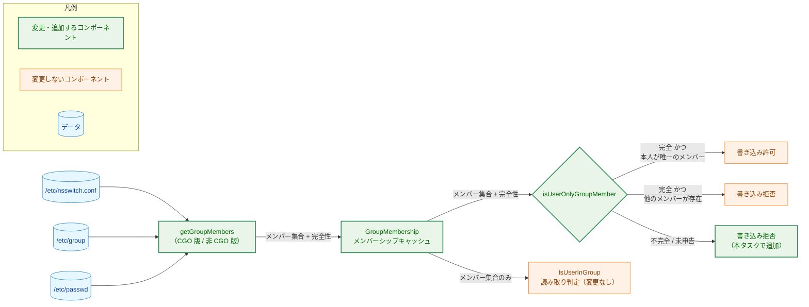
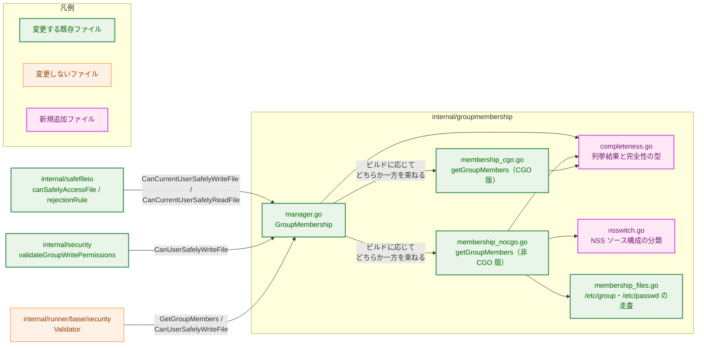
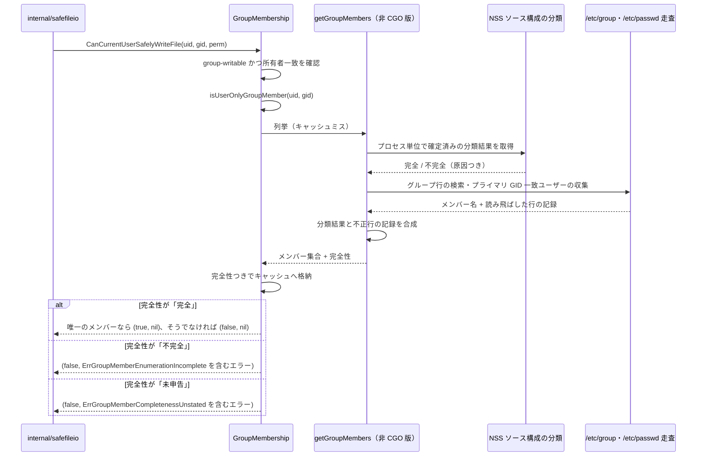
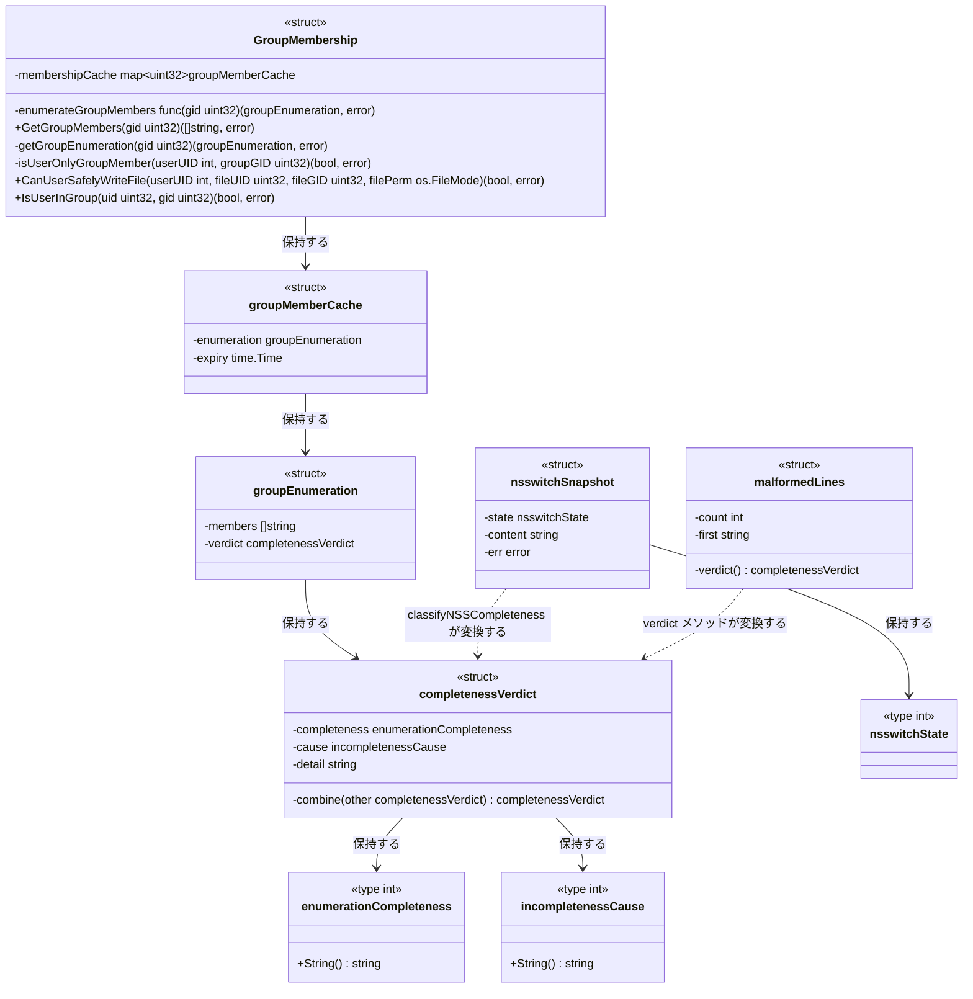
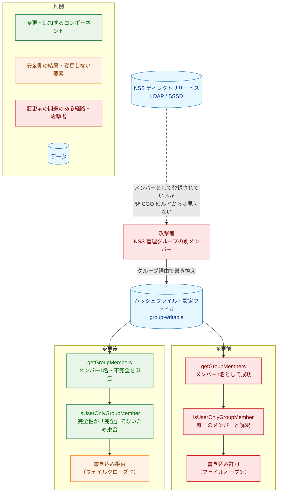
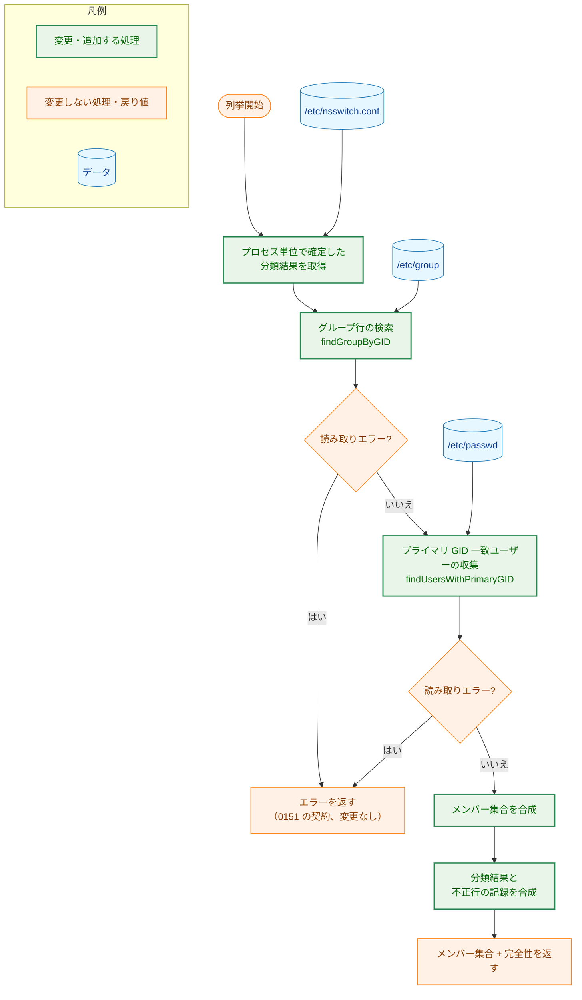
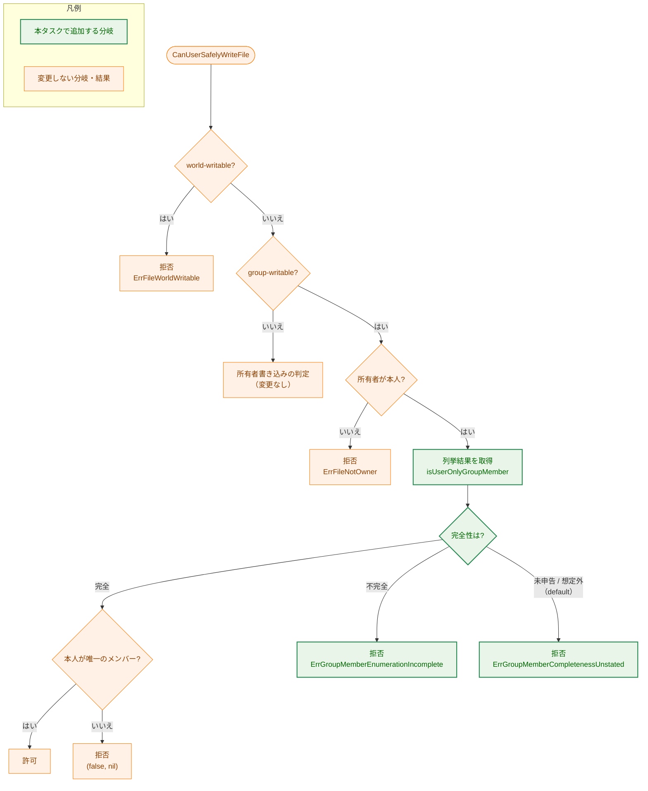

# アーキテクチャ設計書: groupmembership の列挙完全性の表明と fail-closed 化

## Document Status

| Item | Value |
|---|---|
| Status | `approved` |
| Created | 2026-08-26 |
| Review date | 2026-08-26 |
| Reviewer | issei |
| Comments | - |

## 0. 本書の位置づけ

本書は [`01_requirements.md`](01_requirements.md)（status: `approved`）が定めた振る舞い（WHAT）を、実現機構（HOW）へ落とし込む設計文書である。対象は監査所見 [`D1_groupmembership.md`](../0149_security_code_smell_audit_fable/findings/D1_groupmembership.md) の L-2（非 CGO ビルドが NSS 管理のメンバーを列挙しない）と L-3（パース不能な行を黙って読み飛ばす）であり、要件 F-001〜F-006（AC-01〜AC-29）に対応する。

設計の中心は `internal/groupmembership` にある。公開 API のシグネチャは変えないため、呼び出し元パッケージの**振る舞いを実現するコード**は変更を要しない。ただし、新しい拒否を運用者が診断できるようにするために、`internal/safefileio` と `internal/security` のエラーの包み方と記録に手を入れる（§4.4、§4.5）。要件書「対象外」が「呼び出し元パッケージの変更」を挙げているのは判定ロジックの変更を指しており、診断可能性のためのこの2箇所は AC-15・AC-18 を成立させるために必要である（§4.5 で理由を述べる）。

要件書が設計に委ねた論点と、本書で結論を確定する箇所は次のとおりである。

- 完全性を表す型の形と、メンバー集合との組み合わせ方 → §3.1
- `/etc/nsswitch.conf` の読み取りと分類の分離、および分類結果をいつ確定させるか → §3.2
- パース不能な行を呼び出し元へ伝える形 → §3.3
- 拒否時のエラーの分類と文面、記録の方針 → §4
- 既存の配布バイナリ利用者に対する影響範囲、移行、変更履歴への記載 → §5.5

## 用語

本書で用いる語のうち、[翻訳用語集](../../translation_glossary.md) に無いもの、または本書で意味を限定して使うものを先に定める。**「判定」と「分類」は別の概念として一貫して使い分ける。**

| 用語 | 意味 |
|---|---|
| 列挙 | 指定した GID のグループに属するユーザー名の集合を求める処理。`getGroupMembers` が行う |
| 列挙の完全性 | 列挙が返した集合が、そのグループの全メンバーを網羅しているかどうか。「完全」「不完全」「未申告」の3値をとる |
| 未申告 | 完全性を表す型のゼロ値。実装が完全性を設定しないまま値を返した状態を指し、環境要因による「不完全」とは区別する |
| 分類 | `/etc/nsswitch.conf` の内容とプラットフォームから、当該ビルドが全メンバーを列挙できるかどうかを決める処理。`classifyNSSCompleteness` が行う |
| 完全性判定 | 分類および不正行の記録を合成して得られる、列挙1回分の完全性とその理由。型 `completenessVerdict` |
| 判定 | ファイルへの読み書きが安全かどうかを決める処理。`CanUserSafelyWriteFile`・`CanCurrentUserSafelyReadFile` などが行う |
| NSS | Name Service Switch。`/etc/nsswitch.conf` の設定に従い、ユーザーデータベース・グループデータベースの参照先（`files`・LDAP・SSSD 等）を切り替える libc の仕組み |
| ユーザーデータベース種別 | 当該ビルドがユーザー照会に用いる仕組みの名称。定数 `userDatabaseSource` の値であり、CGO 版は `nss`、非 CGO 版は `passwd-file`。0160・0161 で導入した |

---

## 1. 設計の全体像

### 1.1 設計原則

1. **不完全な列挙を許可の根拠にしない**: 列挙が全メンバーを網羅していない可能性がある場合、その結果を「ユーザーが唯一のメンバーである」ことの根拠に使わない。書き込み判定は拒否側に倒す（フェイルクローズド）。
2. **完全性は推測せず型で申告する**: 呼び出し元が集合の中身や環境から完全性を推し量ることはしない。列挙の実装が完全性を値として申告し、判定側は `switch` でそれを読む。CLAUDE.md「Declare, don't infer」に従う。
3. **申告漏れと環境要因を区別する**: ゼロ値は「未申告」であり「不完全」ではない。前者はプログラムの誤り、後者は正常な完全性判定の結果であり、運用者の取るべき対処が異なる（§4.2）。どちらも拒否側に倒れる点は同じである。
4. **分類の定義を1箇所に置く**: `/etc/nsswitch.conf` の分類は production コードに1つだけ置き、テストはそれを呼ぶ。テスト専用の複製実装を残さない。
5. **入出力と純粋な処理を分ける**: ファイルを読む処理と、読んだ内容を分類・走査する処理を別の関数にする。後者はファイルシステムに触れないため、テストが内容を直接与えられる。この分離は `/etc/nsswitch.conf` の分類だけでなく、`/etc/group`・`/etc/passwd` の走査にも適用する（§3.3）。
6. **拒否は診断できなければ意味がない**: 新たに拒否が起きる以上、運用者が原因と回復手段に到達できることを設計の一部とする（§4.4、§4.5、§5.5）。
7. **読み取り経路は変えない**: 不完全な列挙は読み取り判定では既に拒否側に働くため、追加の制限を設けない（YAGNI）。

### 1.2 コンセプトモデル

本タスクの中核は、列挙結果に「この集合を信じてよいか」という1つの事実を同伴させ、その事実が「完全」でない限り書き込み許可へ到達させないことにある。



> 矢印 A → B は「A から B へ値が渡る」ことを表す。矢印のラベルは渡る値の内容である。円柱形はデータ（システムの情報源）、矩形はコンポーネント、菱形は判定を表す。凡例のノードは色分けの意味のみを示し、相互関係は表さない。
> `/etc/nsswitch.conf` を読むのは非 CGO 版のみである。CGO 版は libc の NSS を通じて列挙するため、分類を必要としない（§3.4）。

現行コードでは、非 CGO 版が NSS を参照しないまま少ない集合を返しても、パース不能な行を読み飛ばして集合が縮んでも、呼び出し元にはそれが「成功」としか見えない。本設計は、列挙結果に完全性を同伴させ（§3.1）、`isUserOnlyGroupMember` が「完全」以外を拒否することで（§3.6）この経路を閉じる。

---

## 2. システム構成

### 2.1 全体アーキテクチャ



> 矢印 A → B は「A が B を呼び出す、または B に依存する」ことを表す。矢印のラベルは呼び出す関数名または依存の性質である。凡例のノードは色分けの意味のみを示し、相互関係は表さない。
> `internal/safefileio` と `internal/security` を変更対象に含めるのは、新しい拒否を運用者が診断できるようにするためであり、判定ロジックは変えない（§4.5）。`internal/runner/base/security` は変更しない。

### 2.2 コンポーネント配置

| ファイル | ビルドタグ | 配置する内容 |
|---|---|---|
| `completeness.go`（新規） | なし | 列挙結果の型 `groupEnumeration`、完全性の型 `enumerationCompleteness`、不完全の原因 `incompletenessCause`、完全性判定 `completenessVerdict` とその合成 |
| `nsswitch.go`（新規） | `//go:build !cgo \|\| test` | `/etc/nsswitch.conf` の読み取りと分類、プロセス単位の分類の確定 |
| `membership_nocgo.go`（変更） | `//go:build !cgo` | 非 CGO 版 `getGroupMembers`。分類結果とパース不能行の記録を合成して完全性を申告する |
| `membership_files.go`（変更） | `//go:build !cgo \|\| test` | `/etc/group`・`/etc/passwd` の走査。読み飛ばした行の記録を戻り値に加える |
| `membership_cgo.go`（変更） | `//go:build cgo` | CGO 版 `getGroupMembers`。成功時は常に「完全」を申告する |
| `manager.go`（変更） | なし | 列挙の差し替え点、キャッシュ、`isUserOnlyGroupMember`、エラー定義 |

`completeness.go` にビルドタグを付けないのは、CGO 版・非 CGO 版の両方が同じ型を使うためである。`nsswitch.go` に `!cgo || test` を選ぶのは、CGO ビルドでのみ有効な意味論一致テスト（`membership_semantics_test.go`）が分類関数を呼ぶためであり、`membership_files.go` が同じ理由で同じタグを持っているのに倣う。

**ビルドタグの無いファイルは、両ビルドに存在する識別子だけを参照できる。** `manager.go` にはビルドタグが無いため、`nsswitch.go` の `nsswitchVerdict` を直接呼ぶことはできない。CGO ビルド（`test` タグ無し）では `nsswitch.go` が存在せず、コンパイルが通らないためである。§4.4 が求める起動時の分類の先行評価は、両ビルドに実装を持つ次の関数を経由して行う。

```go
// precomputeEnumerationEnvironment resolves whatever environment facts this
// build needs before the first enumeration, so that a build unable to
// enumerate every member says so at startup rather than at the first
// group-writable file. The cgo build has nothing to resolve.
func precomputeEnumerationEnvironment()
```

非 CGO 版（`membership_nocgo.go`）は `nsswitchVerdict()` を呼び、CGO 版（`membership_cgo.go`）は何もしない。`manager.go` の `EnsurePermissionCheckUID` はこの関数だけを呼ぶ。

### 2.3 データフロー

書き込み判定1回の流れを、非 CGO ビルドかつキャッシュミスの場合について示す。



---

## 3. コンポーネント設計

### 3.1 列挙結果と完全性の型（F-001 / AC-01, AC-02, AC-04）

列挙の戻り値を、メンバー集合と完全性を1つにまとめた値型にする。

```go
// enumerationCompleteness states whether an enumeration result covers all
// members of the group.
type enumerationCompleteness int

const (
	// completenessUnstated is the zero value: the enumeration did not state
	// its completeness. It is a programming error, not an environment
	// condition, and is never treated as complete.
	completenessUnstated enumerationCompleteness = iota
	// completenessComplete states that the result covers all members.
	completenessComplete
	// completenessIncomplete states that the result may omit members.
	completenessIncomplete
)

// String returns the completeness name, used in error messages.
func (c enumerationCompleteness) String() string

// incompletenessCause names why an enumeration was judged incomplete. It
// selects the remediation text of the denial message.
type incompletenessCause int

const (
	// causeUnspecified is the zero value and carries no cause. It is only
	// valid on a verdict whose completeness is not completenessIncomplete.
	causeUnspecified incompletenessCause = iota
	causeUnsupportedPlatform
	causeNSSSources
	causeMalformedLine
)

// String returns the cause name, used in error messages and skip reasons.
func (c incompletenessCause) String() string

// completenessVerdict is the completeness of one enumeration together with
// the reason behind it. Construct it with completeVerdict or
// incompleteVerdict so that an incomplete verdict always carries a cause.
type completenessVerdict struct {
	completeness enumerationCompleteness
	cause        incompletenessCause
	detail       string
}

// completeVerdict states that an enumeration covers all members.
func completeVerdict() completenessVerdict

// incompleteVerdict states that an enumeration may omit members, and why.
func incompleteVerdict(cause incompletenessCause, detail string) completenessVerdict

// combine returns v unless v is complete, in which case it returns other.
// An enumeration is complete only when every source of doubt says so, and
// the cause reported is the one evaluated first.
func (v completenessVerdict) combine(other completenessVerdict) completenessVerdict

// groupEnumeration is the result of one group member enumeration.
type groupEnumeration struct {
	members []string
	verdict completenessVerdict
}
```

**3値にする理由**は要件書「決定事項」に述べたとおりである。設計上の帰結は次の2点である。ゼロ値が「未申告」であるため、`groupEnumeration{}` をそのまま返す実装の誤りは「完全」には決してならず（AC-03）、かつ環境要因による「不完全」とも取り違えられない（AC-03a）。また `completenessIncomplete` を作る経路が `incompleteVerdict(cause, detail)` に限られるため、「理由のない不完全」という値は構築されない。

**構築関数を必須にする**のは、CLAUDE.md「Enforce invariants with the type, not with convention」に従い、原因の同伴を規約ではなく構築の形で保証するためである。`completeVerdict()` は原因を取らず、`incompleteVerdict(cause, detail)` は原因を必須の引数とする。フィールドはいずれも非公開であり、package 外からは構築も参照もできない。この非公開フィールドという性質はログ出力にも影響する。`completenessVerdict`・`groupEnumeration` を構造体のまま `slog.Any` へ渡してはならない理由を §4.4 に記す。

**`String()` の用途**は次の2つである。`incompletenessCause.String()` は §3.8 の skip 理由の組み立てに使う。`enumerationCompleteness.String()` は、`isUserOnlyGroupMember` が「未申告」または想定外の値に到達したときに、その値をエラーメッセージへ載せるために使う（§4.3）。表示名は既存の `PermissionCheckUIDPolicy.String()` に倣い、想定外の値を `unknown(N)` の形で表す。

**複数の材料の合成**には `combine` を使う。非 CGO 版の完全性は「NSS ソース構成の分類」と「パース不能行の有無」の2つから決まり、どちらか一方でも「不完全」なら結果は「不完全」である。完全へ戻る経路はない。先に評価した側の原因を残すため、分類を先に評価する（両方が不完全な場合は分類の原因が残る）。理由は、NSS 構成による不完全は環境そのものの制約であり、不正行の修正では解消しないためである。運用者にとって先に対処すべき原因を提示する。

**エラーとの関係**は 0151 が確立した契約を変えない（AC-04）。列挙 API がエラーを報告した場合は `(groupEnumeration{}, non-nil error)` を返し、完全性を読む前にエラーで拒否される。指定 GID のグループが存在しない場合は、空集合と当該ビルドの完全性を持つ値をエラーなしで返す。

### 3.2 NSS ソース構成の分類（F-002 / AC-05〜AC-10）

`/etc/nsswitch.conf` を読む処理と、読んだ内容を分類する処理を分ける。

```go
// nsswitchState says what happened when /etc/nsswitch.conf was read.
type nsswitchState int

const (
	// nsswitchUnread is the zero value: the file was not read. It is never
	// classified as complete.
	nsswitchUnread nsswitchState = iota
	// nsswitchAbsent means the file does not exist.
	nsswitchAbsent
	// nsswitchRead means the file was read successfully.
	nsswitchRead
	// nsswitchReadFailed means the file could not be read for any reason
	// other than not existing.
	nsswitchReadFailed
)

// nsswitchSnapshot is what one read of /etc/nsswitch.conf produced.
type nsswitchSnapshot struct {
	state   nsswitchState
	content string
	err     error
}

// readNsswitchSnapshot reads /etc/nsswitch.conf. It reports the outcome
// through the returned snapshot and never returns an error of its own.
func readNsswitchSnapshot() nsswitchSnapshot

// classifyNSSCompleteness decides whether a build that reads the user and
// group databases from files alone can enumerate all members, given the
// contents of /etc/nsswitch.conf and the target platform. It touches no
// files.
func classifyNSSCompleteness(snapshot nsswitchSnapshot, goos string) completenessVerdict

// nssSources returns the source names listed for one database in the
// contents of /etc/nsswitch.conf. A trailing "#" comment on the database
// line is stripped before tokenizing, and a bracketed action token —
// including one containing internal whitespace, such as
// "[NOTFOUND=return UNAVAIL=continue]" — is removed as a single unit rather
// than split on its interior spaces.
func nssSources(content string, database string) []string

// nsswitchVerdict returns the classification for this process. It reads and
// classifies on first call and reuses the result for the lifetime of the
// process, and records an incomplete classification once (see §4.4).
func nsswitchVerdict() completenessVerdict
```

**ファイルの不在を内容の空文字列で表さない**理由は、「読んでいない」「存在しない」「読めた」「読めなかった」が区別できなくなるためである。既存のテストヘルパ `shouldSkipSemanticsTest` は空文字列を「不在」の意味に流用しており、読み取り失敗を「不在」と同じ扱い（＝安全側でない扱い）にしていた。`nsswitchState` を持たせることで、AC-07 が挙げる3通り（不在・読み取り失敗・読み取り成功）に加え、ゼロ値としての「未読」を安全側の既定として表現でき、分類関数はファイルに触れないままそのすべてを入力として受け取れる（AC-10）。

**「存在しない」と見なす条件は `errors.Is(err, fs.ErrNotExist)` に限る。** 親ディレクトリの `EACCES` など、それ以外の失敗はすべて `nsswitchReadFailed`（＝不完全）に落とす。ここを取り違えると読み取り失敗が「完全」の申告に化け、本タスクが閉じようとしている穴がそのまま残る。

分類規則は次のとおりである。上から順に評価し、最初に一致した行の完全性判定を返す。

| 条件 | 完全性 | 原因 |
|---|---|---|
| `goos` が `linux` 以外 | 不完全 | `causeUnsupportedPlatform` |
| `state` が `nsswitchAbsent` | 完全 | — |
| `state` が `nsswitchRead` かつ `passwd`・`group` 両方にソース名が1つ以上あり、いずれも `files`・`systemd` のみ | 完全 | — |
| `state` が `nsswitchRead` かつ `passwd` または `group` の行が無い、またはその行にソース名が1つも残らない | 不完全 | `causeNSSSources` |
| `state` が `nsswitchRead` かつ許可リスト外のソースを含む | 不完全 | `causeNSSSources` |
| `state` が `nsswitchReadFailed` | 不完全 | `causeNSSSources` |
| 上記以外（`nsswitchUnread` および想定外の値） | 不完全 | `causeNSSSources` |

`switch` の `default` が「不完全」に倒れるため、`nsswitchState` に値が追加されても既定の扱いは拒否側である。

**許可リスト方式**を採り、`files`・`systemd` のみを「完全」の根拠として認める（AC-08）。`compat`・`db`・`ldap`・`sss`・`nis`・`winbind` およびすべての未知の名前は不完全とする。とくに `compat` は `+`／`-` エントリ経由で NIS を引き込みうるため、名前が既知であることを理由に許容しない。ブロックリスト方式では、将来登場する NSS モジュールがすべて既定で「完全」と誤判定される。

**角括弧トークンの扱い**は、`[NOTFOUND=continue]` のような動作指定をソース名から除くことである（AC-09）。これらはソースではなく、直前のソースに対する動作の指定であり、それ自体が参照先を増やすことはない。したがって `group: files [NOTFOUND=continue]` は「完全」である。ただし `group: [NOTFOUND=return]` のようにソース名が1つも残らない行は、行が無いのと同じく「不完全」とする。AC-09 が禁じているのは「角括弧トークンがそれ自体で不完全の理由になること」であり、ソース名を1つも持たない行を不完全とすることはこれに反しない。当該データベースの参照先が読み取れない以上、網羅性を保証できないためである。

角括弧トークンは `[NOTFOUND=return UNAVAIL=continue]` のように内部に空白を含みうる（nsswitch.conf(5)）。空白区切りでトークン化してから `[` で始まるものだけを除く実装では、この閉じ括弧より前で区切られてしまい、`UNAVAIL=continue]` の部分が素性不明のソース名として残る。`nssSources` は角括弧の対応（`[` から対応する `]` まで）を1つのトークンとして扱い、内部の空白で分割しない。

**行末コメントの扱い**は、`group: files systemd # local users only` のように許可された構成のあとに `#` コメントが続く行を、コメントを除いた `files systemd` として分類することである。`nssSources` はデータベース行を1行ずつ処理し、トークン化の前に `#` 以降を切り捨てる。`#` が角括弧トークンの内部（`[...]`）に現れることは nsswitch.conf の文法上ない。コメントを切り捨てずにトークン化すると、`#` 自身と後続の語がすべて素性不明のソース名として残り、本来「完全」であるべき構成が「不完全」に分類される。

**`systemd` を許可リストに含める根拠**は要件書「決定事項」に述べたとおりであり、`nss-systemd` が提供する主体（`DynamicUser=` の一時 UID、`systemd-homed` のユーザー、`machined` のマッピング）が本ツールの保護対象ファイルのグループを共有する立場になりにくいこと、および Ubuntu の既定 `/etc/nsswitch.conf` が `passwd: files systemd` であることによる。残存リスクは §5.4 に記す。

**`/etc/nsswitch.conf` は通常の読み取りで取得し、`internal/safefileio` は経由しない。** これは意図した割り切りである。このファイルを差し替えられる者は「不完全」を「完全」へ倒せるが、同じ権限があれば `/etc/group` を直接書き換えて自分をメンバー一覧から消すこともでき、後者のほうが単純で確実である。したがって整合性検査を加えても攻撃者の能力は減らない。この前提は §5.4 に残存リスクとして記録する。

**分類はプロセス単位で1回だけ確定させる**。`nsswitchVerdict` が最初の呼び出しで `/etc/nsswitch.conf` を読んで分類し、以後は同じ結果を返す。理由は次の2つである。

- 書き込み判定を実行内で一貫させるため。ファイルごとに読み直すと、実行の途中で `/etc/nsswitch.conf` が変われば、同じ実行の中で許可されるファイルと拒否されるファイルが混在する。運用者から見て再現しない拒否になる。
- 読み取り回数を実行あたり1回に抑えるため。書き込み判定は対象ファイルごとに実行されるため、都度読むと不要な入出力が増える。

この選択は、`/etc/nsswitch.conf` の変更をプロセスが終わるまで観測しないことを意味する。**この窓はプロセスの生存期間そのものであり、上限はない。** `runner` は設定された複数のコマンドを実行し、その最中にも出力先の書き込み権限を検査する（`internal/runner/base/output/manager.go` からの `ValidateOutputWritePermission`）ため、数時間に及ぶ実行では窓も数時間になる。既存のメンバーシップキャッシュ（30 秒）とは異なり自動で失効せず、`ClearCache()` でも解除されない。それでもこの形を採るのは、実行内で判定が揺れないことのほうが運用上の価値が大きいと判断したためである。危険側への変化（`files` のみの構成に `sss` が追加される）を実行中に取り逃す点は §5.4 に残存リスクとして記す。

### 3.3 パース不能な行の伝達（F-003 / AC-11〜AC-13）

`/etc/group`・`/etc/passwd` の走査が読み飛ばした行を、戻り値で呼び出し元へ伝える。あわせて、走査の中身をファイルパスから切り離す。

```go
// malformedLines records the lines a scan skipped as unparsable.
type malformedLines struct {
	count int
	first string // "file:line" of the first skipped line; empty when count is 0
}

// verdict returns an incomplete verdict when any line was skipped, and a
// complete verdict otherwise.
func (m malformedLines) verdict() completenessVerdict

// scanGroupFile searches r, whose contents are in /etc/group format, for the
// entry with the given GID. source names r in log records and in the
// recorded position of skipped lines. It reads r to the end so that the
// skipped-line record does not depend on where the entry appears.
func scanGroupFile(r io.Reader, source string, gid uint32) (*groupEntry, malformedLines, error)

// scanPasswdFile returns the users in r, whose contents are in /etc/passwd
// format, whose primary GID is gid.
func scanPasswdFile(r io.Reader, source string, gid uint32) ([]string, malformedLines, error)

// findGroupByGID searches /etc/group for the entry with the given GID.
func findGroupByGID(gid uint32) (*groupEntry, malformedLines, error)

// findUsersWithPrimaryGID returns the users whose primary GID is gid,
// according to /etc/passwd.
func findUsersWithPrimaryGID(gid uint32) ([]string, malformedLines, error)

// enumerateFromFiles lists the members of the group with the given GID from
// /etc/group and /etc/passwd. nssVerdict is what this build's environment
// already says about its ability to see every member; the returned
// completeness combines it with the lines the scans had to skip. Taking the
// verdict as a parameter is what lets a test drive the whole enumeration
// with a chosen classification.
func enumerateFromFiles(gid uint32, nssVerdict completenessVerdict) (groupEnumeration, error)
```

読み飛ばした行が1行でもあれば、その列挙は「不完全」である（AC-11）。要件書「背景」に述べたとおり、パース不能になる主因は GID フィールドの解析失敗であり、その行がどの GID のものだったかは定義上わからない。したがって「対象 GID の行だったか」で絞り込むことはせず、走査全体を不完全として扱う。

**走査は必ず最後まで読む。** 現行の `findGroupByGID` は対象 GID の行に一致した時点で `return` するため、その行より後ろにある不正行を見ない。この形のまま不正行を数えると、同じ `/etc/group` に対して「先頭寄りの GID は完全、末尾寄りの GID は不完全」という、ファイルの性質ではなく行の並びに依存する結果になる。同じ実行の中で再現しない拒否が生じ、§3.2 が `/etc/nsswitch.conf` について避けたのと同じ問題を招く。不正行を対象エントリより後ろに置くだけで検出を逃れられる点でも望ましくない。エントリ自体は一致した時点で保持し、走査はファイル末尾まで続ける。追加の費用は `/etc/group` 1回分の読み切りであり、結果は 30 秒キャッシュされる。

**入出力とパースを分ける**（§1.1 原則5）。`scanGroupFile`・`scanPasswdFile` が `io.Reader` を受け取り、`findGroupByGID`・`findUsersWithPrimaryGID` はファイルを開いてそれらに渡すだけの薄い包みになる。これは §7.4 に述べる理由から必須である。現在の `membership_nocgo_test.go` の各テストは、production の走査関数を呼ばずに走査ループをテスト内へ複製しており、この形のままでは新しい不正行の記録が production コードに対して一度も検証されない。

`first` に最初の1件の位置だけを保持するのは、エラーメッセージが運用者に最初に修正すべき行を示せればよいためである。全件の一覧は既存の `slog.Warn` 出力（ファイル名・行番号・エラー）が担い、この出力は変更しない（AC-12）。空行と `#` で始まる行は現行どおり不正行として数えない（AC-13）。

**NIS 互換エントリは不正行として数える。** `/etc/passwd`・`/etc/group` の `+`・`+@netgroup`・`-username` で始まる行（`compat` ソースが解釈する NIS 引き込みエントリ）は、フィールド数または GID フィールドの解析に失敗するため、現行のパーサでは不正行になる。これらが存在するホストでは、すべての GID の列挙が恒久的に不完全となる。この扱いは安全側として妥当である。そのようなホストは実際に NIS からユーザーを引いており、ローカルファイルだけの列挙は本当に不完全だからである。一方で回復手段は異なる。行を削除させるのは誤った助言であり、`CGO_ENABLED=1` でのビルドが正しい対処である。したがって §4.3 の `causeMalformedLine` の文面は、行の修正だけでなく NIS 互換エントリの可能性にも触れるものとする。

### 3.4 CGO 版の完全性（F-001 / AC-02）

CGO 版 `getGroupMembers` は、成功時に常に `completeVerdict()` を返す。libc の `getgrgid_r`・`getpwent` は NSS を経由するため、`/etc/nsswitch.conf` に設定されたすべてのソースを参照する。したがって非 CGO 版のような分類を必要としない。

ただし「常に完全」という申告には、要件書が対象外とした残存リスクがある。SSSD は既定で `enumerate = false` であり、その構成では `getpwent` がディレクトリ管理ユーザーを返さない。すなわち CGO 版のプライマリメンバー収集も NSS バックエンドの設定次第で不完全になりうる。この見極めは `/etc/nsswitch.conf` からは行えず、バックエンドごとの設定調査を要するため本タスクでは扱わない（§5.4、AC-29 の Issue 分離）。

### 3.5 キャッシュと列挙の差し替え点（F-004 / AC-19, AC-04a）

キャッシュのエントリと列挙の差し替え点が、メンバー集合ではなく列挙結果全体を扱うようにする。

```go
// groupMemberCache holds a cached enumeration result with its expiry.
type groupMemberCache struct {
	enumeration groupEnumeration
	expiry      time.Time
}

// enumerateGroupMembers is the function used to list group members.
// New() sets it to getGroupMembers (the build-specific implementation).
// Tests may replace it to inject deterministic results and failures.
enumerateGroupMembers func(gid uint32) (groupEnumeration, error)

// getGroupEnumeration returns the cached or freshly computed enumeration
// result for gid, including its completeness.
func (gm *GroupMembership) getGroupEnumeration(gid uint32) (groupEnumeration, error)

// GetGroupMembers returns all members of a group given its GID.
// Results are cached for performance with the configured timeout.
func (gm *GroupMembership) GetGroupMembers(gid uint32) ([]string, error)
```

完全性はメンバー集合と同じエントリに格納するため、キャッシュヒット時にも失われない（AC-19）。キャッシュ有効期間・失効処理・エラーをキャッシュしない扱いは現行のままである。

公開 API `GetGroupMembers` は、キャッシュ層 `getGroupEnumeration` の戻り値からメンバー集合だけを取り出して返す薄い包みになる。戻り値の型と意味は変わらないため、`internal/runner/base/security` と `internal/safefileio` は無変更で従来どおり動作する（AC-04a）。完全性を必要とするのは package 内の `isUserOnlyGroupMember` だけであり、そこからは `getGroupEnumeration` を直接呼ぶ。

`GetGroupMembers` が完全性を捨てることは、意図した設計である。要件書「決定事項」のとおり、package 外の唯一の呼び出し元（[`file_validation.go:336`](../../../internal/runner/base/security/file_validation.go#L336)）は「メンバーに含まれる」ことを根拠に `true` を返す用法であり、集合が実際より小さければ拒否側に働く。完全性を渡しても呼び出し元がすることは無い。

### 3.6 `isUserOnlyGroupMember` の分岐（F-004 / AC-14〜AC-17）

`isUserOnlyGroupMember` は列挙結果の完全性を `switch` で読み、「完全」の場合にのみ従来の判定を行う。

| 完全性 | 戻り値 |
|---|---|
| `completenessComplete` | 従来どおり。集合の要素が本人1名だけなら `(true, nil)`、そうでなければ `(false, nil)` |
| `completenessIncomplete` | `(false, ErrGroupMemberEnumerationIncomplete を含むエラー)` |
| `completenessUnstated` および想定外の値（`default`） | `(false, ErrGroupMemberCompletenessUnstated を含むエラー)` |

`default` が「完全」として扱われることはない（AC-03）。`CanUserSafelyWriteFile` の group-writable 分岐はこの戻り値をそのまま返すため、不完全な列挙では `(false, non-nil error)` になる（AC-15）。

完全性が「完全」である場合の判定結果は本タスクの前後で変わらない（AC-16）。world-writable の一律拒否、非所有者の拒否、owner-writable の許可はいずれも完全性を読む位置より手前にあり、経路が変わらない。

`IsUserInGroup` と `CanCurrentUserSafelyReadFile` は完全性を読まない（AC-17）。`IsUserInGroup` は `GetGroupMembers` を呼び続けるため、集合が実際より小さければ「メンバーでない」と判定され、読み取りは拒否側に倒れる。すなわちこの経路は不完全性に対して既にフェイルクローズドであり、追加の拒否は過剰である。

### 3.7 ビルド構成への依存 — 0151 の設計原則に対する意図的な例外

**元の方針とその所在**: [`0151/02_architecture.md`](../0151_groupmembership_failclosed/02_architecture.md) §1.1 の設計原則2「意味論の単一化」は、「CGO 版・非 CGO 版の両実装が同じ集合を返すようにする。セキュリティ判定結果をビルド構成に依存させない」と定めている。

**本設計が例外となる理由**: 本設計の後も、両実装が返す**メンバー集合**は同じ環境では一致する（0151 の意味論統一はそのまま維持される）。変わるのは、非 CGO 版が NSS 環境では「この集合は網羅的でない」と申告する点である。その結果、同じ NSS 環境の同じファイルに対して、CGO ビルドは group-writable の書き込みを許可しうるのに対し、非 CGO ビルドは拒否する。すなわち**判定結果**はビルド構成に依存するようになる。

これは意図した例外である。0151 の原則は「実装の違いが判定の緩さの違いに化けること」を防ぐためのものであり、本設計はその緩い側（非 CGO）を安全側へ倒す。両者を一致させるもう一方の方法は、CGO 版も非 CGO 版に合わせて拒否することだが、CGO 版は実際に NSS を参照しており、その集合を疑う根拠がない。要件書「対象外」のとおり、リリースビルドを `CGO_ENABLED=1` に変えて差そのものを無くす案は、cgo でのクロスコンパイルに target ごとのツールチェーンを要するため本タスクの範囲を超える。

**更新が必要な既存テスト**: この例外により、非 CGO ビルドで実環境の列挙を用いて group-writable の許可を確認する既存テストは、NSS 環境（および Linux 以外）では拒否を受け取るようになる。該当は `internal/groupmembership/manager_test.go` の次の3件である。

| テスト | 現在の期待 |
|---|---|
| `TestCanUserSafelyWriteFile` / サブテスト「group writable file - owner only allowed if exclusive group member」 | `assert.NoError` を無条件に期待し、`canWrite` の真偽は問わない |
| `TestCanCurrentUserSafelyWriteFile_AllPermissions` / サブテスト「group_writable_member」 | `assert.NoError` に加えて `assert.True(canWrite)` を期待するため、より強く壊れる |
| `TestCanCurrentUserSafelyWriteFile_EdgeCases` / 表の行「group_read_write」（`0o664`） | エラーなしを期待する |

いずれも、列挙が不完全と申告された場合に `ErrGroupMemberEnumerationIncomplete` を許容するよう更新する。`TestCanCurrentUserSafelyReadFile` の「consistency with write function」は書き込み側のエラーを既に許容しており、「special_permission_bits」の各モードは group-writable ではないため、影響しない。

**package 外のテストの調査結果**: group-writable なモードを作り、`dirPermChecker` または `Validator` を経由して `CanUserSafelyWriteFile` に到達しうるテストとして、`internal/safefileio/safe_file_test.go`、`internal/runner/base/security/file_validation_test.go`、`internal/runner/base/security/destination_zoning_test.go`、`internal/runner/base/security/trusted_gids_linux_test.go` の4ファイルを確認した。これらは実装時に、非 CGO ビルドかつ分類が「不完全」となる環境で実際に実行して結果を確かめる（§7.5）。開発者の手元が `files` のみの構成である場合、この破綻は手元では現れず CI で初めて現れうるため、実装時に分類結果を強制した状態での実行を必ず行う。

### 3.8 分類の定義の一元化（F-005 / AC-20）

`membership_semantics_test.go` の `shouldSkipSemanticsTest`・`nssSources` を削除し、`TestGetGroupMembers_CGOAndNoCGOSemanticsMatch` は `readNsswitchSnapshot` と `classifyNSSCompleteness` を呼んで、結果が「完全」でない場合に skip する。skip の理由は `incompletenessCause.String()` と `detail` から組み立てる。これにより分類の定義は production コード側の1箇所だけになる。

skip の対象となる環境集合は、**読み取り失敗の1件を除いて**本タスクの前後で同じである。

| 環境 | 変更前 `shouldSkipSemanticsTest` | 変更後 `classifyNSSCompleteness` | skip の一致 |
|---|---|---|---|
| `darwin` | skip | 不完全（`causeUnsupportedPlatform`） | 一致 |
| `linux` 以外のその他 | skip | 不完全（`causeUnsupportedPlatform`） | 一致 |
| `linux`・`/etc/nsswitch.conf` 不在 | skip しない | 完全 | 一致 |
| `linux`・読み取り失敗 | skip しない | 不完全（`causeNSSSources`） | **不一致（変更後のみ skip）** |
| `linux`・`files` のみ | skip しない | 完全 | 一致 |
| `linux`・`files systemd` | skip しない | 完全 | 一致 |
| `linux`・`sss` や `ldap` を含む | skip | 不完全（`causeNSSSources`） | 一致 |
| `linux`・`passwd` または `group` の行が無い | skip | 不完全（`causeNSSSources`） | 一致 |
| `linux`・`files` に角括弧トークンが付随する | skip しない | 完全 | 一致 |
| `linux`・角括弧トークンのみでソース名が無い | skip | 不完全（`causeNSSSources`） | 一致 |

読み取り失敗の行が変わるのは、変更前の実装が読み取り失敗を「不在」と同じ空文字列に潰していたためである（§3.2）。変更後は skip する側、すなわち安全側へ動く。AC-20 は「本タスクの前後で同じ環境集合を対象とする」と書いているが、この1件は AC-07 が読み取り失敗を「不完全」と定めていることの直接の帰結であり、両者を同時に満たすことはできない。AC-07 を優先し、AC-20 の意図（テスト専用の複製実装を残さないこと、および意味論一致テストの適用範囲を実質的に変えないこと）は満たされていると解釈する。この解釈の可否はレビューで確認を求める。

既存の `TestShouldSkipSemanticsTest` のテーブルは、`classifyNSSCompleteness` に対するテストとして `nsswitch_test.go` へ移設する。移設にあたり、読み取り失敗の行と、ソース名が1つも残らない行を追加する。

### 3.9 型の関係



> 実線矢印 A → B は「A が B を保持する」、破線矢印 A ⇢ B は「A から B が導かれる」ことを表し、破線のラベルは変換を行うコンポーネントを示す。クラス図は色分けを用いないため凡例はない。
> `groupMemberCache` の `enumeration` フィールド、`GroupMembership` の `enumerateGroupMembers` の型、および `getGroupEnumeration` が本タスクで変更・追加する部分である。`GetGroupMembers`・`isUserOnlyGroupMember`・`CanUserSafelyWriteFile`・`IsUserInGroup` のシグネチャは現行の `manager.go` そのままであり、本タスクで変えない。図には本タスクの経路に関わる要素のみを抜粋しており、`PermissionCheckUIDPolicy`・`sudoUIDExistenceMemo`・`CacheStats` などは省略した。

### 3.10 コンポーネント責務表

| ファイル | 区分 | 責務 | 対応 AC |
|---|---|---|---|
| `internal/groupmembership/completeness.go` | 新規 | 完全性・原因・完全性判定・列挙結果の型と構築関数、合成 `combine`、`String()` | AC-01, AC-02 |
| `internal/groupmembership/nsswitch.go` | 新規 | `/etc/nsswitch.conf` の読み取り（`readNsswitchSnapshot`）、分類（`classifyNSSCompleteness`、`nssSources`）、プロセス単位の分類の確定と1回限りの記録（`nsswitchVerdict`） | AC-05〜AC-10, AC-18 |
| `internal/groupmembership/membership_nocgo.go` | 変更 | 非 CGO 版列挙。分類結果と不正行の記録を合成して完全性を申告（`enumerateFromFiles`）。`precomputeEnumerationEnvironment` の非 CGO 版実装 | AC-05, AC-11, AC-18 |
| `internal/groupmembership/membership_files.go` | 変更 | 走査を `io.Reader` 受け取りに分離し、末尾まで読み切って `malformedLines` を返す。既存の `slog.Warn` は維持 | AC-11〜AC-13 |
| `internal/groupmembership/membership_cgo.go` | 変更 | CGO 版列挙。成功時は常に「完全」を申告。`precomputeEnumerationEnvironment` の CGO 版実装（何もしない） | AC-02 |
| `internal/groupmembership/manager.go` | 変更 | 列挙の差し替え点の型変更、キャッシュへの完全性の格納、`isUserOnlyGroupMember` の分岐、sentinel エラーとメッセージ、`EnsurePermissionCheckUID` からの `precomputeEnumerationEnvironment` 呼び出し | AC-03, AC-03a, AC-14〜AC-19 |
| `internal/safefileio/safe_file.go` | 変更 | `rejectionRule` に新しい sentinel に対応する規則名を追加（§4.5） | AC-18 |
| `internal/security/dir_permissions_unix.go` | 変更 | `validateGroupWritePermissions` のエラー包装を `%v` から `%w` へ改め、sentinel が `errors.Is` で辿れるようにする（§4.5） | AC-15 |
| `internal/groupmembership/test_helpers.go` | 変更 | `newWithEnumerator` の引数の型を新しい列挙の差し替え点に合わせる | AC-04a, AC-19 |
| `internal/groupmembership/nsswitch_test.go` | 新規 | `classifyNSSCompleteness` のテーブルテスト（`TestShouldSkipSemanticsTest` からの移設と拡張） | AC-05〜AC-10 |
| `internal/groupmembership/completeness_test.go` | 新規 | `combine`・構築関数・`String()` のテスト | AC-01 |
| `internal/groupmembership/membership_semantics_test.go` | 変更 | `shouldSkipSemanticsTest`・`nssSources` を削除し production の分類関数を呼ぶ。走査関数の戻り値変更に追随 | AC-20 |
| `internal/groupmembership/membership_nocgo_test.go` | 変更 | 走査ループの複製を削除し `scanGroupFile`・`scanPasswdFile` を直接呼ぶ。不正行の記録と合成を検証 | AC-11〜AC-13, AC-21 |
| `internal/groupmembership/membership_common_test.go` | 変更 | `getGroupMembers` の戻り値変更に追随 | AC-22 |
| `internal/groupmembership/membership_cgo_test.go` | 変更 | `getGroupMembers` の戻り値変更に追随。CGO 版が「完全」を申告することを検証 | AC-02 |
| `internal/groupmembership/manager_test.go` | 変更 | `newWithEnumerator` の呼び出しに完全性を与える。不完全・未申告の拒否を検証。§3.7 の3件のサブテストを更新 | AC-03a, AC-14〜AC-19 |
| `internal/security/dir_permissions_unix_test.go` | 変更 | sentinel が `ValidateDirectoryPermissionsWithOptions` を越えて `errors.Is` で辿れることを検証 | AC-15 |
| `docs/user/security-risk-assessment.ja.md` | 変更 | §3 の「既知の制限」を本タスク後の挙動へ更新 | AC-23 |
| `docs/user/record_command.ja.md`・`verify_command.ja.md` | 変更 | トラブルシューティングに拒否への対処を追加（NSS 環境、不正行、macOS の3種） | AC-24 |
| 上記3文書の英語版 | 変更 | `/mktrans` による反映 | AC-25 |
| `CHANGELOG.ja.md` | 変更 | 「未リリース」→「破壊的変更」に本変更の項目を追加。拒否が起きる条件・影響範囲・事前の判定手順・回復手段・切り戻しを記載（§5.5）。あわせて同じ「未リリース」ブロックの「セキュリティ」にある既存項目「既知の制限: 公式バイナリ（`CGO_ENABLED=0`）は…NSS を参照しない」を解消する（§5.5） | AC-30, AC-32 |
| `CHANGELOG.md` | 変更 | `/mktrans` による反映（新項目と既存項目の解消の両方） | AC-31, AC-33 |
| `docs/tasks/0168_.../01_requirements.md` | 変更 | 「対象外」節で分離した2件の Issue 番号を追記 | AC-29 |
| `docs/tasks/0149_.../98_remaining_issues.md` | 変更 | D1 から L-2・L-3 を除き、対応結果を引用ブロックで記載。分離した2件の Issue を追加 | AC-26, AC-28, AC-29 |
| `docs/tasks/0149_.../findings/D1_groupmembership.md` | 変更 | L-2・L-3 に対応結果と残存リスクを追記。所見の原文は保持 | AC-27 |

### 3.11 受け入れ基準と設計の対応

| AC | 対応箇所 |
|---|---|
| AC-01, AC-02, AC-04 | §3.1、§3.4 |
| AC-03, AC-03a | §3.6、§4.1 |
| AC-04a | §3.5 |
| AC-05〜AC-10 | §3.2 |
| AC-11〜AC-13 | §3.3 |
| AC-14〜AC-17 | §3.6 |
| AC-18 | §4.3、§4.4、§4.5 |
| AC-19 | §3.5 |
| AC-20 | §3.8（読み取り失敗の1件について解釈を付す） |
| AC-21 | §7.3 |
| AC-22 | §7.5 |
| AC-23, AC-24 | §3.10 の文書行、§5.5、§8 Phase 5 |
| AC-25 | §8 Phase 5 |
| AC-26, AC-27 | §3.10 の文書行、§8 Phase 5 |
| AC-28 | §7.6（静的確認の方法） |
| AC-29 | §3.10 の `01_requirements.md` 行と `98_remaining_issues.md` 行、§8 Phase 5 |
| AC-30, AC-31 | §5.5、§3.10 の `CHANGELOG` 行、§8 Phase 5 |
| AC-32, AC-33 | §5.5「既存の未リリース項目との整合」、§3.10 の `CHANGELOG` 行、§8 Phase 5 |

---

## 4. エラーハンドリング設計

### 4.1 エラー型

`manager.go` に既存の sentinel エラーと並べて2つを追加する。

```go
// ErrGroupMemberEnumerationIncomplete is returned when a group member
// enumeration could not cover all members of the group, so its result must
// not be used as grounds for granting write access.
var ErrGroupMemberEnumerationIncomplete = errors.New("group member enumeration is incomplete")

// ErrGroupMemberCompletenessUnstated is returned when an enumeration result
// carries no completeness statement. This is a defect in the enumeration
// implementation, not an environment condition.
var ErrGroupMemberCompletenessUnstated = errors.New("group member enumeration completeness was not stated")
```

両者を分けるのは、運用者と開発者の取るべき対処が異なるためである。前者は環境（NSS 構成、プラットフォーム、ユーザーデータベースの不正行）に起因し、`CGO_ENABLED=1` でのビルドまたは不正行の修正で解消する。後者はコードの誤りであり、運用者の操作では解消しない。`errors.Is` で相互に区別できる（AC-03a）。

公開の識別子とするのは、包まれたあとでも呼び出し元が `errors.Is` で判別できるようにするためであり、既存の `ErrGroupWritableNonMember` などと同じ扱いである。ただし現行の包み方のままでは判別が成立しない経路があるため、§4.5 で1箇所を改める。

### 4.2 エラーの分類規則

| `isUserOnlyGroupMember` が受け取った状態 | 分類 | 返す sentinel |
|---|---|---|
| 列挙 API がエラーを返した | 列挙の失敗（0151 で確立済み、変更なし） | 列挙 API のエラーをそのまま包む |
| 完全性が「不完全」、原因が `causeUnsupportedPlatform` または `causeNSSSources` | 環境の制約 | `ErrGroupMemberEnumerationIncomplete` |
| 完全性が「不完全」、原因が `causeMalformedLine` | ユーザーデータベースの内容 | `ErrGroupMemberEnumerationIncomplete` |
| 完全性が「未申告」または想定外の値 | 実装の誤り | `ErrGroupMemberCompletenessUnstated` |

判定はいずれの分類でも拒否であり、分類は運用者と開発者への案内のためだけに存在する。

### 4.3 エラーメッセージ設計（AC-18）

メッセージは既存の `SUDO_UID` 関連エラー（`manager.go` の `resolvePermissionCheckUID`）が採る「事実 → 確認事項 → 回復手段」の順に組み立て、`user_database_source` の値を必ず含める。回復手段は `incompletenessCause` に対する `switch` で選ぶ。文字列の内容から分岐することはしない。

| 原因 | 事実 | 確認事項と回復手段 |
|---|---|---|
| `causeUnsupportedPlatform` | 当該ビルドはこのプラットフォームでグループメンバーを網羅的に列挙できない | `CGO_ENABLED=1` でビルドし直す。macOS の配布バイナリが該当する（§5.4） |
| `causeNSSSources` | `/etc/nsswitch.conf` が当該ビルドの参照できないソースを指定している、または読み取れない（`detail` に該当するデータベース名とソース名、または読み取り失敗の理由） | 構成を確認し、`CGO_ENABLED=1` でビルドし直す |
| `causeMalformedLine` | ユーザーデータベースのファイルにパース不能な行があり読み飛ばした（`detail` に件数と最初の位置） | 該当行を確認する。書式の誤りであれば修正して再実行する。NIS 互換エントリ（`+`・`-` で始まる行）であれば行は正しく、`CGO_ENABLED=1` でビルドし直すのが対処である |
| `causeUnspecified` および想定外の値 | 不完全と判定されたが原因が記録されていない | 実装の誤りとして報告する |

`causeUnspecified` の行は、`incompleteVerdict` が原因を必須にしている以上、到達しない想定である。それでも `default` を持つのは、原因の列挙が将来増えたときにメッセージ生成が黙って空文字列を返さないようにするためである。判定は他の行と同じく拒否である。

「未申告」のメッセージには、`enumerationCompleteness.String()` の値（`unstated` または `unknown(N)`）を載せ、環境要因ではなく実装の誤りであることを明示する。

`detail` に含めるのは、運用者が環境と突き合わせる対象そのもの（データベース名・ソース名・ファイル名と行番号）に限る。`/etc/nsswitch.conf` や `/etc/passwd` の行の内容をそのまま転記することはしない。

既存のエラー（`ErrFileWorldWritable`・`ErrGroupWritableNonMember`・`ErrPermissionsExceedMaximum`・`ErrGroupMemberEnumeration`）の文面は変更しない。

### 4.4 記録（ログ）の方針

**分類が「不完全」となったことは、プロセスにつき1回だけ `slog.Warn` で記録する。** 記録は `nsswitchVerdict` が分類を確定させる時点で行い、`user_database_source`・原因・`detail` を属性として持つ。この形は既存の `sudoUIDAdoptionReporter`（`manager.go`）に倣ったものである。これは採用事実をプロセスにつき1回だけ記録する仕組みである。

**`completenessVerdict`・`groupEnumeration` を構造体のまま `slog.Any` などでログに渡してはならない。** 両者は §3.1 のとおり全フィールドが非公開であり、`internal/redaction` の構造体走査（`RedactingHandler.processStruct`）は reflection でエクスポート済みフィールドを列挙し、1つも無い場合は内容を見ずに `RedactionFailurePlaceholder`（`"[REDACTION FAILED - OUTPUT SUPPRESSED]"`）へ丸ごと置き換える（fail-secure）。したがって構造体をそのまま渡すと、`cause`・`detail` を含む診断情報が一切表示されないまま消える。これは値の一部を隠す通常の redact ではなく診断情報の完全な喪失であり、§1.1 原則6「拒否は診断できなければ意味がない」に反する。ここで述べた `user_database_source`・原因（`cause.String()`）・`detail` の3つを個別の属性として渡す形を必ず守る。

拒否そのものを対象ファイルごとに記録しない理由は、書き込み判定が対象ファイルごとに実行されるため出力が大量になることである。一方で分類はプロセス内で1回しか起きず、しかも「このホストではこのビルドは group-writable の書き込みを承認できない」という、拒否が起きる前に運用者が知るべき事実そのものである。1回の記録であれば量の問題は生じない。

さらに、`EnsurePermissionCheckUID()`（`record`・`verify` が起動時に呼ぶ既存の入口）から `precomputeEnumerationEnvironment()`（§2.2）を経由して分類を先行して評価する。これにより、最初の group-writable なファイルに当たるまで待たずに、プロセス開始時点でこの警告が出る。多数のホストを運用している場合、拒否が起きる前に該当ホストを検知できる。

パース不能な行に対する既存の `slog.Warn`（`membership_files.go`）は変更しない。これは原因のうちファイル起因のものを行単位で記録し続ける。

### 4.5 拒否を呼び出し元から診断できるようにする（AC-15, AC-18）

新しい sentinel は、判定の呼び出し元まで届いて初めて意味を持つ。現行の包み方には、それを妨げる箇所が1つと、記録が意味を失う箇所が1つある。いずれも判定ロジックには触れずに解消する。

**`internal/security/dir_permissions_unix.go`**: `validateGroupWritePermissions` は `CanUserSafelyWrite` のエラーを `%v` で整形して包んでいるため、`ErrInvalidDirPermissions` しか `errors.Is` で辿れない。この経路は `dirPermChecker` と `Validator.buildDirPermOpts` の双方から使われ、しかも「検証対象パスの root から末端までの、すべての group-writable な構成要素」に対して実行されるため、新しい拒否がもっとも高い頻度で現れる経路である。ここが `%v` のままでは、AC-15 が求める「`errors.Is` で判別できる」は単体テストでのみ成立し、production では成立しない。`%v` を `%w` に改める。既存の `ErrInvalidDirPermissions` に対する `errors.Is` は引き続き成立するため、既存の呼び出し元への影響はない。

**`internal/safefileio/safe_file.go`**: `rejectionRule` は拒否の理由に規則名を与えて `slog.Warn` の属性に載せるが、既知の sentinel を列挙する `switch` に新しい2つが無いため、`default` の `unknown` になる。もっとも高い頻度で現れる拒否が、記録上もっとも情報の無い値で分類されることになる。`enumeration-incomplete`・`completeness-unstated` の2つを加える。

> なお、0151 が導入した `ErrGroupMemberEnumeration`（列挙そのものの失敗）も現状 `unknown` に落ちる。これは本タスク以前からの状態であり、要件の対象外であるため本タスクでは変更しない。同種の欠落として `98_remaining_issues.md` に記録する余地がある。

---

## 5. セキュリティ考慮事項

### 5.1 脅威モデル



> 実線矢印 A → B は「A から B へ処理または操作が進む」ことを表す。破線矢印は「A の状態が B を成立させている」ことを表す。凡例のノードは色分けの意味のみを示し、相互関係は表さない。

**攻撃者の能力**: 保護対象ファイルのグループに NSS 経由で所属しているが、そのグループのローカルの `/etc/group` エントリには現れないユーザー。ファイルへのグループ書き込み権限を持つ。

**変更前に成立していた経路**: 非 CGO ビルドがこのグループを列挙すると、攻撃者は集合に現れない。ファイル所有者が集合の唯一の要素となり、書き込み判定は許可を返す。結果として、攻撃者が書き換えうるファイルが「安全に書き込める」と判定される。この経路は理論上のものではなく、配布バイナリが `CGO_ENABLED=0` でビルドされているため既定の経路である。

**変更後**: 列挙が「不完全」を申告するため、集合の中身によらず拒否される。攻撃者が集合に現れるかどうかは判定に影響しない。

**この図が主張する範囲**: 上の閉鎖は `internal/groupmembership` の書き込み判定（`CanUserSafelyWriteFile` の group-writable 分岐）に限る。`internal/runner/base/security` の `Validator.checkWritePermission` は、非所有かつ group-writable なファイルについて「呼び出し元がグループのメンバーである」ことだけを根拠に書き込みを承認しており、唯一性も完全性も見ていない。列挙が不完全であればこの経路は拒否側に倒れる（新たな穴は生じない）ものの、上の攻撃者像（グループの別メンバーがファイルを改ざんしうること）はこの経路では依然として塞がれていない。要件書「対象外」が呼び出し元パッケージの判定変更を範囲外としているため本タスクでは扱わないが、書き込み判定が本設計によって一様にフェイルクローズドになったとは言えない点を明記しておく。

### 5.2 フェイルクローズドの成立条件

不完全性が許可へ抜ける経路が残らないことを、次の3点で担保する。

1. **ゼロ値が安全側である**: `enumerationCompleteness` のゼロ値は「未申告」であり、「完全」ではない。完全性を設定し忘れた実装は許可を得られない。同様に `nsswitchState` のゼロ値「未読」も「不完全」に分類される。
2. **`default` が安全側である**: `isUserOnlyGroupMember` の `switch`、`classifyNSSCompleteness` の分類、メッセージ生成のいずれも `default` が拒否側に倒れる。列挙値が将来増えても既定の扱いは拒否である。
3. **合成が安全側である**: `combine` は「1つでも不完全なら不完全」であり、完全へ戻る経路がない。

例外は1つだけある。`/etc/nsswitch.conf` が存在しない場合を「完全」とする分岐であり、これは分類の中で唯一の許可側の既定である（§5.4）。

### 5.3 副作用の範囲

本設計が加える外部への作用は、`/etc/nsswitch.conf` の読み取り1件と、それが「不完全」だった場合の `slog.Warn` 1件である。いずれもプロセスあたり最大1回、非 CGO ビルドで発生する。書き込み・削除・ネットワーク送信は追加しない。

**書き込みの側面では**、拒否の追加は外部への作用を減らす方向にのみ働く。従来許可されていた書き込みが拒否されるため、ハッシュファイル・設定ファイルの書き込みが行われなくなる場合がある。逆に、従来拒否されていたものが許可されることはない。

**可用性の側面では逆である。** 従来成功していた実行が失敗するようになる。その範囲と対処は §5.5 に述べる。

`--dry-run` などの実行モードとの関係では、本設計は新たなモード依存の分岐を持たない。書き込み判定はモードによらず同じ結果を返し、モードが決めるのはその判定を通過したあとに実際に書くかどうかである。この関係は現行と変わらない。したがって dry-run は、本設計が導入する拒否を実際の書き込みの前に検出する手段として使える。

### 5.4 残存リスク

| リスク | 内容 | 扱い |
|---|---|---|
| `systemd` を許可リストに含めたこと | `systemd-homed` のユーザーが保護対象ファイルのグループを共有する構成では、非 CGO ビルドがそのメンバーを列挙しないまま「完全」と申告する | 受容する。要件書「決定事項」のとおり、`systemd` を除外すると Ubuntu の既定構成で常に拒否となる。findings に記録する（AC-27） |
| `/etc/nsswitch.conf` 不在を「完全」とすること | 分類の中で唯一の許可側の既定である。ファイルを持たない最小構成のコンテナイメージが該当する。glibc の既定に従った判断だが、musl など他の libc での既定は本タスクでは検証していない | 受容する。ファイルが無い環境ではローカルファイル以外の参照先を設定する手段も無いため、実害は生じにくい。読み取り失敗と厳密に区別する（§3.2） |
| CGO 版 `getpwent` の列挙不完全性 | SSSD の既定 `enumerate = false` では、CGO 版のプライマリメンバー収集もディレクトリ管理ユーザーを含まない。それでも本設計は「完全」と申告する | 本タスクでは扱わない。新規 Issue として分離する（AC-29） |
| macOS 配布バイナリの一律拒否 | `release.yml` は `darwin/arm64` を `CGO_ENABLED: 0` でビルドしており、分類は常に「不完全」となる。`isTrustedGroup` が許す root 所有かつ `admin`（GID 80）のパス以外、group-writable な構成要素はすべて拒否される | 受容し、文書化する（§5.5、AC-24）。恒久的な対処は `release.yml` を cgo でビルドすることであり、要件書「対象外」が分離した Issue の対象である |
| プロセス単位の分類の確定 | `/etc/nsswitch.conf` が危険側へ変更されても、プロセスが終わるまで観測しない。窓に上限はなく、`ClearCache()` でも解除されない | 受容する。実行内で判定が一貫することを優先した（§3.2） |
| `/etc/nsswitch.conf` の整合性を検査しないこと | このファイルを差し替えられる者は分類を「完全」へ倒せる | 受容する。同じ権限で `/etc/group` を直接書き換えるほうが単純であり、検査を加えても攻撃者の能力は減らない（§3.2） |
| `/etc/nsswitch.conf` の記述と実際の参照先の乖離 | 設定ファイルの記述と libc が実際に読み込むモジュールが一致しない構成では、分類が実態と食い違いうる | 受容する。分類の材料は設定ファイルのみであり、実際のモジュール読み込みを検査する手段は持たない |
| `Validator.checkWritePermission` の非唯一性許可 | 呼び出し元パッケージの別経路では、グループのメンバーであることだけを根拠に書き込みを承認する | 本タスクでは扱わない（§5.1）。要件書「対象外」に従う |
| D1 L-1（キャッシュ内部スライスの返却） | `GetGroupMembers` がキャッシュ内部のスライスをそのまま返す | 本タスクでは扱わない。残件一覧に残す |

### 5.5 影響範囲と移行

本タスクは、**既に配布済みのバイナリが従来許可していた操作を拒否するようになる**変更である。判定が変わる以上、可用性への影響を設計の一部として扱う。

**拒否が起きる条件**は次の2つがともに成り立つときである。

1. 非 CGO ビルドであり、かつ分類が「不完全」である。すなわち `GOOS` が `linux` 以外（配布 macOS バイナリ）、または `/etc/nsswitch.conf` の `passwd`・`group` が `files`・`systemd` 以外を含む（ドメイン参加ホストの既定である `passwd: files sss` を含む）、または `/etc/passwd`・`/etc/group` にパース不能な行が1行以上ある。
2. 判定対象に group-writable なファイルまたはディレクトリ構成要素が含まれ、かつそれが `isTrustedGroup` の免除（root 所有かつ GID 0、macOS では GID 80）に当たらない。

**影響する経路と失敗の粒度**は次のとおりである。

| 経路 | 実行頻度 | 失敗したときの範囲 |
|---|---|---|
| `internal/security` のディレクトリ権限検査 | 検証対象パスの root から末端までの、group-writable な構成要素ごと | 検査が失敗すると呼び出した検証全体が失敗する。`runner` では実行前検証の段階で止まるため、コマンドを1つも実行しないまま実行全体が中断する |
| `internal/safefileio` の書き込み経路 | 書き込む対象ファイルごと | 当該ファイルの操作が失敗する。`record` はハッシュ対象を順に処理するため、途中で失敗するとハッシュディレクトリが部分的に作られた状態で終わる |
| `internal/runner/base/output/manager.go` の出力先検査 | 実行中、出力を伴うコマンドごと | 当該コマンドの出力処理が失敗する |

すなわち、`0775 user:group` の共有ディレクトリ配下にハッシュディレクトリや設定を置く構成では、アップグレード後に定期実行が一斉に止まりうる。これはドメイン参加ホストでは一般的な構成である。

**移行の方針は段階的導入ではなく一括の切り替えとする。** 「不完全でも従来どおり許可する」オプトアウトを設けない理由は、それが本タスクの閉じようとしているフェイルオープンそのものを、設定で復活させる仕組みになるためである。要件 F-004 は不完全な列挙を許可の根拠にしないことを例外なく求めており、設定で無効化できる安全策は、その設定が有効なホストにおいて要件を満たさない。

一括の切り替えを選ぶ以上、運用者が事前に影響を測り、事後に回復できることを保証する。

- **事前の確認**: 上記「拒否が起きる条件」の1と2は、実行前に確認できる。1は `/etc/nsswitch.conf` の `passwd`・`group` 行と、`/etc/passwd`・`/etc/group` の不正行の有無で判定できる。2は対象パスの構成要素の権限で判定できる。加えて §4.4 の起動時の警告により、`record`・`verify` を1回実行すれば当該ホストが該当するかどうかがわかる。`--dry-run` も判定を同じ結果で実行するため、事前確認に使える（§5.3）。
- **回復手段**: (a) `CGO_ENABLED=1` でビルドし直す。(b) 対象パスの group-writable ビットを落とす（`0755`）。(c) 不正行が書式の誤りであれば修正する。いずれもエラーメッセージから辿れる（§4.3）。
- **切り戻し**: 直前のリリースへ戻すことで従来の挙動に戻る。判定の変更はバイナリに閉じており、設定やハッシュファイルの形式は変わらないため、切り戻しに追加の作業は要らない。

**変更履歴への記載**: この変更は既存の利用者に対する挙動の変更であるため、[CHANGELOG.ja.md](../../../CHANGELOG.ja.md) の「未リリース」→「破壊的変更」に項目を設ける（AC-30、英語版は AC-31）。要件書の AC-23〜AC-25 は利用者向けの説明文書のみを対象としていたため、設計レビューでこの2つを追加した。

**既存の未リリース項目との整合**: 同じ「未リリース」ブロックの「セキュリティ」には、本タスクが塞ぐ経路をそのまま既知の制限として述べた項目「既知の制限: 公式バイナリ（`CGO_ENABLED=0`）はグループメンバーシップで NSS を参照しない」が既にある。この項目は書き込み安全性判定が「実際より緩く評価されることがあります」と述べ、回復手段として `CGO_ENABLED=1` でのセルフビルドの検討を促すものであり、上記の破壊的変更の項目と**同一リリースの中で矛盾する**。したがって新項目を足すだけでは足りず、この既存項目もあわせて解消する（AC-32、英語版は AC-33）。まだリリースされていない記述であるため、履歴として残す必要はなく、削除して新項目へ統合してよい。

記載は同節の既存項目の書式に揃える。すなわち、見出しで対象範囲を示し、`**影響範囲:**` でどの構成のホストが該当するかを述べ、アップグレード前に影響有無を判定する具体的な手順を添える。本変更の場合、判定手順は上記「事前の確認」の3点を確認するものになる。すなわち `/etc/nsswitch.conf` の `passwd`・`group` 行、`/etc/passwd`・`/etc/group` の不正行の有無、対象パスの group-writable な構成要素である。`verify` のハッシュディレクトリ fail-closed 化の項目が同じ構成を採っており、記載の先例として参照できる。

---

## 6. 処理フロー詳細

### 6.1 非 CGO 版 `getGroupMembers` の完全性判定



> 矢印 A → B は「A の次に B を実行する」ことを表す。菱形からの矢印のラベルは分岐の条件を表す。円柱形はデータ（読み取る情報源）を表す。凡例のノードは色分けの意味のみを示し、相互関係は表さない。
> グループが存在しない場合、`findGroupByGID` は該当エントリなしを返し、`getGroupMembers` は空集合と当該ビルドの完全性をエラーなしで返す（0151 の契約、変更なし）。この分岐は図では「メンバー集合を合成」に含めている。
> 「分類結果と不正行の記録を合成」は `enumerateFromFiles` が行う。この関数は分類結果を引数で受け取るため、テストが任意の分類結果を与えて列挙全体を駆動できる（§7.1）。

### 6.2 書き込み判定における完全性の分岐



> 矢印 A → B は「A の次に B を実行する」ことを表す。菱形からの矢印のラベルは分岐の条件を表す。凡例のノードは色分けの意味のみを示し、相互関係は表さない。

---

## 7. テスト戦略

### 7.1 単体テスト

| 対象 | 検証内容 | 対応 AC |
|---|---|---|
| `classifyNSSCompleteness` | プラットフォーム、`nsswitchState` の4値、`files`／`files systemd`／`sss`／`ldap`／`compat`／`db`／未知の名前、`passwd`・`group` の行の欠落、ソース名に付随する角括弧トークン、ソース名が1つも残らない行の各組み合わせをテーブルで検証 | AC-05〜AC-10 |
| `nssSources` | 行末に `#` コメントが続く場合にコメントより後ろが無視されること（例: `files systemd # local users only` が `["files", "systemd"]` になること）、内部に空白を含む角括弧トークン（例: `[NOTFOUND=return UNAVAIL=continue]`）が1つのトークンとして除かれ、内部の空白で分割されないこと | AC-09 |
| `combine`・構築関数・`String()` | 「1つでも不完全なら不完全」、先に評価した原因が残ること、`completeVerdict` が原因を持たないこと、想定外の値の表示 | AC-01 |
| `scanGroupFile`・`scanPasswdFile` | 不正行を含む内容で `malformedLines` の件数と最初の位置が記録されること、**不正行が対象エントリより後ろにある場合も記録されること**、空行・コメント行が数えられないこと、NIS 互換エントリが不正行として数えられること、`slog.Warn` が従来どおり出力されること | AC-11〜AC-13 |
| `enumerateFromFiles` | 分類結果と不正行の記録の合成が列挙結果に反映されること。分類が「完全」でも不正行があれば「不完全」になること、およびその逆 | AC-05, AC-11 |
| CGO 版 `getGroupMembers` | 成功時に「完全」を申告すること | AC-02 |
| `isUserOnlyGroupMember` | 完全・不完全・未申告の3経路。不完全では本人が唯一の要素でも拒否されること、未申告が `ErrGroupMemberCompletenessUnstated` で判別できること | AC-03, AC-03a, AC-14 |
| `CanUserSafelyWriteFile` | 不完全な列挙で `(false, non-nil error)` になり `errors.Is` で判別できること。完全な列挙では従来と同じ判定になること | AC-15, AC-16 |
| `ValidateDirectoryPermissionsWithOptions` | sentinel が `internal/security` の包装を越えて `errors.Is` で辿れること | AC-15 |
| `rejectionRule` | 新しい2つの sentinel が `unknown` ではなく固有の規則名になること | AC-18 |
| キャッシュ | 2回目の呼び出し（キャッシュヒット）でも完全性が保たれ、同じ拒否になること | AC-19 |
| エラーメッセージ | 原因ごとに `user_database_source` の値と回復手段が含まれること | AC-18 |

不完全・未申告の経路は、列挙の差し替え点 `newWithEnumerator` に任意の完全性を持つ値を返させて到達する。列挙全体の合成は `enumerateFromFiles` に分類結果を直接渡して到達する。いずれも実行環境の NSS 構成に依存しない。

`scanGroupFile`・`scanPasswdFile` を `io.Reader` 受け取りにするのは、この行を実現するためである（§3.3）。

### 7.2 回帰の確認

`IsUserInGroup` と `CanCurrentUserSafelyReadFile` については、不完全な列挙を返す差し替え点を与えたうえで、判定結果が完全な列挙の場合と一致することを確認する（AC-17）。これは「読み取り経路は完全性を読まない」という設計を、実装が読んでしまえば失敗する形で固定する。

### 7.3 テストが理由どおりに失敗できることの確認（AC-21）

各テストについて、検証対象の分岐を無効化して失敗を確認する。無効化の方法は次のとおりであり、確認した旨をコミットメッセージに記す。

| テスト | 無効化の方法 |
|---|---|
| 不完全での拒否 | `isUserOnlyGroupMember` の `completenessIncomplete` の分岐を削除し、`completenessComplete` と同じ扱いにする |
| 未申告での拒否 | `switch` の `default` を「完全」と同じ扱いにする |
| 分類 | 許可リストに `sss` を加える |
| 読み取り失敗の扱い | `nsswitchReadFailed` を `nsswitchAbsent` と同じ扱いにする |
| 不正行の伝達 | `malformedLines` の件数を常に 0 にする |
| 対象エントリより後ろの不正行 | `scanGroupFile` を一致時点で `return` する形へ戻す |
| 合成 | `enumerateFromFiles` で不正行の記録を無視し、分類結果だけを使う |
| キャッシュを跨ぐ完全性 | キャッシュ格納時に完全性を `completenessComplete` で上書きする |
| 読み取り経路の不変 | `IsUserInGroup` に完全性の分岐を加える |
| sentinel の伝播 | `dir_permissions_unix.go` の `%w` を `%v` へ戻す |

### 7.4 更新が必要な既存テスト

| テスト | 更新内容 |
|---|---|
| `manager_test.go` の `newWithEnumerator` を使う各テスト（`TestIsUserOnlyGroupMember_NoSpecialCasing`、`TestIsUserOnlyGroupMember_EnumerationError`、`TestCanUserSafelyWriteFile_EnumerationError`、`TestGetGroupMembers_ErrorNotCached`、`TestIsUserInGroup_NoRegressionWithPrimaryMembers`、`TestIsUserInGroup_EnumerationError`、`TestCanCurrentUserSafelyReadFile_EnumerationError`） | 注入する関数の戻り値を `groupEnumeration` にし、従来の期待を維持するため「完全」を申告させる |
| `manager_test.go` の §3.7 に挙げた3つのサブテスト | 列挙が不完全と申告された場合に `ErrGroupMemberEnumerationIncomplete` を許容するよう更新 |
| `membership_nocgo_test.go` の `TestFindGroupByGID`・`TestFindUsersWithPrimaryGID`・`TestFileReadingErrors` | **現状これらは production の走査関数を呼んでいない。** 各テストが `testFindGroupByGID`／`testFindUsersWithPrimaryGID` という走査ループの複製をテスト内に持ち、一時ファイルに対してそれを実行している。この複製を削除し、`scanGroupFile`・`scanPasswdFile` を直接呼ぶ形に置き換える。置き換えないまま signature を変えても、これらのテストはコンパイルも成功も従来どおりで、新しい `malformedLines` の記録は production コードに対して一度も検証されない |
| `membership_common_test.go` の `TestGetGroupMembers_Common`・`TestGetGroupMembers_InvalidGID_Common` | `getGroupMembers` の戻り値の型変更に追随 |
| `membership_cgo_test.go` の `TestGetGroupMembers_IncludesPrimaryGroupMembers`・`TestGetGroupMembers_MergedCountExceedsMaximum` | 同上。あわせて「完全」の申告を検証 |
| `membership_semantics_test.go` の `TestShouldSkipSemanticsTest` | `nsswitch_test.go` へ移設し、`classifyNSSCompleteness` に対するテーブルテストにする |
| `membership_semantics_test.go` の `TestGetGroupMembers_CGOAndNoCGOSemanticsMatch`・`fileExpectedMembers` | production の分類関数で skip を決める。走査関数の戻り値変更に追随 |

### 7.5 統合テストとビルド構成

`make test` と `make lint` を CGO 有効・無効の双方で実行する（AC-22）。CI は既に両構成を検査しているため、追加の仕組みは要らない。

加えて、**非 CGO ビルドかつ分類が「不完全」となる状態でのテスト実行を必ず行う。** 開発者の手元が `files` のみの構成である場合、§3.7 に挙げた既存テストの破綻は手元では現れず、別の構成の CI ホストで初めて現れる。実装時には分類結果を強制した状態で `make test` を通し、§3.7 で調査した package 外の4ファイルを含めて結果を確認する。

非 CGO ビルドの単体テストは、実行環境の `/etc/nsswitch.conf` に依存させない。実環境に依存するのは意味論一致テストのみであり、それは従来どおり skip 条件を持つ。

### 7.6 静的な確認（AC-28）

AC-28（`98_remaining_issues.md` の D1 以外の残件が増減していないこと）は、テストではなく差分の確認で検証する。同文書の変更を D1 の節と、分離した2件の Issue の追記に限定し、それ以外の節に差分が生じていないことをコミット前に `git diff` の範囲で確認する。

---

## 8. 実装の優先順位

### Phase 1: 完全性の型と申告（AC-01〜AC-04a）

`completeness.go` を追加し、CGO 版・非 CGO 版の `getGroupMembers` の戻り値、列挙の差し替え点、キャッシュを新しい型に移す。この時点では非 CGO 版は暫定的に「完全」を申告し、判定側もまだ完全性を読まない。既存の外部から観測できる挙動は変わらない。

### Phase 2: 判定側のフェイルクローズド化（AC-03, AC-03a, AC-14〜AC-19）

`isUserOnlyGroupMember` に `switch` を入れ、sentinel エラーとメッセージを追加する。差し替え点に不完全・未申告を注入するテストを書く。

### Phase 3: 診断可能性（AC-15, AC-18）

`internal/security` の包装を `%w` へ改め、`internal/safefileio` の `rejectionRule` に規則名を追加する。sentinel が両方の境界を越えて辿れることをテストで固定する。Phase 2 の直後に置くのは、拒否がまだ実際には起きない段階で診断の経路を整えておくためである。

### Phase 4: 環境の分類と不正行（AC-05〜AC-13, AC-20）

`nsswitch.go` を追加し、非 CGO 版の申告を実際の分類結果に置き換える。`membership_files.go` の走査を `io.Reader` 受け取りに分け、末尾まで読み切って `malformedLines` を返すようにする。`membership_semantics_test.go` の複製実装と、`membership_nocgo_test.go` の走査ループの複製を削除する。§4.4 の1回限りの警告を追加する。

Phase 2・3 を Phase 4 より先に置くのは、拒否経路とその診断をテストで固めてから、その経路に到達する条件を実装するためである。逆順にすると、分類が正しくても拒否に至らない、あるいは拒否は起きるが原因が読めない状態が一時的に生じる。

### Phase 5: 文書と監査記録（AC-23〜AC-29）

利用者向け文書と `CHANGELOG.ja.md` の日本語版を更新してコミットし、`/mktrans` で英語版へ反映する。0149 の残件一覧と findings を更新する。対象外とした2件を Issue として登録し、その番号を要件書と残件一覧へ書き戻す。

---

## 9. 将来の拡張性

- **CGO 版の完全性判定**: §5.4 の `getpwent` の列挙不完全性に対処する場合、CGO 版が `completeVerdict()` を返している箇所を、バックエンド構成に基づく分類へ差し替えればよい。判定側（`isUserOnlyGroupMember`）は変更を要しない。完全性を型で受け渡す本設計は、この差し替えを列挙側に閉じ込める。
- **不完全性の原因の追加**: `incompletenessCause` に値を追加し、メッセージ生成の `switch` に行を加えるだけで済む。`default` が拒否側であるため、追加を忘れても安全側に倒れる。
- **分類の再評価**: §3.2 の窓を狭める必要が生じた場合、`nsswitchVerdict` の記憶を有効期限つきに替えれば済む。呼び出し側は変わらない。ただし実行内で判定が揺れる代償を伴うため、要求が具体化してから設計する。
- **完全性の公開**: package 外の呼び出し元が完全性を必要とするようになった場合、`GetGroupMembers` とは別の公開 API を追加する形が素直である。既存の戻り値の意味を変えずに済む。

---

## 付録A: 決定履歴

本文は現行および本タスク実施後の設計を記述している。検討の過程で退けた案を、判断の根拠として残す。

- **完全性を真偽値で表す案**: 退けた。CLAUDE.md「Declare, don't infer」に反するうえ、「申告し忘れ」と「環境要因による不完全」が同じ値になり、AC-03a が求める区別ができない。
- **ゼロ値を「不完全」とする2値の列挙型の案**: 退けた。安全性は3値と同じだが、理由を持たない「不完全」という表現不能な状態を型が許すことになる。詳細は要件書「決定事項」に記載。
- **`GetGroupMembers` の戻り値に完全性を加える案**: 退けた。package 外の唯一の呼び出し元にとって完全性は判定を変えず（§3.5）、公開 API の変更に見合う利得がない。
- **「対象 GID の行がパース不能ならエラー」を文字どおり実装する案**: 退けた。パース不能の主因は GID フィールドの解析失敗であり、その行がどの GID のものかは原理的に判定できない（要件書「背景」L-3）。
- **`/etc/nsswitch.conf` を列挙ごとに読み直す案**: 退けた。同じ実行の中で判定が揺れると、運用者から見て再現しない拒否になる（§3.2）。
- **ファイル不在を内容の空文字列で表す案（既存 `shouldSkipSemanticsTest` の形）**: 退けた。読み取り失敗を表現できず、それを「不在」＝完全と同じ扱いにしてしまう（§3.2）。
- **不完全でも従来どおり許可する設定を設ける案**: 退けた。本タスクが閉じるフェイルオープンを設定で復活させる仕組みになり、要件 F-004 を満たさないホストが生じる（§5.5）。
- **走査を対象エントリで打ち切ったまま不正行を数える案**: 退けた。完全性がファイルの性質ではなく行の並びに依存し、同じ実行の中で再現しない拒否を生む（§3.3）。
