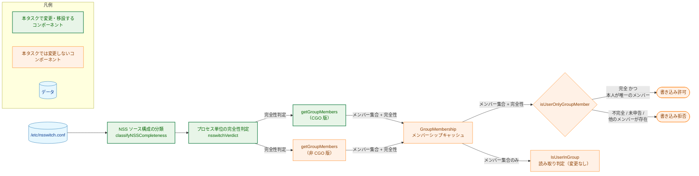
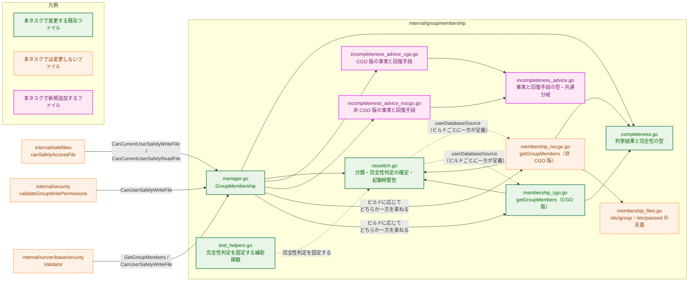
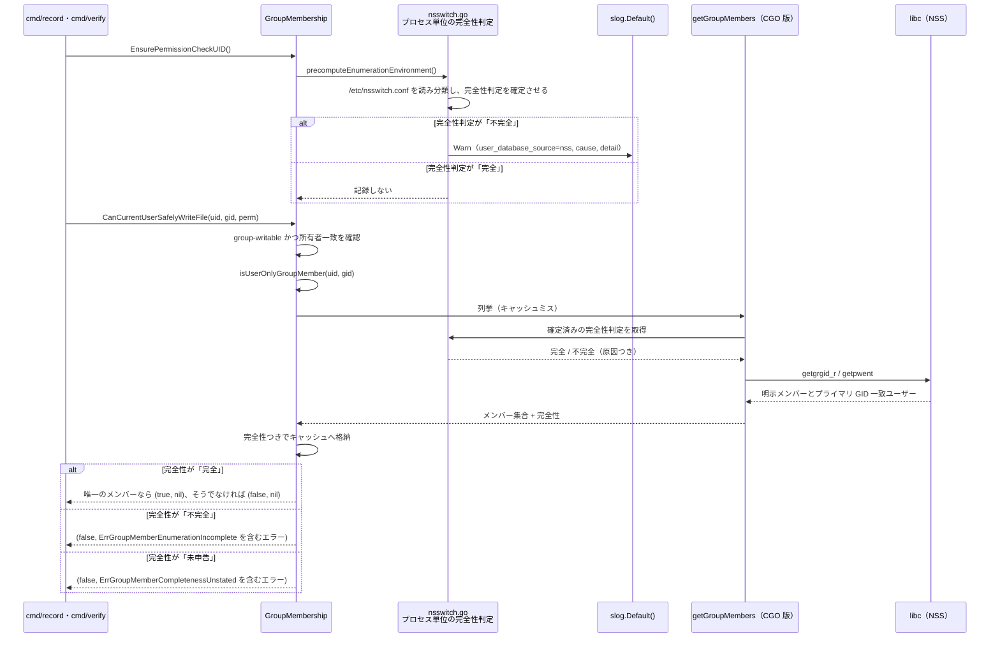
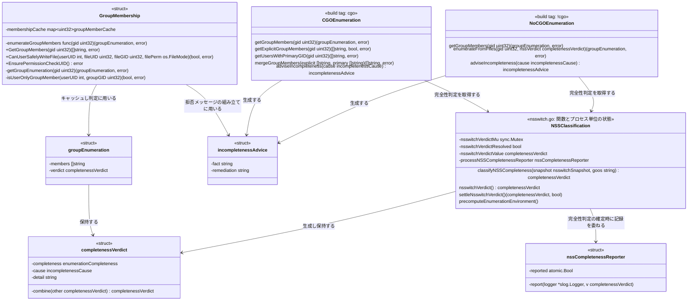
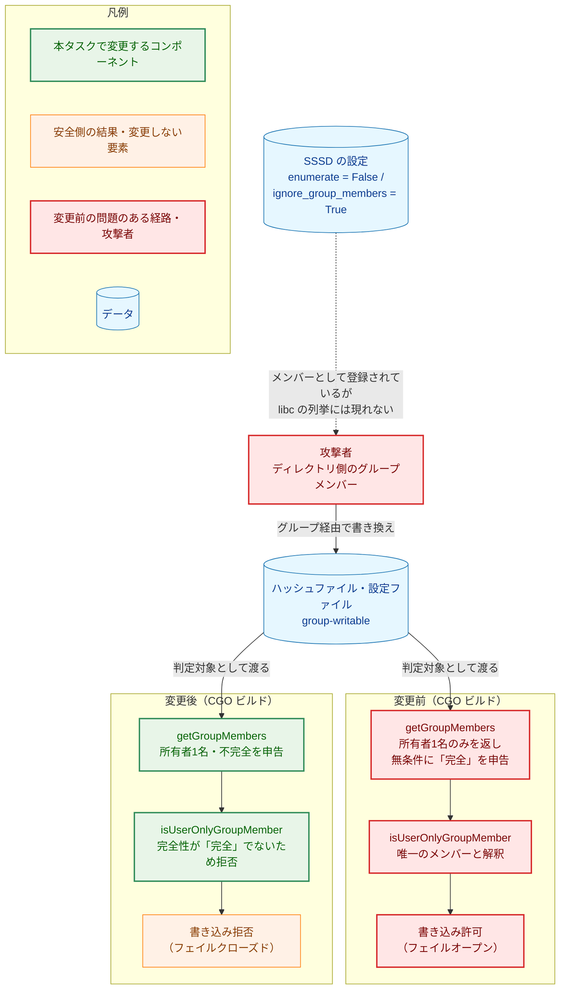
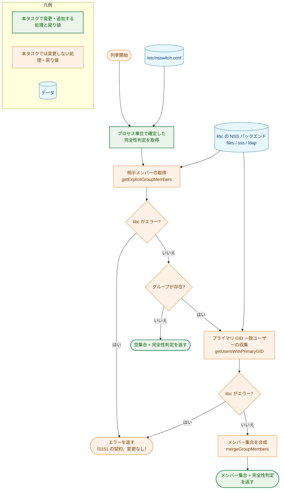
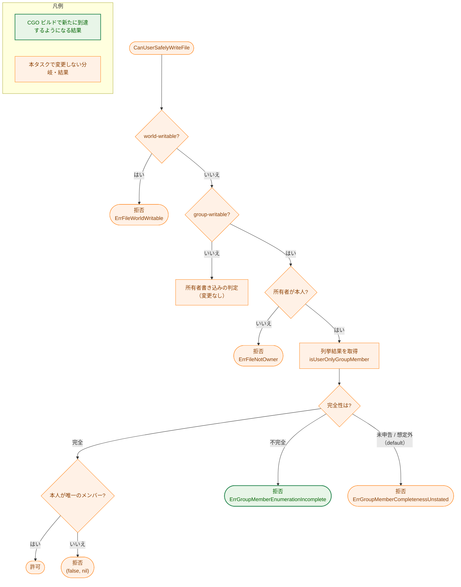

# アーキテクチャ設計書: CGO ビルドの列挙完全性の判定と、SSSD 環境での fail-open の解消

## Document Status

| Item | Value |
|---|---|
| Status | `draft` |
| Created | 2026-08-27 |
| Review date | - |
| Reviewer | - |
| Comments | - |

## 0. 本書の位置づけ

本書は [`01_requirements.md`](01_requirements.md)（status: `approved`）が定めた振る舞い（WHAT）を、実現機構（HOW）へ落とし込む設計文書である。対象は [#1064](https://github.com/isseis/go-safe-cmd-runner/issues/1064)（CGO ビルドが SSSD 環境で group-writable の書き込みを許可してしまうこと）であり、要件 F-001〜F-007（AC-01〜AC-29）に対応する。

設計の中心は `internal/groupmembership` にある。公開 API のシグネチャは変えないため、他のパッケージには一切手を入れない。先行タスク 0168 が非 CGO ビルドについて作った仕組み——`/etc/nsswitch.conf` の分類、完全性判定のプロセス単位での確定、起動時の警告、拒否メッセージの組み立て——を、CGO ビルドからも使える位置へ移し、CGO 版の列挙にその完全性判定を反映させることが本タスクの実体である。

要件書が設計に委ねた論点と、本書で結論を確定する箇所は次のとおりである。

- 分類と、完全性判定をプロセス単位で確定させる仕組みを、両ビルドが共有する形 → §3.2
- 許可リストの各ソース名が、CGO ビルドにおいても「網羅的に列挙される」と言えるかどうかの根拠 → §3.2.1
- CGO 版 `getGroupMembers` のどの戻り値に完全性を載せるか → §3.1
- 拒否メッセージの文面をビルドごとに分ける機構 → §3.3、§4.3
- CGO ビルドで新たに拒否が起きることの影響範囲と移行 → §5.5

**本書がレビューでの判断を求める事項**は3つある。いずれも該当箇所で詳述する。

1. `/etc/nsswitch.conf` が存在しない場合を「完全」とする分岐の、CGO ビルドにおける根拠が未検証であること（§3.2.1、§5.4）。
2. `cmd/runner` が起動時の完全性判定の確定を行わないこと（§4.4、§5.4）。
3. AC-21 の文言が本設計の構造と噛み合わないこと（§7.2）。

## 用語

本書で用いる語のうち、[翻訳用語集](../../translation_glossary.md) に無いもの、または本書で意味を限定して使うものを先に定める。0168 の [`02_architecture.md`](../0168_groupmembership_nocgo_enumeration_completeness/02_architecture.md) と同じ定義を引き継ぐ。**「判定」「完全性判定」「分類」は別の概念として一貫して使い分ける。**

| 用語 | 意味 |
|---|---|
| 列挙 | 指定した GID のグループに属するユーザー名の集合を求める処理。`getGroupMembers` が行う |
| 列挙の完全性 | 列挙が返した集合が、そのグループの全メンバーを網羅しているかどうか。「完全」「不完全」「未申告」の3値をとる |
| 未申告 | 完全性を表す型のゼロ値。実装が完全性を設定しないまま値を返した状態を指し、環境要因による「不完全」とは区別する |
| 分類 | `/etc/nsswitch.conf` の内容とプラットフォームから、当該ビルドが全メンバーを列挙できるかどうかを決める処理。`classifyNSSCompleteness` が行う |
| 完全性判定 | 分類および不正行の記録を合成して得られる、列挙1回分の完全性とその理由。型 `completenessVerdict` |
| 判定 | ファイルへの読み書きが安全かどうかを決める処理。`CanUserSafelyWriteFile`・`CanCurrentUserSafelyReadFile` などが行う |
| NSS | Name Service Switch。`/etc/nsswitch.conf` の設定に従い、ユーザーデータベース・グループデータベースの参照先（`files`・LDAP・SSSD 等）を切り替える libc の仕組み |
| ユーザーデータベース種別 | 当該ビルドがユーザー照会に用いる仕組みの名称。定数 `userDatabaseSource` の値であり、CGO 版は `nss`、非 CGO 版は `passwd-file` |
| 網羅的な列挙 | あるグループについて、そのグループに属する全ユーザーを1回の照会で漏れなく返すこと。個々のユーザー名を与えて所属を尋ねる照会（`getgrouplist(3)` など）と区別する |

---

## 1. 設計の全体像

### 1.1 設計原則

1. **確かめられないものを「完全」と申告しない**: libc がエラーを返さなかったことは、その列挙が網羅的であったことの根拠にならない。網羅性が確かめられる構成でのみ「完全」と申告する。
2. **完全性の規則は1つだけ持つ**: 「完全」と申告してよい条件は CGO 版・非 CGO 版で同一であり、その規則の実装もテストもコード上1箇所にしか存在しない。ビルドごとに複製した許可リストを持たない。
3. **共有する規則の根拠は、ビルドごとに確かめる**: 規則を共有することと、その規則が両ビルドで正しいこととは別である。許可リストに載る各ソース名について、CGO ビルドでも網羅的な列挙が成り立つ根拠を個別に示す（§3.2.1）。
4. **申告の理由が同じでも、運用者への案内は同じとは限らない**: 分類の結果は共有するが、拒否メッセージの「事実」と「回復手段」はビルドごとに与える。CGO ビルドの利用者に「`CGO_ENABLED=1` でビルドし直せ」と案内することは、既に居る場所への誘導であり誤りである。
5. **文面は `cause` で選ぶ**: メッセージの分岐は `incompletenessCause` に対する `switch` で行い、`detail` の文字列内容を検査しない（CLAUDE.md「Declare, don't infer」）。
6. **完全性判定はプロセス単位で1度だけ確定させる**: 実行の途中で `/etc/nsswitch.conf` が編集されたために完全性判定が変わると、運用者が再現できない拒否になる。0168 が非 CGO 版で採ったこの方針を、共有の仕組みとして両ビルドへ広げる。
7. **読み取り経路は変えない**: 読み取り判定は `getgrouplist(3)` 由来の所属情報で決着しており、SSSD の部分列挙の影響を受けない。ここに完全性を持ち込むのは、影響のない経路への過剰な拒否である（YAGNI）。

### 1.2 コンセプトモデル

本タスクの中核は、0168 が非 CGO 版の列挙に付けた「この集合を信じてよいか」という事実を、CGO 版の列挙にも同じ規則で付けることにある。



> 矢印 A → B は「A から B へ値が渡る」ことを表す。矢印のラベルは渡る値の内容である。円柱形はデータ（システムの情報源）、矩形はコンポーネント、菱形は判定、角丸はその判定の結果を表す。凡例のノードは色分けの意味のみを示し、相互関係は表さない。
> CGO 版と非 CGO 版は同時には存在しない。図は両者を並べているが、1つのバイナリにはビルドタグに応じてどちらか一方だけが含まれる。

現行の CGO 版は、`getgrgid_r(3)` と `getpwent(3)` がエラーを返さなかったことをもって無条件に「完全」と申告する。SSSD の既定 `enumerate = False` はディレクトリ側のユーザーを `getpwent` から隠し、`ignore_group_members = True` は `gr_mem` を空にする。どちらもエラーを伴わないため、現行の申告は環境の実態と無関係に「完全」になる。本設計は、非 CGO 版が既に用いている分類を CGO 版の申告にも反映させることでこの経路を閉じる。

---

## 2. システム構成

### 2.1 全体アーキテクチャ



> 実線矢印 A → B は「A が B を呼び出す、または B に依存する」ことを表す。破線矢印 A ⇢ B は「A がコンパイルされるために、B が定義するビルド固有の識別子を必要とする」ことを表す。矢印のラベルは呼び出す関数名、依存の性質、または必要とする識別子である。凡例のノードは色分けの意味のみを示し、相互関係は表さない。
> `newpkg`（紫）は [mermaid_reference.md](../../dev/developer_guide/mermaid_reference.md) では「新規追加パッケージまたは型」を指すが、本図では新規追加ファイルに用いる。本タスクは新しいパッケージを追加しないため、パッケージ内の新旧を区別する用途に転用している。
> `manager.go` から `incompleteness_advice_cgo.go`・`incompleteness_advice_nocgo.go` への2本の実線矢印は、`manager.go` が同名の関数を呼び、その実体をビルドタグがどちらか一方に決めることを表す。
> **ビルドをまたぐ識別子の不変条件**: `nsswitch.go` と `manager.go` はビルドタグを持たないが、それぞれ `userDatabaseSource` と `adviseIncompleteness` というビルドごとに定義が分かれる識別子を参照する。どのビルド構成でも、これらがちょうど1つずつ定義されていなければコンパイルが通らない。この関係を破線矢印で示している。
> `internal/safefileio`・`internal/security`・`internal/runner/base/security` はいずれも無変更である（AC-18）。

### 2.2 コンポーネント配置

| ファイル | ビルドタグ | 本タスクでの変更 |
|---|---|---|
| `completeness.go` | なし | `causeNSSSources` の doc コメントを両ビルドで正しい表現へ改める（後述）。型そのものは変更しない |
| `nsswitch.go` | **なし**（`//go:build !cgo \|\| test` を外す） | 完全性判定をプロセス単位で確定させる仕組み（`nsswitchVerdict`・その memo・警告レポータの共有インスタンス）と `precomputeEnumerationEnvironment` を `membership_nocgo.go` から移設する。分類の規則は変えないが、doc コメントを両ビルドで正しい表現へ改める（後述） |
| `membership_nocgo.go` | `//go:build !cgo` | 上記の移設分を取り除く。非 CGO 版 `getGroupMembers` の挙動は変えない |
| `membership_cgo.go` | `//go:build cgo` | `getGroupMembers` が `nsswitchVerdict()` の完全性判定を申告に反映する。空実装の `precomputeEnumerationEnvironment` を削除する（移設先へ集約）。doc コメントを是正する（AC-07）。ロック順序の注記に `nsswitchVerdictMu` を加える |
| `manager.go` | なし | `incompleteEnumerationError` が、事実と回復手段の文面の決定をビルド別の関数へ委譲する。組み立てと `switch` の構造は現行のまま |
| `incompleteness_advice.go`（新規） | なし | 事実と回復手段を運ぶ型 `incompletenessAdvice` と、両ビルドで同一の分岐（実装の誤りを示す案内） |
| `incompleteness_advice_cgo.go`（新規） | `//go:build cgo` | CGO 版の事実と回復手段 |
| `incompleteness_advice_nocgo.go`（新規） | `//go:build !cgo` | 非 CGO 版の事実と回復手段。0168 が定めた文面をそのまま移す（AC-13） |
| `test_helpers.go` | `//go:build test` | 完全性判定をテストから任意の値に固定する補助関数を、`membership_nocgo_test.go` の `resetNsswitchClassification` を吸収する形で置く（§7.1） |

**`nsswitch.go` からビルドタグを外す**ことが、本タスクの構造上の中心である。0168 がこのファイルに `!cgo || test` を付けていたのは、CGO ビルドでのみ有効な意味論一致テスト（`membership_semantics_test.go`）が分類関数を呼ぶためであり、CGO ビルドの production コードには呼び出し元が無かった。本タスクで CGO 版 `getGroupMembers` が production の呼び出し元になるため、タグを外せる。外すことで、許可リスト `completeNSSSources` と分類の規則が両ビルドから同一の実装としてコンパイルされる（AC-08、AC-09）。

**完全性判定をプロセス単位で確定させる仕組みも `nsswitch.go` へ移す。** 0168 はこれを `membership_nocgo.go` に置いていた。理由は、`nsswitch.go` が `!cgo || test` であるために CGO ビルドでもコンパイルされる一方、その構成には `nsswitchVerdict` を呼ぶ production コードが無く、`.golangci.yml` が有効にしている `unused` がこの関数を報告しうることであった。本タスクで CGO 版が呼び出し元になるため、この理由も消える。移設により、非 CGO 版・CGO 版のどちらも同じ memo を通して同じ完全性判定を得る（AC-08）。

**共有されることで誤りになる doc コメントを是正する。** 現行の `nsswitch.go`・`completeness.go` の doc コメントは、非 CGO ビルドだけが読む前提で書かれている。タグを外すと、これらは CGO ビルドの説明も兼ねることになり、そのままでは事実に反する。是正の対象は次の5箇所である。

| 対象 | 現行の記述の問題 |
|---|---|
| `completeNSSSources`（`nsswitch.go`） | 「ファイルだけを読むビルドが網羅的に列挙できるソース名の許可リスト」と述べ、`compat` を除く理由を「このビルドが解決できない」としている。CGO ビルドでは libc が解決できるため、除外の理由は「列挙の網羅性を確かめられない」ことである |
| `classifyNSSCompleteness`（`nsswitch.go`） | 「ファイルだけを読むビルドが全メンバーを列挙できるか」を決める関数、と述べている |
| `classifyNSSSources`（`nsswitch.go`） | 「このビルドが網羅的に列挙できるソース」という表現を用いている |
| `readNsswitchSnapshotFrom`（`nsswitch.go`） | 読み取り失敗を「不完全」に倒す理由を「このビルドが参照できないソースを指定しているかもしれない」としている。CGO ビルドでの理由は「網羅的に列挙されるか確かめられないソースを指定しているかもしれない」である |
| `causeNSSSources`（`completeness.go`） | 「このビルドがファイルだけでは列挙できないソース」と述べている。このファイルは既にタグを持たず、CGO ビルドがこの原因を生成するようになった時点で誤りになる |

是正後の共通の意味は「列挙の網羅性を、設定だけから確かめられるソース」である。この表現はビルドに依存しない。ビルドごとの理由（非 CGO 版は「自力で読めない」、CGO 版は「libc は読めるが網羅性の保証が無い」）は、それぞれ `membership_nocgo.go`・`membership_cgo.go` 側の doc コメントに置く。

**`membership_files.go` のタグ（`!cgo || test`）は変えない。** ファイル走査と `malformedLines` は非 CGO 版だけが使うものであり、CGO ビルドの production コードへ持ち込む理由が無い。`malformedLines.verdict()` を持つ `membership_files_nocgo.go` の `//go:build !cgo` も同様に据え置く。したがって CGO ビルドに非 CGO 専用のシンボルは入らず、`make deadcode` の対象（`./cmd/record ./cmd/runner ./cmd/verify`）に新たな到達不能コードは現れない（AC-10）。

**ロック順序**: `membership_cgo.go` は現在「`GroupMembership.cacheMutex` → `pwentMutex`。逆順の獲得は禁止」と注記している。本タスクで `nsswitchVerdictMu` がこの経路に加わるため、注記を「`cacheMutex` → `nsswitchVerdictMu` → `pwentMutex`」へ更新する。`nsswitchVerdictMu` を保持したまま `cacheMutex` を取る経路は作らない。この順序が守られる限り循環は生じない。

### 2.3 データフロー

CGO ビルドにおける、起動から最初の group-writable ファイルの判定までの流れを示す。キャッシュミスの場合である。



> 実線矢印は呼び出し、破線矢印は戻り値を表す。
> **この図は `record`・`verify` の流れである。`runner` は `EnsurePermissionCheckUID` を呼ばないため、最初の枠（起動時の確定と警告）を持たない。** `runner` では完全性判定が最初の列挙の時点で確定する。この差の影響は §4.4 と §5.4 に述べる。

---

## 3. コンポーネント設計

### 3.1 CGO 版列挙の完全性申告（F-001 / AC-01〜AC-06）

CGO 版 `getGroupMembers` は、プロセス単位で確定した完全性判定を取得し、それを戻り値の `groupEnumeration` に載せる。列挙するメンバー集合そのもの（`getgrgid_r` の明示メンバーと、`getpwent` によるプライマリ GID 一致ユーザーの和）は変更しない。

```go
// getGroupMembers returns all members of a group given its GID, together
// with what this host's user database configuration says about whether
// libc enumerates them exhaustively.
func getGroupMembers(gid uint32) (groupEnumeration, error)
```

**完全性判定は、成功して返るすべての経路に載せる。** 現行実装には、グループが存在しない場合に `completeVerdict()` を付けて空集合を返す分岐がある。これは変更が必要である。完全性は「このビルドがこのホストでグループのメンバーを網羅的に列挙できるか」というホストの性質であり、どの GID を尋ねたかには依存しない。非 CGO 版も同じ理由で、グループが存在しない場合に環境の完全性判定をそのまま返す。両ビルドで同じ扱いにする。

完全性判定の内容によらず、`isUserOnlyGroupMember` が空集合を許可の根拠にすることはない（要素数が1でないため）。それでもここを揃えるのは、「完全」の申告が実態と食い違う値を1箇所でも残さないためである。

**テストのための差し替え点は、プロセス単位の完全性判定を固定する補助関数1つに絞る。** 非 CGO 版は完全性判定を引数で受け取る内側の関数（`enumerateFromFiles`）を持つが、あれは分類の結果と不正行の記録を**合成する**処理をテストから駆動するための seam である。CGO 版には合成する相手が無く、受け取った完全性判定をそのまま戻り値に載せるだけであるため、同型の内側関数を置いても補助関数と重複するだけになる（YAGNI）。補助関数の設計は §7.1 に示す。

**キャッシュとの関係**（AC-06）: 完全性はメンバー集合と同じ `groupEnumeration` に入り、`groupMemberCache` はその値ごと保持する。この構造は 0168 で導入済みであり、本タスクでは変更しない。したがってキャッシュヒット時にも完全性は失われず、`isUserOnlyGroupMember` の判定は初回と同じ結果になる。

**`isUserOnlyGroupMember` の分岐**（AC-05）: 現行の `switch` をそのまま用いる。CGO ビルドで「不完全」が申告されるようになった結果、この `switch` の `completenessIncomplete` の枝が CGO ビルドでも到達するようになる。分岐そのものはビルドタグを持たない `manager.go` にあり、変更は要らない。

### 3.2 分類と完全性判定の確定の共有（F-002 / AC-08〜AC-10）

`nsswitch.go` からビルドタグを外し、0168 が `membership_nocgo.go` に置いていた次の3つを同ファイルへ移す。移動のみであり、処理内容は変更しない（doc コメントの是正は §2.2 のとおり行う）。

```go
// nsswitchVerdict returns the completeness verdict settled for this process.
// It reads and classifies on first call, records an incomplete verdict once,
// and reuses the result thereafter.
func nsswitchVerdict() completenessVerdict

// settleNsswitchVerdict returns the verdict for this process and whether
// this call is the one that settled it.
func settleNsswitchVerdict() (completenessVerdict, bool)

// processNSSCompletenessReporter is the single reporter instance shared by
// the whole process, so that the record is emitted at most once per process.
var processNSSCompletenessReporter nssCompletenessReporter
```

あわせて、両ビルドで同一の実装になる `precomputeEnumerationEnvironment` も `nsswitch.go` に1つだけ置く。0168 ではこれがビルドごとに2つ存在し、CGO 版は空実装であった。本タスク後はどちらのビルドでも `nsswitchVerdict()` を呼ぶだけであるため、複製を残す理由が無い。

```go
// precomputeEnumerationEnvironment settles the completeness verdict before
// the first enumeration, so that a build that cannot enumerate every member
// on this host says so at startup rather than at the first group-writable
// file.
func precomputeEnumerationEnvironment()
```

> **なぜ既存の単純な手段では足りないか**: 「libc の戻り値だけを見る」という現行の最も単純な方法は、まさに本 Issue が示す fail-open の原因である。次に単純なのは SSSD の設定を直接読むことだが、`/etc/sssd/sssd.conf` は root 専用であり `sssctl` にも権限が要るため、判定材料として使えない（要件書「対象外」）。要件書「決定事項」が案2（`getUsersWithPrimaryGID` の `getpwent` 依存の解消）を退けたのも同じ理由による——「あるグループをプライマリ GID とする全ユーザー」を NSS から堅牢に引く API が存在しない。したがって、外から確かめられる唯一の材料である `/etc/nsswitch.conf` の構成に基づく分類を採る。

### 3.2.1 許可リストの各項目が CGO ビルドで成り立つ根拠

規則を共有することと、その規則が両ビルドで正しいこととは別である（§1.1 原則3）。許可リストと、許可リストの外に置く扱いのそれぞれについて、CGO ビルドでの根拠を個別に示す。

| 分類の入力 | 非 CGO 版での根拠 | CGO 版での根拠 | 分類結果 |
|---|---|---|---|
| `files` | `/etc/passwd`・`/etc/group` を自分で全行走査する | glibc の `nss_files` は同じ2ファイルを全行走査する。列挙を抑止する設定項目を持たない | 完全 |
| `systemd` | このソースは無視され、ファイル走査の結果だけが残る | `nss-systemd` は `getpwent`・`getgrent` に応答するが、`systemd-homed` のユーザーは動的に現れるため網羅性は保証されない。**受容している既知の穴である**（§5.4） | 完全（受容） |
| `sss`・`ldap`・`nis`・`winbind`・`compat`・`db`・未知の名前 | このビルドが自力で読めない | libc は読めるが、網羅的に列挙される保証が無い。SSSD の `enumerate = False`・`ignore_group_members = True` が代表例であり、いずれもエラーを伴わない | 不完全 |
| `/etc/nsswitch.conf` が存在しない | ファイルが無ければ `files` 以外の参照先を設定する手段が無い | **未検証**（下記） | 完全（AC-03） |
| 行の形が読めない（重複・角括弧未閉じ・行が無い・ソース名が無い） | 何が設定されているか判定できない | 同左 | 不完全 |
| `GOOS` が `linux` 以外 | `/etc/nsswitch.conf` を持たないため判定材料が無い | 同左（§3.4） | 不完全 |

**`/etc/nsswitch.conf` が存在しない場合の扱いは、本設計で唯一の未検証事項である。** 非 CGO 版の根拠——「ファイルが無ければ他の参照先を設定する手段が無い」——は、自分でファイルを読む非 CGO 版にしか当てはまらない。CGO ビルドではこの場合 glibc がコンパイル時の既定構成にフォールバックし、その既定が `files` のみである保証を本設計は確認していない。歴史的に glibc の既定には `compat` が含まれ、`nss_compat` は `passwd_compat` の設定が無い場合に NIS を参照しうる。すなわち、この分岐は分類の中で唯一の許可側の既定でありながら、CGO ビルドでの根拠がもっとも弱い。

この扱いは AC-03 が「`/etc/nsswitch.conf` が存在しない場合は `files` とみなして「完全」と申告する」と明示しているため、設計の裁量で変えられない。**対応方針は次のとおりとする。**

1. 実装時に、対象とする glibc バージョンの既定構成を一次情報（glibc の `nss/nss_database.c` の既定テーブル）で確認し、結果を本節に追記する。
2. 確認の結果、既定が `files` のみでないことが判明した場合は、`/etc/nsswitch.conf` 不在を CGO ビルドでのみ「不完全」に倒す変更を提案する。これは AC-03 の変更にあたるため、要件書の改訂を伴う（レビューでの判断を求める事項1）。
3. 確認できないまま実装を進める場合は、受容する fail-open として §5.4 に残し、利用者向け文書にも記載する。

**musl 環境の注記**: musl libc は NSS を持たず `/etc/nsswitch.conf` を読まない。musl 上の CGO ビルドは、libc が参照しないファイルの内容から分類することになる。この乖離は過剰拒否の方向にしか働かない（musl は常に `files` 相当であるのに、設定に `sss` があれば「不完全」と判定する）ため安全側だが、Alpine 系のコンテナでは想定外の拒否として現れうる。§5.4 に残存リスクとして記録する。

### 3.3 拒否メッセージのビルド別化（F-003 / AC-11〜AC-14）

拒否メッセージの組み立て（`user_database_source`・`cause`・`detail` の並べ方、sentinel の巻き付け）は両ビルドで同じであり、変わるのは「事実」と「回復手段」の2つの文字列だけである。さらにその2つも、`cause` の5つの値すべてで変わるわけではない。実装の誤りを指す案内（`causeUnspecified` と `default`）は両ビルドで同一である。したがって次の3層に分ける。

```go
// incompletenessAdvice is what an operator is told about one cause: the
// fact behind the denial, and what to do about it on this build.
type incompletenessAdvice struct {
	fact        string
	remediation string
}

// implementationDefectAdvice is the advice for a cause that no environment
// can produce, so it is the same on every build.
func implementationDefectAdvice(what string) incompletenessAdvice

// adviseIncompleteness returns the fact and the remediation this build can
// offer for the given cause. Each build has its own implementation because
// the remediation that resolves a cause differs between them.
func adviseIncompleteness(cause incompletenessCause) incompletenessAdvice

// incompleteEnumerationError builds the denial returned when an enumeration
// states that it may omit members.
func incompleteEnumerationError(groupGID uint32, verdict completenessVerdict) error
```

| 層 | 置き場所 | 内容 |
|---|---|---|
| 組み立て | `manager.go`（タグなし） | メッセージの書式と sentinel の巻き付け。両ビルド共通 |
| 型と共通の分岐 | `incompleteness_advice.go`（タグなし） | `incompletenessAdvice` と `implementationDefectAdvice`。`causeUnspecified` と `default`、および CGO 版の `causeMalformedLine` がこれを使う |
| ビルド固有の分岐 | `incompleteness_advice_{cgo,nocgo}.go` | `causeUnsupportedPlatform` と `causeNSSSources` の文面 |

`adviseIncompleteness` は `cause` に対する `switch`1つで構成し、`detail` を引数に取らない。文字列の内容から分岐する余地を型の上で無くすためである（AC-14、CLAUDE.md「Declare, don't infer」）。

**分割の単位をこう定める理由**: `incompleteEnumerationError` 全体をビルドごとに複製すると、`user_database_source=...` の書式・`detail` の付け方・`ErrGroupMemberEnumerationIncomplete` の巻き付けという、ビルドに依存しない部分まで2箇所に分かれる。逆に、文面をすべてビルド別ファイルに置くと、実装の誤りを指す案内が3箇所に複製される（非 CGO 版の `causeUnspecified`・`default`、CGO 版の同2つ、CGO 版の `causeMalformedLine`）。3層に分けることで、複製されるのはビルドごとに実際に異なる2つの `cause` の文面だけになる。

`incompletenessAdvice` を `completeness.go` ではなく専用ファイルに置くのは、`completeness.go` が完全性の語彙（`enumerationCompleteness`・`incompletenessCause`・`completenessVerdict`・`groupEnumeration`）だけを持つファイルであり、メッセージ提示の型はその語彙に属さないためである。

`unstatedCompletenessError`（完全性が「未申告」の場合）はビルドに依存しない。実装の誤りを指す案内であり、回復手段は両ビルドとも「報告せよ」だからである。現行のまま `manager.go` に1つ置く。

文面の内容は §4.3 に示す。

### 3.4 非 linux プラットフォームの扱い（F-001 / AC-04）

`classifyNSSCompleteness` は `GOOS` が `linux` でない場合に `causeUnsupportedPlatform` で「不完全」を返す。この分類器を CGO ビルドも共有するため、**macOS の CGO ビルドは本タスク後、常に「不完全」を申告する。** これは現行の挙動（常に「完全」）を変える。

要件書「決定事項」が確定させた根拠を、設計上の帰結として再掲する。

- `/etc/nsswitch.conf` を持たないプラットフォームでは、ユーザーデータベースの構成を外から確かめる手段が無い。AD にバインドされた Open Directory は SSSD と同じ部分列挙のリスクを持ち、確かめられない点も同じである。
- 「macOS ではディレクトリを引くのに CGO が要る」という反論は成り立たない。Go の `os/user` は darwin では `!osusergo && darwin` の build tag で libSystem を直接呼ぶため、`CGO_ENABLED=0` でも `user.LookupId`・`GroupIds()` は Directory Services を参照する。macOS で `CGO_ENABLED=1` が追加するのは、本リポジトリ自身の `getGroupMembers`（`membership_cgo.go`）だけである。
- その `getGroupMembers` の消費者のうち本変更が影響するのは `isUserOnlyGroupMember`（緩和の側）のみであり、`IsUserInGroup` は `getgrouplist(3)` 由来の所属情報で先に決着する。

**この変更が macOS で実際に及ぶ範囲は、`isTrustedGroup` の免除の外側だけである。** `internal/security` の `isTrustedGroup` は、root 所有かつ GID 0 のパスに加え、darwin では GID 80（`admin`）を免除する。AD にバインドされた Mac で共有されやすいグループはまさに `admin` であり、その構成要素は完全性判定に到達しない。加えて macOS のローカルユーザーのプライマリグループは全員 `staff` であり、UPG は既定ではない。すなわち本変更が新たに拒否するのは、「`admin` でも GID 0 でもない group-writable なパスを、macOS の CGO セルフビルドで扱っている」構成に限られる。効果も代償もこの範囲に収まる。

### 3.5 型と関数の関係



> 矢印 A → B は「A が B を用いる、または B を生成する」ことを表す。ラベルはその関係の内容である。`NSSClassification`・`CGOEnumeration`・`NoCGOEnumeration` は Go の型ではなく、`nsswitch.go`・`membership_cgo.go`・`membership_nocgo.go` に属するパッケージレベルの関数と変数を図示のためにまとめたものである。`CGOEnumeration` と `NoCGOEnumeration` は同名の関数を持つが、1つのバイナリにはビルドタグに応じてどちらか一方だけが存在する。
> `NSSClassification` の4つの変数が、本タスクで `membership_nocgo.go` から移設される状態である。テストはこの状態を固定して列挙全体を駆動する（§7.1）。

### 3.6 コンポーネント責務表

| ファイル | 区分 | 責務と本タスクでの変更点 |
|---|---|---|
| `internal/groupmembership/nsswitch.go` | 変更 | ビルドタグを外す。`nsswitchVerdict`・`settleNsswitchVerdict`・memo 変数・`processNSSCompletenessReporter`・`precomputeEnumerationEnvironment` を受け入れる。分類の規則は無変更、doc コメント4箇所を是正（§2.2） |
| `internal/groupmembership/membership_cgo.go` | 変更 | `getGroupMembers` が完全性判定を全成功経路に載せる。空実装の `precomputeEnumerationEnvironment` を削除。`getGroupMembers` の doc コメントに完全性の申告を明記。ロック順序の注記を更新（§2.2） |
| `internal/groupmembership/membership_nocgo.go` | 変更 | 移設分を取り除く。列挙の挙動は無変更 |
| `internal/groupmembership/completeness.go` | 変更 | `causeNSSSources` の doc コメントを是正（§2.2） |
| `internal/groupmembership/manager.go` | 変更 | `incompleteEnumerationError` が文面の決定を `adviseIncompleteness` へ委譲する |
| `internal/groupmembership/incompleteness_advice.go` | 新規 | `incompletenessAdvice` 型と `implementationDefectAdvice` |
| `internal/groupmembership/incompleteness_advice_cgo.go` | 新規 | CGO 版の `adviseIncompleteness` |
| `internal/groupmembership/incompleteness_advice_nocgo.go` | 新規 | 非 CGO 版の `adviseIncompleteness`（0168 の文面を移設） |
| `internal/groupmembership/test_helpers.go` | 変更 | 完全性判定を固定・復元する補助関数を置く（`resetNsswitchClassification` を吸収） |
| `internal/groupmembership/membership_cgo_test.go` | 変更 | `TestGetGroupMembers_StatesComplete` を改める（§7.3）。AC-01〜AC-05・AC-11・AC-12 のテストを追加 |
| `internal/groupmembership/membership_nocgo_test.go` | 変更 | `resetNsswitchClassification` と `TestEnsurePermissionCheckUIDPrecomputesEnvironment` を送り出す。非 CGO 固有のテストは残す |
| `internal/groupmembership/manager_test.go` | 変更 | 上記の移設先。両ビルドで動く完全性判定まわりのテスト（AC-09・AC-15・AC-16）をここに置く。ビルドタグを持たないため両ビルドで実行される |
| `internal/groupmembership/nsswitch_test.go` | 変更 | ビルドタグを外し、CGO ビルドでも分類器のテーブルテストが動くようにする |
| `docs/user/security-risk-assessment.ja.md` | 変更 | §3 の CGO ビルドに関する「既知の制限」を本タスク後の挙動へ更新（AC-24） |
| `docs/user/record_command.ja.md`・`docs/user/verify_command.ja.md` | 変更 | CGO ビルドで拒否に遭遇した場合のトラブルシューティング項目を追加（AC-25） |
| `docs/user/security-risk-assessment.md`・`record_command.md`・`verify_command.md` | 変更 | 上記の英語版を `/mktrans` で反映（AC-26） |
| `CHANGELOG.ja.md`・`CHANGELOG.md` | 変更 | 「未リリース」→「破壊的変更」への項目追加と、その英語版（AC-27） |
| `docs/tasks/0149_security_code_smell_audit_fable/98_remaining_issues.md` | 変更 | §2 D1 の当該項目を解消済みへ更新し、`internal/runner/base/security` の誤検知を残件として追加（AC-28、AC-29） |

**AC-07 の充足の内訳**: AC-07 は `membership_cgo.go:331` の doc コメント——「libc の NSS lookup は成功時つねに完全」——の是正を求めている。本設計ではその関数（CGO 版 `precomputeEnumerationEnvironment`）自体を削除するため、AC-07 は次の2つで充足される。

1. 当該コメントを、それが説明していた空実装ごと削除する。同じ根拠を述べる記述はどこにも残らない。
2. 移設先の単一の `precomputeEnumerationEnvironment`（`nsswitch.go`）に、新しい役割を述べる doc コメントを置く（§3.2 に文面を示した）。

あわせて、CGO 版 `getGroupMembers` の doc コメントを是正する。現行は「明示メンバーとプライマリ GID 一致ユーザーの和を返す」とのみ述べ、完全性については何も述べていない。§3.1 に示した文面へ置き換え、この関数が完全性判定を同伴させることを明記する。

### 3.7 判定結果のビルド依存 — 0151 の設計原則に対する例外の現状

**元の方針とその所在**: [`0151/02_architecture.md`](../0151_groupmembership_failclosed/02_architecture.md) §1.1 の設計原則2「意味論の単一化」は、「CGO 版・非 CGO 版の両実装が同じ集合を返すようにする。セキュリティ判定結果をビルド構成に依存させない」と定めている。0168 はこの原則に対する意図的な例外を宣言した（[`0168/02_architecture.md`](../0168_groupmembership_nocgo_enumeration_completeness/02_architecture.md) §3.7）。非 CGO ビルドだけが NSS 環境で拒否し、CGO ビルドは許可するという差である。

**本設計がこの例外に与える変化**: 本設計は、その差の大部分を解消する。同じ `/etc/nsswitch.conf` に対して両ビルドが同じ分類を得るため、NSS 環境と非 linux プラットフォームにおける書き込み判定は両ビルドで一致する。

**それでも残る差**: `causeMalformedLine` は非 CGO ビルドにしか現れない。`/etc/passwd`・`/etc/group` を直接走査するのは非 CGO 版だけだからである。したがって、`files` のみを構成し、かつ `/etc/group` にパース不能な行が1行あるホストでは、非 CGO ビルドが拒否し CGO ビルドが許可する。これは意図した残差である。CGO ビルドでは libc がその行をどう扱ったかを知る手段が無く、非 CGO 版に合わせて拒否するには「走査しない実装が、走査した場合に何が起きるかを推測する」ことが必要になる。推測に基づく拒否は、§1.1 原則1（確かめられないものを申告しない）の裏返しとして同じく採らない。

**この例外により更新が必要な既存テスト**: CGO ビルドが無条件に「完全」を申告することを固定している `internal/groupmembership/membership_cgo_test.go` の `TestGetGroupMembers_StatesComplete` である。同テストは `assert.Equal(t, completeVerdict(), enumeration.verdict)` により現行の挙動を主張しているため、本設計の下では `files`・`systemd` 以外を構成したホストで失敗する。§7.3 に更新方針を示す。

なお、`manager_test.go` の group-writable 系テスト（`TestCanUserSafelyWriteFile` の「group writable file - owner only allowed if exclusive group member」、`TestCanCurrentUserSafelyWriteFile_AllPermissions` の「group_writable_member」、`TestCanCurrentUserSafelyWriteFile_EdgeCases` の「group_read_write」）は、0168 で既に `ErrGroupMemberEnumerationIncomplete` を許容する形へ更新済みであり、本タスクでの変更は要らない。

### 3.8 受け入れ基準と設計の対応

| AC | 設計上の対応箇所 |
|---|---|
| AC-01, AC-02 | §3.1、§3.2、§3.2.1、§6.1 |
| AC-03 | §3.2.1（不在・行の形の各扱いと、不在の扱いの未検証事項） |
| AC-04 | §3.4 |
| AC-05 | §3.1（`isUserOnlyGroupMember` の既存分岐が CGO ビルドでも到達する）、§6.2 |
| AC-06 | §3.1（キャッシュ） |
| AC-07 | §3.6（充足の内訳） |
| AC-08, AC-09, AC-10 | §2.2、§3.2 |
| AC-11, AC-12, AC-13, AC-14 | §3.3、§4.3 |
| AC-15, AC-16 | §2.3、§4.4（`cmd/runner` の例外を含む）、§6.2 |
| AC-17, AC-18, AC-19 | §5.3 |
| AC-20, AC-21, AC-22, AC-23 | §7 |
| AC-24〜AC-29 | §3.6、§5.5 |

---

## 4. エラーハンドリング設計

### 4.1 エラー型

新しい sentinel エラーは追加しない。0168 が導入した2つをそのまま用いる。

```go
// ErrGroupMemberEnumerationIncomplete denies write access: a result that may
// omit members cannot establish that the user is the group's only member.
var ErrGroupMemberEnumerationIncomplete = errors.New("group member enumeration is incomplete")

// ErrGroupMemberCompletenessUnstated marks a defect in the enumeration
// implementation rather than a condition of the host, so no operator action
// resolves it.
var ErrGroupMemberCompletenessUnstated = errors.New("group member enumeration completeness was not stated")
```

CGO ビルドで新たに起きる拒否は、非 CGO ビルドで起きるものと同じ種類——「列挙が全メンバーを網羅している保証が無い」——である。呼び出し元が両者を区別する必要は無く、区別する手段（`user_database_source`）は既にメッセージに含まれている。したがってビルドごとに別の sentinel を設ける理由が無い。

**呼び出し元での識別可能性は経路によって差がある。** 0168 が整えた状態をそのまま引き継ぐため本タスクでは変更しないが、運用者への案内（AC-25）を書くうえで前提となるので明記する。

| 経路 | `errors.Is` での識別 | 構造化された記録 |
|---|---|---|
| `internal/safefileio` | 可（`%w` で包む） | `logPermissionRejection` が `path`・`uid`・`gid`・`mode`・`rule=enumeration-incomplete` を属性として出力する |
| `internal/security`（ディレクトリ権限検査） | 可（`validateGroupWritePermissions` が `%w` で包む） | **無い。** 返るのは `ErrInvalidDirPermissions` に包まれたエラー文字列のみで、`slog` の記録も規則名も出さない |

すなわち、§5.5 が最大の影響範囲として挙げる経路（`runner` の実行前検証が丸ごと止まる）が、記録の面ではもっとも情報が少ない。運用者は返却されたエラー文字列から原因を読むことになる。この事実を AC-25 のトラブルシューティングに明記し、「どのディレクトリで拒否されたかはエラー本文から読む」ことを手順として書く。記録そのものを足すことは `internal/security` の変更にあたり、AC-18 の「無変更」に反するため本タスクでは行わない。

### 4.2 エラーの分類規則

| `isUserOnlyGroupMember` が受け取った状態 | 分類 | 返す sentinel |
|---|---|---|
| 列挙 API がエラーを返した | 列挙の失敗（0151 で確立済み、変更なし） | 列挙 API のエラーをそのまま包む |
| 完全性が「不完全」、原因が `causeUnsupportedPlatform` または `causeNSSSources` | 環境の制約 | `ErrGroupMemberEnumerationIncomplete` |
| 完全性が「不完全」、原因が `causeMalformedLine` | ユーザーデータベースの内容（非 CGO ビルドのみ到達） | `ErrGroupMemberEnumerationIncomplete` |
| 完全性が「未申告」または想定外の値 | 実装の誤り | `ErrGroupMemberCompletenessUnstated` |

この表は 0168 のものと同一であり、本タスクで変わるのは「どのビルドでどの行に到達するか」だけである。

### 4.3 エラーメッセージ設計（AC-11〜AC-14）

メッセージ全体の書式は現行のまま変えない。すなわち次の順に並べる。

```
cannot confirm the members of group GID <gid>: <事実> (user_database_source=<種別>, cause=<原因>, detail=<詳細>); <回復手段>: group member enumeration is incomplete
```

`user_database_source` は CGO ビルドで `nss`、非 CGO ビルドで `passwd-file` になる（AC-11）。`detail` は分類器が付けた文字列（`passwd: sss`・`goos=darwin`・`group: more than one line configures this database` など）であり、両ビルドで同じ分類器が生成する。

**CGO ビルドの事実と回復手段**（AC-12）:

| 原因 | 事実 | 回復手段 |
|---|---|---|
| `causeNSSSources` | `/etc/nsswitch.conf` から、グループの全メンバーが列挙されることを確かめられなかった。指定されたソースが網羅的な列挙を保証しない（例: SSSD は `enumerate = False` でディレクトリ側のユーザーを返さず、`ignore_group_members = True` で明示メンバーを空にする）、行の形が読み取れない、またはファイルを読み取れない。どれに当たるかは `detail` が示す | 対象パスの group-writable ビットを外す（`chmod g-w`）。あるいは `passwd`・`group` の両行を、列挙が網羅的であるソース（`files`・`systemd`）のみで構成する |
| `causeUnsupportedPlatform` | このプラットフォームではユーザーデータベースの構成を判定する手段が無いため、グループのメンバー一覧が網羅的であることを確認できない | 対象パスの group-writable ビットを外す（`chmod g-w`） |
| `causeMalformedLine` | ファイルを直接走査しないこのビルドが到達しえない原因が報告された | 実装の誤りとして報告する |
| `causeUnspecified` および想定外の値（`default`） | 不完全と判定されたが原因が記録されていない | 実装の誤りとして報告する |

`causeNSSSources` の「事実」を広く書くのは、この原因が指定ソース起因だけでなく、行の重複・角括弧の未閉じ・行の不在・ソース名の不在・ファイル読み取り失敗のいずれでも付くためである（AC-03 がこれらを CGO ビルドの対象として列挙している）。原因の粒度は `detail` が担い、「事実」はそれらを包含する表現にする。

**回復手段に `CGO_ENABLED=1` でのビルドを挙げない**ことが、非 CGO 版との唯一の実質的な違いである。CGO ビルドの利用者に対しては、それは既に満たされている条件であり、案内として成り立たない。

`causeMalformedLine` の行を残すのは、`switch` の網羅性を保つためである（AC-14）。CGO ビルドでこの原因が生じることは実装上ありえないため、到達した場合は環境の問題ではなく実装の誤りとして扱い、`default` と同じ側——すなわち拒否——に倒す。

**非 CGO ビルドの事実と回復手段**（AC-13）: 0168 の `02_architecture.md` §4.3 が定めた表をそのまま維持する。文面の文字列は `incompleteness_advice_nocgo.go` へ移設するだけであり、1文字も変えない。上記の `causeNSSSources` の表現の見直しは CGO 版にのみ適用し、非 CGO 版には及ぼさない。両ビルドで同じ表現に揃えるほうが望ましくはあるが、AC-13 が非 CGO 版の文面の維持を明示的に求めているためである。この差は既知の分岐として本節に記録する。移設後も文面が同じであることは、既存のテストがそのまま通ることで確認する（§7.3）。

### 4.4 記録（ログ）の方針（AC-15、AC-16）

**完全性判定が「不完全」となったことは、プロセスにつき1回だけ `slog.Warn` で記録する。** この仕組み（`nssCompletenessReporter` と、その共有インスタンス）は 0168 が実装済みであり、本タスクでは `nsswitch.go` へ移設するだけである。移設によって CGO ビルドからも同じコードが呼ばれるため、メッセージ本文と属性名は自動的に一致する（AC-16）。

| 項目 | 値 |
|---|---|
| メッセージ | `This build cannot enumerate every member of a group on this host` |
| 属性 `user_database_source` | CGO ビルドは `nss`、非 CGO ビルドは `passwd-file` |
| 属性 `cause` | `incompletenessCause.String()`（`nss-sources`・`unsupported-platform`） |
| 属性 `detail` | 分類器が付けた詳細（`passwd: sss`・`goos=darwin` など） |

**記録の時点はバイナリによって異なる。** ここが本設計で運用上もっとも注意を要する点である。

| バイナリ | `EnsurePermissionCheckUID` の呼び出し | 完全性判定が確定する時点 |
|---|---|---|
| `cmd/record` | あり | 起動時。最初の group-writable ファイルに到達する前（AC-15） |
| `cmd/verify` | あり | 同上 |
| `cmd/runner` | **無い** | 最初の列挙の時点。すなわち最初の group-writable な構成要素の判定と同時 |

`cmd/runner` は `SetProcessPermissionCheckUIDPolicy` のみを呼び、`EnsurePermissionCheckUID` を呼ばない。これは 0168 以前からの状態であり、本タスクが作る差ではないが、本タスクによって CGO ビルドでも拒否が起きるようになるため、影響を受ける利用者が増える。帰結は3つある。

1. **警告が拒否に先行しない。** §5.5 の影響範囲の表が最大の失敗として挙げる「実行前検証が止まり、コマンドを1つも実行しないまま実行全体が中断する」経路は `runner` のものである。この経路では、警告と拒否が同時に出る。
2. **記録の生成が `cacheMutex` の内側になる。** `getGroupEnumeration` は `cacheMutex` の書き込みロックを保持したまま列挙関数を呼ぶため、`runner` では `nsswitchVerdict()` の初回確定——したがって `slog.Warn` の発行——がそのロックの内側で起きる。0168 は、ログハンドラが任意のコードであることを理由に、記録を `nsswitchVerdictMu` の外で行う設計にしていた。`runner` ではその配慮が `cacheMutex` については効かない。プロセスにつき1回であり、ハンドラがこのパッケージを呼び返さない限り停止には至らないが、Slack ハンドラのように送信を伴うハンドラでは、その1回のあいだ `cacheMutex` が保持される。
3. **AC-15 のテストが `runner` の挙動を固定しない。** テストが検証するのは `EnsurePermissionCheckUID` の側である。

**本タスクでの扱い**: 要件書「スコープ」4 は起動時の警告を「`EnsurePermissionCheckUID` 経由」と定めており、`cmd/runner` への呼び出し追加は範囲外である。加えて `EnsurePermissionCheckUID` は権限検査 UID の解決も行い、`SUDO_UID` が検証できない場合に失敗を返すため、`runner` に足すことは起動時の失敗条件を増やす変更でもある。したがって本設計では **`cmd/runner` を対象外とし、上記の帰結を残存リスクとして記録する**（§5.4）。恒久的な対処としては、完全性判定の確定だけを行う公開の入口を設けて `runner` の起動処理から呼ぶ形が考えられる。採否はレビューでの判断を求める事項2である。

**「完全」と判定した場合は何も記録しない。** これは現行の挙動であり、本タスクでも変えない。結果として、拒否が起きなかったホストには、何をどう分類したかの痕跡が残らない。「ホスト A は許可し、ホスト B は拒否した。なぜか」という問いに対して、A 側の証拠が無いことになる。`slog.Debug` で確定した完全性判定を常に1行記録すれば解消するが、要件書に対応する AC が無いため本タスクでは加えず、§9 の拡張候補として記録する。

**`completenessVerdict`・`groupEnumeration` を構造体のまま `slog.Any` などでログに渡してはならない。** 両者は全フィールドが非公開であり、`internal/redaction` の構造体走査はエクスポート済みフィールドが1つも無い値を、内容を見ずに `RedactionFailurePlaceholder` へ丸ごと置き換える（fail-secure）。したがって構造体をそのまま渡すと診断情報が完全に失われる。この制約は 0168 から変わらず、移設後も `user_database_source`・`cause.String()`・`detail` を個別の属性として渡す形を守る。

---

## 5. セキュリティ考慮事項

### 5.1 脅威モデル



> 実線矢印 A → B は「A から B へ処理または操作が進む、あるいは A が B の入力として渡る」ことを表す。破線矢印は「A の状態が B を成立させている」ことを表す。矢印のラベルはその関係の内容である。凡例のノードは色分けの意味のみを示し、相互関係は表さない。

**攻撃者の能力**: 保護対象ファイルのグループにディレクトリ（SSSD/LDAP 経由）で所属しているユーザー。ファイルへのグループ書き込み権限を持つ。AD 統合環境では、利用者のプライマリグループが `Domain Users` に揃うのが通例であり、この立場に当たる主体は多い。

**変更前に成立していた経路**: CGO ビルドがこのグループを列挙しても、`enumerate = False` の下では `getpwent` がディレクトリ側のユーザーを返さないため、攻撃者は集合に現れない。`ignore_group_members = True` が併用されていれば明示メンバーも空になる。ファイル所有者が集合の唯一の要素となり、書き込み判定は許可を返す。libc はエラーを返さないため、この状態は列挙の失敗としても現れない。

**変更後**: `/etc/nsswitch.conf` が `sss` を指定している時点で列挙が「不完全」を申告するため、集合の中身によらず拒否される。攻撃者が集合に現れるかどうかは判定に影響しない。

**この図が主張する範囲**: 上の閉鎖は `internal/groupmembership` の書き込み判定（`CanUserSafelyWriteFile` の group-writable 分岐）に限る。`internal/runner/base/security` の `Validator.checkWritePermission` は、非所有かつ group-writable なファイルについて「呼び出し元がグループのメンバーである」ことだけを根拠に書き込みを承認しており、唯一性も完全性も見ていない。この経路は列挙が縮むと拒否側に倒れるため新たな穴は生じないが、上の攻撃者像がこの経路で塞がれているわけではない。要件書「対象外」に従い本タスクでは扱わず、残件として記録する（AC-28）。

### 5.2 フェイルクローズドの成立条件

不完全性が許可へ抜ける経路が残らないことを、次の4点で担保する。1〜3は 0168 が確立した性質であり、本設計はそれを CGO ビルドへ広げる。

1. **ゼロ値が安全側である**: `enumerationCompleteness` のゼロ値は「未申告」であり「完全」ではない。`nsswitchState` のゼロ値「未読」も「不完全」に分類される。
2. **`default` が安全側である**: `isUserOnlyGroupMember` の `switch`、`classifyNSSCompleteness`、`classifyNSSSources`、および本タスクで追加する `adviseIncompleteness` のいずれも、`default` が拒否側に倒れる。
3. **合成が安全側である**: `combine` は「1つでも不完全なら不完全」であり、完全へ戻る経路がない。
4. **CGO 版の成功経路が漏れなく完全性判定を載せる**: グループが存在しない場合を含め、`getGroupMembers` が返すすべての `groupEnumeration` に完全性判定が載る（§3.1）。`completeVerdict()` を直に書く分岐は CGO 版に残らない。

**例外は1つだけある。** `/etc/nsswitch.conf` が存在しない場合を「完全」とする分岐であり、これは分類の中で唯一の許可側の既定である。非 CGO ビルドではこの分岐に確かな根拠があるが、CGO ビルドでの根拠は未検証である（§3.2.1）。本設計で最も注意を要する一点であり、実装時の確認事項として §3.2.1 に手順を定めた。

### 5.3 副作用の範囲（AC-17〜AC-19）

本設計が CGO ビルドに加える外部への作用は、`/etc/nsswitch.conf` の読み取り1件と、それが「不完全」だった場合の `slog.Warn` 1件である。いずれもプロセスあたり最大1回である。書き込み・削除・ネットワーク送信は追加しない。非 CGO ビルドの作用は本タスクの前後で変わらない。

**書き込みの側面では**、拒否の追加は外部への作用を減らす方向にのみ働く。従来許可されていた書き込みが拒否されるため、ハッシュファイル・設定ファイルの書き込みが行われなくなる場合がある。逆に、従来拒否されていたものが許可されることはない。

**列挙そのものの費用は変わらないが、拒否されるホストではその費用が無駄になる。** 本設計は、完全性判定が「不完全」であっても列挙を短絡しない。`getExplicitGroupMembers`（`getgrgid_r`）と `getUsersWithPrimaryGID`（`setpwent`/`getpwent` によるユーザーデータベースの全走査）はこれまでどおり実行され、その結果を `isUserOnlyGroupMember` が捨てる。SSSD が `enumerate = True` で構成されたドメイン参加ホストでは、この全走査がディレクトリ全体に及ぶため軽くない。しかもこの走査は `pwentMutex` と `GroupMembership.cacheMutex` を保持したまま行われ、キャッシュ有効期間（30秒）ごとに GID ごとに繰り返される。

短絡そのものは容易である。`isUserOnlyGroupMember` が `getGroupEnumeration` を呼ぶ前に `nsswitchVerdict()` を見て拒否すればよく、公開 API `GetGroupMembers` の戻り値には触れないため AC-18 とも衝突しない。**それでも本タスクでは加えない。** 理由は次の2つである。

- この費用は本タスクが作るものではなく、現行の CGO ビルドが既に払っているものである。CLAUDE.md「Performance」は、相対的な悪化ではなく絶対値で正当化することと、「レビュー指摘の前提を検証する前に機構を足さない」ことを求めている。実測なしに短絡を入れるのはその手順に反する。
- 短絡は最適化であり、CLAUDE.md は最適化を挙動変更と同じコミットに含めないことを求めている。

したがって、影響を受ける構成での絶対値（`enumerate = True` の AD ドメインにおける1回の `getpwent` 全走査の所要時間）を実装時に測り、実行時間として問題になる場合にのみ、別タスク・別コミットとして短絡を入れる。本節はその判断材料として費用の所在を記録するものである。

**実行モードとの関係**: 本設計は実行モードに依存する分岐を持たない。書き込み安全性判定は、どのモードでも同じ入力に対して同じ結果を返す。モードが決めるのは、判定を通過したあとに実際に書くかどうかである。ただし `--dry-run` を事前確認に使う場合、次の限界がある。

- `--dry-run` は `runner` のフラグであり、`record`・`verify` には無い。したがって「起動時の警告」と「dry-run」は別のバイナリの機能であり、1つのバイナリで両方は使えない。
- `runner --dry-run` が到達するのは、設定検証と、出力先の検査（`DryRunResourceManager.ValidateOutputPath`、出力マネージャが構成されている場合）およびディレクトリ権限検査である。`internal/safefileio` の実際の書き込み経路（一時ファイル作成と差し替え）は通らないため、そこで起きる拒否は dry-run では現れない。

すなわち `--dry-run` は「ディレクトリ権限検査と出力先検査で拒否が起きるか」を事前に確かめる手段であり、書き込み経路すべてを網羅するものではない。

**変わらないもの**:

- **読み取り判定**（AC-17）: `IsUserInGroup` はプライマリ GID と `userInfo.GroupIds()`（CGO では `getgrouplist(3)` 経由）で先に決着する。この方向の照会は「ユーザー → 所属グループ」であり、SSSD の `enumerate`・`ignore_group_members` の影響を受けない。`GetGroupMembers` へのフォールバックは完全性を読まないため、CGO ビルドの読み取り判定が本タスクによって新たに拒否を返すことはない。
- **公開 API**（AC-18）: `GetGroupMembers` は `getGroupEnumeration` からメンバー集合だけを取り出して返す。戻り値の型と意味は変わらないため、`internal/runner/base/security` と `internal/safefileio` は無変更である。
- **完全な環境における書き込み判定**（AC-19）: `passwd: files systemd` などの構成では分類が「完全」となり、`isUserOnlyGroupMember` は従来の経路をそのまま通る。world-writable の一律拒否、非所有者の拒否、owner-writable の許可、group-writable かつ唯一のメンバーである場合の許可のいずれも、完全性を読む位置より手前または従来どおりの位置にある。

### 5.4 残存リスク

| リスク | 内容 | 扱い |
|---|---|---|
| `/etc/nsswitch.conf` 不在を CGO ビルドでも「完全」とすること | 分類の中で唯一の許可側の既定であり、CGO ビルドでの根拠が未検証である（§3.2.1）。glibc の既定構成が `files` のみでない場合、この分岐は fail-open になる。ファイルを持たない最小構成のコンテナイメージや chroot が該当する | 実装時に glibc の既定構成を確認し、結果を §3.2.1 に追記する。`files` のみでない場合は AC-03 の改訂を提案する（レビューでの判断を求める事項1） |
| `cmd/runner` に起動時の警告が無い | `runner` は `EnsurePermissionCheckUID` を呼ばないため、完全性判定は最初の列挙の時点で確定する。警告が拒否に先行せず、記録の生成が `cacheMutex` の内側で起きる（§4.4） | 本タスクでは対象外とする。恒久的な対処は `runner` の起動処理から完全性判定の確定を呼ぶことであり、採否はレビューでの判断を求める（事項2） |
| `internal/security` の拒否に構造化された記録が無い | `runner` の実行前検証が止まる経路で、`slog` の記録も規則名も出ない（§4.1） | 本タスクでは変更しない（AC-18）。運用者向けの手順を AC-25 の文書に書く |
| 過剰拒否（`gr_mem` が正しい SSSD 環境） | `ignore_group_members` を設定しておらず `enumerate = True` である SSSD 環境も、`sss` が構成されている時点で拒否される | 受容する。要件書「決定事項」のとおり、SSSD の設定を外から確かめる手段が無い以上、構成名から区別できない |
| 過剰拒否（ローカルグループ） | 分類はホスト単位であるため、`/etc/group` にしか存在しないグループが付いた group-writable ファイルも、ディレクトリ統合ホストでは拒否される | 受容する。影響を受けるのは「ディレクトリ統合ホストで group-writable な保護対象ファイルを扱う」構成に限られ、そもそも推奨されない |
| 過剰拒否（musl 環境） | musl libc は `/etc/nsswitch.conf` を読まないが、CGO ビルドの分類はこのファイルを見る。Alpine 系コンテナで、libc が実際には参照しない設定を根拠に拒否しうる | 受容する。方向は安全側であり、回復手段（group-writable ビットを外す）は同じである。§3.2.1 に記録する |
| `systemd` を許可リストに含めたこと | `systemd-homed` のユーザーが保護対象ファイルのグループを共有する構成では、両ビルドがそのメンバーを列挙しないまま「完全」と申告する。CGO ビルドでは libc が実際に `nss-systemd` を引くため、非 CGO ビルドとは成立の仕方が異なる（§3.2.1） | 受容する（0168 から継続）。`systemd` を除外すると Ubuntu の既定構成で常に拒否となる |
| `initgroups` 行を分類の対象にしていないこと | `group: files` かつ `initgroups: sss` という構成では、ディレクトリ側のユーザーが補助グループとして当該 GID を得る一方、分類は「完全」と申告する | 本タスクでは扱わない（0168 から継続）。両ビルドが同じ穴を持つ |
| `causeMalformedLine` の非対称 | `files` のみの構成で `/etc/group` にパース不能な行がある場合、非 CGO ビルドは拒否し CGO ビルドは許可する | 受容する。理由は §3.7 に述べた。CGO ビルドが libc の行単位の扱いを知る手段が無い |
| 完全性判定のプロセス単位の確定 | `/etc/nsswitch.conf` が危険側へ変更されても、プロセスが終わるまで観測しない。窓に上限はなく、`ClearCache()` でも解除されない | 受容する（0168 から継続）。実行内で判定が一貫することを優先した |
| `/etc/nsswitch.conf` の記述と実際の参照先の乖離 | 設定ファイルの記述と libc が実際に読み込む NSS モジュールが一致しない構成では、分類が実態と食い違いうる。CGO ビルドでは libc が実際にそのモジュールを使うため、この乖離は非 CGO ビルドより直接的に効く | 受容する。分類の材料は設定ファイルのみであり、実際のモジュール読み込みを検査する手段は持たない。<br>乖離が「実際は `sss` を引くのに設定には無い」方向であれば分類は誤って「完全」と申告する。ただし、その状態を作れるのは `/etc/nsswitch.conf` を書き換えられる者だけであり、同じ権限があれば `/etc/group` を直接書き換えるほうが単純である |
| 「完全」と判定した場合に痕跡が残らないこと | 拒否が起きなかったホストでは、何をどう分類したかがログから追えない（§4.4） | 本タスクでは加えない。`slog.Debug` での常時記録を §9 の拡張候補とする |
| `Validator.checkWritePermission` の非唯一性許可 | 呼び出し元パッケージの別経路では、グループのメンバーであることだけを根拠に書き込みを承認する | 本タスクでは扱わない（§5.1）。要件書「対象外」に従う |
| `internal/runner/base/security` の誤検知 | `file_validation.go` の `isUserInGroup` が `GroupIds()` を使わず `GetGroupMembers` を直接引くため、SSSD 環境では正当なメンバーが「非メンバー」と判定される | 本タスクでは扱わない。安全側に倒れる誤検知であり方向が逆である。残件として記録する（AC-28） |

### 5.5 影響範囲と移行

本タスクは、**`CGO_ENABLED=1` でセルフビルドした利用者が従来許可されていた操作を拒否されるようになる**変更である。0168 以前の利用者向け文書が、非 CGO ビルドの制限に対する対処として `CGO_ENABLED=1` でのセルフビルドを推奨していたため、その推奨に従った利用者がそのまま影響を受ける。

**拒否が起きる条件**は次の2つがともに成り立つときである。

1. `CGO_ENABLED=1` でビルドされたバイナリであり、かつ完全性判定が「不完全」である。すなわち `GOOS` が `linux` 以外、または `/etc/nsswitch.conf` の `passwd`・`group` が `files`・`systemd` 以外を含む（ドメイン参加ホストの既定である `passwd: files sss` を含む）、または同ファイルの行の形が読めない、または同ファイルの読み取りに失敗する。
2. 判定対象に group-writable なファイルまたはディレクトリ構成要素が含まれ、かつそれが `isTrustedGroup` の免除（root 所有かつ GID 0、macOS では GID 80）に当たらない。

**公式配布バイナリは影響を受けない。** [release.yml](../../../.github/workflows/release.yml) はすべてのターゲットを `CGO_ENABLED: 0` でビルドしており、それらの挙動は 0168 で既に確定している。本タスクが変えるのはセルフビルドのバイナリだけである。

**影響する経路と失敗の粒度**は 0168 と同一である。

| 経路 | 実行頻度 | 失敗したときの範囲 |
|---|---|---|
| `internal/security` のディレクトリ権限検査 | 検証対象パスの root から末端までの、group-writable な構成要素ごと | 検査が失敗すると呼び出した検証全体が失敗する。`runner` では実行前検証の段階で止まるため、コマンドを1つも実行しないまま実行全体が中断する |
| `internal/safefileio` の書き込み経路 | 書き込む対象ファイルごと | 当該ファイルの操作が失敗する。`record` はハッシュ対象を順に処理するため、途中で失敗するとハッシュディレクトリが部分的に作られた状態で終わる |
| `internal/runner/base/output/manager.go` の出力先検査 | 実行中、出力を伴うコマンドごと | 当該コマンドの出力処理が失敗する |

**移行の方針は段階的導入ではなく一括の切り替えとする。** 「不完全でも従来どおり許可する」オプトアウトを設けない理由は 0168 と同じである。それは本タスクが閉じようとしているフェイルオープンを、設定で復活させる仕組みになる。

一括の切り替えを選ぶ以上、運用者が事前に影響を測り、事後に回復できることを保証する。

- **事前の確認**: `/etc/nsswitch.conf` の `passwd`・`group` 行を見れば条件1が、対象パスの構成要素の権限を見れば条件2が判定できる。動作による確認には **`verify` を用いる**。`verify` は読み取りのみを行い、起動時に完全性判定を確定させるため、1回実行すれば当該ホストが該当するかどうかが警告として出る。**`record` は事前確認に使わない。** `record` も起動時に警告を出すが、警告は実行を止めないため、そのままハッシュファイルの書き込みへ進む。`runner --dry-run` はディレクトリ権限検査と出力先検査の範囲で拒否を再現できる（§5.3 の限界を伴う）。
- **回復手段**: (a) 対象パスの group-writable ビットを落とす（`0755`・`0644`）。(b) `passwd`・`group` の両行を `files`・`systemd` のみで構成する。いずれもエラーメッセージから辿れる（§4.3）。**`CGO_ENABLED=1` でのビルドは回復手段にならない**（AC-12）。
- **中断からの復旧**: `record` が途中で拒否された場合、ハッシュディレクトリには成功した分のハッシュファイルだけが残る。どこまで書けたかはハッシュディレクトリの内容と対象一覧の突き合わせで確認でき、回復手段を適用したうえで `record` を再実行すれば残りが書かれる。この手順を AC-25 のトラブルシューティングと AC-27 の変更履歴に記す。
- **切り戻し**: 直前のリリースへ戻す、あるいは `CGO_ENABLED=0` でビルドし直しても、非 CGO ビルドは同じ環境で同じ拒否を返すため回避にはならない。挙動を戻す唯一の方法は本変更を含まないバージョンを使うことである。判定の変更はバイナリに閉じており、設定やハッシュファイルの形式は変わらないため、切り戻しに追加の作業は要らない。

**変更履歴への記載**（AC-27）: [CHANGELOG.ja.md](../../../CHANGELOG.ja.md) の「未リリース」→「破壊的変更」に、0168 の項目（`CHANGELOG.ja.md:79`「非CGOビルドで列挙不完全な環境の group-writable 書き込みをfail-closed化」）とは**別項目**として追加する。両項目は対象ビルドが異なり、回復手段も異なるため、統合すると読み手がどちらの案内に従うべきか判別できなくなる。新項目には、0168 の項目と対をなすものであること（同じ完全性判定を非 CGO ビルドと CGO ビルドの双方へ適用したこと）を明記する。書式は同節の既存項目に揃え、見出しで対象範囲を示し、`**影響範囲:**` で該当するホストを述べ、アップグレード前に影響有無を判定する手順を添える。

**利用者向け文書**（AC-24、AC-25）: [security-risk-assessment.ja.md](../../user/security-risk-assessment.ja.md) §3 の「なお CGO ビルドにも既知の制限がある……実際より緩く評価される可能性がある」という記述は、本タスク後は事実でなくなる。同じ環境で「拒否される」ようになったことへ書き換え、#1064 への参照は解消済みとして扱う。`record_command.ja.md`・`verify_command.ja.md` のトラブルシューティングには、既存の非 CGO ビルド向けの項目（`user_database_source=passwd-file` の例）と並べて、`user_database_source=nss` の例と、回復手段が異なることを示す項目を追加する。両者が混同されないよう、各例に対象ビルドを明記する。あわせて、§4.1 が示した「ディレクトリ権限検査の拒否は構造化された記録を持たない」ことと、上記の中断からの復旧手順も記す。

---

## 6. 処理フロー詳細

### 6.1 CGO 版 `getGroupMembers` の完全性判定



> 矢印 A → B は「A の次に B を実行する」ことを表す。菱形からの矢印のラベルは分岐の条件を表す。円柱形はデータ（読み取る情報源）、角丸は関数の戻りを表す。凡例のノードは色分けの意味のみを示し、相互関係は表さない。
> 「空集合 + 完全性判定を返す」は現行では `completeVerdict()` を返しており、本タスクで完全性判定を返すよう改める（§3.1）。
> 完全性判定の取得を最初に置くのは、成功して返るすべての経路が同じ値を載せることを、コードの形から読み取れるようにするためである。プロセス単位で確定済みであるため、この取得にファイル読み取りは伴わない（初回のみ確定処理が走る）。
> 完全性判定が「不完全」であっても、libc への2つの照会は短絡せずに実行される。その理由と費用は §5.3 に述べた。

### 6.2 書き込み判定における完全性の分岐

`isUserOnlyGroupMember` 以降の分岐は 0168 で確定しており、本タスクでは変更しない。CGO ビルドで変わるのは、「不完全」の枝に到達するようになることだけである。



> 矢印 A → B は「A の次に B を実行する」ことを表す。菱形からの矢印のラベルは分岐の条件を表す。角丸は判定の結果を表す。凡例のノードは色分けの意味のみを示し、相互関係は表さない。

---

## 7. テスト戦略

### 7.1 単体テスト

テストが実行ホストの `/etc/nsswitch.conf` に依存しないための手段を1つに絞る（AC-20）。プロセス単位で確定する完全性判定を、テストから任意の値に固定する補助関数である。

```go
// useNsswitchVerdict fixes the completeness verdict for this process for the
// duration of one test and clears it again afterwards, so that a test can
// drive the whole enumeration from a chosen verdict without depending on the
// host's own /etc/nsswitch.conf.
func useNsswitchVerdict(t *testing.T, v completenessVerdict)

// resetNsswitchClassification clears the settled verdict and the reporter
// that shares its lifetime, so that a test can observe the first
// classification of the process.
func resetNsswitchClassification(t *testing.T)
```

この2つを `test_helpers.go`（`//go:build test`）に置く。現在 `membership_nocgo_test.go` にある `resetNsswitchClassification` をここへ移し、`useNsswitchVerdict` はそれを使って「固定 → 実行 → 復元」を行う。両者が触る状態は同じ4つ——`nsswitchVerdictMu`・`nsswitchVerdictResolved`・`nsswitchVerdictValue`・`processNSSCompletenessReporter.reported`——であり、片方だけを操作する経路は作らない。

**なぜ1つに絞るか**: 非 CGO 版は完全性判定を引数で受け取る内側の関数（`enumerateFromFiles`）を持つが、あれは分類の結果と不正行の記録を合成する処理を駆動するための seam である。CGO 版には合成する相手が無いため、同型の内側関数は補助関数と役割が重なる（§3.1）。

**テストの独立性**: 補助関数が触るのはプロセス全体で1つの状態であるため、これを用いるテストは `t.Parallel()` を宣言しない。また、`processNSSCompletenessReporter.reported` は「プロセスにつき1回」を保証するフラグであるため、本タスクで CGO ビルドも列挙のたびに完全性判定へ触れるようになると、先に走った任意のテストがこのフラグを消費しうる。AC-15・AC-16 のテストが「警告が出なかった」ことを黙って見逃す（実行順序に依存して空振りする）ことを防ぐため、これらのテストは必ず `resetNsswitchClassification` から始める。この要請は補助関数の doc コメントにも記す。

| 対象 | 検証内容 | 対応 AC |
|---|---|---|
| CGO 版 `getGroupMembers` | 固定した完全性判定が、グループが存在する場合・存在しない場合の双方で戻り値にそのまま現れること | AC-01, AC-02 |
| `classifyNSSCompleteness` | 既存のテーブルテストが CGO ビルドでも同じ結果を返すこと（`nsswitch_test.go` のビルドタグを外すことで両ビルドで実行される）。`files`・`files systemd`・`sss`・`ldap`・不在・読み取り失敗・行の重複・角括弧未閉じ・行の不在・ソース名の不在の各行を含む | AC-01, AC-02, AC-03, AC-09 |
| 非 linux の分類 | `classifyNSSCompleteness` に `goos` として `darwin` を与えたとき `causeUnsupportedPlatform` で「不完全」になること | AC-04 |
| 両ビルドの分類の一致 | 同一の内容に対する分類結果の期待値テーブルを、ビルドタグの無いテストファイル（`manager_test.go`）に置く。両ビルドで同じ期待値が使われることをコンパイルの事実として保証する | AC-09 |
| `isUserOnlyGroupMember` | 「不完全」を固定した列挙に対し、メンバー集合が「本人1名のみ」であっても `ErrGroupMemberEnumerationIncomplete` を返すこと。既存の `newWithFixedEnumeration` を用いる | AC-05 |
| メンバーシップキャッシュ | 同じ GID に対する2回目の呼び出し（キャッシュヒット）でも AC-05 の結果が変わらないこと | AC-06 |
| CGO 版 `adviseIncompleteness` | `causeNSSSources`・`causeUnsupportedPlatform` に対して `CGO_ENABLED` に言及しない文面を返すこと、`causeMalformedLine`・`causeUnspecified`・想定外の値に対して実装の誤りを示す文面を返すこと | AC-12, AC-14 |
| CGO 版 `incompleteEnumerationError` | メッセージが `user_database_source=nss`・`cause=`・`detail=` を含み、`ErrGroupMemberEnumerationIncomplete` で包まれていること | AC-11 |
| 非 CGO 版のメッセージ | 0168 が定めた文面が本タスクの前後で一致すること（既存テストをそのまま維持し、移設によって壊れないことを確認する） | AC-13 |
| `EnsurePermissionCheckUID` | CGO ビルドでも呼び出し後に完全性判定が確定していること、および「不完全」の場合に警告が1回だけ記録され、属性が `user_database_source=nss`・`cause`・`detail` であること | AC-15, AC-16 |
| 読み取り判定 | 「不完全」を固定した状態でも `IsUserInGroup`・`CanCurrentUserSafelyReadFile` の結果が変わらないこと | AC-17 |
| 完全な環境での書き込み判定 | 「完全」を固定した状態で、world-writable の拒否・非所有者の拒否・owner-writable の許可・唯一のメンバーの許可が従来どおりであること | AC-19 |

### 7.2 テストが理由どおりに失敗できることの確認（AC-21）

各テストについて、検証対象の分岐を無効化した状態で失敗することを実装時に確認し、無効化の方法と結果をコミットメッセージに記す。

| 無効化する内容 | 失敗するはずのテスト |
|---|---|
| CGO 版 `getGroupMembers` が `nsswitchVerdict()` ではなく `completeVerdict()` を載せるようにする | AC-01・AC-02 のテスト |
| `precomputeEnumerationEnvironment` を空実装に戻す | AC-15 の `EnsurePermissionCheckUID` のテスト |
| `isUserOnlyGroupMember` の `completenessIncomplete` の枝を削り `default` へ倒す | AC-05 のテスト（返る sentinel が変わるため失敗する） |
| CGO 版 `adviseIncompleteness` の文面を非 CGO 版のものに差し替える | AC-12 のテスト |
| `classifyNSSCompleteness` の `goos != "linux"` の分岐を削る | AC-04 のテスト |
| `resetNsswitchClassification` の呼び出しを AC-15・AC-16 のテストから外す | 実行順序によって空振りするようになる。§7.1 の独立性の要請を確かめる |

> **AC-21 の文言との差**: AC-21 は「とくに AC-02 は、`precomputeEnumerationEnvironment()` を空実装に戻すと失敗しなければならない」と述べているが、本設計では成り立たない。完全性判定は `nsswitchVerdict()` が遅延して確定させるため、`precomputeEnumerationEnvironment` を空にしても最初の列挙の時点で確定し、AC-02 のテストは通る。AC-21 の文言どおりにするには、完全性判定を「`precomputeEnumerationEnvironment` が設定した変数」からしか読まない構成にする必要があるが、それは正しさを初期化順序の慣習に依存させることであり、CLAUDE.md「Enforce invariants with the type, not with convention」に反する。**AC-21 は要件書の改訂により、AC-02 を上表の1行目で、`precomputeEnumerationEnvironment` の空実装化を AC-15 で捉える形に改めることを提案する**（レビューでの判断を求める事項3）。改訂までの間は、上表が実際に確認する内容である。

### 7.3 更新が必要な既存テスト

| テスト | 現在の主張 | 更新方針 |
|---|---|---|
| `membership_cgo_test.go` / `TestGetGroupMembers_StatesComplete` | `assert.Equal(t, completeVerdict(), enumeration.verdict)`。CGO 版が無条件に「完全」を申告することを固定している | 主張を「申告がこのホストの分類と一致すること」へ改める。期待値は `classifyNSSCompleteness(readNsswitchSnapshot(), runtime.GOOS)` から得る。分類の定義をテスト側に複製しないための形であり、`membership_semantics_test.go` が既に採っている書き方に倣う |
| `nsswitch_test.go` | `//go:build !cgo \|\| test` | ビルドタグを外す。テストの内容は変更しない。これにより同じテーブルが CGO ビルドの production 構成でも実行される |
| `membership_nocgo_test.go` / `TestEnsurePermissionCheckUIDPrecomputesEnvironment` | 非 CGO ビルドで完全性判定が確定することを検証する | `manager_test.go`（ビルドタグ無し）へ移し、両ビルドで実行されるようにする。主張の内容は変えない |
| `membership_nocgo_test.go` / `resetNsswitchClassification` | 非 CGO ビルド専用の補助関数 | `test_helpers.go` へ移す（§7.1）。移設後は両ビルドのテストが同じ補助関数を使う |

`membership_semantics_test.go` の `TestGetGroupMembers_CGOAndNoCGOSemanticsMatch` は変更しない（AC-22）。同テストは既に `classifyNSSCompleteness` の結果で skip を決めており、比較しているのはメンバー集合である。本タスクは列挙が返す集合を変えないため、skip 条件も比較結果も変わらない。

`manager_test.go` の group-writable 系テストは 0168 で既に `ErrGroupMemberEnumerationIncomplete` を許容する形になっており、CGO ビルドで新たに拒否が起きても通る。本タスクでの変更は要らない（§3.7）。

### 7.4 統合テスト・セキュリティテスト

- **統合テスト**: `N/A`。本タスクの変更は `internal/groupmembership` の内部で完結し、公開 API のシグネチャと意味を変えない。パッケージをまたぐ振る舞いの変化は「従来許可されていた書き込みが拒否される」ことだけであり、それは §7.1 の単体テストと §7.5 の実環境での確認で捉えられる。
- **セキュリティテスト**: §7.1 のうち AC-05・AC-06・AC-17・AC-19 の各行がこれに当たる。すなわち「不完全な列挙が許可の根拠にならないこと」「キャッシュ経由でもそれが崩れないこと」「読み取り経路に過剰な拒否が波及しないこと」の3点を、専用の項目ではなく単体テストとして置く。フェイルクローズドの成立条件（§5.2）の4点は、それぞれ対応する `switch` の `default` を含むテーブルテストで踏む。

### 7.5 ビルド構成をまたぐ確認（AC-23）

`make test` は CGO 有効・無効の双方を対象とする（`unit-test-cgo1`・`unit-test-cgo0`）。両者で `make test` と `make lint` が通過することを完了条件とする。加えて次の3点を実装時に確認する。

- **`files`・`systemd` のみの構成では、CGO ビルドの挙動が本タスクの前後で変わらないこと。** 開発環境がこの構成である場合、新しい拒否は手元では現れない。完全性判定を「不完全」に固定した状態（§7.1 の補助関数）でのテスト実行を必ず行い、拒否側の経路を実際に踏む。
- **`make deadcode` が新たな到達不能コードを報告しないこと**（AC-10）。`nsswitch.go` のタグを外したことで、CGO ビルドに呼び出し元の無い関数が残っていないかを確認する。
- **glibc の既定構成の確認**（§3.2.1）。`/etc/nsswitch.conf` が存在しない場合に glibc が用いる既定のソース構成を一次情報で確認し、結果を §3.2.1 に追記する。

### 7.6 静的な確認

文書に関する AC（AC-24〜AC-29）は、対応する記述の有無で確認する。AC-29（`98_remaining_issues.md` の D1 以外の残件が増減していないこと）は、当該ファイルの差分が D1 節と新規追加分に限られることを確認する。

---

## 8. 実装の優先順位

### Phase 1: 分類の共有化（AC-08〜AC-10）

`nsswitch.go` のビルドタグを外し、完全性判定を確定させる仕組みと `precomputeEnumerationEnvironment` を移設する。共有されることで誤りになる doc コメント5箇所を是正する（§2.2）。テスト補助関数を `test_helpers.go` へ集約する。この段階では CGO 版の申告は変えないため、外から観測できる挙動は変わらない。`make test`・`make lint`・`make deadcode` が両ビルドで通ることを確認する。

### Phase 2: CGO 版の完全性申告（AC-01〜AC-07）

`getGroupMembers` が完全性判定を全成功経路に載せるようにする。`getGroupMembers` の doc コメントを是正し、空実装の `precomputeEnumerationEnvironment` を削除する。ロック順序の注記を更新する。ここで CGO ビルドの挙動が変わる。あわせて §3.2.1 の glibc 既定構成の確認を行い、結果を設計へ反映する。

### Phase 3: 拒否メッセージのビルド別化（AC-11〜AC-14）

`incompletenessAdvice`・`implementationDefectAdvice`・`adviseIncompleteness` を導入し、`incompleteEnumerationError` を委譲する形に改める。非 CGO 版の文面は移設のみで変更しない。

### Phase 4: 起動時の警告（AC-15、AC-16）

Phase 1 の移設によって成立しているため、この段階では検証のみを行う。CGO ビルドで `EnsurePermissionCheckUID` が完全性判定を確定させ、警告が1回だけ出ることを確認する。`cmd/runner` が対象外であること（§4.4）を前提とした検証範囲とする。

### Phase 5: 文書と残件一覧（AC-24〜AC-29）

日本語版の利用者向け文書と `CHANGELOG.ja.md` を先に更新・コミットし、英語版を `/mktrans` で反映する。`98_remaining_issues.md` の D1 を解消済みへ更新し、`internal/runner/base/security` の誤検知を残件として追加する。

---

## 9. 将来の拡張性

- **`cmd/runner` の起動時確定**: 完全性判定の確定だけを行う公開の入口を設け、`runner` の起動処理から呼ぶ。§4.4 が挙げた3つの帰結——警告が拒否に先行しないこと、記録の生成が `cacheMutex` の内側になること、テストが `runner` の挙動を固定しないこと——がまとめて解消する。本タスクの範囲外だが、優先度は高い。
- **「完全」と判定した場合の記録**: 確定した完全性判定を `slog.Debug` で常に1行記録すれば、拒否が起きなかったホストでも分類の結果が追える（§4.4）。追加は1行であり、`nssCompletenessReporter` の内側で完結する。
- **不完全時の列挙の短絡**: 「不完全」が確定しているホストでは、`isUserOnlyGroupMember` が列挙を呼ばずに拒否できる（§5.3）。実測に基づく別タスク・別コミットとして扱う。
- **`initgroups` 行の分類**: 分類の対象を `passwd`・`group` の2行から `initgroups` へ広げる余地がある。両ビルドが同じ穴を持つため、広げる場合も分類器1箇所の変更で両ビルドに反映される。本設計の共有化はその前提を整えている。
- **NSS モジュールの実在確認**: `/etc/nsswitch.conf` の記述と実際に読み込まれるモジュールの乖離（§5.4）を検査する余地がある。検査手段を得た場合、`incompletenessCause` に原因を1つ追加し、`adviseIncompleteness` の `switch` に対応する行を加えるだけで済む。`default` が拒否側であるため、追加前でも安全側に倒れる。
- **`causeMalformedLine` の非対称の解消**: CGO ビルドが libc の行単位の扱いを知る手段を得た場合、この非対称（§3.7）を解消できる。現時点でそのような手段は無い。
- **配布バイナリの `CGO_ENABLED` 構成**: [#1067](https://github.com/isseis/go-safe-cmd-runner/issues/1067) が扱う。本設計は両ビルドの判定規則を一致させたため、構成を変えても書き込み判定の結果は（`causeMalformedLine` の非対称を除いて）変わらない。

---

## 付録A: 決定履歴

本文は現行の設計のみを述べている。過去の判断の経緯は以下に集約する。

- **0151（`ErrGroupMemberEnumeration` の導入と意味論統一）**: 列挙 API のエラー時に fail-closed とし、CGO 版・非 CGO 版が同じメンバー集合を返すよう揃えた。本設計はメンバー集合を変えないため、この統一は維持される。
- **0168（非 CGO ビルドの列挙完全性）**: 完全性の型、`/etc/nsswitch.conf` の分類器、完全性判定のプロセス単位での確定、起動時の警告、拒否メッセージの組み立てを導入した。本設計はそれらを CGO ビルドへ広げるものであり、新しい機構をほとんど加えない。
  - 0168 の `02_architecture.md` §2.2 は、`nsswitch.go` に `!cgo || test` を付けた理由として「CGO ビルドでのみ有効な意味論一致テストが分類関数を呼ぶため」を、`nsswitchVerdict` を `membership_nocgo.go` に置いた理由として「CGO ビルドに production の呼び出し元が無く `unused` が報告しうるため」を挙げていた。本タスクで CGO 版の production コードが両者の呼び出し元になるため、どちらの理由も失効した（§2.2）。
  - 0168 の §3.4 は「CGO 版は libc の NSS を通じて列挙するため分類を必要としない」と述べ、§5.4 は SSSD 設定依存の不完全性を「本タスクでは扱わない」残存リスクとして記録していた。本タスクはその残存リスクへの対応であり、§3.4 の記述は本設計により置き換えられる。
- **本タスクで退けた案**: 要件書「決定事項」のとおり、案2（`getUsersWithPrimaryGID` の `getpwent` 依存の解消）は代替 API が存在しないため成立せず、案3（group-writable の緩和そのものの廃止）はローカルユーザーだけのホストまで巻き込むため採らず、案4（警告のみ）は判定が `completeVerdict()` のままとなり fail-open が残るため単独では不十分である。案1（nsswitch 分類を CGO ビルドにも通す）を採り、案4 を起動時の警告として併走させた。
- **非 linux プラットフォームの扱いの代替案**: 要件書「決定事項」は AC-04 の代替として「非 linux の CGO ビルドは現状どおり完全と申告する」を挙げ、採否をレビューに委ねていた。`approved` となった要件書の本文が「不完全」を採っているため、本設計はそれに従う（§3.4）。代替案を採る場合、緩和の正しさは Open Directory が網羅的なメンバー一覧を返すことに依拠し、それは SSSD と同じく外から確かめられない。
