# アーキテクチャ設計書: 単一スレッド前提に照らして過剰な排他制御を棚卸しし、削除する

## Document Status

| Item | Value |
|---|---|
| Status | `draft` |
| Created | 2026-09-01 |
| Review date | - |
| Reviewer | - |
| Comments | - |

## 関連文書

- [01_requirements.md](01_requirements.md)（本設計の入力。AC 番号はすべてこちらを指す）
- [セキュリティアーキテクチャ](../../dev/architecture_design/security-architecture.md)（§6.3 で述べるとおり、本設計は6箇所の記述と矛盾する）
- [Mermaid 記法リファレンス](../../dev/developer_guide/mermaid_reference.md)

---

## 1. 設計の全体像

### 1.1 このタスクが解く問題

本プロジェクトの production コードには、排他制御・アトミック変数の宣言が 28 箇所ある。
そのうち多くは、実行時にどの goroutine とも競合しない場所に置かれている。守る対象の無いロックは
コストではなく**誤情報**として害を与える。読み手に「ここは並行に触られる」と信じさせ、本当に並行な
箇所との区別を消してしまうためである。

本タスクは、この 28 箇所を「実際に並行アクセスがあるか」で仕分け、無い側を削除し、ある側には
なぜ必要かを doc コメントとして残す。外部から観測できる挙動は変えない。

> **28 という数の数え方**: 論理的な宣言1つを1箇所と数える。すなわち、フィールド宣言と変数宣言だけを
> 数え、doc コメント中の言及（`runas_ident.go` に2箇所ある）と、既に数えたフィールドを初期化する
> 複合リテラル（`handlers.go:43` の `&sync.Mutex{}`）は数えない。テキスト検索では 31 行が該当するが、
> その差の3行がこれにあたる。内訳は削除対象 12、維持対象 15、対象外 1 である
> （削除対象が 11 項目で 12 宣言なのは D9 が2ファイルにまたがるため、維持対象が 7 項目で 15 宣言なのは
> K1 が8宣言、K6 が2宣言を含むため）。

### 1.2 設計原則

1. **判定の基準は goroutine の到達可能性であって、型でも命名でもない。** ある状態が並行アクセスを
   受けるかどうかは、その状態に触るコードへ2つ以上の goroutine が到達しうるかだけで決まる。
   「キャッシュだから」「プロセス全体の設定だから」といった役割は判定材料にしない。
2. **並行性の発生源を数え上げてから判定する。** 到達可能性を場当たりに調べると、後述する
   出力コピー goroutine を落とす。先に発生源を網羅し、そこから到達する範囲を塗る（§1.3・§1.5）。
3. **維持する側には理由を書く。** 削除と同じくらい重要なのは、残したものが次の棚卸しで誤って
   削除されないようにすることである。とくに非自明な根拠（`os/exec` が writer ごとに goroutine を
   起こす、など）は doc コメントに書かなければ失われる。
4. **契約と実装を同時に動かす。** ロックを外すとき、そのロックの存在を前提にした記述はすべて同じ
   コミットで直す。対象は doc コメント・コード内コメント・インターフェース定義・設計文書に及ぶ
   （§3.3）。実装だけを弱めて記述を残すことはしない。
5. **失われる検知を代替する。** ロックが排他以外の役割（再入時のデッドロックという形の検知）を
   担っていた場合、それを黙って失わせない。同じ性質を、並行性を主張しない手段で置き直す（§3.4）。
6. **1件1コミット。** 判定を誤った場合に、その1件だけを revert できる粒度を保つ。
7. **棚卸しの結果を機械で固定する。** 本タスク完了後に新しいロックが無断で増えないよう、
   production コードを走査して維持対象の集合と一致することを検証する（§4、AC-23）。

### 1.3 概念モデル: 並行性の発生源と到達範囲

判定の骨格は「発生源 → 到達する状態 → 判定」の3段である。本タスクの判定に関係する発生源は次の3つ
である（網羅性の検討は §1.5 に示す）。

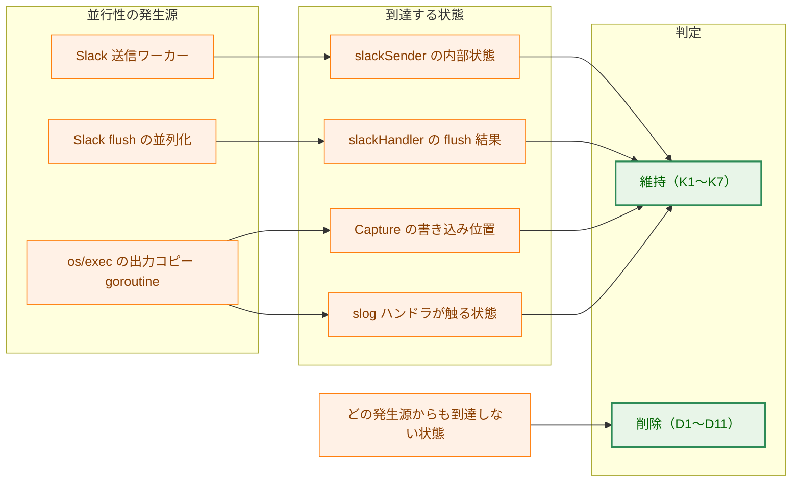

矢印 A → B は「A から B へ到達しうる」を表す。

**Legend**

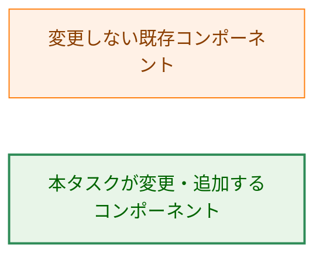

### 1.4 出力コピー goroutine を落とさないための根拠

自前の `go` 文は production コードに1箇所しかないため、素朴に数えると発生源を見落とす。
`os/exec` は、`Cmd.Stdout`／`Cmd.Stderr` に `*os.File` **ではない** `io.Writer` を渡すと、その writer
ごとにコピー用の goroutine を1つ起こす。`executor.go` は `outputWrapper` という自作の `io.Writer` を
stdout 用・stderr 用に1つずつ渡すため、コマンド1回の実行につき goroutine が2つ増える。

この2つの goroutine は `Capture.WriteOutput` に到達し、出力サイズ上限を超えた場合にそこから
`c.Logger.Error(...)` を呼ぶ。したがって **slog ハンドラの実装が触る状態は、この出力コピー
goroutine 上で並行に触られうる**。

この主張は「slog ハンドラ」という抽象に対する全称命題なので、ハンドラ連鎖を列挙して裏づける。
連鎖は小さく、既知である。

| ハンドラ | 実装位置 | `Handle` が触る可変状態 | 判定 |
|---|---|---|---|
| `MultiHandler` | `logging/multihandler.go:45` | 無し（保持するハンドラ列は構築後に不変） | 対象なし |
| `RedactingHandler` | `redaction/redactor.go:722` | `errorCollector`（失敗記録） | **K5** |
| `ConditionalTextHandler` | `logging/conditional_text_handler.go:76` | 無し（書き出し先は `io.Writer`） | 対象なし |
| `InteractiveHandler` | `logging/interactive_handler.go` | `lineTracker`（行番号カウンタ） | **K4** |
| `SlackHandler` | `logging/slack_handler.go:293` | `slackSender` の内部状態 | **K1** |

この表が示すのは2つのことである。第一に、K1・K4・K5 を維持する根拠がこの経路にあること。第二に、
**削除対象 D1〜D11 のどれもこの連鎖上に無い**こと。後者は `-race` では確かめにくい（サイズ上限の
分岐は稀にしか実行されない）ため、到達可能性の議論で担保する必要がある。

> `MultiHandler` と `ConditionalTextHandler` は、この並行経路上で同期を持たない。本タスクの
> 削除対象ではないため対処しないが、棚卸しの過程で見つかった既存の論点として記録しておく。

### 1.5 発生源の網羅性

「発生源は3つ」は、次の検索語で production コードを走査した結果である。次の棚卸しが同じ掃き出しを
再現できるよう、除外したものとその理由も残す。

| 検索語 | 見つかった箇所 | 扱い |
|---|---|---|
| `go ` 文 | `slack_sender.go:257`（`go sd.run()`） | 発生源1 |
| `.Go(` | `bootstrap/logger.go:459`（`sync.WaitGroup.Go`） | 発生源2 |
| 非 `*os.File` の `Cmd.Stdout`／`Cmd.Stderr` | `executor.go:333-337` | 発生源3 |
| `time.AfterFunc` | `slack_sender.go:664` | K1 の内部に閉じる。候補の状態に触らない |
| `signal.NotifyContext` | `cmd/runner/main.go:244` | context のキャンセルのみ。候補の状態に触らない |
| `exec.CommandContext` の watchdog | `executor.go:436,451,457` | `Process.Kill()` のみ。候補の状態に触らない |
| `errgroup` | 該当なし | — |
| `runtime.SetFinalizer` | 該当なし（`os.NewFile` 経由の finalizer は §3.4 で扱う） | — |

---

## 2. システム構成

### 2.1 対象箇所の全体配置

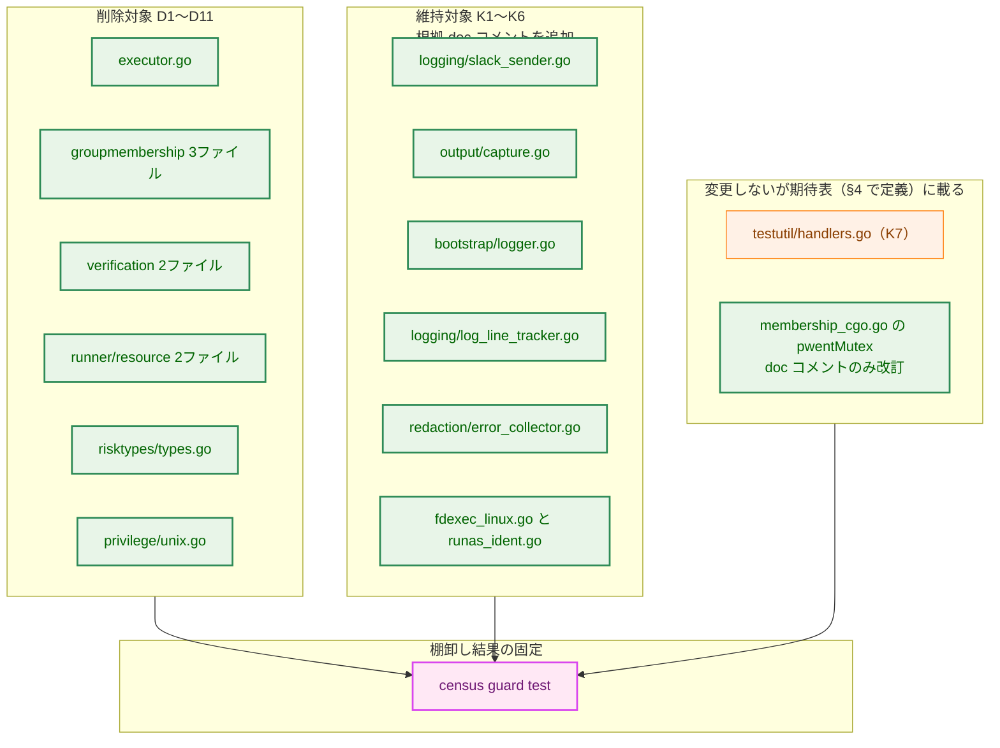

矢印 A → B は「A が B の走査対象になる」を表す。

**Legend**

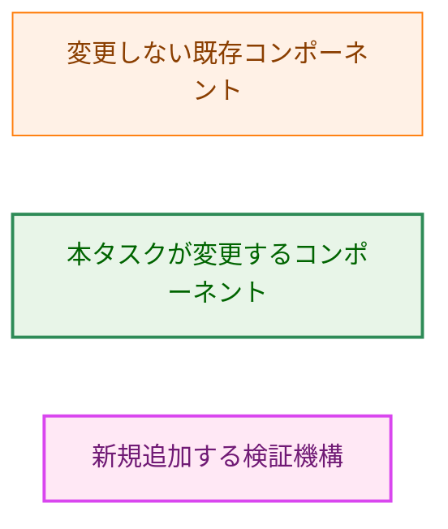

### 2.2 コンポーネント配置

新規に追加するのはテスト1ファイルのみである。

次の数はすべて**ファイル数**である（§1.1 の 28 は宣言数なので単位が違う。D1〜D11 の 11 項目・
12 宣言は 10 ファイルに収まる——`manager.go` が D2・D3・D4 の3項目を含むため）。

| 配置 | 種別 | ファイル数 | 内容 |
|---|---|---|---|
| `internal/testutil/synccensus/census_guard_test.go` | 新規 | 1 | production ソースを走査し、期待表（維持するものを列挙した表。§4 で定義）と突き合わせる |
| production コード | 変更 | 10 | D1〜D11 の削除 |
| production コード | 変更 | 7 | K1〜K6 への根拠 doc コメント追加 |
| 記述・参照の追随 | 変更 | 4 | `test_helpers_policy.go`、`membership_cgo.go`（AC-17 の doc コメント改訂を含む）、`runnertypes/config.go`、`security-architecture.md` |
| テストの改名・警告 | 変更 | 2 | `error_scenarios_test.go`、`integration_test.go`（§8.3） |

変更するファイルは合計 23、新規は 1 である。§3.6 の責務表の行数と一致する
（`shebang_chain_verifier_test.go` は変更しないが、§8.3 の判断の対象として同表に載せている）。

新設するのはテストファイル1つだけで、ヘルパのパッケージは作らない。走査に要る「production ファイルの
選別」は既存の `identitymutationguard.ProductionGoFiles` がそのまま使える（§4.4）。利用者が1つしか
無いものをパッケージへ切り出すのは YAGNI に反するため、切り出しは行わない。

### 2.3 出力コピー goroutine が特権の隙の中で走ること

次の図は現行コードの挙動である。本タスクはこの構造を変えない。D1 の削除根拠と、§6.2 の脅威の
両方がここから読み取れる。

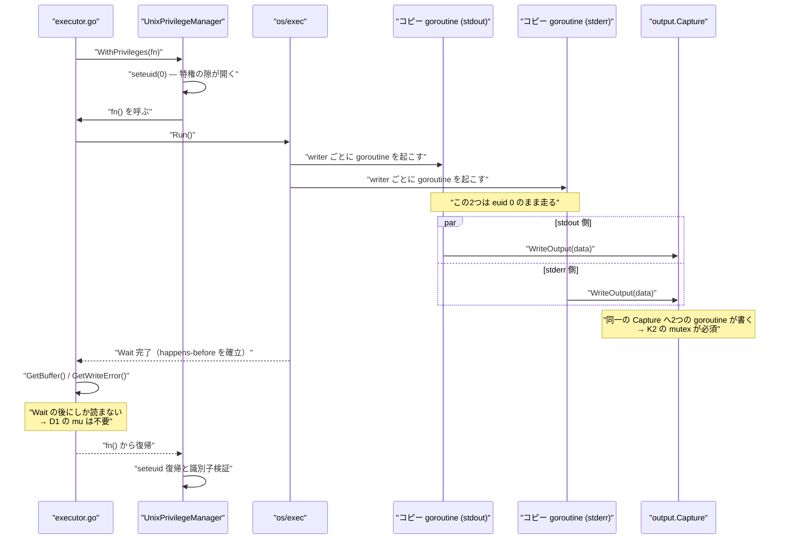

---

## 3. コンポーネント設計

### 3.1 削除対象の型の変化

削除は「並行制御の型を、同じ意味を持つ素の型へ落とす」形をとる。フィールドの意味は変えない。
最終列は、判定を誤っていた場合に起きる**最悪の結果**である。すべてが同じ重みではないため、
レビューの重点と実装時の慎重さの配分をここで示す。

| # | 型・変数 | 変更前 | 変更後 | 誤判定時の最悪の結果 |
|---|---|---|---|---|
| D1 | `outputWrapper.mu` | `sync.Mutex` | フィールド削除 | 出力の取り違え・欠落 |
| D2 | `GroupMembership.cacheMutex` | `sync.RWMutex` | フィールド削除 | **権限判定が誤る** |
| D3 | `sudoUIDAdoptionReporter.reported` | `atomic.Bool` | `bool` | 警告の重複記録 |
| D4 | `sudoUIDExistenceMemo.mu` | `sync.Mutex` | フィールド削除 | 問い合わせの重複 |
| D5 | `nssCompletenessReporter.reported` | `atomic.Bool` | `bool` | 警告の重複記録 |
| D6 | `processPermissionCheckUIDPolicy` | `atomic.Int32` | `PermissionCheckUIDPolicy` | **権限判定の基準 UID が誤る** |
| D7 | `PathResolver.mu` | `sync.RWMutex` | フィールド削除 | **解決パスの取り違え** |
| D8 | `ResultCollector.mu` | `sync.Mutex` | フィールド削除 | dry-run 報告の誤り |
| D9 | `NormalResourceManager.mu`／`DryRunResourceManager.mu` | `sync.RWMutex` | フィールド削除 | 一時ディレクトリの取り残し |
| D10 | `VerifiedFD.closed` | `atomic.Bool` | `bool` | **二重 close による fd 再利用** |
| D11 | `UnixPrivilegeManager.mu` | `sync.Mutex` | フィールド削除 | **特権の隙の重なり**（§3.4） |

D6 は素の `int32` ではなく `PermissionCheckUIDPolicy` に落とす。`atomic.Int32` を使うために
`int32(p)`／`PermissionCheckUIDPolicy(...)` の相互変換が全参照点に散っているが、これは
`atomic.Int32` の都合であって設計上の要請ではない。あわせて `PermissionCheckUIDPolicy` の基底型を
`int32` から `int` へ戻す。`int32` も同じ都合によるものであり、`String()` 内の `int32(p)` も消える。

D10 の変更後の型定義は次のとおりである。

```go
type VerifiedFD struct {
    fd     int
    closed bool
}
```

AC-01 が求めるのはフィールドの削除だけではなく、`Lock`／`Unlock`／`RLock`／`RUnlock`／`Load`／
`Store`／`Swap`／`CompareAndSwap` の呼び出しが残らないことである。呼び出し側の追随は §3.5 に示す。

### 3.2 記述の追随（原則4の適用範囲）

ロックを消すと、そのロックの存在を前提にした記述が宙に浮く。対象は D10・D11 に限らない。
次の表が、削除ごとに直すべき記述の全件である。**各行は対応する削除と同じコミットに含める。**

| # | 位置 | 現在の記述 | 対処 |
|---|---|---|---|
| D2 | `manager.go:88` | "cache for group membership data with thread safety" | 並行性の言及を削る |
| D2 | `manager.go:145` | "Double-check after acquiring write lock (another goroutine might have populated it)" | 二重確認ごと不要になる |
| D2 | `manager.go:454` | "must be called with write lock held" | 削除 |
| D2 | `membership_cgo.go:299-300` | "Lock ordering: `GroupMembership.cacheMutex` -> `pwentMutex`" | 存在しないロックを指すため、順序の記述を削る |
| D4 | `manager.go:509-510` | "The lock is held across lookup to single-flight concurrent queries" | single-flight の主張を削る |
| D6 | `policy.go:94` | "Another goroutine changed the value concurrently; re-evaluate." | CAS ループごと不要になる |
| D6 | `test_helpers_policy.go:40-42` | `Swap`／`Store` の呼び出し | 素の代入へ |
| D7 | `security-architecture.md:437` | `PathResolver` のコード例に `mu sync.RWMutex` | コード例から削る |
| D8 | `result_collector.go:122,126` | "Deep copy … to prevent data races" | 複製の目的を「呼び出し側への内部状態の漏出を防ぐ」に改める（複製自体は残す） |
| D9 | `dryrun_manager.go:84` / `:564-570` / `:864-866` | "Concurrent calls are serialized with mu." ほか | 並行性の主張を削る |
| D9 | `dryrun_manager.go:540,895` | `previewExitCodeLocked`／`refreshDryRunResultLocked` | `Locked` 接尾辞を外して改名 |
| D10 | `types.go:23-24` | 型レベルの `Contract` 節 "Close is idempotent and safe for concurrent use" | §3.3 |
| D10 | `types.go:47-49` | `Close` の doc コメント（同文＋CWE-1341） | §3.3 |
| D11 | `unix.go:92-98` | 再入不可の注意書き | §3.4 |
| D11 | `unix.go:248,287` | "This method assumes the caller (WithPrivileges) has already acquired the mutex lock"（2箇所） | 削除 |
| D11 | `runnertypes/config.go:195-197` | インターフェース側の "or the call deadlocks" | §3.4 |
| D11 | `security-architecture.md` 5箇所 | §6.3 |

`test_helpers_policy.go` は `//go:build test` のテスト専用ファイルであり、`_test.go` ではない。
AC-03 は削除対象を「`_test.go` を除く production コード」と定めるが、この種のファイルは production
コードとしては扱わない。ここでの変更は削除ではなく、削除された変数への参照の追随である。

### 3.3 表明の取り下げ（D10）

D10 は、doc コメントが並行安全性を**外部 API の契約として**表明している点で他と異なる。実装を弱める
だけでは契約と実装が食い違うため、同じコミットで表明を取り下げる。同じ文が型レベルの `Contract` 節と
`Close` の doc コメントの2箇所にあるので、両方を直す。

取り下げるだけでは足りない。`atomic.Bool` は排他だけでなくメモリバリアも与えていたため、削除後は
**「所有する goroutine だけが `Close` を呼ぶ」という前提が新たに必要になる**。この前提は消えた保証の
裏返しであり、書かなければ次の実装者に伝わらない。したがって改訂後の記述には次を含める。

- `Close` は冪等である。同一 goroutine からの二重呼び出しで `syscall.Close` は1回だけ走る。
- nil レシーバに対して `nil` を返す。
- **並行呼び出しに対する保護は無い。** `Close` を呼ぶのは所有する goroutine だけでなければならない。
- 「safe for concurrent use」および CWE-1341 の二重 close レースへの言及は削除する。

前提を積極的に書くことを求めるのは、`os.NewFile` の finalizer のように fd の寿命が goroutine を
またぐ仕組みが同じコードベースに既にあるためである（`fdexec_linux.go:45`）。この fd は該当しないが、
「fd の close は常に単一 goroutine」という一般則があるわけではない。

### 3.4 再入検知の置き直し（D11）

`mu` は排他に加えて、意図せず**再入を検知する**役割を持っていた。`WithPrivileges` の内側から
`WithPrivileges` を呼ぶとデッドロックする、という形である。現行の doc コメントは実行時検知を
明示的に断念しているが、その理由は次のとおりである。

> 「currently held」フラグも `TryLock` も、自分自身の再入と、他の goroutine による正当な待ちとを
> 区別できない。

**この理由は本タスクによって失効する。** 単一スレッドを前提に置いた時点で「他の goroutine による
正当な待ち」は存在しなくなるので、素の `bool` フィールドで再入が一意に判別できる。

置き直さない場合に何が起きるかを明示する。現在の再入はデッドロックする——うるさく、スタックダンプに
残り、見逃しようがない。`mu` を外すと、内側の呼び出しが復帰する際に `handleCleanup` が euid を戻し、
**外側の `fn()` は特権を持っていると信じたまま非特権で走り続ける**。これは
`01_requirements.md` が `mu` の存在意義として挙げた権限の意図しない喪失（silent privilege loss）
そのものであり、しかも
本タスクが前提とする単一スレッドで到達する。

既存の `identityVerifier` と saved-set 不変条件は、euid が 0 のまま**残る**方向の異常を捕まえる。
euid が途中で**落ちる**方向は捕まえない。この非対称性があるため、代替を置かないという選択は
「再入は検知されず、静かに特権を失う」と明記することとセットでなければならない。

**本設計は代替を置く方を採る。** 具体的には次のとおりである。

```go
// ErrReentrantPrivilegeCall is returned when WithPrivileges is called from
// within a privilege window on the same manager.
var ErrReentrantPrivilegeCall = errors.New("reentrant WithPrivileges call")
```

`UnixPrivilegeManager` に非公開の `inPrivilegedWindow bool` を持たせ、入口で立っていれば
`ErrReentrantPrivilegeCall` を返して `fn()` を呼ばず、既存の `defer` で倒す。同期機構を使わないので
並行安全性は何も主張せず、`mu` が与えていた誤った安心は戻らない。fail-closed であり、
デッドロックという劣悪な検知手段を典型的なエラーへ置き換える。

この置き直しは、当初 `01_requirements.md` の AC 範囲外だったため設計時に採否の判断を仰いだ項目で
ある。採用の判断を受けて、要件定義書に **AC-24** を追加した（承認後の追加であることは
`01_requirements.md` の Document Status の Comments に記録してある）。本設計はこれを確定事項として
扱う。

ガードの副作用は、再入が**エラーとして観測できるようになる**ことだけである。既存の呼び出し側は
いずれも再入しないため、返るエラーの種類も呼び出し回数も変わらない。すなわち AC-11 が求める
「外部から観測できる挙動を変えない」を破らない。破るとすれば、それは再入という既存のバグが
実在した場合に限られ、その場合は静かに特権を失うより検知されるほうが望ましい。

なお AC-12 は記述の範囲を `privilege` パッケージに限っているが、この契約はインターフェース
（`runnertypes/config.go:195-197`）にも書かれており、そちらの "or the call deadlocks" も同時に
直さなければ嘘が残る（§3.2 の該当行）。

### 3.5 維持対象へ書く doc コメントの内容

維持側に書くのは「どの goroutine とどの goroutine の間で並行なのか」である。役割の説明ではない。
K1 は4種類の異なる並行性を含むため、まとめず個別に扱う。

| # | 対象 | doc コメントが答えるべきこと | AC |
|---|---|---|---|
| K1a | `slack_sender.go:117` `mu sync.RWMutex` | 呼び出し側と `go sd.run()` ワーカーとの間で、`closed`／`shutdownState`／`inFlightCancel`／`flushStats` ほかを保護する | AC-15 |
| K1b | `slack_sender.go:136` `aggregateOnce sync.Once` | `Flush` と `Close` の両方が呼ばれても集計記録を1回に保つ | AC-15 |
| K1c | `slack_sender.go:143` `syncInFlight sync.WaitGroup` | `sendSync` の完了を `terminate` が待ち合わせる | AC-15 |
| K1d | `slack_sender.go:176-180` `atomic.Int64` 5件 | ワーカーと呼び出し側が同時に更新するカウンタ | AC-15 |
| K2 | `output/capture.go:21` `mutex` | (a) `os/exec` は `*os.File` でない writer ごとに goroutine を1つ起こす、(b) stdout 用と stderr 用の2つの `outputWrapper` が同一の `Capture` を共有する | AC-14 |
| K3 | `bootstrap/logger.go:457` `WaitGroup` | Slack flush を並列化しているのはこれ自身である | AC-15 |
| K4 | `log_line_tracker.go:22` `lineCounter` | slog ハンドラの状態であり、§1.4 の経路で出力コピー goroutine 上で走りうる | AC-15 |
| K5 | `redaction/error_collector.go:18` `mu` | 同上。`RedactingHandler` が失敗を記録する経路 | AC-15 |
| K6 | `fdexec_linux.go:19`／`runas_ident.go:29` `sync.OnceValue` | 排他制御ではなくメモ化である。とくに `OriginalExecutionIdentity` は「最初の権限変更より前に捕捉する」正しさの要請を担うため、手書きの遅延初期化に置き換えてはならない | AC-16 |

変更しないが期待表に載るものは次の2件である。

| 対象 | 扱い | AC |
|---|---|---|
| K7 `testutil/handlers.go:33` | テスト用ヘルパ。**変更しない**（AC-03） | AC-03 |
| `membership_cgo.go:302` `pwentMutex` | ロック自体は維持。doc コメントに、`setpwent`／`getpwent`／`endpwent` が libc のプロセス全体のカーソルであること、外すと将来の並行呼び出しでエラーではなく黙って誤った列挙結果になること、本タスクの棚卸しで意図的に維持したことを記す。あわせて §3.2 のロック順序の記述を削る | AC-17 |

### 3.6 コンポーネント責務表

| ファイル | 区分 | 責務・変更内容 | 削除・改名する既存テスト | 新規に要るテスト |
|---|---|---|---|---|
| `internal/runner/base/executor/executor.go` | 変更 | D1 の削除 | なし | AC-09（stdout/stderr の識別） |
| `internal/groupmembership/manager.go` | 変更 | D2・D3・D4 の削除、§3.2 の記述追随 | `TestSudoUIDAdoptionReporter_ReportsOnlyOnceConcurrently`（D3）、`TestSudoUIDExistenceMemo_Concurrent`（D4） | なし（AC-05・AC-06 は既存の逐次テストが覆う。§8.2） |
| `internal/groupmembership/nsswitch.go` | 変更 | D5 の削除 | なし | AC-05（`nssCompletenessReporter` 側） |
| `internal/groupmembership/policy.go` | 変更 | D6 の削除。契約は不変（AC-04） | `TestSetProcessPermissionCheckUIDPolicy_Concurrent` | なし（§7.2 の表を既存の逐次テストが覆う） |
| `internal/groupmembership/test_helpers_policy.go` | 変更 | D6 削除への追随 | なし | なし |
| `internal/groupmembership/membership_cgo.go` | 変更 | `pwentMutex` の doc コメント改訂（AC-17）、ロック順序記述の削除 | なし | なし |
| `internal/verification/path_resolver.go` | 変更 | D7 の削除 | なし | AC-07（キャッシュヒット／未ヒット） |
| `internal/verification/result_collector.go` | 変更 | D8 の削除、§3.2 の記述追随 | `TestResultCollector_Concurrency` | なし |
| `internal/runner/resource/normal_manager.go` | 変更 | D9 の削除 | なし | AC-08（登録・解放・クリーンアップ） |
| `internal/runner/resource/dryrun_manager.go` | 変更 | D9 の削除、`Locked` 接尾辞の改名、§3.2 の記述追随 | なし | なし |
| `internal/runner/resource/error_scenarios_test.go` | 変更 | `TestConcurrentExecutionConsistency`・`TestConcurrentExecution` の扱い（§8.3） | 上記2件 | なし |
| `internal/verification/shebang_chain_verifier_test.go` | 変更なし | `TestVerifyCommandDependencies_ConcurrentCallsAreRaceFree` は維持（§8.3） | なし | なし |
| `internal/runner/base/risktypes/types.go` | 変更 | D10 の削除、契約の取り下げと前提の明記（AC-10、§3.3） | `TestVerifiedFD_ConcurrentClose` | AC-10（同一 goroutine からの二重 close） |
| `internal/runner/base/privilege/unix.go` | 変更 | D11 の削除、未解決課題の明記（AC-11・AC-12）、再入ガード（§3.4、AC-24） | `race_test.go` 全体（4関数） | AC-24（再入が `ErrReentrantPrivilegeCall` を返し `fn()` を呼ばない） |
| `internal/runner/base/runnertypes/config.go` | 変更 | インターフェースの再入記述を D11 に追随（§3.4、AC-24） | なし | なし |
| `internal/logging/slack_sender.go` | 変更 | K1a〜K1d の根拠明記（AC-15） | なし | なし |
| `internal/runner/base/output/capture.go` | 変更 | K2 の根拠明記（AC-14） | なし（`capture_test.go` の並行テストは維持。AC-18） | なし |
| `internal/runner/base/output/integration_test.go` | 変更 | `TestOutputCaptureIntegration_ConcurrentWrites` は実体が逐次のため改名（§8.3） | なし | なし |
| `internal/runner/bootstrap/logger.go` | 変更 | K3 の根拠明記（AC-15） | なし | なし |
| `internal/logging/log_line_tracker.go` | 変更 | K4 の根拠明記（AC-15） | なし | なし |
| `internal/redaction/error_collector.go` | 変更 | K5 の根拠明記（AC-15） | なし | なし |
| `internal/runner/base/executor/fdexec_linux.go` | 変更 | K6 の根拠明記（AC-16） | なし | なし |
| `internal/runner/base/risktypes/runas_ident.go` | 変更 | K6 の根拠明記（AC-16） | なし | なし |
| `internal/testutil/synccensus/census_guard_test.go` | 新規 | 走査と期待表の突合（§4） | なし | 本体が AC-23 のテスト |
| `docs/dev/architecture_design/security-architecture.md` | 変更 | 6箇所の追随（§6.3）。行 437 は D7 のコミット、残り5箇所は D11 のコミット | なし | なし |

---

## 4. 棚卸し結果を固定する仕組み（AC-23）

### 4.1 何を検証するか

AC-23 は「本タスクの完了時点で、production コードに残る排他制御が、維持対象の表と `pwentMutex` の
集合に一致すること」を求める。一致は双方向である。

- 走査で見つかったが期待表に無い → 新しいロックが無断で増えた
- 期待表にあるが走査で見つからない → 期待表が現実から取り残された

### 4.2 なぜテキスト検索ではなく go/ast なのか

素朴なテキスト検索は使えない。`runas_ident.go` では `sync.OnceValue` という文字列が doc コメント中に
2回現れ、宣言そのものは1箇所しかない。テキスト検索はコメントを実体と区別できず、期待表を
コメントの増減に追随させ続ける羽目になる（§1.1 の 31 対 28 の差がこれである）。

go/ast で構文木を走査すればコメントは自然に除外される。この方式は本リポジトリで既に使われている
（`internal/testutil/identitymutationguard/`、`internal/runner/base/privilege/identity_mutation_guard_test.go`）
ため、新しい方式の導入ではない。

### 4.3 走査の構成

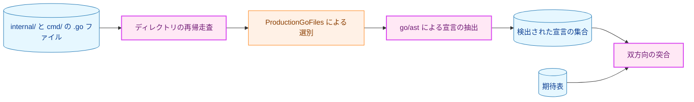

矢印 A → B は「A の出力が B の入力になる」を表す。

**Legend**

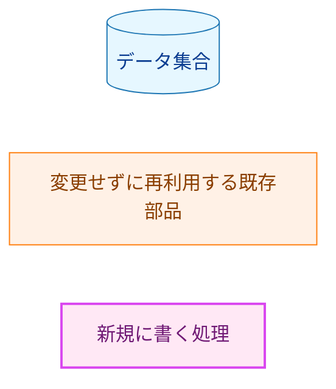

### 4.4 走査の対象範囲

| 判断 | 規則 | 根拠 |
|---|---|---|
| 走査するディレクトリ | `internal/` と `cmd/` を再帰的に | AC-23 の定める範囲 |
| 走査から除くディレクトリ | `testdata/` | テスト入力であってコードではない |
| production ファイルの選別 | 既存の `identitymutationguard.ProductionGoFiles` をディレクトリごとに呼ぶ | `*_test.go` の除外と、`//go:build` が `test` タグを積極的に要求するファイルの除外を既に実装している |
| 除外**しない**ファイル | `//go:build test \|\| performance \|\| integration` | `test` 無しでも満たせるため production 側として数える。`testutil/handlers.go`（K7）が期待表に載るのはこのため |

`ProductionGoFiles` は1ディレクトリを対象とする関数なので、再帰走査は本テストが行う。この走査と
`testdata/` の除外が、新規に書く唯一のロジックである。

### 4.5 検出する宣言の形

ここが本機構の要である。**型式（type expression）を見るだけでは K6 を検出できない。**

```go
var fdExecSupported = sync.OnceValue(func() bool { ... })
```

この宣言に型式は無く、型は初期化子から推論される。`ValueSpec.Type` は `nil` になるため、型式だけを
見る走査は K6 の2件を取りこぼし、期待表との突合は初日から「期待表にあるが見つからない」で失敗する。
`sync.OnceValue` は §4.2 が go/ast を選ぶ根拠に使った当の例であり、ここを外すと機構全体が意味を失う。

したがって走査は次の2つの形を検出する。

| 形 | 例 | 備考 |
|---|---|---|
| 修飾された型式 | `mu sync.Mutex`、`mu *sync.Mutex`、`c atomic.Int64` | `*`／`[]`／`map[...]` は剥がしてから判定する |
| 初期化子の呼び出し式 | `= sync.OnceValue(...)`、`= sync.OnceFunc(...)`、`= sync.OnceValues(...)` | 呼び出し先が対象パッケージの関数である場合 |

対象とする識別子は、AC-23 が列挙する型に限らず **`sync` パッケージの並行プリミティブ全体と
`atomic.*` 全体**とする。すなわち `Mutex`／`RWMutex`／`Once`／`OnceValue`／`OnceFunc`／`OnceValues`／
`WaitGroup`／`Map`／`Cond`／`Locker` と `atomic` の全型である。AC-23 の列挙をそのまま写すと、
`sync.Map` を足した変更が黙って通ってしまう。それは §4.6 が防ごうとしているものそのものである。

同一の論理宣言に複数の構文位置が対応する場合（`handlers.go` の `mu *sync.Mutex` と、それを初期化する
`&sync.Mutex{}`）は、宣言側に寄せて1件と数える。§1.1 の数え方と揃える。

### 4.6 期待表の持ち方と失敗時に分かること

CLAUDE.md の「リスト漏れはソース集合の range で検証する」に従い、期待表は突合のための1つの表だけを
持ち、同じ内容を持つ第2の表は作らない。各行は「ファイル・識別子・維持する短い理由」である。
詳細な根拠は production 側の doc コメントに置き、期待表には失敗メッセージに出る一文だけを持たせる。
分量で役割を分けることで、二重管理を避ける。

新しいロックが追加されたとき、テストは「どのファイルのどの識別子が期待表に無いか」を示す。
実装者が取れる行動は2つしかない。並行アクセスが本当にあるなら理由とともに期待表へ追加する。
無いなら削除する。どちらを選んだかがレビューに残る、というのがこの仕組みの目的である。

この機構は一方向であることを明記しておく。**根拠なく増えたロックは捕まえるが、並行経路上にある
のに保護されていない状態は捕まえない。** §1.4 で挙げた `MultiHandler` などがこれにあたる。

---

## 5. エラーハンドリング設計

本タスクは純粋なリファクタリングであり、既存のエラー型・エラーメッセージ・返却条件を変更しない。
とくに `ErrPermissionCheckUIDPolicyConflict` と `ErrInvalidPermissionCheckUIDPolicy` の返却条件は
D6 の前後で不変である（§7.2 の表）。

新規に追加するエラー型は、§3.4 の再入ガード（AC-24）が用いる次の1件のみである。

```go
// ErrReentrantPrivilegeCall is returned when WithPrivileges is called from
// within a privilege window on the same manager.
var ErrReentrantPrivilegeCall = errors.New("reentrant WithPrivileges call")
```

これは `fn()` を呼ばずに返るため、特権の隙は開かない。呼び出し側は既存の `WithPrivileges` の
エラー経路でそのまま受け取る。判定には `errors.Is` を用いる。

census guard test の失敗メッセージは、`go test` の出力としてのみ現れる。production の
エラーハンドリングには関与しない。書式は「ファイル・識別子・期待表の理由（期待表にある場合）」を
1行ずつ並べたものとし、期待表側の欠落と走査側の余剰を別々の見出しで示す。

---

## 6. セキュリティ考慮事項

### 6.1 削除が新たな危険を作らないこと（D1〜D10）

D1〜D10 の削除は「並行アクセスが無い場所からロックを外す」操作であり、外部から観測できる挙動も
セキュリティ姿勢も変えない。D11 はこれと性質が異なるため §6.2 で別に扱う。

安全網は3つある。効き方が違うので、それぞれの限界とともに述べる。

1. **到達可能性の議論（§1.3〜§1.5）。** 発生源を網羅し、そこから削除対象へ到達しないことを示す。
   稀にしか実行されない経路にも効く唯一の手段である。
2. **`-race` 付きの `make test`。** 実際に競合が起きたときに捕まえる。ただし**実行された経路でしか
   報告しない**。さらに、並行テストを削除してしまうと、その項目については報告する機会そのものが
   無くなる。この制約への対処が §7.1 の検証順序である。
3. **1件1コミット（AC-02）。** 判定を誤ったと後で分かったとき、その1件だけを戻せる。

`-race` を「主要な安全網」と位置づけるのは正確ではない。並行テストを持っていた D3・D4・D6・D8・D10・
D11 については、テスト削除後の `-race` は何も観測しない。**これらの項目で実際に効いているのは
到達可能性の議論と revert 可能性である。**

### 6.2 D11 が可視化する既存の危険（脅威モデル）

D11 の削除は、危険を新たに作るのではなく、**既にある危険を隠していた不十分なガードを取り除く**
操作である。`mu` が達成しているのは `WithPrivileges` 同士の相互排他だけであり、特権の隙が開いている
間に走る非参加 goroutine は保護できない。

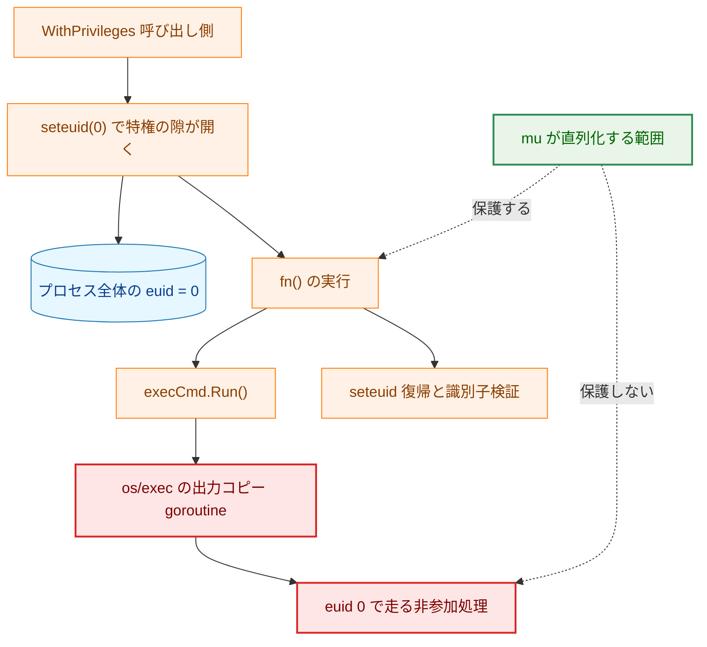

実線の矢印 A → B は「A の次に B が起きる」を、破線の矢印は `mu` の保護範囲を表す。

**Legend**

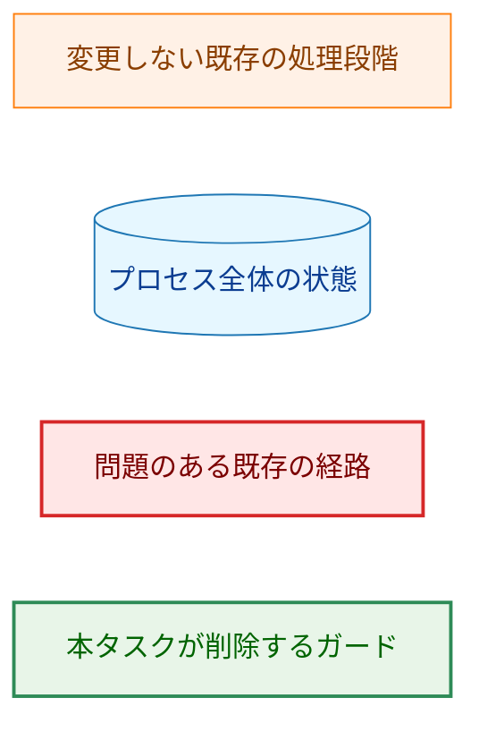

**この脅威は現在すでに成立している。** `executor.go:211` は `WithPrivileges` の `fn()` の中で
`executeCommandWithPath` を呼び、その中の `execCmd.Run()`（`executor.go:340`）と
`execCmd.Output()`（`:358`）が出力コピー goroutine を起こす。どちらの分岐も特権の隙の中である。
したがって `run_as_user`／`run_as_group` を伴うコマンドの実行では、**毎回2つの goroutine が euid 0 で
走っている**。

現時点で被害が出ていないのは、それらの goroutine が行うことが限られているためである。
既に開いている fd への `write(2)` と、サイズ上限超過時の slog 呼び出ししか行わない。パスを開かず、
exec もしない。したがって上がった euid がファイルシステムに対して行使される経路が今は無い。

これは `Capture` とハンドラ群がたまたまそう実装されているという事実であって、**設計上の不変条件では
ない**。ハンドラの1つがファイルを開くようになれば（ログローテーション、新しい出力先の追加など）、
その open は静かに root 権限で行われる。

`mu` を残しても外しても、この脅威の実体は全く変わらない。`mu` は非参加 goroutine を最初から
保護していないからである。変わるのは**読み手が受け取る印象**だけで、`mu` があると「特権まわりは
並行安全」と読めてしまい、本当に必要な設計（特権操作中はプロセス全体を止める、あるいは特権操作を
別プロセスへ切り出す）の検討が先送りされる。AC-11 が doc コメントへ未解決課題の明記を求めるのは、
この印象を反転させるためである。

### 6.3 既存アーキテクチャ文書への例外（インライン記載）

本設計は、既存の設計文書が述べる保証と正面から矛盾する。3点を明記する。

**(1) 元の方針とその所在**

[`docs/dev/architecture_design/security-architecture.md`](../../dev/architecture_design/security-architecture.md)
は、本タスクが削除する同期機構に6箇所で依拠している。内訳は D11 に属するものが5箇所、D7 に属する
ものが1箇所（行 437）である。

| 行 | 記述 | 対応する削除 |
|---|---|---|
| 309 | 構造体定義のコード例に `mu sync.Mutex // Prevents race conditions` | D11 |
| 320 付近 | `WithPrivileges` のコード例に `m.mu.Lock()  // Global lock for thread safety` | D11 |
| **437** | `PathResolver` のコード例に `mu sync.RWMutex` | **D7** |
| 407 | Security Guarantees の「Thread-safe privilege operations with global mutex」 | D11 |
| **1197** | 脅威モデルで、脅威「Race conditions in privilege handling」への対策として「Thread-safe operations」 | D11 |
| **1261** | Performance で「Global mutex prevents race conditions but serializes privilege operations」 | D11 |

行 437 は D7 に属するため、**D7 のコミットに同梱する**。残りは D11 のコミットに同梱する。
1件1コミット（AC-02）の下では、D7 だけを revert したときに文書が誤ったまま残らないようにするため、
この分割が要る。

行 1197 の扱いは他と異なる。ここは脅威と対策の対応表であり、対策を消すだけでは脅威が対策なしで
残る。§6.2 の結論をこの表に反映させる必要がある。すなわち **「特権の隙が開いている間、参加しない goroutine は
保護されない。これは未解決の設計課題である」** を対策欄ではなく残存リスクとして記す。

**(2) 例外とする理由**

「Thread-safe」という保証は、実態としては成立していない。§6.2 のとおり `mu` は非参加 goroutine を
保護せず、粒度もプロセス単位の euid と合っていない（`mu` はインスタンス単位である）。保証として
掲げ続けることは、実装が与える安全性を過大に表明することになる。したがって本設計は、`mu` を削除
すると同時にこの保証の記述も取り下げる。文書だけを残す選択肢は採らない。実装が消えた保証を文書が
述べ続ける状態は、`mu` を残すよりも悪い。

**(3) 旧挙動を主張する既存テスト**

`internal/runner/base/privilege/race_test.go` の全体が `mu` による直列化を前提としている。
含まれるテスト関数は次の4つである。

| テスト関数 | 主張していること |
|---|---|
| `TestUnixPrivilegeManager_ConcurrentAccess` | 並行呼び出しで壊れない |
| `TestUnixPrivilegeManager_NoDeadlock` | デッドロックしない |
| `TestUnixPrivilegeManager_RaceConditionProtection` | 競合から保護される |
| `TestUnixPrivilegeManager_LockSerialization` | ロックが直列化する |

### 6.4 その他

`census_guard_test.go` はテストのみであり、production バイナリには入らない。ソースの読み取り以外の
副作用を持たない。

---

## 7. 処理フロー詳細

### 7.1 1件あたりの削除手順

順序に意味がある。**排他制御を外した直後、並行テストをまだ残した状態で `-race` を走らせる。**
これが、その構造が本当に並行に触られていたかどうかについて得られる唯一の実測値である。
先にテストを消すと、`-race` は何も観測できないまま緑になり、削除の妥当性について何の情報も
得られない。

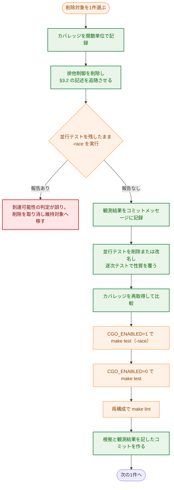

矢印 A → B は「A の次に B を行う」を表す。

**Legend**

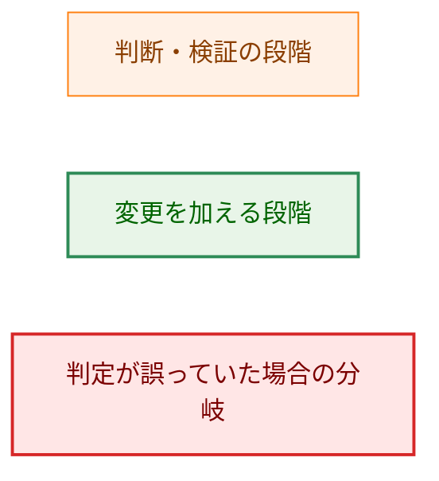

「報告なし」も記録する価値がある。そのテストが実は当該フィールドを並行に触っていなかったことを
意味するからである。D9 に対応する `error_scenarios_test.go` の2つのテストは goroutine ごとに別の
マネージャを構築しているため、この形になると予想される（§8.3）。

### 7.2 D6 の契約が変わらないこと（AC-04）

`SetProcessPermissionCheckUIDPolicy` は現在、CAS ループで「未設定なら設定し、同値なら no-op、
異値なら衝突エラー」を実現している。ループが要るのは、判定と書き込みの間に他の goroutine が
割り込みうるからである。単一スレッドではこの割り込みが無いため、判定と書き込みを続けて行えば
同じ結果になる。

各バイナリの `main` パッケージの `init` から1回だけ呼ばれ、Go は package init を単一 goroutine で
逐次実行するため、そもそも競合しない。

外部から観測できる契約は次のとおり変わらない。

| 入力 | 返り値 | 格納値 |
|---|---|---|
| 現在値と同じ値 | `nil` | 変わらない |
| 未設定の状態に `RealUIDOnly` または `SudoUIDAware` | `nil` | 設定される |
| 現在値と異なる値 | `ErrPermissionCheckUIDPolicyConflict` | 変わらない |
| `PolicyUnset` | `ErrInvalidPermissionCheckUIDPolicy` | 変わらない |
| 不正なキャスト値 | `ErrInvalidPermissionCheckUIDPolicy` | 変わらない |

同じ構造の先例が同じパッケージにある。`nsswitchVerdictValue`（`nsswitch.go:317`）は、起動時に1回
書かれて以後は読むだけの素のグローバル変数であり、ロックを持たない。D6 はこれと同じ形になる。

### 7.3 D3・D5 の「1回だけ」が変わらないこと（AC-05）

両レポータは `CompareAndSwap(false, true)` で「1回だけ記録する」を実現している。単一スレッドでは
`if reported { return }; reported = true` が同じ意味を持つ。プロセスにつき1回という性質は、
レポータのインスタンスがプロセス全体で1つ共有されていること（`processSudoUIDAdoptionReporter`、
`processNSSCompletenessReporter`）が担っており、`atomic.Bool` が担っているわけではない。
したがって型を落としても性質は保たれる。

### 7.4 dry-run との関係

本タスクは副作用を起こす／抑止する分岐を一切追加しない。`--dry-run` が抑止する外部副作用
（コマンド実行、ファイル書き込み、Slack 送信）の範囲は本タスクの前後で変わらない。D8 と D9 は
dry-run 経路の状態を扱うが、いずれも収集する内容ではなくその保護機構を外すだけである。

---

## 8. テスト戦略

### 8.1 安全網の一覧

| 手段 | 何を捕まえるか | 限界 |
|---|---|---|
| 到達可能性の議論（§1.3〜§1.5） | 稀にしか実行されない経路を含む誤判定 | 人手の議論であり、網羅性は検索語の質に依存する |
| `-race` 付き `make test`（`CGO_ENABLED=1`） | 実行された経路での競合 | 並行テストを消すと観測機会が消える（§7.1） |
| `CGO_ENABLED=0` の `make test` | 非 CGO ビルド固有の破綻 | 同上 |
| `make lint` の両構成 | 未使用フィールド・未使用 import の残骸 | 静的に分かる範囲のみ |
| `make deadcode` | 削除で到達不能になったコード（AC-22） | `cmd/record`／`cmd/runner`／`cmd/verify` からの到達性のみ |
| census guard test | 本タスク後に無断で増えたロック（AC-23） | 宣言の有無だけ。保護されていない状態は捕まえない |

### 8.2 並行テストを削除する際の扱い（AC-13）

CLAUDE.md は「テストの削除は検証を要する主張である」と定める。削除する各テストについて、
その関数が主張していた**非並行の性質**を逐次テストが覆っていることを確認する。

`01_requirements.md` の「削除に伴うテストの扱い」の表は行番号で対象を指しているが、行番号は既に
ずれている。実体は関数名で特定するのが正しいので、以下は関数名で示す。

| 削除・改名するテスト | 属する削除 | 逐次側で覆うべき性質 |
|---|---|---|
| `TestSudoUIDAdoptionReporter_ReportsOnlyOnceConcurrently` | **D3** | 2回目以降の `report` が何も記録しない（`TestSudoUIDAdoptionReporter_ReportsOnlyOnce` が既に覆う） |
| `TestSudoUIDExistenceMemo_Concurrent` | D4 | 確認済み UID は再問い合わせされず、失敗した確認は毎回再問い合わせされる（`TestSudoUIDExistenceMemo_ReusesConfirmation`・`TestSudoUIDExistenceMemo_DoesNotRememberFailures` が既に覆う） |
| `TestSetProcessPermissionCheckUIDPolicy_Concurrent` | D6 | §7.2 の契約表の全行 |
| `TestResultCollector_Concurrency` | D8 | 成功・失敗の記録が集計へ正しく反映される |
| `TestVerifiedFD_ConcurrentClose` | D10 | 同一 goroutine からの二重 `Close` で `syscall.Close` が1回だけ走る |
| `race_test.go` の4関数 | D11 | 特権の昇格・復帰と識別子検証（`TestUnixPrivilegeManager_WithPrivileges` 系および `identity_mutation_guard_test.go` が覆う。実際の被覆は §7.1 のカバレッジ比較で確認する） |

> **重要な訂正**: `01_requirements.md` の表は `manager_test.go:1360` を **D2**（メンバーシップ
> キャッシュへの並行アクセス）としているが、その位置にある関数は
> `TestSudoUIDAdoptionReporter_ReportsOnlyOnceConcurrently` であり、実際には **D3** に属する。
> `internal/groupmembership/manager_test.go` に並行テストは2つしか無く（`go func` は 1363 行と
> 1448 行）、**D2 には対応する並行テストが存在しない**。したがって D2 は削除すべきテストを持たず、
> 同時に §7.1 の `-race` 実測も得られない。D2 の根拠は到達可能性の議論のみに依る。

確認の方法は `go tool cover -func` の関数単位の比較である。削除の前後で出力を取り、カバレッジが
落ちた関数が無いことを確かめ、その旨をコミットメッセージに記す。

### 8.3 設計時に見つかった、要件の表に無い並行テスト

リポジトリ全体を走査したところ、`01_requirements.md` の表に無い並行テストが4件（3グループ）あった。いずれも
放置すると、コードが提供しなくなった契約をテストが主張し続ける状態になる。

| テスト | 状況 | 対処 |
|---|---|---|
| `runner/resource/error_scenarios_test.go` の `TestConcurrentExecutionConsistency`・`TestConcurrentExecution` | D9 の対象を並行に駆動するが、goroutine ごとに別のマネージャを構築するため `-race` は発火しない。D9 後も**黙って通り続ける** | 並行性の主張を名前と doc コメントから外して改名する。削除はしない（別の価値がある） |
| `verification/shebang_chain_verifier_test.go` の `TestVerifyCommandDependencies_ConcurrentCallsAreRaceFree` | 単一の `verification.Manager` を8 goroutine から駆動し、「1つの Manager が並行検証を扱える」と明記している。D7（`PathResolver`）と D8（`ResultCollector`）は**その Manager のフィールド**である | **維持する。** 現在 `VerifyCommandDependencies` は `pathResolver.ResolvePath` にも `ResultCollector` にも到達しないため、今は安全である。ただしこの隣接は危険なので、D7・D8 の doc コメントに「この型は並行使用を想定しない。`verification.Manager` の並行経路から到達させてはならない」と明記する |
| `runner/base/output/integration_test.go` の `TestOutputCaptureIntegration_ConcurrentWrites` | 名前に反して実体は逐次である（コメントにもそう書かれている） | 実体に合わせて改名する |

このうち2件目が最も重要である。`verification.Manager` は並行使用の契約を持ちテストもされているのに、
その内部のフィールドから同期を外すことになる。現時点で経路が繋がっていないことは確認したが、
`VerifyCommandDependencies` に1つメソッドを足せば静かに競合が生まれる。doc コメントによる警告が
唯一の防御になる。

### 8.4 テストが主張する理由で失敗できること（AC-19）

AC-04〜AC-10 および AC-24 を検証するテストは、検証対象の挙動を壊したときに失敗しなければならない。
各コミットで次の確認を行い、結果をコミットメッセージに記す。§3.6 の「新規に要るテスト」列が空欄で
ない項目は、この確認の前にテストを書く必要がある。

| AC | 壊し方の例 |
|---|---|
| AC-04 | 衝突判定の分岐を外し、異値の設定が通るようにする |
| AC-05 | `reported` の判定を外し、2回目以降も記録されるようにする |
| AC-06 | memo の参照を外し、毎回問い合わせるようにする |
| AC-07 | キャッシュの参照を外す |
| AC-08 | 一時ディレクトリの登録を落とす |
| AC-09 | stdout 用と stderr 用の `outputWrapper` を入れ替える |
| AC-10 | `closed` の判定を外し、`syscall.Close` が2回走るようにする |
| AC-24 | `inPrivilegedWindow` の判定を外し、再入が `fn()` に到達するようにする |

AC-09 の「標準出力と標準エラー出力が取り違えられない」は、両者を取り違えても総量が変わらない
テストでは検出できない。stdout と stderr に**異なる内容**を書かせ、それぞれの取得結果が対応する
ことを確かめる形にする。

### 8.5 維持側のテスト（AC-18）

`internal/runner/base/output/capture_test.go` の並行テストは K2 を覆うものであり、削除しない。
`-race` 付きで引き続き通過することを各コミットで確認する。

### 8.6 census guard test の設計（AC-23）

このテストは「期待表と現実が一致する」ことを主張する。したがって**期待表を書き換えれば必ず通る**
という性質を持つ。それでよい。目的は変更を禁止することではなく、変更をレビューに可視化することで
ある。

テストが主張する理由で失敗できることの確認は、次の3つで行う。3つ目は §4.5 の取りこぼしを直接
突くものであり、省略できない。

1. 期待表から1行削り、「走査で見つかったが期待表に無い」で失敗すること。
2. production ファイルへロックを1つ足し、同じく失敗すること。
3. **K6 の行**（`sync.OnceValue`、型式を持たない宣言）を期待表から削り、失敗すること。
   型式だけを見る実装ではここが通ってしまう。

---

## 9. 実装優先順位

削除は1件1コミットで進めるが、フェーズ間には順序の制約がある。

| フェーズ | 内容 | 順序の理由 |
|---|---|---|
| Phase 1 | 維持対象 K1〜K6 と `pwentMutex` への doc コメント追加（AC-14〜AC-17）、§8.3 の3件の改名・警告追加 | 判定の根拠を先に文書化する。以降の削除で「なぜこれは残るのか」が参照できる |
| Phase 2 | D1〜D10 の削除（1件1コミット、§7.1 の手順） | 相互に依存しない。D2・D7・D8 は §3.2 の記述追随を同梱する（D7 は `security-architecture.md:437` を含む） |
| Phase 3 | D11 の削除、`WithPrivileges` と インターフェースの記述改訂、再入ガード（§3.4）、`security-architecture.md` 6箇所のうち D11 分の5箇所の改訂 | 影響範囲が最も広く、既存文書と脅威モデルの改訂を伴うため単独で扱う |
| Phase 4 | census guard test の追加（AC-23） | すべての削除が終わった後でなければ期待表を確定できない |
| Phase 5 | `make deadcode` の確認（AC-22）と全体の緑確認（AC-20・AC-21） | 最終確認 |

Phase 1 を先に置く理由は、Phase 2 以降のコミットが「なぜこれは削除でこれは維持なのか」を
既に書かれた doc コメントで説明できるようにするためである。逆順にすると、削除コミットの
レビュー時点で維持側の根拠がコードのどこにも無い状態になる。

---

## 10. 将来の拡張性

### 10.1 グループ単位の並列実行を導入するとき

本タスクは並列化を妨げない。並列化を実施する時点で、守るべき対象を特定したうえで排他制御を
置き直す。その際に本タスクが残す資産は次の4つである。

- **維持対象の doc コメント**: どの goroutine とどの goroutine の間で並行なのかが既に書かれている。
- **発生源の掃き出し手順（§1.5）**: 検索語とその結果が残っているので、次の棚卸しは同じ掃き出しを
  再現できる。
- **census guard test の期待表**: 並列化で足したロックは必ず期待表への追記を伴い、追記の際に理由を
  書かせることで「とりあえずロックを足す」を防ぐ。
- **`WithPrivileges` の未解決課題の記述**: 特権の隙と非参加 goroutine の問題が、並列化の設計に
  先立って読まれる位置にある。

### 10.2 特権操作の設計をやり直すとき

§6.2 の脅威に正面から取り組む場合、選択肢は「特権操作中はプロセス全体を止める」か「特権操作を
別プロセスへ切り出す」かのいずれかになる。どちらも `WithPrivileges` の内側にロックを足すことでは
解決しない。本タスクが `mu` を取り除くのは、この選択を先送りさせないためである。

すでに脅威が成立している（§6.2）ことを踏まえると、この検討の優先度は並列化の導入時期とは独立に
決めるべきである。並列化しなくても、ハンドラがファイルを開くようになった時点で顕在化する。

### 10.3 `pwentMutex` を扱うとき

`pwentMutex` は本タスクの対象外だが、並列化の際には最初に検討すべき箇所になる。`setpwent`／
`getpwent`／`endpwent` は libc のプロセス全体のカーソルであり、外すとエラーではなく黙って誤った
列挙結果になる。「並列化するなら mutex を足す」では済まず、列挙 API の使い方そのものの検討が要る。

### 10.4 census を保護漏れの検出へ広げるとき

§4.6 のとおり、現在の census は一方向である。並行経路上にありながら保護されていない状態
（§1.4 の `MultiHandler` など）は検出しない。これを検出するには、ハンドラ連鎖のような「並行経路」を
機械が知る必要があり、本タスクの範囲を超える。必要になった時点で、§1.4 の表を機械可読な形へ
移すところから始めるのが自然である。

---

## 付録A: 決定の経緯

> 本文は現行の設計を述べる。ここには、その設計に至った判断のうち、本文からは読み取れないものだけを
> 記す。個々の変更の履歴は git を参照のこと。

### A.1 `privilege/unix.go` の `mu` が「判断が要るもの」から「削除候補」へ移った経緯

Issue #1074 は当初 `mu` を「判断が要るもの」に分類していたが、後に削除候補へ移している。
決め手は YAGNI ではなく、不十分なガードが誤った安心を与えることであった。判断の詳細は
`01_requirements.md` の「`privilege/unix.go` の `mu` について」にある。

### A.2 先行タスク 0169 との関係

タスク 0169（CGO ビルドの列挙完全性）の Phase 4 で、`nsswitch.go` の完全性判定 latch を同じ理由で
削除している。本タスクはその続きにあたる。D5（`nssCompletenessReporter.reported`）が Issue #1074 の
表に無いのは、0169 の作業中に見つかった追加分だからである。

### A.3 なぜ既存の guard テスト方式をそのまま使うのか

AC-23 の検証機構として、golangci-lint のカスタムルールや `go vet` のアナライザも検討しうる。
しかし本リポジトリには既に go/ast による guard テストの前例が2つあり
（`identitymutationguard`、`sourceorder`）、production ファイルの選別ロジックはそのまま再利用できる。
新しい仕組みを導入する理由が無いため、既存方式に揃える（YAGNI）。

### A.4 期待表を1つに保つ判断

期待表と production ソースの両方に「維持する理由」を詳しく書くと、同じ内容が2箇所に分かれ、
片方だけが更新される状態を招く。本設計では、doc コメントを詳細な根拠の置き場とし、期待表には
失敗メッセージに出る短い理由だけを持たせる。両者は分量で役割を分ける。

### A.5 `01_requirements.md` との差分

設計の過程で、承認済みの要件定義書の記述に3点の誤りが見つかった。いずれも対処方針は変わらないため、
**この3点については**要件定義書を改訂せず、本設計での訂正にとどめる（要件定義書に加えた別の2点の
変更は A.6 に記す）。

| 箇所 | 要件定義書の記述 | 実際 |
|---|---|---|
| 「削除に伴うテストの扱い」の表 | `manager_test.go:1360` を D2 とする | その位置の関数は D3 のもの。D2 に並行テストは存在しない（§8.2） |
| 同表 | `race_test.go` を「ファイル全体、3箇所」 | テスト関数は4つ（§6.3） |
| 背景 | 「自前の `go` 文は production コードに2箇所」 | literal な `go` 文は1箇所。もう1つは `sync.WaitGroup.Go`（§1.5） |

### A.6 承認後に要件定義書へ加えた2点の変更

`01_requirements.md` は承認済みだが、本設計のレビューを経て2点を変更した。いずれも承認者の判断に
よるもので、Document Status の Comments にも記録してある。

| 変更 | 理由 |
|---|---|
| **AC-24 の追加** | §3.4 の再入ガードを採用する判断を受けたもの。ガードを入れる以上、検証すべき挙動が要件側に無いと `03_implementation_plan.md` からたどれる先が無くなる |
| **「特権窓」→「特権の隙」** | 用語集の `隙` の項が、攻撃・競合の文脈で「窓」「ウィンドウ」を使わないと定めているため。技術的な内容は変わらない |

用語の変更は 2 文書に閉じており、他の文書・コードには `特権窓` の使用箇所が無いことを確認した。
