# アーキテクチャ設計書: 特権の隙をコマンド実行全体から fork/exec まで縮小する

## Document Status

| Item | Value |
|---|---|
| Status | `approved` |
| Created | 2026-09-02 |
| Review date | 2026-09-03 |
| Reviewer | isseis |
| Comments | - |

## 関連文書

- 要件定義書: [01_requirements.md](01_requirements.md)
- Issue: [#1080](https://github.com/isseis/go-safe-cmd-runner/issues/1080)
- 先行タスク: [0170 の設計文書](../0170_excess_synchronization_removal/02_architecture.md) §6.2（脅威モデル）、§10.2（特権操作の設計をやり直すとき）
- [security-architecture.ja.md](../../dev/architecture_design/security-architecture.ja.md)（本タスクで更新する）

## 用語

要件定義書の用語表に加え、本書で導入する語を示す。

| 用語 | 意味 |
|---|---|
| 特権の隙 | プロセスの実効 UID が 0 に上がっている区間。`WithPrivileges` が開いて閉じる |
| 非参加 goroutine | `WithPrivileges` の呼び出しに参加していないのに、隙が開いている間に走っている goroutine |
| 実行 goroutine | コマンドの起動から結果の組み立てまでを進める goroutine。`Execute` を呼んだ goroutine と同じ |
| fd-bound 実行 | 検証済みの記述子を `/proc/self/fd` 経由でそのまま exec する経路（Linux） |
| staging フォールバック | fd-bound 実行が使えないとき、検証済み記述子の内容を専用の複製へ写して実行する経路 |
| 準備フェーズ | コマンドを起動できる状態まで組み立てる区間。特権を要さない |
| 起動フェーズ | 子プロセスを起動する区間。特権の隙（起動区間）を開く |
| 監督フェーズ | 子プロセスの終了・キャンセル・出力の取り込みを見る区間。キャンセル時と staging フォールバックの後始末を除き、特権を要さない |
| 起動区間 | 起動フェーズが開く特権の隙。中で行うのは `Start()`（staging フォールバックのときは複製の作成も）だけ |
| kill 区間 | キャンセル時にだけ開く特権の隙。中で行うのは `Process.Kill()` だけ |
| 後始末区間 | run-as 実行かつ staging フォールバックのときにだけ開く特権の隙。中で行うのは staged copy の削除だけ |
| 出力中継 | 子プロセスの stdout／stderr のパイプを親側で読み、`OutputWriter` へ流す部品。本タスクで新設する |
| 待機 goroutine | 監督フェーズで `execCmd.Wait()` だけを呼ぶ goroutine。起動区間が閉じた後に起動する |

---

## 1. 設計の全体像

### 1.1 このタスクが解く問題

`run_as_user`／`run_as_group` を伴う実行では、特権の隙がコマンドの実行時間そのものと等しい。
[`executor.go:210`](../../../internal/runner/base/executor/executor.go#L210) が `WithPrivileges` の
`fn()` の中でコマンドの起動から終了待ちまでを行うためである。隙の中では次の2つが同時に成り立つ。

1. プロセス全体の実効 UID が 0 である時間が、数分から数時間に及びうる。
2. その間、`os/exec` が起こした出力コピー goroutine（stdout と stderr で2本）と、
   `exec.CommandContext` が起こした watchdog goroutine が、実効 UID 0 で走っている。
   これらは `WithPrivileges` の参加者ではないため、特権マネージャは保護できない。

本設計は、コマンド実行を**準備・起動・監督の3フェーズへ分け、通常の経路の特権の隙を起動フェーズ
だけに縮める**。出力の受け渡しを `os/exec` の goroutine から自前の出力中継へ移し、キャンセルの
待機を watchdog goroutine から実行 goroutine の `select` へ移すことで、起動区間の中に残る goroutine
は実行 goroutine だけになる。

隙は最大で3つ開く。常に開くのは起動区間だけであり、kill 区間はキャンセルが起きたときに、
後始末区間は run-as 実行かつ staging フォールバックのときにだけ開く（§3.4、§5.2）。

### 1.2 設計原則

1. **隙の中でできることを構造で縛る。** 「隙を短くする」ではなく「隙の中に置く操作を数えられる
   ようにする」。隙に入る処理は関数リテラルへ閉じ、そこから呼べる操作を静的検査で固定する。
2. **記述子の生成と解放を対にして1箇所へ置く。** 自前でパイプを持つ以上、漏洩とデッドロックは
   設計で防ぐ。準備フェーズが確保した資源の解放先を `preparedCommand.release()` 1つに集め、
   `Start()` が失敗した経路も同じ解放を通す。
3. **外から見える挙動は、意図して変える所だけを変える。** 終了コード、標準出力、`OutputWriter` への
   書き込み、返すエラーの種別と優先順位は現在と一致させる。`os/exec` から引き継ぐ意味論は
   対応表（§4.3）で1件ずつ突き合わせ、意図して変える1点（タイムアウト・キャンセルで殺したときの
   エラー）はその表と §5.6 に明記する。
4. **単一 goroutine 前提を壊さない。** 特権操作を行う goroutine は実行 goroutine だけに保つ。
   タスク 0170 が置いた同期を伴わない再入ガードの前提を維持する。
5. **判断は型で宣言する。** どの経路で exec するか、kill に再昇格が要るかを、呼び出し先が値の中身から
   推測するのではなく列挙型で宣言する。宣言し忘れを表す零値を用意し、`switch` の `default` を
   失敗側に倒す。
6. **待ち時間に上限を置く。** 自前で待つ以上、相手が返さない場合の出口を用意する。kill の後の回収と
   出力の吸い出しには上限を設け、越えたら理由を添えて戻る。

### 1.3 概念モデル: 3つのフェーズと起動区間

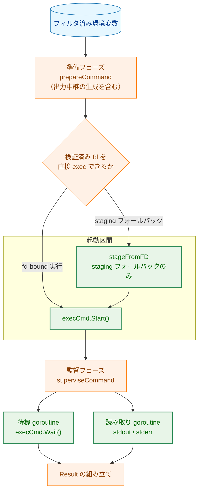

矢印 A → B は「A の次に B が起きる」を表す。ただし円筒形の節点から出る矢印だけは「A を B が
入力として使う」を表す。`BIND` から出る矢印のラベルは、選ばれた経路を示す。`GAP` の枠の内側だけが
実効 UID 0 で走る。待機 goroutine と読み取り goroutine は監督フェーズで起動するので、枠の外にある。
キャンセルが起きたときの kill 区間と、run-as 実行かつ staging フォールバックのときの後始末区間は、
監督フェーズの中で開く（§3.3、§3.4）。

**Legend**

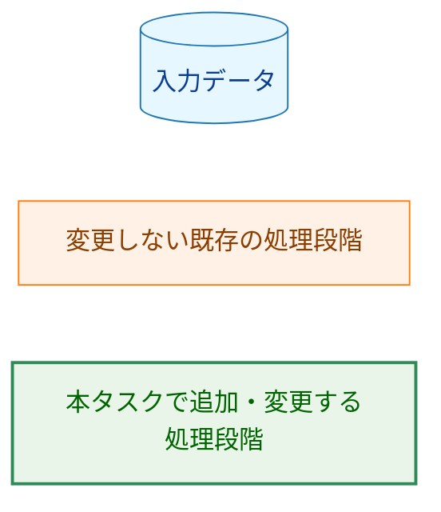

### 1.4 起動区間の中の goroutine が消える理由

起動区間の中で走る goroutine の発生源は3つある。本設計はこのうち2つを取り除く。

| 発生源 | 現在 | 本設計後 |
|---|---|---|
| `os/exec` の出力コピー goroutine（2本） | `Stdout`／`Stderr` が `*os.File` ではないため、`Start()` が起こす | `Stdout`／`Stderr` に、出力中継で用意した `*os.File`（パイプの書き込み側）を渡すので、`os/exec` は goroutine を起こさない |
| `exec.CommandContext` の watchdog goroutine（1本） | `Start()` が `ctx.Done()` を見張る goroutine を起こす | `exec.Command` を使い、キャンセルの待機を実行 goroutine の `select` で行うので起きない |
| Slack 送信ワーカー（1本） | ログ機構が持つ。コマンド実行とは独立に生きている | 変わらない（要件定義書のスコープ外） |

`os/exec` が出力コピー goroutine を起こすのは、`Cmd.Stdout`／`Cmd.Stderr` が `*os.File` でないときに
限られる。パイプを親側で用意して書き込み側を渡せば、子プロセスへ渡す記述子はそのまま `*os.File`
となり、`os/exec` の側には何も残らない。読み取りは自前の goroutine が行うが、これは起動区間が
閉じてから起動する。

kill 区間と後始末区間は、この2本の読み取り goroutine と待機 goroutine が生きている間に開く。
その扱いは §5.3 に残存リスクとして記す。

### 1.5 なぜ既存の仕組みでは足りないのか（YAGNI の確認）

| 案 | 採らない理由 |
|---|---|
| `WithPrivileges` の中にロックを足し、非参加 goroutine を待たせる | 保護したいのは `WithPrivileges` の呼び出し同士ではなく、隙の中で走る任意の goroutine である。ロックは非参加 goroutine を止められない（0170 設計文書 §6.2） |
| `exec.CommandContext` を使ったまま `Cmd.Cancel` だけ差し替える | `Cancel` は watchdog goroutine の上で呼ばれる。そこから `WithPrivileges` を呼ぶと、2つの goroutine が特権操作に入りうることになり、原則4を破る |
| `Cmd.WaitDelay` を設定して `Wait()` の戻りを早める | 隙の長さは `Wait()` が戻るまでではなく子プロセスが終わるまで続く。長さの問題を解かない |
| 出力の取り込みを `Cmd.StdoutPipe()` に任せる | `StdoutPipe` は `Wait()` より前に読み切ることを呼び出し側へ要求する契約であり、パイプの解放時期も `Wait()` に結び付いている。所有関係が2箇所に割れるので、原則2（生成と解放を1箇所へ）に反する |
| 特権操作を別プロセスへ切り出す | 0170 設計文書 §10.2 の選択肢だが、範囲がはるかに大きい。本タスクは非参加 goroutine を起動区間の外へ出すことでこの判断の緊急度を下げる（要件定義書のスコープ外） |

---

## 2. システム構成

### 2.1 現在と本設計後の比較

```mermaid
flowchart TD
    classDef process fill:#fff1e6,stroke:#ff7f0e,stroke-width:1px,color:#8a3e00;
    classDef problem fill:#ffe6e6,stroke:#d62728,stroke-width:2px,color:#7b0000;
    classDef enhanced fill:#e8f5e8,stroke:#2e8b57,stroke-width:2px,color:#006400;

    subgraph BEFORE["現在: 隙 = コマンドの実行時間"]
        B1["executeWithUserGroup"]
        B2["WithPrivileges が隙を開く"]
        B3["executeCommandWithPath"]
        B4["execCmd.Run()"]
        B5["os/exec の出力コピー goroutine"]
        B6["CommandContext の watchdog goroutine"]
        B7["WithPrivileges が隙を閉じる"]

        B1 --> B2
        B2 --> B3
        B3 --> B4
        B4 --> B5
        B4 --> B6
        B4 --> B7
    end

    subgraph AFTER["本設計後: 隙 = staging と fork/execve"]
        A1["executeWithUserGroup"]
        A2["prepareCommand"]
        A3["WithPrivileges が起動区間を開く"]
        A4["stageFromFD と execCmd.Start()"]
        A5["WithPrivileges が起動区間を閉じる"]
        A6["superviseCommand"]
        A7["出力中継の読み取り goroutine"]
        A8["待機 goroutine"]

        A1 --> A2
        A2 --> A3
        A3 --> A4
        A4 --> A5
        A5 --> A6
        A6 --> A7
        A6 --> A8
    end

    class B1,B3 process
    class B2,B4,B5,B6,B7 problem
    class A1 process
    class A2,A3,A4,A5,A6,A7,A8 enhanced
```

矢印 A → B は「A の次に B が起きる」を表す。現在の図で赤い節点は、特権の隙の内側にある処理である。
本設計後の図では、隙の内側は `A4` だけになる。`stageFromFD` は staging フォールバックのときだけ
走る（fd-bound 実行では `Start()` だけである）。

**Legend**

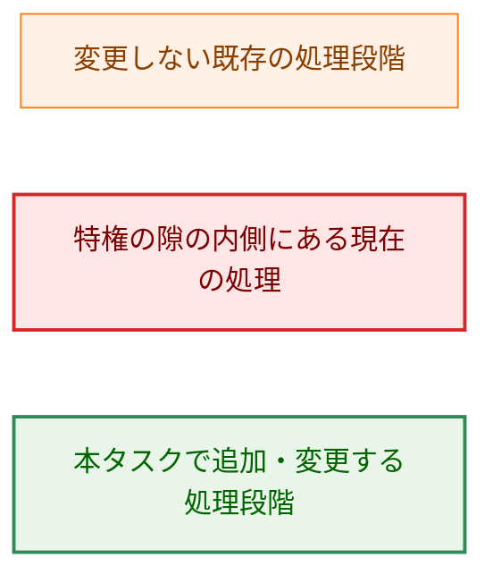

### 2.2 コンポーネント配置

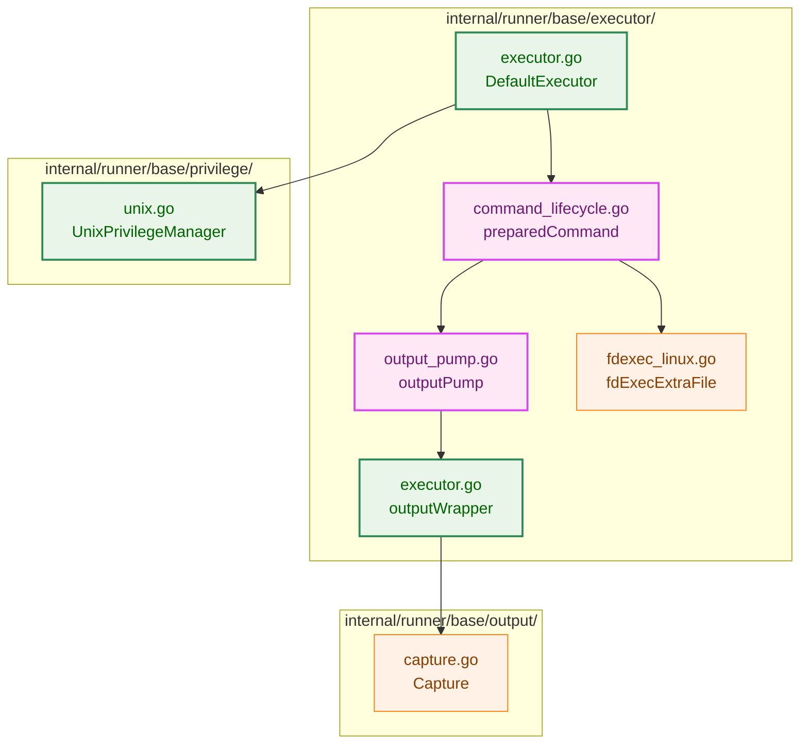

矢印 A → B は「A が B を使う」を表す。緑は本タスクで実装を変える既存の部品、紫は本タスクで
追加する型、橙は実装を変えない部品である。`outputWrapper` は収集先を上限つきのバッファへ替える
ため緑に置いている（§3.2 要点6）。`Capture` は型も挙動も変わらず、doc コメントだけを更新する
（§3.6）ので橙である。`executor.go` の節点が2つあるのは、同じファイルの中で役割の異なる2つの型を
示すためである。

**Legend**

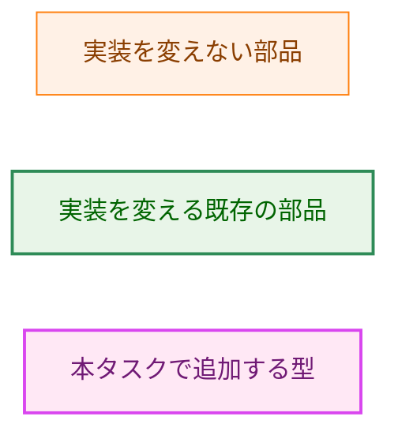

### 2.3 データフロー（正常系）

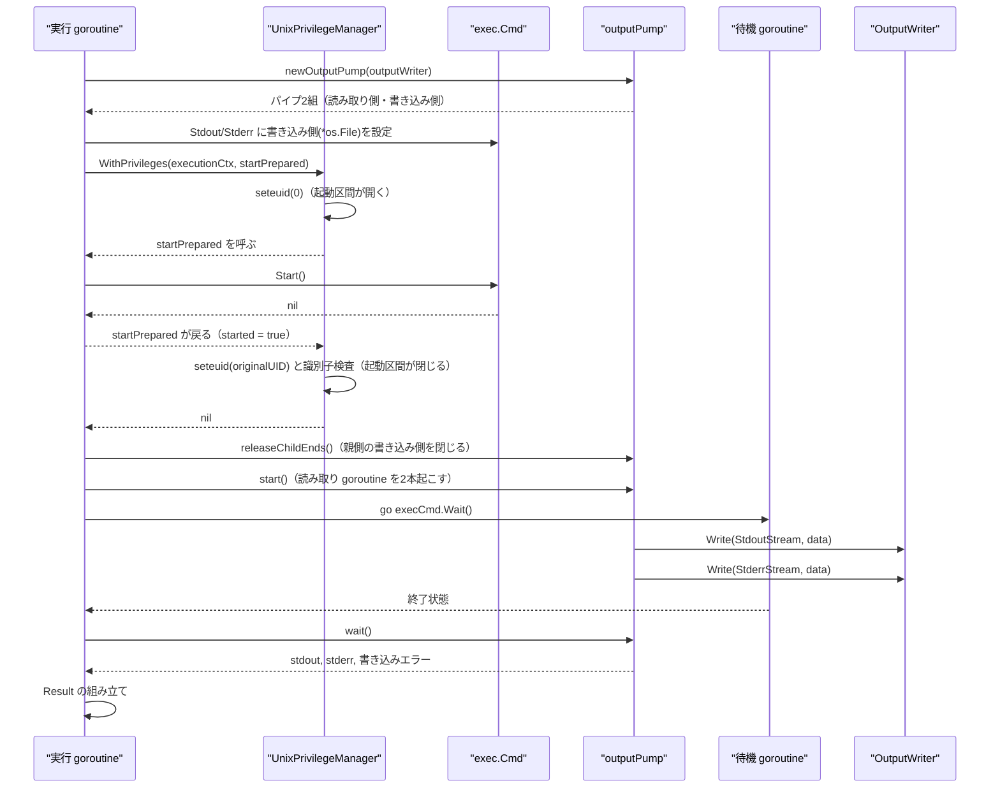

矢印 A ->> B は「A が B を呼ぶ」、破線の矢印 B -->> A は「B が A へ制御を戻す」を表す。
`seteuid(0)` から `seteuid(originalUID)` までが起動区間である。書き込み側を閉じるのは隙の**外**、
`WithPrivileges` が戻った直後である。`Start()` の成否によらず必ず通る1箇所という不変条件（§3.2 要点3）
はこの位置でも守れる一方、隙の内側に置くと AC-04 が定める「隙の中は `chown`／`chmod` と `Start()`
だけ」から外れるため、外に出している。閉じるまでの間（隙が閉じるまでの数マイクロ秒）親が書き込み側を
持ち続けるが、読み取りはまだ始まっていないので影響はない。

---

## 3. コンポーネント設計

### 3.1 3フェーズへの分解

現在の `executeCommandWithPath` は、準備・起動・出力の取り込み・結果の組み立てを1つの関数で行い、
全体が `WithPrivileges` の内側に置かれている。本設計はこれを、起動だけを取り出せる形へ分ける。

```go
// preparedCommand holds what prepareCommand built without privilege.
// Exception: for bindingStagedCopy the staged path doesn't exist yet, so the
// start phase fills in execCmd.Path -- and only Path, since Args[0] is
// already resolvedPath -- inside the privilege window. execCmd is a struct
// literal there rather than exec.Command's output, because exec.Command runs
// LookPath and stores the failure in Cmd.Err before Start does anything else,
// so it would fail on the not-yet-existing path regardless of what the window
// later writes.
// release() frees every descriptor prepareCommand acquired, on every path.
type preparedCommand struct {
    execCmd *exec.Cmd
    binding execBinding
    pump    *outputPump
    kill    killStrategy
    verifiedFD *os.File        // duplicated verified fd; nil unless bindingVerifiedFD
    stage      *stagingRequest // nil unless binding == bindingStagedCopy
}

// stagingRequest carries what the start phase needs to build the staged copy
// inside the privilege window: the verified identity to copy from, the run-as
// credential whose gid the copy is chgrp'd to, and the resolved path presented
// to the child as argv[0].
type stagingRequest struct {
    identity     *risktypes.VerifiedIdentity
    cred         *syscall.Credential
    resolvedPath string
}

// execBinding declares how the executed inode is bound. The zero value is
// bindingUnset, which every switch over this type rejects, so a
// preparedCommand whose binding was never declared cannot be started.
type execBinding int

const (
    bindingUnset execBinding = iota
    bindingVerifiedFD                 // /proc/self/fd/<n> (Linux)
    bindingStagedCopy                 // private copy made from the verified fd
    bindingResolvedPath               // already-resolved path, no verified fd
)

// killStrategy declares what a cancellation-triggered kill requires. Like
// execBinding it has an explicit unset zero value: defaulting to "no
// re-elevation" would silently reproduce the EPERM-on-kill failure this task
// exists to fix.
type killStrategy int

const (
    killUnset killStrategy = iota
    killDirect                  // no credential was applied; kill as-is
    killReelevated              // run-as execution; kill inside a privilege window
)
```

責務の分割は次のとおりである。

| フェーズ | 関数 | 行うこと | 特権 |
|---|---|---|---|
| 準備 | `prepareCommand` | 引数検査、`exec.Cmd` の組み立て、`os.DevNull` の open、環境変数の組み立て、出力中継の生成、fd-bound 実行のための記述子複製、`binding`／`kill` の宣言、`ctx.Err()` の確認 | 不要 |
| 起動 | `startPrepared` | staging フォールバック時の複製作成と `execCmd.Path` の確定（§3.4）、`execCmd.Start()` | 起動区間の内側（run-as のときのみ隙を開く） |
| 監督 | `superviseCommand` | 読み取り goroutine と待機 goroutine の起動、`ctx.Done()` との `select`、キャンセル時の kill、staging の後始末、`Result` の組み立て | 原則として不要（kill 区間・後始末区間のみ §3.3、§3.4） |

`executeWithUserGroup` と `executeNormal` の違いは起動フェーズの包み方だけになる。前者は
`startPrepared` を `WithPrivileges` で包み、後者はそのまま呼ぶ。準備と監督は両者で同一の経路を通る。

**起動フェーズの戻り値。** `startPrepared` は `(started bool, err error)` を返す。`started` が真の
ときは子プロセスが既に走っており、`err` の有無にかかわらず**監督フェーズへ進んで kill と回収を
行う**。`Start()` に成功した後に失敗しうる処理（後述の書き込み側の解放）を「起動の失敗」として
扱うと、run-as の資格で走る子プロセスを誰も止めず誰も `Wait()` しないまま呼び出し元へ戻ることに
なるためである。呼び出し側の骨格は次のとおりで、書き込み側の解放は隙の外の必ず通る位置に置く。
コード中の日本語コメントはこの文書の読者向けの注記であり、実装にそのまま書き写すものではない
（英語で書く実装のコメントは通常のレビューで判断する）。

```go
var started bool
elevErr := e.PrivMgr.WithPrivileges(execCtx, func() error {
    var err error
    started, err = e.startPrepared(pc)
    return err
})
// 隙の外。Start() の成否によらず必ず通る（§3.2 要点3）。
closeErr := pc.pump.releaseChildEnds()

switch {
case !started:
    // 子は走っていない。資源を解放して起動の失敗として返す。
    return nil, errors.Join(elevErr, closeErr, pc.release())
case elevErr != nil || closeErr != nil:
    // 起動済み。止めてから報告する（放置すると wait が deadline まで戻らない）。
    return e.superviseCommand(ctx, pc, startupErr(elevErr, closeErr))
default:
    return e.superviseCommand(ctx, pc, nil)
}
```

`superviseCommand` の第3引数が非 `nil` のときは、`ctx.Done()` を待たずに直ちにキャンセル経路
（kill → `killGraceDelay` 付きの回収 → 後始末）へ入り、最後にこのエラーを結果へ添える。

### 3.2 出力中継

出力中継は、子プロセスへ渡すパイプの親側を1つの型に閉じ込める。

```go
// outputPump hands the pipe write ends to exec.Cmd so os/exec starts no copy
// goroutine of its own, then reads the read ends itself once the privilege
// window has closed. The two reading goroutines join through buffered
// channels, not a WaitGroup, so the pump declares no synchronization
// primitive (see the census guard in section 3.6).
type outputPump struct {
    stdout *pumpStream
    stderr *pumpStream
}

// pumpStream is one direction: the pipe pair plus the wrapper that buffers the
// bytes and forwards them to the OutputWriter.
type pumpStream struct {
    childEnd  *os.File // handed to exec.Cmd; closed by releaseChildEnds
    parentEnd *os.File // read by the pump goroutine, which closes it on exit
    wrapper   *outputWrapper
    done      chan error
}

// stderrLimit bounds how many bytes the stderr wrapper retains in memory;
// 0 means unbounded (see point 6).
func newOutputPump(writer OutputWriter, stderrLimit int) (*outputPump, error)

func (p *outputPump) childFiles() (stdout, stderr *os.File)

// releaseChildEnds must run immediately after the start phase returns --
// success or failure, outside the privilege window -- or the read ends never
// reach EOF and wait blocks until its deadline. Idempotent, so release may
// follow it.
func (p *outputPump) releaseChildEnds() error

// start must not be called before the privilege window has closed.
func (p *outputPump) start()

// wait's stdout write error takes precedence over stderr's, matching the
// order the current implementation checks them in.
//
// A stream whose goroutine has not finished by the deadline is reported as nil
// with timedOut true: that goroutine may still be inside outputWrapper.Write,
// so reading its buffer or its writeErr here would race it. Only a stream whose
// done channel has yielded is read (see point 7).
func (p *outputPump) wait(deadline time.Duration) (stdout, stderr []byte, writeErr error, timedOut bool)

// release is safe to call on paths where start was never reached.
func (p *outputPump) release() error
```

設計上の要点は7つある。

1. **`outputWrapper` を再利用し、収集先だけを差し替える。** `OutputWriter` への転送と最初の
   書き込みエラーの保持という責務は現在の
   [`outputWrapper`](../../../internal/runner/base/executor/executor.go#L643) がすでに持つ。
   出力中継はその呼び出し元が `os/exec` から自分へ替わるだけである。変えるのは収集先の1点で、
   `bytes.Buffer` を上限つきの `boundedBuffer` へ替え、構築関数を
   `newOutputWrapper(writer, stream, limit)` にする（要点6）。`Write`／`GetBuffer`／
   `GetWriteError` のシグネチャと、転送・エラー保持の挙動は変わらない。
2. **読み取り側は読み取り goroutine が閉じる。** `os/exec` は複製が終わった時点で
   （エラー終了を含めて）読み取り側を閉じており、そのため上限超過時に子プロセスが
   `SIGPIPE` を受ける。出力中継も同じ順序を守る。これが F-004 の打ち切り挙動の土台である。
3. **書き込み側は起動区間が閉じた直後に閉じる。** 閉じ忘れると子プロセスが終了しても
   読み取り側が EOF に達せず、`wait` が deadline まで戻らない。所有者と時期を1箇所
   （`WithPrivileges` から戻った直後、§3.1 の骨格）に定め、`Start()` が失敗した経路も同じ
   呼び出しを通す。隙の外に置くのは、隙の中身を AC-04 の定める `chown`／`chmod`／`Start()` に
   限るためである。閉じられなかった場合は記述子が残るため、`releaseChildEnds` のエラーは
   握り潰さない。ただし `Start()` が成功していれば子プロセスは既に走っているので、起動の失敗
   としては扱わず、監督フェーズの kill・回収を通してから報告する（§3.1）。
4. **書き込み側と読み取り側は `O_CLOEXEC` でなければならない。** `os.Pipe` はこれを満たす。満たさない作り方をすると、
   読み取り側が別 UID の子プロセスへ漏れ、その子が生きている限り EOF が起きなくなる。
   出力中継はパイプの生成を1箇所に閉じることでこの不変条件を守る。
5. **`OutputWriter` を共有する前提は変わらない。** 読み取り goroutine は2本あり、どちらも同じ
   `OutputWriter` を呼ぶ。`OutputWriter` の実装がスレッドセーフであることという既存の契約
   （[`interface.go`](../../../internal/runner/base/executor/interface.go#L71)）は、そのまま必要である。
6. **`OutputWriter` が `nil` の経路には上限を持たせる。** この経路は現在
   `execCmd.Output()` を使っており、標準エラー出力は `os/exec` の内部型
   `prefixSuffixSaver{N: 32 << 10}` が抑えている。この型が保持するのは先頭 32 KiB **と**
   末尾 32 KiB（合計で最大およそ 64 KiB）であり、超えた中間は
   `\n... omitting N bytes ...\n` に置き換わる。出力中継の `bytes.Buffer` には上限が無いため、
   そのまま置き換えると大量の標準エラー出力でメモリを使い切る。そこで同じ規則の
   `boundedBuffer` を置き、`newOutputPump` の `stderrLimit`（既定 `32 << 10`）を N として渡す。
   `OutputWriter` がある経路では `stderrLimit` を 0（上限なし）とし、上限は現在どおり
   `Capture.MaxSize` が担う。

   ```go
   // boundedBuffer reproduces the rule os/exec's unexported prefixSuffixSaver
   // applies to Cmd.Output's stderr, so callers with no OutputWriter keep
   // seeing the same output as today. A limit of 0 disables the bound and
   // the type degenerates to bytes.Buffer.
   //
   // Write never fails and never signals the limit to its caller: reaching
   // the bound must not stop the reader draining stderr, since a command
   // that writes past the bound and then exits successfully must keep
   // succeeding. Stopping the child on overflow is a different mechanism,
   // applied elsewhere, not by this type.
   type boundedBuffer struct {
       limit   int    // 0 = unbounded
       prefix  []byte // first limit bytes
       suffix  []byte // ring buffer holding the last limit bytes
       suffixW int    // write position in suffix
       skipped int64  // bytes dropped between prefix and suffix
   }

   func newBoundedBuffer(limit int) *boundedBuffer
   func (b *boundedBuffer) Write(p []byte) (int, error) // never returns an error
   func (b *boundedBuffer) Bytes() []byte               // prefix + marker + suffix
   ```

   この選択により、要点2の「上限超過で読み取り側を閉じる」経路は `Capture` を持つ場合だけの
   ものになる。`boundedBuffer` は容量を抑えるだけで、子プロセスの寿命にも終了コードにも
   影響しない。現在との差は §4.3 に示すとおり無い。
7. **`wait` の deadline 経路では、終わっていない側のバッファを読まない。** `outputWrapper` の
   `buffer` と `writeErr` は、対応する読み取り goroutine が終わってから読むという不変条件の下に
   ある（現在の doc コメントが述べているとおり）。`killGraceDelay` 超過で `wait` が戻るとき、
   読み取り goroutine は `outputWrapper.Write` の内側にいることがありうる。読み取り側を閉じても
   実行中の `Write` が即座に戻る保証は無いので、`done` チャネルが値を返した側だけを読み、
   返していない側は `nil` として扱う。`-race` 付きの AC-13 のテストが、この規則を外すと落ちる。

### 3.3 待機・キャンセル・kill

`exec.CommandContext` をやめる。キャンセルの待機は実行 goroutine の `select` が行い、`Wait()` は
待機 goroutine が呼ぶ。

```go
// commandOutcome collects everything superviseCommand learns about the child.
type commandOutcome struct {
    waitErr    error
    ctxErr     error // non-nil only when the run was ended by cancellation
    killErr    error
    stdout     []byte
    stderr     []byte
    writeErr   error
    reaped     bool // false when the child did not exit within killGraceDelay
}
```

`reaped` が偽のとき、待機 goroutine はまだ `execCmd.Wait()` の中にいる。`Wait()` はやがて
`execCmd.ProcessState` へ書き込むので、実行 goroutine が `ProcessState` を読むと競合する。
現在の実装は `Result.ExitCode` をここから導いている
（[`executor.go:368`](../../../internal/runner/base/executor/executor.go#L368)）ため、規則を明示する。

- `reaped` が偽の経路では `Result.ExitCode` を `ExitCodeUnknown` とする。
- `reaped` が偽になった後、実行 goroutine は `execCmd` のどのフィールドにも触れない
  （`ProcessState`、`Process` を含む）。kill の対象 PID は隙を開く前に控えた値を使う。

- **待機 goroutine。** `execCmd.Wait()` だけを呼び、結果をバッファ1のチャネルへ送って終わる。
  特権に触れる処理を含まない。起動区間が閉じた後に起動する。
- **キャンセルの検出。** 実行 goroutine が `ctx.Done()` と待機結果のチャネルを `select` する。
  タイムアウトとシグナルはどちらも context のキャンセルとして現れるので、経路は1つである
  （タイムアウトは [`createCommandContext`](../../../internal/runner/group_executor.go#L528) の
  `context.WithTimeout`、シグナルは [`main.go`](../../../cmd/runner/main.go#L244) の
  `signal.NotifyContext` に由来する）。
- **kill。** キャンセルを検出した実行 goroutine が `execCmd.Process.Kill()` を呼ぶ。
  `pc.kill` が `killReelevated` のときは、この呼び出しだけを `WithPrivileges` で包む（kill 区間）。
  kill を行ったこと、対象の PID、選ばれた `killStrategy` は `Info` で記録する。これが無いと、
  タイムアウトで死んだのか外部から殺されたのかを、後から運用者が区別できない。
- **kill 区間と後始末区間は専用の `Operation` で開く。** `WithPrivileges` へ渡す
  `ElevationContext.Operation` は
  [`prepareExecution`](../../../internal/runner/base/privilege/unix.go#L136) の `switch` で検査され、
  列挙に無い値は `ErrUnsupportedOperationType` で弾かれる。したがって
  `OperationKillAfterCancel`／`OperationStagingCleanup` を `runnertypes.Operation` に加え、
  同 `switch` の昇格が要る側へ足す（§3.6）。起動区間の `OperationUserGroupExecution` を
  流用すると、1回の実行で同じ operation の昇格が最大3組ログに並び、どれが起動でどれが kill かを
  監査ログから区別できなくなる。AC-06（昇格と復帰の対は1組）と AC-09（kill の再昇格は kill だけ）は
  ログから検証する基準なので、区別できないことは検証できないことと同じである。
- **kill の後の回収。** kill の後は待機結果を待つが、`killGraceDelay` を上限とする。子プロセスが
  パイプの書き込み側を持ったまま離れた孫プロセスを残した場合、あるいは kill 自体が失敗した場合に、
  ここで無限に止まらないためである。上限を越えたときは出力中継の読み取り側を閉じ、
  `ErrChildNotReaped` に PID を添えて返す。子プロセスが残る可能性のある事象なので `Error` で
  記録する。上限を設けないと、タイムアウトの保証そのものがサイレントに失われる。
- **kill の失敗。** `WithPrivileges` が失敗した場合（再入、昇格失敗、特権が使えない環境）は、
  待機結果を上限付きで待ち、`ErrKillAfterCancel` を PID とともに返す。子プロセスを止められない
  ことを隠さないためである。
- **すでに終了している子への kill。** `select` が待機結果を先に受け取った場合は kill を行わない。
  受け取りと `ctx.Done()` が競った場合は `Kill()` が `os.ErrProcessDone` を返すので、これは
  エラーとして扱わない。Linux では `os.Process` が pidfd を用いるため PID の再利用に対して安全で
  ある。pidfd を使えない環境では `os/exec` 自身と同じ前提（`Wait` 済みかどうかを `os.Process` が
  覚えている）に依存する。

kill が再昇格を要するのは、シグナル送信の権限判定に理由がある。カーネルは、送信側の実 UID または
実効 UID のいずれかが、対象プロセスの実 UID または保存 set-user-ID のいずれかと一致することを
求める。setuid バイナリのモデル（実 UID = 起動者、
実効 UID = 0、子プロセスは `run_as_user`）では、隙を閉じた後の親の実効 UID は起動者であり、
`run_as_user` の子には届かない。`run_as` を伴わない実行では子プロセスの実 UID が親と同じなので、
再昇格は不要である（AC-10）。この判断は `cred` の中身を後から調べるのではなく、準備フェーズで
`killStrategy` として宣言する（設計原則5）。

### 3.4 staging フォールバックの位置づけ（要件との差分）

**要件定義書が定める方針。** [01_requirements.md](01_requirements.md) の AC-03 と AC-04 は、隙の中で
行う操作を「staging フォールバック時の `chown`／`chmod` と `Start()` だけ」と定める。すなわち
staging の複製作成そのものは隙の外で行う想定である。AC-06 は、昇格と復帰の対を kill の分を除いて
1組と定める。本設計はこの2点を、次のとおり意図して外れる。

**差分1: 複製の作成も隙の内側に置く。** 複製の作成を隙の外で行うと、staged copy の所有者が root では
なく起動者になる。起動者は本プロジェクトの脅威モデルにおける攻撃者そのものであり（検証済みの
inode をそのまま exec するのは、起動者がバイナリをすり替えられないようにするためである）、
自分が所有するディレクトリの中身は作成から権限変更までの間に差し替えられる。差し替えに成功すれば、
検証されていない内容が `run_as_user` の権限で `execve` される。所有権を後から root へ移しても、
移す前に開かれた書き込み記述子は有効なままなので、この競合は閉じない。したがって
**staging フォールバックでは、複製の作成・`chmod`・`chgrp` を隙の内側で行う**。

なお `stageFromFD` が現在行っているのは所有者を変えない `chgrp`（`os.Chown(path, -1, gid)`）である。
複製が root 所有になるのは、隙の内側で作られることの結果であって `chown` の結果ではない。

**差分2: 後始末のためにもう1組の昇格と復帰を使う。** run-as 実行では、隙の内側で作った staged copy の
ディレクトリが root 所有・許可 `0710`（`stagingDirMode`）になる。起動区間が閉じた後の親プロセスは
起動者の実効 UID で走るため、このディレクトリからエントリを削除できず、`os.RemoveAll` は EACCES で
失敗する。そこで **run-as 実行では、子プロセスの終了後に後始末区間を開いて staged copy を削除する**。

後始末区間を開く条件は **staging フォールバック かつ run-as 実行**（`cred != nil`）である。通常実行では
`executeCommandWithPath` が `cred == nil` で呼ばれ、`stageFromFD` は `chgrp`／`chmod` を行わない
（[`executor.go:505`](../../../internal/runner/base/executor/executor.go#L505)）。ディレクトリは
起動者所有・`0700` のままなので、`os.RemoveAll` は隙なしで成功する。ここで条件を「staging のとき」と
広く採ると、通常実行でも `WithPrivileges` を呼ぶことになり、setuid されていない起動では昇格に失敗して、
現在は成功している実行がエラーになる。

`Start()` の直後に削除する案は採らない。`#!` で始まるスクリプトでは、カーネルが起動するのは
インタプリタであり、インタプリタはスクリプトのパスを受け取って自分で開く。この open は
`execve` の完了後、すなわち `Start()` が戻った後に起きる。直後に削除すると、スクリプトの実行が
不定のタイミングで失敗する。本プロジェクトはシェバンつきスクリプトを直接実行できる対象として
扱っており（`internal/shebang`、`internal/verification` のインタプリタ検証）、staging フォールバック
だけがこれを実行できなくなるのは AC-16／AC-17 に反する。`/proc/self/exe` や argv[0] のパスを
開き直す多機能バイナリ（busybox など、`stageFromFD` が basename を保つ理由でもある）も同様である。

fd-bound 実行の経路では、複製した記述子が子プロセスの fd 3 として継承され、`/proc/self/fd/3` は
子の側で解決できる。したがってシェバンつきスクリプトはこの経路では動く。後始末区間を使うのは、
2つの経路の間に差を作らないためでもある。

**この差分の影響範囲。**

- staging フォールバックは Linux 以外、およびテストで fd-bound 実行を無効化した場合にだけ使われる。
  実運用の主経路（Linux の fd-bound 実行）では、隙は `Start()` だけであり、後始末区間も開かない。
- 隙の長さはコマンドの実行時間ではなく実行ファイルの大きさに比例する。AC-05（隙の長さが
  コマンドの実行時間に依存しない）は成立する。ただし長さの上限は攻撃者の影響を受けうる（§5.4）。
- 非参加 goroutine は staging の間も存在しない。後始末区間については §5.3 に記す。
- 差分はこの2点だけである。とくに、書き込み側の解放と複製した検証済み記述子の解放は、いずれも
  隙の**外**（`WithPrivileges` から戻った直後）で行う。AC-04 が定める「隙の中は `chown`／`chmod` と
  `Start()` だけ」は、差分1の複製作成を除いてそのまま成り立つ。隙の中から到達できる呼び出しの
  一覧は §7.2 に置き、静的検査で固定する。

**この差分を主張している既存テスト。**
[`stagefromfd_test.go`](../../../internal/runner/base/executor/stagefromfd_test.go) の
`TestStageFromFD_*` は `stageFromFD` を隙の外（非特権）から直接呼び、`chown` 失敗時に
ディレクトリを残さないことを確かめている。関数のシグネチャと失敗時の後始末は変わらないため
テスト本体の変更は要らないが、「隙の内側で呼ばれる関数」であることを doc コメントで示す。
[`executor_privilege_check_test.go`](../../../internal/runner/base/executor/executor_privilege_check_test.go)
の `prepareExecCommand` 呼び出しは、準備フェーズと起動フェーズへの分割に追随させる必要がある。

### 3.5 型の関係

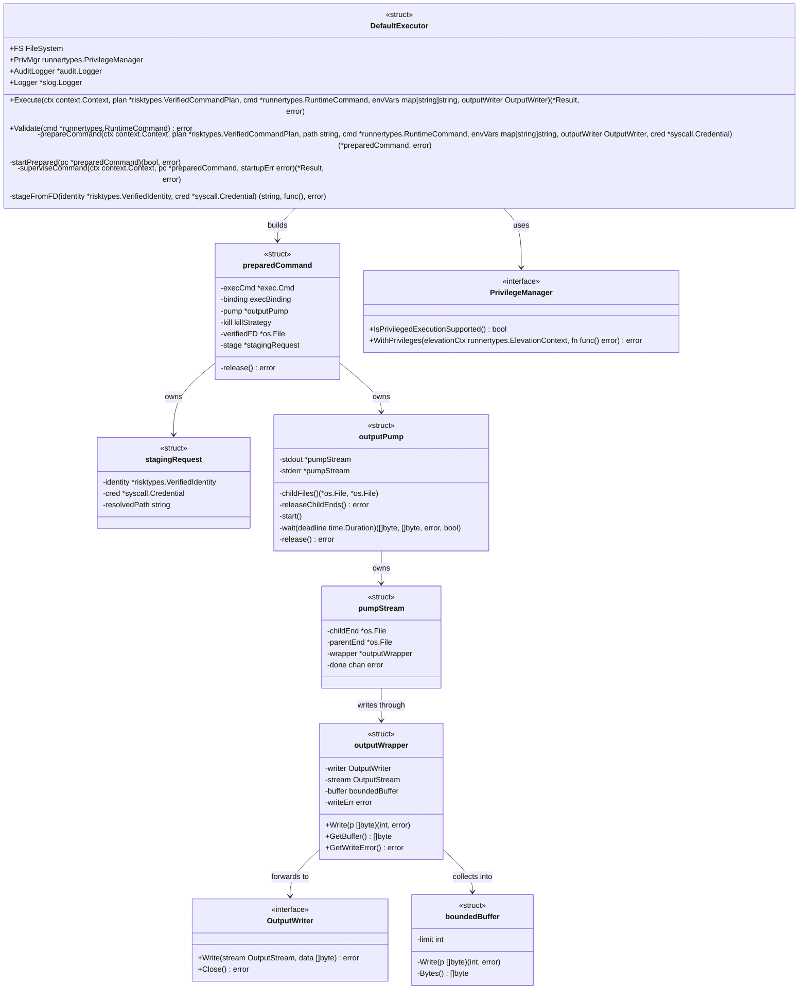

矢印 A → B はラベルの示す使用関係を表す。`DefaultExecutor` の公開フィールドと `Execute`／
`Validate`／`stageFromFD` のシグネチャ、`OutputWriter` のシグネチャ、`outputWrapper` のメソッドは現在の実装と
同じである。`outputWrapper` で変わるのは `buffer` の型（`bytes.Buffer` → `boundedBuffer`）と
構築関数の引数だけである（§3.2 要点1）。`PrivilegeManager` は
[`runnertypes.PrivilegeManager`](../../../internal/runner/base/runnertypes/config.go#L192) であり、
図では package 名を略している。`DefaultExecutor` の非公開フィールド
（`osExit`、`identityChecker`、`runAsResolver`、`fdExecDisabled`）と、
`newOutputPump` のような構築関数は表示を省いた。`prepareCommand`／`startPrepared`／
`superviseCommand`／`preparedCommand`／`stagingRequest`／`outputPump`／`pumpStream`／
`boundedBuffer` が本タスクで追加される。

### 3.6 コンポーネント責務表

| ファイル | 区分 | 責務 | 更新が要る既存テスト |
|---|---|---|---|
| `internal/runner/base/executor/command_lifecycle.go` | 新規 | `preparedCommand`、`stagingRequest`、`execBinding`、`killStrategy`、`prepareCommand`／`startPrepared`／`superviseCommand` | - |
| `internal/runner/base/executor/output_pump.go` | 新規 | `outputPump`、`pumpStream`、`boundedBuffer`、パイプの生成・解放・読み取り | - |
| `internal/runner/base/executor/executor.go` | 変更 | `executeWithUserGroup`／`executeNormal` を3フェーズ構成へ組み替え、`executeCommandWithPath` を廃止、`prepareExecCommand` を準備フェーズと起動フェーズへ分割、昇格時間の計測を隙ごとに分けて採り（§7.3）、kill 区間の記録方法を決め、`outputWrapper` の収集先を `boundedBuffer` へ替えて doc コメントを更新 | `executor_test.go`、`executor_fdexec_test.go`、`executor_privilege_check_test.go`、`executor_usergroup_test.go` |
| `internal/runner/base/executor/stagefromfd_test.go` | 変更 | 位置づけの更新（§3.4） | 同左 |
| `internal/runner/base/executor/privileged_test_condition_test.go` | 変更 | 既存の `canRunPrivilegedIntegrationTest` は変えず、実 UID が 0 でないことまで要求する別の述語 `canRunSetuidModelIntegrationTest` を追加する（§7.3） | `TestCanRunPrivilegedIntegrationTest`（既存の表はそのまま。新しい述語の表を足す） |
| `internal/runner/base/runnertypes/config.go` | 変更 | `Operation` に `OperationKillAfterCancel`／`OperationStagingCleanup` を追加（§3.3） | `config_test.go`（operation 一覧を検証している箇所があれば追随） |
| `internal/runner/base/privilege/unix.go` | 変更 | `prepareExecution` の `switch` に上記2つの operation を昇格が要る側として追加（追加しないと `ErrUnsupportedOperationType` で弾かれる）。あわせて `WithPrivileges` の doc コメントから出力コピー goroutine の記述を除き、残る未解決課題（`Start()` 中の露出、kill 区間・後始末区間、別プロセス化の是非）を明示（AC-20） | `unix_privilege_test.go`（`ErrUnsupportedOperationType` の表に2行追加） |
| `internal/runner/base/output/capture.go` | 変更 | `Capture` の doc コメントを更新。並行呼び出しの発生源が `os/exec` の per-writer goroutine から出力中継の読み取り goroutine へ替わる（`mutex` は必要なまま） | `internal/testutil/synccensus/census_guard_test.go` |
| `internal/redaction/error_collector.go` | 変更 | 同上の理由で doc コメントを更新（`mu` は必要なまま） | 同上 |
| `internal/logging/log_line_tracker.go` | 変更 | 同上の理由で doc コメントを更新（`atomic.Int64` は必要なまま） | 同上 |
| `internal/testutil/synccensus/census_guard_test.go` | 変更 | 上記3件の理由文字列を、発生源が出力中継であることに合わせて書き替える。出力中継が新しい同期プリミティブを宣言する場合は行の追加も要る（§3.2 のとおりチャネルで join するので、宣言しない設計を採る） | 同左 |
| `docs/dev/architecture_design/security-architecture.ja.md` | 変更 | 特権の隙の範囲と残存リスクの記述を更新（AC-19、§5.5） | - |
| `docs/dev/architecture_design/security-architecture.md` | 変更 | 上記の英語版。`/mktrans` で反映する | - |
| `docs/user/security-risk-assessment.ja.md` | 変更 | 利用者向けの残存リスク記述を同じ内容へ更新（AC-19、§5.5） | - |
| `docs/user/security-risk-assessment.md` | 変更 | 上記の英語版。`/mktrans` で反映する | - |
| `internal/runner/base/executor/executor_lifecycle_test.go` | 新規 | 準備・起動・監督の各フェーズの単体テスト（AC-01、AC-02、AC-06、AC-09〜AC-12、AC-14〜AC-17） | - |
| `internal/runner/base/executor/privileged_window_guard_test.go` | 新規 | 隙の内側で呼べる操作を静的に固定する go/ast 検査（AC-03、AC-04） | - |
| `internal/runner/base/executor/executor_privilege_gap_integration_test.go` | 新規 | 特権を要する統合テスト（AC-05、AC-07、AC-08、AC-13、AC-21） | - |
| `Makefile` | 変更 | executor の `integration` タグ付きテストを走らせるターゲットを追加し、`test-ci` 系へ組み込む（AC-22、§7.4） | - |
| `.pre-commit-config.yaml` | 変更 | 同ターゲットを呼ぶフックを追加（AC-22、§7.4） | - |

`internal/filevalidator` の `WithPrivileges` 利用（`OperationFileValidation`）は変更しない
（要件定義書のスコープ外）。

タスク 0170 の実装計画書は、`log_line_tracker.go` と `error_collector.go` に
`output copy goroutine` という文字列が残っていることを検証手段（AC-15）に使っている。本タスクの
doc コメント更新でこの文字列は消えるため、0170 の追跡表の当該行が古くなることを実装計画書に
記録し、置き換えとなる検証（出力中継の読み取り goroutine を指す記述の存在）を示す。

---

## 4. エラーハンドリング設計

### 4.1 エラー型

```go
// ErrOutputPipe is returned when the parent cannot create the stdout/stderr
// pipes the child writes into.
var ErrOutputPipe = errors.New("failed to create output pipe")

// ErrExecBindingUnset and ErrKillStrategyUnset are returned when a
// preparedCommand reaches the start or kill path without having declared how
// the inode is bound, or what a kill requires. Both are unreachable while
// prepareCommand is the only constructor; they exist because the switches they
// guard sit on a privilege boundary, where failing closed on an impossible
// input is cheaper than reasoning about whether it stays impossible.
var (
    ErrExecBindingUnset  = errors.New("execution binding not declared")
    ErrKillStrategyUnset = errors.New("kill strategy not declared")
)

// ErrKillAfterCancel is returned when the child could not be killed after the
// context was cancelled, so the run may leave a process behind.
var ErrKillAfterCancel = errors.New("failed to kill command after cancellation")

// ErrChildNotReaped is returned when the child did not exit within
// killGraceDelay after the kill, which usually means a grandchild inherited
// the pipe. The run returns rather than blocking; the pid is logged.
var ErrChildNotReaped = errors.New("command did not exit after kill")
```

既存の `ErrNoVerifiedFD`、`ErrFdExecUnsupported`、`ErrPrivilegeLeak` などは変更しない。

### 4.2 エラーの優先順位

1つの実行で複数のエラーが同時に成立しうる。報告する順序を次のとおり固定する。

| 順位 | エラー | 根拠 |
|---|---|---|
| 1 | 出力中継の書き込みエラー（例: 出力サイズ上限超過）。stdout 側を stderr 側より優先する | 現在の実装が `Run()` の戻り値より書き込みエラーを優先し、stdout を先に調べている（`executor.go:350-354`）。上限超過が `SIGPIPE` による「broken pipe」に隠れるのを防ぐ（AC-14） |
| 2 | キャンセルによって kill した場合の、`ctx.Err()` と `Wait()` のエラーを両方たどれるエラー | §4.3 のとおり `os/exec` と意図して異なる。理由は下記 |
| 3 | `Wait()` が返したエラー（`*exec.ExitError` など） | キャンセル以外で終わった場合はこれがそのまま返る |

**順位2を `os/exec` と変える理由。** `os/exec` の `Wait` は、`Process.Wait` が返したエラーを
context 由来のエラーより優先する。`SIGKILL` された子は必ず異常終了になるため、タイムアウトで
殺した場合に返るのは常に `*exec.ExitError`（`signal: killed`）であり、`context.DeadlineExceeded` は
捨てられる。その結果、
[`group_executor.go:584`](../../../internal/runner/group_executor.go#L584) の
`errors.Is(err, context.DeadlineExceeded)` は成立せず、`LogTimeoutExceeded` は事実上呼ばれない。
これはタイムアウトで死んだのか外部から殺されたのかを運用者が区別できない状態であり、
AC-07（タイムアウトとして報告される）を満たさない。そこで本設計は、キャンセルを検出して自ら
kill した場合に限り、`ctx.Err()` と `Wait()` のエラーの両方を `errors.Is` でたどれる形にして返す。
呼び出し側の分岐（`LogTimeoutExceeded`）は変えずに、意図どおり働くようになる。

**`ErrKillAfterCancel`／`ErrChildNotReaped` は順位付けの外に置く。** どちらかが成立した場合は、
上の順位で選ばれたエラーへ `errors.Join` で**必ず併せて**返す。順位の一員として下位に置くと、
最も重い組み合わせ（出力上限の超過 → 打ち切りのための kill → その kill が失敗、または子を回収
できない）で報告されるのが「出力サイズ上限の超過」だけになり、別の UID で走ったままのプロセスが
残っている事実が消える。子プロセスを止められないことを隠さないという §3.3 の方針は、順位ではなく
併記でしか守れない。どちらも PID を添える。`errors.Is` で個別にたどれるので、呼び出し側の既存の
分岐は影響を受けない。

### 4.3 `exec.CommandContext` と `Cmd.Output()` から引き継ぐ意味論

自前の待機と自前のパイプへ置き換えることで失われうる性質を、対応表として残す
（非機能要件「可読性」）。

| 現在の性質 | 由来 | 本設計での扱い |
|---|---|---|
| すでにキャンセルされた context で `Start()` を呼ぶと `ctx.Err()` を返し、プロセスを起こさない | `CommandContext` | 準備フェーズの最後、起動区間を開く前に `ctx.Err()` を検査して同じエラーを返す。隙を開かないので特権も記述子も残さない（AC-12）。検査と `Start()` の間にキャンセルされた場合に子が起きるのは現在と同じであり、その場合は監督フェーズの `select` が拾って kill する |
| context のキャンセル時に `Process.Kill()` を呼ぶ | `CommandContext` | 実行 goroutine の `select` が検出して kill する（§3.3）。`run_as` 実行では kill 区間を開く |
| `Cancel` が `os.ErrProcessDone` を返した場合はエラーとしない | `CommandContext` | 同じ扱いにする（§3.3） |
| `Wait()` のエラーを context のエラーより優先する | `CommandContext` | **意図して変える。** キャンセル由来の kill では両方をたどれるエラーを返す（§4.2 順位2） |
| `WaitDelay` が 0 なので、`Wait()` は出力の複製が終わるまで待つ | `CommandContext` | 出力中継の `wait` が両方の読み取り goroutine の終了を待ってから結果を組み立てる。ただし kill の後は `killGraceDelay` を上限とする。上限を設けない `os/exec` の既定は、パイプを持ったまま離れた孫プロセスがいるとタイムアウトの保証そのものを失わせるため、ここは意図して変える |
| 複製エラーは、プロセスが正常終了したときだけ報告される | `CommandContext` | §4.2 は書き込みエラーを最優先にする。これは現在の executor が `os/exec` の既定を上書きしている挙動を引き継いだものであり、変更ではない |
| `OutputWriter` が `nil` のとき、標準エラー出力は異常終了時だけ `Result.Stderr` に載る | `Cmd.Output()` | 同じにする。正常終了時に標準エラー出力を載せると、`group_executor` の debug ログと Slack 通知へ新たに流れ込むため |
| `OutputWriter` が `nil` のとき、標準エラー出力は先頭 32 KiB と末尾 32 KiB を残し、中間を `\n... omitting N bytes ...\n` に置き換える（保持量は最大およそ 64 KiB） | `Cmd.Output()`（内部型 `prefixSuffixSaver{N: 32 << 10}`） | 同じにする。同じ規則の `boundedBuffer` を置く（§3.2 要点6）。末尾を落とす案は採らない。失敗したコマンドの診断に要るのは末尾であり、先頭は起動時の定型出力であることが多い |
| `OutputWriter` が `nil` のとき、標準エラー出力が上限に達しても子プロセスは走り続け、`os/exec` は最後まで読み捨てる | `Cmd.Output()` | 同じにする。`boundedBuffer` は上限に達してもエラーを返さず、読み取り側も閉じない。ここでエラーを返すと読み取り側が閉じて子が `SIGPIPE` を受け、上限を超える標準エラー出力を書いてから成功するコマンドが失敗するようになる（AC-16 に反する） |
| `OutputWriter` が `nil` のとき、標準出力に上限は無い | `Cmd.Output()` | 同じにする（`bytes.Buffer` のまま） |

---

## 5. セキュリティ考慮事項

### 5.1 脅威モデル

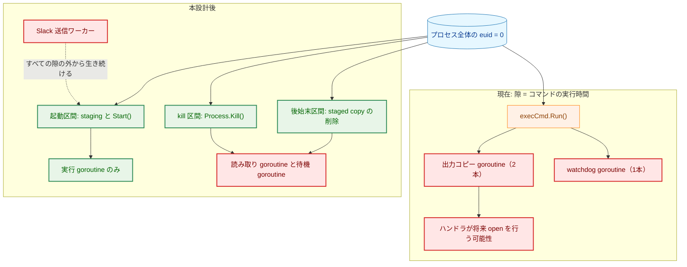

実線の矢印 A → B は「A の下で B が起きる」を、破線の矢印は「隙の外に生き続ける発生源」を表す。
赤い節点は、その隙の中で保護されない goroutine である。

**Legend**

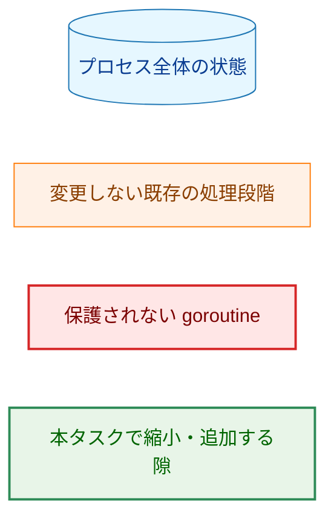

### 5.2 3つの区間の性質

| 区間 | 開く条件 | 中で行うこと | 長さ | 中で走る非参加 goroutine |
|---|---|---|---|---|
| 起動区間 | 毎回（run-as 実行） | fd-bound 実行では `Start()` だけ。staging フォールバックでは複製の作成・`chmod`・`chgrp` も | `fork`／`execve` の時間（staging では複製の時間が加わる） | Slack 送信ワーカーのみ |
| kill 区間 | キャンセルが起きたときだけ | `Process.Kill()` だけ | システムコール1回 | 読み取り goroutine2本、待機 goroutine、Slack 送信ワーカー |
| 後始末区間 | run-as 実行かつ staging フォールバックのときだけ（通常実行では隙を開かずに削除できる。§3.4 差分2） | staged copy の削除（`os.RemoveAll`） | ディレクトリ1つの削除 | 読み取り goroutine（終了済みの場合が多い）、Slack 送信ワーカー |

現在と比べたときの変化は次のとおりである。

| 項目 | 現在 | 本設計後 |
|---|---|---|
| 実効 UID 0 の継続時間（run-as 実行） | コマンドの実行時間そのもの | 上表のとおり。いずれもコマンドの実行時間に依存しない |
| 隙の中を走る非参加 goroutine | 出力コピー2本、watchdog 1本、Slack 送信ワーカー（コマンドの実行時間ずっと） | 起動区間では Slack 送信ワーカーのみ。kill 区間と後始末区間は §5.3 |
| 隙の中で行うファイル操作 | 環境変数の組み立て、`os.DevNull` の open、記述子の複製、staging 一式、出力の書き込み | fd-bound 実行では無し。staging フォールバックでは staging 一式と、その削除 |
| 特権操作を行う goroutine | 実行 goroutine と watchdog goroutine（kill 経路を追加した場合） | 実行 goroutine のみ |

### 5.3 kill 区間と後始末区間に残る露出（残存リスク）

kill 区間と後始末区間が開くとき、出力中継の読み取り goroutine と待機 goroutine は生きている。
これらは本タスクが起動区間から追い出した種類の goroutine そのものである。本設計はこれを
受け入れる残存リスクとして扱う。理由と限界を示す。

- どちらの隙も、開くのは例外的な場合（キャンセル、staging フォールバック）に限られる。
  通常の実行では開かない。
- 中で行うのはシステムコール1回（`kill(2)`）と、自分が作ったディレクトリ1つの削除だけである。
- 読み取り goroutine が行うのは、既に開いた記述子への読み書きと、上限超過時の slog 呼び出しで
  ある。パスを開かず exec もしない。これは Slack 送信ワーカーについて本プロジェクトが既に
  置いている論拠と同じであり、**実装がそうであるという事実であって不変条件ではない**。
- 待機 goroutine が行うのは `wait4(2)` と終了状態の組み立てだけである。

これを無くすには、隙を開く前に読み取り goroutine を止めて隙が閉じてから再開する仕組みが要る。
読み取りを止めている間の出力の扱い（捨てるか、後から吸い出すか）を決める必要があり、
本タスクの範囲を超える。§9 に将来の課題として記す。

### 5.4 staging を伴う起動区間の長さと `$TMPDIR`（残存リスク）

`stageFromFD` は `os.MkdirTemp("", ...)` を使う。行き先は `os.TempDir()`、すなわち起動者が渡す
`$TMPDIR` である。起動者は本プロジェクトの脅威モデルの攻撃者であるため、複製先のファイルシステムを
攻撃者が選べる。応答の遅いファイルシステムを指せば、起動区間の長さ（`io.Copy` の所要時間）を任意に
延ばせる。

これは本タスクが作る問題ではなく、現在の実装が既に持つ性質である。ただし本設計は「起動区間の長さが
コマンドの実行時間に依存しない」ことを主張する文書であるため、**長さの上限が攻撃者の影響下に
あることを明記する**。staging の行き先を信頼できるディレクトリへ固定する、あるいは複製に上限を
設ける対処は、本タスクの範囲外とする（fd-bound 実行が使える環境では staging 自体が走らない）。

### 5.5 文書の更新（AC-19）

同じ残存リスクの記述が4つの文書にある。日本語版を先に更新し、英語版は `/mktrans` で反映する
（CLAUDE.md の翻訳方針）。

| 文書 | 箇所 | 更新後 |
|---|---|---|
| `docs/dev/architecture_design/security-architecture.ja.md` | 行 1196（Residual Risks 1件目） | コマンド実行の経路が起こす非参加 goroutine は起動区間から無くなったこと、隙は staging と `fork`／`execve` に縮まったこと、残るのは Slack 送信ワーカー・`Start()` 中の露出・kill 区間と後始末区間であることへ置き換える |
| 同上 | 行 1197（Residual Risks 2件目） | 再入ガードが同期を伴わず単一 goroutine を前提とする点は維持する。本設計は前提を強めこそすれ変えない |
| `docs/dev/architecture_design/security-architecture.md` | 行 1201-1202 | 上記の英語版 |
| `docs/user/security-risk-assessment.ja.md` | 行 99-100（残存リスク） | 利用者向けの言い回しで同じ内容へ置き換える |
| `docs/user/security-risk-assessment.md` | 行 99-100 | 上記の英語版 |

`security-architecture.ja.md` の `WithPrivileges` の説明（3段階の構成）は変更しない。
隙の中で何が起きるかは executor 側の記述だからである。

### 5.6 外から見える挙動のうち、意図して変える点

原則3のとおり、変えるのは次の1点だけである。実装計画書でテストと結び付ける。

| 変える点 | 現在 | 本設計後 | 理由 |
|---|---|---|---|
| タイムアウト・キャンセルで殺したときのエラー | `*exec.ExitError`（`signal: killed`）のみ。`context.DeadlineExceeded` はたどれない | 両方を `errors.Is` でたどれる | AC-07。運用者と `LogTimeoutExceeded` が理由を区別できるようにするため（§4.2） |

`OutputWriter` が `nil` のときの標準エラー出力の切り詰め方も、当初は「中間ではなく末尾を落とす」
案を採っていた。`os/exec` の内部型 `prefixSuffixSaver` を再実装しないためだったが、この案は
失敗したコマンドの診断に要る末尾を捨てる。同じ規則を持つ `boundedBuffer` を置くほうが安く、
外から見える挙動も変わらないため、変更点から外した（§3.2 要点6、§4.3）。

### 5.7 dry-run の副作用契約（AC-18）

dry-run は
[`dryrun_manager.go`](../../../internal/runner/resource/dryrun_manager.go) が担い、
`DefaultExecutor.Execute` へ到達しない。したがって dry-run では次のすべてが行われない。

| 副作用 | dry-run |
|---|---|
| `fork`／`execve`（子プロセスの起動） | 行わない |
| 特権の隙を開く（`seteuid(0)`） | 行わない |
| パイプの生成、`os.DevNull` の open | 行わない |
| staging フォールバックによるファイル複製と削除 | 行わない |
| `OutputWriter` への書き込み、出力ファイルの作成 | 行わない |
| kill、シグナル送信 | 行わない |

本設計はこの境界を動かさない。dry-run の出力内容も変わらない。

---

## 6. 処理フロー詳細

### 6.1 タイムアウトとキャンセル

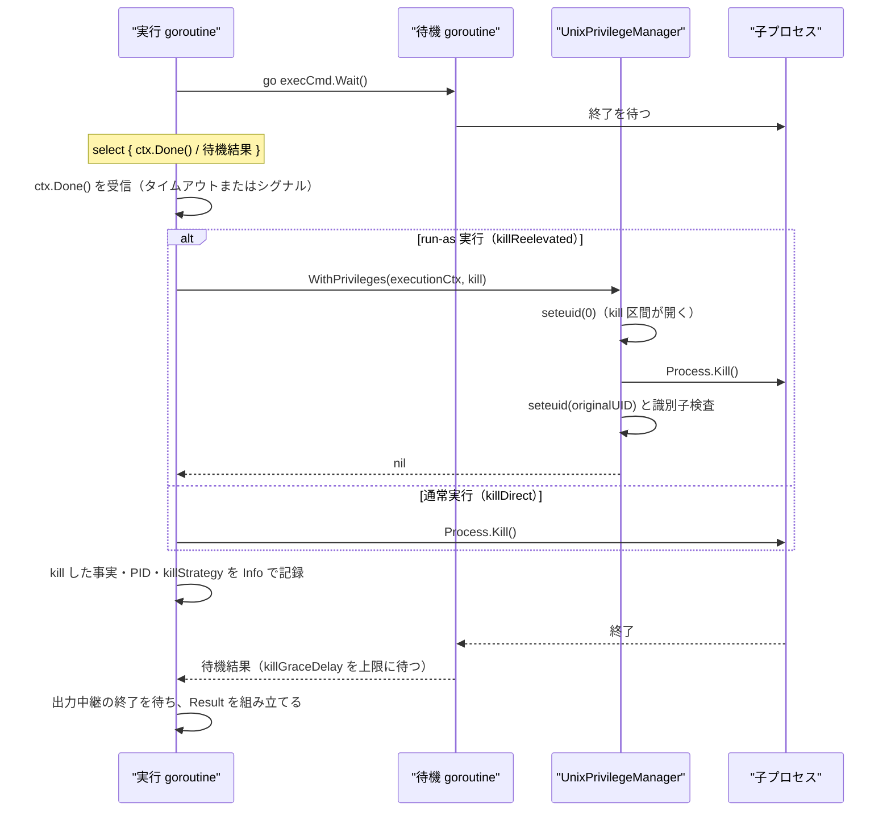

矢印 A ->> B は「A が B を呼ぶ」、B -->> A は「B が A へ戻る」を表す。

例外の扱いは次のとおりである。

| 状況 | 扱い |
|---|---|
| `select` の直前に子が終わっていた（`Kill` が `os.ErrProcessDone`） | エラーとせず、そのまま待機結果を読む |
| kill の `WithPrivileges` が失敗した | `ErrKillAfterCancel` に PID を添えて返す。待機は `killGraceDelay` で打ち切る |
| `killGraceDelay` の間に子が終わらない（孫プロセスがパイプを保持しているなど） | 出力中継の読み取り側を閉じ、`ErrChildNotReaped` に PID を添えて返す。`Error` で記録する。`Result.ExitCode` は `ExitCodeUnknown` とし、以後 `execCmd` に触れない（§3.3）。**staged copy はこの経路でも削除する**（下記） |
| 起動区間が閉じた後に書き込み側の解放が失敗した | 子は既に走っている。`ctx.Done()` を待たずに kill 経路へ入り、回収と後始末を行ったうえで、そのエラーを結果へ添える（§3.1） |
| 隙の中で復帰に失敗した | 既存の `emergencyShutdown` が即座にプロセスを終える。子プロセスと、staging フォールバックのときは staged copy が残る。その旨を doc コメントに記す |

**回収できなかったときの staged copy。** `ErrChildNotReaped` の経路では子プロセスが生きたままだが、
staged copy の削除は行う。削除を子の終了後まで遅らせているのは、`#!` スクリプトのインタプリタが
`execve` の後にパスを開くためであり（§3.4 差分2）、`killGraceDelay` を過ぎた時点でその open は
とうに済んでいる。`unlink(2)` は実行中のプロセスが握る inode を無効にしないので、生き残った子への
影響も無い。削除しないと、root 所有・`0500` の検証済みバイナリの複製が `$TMPDIR` に残り、しかも
その参照を持っていた唯一のプロセスは終了する。`emergencyShutdown` の経路だけは、プロセスが即座に
終わるため削除できない。

### 6.2 出力サイズ上限の超過

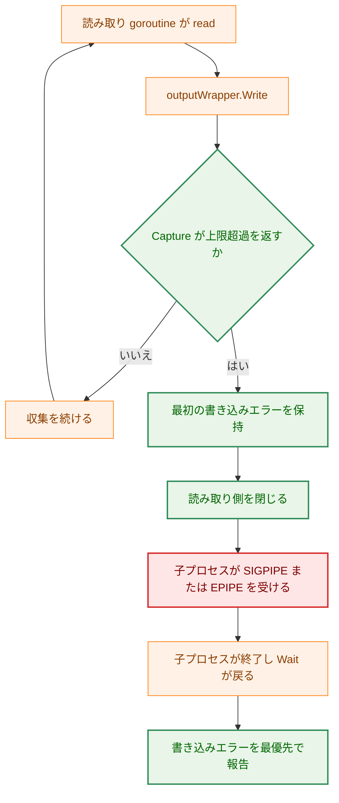

矢印 A → B は「A の次に B が起きる」を表す。分岐の矢印のラベルは判定の結果を示す。

上限超過を検出するのは `Capture.WriteOutput` であり、判定の場所も文言も現在と同じである
（要件定義書のスコープ外）。変わるのは、読み取り側を閉じるのが `os/exec` の複製 goroutine から
出力中継の読み取り goroutine へ替わる点だけである。コマンドの終了を待たずに検出することも、
子プロセスがパイプの破断で終わることも変わらない（AC-13）。報告するエラーは §4.2 の順位1により
上限超過のままである（AC-14）。`SIGPIPE` を無視する子プロセスは今と同じく走り続け、
タイムアウトに達するまで終わらない。

**Legend**

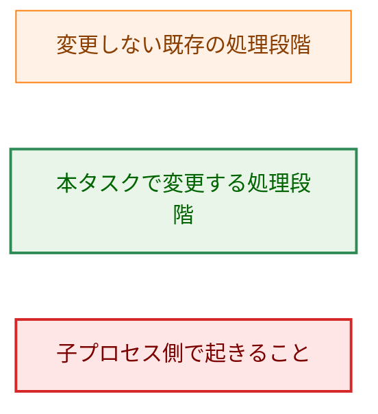

### 6.3 資源の解放

| 資源 | 所有者 | 解放する場所 |
|---|---|---|
| パイプの書き込み側（親側の複製） | `outputPump` | 起動区間が閉じた直後（隙の外）。`Start()` の成功・失敗の別を問わず必ず通る（§3.1、§3.2 要点3） |
| パイプの読み取り側 | `outputPump` | 読み取り goroutine の終了時。`start` へ到達しなかった経路では `preparedCommand.release()` |
| 複製した検証済み記述子（`ExtraFiles`） | `preparedCommand` | 起動区間が閉じた直後（隙の外）。`Start()` が `ExtraFiles` を子へ複製し終えているので、`Wait()` を待つ必要は無い |
| `os.DevNull` | `preparedCommand` | 監督フェーズの最後、または `release()` |
| staged copy とその親ディレクトリ | `preparedCommand` | 子プロセスの終了後、または回収を諦めた後（後始末区間の中。通常実行では隙なし）。`Start()` が失敗した場合は起動区間の中 |

書き込み側と検証済み記述子を隙の外で閉じるのは、隙の中身を AC-04 の一覧に留めるためである
（§3.4、§7.2）。どちらも隙の中に置く必然性は無い。前者は読み取りがまだ始まっていないため、
後者は `Start()` が既に子へ複製し終えているためである。

| 失敗経路 | 解放されるもの |
|---|---|
| 準備フェーズの失敗 | それまでに作った記述子すべて。呼び出し元へは `preparedCommand` を返さない |
| すでにキャンセルされた context | 準備フェーズで作ったすべて（起動区間を開く前に `release()`） |
| `Start()` の失敗 | パイプの書き込み側と読み取り側、複製した記述子、staged copy |
| `Start()` は成功したが書き込み側の解放が失敗 | kill・回収・後始末を通した後、上表のとおり |
| `Wait()` が返った後 | 上表のとおり |

いずれの経路でも実効 UID を上げたまま戻ることはない。隙の開閉は `WithPrivileges` の
`defer` に閉じており、本設計はその内側に §5.2 の操作しか置かないためである（AC-12）。

---

## 7. テスト戦略

### 7.1 単体テスト

| 対象 | 確かめること |
|---|---|
| 準備フェーズ | `exec.Cmd` の `Stdout`／`Stderr` が `*os.File` であること。`OutputWriter` が `nil` の場合も同じであること（AC-01） |
| 起動フェーズ | `WithPrivileges` に渡す関数が戻るまでの間、executor が起こした goroutine が存在しないこと（AC-02）。昇格と復帰の対が1組であること（AC-06） |
| 監督フェーズ | キャンセル済み context での起動、終了後のキャンセル、`Start()` 失敗のそれぞれで記述子が残らないこと（AC-12） |
| kill 経路 | `run_as` 実行では再昇格を1組だけ行い、通常実行では行わないこと（AC-09、AC-10）。再入ガードが発火しないこと（AC-11）。kill の失敗と `killGraceDelay` 超過で戻ること（§6.1） |
| 出力中継 | stdout と stderr が区別されて `OutputWriter` へ渡ること、書き込みエラーが stdout 優先・最優先で報告されること（AC-14、AC-15） |
| 互換性 | 終了コード・標準出力・標準エラー出力・エラー種別が現在と一致すること。`OutputWriter` が `nil` の経路で、正常終了時に標準エラー出力が載らないこと、64 KiB を超える標準エラー出力で先頭 32 KiB と末尾 32 KiB が残り中間が省略表示に替わること、そしてそのコマンドが**成功したままである**こと（AC-16、§4.3） |
| kill・回収の失敗 | `ErrKillAfterCancel`／`ErrChildNotReaped` が、出力上限の超過と同時に起きたときも `errors.Is` でたどれること（§4.2）。`ErrChildNotReaped` の経路で `Result.ExitCode` が `ExitCodeUnknown` であること（§3.3） |
| 起動後の解放失敗 | 書き込み側の解放が失敗したとき、子プロセスが kill され回収されること（プロセスが残らないこと）と、そのエラーが結果に現れること（§3.1） |
| 経路の網羅 | `fdExecDisabled` の切り替えで fd-bound と staging フォールバックの双方を通ること。シェバンつきスクリプトが staging フォールバックでも実行できること（AC-17、§3.4） |

goroutine の不在（AC-02）は、テスト用の `PrivilegeManager` 実装が `fn` の内側で
`runtime.Stack(all=true)` を採って検査する。特権を要さないので通常のユニットテストとして走る。

このとき、フィルタを「executor パッケージのフレームを持つ goroutine」にしてはならない。本タスクが
追い出す `os/exec` の出力コピー goroutine は `io.Copy` の中で止まっており、フレームは `os/exec`・
`io`・`internal/poll` にしか無い。executor のフレームで絞ると、`Stdout`／`Stderr` を `*os.File` へ
替える変更を revert してもテストが緑のままになり、テストが主張する理由で落ちなくなる（§7.6）。
そこで **goroutine の集合全体**を基準に採り、`fn` の外側で採った基準集合との差分が空であることを
確かめる。基準集合の採取は隙を開く直前に行い、テストランナーやログ機構が持つ goroutine の
出入りは、スタックの先頭フレームで同定して除外する。
kill 区間については、§5.3 のとおり読み取り goroutine が生きていることが設計上の前提なので、
同じ検査を「起動区間では0本、kill 区間では読み取り goroutine と待機 goroutine のみ」という
期待値で行い、想定外の goroutine が増えたら落ちるようにする。

### 7.2 静的検査（AC-03、AC-04）

隙の中で行う操作は、リストと実装が離れると意味を失う。そこで、本リポジトリに既にある
go/ast による guard test（[`identity_mutation_guard_test.go`](../../../internal/runner/base/privilege/identity_mutation_guard_test.go)）
と同じ方式で、`WithPrivileges` へ渡す関数から到達する呼び出しを許可リストと突き合わせる検査を
置く。検査は3つの区間それぞれについて行い、許可するものを次のとおり定める。

| 区間 | 許可する呼び出し |
|---|---|
| 起動区間 | `execCmd.Start`、`stageFromFD`、および `stageFromFD` の内側で必要な `os.MkdirTemp`／`syscall.Dup`／`os.NewFile`／`os.OpenFile`／`io.Copy`／`os.Chmod`／`os.Chown`／`os.RemoveAll`／`(*os.File).Stat`／`(*os.File).Close`／`syscall.Close` |
| kill 区間 | `(*os.Process).Kill` のみ |
| 後始末区間 | `os.RemoveAll` のみ |

`stageFromFD` の内側にファイルを開く呼び出しが並ぶのは、§3.4 の差分1をそのまま反映したもので
ある。`syscall.Close` を許すのは、`stageFromFD` が `syscall.Dup` で複製した生の記述子を、
`os.NewFile` が `nil` を返して `*os.File` に包めなかったときに閉じるためだけである。許可リストに
無い呼び出しが増えれば、実行せずにビルドが赤くなる。

このリストが AC-04 の一覧と一致するのは偶然ではない。記述子を閉じる処理（出力中継の書き込み側、
複製した検証済み記述子）は、当初は隙の内側に置く設計だったが、`(*os.File).Close` を起動区間で
無条件に許すことになり、許可リストが「隙の中では任意の記述子を閉じてよい」という意味に薄まる。
どちらも隙の外へ出せる処理だったので出した（§6.3）。`bindingStagedCopy` で起動区間が行う
`execCmd.Path` への代入は呼び出しではなくフィールドへの代入なので、この検査の対象外である。
検査は「代入以外の呼び出しがリストに収まること」を見る。

ログ出力は隙の外で行う。`stageFromFD` が失敗時に呼ぶ `Logger.Warn` は隙の内側に残るため、
許可リストの注記として扱い、それ以外の場所からのログ出力は許可しない。§3.3 の「kill を記録する」
処理も隙の外に置く。

### 7.3 統合テスト（AC-21）

setuid モデルの実挙動はユニットテストでは再現できないため、`integration` タグ付きのテストを置く。
ファイルには `//go:build integration` を付ける（既存の
[`executor_usergroup_integration_test.go`](../../../internal/runner/base/executor/executor_usergroup_integration_test.go)
と同じ）。ただし executor の `testutil` 補助パッケージは `test` タグを要するため、実行は
`-tags "test integration"` で行う。ファイルは `package executor_test` に置き、
`canRunPrivilegedIntegrationTest` を再利用する（同関数のあるファイルはビルドタグを持たない
外部テストパッケージである）。

**スキップ判定。** 現在の `canRunPrivilegedIntegrationTest` は実効 UID が 0 であることしか
見ない。`sudo go test` では実 UID も 0 になり、`escalatePrivileges` は短絡して `seteuid` を行わず、
親は子を無条件に kill できる。すなわち本タスクが解く EPERM は起きず、AC-07／AC-09／AC-10 は
何も検証しないまま緑になる。したがって本タスクの統合テストには **実 UID が 0 でないこと** も要る。

ただしこの条件を `canRunPrivilegedIntegrationTest` そのものへ足してはならない。同関数は既存の
[`executor_usergroup_integration_test.go`](../../../internal/runner/base/executor/executor_usergroup_integration_test.go)
が使っており、そのテストは `sudo`（実 UID = 0）で走らせる前提である。共有の述語を強めると、
現在走っている補助グループのテストが、走っていたすべての環境でスキップに変わる。既存の検査を
消さずに条件を足すため、**別の述語 `canRunSetuidModelIntegrationTest` を追加**し、本タスクの
テストだけがそれを使う（§3.6）。

実行には、root 所有の setuid ビットを立てたテストバイナリ、または実 UID を非 root に落としてから
走らせる仕組みが要る。その手順は実装計画書に記す。この仕組みが無い環境では AC-05／AC-07／AC-08／
AC-13 はスキップされ、§7.4 の pre-commit フックはビルドが通ることしか主張しない。フックの
説明にはこの限界を書き、setuid テストバイナリの用意をフックの前提として実装計画書に記す。

| 検査 | 内容 |
|---|---|
| AC-05 | 実行時間の異なる2つのコマンド（例: 1秒と5秒の休止）で昇格時間を比べ、その差がコマンドの実行時間差ではなく起動の時間に収まることを確かめる。閾値は「差が実行時間差の 1% 未満」のように絶対値で定め、実装計画書に記す |
| AC-07 | `run_as_user` 付きの長時間コマンドがタイムアウトで停止し、返るエラーから `context.DeadlineExceeded` をたどれること（§4.2 順位2）と、`LogTimeoutExceeded` が呼ばれること |
| AC-08 | 同じ条件で context のキャンセル（SIGINT／SIGTERM 相当）により停止すること |
| AC-13 | 上限を超え続ける出力を出すコマンドが、終了を待たずに打ち切られること |

**昇格時間の観測方法。** `PrivilegeMetrics` は `executeWithUserGroup` のローカル変数であり、
`AuditLogger.LogUserGroupExecution` からしか外へ出ない。統合テストは監査ログを捕まえて
`elevation_count` と経過時間を読む。

計測の範囲は、**3つの隙すべてを operation 付きで数え、時間は隙ごとに分けて記録する**。計測を
起動区間だけに狭めると、`elevation_count` は構造上つねに 1 になり、AC-06（昇格と復帰の対は1組）を
主張するテストが、kill 区間や後始末区間が余分に開いても落ちなくなる。CLAUDE.md の「テストは主張する
理由で落ちられなければならない」に反するので、数えるのは全部にする。AC-05（隙の長さがコマンドの
実行時間に依存しない）が比べるのは、そのうち起動区間の時間だけである。隙を operation で区別
できるようにするのが §3.3 の `OperationKillAfterCancel`／`OperationStagingCleanup` である。

なお現在の計測は `WithPrivileges` 全体を囲んでおり、そのままではコマンドの実行時間を含み続ける
（§3.6 の `executor.go` の行）。

### 7.4 実行経路の整備（AC-22）

現状の確認から始める。`.pre-commit-config.yaml` の `go-test` フックは
`go test -tags test -v ./...` を直接実行しており、`make` を経由しない。したがって `Makefile` の
`test` ターゲット（現在は `test: unit-test` のみ）に依存を足しても pre-commit では走らない。
また `-tags test` だけでは `//go:build integration` のファイルはビルドされない。必要な編集は次の
2つである。

1. `Makefile` に `executor-privileged-integration-test` ターゲットを追加する。中身は
   `go test -tags "test integration" ./internal/runner/base/executor/` であり、
   既存の `elfanalyzer-integration-test`／`libccache-integration-test` と同じ形にする。
   `test-ci` および `test-ci-cgo1` の依存に加える。
2. `.pre-commit-config.yaml` に、このターゲットを呼ぶフック（`language: system`、
   `pass_filenames: false`）を追加する。

条件が揃わない環境ではテストがスキップするため、非特権の開発環境でも pre-commit は緑のままで
ある。対象利用者は環境変数 `TEST_RUNAS_TARGET_USER` で与える（現在どの `Makefile` ターゲットにも
渡されていないので、新しいターゲットの中で受け渡しと既定値の扱いを決め、実装計画書に記す）。

### 7.5 性能の確認（非機能要件）

非機能要件は「パイプの読み取りを自前で行う変更が、コマンド1回あたりの実時間に測れるほどの差を
生まないこと」だけを求めている。短いコマンド（`/bin/true` 相当）を一定回数繰り返し、変更前後の
実時間の中央値を絶対値で比べる。判断の基準は `fork`／`exec` に要する数十マイクロ秒との比較で
あり、相対的な増減では判断しない（CLAUDE.md の性能方針）。測定結果は実装計画書に記す。

### 7.6 テストが主張する理由で失敗できること

各テストは、対象の仕組みを外したときに落ちることを確認してから確定する。

| テスト | 外すもの |
|---|---|
| AC-01 | `Stdout`／`Stderr` への代入を `outputWrapper` に戻す |
| AC-02 | 読み取り goroutine の起動を起動区間の内側へ移す |
| AC-06、AC-09 | kill の `WithPrivileges` 包みを外す／二重にする |
| AC-07 | キャンセル由来のエラー合成を外し、`*exec.ExitError` だけを返す |
| AC-12 | `release()` の呼び出しを1経路だけ落とす |
| AC-13、AC-14 | 書き込みエラー時の読み取り側の close を落とす |
| AC-16（`errors.Join`） | `ErrKillAfterCancel`／`ErrChildNotReaped` の併記をやめ、§4.2 の順位の下位へ戻す |
| AC-16（stderr の上限） | `boundedBuffer` を上限到達でエラーを返す実装に替える（成功したはずのコマンドが失敗する） |
| AC-17 | staged copy を `Start()` の直後に削除する（シェバンのテストが落ちる） |
| §3.1 の起動後解放 | `startPrepared` の `started` を無視して、解放の失敗を起動の失敗として返す（子プロセスが残る） |
| §3.2 要点7 | `wait` の deadline 経路で、終わっていない側のバッファも読む（`-race` で落ちる） |

---

## 8. 実装優先順位

| Phase | 内容 | 完了の目安 |
|---|---|---|
| 1 | 出力中継と `boundedBuffer` の追加、`Stdout`／`Stderr` を `*os.File` へ切り替え（F-001） | 既存テストが緑。AC-01、AC-15、AC-16 のテストが通る |
| 2 | 準備・起動・監督の3フェーズへの分解（`WithPrivileges` の範囲はまだ変えない） | 外から見える挙動が変わらないこと |
| 3 | `exec.CommandContext` の置き換えとキャンセル・kill の実装（F-003）。`OperationKillAfterCancel` の追加を含む | AC-07、AC-10〜AC-12 のテストが通る。通常実行のタイムアウトが働く |
| 4 | `WithPrivileges` の範囲を `startPrepared` へ縮小、staging の位置づけ変更（F-002、§3.4）。`OperationStagingCleanup` の追加を含む | AC-02、AC-04、AC-06 のテストと静的検査が通る |
| 5 | 統合テストと実行経路の整備（F-007） | 特権のある環境で AC-05、AC-07、AC-08、AC-13 が通る |
| 6 | 文書と doc コメントの更新（F-006） | AC-19、AC-20 |

Phase 1 と Phase 3 は独立しており、どちらを先に入れても外から見える挙動は（§5.6 の2点を除いて）
変わらない。Phase 4 は Phase 1 と Phase 3 の両方が入ってから行う。順序を守ることで、隙を縮めた後に
goroutine や watchdog が残っている状態を作らない。

**戻し方。** 実行時に旧経路へ切り替える仕組みは設けない（設定項目を増やさないため）。問題が出た
ときは Phase 単位で revert する。Phase 1・3・4 はそれぞれ独立したコミットに分け、Phase 4 だけを
戻せば特権の隙の範囲は現在の姿に戻り、Phase 1 だけを戻せば出力の経路が `os/exec` に戻る。

---

## 9. 将来の拡張性

- **kill 区間と後始末区間から goroutine を追い出す。** §5.3 の残存リスクを消すには、隙を開く前に
  出力中継を止め、閉じてから再開する仕組みが要る。止めている間の出力の扱いを決める必要があり、
  本タスクでは扱わない。着手するなら、出力中継が読み取りを一時停止する契約を先に決めるのが自然で
  ある。
- **Slack 送信ワーカーを隙の外へ出すとき。** 本設計はコマンド実行の側の非参加 goroutine を
  起動区間から無くす。残る発生源はログ機構だけになるので、通知経路の設計を単独で検討できる。
- **特権操作を別プロセスへ切り出すかどうか。** 0170 設計文書 §10.2 の判断は未決のままである。
  本設計は隙を `fork`／`execve` へ縮めることでこの判断の緊急度を下げるが、判断を代替しない。
- **グループ単位の並列実行を導入するとき。** 特権操作を行う goroutine が実行 goroutine だけである
  という性質は、並列化のときに真っ先に崩れる。そのときは再入ガードではなく、特権の隙を
  プロセス全体で1つに保つ仕組みが要る。本設計の3フェーズ分解は、隙が `Start()` だけになっている
  ぶん、そうした仕組みを載せる面積を小さくしている。
- **引数と環境の束縛。** `plan.ResolvedArgv`／`ResolvedEnv` の消費は現在も未実施であり、本設計は
  この予定を変えない。準備フェーズが argv と env を組み立てる1箇所になるため、束縛を入れる場所は
  明確になる。

---

## 付録A: 決定の経緯

> 本文は本設計後の姿を述べる。ここでは、要件定義書と異なる判断をした点と、検討して採らなかった案を
> まとめる。設計時の議論の全体は git 履歴を参照。

### A.1 要件定義書との差分

| 箇所 | 要件定義書 | 本設計 | 理由 |
|---|---|---|---|
| AC-03、AC-04 | 起動区間の中は staging の `chown`／`chmod` と `Start()` だけ | staging フォールバックでは複製の作成も隙の中 | 隙の外で作ると staged copy の所有者が起動者になり、作成から権限変更までの間に差し替えられる（§3.4 差分1） |
| AC-06 | 昇格と復帰の対は1組（kill の分を除く） | staging フォールバックのときだけ、後始末のためにもう1組使う | staged copy は root 所有のディレクトリの中にあり、隙の外からは削除できない。`Start()` の直後に削除するとシェバンつきスクリプトが動かなくなる（§3.4 差分2） |
| AC-16 | 返すエラーの種別が現在と一致する | キャンセル由来の kill では `context.DeadlineExceeded` もたどれるようにする | 現在の挙動では AC-07（タイムアウトとして報告される）を満たせない（§4.2） |
| AC-06 | 隙は `WithPrivileges` の呼び出しで開く | kill 区間と後始末区間に専用の `Operation` を足す（`runnertypes` と `privilege` の変更を伴う） | 既存の operation は `prepareExecution` の `switch` で弾かれ、流用すると監査ログで3つの隙を区別できず AC-06／AC-09 を検証できない（§3.3） |

### A.2 採らなかった案

- **staged copy を作った後に所有者を root へ移す。** 移す前に開かれた書き込み記述子は有効なままなので、
  競合は閉じない。
- **staged copy を `Start()` の直後に削除する。** 昇格と復帰の対は増えないが、`#!` スクリプトの
  インタプリタが `execve` の後にパスを開く経路を壊す（§3.4）。
- **staging ディレクトリだけを隙の外（起動者所有）で作る。** 後始末は隙なしで済むが、起動者が
  ディレクトリの中身を差し替えられるため、差分1の競合が残る。
- **`Wait()` を実行 goroutine で呼び、キャンセルの見張りを別 goroutine に置く。** `exec.CommandContext`
  と同じ構造になり、kill が別 goroutine から `WithPrivileges` を呼ぶことになる（原則4に反する）。
- **kill 区間の前に出力中継を止める。** 残存リスク（§5.3）は消えるが、止めている間の出力の扱いを
  決める設計が要る。§9 へ送る。
- **`OutputWriter` が `nil` のとき、標準エラー出力の末尾を落とす。** `os/exec` の
  `prefixSuffixSaver` を再実装せずに済むが、失敗したコマンドの診断に要るのは末尾であり、
  先頭は起動時の定型出力であることが多い。同じ規則の `boundedBuffer` を置くほうが安い（§3.2 要点6）。
- **上限に達したら書き込みエラーを返して読み取り側を閉じる（`OutputWriter` が `nil` の経路）。**
  `Capture` を持つ経路と実装を揃えられるが、子プロセスが `SIGPIPE` を受けるため、標準エラー出力を
  多く出してから成功するコマンドが失敗するようになる。`Cmd.Output()` は最後まで読み捨てる（§4.3）。
- **書き込み側と検証済み記述子の解放を起動区間の内側に置く。** `Start()` の直後という不変条件は
  隙の外でも同じ1箇所で守れる一方、静的検査の許可リストに `(*os.File).Close` を無条件で
  加えることになる（§7.2）。
- **kill 区間と後始末区間で `OperationUserGroupExecution` を流用する。** 型の追加は要らないが、
  監査ログに同じ operation の昇格が最大3組並び、AC-06／AC-09 をログから検証できなくなる（§3.3）。
- **`canRunPrivilegedIntegrationTest` に実 UID の条件を足す。** 述語が1つで済むが、同関数を使う
  既存の補助グループ統合テストが、走っていたすべての環境でスキップに変わる（§7.3）。

---

## 付録B: 受け入れ基準と設計の対応

| AC | 対応する設計箇所 |
|---|---|
| AC-01 | §1.4、§3.2 |
| AC-02 | §1.3、§3.2、§7.1 |
| AC-03 | §3.4、§5.2、§7.2 |
| AC-04 | §3.1、§3.4、§7.2 |
| AC-05 | §3.4、§5.2、§5.4、§7.3 |
| AC-06 | §3.3、§3.4、§5.2、§7.3、付録A.1 |
| AC-07 | §3.3、§4.2、§6.1、§7.3 |
| AC-08 | §3.3、§6.1、§7.3 |
| AC-09 | §3.3、§5.2 |
| AC-10 | §3.3 |
| AC-11 | §3.3、§5.2 |
| AC-12 | §4.3、§6.3 |
| AC-13 | §3.2、§6.2、§7.3 |
| AC-14 | §4.2、§6.2 |
| AC-15 | §3.2、§6.2 |
| AC-16 | §4.2、§4.3、§5.6、§7.1 |
| AC-17 | §3.4、§7.1 |
| AC-18 | §5.7 |
| AC-19 | §5.5、§3.6 |
| AC-20 | §3.6 |
| AC-21 | §7.3 |
| AC-22 | §7.4 |
| AC-23 | 実装計画書（`03_implementation_plan.md`）で追跡する |
