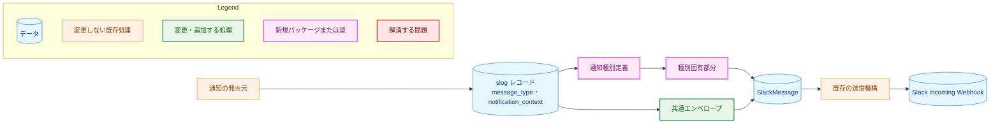
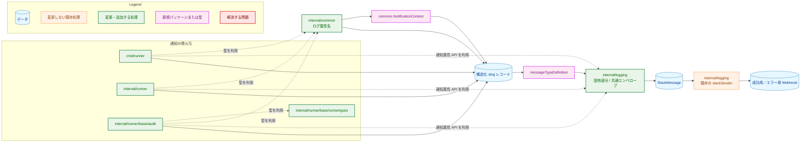
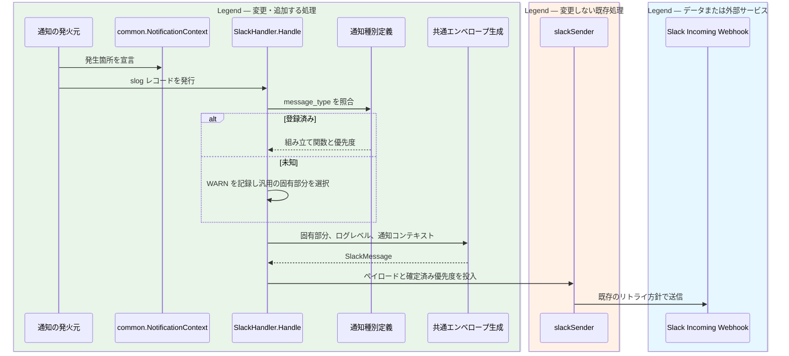
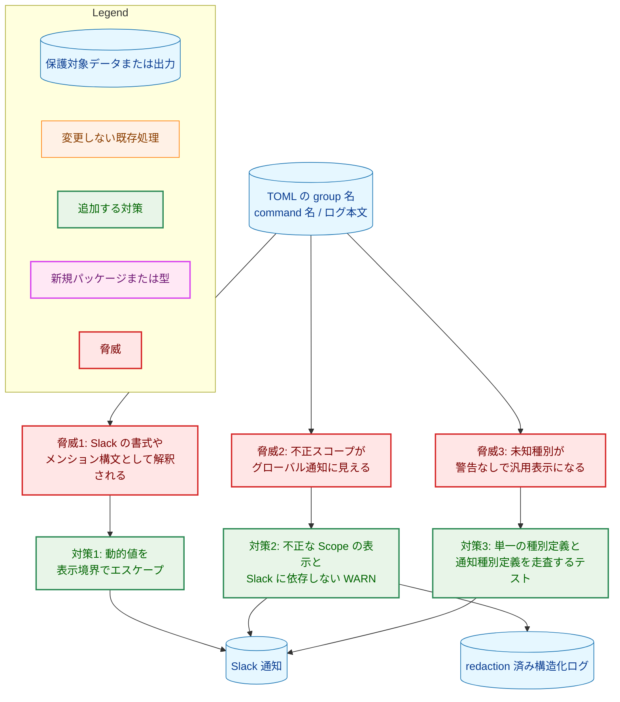
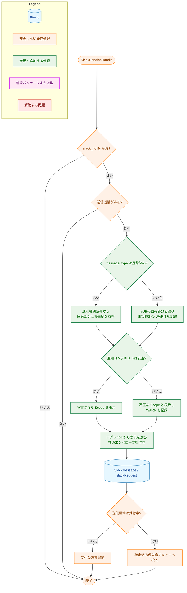

# アーキテクチャ設計書: Slack 通知メッセージの書式統一とスコープ情報の付与

## Document Status

| Item | Value |
|---|---|
| Status | `draft` |
| Created | 2026-09-08 |
| Review date | - |
| Reviewer | - |
| Comments | - |

## 用語

| 用語 | 意味 |
|---|---|
| 通知コンテキスト | 通知の発生箇所を表す `common.NotificationContext`。ゼロ値の `ScopeUnknown` は未指定であり、有効値はグローバル、グループ、コマンドのいずれか |
| 通知種別定義 | `message_type`、メッセージ組み立て関数、送信キューの優先度を一体として保持する定義 |
| 種別固有部分 | 通知種別ごとに異なる要約と添付フィールド。Scope、Hostname、Run ID は含まない |
| 共通エンベロープ | 製品名、ログレベルに対応する表示、Scope、Hostname、Run ID を全通知へ加える共通部分 |
| 送信失敗ロガー | Slack への再送を起こさない出力先へ、送信失敗、破棄、通知定義の不備を記録する既存ロガー |

## 1. 設計の全体像

### 1.1 設計原則

1. 通知の発生箇所は文字列の有無から推測せず、`common.NotificationContext` で宣言する。
2. 存続する通知種別は 1 つの通知種別定義に集約する。種別名、組み立て関数、キュー優先度を別々に列挙しない。
3. 種別ごとの組み立て関数は種別固有部分だけを返し、共通エンベロープの生成は 1 箇所に集約する。
4. 未知の通知種別や矛盾した通知コンテキストを補正しない。利用者への汎用通知と送信失敗ロガーの WARN により定義漏れを観測可能にする。
5. Task 0163 で定めた送信キュー、ワーカー、リトライ、flush、送信失敗ロガー、ドライランの境界を維持する。本設計はメッセージの構築と優先度の参照元だけを変更する。
6. 現在の添付形式を維持し、Slack の新しいレイアウト機能を導入しない。

### 1.2 概念モデル



矢印 A → B は「A が B へデータを渡す、または B の生成に寄与する」ことを表す。緑は変更する処理、紫は新しい型、橙は変更しない処理を示す。赤は凡例だけで使用する。本タスクでは新規パッケージを作らない。

通知コンテキストと通知種別定義は役割が異なる。通知コンテキストは発火元が知る「どこで起きたか」を保持する。通知種別定義は `internal/logging` が知る「どの固有部分を作り、どちらのキューへ入れるか」を保持する。この分割により、発火元は Slack の表示形式や送信キューを知らずに済む。

### 1.3 現在の仕組みと変更後の境界

現在の `SlackHandler.Handle` は `slack_notify=true` のレコードだけを扱い、`message_type` の `switch` で `SlackMessage` を構築する。`slackSender` は別の `switch` で高優先度かを判定する。`user_group_command_failure` は発火元に文字列がある一方、どちらの一覧にも登録されていないため汎用メッセージとして処理される。

変更後は `SlackHandler.Handle` が通知種別定義を参照し、登録済みなら対応する種別固有部分と優先度を得る。未知の種別では汎用の種別固有部分を使用し、送信失敗ロガーへ WARN を記録する。未知種別の WARN 以上のレコードは高優先度、INFO は通常優先度とする。キュー選択は `slackRequest` に確定済みの優先度を載せて行うため、`slackSender` が種別名を再列挙する必要はない。

既存方式である複数の `switch` を残したまま `user_group_command_failure` を追記するだけでは、F-005 が求める「次の追加時にも登録漏れを検知する」ことを満たせない。このため、通知種別定義へ集約する。

## 2. システム構成

### 2.1 全体アーキテクチャ



実線の矢印 A → B は「A のデータが B へ流れる」こと、破線の矢印 A ⇢ B は「A が B の型を利用する」というパッケージ依存を表す。`internal/logging` から発火元への逆向き依存は作らない。`internal/common` に通知コンテキストを置くのは、`internal/runner` と `internal/logging` の循環 import を避け、既存のログスキーマ共有責務を再利用するためである。

### 2.2 コンポーネント配置

| ファイル | 種別 | 責務 | 更新が必要な既存テスト |
|---|---|---|---|
| `internal/common/notification_context.go` | 新規 | 通知スコープ、通知コンテキスト、コンストラクタ、参照メソッド、`slog.LogValuer` を定義する | 新規 `internal/common/notification_context_test.go` でゼロ値、各スコープ、属性の省略、矛盾値を検証する |
| `internal/common/notification_context_test.go` | 新規 | F-002 の型とログ表現を検証する | - |
| `internal/common/logschema.go` | 変更 | 削除する 3 種別の属性定義と重大度定数を除き、`UserGroupCommandFailureAttrs` を含む存続する通知の共有属性名と型を定義する | 該当定義を直接使う各パッケージのテスト |
| `internal/logging/notification.go` | 新規 | 存続する通知種別の唯一の定義、発火元用の属性生成関数、確定済み優先度、種別固有部分の契約を定義する | 新規 `internal/logging/notification_test.go` で通知種別定義の集合と発火元の静的契約を検証する |
| `internal/logging/notification_test.go` | 新規 | 全定義の共通契約と、本番コードの発火元が属性生成関数を迂回しないことを検証する | - |
| `internal/logging/slack_handler.go` | 変更 | 通知種別定義の参照、種別固有部分の生成、共通エンベロープ、未知種別と不正スコープの WARN を担う。削除対象の 3 ビルダーを削除する | `TestSlackHandler_Handle_WithMockServer` と同ファイルのメッセージ構築、切り詰め、属性抽出のテスト |
| `internal/logging/slack_handler_test.go` | 変更 | 存続する全種別と汎用メッセージの書式、Scope、フィールド順、未知種別、不正スコープを検証する | 削除対象 3 種別のケースを除く |
| `internal/logging/slack_sender.go` | 変更 | 独立した種別定数一覧と `isHighPriority` を削除し、確定済みの優先度で既存キューを選ぶ | `TestSlackSender_HighPriorityBypassesFullNormalQueue`、`TestSlackSender_QueueOverflowDropsAndRecords`、`TestSlackSender_FlushLogsMessageTypeBreakdown` |
| `internal/logging/slack_sender_test.go` | 変更 | 存続する `pre_execution_error` で高優先度の実効性を検証する | `security_alert` を使う既存ケースを置換する |
| `internal/logging/pre_execution_error.go` | 変更 | `PreExecutionError` に通知コンテキストを加え、`HandlePreExecutionError` が構造体を受け取って属性として記録する | `TestHandlePreExecutionError_AllTypes`、`TestHandlePreExecutionError_SlackNotification` |
| `internal/logging/pre_execution_error_test.go` | 変更 | グローバルとグループの通知コンテキスト、および既存の stderr/stdout 出力を検証する | 位置引数を使う全ケースを移行する |
| `internal/runner/base/runnertypes/runtime.go` | 変更 | `NewRuntimeCommand` が既に受け取るグループ名を非公開フィールドへ保持し、参照メソッドで返す | `TestRuntimeCommand_Structure`、`TestRuntimeCommand_HelperMethods`、`TestNewRuntimeCommand_TimeoutResolution*` |
| `internal/runner/base/runnertypes/runtime_test.go` | 変更 | グループ名の保持と参照を検証する | 構造体リテラルを使う既存ケースは非公開フィールドに依存させない |
| `internal/runner/base/audit/logger.go` | 変更 | `LogSecurityEvent` と `LogPrivilegeEscalation` を削除し、失敗したユーザー／グループ指定コマンドへコマンドスコープを付ける | `TestLogger_LogUserGroupExecution` とマスク関連テスト。削除対象テストは F-001 のカバレッジ比較対象 |
| `internal/runner/base/audit/logger_test.go` | 変更 | 削除対象の発火元のテストを削除し、ユーザー／グループ指定コマンドの失敗通知のコンテキスト属性を検証する | `TestLogger_LogPrivilegeEscalation`、`TestLogPrivilegeEscalation_Masking`、`TestLogger_LogSecurityEvent`、`TestLogSecurityEvent_*` を削除する |
| `internal/runner/runner.go` | 変更 | グループ検証エラーを `GroupScope` と構造化された本文で通知し、グループ集計へ通知コンテキストを付ける | `TestSlackNotification` と検証エラー経路のテスト |
| `internal/runner/runner_test.go` | 変更 | グループ集計とグループ検証エラーの通知コンテキストを検証する | `TestSlackNotification` を拡張する |
| `cmd/runner/main.go` | 変更 | 起動前エラーを `GlobalScope` を持つ `PreExecutionError` 構造体で渡す | 起動前エラーの統合テスト群 |
| `cmd/runner/startup_privilege_test.go` | 変更 | 特権降格エラーの新しい引数形を検証する | `TestReportStartupPrivilegeFailure_UsesValidRunID` |
| `cmd/runner/integration_pre_execution_error_test.go` | 変更 | 設定読み込みなどの起動前エラーがグローバルスコープを保つことを検証する | 同ファイルの既存 E2E テスト |
| `cmd/runner/integration_slack_flush_test.go` | 変更 | 終了時 flush で送る通知レコードへ通知コンテキストを付け、共通書式を検証する | `TestIntegration_RunnerFlushesSlackOnNormalExit` |
| `internal/runner/e2e_slack_webhook_separation_test.go` | 変更 | INFO と WARN 以上の Webhook 分離および新書式を検証する | `TestE2E_SlackWebhookSeparation_*`、`TestE2E_SlackWebhookSeparation_MessageFormat` |
| `internal/runner/e2e_slack_webhook_test.go` | 変更 | モックサーバーで新しいペイロード全体を検証する | `TestE2E_SlackWebhookWithMockServer` |
| `docs/user/runner_command.ja.md` | 変更 | 通知種別、統一書式、Scope、製品名、ドライラン時の挙動を日本語で説明する | - |
| `docs/user/runner_command.md` | 変更 | 日本語版と同じ利用者向け説明を英語へ反映する | - |

検索の結果、`internal/redaction/redactor_test.go`、`internal/runner/bootstrap/logger_test.go`、`internal/runner/integration_command_results_test.go` にも通知属性の文字列が現れる。これらは既存の redaction、ハンドラ構成、コマンド結果スキーマを確認するテストであり、挙動を変えない。コンパイルまたは期待値が影響を受けた場合だけ、新しい通知コンテキスト属性を追加する。`internal/runner/runerrors` の `ErrorSeverityCritical` は別の型であり、削除対象の `common.SeverityCritical` ではないため変更しない。

新規パッケージは作らず、既存の `internal/common`、`internal/logging`、`internal/runner` の責務を再利用する。

### 2.3 通知データフロー



矢印 A → B は「処理の呼び出し、またはデータの受け渡し」を表し、破線の矢印は戻り値を表す。図上部の `Legend` と記した色付きボックスが凡例であり、緑は変更・追加する処理、橙は変更しない既存処理、青はデータまたは外部サービスを表す。未知種別の WARN と不正スコープの WARN は Slack へ戻さず、既存の送信失敗ロガーへ書く。

### 2.4 副作用の境界

本タスクは新しいフラグやモードを追加しない。既存モードの副作用は次のとおりである。

| モード | Slack への HTTP 送信 | 送信キューとワーカー | ローカルログ | ファイルの書き込み・削除、コマンド実行 |
|---|---|---|---|---|
| 通常 | 許可する | 既存どおり使用する | 通知定義の WARN を含めて許可する | 本タスクでは変更しない |
| `--dry-run` | 抑止する | 生成しない | 既存どおり許可する。Slack メッセージ構築と送信時のスキーマ診断は行わない | 既存のドライラン契約に従い、外部副作用を抑止する |
| `GSCR_SLACK_SYNC=1` | 許可する | キューとワーカーを使わず `Handle` 内で送る | 通常モードと同じ | 本タスクでは変更しない |

ドライランで送信時の WARN を出さないのは、Task 0163 §3.4.10 が定める「送信機構を作らず、メッセージも構築しない」という既存契約の帰結である。本番コードの発火元が属性生成関数と登録済み通知トークンを使うことは静的テストで検証するため、既知の発火元にある登録漏れはビルド時に検知される。通知コンテキストに含まれる実際の値の妥当性は通常実行時に検証する。

## 3. コンポーネント設計

### 3.1 通知コンテキスト

`internal/common` に次の型を置く。フィールドを非公開にすることで、パッケージ外の発火元が group と command を直接組み替えることを防ぎ、スコープをコンストラクタで宣言させる。Go ではゼロ値を `ScopeUnknown` として明示的に予約し、グローバル通知とは区別する。グローバル通知は `GlobalScope()` で構築した値だけを有効とする。

```go
type NotificationScope int

const (
    ScopeUnknown NotificationScope = iota
    ScopeGlobal
    ScopeGroup
    ScopeCommand
)

type NotificationContext struct {
    scope   NotificationScope
    group   string
    command string
}

func GlobalScope() NotificationContext
func GroupScope(group string) NotificationContext
func CommandScope(group, command string) NotificationContext

func (c NotificationContext) Scope() NotificationScope
func (c NotificationContext) GroupName() string
func (c NotificationContext) CommandName() string
func (c NotificationContext) LogValue() slog.Value
```

`NotificationContext.LogValue` は `scope` と `group` を常に出す。ゼロ値では `scope=unknown` を出し、グローバルとして記録しない。コマンド名が空の場合だけ `command` を省略する。発火元は §3.4 の属性生成関数を通して、共通の属性名でこの `slog.LogValuer` をレコードへ載せる。これにより、JSON ログと Slack ハンドラが同じ宣言を読む。

| 宣言 | Scope の表示 | 妥当性 |
|---|---|---|
| ゼロ値（`ScopeUnknown`） | `(scope: invalid)` | 不正。グローバルへ補正せず WARN を記録する |
| `GlobalScope()` | `(global)` | 妥当。group と command は空であること |
| `GroupScope("backup")` | `group=backup` | group が空でなければ妥当。command は空であること |
| `CommandScope("backup", "pg_dump")` | `group=backup command=pg_dump` | group と command がともに空でなければ妥当 |
| 上記の組み合わせに反する値 | `(scope: invalid)` | 不正。グローバルへ補正せず WARN を記録する |

コンストラクタは空文字をエラーとして返さない。F-002 は、構築時の失敗でログ経路を中断するのではなく、定義の矛盾を実際の通知と WARN の両方に示すことを求めるためである。非公開フィールドはスコープの種類と値の組をコンストラクタへ集約するが、空文字まで排除しない。Slack ハンドラ側の妥当性確認が値の欠落を検知する。

### 3.2 `PreExecutionError` と発火元

`HandlePreExecutionError` の 4 個の位置引数を廃止し、既存の `PreExecutionError` を受け取る。これにより、呼び出し元で型、本文、コンポーネント、Run ID、通知コンテキストの対応が崩れにくくなる。

```go
type PreExecutionError struct {
    Type                ErrorType
    Message             string
    Component           string
    RunID               string
    NotificationContext common.NotificationContext
    Err                 error
}

func HandlePreExecutionError(preExecErr *PreExecutionError)
```

`cmd/runner` の設定読み込み、Run ID、ビルド設定、特権降格などの起動前エラーは `GlobalScope()` を渡す。`runner.executeGroups` のグループ検証エラーだけは `GroupScope(verErr.Group)` を渡す。検証結果本文から `Group: <name>, ` を除き、グループ名の唯一の表示場所を Scope にする。stderr と stdout の既存形式、および `HandleExecutionError` が Slack 通知を行わない契約は維持する。

### 3.3 `RuntimeCommand` のグループ名

`RuntimeCommand` に非公開の `groupName string` と `GroupName() string` を加える。`NewRuntimeCommand` のシグネチャは現在と同じであり、タイムアウト解決のために既に受け取っている `groupName` をそのまま保持する。

```go
type RuntimeCommand struct {
    Spec *CommandSpec
    // 既存フィールドは省略
    groupName string
}

func (r *RuntimeCommand) GroupName() string
```

`audit.Logger.LogUserGroupExecution` は失敗時に `CommandScope(cmd.GroupName(), cmd.Name())` を付ける。コマンド名をログ本文や引数から推測しない。既存のコンストラクタ引数を保持するだけで F-003 を満たせるため、新しいデータ構造やグループ検索機構は導入しない。

### 3.4 通知種別定義

`internal/logging` に、存続する 3 種別を保持する唯一の通知種別定義の集合を置く。各要素は種別名、種別固有部分の組み立て関数、キュー優先度を一体で保持する。

```go
type notificationPriority int

const (
    priorityNormal notificationPriority = iota
    priorityHigh
)

type messageDetails struct {
    Headline string
    Fields   []SlackAttachmentField
}

type messageBuilder func(*SlackHandler, slog.Record) messageDetails

type Notification struct {
    definition *messageTypeDefinition
}

type messageTypeDefinition struct {
    MessageType string
    Priority    notificationPriority
    Build       messageBuilder
}

var (
    CommandGroupSummaryNotification     Notification
    PreExecutionErrorNotification       Notification
    UserGroupCommandFailureNotification Notification
)

func NotificationAttrs(notification Notification, notificationContext common.NotificationContext) []slog.Attr
```

定義する 3 種別は次のとおりである。

| `message_type` | 優先度 | 種別固有の要約 | 種別固有フィールド |
|---|---|---|---|
| `command_group_summary` | 通常 | 成功時は `<総数> commands in <時間>`、失敗時は `<総数> commands, <失敗数> failed in <時間>` | Command Count、Duration、各 Command と既存の Output / Error |
| `pre_execution_error` | 高 | `error_type` | Error Message、Component |
| `user_group_command_failure` | 通常 | `command failed (exit <終了コード>)` | Command、Exit Code、存在する場合は Output と Error Output |

`common.UserGroupCommandFailureAttrs` は `command_name`（string）、`exit_code`（int）、`stdout`（string）、`stderr`（string）を定義し、`audit.Logger.LogUserGroupExecution` とユーザー／グループ指定コマンド固有のビルダーが共有する。属性の記録側と参照側が同じ属性名と型を使うため、固有ビルダーに文字列リテラルを複製しない。

`command_group_summary` の `status` 属性は Slack 表示の判定に使わず、ログレベルを唯一の判定基準とする。発火元は既存どおり実行結果から INFO または ERROR を選ぶ。`GroupSummaryAttrs.Group` は通知コンテキストに置き換え、重複する属性を残さない。

各公開 `Notification` 変数は、パッケージ初期化時に非公開の登録関数へ `message_type`、組み立て関数、優先度を 1 回だけ渡して生成する。登録関数は同じ `messageTypeDefinition` を通知種別定義の集合へ加え、そのポインタを非公開フィールドに保持するトークンを返す。この 1 回の宣言だけで、文字列、ビルダー、優先度、発火元が使うトークンを定義する。別の種別一覧や対応表は作らず、初期化後の集合は変更しない。`Notification` のフィールドは非公開なのでパッケージ外で作れるのはゼロ値だけであり、`NotificationAttrs` はゼロ値を受け取った場合に `slack_notify` 属性を生成しない。本番コードでのゼロ値の使用は静的契約テストでも拒否する。

発火元は `NotificationAttrs` と公開トークンを使い、`slack_notify`、`message_type`、通知コンテキストを一組でレコードへ加える。この API を `internal/logging` に置くのは、発火元が既に依存するログ通知契約へ属性生成を集約し、`internal/common` に Slack 固有の種別を持ち込まないためである。テストは登録済みの通知種別定義を順に走査し種別名の一意性、組み立て関数、共通エンベロープ、優先度、公開トークンとの同一性を検証する。さらに本番コードが `slack_notify=true` または `message_type` を直接構築せず、`NotificationAttrs` の第 1 引数に登録済みの公開トークンだけを渡すことを Go 構文木の静的契約テストで検証する。

`security_alert`、`privilege_escalation_failure`、`privileged_command_failure` は定義、ビルダー、ログスキーマ、発火元、テストから削除する。`pre_execution_error` は削除対象の高優先度種別の代わりに、高優先度キューの実効性を検証する基準となる。

### 3.5 共通エンベロープ

共通エンベロープ生成はログレベル、通知コンテキスト、種別固有部分から 1 個の `SlackMessage` を作る。本番コードでは、製品名 `go-safe-cmd-runner` を一つの定数としてのみ定義する。

| ログレベル | 絵文字 | STATUS | 添付色 |
|---|---|---|---|
| INFO | ✅ | `SUCCESS` | `good` |
| WARN | ⚠️ | `WARNING` | `warning` |
| ERROR 以上 | ❌ | `ERROR` | `danger` |

Text 行は常に次の形とする。

```text
[go-safe-cmd-runner] <絵文字> *<STATUS>* — <Scope> : <種別固有の要約>
```

添付フィールドは、種別固有フィールドの後ろに Scope、Hostname、Run ID をこの順で追加する。汎用メッセージも同じ処理を通す。Scope フィールドの値は Text 行と同じスコープ表現にする。

動的な group 名、command 名、要約、添付フィールド値は既存の redaction 後の値を受け取り、Slack が特別に解釈する `&`、`<`、`>` を公式仕様どおり entity へ変換する。表示境界だけで処理し、構造化ログの元値は変更しない。改行、mrkdwn 区切り、コードフェンスを含む既存値の追加正規化は、表示内容を変える承認済み要件がないため本タスクでは導入しない。

### 3.6 未知種別と不正スコープ

未知の `message_type`（空文字を含む）は、レコードの `Message` を要約とする汎用の種別固有部分へ変換する。共通エンベロープを必ず付ける。未知種別が WARN または ERROR の場合は高優先度、INFO の場合は通常優先度で送信する。同時に送信失敗ロガーへ WARN を 1 件記録し、`message_type`、`run_id`、ログレベル、理由を含める。通知本文や Webhook URL は WARN に含めない。WARN のメッセージは `Slack notification schema violation` に固定し、理由を `unknown_message_type` とする。既存の `webhook_label` も付ける。

通知コンテキスト属性がない場合、属性の型が違う場合、同じキーが複数ある場合、または属性値がゼロ値の `ScopeUnknown` である場合は不正とする。明示的に 1 個の `GlobalScope` がある場合だけ `(global)` と表示する。通知コンテキストが不正でも、汎用メッセージには切り替えず、元の通知種別の固有部分を保ったまま Scope を `(scope: invalid)` とする。送信失敗ロガーへの WARN には `message_type`、`run_id`、宣言された scope、理由を含め、group 名と command 名は含めない。WARN のメッセージは同じく `Slack notification schema violation` とし、理由を `missing_notification_context`、`duplicate_notification_context`、`invalid_notification_context` のいずれかに固定し、`webhook_label` を付ける。group 名と command 名は利用者が入力できる値であり、診断に不要な本文の複製を避ける。

通知種別の照合と通知コンテキストの妥当性確認は、通常実行の `SlackHandler` 境界へ一元化し、送信機構が受付停止済みか確認する前に行う。これにより、終了処理との競合で通知が破棄された場合でも定義不備は記録される。ドライランまたは nil 送信機構の早期 return は Task 0163 の契約どおり先に行う。

## 4. エラーハンドリング設計

### 4.1 エラー分類

| 状況 | Slack への結果 | 送信失敗ロガー | 呼び出し元への結果 |
|---|---|---|---|
| 未知の `message_type` | INFO は通常優先度、WARN 以上は高優先度で汎用メッセージを送る | 固定理由コード付き WARN | `Handle` は既存どおり送信成否を返さない |
| 不正な通知コンテキスト | `(scope: invalid)` を含む元種別の通知を送る | WARN | `Handle` は既存どおり処理を続ける |
| キュー溢れ、受付停止、HTTP 失敗 | Task 0163 の既存契約に従う | 既存の記録 | 変更しない |

ログ処理の不備によってコマンド実行を失敗させない一方、正常な通知に見せかけない。WARN の固定メッセージと理由属性を用い、オンコール担当者が `run_id` と `message_type` から元の JSON ログを追跡できるようにする。

### 4.2 エラー型

本タスクは、呼び出し元へ返す新しいエラー型を導入しない。未知種別や不正スコープは送信経路で観測するスキーマ違反であり、`SlackHandler.Handle` の既存のエラー契約を変えずに WARN と通知表示で報告する。`PreExecutionError` の既存 `Error`、`Detail`、`Is`、`As`、`Unwrap` の契約も維持する。

## 5. セキュリティ考慮事項

### 5.1 脅威モデル



矢印 A → B は、脅威入力から脅威への辺では「A から B が生じる」こと、脅威から対策への辺では「B が A を抑制する」こと、対策から出力への辺では「A の適用後に B へ出力する」ことを表す。新しい通知コンテキストは権限判断やコマンド実行には使わず、表示と監査相関にだけ使うため、改ざんされても実行権限は拡大しない。

### 5.2 既存の保護との関係

- `internal/redaction` がログ境界で機密値を置換する現在の責務を維持する。本タスクの Slack 表示用エスケープは redaction の代替ではなく、その後段で書式制御文字だけを扱う。
- Webhook URL、許可ホスト、HTTPS 検証、送信失敗ロガーが Slack に依存しない構成を変更しない。
- INFO は成功用 Webhook、WARN 以上はエラー用 Webhook という `SlackHandlerLevelMode` の振り分けを変更しない。
- キューの容量、優先処理、リトライ、送信期限、flush 期限、同期モードを変更しない。削除対象の高優先度種別を除いた後も `pre_execution_error` を高優先度に保つ。
- コマンドの stdout は 1000 文字、stderr は 500 文字という既存の切り詰め上限を維持する。

### 5.3 Slack での表示互換性

本設計では、既存の Incoming Webhook、トップレベルの `text`、legacy secondary attachment の `color` と `fields` だけを使用する。新しい Slack API 機能は導入しない。Slack は secondary attachment の `fields` を 2〜3 個以内にすることを推奨している。一方、現在のグループ集計はコマンドごとにフィールドを持つため、既にこの推奨数を超える場合がある。F-004 では stdout 1000 文字、stderr 500 文字の既存上限を据え置くため、本タスクでは集約上限やフィールド数を変更しない。コマンド数の多いグループやサイズの大きい種別固有メッセージが Slack に拒否される可能性と、改行や mrkdwn の区切りによって表示が変わる可能性は、既存のリスクとして残る。送信失敗は、既存の送信失敗ロガーが記録する HTTP エラーから確認できる。集約上限、追加の表示正規化、Block Kit への移行は、利用者向けの挙動と AC を定めた別タスクで扱う。Slack の公式文書は 2026-09-08 に確認した。Incoming Webhook で通常のメッセージ書式を利用できること、トップレベルのメッセージでは `mrkdwn` が既定であること、`*bold*` が太字になること、`&`、`<`、`>` のエスケープが必要なことを確認している。

- [Sending messages using incoming webhooks](https://api.slack.com/messaging/webhooks)
- [Formatting message text](https://docs.slack.dev/messaging/formatting-message-text/)

対象クライアント環境は Slack のみである。実装時には `make slack-notify-test` と `make slack-group-notification-test` で、Text 行、添付色、フィールド順、プッシュ通知での製品名と Scope の表示を確認する。実サービスの検証を実行できない環境では、モックサーバーによるペイロード検証を必須とし、実表示未確認をリリース前の残存リスクとして記録する。

### 5.4 他の設計文書のポリシーとの関係

本設計は [Task 0163 §3.4](../0163_redaction_coverage_and_slack_async/02_architecture.md#34-slack-送信の非同期化f-004-f-005-f-006) の非同期送信ポリシーを維持する。とくに、メッセージはキュー投入前に構築すること、高優先度キューを先に処理すること、送信失敗と破棄を Slack に依存しないロガーへ記録すること、ドライランでは送信機構を作らないことを変更しない。

Task 0163 では `security_alert` と `privilege_escalation_failure` を高優先度としていた。本タスクは、どちらにも本番の呼び出し元がないという承認済み要件 F-001 に基づいて、この 2 種別を削除する。これは高優先度の意味を緩める例外ではなく、到達不能な定義を取り除く変更である。存続する `pre_execution_error` の優先度は変えない。古い種別を使う `TestSlackSender_HighPriorityBypassesFullNormalQueue` と `TestSlackSender_QueueOverflowDropsAndRecords` は `pre_execution_error` を使うよう更新し、優先度を通常へ倒すと失敗することを確認する。

Task 0163 §3.4.1 は `slackSender` が `failureLogger` を所有すると定めている。本設計も所有権を移さず、`SlackHandler` は既存の `slackSender` を介して WARN を記録する。nil 送信機構とドライランでメッセージ構築を省く契約も維持する。

## 6. 処理フロー詳細

### 6.1 Slack メッセージ構築フロー



矢印 A → B は「A の判定または処理の次に B を実行する」ことを表す。通知種別とスコープの検証を受付停止判定より前に置くため、終了時に破棄されたレコードでも定義不備の WARN が残る。キュー投入以降の並行処理は Task 0163 のままであり、本タスクでは変更しない。

### 6.2 発火元ごとのデータ契約

| 発火元 | ログレベル | 通知コンテキスト | 種別固有データ |
|---|---|---|---|
| `runner.logGroupExecutionSummary` 成功 | INFO | `GroupScope(groupSpec.Name)` | コマンド結果、所要時間 |
| `runner.logGroupExecutionSummary` 失敗 | ERROR | `GroupScope(groupSpec.Name)` | コマンド結果、所要時間 |
| `logging.HandlePreExecutionError` の起動前エラー | ERROR | `GlobalScope()` | Error Type、Error Message、Component |
| `runner.executeGroups` の検証エラー | ERROR | `GroupScope(verErr.Group)` | Error Type、グループ名を除いた検証結果、Component |
| `audit.Logger.LogUserGroupExecution` の失敗 | ERROR | `CommandScope(cmd.GroupName(), cmd.Name())` | Command、Exit Code、redaction 済み stdout / stderr |

すべての発火元は `run_id` を既存どおり記録する。共通エンベロープの Run ID は、現在と同じく `SlackHandler` の生成時に設定した値を使う。

## 7. テスト戦略

### 7.1 単体テスト

| 観点 | 検証内容 | 対応 AC |
|---|---|---|
| 通知コンテキスト | ゼロ値を `ScopeUnknown` として不正扱いし、`GlobalScope`、グループ、コマンド、属性の欠落・重複・型違い・値の矛盾と区別する | AC-09, AC-10, AC-12 |
| 発火元 | 存続する 3 種別の全発火点が通知コンテキストを持つ | AC-11, AC-13, AC-15, AC-17 |
| グループ検証エラー | Scope に group 名があり、Error Message に `Group: <name>, ` がない | AC-13, AC-14 |
| `RuntimeCommand` | コンストラクタへ渡した group 名を `GroupName` が返す | AC-16 |
| レベル表示 | INFO、WARN、ERROR の絵文字、STATUS、色を全種別で検証する。各ビルダーが表示を上書きできないことも確認する | AC-18, AC-19 |
| 共通エンベロープ | 登録済みの通知種別定義を順に走査し、製品名、Text 形式、`###` の不在、末尾 3 フィールドの順序を検証する | AC-18〜AC-22, AC-26 |
| 製品名 | 登録済み種別と汎用メッセージが同じ製品名で始まり、本番コード内の定義箇所が 1 つである | AC-33 |
| ユーザー／グループ指定コマンドの失敗 | 固有ビルダーが command 名、終了コード、Scope を表示する | AC-17, AC-23 |
| 未知種別 | 空文字と未知文字列が汎用メッセージとして送られ、共通エンベロープと固定理由コードの WARN を持つ。WARN 以上は通常キューが満杯でも高優先度で送られる | AC-24, AC-25 |
| 単一定義 | 登録関数が返すトークンと、そのトークンが参照する定義に、種別名、ビルダー、優先度がまとめて保持されることを検証する。構文木の静的契約テストで本番コードによる直接の `slack_notify=true` と `message_type` の構築、および登録済み公開トークン以外の引数を禁止する | AC-26, AC-27 |
| 優先度 | 通常キューを満たしても `pre_execution_error` が高優先度キューへ入り、先に送られる。優先度を通常へ変えると失敗する | AC-07, AC-27 |
| 削除対象の種別 | 本番コードを `rg` で検索し、対象の型、定数、関数、文字列がない | AC-01〜AC-03 |
| 特権監査 | `privilege.logElevationOutcome` の native root と `seteuid` の既存テストが残り、結果を記録する | AC-05 |
| 切り詰めと redaction | stdout 1000 文字、stderr 500 文字の既存上限と、既存 redaction が維持される | F-004, F-007 |
| 宛先分離 | INFO は成功用、WARN と ERROR はエラー用ハンドラだけで有効になる | AC-31 |

F-001 で列挙された削除対象テストは、各種別を削除する直前と直後に `go tool cover -func` を取得し、存続する関数ごとに比較する。各削除コミットのメッセージへ比較結果を記録する。削除対象を 3 個の独立したコミットに分け、各コミットで `make test` と `make lint` を実行する（AC-04, AC-06, AC-30）。削除後に `make deadcode` も実行する（AC-08）。

F-002 から F-005 の各テストは、対象のコンストラクタ呼び出し、共通エンベロープ、レジストリ要素、優先度を一時的に壊して失敗することを確認し、その結果を該当コミットのメッセージへ記録する（AC-32）。

### 7.2 統合テスト

- `cmd/runner/integration_pre_execution_error_test.go` で設定読み込み失敗などが `(global)` として Slack 用レコードへ伝わることを確認する（AC-15）。
- `internal/runner` の検証エラー経路で group 名が Scope に一度だけ現れることを確認する（AC-13, AC-14）。
- ユーザー／グループ指定コマンドを失敗させ、group 名、command 名、終了コードを持つ固有通知になることを確認する（AC-17, AC-23）。
- `internal/runner/e2e_slack_webhook_separation_test.go` で INFO と WARN 以上の宛先が変わらないことを確認する（AC-31）。
- `cmd/runner/integration_slack_flush_test.go` で新書式の通知が終了時の flush で失われないことを確認する。
- `docs/user/runner_command.ja.md` と英語版の対応を確認し、通知種別、書式、Scope、製品名の記載を静的に検証する（AC-28, AC-29）。

### 7.3 セキュリティテスト

- command 名と汎用メッセージに `&`、`<`、`>`、Slack のリンク・メンション形式を含め、entity 変換後のペイロードが意図しないリンクやメンションを作らないことを確認する。
- 未知種別と不正スコープの WARN が送信失敗ロガーだけへ届き、新しい Slack 通知を再帰的に発生させないことを確認する。
- WARN に通知本文、group 名、command 名、Webhook URL が含まれないことを確認する。
- `go test -race ./internal/logging/...` で、通知種別定義の参照と既存の並行投入・flush に競合がないことを確認する。定義は実行中に変更しない。
- `--dry-run` で成功用・エラー用のどちらの Webhook にも HTTP リクエストが届かず、キューとワーカーも生成されない既存テストを維持する。

## 8. 実装優先順位

### 8.1 フェーズ分割

| Phase | 内容 | 完了条件 |
|---|---|---|
| 1 | `privileged_command_failure` の本番コードとテストを削除 | AC-01、AC-04、AC-06、AC-08、AC-30 を満たす独立コミット |
| 2 | `security_alert` の本番コードとテストを削除し、高優先度テストを `pre_execution_error` へ移す | AC-02、AC-04、AC-06〜AC-08、AC-30 を満たす独立コミット |
| 3 | `privilege_escalation_failure` の本番コードとテストを削除し、既存の特権昇格結果ログを確認する | AC-03〜AC-06、AC-08、AC-30 を満たす独立コミット |
| 4 | 通知コンテキストと `RuntimeCommand.GroupName` を追加し、全発火元へ伝搬する | AC-09〜AC-17、AC-30、AC-32 |
| 5 | 通知種別定義、全発火元の属性生成関数への移行、ユーザー／グループ指定コマンド固有のビルダー、共通エンベロープ、WARN を 1 個の取り消し可能なコミットで導入する | AC-18〜AC-27、AC-31〜AC-33 |
| 6 | 利用者向け日本語文書を更新し、英語版へ翻訳する | AC-28〜AC-30 |
| 7 | 全体検証と実 Slack 表示確認を行う | 全 AC、Success Criteria |

### 8.2 実装順の根拠

削除対象の種別を先に除くことで、通知種別定義と共通エンベロープは実際に発火する 3 種別だけを扱う。型の伝搬を表示変更より先に行うことで、各発火元の契約と Slack 表示の問題を分けて検証できる。文書は最終的な表示が確定してから更新する。Phase 5 では旧 group 属性だけを先に削除する中間状態を作らず、発火元とハンドラを同じコミットで切り替える。

統一書式では Text 行と添付フィールドの順序が変わるため、Slack ワークフロー、通知本文を解析する監視ルール、運用スクリプトに影響する破壊的変更となる。まず、リポジトリ内の利用箇所と文書を検索する。外部利用者には、リリースノートで新旧のペイロード例を示す。実際の Webhook はテスト用チャンネルで先に検証し、3 種別、未知種別、宛先分離を確認してから通常のチャンネルへ展開する。問題があれば Phase 5 の単一コミットを取り消す。製品名を固定する承認済み方針と YAGNI に従い、設定で旧書式へ切り替える機能は追加しない。

各 Phase では変更した Go コードに `make fmt` を適用し、`make test` と `make lint` を通す。Phase 3 後と最終 Phase では `make deadcode` を追加する。実サービスのテストに必要な Webhook はリポジトリへ保存しない。

## 9. 将来の拡張性

- 通知種別を追加するときは通知種別定義へ 1 要素を追加し、通知種別定義の集合を走査する共通契約テストを通す。別の `switch` や優先度一覧は追加しない。
- Scope に新しい階層を追加する場合は `NotificationScope` とコンストラクタ、妥当性、表示を同時に拡張する。文字列の内容から階層を推測しない。
- Slack Block Kit や別の通知先への抽象化は、具体的な要件と全対象クライアントでの検証が生じた時点で別タスクとして設計する。本タスクでは既存の Incoming Webhook ペイロードを維持する。
- 製品名や表示名の設定上書きは F-006 の範囲外である。チャンネルごとの識別が Scope と Hostname で足りないという運用上の証拠が得られた場合に検討する。

## 付録 A: Acceptance Criteria と設計の対応

| AC | 主な設計箇所 |
|---|---|
| AC-01〜AC-03 | §2.2、§3.4、§7.1、§8.1 |
| AC-04 | §7.1、§8.1 |
| AC-05〜AC-08 | §2.2、§3.4、§7.1、§8.1 |
| AC-09〜AC-12 | §3.1、§3.6、§7.1 |
| AC-13〜AC-17 | §3.2、§3.3、§6.2、§7.1〜§7.2 |
| AC-18〜AC-22 | §3.4〜§3.5、§7.1 |
| AC-23〜AC-27 | §1.3、§3.4、§3.6、§6.1、§7.1 |
| AC-28〜AC-29 | §2.2、§7.2、§8.1 |
| AC-30〜AC-32 | §2.4、§5.2、§7、§8 |
| AC-33 | §3.5、§7.1 |

## 付録 B: 決定履歴

### B.1 通知種別定義を配列とする理由

通知種別は 3 個であり、実行時に追加・削除しない。小さい固定集合には、要素を一望でき、同じ集合をそのままテストできる配列が適する。登録 API や初期化順序を持つ動的レジストリは、現時点の要件にない拡張点と競合状態を増やすため採用しない。参照方法は実装計画で具体化し、別の種別一覧は作らない。

### B.2 `switch` を 1 個にまとめる案を採用しない理由

単一の `switch` でも組み立て関数の選択は集約できるが、キュー優先度を同じ分岐から安全に返すための組を別途管理する必要がある。また、テストが全種別の通知種別定義の集合を順に走査する AC-26 を自然に満たせない。通知種別定義は名前、関数、優先度を 1 要素として扱えるため採用する。

### B.3 共通エンベロープを各ビルダーから呼ぶ案を採用しない理由

各ビルダーが共通関数を呼ぶ形では、呼び忘れや呼び出し後の上書きを型で防げない。F-004 と F-005 は全種別への一律適用と漏れの検知を求めるため、種別固有部分の戻り型から共通フィールドを除き、`SlackHandler.Handle` 側で必ず共通エンベロープを付ける。
