# アーキテクチャ設計書: Slack 通知メッセージの書式統一とスコープ情報の付与

## Document Status

| Item | Value |
|---|---|
| Status | `draft` |
| Created | 2026-09-08 |
| Review date | - |
| Reviewer | - |
| Comments | - |

## 関連文書

- [01_requirements.md](01_requirements.md) — 本設計が満たす要件と受け入れ基準
- [0163 redaction coverage and slack async](../0163_redaction_coverage_and_slack_async/02_architecture.md) — 送信キューと優先度、送信失敗ロガー、ドライランの扱いを定めた先行設計
- [0068 separate slack webhooks](../0068_separate_slack_webhooks/02_architecture.md) — 成功用・エラー用 Webhook の分離
- [security-architecture.ja.md](../../dev/architecture_design/security-architecture.ja.md) / [security-architecture.md](../../dev/architecture_design/security-architecture.md) — 本タスクで記述の更新が必要（3.8）
- [slack_async_delivery.ja.md](../../dev/architecture_design/slack_async_delivery.ja.md) / [slack_async_delivery.md](../../dev/architecture_design/slack_async_delivery.md) — 高優先度キューの根拠を「セキュリティアラート等」と記しており、更新が必要（3.8）
- [README.ja.md](../../../README.ja.md) / [README.md](../../../README.md) — Slack 統合をセキュリティイベントのリアルタイム通知と説明しており、更新が必要（5.2）
- [security-risk-assessment.ja.md](../../user/security-risk-assessment.ja.md) / [security-risk-assessment.md](../../user/security-risk-assessment.md) — 高優先度キューが「セキュリティアラート等」を保持すると記しており、更新が必要（5.2）
- [mermaid_reference.md](../../dev/developer_guide/mermaid_reference.md) — 図の記法

## 用語

本書で使う語を先に定める。

| 用語 | 意味 |
|---|---|
| 通知レコード | `slack_notify=true` を持つ slog のログレコード。`SlackHandler.Handle` が Slack メッセージに変換する対象 |
| 通知種別 | 通知レコードが持つ `message_type` 属性の値。`command_group_summary` など |
| 発火点 | 通知レコードを書き出すコード。`runner.logGroupExecutionSummary` など |
| 通知スコープ | 通知が「どこで起きたか」を表す値。グローバル／グループ／コマンドの 3 段階。本設計での型名は `NotificationContext`（要件定義書で定めた名前）で、その粒度を表す列挙が `NotificationScope` である |
| エンベロープ | 全通知に共通する外枠。Text 行、添付の色、末尾 3 フィールド（Scope・Hostname・Run ID）を指す |
| 要約 | Text 行の `:` の右側に置く、種別ごとの 1 行の説明 |
| 送信失敗ロガー | `slackSender` が持つ、Slack へ送らないログ出力先。送信の失敗や破棄を記録する（0163 で導入） |
| 種別定義 | 通知種別ごとの「要約の作り方・固有フィールドの作り方・キュー優先度」をひとまとめにした値 |

---

## 1. 設計の全体像

### 1.1 このタスクが解決する問題

現在の Slack 通知には 3 つの欠陥がある。

1. 通知から発生箇所が読み取れない。グループ名を構造化して持つのは `command_group_summary` だけで、グループ実行中の検証エラーはグループ名を文字列に埋め込んで送っている。
2. 書式が種別ごとに違う。先頭の絵文字、見出しの形、添付フィールドの並びに規則がない。加えて `###` は Slack の mrkdwn では見出しにならず、そのまま文字として表示される。
3. 種別の登録漏れが黙って通る。種別の一覧・メッセージの組み立て・キュー優先度の 3 箇所が独立に種別を列挙しており、`user_group_command_failure` は 2 箇所への登録が漏れたまま汎用メッセージへ落ちている。

本設計は、通知スコープを型として運ぶこと、エンベロープを 1 箇所で組み立てること、種別定義を単一の値に集約することの 3 点でこれらを解決する。あわせて、本番で発火しない 3 種別を先に削除する。

### 1.2 設計原則

| 原則 | 本設計での適用 |
|---|---|
| 宣言し、推論しない | 発生箇所を「グループ名が空かどうか」から推論せず、`NotificationScope` という列挙値として運ぶ。ゼロ値は最も仮定の少ない `ScopeGlobal` とする |
| 型で不変条件を守る | `NotificationContext` は非公開フィールドとし、パッケージ外からはコンストラクタ経由でしか構築できないようにする |
| 補正せず、拒否する | 名前を欠いたスコープを受け取っても、上位のスコープへ落として描画しない。`(scope: invalid)` と表示し、送信失敗ロガーに WARN を残す。コマンド名が空の設定は、そもそも設定の検証で拒否する |
| 漏れは黙らせず表に出す | 種別定義に載っていない `message_type` は汎用メッセージで送りつつ WARN を記録する。無言で汎用へ落とすことをやめる |
| DRY | エンベロープの組み立てを 1 箇所に集約し、種別ごとの組み立ては固有フィールドと要約だけを返す |
| YAGNI | 削除した 3 種別を作り直さない。製品名の設定による上書きも作らない |

### 1.3 概念モデル

通知レコードは「エンベロープに載る情報」と「種別に固有の情報」の 2 つに分かれる。エンベロープはレコードのログレベルと通知スコープだけから決まり、種別は関与しない。

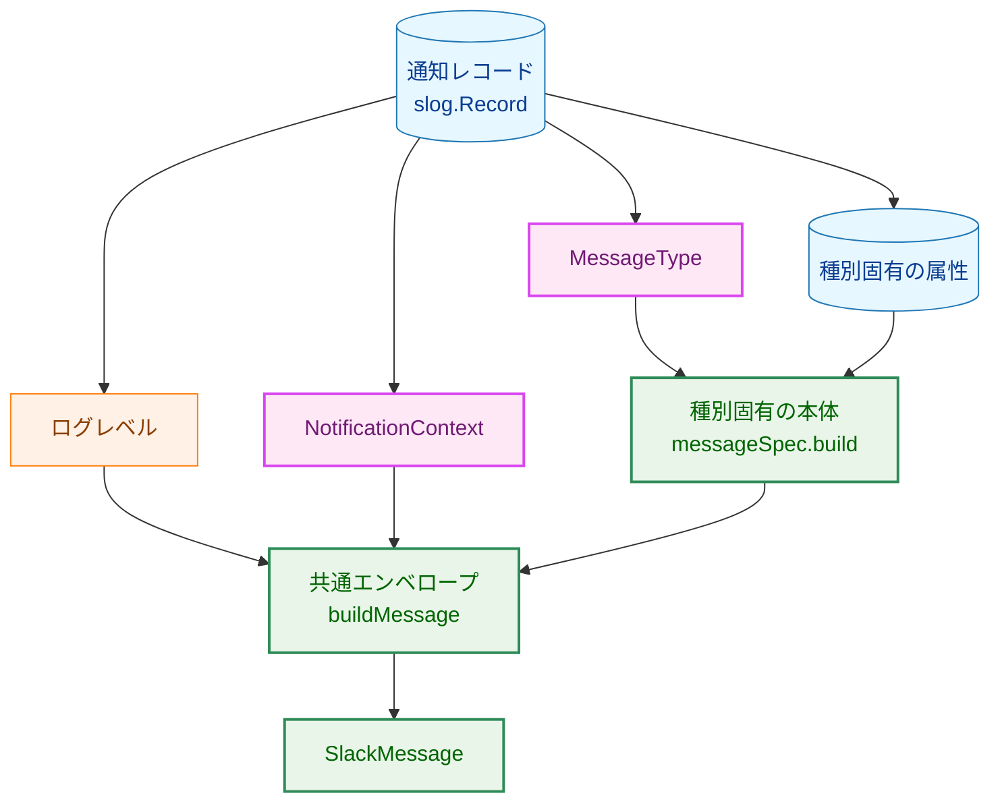

矢印 A → B は「A が B の入力になる」ことを表す。

**凡例**

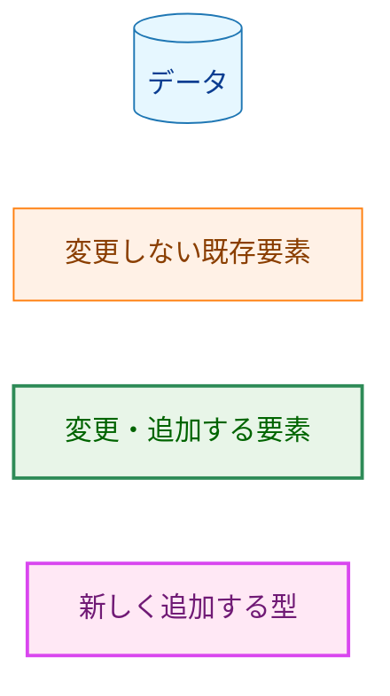

### 1.4 統一書式

Text 行は次の形に固定する。

```
[go-safe-cmd-runner] ✅ *SUCCESS* — group=backup : 3 commands in 1.2s
[go-safe-cmd-runner] ❌ *ERROR* — group=backup command=pg_dump : command failed (exit 2)
[go-safe-cmd-runner] ❌ *ERROR* — (global) : file_access_failed
```

先頭の `[go-safe-cmd-runner]` は送信元の製品名である。絵文字・`*STATUS*`・添付の色は、次の表のとおりログレベルだけで決まる。

| ログレベル | 絵文字 | STATUS | 色 |
|---|---|---|---|
| ERROR 以上 | ❌ | `ERROR` | `danger` |
| WARN 以上 ERROR 未満 | ⚠️ | `WARNING` | `warning` |
| INFO 以上 WARN 未満 | ✅ | `SUCCESS` | `good` |
| INFO 未満 | ⚠️ | `WARNING` | `warning` |

`slog` のレベルは整数値であり、上の表に挙げた代表値以外も表現できる。そのため判定は等値ではなく閾値で行う。INFO 未満を成功ではなく警告に倒すのは、想定していないレベルの通知を「成功」と名乗らせないためである。本番の 2 つのハンドラは `LevelModeExactInfo`（成功用 Webhook）と `LevelModeWarnAndAbove`（エラー用 Webhook）で生成される。`SlackHandler.Enabled` は前者では INFO 以外を、後者では WARN 未満を落とすため、INFO 未満の行も、INFO と WARN のあいだの行も本番では到達しない（`LevelModeDefault` は本番では使われない）。ただしこの除外はハンドラ生成時に渡すレベルモードに依存しており、`envelopeFor` 自身の性質ではないため、この分岐を持たせる。

**WARNING の行に本番の書き手がいないこと**。削除前に WARN で書かれていた通知は `privilege_escalation_failure` だけであり、これは削除対象である。削除後に残る 3 種別は INFO（グループ実行の成功）または ERROR（グループ実行の失敗、実行前エラー、user/group コマンドの失敗）でしか書かれない。したがって WARNING の 2 行は、将来の種別追加と想定外レベルに備えた定義であり、本番の通知としては現れない。

添付フィールドは、種別固有のフィールドを先に並べ、末尾に必ず Scope・Hostname・Run ID の 3 件をこの順で置く。`###` は使わず、強調は Slack の mrkdwn である `*...*` で表す。

3 つ目の例の要約は実行前エラーの種別名である。要件定義書の例は `config_parsing_failed` を挙げているが、この種別名は Slack ハンドラの登録前に起きる TOML の解析失敗でも、登録後に起きるグローバル設定の展開失敗やグループ選択の誤りでも使われる。すなわち Slack に出ることも出ないこともあり、例としては到達性を語れない。ここで `file_access_failed` を挙げているのは、Slack に必ず届く経路（グローバル対象ファイルの検証失敗）を持つ種別名を選んだためである。到達性の線引きは 3.5 の「Slack へ届く実行前エラーの範囲」に述べる。

### 1.5 設計判断の一覧

| 判断 | 内容 | 節 |
|---|---|---|
| 通知スコープの置き場所 | `internal/common` に型を置く。発火点は runner・audit・logging に分かれており、共通の依存先は `internal/common` だけである | 3.1 |
| スコープの受け渡し | `slog.LogValuer` を実装した 1 個の属性としてレコードに載せる。属性キーと読み出し関数も `internal/common` に置く | 3.1 |
| スコープの読み出し | 読み側は下位キーの文字列を直接見ず、`common.ScopeFromAttr` だけを使う | 3.1 |
| 種別名の置き場所 | `internal/common/logschema.go`。同ファイルは既に「書き側と読み側が共有する属性キー」を置く場所として使われている | 3.2 |
| 種別定義の形 | 種別名をキー、要約と固有フィールドを作る関数およびキュー優先度を値とするマップ。列挙型と `switch` を採らない理由は 3.2 に述べる | 3.2 |
| 優先度の解決位置 | `Handle` が種別定義を 1 回引き、結果を送信要求に載せる。送信側は種別名から優先度を引き直さない | 3.2 |
| 種別ごとの組み立て関数 | レコードだけを引数に取り、要約と固有フィールドだけを返す純粋な関数とする | 3.2 |
| 未登録種別の扱い | 汎用メッセージを送り、送信失敗ロガーへ WARN を記録する | 3.3, 4.1 |
| スコープの矛盾 | 補正せず `(scope: invalid)` と表示し、WARN を記録する | 3.1, 4.1 |
| `user_group_command_failure` の優先度 | 通常キューのまま。高優先度キューへは入れない | 3.2, 5.4 |
| 製品名の置き場所 | `internal/logging` の非公開定数。production コードでの利用者が `internal/logging` の外に無い | 3.3 |
| コマンド名の空の扱い | 設定の検証で空のコマンド名を拒否し、`CommandScope` は空のコマンド名を呼び出し側の誤りとして panic で拒否する | 3.1, 3.5 |
| グループ名の参照元 | `RuntimeCommand` は既に `TimeoutResolution.GroupName` としてグループ名を保持している。新しいフィールドを足さず、参照メソッドをこの値の上に置く | 3.5 |

---

## 2. システム構成

### 2.1 コンポーネント配置

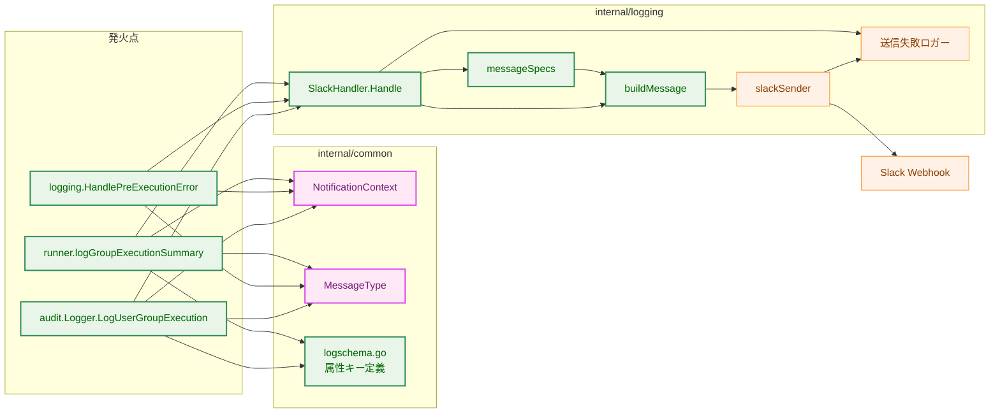

矢印 A → B は「A が B を利用する、または B へ値を渡す」ことを表す。発火点から `SlackHandler.Handle` への矢印は `slog` のハンドラ連鎖を経由する間接的な経路である。

**凡例**

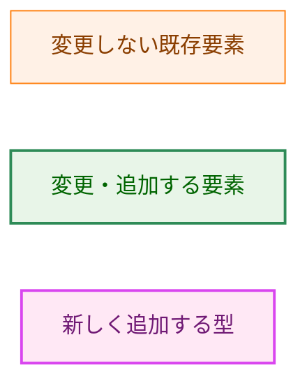

### 2.2 Before / After: 種別の列挙が 3 本から 1 本へ

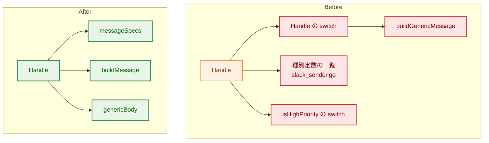

いずれの側でも矢印 A → B は「A が B を参照する」ことを表す。Before では種別定数の一覧・`Handle` の分岐・優先度判定が互いに独立に種別を列挙していたため、片方だけに登録された種別が生まれた。After では `Handle` が `messageSpecs` を 1 回だけ引き、組み立ても優先度もその結果から取る。`isHighPriority` は無くなる（3.2）。

**凡例**

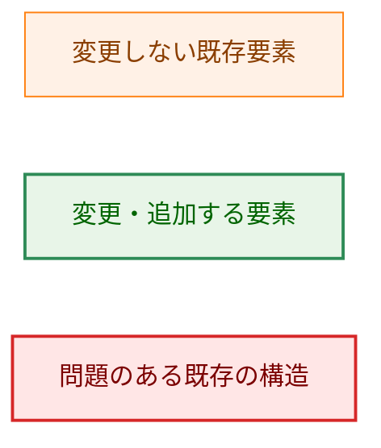

### 2.3 グループ検証エラーが通知に至るまで

グループ実行中の検証エラーは、現在グループ名を文字列に埋め込んで渡している。変更後はスコープとして渡す。

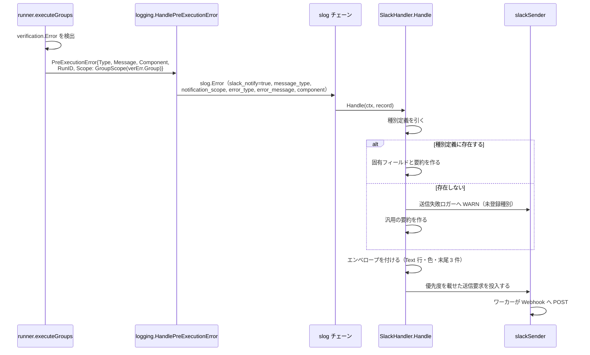

---

## 3. コンポーネント設計

### 3.1 通知スコープ（`internal/common`）

通知の発生箇所を、文字列の有無ではなく明示的な型から読み取れるようにする。型は `internal/common` に置く。発火点は `internal/runner`・`internal/runner/base/audit`・`internal/logging` の 3 パッケージに分かれており、これらが共通して依存できるのは `internal/common` だけであるためである。

```go
// NotificationScope は通知の発生箇所の粒度を表す。
type NotificationScope int

const (
    // ScopeGlobal はゼロ値。グループにもコマンドにも紐付かない通知を表す。
    ScopeGlobal NotificationScope = iota
    ScopeGroup
    ScopeCommand
)

// String は scope 属性に書き出す表現を返す（"global" / "group" / "command"）。
func (s NotificationScope) String() string

// NotificationContext は通知レコードに必ず付与する発生箇所の情報。
// フィールドは非公開であり、パッケージ外からはコンストラクタでしか構築できない。
type NotificationContext struct { /* 非公開フィールド */ }

func GlobalScope() NotificationContext
// GroupScope は group が空なら panic する。CommandScope は group か command の
// いずれかが空なら panic する。空の名前は呼び出し側のプログラミングエラーであり、
// 不正なコンテキストを生成しない。
func GroupScope(group string) NotificationContext
func CommandScope(group, command string) NotificationContext

// NotificationScopeAttrKey は通知レコード上でスコープを運ぶ属性のキー。
const NotificationScopeAttrKey = "notification_scope"

// LogValue は scope・group（および command）を持つグループ値を返す。
// scope は NotificationScope.String() の文字列、group と command は文字列である。
// コマンド名が無い場合は command 属性を出さない。
func (c NotificationContext) LogValue() slog.Value

// LogAttr は NotificationScopeAttrKey をキーとする 1 個の属性を返す。
func (c NotificationContext) LogAttr() slog.Attr

// ScopeFromAttr は LogAttr が書き出した値を読み戻す。次のいずれかに当たる場合は
// ok=false を返す。
//   - 値がグループ値でない
//   - scope が既知の 3 値でない
//   - scope が ScopeGroup か ScopeCommand でありながらグループ名が空である
//   - scope が ScopeCommand でありながらコマンド名が空である
//   - scope が ScopeGroup でありながらコマンド名が空でない
//   - scope が ScopeGlobal でありながらグループ名またはコマンド名が空でない
func ScopeFromAttr(v slog.Value) (c NotificationContext, ok bool)
```

読み側は `ScopeFromAttr` だけを使い、`scope`・`group`・`command` という下位のキー名を直接扱わない。下位キーの文字列を読み側にも書くと、書き側と読み側で 2 箇所に同じ知識が散らばり、`logschema.go` が防いでいる形の重複が再び生じる。

ゼロ値が `ScopeGlobal` であることには意味がある。`NotificationContext` のゼロ値を属性として明示的に記録した場合は、最も仮定の少ない解釈であるグローバルとして扱われる。一方、`notification_scope` 属性そのものが無いレコードは、対応するすべての発火点が明示的なコンテキストを付けるという不変条件に反するため、不正として扱う。

**構築の入口をコンストラクタに限る理由**。フィールドが公開されていると、グループ名を入れ忘れた `ScopeGroup` の値や、コマンド名を入れ忘れた `ScopeCommand` の値をパッケージ外で作れてしまう。そうした値は「グループ（コマンド）で起きたと主張しているのに、どのグループ（コマンド）か言えない」通知になる。`GroupScope` は空のグループ名を、`CommandScope` は空のグループ名と空のコマンド名を受け取ると panic し、値を返さない。空の名前は外部入力の検証エラーではなく、検証済みの名前を渡す発火点側のプログラミングエラーであるため、エラーを返して無視できる形にはしない。非公開フィールドとこの事前条件により、コンストラクタからデコーダーが不正とみなすコンテキストを生成できない。

**コマンド名が空の設定を先に拒否する**。上の事前条件が成り立つには、発火点へ届く時点でコマンド名が空でないことが保証されている必要がある。現在 `internal/runner/config/validation.go` はグループ名が空の設定を拒否する一方、コマンド名が空の設定は素通りさせており、`CommandScope(group, "")` が実在の設定から到達しうる。これは「補正せず、拒否する」に反する形であるため、設定の検証にコマンド名が空でないことの検査を足す（3.5）。これにより、コマンド名の空は設定の検証で拒否され、`CommandScope` へ届いた場合は呼び出し側の誤りであるという役割分担が成り立つ。

**余分な発生箇所の情報も矛盾として拒否する理由**。`scope=global` と名乗りながらグループ名やコマンド名を伴う値は、コンストラクタからは作れない組み合わせである。これを受け入れて `(global)` と描画すると、レコードに残っていた発生箇所の情報を黙って捨てたうえ、「グローバルで起きた」という誤った断定を通知に載せることになる。どちらの読み方が正しいのかを補正で決めてしまう形であり、「補正せず、拒否する」という本設計の立場に反する。同じ理由で、`scope=group` と名乗りながらコマンド名を伴う値も拒否する。いずれも `(scope: invalid)` と描画し、WARN を記録する（4.1）。

**矛盾した値をそれでも受け取りうる理由**。読み側の `SlackHandler` が見るのは `NotificationContext` そのものではなく、レコードに載った属性値である。属性はハンドラ連鎖を通るあいだに姿を変えうる。とくに `RedactingHandler` は、`slog.LogValuer` の解決に失敗した属性や、キー名が秘匿値のパターンに一致した属性を文字列の置き換え値に差し替える。その結果、読み側はグループ値ではなく文字列を受け取ることがある。`ScopeFromAttr` はこれを `ok=false` として返し、呼び出し側は 4.1 の扱いに従う。

**`GlobalScope()` の位置付け**。グローバルな通知の発火点も `Scope: common.GlobalScope()` と明示する。型のゼロ値は後方互換性のある global の値として保つが、発火点での省略を許す根拠にはしない。`SlackHandler` は各通知レコードに `notification_scope` 属性が存在することを確認し、属性が無ければ `(scope: invalid)` と描画して WARN を記録する。これにより、グローバルを意図した明示的な値と、コンテキストの付与漏れを区別する。

### 3.2 通知種別の単一定義

種別名は `internal/common/logschema.go` に置く。同ファイルは既に「書き側と読み側が共有する属性キー」を置く場所として使われており、種別名も同じ性質を持つ。

```go
// MessageType は通知レコードの message_type 属性の値。
type MessageType string

const (
    MessageTypeCommandGroupSummary     MessageType = "command_group_summary"
    MessageTypePreExecutionError       MessageType = "pre_execution_error"
    MessageTypeUserGroupCommandFailure MessageType = "user_group_command_failure"
)

// 通知レコードの制御属性のキー。現在は書き側 4 箇所と読み側 1 箇所が
// 同じ文字列リテラルを書いている。
const (
    SlackNotifyAttrKey = "slack_notify"
    MessageTypeAttrKey = "message_type"
)
```

`internal/logging` は、この種別名をキーとする種別定義のマップを 1 つだけ持つ。

```go
// messageBody は種別に固有の部分。エンベロープは含まない。
type messageBody struct {
    summary string                 // Text 行の ":" の右側に置く 1 行
    fields  []SlackAttachmentField // 種別固有の添付フィールド
}

// messageSpec は 1 つの通知種別の定義。
type messageSpec struct {
    highPriority bool                          // 高優先度キューへ入れるか
    build        func(slog.Record) messageBody // 種別固有の部分を作る
}

// messageSpecs は通知種別の唯一の定義である。
// 種別の一覧・メッセージの組み立て・キュー優先度は、すべてここから引く。
var messageSpecs = map[common.MessageType]messageSpec{ /* 3 種別 */ }
```

`messageSpecs` はパッケージ変数のリテラルであり、初期化のあとは書き換えない。登録用の API も設けない。`Handle` は任意の goroutine から呼ばれるため、初期化後に書き込む余地を残すとデータ競合になる。

**列挙型と `switch` ではなくマップを採る理由**。要件定義書はこの選択を設計に委ねている。`switch` による分岐は、`exhaustive` のような静的検査と相性が良い点で優れている。それでもマップを採るのは、本タスクが解決しようとしている問題が「分岐の網羅性」ではなく「同じ種別集合を 3 箇所が独立に列挙していること」だからである。優先度の判定と組み立ての分岐を別々の `switch` として書くと、列挙は再び 2 本になる。値としての集合があれば、両方をその集合から引けるうえ、テストが集合を `range` して全種別を検証できる（AC-26）。`switch` は集合を値として取り出せないため、この検証には並行リストを書き写すしかない。

**`string` と `MessageType` の境界**。レコードから読み取った `message_type` は任意の文字列でありうる。`Handle` はこれを `common.MessageType` へ変換して 1 回だけ `messageSpecs` を引き、見つからなければ未登録として扱う（4.1）。変換は検証ではなく、マップの検索が検証そのものである。

**優先度を送信側から引き直さない**。現在の `slackSender` は、送信要求の `messageType`（文字列）から `isHighPriority` で優先度を判定している。変更後は `Handle` が引いた種別定義の `highPriority` を送信要求に載せ、送信側はその値でキューを選ぶ。`isHighPriority` は削除する。これにより、`internal/logging` の中で種別集合を知るコードは `messageSpecs` の 1 箇所だけになる。送信要求が持つ `messageType` の文字列は、送信件数の種別別集計のキーとしてのみ残る。

**種別名の定数と `messageSpecs` は 2 度目の列挙になる**。上の集約だけでは AC-27 の「同じ種別集合を独立に列挙する箇所が他に無い」は満たせない。`internal/common` の `MessageType` 定数（書き側が種別を名乗るための名前）と `internal/logging` の `messageSpecs`（読み側の定義）は、依然として同じ集合を 2 箇所で列挙しているためである。定数だけを足して `messageSpecs` に足し忘れると、汎用メッセージへ落ちる。これは `user_group_command_failure` で実際に起きた欠陥と同じ形であり、7.2 の横断検証は `messageSpecs` を `range` するため、この漏れを捉えられない。

そこで `internal/common/logschema.go` に、定数を要素とする `AllMessageTypes` を定数宣言の直後に置く。

```go
// AllMessageTypes は定義済みの通知種別の全体である。
// 上の定数宣言との一致、および読み側の定義（logging.messageSpecs）との一致は、
// いずれもテストが検証する。
var AllMessageTypes = []MessageType{
    MessageTypeCommandGroupSummary,
    MessageTypePreExecutionError,
    MessageTypeUserGroupCommandFailure,
}
```

`internal/logging` のテストは `common.AllMessageTypes` を `range` して各要素が `messageSpecs` に登録されていることを確かめ、あわせて `len(messageSpecs) == len(common.AllMessageTypes)` を確かめる（7.2）。これで、定数を足して定義を足し忘れた場合も、定義を足して定数を足し忘れた場合も、実行時の WARN を待たずにビルドが赤くなる。

**`AllMessageTypes` 自身が 3 度目の列挙にならないようにする**。`AllMessageTypes` は定数宣言を書き写した 2 本目の列挙であり、それ自体は AC-27 が禁じている並行リストである。定数宣言の直後に置くという配置は「書き忘れない」という慣習にすぎず、慣習では不変条件を守れない。そこで、この一致も慣習ではなく検証で守る。`internal/common` のテストが `go/ast` で `logschema.go` を解析し、型が `MessageType` である定数宣言をソースから直接すべて集めて、その集合が `AllMessageTypes` と一致することを確かめる（7.2）。

この形にすると、種別集合の典拠は定数宣言 1 箇所だけになる。`AllMessageTypes`（テストが `range` できる値としての形）と `messageSpecs`（読み側の定義）は、いずれもその典拠との一致を機械的に検証される派生物であり、離れた箇所が黙って食い違う形は残らない。定数を足して `AllMessageTypes` に足し忘れても、`messageSpecs` に足し忘れても、ビルドが赤くなる。

**組み立て関数がレコードだけを引数に取る理由**。種別固有の部分に Run ID や Hostname は現れない。それらはエンベロープの担当である。引数をレコードだけにすると、種別ごとの組み立て関数は `SlackHandler` に依存しない純粋な関数になり、ハンドラを組み立てずに単体で検証できる。

**`user_group_command_failure` を高優先度にしない理由**。高優先度キューは、通常の通知が大量に発生したときに押し出されてはならない通知のために 0163 で設けられた。コマンドの失敗通知は、まさにその「大量に発生しうる通常の通知」の側である。失敗が多発した実行でこれを高優先度に入れると、`pre_execution_error` を押し出す側に回る。したがって通常キューのままとする。この判断が 0163 の脅威モデルに与える影響は 5.4 に述べる。

### 3.3 共通エンベロープ

Text 行と、添付の色、末尾 3 フィールドの生成は 1 箇所に集約する。

```go
// envelope はログレベルだけから決まる表示要素。
type envelope struct {
    emoji  string
    status string
    color  string
}

// envelopeFor はログレベルから表示要素を決める。種別は関与しない。
func envelopeFor(level slog.Level) envelope

// buildMessage は種別固有の本体にエンベロープを付けて SlackMessage を組み立てる。
// Text 行の製品名・スコープ表示、および末尾 3 フィールドの生成はここにしかない。
func (s *SlackHandler) buildMessage(r slog.Record, body messageBody) SlackMessage
```

製品名は `internal/logging` の非公開定数 1 つとして定義する。production コードでの利用者はエンベロープの組み立てだけであり、`internal/logging` の外から参照する必要が無い。

```go
// productName は全通知の Text 行の先頭に置く送信元の表示である。
const productName = "go-safe-cmd-runner"
```

汎用メッセージも `buildMessage` を通る。すなわち汎用メッセージも製品名・エンベロープ・末尾 3 フィールドを備える。汎用の本体は、要約をレコードの本文とし、固有フィールドを持たないものとする。

未登録種別と矛盾したスコープの WARN は、`slackSender` が持つ送信失敗ロガーへ記録する。現在 `SlackHandler` はこのロガーに触れておらず、記録はすべて `slackSender` 自身のメソッドから行われている。この所有関係を崩さないため、記録の入口を `slackSender` のメソッドとして 1 つ設け、`Handle` はそれを呼ぶ。

```go
// warn は送信失敗ロガーへ 1 件記録する。ハンドラ側から失敗ロガーへ書く経路はこれだけである。
func (sd *slackSender) warn(msg string, attrs ...slog.Attr)
```

### 3.4 種別ごとの固有部分

| 種別 | 要約 | 固有フィールド |
|---|---|---|
| `command_group_summary` | コマンド数と所要時間 | Command Count、Duration、各コマンドの結果（Command、出力、エラー出力） |
| `pre_execution_error` | エラー種別 | Error Message、Component |
| `user_group_command_failure` | コマンド名と終了コード | Command、Exit Code、Error Output |
| 未登録の種別 | レコードの本文 | なし |

`command_group_summary` の色は、これまで `status` 属性から決めていた。変更後はログレベルから決まる。発火点は成功なら INFO、エラーなら ERROR で書き出しており、`status` 属性とログレベルは同じ情報を二重に持っていた。したがって表示上の情報は失われない。`status` 属性そのものは構造化ログの属性として残す。

`user_group_command_failure` の固有フィールドを組み立てるには、書き側と読み側が属性キーを共有する必要がある。現在 `audit.Logger.LogUserGroupExecution` はキーを文字列リテラルで書いている。`internal/common/logschema.go` に属性キーの定義を追加し、書き側もそれを使う形に変える。ここで注意が要るのは、必要な 4 つのキーで既存の状況が揃っていないことである。

| キー | 既存の定義 | 扱い |
|---|---|---|
| `exit_code` | `common.LogFieldExitCode`（同じ値）、および削除対象の `PrivilegedCommandFailureAttrs.ExitCode` | 既存の `LogFieldExitCode` を再利用する |
| `stderr` | `common.LogFieldStderr`（同じ値）、および削除対象の `PrivilegedCommandFailureAttrs.Stderr` | 既存の `LogFieldStderr` を再利用する |
| `command_name` | 削除対象の `PrivilegedCommandFailureAttrs.CommandName` と `PrivilegeEscalationFailureAttrs.CommandName` のみ | 新たに定数を足す |
| `command_path` | 削除対象の `PrivilegedCommandFailureAttrs.CommandPath` のみ | 新たに定数を足す |

`command_name` に `common.LogFieldName` を流用しない。`LogFieldName` の値は `"name"` であって `"command_name"` ではなく、流用すれば書き側の属性キーが変わって監査ログのスキーマが理由なく壊れる。`LogField*` は `CommandResult` の構造化ログの語彙であり、監査ログの語彙とは別物である。削除対象の 2 つの属性構造体が消えたあと `command_name` と `command_path` の定義はどこにも残らないため、この 2 つは新規に足す必要がある。エラー出力の切り詰め長は現行の 500 文字を据え置き、既存の定数を再利用する。

要約と Scope の描画には表示上の制約がある。6.2 に定める。

### 3.5 発火点の変更

| 発火点 | 変更内容 |
|---|---|
| `runner.logGroupExecutionSummary` | `common.GroupScope(groupSpec.Name)` の属性を追加する。`group` 属性は現行どおり残す（構造化ログの利用者がいる） |
| `logging.HandlePreExecutionError` | 4 個の位置引数をやめ、`*PreExecutionError` を受け取る形に変える。`PreExecutionError` に `Scope` フィールドを追加する |
| `runner.executeGroups` | 検証エラーの `Group: %s, ` という接頭辞を文字列から取り除き、`common.GroupScope(verErr.Group)` として渡す |
| `audit.Logger.LogUserGroupExecution` | 失敗時の属性に `common.CommandScope(cmd.GroupName(), cmd.Name())` を追加する |
| `runnertypes.RuntimeCommand` | 参照メソッド `GroupName()` を追加する。返す値は既存の `TimeoutResolution.GroupName` である |

**コマンド名の空を設定の検証で拒否する**。`audit.Logger.LogUserGroupExecution` が渡す `cmd.Name()` は設定から来る値である。`internal/runner/config/validation.go` の `ValidateGroupNames` はグループ名が空の設定を `ErrEmptyGroupName` で拒否しているが、コマンド名についてはどの検証も空を拒否していない。そのため `name` を書き忘れたコマンドが設定として通り、`CommandScope(group, "")` が実在の設定から到達しうる。設定の読み込み時にコマンド名が空でないことを検査し、空であれば専用のセンチネルエラーで拒否する。検証の位置は `ValidateGroupNames` と同じ、`config.Loader` が設定を読み込む経路である。これは通知のためだけの検査ではない。名前を持たないコマンドは、ログでも監査記録でも指し示せないためである。

**`HandlePreExecutionError` の引数**。既存の `PreExecutionError` 型をそのまま受け取る形にする。同じ内容を運ぶ構造体を 2 つ持たないためである。呼び出し元は `cmd/runner/main.go` の 5 箇所と `internal/runner/runner.go` の 1 箇所である。このうち `main.go` の 1 箇所は既に `*PreExecutionError` を手元に持っており、そのまま渡せる。他の呼び出し元は構造体リテラルを組み立てる。エラーの詳細文字列は既存の `Detail()` メソッドから得る。

この変更で Run ID の取得元が変わる。現在 `main.go` の該当箇所は、エラー値が持つ `RunID` ではなく呼び出し側の変数を渡している。構造体を渡す形にすると `PreExecutionError.RunID` が使われる。production の構築箇所（`cmd/runner/main.go`、`internal/runner/bootstrap/config.go`、`internal/runner/bootstrap/environment.go`）はいずれも `RunID` を設定しているため、送出される `run_id` は変わらない。ただしこれは型が強制する性質ではないため、`run_id` が空でないことを検証するテストを置く（7.1）。

**Slack へ届く実行前エラーの範囲**。Slack のハンドラは、TOML から `slack_allowed_host` を読んだ後でなければ登録できない。そのため `cmd/runner/main.go` では設定の読み込みが済んだ後に `bootstrap.SetupSlackLogging` を呼ぶ。この順序の帰結として、実行前エラーは Slack へ届くものと届かないものに分かれる。

| 到達性 | 実行前エラーの例 |
|---|---|
| Slack へ届く | グローバル設定の展開失敗、テンプレート検証の失敗、グローバル対象ファイルの検証失敗、起動時ディレクトリ権限監査の失敗、グループ選択の誤り、グループ実行中の検証失敗（`runner.executeGroups`） |
| Slack へ届かない | TOML ファイル自体の読み込みと解析の失敗（`bootstrap.LoadAndPrepareConfig` まで）、ログレベル引数の誤り、ログファイルの開設失敗、Webhook URL の検証失敗、`--run-id` の書式違反、ビルド時設定の誤り、特権の放棄失敗 |

**到達性は `ErrorType` の値では決まらない**。この分かれ目は発生の時点であって種別名ではない。`logging.ErrorTypeConfigParsing`（`config_parsing_failed`）は、`SetupSlackLogging` の前（TOML の解析、ログレベル引数、Webhook 環境変数の検証）でも後（グローバル設定の展開、テンプレート検証、グループ選択）でも使われるため、Slack へ届く側と届かない側の両方に現れる。`logging.ErrorTypeFileAccess` も同様である。したがって「この種別名は Slack に出ない」と読める整理は成り立たず、1.4 と 7.3 もこの前提で書いてある。

届かない側は、ハンドラが未登録であることに加えて、`cmd/runner/main.go` の一部の経路が通知の flush を経ずに終了することにもよる。この範囲は本タスクの変更前後で変わらない。すなわち本設計はこの欠落を作りもしないが直しもしない。書式の統一とスコープの付与という要件の範囲を超えるためである。運用上の含意は 5.4 に、テストの対象選定への影響は 7.3 に述べる。

**`HandleExecutionError` は変更しない**。この経路は `slack_notify=false` であり Slack へ届かないため、スコープ属性を足しても通知には現れない。要件でも対象外としている。

**グループ名の参照元**。`RuntimeCommand` は新しいフィールドを持たない。`NewRuntimeCommand` は受け取った `groupName` をタイムアウト解決の文脈へ渡しており、その結果である `TimeoutResolution` は `GroupName` を公開フィールドとして保持している。すなわちグループ名は既に保持されている。参照メソッドをこの値の上に置けば、同じ値を持つフィールドが 2 個できることを避けられる。`RuntimeCommand` を構造体リテラルで組み立てているのはテスト補助関数だけであり、それらは `TimeoutResolution` を設定しないため `GroupName()` は空文字列を返す。本番の生成経路は `NewRuntimeCommand` の 1 本であり、通知経路を通る値はすべてそこを通る。

### 3.6 削除する 3 種別

`security_alert`、`privilege_escalation_failure`、`privileged_command_failure` を、書き側・読み側・スキーマ定義・テストから削除する。削除は種別ごとに独立した 1 コミットとし、1 件ずつ revert できる形にする。

| 種別 | 削除対象 |
|---|---|
| `privileged_command_failure` | 種別定数、`Handle` の分岐、`buildPrivilegedCommandFailure`、`common.PrivilegedCommandFailureAttrs` |
| `security_alert` | `audit.Logger.LogSecurityEvent`、`common.SecurityAlertAttrs`、`common.SeverityCritical`、`common.SeverityHigh`、種別定数、`Handle` の分岐、`buildSecurityAlert`、高優先度判定のエントリ |
| `privilege_escalation_failure` | `audit.Logger.LogPrivilegeEscalation`、`common.PrivilegeEscalationFailureAttrs`、種別定数、`Handle` の分岐、`buildPrivilegeEscalationFailure`、高優先度判定のエントリ |

`LogPrivilegeEscalation` を削除しても、特権昇格が行われたことの記録は失われない。`privilege/unix.go` の `logElevationOutcome` が、昇格が行われた場合の結果（native root 実行、`seteuid` による昇格）を INFO で記録するためである。ただし昇格そのものに失敗した場合、この関数は何も記録しない。失敗は `WithPrivileges` の戻り値のエラーとして呼び出し元へ伝わる。この「失敗時に監査記録が残らない」状態は現在も同じであり、削除によって新たに生じるものではない。

削除に伴って消えるテストの扱い、および高優先度キューの検証テストの書き換えは 7 章に定める。

### 3.7 クラス図

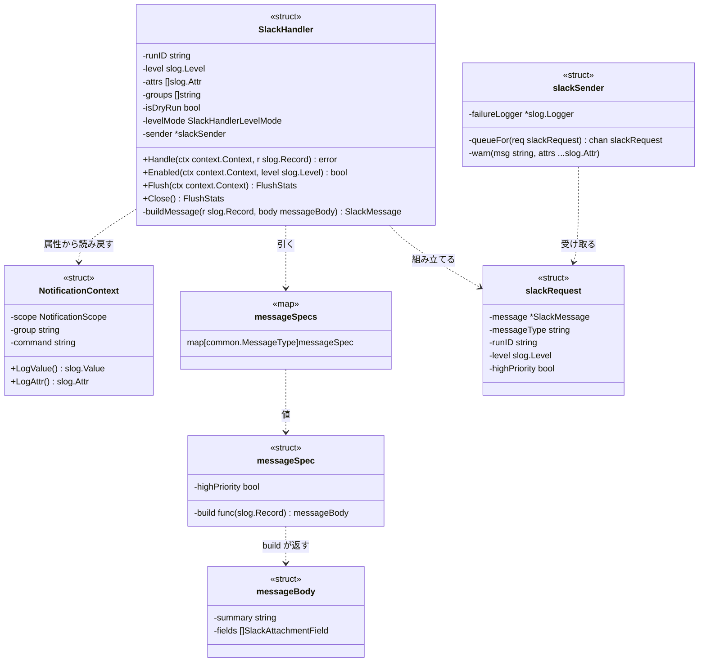

破線の矢印 A ..> B は「A が B に依存する（利用する、または生成する）」ことを表す。この図は色分けを使わないため凡例を持たない。

`NotificationContext`、`messageSpecs`、`messageSpec`、`messageBody` は本タスクで追加する。`SlackHandler`・`slackSender`・`slackRequest` は既存であり、図に挙げた既存のフィールドとメソッドは現行のソースの形である。本タスクで加わるのは `SlackHandler.buildMessage`、`slackSender.warn`、`slackRequest.highPriority` であり、`queueFor` の引数が種別名から送信要求へ変わる。`isHighPriority` は削除する。

### 3.8 コンポーネント責務表

| ファイル | 区分 | 責務 | 更新が必要な既存テスト |
|---|---|---|---|
| `internal/common/notification_scope.go` | 新規 | `NotificationScope`、`NotificationContext`、コンストラクタ、属性への変換と読み戻し | — |
| `internal/common/logschema.go` | 変更 | `MessageType` と種別名、制御属性のキー、`user_group_command_failure` の属性キー追加、削除する 3 種別の属性キーと重大度定数の削除 | `internal/common/logschema_test.go` |
| `internal/logging/message_spec.go` | 新規 | 種別定義のマップ、種別ごとの組み立て関数 | — |
| `internal/logging/slack_handler.go` | 変更 | `Handle` を種別定義の参照に変更、`buildMessage` によるエンベロープの集約、削除する 3 種別の組み立て関数の削除 | `internal/logging/slack_handler_test.go`（`TestSlackHandler_Handle_WithMockServer` の削除 3 ケース、汎用メッセージのケース、書式の期待値） |
| `internal/logging/slack_sender.go` | 変更 | 種別定数の移設、`isHighPriority` の削除と優先度の受け取り、`warn` の追加、種別に触れる doc コメントの修正 | `internal/logging/slack_sender_test.go`（`securityAlertRecord` を存続種別へ置換、優先度・内訳の期待値） |
| `internal/logging/pre_execution_error.go` | 変更 | `PreExecutionError` に `Scope` を追加、`HandlePreExecutionError` の引数を構造体化 | `internal/logging/pre_execution_error_test.go` |
| `internal/runner/runner.go` | 変更 | グループサマリとグループ検証エラーへのスコープ付与、重複したグループ名接頭辞の削除 | `internal/runner/runner_test.go` |
| `internal/runner/base/runnertypes/runtime.go` | 変更 | `GroupName()` の追加 | `internal/runner/base/runnertypes/runtime_test.go` |
| `internal/runner/config/validation.go` | 変更 | コマンド名が空の設定を拒否する検証の追加（3.5） | `internal/runner/config/validation_test.go` |
| `internal/runner/config/errors.go` | 変更 | 空のコマンド名を表すセンチネルエラーの追加 | — |
| `internal/runner/base/audit/logger.go` | 変更 | スコープ付与、属性キーの共有化、`LogSecurityEvent` と `LogPrivilegeEscalation` の削除 | `internal/runner/base/audit/logger_test.go`（削除される 6 テスト、`LogUserGroupExecution` の属性検証） |
| `cmd/runner/main.go` | 変更 | `HandlePreExecutionError` の呼び出し形式の変更（5 箇所） | `cmd/runner/main_test.go`、`cmd/runner/integration_slack_flush_test.go`（`pre_execution_error` のレコードを組み立てている） |
| `internal/runner/e2e_slack_webhook_separation_test.go` | 変更 | 未登録種別 `test_warning` を使っており、変更後は WARN が記録される。宛先分離の検証意図を保ったまま、登録済み種別または WARN を織り込んだ形へ直す | 同左 |
| `internal/runner/bootstrap/logger_test.go` | 変更 | 送信内訳の文字列（`sent_by_message_type`）を検証している | 同左 |
| `docs/dev/architecture_design/security-architecture.ja.md` | 変更 | セキュリティイベントの Slack 通知を提供すると記している箇所を、削除後の実態に合わせて修正する | — |
| `docs/dev/architecture_design/security-architecture.md` | 変更 | 上記の翻訳（`/mktrans`） | — |
| `docs/dev/architecture_design/slack_async_delivery.ja.md` | 変更 | 高優先度キューの根拠を「セキュリティアラート等」と記している箇所を、存続する `pre_execution_error` に合わせて修正する | — |
| `docs/dev/architecture_design/slack_async_delivery.md` | 変更 | 上記の翻訳（`/mktrans`） | — |
| `README.ja.md` | 変更 | Slack 統合の説明から、セキュリティイベントのリアルタイム通知という記述を削除し、実際に通知される内容に合わせる | — |
| `README.md` | 変更 | 上記の翻訳（`/mktrans`） | — |
| `docs/user/security-risk-assessment.ja.md` | 変更 | 高優先度キューの保持対象を「セキュリティアラート等」から `pre_execution_error` に合わせて修正する | — |
| `docs/user/security-risk-assessment.md` | 変更 | 上記の翻訳（`/mktrans`） | — |
| `docs/user/runner_command.ja.md` | 変更 | 通知種別・統一書式・Scope 表示・製品名の記載 | — |
| `docs/user/runner_command.md` | 変更 | 上記の翻訳 | — |

---

## 4. エラーハンドリング設計

### 4.1 通知の組み立てで起こりうる異常

通知の組み立ては失敗しない。異常な入力を受け取っても、通知を送ることをやめず、異常であることを通知と運用ログの双方に残す。通知を止めると、通知が来ないことと異常が起きていないことを運用者が区別できなくなるためである。

| 異常 | 通知の表示 | 記録 |
|---|---|---|
| 種別定義に無い `message_type`（空文字列を含む） | 汎用メッセージ。エンベロープは通常どおり付く | 送信失敗ロガーへ WARN。種別の値を含める |
| scope がグループまたはコマンドなのにグループ名が空 | Scope の表示が `(scope: invalid)` | 送信失敗ロガーへ WARN |
| scope がコマンドなのにコマンド名が空 | 同上 | 同上 |
| scope がグローバルなのにグループ名またはコマンド名が空でない | 同上 | 同上 |
| scope がグループなのにコマンド名が空でない | 同上 | 同上 |
| スコープ属性がグループ値でない（秘匿値の置き換えなどで文字列に変わった場合を含む） | 同上 | 同上 |
| scope の値が既知の 3 値でない | 同上 | 同上 |
| スコープ属性そのものが無い | `(global)` | 記録しない。ゼロ値の解釈として正当である |

「属性が無い」場合だけをグローバルとして扱い、「属性はあるが読めない」場合を無効として扱うのは、後者がグループ実行中のエラーをグローバルなエラーとして誤って伝えうるためである。これは本タスクが取り除こうとしている誤認そのものである。読み戻しの分岐は既知の 3 値を明示的に扱い、それ以外を無効へ倒す。

空の `message_type` を未登録として扱う点は補足を要する。`slack_notify=true` を持ちながら種別を名乗らないレコードは、まさに登録漏れが起きたときの見え方である。これを黙って汎用へ落とすと、今回直そうとしている欠陥がそのまま残る。

新しいエラー型は追加しない。上記はいずれも通知の内容と WARN の記録として表現され、`Handle` の戻り値には現れない。`Handle` がエラーを返すのは、同期送信モードで送信そのものが失敗した場合だけであり、この扱いは変更しない。

### 4.2 記録先と副作用の境界

WARN の記録先は `slackSender` が持つ送信失敗ロガーである。Slack へ送らないハンドラだけで構成されており、記録が新たな Slack 送信を誘発しない（0163 の設計による）。

ドライランでは送信機構そのものを生成しない（0163 §3.4.10）。したがってドライランで抑止される外部副作用と、それに伴う本設計の挙動は次のとおりである。

| モード | Webhook への HTTP 送信 | メッセージの組み立て | 未登録種別・矛盾スコープの WARN |
|---|---|---|---|
| 通常 | 行う | 行う | 記録する |
| ドライラン | 行わない | 行わない | 記録しない |
| 送信機構が終了済み | 行わない | 行わない | 記録しない |

ドライランと終了後の経路でメッセージを組み立てないのは 0163 が定めた既存の挙動であり、本設計はこれを変えない。その帰結として、未登録種別の WARN もこれらの経路では出ない。運用上の含意は、種別の登録漏れをドライランでは検出できないことである。この検出はテスト（7 章）で担保する。ドライランに WARN のためだけの組み立て経路を足すと、外部副作用を持たないモードで通知の組み立てだけが走るという例外を作ることになり、0163 の境界を崩す。

---

## 5. セキュリティ考慮事項

### 5.1 脅威モデル

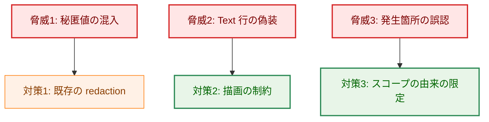

矢印 A → B は「脅威 A に対して対策 B を取る」ことを表す。

**凡例**

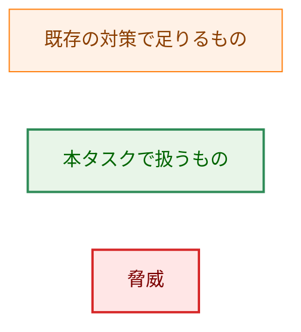

**脅威1: 秘匿値の混入**。通知にはコマンドの標準出力と標準エラー出力が載る。これらの秘匿値の除去は `internal/redaction` が担っており、本設計は適用範囲を変えない。切り詰め長（標準出力 1000 文字、標準エラー出力 500 文字）も据え置く。

この対策には表示上の副作用がある。`RedactingHandler` は値の中に秘匿値のパターンを含む文字列を置き換えるため、`key_rotation` のようなグループ名や `refresh_token` のようなコマンド名は、Scope の表示でも置き換え後の文字列になる。グループ名についてはこれまでも構造化ログで同じことが起きていたが、本設計はこれを Slack のプッシュ通知に出る Text 行へも持ち込む。運用者が Scope に置き換え文字列を見た場合、それは不具合ではなく redaction の結果である。この挙動は受け入れる。redaction の適用範囲を通知経路だけ緩めることは、秘匿値の漏洩という重い失敗と引き換えになるためである。

メッセージ全体の大きさには上限を設けない。`command_group_summary` は最大 100 件のコマンド結果を運び、1 件あたり標準出力 1000 文字と標準エラー出力 500 文字であるため、最大でおよそ 150 KB になりうる。Slack が過大なペイロードを 4xx で拒否した場合、現在の送信処理は 4xx を再試行しないため、その通知は失われ、送信失敗ロガーにのみ残る。この上限と失敗の形は本タスクの変更前から存在し、本設計はフィールドを数件足すだけで桁を変えない。上限の導入は別タスクとする。

**脅威2: Text 行の偽装**。Text 行の先頭に置く製品名は、同じチャンネルへ複数のツールが投稿する運用で送信元を見分けるための表示であり、送信元の認証ではない。エンベロープが行の骨格を組み立てるとはいえ、要約とスコープはその行の中へ埋め込まれる。ここに制約が要る。グループ名は設定の読み込み時に文字種が検証されるため安全だが、コマンド名には文字種の検証が無く、汎用メッセージの要約はレコードの本文そのものである。改行を含む値をそのまま置くと、本物の見出し行の直下に任意の行を作れる。したがって 6.2 のとおり、Text 行に入る値は 1 行に正規化し、長さの上限を設ける。

**脅威3: 発生箇所の誤認**。スコープの値は TOML のグループ名と、実行中のコマンド名からのみ作られる。いずれも設定ファイル（ハッシュ検証の対象）と実行経路に由来し、コマンドの出力からは作られない。グループ名は設定の読み込み時に空でないことと文字種が検証されるため、`(scope: invalid)` は設定によっては到達しない。すなわちこの表示は、利用者の設定ミスではなく、属性の欠落やハンドラの不具合を捉えるための防御である。加えて 4.1 のとおり、矛盾したスコープは補正されず表に出る。

### 5.2 削除が新たな危険を作らないこと

削除する 3 種別のうち、`security_alert` と `privilege_escalation_failure` は書き手が本番に無く、`privileged_command_failure` は書き手そのものが存在しない。したがって削除によって失われる本番の通知は無い。特権昇格の記録が残ることと、その記録の限界は 3.6 に示した。

削除後は、セキュリティイベントの Slack 通知という機能が production コードから無くなる。この機能が存在すると記している文書は、開発者向けだけでなく利用者向けにもある。いずれも削除と同じフェーズ（8 章のフェーズ 4）で記述を実態に合わせる。

| 文書 | 現在の記述 | 直し方 |
|---|---|---|
| `docs/dev/architecture_design/security-architecture.ja.md` | セキュリティイベントの Slack 通知を提供すると記している | 削除後の実態に合わせる |
| `docs/dev/architecture_design/slack_async_delivery.ja.md` | 高優先度キューの根拠を「セキュリティアラート等」と記している | 存続する `pre_execution_error` に合わせる |
| `README.ja.md`（96 行目付近） | Slack 統合の説明を「セキュリティイベントのリアルタイム通知」としている | 実際に通知される内容（グループ実行の結果と実行前エラー）に合わせる |
| `docs/user/security-risk-assessment.ja.md`（301 行目付近） | 高優先度キューが「セキュリティアラート等」を保持すると記している | `pre_execution_error` に合わせる |

英語版（`security-architecture.md`、`slack_async_delivery.md`、`README.md`、`docs/user/security-risk-assessment.md`）は、いずれも日本語版を先に直したうえで `/mktrans` によって反映する。日英を直接両方編集しない（3.8）。

これらの文書の修正は本設計書の変更には含まれない。実装フェーズで行う。

### 5.3 外部サービス機能の検証（Slack）

本設計は Slack の新しい API 機能を採用しない。使うのは既に稼働している `text` フィールドと legacy attachments のみである。むしろ、Slack の mrkdwn が解釈しない Markdown の見出し記法（`###`）への依存をやめる変更である。`*...*` による強調と `text` フィールドの mrkdwn 解釈は現行の実装が既に依存している範囲に収まる。

検証は対象クライアント環境である Slack に対して、`make slack-notify-test` と `make slack-group-notification-test` を実行して行う。実装時に確認する項目は次のとおりである。

| 確認項目 | 期待 |
|---|---|
| Text 行の `*SUCCESS*` などの強調 | 太字として表示される |
| Text 行の `—`（em dash）と `[...]` | そのまま表示され、書式指定として解釈されない |
| プッシュ通知の表示 | Text 行が先頭から表示され、製品名が読み取れる |
| 添付の色 | `good` / `warning` / `danger` が従来どおり反映される |

現時点（設計時点）ではこの実機確認は未実施である。`###` が見出しにならないことは要件定義の調査で確認済みであり、`*...*` は Slack の mrkdwn の基本記法であるため機能しないリスクは低いと判断する。それでも、上記の確認を実装フェーズの完了条件に含める（8 章）。仮に強調が期待どおり表示されない環境があった場合の代替は、強調記法を外して素の文字列にすることである。Text 行の構造（製品名・絵文字・STATUS・スコープ・要約の並び）は強調記法に依存しないため、この代替でも要件は満たせる。

### 5.4 他の設計文書のポリシーへの例外

**元のポリシー**。0163 の設計（`docs/tasks/0163_redaction_coverage_and_slack_async/02_architecture.md` §3.4.2 および同文書の高優先度キューの表）は、高優先度キューへ入れる種別を `security_alert`、`privilege_escalation_failure`、`pre_execution_error` の 3 つと定めている。容量 32 という値も「セキュリティアラートと特権昇格失敗が 1 回の実行で 32 件を超える状況は既に異常事態である」という理由づけで選ばれている。同文書の脅威モデルには「キュー溢れでセキュリティアラートが Slack に届かない。コマンドの終了コードに影響を与えられる攻撃者は、これを意図的に誘発できる」という項目があり、優先度分離がその対策として挙げられている。

**本設計が例外を作る理由**。そのうち 2 種別を削除するため、高優先度種別は `pre_execution_error` の 1 つだけになる。高優先度キューという仕組み自体は残す。`pre_execution_error` は設定の検証失敗やグループの検証失敗を伝える通知であり、コマンドの実行結果通知が大量に発生したときに押し出されてはならないという 0163 の判断はこの種別にそのまま当てはまる。容量 32 も据え置く。1 回の実行で発生しうる `pre_execution_error` はグループ数を上限とし、32 を超える構成は稀であるうえ、超えた場合も破棄は 1 件ずつ記録される。

**受け入れる残余リスク**。0163 の脅威項目が指していた「押し出されては困る通知」は、削除後には存在しない。削除後にコマンドの失敗を伝えるのは `command_group_summary`（エラー側）と `user_group_command_failure` であり、いずれも通常キューにある。コマンドの終了コードに影響を与えられる攻撃者は、失敗を大量に起こして通常キュー（容量 128）を溢れさせ、自分に不都合な失敗通知を Slack から落とせる。この経路を塞ぐには失敗通知を高優先度へ移すことになるが、それでは高優先度キューが「氾濫する側」で埋まり、`pre_execution_error` を守れなくなる（3.2）。したがってこのリスクは受け入れる。運用上の担保は 2 つある。破棄は種別ごとに 1 件ずつ運用ログへ記録されること、および flush 時の集計に種別別の送信・破棄件数が出ることである。Slack の通知が想定より少ない実行を調べる場合は、この集計を確認する必要がある。

なお 3.5 に述べたとおり、実行前エラーのうち設定の読み込み段階で起きるものは、キューの容量とは無関係にそもそも Slack へ届かない。通知の欠落を調べる際は、この 2 つの原因を区別する必要がある。

**旧挙動を表明している既存テスト**。次のテストが削除される種別を使って高優先度キューの挙動を検証しており、存続する `pre_execution_error` を使う形へ書き換える必要がある。

- `internal/logging/slack_sender_test.go` のヘルパー `securityAlertRecord`（`messageTypeSecurityAlert` の高優先度レコードを作る）
- 同ファイルのキュー溢れの表駆動テストの「high priority queue」ケース
- 同ファイルの送信内訳の集計テスト（`sent_by_message_type` に `security_alert` を期待している）

これらは 0163 が導入した検証であり、検証している性質（優先度分離、溢れの記録、種別別の集計）は本設計でも維持される。変わるのは使う種別だけである。

---

## 6. 処理フロー詳細

### 6.1 メッセージ組み立てのフロー

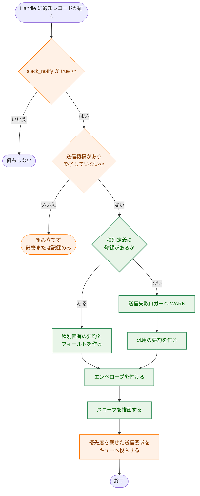

矢印 A → B は「A の次に B を行う」ことを表す。分岐の矢印のラベルは判定の結果である。

**凡例**

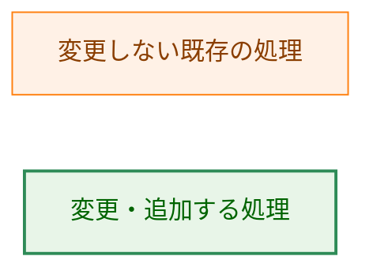

### 6.2 スコープと要約の描画

レコードから読み戻したスコープを、Text 行と Scope フィールドに置く 1 つの文字列へ変換する。両者は同じ文字列を使う。

| 読み戻しの結果 | グループ名 | コマンド名 | 表示 |
|---|---|---|---|
| グローバル（明示された属性） | — | — | `(global)` |
| 属性なし | — | — | `(scope: invalid)` |
| グループ | あり | — | `group=<グループ名>` |
| コマンド | あり | あり | `group=<グループ名> command=<コマンド名>` |
| コマンド | あり | なし | `(scope: invalid)` |
| グループまたはコマンド | なし | — | `(scope: invalid)` |
| グローバル | あり | — | `(scope: invalid)` |
| グローバル | — | あり | `(scope: invalid)` |
| グループ | あり | あり | `(scope: invalid)` |
| 読み戻しに失敗（4.1） | — | — | `(scope: invalid)` |

グループ名またはコマンド名を欠いたスコープを `(scope: invalid)` とするのは、スコープの主張に必要な発生箇所の情報がそろっていないためである。コマンドスコープをグループ名だけで描画すると、コマンド名を欠いた通知が正常なグループスコープの通知と見分けられなくなり、AC-17 が黙って満たされない状態を作る。コマンド名は設定の検証（3.1、3.5）と `CommandScope` の事前条件の双方で空を排しているため、この行に本番の書き手はいない。

逆に、スコープの主張よりも多くの発生箇所の情報を伴う値も `(scope: invalid)` とする。グローバルと名乗りながらグループ名を持つ値を `(global)` と描画すると、残っていた発生箇所の情報を捨てたうえで誤った断定を通知に載せることになる（3.1）。

**Text 行に入る値の制約**。スコープの名前と要約は、いずれも Text 行の中に埋め込まれる。次の制約を課す。

| 制約 | 実現方法 | 理由 |
|---|---|---|
| 改行と制御文字を含めない | C0 制御文字（U+0000〜U+001F）と DEL（U+007F）を 1 文字ずつ半角空白へ置き換える | 改行を通すと、本物の見出し行の直下に任意の行を作れる（5.1 の脅威2） |
| Slack の制御構文（`&`、`<`、`>`）を解釈させない | 埋め込む前に `&`→`&amp;`、`<`→`&lt;`、`>`→`&gt;` へ置き換える | `<!channel>` や `<@U012345>` を含むコマンド名・要約がメンションとして解釈されること、`<URL｜表示文字>` の形が見える文字列を書き換えることを防ぐ（5.1 の脅威2） |
| mrkdwn の記号（`*`、`` ` ``、`_`、`~`）を強調として解釈させない | 埋め込む前に強調に使われない類似字形へ置き換える（`*`→`∗` U+2217、`` ` ``→`ˋ` U+02CB、`_`→`ˍ` U+02CD、`~`→`∼` U+223C） | コマンド名や本文の記号で行の書式が崩れるのを防ぐ |
| 長さに上限を設け、超えた分は切り詰める | 置き換え後の各補間値を UTF-8 で 500 byte 以下に切り詰める | Text 行はプッシュ通知に出る 1 行であり、長大な本文が入ると読めなくなる |

**書式の解釈を止めるのではなく、埋め込む値の側を書き換える理由**。Slack には「この項目だけ mrkdwn として解釈しない」という項目別の切り替えが無い。ペイロードの `mrkdwn` を false にすると、エンベロープ自身の `*STATUS*` の強調も同時に失われる。したがって、スコープ名と要約という補間される値の側を、Text 行へ置く前に無害化する。

置き換えの順序は、C0 制御文字と DEL の置き換え、`&`・`<`・`>` の置き換え、mrkdwn 記号の置き換え、切り詰めの順に固定する。`&` の置き換えを先に行わないと、後段が入れた `&amp;` の `&` が二重に置き換えられる。mrkdwn 記号の置き換えは `&amp;` のような実体参照の中に該当文字を作らないため、この順序で干渉は起きない。

切り詰めは 500 byte を越えない最大の接頭辞を採る。ただし、末尾が不完全な UTF-8 rune、またはこの処理が生成する `&amp;`・`&lt;`・`&gt;` の途中になってはならず、その場合は当該 rune または実体参照全体を取り除く。したがって、切り詰め後の値は常に有効な UTF-8 であり、裸の `&am` や `&l` を末尾に残さない。上限を表す定数は `textInterpolatedValueMaxBytes = 500` とし、スコープ名と要約で共有する。

この制約は Text 行に埋め込む値にだけ課す。添付フィールドの値（標準出力・標準エラー出力など）は現在の切り詰め規則のままとする。

---

## 7. テスト戦略

### 7.1 単体テスト

| 対象 | 検証する内容 | 対応 AC |
|---|---|---|
| `common.NotificationContext` | ゼロ値がグローバルとして扱われること、各コンストラクタが作った値を `LogAttr` と `ScopeFromAttr` で往復できること、`GroupScope("")`、`CommandScope("", command)`、`CommandScope(group, "")` が panic して値を生成しないこと | AC-09 |
| `common.NotificationContext.LogValue` | `scope` と `group` が含まれ、コマンド名が無い場合に `command` 属性が出ないこと | AC-10 |
| `common.ScopeFromAttr` | グループ値でない値、既知でない `scope` の値、グループ名が空の group/command スコープ、コマンド名が空の command スコープ、グループ名またはコマンド名を伴う global スコープ、コマンド名を伴う group スコープを `ok=false` として返すこと | AC-12 |
| スコープの描画 | 6.2 の表の全行（属性なし、および余分な発生箇所の情報を伴うスコープが `(global)` ではなく `(scope: invalid)` になり WARN を記録することを含む） | AC-12, AC-15 |
| Text 行に入る値の制約 | LF と CR、および U+0000〜U+001F と U+007F の各制御文字を含むコマンド名・本文が 1 行に正規化されること。500 byte の境界直前・境界上・境界直後について、ASCII、多 byte rune、`&amp;`・`&lt;`・`&gt;` の各ケースが rune や実体参照の途中で切れないこと | AC-18 |
| `envelopeFor` | ログレベルと絵文字・STATUS・色の対応が 1.4 の表のとおりであること（INFO 未満を含む） | AC-19 |
| 種別ごとの組み立て関数 | 要約と固有フィールドの内容 | AC-23 |
| `buildMessage` | Text 行の形、末尾 3 フィールドの並び、`###` を含まないこと | AC-18, AC-20, AC-21, AC-22, AC-33 |
| 未登録種別 | 汎用メッセージが送られ、WARN が記録されること | AC-24, AC-25 |
| 優先度の受け渡し | 種別定義の `highPriority` が送信要求に載り、キューの選択がその値だけで決まること | AC-27 |
| 設定の検証 | コマンド名が空の設定が専用のセンチネルエラーで拒否されること（`errors.Is` で検証する） | AC-17 |
| `RuntimeCommand.GroupName` | `NewRuntimeCommand` に渡したグループ名を返すこと | AC-16 |
| `logGroupExecutionSummary` | グループスコープの属性が載ること | AC-11 |
| `HandlePreExecutionError` | スコープを含む構造体を受け取り、属性として載せること。`run_id` が空でないこと | AC-11 |
| `LogUserGroupExecution` | 失敗時にコマンドスコープの属性が載ること | AC-11, AC-17 |

AC-09 のうち「コンストラクタ以外の方法でパッケージ外から構築できない」は、実行時ではなくコンパイル時の性質である。フィールドを公開すれば通る形のテストは、壊しても失敗しないため意味を持たない。この半分は静的な確認として扱う（型が `internal/common` に非公開フィールドで宣言されていること）。実行時のテストは、ゼロ値の解釈と往復の検証を受け持つ。

### 7.2 全種別を横断する検証

エンベロープの充足は、種別を書き写した表ではなく種別定義のマップを `range` して検証する。各種別について、代表的なレコードを組み立て、Text 行が製品名で始まること、`*STATUS*` を含むこと、`###` を含まないこと、末尾 3 フィールドが Scope・Hostname・Run ID の順であることを確かめる。エンベロープを満たさない種別を 1 つ足すとこのテストが失敗する（AC-26）。

代表的なレコードは種別定義から作れないため、種別名をキーとするテスト側の入力表を持つことになる。この表に行が無い種別があればテストを失敗させる。こうすると、種別を足したときに検証から漏れるのではなく、入力の追加を促す形で失敗する。

あわせて、書き側の種別名と読み側の定義の一致を別のテストで確かめる（3.2）。`common.AllMessageTypes` を `range` して各要素が `messageSpecs` に存在することと、`len(messageSpecs) == len(common.AllMessageTypes)` の 2 点である。前者だけでは `messageSpecs` にしか無い種別を捉えられず、後者だけでは要素の入れ替わりを捉えられないため、両方を置く。

さらに、`AllMessageTypes` が定数宣言を写し漏らしていないことを `internal/common` のテストで確かめる（3.2）。`go/ast` でパッケージのソース（`logschema.go`）を解析し、型が `MessageType` である定数宣言をすべて集めて、その集合が `AllMessageTypes` と一致することを検証する。ソース集合を直接 `range` するため、`AllMessageTypes` を並行リストとして手で保守する必要が無くなる。種別の定数を足して `AllMessageTypes` に足し忘れると、このテストが落ちる。

### 7.3 統合テスト

| 対象 | 検証する内容 | 対応 AC |
|---|---|---|
| グループ検証エラーからの通知 | Scope にグループ名が出ること、Error Message から `Group: <名前>, ` の接頭辞が消えていること | AC-13, AC-14 |
| グローバルな実行前エラーからの通知 | Scope が `(global)` であること | AC-15 |
| user/group コマンドの失敗通知 | グループ名とコマンド名の双方が出ること、コマンド名と終了コードが含まれること | AC-17, AC-23 |
| 宛先分離 | INFO が成功用 Webhook、WARN 以上がエラー用 Webhook へ送られること（既存の挙動が変わらないこと） | AC-31 |
| 実機確認 | `make slack-notify-test` と `make slack-group-notification-test`（5.3 の確認項目） | AC-18 |

AC-15 の検証に使う実行前エラーは、Slack のハンドラが登録された後に起きるもの（グローバル対象ファイルの検証失敗など）から選ぶ。TOML 自体の解析失敗はそもそも Slack へ届かないため（3.5）、これを題材にすると、production では通知が出ないのにテストだけが緑になる。題材は種別名ではなく発生の時点で選ぶ。`config_parsing_failed` は登録前にも登録後にも使われる種別名であり、名前だけでは到達性が決まらないためである。

### 7.4 セキュリティテスト

| 対象 | 検証する内容 | 対応する脅威 |
|---|---|---|
| redaction の適用 | 秘匿値を含むコマンド出力とスコープ名が、通知の Text 行と添付フィールドの双方で置き換えられること | 脅威1 |
| Text 行の偽装（改行・制御文字） | LF、CR、および値の途中に置いた各 C0 制御文字（U+0000〜U+001F）と DEL（U+007F）を含むコマンド名・レコード本文を表駆動で与えても、各文字が半角空白に置き換わり、Text 行が 1 行のままで偽の見出し行が作られないこと | 脅威2 |
| Text 行の偽装（Slack の制御構文） | `<!channel>`、`<@U012345>`、`<https://example.com｜正常終了>` を含むコマンド名・要約を与えても、`<` と `>` が `&lt;`・`&gt;` として送られ、メンションやリンクとして解釈されないこと。`&` を含む値が `&amp;` として送られること | 脅威2 |
| Text 行の偽装（mrkdwn） | `*`、`` ` ``、`_`、`~` を含むコマンド名・要約を与えても、エンベロープの `*STATUS*` 以外に強調が生じないこと | 脅威2 |
| スコープの誤認 | スコープ属性を文字列に差し替えたレコードが `(global)` ではなく `(scope: invalid)` になること | 脅威3 |

### 7.5 削除に伴うテストの扱い

削除で消えるテストは `TestLogger_LogSecurityEvent`、`TestLogSecurityEvent_Masking`、`TestLogSecurityEvent_DetailsRedaction`、`TestLogSecurityEvent_DetailsKeyCollisionPrevention`、`TestLogger_LogPrivilegeEscalation`、`TestLogPrivilegeEscalation_Masking`、および `internal/logging/slack_handler_test.go` の該当ケースである。各削除コミットで `go tool cover -func` を削除の前後で比較し、存続する関数のカバレッジが下がっていないことを確認し、結果をコミットメッセージに記す（AC-06）。

`TestLogSecurityEvent_DetailsRedaction` と `TestLogSecurityEvent_DetailsKeyCollisionPrevention` は、`audit.Logger` の秘匿値マスクと属性キーの衝突回避を検証している。これらの性質は `LogSecurityEvent` に固有ではなく `Logger` 全体の性質であるため、カバレッジの比較で存続関数の低下が見つかった場合は、存続する `LogUserGroupExecution` または `LogRiskProfile` を使う形で検証を残す。

高優先度キューの検証は、削除される `security_alert` ではなく存続する `pre_execution_error` で書き直す。優先度判定を常に低優先度へ倒すとこのテストが失敗する（AC-07）。

削除後に `make deadcode` を実行し、新たな到達不能コードが報告されないことを確認する（AC-08）。

### 7.6 テストが主張する理由で失敗できること

各テストについて、検証対象の挙動を壊すと失敗することを確認し、その旨をコミットメッセージに記す（AC-32）。具体的には、スコープの矛盾検出を素通りさせる、未登録種別の WARN を外す、末尾 3 フィールドの並びを入れ替える、製品名の付与を外す、といった改変で該当テストが落ちることを確かめる。

エンベロープの検証では、層の取り違えに注意する。Text 行が製品名で始まることと、Scope が `(global)` であることは、いずれもエンベロープの担当である。種別ごとの組み立て関数がこれらを返さないことを別途確かめることで、エンベロープの集約（AC-22）が実際に効いていることを示す。

---

## 8. 実装優先順位

| フェーズ | 内容 | 対応 AC |
|---|---|---|
| 1 | `privileged_command_failure` の削除 | AC-01, AC-04, AC-06 |
| 2 | `security_alert` の削除 | AC-02, AC-04, AC-06, AC-07 |
| 3 | `privilege_escalation_failure` の削除 | AC-03, AC-04, AC-05, AC-06 |
| 4 | `make deadcode` の確認、日本語版文書（`security-architecture.ja.md`、`slack_async_delivery.ja.md`、`README.ja.md`、`docs/user/security-risk-assessment.ja.md`）の記述更新および `/mktrans` による英語版への反映 | AC-08 |
| 5 | `common.NotificationContext` の追加 | AC-09, AC-10 |
| 6 | 種別定義の集約（`MessageType`、`messageSpecs`、`Handle` の書き換え、`isHighPriority` の削除） | AC-23, AC-24, AC-27 |
| 7 | エンベロープの集約（`buildMessage`、`envelopeFor`、製品名、描画の制約） | AC-18, AC-19, AC-20, AC-21, AC-22, AC-25, AC-33 |
| 8 | スコープの伝搬（`GroupName()`、`HandlePreExecutionError`、3 発火点、コマンド名が空の設定を拒否する検証） | AC-11, AC-12, AC-13, AC-14, AC-15, AC-16, AC-17 |
| 9 | 全種別を横断する検証とセキュリティテストの追加 | AC-26 |
| 10 | 実機確認と利用者向けドキュメント | AC-28, AC-29 |

フェーズ 1 から 3 は種別ごとに独立したコミットとする。フェーズ 6 と 7 は順序を入れ替えられない。エンベロープの集約は、種別ごとの組み立て関数が固有部分だけを返す形になっていることを前提とするためである。各コミットの時点で `make test` と `make lint` が通ることを確認する（AC-30）。

---

## 9. 将来の拡張性

**種別を追加するとき**。`internal/common/logschema.go` に種別名を足し、`messageSpecs` に定義を足す。優先度も同じ定義に書く。追加を忘れた場合は汎用メッセージへ落ちるが、WARN が記録されるため無言では通らない。7.2 の横断検証も入力表の追加を促す形で失敗する。

**削除した種別を作り直すとき**。セキュリティイベントや特権昇格失敗の通知が必要になった場合は、別タスクとして起票する。本設計の構造では、書き手・種別定義の 2 点を揃えることが追加の条件になる。書き手のない種別が再び残ることは、7.2 の横断検証が入力表を要求することで起きにくくなる。

**実行前エラーの通知範囲を広げるとき**。3.5 のとおり、設定の読み込み段階で起きる実行前エラーは Slack へ届かない。これを届かせるには、Webhook の許可ホストを TOML から読む現在の順序（0068 と 0091 の設計に由来する）を変えるか、許可ホストを設定に依存しない形で先に決める必要がある。いずれも通知の書式とは別の問題であり、別タスクとして扱う。

**送信元表示を設定可能にするとき**。製品名は現在 1 つの定数である。チャンネルごとの表示名を設定できるようにする場合は、この定数を `SlackHandlerOptions` の項目へ移し、既定値を現在の定数とする。エンベロープの組み立てが 1 箇所に集まっているため、変更はその 1 箇所に収まる。

**スコープの粒度を増やすとき**。`NotificationScope` に値を足し、コンストラクタ、`ScopeFromAttr` の既知の値、描画の対応表（6.2）に行を足す。描画と読み戻しはいずれも既知の値を明示的に扱い、それ以外を無効へ倒すため、値だけ足して他を足し忘れた場合は無効として表に出る。

---

## 付録A: 受け入れ基準と設計の対応

| AC | 対応する節 |
|---|---|
| AC-01 〜 AC-04 | 3.6、8 |
| AC-05 | 3.6 |
| AC-06 | 7.5 |
| AC-07 | 5.4、7.5 |
| AC-08 | 7.5、8 |
| AC-09, AC-10 | 3.1、7.1 |
| AC-11 | 3.5、7.1 |
| AC-12 | 3.1、4.1、6.2、7.1、7.4 |
| AC-13, AC-14 | 3.5、7.3 |
| AC-15 | 6.2、7.3 |
| AC-16 | 3.5、7.1 |
| AC-17 | 3.1、3.4、3.5、6.2、7.1、7.3 |
| AC-18 | 1.4、3.3、6.2、7.1、7.3 |
| AC-19 | 1.4、3.3、7.1 |
| AC-20 | 1.4、3.3、7.1 |
| AC-21 | 1.4、3.3、7.1 |
| AC-22 | 3.3、7.6 |
| AC-23 | 3.4、7.1 |
| AC-24 | 4.1、7.1 |
| AC-25 | 3.3、4.1、7.1 |
| AC-26 | 7.2 |
| AC-27 | 3.2、7.1、7.2 |
| AC-28, AC-29 | 3.8、8 |
| AC-30 | 8 |
| AC-31 | 7.3 |
| AC-32 | 7.6 |
| AC-33 | 3.3、7.1 |

## 付録B: 決定履歴

本文は変更後の姿を述べている。ここには、検討して採らなかった案とその理由を残す。

**種別定義を `internal/logging` だけに置く案**。種別名も定義も `internal/logging` に閉じれば依存が 1 パッケージで済む。採らなかったのは、書き手である `internal/runner` と `internal/runner/base/audit` が種別名を必要とし、`internal/logging` を取り込むと依存の向きが増えるためである。`internal/common/logschema.go` は既に「書き側と読み側が共有する属性キー」の置き場所であり、種別名もそこに属する。

**`HandlePreExecutionError` に引数を 2 個取らせる案**。`(e *PreExecutionError, scope common.NotificationContext)` とすれば、エラー型に通知専用のフィールドを足さずに済む。採らなかったのは、スコープを渡し忘れてもコンパイルが通ってしまい、渡し忘れが「グローバルなエラー」として黙って通るためである。エラー値の側に置けば、エラーを組み立てた場所がスコープの持ち主になる。`Error()` と `Detail()` の出力には `Scope` を含めない。

**`HandlePreExecutionError` 用に新しい引数構造体を作る案**。既存の `PreExecutionError` とほぼ同じ内容を持つ型が 2 つできる。既存の型に `Scope` を足して受け渡しに使う方が、運ぶ情報の定義を 1 つに保てる。

**`RuntimeCommand` に `groupName` フィールドを足す案**。要件定義書はこの形を想定していた。設計時に確認したところ、`NewRuntimeCommand` が受け取ったグループ名は既に `TimeoutResolution.GroupName` として保持されていた。同じ値を持つフィールドを 2 個置くと、両者を一致させる不変条件を誰も守らない形になるため、参照メソッドを既存の値の上に置く形へ変えた。AC-16 は「生成時に渡されたグループ名を参照メソッドから返す」という挙動の要求であり、この形でも満たされる。

**スコープの矛盾をコンストラクタからエラーで返す案**。`GroupScope` が `(NotificationContext, error)` を返す形も検討した。採らなかったのは、空のグループ名は検証済みの名前を渡す発火点側のプログラミングエラーであり、呼び出し側がエラーを無視して通知を続行できる形にすべきでないためである。`GroupScope` は空のグループ名を、`CommandScope` は空のグループ名と空のコマンド名を panic で拒否する。なお、属性はハンドラ連鎖で変形しうるため、`ScopeFromAttr` の検証も別の防御層として残す。

**`command_group_summary` の `status` 属性を削除する案**。色とアイコンの決定に使われなくなるため削除も検討したが、構造化ログの属性としては引き続き意味を持つ。ログの互換性を壊す理由が無いため残す。

**通知の型名を `NotificationScope` に寄せる案**。値の型が `NotificationContext`、粒度の列挙が `NotificationScope` という名前は、Go では `context.Context` を連想させる点で理想的ではない。それでも要件定義書が承認済みの名前としてこの組を定めているため、設計では変更しない。名前を変えるなら要件定義書と合わせて行う。
