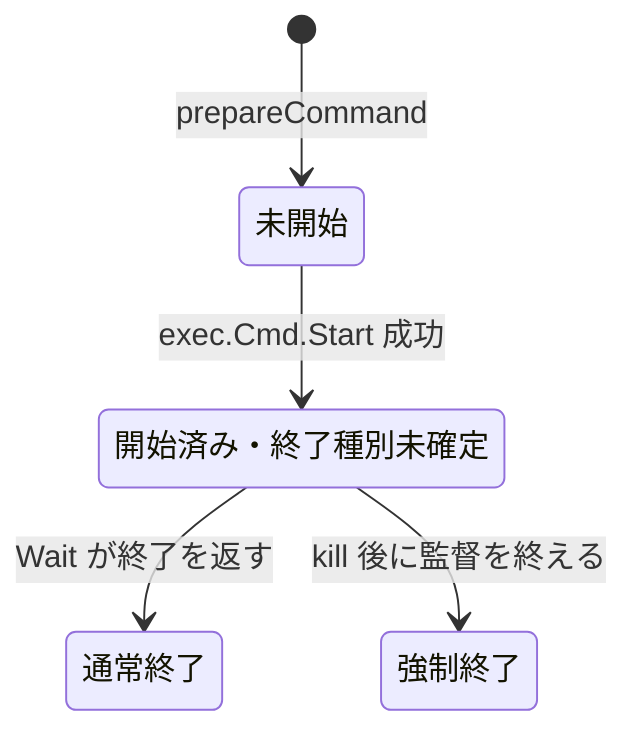
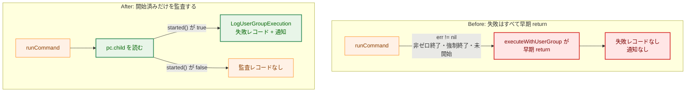
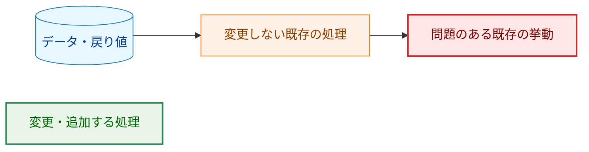
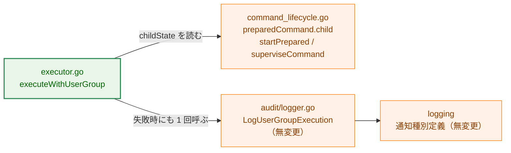
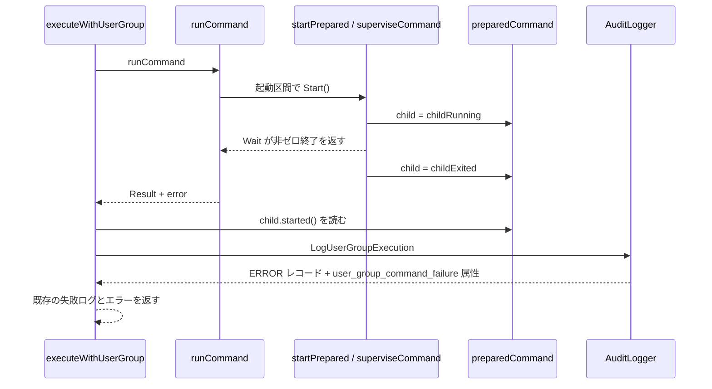

# アーキテクチャ設計書: run-as コマンド失敗時の監査記録と `user_group_command_failure` 通知の配線

## Document Status

| Item | Value |
|---|---|
| Status | `draft` |
| Created | 2026-09-14 |
| Review date | `-` |
| Reviewer | `-` |
| Comments | `-` |

## 関連文書

- 要件定義書: [01_requirements.md](01_requirements.md)
- 出発点: [0172 実装計画書 §10 の follow-up](../0172_slack_notification_message_unification/03_implementation_plan.md#10-次のステップ)
- 通知種別定義・共通エンベロープ: [0172 アーキテクチャ設計書 §3.4・§3.5](../0172_slack_notification_message_unification/02_architecture.md)
- 実行の 3 フェーズと起動区間: [0171 アーキテクチャ設計書 §1.3](../0171_privilege_gap_narrowing/02_architecture.md)

## 用語

| 用語 | 意味 |
|---|---|
| run-as 実行 | `run_as_user`／`run_as_group` を指定したコマンド実行。`executeWithUserGroup` が担う |
| 開始済みの失敗 | `exec.Cmd.Start()` が成功した子プロセスが、非ゼロ終了または強制終了した失敗 |
| 未開始の失敗 | 事前検証・`prepareCommand`・`Start()`・昇格の起動区間で失敗し、子プロセスが一度も走っていない失敗 |
| 実行状態 | `preparedCommand.child` が宣言する子プロセスの状態（`childState`） |
| 監査レコード | `audit_type=user_group_execution` の構造化ログ 1 件。成功は INFO、失敗は ERROR |
| 失敗レコード | `LogUserGroupExecution` が `ExitCode != 0` のときに書く ERROR レコード。`user_group_command_failure` 通知属性を載せる |
| 成功レコード | 同じ関数が `ExitCode == 0` のときに書く INFO レコード |
| 配線 | 開始済みの失敗経路から `LogUserGroupExecution` を呼び、失敗レコードと通知を発生させること |

---

## 1. 設計の全体像

### 1.1 このタスクが解決する問題

[`executeWithUserGroup`](../../../internal/runner/base/executor/executor.go) は `runCommand` の結果に対し `if err != nil` で早期リターンする。`runCommand` は子プロセスが非ゼロで終了すると非 nil のエラーを返すため、その後の `LogUserGroupExecution` 呼び出しに到達しない。結果として、開始済みの run-as 失敗は失敗レコードも `user_group_command_failure` 通知も生まない。

素直な修正は「`err != nil` のときも `LogUserGroupExecution` を呼ぶ」だが、そのままでは未開始の失敗にも呼んでしまう。`runCommand` の失敗経路には、子プロセスが一度も開始していない場合が含まれるためである。

ここで `Result.ExitCode` を開始の目印にすることはできない。タイムアウトやシグナルで強制終了した子プロセスも `os.ProcessState.ExitCode()` は `-1`（`ExitCodeUnknown`）を返し、未開始の失敗が返すプレースホルダの `Result` と同じ値になる（[`group_executor_timeout_test.go`](../../../internal/runner/group_executor_timeout_test.go) がこの値を固定している）。エラー文字列の内容による判定も同様に禁止する（CLAUDE.md「Declare, don't infer」）。

したがって本設計は、**子プロセスの開始と終了の種別を実行コンテキスト上の列挙値として宣言し、監査の可否をその値だけで決める**。

### 1.2 設計原則

1. **事実は起きた場所で宣言する。** 子プロセスが開始したという事実は `Start()` が成功した `startPrepared` で状態を進める。監査時点の状態から遡って推測しない。
2. **判別の根拠を型に置く。** 監査の可否は `ExitCode` の値でもエラー文字列でもなく、`preparedCommand.child` の列挙値で決める。
3. **零値を「何も走っていない」にする。** 状態の零値 `childNotStarted` は、開始を主張しない値とする。
4. **実行 1 回につき監査レコードは 1 件。** 成功（`err == nil`）は成功レコード、開始済みの失敗（`err != nil`）は失敗レコードとし、両方を書かない。分岐の条件を `err` の一方に閉じることで排他にする。
5. **既存の意味論を変えない。** `Result` の値の意味、`LogUserGroupExecution` の分岐と属性、0172 の通知種別定義・メッセージ書式は変更しない。本設計が足すのは、失敗分岐に到達する配線だけである。

### 1.3 概念モデル: 実行状態の遷移



| 状態 | 監査 | 備考 |
|---|---|---|
| `childNotStarted` | 0 件 | Start を実行しない失敗、または `prepareCommand` 失敗 |
| `childRunning` | （監査時点では観測されない） | 開始の事実を `Start()` 成功の時点で記録する中間状態 |
| `childExited` | 1 件（INFO または ERROR） | 実際の終了コードを `Result` に持つ |
| `childTerminated` | 1 件（ERROR） | `ExitCodeUnknown` を持つ |

`childTerminated` は、タイムアウト・キャンセルによる kill、開始後の起動区間失敗による kill、kill 後も回収できなかった場合を含む。いずれも子プロセスは開始しているので監査対象である。

監査の判断は `runCommand` が戻った後に行うため、実際に観測されるのは `childNotStarted`・`childExited`・`childTerminated` のいずれかである。`childRunning` は、開始の事実を `Start()` 成功の時点で記録するために置く。将来 `superviseCommand` より前に戻る経路が足されても、開始済みの実行が未開始に戻ることはない。

---

## 2. システム構成

### 2.1 現在と本設計後の比較



**凡例（Legend）**



### 2.2 コンポーネント配置



### 2.3 データフロー（開始済みの非ゼロ終了）



---

## 3. コンポーネント設計

### 3.1 `childState` 型

`internal/runner/base/executor/command_lifecycle.go` に、子プロセスの開始と終了の種別を表す列挙型を足す。既存の `execBinding`・`killStrategy`・`stagingCleanupStrategy` と同じく、零値を「未宣言」とし、宣言し忘れが安全側に倒れる形にする。

```go
// childState declares what became of the prepared command's child process.
type childState int

const (
    // childNotStarted is the zero value: no child was ever started, so the
    // run owes no audit record.
    childNotStarted childState = iota
    // childRunning: Start succeeded; the supervision phase has not yet
    // declared how the child ended.
    childRunning
    // childExited: the child was reaped and its exit status was read.
    // Result.ExitCode is that status.
    childExited
    // childTerminated: the child was started and then force-killed
    // (cancellation, timeout, or a start-phase failure after it was
    // running), or could not be reaped after the kill. Result.ExitCode is
    // ExitCodeUnknown.
    childTerminated
)

// started reports whether a run in this state executed a child, and so owes
// exactly one audit record.
func (s childState) started() bool
```

`started` は `childRunning`・`childExited`・`childTerminated` を `true`、`childNotStarted` を `false` とする。宣言済みの 3 状態を明示的に列挙し、どれにも一致しない値は `false` に倒す。これは「一度も開始していない実行を監査しない」という要件の禁止側を守るためであり、監査への記録漏れは §7.1 の遷移テストが状態ごとに検出する。

### 3.2 `preparedCommand` への追加と遷移を刻む場所

`preparedCommand` に `child childState` を足す。遷移を刻むのは次の 3 箇所だけとする。

| 場所 | 遷移 | 根拠 |
|---|---|---|
| `startPrepared` の `pc.execCmd.Start()` 成功直後 | `childNotStarted` → `childRunning` | `Start()` が成功した唯一の場所 |
| `superviseCommand` の kill・回収・drain が終わった直後 | `childRunning` → `childExited` または `childTerminated` | 終了の種別が確定する唯一の場所 |
| `runCommand` の `!opened`・`!started`、`reportStartFailure`、`prepareCommand` 失敗 | 遷移なし（零値のまま） | 子プロセスが一度も走っていない |

`childExited` は `killed == false` で Wait が返った場合、`childTerminated` は kill 経路を通った場合とする。`superviseCommand` は戻る直前に必ずどちらかを代入する。

### 3.3 `executeWithUserGroup` の監査分岐

`runCommand` の直後にある既存の失敗分岐へ、監査の呼び出しを足す。

```go
if err != nil {
    if pc.child.started() {
        e.auditUserGroupExecution(ctx, cmd, result, startTime, metrics)
    }
    // 既存の failureAttrs と "User/group privilege execution failed" はそのまま
    return result, fmt.Errorf("user/group privilege execution failed: %w", err)
}

e.auditUserGroupExecution(ctx, cmd, result, startTime, metrics)
return result, nil
```

- 開始済みなら `result` は必ず非 nil である（`superviseCommand` が `Result` を組んでから戻る）。
- `prepareCommand` の失敗経路は `runCommand` より前に return するため、状態が零値のまま監査されない。
- 成功経路は既存どおり無条件に 1 回だけ記録する。`err == nil` は強制終了も開始失敗も含まないため、開始済みである。
- `err != nil` と `err == nil` は排他なので、成功レコードと失敗レコードが二重に出ることはない。

### 3.4 監査ヘルパ（1 実行 1 レコードの一元化）

成功・失敗の両経路で同じ記録を組み立てるため、既存の監査ブロックをメソッドへ切り出す。

```go
// auditUserGroupExecution writes the single user_group_execution record for
// one executeWithUserGroup run. nil AuditLogger is a no-op.
func (e *DefaultExecutor) auditUserGroupExecution(
    ctx context.Context,
    cmd *runnertypes.RuntimeCommand,
    result *Result,
    startTime time.Time,
    metrics audit.PrivilegeMetrics,
)
```

中身は既存の `audit.ExecutionResult` の組み立てと `LogUserGroupExecution` の呼び出しをそのまま移す。属性・時間計測・redaction は変えない。

### 3.5 変更しないもの

| 対象 | 理由 |
|---|---|
| `LogUserGroupExecution` の分岐と属性 | 0172 の定義を維持する（01 §対象外）。本設計は分岐へ到達させるだけ |
| `Result` の公開フィールドと `ExitCode` の意味 | 開始・終了の種別は `preparedCommand` に閉じる。`Result` は既存の利用者に影響しない |
| 通知種別定義・共通エンベロープ・メッセージ書式 | 0172 §3.4・§3.5 を変更しない |
| タイムアウト・kill の挙動 | 強制終了の条件・シグナル・grace 時間は変えない |
| 監査の redaction・出力上限 | `LogUserGroupExecution` と `Result` の既存処理を通る |

### 3.6 コンポーネント責務表

| コンポーネント | 責務 | 本設計での変更 |
|---|---|---|
| `startPrepared` | 子プロセスの起動 | 成功時に `child = childRunning` |
| `superviseCommand` | 子プロセスの終了・回収・出力の取り込み | 終了種別の確定時に `child` を更新 |
| `preparedCommand.child` | 開始・終了種別の宣言 | 新設 |
| `executeWithUserGroup` | run-as 実行の統括と監査の呼び出し | 失敗分岐で開始済みのときだけ監査 |
| `auditUserGroupExecution` | 1 実行 1 件の監査記録 | 新設（既存ブロックのメソッド化） |
| `LogUserGroupExecution` | レコードの内容と通知属性の決定 | 無変更 |

---

## 4. エラーハンドリング設計

**新しいエラー型は導入しない。** 戻り値のエラー、終了コード、既存の失敗ログは変えない。

`runCommand` の失敗経路と、それぞれの監査の扱いは次のとおりである。

| 失敗の種類 | `childState` | `Result` | 監査 |
|---|---|---|---|
| 事前検証・run-as 恒等性解決の失敗 | 零値 | `nil` | なし |
| `prepareCommand` 失敗 | 零値 | `ExitCodeUnknown` のプレースホルダ | なし |
| 起動区間が `Start` を実行しなかった（昇格拒否） | 零値 | `nil` | なし |
| `Start()` 失敗 | 零値 | `ExitCodeUnknown` のプレースホルダ | なし |
| 非ゼロ終了 | `childExited` | 実際の終了コード | 失敗レコード |
| タイムアウト・キャンセル・開始後の起動区間失敗による kill | `childTerminated` | `ExitCodeUnknown` | 失敗レコード |
| 出力上限による中断で子がシグナル終了 | `childExited` | `ExitCodeUnknown` または実際の終了コード | 失敗レコード（`ExitCode != 0` のため） |
| 成功（終了コード 0） | `childExited` | `0` | 成功レコード |

補足: 出力上限エラー（`writeErr`）はランナー側の失敗だが、子プロセスが 0 で終了していた場合は `ExitCode == 0` のため成功レコードになる。これは 0172 の「レコードのレベルは子プロセスの終了コードで決まる」という定義どおりであり、ランナー側の失敗は既存の `User/group privilege execution failed` の ERROR ログが伝える。本設計はこの意味論を変えない。

---

## 5. セキュリティ考慮事項

### 5.1 脅威モデルと対策

本タスクが守る資産は**監査証跡の完全性**である。run-as で実行したコマンドの失敗が記録から欠けると、成功だけが起きたように見える。逆に、走っていない実行を記録すると、存在しない `exit_code` が監査に混入し、証跡の意味が壊れる。

| 脅威 | 対策 |
|---|---|
| 開始済みの失敗が記録されない | 状態を `Start()` 成功時に進め、失敗分岐でも開始済みなら必ず記録する |
| 未開始の失敗が実行として記録される | 零値を `childNotStarted` とし、`started()` が未知の値を含めて安全側に倒す |
| `ExitCode` の値による誤判定 | 判定材料に使わない。強制終了の `-1` とプレースホルダの `-1` は状態で区別する |
| エラー文字列の内容による誤判定 | 使わない（CLAUDE.md「Declare, don't infer」） |
| 記録の二重出力・欠落 | 成功は `err == nil`、失敗は `err != nil` かつ開始済みの 1 箇所に閉じる |

### 5.2 特権区間への影響

監査の呼び出しは `runCommand` の後、すなわちすべての特権区間（起動区間・kill 区間・後始末区間）が閉じた後に行う。実効 UID 0 の区間へ新しい呼び出しを足さないため、[`privileged_window_guard_test.go`](../../../internal/runner/base/executor/privileged_window_guard_test.go) の許可リストは変更不要である。状態の代入は呼び出しではないため、同ガードの対象外である。

### 5.3 残存リスク

- 開始の事実を `startPrepared` と `superviseCommand` の 2 箇所で更新する。遷移を足すときに更新を忘れると状態が古いまま残りうる。§7.1 の遷移テストがそれぞれの遷移を固定する。
- 監査の記録先（Slack 到達）は 0172 のハンドラに依存する。本設計は発火元までの配線を保証し、送信は既存の Slack ハンドラテストが担う。

---

## 6. 処理フロー詳細

### 6.1 非ゼロ終了（開始済み）

1. `prepareCommand` が `preparedCommand` を組む。状態は零値。
2. 起動区間で `Start()` が成功し、`child = childRunning`。
3. `superviseCommand` が Wait の非ゼロ終了を取り込み、`child = childExited`、`Result.ExitCode` に実際のコードを入れて戻る。
4. `executeWithUserGroup` は `err != nil` なので失敗分岐へ入り、`child.started()` が true なので `auditUserGroupExecution` を 1 回呼ぶ。
5. `LogUserGroupExecution` が `ExitCode != 0` の分岐で ERROR レコードと `user_group_command_failure` 属性を書く。
6. 既存の失敗ログとエラーを返す。

### 6.2 タイムアウト・シグナル（開始済み・強制終了）

1.〜2. は 6.1 と同じ。
3. `superviseCommand` がキャンセルを観測し、kill して回収する。`killed == true` なので `child = childTerminated`、`Result.ExitCode` は `ExitCodeUnknown`。
4. 以降は 6.1 と同じ。`ExitCode != 0` なので失敗レコードになり、`exit_code=-1` が記録される。

### 6.3 未開始の失敗

1. 事前検証・`prepareCommand`・`Start()` のいずれかが失敗する。状態は零値のまま。
2. `executeWithUserGroup` は失敗分岐で `child.started()` を読むが false なので監査しない。
3. 既存の失敗ログとエラーだけを返す。

### 6.4 成功

1.〜3. は 6.1 と同じ（kill なし）。
4. `err == nil` なので `executeWithUserGroup` は関数末尾で `auditUserGroupExecution` を 1 回呼ぶ。
5. `LogUserGroupExecution` が `ExitCode == 0` の分岐で成功レコードを書く。通知属性は載らない。

---

## 7. テスト戦略

### 7.1 単体テスト（特権不要・常に実行）

`preparedCommand` と `runCommand` は `package executor` の内部テストから直接叩ける（`executor_supervise_test.go` の既存手法）。run-as の資格情報を伴わない通常の子プロセスで、状態遷移と `started()` の分類を固定する。

| 観測する遷移 | 入力 | 期待 |
|---|---|---|
| 開始して正常終了 | `echo` | `childExited`、`started() == true`、`err == nil` |
| 開始して非ゼロ終了 | `sh -c 'exit 2'` | `childExited`、`started() == true`、`err != nil`、`ExitCode == 2` |
| 開始して強制終了 | 実行中の `sleep` をキャンセル／タイムアウト | `childTerminated`、`started() == true`、`ExitCode == ExitCodeUnknown` |
| 開始前の失敗 | 起動できないパス | `childNotStarted`、`started() == false`、`err != nil` |
| 開始前の失敗（spent） | `pc.spent` の `preparedCommand` | `childNotStarted`、`started() == false` |

`startPrepared` → `superviseCommand` を直接呼ぶ既存テストにも同じ期待を適用し、遷移が 2 箇所で刻まれることを固定する。

### 7.2 配線の統合テスト（setuid gate）

開始済みの失敗を `executeWithUserGroup` 越しに観測するテストは、実資格情報で子を起動できる環境を要する。既存の setuid ゲート（`make executor-setuid-integration-test`、`TestPrivilegeGap_*`）に監査の assert を足す。このゲートは skip を 1 件でも許さず、必須テスト名の一覧を [`run_executor_setuid_integration.sh`](../../../scripts/verification/run_executor_setuid_integration.sh) に持つ。新設するテストは同スクリプトの必須一覧へも足し、実行されないまま緑になる状態を防ぐ。

| ケース | テスト | assert |
|---|---|---|
| 非ゼロ終了 | 新設（`sh -c 'exit 2'` を run-as 実行） | ERROR "User/group command failed" が 1 件。`audit_type=user_group_execution`、`exit_code=2`、stdout/stderr 属性、`message_type=user_group_command_failure`、`CommandScope(group, command)` |
| タイムアウト強制終了 | `TestPrivilegeGap_TimeoutKillsChild` を拡張 | ERROR レコードが 1 件。`exit_code=-1` |
| キャンセル強制終了 | `TestPrivilegeGap_CancelKillsChild` を拡張 | 同上 |
| 成功 | `TestPrivilegeGap_ChildCredentialsMatchTarget` を拡張 | INFO 成功レコードが 1 件だけで、失敗レコードがない |

通知ペイロードの書式そのものは 0172 の `TestSlackHandler_UserGroupCommandFailure` と `TestLogger_LogUserGroupExecution` が担う。統合テストは「発火元がその種別を選んだか」をレコードの `message_type` で固定する。

### 7.3 未開始・成功の回帰

- 未開始の失敗: `TestDefaultExecutor_ExecuteUserGroupPrivileges_AuditLogging` の "audit_logging_not_invoked_on_failure"（資格情報の `EPERM` で `Start` が失敗する経路）が、監査ログが空のままであることを既に固定している。本設計後もこのテストは緑であるべきで、意味が「未開始の失敗は監査しない」に変わる。
- 成功: 既存の成功レコードのレベル・属性（`audit_type`・`command_name`・`exit_code` など）が変わらないことを既存テストで確認する。

### 7.4 テストが主張する理由で失敗できること

- 遷移テストは、`startPrepared` の状態代入を外せば `childRunning` に到達せず失敗する。`superviseCommand` の確定を外せば `childExited` / `childTerminated` の assert が失敗する。
- 配線テストは、失敗分岐の `pc.child.started()` ガードを外せば（または `started()` を常に false にすれば）ERROR レコードが出ずに失敗する。逆に未開始テストは、ガードを外して無条件に監査すると失敗する。
- これらの確認をコミットメッセージに記す（AC-11）。

---

## 8. 実装優先順位

| Phase | 内容 | 主なファイル |
|---|---|---|
| 1 | `childState` 型と `preparedCommand.child`、3 箇所の遷移を実装 | `command_lifecycle.go` |
| 2 | `auditUserGroupExecution` を抽出し、失敗分岐へ開始済みのときだけ配線 | `executor.go` |
| 3 | 遷移の単体テスト、配線の setuid 統合テスト、未開始・成功の回帰テスト | `executor_*_test.go`、`scripts/verification/run_executor_setuid_integration.sh` |
| 4 | 0172 §10 の follow-up を解消済みとして履歴に追記 | `0172.../03_implementation_plan.md` |

各 Phase の完了時に `make fmt`・`make test`・`make lint` を通す（AC-10）。Phase 1 と 2 は状態導入と配線で分け、Phase 3 のテストが両方を固定する。

---

## 9. 将来の拡張性

- 状態は `preparedCommand` に閉じている。`Result` の利用者（group executor など）が開始の有無を必要とするようになった場合は、そのとき `Result` への公開を検討する。現時点で利用者はいないため、公開しない（YAGNI）。
- 新しい終了種別（例: 部分的な出力失敗の細分化）が要る場合は `childState` に値を足す。`started()` の列挙と §7.1 の遷移テストを同時に更新する。
- 他の監査記録（`command_group_summary` など）は既存のままである。本設計は run-as の `user_group_execution` に閉じる。

---

## 付録A: 受け入れ基準と設計の対応

| AC | 設計上の対応 |
|---|---|
| AC-01 | §3.1〜§3.3。開始済みのときだけ監査し、`ExitCode` は `Result` の値をそのまま記録 |
| AC-02 | §3.3〜§3.4。既存 `LogUserGroupExecution` が `CommandScope` の通知属性を載せる |
| AC-03 | §3.4。既存の redaction を通した stdout/stderr を移すだけ |
| AC-04 | §3.3・6.4。成功経路は無条件 1 回で従来どおり |
| AC-05 | §3.1〜§3.3、4 章。零値の経路は監査しない |
| AC-06 | §7.2。setuid 統合テストで非ゼロ・強制終了を観測 |
| AC-07 | §7.3。未開始の失敗で監査しないことを観測 |
| AC-08 | §3.5・6.4。成功レコードのレベル・属性を変えない |
| AC-09 | §3.5。通知種別定義と Slack ペイロードを変えない |
| AC-10 | §8。各 Phase で make ターゲットを通す |
| AC-11 | §7.4。壊したときに落ちることを確認しコミットメッセージに記す |

## 付録B: 採らなかった案

| 案 | 却下理由 |
|---|---|
| `ExitCodeUnknown` でないことを開始の目印にする | シグナル・タイムアウトの強制終了も `-1` を返すため、開始済みの強制終了を未開始と誤判定する |
| エラー文字列（`strings.Contains` など）で判定する | 内容判定は壊れやすく、CLAUDE.md「Declare, don't infer」に反する |
| `Result` に公開フィールドを足す | 開始の有無の利用者は executor の外にいない。公開面を広げる利得がない |
| `runCommand` の戻り値に `started bool` を足す | 終了の種別が表現されず、`Result` と状態が別経路で返って不整合を作りやすい。`preparedCommand` に閉じるほうが既存の宣言パターンに合う |
| `defer` で関数末尾に監査を 1 回だけ登録する | 早期 return の増減に対して頑健だが、記録の発生箇所がコード上で見えなくなる。成功・失敗の排他は `err` の分岐で足りる |
| 未開始の失敗に通知属性だけのレコードを出す | 走っていない実行の `exit_code` を記録することになり、監査の意味を壊す（01 §背景） |
