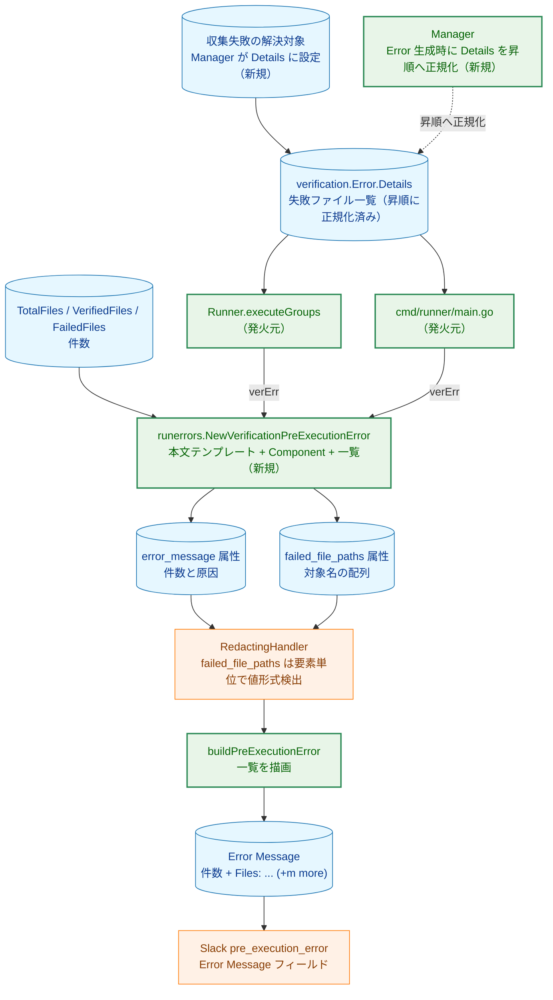
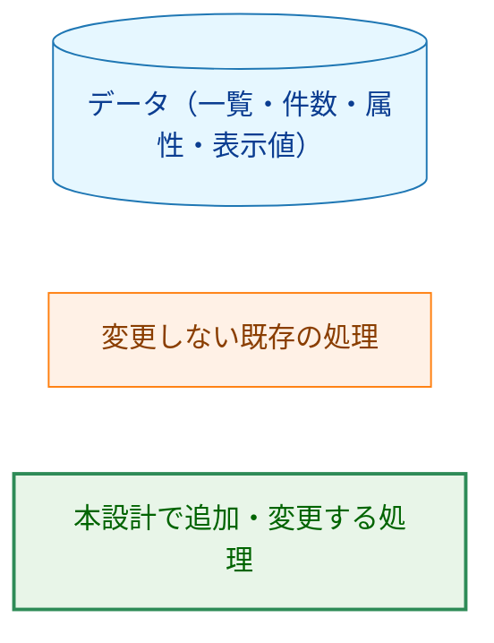
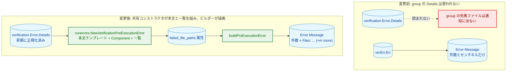
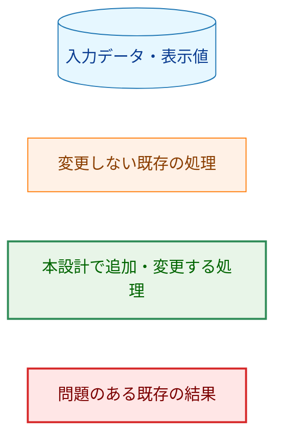
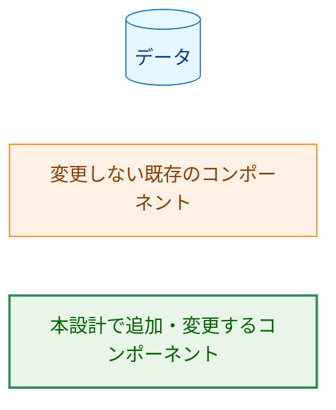
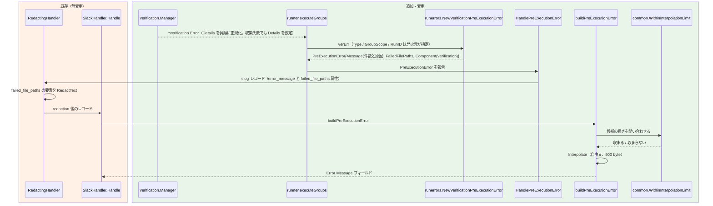
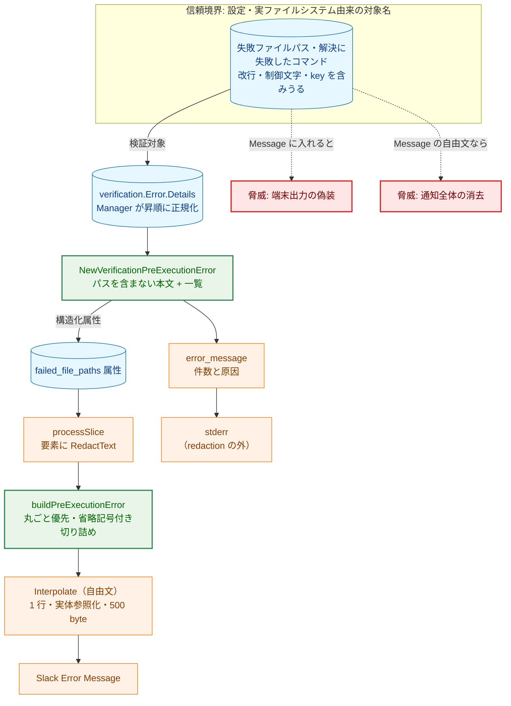
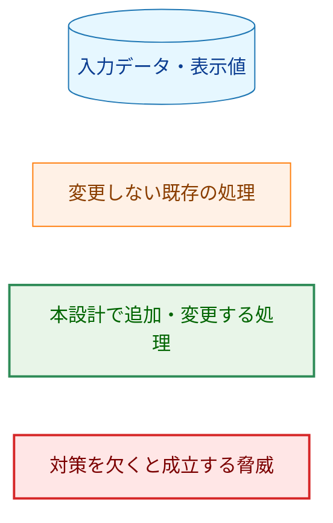

# アーキテクチャ設計書: group 検証エラー通知での失敗ファイル名の表示

## Document Status

| Item | Value |
|---|---|
| Status | `draft` |
| Created | 2026-09-14 |
| Review date | `-` |
| Reviewer | `-` |
| Comments | 2026-09-14: 収集失敗（コマンドのパス解決失敗）も `failed_file_paths` に含める決定を反映（§1.1・§1.2・§1.3・§2.2・§2.3・§3.2・§3.4・§3.5・§3.6・§3.7・§4・§5.1・§5.2・§6・§7・§8・§9・付録A・付録B）。再承認を待つ。<br>2026-09-15: グローバルと group の報告の組み立てを共有コンストラクタ `runerrors.NewVerificationPreExecutionError` へ一本化し、本文テンプレートと `Component` を統一。`Details` の昇順正規化を Manager の生成時に移動（§1.2・§1.3・§2.1・§2.2・§2.3・§3.2・§3.3・§3.4・§3.5・§3.6・§3.7・§4・§5.1・§5.2・§5.5・§6・§7・§8・§9・付録A・付録B）。再承認を待つ。<br>2026-09-15: コード精査の結果を反映。`runerrors` の死コード削除（§3.2.1・§3.6・§8）、`verification.Error` の非公開コンストラクタ（§3.2.3・§3.6・§3.7・§7.9・§8）、`Component` リテラルの typed 定数化（§3.6・§8）、command 依存検証の通知欠落と `executeGroups` の先頭エラーのみ返却の残存記録（§5.5・§9）、付録A に AC-20〜22 を追加。再承認を待つ。 |

## 関連文書

- 要件定義書: [01_requirements.md](01_requirements.md)
- 出発点: [0172 実装計画書 §10 の follow-up](../0172_slack_notification_message_unification/03_implementation_plan.md#10-次のステップ)
- 通知種別定義・共通エンベロープ・表示安全な補間契約: [0172 アーキテクチャ設計書 §3.4・§3.5](../0172_slack_notification_message_unification/02_architecture.md)
- セキュリティ設計（redaction を含む）: [security-architecture.md](../../dev/architecture_design/security-architecture.md)
- Mermaid 表記規約: [mermaid_reference.md](../../dev/developer_guide/mermaid_reference.md)

## 用語

| 用語 | 意味 |
|---|---|
| group 検証エラー | `VerifyGroupFiles` が返す `*verification.Error`。`Op="group"`、`Group`、`Details`、`TotalFiles`・`VerifiedFiles`・`FailedFiles`、`Err` を持つ |
| 失敗ファイル一覧 | `verification.Error.Details`（`[]string`）。検証に失敗したファイルのパス、および収集でパス解決に失敗したコマンド（対象名） |
| 収集失敗 | `VerifyGroupFiles` が検証対象を集める段階でコマンドのパス解決に失敗し、検証を実行せず group を拒否する経路（`internal/verification/manager.go:194-203`、解決の失敗は `:274-285`） |
| `failed_file_paths` 属性 | 本設計で新設する `pre_execution_error` レコードの構造化属性（`[]string`）。失敗対象（失敗ファイルまたは解決に失敗したコマンド）を運ぶ。`common.PreExecErrorAttrs.FailedFilePaths` = `"failed_file_paths"` |
| Error Message フィールド | `pre_execution_error` 通知の既存の添付フィールド。値は通知ビルダーが組み立てる |
| 通知ビルダー | `internal/logging` の `buildPreExecutionError`。レコードの属性から `Error Message` の表示値を組み立てる |
| 共有コンストラクタ | `internal/runner/runerrors.NewVerificationPreExecutionError`。`*verification.Error` から `PreExecutionError` を組み立てる唯一の場所。本文テンプレート・`Component`・一覧の複製を担う（§3.2.1） |
| 昇順正規化 | `verification.Error.Details` を、`Error` を生成する Manager の時点で昇順に並べたコピーにすること。通知の発火元は並べ替えない（§1.2 原則 6・§3.2.3・§3.7） |
| 表示上限 | 表示安全な補間契約において、自由文の役割とエンベロープ値の役割が共有する UTF-8 500 byte の長さ上限（[`interpolationMaxBytes`](../../../internal/common/interpolation.go)） |
| 表示安全な補間契約 | 動的な値を通知へ埋め込む前に 1 行化・書式制御文字の除去・実体参照化・長さ上限を適用する契約（0172 §3.5） |
| 全件表示 / 部分表示 | 一覧が上限内なら全件、超えるなら上限内の範囲と省略件数を示す形 |
| 省略通知 | 部分表示で残りを省略したこととその件数を示す接尾辞（`(+m more)`） |
| 掲載件数 k / 省略件数 m | 表示するパスの件数を k、`failed_file_paths` の件数を n としたとき m = n - k |
| 要素単位の redaction（既存） | `RedactingHandler.processSlice` が文字列スライス要素に `RedactText`（値形式検出と key=value 置換）だけを適用する既存挙動（`internal/redaction/redactor.go:1436-1439`）。値全体置換は `KindString` にのみ適用され、スライス要素には及ばない |

> 本設計はコミット `b1d7c81c` 時点のソースに基づいて記述する（ソースは `ef2c20f2` と同一）。既存の挙動に関する記述には `file:line` を付す。

---

## 1. 設計の全体像

### 1.1 このタスクが解決する問題

group ファイル検証の失敗は [`Runner.executeGroups`](../../../internal/runner/runner.go) の `*verification.Error` 分岐で通知される。この分岐は本文を次のように組み立てる（`internal/runner/runner.go:429-431`）。

```go
errorMsg := fmt.Sprintf("Total: %d, Verified: %d, Failed: %d, Error: %v",
    verErr.TotalFiles, verErr.VerifiedFiles, verErr.FailedFiles, verErr.Err)
```

`verErr.Details`（失敗ファイルの一覧）は使われない。`verification.Error` は `Details` を持ち、`Error()` はそれを連結して返す（`internal/verification/errors.go:151-181`、とくに `:171-173`）。group 側の本文は `Error()` を経由せず、センチネルエラー `verErr.Err` だけを埋め込む。

一方、グローバル検証エラーの報告経路は `err.Error()` を `Message` に渡す（`cmd/runner/main.go:391-402`）。`Error()` が `Details` を連結するため、グローバル通知は失敗ファイルのパスを含む。その結果、同じファイル検証の失敗でも、グローバルではパスが出て group では出ない。

収集失敗の経路には別の問題がある。`VerifyGroupFiles` がコマンドのパス解決に失敗すると、`Details` を持たない `*verification.Error` を返す（`internal/verification/manager.go:194-203`、解決の失敗は `:274-285`）。`verErr.Err` は `command.ExpandedCmd` を包むため対象名は `Message` に残るが、`failed_file_paths` に載る一覧が無い。本設計は `Message` からパスを除く（§1.2）ため、この経路をそのままにすると、どの対象で失敗したかが通知から落ちる。本設計は収集失敗も `Details` に一本化し、対象名を一覧として運ぶ（§3.7）。

失敗ファイルのパスは設定と実ファイルシステムに由来する任意の文字列である。これを既存の自由文 `Message` へ連結すると、次の 2 つの障害を招く。

- `Message` は redaction の外にある stderr へそのまま書かれる（`internal/logging/pre_execution_error.go:120-151`。stdout には `handleErrorCommon` は `Error: <type>` と `RUN_SUMMARY` 行だけを書き、`Message` は書かない）。パスの改行・制御文字が端末出力の行を偽装し、生のパスが露出しうる。
- `RedactingHandler` の値全体置換は未アンカーの `(?i)(password|token|secret|key|api_key)` の部分一致であり（`internal/redaction/redactor.go:819-823`。パターンは `internal/redaction/sensitive_patterns.go:41`、判定は `:131-134`）、`key` を普通に含むパス（例: `/opt/monkey/data`）が `Message`（自由文、`KindString`）にあるとフィールド全体を消す。この置換は `KindString` にのみ適用され、文字列スライス要素には適用されない（`internal/redaction/redactor.go:1436-1439`）。

本設計は、失敗ファイル一覧を自由文の `error_message` へ連結せず、**専用の構造化属性 `failed_file_paths` として運び、通知ビルダーが `Error Message` フィールドへ描画する**。これにより、人間向け `Message` の経路からこの 2 つの障害を取り除く（構造化属性は他のログ属性と同様に console ハンドラへも描画される。残余は §5.2）。

### 1.2 設計原則

1. **失敗ファイルの出所を 1 つにする。** 一覧は `verErr.Details` だけから取る。件数や別ログから作り直さない。
2. **group 名は Scope に一本化する。** 本文へ `Group: <name>, ` のような別個のメタデータを足さない（0172 §3.4）。パスに group 名と同名の文字列が含まれることはあるが、それはパスの内容である。
3. **失敗ファイル一覧は構造化属性で運ぶ。** 人間向け `Message` へパスを入れず、一覧は構造化属性として運ぶ。表示は `Error Message` フィールドへ描画する。
4. **一覧の描画は通知ビルダーが行う。** ビルダーは `error_message` 属性（`Detail()`）と `failed_file_paths` から `Error Message` の値を組み立てる。新しい Slack フィールドは足さない（通知種別定義を変えない）。
5. **上限判定は契約自身に問い合わせる。** ビルダーは `common.WithinInterpolationLimit` で候補を測り、切り詰めは `common` の契約ヘルパーで行う。上限値や変換規則を書き写さない。
6. **並びは生成時に正規化する。** `verification.Error` を生成する Manager が `Details` を昇順に並べたコピーを設定する。発火元は並べ替えず、ビルダーも並びを変えない。同じ失敗集合から同じ通知が得られる。
7. **redaction は変更しない。** `failed_file_paths` の要素は文字列スライス属性であり、既存の `processSlice` が `RedactText` のみを適用する。パスを自由文 `Message` へ入れないことで、値全体置換で通知が消える経路を避ける。
8. **収集失敗も一覧に一本化する。** 解決に失敗したコマンドも `Details` に載せ、通知の一覧は常に `Details` から取る。収集失敗だけ別経路にしない。
9. **報告の組み立ては共有コンストラクタに一本化する。** グローバルと group は `runerrors.NewVerificationPreExecutionError` を使い、本文テンプレートと `Component`（`verification`）を共有する。発火元ごとに本文やフィールドを組み立て直さない。
10. **通知外の報告形式は変えない。** `verification.Error.Error()`、`*verification.OpError` の報告、コンソールログの粒度は本設計の対象外とし、残存として記録する（§5.5・§9）。

### 1.3 概念モデル: 失敗ファイル一覧の受け渡しと描画



矢印 A → B は「A が B の入力になる、または A が B によって変換される」ことを表す。Manager が `Details` を昇順に正規化し、両発火元は共有コンストラクタへ `verification.Error` を渡す。共有コンストラクタが `error_message` の値・`failed_file_paths`・`Component` を決め、`failed_file_paths` は自由文 `error_message` を経由せず、通知ビルダーだけが `Error Message` へ描画する。

**凡例（Legend）**



---

## 2. システム構成

### 2.1 現在と本設計後の比較



矢印 A → B は「A が B の入力になる」ことを表す。破線の `V1 -.-> DROP` は、変更前の group 経路では `Details` が使われず情報が通知へ届かないことを表す（グローバルの経路は `Error()` が `Details` を連結していた。§1.1）。変更後はグローバルと group の両方が同じ共有コンストラクタを通る。

**凡例（Legend）**



### 2.2 コンポーネント配置

```mermaid
flowchart LR
    classDef data fill:#e6f7ff,stroke:#1f77b4,stroke-width:1px,color:#0b3d91;
    classDef process fill:#fff1e6,stroke:#ff7f0e,stroke-width:1px,color:#8a3e00;
    classDef enhanced fill:#e8f5e8,stroke:#2e8b57,stroke-width:2px,color:#006400;

    VER["verification/manager.go<br>VerifyGroupFiles（収集失敗でも Details）"]
    VERG["verification/manager.go<br>VerifyGlobalFiles（Details を昇順で設定）"]
    DET[("verification.Error.Details<br>Manager が昇順に正規化")]
    RUN["runner.go<br>executeGroups（発火元）"]
    MAIN["cmd/runner/main.go<br>（グローバル発火元）"]
    CNV["runerrors/pre_execution.go<br>NewVerificationPreExecutionError（新設）"]
    LOG["logging/pre_execution_error.go<br>HandlePreExecutionError / failed_file_paths 属性"]
    RED["redaction<br>failed_file_paths の要素を値形式検出"]
    SL["logging/slack_handler.go<br>buildPreExecutionError（描画）"]
    PRED["common/interpolation.go<br>WithinInterpolationLimit（新設）"]

    VER -->|"失敗時に Details を昇順で設定"| DET
    VERG -->|"失敗時に Details を昇順で設定"| DET
    DET -->|"verErr を渡す"| RUN
    DET -->|"verErr を渡す"| MAIN
    RUN -->|"verErr"| CNV
    MAIN -->|"verErr"| CNV
    CNV -->|"Message / FailedFilePaths / Component"| LOG
    LOG -->|"failed_file_paths 属性"| RED
    RED -->|"要素を redaction"| SL
    SL -->|"長さを問い合わせる"| PRED

    class DET data
    class RED process
    class VER,VERG,RUN,MAIN,CNV,LOG,SL,PRED enhanced
```



矢印 A → B は「A が B を呼ぶ、または A の値が B へ渡る」ことを表す。`RED`（既存の `processSlice`）は本設計で変更しない。group とグローバルの両方が同じ共有コンストラクタへ `verification.Error` を渡し、返った `PreExecutionError` を `HandlePreExecutionError` で報告する（§3.2）。

**凡例（Legend）**



### 2.3 データフロー（group 検証エラーの通知）



矢印 A ->> B は同期呼び出し、A -->> B は戻り値を表す。`failed_file_paths` は既存の `processSlice` が要素単位に `RedactText` を適用し、ビルダーは redaction 後の値を描画する。切り詰めは常に redaction 後の値に対して行われる。グローバルは `cmd/runner/main.go` から同じ共有コンストラクタを通り、同じビルダーで描画される。

**凡例（Legend）**


---

## 3. コンポーネント設計

### 3.1 表示上限の判定: `common.WithinInterpolationLimit`

表示安全な補間契約は `internal/common/interpolation.go` にある。自由文の役割は 1 行化・書式制御文字の除去・実体参照化・500 byte への切り詰めを行い、上限値は非公開の定数 `interpolationMaxBytes`（`:38`）である。切り詰めは、長さが上限以下なら入力をそのまま返す実装である（`:112-114`）。

通知ビルダーは、組み立てた候補が契約を通しても切り詰められないことを知る必要がある。上限値を書き写すのでも、切り詰めを事後に検出するのでもなく、契約自身へ問い合わせる述語を `internal/common` へ足す。

```go
// WithinInterpolationLimit reports whether value survives the free-text
// transformations of the display-safe interpolation contract without being
// shortened by the shared length limit. Callers that must keep a suffix
// visible size their raw text with this predicate; the boundary still performs
// the transformation, so the raw value is passed through unchanged.
func WithinInterpolationLimit(value string) bool
```

- 対象は自由文の役割とする。識別子の役割は切り詰めを行わないため、この述語の対象外である。
- 契約の意味は「自由文の役割の変換（1 行化・書式制御文字の除去・実体参照化）を適用しても長さが上限以下であること」とする。変換規則と上限値は `internal/common` に閉じたままである。
- 述語が真を返す値は、通知境界の `Interpolate` が切り詰めを行わない。
- 述語は値を変換して返さない。実体参照化はビルダーでは行わず、境界の `Interpolate` が 1 回だけ行う。
- 判定は切り詰めを適用する前の、自由文の役割の変換後の長さに対して行う。`common.Interpolate(value, common.InterpolationRoleFreeText)` の戻り値を測定に使ってはならない。同関数は常に上限へ切り詰めるため戻り値は常に上限以下となり、述語が切り詰めの発生を検出できなくなるからである。

ビルダーが先頭パスを切り詰める場合も、変換規則も上限値も書き写さない。ビルダーは raw の rune 境界で切った接頭辞を符号化した候補を `WithinInterpolationLimit` で判定する有界な探索（接頭辞を伸ばすほど候補は長くなるので単調）で、述語が真になる最大の接頭辞を選ぶ。バイト数は計算せず、述語への問い合わせだけで決める。変換規則と上限値は `internal/common` に閉じたままである。

### 3.2 発火元と共有コンストラクタ

発火元は失敗ファイル一覧を描画も redaction もしない。`*verification.Error` を共有コンストラクタへ渡し、返った `PreExecutionError` を報告するだけにする。group は `Runner.executeGroups`、グローバルは `cmd/runner/main.go` の検証失敗報告（`:391-402`）が担う。

```go
type PreExecutionError struct {
    // ... 既存フィールド ...
    // FailedFilePaths は通知に載せる失敗ファイルパス。
    // verification.Error.Details（Manager が昇順に正規化済み）の複製。
    FailedFilePaths []string
}
```

#### 3.2.1 共有コンストラクタ: `runerrors.NewVerificationPreExecutionError`

`internal/runner/runerrors/pre_execution.go`（新設）に置く。`runerrors` は `resource`（`verification` を含む）と `logging` を参照できる位置にある。`logging` へ `verification` を持ち込まず、かつ両発火元が同じ変換を使うことを 1 つの関数で保証するため、ここに置く。

**既存シンボルの削除。** `runerrors` の既存シンボル（`ClassifiedError`・`ErrorSeverity`・`ErrorType`・`ClassifyVerificationError`・`LogClassifiedError`・`LogCriticalToStderr`）は本番の呼び出し元を持たない（`grep -rn runerrors` の非テスト結果は README の 1 行のみ）。共有コンストラクタの追加とは別コミットでこれらとそのテスト（`classification_test.go`・`logging_test.go`）を削除し、パッケージ doc を「検証失敗を報告境界の `PreExecutionError` へ変換する」責務に書き換える。README.ja.md / README.md の `runerrors/` 行の説明も合わせる。削除後の `go tool cover -func` は共有コンストラクタの行だけを報告する。

```go
// NewVerificationPreExecutionError converts a verification failure into the
// pre-execution error shape shared by the global and group report boundaries.
// It is the only construction point, so the summary template, the failed-target
// copy, and the Component cannot drift between the two boundaries.
func NewVerificationPreExecutionError(
    verErr *verification.Error,
    errType logging.ErrorType,
    scope common.NotificationContext,
    runID string,
) *logging.PreExecutionError
```

- `Message` は 2 つのテンプレートのいずれか。収集失敗（`errors.Is(verErr.Err, verification.ErrGroupVerificationCollectionFailed)`）は `Collection failed: %d of %d targets unresolved, Error: %v`、それ以外は `Total: %d, Verified: %d, Failed: %d, Error: %v`。原因 `verErr.Err` は `%v` で埋め込む。Manager が設定する `Err` はパスを含まないセンチネルであり、本文も `Details` のパスと group 名を含まない。
- `FailedFilePaths` は `slices.Clone(verErr.Details)`。Manager が昇順に正規化済みであるため並べ替えはしない（§3.7）。複製により、呼び出し元が `verErr.Details` を変更しても通知レコードへ影響しない。
- `Component` は `string(resource.ComponentVerification)` 固定。group の従来値 `"runner"` を `verification` に統一し、同じファイル検証の失敗で Component が割れないようにする。
- `Err` は設定しない。原因は `Message` に含まれ、`Detail()` は `Message` と等しい。これにより既存の group 本文 `Total: ..., Error: <cause>` を維持する。
- `Type`・`NotificationContext`・`RunID` は発火元が渡す（group: `ErrorTypeGroupFileVerification` + `GroupScope`、グローバル: `ErrorTypeFileAccess` + `GlobalScope`）。`error_type` と Scope は報告の起点を表すため、意図的に発火元が決める（§3.4）。

#### 3.2.2 group（`Runner.executeGroups`）

- `verErr` を `NewVerificationPreExecutionError(verErr, logging.ErrorTypeGroupFileVerification, common.GroupScope(verErr.Group), r.runID)` に渡し、返った `PreExecutionError` を `HandlePreExecutionError` で報告する。発火元は `Message`・`FailedFilePaths`・`Component` を個別に組み立てない。
- 検証失敗の `Message` は既存の `Total: %d, Verified: %d, Failed: %d, Error: %v` のまま（パスを含めない）。収集失敗では検証の内訳を提示せず、収集段階の件数に基づく本文とする（§3.7）。
- 収集失敗でも `verErr.Details` に解決失敗の対象が入るため（§3.7）、報告経路はこの 1 つに閉じる。

#### 3.2.3 グローバル（`cmd/runner/main.go`）

- `VerifyGlobalFiles` の失敗が `*verification.Error` なら、`NewVerificationPreExecutionError(verErr, logging.ErrorTypeFileAccess, common.GlobalScope(), runID)` を返す。分岐は型だけで決め、`Details` の有無では分けない。`Details` が空でも同じテンプレートで本文が組み上がるため、`Details` の有無で別の組み立てへ流れることはない。
- `verification.Error.Error()` は `Details` を連結するため通知に使わない。`Message` は共有コンストラクタが返すパスを含まない本文になる。
- `*verification.Error` 以外（`ensureHashDirectoryValidated` の `*OpError` など）は従来どおり `err.Error()` を `Message` に渡し、`FailedFilePaths` を設定しない。この経路は失敗対象一覧を持たず、本設計の一覧契約の対象外である（§5.5）。
- `Type` は `logging.ErrorTypeFileAccess`、`NotificationContext` は `common.GlobalScope()`（いずれも既存）。

**並びの正規化。** `Details` は Manager が `Error` を生成する時点で昇順に並べたコピーを設定する（§3.7）。生成は `manager.go` の非公開コンストラクタ（例: `newVerificationError(op, group string, details []string, total, verified int, sentinel error) *Error`）1 箇所に集約し、昇順コピーはそこでだけ作る。3 つの発生箇所（`VerifyGlobalFiles` の検証失敗 `:170`、`VerifyGroupFiles` の収集失敗 `:198`・検証失敗 `:242`）はすべてこのコンストラクタを呼び、構造体リテラル `&Error{...}` はコンストラクタの中にしか現れない。発火元は並べ替えず、ビルダーも並びを変えない。group の `Details` は `for file := range allFiles`（map）に由来し（`internal/verification/manager.go:218`。map の構築は `:260-291`）、グローバルの `Details` は `input.ExpandedVerifyFiles`（スライス）に由来する（`manager.go:146-157`）が、生成時に同じ規則へ揃う。収集失敗の `Details`（`input.Commands` の走査に由来。§3.7）も同じ正規化を受ける。

失敗ファイル一覧を `Message` へ連結しない理由:

- `Message` は redaction の外にある stderr へ直接書かれる（`internal/logging/pre_execution_error.go:120-151`）。自由文のパスを入れないことで、`Message` 自体を使った端末出力の偽装を避ける。
- `Message` は `KindString` の自由文であり、値全体置換のヒューリスティクスでフィールド全体が消えうる。パスを入れないことでこれを避ける。

なお、`failed_file_paths` 属性は record の一部であり、非対話実行では `ConditionalTextHandler`（`slog.TextHandler`）が全属性を console へ描画する（`internal/runner/bootstrap/logger.go:219-235`）。端末出力にパスが現れる点は残存リスクとして §5.2 に記録する。

### 3.3 通知ビルダー: `buildPreExecutionError`

`internal/logging/slack_handler.go` の `buildPreExecutionError`（`:836-866`）が `Error Message` の表示値を組み立てる。フィールドの集合は変えず、`error_message` 属性（`PreExecutionError.Detail()` の値）と `failed_file_paths` から値を組み立てる。`Detail()` は `Err` があれば後置するため、保証は `Detail()` の値に対して述べる（group・グローバルの両発火元とも `Err` は nil。§3.2）。

**ビルダーが読む値。** レコードの `failed_file_paths` 属性は RedactingHandler の `processSlice` を経て `[]any`（要素は文字列）になる（`internal/redaction/redactor.go:1463`）。ビルダーは `[]any` を文字列へデコードする。デコード補助はビルダーの近く（`internal/logging`）に置く。`[]string`（テストが直接組む場合）と `[]any`（本番）の両方を読み、どちらでもない表現は「一覧なし」として `error_message` のみを描画する（producer の欠陥であり、テストで固定する）。テストは必ず RedactingHandler を通したレコードを使い、本番で生じる型の違いを取りこぼさない（§7.2）。

本文の骨格を次の表に定める。`failed_file_paths` を昇順に並べたものを `p1, p2, ...`、そのエンコード後の表示形を `q1, q2, ...`、件数を n、表示する件数を k、省略件数を m = n - k とする。接続は `, `、省略通知は ` (+m more)` である。前置きは `error_message` の値、後置きは `…` と省略通知である。

| 状況 | Error Message の値 |
|---|---|
| `failed_file_paths` なし／読めない | `<error_message>`（`error_message` をそのまま使う） |
| 全件が表示上限内 | `<error_message>, Files: <q1>, ..., <qn>` |
| 丸ごと掲載できるパスがある（k 件、k >= 1） | `<error_message>, Files: <丸ごと掲載する q> (+m more)` |
| 丸ごと掲載できるパスが 1 件も無い | `<error_message>, Files: <先頭パスの Quote 済み接頭辞>… (+m more)`（`…` は閉じ引用符の外側。m = n - 1、n = 1 のときは省略通知を付けない） |

- **表記を一意にする。** 各パス `p` を `strconv.Quote(p)` で引用・エスケープした表示形 `q` とする。`strconv.Quote` は `"` と `\` をエスケープし、制御文字・書式制御文字・行区切り・不正な UTF-8 バイトを可視のエスケープ（`\n`、`\u2028`、`\xff` など）にする。これにより、`,` を含む区切りの衝突（`["/a, /b", "/c"]` と `["/a", "/b, /c"]`）、補間の空白化による衝突（`/a\nb` と `/a b`）、引用符を含む表現の衝突を同時に解く。掲載の判定と長さの測定は `q` に対して行う。
- **掲載の選択。** 昇順の一覧を 1 回だけ走査し、その時点の予算に収まる `q` を丸ごと掲載する。収まらない `q` は飛ばし、後から再検討しない。丸ごとが 1 件も無い場合に限り、先頭の `q` を切り詰めて `…` を付け、掲載件数に数える（m = n - 1）。
- **上限の測り方と省略件数。** 候補は必ずその時点の省略通知（`m = n - k`）を含めた全体で測る。k を増やすほど m は減り、省略通知は短くなる。パスを 1 件加える判定は加えた後の m の通知で行うため、採用後の通知は必ず判定済みの（より短いか等しい）ものである。循環しない。
- **切り詰め。** 丸ごとが 1 件も無い場合、先頭パスの raw の rune 接頭辞 `r` を選び、`strconv.Quote(r) + "…"` を表示形とする（`…` は閉じ引用符の外側。パスに `…` が含まれても引用符の内側なので区別できる）。`r` は「候補と省略通知を含む全体が `WithinInterpolationLimit` を満たす最大の接頭辞」を §3.1 の有界な探索で選ぶ。エスケープ列と閉じ引用符は `strconv.Quote` が生成するため、途中で割れない。
- 固定の前置きと省略通知は件数がどのような値をとっても上限より十分短いため、省略通知は常に残る。前置きと省略通知だけで上限を超える場合は `failed_file_paths` なしと同じ本文へ倒す（この退避は実際には到達しない）。
- 実体参照化と長さ上限は最後の `common.Interpolate(value, common.InterpolationRoleFreeText)`（既存の `:856`）が 1 回だけ行う。連結後は `WithinInterpolationLimit` で候補全体を再確認する（述語は raw の候補に適用する）。
- redaction は既に済んでいる。既存の `processSlice` が要素へ `RedactText` を適用するため、切り詰めが生の機密を切ることはない。
- group 名は本文へ足さない（Scope のみ。AC-03）。

### 3.4 変更しないもの

| 対象 | 理由 |
|---|---|
| `verification.Error` の型・`Error()` | 01 §対象外。既存の表現を使う。`Details` を設定するのは発行元（`VerifyGroupFiles` / `VerifyGlobalFiles`）であり、`Details` は生成時に昇順へ正規化する。型・`Error()` は変更しない |
| `verification.Error.Error()` の文字列 | 通知経路では使わない。`Details` の生連結は通知外の用途に残る（§5.5・§9） |
| `*verification.OpError` の報告 | 失敗対象一覧を持たないため本設計の一覧契約の対象外。global は `err.Error()`、group は system_error のまま（§5.5・§9） |
| 共通エンベロープ・通知種別定義・`error_type`・Slack フィールド集合 | 0172 §3.4・§3.5 を維持する。変えるのは既存 `Error Message` の値と group の `Component`（`runner` → `verification`）だけ。グローバルの `error_type` は `file_access_failed` のまま |
| redaction の適用範囲 | 変更しない。`failed_file_paths` の要素は既存の `processSlice` が `RedactText` のみを適用する（`internal/redaction/redactor.go:1436-1439`） |
| `handleErrorCommon` の stderr・stdout の書式 | stderr にはパスを含まない `Message` をそのまま書き、stdout には `Message` を書かない（既存のまま） |

### 3.5 既存テストへの影響

| テスト | 影響 |
|---|---|
| `internal/runner/runner_test.go` の `TestRunner_VerificationErrorCarriesGroupScopeAndCleanMessage`（`:2385-2431`） | 既存のアサーション（`Message` が `Total: 3, Verified: 2, Failed: 1` を含み、`Group: backup` と `backup` を含まないこと）は成立し続ける（共有コンストラクタも同じテンプレートを使う）。`Component` は `verification` に変わるが既存テストは `Component` を検証していない。`FailedFilePaths` と `Component` の検証は新しいテストで固定する |
| `internal/runner/runerrors/pre_execution_test.go`（新設） | 共有コンストラクタの本文（検証失敗・収集失敗）・`Component`・一覧の複製・`Err` が nil であることを固定する（§7.9） |
| `internal/logging` の `buildPreExecutionError` テスト | `failed_file_paths` がある場合の描画を新しいテストで固定する。`failed_file_paths` がない既存ケースは不変 |
| `internal/logging/notification_test.go` の `Error Message` エスケープテスト（`:290`） | `failed_file_paths` なしのケースは不変 |
| `internal/redaction/redactor_test.go` の `TestRedactLogAttribute_SensitiveValues`・`TestRedactingHandler_PlainStringIsStillRedacted` | 変更しない。`failed_file_paths` の要素の既存挙動は新しいテストで固定する（§7.5） |
| `internal/verification/errors_test.go` の `TestErrorStructure` | `Error()` は変更しないため不変 |
| `internal/verification/manager_test.go` の `TestCollectVerificationFiles`（解決失敗のサブテスト、`:773-810`） | 解決に失敗した対象の一覧を返す新しい契約に合わせて更新し、一覧を固定する |
| `internal/verification/manager_test.go` の `TestVerifyGroupFiles`（`:567-615`） | 収集失敗ケースを追加する（`Details` に解決失敗の全対象が昇順で入ること、件数、パスを含まない `Err`）。ハッシュ不一致の `TestVerifyGroupFiles_OldSchema_BlocksExecution`（`:1866-1886`）は `Details` 付きの検証失敗であり、`Details` が昇順で入ることを新しいテストで固定する |
| `internal/verification/manager_test.go` の `TestVerifyGlobalFiles` | グローバルの `Details` も昇順で入ることを新しいテストで固定する |

`verification.Error.Details` を通知本文に使う既存のテストは他に無い。検証エラーの `PreExecutionError` を組み立てる箇所は `runerrors.NewVerificationPreExecutionError` の 1 箇所になり、発火元はそれを呼ぶだけになる。収集失敗の `Details` を検証する既存テストも無い。

### 3.6 コンポーネント責務表（新規・変更ファイル）

| ファイル | コンポーネント | 責務 | 本設計での変更 | 検証 |
|---|---|---|---|---|
| `internal/common/interpolation.go` | `WithinInterpolationLimit` | 自由文の契約が値を切り詰めずに通すかを返す述語（新設。切り詰めの探索はビルダーが述語を使って行う） | 新設 | `internal/common/interpolation_test.go` |
| `internal/common/interpolation_test.go` | 契約テスト | 述語と切り詰めの境界 | テストを追加 | それ自体 |
| `internal/common/logschema.go` | `PreExecErrorAttrs.FailedFilePaths` | `failed_file_paths` キー定数（新設） | 新設 | `internal/logging` テスト |
| `internal/runner/runerrors/pre_execution.go` | `NewVerificationPreExecutionError` | `*verification.Error` から `PreExecutionError` を組み立てる唯一の場所。本文テンプレート・`Component`（`verification`）・`FailedFilePaths` の複製を担う | 新設 | `internal/runner/runerrors/pre_execution_test.go` |
| `internal/runner/runerrors/{types,classification,logging}.go` と対応テスト | 既存の分類 API | 本番呼び出しなし | 削除（別コミット）。パッケージ doc を共有コンストラクタの責務に書き換える | `go build ./...`、`go tool cover -func` |
| `README.ja.md` / `README.md` | パッケージ一覧 | `runerrors/` の説明 | 「検証失敗の報告変換」へ更新（英語版は `/mktrans`） | `static` |
| `cmd/runner/main.go`・`internal/runner/runner.go` | `Component` の値 | `"main"`・`"runner"` の生リテラル | `string(resource.ComponentMain)` / `string(resource.ComponentRunner)` へ置換 | `grep` で生リテラルが残らないこと |
| `internal/runner/runerrors/pre_execution_test.go` | コンストラクタテスト | 検証失敗・収集失敗の本文、`Component`、一覧の複製、`Err` が nil であることを固定（§7.9） | テストを追加 | それ自体 |
| `internal/runner/runner.go` | `executeGroups` | `*verification.Error` を共有コンストラクタへ渡し、返った `PreExecutionError` を報告する | 発火元の組み立てを共有コンストラクタ呼び出しへ置き換える | `internal/runner/runner_test.go` |
| `internal/runner/runner_test.go` | 配線テスト | `FailedFilePaths` と `Component`（`verification`）を固定 | テストを追加 | それ自体 |
| `internal/verification/manager.go` | `collectVerificationFiles` / `VerifyGroupFiles` / `VerifyGlobalFiles` / 非公開コンストラクタ | 収集失敗で解決に失敗した対象を全て集め、`Details`・件数・パスを含まない `Err` を設定する。`Error` の生成は非公開コンストラクタ 1 箇所に集約し、`Details` はそこで昇順へ正規化する | 変更 | `internal/verification/manager_test.go` |
| `internal/verification/errors.go` | `ErrGroupVerificationCollectionFailed` | 収集失敗を表すパスを含まないセンチネル（新設） | 新設 | `internal/verification/manager_test.go` |
| `internal/verification/manager_test.go` | 収集失敗テスト | `Details`（昇順）・件数・センチネル・`Err` の文言に対象名が現れないことを固定 | テストを追加 | それ自体 |
| `internal/logging/pre_execution_error.go` | `PreExecutionError.FailedFilePaths` / `HandlePreExecutionError` | 生のパスを `failed_file_paths` 属性として記録する（`Detail()` には書かない） | 変更 | `internal/logging/pre_execution_error_test.go` |
| `internal/logging/pre_execution_error_test.go` | stderr 出力テスト | `handleErrorCommon` の出力にパスが出ないことを固定 | テストを追加 | それ自体 |
| `internal/logging/slack_handler.go` | `buildPreExecutionError` / `[]any` のデコード補助 | `error_message` 属性と `failed_file_paths` から `Error Message` を組み立てる（丸ごと優先・省略記号付き切り詰め・省略件数。デコード補助も同パッケージ、新設） | 変更 | `internal/logging/slack_handler_test.go`、`internal/logging/notification_test.go` |
| `internal/logging/slack_handler_test.go` | 描画・境界テスト・ベンチマーク | 全件・部分・切り詰め・実体参照で膨らむ入力・`[]any` 表現・RedactingHandler 経由を固定し、n=10,000 の描画時間を記録（§7.7） | テストとベンチマークを追加 | それ自体 |
| `cmd/runner/main.go` | グローバル発火元 | `*verification.Error` を共有コンストラクタへ渡し、パスを含まない `Message` と `FailedFilePaths` を受け取る | 発火元の組み立てを共有コンストラクタ呼び出しへ置き換える | `cmd/runner/integration_pre_execution_error_test.go` |
| `cmd/runner/integration_pre_execution_error_test.go` | グローバル描画テスト | グローバルも `failed_file_paths` が `Error Message` に描画され、本文と `Component` が group と同じ規則であることを固定 | アサーションを追加 | それ自体 |
| `internal/redaction/redactor_test.go` | redaction 回帰 | 文字列スライス要素の既存挙動（機密はマスク、普通のパスは残る）を固定 | テストを追加 | それ自体 |
| `internal/logging/notification_test.go` | 通知契約テスト | `failed_file_paths` の要素を動的な値の一覧へ加えた場合の契約を確認 | 必要に応じて更新 | それ自体 |
| `docs/tasks/0172_slack_notification_message_unification/02_architecture.md` | 0172 の動的な値の一覧 | `failed_file_paths` の要素を自由文の役割で追加（decision change。0172 の再承認が必要） | 1 行追記 | `static` |
| `docs/user/runner_command.ja.md` | 利用者向け文書 | group 検証エラー通知が失敗ファイルを列挙することを説明 | 追記 | `static` |
| `docs/user/runner_command.md` | 利用者向け文書（英語） | 日本語版の英語訳 | `/mktrans` で反映 | `static` |

以下は変更しない: `internal/redaction/redactor.go`、`internal/runner/bootstrap/logger.go`。`failed_file_paths` 要素の redaction は既存挙動であり、回帰テストだけを足す（`internal/redaction/redactor_test.go`、表の行を参照）。

### 3.7 収集失敗（パス解決失敗）の扱い

`VerifyGroupFiles` は検証対象の収集に失敗すると group の検証を中止し（fail-closed、既存挙動）、`*verification.Error` を返す（`internal/verification/manager.go:194-203`）。本設計はこの経路でも失敗対象の一覧を運ぶ。

- **一覧の収集。** `collectVerificationFiles` はパス解決に失敗したコマンドを記録し、残りのコマンドの解決を続けて、解決に失敗した対象（`command.ExpandedCmd`）を全て集める（返り値は解決済みファイル集合と解決に失敗した対象の一覧）。解決に失敗した時点で group の検証は中止し、検証は 1 件も行わない（fail-closed を維持する。走査の継続は解決の試行だけで、検証も副作用も伴わない）。
- **`Details` と件数。** `VerifyGroupFiles` は解決に失敗した対象を §3.2.3 の非公開コンストラクタへ渡し、コンストラクタが昇順に並べたコピーを `Details` に設定する。収集失敗では検証が 1 件も実行されず、対象のすべてが検証から除外されるため、`TotalFiles`・`VerifiedFiles`・`FailedFiles` を検証の内訳として提示しない。`FailedFiles` は解決に失敗した対象数、`TotalFiles` は対象総数（`ExpandedVerifyFiles` と `Commands` の合計）、`VerifiedFiles` は 0 とし、これらは収集段階の件数として扱う（`verification.Error` の型は変えない）。`Op`・`Group` は既存のまま。
- **`Err`。** パスを含まない新しいセンチネル `ErrGroupVerificationCollectionFailed`（"failed to collect verification files"）を設定する。パス解決の生の原因（コマンド文字列を包む）は `collectVerificationFiles` の既存の `slog.Warn`（`internal/verification/manager.go:279-283`）に残り、`Message` へは入れない。group 本文は共有コンストラクタ（§3.2.1）が組み立て、検証の内訳ではなく収集段階の事実を示す `Collection failed: <失敗数> of <総数> targets unresolved, Error: failed to collect verification files` となる。対象名は `failed_file_paths` だけが運ぶ。
- **`Error()`。** `verification.Error` の型と `Error()` は変更しない。`Details` が設定されるため `Error()` は既存の `Details` 分岐（`internal/verification/errors.go:171-173`）を通る。本経路の通知本文は共有コンストラクタが組み立てるため、`Error()` の `%d of %d files failed` 表記が検証サマリとして通知に現れることはない。原因の文面は通知に載らないが、通知の一覧に失敗対象が現れる（AC-17）。`Error()` の `%d of %d files failed` が収集段階の件数を検証の内訳として読ませる点は残存として §5.5・§9 に記録する。
- **検証失敗との区別。** `ErrGroupVerificationFailed` はハッシュ不一致などの検証失敗、`ErrGroupVerificationCollectionFailed` は収集失敗を表す。`error_type` は `group_file_verification_failed` のままである（通知種別・エンベロープを変えない）。

---

## 4. エラーハンドリング設計

**新しいエラー型は導入しない。** `verification.Error` の型と `Error()` を変えず、`Details` を設定・参照するだけである。収集失敗を表すセンチネル `ErrGroupVerificationCollectionFailed` を `internal/verification/errors.go` に追加する（§3.7）。`error_type` は `group_file_verification_failed` のままである。既存の `PreExecutionError` には `FailedFilePaths []string` を追加し、組み立ては共有コンストラクタ（§3.2.1）に一本化する。

| 状況 | レコード | Error Message |
|---|---|---|
| 失敗対象なし（`Details` が空） | `error_message` のみ | `Err` 種別で選んだ同じテンプレート（検証失敗なら `Total: ..., Error: <verErr.Err>`）に `Files:` 節を付けない。group は既存の文言のまま |
| 全件が上限内 | `error_message` + `failed_file_paths` | `Total: ..., Error: ..., Files: <全件>` |
| 上限超過 | `error_message` + `failed_file_paths` | `Total: ..., Error: ..., Files: <一部> (+m more)` |
| 収集失敗（`Details` は解決失敗の対象） | `error_message` + `failed_file_paths` | `Collection failed: <失敗数> of <総数> targets unresolved, Error: failed to collect verification files, Files: ...` |
| 前置きと省略通知だけで上限超過 | `error_message` + `failed_file_paths` | 既存の `Total: ..., Error: ...` へ退避 |

グローバルの検証エラーも同じ表に従う。`error_type` は `file_access_failed`、Scope は `(global)` で、`error_message` は `err.Error()`（パスと原因を含む）から共有コンストラクタの `Total: N, Verified: N, Failed: N, Error: global file verification failed` へ変わり、ファイル一覧は `failed_file_paths` から描画される。group と本文テンプレート・`Component`（`verification`）・一覧の並びが揃う。`error_message` を照合する消費者はこの変更を確認する必要がある（§5.2・§7.4）。

ビルダーは `failed_file_paths` の値を `Interpolate`（自由文）へ通すため、`Error Message` は 1 行・制御文字と書式制御文字を含まない・500 byte 以下・有効な UTF-8 を満たす。ファイル一覧を載せる経路では、ビルダーが `WithinInterpolationLimit` で候補を測ることで「通知が本文を切り詰めない」ことが保証される。`failed_file_paths` なしの本文は既存のままで、`verErr.Err` が長い場合の境界切り詰めは従来どおりである。

`failed_file_paths` は構造化属性であり、`error_message` の値全体置換の対象にはならない。パスは別属性なので、通知全体が消えることはない。

---

## 5. セキュリティ考慮事項

### 5.1 脅威モデルと対策

本タスクが守る資産は**失敗通知の説明能力**である。失敗ファイルが通知から分からないと、オンコール担当者は別途ログを調べる必要がある。逆に、通知本文が任意のパス文字列で消えると、失敗そのものが見えなくなる。

| 脅威 | 対策 |
|---|---|
| パスの改行・制御文字が stderr の行や端末エスケープを偽装する | パスを `Message` に入れない。stderr は件数と原因（センチネル）だけを書く（§3.2） |
| 収集失敗の対象名（コマンド）が stderr の行を偽装する | 収集失敗でも対象名を `Details` に分離し、`Message` にはパスを含まないセンチネル（と件数）だけを書く（§3.7） |
| パスの `&`・`<`・`>` で Slack のメンション・偽装リンクを作る | `Error Message` への埋め込みは既存の表示安全な補間契約（実体参照化）を通る（§3.3） |
| パスの `key`・`token` の部分一致で未アンカーな値全体置換が発火し、通知全体が消える | パスを自由文 `Message` へ入れない。`failed_file_paths` の要素は文字列スライス要素であり値全体置換の対象外（既存挙動、§5.4） |
| パスの生の機密（トークン等）がログ・Slack へ漏れる | `failed_file_paths` の要素に既存の `RedactText`（値形式検出と key=value 置換）が適用される（§5.4） |
| 失敗ファイルのパスが端末出力の行を偽装する | 人間向け `Detail()` にはパスを入れない（§3.2）。`failed_file_paths` 属性は非対話の text handler が制御文字をエスケープし、対話モードでは表示されない。検証マネージャの `file`・`command` 属性は対話モードで生のまま出るため残存リスク（§5.2） |
| ビルダーが redaction 前の生のパスを切り詰め、機密の区切りが壊れてマスク漏れする | ビルダーは RedactingHandler が redaction した後の要素を描画する（§2.3・§3.3） |
| 一覧の順序が実行ごとに変わり、表示や省略対象が再現しない | Manager が `Details` を生成時に昇順へ正規化する（§3.2.3・§3.7） |
| 絶対パスによるディレクトリ構成の露出 | group 通知は Slack に絶対パスを新たに載せる（AC-01 が要求）。グローバルは既に載せていた（`cmd/runner/main.go:391-402`）。既存の redaction は値形式と key=value のみで、パターン外の文字列は対象外（残存） |

#### 脅威モデル図: 失敗ファイルパスの経路



実線は通常の処理経路を、破線は誤った経路を採った場合に成立する脅威を表す。実線の矢印 A → B は「A が B の入力になる」ことを表す。

**凡例（Legend）**



### 5.2 redaction の扱い

`error_message` の redaction は一切変更しない。値全体置換（`IsSensitiveValue`）を含め、既存の挙動をそのまま引き継ぐ。パスはそこに含まれないため、`/opt/monkey/data` のようなパスで通知が消える問題は構造的に起きない。

`failed_file_paths` は新しい属性で、共有コンストラクタ（§3.2.1）が `*verification.Error.Details` の複製として設定する。要素は既存の `processSlice` が `RedactText`（値形式検出と key=value 置換）だけを適用し、値全体置換は行わない（§5.4）。`failed_file_paths` は `Message` にも `handleErrorCommon` の stderr にも入らない。ビルダーが `Error Message` へ描画する文字列は、既存の自由文の役割の補間契約を通る。0172 §3.5 の「動的な値の一覧」に `failed_file_paths` の要素を自由文の役割で追加する。

**他タスクのポリシー変更。** 元のポリシーは 0172 アーキテクチャ設計書 §3.5（`approved`）の「動的な値の一覧」で、通知へ到達しうる動的な値を列挙して役割を割り当てる。本タスクはここに `failed_file_paths` の要素（役割は自由文）の行を追加する。通知書式・エンベロープ・種別定義は変えない（`Component` の値は §3.2.1 で統一する）。0172 は `approved` のため、この編集は decision change として 0172 を `draft` に戻し再承認が必要である。更新するテストは 0172 の `internal/logging/notification_test.go` の一覧対応の検査で、`failed_file_paths` の行を追加する。

**残余リスク（端末出力へのパス露出）。** パスは人間向け `Detail()` からは消えるが、console への経路が残る。

- 非対話実行の `ConditionalTextHandler` は `slog.TextHandler` を通し、制御文字を含む文字列を引用としてエスケープする（`internal/logging/conditional_text_handler.go:76-84`）。`failed_file_paths` 属性はそこで改行がエスケープされて描画されるため、属性経由で端末の行は偽装できない（属性自体は console に出る）。
- 対話実行の `InteractiveHandler` は優先属性を `DefaultMessageFormatter` で整形し、文字列をそのまま返す（`internal/logging/message_formatter.go:238-241`）。検証マネージャの `file` 属性（`internal/verification/manager.go:223-226`）と収集失敗時の `command` 属性（`:279-283`）は優先キーであり（`message_formatter.go:89-104`）、改行・ANSI を含む対象名が端末へ素通りしうる。`failed_file_paths` 属性は対話モードでは表示されない（`message_formatter.go:112-140` の走査に到達しない）。

**収集失敗の扱い（変更点）。** 検証対象の収集失敗では、解決に失敗した対象を `Details` へ分離し、`Message` にはパスを含まないセンチネル（と件数）だけを書く（§3.7）。パス解決の生の原因（`command.ExpandedCmd` を包む）は検証マネージャの `slog.Warn` に残り、通知本文には載らない。通知から原因の文面を失うことは、対象名を一覧で示すこととの交換である（AC-17）。

端末出力の 1 行化と attribute の通知限定ルーティングは別タスクとする。

### 5.3 外部 API と対象環境

本設計は Slack の新しい Block Kit 要素・API 機能・エンドポイントを導入しない。`pre_execution_error` の既存フィールド `Error Message` の値を変えるだけであり、対象クライアント環境（Slack）向けの新しい機能の検証は不要である（N/A）。表示値は既存の補間契約を通り、その性質は `internal/common/interpolation_test.go` と `internal/logging/slack_handler_test.go` が固定している。

### 5.4 `failed_file_paths` の要素の redaction は既存挙動

`RedactingHandler` の値全体置換は `KindString` の値にだけ適用される（`internal/redaction/redactor.go:819-823`）。文字列スライス属性の要素は `processSlice` の文字列分岐で `RedactText`（値形式検出と key=value 置換）だけを受ける（`internal/redaction/redactor.go:1436-1439`）。したがって `failed_file_paths` の要素は、`key` を普通に含むパス（例: `/opt/monkey/data`）では消えず、値形式の機密（GitHub トークン、`password=` 等）はマスクされる。

これは既存の挙動であり、本設計は redaction を変更しない。`error_message`（自由文、`KindString`）とグローバル経路の redaction も従来どおりで、redaction の適用範囲は変わらない。`failed_file_paths` の要素のこの挙動を回帰で固定するテストを足す（§7.5）。値全体置換を `failed_file_paths` へ足す変更はしない。

### 5.5 通知外の報告形式（残存・対象外）

通知の組み立て以外は本設計で統一しない。次の非対称・残存は認識の上で残し、後続タスクの候補として §9 に記録する。

- **`verification.Error.Error()`。** `Details` を `", "` で連結し（区切り文字と要素の衝突はエスケープしない。`internal/verification/errors.go:171-173`）、並びは Manager の昇順正規化で安定するが、制御文字のエスケープはしない。また収集失敗では件数が「N of M files failed」と検証の内訳のように読める。通知はこの文字列を使わないが、他のログ消費者が `%v` で踏む可能性は残る。
- **`*verification.OpError` の報告。** ハッシュディレクトリ検証などの失敗は `Details` を持たず、本設計の一覧契約の対象外である。global は `err.Error()`（`Path` を含みうる）を `Message` に渡し、group は `*verification.Error` ではないため `executeGroups` の検証分岐に乗らず `system_error`（Scope は global）として報告される。パスはハッシュディレクトリの設定値であり、起動時の検証が主経路にある。
- **コンソールログの粒度と属性名。** グローバルは失敗時に「ファイルごとの `slog.Error` + `failed_files` 配列のサマリ」を出し、group はファイルごとの `slog.Error` のみを出す（`internal/verification/manager.go:166-169`・`:223-226`）。成功時は global が `"verified"`（`cmd/runner/main.go:405-407`）、group が `"verified_files"`（`internal/runner/group_executor.go:383-386`）を使う。対話表示の優先キー（`internal/logging/message_formatter.go:89-104`）は `verified_files` を前提にしている。
- **`error_type` の差。** グローバルは `file_access_failed`、group は `group_file_verification_failed`（0172 の定義）。報告の起点が異なるための意図的な差であり、本設計では変えない（§3.2.1）。
- **command 依存検証・パス解決の失敗は Slack に届かない。** `DefaultGroupExecutor.verifyGroupFiles` は `ResolvePath` 失敗（`internal/runner/group_executor.go:378`）と `VerifyCommandDependencies` 失敗（`:407-412`、動的ライブラリ・shebang）を `*verification.Error` ではない生のエラーで返す。`executeGroups` の検証分岐（`runner.go:426`）に乗らないため `groupErrs` に入り、`cmd/runner/main.go:689` で `ExecutionError`（`system_error`、`slack_notify=false`）になる。この時点で `executionResult` は未設定なので `command_group_summary` も出ない。グローバル・group のファイル検証だけが通知され、command レベルの検証は通知されない非対称である。運ぶ情報は「パス 1 件と理由」で本設計の一覧契約とは形が違うため、別タスクとする（§9、[#1152](https://github.com/isseis/go-safe-cmd-runner/issues/1152)）。
- **`executeGroups` は先頭のエラーしか返さない。** `runner.go:445-447` は `groupErrs[0]` だけを返す。2 件目以降の group の失敗は、group executor が自前でログしない経路（`ExpandGroup` 失敗など）ではどこにも残らない。`errors.Join` への置き換えは別タスクとする（§9、[#1153](https://github.com/isseis/go-safe-cmd-runner/issues/1153)）。
- **`HandleExecutionError` の本文組み立て。** `internal/logging/pre_execution_error.go:170-180` は `PreExecutionError.Detail()` と同じ「`Message` + ユーザ向け文言または `%v`」を再実装している。効果が小さいため、コードにコメントを残して据え置く（[#1156](https://github.com/isseis/go-safe-cmd-runner/issues/1156)）。

---

## 6. 処理フロー詳細

### 6.1 全件が表示上限内

1. `VerifyGroupFiles` が失敗し、`*verification.Error` に `Details`（昇順に正規化）と件数を設定して返す（正規化は本設計）。
2. `executeGroups` が共有コンストラクタで `PreExecutionError`（件数と原因の `Message`、`FailedFilePaths`、`Component=verification`）を組み立て、`HandlePreExecutionError` を呼ぶ。
3. `HandlePreExecutionError` が `failed_file_paths` 属性を加え、`handleErrorCommon` が `Detail()`（この経路では `Message` と等しい）を stderr へ書く。
4. `RedactingHandler` が `failed_file_paths` の各要素に `RedactText` を適用する（値全体置換なし）。
5. `SlackHandler` が `buildPreExecutionError` で `error_message` の値と全パスを連結し、`WithinInterpolationLimit` が真なので省略通知なしで確定する。
6. `Interpolate`（自由文）を通し、`Error Message` フィールドへ載せる。

### 6.2 表示上限を超える

1.〜4. は 6.1 と同じ。
5. 全件を連結した候補が上限を超える。ビルダーは昇順に走査して丸ごと掲載できるパスを選び、収まらないパスは飛ばす。
6. `k >= 1` なら `Files: <丸ごと掲載するパス> (+m more)`、`k = 0` なら先頭パスを上限内へ切り詰めて `Files: <切り詰め>… (+m more)`（m = n - 1）で確定する。

計算量は n に対して、並べ替えが O(n log n)（Manager の `Error` 生成時）、走査と表示用の複製が O(n)（共有コンストラクタとビルダー）である。n は group の検証対象（`verify_files` とコマンド数の合計）であり設定に由来する（`internal/verification/manager.go:260-280`）。時間は単体テストのしきい値ではなくベンチマークで確認する（§7.7）。

### 6.3 `failed_file_paths` が空（失敗対象なし）

1. `*verification.Error` 以外の失敗、または `Details` が空の検証エラーが返る（本設計の経路では、Manager は `Details` が空の `*verification.Error` を返さない）。
2. `*verification.Error` なら共有コンストラクタが `Total: ..., Error: <verErr.Err>`（`Files:` 節なし）を組み立てる。`*verification.Error` 以外は発火元が従来どおり `err.Error()` を `Message` に渡す（§3.2.3）。
3. `HandlePreExecutionError` は `error_message`（`Detail()`）だけを記録し、stderr にも同じ本文を書く。
4. ビルダーは `failed_file_paths` がないので `error_message` 属性の値をそのまま `Error Message` にする。

### 6.4 グローバル検証エラー（group と同じ描画）

1. `VerifyGlobalFiles` が失敗し、`Details`（昇順に正規化）を持つ `*verification.Error` を返す（既存＋正規化）。
2. `cmd/runner/main.go` が共有コンストラクタへ `verErr` を渡し、`PreExecutionError`（`GlobalScope`、`ErrorTypeFileAccess`、`Component=verification`）を受け取る（`cmd/runner/main.go:391-402`）。
3. `RedactingHandler` が `failed_file_paths` の各要素に `RedactText` を適用する（既存挙動）。
4. ビルダーが `error_message` 属性の値（`Detail()`）と `failed_file_paths` から `Error Message` を組み立て、group と同じ予算管理（全件、または上限内の範囲と省略件数）で描画する。

### 6.5 収集失敗（パス解決失敗）

1. `collectVerificationFiles` がパス解決に失敗したコマンドを記録し、残りの解決を続けて解決に失敗した対象を全て集める。group の検証は中止し、検証は 1 件も行わない（fail-closed）。
2. `VerifyGroupFiles` が `Details`（解決失敗の対象を昇順に正規化）、`TotalFiles`（対象総数）、`FailedFiles`（解決失敗の数）、`VerifiedFiles = 0`、`Err = ErrGroupVerificationCollectionFailed` を設定して返す（§3.7）。これらは収集段階の件数であり、検証の内訳ではない。
3. `executeGroups` が共有コンストラクタで `PreExecutionError` を組み立て、`Message` は収集段階の件数による `Collection failed: <失敗数> of <総数> targets unresolved, Error: failed to collect verification files` とする（パスを含まない）。
4. 以降は 6.1 と同じ（stderr にパスは出ず、`failed_file_paths` が `Error Message` に描画される）。

---

## 7. テスト戦略

### 7.1 単体テスト: `common.WithinInterpolationLimit`

`internal/common/interpolation_test.go` に表駆動テストを足す。すべて特権不要で `make test` で常に走る。

| 入力 | 期待 |
|---|---|
| 変換後の長さがちょうど上限 | `true` |
| 変換後の長さが上限 + 1 byte | `false` |
| `&`・`<`・`>` の実体参照化で上限を超える ASCII 入力 | `false`（生の長さではなく変換後の長さで判定） |
| 制御文字を含むが変換後は上限内 | `true` |
| 不正な UTF-8 を含むが置換後は上限内 | `true` |

### 7.2 通知ビルダーのテスト

`internal/logging/slack_handler_test.go` に `buildPreExecutionError` の描画テストを足す。入力は `failed_file_paths` 属性を持つレコードだが、**必ず `RedactingHandler` を通したレコード**を使う。`processSlice` が `[]string` を `[]any` に変換するため（`internal/redaction/redactor.go:1463`）、ビルダーが本番の表現を読めることをテストで固定する。

| ケース | 期待 |
|---|---|
| `failed_file_paths` なし | 既存の `Error Message` と一致 |
| 区切り文字 `, ` を含む 2 つの集合 `["/a, /b", "/c"]` と `["/a", "/b, /c"]` | `strconv.Quote` 後の表示が異なる |
| 制御文字 `\n` を含むパスと空白を含むパス（`/a\nb` と `/a b`） | 符号化後は異なる（`\n` と空白） |
| `"`・`\`・制御文字・不正な UTF-8 バイトを含むパス | 可視のエスケープで現れ、実体参照化後も一意 |
| 丸ごとが収まらない長いパス | 表示形は閉じ引用符を含み、`…` はその外側。エスケープ列が途中で割れない |
| 小さい一覧（全件が上限内） | 全パスが現れ（`&` 等は実体参照化後の綴りで現れる）、`(+` を含まない |
| 多数・長い一覧（上限超過） | 掲載パスは `failed_file_paths` の要素そのもの（丸ごと）で、`(+m more)` の m が `n - 掲載件数` と一致する |
| 先頭が長く後続が短い一覧 | 先頭を切り詰めず、収まる後続のパスが丸ごと掲載される |
| 丸ごと掲載できるパスが 1 件も無い | 先頭が `…` 付きで切り詰められて現れ、省略件数が `n - 1` と一致する |
| `&`・`<`・`>` を多数含む要素（境界の実体参照化で膨らむ） | `Interpolate` 後の値に省略通知 `(+m more)` と件数が残る |
| 一覧を渡した順に描画する | Manager が昇順に正規化した一覧を渡した順に描画する。ビルダーは順序を変えない（再現性は Manager と `Runner.Execute` 側で固定する） |
| 上限超過ケース一般 | raw の候補（`Interpolate` 前の連結結果）が `common.WithinInterpolationLimit` を満たす |

### 7.3 `Execute` 経由の配線テスト

`slog` レコーダで発火元の属性を見るだけでは、RedactingHandler の型変換（`[]string`→`[]any`）とビルダーの描画を通らない。`cmd/runner` の in-process ハンドラ差し替え（`bootstrap.SetSlackHandlerFactory`、`cmd/runner/integration_pre_execution_error_test.go:481-586` と同じ手法）で Slack のモックサーバーへ流し、group 検証エラー（`Details` 付き）の最終 `Error Message` を観測する。

- 最終 `Error Message` に `Details` の各パスが現れる（実体参照化後の綴り）。
- 上限超過の入力では `Details` の一部と省略件数 `(+m more)` が現れる。
- 収集失敗（存在しないコマンドの絶対パス）でも、最終 `Error Message` に対象名が現れ、`error_message` の人間向け文字列には現れない。
- `error_message` 属性の人間向け文字列にはパスが含まれない。
- 本文のプレフィックスが group の共有テンプレート（`Total: N, Verified: N, Failed: N, Error: ...`、収集失敗は `Collection failed: ...`）である。
- 通知の `Component` が `verification`（group の従来値 `runner` から変わる）。
- `NotificationContext` は `GroupScope(group)`、`Group: <name>` を含まない、`error_type` が `group_file_verification_failed` のまま。
- 発火元の属性だけを直接見る補助テストを置く場合は、`RedactingHandler` を通したレコードを使う（§7.2）。

### 7.4 グローバル経路の描画

`cmd/runner` の in-process ハンドラ差し替え（`TestIntegration_GlobalTargetFileVerificationFailureUsesGlobalScope`、`cmd/runner/integration_pre_execution_error_test.go:481-586` と同じ手法）でグローバル検証エラーを Slack のモックサーバーへ流し、次を固定する（AC-05・AC-16）。

- 最終 `Error Message` に失敗ファイルのパスが現れる（`failed_file_paths` 経由。実体参照化後の綴り）。
- 上限超過の入力では省略件数 `(+m more)` が現れる。
- グローバルの `pre_execution_error` レコードが `failed_file_paths` 属性を持つ。
- 本文が group と同じ共有テンプレート（`Total: N, Verified: N, Failed: N, Error: global file verification failed`）で始まる。
- 通知の `Component` が `verification` である（group と同じ）。
- **グローバル報告境界が渡す `error_message`（`Detail()`）に失敗ファイルのパスが含まれない。** これは Slack のモックサーバーとは別に、`handleErrorCommon` の stderr 出力または `pre_execution_error` レコードを捕捉して観測する（§7.5 の汎用テストでは `cmd/runner/main.go` がパス入りの `Message` を渡し続けても検出できない）。
- `error_type` は `file_access_failed`、Scope は `(global)` のまま。
- 検証マネージャが別途出す `failed_files` のコンソールログは別レコードであり、この主張の対象外である。

### 7.5 redaction 境界（既存挙動の回帰）

`failed_file_paths` の要素の redaction は既存挙動なので、テストは必ず `RedactingHandler` を通したレコードで観測する。生のレコードを直接組み立てるテストでは、対象の挙動が変更前後で同じかどうかを確認できない（AC-10）。

- `failed_file_paths` の要素が `key` を普通に含む（例: `/opt/monkey/data`）場合、`RedactingHandler` を通しても要素はマスクされず残る（`processSlice` が文字列要素に `RedactText` のみを適用する）。
- `failed_file_paths` の要素が値形式の機密（GitHub トークン、`password=` など）を含む場合、当該部分は `[REDACTED]` になる。
- `error_message` など `failed_file_paths` 以外の属性は従来どおり値全体置換を受け、`TestRedactingHandler_PlainStringIsStillRedacted` が成立し続ける。
- `handleErrorCommon` の stderr 出力にパスが現れないことを `internal/logging` のテストで固定する。

### 7.6 テストの失敗確認は実装時に行う

本設計書は個々のテストが「何を壊すと落ちるか」を予測しない。CLAUDE.md「Every test must be able to fail for its stated reason」と AC-10 に従い、追加・変更したテストが検証対象の挙動を壊すと失敗することを実装時に確認し、その結果をコミットメッセージに記す。

### 7.7 性能のベンチマーク

一覧描画の時間は単体テストのしきい値ではなくベンチマークで確認する。`internal/logging` に、`RedactingHandler` とビルダーを通す end-to-end のベンチマークを置き、次の基準を満たすことを実装時に確認してコミットメッセージに記録する（時間はマシン依存なので単体テストの合否には使わない）。

- **絶対予算**: n = 10,000 の end-to-end が 100 ms 未満。1 回の実行はファイルのハッシュ計算と I/O にミリ秒台を使うため、メッセージ組み立てはそれに対して無視できる範囲に収める。
- **スケーリング**: n = 1,000 と n = 10,000 を測り、1 件あたりのコストが 3 倍を超えないこと。単一の計測では O(n²) を検出できないため、2 点で確認する。
- **長いパス**: 4 KiB のパス数件を含む行も測る（`WithinInterpolationLimit` は上限超過が確定するまでパスを変換するため O(Σ len(path))）。

### 7.8 収集失敗のテスト

すべて特権不要で `make test` に含める（統合テストを除く）。

- `internal/verification/manager_test.go` に、解決に失敗するコマンドを 1 件／複数件含む group で `VerifyGroupFiles` を呼び、`Details` に解決失敗の対象が全て昇順で載ること、`TotalFiles`（対象総数）・`FailedFiles`（解決失敗の数）・`VerifiedFiles = 0` の件数、`errors.Is(err, ErrGroupVerificationCollectionFailed)`、`Err` の文言に対象名が含まれないことを固定する（AC-17）。これらの件数は収集段階の値であり、検証の内訳として描画されないことは統合テストで固定する。
- `internal/runner/runner_test.go` の配線テストに、`Details` を持つ収集失敗を模した入力を足し、`FailedFilePaths` と `Component`（`verification`）が設定されることを固定する。
- `cmd/runner` の統合テスト（§7.3 と同じ in-process ハンドラ差し替え）で、収集失敗の最終 `Error Message` に対象名が現れ、本文が `Collection failed: <失敗数> of <総数> targets unresolved` の形を取ること（`Total`／`Verified`／`Failed` の検証サマリを提示しないこと）、`handleErrorCommon` の stderr 出力には対象名が現れないことを固定する。

### 7.9 共有コンストラクタと並びの正規化

`internal/runner/runerrors/pre_execution_test.go`（新設）に表駆動テストを置く。コンストラクタは純粋な変換なので、レコーダも Slack も要らない。`Component` と本文テンプレートを発火元ごとに書き写さないことを直接固定する（AC-18）。

| ケース | 期待 |
|---|---|
| 検証失敗（`ErrGroupVerificationFailed`、`Details` 付き） | `Message` が `Total: N, Verified: N, Failed: N, Error: group file verification failed`（パスを含まない）。`FailedFilePaths` が `Details` と同値。`Component == string(resource.ComponentVerification)`。`Err == nil` |
| グローバル検証失敗（`ErrGlobalVerificationFailed`） | 同じテンプレートで `Error: global file verification failed`。`Component` は同じ値 |
| 収集失敗（`ErrGroupVerificationCollectionFailed`） | `Message` が `Collection failed: N of M targets unresolved, Error: failed to collect verification files` |
| `Details` が空 | `Total: 0, Verified: 0, Failed: 0, Error: <cause>`（一覧が空なのでビルダーは `Files:` 節を付けない） |
| 呼び出し後に `verErr.Details` を変更 | 返った `FailedFilePaths` は変わらない（複製） |

`internal/verification/manager_test.go` は、group のハッシュ不一致・グローバルの検証失敗・収集失敗のそれぞれで `Details` が昇順であることを固定する（AC-19・AC-21。3 経路がすべて非公開コンストラクタを経由していれば、コンストラクタの並べ替えを外したときに 3 つとも落ちる）。入力は map の反復順に依存しない並び（例: 集合に `["/b", "/a", "/c"]` を含める）にし、`Details` が `["/a", "/b", "/c"]` になることを確認する。壊したときに落ちることを確認する手順は §7.6 に従う。

---

## 8. 実装優先順位

| Phase | 内容 | 主なファイル |
|---|---|---|
| 1 | `common.WithinInterpolationLimit` と `PreExecErrorAttrs.FailedFilePaths` を足し、契約のテストを書く | `internal/common/interpolation.go`、`internal/common/logschema.go`、`internal/common/interpolation_test.go` |
| 2a | `runerrors` の本番呼び出しの無い既存シンボルとテストを削除し、パッケージ doc と README を更新する（単独コミット） | `internal/runner/runerrors/*.go`、`README.ja.md`（英語版は `/mktrans`） |
| 2b | `verification` に非公開コンストラクタを設け、3 つの生成箇所を集約し、`Details` をそこで昇順に正規化する。収集失敗で `Details`・件数・センチネルを設定する。共有コンストラクタ `runerrors.NewVerificationPreExecutionError` を新設し、両発火元がそれを呼ぶ。`HandlePreExecutionError` が `failed_file_paths` を記録する。`Component` の生リテラルを typed 定数へ置き換える | `internal/verification/manager.go`、`internal/verification/errors.go`、`internal/runner/runerrors/pre_execution.go`、`internal/runner/runner.go`、`cmd/runner/main.go`、`internal/logging/pre_execution_error.go` |
| 3 | `buildPreExecutionError` が `error_message` 属性（`Detail()`）と `failed_file_paths`（`[]any` をデコード）から `Error Message` を組み立てる | `internal/logging/slack_handler.go` |
| 4 | 収集失敗・配線・コンストラクタ・描画・redaction 回帰のテストとベンチマーク、グローバル回帰を足す | `internal/verification/manager_test.go`、`internal/runner/runner_test.go`、`internal/runner/runerrors/pre_execution_test.go`、`internal/logging/*_test.go`、`internal/redaction/redactor_test.go`、`cmd/runner/integration_pre_execution_error_test.go` |
| 5 | 利用者向け文書の group 検証エラー表示を追記する | `docs/user/runner_command.ja.md`（英語版は `/mktrans`） |

各 Phase の完了時に `make fmt`（Go を変更した場合）・`make test`・`make lint` を通す（AC-09）。

---

## 9. 将来の拡張性

- `failed_file_paths` は `pre_execution_error` の構造化属性である。失敗理由（ハッシュ不一致・読み取り失敗など）を構造化して持たせたくなったら、属性を足してビルダーで描画する。既存の `Error Message` フィールドへ載せる限り通知種別定義は変わらない。
- `common.WithinInterpolationLimit` は他の通知本文でも再利用できる。一覧の連結形式と符号化（`strconv.Quote`）は呼び出し側が決める。
- `failed_file_paths` の要素の redaction は既存の文字列スライス挙動に乗っている。同種のパス一覧を別の通知へ足す場合も、文字列スライス属性として運べば同じ扱いになる。
- 収集失敗の原因（パス解決に失敗した理由）は現状ログにのみ残る。失敗理由を通知へ構造化して載せたくなったら、独立した属性として運び、ビルダーで描画する。`error_type` と通知種別定義はそのときも既存のまま使える。
- `verification.Error.Error()` の文面（`Details` の生連結、収集失敗で「N of M files failed」と読める件数）を表示安全な要約や種別に応じた文面へ寄せる改善は別タスクとする（[#1154](https://github.com/isseis/go-safe-cmd-runner/issues/1154)）。通知は共有コンストラクタの本文を使い、`Error()` には依存しない（§5.5）。
- `*verification.OpError` など失敗対象一覧を持たない検証失敗の報告形式（global の `err.Error()` と group の `system_error`）を揃える改善は別タスクとする（§5.5、[#1154](https://github.com/isseis/go-safe-cmd-runner/issues/1154)）。
- コンソールログの粒度（global の失敗サマリ 1 行とファイルごとのログ、group のファイルごとのみ）と成功時の属性名（`verified` / `verified_files`）の統一は別タスクとする（§5.5、[#1155](https://github.com/isseis/go-safe-cmd-runner/issues/1155)）。
- 共有コンストラクタ `runerrors.NewVerificationPreExecutionError` は、検証以外のプリエクゼキューション失敗へ「本文テンプレート + Component + 一覧」の形を広げるときの置き場所になる。
- コンソール向け描画（stderr・stdout）を出力先横断の単一契約にまとめる改善と、検証マネージャのファイル単位ログの 1 行化は別タスクとする（[#1155](https://github.com/isseis/go-safe-cmd-runner/issues/1155)）。本設計は `Message` にパスを入れないことでこのタスクの範囲を守る。
- command 依存検証・パス解決の失敗を通知へ載せる改善は別タスクとする（§5.5、[#1152](https://github.com/isseis/go-safe-cmd-runner/issues/1152)）。`verifyGroupFiles` がこれらを構造化されたエラー型で返し、`executeGroups` が `*verification.Error` と同様に `PreExecutionError` へ変換する形が候補になる。共有コンストラクタ `runerrors.NewVerificationPreExecutionError` はその変換の置き場所として再利用できる。
- `executeGroups` の複数 group 失敗を `errors.Join` で全件返す改善は別タスクとする（§5.5、[#1153](https://github.com/isseis/go-safe-cmd-runner/issues/1153)）。
- `resource.Component` を `common` へ移して `PreExecutionError.Component` / `ExecutionError.Component` を型付きにする改善は別タスクとする（[#1156](https://github.com/isseis/go-safe-cmd-runner/issues/1156)）。本設計は生リテラルを typed 定数へ置き換えるだけで、フィールドの型は変えない。

---

## 付録A: 受け入れ基準と設計の対応

| AC | 設計上の対応 |
|---|---|
| AC-01 | §3.3。`failed_file_paths` の各パスが、区切りと衝突しないエンコード後の表示形で `Error Message` に現れる |
| AC-02 | §3.1・§3.3・§6.2。上限内のパスと省略件数が現れる |
| AC-03 | §3.3（group 名を本文へ足さない）、§7.3 |
| AC-04 | §3.2.1・§3.3・§4・§6.3。`Details` が空でも件数と `Err` を含み、`Files:` 節を付けない（グローバルと group で同じ規則） |
| AC-05 | §3.2.1・§3.2.3・§6.4・§7.4。グローバルも同じ共有コンストラクタ・同じ本文テンプレート・同じ予算管理で描画する |
| AC-06 | §7.2・§7.3。`failed_file_paths` と `Error Message` を固定 |
| AC-07 | §3.4。`error_type` と通知種別定義・フィールド集合を変えない |
| AC-08 | §3.3。表示値は既存の補間契約を通る |
| AC-09 | §8。各 Phase で make ターゲットを通す |
| AC-10 | §7.6。壊したときに落ちることを確認するのは実装時の作業 |
| AC-14 | §3.2.1・§3.3・§3.7・§4。失敗対象（失敗ファイル・解決に失敗したコマンド）を持つとき `failed_file_paths` 属性がそれを運び、人間向け `Detail()` はパスを含まない。構造化属性と検証マネージャのファイル単位ログは残存リスク（§5.2・§7.3・§7.5） |
| AC-15 | §5.4。`failed_file_paths` の要素は文字列スライス要素として既存の `RedactText` のみを受ける（redaction は変更しない）。回帰で固定する（§7.5） |
| AC-16 | §3.2.1・§3.2.3・§6.4・§7.4。グローバルの通知も `failed_file_paths` が `Error Message` に描画され、本文と `Component` が group と同じであることを固定する |
| AC-17 | §3.7・§6.5・§7.8。収集失敗でも解決に失敗した対象を全て `Details` に載せ、`Err` はパスを含まないセンチネルとし、本文は検証の内訳ではなく収集段階の件数（解決に失敗した対象数と対象総数）を示す |
| AC-18 | §3.2.1・§7.9。共有コンストラクタ `runerrors.NewVerificationPreExecutionError` が本文・`Component`（`verification`）・一覧の複製を担い、発火元は組み立てない |
| AC-19 | §1.2・§3.2.3・§3.7・§7.9。Manager が `Error` を生成する時点で `Details` を昇順に正規化し、発火元とビルダーは並びを変えない |
| AC-20 | §3.2.1・§3.6・§8 Phase 2a。`runerrors` の既存シンボルとテストを削除し、README を更新する |
| AC-21 | §3.2.3・§3.7・§7.9。`manager.go` の 3 つの生成箇所を非公開コンストラクタに集約し、`&Error{...}` はその中にしか現れない |
| AC-22 | §3.6・§8 Phase 2b。`Component` の生リテラル `"main"`・`"runner"` を `resource.Component` 定数経由に置き換える |

## 付録B: 採らなかった案

| 案 | 却下理由 |
|---|---|
| 失敗ファイル一覧を自由文 `Message` へ連結する | stderr へ生のパスが出て改行・制御文字を偽装でき、値全体置換で通知全体が消える（§1.1）。 |
| `error_message` を値全体置換の例外にする | キー単位の redaction 変更は不要（スライス要素は既存挙動で値全体置換の対象外）。パスを自由文 `Message` に入れず、専用属性 `failed_file_paths` として運ぶ。 |
| 専用の Slack フィールドを新設して一覧を描画する | 通知種別定義（フィールド集合）を変える。既存の `Error Message` へ描画すれば定義は変わらない。 |
| 一覧を値ごとの宣言的な型で運び、runner 側で redaction する | redaction の適用点が 2 箇所に割れ、境界の redaction と長さの測定がずれる。構造化属性を境界で redaction するほうが単純。 |
| `failed_file_paths` の要素も値全体置換の対象にする | `key` を含む普通のパスが消え、AC-01 を満たせない。既存の `processSlice` は要素に `RedactText` のみを適用する（§5.4）。 |
| 値全体置換を外す新しい redaction 例外を足す | `processSlice` は文字列スライス要素に既に値全体置換を適用しない。新しい例外は既存挙動と同じで、変更を増やすだけ（§5.4）。 |
| 属性名に `failed_files` を使う | 既存の `internal/verification/manager.go:167` が `failed_files` を使う。衝突を避け `failed_file_paths` にする。 |
| `verification.Error.Error()` を再利用する | `for group %s` で group 名を本文へ埋め込み、AC-03 に反する。 |
| `Details` の反復順のまま通知へ渡す | map に由来する順序で表示と省略対象が実行ごとに変わる。Manager が `Error` 生成時に昇順へ正規化する（§3.2.3・§3.7）。 |
| 発火元ごとに `Details` を並べ替える | 発火元が増えるたびに規約を守る必要があり、忘れると再現性が崩れる。生成する唯一の場所で正規化する（§1.2 原則 6・§3.2.3）。 |
| 発火元ごとに `PreExecutionError` を組み立て続ける | 本文テンプレート・`Component`・一覧の複製規則が発火元ごとにドリフトし、`dupl` の対象にもなる。共有コンストラクタへ一本化する（§3.2.1）。 |
| 共有コンストラクタを `internal/logging` に置き `verification` を import する | `logging` がドメイン package に依存し、`verification` の依存（ELF 解析等）を logging の import グラフへ引き込む。`runerrors` に置く（§3.2.1）。 |
| 共有コンストラクタを `verification` に置き `logging` を import する | ドメイン package から通知基盤への依存になる。`runerrors` に置く（§3.2.1）。 |
| group の `Component` を `"runner"` のままにする | 同じファイル検証の失敗で通知の Component が `verification` と `runner` に割れる。`verification` に統一する（§3.2.1）。 |
| global の本文を `global verification failed: X of Y files failed` の独自形式にする | 同じ失敗で 2 つの書式になり、消費者が両方を解釈する必要がある。group と同じテンプレートを使う（§3.2.1）。 |
| `PreExecutionError.Err` に `verErr.Err` を入れる | `Detail()` が原因を `: ` で後置し、既存 group 本文の `, Error: <cause>` が変わる。原因は `Message` に埋め込む（§3.2.1）。 |
| global の分岐条件を「型 + `Details` の有無」のままにする | 同じ `*verification.Error` でも発火元によって条件が異なる。型だけで分け、`Details` の有無は本文テンプレートと Files 節だけを変える（§3.2.3）。 |
| 収集失敗のコマンド文字列を `Message` に残す | 生の対象名（パス）が redaction の外にある stderr へ出て、行の偽装と値全体置換の問題が残る。パス解決の原因は検証マネージャの構造化ログに既にある（§3.7）。 |
| 収集失敗の `Err` に元の解決エラー（コマンド文字列入り）を残す | `Message` へ `%v` で入り、本文からパスを除く方針と衝突する。パスを含まないセンチネルに置き換え、対象名は `Details` が運ぶ（§3.7）。 |
| 収集失敗を別の通知種別・`error_type` にする | 0172 の通知種別定義の変更になる。既存の `group_file_verification_failed` のまま一覧だけを運ぶ（01 §対象外）。 |
| 収集失敗で最初の解決失敗だけを `Details` に載せる | 複数のコマンドが解決に失敗したとき、通知から一部しか判別できない。対象名を全て表示する要件に反する（01 対象 10）。 |
