# アーキテクチャ設計書: group 実行前段の失敗の Slack 通知

## Document Status

| Item | Value |
|---|---|
| Status | `approved` |
| Created | 2026-09-25 |
| Review date | 2026-09-25 |
| Reviewer | isseis |
| Comments | - |

## 関連文書

- 要件定義書: [01_requirements.md](01_requirements.md)
- 派生元: [0175 アーキテクチャ設計書 §5.5・§9](../0175_group_verification_error_failed_files/02_architecture.md)
- 通知種別定義・共通エンベロープ・表示安全な補間契約: [0172 アーキテクチャ設計書 §3.4・§3.5](../0172_slack_notification_message_unification/02_architecture.md)
- セキュリティ設計（redaction を含む）: [security-architecture.md](../../dev/architecture_design/security-architecture.md)
- Mermaid 表記規約: [mermaid_reference.md](../../dev/developer_guide/mermaid_reference.md)

## 用語

| 用語 | 意味 |
|---|---|
| 実行前段 | `DefaultGroupExecutor.ExecuteGroup` のうち、最初のコマンドを実行する前の処理。group の展開から `verifyGroupFiles` まで（`internal/runner/group_executor.go:155-205`） |
| 実行前段の失敗 | 要件定義書「無通知になる失敗」の表の 1〜7。本書では表の番号をそのまま「#1」〜「#7」と書く |
| 段階 | 実行前段の失敗がどの処理で起きたか。本設計で新設する列挙型 `GroupStage` の値として宣言する |
| 段階エラー | 本設計で新設する `*GroupStageError`。段階・group 名・コマンド名・原因のエラーを持つ |
| 原因のエラー | 段階エラーがラップするエラー。発生箇所が現在返しているエラーそのもの（§3.3.1） |
| 段階定義表 | 段階ごとに `error_type`・Scope の水準・要約文を定めた、コード上の 1 つの表（§3.2.3）。段階不明を表す汎用行も含む |
| Scope の水準 | 通知の Scope を group 単位にするか command 単位にするか。既存の `common.NotificationScope` の `ScopeGroup`・`ScopeCommand` で表す。本書では前者を「group 水準」、後者を「command 水準」と書き、通知に表示される Scope の値は `group=<group>`・`group=<group> command=<command>` と書く |
| 通知レコード | Slack ハンドラが通知に変換する構造化ログレコード。`slack_notify=true` と `message_type` と通知コンテキストを持つ |
| 報告出力 | `handleErrorCommon` が stderr に書く `Error:` ブロックと、stdout に書く `RUN_SUMMARY` 行（`internal/logging/pre_execution_error.go:126-157`） |
| 記録のみの通知 | 通知レコードだけを記録し、報告出力を行わない通知。本設計で `logging.NotifyPreExecutionError` として新設する |
| 最終報告 | `cmd/runner/main.go` が実行の最後に行う `ExecutionError` の報告（`HandleExecutionError`、`slack_notify=false`） |

> 本設計はコミット `ee19df7b` 時点のソースに基づいて記述する。既存の挙動に関する記述には `file:line` を付す。

---

## 1. 設計の全体像

### 1.1 このタスクが解決する問題

`Runner.executeGroups` は、group の失敗のうち `*verification.Error` だけを `pre_execution_error` として通知する（`internal/runner/runner.go:427-433`）。それ以外の失敗は `groupErrs` に積まれ（`:436`）、先頭の 1 件だけが返る（`:441-442`）。`cmd/runner/main.go:692-706` はこれを `ExecutionError` でラップし、`HandleExecutionError` は `slack_notify=false` 固定で記録する（`internal/logging/pre_execution_error.go:185-216`、とくに `:213`）。group の完了通知（`command_group_summary`）は `executionResult` が設定されたときだけ送られ（`internal/runner/group_executor.go:164-170`）、`executionResult` を設定するのはコマンド実行の結果だけである（`:207-219`）。したがって実行前段で失敗した group では `command_group_summary` も出ない。

その結果、`ExecuteGroup` のうち次の 7 か所の失敗は Slack に届かない。

| # | 段階 | 発生箇所（`internal/runner/group_executor.go`） |
|---|---|---|
| 1 | group の展開 | `:155-158`（`config.ExpandGroup`） |
| 2 | group の作業ディレクトリ解決 | `:172-175`（`resolveGroupWorkDir`） |
| 3 | コマンドの展開・コマンドの作業ディレクトリ解決 | `:193-195`、内側は `:294-302`（`preExpandCommands`） |
| 4 | group のディレクトリ権限監査 | `:199-201`（`auditGroupDirPermissions`） |
| 5 | group ファイル検証のうち `*verification.Error` ではない失敗 | `:375-378`（`VerifyGroupFiles`） |
| 6 | コマンドのパスの再解決 | `:392-395`（`ResolvePath`） |
| 7 | コマンドの依存検証 | `:407-413`（`VerifyCommandDependencies`） |

`ExecuteGroup` がエラーを返す箇所はこの 7 か所と、コマンド実行の `:207-211` だけである（`:146-221` を通読して確認）。コマンド実行の失敗は `executionResult` を設定するため `command_group_summary` で通知済みであり、本設計の対象外である。

本設計は、これら 7 か所で「どの段階で失敗したか」を型で宣言したエラーを返し、`executeGroups` がその型から `pre_execution_error` の通知レコードを記録するようにする。

### 1.2 設計原則

1. **段階は型で宣言する。** group executor は失敗の発生箇所で段階エラーを作り、段階を列挙型のフィールドに持たせる。`executeGroups` はエラー文字列を見ずに、`errors.AsType` で段階エラーを取り出して段階を読む（CLAUDE.md「Declare, don't infer」）。
2. **段階の意味は 1 つの表で決める。** 段階から `error_type`・Scope の水準・要約文への対応は段階定義表だけが持つ。段階不明（`GroupStageUnknown`）も表の 1 行（汎用行）として持ち、通知を落とさない。
3. **宣言し忘れても通知は落とさない。** `ExecuteGroup` がコマンド実行前に返すエラーで段階エラーを含まないものは、出口で `GroupStageUnknown` の段階エラーでラップする（§3.3.2）。発生箇所が段階を宣言し忘れても、汎用行で通知される。
4. **通知は記録のみとする。** 新しい経路は通知レコードを記録するだけで、報告出力は出さない。報告出力は最終報告の 1 回だけのままにする。
5. **振り分けは宣言された段階で決め、group ファイル検証の失敗は既存の経路に残す。** `executeGroups` は段階エラーを含む失敗を、まず宣言された段階で振り分ける。段階が `GroupStageFileVerification` で、かつ連鎖に `*verification.Error` を含む失敗だけを既存の group ファイル検証の経路（0175）で通知し、本設計の経路では通知しない。それ以外の段階の失敗は、原因の連鎖に `*verification.Error` を含んでいても本設計の経路で通知する。段階エラーを含まない `*verification.Error` は従来どおり既存の経路で通知する（§3.4）。
6. **戻り値と終了コードは変えない。** 通知した段階エラーも従来どおり `groupErrs` に積む。最終報告・終了コード・`Runner.Execute` の戻り値は変わらない。
7. **エラー文言は変えない。** 段階エラーの `Error()` は原因のエラーの文言をそのまま返し、原因のエラーは発生箇所が現在返しているエラーそのものとする。最終報告の文言と、既存テストの `errors.Is` の判定は変わらない（#7 だけは例外。§3.3.4）。
8. **通知の表示は既存の部品で行う。** `pre_execution_error` のビルダー、表示安全な補間契約、`RedactingHandler` をそのまま使う。通知種別の定義（`message_type`・ビルダー・優先度・フィールド集合）は変えない。

### 1.3 概念モデル: 段階の宣言から通知まで

矢印 A → B は「A が B を作る、または B へ渡す」を表す。

```mermaid
flowchart LR
    classDef data fill:#e6f7ff,stroke:#1f77b4,stroke-width:1px,color:#0b3d91;
    classDef process fill:#fff1e6,stroke:#ff7f0e,stroke-width:1px,color:#8a3e00;
    classDef enhanced fill:#e8f5e8,stroke:#2e8b57,stroke-width:2px,color:#006400;
    classDef newpkg fill:#ffe8f5,stroke:#d946ef,stroke-width:2px,color:#701a75;

    GE["DefaultGroupExecutor.ExecuteGroup"]
    SE["GroupStageError"]
    EG["Runner.executeGroups"]
    TBL["段階定義表"]
    CONV["段階エラーの変換関数"]
    PEE["logging.PreExecutionError"]
    NOTIFY["logging.NotifyPreExecutionError"]
    REC[("通知レコード")]
    SLACK["SlackHandler"]

    GE --> SE
    SE --> EG
    EG --> CONV
    TBL --> CONV
    CONV --> PEE
    PEE --> NOTIFY
    NOTIFY --> REC
    REC --> SLACK

    class GE,EG enhanced
    class SE,TBL,CONV,NOTIFY newpkg
    class REC data
    class PEE,SLACK process
```

**Legend**

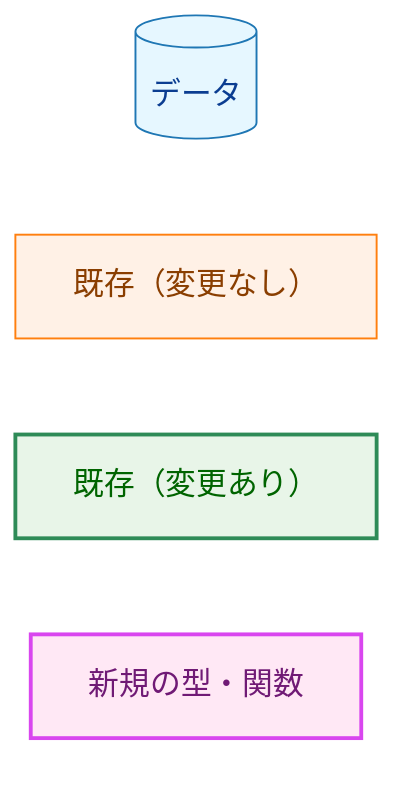

---

## 2. システム構成

### 2.1 現在と本設計後の比較

矢印 A → B は「A のエラーまたはレコードが B へ渡る」を表す。

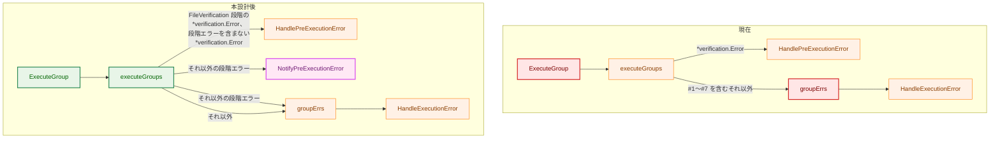

**Legend**

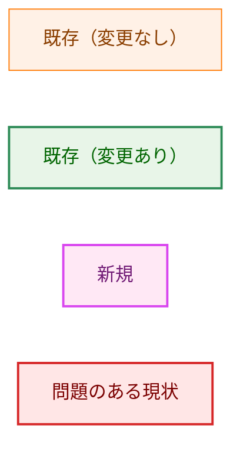

本設計後、段階エラー（`GroupStageFileVerification` の段階で `*verification.Error` を含むものを除く）は「通知」と「`groupErrs` への蓄積」の両方へ渡る。`*verification.Error` の分岐は従来どおり `continue` し、`groupErrs` には積まない（`internal/runner/runner.go:433`）。振り分けの詳細は §3.4 に記す。`HandleExecutionError` は `slack_notify=false` で記録する（変更なし）。

### 2.2 コンポーネント配置

矢印 A → B は「A が B を import する」を表す。本設計で変わる import はない。図は本設計に関わるパッケージだけを示す。

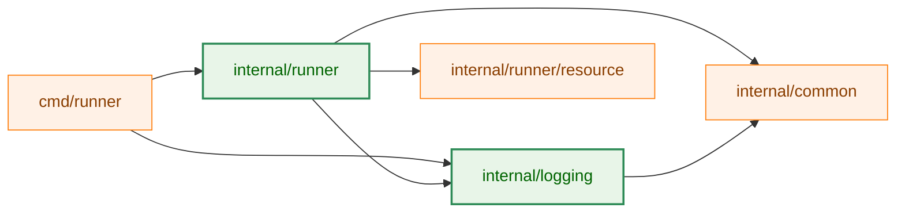

**Legend**

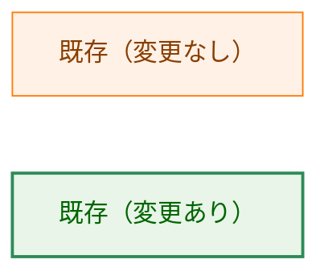

段階エラーの型・段階定義表・変換関数は `internal/runner` の新しいファイル `group_stage.go` に置く。段階エラーを作るのは group executor、読むのは `executeGroups` で、どちらも `internal/runner` にある。同じ group・コマンド名を運ぶ既存のエラー型 `CommandExecutionError` も同じパッケージにある（`internal/runner/group_executor.go:27-41`）。`internal/runner` は `logging`・`common`・`resource` をすでに import しているため、変換関数を置いても import は増えない。`internal/runner/runerrors` は global と group の 2 つの報告箇所が共有する検証失敗の変換のためのパッケージであり（`internal/runner/runerrors/doc.go`）、呼び出し元が 1 か所だけの本設計の変換はそこに置かない。

### 2.3 データフロー（実行前段の失敗の通知）

矢印は呼び出し（実線）と戻り値（破線）を表す。

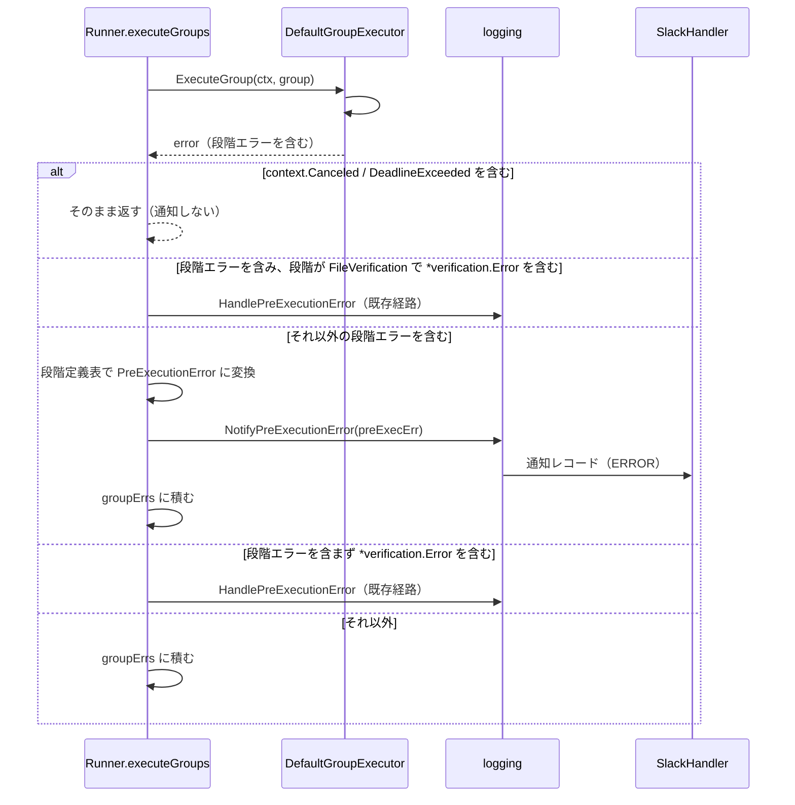

通常の設定では `SlackHandler` への送信は非同期のキュー投入であり（security-architecture.md §14）、`NotifyPreExecutionError` は送信完了を待たない。デバッグ用の同期送信モード（`GSCR_SLACK_SYNC=1`、`internal/runner/bootstrap/logger.go:105-109`）では送信が完了するまで戻らない。これは既存の `HandlePreExecutionError` の通知と同じ扱いであり、本設計では変えない。

---

## 3. コンポーネント設計

### 3.1 型の関係

矢印 `-->` は「保持する」、`..>` は「変換して作る」を表す。

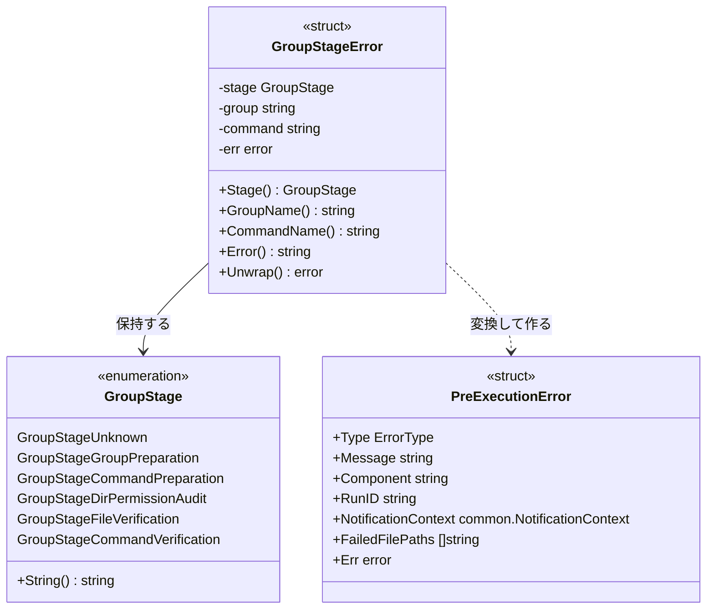

**Legend**: 本図は Mermaid のクラス図であり、色分けはしない。`GroupStage` と `GroupStageError` は新規の型（`internal/runner`）、`PreExecutionError` は既存の型（`internal/logging`、`internal/logging/pre_execution_error.go:50-67`）で、本設計では変えない。

### 3.2 `internal/runner/group_stage.go`: 段階エラーと段階定義表

#### 3.2.1 段階の列挙型

```go
// GroupStage declares which pre-execution step of a group failed. The zero
// value GroupStageUnknown is reported under the generic error type.
type GroupStage int

const (
    GroupStageUnknown             GroupStage = iota // not declared
    GroupStageGroupPreparation                      // #1 group expansion, #2 group workdir
    GroupStageCommandPreparation                    // #3 command expansion and command workdir
    GroupStageDirPermissionAudit                    // #4 group directory permission audit
    GroupStageFileVerification                      // #5 group file verification
    GroupStageCommandVerification                   // #6 path re-resolution, #7 dependency verification
    groupStageCount                                 // closes the range; not a stage
)

func (s GroupStage) String() string
```

- 要件定義書の決定事項の表では、#1・#2 と #3 が同じ `error_type`（`group_preparation_failed`）を共有し、Scope だけが異なる。段階を `GroupStageGroupPreparation` と `GroupStageCommandPreparation` に分けるのは、Scope の水準を段階だけから決められるようにするためである。command 水準の通知の見出しが `group_preparation_failed` になるのは要件の決定どおりであり、要約文（`Command preparation failed`）で区別できる。
- 非公開の `groupStageCount` は列挙の範囲を閉じる。段階定義表は `groupStageCount` 個の要素を持つ配列とし、テストは `GroupStageUnknown` から `groupStageCount` の手前までを走査して、すべての段階に行があることを検証する（§7.1）。

#### 3.2.2 段階エラー

```go
// GroupStageError reports that a group failed before its first command ran,
// and in which stage. Its fields are unexported so a stage is declared only
// through newGroupStageError or newCommandStageError.
type GroupStageError struct {
    stage   GroupStage
    group   string
    command string // set only for command-level stages
    err     error
}

func (e *GroupStageError) Stage() GroupStage
func (e *GroupStageError) GroupName() string
func (e *GroupStageError) CommandName() string
func (e *GroupStageError) Error() string
func (e *GroupStageError) Unwrap() error
```

構築関数は group 水準と command 水準で分け、パッケージ内に閉じる（非公開）。

| 構築関数 | 受け付ける段階 | 呼び出し側の誤りとして拒否する入力 |
|---|---|---|
| `newGroupStageError(stage, group, err)` | 段階定義表で group 水準の段階（`GroupStageUnknown` を含む） | command 水準の段階、範囲外の段階、空の group 名、`nil` の `err` |
| `newCommandStageError(stage, group, command, err)` | 段階定義表で command 水準の段階 | group 水準の段階、`GroupStageUnknown`、範囲外の段階、空の group 名・コマンド名、`nil` の `err` |

- 拒否は panic で行う。これらの入力は設定や実行環境からは生じず、呼び出し側のコードの誤りでしか生じないためである。既存の `RuntimeCommand.Name` も同じ理由で panic する（`internal/runner/base/runnertypes/runtime.go:319-324`）。コマンド名は設定の検証で空文字列を拒否しているため（`internal/runner/config/validation.go:98-100`）、本番の設定では panic しない。§7.2 の発生箇所ごとのテストが、各呼び出しが panic しないことも確かめる。
- 段階と Scope の水準の組み合わせを構築関数で拒否するので、「group 水準の段階にコマンド名が付く」「command 水準の段階にコマンド名が無い」という食い違いは作れない（CLAUDE.md「Reject, don't normalize」）。
- `Error()` は原因のエラーの文言をそのまま返す。`Unwrap()` は原因のエラーを返す。`errors.Is(err, ErrDirPermViolation)` や `errors.Is(err, config.ErrUndefinedVariable)` などの既存の判定は、ラップした後も成り立つ。
- ゼロ値の `GroupStageError{}` はパッケージ内で書けてしまう。その場合も panic しないよう、`Error()` は原因が `nil` のとき固定の文言 `group pre-execution failed` を返す。ゼロ値の段階は `GroupStageUnknown` なので、変換すると汎用行になる。group 名が空なので Scope は不正と判定され、Slack ハンドラは「不正な Scope」の表示で送る（`internal/logging/slack_handler.go:452-460`・`:490-492`）。通知は落ちない。これは頑健性のための扱いであり、AC-10 の「段階不明」の場合ではない。AC-10 の場合は、有効な group 名と原因を持ち段階だけが `GroupStageUnknown` または範囲外の段階エラーであり、汎用行と有効な group 水準の Scope で通知される（§7.1）。

#### 3.2.3 段階定義表と変換関数

段階定義表は、段階ごとに次の 3 項目を持つコード上の 1 つの表である。Scope の水準は `common.NotificationScope`（`internal/common/notification_context.go:13-22`）の値で持つ。

| 段階 | `error_type` | Scope の水準 | 要約文（`Message`） |
|---|---|---|---|
| `GroupStageUnknown`（汎用行） | `group_pre_execution_failed` | group 水準 | `Group pre-execution failed` |
| `GroupStageGroupPreparation` | `group_preparation_failed` | group 水準 | `Group preparation failed` |
| `GroupStageCommandPreparation` | `group_preparation_failed` | command 水準 | `Command preparation failed` |
| `GroupStageDirPermissionAudit` | `group_dir_permission_violation` | group 水準 | `Group directory permission audit failed` |
| `GroupStageFileVerification` | `group_file_verification_failed` | group 水準 | `Group file verification failed` |
| `GroupStageCommandVerification` | `command_verification_failed` | command 水準 | `Command verification failed` |

変換関数 `groupStagePreExecutionError(stageErr *GroupStageError, runID string) *logging.PreExecutionError`（非公開）は、段階定義表を引いて次の値を作る。範囲外の段階は汎用行として扱う。

| フィールド | 値 |
|---|---|
| `Type` | 段階定義表の `error_type` |
| `Message` | 段階定義表の要約文 |
| `Component` | すべての段階で `string(resource.ComponentRunner)` |
| `RunID` | 引数の `runID` |
| `NotificationContext` | group 水準なら `common.GroupScope(group)`、command 水準なら `common.CommandScope(group, command)` |
| `FailedFilePaths` | 設定しない（`nil`） |
| `Err` | 段階エラーの原因のエラー |

- **`Component` を段階ごとに変えない理由。** 既存のガード `TestProductionErrorLiteralsUseTypedComponent` は、本番の `PreExecutionError` リテラルの `Component` が字句として `string(resource.Component<Name>)` であることを求める（`internal/logging/notification_contract_guard_test.go:263-285`）。表から値を読むリテラルはこのガードに通らない。段階の区別は `error_type` が担うので、`Component` は段階エラーを報告する部品（runner）の 1 つに固定し、リテラルを 1 つにする。ガードは変更しない。
- **表の汎用行。** 要件は「段階と `error_type` の対応は（汎用の `error_type` を含む）1 つの表で定義する」と定める。汎用行はゼロ値 `GroupStageUnknown` の行として表の中に置く。
- **`GroupStageFileVerification` の行の前提。** この段階は `VerifyGroupFiles` のすべてのエラーに付くが（§3.3.1）、連鎖に `*verification.Error` を含むものは `executeGroups` が既存の経路へ振り分ける（§3.4 の 3a）。したがって、この行で通知されるのは、段階が `GroupStageFileVerification` で連鎖に `*verification.Error` を含まない失敗だけである。この振り分けは §7.3 のテストで固定する。
- **`FailedFilePaths` を使わない理由。** #1〜#7 の失敗は「失敗した対象の一覧」を持たない。#6・#7 の対象は 1 件で、その対象と理由は原因の文言にすでに含まれる。また `FailedFilePaths` は検証の共有コンストラクタだけが設定するという既存のガード（`TestFiringPointsUseSharedVerificationConstructor`、`internal/runner/runerrors/pre_execution_guard_test.go`）がある。

通知の `Error Message` は `PreExecutionError.Detail()` が作る「要約文: 原因の文言」になる（`internal/logging/pre_execution_error.go:81-89`）。`Detail()` は原因の連鎖に `UserFriendlyError` があるとき、その文言に置き換える。本番の実装は `output.CaptureError` だけであり（`internal/runner/base/output/errors.go:115`）、コマンド実行時の出力取得でしか作られないため、実行前段の原因には現れない。

### 3.3 `internal/runner/group_executor.go`: 段階の宣言

#### 3.3.1 発生箇所・段階・原因のエラー

段階エラーの原因のエラーは、発生箇所が現在返しているエラーそのものとする（#7 を除く）。これにより最終報告の文言は変わらず、通知の本文にも現在の文言が載る。

| # | 発生箇所 | 段階 | 構築関数 | 原因のエラー |
|---|---|---|---|---|
| 1 | `ExecuteGroup` の `config.ExpandGroup` 失敗 | `GroupStageGroupPreparation` | group | `:157` の `failed to expand group[%s]: %w` |
| 2 | `ExecuteGroup` の `resolveGroupWorkDir` 失敗 | `GroupStageGroupPreparation` | group | `:174` の `failed to resolve work directory: %w` |
| 3 | `preExpandCommands` の `ExpandCommand` 失敗・`resolveCommandWorkDir` 失敗 | `GroupStageCommandPreparation` | command（`cmdSpec.Name`） | `failed to pre-expand commands for group[%s]: command[%s] (index %d): ...`（現在 `:194` と `:296`・`:301` の 2 段で作っている文言と同じ） |
| 4 | `auditGroupDirPermissions` の失敗 | `GroupStageDirPermissionAudit` | group | `:340` または `:352` のエラー |
| 5 | `verifyGroupFiles` の `VerifyGroupFiles` 失敗 | `GroupStageFileVerification` | group | `VerifyGroupFiles` が返したエラー |
| 6 | `verifyGroupFiles` の `ResolvePath` 失敗 | `GroupStageCommandVerification` | command（`cmd.Name()`） | `:394` の `command path resolution failed for %q: %w` |
| 7 | `verifyGroupFiles` の `VerifyCommandDependencies` 失敗 | `GroupStageCommandVerification` | command（`cmd.Name()`） | 新たに加える書式 `command dependency verification failed for %q: %w`（§3.3.4） |

- #3 は、コマンド名が分かる `preExpandCommands` の中で段階エラーを作る。現在 `ExecuteGroup` が外側で付けている `failed to pre-expand commands for group[%s]: ` の接頭辞は、原因のエラーの中へ移す。`ExecuteGroup` は段階エラーをそのまま返す。これで最終報告の文言は現在と同じになり、通知の本文にも接頭辞が載る。
- #4 は `auditGroupDirPermissions` の 2 つのエラー（`ErrDirPermViolation` と `errUnhandledCheckSkipReason`）を同じ段階とする。後者は現状到達しない（`internal/runner/group_executor.go:47-52` のコメント）が、到達した場合もディレクトリ権限監査の失敗として通知される。
- #5 は `VerifyGroupFiles` のすべてのエラーを同じ段階の段階エラーでラップする。`*verification.Error` かどうかを group executor で判定しないのは、同じ振り分けを group executor と `executeGroups` の 2 か所に持たないためである。`executeGroups` は宣言された段階で振り分け、`*verification.Error` の有無を見るのは段階が `GroupStageFileVerification` のときだけである（§3.4 の 3a）。この段階で `*verification.Error` を含む失敗は既存の通知経路に残り、本設計はそれを置き換えない。
- group 名は `groupSpec.Name`（`ExecuteGroup`・`preExpandCommands`）または `runnertypes.ExtractGroupName(runtimeGroup)`（`auditGroupDirPermissions`・`verifyGroupFiles`）を渡す。どちらも同じ設定値 `GroupSpec.Name` に由来する。コマンド名 `cmd.Name()` は `RuntimeCommand.Spec.Name` を返す（`internal/runner/base/runnertypes/runtime.go:319-324`）。

#### 3.3.2 `ExecuteGroup` の出口でのラップ

`ExecuteGroup` は、返すエラーについて出口で次の 2 つの規則を守る。

1. **コマンド実行前のエラーは必ず段階エラーを含む。** `executionResult` が未設定（コマンド実行に進んでいない）でエラーを返すとき、そのエラーが段階エラーを含まなければ、`GroupStageUnknown` の段階エラー（group 水準）でラップする。
2. **コマンド実行後のエラーは段階エラーを含まない。** `executionResult` が設定されたあとのエラー（`executeAllCommands` の失敗）には段階エラーを付けない。

`executionResult` はコマンド実行に進んだかどうかを示す既存の状態であり（`internal/runner/group_executor.go:164-170`・`:207-219`）、エラー文字列ではない。規則 1 により、将来 `ExecuteGroup` に実行前段の処理が足され、その発生箇所が段階の宣言を忘れても、失敗は汎用行（`group_pre_execution_failed`）で通知される。規則 2 により、コマンド実行の失敗が `command_group_summary` と本設計の経路の両方で通知されること（二重通知）を防ぐ。どちらの規則も §7.2 のテストで固定する。

#### 3.3.3 規則 1 と要件の関係

要件は「エラー文字列から段階を推測しない」「段階不明は汎用の `error_type` で通知する」と定める。規則 1 は文字列を見ず、`executionResult` と段階エラーの型だけで判定するので、前者に反しない。規則 1 でラップしたエラーの段階は `GroupStageUnknown` であり、後者の「段階不明」に当たる。

#### 3.3.4 #7 の原因の文言にコマンドのパスを加える

AC-07 は、#7 の `Error Message` に「依存検証に失敗したコマンドのパス」と「失敗の理由」の両方が現れることを求める。現状の #7 は `VerifyCommandDependencies` のエラーをラップせずに返す（`internal/runner/group_executor.go:412`）。そのエラーはライブラリやインタプリタのパスを含むが、検証対象のコマンドのパスを含むとは限らない。

本設計では #6 の既存の形（`:394`）に合わせ、#7 の原因を `command dependency verification failed for %q: %w`（`%q` は解決済みのコマンドパス）でラップする。`%q` の引用で、パスに含まれる改行や制御文字はエスケープされる。

この変更により、#7 の失敗では次の出力の文言にもコマンドのパスが接頭辞として加わる。これは原則 7（エラー文言は変えない）の唯一の例外である。

- 最終報告の stderr の `Details`。
- dry-run のプレビュー（テキスト・JSON）の実行エラーの `message`（`cmd/runner/main.go:658-667` の `SetDryRunExecutionError`）。

終了コードと `slack_notify=false` は変わらない（AC-16）。既存テストはこの文言を部分一致で判定しているため（例: `internal/runner/e2e_dynlib_verification_test.go:95`）、接頭辞が加わっても通る。直前の `slog.Error("Command dependency verification failed", ...)`（`:408-411`）はそのまま残す。

### 3.4 `internal/runner/runner.go`: `executeGroups` の振り分け

`executeGroups` は `ExecuteGroup` のエラーを次の順で判定する。段階エラーを含むエラーは、`*verification.Error` の有無より先に、宣言された段階で振り分ける（CLAUDE.md「Declare, don't infer」）。

1. `ctx.Done()` が閉じていれば、残りの group を実行せず `ctx.Err()` を返す（`internal/runner/runner.go:411-417`。変更なし）。
2. エラーが `context.Canceled` または `context.DeadlineExceeded` を含めば、そのまま返す（`:422-424`。変更なし）。
3. **（新設）** エラーが `*GroupStageError` を含めば、その段階で振り分ける。
   - 3a. 段階が `GroupStageFileVerification` で、かつ連鎖に `*verification.Error` を含めば、既存の経路（`runerrors.NewVerificationPreExecutionError` と `logging.HandlePreExecutionError`）で通知し、`groupErrs` に積まずに次の group へ進む（現在の `:427-433` と同じ処理）。
   - 3b. それ以外なら、段階定義表で `PreExecutionError` に変換し、`logging.NotifyPreExecutionError` で通知レコードを記録する。そのうえで `groupErrs` に積む。
4. エラーが段階エラーを含まず `*verification.Error` を含めば、既存の経路で通知し、`groupErrs` に積まずに次の group へ進む（`:427-433`。変更なし）。本番の `ExecuteGroup` はコマンド実行前のエラーを必ず段階エラーで返すので（§3.3.2 規則 1）、この分岐に来るのは、生の `*verification.Error` を返すモックの group executor を使うテスト（`TestRunner_VerificationErrorCarriesGroupScopeAndCleanMessage`・`TestRunner_VerificationErrorCarriesFailedFilePathsAndComponent`）などである。
5. 上のいずれでもなければ、`groupErrs` に積む（`:436`。変更なし）。

- **段階で先に振り分ける理由。** `ManagerInterface` の `ResolvePath`・`VerifyCommandDependencies` は `error` を返す（`internal/verification/interfaces.go:5-9`）。現在 `*verification.Error` を作るのは `newVerificationError`（`internal/verification/manager.go:254`）だけで、その呼び出し元は `VerifyGlobalFiles`（`:171`）と `VerifyGroupFiles`（`:198`・`:241`）だけである。しかし、インタフェースは #6・#7 の原因の連鎖に `*verification.Error` が入ることを禁じていない。`*verification.Error` の有無を段階より先に判定すると、そのような #6・#7 の失敗は既存の経路に振り分けられ、`group_file_verification_failed`・group 水準で通知され、`continue` によって `groupErrs` から外れて終了コードまで変わる。段階を先に読むことで、#6・#7 は原因の連鎖によらず `command_verification_failed`・command 水準で通知され、`groupErrs` に積まれる。
- 3a により、`GroupStageFileVerification` でラップされた `*verification.Error` は既存の経路で通知され、本設計の経路では通知されない（AC-12）。
- 3 が 2 の後にあるので、キャンセルを含む段階エラーは通知されない（AC-14）。
- 3b で `continue` せず `groupErrs` に積むので、最終報告と終了コードは変わらない（AC-16）。
- `errors.AsType` は `fmt.Errorf` の `%w` によるラップを辿る。`executeGroups` が受け取るエラーは `ExecuteGroup` が返したものそのままであり（`Runner.ExecuteGroup`、`internal/runner/runner.go:491-493`）、この判定の順で振り分けられる。

この振り分けは §7.3 のテストで固定する。

**`main.go` との関係。** `mainWithExitCode` は `*logging.PreExecutionError` の判定を `*logging.ExecutionError` より先に行う（`cmd/runner/main.go:233`・`:238`）。`ExecutionError.Unwrap` は原因の連鎖を公開するので、`executeGroups` の戻り値の連鎖に `*logging.PreExecutionError` が含まれると、最終報告が `HandlePreExecutionError`（`slack_notify=true`）に振り分けられ、Slack へ 2 件目が届く。本設計では変換した `PreExecutionError` を `executeGroups` の中で通知に使うだけにし、戻り値の連鎖には含めない。現在 `ExecuteGroup` から到達する処理は `*logging.PreExecutionError` を作らない（作るのは `cmd/runner/main.go`・`internal/runner/bootstrap`・`internal/runner/runerrors` だけ）。これを設計上の制約とし、§7.4 の統合テストで「通知は 1 件、最終報告は `slack_notify=false`」を検証する。

### 3.5 `internal/logging/pre_execution_error.go`: 記録のみの通知と `error_type`

#### 3.5.1 `error_type` の追加

```go
const (
    // ErrorTypeGroupPreparation represents a group or command preparation failure
    // (expansion or working directory resolution) before any command ran.
    ErrorTypeGroupPreparation ErrorType = "group_preparation_failed"
    // ErrorTypeGroupDirPermissionViolation represents a group-level directory
    // permission audit violation.
    ErrorTypeGroupDirPermissionViolation ErrorType = "group_dir_permission_violation"
    // ErrorTypeCommandVerification represents a command-level verification
    // failure (path re-resolution or dependency verification).
    ErrorTypeCommandVerification ErrorType = "command_verification_failed"
    // ErrorTypeGroupPreExecution is the generic type for a group pre-execution
    // failure whose stage was not declared.
    ErrorTypeGroupPreExecution ErrorType = "group_pre_execution_failed"
)
```

`group_file_verification_failed` は既存の `ErrorTypeGroupFileVerification`（`internal/logging/pre_execution_error.go:42-43`）を使う。`error_type` は `pre_execution_error` 種別の中の値であり、`message_type` の登録（`internal/logging/notification.go:89-96`）は変わらない。

#### 3.5.2 記録のみの通知

```go
// NotifyPreExecutionError records the pre-execution error notification record
// only. Unlike HandlePreExecutionError it writes neither the stderr report nor
// the RUN_SUMMARY line: the caller continues, and the process-level report is
// made once at the end of the run.
func NotifyPreExecutionError(preExecErr *PreExecutionError)
```

- 記録するレコードの属性（`error_type`・`error_message`・`component`・`run_id`、通知属性と通知コンテキスト、`failed_file_paths`）は `HandlePreExecutionError` と同じにする。属性の組み立てとレコードの記録は `HandlePreExecutionError` と共有し、2 か所で書き分けない（DRY）。共有部分は `handleErrorCommon` から切り出すので、`HandleExecutionError` のレコードの記録も同じ部分を通るようになる。どちらの記録内容も変わらない。
- レコードのレベルは ERROR とする。`pre_execution_error` の優先度は登録時に高と決まっており（`internal/logging/notification.go:92-93`）、レベルは ERROR 用 Webhook への振り分けに使われる。
- レコードのメッセージは `Pre-execution error notified` とし、`HandlePreExecutionError` の `Pre-execution error occurred` と区別する。ログを読む運用者とテストが、報告出力を伴う経路か記録のみの経路かを見分けられるようにするためである。Slack のビルダーはレコードのメッセージを使わないので、通知の見た目は変わらない。
- `slack_notify=true` は `logging.NotificationAttrs` を通して設定する。`slack_notify=true` を設定してよい本番経路は `NotificationAttrs` だけという既存の制約（`TestProductionCodeSetsSlackNotifyOnlyInNotificationAttrs`）を守る。

**`HandlePreExecutionError` を使わない理由。** `HandlePreExecutionError` は報告出力も行う（`:126-157`）。group ごとに呼ぶと実行の途中に `RUN_SUMMARY` 行が出て、最終報告と合わせて行数が増える。要件（スコープ 6、AC-15）はこれを禁じている。既存の関数の引数で報告出力を止める案は、既存の本番の呼び出し元 6 か所すべてに引数を足すことになり、記録のみという性質も関数名に現れない。専用の関数を足すほうが呼び出し側の意図が明確である。

### 3.6 変更しないもの

- `pre_execution_error` のビルダー `buildPreExecutionError`（`internal/logging/slack_handler.go:841-876`）とフィールド集合（`Error Message`・`Component`）、共通エンベロープ、`message_type` の登録（AC-17）。
- 表示安全な補間契約（`common.Interpolate`）と `RedactingHandler`。
- `*verification.Error` の通知経路と `runerrors.NewVerificationPreExecutionError`（AC-12）。
- `command_group_summary`・`user_group_command_failure` の通知経路（AC-13）。
- `executeGroups` の戻り値（先頭のエラーのみ）、`main.go` の最終報告、終了コード（AC-16）。
- dry-run 時に Slack へ送信しない挙動（§5.4）。
- 通知と報告に関わる既存のガードテスト（§3.8）。

### 3.7 既存方針からの例外: 本文の中の group 名・コマンド名・パス

0175 は group ファイル検証の通知について、本文（自由文の `error_message`）に入れるものを次の 2 つの原則で制限した（[0175 02_architecture.md §1.2](../0175_group_verification_error_failed_files/02_architecture.md#12-設計原則)）。

- 原則 2: group 名は Scope に一本化し、本文へ別個のメタデータとして足さない。
- 原則 7: ファイルのパスを自由文の `Message` へ入れず、値全体置換で本文全体が消える経路を避ける。パスは構造化属性 `failed_file_paths` で運ぶ。

本設計の本文は「要約文: 原因の文言」であり、次の理由でこの 2 つの原則の例外になる。

- **group 名・コマンド名（原則 2）。** 原因の文言には、既存のエラー書式（`failed to expand group[%s]`・`command[%s] (index %d)` など。`internal/runner/group_executor.go:157`・`:194`・`:296`・`:301`、`config.ExpandWorkDir` に渡す `level` の `:642`・`:679`）によって group 名やコマンド名がすでに含まれている。本設計は本文に group 名を足さないが、原因の文言から取り除かない。取り除くには原因の文言を文字列として加工するか、`config` パッケージを含むエラー書式を変える必要がある。前者は「Declare, don't infer」に反し、後者は本タスクの範囲（通知経路の追加）を超え、最終報告の文言も変える。
- **パス（原則 7）。** AC-06・AC-07 は、解決できなかったコマンドや依存検証に失敗したコマンドのパスを `Error Message` に載せることを求める。#6・#7 の対象は 1 件で、0175 の一覧契約で運ぶべき「一覧」がない。また、原因の文言には作業ディレクトリや依存ライブラリのパスも含まれる。これらを構造化属性へ分けるには、原因のエラーの型ごとにパスを取り出す仕組みが要り、本タスクの範囲を超える。

**既存テストへの影響。** この例外は新しい経路にだけ関わる。group ファイル検証の本文（0175）は変わらず、`TestRunner_VerificationErrorCarriesGroupScopeAndCleanMessage`・`TestRunner_VerificationErrorCarriesFailedFilePathsAndComponent`（`internal/runner/runner_test.go`）の「本文に group 名・パスを含まない」という検証も変わらない。更新が必要な既存テストはない。

**影響。** 本文の group 名・コマンド名・パスは識別子の型宣言を受けない自由文であり、値全体置換で本文全体が `[REDACTED]` になりうる。その頻度と運用上の扱いは §5.2 に記す。

### 3.8 既存テストへの影響

| テスト | 影響 |
|---|---|
| `internal/runner/group_executor_test.go` の `require.ErrorIs` / `assert.ErrorIs`（`ErrDirPermViolation`・`config.ErrUndefinedVariable`・注入したエラーなど） | 段階エラーの `Unwrap()` で連鎖が保たれるため、変更不要 |
| `internal/runner/runner_test.go::TestWithDirPermAuditor_ReachesGroupExecution`（`assert.ErrorIs(t, err, ErrDirPermViolation)`） | 同上。変更不要 |
| `internal/runner/runner_test.go::TestRunner_VerificationErrorCarriesGroupScopeAndCleanMessage`・`TestRunner_VerificationErrorCarriesFailedFilePathsAndComponent` | モックが生の `*verification.Error` を返すため、変更不要。段階エラーでラップした場合の回帰は新しいテストで追加する（§7.3） |
| `internal/runner/e2e_dynlib_verification_test.go`・`e2e_shebang_test.go` の依存検証失敗のテスト | #7 の文言にコマンドパスの接頭辞が加わる。部分一致で判定しているため変更不要（§3.3.4） |
| `internal/logging/notification_contract_guard_test.go::TestProductionErrorLiteralsUseTypedComponent` | 新しいリテラルは 1 つで、`Component` は `string(resource.ComponentRunner)` なので通る。変更不要 |
| 同ファイルの `TestProductionPreExecutionErrorLiteralsCarryNotificationContext`・`TestProductionCodeSetsSlackNotifyOnlyInNotificationAttrs` など | 新しいリテラルは `NotificationContext` を設定し、`slack_notify` は `NotificationAttrs` 経由で設定するため、変更不要 |
| `internal/runner/runerrors/pre_execution_guard_test.go::TestFiringPointsUseSharedVerificationConstructor` | 新しい変換関数は `FailedFilePaths` を設定しないため、変更不要 |

### 3.9 コンポーネント責務表（新規・変更ファイル）

| ファイル | 区分 | 責務 |
|---|---|---|
| `internal/runner/group_stage.go` | 新規 | `GroupStage`・`GroupStageError`・構築関数 2 つ・段階定義表・変換関数 |
| `internal/runner/group_stage_test.go` | 新規 | 段階定義表の全行と網羅、汎用行、構築関数の拒否、`Error()`・`Unwrap()`・ゼロ値のテスト |
| `internal/logging/pre_execution_error.go` | 変更 | `error_type` 定数 4 件の追加、`NotifyPreExecutionError` の追加、レコード記録部分の共有化 |
| `internal/logging/pre_execution_error_test.go` | 変更 | `NotifyPreExecutionError` が報告出力を行わず、`HandlePreExecutionError` と同じ属性を記録するテスト |
| `internal/runner/group_executor.go` | 変更 | #1〜#7 で段階エラーを返す。#3 の接頭辞を内側へ移す。#7 の原因にコマンドパスを加えてラップする。出口の規則 1・2 |
| `internal/runner/group_executor_test.go` | 変更 | 発生箇所ごとの段階・group 名・コマンド名、出口の規則 1・2 のテスト |
| `internal/runner/runner.go` | 変更 | `executeGroups` に段階エラーの分岐を追加 |
| `internal/runner/runner_test.go` | 変更 | `Execute` 経由の通知・振り分け順・複数 group・本文の安全性のテスト |
| `cmd/runner/integration_pre_execution_error_test.go` | 変更 | stdout の `RUN_SUMMARY` 行、stderr の `Error:` ブロック、終了コード、最終報告、通知レコードの件数のテスト |
| `sample/slack-group-notification-test.toml` | 変更 | 実行前段の失敗の場面を加え、対象環境で表示を確かめる（§5.3） |
| `Makefile` | 変更 | `slack-group-notification-test` の期待通知の一覧とログの確認項目に、追加した実行前段の失敗の場面の `pre_execution_error` 通知と新しい `error_type` を加える（§5.3） |
| `docs/user/runner_command.ja.md` | 変更 | 「通知設定」に group 実行前段の失敗の通知、新しい `error_type`、Scope を追記 |
| `docs/user/runner_command.md` | 変更 | 日本語版から `/mktrans` で反映 |

`docs/dev/architecture_design/security-architecture.md` は通知の経路の一覧を持たないため変更しない。

---

## 4. エラーハンドリング設計

### 4.1 エラー型

| 型 | パッケージ | 役割 |
|---|---|---|
| `*GroupStageError` | `internal/runner` | 実行前段の失敗と段階を運ぶ（新設。§3.2.2） |
| `*logging.PreExecutionError` | `internal/logging` | 通知レコードの形。`executeGroups` の中で段階エラーから作り、戻り値には含めない（既存） |
| `*verification.Error` | `internal/verification` | group ファイル検証の失敗。既存の経路で通知する（既存） |
| `*logging.ExecutionError` | `internal/logging` | 最終報告。`cmd/runner/main.go` が作る（既存・変更なし） |

新しいセンチネルエラーは足さない。原因の連鎖にある既存のセンチネル（`ErrDirPermViolation`・`config.ErrUndefinedVariable` など）は、`errors.Is` でそのまま判定できる。

### 4.2 通知の本文

`Error Message` は `<要約文>: <原因の文言>` の形になる。例を示す（原因の文言は §3.3.1 のとおり）。

| # | 例 |
|---|---|
| 1 | `Group preparation failed: failed to expand group[backup]: <原因>` |
| 3 | `Command preparation failed: failed to pre-expand commands for group[backup]: command[dump] (index 0): <原因>` |
| 4 | `Group directory permission audit failed: directory permission audit failed for group[backup]: 2 directory violation(s) detected; review directory permissions` |
| 6 | `Command verification failed: command path resolution failed for "/usr/local/bin/dump": <原因>` |
| 7 | `Command verification failed: command dependency verification failed for "/usr/local/bin/dump": <原因>` |

- 本文は通知ビルダーで表示安全な補間契約（1 行化・制御文字と書式制御文字の除去・500 byte 上限）を通る（`internal/logging/slack_handler.go:866`）。上限を超える本文は末尾が切り詰められる。要約文を先頭に置くのは、切り詰められても段階が本文の先頭に残るようにするためである。
- #4 の本文は違反の件数だけを示し、違反したディレクトリを示さない。ディレクトリは監査が出すディレクトリごとの WARN ログ（`insecure directory permissions`、`internal/security/dir_permissions_audit.go:66-69`）にある。本文にディレクトリを載せる改善は本タスクの対象外とする（§9）。

### 4.3 fail secure の扱い

| 状況 | 挙動 |
|---|---|
| 発生箇所が段階の宣言を忘れた（コマンド実行前のエラーが段階エラーを含まない） | `ExecuteGroup` の出口で `GroupStageUnknown` でラップされ、汎用行（`group_pre_execution_failed`・group 水準）で通知される（§3.3.2 規則 1、AC-10） |
| 段階が `GroupStageUnknown`・範囲外で、group 名と原因は有効 | 汎用行（`group_pre_execution_failed`）と有効な group 水準の Scope（`group=<group>`）で通知される（§3.2.3、AC-10） |
| 段階エラー全体がゼロ値（`GroupStageError{}`） | panic せず、汎用行で通知される。group 名が空なので Scope は不正と表示されて送られる（§3.2.2。頑健性のための扱いで、AC-10 の場合ではない） |
| 構築関数に食い違う入力（段階と水準の不一致、空の名前、`nil` の原因） | panic する。呼び出し側のコードの誤りであり、§7.2 のテストで各発生箇所を実行して検出する（§3.2.2） |
| コマンド実行後のエラーに段階エラーが付いた | 規則 2 に反する。§7.2 のテストで検出する（§3.3.2） |
| 通知の記録そのものの失敗（Slack の送信失敗・キュー満杯） | 既存の Slack 送信機構の扱い（failure logger への記録）に従う。実行は止めない（§5.5） |

---

## 5. セキュリティ考慮事項

### 5.1 脅威モデル

矢印 A → B は「A の値が B へ流れる」を表す。点線 T → X は「脅威 T を X が防ぐ」を表す。

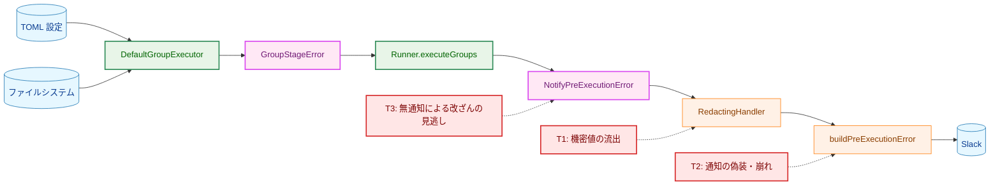

**Legend**

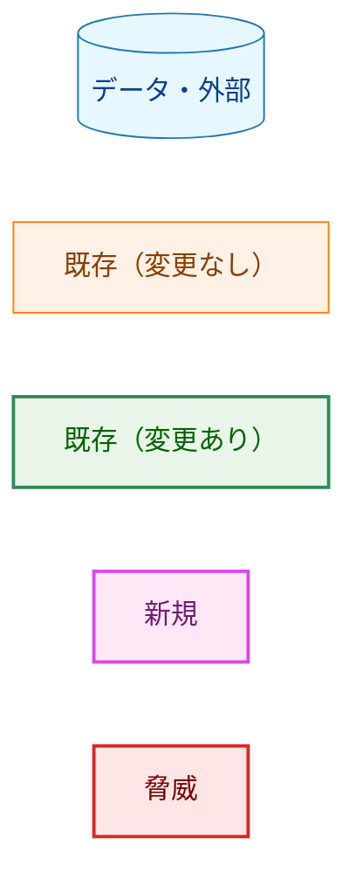

| 脅威 | 対策 |
|---|---|
| T1: 原因の文言（展開後のパス・変数名・テンプレートを含みうる）に含まれる機密値が Slack に届く | 本文を `error_message` 属性として記録し、`RedactingHandler` の redaction（key=value 置換・値形式の検出・値全体の置換）を受けさせる（AC-19）。redaction の範囲は変えない |
| T2: 改行や制御文字を含む値が通知の行を偽装する、または長い本文が通知を壊す | ビルダーの表示安全な補間契約（1 行化・制御文字の除去・500 byte 上限）を通す（AC-18）。#6・#7 のコマンドパスは `%q` で引用されるが、#1〜#3 の原因の文言は引用されない。未定義変数のエラーは生のテンプレートを `(context: %s)` で埋め込むため（`internal/runner/config/errors.go:262-268`）、複数行の TOML 文字列がそのまま入りうる（group の `vars` の未定義変数では `Context` が空になり、テンプレートは入らない）。この経路の保護は補間契約だけが担う。§7.5 は、引用を受けない #1・#3 の経路と、引用と補間契約を組み合わせた #6・#7 の経路の両方を検証する。Scope の group 名・コマンド名は識別子として補間される |
| T3: 依存ライブラリ・インタプリタの差し替えやディレクトリ権限の違反が Slack で気付かれない | #4・#6・#7 を段階エラーとして通知する（本タスクの目的）。段階の宣言を忘れた失敗も汎用行で通知する（§3.3.2） |

### 5.2 redaction の扱いと、本文が読めないときの運用

原因の文言は自由文（`KindString`）の `error_message` として記録されるため、`RedactingHandler` の値全体置換を受ける。値全体置換は未アンカーの部分一致であり、`(?i)(password|token|secret|key|api_key)` や `bearer`・`basic`・`authorization` などを含む（`internal/redaction/sensitive_patterns.go:40-51`、判定は `:131-134`）。本文にこれらが含まれると、`Error Message` 全体が `[REDACTED]` になる。本設計の本文では、次のような普通の値で起きやすい。

- #1〜#3: 未定義変数のエラーは変数名を含み、`vars` 以外（`env_vars`・`workdir`・`cmd` など）では生のテンプレートも含む（`internal/runner/config/errors.go:262-268`）。`api_key`・`ssh_key`・`token_file` のような変数名で必ず起きる。
- #6・#7: `ssh-keygen` のようなコマンドパスや、`libkeyutils.so.1` のような依存ライブラリのパスで起きる。
- 本文中の group 名・コマンド名（§3.7）が上の語を含む場合。

これは既存の `error_message` の挙動であり、要件は redaction の範囲を変えないことを求めている（スコープ「対象外」）。

本文が `[REDACTED]` になっても、`error_type` と Scope は残る。Scope の group 名・コマンド名は識別子として redaction を免除される（security-architecture.md §9）。したがって運用者は、どの group・コマンドのどの段階で失敗したかは通知から分かる。原因の文言の残り方は次のとおりである。

| 出力 | 原因の文言 |
|---|---|
| Slack 通知・ログファイル・コンソールのログ | すべて同じ `RedactingHandler` を通るため（`internal/runner/bootstrap/logger.go:280-291`）、同様に `[REDACTED]` になる |
| 最終報告の stderr の `Details` | redaction を通らずに残る。ただし `executeGroups` が返すのは先頭のエラーだけなので（`internal/runner/runner.go:441-442`）、最初に失敗した group の分だけである |
| #7 の直前の `slog.Error`（`internal/runner/group_executor.go:408-411`） | ログのレコードなので同じく redaction を受ける |

2 件目以降に失敗した group で本文が `[REDACTED]` になった場合、その原因はどの出力にも残らない。運用者は `--groups=<group>` でその group だけを再実行し、最終報告の stderr で原因を確かめる。値全体置換の誤検出を減らす改善は redaction 側の別タスクとし、起票の候補として §9 に記す。

### 5.3 外部 API と対象環境

新しい Slack の機能（Block Kit 要素など）は使わない。既存の `pre_execution_error` のビルダーとフィールドをそのまま使い、新しいのは `error_type` の値（見出し）と本文の内容だけである。表示の形式は既存の `pre_execution_error` と同じになる。実装では `sample/slack-group-notification-test.toml` に実行前段の失敗（例: 未定義変数を参照する group）の場面を加え、`make slack-group-notification-test` で対象環境の表示を確かめてから PR を完了とする。あわせて、このターゲットの期待通知の一覧とログの確認項目（`Makefile:666-675`）にこの通知（`message_type=pre_execution_error` と新しい `error_type`）を加え、手動確認で何が現れるべきかをレビュアーに示す。

### 5.4 dry-run の副作用

| 副作用 | 通常実行 | dry-run |
|---|---|---|
| 通知レコードの記録（ログファイル・コンソール） | する | する |
| Slack への送信 | する | しない（dry-run では送信機構を持たない。`internal/logging/slack_handler.go:350-355`） |
| stdout の `RUN_SUMMARY` 行・stderr の `Error:` ブロック（本設計の経路） | 出さない | 出さない |
| 最終報告・終了コード | 従来どおり | 従来どおり（`SetDryRunExecutionError` の扱いも変えない。`cmd/runner/main.go:658-667`） |

dry-run でも実行前段の処理は通常どおり走るため、段階エラーは同じように作られ、通知レコードも記録される。Slack へ送らないのは既存の `SlackHandler` の抑止による。#7 の文言の変更は dry-run のプレビューにも現れる（§3.3.4）。

### 5.5 運用上の影響

**通知の増加と見出し。** これまで無通知だった失敗が ERROR 用 Webhook に届くようになる。導入後、設定の誤りで group が失敗している環境では新しい通知が届き始める。見出し（`error_type`）には新しい値 4 種（`group_preparation_failed`・`group_dir_permission_violation`・`command_verification_failed`・`group_pre_execution_failed`）が現れる。Slack 側で見出しの語でアラートを振り分けている場合は、この値を加える必要がある。利用者向け文書（AC-20）で値の意味を説明する。

**ログの増加。** 失敗した group ごとに、通知レコードがログに 1 行増える（レベル ERROR、メッセージ `Pre-execution error notified`）。対話端末でも dry-run でもない実行では、コンソールのログは stdout に出る（`cmd/runner/main.go:281-284`）。`RUN_SUMMARY` 行は増えないので、それを解析する監視は影響を受けない（AC-15）。ログの `level=ERROR` を数える監視には、新しい行が加わる。これらの失敗は現在も終了コード 1 で終わる失敗であり、新しい行はそれを group ごとに示すものなので、受け入れる。

**通知の集中。** 通知は失敗した group ごとに 1 件で、優先度は高である。実行前段の失敗は 1 group あたりミリ秒以下で起き、group は逐次に実行される。一方、送信ワーカーは 1 つで、1 件の送信は再試行を含めて最大 40 秒かかりうる（`internal/logging/slack_sender.go:37`）。したがって、共通の原因（多くの group が共有する変数の未定義、共有ディレクトリの権限違反など）で多数の group が続けて失敗すると、通知は送信より速く高優先度キューに積まれる。具体的な影響は次のとおりである。

- 高優先度キューの容量は 32 件である（`internal/logging/slack_sender.go:51`）。送信が進む前に 33 件以上たまると、それ以上は破棄され、破棄は failure logger に `queue_full` として記録されるだけになる。このとき Slack の通知件数は失敗した group の数と一致しない。
- 終了時の flush は全体で 15 秒、1 件 5 秒で、再試行しない（`internal/logging/slack_sender.go:40-44`）。高優先度キューから先に送るため、高優先度の通知が多いと、実行に進んだ group の `command_group_summary`（通常優先度）が flush の時間内に送られないことがある。

既存の容量の根拠は「1 回の実行で 32 件を超える実行前エラーはそれ自体が障害であり、件数だけで十分」という判断である（`internal/logging/slack_sender.go:47-50` のコメント）。本設計はこの判断に従い、容量と flush の設定は変えない。32 件を超える失敗が起きた実行でも、最初の失敗は最終報告に残り、終了コードは 1 になる。

**切り戻し。** 本設計の変更は `internal/runner`・`internal/logging` のコードに閉じ、設定ファイルや記録ファイルの形式を変えない。実行時に本設計の通知だけを止める設定は設けない。切り戻しは本タスクの PR を revert して行う。

---

## 6. 処理フロー詳細

### 6.1 `executeGroups` の振り分け

矢印は判定の順序を表す。

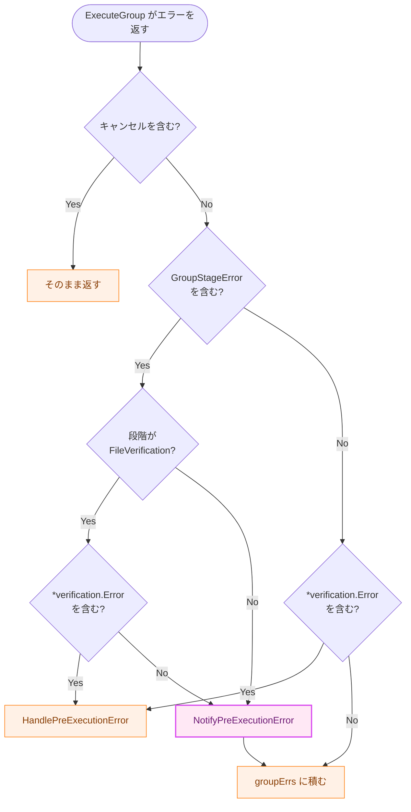

**Legend**

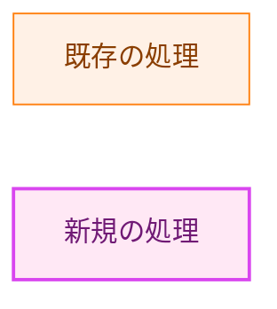

`HandlePreExecutionError` の後と `groupErrs` に積んだ後は、次の group へ進む。

### 6.2 段階の決定

矢印は判定の順序を表す。

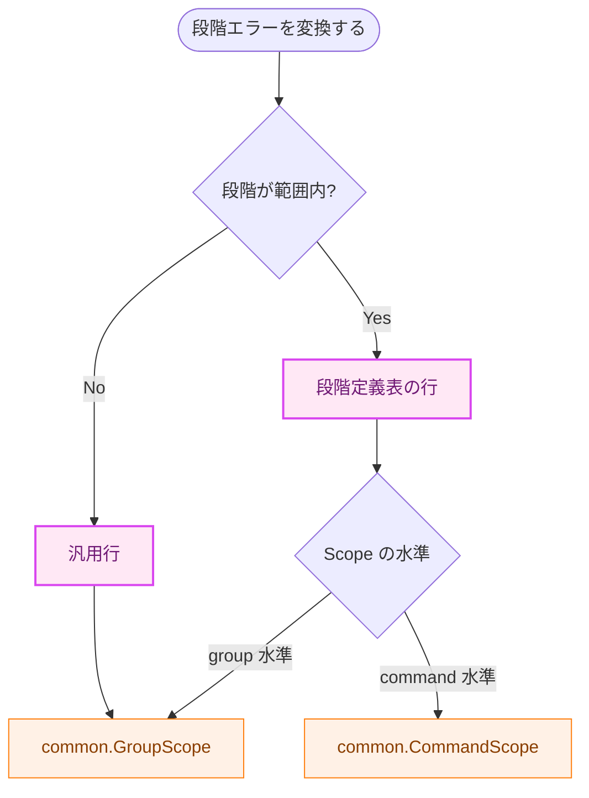

**Legend**

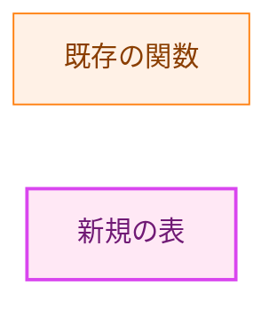

### 6.3 #7（依存検証の失敗）の流れ

1. `verifyGroupFiles` がコマンドのパスを再解決し、`VerifyCommandDependencies` を呼ぶ。
2. 依存検証が失敗すると、既存の `slog.Error("Command dependency verification failed", ...)` を記録する。
3. 原因を `command dependency verification failed for "<パス>": <原因>` でラップし、`GroupStageCommandVerification`・group 名・コマンド名とともに段階エラーにして返す。
4. `executeGroups` は段階エラーを `command_verification_failed`・`group=<group> command=<command>` の通知レコードに変換して記録し、`groupErrs` に積んで次の group へ進む。
5. 全 group の後、`main.go` が最終報告（`slack_notify=false`）を 1 回行い、終了コード 1 で終わる。

---

## 7. テスト戦略

各テストは、対象の挙動を壊すと失敗することを実装時に確認し、コミットメッセージに記す（AC-22）。本書はどのテストが何を検証するかだけを定める。

### 7.1 単体テスト: 段階定義表と段階エラー（AC-09・AC-10）

- `GroupStageUnknown` から `groupStageCount` の手前までを走査し、すべての段階に表の行があること、`GroupStageUnknown` 以外の段階が汎用行ではないことを検証する。
- 各段階について、変換結果の `Type`・`Message`・`Component`・`NotificationContext`・`Err` を検証する。期待値は要件定義書の決定事項の表から書く。
- 段階不明・範囲外の段階（AC-10）。有効な group 名と `nil` でない原因を持ち、段階が `GroupStageUnknown`（`newGroupStageError` で作る）または範囲外の値 `GroupStage(99)`（構築関数は範囲外の段階を拒否するので、パッケージ内のリテラルで作る）の段階エラーについて、変換結果が汎用行の `Type`・`Message` を持ち、`NotificationContext` が有効な group 水準の Scope（`group=<group>`）になることを検証する。
- ゼロ値の `GroupStageError{}`（頑健性。AC-10 の場合ではない）。`Error()` が panic せず固定の文言を返すこと、変換結果が汎用行を使うこと、group 名が空なので Scope が不正と表示されることを検証する。
- 原因の文言が別の段階を示唆する入力（例: 原因の文言に `verification` や `permission` を含むが、段階は `GroupStageGroupPreparation`）で、`error_type` が宣言された段階に従うことを検証する（AC-09）。
- 構築関数が、段階と水準の不一致・空の名前・`nil` の原因で panic することを検証する。
- `Error()` が原因の文言と一致し、`errors.Is` / `errors.AsType` が原因の連鎖を辿れることを検証する。

### 7.2 単体テスト: group executor（AC-11・AC-01〜AC-07・AC-10・AC-13）

`internal/runner/group_executor_test.go` で #1〜#7 をそれぞれ失敗させ、返ったエラーから `errors.AsType[*GroupStageError]` で段階エラーを取り出し、段階・group 名・コマンド名と `Error()` の文言を検証する。

| # | 失敗のさせ方（既存テストの手法を流用） |
|---|---|
| 1 | 未定義変数を参照する group の `env_vars` の値（`config.ErrUndefinedVariable`）。`vars` の未定義変数は原因の文言に展開前のテンプレートを含まないため、改行を含む原因の確認（§3.7）には `env_vars` を使う |
| 2 | 未定義変数を参照する group の `workdir` |
| 3 | 未定義変数を参照するコマンドの `cmd` と、コマンドの `workdir` の 2 通り |
| 4 | world-writable なディレクトリを参照する `verify_files`（`TestWithDirPermAuditor_ReachesGroupExecution` と同じ手法） |
| 5 | `VerifyGroupFiles` が `*verification.OpError` を返すモックの検証マネージャ |
| 6 | `VerifyGroupFiles` は成功し、`ResolvePath` がエラーを返すモック |
| 7 | `VerifyCommandDependencies` がエラーを返すモック。`Error()` にコマンドパスと原因の両方が含まれることも検証する |

出口の規則（§3.3.2）も検証する。

- 規則 1: 段階の宣言を持たないコマンド実行前のエラーが `GroupStageUnknown` でラップされること。テスト用に段階エラーを返さない失敗を注入する手段（既存のモックで作れる失敗を 1 つ、段階の宣言を外した状態で通す）を実装計画で定める。
- 規則 2: コマンド実行の失敗（`CommandExecutionError`）が段階エラーを含まないこと（AC-13）。

### 7.3 `Execute` 経由の配線テスト（AC-01〜AC-08・AC-12〜AC-14・AC-16）

`internal/runner/runner_test.go` で、モックの group executor が返すエラーを変えて `Runner.Execute` を呼び、ログレコーダ（`tu.NewLogRecorder`）で通知レコードを検証する。

- 各段階の段階エラー → `Pre-execution error notified` のレコードが 1 件で、`message_type`・`error_type`・通知コンテキスト・`component`・`error_message`（`<要約文>: <原因の文言>`）が期待どおり。`Execute` はエラーを返す（AC-01〜AC-07・AC-16）。
- 2 つの group がそれぞれ段階エラーで失敗 → レコードが 2 件で、それぞれの group の Scope を持つ（AC-08）。
- `GroupStageFileVerification` でラップした `*verification.Error` → 既存の `Pre-execution error occurred` のレコードが 1 件だけで、本設計のレコードは 0 件。本文・`failed_file_paths`・Scope はラップしない場合と同じ（AC-12）。このテストが §3.4 の 3a の振り分けを固定する。
- `GroupStageCommandVerification` の段階エラーで、原因が `*verification.Error` のもの → `Pre-execution error notified` のレコードがちょうど 1 件で、`error_type` は `command_verification_failed`、Scope は command 水準（`group=<group> command=<command>`）。既存の `Pre-execution error occurred` のレコードは 0 件で、`Execute` の戻り値はこのエラーを含む（`groupErrs` に積まれる）。このテストが §3.4 の 3b の振り分け（段階が `*verification.Error` の有無より先に読まれること）を固定する。
- コマンド実行の失敗（`CommandExecutionError`）→ 本設計のレコードは 0 件（AC-13）。既存の `command_group_summary` のテストは変えない。
- `context.Canceled`・`context.DeadlineExceeded` をラップした段階エラー → 本設計のレコードは 0 件（AC-14）。

### 7.4 統合テスト: 報告出力と最終報告（AC-15・AC-16）

`cmd/runner/integration_pre_execution_error_test.go` の手法で、#1 の失敗（未定義変数を複数行の値で参照する group の `env_vars`）を 1 件だけ起こす設定で実行し、次を検証する。

- stdout の `RUN_SUMMARY` 行がちょうど 1 行。
- stderr の `Error:` ブロックがちょうど 1 つ（最終報告の分）。
- 終了コードが 1。
- 最終報告のレコードが `slack_notify=false` で、`slack_notify=true` のレコードが本設計の 1 件だけ。

また `internal/logging/pre_execution_error_test.go` で、`NotifyPreExecutionError` が stdout・stderr に何も書かないこと、記録する属性が `HandlePreExecutionError` と同じ（メッセージを除く）ことを検証する。

### 7.5 本文の安全性（AC-18・AC-19）

- **補間契約（AC-18）。** 複数行の TOML 文字列を未定義変数の参照を含むテンプレートとして与え、#1 または #3 を実際に失敗させる。まず原因の文言に生の改行が含まれることを確かめる（`%q` の引用が効かない経路であることの確認）。そのうえで `SlackHandler` のビルダーを通した `Error Message` が 1 行で、制御文字と書式制御文字を含まず、上限以下であることを検証する。上限を超える原因の文言でも上限を超えないことを検証する。この場合は引用を受けない入力に対する補間契約だけを確かめる。
- **引用と補間契約の組み合わせ（AC-18）。** 改行と代表的な制御文字・書式制御文字（例: U+202E）を含むコマンドパスで、コマンド検証を失敗させる。#6 は `ResolvePath` がエラーを返すモック、#7 は `VerifyCommandDependencies` がエラーを返すモックで起こす。`SlackHandler` のビルダーを通した `Error Message` が 1 行で、制御文字と書式制御文字を含まず、500 byte の上限以下であることを検証する。#6・#7 のパスは `%q` で引用されるので、この場合は引用と補間契約を組み合わせた経路を端から端まで確かめる。
- **redaction（AC-19）。** §7.3 のモックで、値形式の機密（例: GitHub トークン形式の文字列）を含み、`key`・`token` などの語も key=value の形も含まない原因の文言を注入する。まず、その本文が値全体置換の判定（`IsSensitiveValue`）に当たらず、key=value のパターンにも当たらないことを確かめる。そのうえで `RedactingHandler` を通したレコードで、機密の部分だけが値形式のプレースホルダに置き換わり、本文の他の部分が残ることを検証する。これにより、値形式の検出が働いたことをテストが特定できる。

### 7.6 既存ガードの回帰（AC-17）

`internal/logging/notification_contract_guard_test.go` と `internal/runner/runerrors/pre_execution_guard_test.go` の既存ガードが変更なしで通ることを確認する。`message_type` の登録数（3 種別）を検証する既存テストも変更しない。

### 7.7 文書と対象環境（AC-20）

`docs/user/runner_command.ja.md` の「通知設定」に、新しい `error_type` 4 件と、group 実行前段の失敗で `group_file_verification_failed` が使われる場合があること、Scope の表示が記載されていることをレビューで確認する（static）。英語版は `/mktrans` で反映する。§5.3 のとおり、`make slack-group-notification-test` で表示を確かめる。

---

## 8. 実装優先順位

依存の少ない順に進める。各フェーズの終わりで `make fmt`・`make test`・`make lint` が通る状態にする（AC-21）。

| フェーズ | 内容 | 主な AC |
|---|---|---|
| 1 | `logging`: `error_type` 定数の追加、`NotifyPreExecutionError` とレコード記録部分の共有化 | AC-15・AC-17 |
| 2 | `internal/runner/group_stage.go`: `GroupStage`・`GroupStageError`・構築関数・段階定義表・変換関数 | AC-09・AC-10 |
| 3 | `group_executor`: #1〜#7 で段階エラーを返す。#3 の接頭辞の移動、#7 の原因のラップ、出口の規則 1・2 | AC-11・AC-06・AC-07・AC-13 |
| 4 | `runner`: `executeGroups` の分岐。配線テストと統合テスト | AC-01〜AC-08・AC-12〜AC-16・AC-18・AC-19 |
| 5 | 利用者向け文書（日本語 → `/mktrans` で英語）と対象環境での確認 | AC-20 |

フェーズ 3 までは通知の挙動が変わらない（段階エラーを作るが、`executeGroups` がまだ読まない）。通知が有効になるのはフェーズ 4 である。

---

## 9. 将来の拡張性

- 新しい実行前段の処理を `ExecuteGroup` に足すときは、`GroupStage` に値を足し、段階定義表に行を足す。§7.1 の網羅テストは、すべての段階に段階定義表の行があることを検証する。発生箇所で段階を宣言し忘れても、出口の規則 1 で汎用行として通知される。
- `executeGroups` が先頭のエラーしか返さない点は [#1153](https://github.com/isseis/go-safe-cmd-runner/issues/1153) で扱う。本設計の通知は group ごとに記録されるため、#1153 の変更と独立している。
- `*verification.OpError` など失敗対象一覧を持たない検証失敗の本文を global の報告と揃える改善は [#1154](https://github.com/isseis/go-safe-cmd-runner/issues/1154) で扱う。#4 の本文に違反したディレクトリを載せる改善も同じ候補になる。
- 本文の中の group 名・コマンド名・パス（§3.7）を取り除きたくなったら、原因の文言を加工するのではなく、エラー書式（`config` パッケージを含む）を変えて、それらを文言に入れないようにする。
- group ファイル検証の通知経路が実行途中に `RUN_SUMMARY` 行を出す点と、その失敗だけでは終了コードが 0 になる点は、既存の挙動として残す（要件の対象外）。前者を直すときは、その経路を本設計の `NotifyPreExecutionError` に移せる。
- 値全体置換で本文全体が `[REDACTED]` になる誤検出（§5.2）を減らす改善は、redaction 側の別タスクとして起票する候補とする。本設計で通知される本文は、変数名やライブラリ名によってこの誤検出に当たりやすい。

---

## 付録A: 受け入れ基準と設計の対応

| AC | 設計の対応箇所 | テスト |
|---|---|---|
| AC-01 | §3.2.3（`GroupStageGroupPreparation`）、§3.3.1 #1 | §7.2・§7.3 |
| AC-02 | §3.2.3（`GroupStageGroupPreparation`）、§3.3.1 #2 | §7.2・§7.3 |
| AC-03 | §3.2.3（`GroupStageCommandPreparation`）、§3.3.1 #3 | §7.2・§7.3 |
| AC-04 | §3.2.3（`GroupStageDirPermissionAudit`）、§3.3.1 #4 | §7.2・§7.3 |
| AC-05 | §3.2.3（`GroupStageFileVerification`）、§3.3.1 #5 | §7.2・§7.3 |
| AC-06 | §3.2.3（`GroupStageCommandVerification`）、§3.3.1 #6 | §7.2・§7.3 |
| AC-07 | §3.3.1 #7、§3.3.4 | §7.2・§7.3 |
| AC-08 | §3.4（3b で `continue` せず次の group へ） | §7.3 |
| AC-09 | §1.2 原則 1、§3.4（`errors.AsType`）、§3.3.3 | §7.1 |
| AC-10 | §3.2.3 汎用行、§3.3.2 規則 1、§4.3 | §7.1・§7.2 |
| AC-11 | §3.3.1 | §7.2 |
| AC-12 | §1.2 原則 5、§3.4（3a の振り分け）、§3.6 | §7.3 |
| AC-13 | §3.3.2 規則 2、§3.6 | §7.2・§7.3 |
| AC-14 | §3.4（2 を 3 より先に判定） | §7.3 |
| AC-15 | §3.5.2 | §7.4 |
| AC-16 | §1.2 原則 6、§3.4（`groupErrs` に積む、`main.go` との関係） | §7.3・§7.4 |
| AC-17 | §1.2 原則 8、§3.5.1、§3.6 | §7.6 |
| AC-18 | §4.2、§5.1 T2 | §7.5 |
| AC-19 | §5.1 T1、§5.2 | §7.5 |
| AC-20 | §3.9（文書）、§5.3 | §7.7 |
| AC-21 | §8 | 各フェーズの `make test`・`make lint` |
| AC-22 | §7 冒頭 | 各コミットのメッセージ |

## 付録B: 採らなかった案

- **`executeGroups` で段階エラー以外のエラーも一律に汎用 `error_type` で通知する。** `executeGroups` の側ではコマンド実行前の失敗と実行後の失敗を区別できず、コマンド実行の失敗（`command_group_summary` で通知済み）も拾って二重通知になる（AC-13 に反する）。本設計は、その区別を持つ `ExecuteGroup` の出口で段階不明の失敗をラップする（§3.3.2）。
- **group executor の中で通知する。** group executor は通知の組み立てを持たず、`*verification.Error` の通知は `executeGroups` が行っている。通知の振り分けを 1 か所（`executeGroups`）に置くため採らない。
- **段階を `ExecutionError` に持たせ、`main.go` で通知する。** `main.go` には先頭の 1 件しか届かず（`internal/runner/runner.go:441-442`）、2 件目以降の group の失敗を通知できない（AC-08 に反する）。また要件の決定事項のとおり、コマンド実行後と実行前の失敗を同じ型で扱うことになる。
- **段階ごとに `Component` を変える。** 既存のガードが `Component` を字句で検査するため、段階ごとにリテラルを分ける必要があり、段階の意味が 1 つの表に収まらなくなる（§3.2.3）。
- **段階エラーを `internal/runner/runerrors` に置く。** 呼び出し元が `internal/runner` の 1 か所だけで、共有の理由がない（§2.2）。
- **`HandlePreExecutionError` に報告出力を止める引数を足す。** §3.5.2 のとおり。
