# アーキテクチャ設計書: 複数 group 失敗時のエラー行への group 帰属の表示

## Document Status

| Item | Value |
|---|---|
| Status | `draft` |
| Created | 2026-09-26 |
| Review date | - |
| Reviewer | - |
| Comments | 2026-09-26: 要件の改訂（F-006 コマンドのタイムアウト、F-007 `output_size_limit = 0`）に合わせて改訂した。§1.1、§3.2、§3.3、§3.5、§3.6、§4、§6.3、§7、§8、§10 を変更した。 |

## 0. 前提

- 要件: [`01_requirements.md`](01_requirements.md)（`approved`）
- 本書の現状の記述と `file:line` は、コミット `8f7f7681` のコードを読んで確認したものである。
- 用語（要件と同じ）:
  - 「外側の context」は、`ExecutionError.GroupName`・`CommandName` から作る `(group: ..., command: ...)` の表示を指す。
  - 「実行全体の context」は、`executeGroups` が受け取る `context.Context`（`ctx`）を指す。`cmd/runner/main.go:271` の `signal.NotifyContext` が作り、SIGINT・SIGTERM で取り消される。
  - 「実行全体の中断」は、実行全体の context が取り消された状態を指す。「タイムアウト」は、コマンド自身の `timeout` による期限切れを指す。

## 1. 設計の全体像

### 1.1 設計原則

- **原因の文言は差し替えない。** 報告に出す原因は常に `Error()` の文言とする。原因の一部を別の文言に置き換える仕組み（`UserFriendlyError`）は削除する。
- **group の失敗は型で宣言する。** `executeGroups` が失敗した group の一覧を専用の型で返す。呼び出し側は、その型が持つ失敗の件数で外側の context を決める。`Unwrap() []error` を持つかどうかという形では判定しない（CLAUDE.md「Declare, don't infer」）。
- **失敗 1 件は複数件の特殊な場合として扱う。** 件数によらず同じ型を返し、1 件用の別の形を持たない。
- **不変条件は型で守る。** 新しい型のフィールドは非公開とし、生成は構築関数だけが行う。構築関数は呼び出し側の誤り（空の一覧・nil の要素・空の group 名・nil の原因）を panic で拒否する（CLAUDE.md「Enforce invariants with the type」「Reject, don't normalize」）。既存の `GroupStageError`（`internal/runner/group_stage.go:113-118`、構築関数 `:150-197`）と同じ形にそろえる。
- **中断は実行全体の context の状態で判定する。** エラーが `context.Canceled`・`context.DeadlineExceeded` を含むかどうかは、どの context が期限切れになったかを表さない。実行全体の context の状態は、中断されたかどうかを直接表す。
- **上限値の不正は構築の境界で拒否する。** 出力キャプチャの準備で負の上限を拒否し、サイズ超過のエラーは正の上限値でしか作れないようにする。
- **文言の互換を保つ。** 新しい型の `Error()` は、変更前の戻り値（`fmt.Errorf("failed to execute group %s: %w", ...)` と `errors.Join`）と同じ組み立て方の文言を返す。

### 1.2 概念モデル

`GroupErrors` は 1 回の実行で失敗した group の一覧であり、1 件以上の `GroupError` を持つ。`GroupError` は失敗した 1 つの group を表し、group 名・command 名・原因を持つ。型名は要件の仮称 `GroupErrors` に合わせ、エラー型の `…Error` 接尾辞（`CommandExecutionError`・`GroupStageError`）にそろえた。

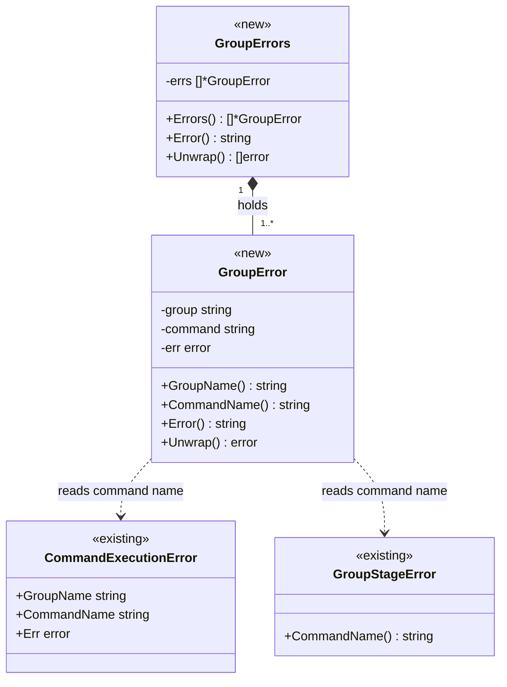

矢印の意味: `*--` は「保持する」、`..>` は「構築時に原因のチェーンから型で command 名を読み取る」を表す。

Legend: クラス図は色分けを使わない。`<<new>>` は本タスクで追加する型、`<<existing>>` は変更しない既存の型を表す。

## 2. システム構成

### 2.1 全体構成（変更前と変更後）

矢印 A → B は「A の結果（エラー値）を B が受け取る」を表す。ノードは処理を行う関数である。

```mermaid
flowchart TD
    classDef data fill:#e6f7ff,stroke:#1f77b4,stroke-width:1px,color:#0b3d91;
    classDef process fill:#fff1e6,stroke:#ff7f0e,stroke-width:1px,color:#8a3e00;
    classDef enhanced fill:#e8f5e8,stroke:#2e8b57,stroke-width:2px,color:#006400;
    classDef problem fill:#ffe6e6,stroke:#d62728,stroke-width:2px,color:#7b0000;

    subgraph Before["変更前"]
        B_EG["runner.executeGroups"]
        B_CTX["main.executionErrorContext"]
        B_HEE["logging.HandleExecutionError"]
        B_FC["logging.formatCause"]
        B_OUT[("stderr Details: / error_message")]
        B_EG -->|"ラップしたエラー<br>または errors.Join"| B_CTX
        B_CTX --> B_HEE --> B_FC --> B_OUT
    end

    subgraph After["変更後"]
        A_EG["runner.executeGroups"]
        A_CTX["main.executionErrorContext"]
        A_HEE["logging.HandleExecutionError"]
        A_OUT[("stderr Details: / error_message")]
        A_EG -->|"*GroupErrors"| A_CTX
        A_CTX --> A_HEE --> A_OUT
    end

    class B_EG,B_HEE process
    class B_CTX,B_FC problem
    class A_EG,A_CTX,A_HEE enhanced
    class B_OUT,A_OUT data
```

変更前の `executionErrorContext` は `Unwrap() []error` の有無で判定し、`formatCause` は `UserMessage` で原因を差し替える。変更後は `formatCause` を削除し、`executionErrorContext` は `*GroupErrors` の件数で判定する。

Legend:

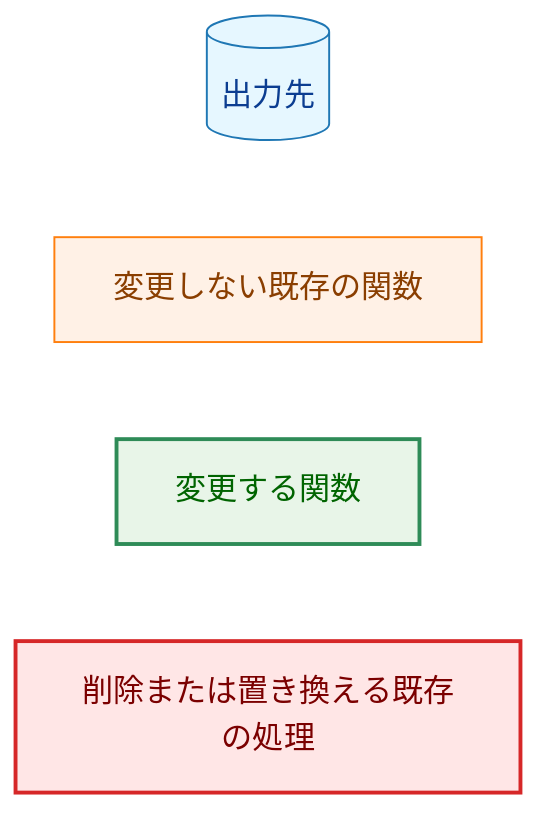

### 2.2 コンポーネント配置

矢印 A → B は「A が B を import する」を表す。本タスクは新しい import を追加しない。図は本タスクで変更するパッケージの間の既存の依存だけを示す。`internal/logging` は `internal/runner` を import しないままである。

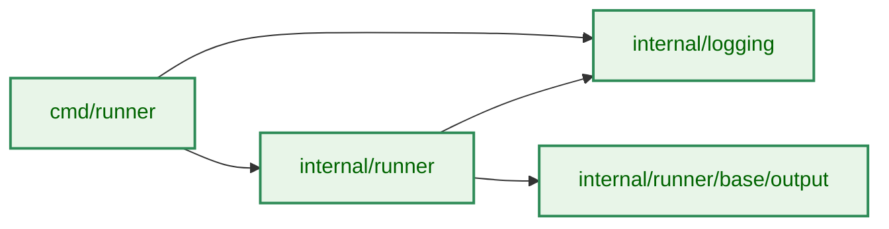

依存の根拠: `cmd/runner/main.go:733`（`runner.CommandExecutionError`）、`internal/runner/runner.go:21`（`base/output` の import）、`internal/runner/group_stage.go:7`（`logging` の import）。

Legend:

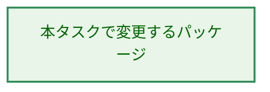

### 2.3 データの流れ（2 つの group が失敗する場合）

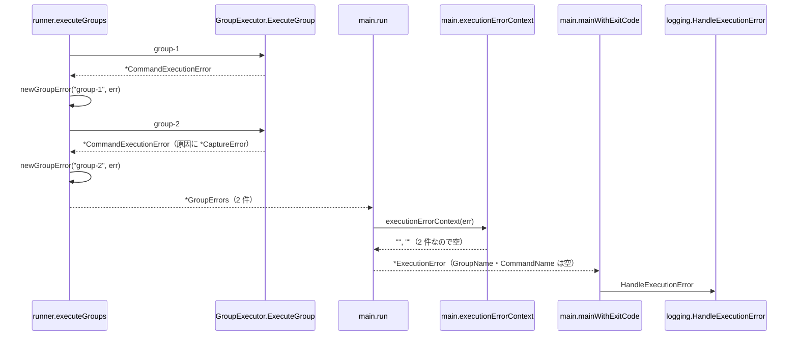

`*ExecutionError` は `run` が組み立て（`cmd/runner/main.go:692-702`）、`mainWithExitCode` が `HandleExecutionError` を呼ぶ（`:238-239`）。stderr の出力は次のようになる（途中の文言は例）。

```
  Details: error running commands: failed to execute group group-1: command fail-cmd in group group-1 failed: ...
           failed to execute group group-2: command cap-cmd in group group-2 failed: command execution failed: output capture error during execution phase: output size limit exceeded for '/path/to/out' (limit: 1048576 bytes)
```

## 3. コンポーネント設計

### 3.1 `internal/runner`: `GroupError` と `GroupErrors`（新規）

新しいファイル `internal/runner/group_errors.go` に置く。

```go
// GroupError is one group that failed during a run.
type GroupError struct {
	group   string // GroupSpec.Name of the failed group
	command string // command the failure belongs to, or "" when none
	err     error  // the error ExecuteGroup returned
}

func (e *GroupError) GroupName() string
func (e *GroupError) CommandName() string
func (e *GroupError) Error() string
func (e *GroupError) Unwrap() error

// GroupErrors reports every group that failed during a run. It always holds
// at least one GroupError.
type GroupErrors struct {
	errs []*GroupError
}

func (e *GroupErrors) Errors() []*GroupError // a copy
func (e *GroupErrors) Error() string
func (e *GroupErrors) Unwrap() []error

func newGroupError(group string, err error) *GroupError
func newGroupErrors(errs []*GroupError) *GroupErrors
```

- **group 名。** `executeGroups` が実行した `GroupSpec.Name` を渡す。エラーから取り出さない。
- **command 名。** `newGroupError` が原因のチェーンから型で読む。`*CommandExecutionError` があればその `CommandName`、なければ `*GroupStageError` の `CommandName()`、どちらも無ければ空とする。
  - `ExecuteGroup` の本番実装が返すエラーは、この 2 型のどちらかを含む。コマンド実行前の失敗は `groupExecutionExitError` が `*GroupStageError` にそろえる（`internal/runner/group_executor.go:241-249`）。コマンド実行後の失敗は `executeSingleCommand` が `*CommandExecutionError` を返す（`:645-649`、`:668-672`）。
  - どちらも含まないエラー（テストのモックなど）では、command 名は空になる。
- **構築関数の拒否。** `newGroupError` は空の group 名と nil の原因で、`newGroupErrors` は空の一覧と nil の要素で panic する。`newGroupErrors` は受け取ったスライスをコピーして持つ。
- **`Error()`。** `GroupError.Error()` は `fmt` で `failed to execute group <group>: <原因の Error()>` を組み立てる。`GroupErrors.Error()` は各要素の `Error()` を `"\n"` でつなぐ。これは変更前の `fmt.Errorf("failed to execute group %s: %w", ...)` と `errors.Join` と同じ組み立て方である。AC-09 は「同じ原因から変更前の組み立て方で作った文言と一致する」と読む（原因の文言そのものは AC-16 で変わりうる）。
- **`Unwrap() []error`。** 各 `GroupError` を返す。`GroupError.Unwrap()` は原因を返す。これにより `errors.Is`・`errors.AsType` が各 group の原因に届く（AC-10）。`Unwrap() []error` は到達のためだけに持ち、「複数 group の失敗」の判定には使わない。
- **`Errors()` はコピーを返す。** 呼び出し側が一覧を書き換えて不変条件を崩せないようにする。

`cmd/runner` のテストは `*GroupErrors` を作る必要があるので、`internal/runner/test_helpers.go`（`//go:build test`）に次を置く。command 名は引数で直接与える（原因のチェーンから読む処理の検証は `internal/runner` のテストで行う）。

```go
func NewGroupErrorForTest(group, command string, err error) *GroupError
func NewGroupErrorsForTest(errs ...*GroupError) *GroupErrors
```

### 3.2 `internal/runner`: `executeGroups`（変更）

- 失敗した group ごとに `newGroupError(group.Name, err)` を作って集める。現状の `fmt.Errorf("failed to execute group %s: %w", ...)`（`internal/runner/runner.go:436`、`:450`）を置き換える。
- 終了時、失敗が 1 件以上なら `newGroupErrors` で返す。失敗が無ければ `nil` を返す。戻り値の型は `error` のままとし、nil の `*GroupErrors` を `error` として返してはならない（non-nil の `error` になるため）。
- 1 件のときに分けて返す処理（`:457-459`）と `errors.Join`（`:463`）は削除する。
- **中断の判定を変える（F-006）。** `ExecuteGroup` がエラーを返したとき、エラーの中身（`errors.Is(err, context.Canceled)`・`context.DeadlineExceeded`: `:422`）ではなく、実行全体の context が取り消されているか（`ctx.Err() != nil`）で判定する。
  - 取り消されていれば、`ExecuteGroup` のエラーをそのまま返し、残りの group を実行しない。集めた失敗は捨てる（現状どおり、AC-21）。
  - 取り消されていなければ、エラーが `context.DeadlineExceeded` を含んでいても（コマンドのタイムアウト）、ほかの失敗と同じく `GroupError` として集め、次の group へ進む（AC-19、AC-20）。
  - 判定の位置は現状と同じく、`*GroupStageError` の通知より前とする。中断された実行では、実行前段の失敗を通知しない。
- 変えないもの:
  - group の間で実行全体の context の取り消しを検出したら、`ctx.Err()` をそのまま返す（`:416`）。
  - `*verification.Error` による group ファイル検証の失敗は集めない（`:441-448`）。`*GroupStageError` の通知（`:432-435`）もそのまま行う。
  - タイムアウトしたコマンドの group では、そのコマンドで group の実行が止まり、`command_group_summary` が通知される（`internal/runner/group_executor.go:282-289`、`:175-180`）。

### 3.3 `cmd/runner`: `executionErrorContext`（変更）

次の順で判定する。

1. `err` が `*runner.GroupErrors` を含むとき、要素が 1 件ならその `GroupName()`・`CommandName()` を返し、2 件以上なら空を返す（AC-05、AC-08、AC-15）。
2. 含まないとき、`*runner.CommandExecutionError` を含めばその group 名・command 名を返す。
3. どちらでもなければ空を返す。

1 を 2 より先に判定しなければならない。`*GroupErrors` は `Unwrap() []error` で各原因に届くので、2 件以上の失敗でも `errors.AsType[*runner.CommandExecutionError]` は先頭の失敗に一致してしまう。

2 が残るのは、`executeGroups` が `*GroupErrors` を経由せずにエラーを返す経路、つまり実行全体の中断（§3.2）があるためである。コマンドの実行中に中断されると、`ExecuteGroup` が返した `*CommandExecutionError` を含むエラーがそのまま返る。現状、このエラーには外側の context が付いており（`cmd/runner/main.go:733-735`）、2 はそれを変えない。2 が `*GroupStageError` を読まないのも現状と同じである。

コマンドのタイムアウトは、§3.2 の変更により `*GroupErrors` の要素になるので、1 で判定される。タイムアウトが 1 件だけのとき、1 はそのコマンドの group 名・command 名を返す。これは変更前に 2 が返していた値と同じである（AC-22）。タイムアウトのエラーが `*CommandExecutionError` を含むことは次による。

- `executeSingleCommand` は各コマンドを、コマンドの `timeout` を期限とする context で実行する（`internal/runner/group_executor.go:574-589`）。
- 期限切れのとき、executor は `ctx.Err()` をコマンドのエラーに `errors.Join` で加える（`internal/runner/base/executor/command_lifecycle.go:890-891`）。
- それを `*CommandExecutionError` がラップする（`group_executor.go:645-649`）。

`Unwrap() []error` の有無による判定（`cmd/runner/main.go:730-732`）は削除する。

### 3.4 `internal/logging`: 原因の差し替えの削除（変更）

- `UserFriendlyError`（`internal/logging/execution_error.go:22-27`）・`GetUserFriendlyMessage`（`:31-36`）・`formatCause`（`:45-58`）を削除する。
- `PreExecutionError.Detail()`（`internal/logging/pre_execution_error.go:93-98`）と `HandleExecutionError`（`:243-276`）は、原因として `Err.Error()` をそのまま使う。
- `HandleExecutionError` の「外側の context を `Message` の直後、原因の前に置く」順序と、`handleErrorCommon` の複数行の字下げ（`:156-159`）は変えない。
- 複数 group の失敗では、`GroupErrors.Error()` が各 group の文言を改行でつなぐ。各 group の文言の**先頭の行**は `failed to execute group <group>: ` で始まる（AC-01、AC-02）。1 つの group の原因が複数行のときの扱いは §4.4 を参照。

`PreExecutionError.Detail()` の文言への影響は次のとおりである。

- `UserMessage` を持つ唯一の型 `*output.CaptureError` を作るのは `Capture.WriteOutput`（`internal/runner/base/output/capture.go:43`、`:64`）だけである。これはコマンド実行中に出力を書くときだけ呼ばれる（`Capture.Write`: `:32-34`）。したがって、実行前エラーの原因にこの型は入らない。
- `formatCause` は `UserMessage` の差し替えのほかに、トップレベルの `Unwrap() []error` を子ごとに分けていた。`fmt.Errorf` に `%w` が 2 つ以上あるエラーもこれに当たる。このとき分けた結果には、`fmt.Errorf` のエラー書式の文言が含まれない。削除後は `Error()` の文言になり、エラー書式の文言が残る。`PreExecutionError.Err` の設定箇所のうち確認したもの（`internal/runner/bootstrap/config.go:82`、`:100`、`:112`、`internal/runner/bootstrap/environment.go:148`、`internal/runner/group_stage.go:210`）には、そのようなエラーは無い。そのような原因が今後現れても、文言は情報が増える方向に変わるだけである。

### 3.5 `internal/runner/base/output`: `CaptureError`（変更）

```go
type CaptureError struct {
	Type  ErrorType
	Path  string
	Phase ExecutionPhase
	Cause error
	Limit int64 // size limit in bytes; meaningful only when Type is ErrorTypeSizeLimit
}

// newSizeLimitError builds the size-limit error. Its Cause is always
// ErrOutputSizeExceeded.
func newSizeLimitError(path string, limit int64) *CaptureError
```

- **`Limit` と構築関数を追加する。** `Capture.WriteOutput` のサイズ超過（`capture.go:43-48`）は `newSizeLimitError(c.OutputPath, c.MaxSize)` で作る。構築関数が `Type`・`Phase`（`PhaseExecution`）・`Cause`（`ErrOutputSizeExceeded`）を決めるので、サイズ超過の `Cause` が常にセンチネルであることを 1 箇所で保証する。`newSizeLimitError` は上限値が 0 以下なら panic する（AC-25）。次の 2 点により、本番でこの panic に届く入力は無い。
- **上限 0 は無制限として扱う（F-007）。** `Capture.WriteOutput` は `MaxSize` が 0 のとき、サイズを比べずに書き込む（AC-23、AC-24）。0 を無制限とする定義（`internal/common/output_size_limit_type.go:21-25`）と、無制限のとき上限 0 を渡す `NormalResourceManager`（`internal/runner/resource/normal_manager.go:244-249`）に合わせる。使われていない `DefaultOutputCaptureManager.WriteOutput` はすでに同じ扱いである（`internal/runner/base/output/manager.go:142`）。
- **負の上限は出力キャプチャの準備で拒否する。** `output_size_limit` の負の値は、設定の読み込みで検証されていない（検証は `timeout` だけ: `internal/runner/config/validation.go:188-215`。上限は検証の無い `common.NewOutputSizeLimitFromPtr` で作られる: `internal/runner/group_executor.go:311`、`internal/runner/base/runnertypes/runtime.go:295`）。このため `DefaultOutputCaptureManager.PrepareOutput`（`manager.go:89`）は、冒頭（出力パスが空のときの分岐 `:97-107` より前）で、負の `maxSize` を既存の `ErrInvalidMaxSize`（`errors.go:139`、現在は未使用）をラップしたエラーで拒否する。コマンドは実行前に失敗し、その原因が報告に出る。変更前は、負の上限のコマンドは出力の最初の書き込みでサイズ超過として失敗していた。
  - 設定の読み込みで負の値を拒否する案は、要件にない利用者向けの検証を増やすので採らない。出力キャプチャの準備は、上限値を使う唯一の構築の境界である。
- **`Error()` は `Type` で分ける。** `ErrorTypeSizeLimit` のときだけ `output capture error during <phase>: output size limit exceeded for '<path>' (limit: <Limit> bytes)` とし、`Cause` の文言を付けない。それ以外の種類は現状の文言（`errors.go:83-96`）のままとする（AC-16、AC-18）。
  - `Cause` を付けない理由: サイズ超過の `Cause` はセンチネル `ErrOutputSizeExceeded` であり、`output size limit exceeded` という同じ事実を表す。`errors.Is` で判定するために持っているだけで、文言としての情報はない。
  - 分岐は宣言された `Type`（列挙型）で行い、`Cause` の文言を比べない（CLAUDE.md「Declare, don't infer」）。
  - 文言に `output size limit exceeded for '<path>'` を残すのは、変更前に stderr に出ていた `UserMessage` の文言（`errors.go:118`）と同じ部分文字列を保ち、その文言を検索している運用に配慮するためである（§4.3）。
- **`Cause` はそのまま持つ。** `errors.Is(err, output.ErrOutputSizeExceeded)` が成り立ち続ける（AC-17）。これを使うテストは `test/performance/output_capture_test.go:154` と `internal/runner/base/executor/executor_privilege_gap_integration_test.go:683` である。
- **`UserMessage`（`errors.go:115-130`）・`GetType`（`:104-106`）・`GetPath`（`:109-111`）を削除する**（AC-06、AC-18）。本番コードからの呼び出しは、`GetUserFriendlyMessage` 経由の `UserMessage` だけである。
- **フィールドは公開のままとする。** `CaptureError` はすべてのフィールドが公開された値型で、テストはリテラルで作っている（`errors_test.go`）。使われていない種類と段階の整理（[#1180](https://github.com/isseis/go-safe-cmd-runner/issues/1180)）の前に形を変えると変更が重なるため、本タスクでは本番の生成箇所を構築関数に寄せるだけにする。

`CaptureError` は本番では常にポインタで作られる（`capture.go:43`、`:64`）。原因への到達を確かめるテストは `errors.AsType[*output.CaptureError]` を使う。

### 3.6 コンポーネントの責務と変更ファイル

| ファイル | 変更 | 責務 |
|---|---|---|
| `internal/runner/group_errors.go` | 新規 | `GroupError`・`GroupErrors` と構築関数 |
| `internal/runner/runner.go` | 変更 | `executeGroups` が `*GroupErrors` を返す |
| `internal/runner/test_helpers.go` | 変更 | `NewGroupErrorForTest`・`NewGroupErrorsForTest`（`test` ビルドタグ） |
| `cmd/runner/main.go` | 変更 | `executionErrorContext` を件数による判定にする |
| `internal/logging/execution_error.go` | 変更 | `UserFriendlyError`・`GetUserFriendlyMessage`・`formatCause` を削除 |
| `internal/logging/pre_execution_error.go` | 変更 | `Detail()`・`HandleExecutionError` が `Err.Error()` を使う |
| `internal/runner/base/output/errors.go` | 変更 | `Limit`・`newSizeLimitError` の追加、サイズ超過の `Error()`、`UserMessage`・`GetType`・`GetPath` の削除 |
| `internal/runner/base/output/capture.go` | 変更 | 上限 0 を無制限として扱い、サイズ超過を `newSizeLimitError` で作る |
| `internal/runner/base/output/manager.go` | 変更 | `PrepareOutput` が負の上限を `ErrInvalidMaxSize` で拒否する |
| `docs/user/toml_config/04_global_level.ja.md` | 変更 | 「4.8 output_size_limit」に 0 が無制限であることを追記（AC-26） |
| `docs/user/toml_config/04_global_level.md` | 変更 | 上記を `/mktrans` で反映 |

変更する挙動を検証している既存のテスト（更新が必要）:

| テスト | 現在の検証内容 | 対応 |
|---|---|---|
| `internal/runner/runner_test.go:447-453` | 失敗 1 件が multi-error でないこと、`*CommandExecutionError` に届くこと | `*GroupErrors`（1 件）であることの検証に置き換える。`*CommandExecutionError` への到達は残す |
| `cmd/runner/main_test.go:745-790` `TestExecutionErrorContext` | `errors.Join` とラップしたエラーで外側の context を決めること | 入力を `*GroupErrors` に置き換え、§7.1 の行を加える |
| `internal/logging/pre_execution_error_test.go:43-48`、`:70-80` | `Detail()` が `UserMessage` を優先すること、`errors.Join` の子を分けること | `friendlyTestError`（`Error()` と `UserMessage()` が異なる型）は残し、期待値を `Error()` の文言に反転する |
| `internal/logging/pre_execution_error_test.go:609-640` `TestHandleExecutionError_CauseFormatting` | `HandleExecutionError` が `UserMessage` を使うこと | 同上。期待値を `Error()` の文言に反転する |
| `internal/runner/base/output/errors_test.go:74-86` | サイズ超過の旧文言 | 新しい文言と `Limit` に更新する |
| `internal/runner/runner_test.go:2831-2842` `TestRunner_CancellationSkipsStageNotification` | モックが `context.Canceled`・`DeadlineExceeded` を原因に持つ段階のエラーを返すと、実行前段の通知をしないこと | モックのエラーを返すときに実行全体の context を取り消すように変える。取り消さない場合は通知されることを別の行で検証する |
| `internal/runner/runner_test.go:705-735`（コマンドのタイムアウト） | タイムアウトで `DeadlineExceeded` が返ること | `errors.Is` は `*GroupErrors` を通して届くので変更は不要の見込み。後続の group の実行は §7.1 で検証する |

`friendlyTestError` を残すのは、`UserMessage` を持つ型が無くなると「`Error()` をそのまま使う」ことを他の表示と区別できる入力が無くなり、テストが失敗しえなくなるためである（CLAUDE.md「Every test must be able to fail for its stated reason」）。テストを削除する場合は、AC-14 に従い `go tool cover -func` の結果を関数単位で比べる。

## 4. エラーハンドリング設計

### 4.1 エラー型

新しいエラー型は §3.1 の `GroupError`・`GroupErrors` の 2 つである。センチネルは追加しない。

### 4.2 文言の設計

| 状況 | `Details:` の文言 |
|---|---|
| 失敗 1 件（`*CommandExecutionError`、`CaptureError` を含まない） | `error running commands (group: g, command: c): failed to execute group g: command c in group g failed: ...`（変更前と同じ、AC-11） |
| 失敗 1 件（`*GroupStageError`、group レベル） | `error running commands (group: g): failed to execute group g: ...`（外側の context が新たに付く、AC-15） |
| 失敗 1 件（`*GroupStageError`、command レベル） | `error running commands (group: g, command: c): failed to execute group g: ...`（同上） |
| 失敗 2 件以上 | `error running commands: failed to execute group g1: ...` の後に、各 group の文言が `failed to execute group gN: ...` で続く（AC-01、AC-02、AC-05） |
| 出力サイズ超過を含む原因 | 末尾が `output capture error during execution phase: output size limit exceeded for '<path>' (limit: <N> bytes)`（AC-16） |
| 書き込み失敗（`ErrorTypeFileSystem`）を含む原因 | 末尾が `output capture error during execution phase: filesystem error for '<path>': <OS のエラー>`（変更前は `UserMessage` で OS のエラーが落ちていた、AC-03） |
| コマンドのタイムアウト | 失敗の 1 件として扱われる（上の行と同じ形）。1 件だけなら外側の context は変更前と同じ（AC-22） |
| 実行全体の中断 | 変更前と同じ（§3.3） |

構造化ログの `error_message` は同じ文言である（AC-04）。ただし §5.2 の redaction を受ける。

### 4.3 変更前との互換

運用がエラー文言を検索している場合に影響しうる変更は次のとおりである。リポジトリ内にこれらの文言を検索するものは無い（`grep` で確認）。

| 変更 | 変更前 | 変更後 |
|---|---|---|
| `CaptureError` を含む失敗の `Details:` | `error running commands (group: g, command: c): output size limit exceeded for '<path>'` | 原因のチェーン全体（§4.2） |
| サイズ超過の `Error()`（`Command failed` などの slog の `error` 属性にも出る） | `... size limit exceeded for '<path>': output size limit exceeded` | `... output size limit exceeded for '<path>' (limit: <N> bytes)` |
| 失敗 1 件が `*GroupStageError` のときの `Details:` | `error running commands: ...` | `error running commands (group: g[, command: c]): ...` |
| コマンドのタイムアウト後 | 残りの group を実行せず、先の失敗を報告しない | 残りの group を実行し、すべての失敗を報告する |
| `output_size_limit = 0` のコマンド | 出力ファイルへの最初の書き込みでサイズ超過として失敗する | 無制限に書き込む |
| 負の `output_size_limit` のコマンド | 出力ファイルへの最初の書き込みでサイズ超過として失敗する | 出力キャプチャの準備で `invalid maximum size` として失敗する |

`output size limit exceeded for '<path>'` という部分文字列は、変更前の stderr・`error_message` にも変更後にも現れる。

### 4.4 既知の制限

- **実行全体の中断では、集めた失敗が報告に出ない。** §3.2 のとおり、実行全体の context が取り消されると、`executeGroups` は集めた失敗を捨ててすぐに返す。これは要件の対象外（「実行全体の中断時に集めた失敗を報告すること」）である。
- **1 つの group の原因が複数行のとき、続きの行は `failed to execute group` で始まらない。** executor はコマンドのエラーに kill の失敗などを `errors.Join` で加えることがある（`internal/runner/base/executor/command_lifecycle.go:788`）。そのとき `GroupError.Error()` は複数行になり、続きの行は `handleErrorCommon` によって他の group の行と同じ字下げで出る。帰属は、各 group の文言の先頭の行で判別する。続きの行を `GroupError.Error()` で字下げすると `Error()` の文言が変わり、AC-09 に反するので行わない。

### 4.5 失敗時の扱い

- **構築関数の panic** は呼び出し側の誤りにだけ起きる。`executeGroups` は、`ExecuteGroup` が nil でないエラーを返したときだけ `newGroupError` を呼ぶ。group 名が空でないことは設定の読み込みで検証済みである（`internal/runner/config/validation.go:50-52`、`internal/runner/config/loader.go:236` から呼ばれる）。
- **`newSizeLimitError` の panic** も呼び出し側の誤りにだけ起きる。呼び出し元の `Capture.WriteOutput` は上限 0 では比較せず、負の上限は `PrepareOutput` が拒否する（§3.5）。`Capture` はフィールドが公開された構造体なので、`PrepareOutput` を通さずに負の `MaxSize` で作ることはできる。本番で `Capture` を作るのは `PrepareOutput`（`manager.go:98-106`、`:122-130`）だけである。
- **中断の判定と競合。** コマンドが別の理由で失敗した直後に SIGINT・SIGTERM を受けた場合、`ExecuteGroup` から戻った時点で実行全体の context が取り消されていれば中断として扱う。利用者が中断を求めた以上、残りの group を実行しないのが正しい。

## 5. セキュリティ考慮事項

### 5.1 出力先

| 出力先 | 変更の影響 |
|---|---|
| stderr の `Details:` | `handleErrorCommon` が直接書く（`internal/logging/pre_execution_error.go:148-170`）。redaction は通らず、これは変更前と同じである。`CaptureError` を含む失敗では、変更前は `UserMessage` に隠れていた次の情報が新たに出る。書き込み失敗の OS のエラー、サイズ超過の上限値、原因のチェーン全体（`ErrKillAfterCancel`・`ErrChildNotReaped` など、別の uid でプロセスが残っている可能性を示すエラーを含む: `internal/runner/base/executor/command_lifecycle.go:788`）。最後のものは、利用者が気付くべき事象が隠れなくなるという改善である。同じエラーは変更前から `Command failed` の構造化ログ（`internal/runner/group_executor.go:639-643` の `error` 属性）に出ている |
| 構造化ログの `error_message` | `RedactingHandler` を通る点は変わらない（§5.2） |
| Slack | 実行エラーのレコードは `slack_notify=false` のまま（`internal/logging/pre_execution_error.go:270`）で、Slack へは送らない（AC-12）。実行前エラーの Slack 通知の本文（`Detail()`）は、§3.4 のとおり `CaptureError` による変化を受けない |

### 5.2 redaction による帰属の喪失

`error_message` は自由文として値の redaction を受け、文言の一部が機密の形に一致すると、全体が `[REDACTED]` になりうる（`docs/dev/architecture_design/security-architecture.md:644`）。本タスクで、この影響を受ける範囲は広がる。

- `CaptureError` を含む失敗は、変更前は短い `UserMessage`（group 名・command 名を含まない）だった。変更後は原因のチェーン全体（group 名・command 名を含む）になる。group 名や command 名が機密の形に一致すると、変更前は読めた `error_message` が `[REDACTED]` になる。
- 複数 group の失敗では 1 つのレコードに全 group の文言が入るので、1 つの group の文言が一致すると全 group の帰属が構造化ログから読めなくなる。この点は変更前の `errors.Join` でも同じである。

stderr には redaction 前の文言が出るので、帰属は stderr で判別できる。redaction の規則は本タスクでは変えない。

### 5.3 脅威モデル

新しい入力経路・権限の変更・外部への送信は追加しない。変わるのは次の点である。

- エラー文言の組み立てと、stderr・構造化ログに出る情報の範囲（§5.1、§5.2）。
- **コマンドのタイムアウト後も後続の group が実行される（F-006）。** 後続の group が先の group の結果に依存する設定では、先の group がタイムアウトしても後続の group が動く。これは、コマンドが 0 以外の終了コードで失敗したときの現状の挙動（失敗を集めて次の group へ進む: `internal/runner/runner.go:449-450`）と同じであり、新しい種類のリスクではない。各 group の実行前の検証（ファイル検証・権限監査）は、タイムアウトの有無によらず group ごとに行われる。
- **`output_size_limit = 0` のコマンドが無制限に出力を書く（F-007）。** これは利用者が明示的に指定した値の定義どおりの挙動である。出力先のディスクの消費は利用者の設定の責任範囲になる。負の値は、これまでどおり出力を書けずに失敗する（§3.5）。

脅威モデル図は N/A とする。

## 6. 処理フローの詳細

### 6.1 `executionErrorContext` の判定

矢印は判定の順序を表す。


Legend:

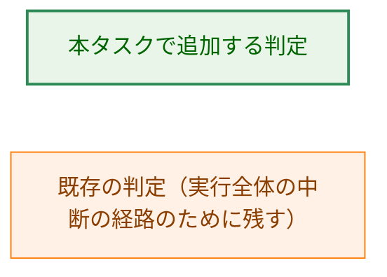

### 6.2 出力サイズ超過の原因の組み立て

矢印 A → B は「A が返したエラーを B が受け取り、必要ならラップして上へ返す」を表す。矢印のラベルは受け渡すエラーである。

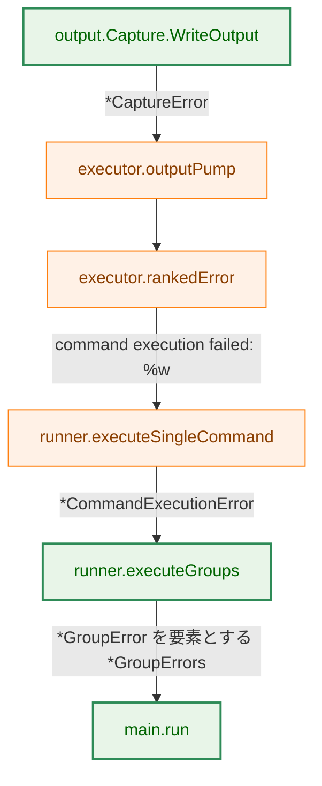

出力ポンプは最初の書き込みエラーを保持し（`internal/runner/base/executor/output_pump.go:139-172`）、`rankedError` は書き込みエラーを最優先する（`command_lifecycle.go:886-895`）。`command execution failed: %w` のラップは `:795` による。

Legend:

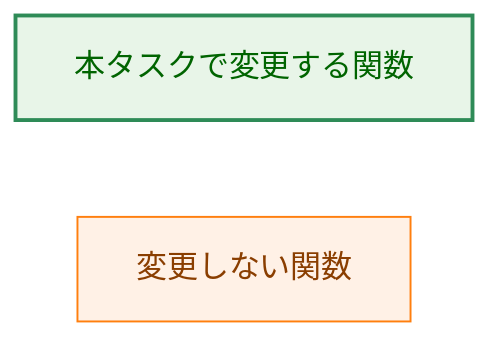

### 6.3 `executeGroups` の中断の判定

矢印は判定の順序を表す。

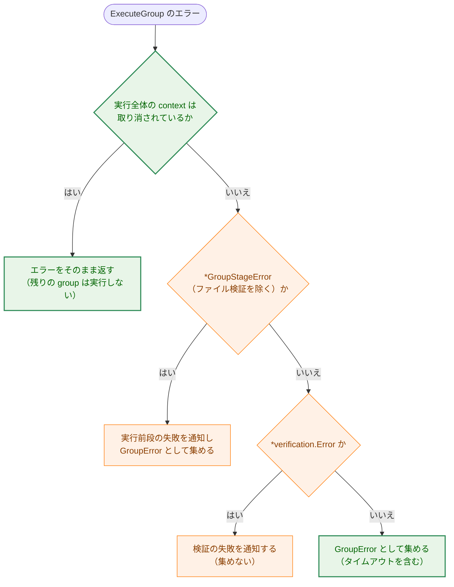

Legend:

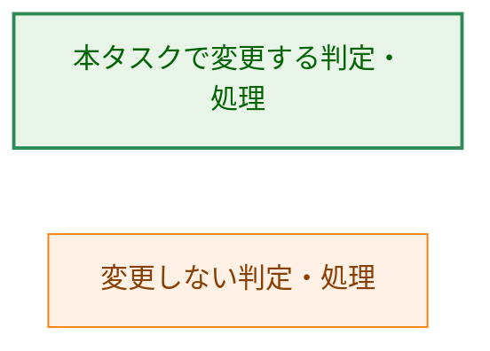

## 7. テスト戦略

### 7.1 単体テスト

- **`GroupError`・`GroupErrors`（`internal/runner`）**
  - `Error()` が、同じ原因から `fmt.Errorf("failed to execute group %s: %w", ...)`・`errors.Join(...)` で作った値の `Error()` と一致すること（1 件・2 件、AC-09）。期待値をリテラルで書かず、変更前の組み立て方で作った値と比べる。
  - `errors.Is`・`errors.AsType[*CommandExecutionError]`・`errors.AsType[*output.CaptureError]` が 1 件・2 件の各原因に届くこと（AC-10）。
  - command 名が `*CommandExecutionError`・`*GroupStageError`（command レベル）から読まれ、どちらも無ければ空になること。
  - 構築関数が空の group 名・nil の原因・空の一覧・nil の要素で panic すること。`newGroupErrors` に渡したスライスや `Errors()` の戻り値を書き換えても、保持している一覧が変わらないこと。
- **`executeGroups`（`internal/runner`）**: `MockGroupExecutor` で 0 件・1 件・2 件の失敗を作る。0 件で `nil`（`err == nil` が成り立つ）、1 件以上で `*GroupErrors` を返し、group 名が `GroupSpec.Name` であること（AC-07）。さらに次を確かめる（AC-19〜AC-21）。
  - 実行全体の context を取り消さずに、group-1 のモックが `DeadlineExceeded` を含む `*CommandExecutionError` を返すと、group-2 が実行され、戻り値が group-1 の要素を含む `*GroupErrors` であり、`errors.Is(err, context.DeadlineExceeded)` が成り立つこと。
  - group-1 のモックが実行全体の context を取り消してからエラーを返すと、group-2 が実行されず、戻り値が `*GroupErrors` でないこと。モックのエラーが `context.Canceled` を含まない場合も同じであること（エラーの中身ではなく context の状態で判定していることを確かめる）。
- **`executionErrorContext`（`cmd/runner`）**: 次の行を持つ表にする（AC-05、AC-08、AC-11、AC-15）。
  - `*GroupErrors` 1 件（`*CommandExecutionError`）
  - `*GroupErrors` 1 件（group レベルの `*GroupStageError`、command 名は空）
  - `*GroupErrors` 1 件（command レベルの `*GroupStageError`）
  - `*GroupErrors` 2 件（空になること。§3.3 の判定順を逆にすると失敗することを確かめる）
  - `*GroupErrors` 1 件（タイムアウトの `*CommandExecutionError`。変更前と同じ group 名・command 名になること、AC-22）
  - 実行全体の中断の `*CommandExecutionError`（`*GroupErrors` を含まない）
  - どれでもないエラー
- **`CaptureError`（`internal/runner/base/output`）**
  - サイズ超過の文言が段階・パス・上限値を含み、`size limit exceeded` を 1 回だけ含むこと。`errors.Is(err, ErrOutputSizeExceeded)` が成り立つこと。他の種類の文言が変わらないこと（AC-16〜AC-18）。
  - `Capture.WriteOutput` のサイズ超過が `Limit` に `MaxSize` を設定し、`Cause` が `ErrOutputSizeExceeded` であること。
  - `MaxSize` が 0 の `Capture.WriteOutput` が、大きなデータでもエラーを返さないこと（AC-23）。
  - `newSizeLimitError` が 0 と負の上限値で panic すること、`PrepareOutput` が負の `maxSize` を `ErrInvalidMaxSize` で拒否すること（出力パスが空の場合を含む、AC-25）。
- **`logging`**
  - `HandleExecutionError` と `Detail()` が、`friendlyTestError` について `UserMessage()` ではなく `Error()` の文言を出すこと（AC-06）。
  - `HandleExecutionError` に `ErrorTypeFileSystem` の `*CaptureError`（`Cause` あり）を含む原因を渡すと、`Details:` に `Cause` の文言が出ること（AC-03）。

### 7.2 統合テスト

- `internal/runner` の既存の出力キャプチャのテスト（`output_capture_integration_test.go`、`runner_test.go` の `TestRunner_OutputCaptureErrorScenarios`）の形で、group-1 はコマンド失敗、group-2 は出力サイズ超過となる設定を実行する。得られたエラーを `HandleExecutionError` に渡し、stderr と `error_message` で AC-01、AC-02、AC-04、AC-05 を確かめる。group 名・command 名には redaction に一致しない名前を使い、`error_message` が `[REDACTED]` にならずに帰属を含むことも確かめる。
- 1 件の失敗（`*CommandExecutionError`）で、stderr と `error_message` が変更前と同じであること（AC-11）。
- 実際のコマンドで、group-1 はコマンド失敗（0 以外の終了コード）、group-2 はコマンドの `timeout` 切れとなる設定を実行し、`Details:` に両方の group の行が出ること（AC-20）。既存のコマンドのタイムアウトのテスト（`internal/runner/runner_test.go:705-735`）と同じく `sleep` と短い `timeout` を使う。
- `output_size_limit = 0` と出力ファイルを指定したコマンドが、出力サイズ超過で失敗せずに完了し、出力ファイルに全出力が書かれること（AC-24）。

### 7.3 既存挙動の維持

- 実行エラーのレコードの `slack_notify` が `false` のままであること。既存テスト（`internal/logging/pre_execution_error_test.go` の `slack_notify` の検証）を残す（AC-12）。
- 終了コードと `RUN_SUMMARY` 行は `HandleExecutionError` → `handleErrorCommon` の経路で決まり、本タスクはこの経路を変えない（`internal/logging/pre_execution_error.go:148-174`）。既存の `RUN_SUMMARY` のテストが引き続き通ることで確かめる（AC-12）。

### 7.4 静的な確認

`grep` で次を確かめる。

- `UserFriendlyError`・`GetUserFriendlyMessage`・`UserMessage`・`GetType`・`GetPath`・`formatCause` が本番コードに無いこと（AC-06、AC-18）。
- `Unwrap() []error` を型アサーションで判定する箇所が本番コードに無いこと（AC-08）。
- `internal/runner/runner.go` に、`errors.Is` で `context.Canceled`・`context.DeadlineExceeded` を判定して中断を決める分岐が無いこと（AC-21）。
- 利用者向け文書の記載（AC-26）。

## 8. 実装の優先順位

各段階でビルドとテストが通る順にする（AC-13）。

1. **`GroupErrors` の導入**: `group_errors.go`、`executeGroups`、`executionErrorContext`、テスト用の構築関数、関連テスト。この段階で、失敗 1 件の `*GroupStageError` に外側の context が付く（AC-15）。原因の文言（`UserMessage` の差し替えを含む）はまだ変わらない。
2. **`UserFriendlyError` の削除**: `logging` の 3 つの関数、`CaptureError.UserMessage`、関連テスト。ここで AC-01〜AC-04 が成り立つ。
3. **`output_size_limit = 0` の修正（F-007）**: `Capture.WriteOutput` の上限 0、`PrepareOutput` の負の上限の拒否、関連テスト。挙動の修正なので、4 の文言の整理とは別のコミットにする。
4. **`CaptureError` の整理**: `Limit`・`newSizeLimitError` の追加、サイズ超過の文言、`GetType`・`GetPath` の削除、関連テスト。`newSizeLimitError` が 0 以下を拒否するので、3 の後に行う。
5. **タイムアウトの扱いの変更（F-006）**: `executeGroups` の中断の判定、関連テスト。1 の後であればよい。
6. **利用者向け文書（AC-26）**: 日本語版を更新してコミットし、英語版を `/mktrans` で反映する。

2 と 3・4 の順は入れ替えてよい。2 を 4 より先にすると、その間はサイズ超過の文言に同じ事実が 2 回出るが、情報は欠けない。

## 9. 将来の拡張性

- `GroupErrors` は失敗した group ごとに group 名・command 名を型で持つ。Slack で group ごとの失敗理由を知らせる改善（`01_requirements.md`「検討して採らなかった案」）を行う場合も、エラー文字列を解析せずにこの型から情報を得られる。
- 実行全体の中断で集めた失敗が捨てられる点（§4.4）を直すときも、捨てずに `GroupErrors` と中断のエラーを合わせて返す形で扱える。
- `CaptureError` の使われていない種類と段階の整理は [#1180](https://github.com/isseis/go-safe-cmd-runner/issues/1180)、サイズ超過のセンチネルの重複は [#1181](https://github.com/isseis/go-safe-cmd-runner/issues/1181) で扱う。

## 10. 受け入れ基準との対応

| AC | 設計の該当箇所 | テスト |
|---|---|---|
| AC-01, AC-02 | §3.2、§3.4、§4.2 | §7.2 |
| AC-03 | §3.4、§4.2 | §7.1（`logging`） |
| AC-04 | §4.2、§5.2 | §7.2 |
| AC-05 | §3.3、§6.1 | §7.1、§7.2 |
| AC-06 | §3.4、§3.5 | §7.1（`logging`）、§7.4 |
| AC-07 | §3.1、§3.2 | §7.1（`executeGroups`） |
| AC-08 | §3.3、§6.1 | §7.1、§7.4 |
| AC-09, AC-10 | §3.1 | §7.1（`GroupError`・`GroupErrors`） |
| AC-11 | §3.3、§4.2 | §7.1、§7.2 |
| AC-12 | §5.1、§7.3 | §7.3 |
| AC-13 | §8 | 各コミットの `make test`・`make lint` |
| AC-14 | §3.6 | コミットメッセージ |
| AC-15 | §3.3、§4.2 | §7.1（`executionErrorContext`） |
| AC-16, AC-17, AC-18 | §3.5 | §7.1（`CaptureError`）、§7.4 |
| AC-19, AC-20 | §3.2、§6.3 | §7.1（`executeGroups`）、§7.2 |
| AC-21 | §3.2、§4.5、§6.3 | §7.1（`executeGroups`）、§7.4 |
| AC-22 | §3.3 | §7.1（`executionErrorContext`） |
| AC-23, AC-24 | §3.5 | §7.1（`CaptureError`）、§7.2 |
| AC-25 | §3.5、§4.5 | §7.1（`CaptureError`） |
| AC-26 | §3.6 | §7.4 |

## 付録 A. 他の設計文書との関係

> `docs/tasks/0176_group_pre_execution_failure_notification/02_architecture.md:412` は「`Detail()` は原因の連鎖に `UserFriendlyError` があるとき、その文言に置き換える」と、当時の挙動を説明している。本タスクで `UserFriendlyError` は無くなる。ただし、0176 の設計判断（実行前段の原因に `CaptureError` は現れないので、通知の文言に影響しない）は変わらない。完了したタスクの文書なので書き換えない。
