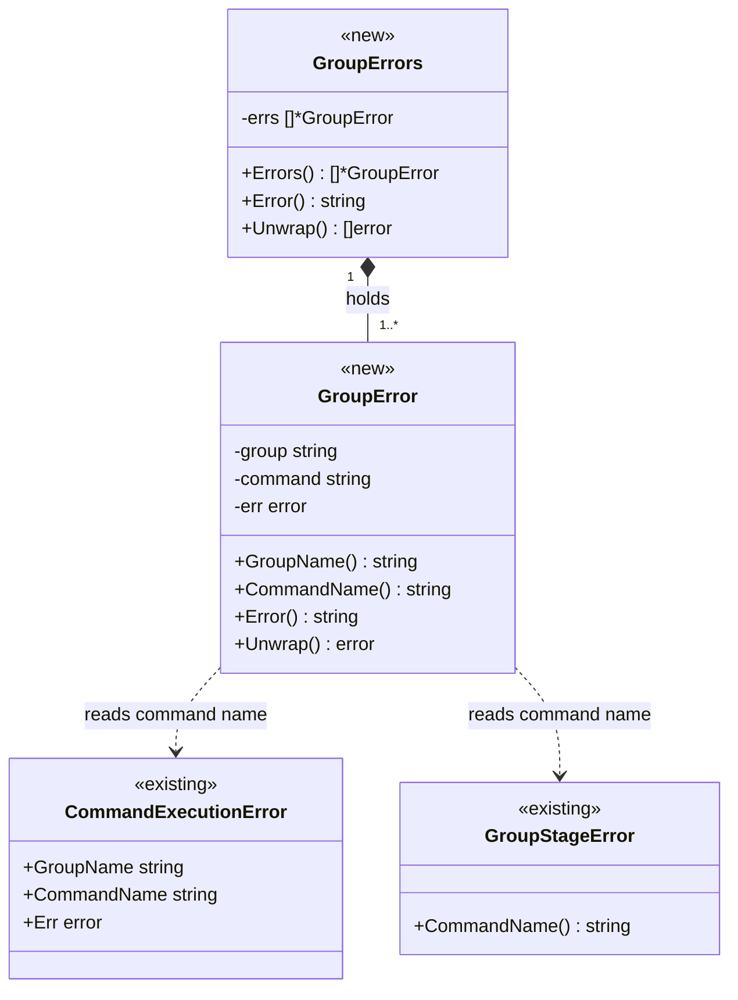
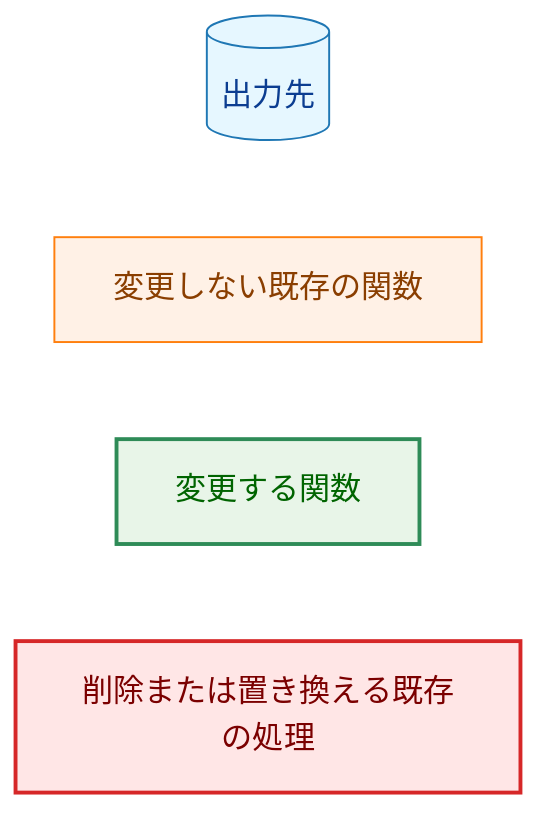
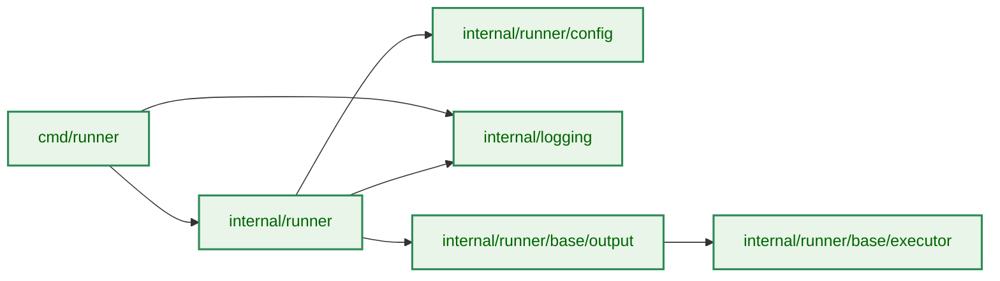
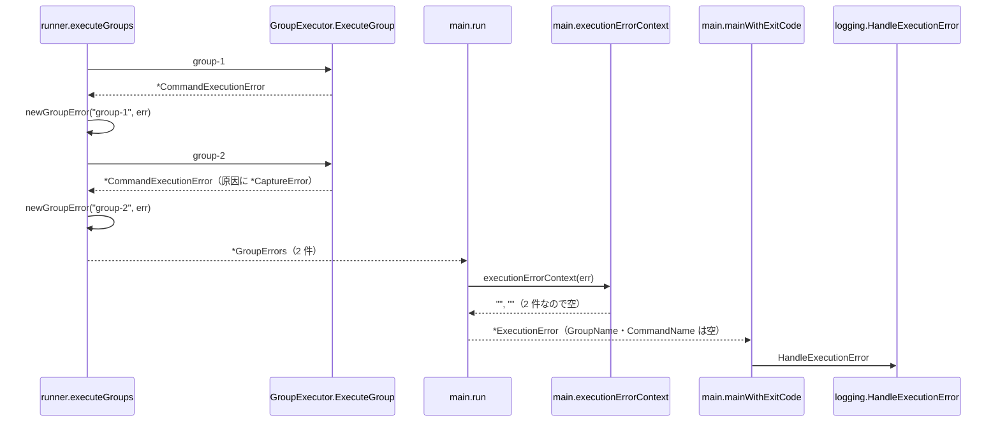
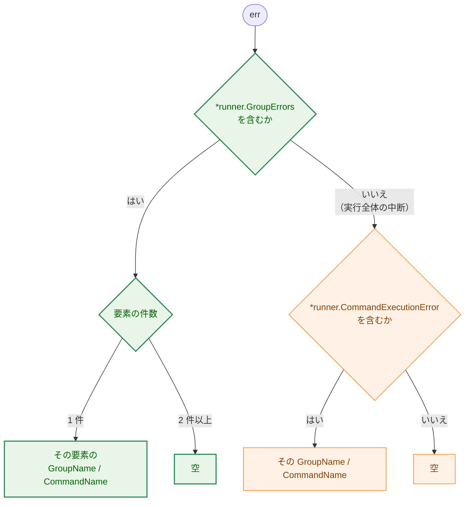
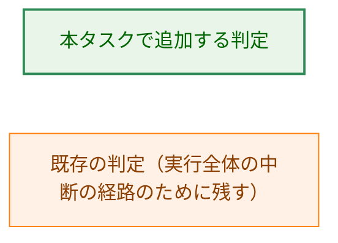
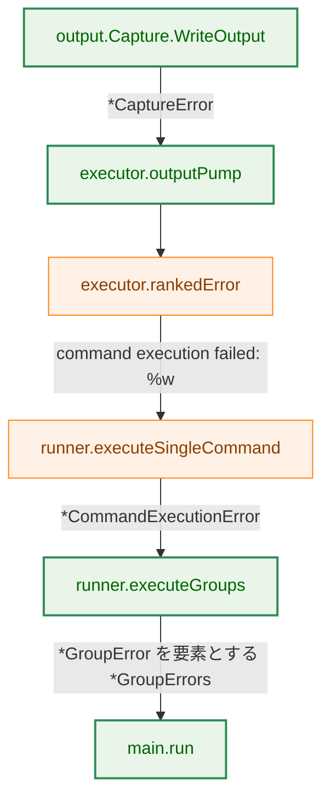
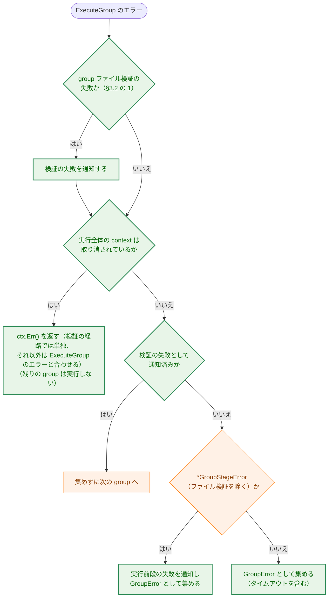

# アーキテクチャ設計書: 複数 group 失敗時のエラー行への group 帰属の表示

## Document Status

| Item | Value |
|---|---|
| Status | `approved` |
| Created | 2026-09-26 |
| Review date | 2026-09-26 |
| Reviewer | isseis |
| Comments | 2026-09-26: 実装計画の作成中に、§7.2 の AC-29 の検証手順と §10 の AC-05 のテスト対応を修正した。前者は 1 つの監査記録からは `user_group_command_failure` と `command_group_summary` の 2 種類の Slack メッセージを作れないため記録ごとの観測経路を明記し、後者は外側の context の有無を `internal/runner` の統合テストでは検証できないため `cmd/runner` の判定テストに限った。設計判断の変更はない（編集上の修正）。 |

## 0. 前提

- 要件: [`01_requirements.md`](01_requirements.md)（2026-09-26 に PR #1185 のレビューで改訂し、`draft` に戻った）
- 本書の現状の記述と `file:line` は、コミット `8f7f7681` のコードを読んで確認したものである（それ以降、Go のコードは変更されていない）。
- 用語（要件と同じ）:
  - 「外側の context」は、`ExecutionError.GroupName`・`CommandName` から作る `(group: ..., command: ...)` の表示を指す。
  - 「実行全体の context」は、`executeGroups` が受け取る `context.Context`（`ctx`）を指す。`cmd/runner/main.go:271` の `signal.NotifyContext` が作り、SIGINT・SIGTERM で取り消される。本番では、これより上位に期限を持つ context は無い。
  - 「実行全体の中断」は、`ExecuteGroup` がエラーを返した時点で実行全体の context が取り消されていること、または取り消し済みのため group を開始しなかったことを指す（§3.2 の「中断の定義」）。「タイムアウト」は、コマンド自身の `timeout` による期限切れを指す。
  - 「出力ファイル」は、コマンドの `output` に指定したファイルを指す。executor は、出力ファイルがあるときだけ出力の書き込み先（`OutputWriter`）を受け取る。

## 1. 設計の全体像

### 1.1 設計原則

- **原因の文言は差し替えない。** 報告に出す原因は常に `Error()` の文言とする。原因の一部を別の文言に置き換える仕組み（`UserFriendlyError`）は削除する。
- **group の失敗は型で宣言する。** `executeGroups` が失敗した group の一覧を専用の型で返す。呼び出し側は、その型が持つ失敗の件数で外側の context を決める。`Unwrap() []error` を持つかどうかという形では判定しない（CLAUDE.md「Declare, don't infer」）。
- **失敗 1 件は複数件の特殊な場合として扱う。** 件数によらず同じ型を返し、1 件用の別の形を持たない。
- **不変条件は型で守る。** 新しい型のフィールドは非公開とし、生成は構築関数だけが行う。構築関数は呼び出し側の誤り（空の一覧・nil の要素・空の group 名・nil の原因）を panic で拒否する（CLAUDE.md「Enforce invariants with the type」「Reject, don't normalize」）。既存の `GroupStageError`（`internal/runner/group_stage.go:113-118`、構築関数 `:150-197`）と同じ形にそろえる。
- **中断は実行全体の context の状態で判定する。** エラーが `context.Canceled`・`context.DeadlineExceeded` を含むかどうかは、どの context が取り消されたかを表さない。実行全体の context の状態は、中断されたかどうかを直接表す。
- **設定の誤りは読み込みで拒否する。** 負の `output_size_limit` は、負の `timeout` と同じく設定の読み込みで拒否する。以後の処理は、上限が 0 以上であることを前提にできる。
- **文言の互換を保つ。** 新しい型の `Error()` は、原因が 1 行であれば、変更前の戻り値（`fmt.Errorf("failed to execute group %s: %w", ...)` と `errors.Join`）と同じ組み立て方の文言を返す。原因が複数行のときは、続きの行を字下げして帰属を示す（AC-33）。

### 1.2 概念モデル

`GroupErrors` は 1 回の実行で失敗した group の一覧であり、1 件以上の `GroupError` を持つ。`GroupError` は失敗した 1 つの group を表し、group 名・command 名・原因を持つ。型名は要件の仮称 `GroupErrors` に合わせ、エラー型の `…Error` 接尾辞（`CommandExecutionError`・`GroupStageError`）にそろえた。



矢印の意味: `*--` は「保持する」、`..>` は「構築時に原因のチェーンから型で command 名を読み取る」を表す。

Legend: クラス図は色分けを使わない。`<<new>>` は本タスクで追加する型、`<<existing>>` は変更しない既存の型を表す。

## 2. システム構成

### 2.1 全体構成（変更前と変更後）

矢印 A → B は「A の結果（エラー値）を B が受け取る」を表す。ノードは処理を行う関数である。

```mermaid
flowchart TD
    classDef data fill:#e6f7ff,stroke:#1f77b4,stroke-width:1px,color:#0b3d91;
    classDef process fill:#fff1e6,stroke:#ff7f0e,stroke-width:1px,color:#8a3e00;
    classDef enhanced fill:#e8f5e8,stroke:#2e8b57,stroke-width:2px,color:#006400;
    classDef problem fill:#ffe6e6,stroke:#d62728,stroke-width:2px,color:#7b0000;

    subgraph Before["変更前"]
        B_EG["runner.executeGroups"]
        B_CTX["main.executionErrorContext"]
        B_HEE["logging.HandleExecutionError"]
        B_FC["logging.formatCause"]
        B_OUT[("stderr Details: / error_message")]
        B_EG -->|"ラップしたエラー<br>または errors.Join"| B_CTX
        B_CTX --> B_HEE --> B_FC --> B_OUT
    end

    subgraph After["変更後"]
        A_EG["runner.executeGroups"]
        A_CTX["main.executionErrorContext"]
        A_HEE["logging.HandleExecutionError"]
        A_OUT[("stderr Details: / error_message")]
        A_EG -->|"*GroupErrors"| A_CTX
        A_CTX --> A_HEE --> A_OUT
    end

    class B_EG,B_HEE process
    class B_CTX,B_FC problem
    class A_EG,A_CTX,A_HEE enhanced
    class B_OUT,A_OUT data
```



変更前の `executionErrorContext` は `Unwrap() []error` の有無で判定し、`formatCause` は `UserMessage` で原因を差し替える。変更後は `formatCause` を削除し、`executionErrorContext` は `*GroupErrors` の件数で判定する。

Legend:



### 2.2 コンポーネント配置

矢印 A → B は「A が B を import する」を表す。本タスクは新しい import を追加しない。図は本タスクで変更するパッケージの間の既存の依存だけを示す。`internal/logging` は `internal/runner` を import しないままである。



依存の根拠: `cmd/runner/main.go:733`（`runner.CommandExecutionError`）、`internal/runner/group_stage.go:7`（`logging` の import）、`internal/runner/group_executor.go:20`（`config` の import）、`internal/runner/runner.go:21`（`base/output` の import）、`internal/runner/base/output/capture.go:9`（`base/executor` の import）。

Legend:


### 2.3 データの流れ（2 つの group が失敗する場合）



`*ExecutionError` は `run` が組み立て（`cmd/runner/main.go:692-702`）、`mainWithExitCode` が `HandleExecutionError` を呼ぶ（`:238-239`）。stderr の出力は次のようになる（途中の文言は例）。

```
  Details: error running commands: failed to execute group group-1: command fail-cmd in group group-1 failed: ...
           failed to execute group group-2: command cap-cmd in group group-2 failed: command execution failed: output capture error during execution phase: output size limit exceeded for '/path/to/out' (limit: 1048576 bytes)
```

group-2 の原因がコマンドのタイムアウトのとき、原因は複数行になる（§3.1）。続きの行は group の行より深く字下げされる（途中の文言は例）。

```
  Details: error running commands: failed to execute group group-1: command fail-cmd in group group-1 failed: ...
           failed to execute group group-2: command slow-cmd in group group-2 failed: command execution failed: context deadline exceeded
             signal: killed
```

## 3. コンポーネント設計

### 3.1 `internal/runner`: `GroupError` と `GroupErrors`（新規）

新しいファイル `internal/runner/group_errors.go` に置く。

```go
// GroupError is one group that failed during a run.
type GroupError struct {
	group   string // GroupSpec.Name of the failed group
	command string // command the failure belongs to, or "" when none
	err     error  // the error ExecuteGroup returned
}

func (e *GroupError) GroupName() string
func (e *GroupError) CommandName() string
func (e *GroupError) Error() string
func (e *GroupError) Unwrap() error

// GroupErrors reports every group that failed during a run. It always holds
// at least one GroupError.
type GroupErrors struct {
	errs []*GroupError
}

func (e *GroupErrors) Errors() []*GroupError // a copy
func (e *GroupErrors) Error() string
func (e *GroupErrors) Unwrap() []error

func newGroupError(group string, err error) *GroupError
func newGroupErrors(errs []*GroupError) *GroupErrors
```

- **group 名。** `executeGroups` が実行した `GroupSpec.Name` を渡す。エラーから取り出さない。
- **command 名。** `newGroupError` が原因のチェーンから型で読む。`*CommandExecutionError` があればその `CommandName`、なければ `*GroupStageError` の `CommandName()`、どちらも無ければ空とする。
  - `ExecuteGroup` の本番実装が返すエラーは、この 2 型のどちらかを含む。コマンド実行前の失敗は `groupExecutionExitError` が `*GroupStageError` にそろえる（`internal/runner/group_executor.go:241-249`）。コマンド実行後の失敗は `executeSingleCommand` が `*CommandExecutionError` を返す（`:645-649`、`:668-672`）。
  - どちらも含まないエラー（テストのモックなど）では、command 名は空になる。
- **構築関数の拒否。** `newGroupError` は空の group 名と nil の原因で、`newGroupErrors` は空の一覧と nil の要素で panic する。`newGroupErrors` は受け取ったスライスをコピーして持つ。
- **`Error()`。** `GroupError.Error()` は `failed to execute group <group>: <原因の Error()>` を組み立てる。原因の `Error()` が複数行のときは、2 行目以降の各行の先頭に字下げ（空白 2 文字）を加える。1 行目は字下げしない。`GroupErrors.Error()` は各要素の `Error()` を `"\n"` でつなぐ。
  - 原因が 1 行のとき、これは変更前の `fmt.Errorf("failed to execute group %s: %w", ...)` と `errors.Join` と同じ組み立て方である。AC-09 は「原因が 1 行のとき、同じ原因から変更前の組み立て方で作った文言と一致する」と読む（原因の文言そのものは AC-16 で変わりうる）。
  - 原因が複数行のとき、各 group の行は字下げ無しで始まり、続きの行は字下げされるので、`GroupErrors.Error()` の各行がどの group に属するかは字下げで分かる。stderr の `Details:` では、`handleErrorCommon` が 2 行目以降のすべての行を `Details:` の幅だけ字下げする（`internal/logging/pre_execution_error.go:156-159`）ので、続きの行はその group の `failed to execute group <g>:` の行の下に、さらに 2 文字深く並ぶ（AC-33、§2.3 の例）。
  - コマンドのタイムアウトの原因は複数行になる。executor は期限切れのとき、context のエラーと `Wait()` のエラーを `errors.Join` でつなぐ（`internal/runner/base/executor/command_lifecycle.go:890-891`）。書き込みエラーが優先されるとき（`:888-889`）はこの形にならない。kill・回収の失敗も `errors.Join` で加わる（`:788`）。
  - コマンドのタイムアウトは、変更前は `failed to execute group <g>: ` を付けずにそのまま返されていた（`internal/runner/runner.go:422-424`）。変更後は他の失敗と同じく `GroupError` になるので、これが付く。AC-09・AC-11 はコマンドのタイムアウトを除く。外側の context は変わらない（AC-22、§3.3）。
- **`Unwrap() []error`。** 各 `GroupError` を返す。`GroupError.Unwrap()` は原因を返す。これにより `errors.Is`・`errors.AsType` が各 group の原因に届く（AC-10）。`Unwrap() []error` は到達のためだけに持ち、「複数 group の失敗」の判定には使わない。
- **`Errors()` はコピーを返す。** 呼び出し側が一覧を書き換えて不変条件を崩せないようにする。

`cmd/runner` のテストは `*GroupErrors` を作る必要があるので、`internal/runner/test_helpers.go`（`//go:build test`）に次を置く。command 名は引数で直接与える（原因のチェーンから読む処理の検証は `internal/runner` のテストで行う）。

```go
func NewGroupErrorForTest(group, command string, err error) *GroupError
func NewGroupErrorsForTest(errs ...*GroupError) *GroupErrors
```

### 3.2 `internal/runner`: `executeGroups`（変更）

**失敗の集め方。**

- 失敗した group ごとに `newGroupError(group.Name, err)` を作って集める。現状の `fmt.Errorf("failed to execute group %s: %w", ...)`（`internal/runner/runner.go:436`、`:450`）を置き換える。
- 終了時、失敗が 1 件以上なら `newGroupErrors` で返す。失敗が無ければ `nil` を返す。戻り値の型は `error` のままとし、nil の `*GroupErrors` を `error` として返してはならない（non-nil の `error` になるため）。
- 1 件のときに分けて返す処理（`:457-459`）と `errors.Join`（`:463`）は削除する。

**`ExecuteGroup` がエラーを返したときの処理の順序（F-006）。** 次の順に行う（§6.3 に図）。

1. **group ファイル検証の失敗を通知する。** 対象は、現状の分岐で検証の経路（`:441-448`）に入るエラーと同じである。つまり、`*verification.Error` を含み、かつ `*GroupStageError` を含まないか、含んでもその段階がファイル検証である（既存の `isGroupFileVerificationFailure`: `:469-475`）エラーである。ファイル検証以外の段階の `*GroupStageError` は、チェーンに `*verification.Error` を含んでいても段階の経路（3）で扱う（`:426-431` のコメント、Task 0176）。現状と同じく通知して、失敗としては集めない。この通知は中断の判定より前に行う。
   - `verifyGroupFiles` は context を受け取らない（`internal/runner/group_executor.go:215`）ため、現状、このエラーは `context.Canceled` を含まず、中断の分岐（`:422`）に入らない。つまり現状は、中断と重なっても検証の失敗は必ず通知される。判定を context の状態に変えると、検証中に SIGINT・SIGTERM を受けたときに通知が落ちるので、改ざん検知の通知を落とさないよう、通知を先に行ってこれを保つ。
2. **実行全体の中断を判定する。** 実行全体の context が取り消されていれば（`ctx.Err() != nil`）、残りの group を実行せずに返す（AC-21）。戻り値は次のとおりとする。
   - 1 で検証の経路に入ったときは、`ctx.Err()` だけを返す。検証の失敗は通知済みで、集める対象に入らないという現状の扱いを保つ（group ファイル検証の失敗の扱いは要件の対象外）。
   - それ以外は `errors.Join(ctx.Err(), err)` を返す。
   - どちらの場合も、戻り値は nil でなく、`errors.Is(err, context.Canceled)` が成り立つ（AC-35、AC-36）。`cmd/runner` は nil でないエラーを終了コード 1 と失敗の `RUN_SUMMARY` 行で報告する（`cmd/runner/main.go:249`）。
   - 変更前は、中断と重なった失敗の形によって戻り値が異なっていた（`internal/runner/runner.go:405-465`）。エラーが `context.Canceled` を含めばそれを返す（`:422-424`）。子が先に終わって `context.Canceled` を含まなければ集め（`:450`）、次の group の前の判定で `ctx.Err()` だけを返す（`:413-417`）が、最後の group ではその判定を通らずに、集めた失敗（`context.Canceled` を含まない）を返す（`:457-463`）。検証の失敗は通知して集めず（`:441-448`）、最後の group では、それまでに集めた失敗か nil を返すので、中断された実行が終了コード 0 と成功の `RUN_SUMMARY` 行で報告されうる。この変化は要件の決定事項「意図した挙動の変化」の 8 で宣言している。
   - エラーの中身（`errors.Is(err, context.Canceled)`・`context.DeadlineExceeded`: `:422`）では判定しない。この分岐は削除する。
   - `ctx.Err()` を加えるのは、中断を戻り値で宣言するためである。利用者の Ctrl-C や systemd の停止はプロセスグループ全体（systemd では cgroup 全体）に届くので、コマンドの子プロセスも同じシグナルで終わる。子の終了が executor の中断の検出より先に観測されると、`ExecuteGroup` のエラーは `context.Canceled` を含まず「終了コード 130」などになる（`internal/runner/base/executor/command_lifecycle.go:687-693` の `select` はどちらが先に準備できたかに依存する）。`ctx.Err()` を加えれば、`errors.Is(err, context.Canceled)` が常に成り立ち、報告に `context canceled` が出る。`ExecuteGroup` のエラーも到達可能なまま残る。
   - それまでに集めた失敗は報告しない（要件の対象外「実行全体の中断時に集めた失敗を報告すること」、§4.4）。
3. **実行前段の失敗（`*GroupStageError`、1 の対象を除く）を通知し、集める。** 現状の分岐（`:432-436`）のとおり。1 と 3 の振り分けは現状と同じであり、既存のテスト `TestRunner_StageDispatchPrefersStageOverVerificationError`・`TestRunner_FileVerificationStageKeepsExistingPath`（`internal/runner/runner_test.go`）が引き続き通ることで確かめる。中断された実行では 2 で返るので通知しない。この順序は現状と同じである（Task 0176 のテスト `TestRunner_CancellationSkipsStageNotification` が固定している）。
4. **それ以外を集める。** コマンドのタイムアウト（エラーが `context.DeadlineExceeded` を含む）もここに入り、次の group へ進む（AC-19、AC-20）。後続の group は、ほかの失敗の後と同じく、それぞれの通知（実行前段の失敗の通知、`command_group_summary`）を行う（AC-32）。

**変えないもの。**

- group の間で実行全体の context の取り消しを検出したら、`ctx.Err()` をそのまま返す（`:413-417`）。
- タイムアウトしたコマンドの group では、そのコマンドで group の実行が止まり、`command_group_summary` が通知される（`internal/runner/group_executor.go:282-289`、`:175-180`）。

**中断の定義。** 「実行全体が中断された」とは、次のどちらかを指す（要件の決定事項「実行全体の中断は context の状態で判定する」）。

- `ExecuteGroup` がエラーを返し、その時点で実行全体の context が取り消されている（上の 2）。
- 実行全体の context がすでに取り消されていたため、group を開始しなかった（各 group の前の判定: `internal/runner/runner.go:411-417`）。

最後の group の `ExecuteGroup` が nil を返した後に取り消しが届いた場合は、どちらにも当たらず、戻り値は nil（終了コード 0、成功の `RUN_SUMMARY` 行）のままである。これで中断された処理が隠れることは無い。

- `executeAllCommands`（`internal/runner/group_executor.go:253-293`）は group のコマンドを順にすべて実行し、最初のエラーで返る。
- コマンドの間に取り消しが届くと、次のコマンドは開始前の判定で失敗する（`internal/runner/base/executor/command_lifecycle.go:457-459`）。
- したがって、nil を返した group はすべてのコマンドを実行し終えている。

このため、`executeGroups` は group のループの後に取り消しを判定しない。

### 3.3 `cmd/runner`: `executionErrorContext`（変更）

次の順で判定する。

1. `err` が `*runner.GroupErrors` を含むとき、要素が 1 件ならその `GroupName()`・`CommandName()` を返し、2 件以上なら空を返す（AC-05、AC-08、AC-15）。
2. 含まないとき、`*runner.CommandExecutionError` を含めばその group 名・command 名を返す。
3. どちらでもなければ空を返す。

1 を 2 より先に判定しなければならない。`*GroupErrors` は `Unwrap() []error` で各原因に届くので、2 件以上の失敗でも `errors.AsType[*runner.CommandExecutionError]` は先頭の失敗に一致してしまう。

2 が残るのは、`executeGroups` が `*GroupErrors` を経由せずにエラーを返す経路、つまり実行全体の中断（§3.2 の 2）があるためである。コマンドの実行中に中断されると、戻り値は `errors.Join(ctx.Err(), <*CommandExecutionError を含むエラー>)` になり、2 はその group 名・command 名を返す。group ファイル検証の経路で中断されたときの戻り値は `ctx.Err()` だけなので、3 により空になる。変更前も、この経路のエラーには外側の context が付いていた（`cmd/runner/main.go:733-735`）。2 が `*GroupStageError` を読まないのも現状と同じである。

コマンドのタイムアウトは、§3.2 の変更により `*GroupErrors` の要素になるので、1 で判定される。失敗がタイムアウトの 1 件だけのとき、1 はそのコマンドの group 名・command 名を返す。これは変更前に 2 が返していた値と同じである（AC-22）。先に別の group が失敗していたときは要素が 2 件になり、1 は空を返す。変更前は先の失敗を捨ててタイムアウトのエラーだけを返していたので、2 がタイムアウトしたコマンドの group 名・command 名を返していた（§4.3）。タイムアウトのエラーが `*CommandExecutionError` を含むことは次による。

- `executeSingleCommand` は各コマンドを、コマンドの `timeout` を期限とする context で実行する（`internal/runner/group_executor.go:574-589`）。
- 期限切れのとき、executor は `ctx.Err()` をコマンドのエラーに `errors.Join` で加える（`internal/runner/base/executor/command_lifecycle.go:890-891`）。
- それを `*CommandExecutionError` がラップする（`group_executor.go:645-649`）。

`Unwrap() []error` の有無による判定（`cmd/runner/main.go:730-732`）は削除する。

### 3.4 `internal/logging`: 原因の差し替えの削除（変更）

- `UserFriendlyError`（`internal/logging/execution_error.go:22-27`）・`GetUserFriendlyMessage`（`:31-36`）・`formatCause`（`:45-58`）を削除する。
- `PreExecutionError.Detail()`（`internal/logging/pre_execution_error.go:93-98`）と `HandleExecutionError`（`:243-276`）は、原因として `Err.Error()` をそのまま使う。
- `HandleExecutionError` の「外側の context を `Message` の直後、原因の前に置く」順序と、`handleErrorCommon` の複数行の字下げ（`:156-159`）は変えない。
- 複数 group の失敗では、`GroupErrors.Error()` が各 group の文言を改行でつなぐ。各 group の文言の**先頭の行**は `failed to execute group <group>: ` で始まる（AC-01、AC-02）。1 つの group の原因が複数行のときは、続きの行が字下げされる（§3.1、AC-33）。

`PreExecutionError.Detail()` の文言への影響は次のとおりである。

- `UserMessage` を持つ唯一の型 `*output.CaptureError` を作るのは `Capture.WriteOutput`（`internal/runner/base/output/capture.go:43`、`:64`）だけである。これはコマンド実行中に出力を書くときだけ呼ばれる（`Capture.Write`: `:32-34`）。したがって、実行前エラーの原因にこの型は入らない。
- `formatCause` は `UserMessage` の差し替えのほかに、トップレベルの `Unwrap() []error` を子ごとに分けていた。`fmt.Errorf` に `%w` が 2 つ以上あるエラーもこれに当たる。このとき分けた結果には、`fmt.Errorf` のエラー書式の文言が含まれない。削除後は `Error()` の文言になり、エラー書式の文言が残る。`PreExecutionError.Err` の設定箇所のうち確認したもの（`internal/runner/bootstrap/config.go:82`、`:100`、`:112`、`internal/runner/bootstrap/environment.go:148`、`internal/runner/group_stage.go:210`）には、そのようなエラーは無い。そのような原因が今後現れても、文言は情報が増える方向に変わるだけである。

### 3.5 `internal/runner/base/output`: `CaptureError` と `Capture.WriteOutput`（変更）

```go
// CaptureError is built only by the constructors below; its fields are unexported.
type CaptureError struct {
	typ   ErrorType
	path  string
	phase ExecutionPhase
	cause error
	limit int64 // size limit in bytes; set only for ErrorTypeSizeLimit
}

func (e *CaptureError) Error() string
func (e *CaptureError) Unwrap() error

// newSizeLimitError builds the size-limit error. Its phase is PhaseExecution and
// its cause is always ErrOutputSizeExceeded. It panics when limit is not positive.
func newSizeLimitError(path string, limit int64) *CaptureError

// newFileSystemError builds the error for a failed write to the output file.
// Its phase is PhaseExecution.
func newFileSystemError(path string, cause error) *CaptureError
```

- **上限 0 は無制限として扱う（F-007）。** `Capture.WriteOutput` は `MaxSize` が 0 のとき、サイズを比べずに書き込む（AC-23、AC-24）。0 を無制限とする定義（`internal/common/output_size_limit_type.go:21-25`）と、無制限のとき上限 0 を渡す `NormalResourceManager`（`internal/runner/resource/normal_manager.go:244-249`）に合わせる。
- **フィールドを非公開にし、構築関数だけで作る（AC-25）。** `CaptureError` のフィールドを非公開にし、上限値 `limit` を加える。本番コードが作る `CaptureError` は、サイズ超過（`capture.go:43`）と出力ファイルへの書き込み失敗（`capture.go:64`）の 2 種類だけなので、構築関数もこの 2 つとする。
  - `Capture.WriteOutput` のサイズ超過は `newSizeLimitError(c.OutputPath, c.MaxSize)` で作る。構築関数が種類・段階（`PhaseExecution`）・原因（`ErrOutputSizeExceeded`）を決めるので、サイズ超過の原因が常にセンチネルであることを 1 箇所で保証する。`newSizeLimitError` は上限値が 0 以下なら panic する。
  - 書き込み失敗は `newFileSystemError(c.OutputPath, err)` で作る。種類は `ErrorTypeFileSystem`、段階は `PhaseExecution` に固定する。
  - フィールドが非公開なので、パッケージの外からは、上限値が 0 以下のサイズ超過のエラーも、原因がセンチネルでないサイズ超過のエラーも作れない。不変条件は、本番の経路がたまたま構築関数を呼んでいることではなく、コンパイラが保証する（CLAUDE.md「Enforce invariants with the type」）。本番でこの panic に届く入力は無い。
  - 上限 0 では、上の項目のとおり比較しないので呼ばれない。
  - 負の上限は、設定の読み込みで拒否される（§3.6）。
  - 本番で `Capture` を作るのは `DefaultOutputCaptureManager.PrepareOutput`（`internal/runner/base/output/manager.go:98-106`、`:122-130`）だけで、その `maxSize` は検証済みの設定から来る（`normal_manager.go:244-251`）。`Capture` はフィールドが公開された構造体なので、テストが負の `MaxSize` で作ることはできる。panic の影響は §4.5 を参照。
- **`Error()` は非公開の種類で分ける。** 種類が `ErrorTypeSizeLimit` のときだけ `output capture error during <phase>: output size limit exceeded for '<path>' (limit: <limit> bytes)` とし、原因の文言を付けない。それ以外の種類は現状の文言（`errors.go:83-96`）のままとする（AC-16、AC-18）。
  - `Cause` を付けない理由: サイズ超過の `Cause` はセンチネル `ErrOutputSizeExceeded` であり、`output size limit exceeded` という同じ事実を表す。`errors.Is` で判定するために持っているだけで、文言としての情報はない。
  - 分岐は宣言された `Type`（列挙型）で行い、`Cause` の文言を比べない（CLAUDE.md「Declare, don't infer」）。
  - 文言に `output size limit exceeded for '<path>'` を残すのは、変更前に stderr に出ていた `UserMessage` の文言（`errors.go:118`）と同じ部分文字列を保ち、その文言を検索している運用に配慮するためである（§4.3）。
- **原因はそのまま持ち、`Unwrap` で返す。** `errors.Is(err, output.ErrOutputSizeExceeded)` と `errors.AsType[*output.CaptureError]` が成り立ち続ける（AC-17）。これを使うテストは `test/performance/output_capture_test.go:154` と `internal/runner/base/executor/executor_privilege_gap_integration_test.go:683` である。
- **`UserMessage`（`errors.go:115-130`）・`GetType`（`:104-106`）・`GetPath`（`:109-111`）を削除する**（AC-06、AC-18）。本番コードからの呼び出しは、`GetUserFriendlyMessage` 経由の `UserMessage` だけである。
- **アクセサは加えない。** パッケージの外で `CaptureError` のフィールドを読むコードは、本番にもテストにも無い（`grep` で確認。フィールドを読むのは同じパッケージの `errors.go:83-111` と、テストの `capture_test.go:205`・`errors_test.go` だけである）。同じパッケージのテストは非公開のフィールドを読めるので、アクセサは必要になったときに加える。
- **テストの作り方。** `errors_test.go` の `CaptureError` のリテラル（`:31`、`:46`、`:60`、`:75`、`:89`、`:163`）は構築関数で作り直す。サイズ超過と書き込み失敗の行は `newSizeLimitError`・`newFileSystemError` で作る。構築関数の無い種類（`ErrorTypePathValidation`・`ErrorTypePermission`・`ErrorTypeCleanup`）の行は、AC-18（それらの文言が変わらないこと）を確かめるために残し、同じパッケージの `errors_test.go` に置くテスト専用の構築関数で作る。この関数はテストのファイルにだけあるので、本番のパッケージの外からは使えない。これらの種類そのものの整理は [#1180](https://github.com/isseis/go-safe-cmd-runner/issues/1180) で扱う。

`CaptureError` は本番では常にポインタで作られる（`capture.go:43`、`:64`）。メソッドの受け手もポインタにそろえ、原因への到達を確かめるテストは `errors.AsType[*output.CaptureError]` を使う。

使われていない `DefaultOutputCaptureManager.WriteOutput`（`manager.go:136-143`）にも「0 は無制限、超えたら失敗」の判定があり、別のセンチネル `ErrOutputSizeLimitExceeded` を返す。本番から呼ばれないので本タスクでは変えず、重複の整理は [#1181](https://github.com/isseis/go-safe-cmd-runner/issues/1181) で扱う。

### 3.6 `internal/runner/config`: 負の `output_size_limit` の拒否（変更）

```go
// ErrNegativeOutputSizeLimit indicates that an output_size_limit value is negative.
var ErrNegativeOutputSizeLimit error

// ValidateOutputSizeLimits validates that all output_size_limit values in the
// configuration are non-negative.
func ValidateOutputSizeLimits(cfg *runnertypes.ConfigSpec) error
```

- `ValidateTimeouts`（`internal/runner/config/validation.go:188-222`）と同じ形で、グローバル（`GlobalSpec.OutputSizeLimit`）・テンプレート（`CommandTemplate.OutputSizeLimit`）・コマンド（`CommandSpec.OutputSizeLimit`）の負の値をすべて集め、`ErrNegativeOutputSizeLimit` をラップした 1 つのエラーで返す。各項目は値と設定箇所（テンプレート名、group 名・コマンド名と添字）を含む（AC-27）。
- **取り込んだテンプレートを含めて検証する。** `ValidateTimeouts` は、主の設定ファイルだけを読む `loadConfigInternal` の中で呼ばれる（`internal/runner/config/loader.go:231-233`）。`includes` で取り込んだテンプレートのファイルは `ParseTemplateContent`（`internal/runner/config/template_loader.go:22-44`）で読まれた後、値の検証を受けないまま `mergeTemplates` で `cfg.CommandTemplates` に合流する（`loader.go:62-93`）。そのため `ValidateOutputSizeLimits` は、`ValidateTimeouts` の隣ではなく、`loadConfigWithIncludes` でテンプレートを合流した後の設定全体に対して呼ぶ。テンプレート名は合流時に重複が拒否されるので、設定箇所はテンプレート名で一意に示せる。
  - 取り込んだテンプレートの負の `timeout` も同じ理由で `ValidateTimeouts` を通らず、`createCommandContext` の panic（`internal/runner/group_executor.go:575-578`）に届く。これは本タスクの要件の対象外の既存の不具合なので、[#1182](https://github.com/isseis/go-safe-cmd-runner/issues/1182) で扱う。
- 設定の読み込みは dry-run の分岐より前（`cmd/runner/main.go:350`）なので、dry-run でも拒否される。読み込みのエラーは、既存の設定の読み込みエラーと同じく実行前エラーとして報告され、どの group も実行されない。
- 同じ値を、検証を行わない `common.NewOutputSizeLimitFromPtr`（`internal/common/output_size_limit_type.go:33`）が上限に変換する点は変えない。検証済みの設定だけがこの変換に届くためである。

### 3.7 `internal/runner/base/executor`: 出力の保持の上限（変更）

現状の保持の上限は次のとおりである（`internal/runner/base/executor/output_pump.go:46-48`、`internal/runner/base/executor/command_lifecycle.go:437-441`）。

| | stdout | stderr |
|---|---|---|
| 出力ファイルあり | 上限なし | 上限なし |
| 出力ファイルなし | 上限なし | 32 KiB（`nilWriterStderrLimit`: `internal/runner/base/executor/executor.go:33-36`） |

出力ファイルが無いときの stderr は、先頭と末尾の 32 KiB ずつを保持し、間を省略する（`boundedBuffer`: `output_pump.go:222-310`）。

- **すべての場合に同じ上限を使う（AC-28、AC-29）。** 出力ファイルの有無によらず、stdout・stderr の両方を、メモリ上では先頭の 64 KiB（以下「先頭の窓」）に限って保持する。末尾は保持しない。64 KiB は、現状の出力ファイルが無いときの stderr の保持（先頭と末尾の 32 KiB ずつ）と同じメモリの量である。定数は 1 つにまとめて用途に合う名前にし、現状の `nilWriterStderrLimit` を置き換える。上限が場合によって変わらなくなるので、`command_lifecycle.go:437-441` の出力ファイルの有無による分岐は無くなり、`newOutputPump`（`output_pump.go:49`）は stdout・stderr の両方に同じ上限を使う。
- **保持の仕組み。** 既存の `boundedBuffer`（`output_pump.go:222-310`）を、先頭と末尾を保持する形から、先頭だけを保持する形に変える。
  - 書き込み（`Write`: `:253-277`）は、先頭の窓が満ちるまで保持し、それ以降のバイトは保持せずに数だけを数える。末尾のリングバッファ（`suffix`・`suffixW`）は無くなる。`Write` が失敗せず、上限に達しても呼び出し側に知らせない点は変えない。
  - 保持した出力を返す処理（`Bytes`: `:291-310`）は、省略が無いとき（出力が先頭の窓に収まったとき）は保持したバイトをそのまま返す。省略があったとき（上限を超えたとき）は、先頭の窓を、その中の最後の改行まで（改行を含む）に切り詰め、その後ろに `... omitting N bytes ...` を置く。先頭の窓に改行が無ければ、省略の印だけを返す。
  - `N` は、書き込み時に保持しなかったバイト数に、切り詰めで捨てたバイト数（先頭の窓の最後の改行より後ろ）を加えたものとする。
- **先頭だけを保持する理由（redaction との関係）。** redaction（`SanitizeOutputForLogging`: `internal/runner/base/security/logging_security.go:30`、`RedactText`: `internal/redaction/redactor.go:272`）は、`key=value` の並びと値の形（トークンなど）を検出する。検出の多くは、値の手前にある目印（`key=`、`ghp_`、`Bearer `、`-----BEGIN ... PRIVATE KEY-----`、`"private_key_id"` など）から値を見つける。先頭だけを保持すると、残るテキストは元の出力の先頭から続く完全な行の並びになる。
  - 値の手前に目印を持つ検出では、残った値の目印は、値より前にあるので必ず一緒に残る。各行は元の行そのままなので、行ごとの一致は変更前と変わらない。
  - `urlCred`（`internal/redaction/value_detector.go:36`）は例外で、目印 `scheme://` が値の手前にあるだけでなく、一致には値（パスワード）の後ろにある区切り `@` も必要である。現実の URL の認証情報は 1 行に収まる（RFC 3986 の userinfo は、そのままの空白や改行を含められない）。完全な行だけを残す規則により、1 行の URL は `@` を含めて全体が残るか、全体が残らないかのどちらかであり、パスワードだけが `@` と切り離されて残ることは無い。
  - ただし `urlCred` のユーザー名・パスワードの文字の集合は改行を除かない。`scheme://user:` で始まり、`/`・`?`・`@` を含まずに先頭の窓の外まで続く不正な形の URL が、パスワードと `@` の間で切れると、残ったパスワードの部分は隠されない。これは既知の制限として受け入れる（§4.4）。
  - 値の形の検出のうち、改行をまたいで一致しうるものは、`internal/redaction/value_detector.go` の `githubToken`（`:27`、`gh[pors]_` の後の `\s*`）、`gcpSAKey`（`:33`、`\s*`）、`pemPrivate`（`:34`、`(?s)`）、`bearerToken`（`:35`、`Bearer` の後の `\s+`）、`urlCred`（`:36`、改行を除かない文字の集合）である。先頭と末尾を保持する形では、省略の境目で途中の行を捨てても、これらの目印を先頭側に、値を末尾側に分けて残しうる（例: `Bearer` の行で先頭が終わり、値の行が末尾に残る）。また、目印が省略された範囲にあると、末尾に残った値は目印を失う。先頭だけを保持する形では、残るテキストの中に境目が無いので、いずれも起きない。ただし、値の途中で先頭の窓が終わると、`bearerToken`・`githubToken` の目印と値が、それぞれ最後の完全な行とその次の（捨てた）行に分かれうる。このとき残るのは目印だけで、値は残らない。
  - PEM の秘密鍵のブロックは、`END` の行が先頭の窓の外に出ると、`BEGIN` の行と本文の前半だけが残る。これは下の「`internal/redaction` の変更」で扱う。`END` の行だけが残ることは無い。
  - 末尾を保持する代替（リングバッファなど）は、境目をまたぐ redaction の扱いと合わせて [#1186](https://github.com/isseis/go-safe-cmd-runner/issues/1186) で扱う（§4.4、§9）。
- **出力ファイルが無いときの stderr も変わる。** 現状の先頭と末尾の 32 KiB ずつの保持も、先頭の 64 KiB だけの保持になる（§4.3）。上限を超えた stderr の末尾（失敗したコマンドの最後のエラー行など）は残らなくなる。
- **出力ファイルへの書き込みは変えない。** 上限はメモリ上の保持だけにかかり、`OutputWriter` には、変更前と同じくすべてのバイトを渡す（`executor.go:678-693`）。出力ファイルに書かれる内容は、変更前と同じである（AC-28）。ただし、出力ファイルに出力の全体が残るのは、コマンドが成功し、出力が `output_size_limit` に収まったとき（または上限が 0 のとき）に限られる。これは変更前と同じである。
  - 正の上限を超える書き込みは、`Capture.WriteOutput` が書き込まずに拒否する（`internal/runner/base/output/capture.go:42-58`）。
  - コマンドが失敗すると（上限の超過を含む）、`NormalResourceManager.executeCommandWithOutput` は出力の一時ファイルを削除し、出力ファイルは作られない（`internal/runner/resource/normal_manager.go:270-275`）。このため、失敗したコマンドの上限を超えた出力の末尾は、出力ファイルがあってもどこにも残らない（§4.4）。
- **出力ファイルが無いときの stderr の報告の条件は変えない。** 出力ファイルが無いとき、`Result.Stderr` はコマンドが異常終了したときだけ設定され、正常終了では空になる（`command_lifecycle.go:774-780`、`Cmd.Output` に合わせたもの）。stdout にはこの条件が無い。本タスクは保持の上限だけをそろえ、この非対称は変えない。
- **出力ファイルが無いコマンドの stdout。** 先頭の窓を超えた部分（と、上の規則で捨てた途中の行）は、どこにも残らなくなる。runner はコマンドの出力を自身の標準出力へ表示しない。この stdout を全体として保存していたのは、下の表の構造化ログだけである。出力の全体が必要なコマンドには出力ファイルを指定する。出力ファイルに全体が残るのは、上の項目の条件を満たすときである（利用者向け文書に記載する、AC-31）。
- **`Cmd.Output` との違い。** 出力ファイルが無いときの stderr の現状の上限は、`os/exec` の `Cmd.Output` が stderr に適用する上限（先頭と末尾）に合わせたものである（`executor.go:33-35` のコメント、`output_pump.go:222-225` のコメント）。本タスクの後は、stderr も先頭だけを保持し、stdout にも上限がかかる。executor の `Execute` を呼ぶのは runner の `NormalResourceManager.executeCommandInternal` だけ（`internal/runner/resource/normal_manager.go:299`）であり、stdout の全体や stderr の末尾を必要とする呼び出し元は無い。

保持した出力を使う箇所と、変わる点は次のとおりである。いずれも全体を必要としない。表の「残った完全な行」は、先頭の窓の中の最後の改行までの行を指す。デバッグログと Slack の欄の値は、切り詰めの位置より前の部分だけを表示するので、残った完全な行の長さがその位置以上であれば、欄の内容は変更前と同じになる。それより短ければ、欄の中に省略の印が現れる。先頭の窓に改行が無い出力は、完全な行が 1 つも残らないのでその一例であり、欄は省略の印から始まる。redaction を通る欄では、この比較は redaction の後のテキストに対して行う（AC-34 により、`BEGIN ... PRIVATE KEY` の行以降が隠れて短くなることがある）。

| 使う箇所 | 変更前 | 変更後 |
|---|---|---|
| デバッグログ `Command execution result` の `stdout`（`internal/runner/group_executor.go:602-603`、`truncateStdout`: `:612-619` で先頭の 500 バイト、`maxStdoutLengthForDebugLog`: `:594`） | 切り詰めて記録 | 省略が無い出力と、残った完全な行が 500 バイト以上ある出力では変わらない。それより短い出力では、500 バイトの中に省略の印が現れる（先頭の窓に改行が無い出力では、省略の印から始まる） |
| デバッグログ `Command execution result` の `stderr`（`group_executor.go:605-606`） | 出力ファイルありは全体（最大 `output_size_limit`）、なしは先頭と末尾の 32 KiB ずつ | 残った完全な行と省略の印 |
| `command_group_summary` の構造化ログレコードの `output`（`internal/common/logschema.go:122-128` で全体を記録） | 全体（出力ファイルありは最大 `output_size_limit`、なしは上限なし） | 残った完全な行と省略の印 |
| Slack の `command_group_summary` の出力（`internal/logging/slack_handler.go:814`、`:823`。`truncateOutput`: `:568-577` が stdout を `outputMaxLength`（`:22`、1000）、stderr を `stderrMaxLength`（`:23`、500）に、`truncationSuffix`（`:24`、`...`）を含めて切り詰めるので、元の内容は stdout で最大 997 バイト、stderr で最大 497 バイト） | 切り詰めて表示 | 省略が無い出力と、redaction の後の残った完全な行が stdout で 997 バイト、stderr で 497 バイト以上ある出力では変わらない。それより短い出力では、欄の中に省略の印が現れる（先頭の窓に改行が無い出力では、欄は省略の印から始まる） |
| `Command failed`・`Command failed with non-zero exit code` の構造化ログの `stderr`（`group_executor.go:639-643`、`:659-665`） | 出力ファイルありは全体（最大 `output_size_limit`）、なしは先頭と末尾の 32 KiB ずつ | 残った完全な行と省略の印 |
| executor の `Command execution failed` のログの `stderr`（`internal/runner/base/executor/command_lifecycle.go:789-793`） | 同上 | 残った完全な行と省略の印 |
| `run_as_user`/`run_as_group` 付きコマンドの失敗の監査ログの `stdout`・`stderr`（`internal/runner/base/audit/logger.go:120-121`）と、その Slack 通知（`user_group_command_failure`、`slack_handler.go:1033-1063`） | 監査ログの stdout は全体（出力ファイルありは最大 `output_size_limit`、なしは上限なし）、stderr は上の行と同じ。Slack は切り詰めて表示 | 監査ログは残った完全な行と省略の印。Slack は `command_group_summary` の行と同じく、省略が無い出力と、redaction の後の残った完全な行が stdout で 997 バイト、stderr で 497 バイト以上ある出力では変わらない。それより短い出力では、欄の中に省略の印が現れる |

Slack の欄の値は、監査ログの `stdout`・`stderr`（`internal/runner/base/audit/logger.go:120-121` で `RedactText` を通したもの）を `truncateOutput`（`internal/logging/slack_handler.go:568-577`、呼び出しは `:1056`、`:1063`）で切り詰めたものであり、`command_group_summary` と同じく保持した出力から作られる。Slack のために、完全な行に切り詰める前の生の先頭を別に持つことはしない。生の先頭は redaction より前に行の途中で切れるので、完全な行だけを残す規則で防いだ断片の漏れ（途中で切れたトークンなど）を、再び持ち込むためである。

**`internal/redaction` の変更（AC-34）。** 秘密鍵の PEM ブロックの `END` の行が先頭の窓の外に出ると、`BEGIN` の行と本文の前半だけが保持される。これを redaction の値の形の検出で扱う。executor は秘密の形を知らないままとする。

- **現状。** 値の形の検出 `ValueDetector.Mask`（`internal/redaction/value_detector.go:143`）は、`BEGIN ... PRIVATE KEY` の行から次の `END ... PRIVATE KEY` の行までを最短一致で隠すパターン `pemPrivate`（`value_detector.go:34`、適用は `:156`）を持つ。このパターンは `BEGIN` と `END` の両方を必要とするので、`BEGIN` の側だけのテキストには一致しない。`Mask` は `RedactText`（`internal/redaction/redactor.go:272`、`Mask` の呼び出しは `:291-295`）から呼ばれ、`SanitizeOutputForLogging` は `RedactSensitiveInfo` が有効なとき `RedactText` を使う（`internal/runner/base/security/logging_security.go:30-37`、`:49-51`）。
- **追加する規則。** `pemPrivate` を適用した後に、対応する `END` の行が無い `BEGIN ... PRIVATE KEY` の行（`pemPrivate` の適用後に残る `BEGIN` の行）から、テキストの末尾までを隠す。置き換えの文字列は検出の既定の placeholder とする。
  - `pemPrivate` を先に適用するのは、完全なブロックを変更前と同じ範囲で隠し、完全なブロックを持つテキストで後ろの内容まで隠さないためである。
  - `END` の側だけが残ったブロックの規則は加えない。先頭だけを保持するので、保持した出力には `END` の側だけのブロックは生じない。
- **安全な側に倒す。** 対応する `END` の行が無い `BEGIN` の行より後ろは、秘密鍵でなくても隠れる。保持した出力では、省略の印もこの範囲に入る。秘密鍵を出すより、隠しすぎる側を選ぶ（要件の決定事項「一部だけ残った秘密鍵のブロックも隠す」）。`PUBLIC KEY` のブロックは対象にしない。
- **及ぶ範囲。** 規則は `RedactText` を通るすべての値に及ぶ。構造化ログの属性とメッセージ（`RedactingHandler`: `redactor.go:348`、`:752`）、監査ログ（`audit/logger.go:83-85`、`:120-121`、`:194`、`:232-238`）、`SanitizeOutputForLogging` を通る `command_group_summary` の出力（`internal/runner/group_executor.go:270-271`）、環境変数の検証（`internal/runner/base/security/environment_validation.go:60`）である。

### 3.8 コンポーネントの責務と変更ファイル

| ファイル | 変更 | 責務 |
|---|---|---|
| `internal/runner/group_errors.go` | 新規 | `GroupError`・`GroupErrors` と構築関数 |
| `internal/runner/runner.go` | 変更 | `executeGroups` が `*GroupErrors` を返す。中断の判定を実行全体の context の状態で行う |
| `internal/runner/test_helpers.go` | 変更 | `NewGroupErrorForTest`・`NewGroupErrorsForTest`（`test` ビルドタグ） |
| `cmd/runner/main.go` | 変更 | `executionErrorContext` を件数による判定にする |
| `internal/logging/execution_error.go` | 変更 | `UserFriendlyError`・`GetUserFriendlyMessage`・`formatCause` を削除 |
| `internal/logging/pre_execution_error.go` | 変更 | `Detail()`・`HandleExecutionError` が `Err.Error()` を使う |
| `internal/runner/base/output/errors.go` | 変更 | `CaptureError` のフィールドを非公開にし、`limit`・`newSizeLimitError`・`newFileSystemError` を追加する。サイズ超過の `Error()`、`UserMessage`・`GetType`・`GetPath` の削除 |
| `internal/runner/base/output/capture.go` | 変更 | 上限 0 を無制限として扱い、サイズ超過を `newSizeLimitError`、書き込み失敗を `newFileSystemError` で作る |
| `internal/runner/config/errors.go` | 変更 | `ErrNegativeOutputSizeLimit` の追加 |
| `internal/runner/config/validation.go` | 変更 | `ValidateOutputSizeLimits` の追加 |
| `internal/runner/config/loader.go` | 変更 | テンプレートを合流した後に `ValidateOutputSizeLimits` を呼ぶ |
| `internal/runner/base/executor/output_pump.go` | 変更 | `newOutputPump` が stdout・stderr に同じ上限を使う。`boundedBuffer` を先頭と末尾の保持から先頭だけの保持に変え、`Bytes` が先頭の窓を完全な行に切り詰めて省略の印を置く |
| `internal/runner/base/executor/command_lifecycle.go` | 変更 | 出力ファイルの有無による上限の分岐を削除する |
| `internal/runner/base/executor/executor.go` | 変更 | 保持の上限の定数（64 KiB の先頭の窓）を 1 つにまとめ、`nilWriterStderrLimit` を置き換える |
| `internal/redaction/value_detector.go` | 変更 | 対応する `END` の行が無い `BEGIN ... PRIVATE KEY` の行からテキストの末尾までを隠すパターンを加え、`Mask` で `pemPrivate` の後に適用する（AC-34） |
| `docs/user/toml_config/04_global_level.ja.md` | 変更 | 「4.8 output_size_limit」に 0 が無制限であること・負の値は読み込みで拒否されること（AC-26）、メモリ上に保持する出力の上限と、出力の全体が必要なら出力ファイルを指定すること、出力ファイルに全体が残るのはコマンドが成功し出力が上限に収まったとき（または上限が 0 のとき）であること（AC-31）を追記。「4.1 timeout」の「動作の詳細」に、タイムアウト後も後続の group が実行されること、既知の制限としてプロセス（孫プロセスを含む）が残りうることを追記（AC-30） |
| `docs/user/toml_config/04_global_level.md` | 変更 | 上記を `/mktrans` で反映 |

変更する挙動を検証している既存のテスト（更新が必要）:

| テスト | 現在の検証内容 | 対応 |
|---|---|---|
| `internal/runner/runner_test.go:447-453` | 失敗 1 件が multi-error でないこと、`*CommandExecutionError` に届くこと | `*GroupErrors`（1 件）であることの検証に置き換える。`*CommandExecutionError` への到達は残す |
| `cmd/runner/main_test.go:745-790` `TestExecutionErrorContext` | `errors.Join` とラップしたエラーで外側の context を決めること | 入力を `*GroupErrors` に置き換え、§7.1 の行を加える |
| `internal/logging/pre_execution_error_test.go:43-48`、`:70-80` | `Detail()` が `UserMessage` を優先すること、`errors.Join` の子を分けること | `friendlyTestError`（`Error()` と `UserMessage()` が異なる型）は残し、期待値を `Error()` の文言に反転する |
| `internal/logging/pre_execution_error_test.go:609-640` `TestHandleExecutionError_CauseFormatting` | `HandleExecutionError` が `UserMessage` を使うこと | 同上。期待値を `Error()` の文言に反転する |
| `internal/runner/base/output/errors_test.go` の `TestCaptureError`（`:21`）・`TestCaptureErrorInterface`（`:162`） | 公開のフィールドを持つリテラルで作った `CaptureError` の文言と `Unwrap`。サイズ超過は旧文言（`:74-86`） | 構築関数で作り直す（§3.5）。サイズ超過は新しい文言と上限値に更新し `newSizeLimitError` で、書き込み失敗は `newFileSystemError` で作る。構築関数の無い種類の行は、同じパッケージのテスト専用の構築関数で作り、文言が変わらないこと（AC-18）を確かめる |
| `internal/runner/base/output/capture_test.go:205` | サイズ超過のエラーの `Type` フィールド | 非公開のフィールドを読む形に更新する（同じパッケージなので読める） |
| `internal/runner/runner_test.go:2831-2842` `TestRunner_CancellationSkipsStageNotification` | モックが `context.Canceled`・`DeadlineExceeded` を原因に持つ段階のエラーを返すと、実行前段の通知をしないこと | モックのエラーを返すときに実行全体の context を取り消すように変える。取り消さない場合は通知されることを別の行で検証する |
| `internal/runner/base/executor/output_pump_test.go:343-345` | stderr の上限が出力ファイルの有無で 0（上限なし）と 32 KiB に分かれること | 出力ファイルの有無によらず stdout・stderr の上限が同じであることの検証に更新する |
| `newOutputPump` を呼ぶテスト（`output_pump_test.go:139`、`:194`、`:220`、`:269`、`:287`、`:302`、`:355`、`executor_lifecycle_test.go:362`） | 現在の引数で出力ポンプを作ること | 引数の変更に合わせて更新する（コンパイラが検出する） |
| `internal/runner/base/executor/executor_test.go:248` の `TestExecute_NilOutputWriter_StderrPrefixSuffixBound` | 改行を含まない 70 KiB の `x` の stderr が、ちょうど 32 KiB の先頭・省略の印・32 KiB の末尾になること | 先頭だけの保持（§3.7）に合わせて書き直し、名前も改める。改行を含まない出力では完全な行が残らないので、期待値は省略の印だけ（省略したバイト数は全体）になる。完全な行が残ることは、改行を含む出力の行を加えて確かめる。出力ファイルが無いときの stderr の保持が先頭と末尾から先頭だけに変わることは、挙動の変化として §4.3 に挙げる |
| `internal/runner/base/executor/output_pump_test.go` の `TestBoundedBuffer_KeepsPrefixAndSuffix`（`:49`）・`TestBoundedBuffer_WriteNeverFails`（`:120`） | 改行を含まない入力で、先頭・省略の印・末尾がバイト単位で保持されること | 先頭だけの保持に合わせて書き直す（前者は名前も改める）。末尾を保持しないこと、先頭の窓を完全な行に切り詰めること、先頭の窓に改行がある行と無い行を表に持つ |
| `internal/redaction/redactor_test.go:4086` `TestDefaultPatternSets_AreUnchanged` | 値の形の検出のパターンの集合と各パターンの文字列（`pemPrivate` は `:4138`）が変わらないこと | 追加する 1 つのパターンを期待値に加える。`pemPrivate` の文字列は変えない |
| `internal/redaction/value_detector_test.go` の `TestValueDetector_Mask_PositiveCases`（`:12`）・`TestValueDetector_Mask_NegativeCases`（`:93`） | 完全な PEM の秘密鍵のブロックが隠れること、`PUBLIC KEY` のブロック（`:123-125`）が隠れないこと | そのまま通ることを確かめ、§7.1 の `BEGIN` の側だけのブロックの行を加える |
| `internal/redaction/redactor_test.go:3274` `TestRedactText_ValueBasedDetection` | `RedactText` で完全な PEM のブロックが隠れること（`:3298-3299`） | そのまま通ることを確かめる |
| 64 KiB を超える stdout の全体、または上限を超えた stderr の末尾を検証している既存のテスト | （あれば）stdout の全体、stderr の末尾 | 実装時に `make test` で検出して更新する |

`internal/runner/runner_test.go:660-735` の `TestRunner_CommandTimeoutBehavior` は `t.Skip` で常に飛ばされる（`:661`）ため、変更の検証には使わない。

`friendlyTestError` を残すのは、`UserMessage` を持つ型が無くなると「`Error()` をそのまま使う」ことを他の表示と区別できる入力が無くなり、テストが失敗しえなくなるためである（CLAUDE.md「Every test must be able to fail for its stated reason」）。テストを削除する場合は、AC-14 に従い `go tool cover -func` の結果を関数単位で比べる。

## 4. エラーハンドリング設計

### 4.1 エラー型

新しいエラー型は §3.1 の `GroupError`・`GroupErrors` の 2 つである。新しいセンチネルは `config.ErrNegativeOutputSizeLimit`（§3.6）の 1 つである。

### 4.2 文言の設計

| 状況 | `Details:` の文言 |
|---|---|
| 失敗 1 件（`*CommandExecutionError`、`CaptureError` を含まない、原因が 1 行、タイムアウトでない） | `error running commands (group: g, command: c): failed to execute group g: command c in group g failed: ...`（変更前と同じ、AC-11） |
| 失敗 1 件（`*GroupStageError`、group レベル） | `error running commands (group: g): failed to execute group g: ...`（外側の context が新たに付く、AC-15） |
| 失敗 1 件（`*GroupStageError`、command レベル） | `error running commands (group: g, command: c): failed to execute group g: ...`（同上） |
| 失敗 2 件以上 | `error running commands: failed to execute group g1: ...` の後に、各 group の文言が `failed to execute group gN: ...` で続く（AC-01、AC-02、AC-05） |
| 出力サイズ超過を含む原因 | 末尾が `output capture error during execution phase: output size limit exceeded for '<path>' (limit: <N> bytes)`（AC-16） |
| 書き込み失敗（`ErrorTypeFileSystem`）を含む原因 | 末尾が `output capture error during execution phase: filesystem error for '<path>': <OS のエラー>`（変更前は `UserMessage` で OS のエラーが落ちていた、AC-03） |
| コマンドのタイムアウト | 失敗の 1 件として扱われ、他の失敗と同じく `failed to execute group g: ` で始まる。変更前はこれが付かなかった（AC-09・AC-11 の例外）。原因は複数行になり、続きの行は下の行のとおり字下げされる。失敗がこの 1 件だけなら外側の context は変更前と同じ（AC-22）。先に別の group が失敗していれば、外側の context は空になる（AC-05） |
| 原因が複数行の group | 先頭の行は `failed to execute group g: ...`、続きの行は `Details:` の字下げに加えて空白 2 文字深く字下げされる（§3.1、§2.3 の例、AC-33） |
| 実行全体の中断 | 先頭の行が `context canceled`、続く行が中断時の `ExecuteGroup` のエラー（§3.2 の 2）。group ファイル検証の経路では `context canceled` だけになる。外側の context は §3.3 の 2・3 で決まる |
| 負の `output_size_limit` | 設定の読み込みエラー。`ErrNegativeOutputSizeLimit` の文言に、値と設定箇所が続く（AC-27） |

構造化ログの `error_message` は同じ文言である（AC-04）。ただし §5.2 の redaction を受ける。

### 4.3 変更前との互換

運用が挙動やエラー文言に依存している場合、影響を受けうる変更は次のとおりである。リポジトリ内にこれらの文言を検索するものは無い（`grep` で確認）。

| 変更 | 変更前 | 変更後 |
|---|---|---|
| `CaptureError` を含む失敗の `Details:` | `error running commands (group: g, command: c): output size limit exceeded for '<path>'` | 原因のチェーン全体（§4.2） |
| サイズ超過の `Error()`（`Command failed` などの slog の `error` 属性にも出る） | `... size limit exceeded for '<path>': output size limit exceeded` | `... output size limit exceeded for '<path>' (limit: <N> bytes)` |
| 失敗 1 件が `*GroupStageError` のときの `Details:` | `error running commands: ...` | `error running commands (group: g[, command: c]): ...` |
| コマンドのタイムアウト後 | 残りの group を実行せず、先の失敗を報告しない | 残りの group を実行し、すべての失敗を報告する |
| コマンドのタイムアウトの報告の文言（`Details:`・`error_message`・`Error()`） | `error running commands (group: g, command: c): command c in group g failed: command execution failed: context deadline exceeded` の後に続きの行 | `error running commands (group: g, command: c): failed to execute group g: command c in group g failed: ...`。続きの行は字下げされる。外側の context は変わらない |
| 先に別の group が失敗した後のコマンドのタイムアウトの外側の context | タイムアウトしたコマンドの `(group: g, command: c)`（先の失敗は捨てられる） | 失敗が 2 件になるので付かない（AC-05）。各行の `failed to execute group <g>: ` で帰属が分かる |
| コマンドのタイムアウト後の Slack 通知 | 後続の group は実行されないので、その通知は無い | 後続の各 group が、ほかの失敗の後と同じく、実行前段の失敗の通知と `command_group_summary` を送る（`internal/runner/group_executor.go:175-180`、AC-32）。通知の件数が増える |
| 原因が複数行の group の `Error()`・`Details:` | 続きの行は字下げされず、`Details:` では他の group の行と同じ字下げで並ぶ | 続きの行は group の行より 2 文字深く字下げされる（AC-33）。原因が 1 行の group の文言は変わらない |
| 1 回の実行にかかる時間 | タイムアウトが起きた時点で実行が終わる | タイムアウト後も残りの group を実行するので、最長で全コマンドの `timeout` の合計まで延びうる。cron・systemd でタイムアウトを実行時間の上限として使っている運用は、実行の重なりや `TimeoutStartSec` を見直す必要がありうる |
| 実行全体の中断時の報告 | 中断の検出の仕方によって `context canceled` の場合と、コマンドの失敗（終了コード 130 など）だけの場合がある。最後の group でコマンドの子が先に終わると、集めた失敗だけを返し、`context canceled` を含まない（`internal/runner/runner.go:457-463`） | 常に `errors.Is(err, context.Canceled)` が成り立ち、`Details:` に `context canceled` の行が出る（AC-36）。コマンドのエラーにも届く |
| group ファイル検証中の中断 | 検証の失敗を通知し、次の group の前の判定で `context canceled` だけを返す。最後の group だった場合は、それまでに集めた失敗か nil を返し、nil のときは中断された実行が終了コード 0 と成功の `RUN_SUMMARY` 行で報告されていた | 検証の失敗を通知し、最後の group でも `context canceled` を返す（§3.2 の 2）。終了コードは 1、`RUN_SUMMARY` 行は失敗になる（AC-35）。検証の失敗は現状どおり集める対象に入らず、報告の本文には出ない |
| `output_size_limit = 0` のコマンド | 出力を 1 バイトでも書くと、その時点でサイズ超過として失敗する（出力しないコマンドは成功する） | 出力の大きさによらず成功する |
| 負の `output_size_limit` を含む設定 | 読み込みは成功する。該当するコマンドは、出力を 1 バイトでも書くとその時点でサイズ超過として失敗する（出力しないコマンドは成功する） | 読み込みで拒否され、どの group も実行されない（dry-run を含む） |
| コマンドのメモリ上の出力 | stdout は全体を保持（出力ファイルありは最大 `output_size_limit`、なしは上限なし）。stderr は出力ファイルありなら全体、なしなら先頭と末尾の 32 KiB ずつで、省略の境目では行の途中で切れる。`command_group_summary` の構造化ログの `output`、`Command failed` の `stderr`、監査ログに、保持した全体が出る | すべて先頭の 64 KiB だけを保持し、上限を超えたときは、その中の完全な行と省略の印だけが残る（§3.7）。末尾は残らない。先頭の窓に改行が無い出力では、省略の印だけが残る。出力ファイルが無いときの stderr も、先頭と末尾の保持から先頭だけの保持に変わるので、上限を超えた stderr の最後の行（失敗の理由であることが多い）が残らなくなる。出力ファイルがあっても、失敗したコマンドの出力ファイルは削除されるので、これらの行はどこにも記録されない（§4.4）。出力ファイルが無いコマンドの stdout で上限を超えた部分は、どこにも残らない |
| 上限を超えた出力のデバッグログの `stdout` と Slack の欄（`command_group_summary` の出力・エラー出力、`user_group_command_failure` の `Output`・`Error Output`） | 保持した出力（stdout は全体、stderr は上の行のとおり）の先頭を切り詰めて表示 | redaction の後の残った完全な行が欄の切り詰めの位置（デバッグログの stdout は 500 バイト、Slack の stdout は 997 バイト、stderr は 497 バイト）以上の長さであれば変わらない。それより短ければ、欄の中に省略の印が現れる。先頭の窓に改行が無い出力では、欄は省略の印から始まる（§3.7） |
| 秘密鍵の PEM ブロックの `BEGIN` の側だけを含むテキストの redaction | 隠されず、残った本文の行がログ・監査ログ・Slack に出る | 対応する `END` の行が無い `BEGIN` の行から末尾までが隠される（§3.7、AC-34）。秘密鍵以外の内容（保持した出力では省略の印を含む）も一緒に隠れることがある |

`output size limit exceeded for '<path>'` という部分文字列は、変更前の stderr・`error_message` にも変更後にも現れる。

### 4.4 既知の制限

- **実行全体の中断では、集めた失敗が報告に出ない。** §3.2 のとおり、実行全体の context が取り消されると、`executeGroups` は集めた失敗を捨てて返す。これは要件の対象外（「実行全体の中断時に集めた失敗を報告すること」）である。
- **タイムアウトしたコマンドのプロセスが残りうる。** executor はタイムアウトのとき直接の子プロセスだけを kill し、プロセスグループへの kill は行わない（`internal/runner/base/executor` に `Setpgid`・`Kill(-pgid)` は無い）。子を kill・回収できなかった場合は `ErrKillAfterCancel`・`ErrChildNotReaped` がエラーに加わる（`command_lifecycle.go:741-742`、`:912`、`:948`）。いずれの場合も、残ったプロセスと後続の group が並行して動きうる。要件の決定事項「タイムアウト後に残るプロセスは受け入れる」により、これを受け入れ、利用者向け文書に記載する（AC-30）。
- **上限を超えた出力の末尾は残らない。** メモリ上の保持は先頭の 64 KiB だけで、末尾は保持しない（§3.7）。上限を超えた stderr の最後の行（失敗したコマンドのエラーの理由であることが多い）は、構造化ログ・監査ログ・Slack のいずれにも出ない。出力ファイルがあっても、失敗したコマンドの出力の一時ファイルは削除される（`internal/runner/resource/normal_manager.go:270-275`）ので、これらの行はどこにも記録されない。末尾も保持する仕組み（リングバッファなど）は、省略の境目をまたぐ redaction の扱いと合わせて [#1186](https://github.com/isseis/go-safe-cmd-runner/issues/1186) で扱う。
- **先頭の窓で切れた秘密鍵のブロックは、隠しすぎることがある。** PEM の秘密鍵のブロックの `END` の行が先頭の窓の外に出る場合は、§3.7 の `internal/redaction` の変更で隠す（AC-34）。このとき、`BEGIN` の行からテキストの末尾まで（省略の印を含む）が隠れるので、秘密鍵以外の出力も読めなくなる。秘密鍵を出さないことを優先して、これを受け入れる。値の形の検出が知らない複数行の秘密の形は、本タスクの前後で扱いが変わらない。
- **複数行にわたる `urlCred` の一致が先頭の窓で切れると、隠されない。** `urlCred`（`internal/redaction/value_detector.go:36`）は、区切り `@` が値の後ろにあり、ユーザー名・パスワードの文字の集合が改行を除かない（§3.7）。`scheme://user:` で始まり、`/`・`?`・`@` を含まずに先頭の窓の外まで続く不正な形の URL が、パスワードと `@` の間で切れると、保持した出力に残ったパスワードの部分は redaction されない。現実の URL の認証情報は 1 行に収まり、1 行の URL は `@` を含めて全体が残るか全体が残らないので、この形の入力は現実には生じないと見なし、受け入れる。次の対策は、いずれも仕組みを加えないという判断により採らない（CLAUDE.md「Do not close a review finding by adding a mechanism until the finding's premise is verified」）。
  - 対応する `@` の無い `scheme://user:` の断片を隠す規則を加える案: `@` の無いよくある `scheme://host:port` の出力を隠しすぎる。
  - 出力を流れのまま少しずつ redaction する案: 現実に生じない入力のための新しい仕組みになる。
  - `urlCred` のユーザー名・パスワードから空白を除く案: 本タスクの範囲の外の redaction の挙動を変える。
- **dry-run の出力の分析は、上限を常に 0 と表示する。** `AnalyzeOutput` は `MaxSizeLimit` を設定しない（`internal/runner/base/output/manager.go:232` 以降）ため、dry-run の `max_size_limit` は常に 0 である（`internal/runner/resource/dryrun_manager.go:746`）。0 が無制限を意味すると利用者向け文書に明記した後は、dry-run が常に表示するこの 0 も無制限を意味すると読めてしまう。本タスクでは変えず、[#1184](https://github.com/isseis/go-safe-cmd-runner/issues/1184) で扱う。

### 4.5 失敗時の扱い

- **`GroupError`・`GroupErrors` の構築関数の panic** は呼び出し側の誤りにだけ起きる。`executeGroups` は、`ExecuteGroup` が nil でないエラーを返したときだけ `newGroupError` を呼ぶ。group 名が空でないことは設定の読み込みで検証済みである（`internal/runner/config/validation.go:50-52`、`internal/runner/config/loader.go:236` から呼ばれる）。
- **`newSizeLimitError` の panic** も呼び出し側の誤りにだけ起きる（§3.5）。これは出力ポンプの読み取りの goroutine（`Capture.Write` → `WriteOutput`）で起きるため、発生すると回復できずプロセスが終わる。defer が走らないため、`RUN_SUMMARY` 行は出ず、出力の一時ファイルが残り、子プロセスが残りうる。本番の入力では届かないことを §3.5 と §3.6 で保証したうえで、この扱いを選ぶ。
- **中断の判定と競合。** コマンドが別の理由で失敗した直後に SIGINT・SIGTERM を受けた場合、`ExecuteGroup` から戻った時点で実行全体の context が取り消されていれば中断として扱う。利用者が中断を求めた以上、残りの group を実行しないのが正しい。戻った後に取り消された場合は、次の group の前の判定（`internal/runner/runner.go:411-417`）で中断する。最後の group が nil を返した後に取り消された場合は、中断に当たらず成功のままである。nil を返した group はすべてのコマンドを実行し終えているので、中断で実行されなかった処理は無い（§3.2 の「中断の定義」）。

## 5. セキュリティ考慮事項

### 5.1 出力先

| 出力先 | 変更の影響 |
|---|---|
| stderr の `Details:` | `handleErrorCommon` が直接書く（`internal/logging/pre_execution_error.go:148-174`）。redaction は通らず、これは変更前と同じである。`CaptureError` を含む失敗では、変更前は `UserMessage` に隠れていた次の情報が新たに出る。書き込み失敗の OS のエラー、サイズ超過の上限値、原因のチェーン全体（`ErrKillAfterCancel`・`ErrChildNotReaped` など、別の uid でプロセスが残っている可能性を示すエラーを含む: `internal/runner/base/executor/command_lifecycle.go:788`）。最後のものは、利用者が気付くべき事象が隠れなくなるという改善である。同じエラーは変更前から `Command failed` の構造化ログ（`internal/runner/group_executor.go:639-643` の `error` 属性）に出ている |
| 構造化ログの `error_message` | `RedactingHandler` を通る点は変わらない（§5.2） |
| 構造化ログ・監査ログの `stdout`・`stderr`・`output` | すべてのコマンドで、先頭の 64 KiB の中の完全な行と省略の印になる（§3.7）。省略は redaction（`SanitizeOutputForLogging`・`RedactText`）より前に起きる。残るテキストは出力の先頭から続く完全な行の並びなので、値の手前に目印を持つ検出では、残った値の目印（`key=`、`Bearer `、`ghp_` など）は必ず一緒に残り、行ごとの一致は変更前と変わらない。値の後ろの区切り `@` を必要とする `urlCred` では、1 行の URL は全体が残るか全体が残らない（複数行にわたる不正な形の URL の制限は §4.4）。先頭と末尾を保持する形で起きうる、境目をまたいだ目印と値の分離（改行や空白をまたぐ検出、目印が省略された範囲にある値の断片）は起きない。PEM の秘密鍵のブロックの `BEGIN` の側だけが残る場合は、redaction がその行から末尾までを隠す（§3.7 の `internal/redaction` の変更、AC-34）。これらの規則は現状の出力ファイルが無いときの stderr にも適用されるので、その点は改善になる（現状の先頭と末尾の保持では、行の途中で切れた断片や `END` の側だけのブロックが残りうる）。Slack の欄も同じ保持した出力と redaction から作られ、生の出力を別に持たない（§3.7）。出力ファイルに書かれる内容は変わらず、redaction の対象ではない点も変わらない |
| Slack | 実行エラーのレコードは `slack_notify=false` のまま（`internal/logging/pre_execution_error.go:270`）で、Slack へは送らない（AC-12）。コマンドのタイムアウトの後は、後続の group の通知（実行前段の失敗の通知と `command_group_summary`）が加わる（AC-32）。これらは既存の通知と同じ経路・同じ redaction を通り、新しい種類の本文は送らない。実行前エラーの Slack 通知の本文（`Detail()`）は、§3.4 のとおり `CaptureError` による変化を受けない。group ファイル検証の失敗の通知は、実行全体の中断と重なっても行う（§3.2 の 1） |

### 5.2 redaction による帰属の喪失

`error_message` は自由文として値の redaction を受け、文言の一部が機密の形に一致すると、全体が `[REDACTED]` になりうる（`docs/dev/architecture_design/security-architecture.md:644`）。本タスクで、この影響を受ける範囲は広がる。

- `CaptureError` を含む失敗は、変更前は短い `UserMessage`（group 名・command 名を含まない）だった。変更後は原因のチェーン全体（group 名・command 名を含む）になる。group 名や command 名が機密の形に一致すると、変更前は読めた `error_message` が `[REDACTED]` になる。
- 複数 group の失敗では 1 つのレコードに全 group の文言が入るので、1 つの group の文言が一致すると全 group の帰属が構造化ログから読めなくなる。この点は変更前の `errors.Join` でも同じである。

stderr には redaction 前の文言が出るので、帰属は stderr で判別できる。redaction の規則は本タスクでは変えない。

### 5.3 脅威モデル

新しい入力経路・権限の変更・外部への送信は追加しない。変わるのは次の点である。

- **エラー文言の組み立てと、stderr・構造化ログに出る情報の範囲**（§5.1、§5.2）。
- **コマンドのタイムアウト後も後続の group が実行される（F-006）。** コマンドが 0 以外の終了コードで失敗した場合と比べると、次のとおりである。
  - 後続の group が先の group の結果に依存する設定では、先の group がタイムアウトしても後続の group が動く。0 以外の終了コードでも同じであり（`internal/runner/runner.go:449-450`）、この点は新しくない。
  - 0 以外の終了コードでは直接の子は回収済みだが、タイムアウトでは子や孫のプロセスが残りうる（§4.4）。残ったプロセス（`run_as_user` で別の uid のことがある）と後続の group が並行して動きうる。これは新しい種類の重なりであり、要件の決定事項により受け入れ、利用者向け文書に記載する（AC-30）。
  - なお、各 group の実行前の検証（ファイル検証・権限監査）は、タイムアウトの有無によらず group ごとに行われる。
- **`output_size_limit = 0` のコマンドは、出力ファイルに無制限に書く（F-007）。** 利用者が明示的に指定した値の定義どおりの挙動であり、出力先のディスクの消費は利用者の設定の責任範囲になる。
- **runner のメモリ使用量は、出力ファイルの有無によらず、コマンドの出力の大きさに比例しなくなる（§3.7）。** 変更前は、出力ファイルを指定しないコマンドが大量に stdout へ書くと、runner のメモリを使い切るおそれがあった。これは可用性の改善である。
- **上限を超えた出力の末尾が監査ログと構造化ログに残らなくなる（§3.7、§4.4）。** `run_as_user`/`run_as_group` 付きコマンドの失敗の監査ログでも、上限を超えた出力は先頭の完全な行だけが記録される。監査の対象の事実（コマンド、利用者、終了コード）は変わらず記録され、出力の末尾の保持は [#1186](https://github.com/isseis/go-safe-cmd-runner/issues/1186) で扱う。
- **負の `output_size_limit` は設定の読み込みで拒否される（§3.6）。**

脅威モデル図は N/A とする。

## 6. 処理フローの詳細

### 6.1 `executionErrorContext` の判定

矢印は判定の順序を表す。



Legend:



### 6.2 出力サイズ超過の原因の組み立て

矢印 A → B は「A が返したエラーを B が受け取り、必要ならラップして上へ返す」を表す。矢印のラベルは受け渡すエラーである。



出力ポンプは最初の書き込みエラーを保持し（`internal/runner/base/executor/output_pump.go:139-172`）、`rankedError` は書き込みエラーを最優先する（`command_lifecycle.go:886-895`）。`command execution failed: %w` のラップは `:795` による。出力ポンプは、メモリ上の保持の上限（§3.7）のために変更する。

Legend:


### 6.3 `executeGroups` のエラー処理

`ExecuteGroup` がエラーを返したときの処理を示す。矢印は処理の順序を表す。



Legend:


## 7. テスト戦略

### 7.1 単体テスト

- **`GroupError`・`GroupErrors`（`internal/runner`）**
  - 原因が 1 行のとき、`Error()` が、同じ原因から `fmt.Errorf("failed to execute group %s: %w", ...)`・`errors.Join(...)` で作った値の `Error()` と一致すること（1 件・2 件、AC-09）。期待値をリテラルで書かず、変更前の組み立て方で作った値と比べる。この一致は原因が 1 行のときだけ確かめる。
  - 原因が複数行のとき（`errors.Join` で 2 行にした原因）、`GroupError.Error()` の 1 行目は `failed to execute group <g>: ` で始まり、2 行目以降はすべて空白 2 文字で始まること。2 件の `GroupErrors.Error()` で、字下げの無い行がちょうど各 group の先頭の行であること（AC-33）。
  - タイムアウトの形の原因（`context.DeadlineExceeded` と `Wait()` のエラーを `errors.Join` でつないだものを `*CommandExecutionError` がラップしたもの）で、`Error()` が `failed to execute group <g>: ` で始まり、続きの行が字下げされること（AC-09・AC-11 の例外、AC-33）。
  - `errors.Is`・`errors.AsType[*CommandExecutionError]`・`errors.AsType[*output.CaptureError]` が 1 件・2 件の各原因に届くこと（AC-10）。
  - command 名が `*CommandExecutionError`・`*GroupStageError`（command レベル）から読まれ、どちらも無ければ空になること。
  - 構築関数が空の group 名・nil の原因・空の一覧・nil の要素で panic すること。`newGroupErrors` に渡したスライスや `Errors()` の戻り値を書き換えても、保持している一覧が変わらないこと。
- **`executeGroups`（`internal/runner`）**: `MockGroupExecutor` で次を確かめる。
  - 0 件・1 件・2 件の失敗。0 件で `nil`（`err == nil` が成り立つ）、1 件以上で `*GroupErrors` を返し、group 名が `GroupSpec.Name` であること（AC-07）。
  - 実行全体の context を取り消さずに、group-1 が `context.DeadlineExceeded` を含む `*CommandExecutionError` を返すと、group-2 が実行され、戻り値が group-1 の要素を含む `*GroupErrors` で、`errors.Is(err, context.DeadlineExceeded)` が成り立つこと（AC-19）。group-1 が 0 以外の終了コードの失敗、group-2 がタイムアウトのとき、両方が要素になること（AC-20 の前提）。
  - group-1 のモックが実行全体の context を取り消してから `context.Canceled` を含まないエラーを返すと、group-2 が実行されず、戻り値が `*GroupErrors` でなく、`errors.Is(err, context.Canceled)` が成り立ち、モックのエラーにも届くこと（AC-21。エラーの中身ではなく context の状態で判定していることを確かめる）。
  - group-1 のモックが実行全体の context を取り消してから `*verification.Error` を返すと、group ファイル検証の失敗の通知が記録されること（§3.2 の 1）。
  - 最後の group（1 つだけの group）のモックが実行全体の context を取り消してから `*verification.Error` を返すと、検証の失敗の通知が記録され、戻り値が nil でなく、`errors.Is(err, context.Canceled)` が成り立ち、`*verification.Error` には届かないこと（AC-35。検証の失敗が集める対象に入らないこと）。変更前の処理では nil が返って失敗することを確かめる。
  - 最後の group のモックが実行全体の context を取り消してから、`context.Canceled` を含まない `*CommandExecutionError`（終了コード 130 の形）を返すと、`errors.Is(err, context.Canceled)` が成り立ち、`errors.AsType[*CommandExecutionError]` もその失敗に届くこと（AC-36）。変更前の処理では `context.Canceled` を含まない集めた失敗が返って失敗することを確かめる。
- **タイムアウト後の group の通知（`internal/runner`）**: `WithGroupNotificationFunc`（`internal/runner/group_executor_options.go:35`）で通知を記録する実際の `GroupExecutor` を使い、group-1 のコマンドを自身の `timeout` でタイムアウトさせ、group-2 を正常に実行させる。group-1 と group-2 の両方の `command_group_summary` の通知が記録されることを確かめる（AC-32）。変更前の中断の判定（エラーの中身による判定）に戻すと、group-2 の通知が記録されずに失敗する。
- **`executionErrorContext`（`cmd/runner`）**: 次の行を持つ表にする（AC-05、AC-08、AC-11、AC-15、AC-22）。
  - `*GroupErrors` 1 件（`*CommandExecutionError`）
  - `*GroupErrors` 1 件（group レベルの `*GroupStageError`、command 名は空）
  - `*GroupErrors` 1 件（command レベルの `*GroupStageError`）
  - `*GroupErrors` 1 件（タイムアウトの `*CommandExecutionError`。変更前と同じ group 名・command 名になること）
  - `*GroupErrors` 2 件（空になること。§3.3 の判定順を逆にすると失敗することを確かめる）
  - 実行全体の中断（`errors.Join(context.Canceled, <*CommandExecutionError を含むエラー>)`）
  - どれでもないエラー
- **`CaptureError`・`Capture`（`internal/runner/base/output`）**
  - サイズ超過の文言が段階・パス・上限値を含み、`size limit exceeded` を 1 回だけ含むこと。`errors.Is(err, ErrOutputSizeExceeded)` が成り立つこと。他の種類の文言が変わらないこと（AC-16〜AC-18）。
  - `Capture.WriteOutput` のサイズ超過が `Limit` に `MaxSize` を設定し、`Cause` が `ErrOutputSizeExceeded` であること。
  - `MaxSize` が 0 の `Capture.WriteOutput` が、大きなデータでもエラーを返さないこと（AC-23）。
  - `newSizeLimitError` が 0 と負の上限値で panic すること（AC-25）。`newFileSystemError` の種類・段階・原因と文言が変更前の書き込み失敗と同じであること（AC-18）。
- **`ValidateOutputSizeLimits`（`internal/runner/config`）**: グローバル・テンプレート・コマンドの負の値がそれぞれ `ErrNegativeOutputSizeLimit` で拒否され、エラーに値と設定箇所が含まれること。0 と正の値と未指定は受け入れること。`Loader.LoadConfig` が、主の設定ファイルの負の値と、`includes` で取り込んだテンプレートのファイルの負の値の両方を拒否すること（AC-27）。
- **`boundedBuffer`（`internal/runner/base/executor`）**: 先頭だけの保持と完全な行への切り詰め（§3.7）を表で確かめる。
  - 先頭の窓に改行がある場合、残るテキストは出力の先頭から始まり、先頭の窓の中の最後の改行で終わり、その後ろに省略の印があること。末尾のバイトが残らないこと。省略の印のバイト数が、保持しなかったバイトと切り詰めで捨てたバイトの合計（出力全体の大きさから残った完全な行の大きさを引いたもの）に等しいこと（AC-29）。
  - 先頭の窓に改行が無い場合、保持した出力が省略の印だけになり、印のバイト数が出力全体の大きさに等しいこと（AC-29）。
  - 短い先頭の行の後に、先頭の窓より長い行が続く場合、先頭の行と省略の印だけが残ること（AC-29）。
  - 省略が無い場合（出力が先頭の窓に収まる場合）は切り詰めず、省略の印も置かないこと。
  - 保持するメモリが、書き込んだ量によらず先頭の窓の大きさを超えないこと（AC-28）。
- **行の境目での切断と redaction の性質のテスト（`internal/redaction` と `boundedBuffer`）**: 値の形の検出と `key=value` の検出のそれぞれに一致する秘密（`pemPrivate`、`githubToken`、`bearerToken`、`gcpSAKey` の改行をまたぐ形と、`urlCred` の 1 行の形を含む）を持つ行を並べたコーパスを作る。`urlCred` の改行をまたぐ形はコーパスに含めない。パスワードと `@` の間で切ると隠されないことが既知の制限（§4.4）であり、この性質の対象外である。各行の境目で先頭を切った（その境目の前の完全な行だけを残し、省略の印を置いた）テキストをすべて `RedactText` に通し、どの秘密の本体も redaction されないまま残らないことを確かめる。コーパスの各秘密が、切らない全体のテキストでは隠されることも確かめ、コーパスが検出に一致する入力であることを示す。テキストの切り方は `boundedBuffer` と同じ規則（先頭の窓を各行の境目に置き、完全な行と省略の印を残す）で作る。切る位置を行の途中にも広げる（完全な行への切り詰めを外す）と、途中で切れたトークンの断片が残って失敗することを確かめる。
- **一部だけ残った秘密鍵のブロック（`internal/redaction`）**: `ValueDetector.Mask` と `RedactText` で次を確かめる（AC-34）。各行で、まず同じ入力を変更前の `pemPrivate` だけに通しても一致しないこと（`BEGIN` の側だけのテキストは既存のパターンで隠れないこと）を確かめ、テストが追加する規則だけを検証していることを示す（CLAUDE.md「A layered path needs inputs only one layer can handle」）。本文の行には、他の値の形の検出に一致しない文字列を使い、それ単独では隠されないことも確かめる。
  - `END` が省略された場合: 先行する行、`BEGIN ... PRIVATE KEY` の行、本文の行、省略の印の並びで、`BEGIN` の行以降が残らず、先行する行は残ること。
  - 完全なブロックの後ろの行が隠れないこと、`PUBLIC KEY` のブロックが隠れないこと。
  - `boundedBuffer` と組み合わせ、PEM のブロックが先頭の窓の終わりをまたぐ出力を書き、保持した出力を `RedactText` に通すと本文の行が残らないこと。追加する規則を外すと本文の行が残って失敗することを確かめる。
- **出力ポンプ・executor（`internal/runner/base/executor`）**: 出力ファイルがある場合と無い場合のそれぞれで、上限を超える stdout・stderr を書くと、保持される出力は上限付きで、先頭の完全な行と省略の印だけを含み、末尾を含まないこと（AC-28、AC-29）。出力ファイルがある場合は、`OutputWriter` にすべてのバイトが渡ること。出力ファイルが無い場合は、実際のコマンドに 64 KiB を超える stdout を書かせて `Result.Stdout` を確かめること（正常終了、つまり終了コード 0 の場合を必ず含める）。stderr は正常終了で報告されない（`TestExecute_NilOutputWriter_LargeStderrStillSucceeds`）のに対し stdout は正常終了でも報告されるので、上限付きで空でも全体でもないことも確かめること。
- **`logging`**
  - `HandleExecutionError` と `Detail()` が、`friendlyTestError` について `UserMessage()` ではなく `Error()` の文言を出すこと（AC-06）。
  - `HandleExecutionError` に `ErrorTypeFileSystem` の `*CaptureError`（`Cause` あり）を含む原因を渡すと、`Details:` に `Cause` の文言が出ること（AC-03）。

### 7.2 統合テスト

- `internal/runner` の既存の出力キャプチャのテスト（`output_capture_integration_test.go`、`runner_test.go` の `TestRunner_OutputCaptureErrorScenarios`）の形で、group-1 はコマンド失敗、group-2 は出力サイズ超過となる設定を実行する。得られたエラーを `HandleExecutionError` に渡し、stderr と `error_message` で AC-01、AC-02、AC-04、AC-05 を確かめる。group 名・command 名には redaction に一致しない名前を使い、`error_message` が `[REDACTED]` にならずに帰属を含むことも確かめる。
- 1 件の失敗（`*CommandExecutionError`）で、stderr と `error_message` が変更前と同じであること（AC-11）。
- **AC-20**: 実際のタイムアウトのエラーの形は、実際の executor でタイムアウトさせる既存のテスト `internal/runner/group_executor_timeout_test.go` の `TestExecuteSingleCommand_TimeoutLogsTimeoutExceeded` と同じ仕組みで作る。これに、エラーが `*CommandExecutionError` と `context.DeadlineExceeded` の両方を含むことの確認を加える。そのうえで、group-1 は 0 以外の終了コード、group-2 はその形のタイムアウトのエラーとなる `executeGroups` の結果を `HandleExecutionError` に渡し、`Details:` に両方の group の行が出ることを確かめる。
- **AC-24、AC-28**: `output_size_limit = 0` と出力ファイルを指定したコマンドを実際に実行し、64 KiB を超える出力を書かせる。出力サイズ超過で失敗せずに完了し、出力ファイルに全出力が書かれ、結果の stdout（`ExecutionResult.Stdout`）が上限付きで省略の印を含むことを確かめる（既存の出力キャプチャの統合テストの形）。
- **Slack の欄とデバッグログ（AC-29）**: 実際の executor で、次の 2 つの出力をコマンドに書かせる。得られた `Result` を監査ログ（`audit.Logger.LogUserGroupExecution`）に渡した記録から `SlackHandler` が組み立てる `user_group_command_failure` の `Output` の欄を確かめる。`command_group_summary` の出力の欄は、同じ出力を group executor の通知（`logGroupExecutionSummary`）が出す記録から確かめる。デバッグログの `stdout` は、同じ実行の `Command execution result` の記録から確かめる。`SlackHandler` は同期送信とモックサーバーで観測する（`user_group_command_failure` と `command_group_summary` は別の記録であり、1 つの記録から両方は作れない）。
  - 先頭の 64 KiB に改行を含まない、64 KiB を超える出力: 欄が、コードブロックの開始の直後に省略の印から始まること。
  - 短い先頭の行（切り詰めの位置より短い行）の後に 64 KiB より長い行が続く出力: 欄が先頭の行の直後に省略の印を含むこと（残った完全な行が切り詰めの位置より短いと、欄の中に省略の印が現れること）。
  - 残った完全な行が切り詰めの位置より長い出力では、欄が変更前と同じであること。
- **AC-27（dry-run）**: 負の `output_size_limit` を含む設定で dry-run を行うと、設定の読み込みで拒否されることを確かめる。

### 7.3 既存挙動の維持

- 実行エラーのレコードの `slack_notify` が `false` のままであること。既存テスト（`internal/logging/pre_execution_error_test.go` の `slack_notify` の検証）を残す（AC-12）。
- 終了コードと `RUN_SUMMARY` 行は `HandleExecutionError` → `handleErrorCommon` の経路で決まり、本タスクはこの経路を変えない（`internal/logging/pre_execution_error.go:148-174`）。既存の `RUN_SUMMARY` のテストが引き続き通ることで確かめる（AC-12）。

### 7.4 静的な確認

`grep` で次を確かめる。

- `UserFriendlyError`・`GetUserFriendlyMessage`・`UserMessage`・`GetType`・`GetPath`・`formatCause` が本番コードに無いこと（AC-06、AC-18）。
- `Unwrap() []error` を型アサーションで判定する箇所が本番コードに無いこと（AC-08）。
- 本番コード全体で `errors.Is(..., context.Canceled)`・`errors.Is(..., context.DeadlineExceeded)` の使用箇所を列挙し、中断を決める分岐が無いこと（AC-21）。残る使用箇所は中断を決めないものに限られる。現状では、タイムアウトのセキュリティログ（`internal/runner/group_executor.go:629`）と Slack 送信の再試行（`internal/logging/slack_sender.go:530`）である。
- 利用者向け文書の記載（AC-26、AC-30、AC-31）。

## 8. 実装の優先順位

各段階でビルドとテストが通る順にする（AC-13）。挙動の修正と文言の整理は別のコミットにする。

1. **`GroupErrors` の導入**: `group_errors.go`、`executeGroups`、`executionErrorContext`、テスト用の構築関数、関連テスト。この段階で、失敗 1 件の `*GroupStageError` に外側の context が付く（AC-15）。原因の文言（`UserMessage` の差し替えを含む）はまだ変わらない。
2. **`UserFriendlyError` の削除**: `logging` の 3 つの関数、`CaptureError.UserMessage`、関連テスト。ここで AC-01〜AC-04 が成り立つ。
3. **秘密鍵のブロックの検出（AC-34）と出力の保持の上限（AC-28、AC-29）**: まず `internal/redaction` の変更と関連テストを入れる。その後、または同じコミットで、出力ポンプ（`boundedBuffer` の先頭だけの保持と完全な行への切り詰め）と `command_lifecycle.go`、関連テスト（§7.1 の行の境目での切断の性質のテストを含む）を入れ、出力ファイルの有無によらず同じ上限にする。保持の上限を先に入れると、その間は stdout と出力ファイルがあるときの stderr で PEM のブロックの `BEGIN` の側だけが残りうるので、検出を後にしてはならない。5 より前に行い、上限 0 を無制限にした時点でメモリ使用量が出力に比例する状態を作らない。
4. **負の `output_size_limit` の拒否（AC-27）**: `ValidateOutputSizeLimits`、関連テスト。
5. **`output_size_limit = 0` の修正（AC-23、AC-24）**: `Capture.WriteOutput` の上限 0、関連テスト。3 の後に行う。
6. **`CaptureError` の整理（AC-16〜AC-18、AC-25）**: フィールドの非公開化、`limit`・`newSizeLimitError`・`newFileSystemError` の追加、サイズ超過の文言、`GetType`・`GetPath` の削除、`errors_test.go` の書き直しを含む関連テスト。`newSizeLimitError` が 0 以下を拒否するので、4 と 5 の後に行う。
7. **タイムアウトと中断の扱いの変更（AC-19〜AC-22、AC-35、AC-36）**: `executeGroups` の処理の順序と中断の判定、関連テスト。1 の後であればよい。
8. **利用者向け文書（AC-26、AC-30、AC-31）**: 日本語版を更新してコミットし、英語版を `/mktrans` で反映する。

2 と 3〜6 の順は入れ替えてよい。2 を 6 より先にすると、その間はサイズ超過の文言に同じ事実が 2 回出るが、情報は欠けない。

## 9. 将来の拡張性

- `GroupErrors` は失敗した group ごとに group 名・command 名を型で持つ。Slack で group ごとの失敗理由を知らせる改善（`01_requirements.md`「検討して採らなかった案」）を行う場合も、エラー文字列を解析せずにこの型から情報を得られる。
- 実行全体の中断で集めた失敗が捨てられる点（§4.4）を直すときも、捨てずに `GroupErrors` と中断のエラーを合わせて返す形で扱える。
- 出力の保持の上限は定数 1 つにまとめるので、上限の値を設定で変えられるようにする場合も、変更箇所は 1 つで済む。
- 上限を超えた出力の末尾の保持（リングバッファなど）は [#1186](https://github.com/isseis/go-safe-cmd-runner/issues/1186) で扱う。末尾を加えるときは、省略の境目をまたぐ redaction（目印と値の分離、`END` の側だけの PEM ブロック）の扱いも合わせて決める必要がある（§3.7）。§7.1 の行の境目での切断の性質のテストは、その変更の回帰の検出にも使える。
- `CaptureError` の使われていない種類と段階の整理は [#1180](https://github.com/isseis/go-safe-cmd-runner/issues/1180)、サイズ超過のセンチネルと判定の重複は [#1181](https://github.com/isseis/go-safe-cmd-runner/issues/1181) で扱う。

## 10. 受け入れ基準との対応

| AC | 設計の該当箇所 | テスト |
|---|---|---|
| AC-01, AC-02 | §3.2、§3.4、§4.2 | §7.2 |
| AC-03 | §3.4、§4.2 | §7.1（`logging`） |
| AC-04 | §4.2、§5.2 | §7.2 |
| AC-05 | §3.3、§6.1 | §7.1（`executionErrorContext`。外側の context の有無を決めるのは `cmd/runner` のこの判定であり、`internal/runner` の統合テストは `ExecutionError` を自ら組み立てるため検証できない） |
| AC-06 | §3.4、§3.5 | §7.1（`logging`）、§7.4 |
| AC-07 | §3.1、§3.2 | §7.1（`executeGroups`） |
| AC-08 | §3.3、§6.1 | §7.1、§7.4 |
| AC-09, AC-10 | §3.1、§4.2 | §7.1（`GroupError`・`GroupErrors`） |
| AC-11 | §3.1、§3.3、§4.2 | §7.1、§7.2 |
| AC-12 | §5.1、§7.3 | §7.3 |
| AC-13 | §8 | 各コミットの `make test`・`make lint` |
| AC-14 | §3.8 | コミットメッセージ |
| AC-15 | §3.3、§4.2 | §7.1（`executionErrorContext`） |
| AC-16, AC-17, AC-18 | §3.5 | §7.1（`CaptureError`・`Capture`）、§7.4 |
| AC-19 | §3.2、§6.3 | §7.1（`executeGroups`） |
| AC-20 | §3.2、§6.3 | §7.1（`executeGroups`）、§7.2 |
| AC-21 | §3.2、§4.5、§6.3 | §7.1（`executeGroups`）、§7.4 |
| AC-35, AC-36 | §3.2、§4.2、§4.3、§6.3 | §7.1（`executeGroups`） |
| AC-22 | §3.3 | §7.1（`executionErrorContext`） |
| AC-23, AC-24 | §3.5 | §7.1（`CaptureError`・`Capture`）、§7.2 |
| AC-25 | §3.5、§4.5 | §7.1（`CaptureError`・`Capture`）、コンパイラ（非公開のフィールド） |
| AC-26 | §3.8 | §7.4 |
| AC-27 | §3.6 | §7.1（`ValidateOutputSizeLimits`）、§7.2 |
| AC-28, AC-29 | §3.7、§4.3、§4.4、§5.1 | §7.1（`boundedBuffer`、行の境目での切断の性質、出力ポンプ）、§7.2（Slack の欄とデバッグログを含む） |
| AC-30 | §3.8、§4.4 | §7.4 |
| AC-31 | §3.7、§3.8 | §7.4 |
| AC-32 | §3.2、§4.3、§5.1 | §7.1（タイムアウト後の group の通知） |
| AC-33 | §2.3、§3.1、§4.2、§4.3 | §7.1（`GroupError`・`GroupErrors`） |
| AC-34 | §3.7（`internal/redaction` の変更）、§4.3、§4.4、§5.1 | §7.1（一部だけ残った秘密鍵のブロック、行の境目での切断の性質） |

## 付録 A. 他の設計文書との関係

> `docs/tasks/0176_group_pre_execution_failure_notification/02_architecture.md:412` は「`Detail()` は原因の連鎖に `UserFriendlyError` があるとき、その文言に置き換える」と、当時の挙動を説明している。本タスクで `UserFriendlyError` は無くなる。ただし、0176 の設計判断（実行前段の原因に `CaptureError` は現れないので、通知の文言に影響しない）は変わらない。完了したタスクの文書なので書き換えない。
