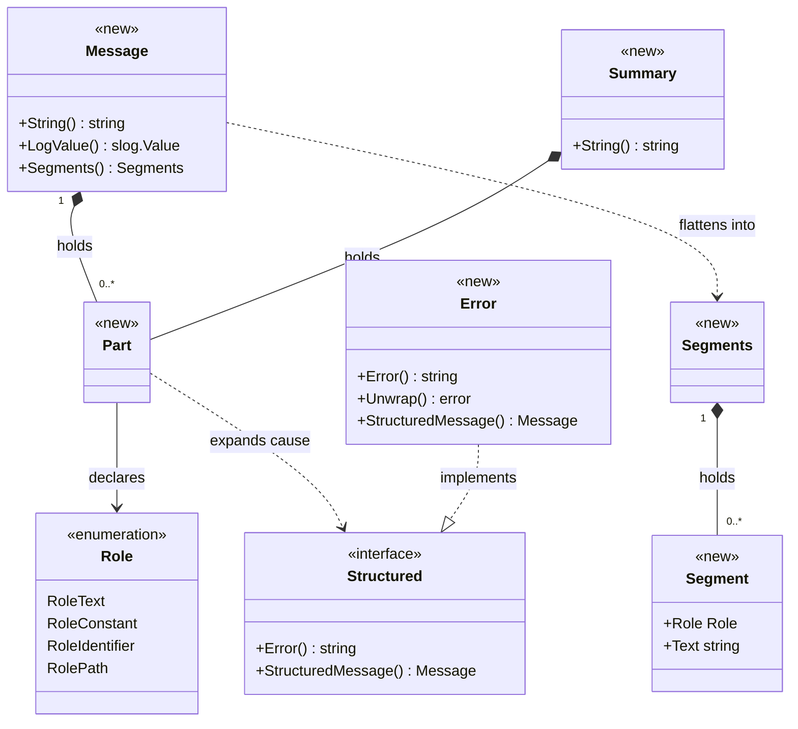
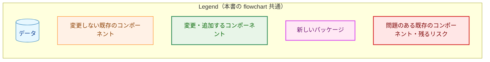
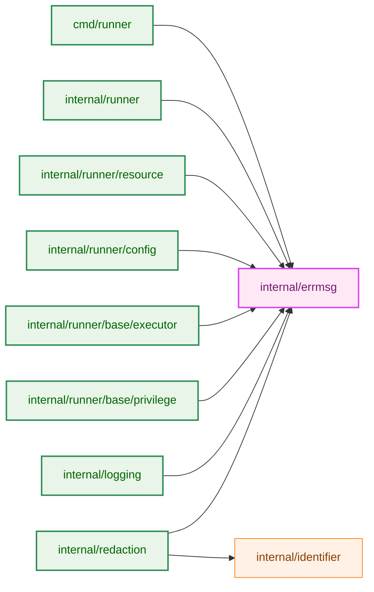
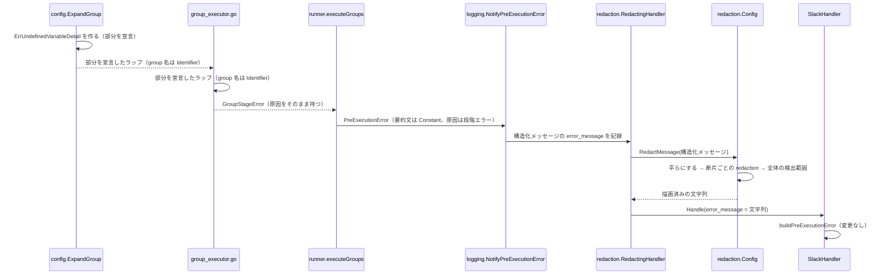
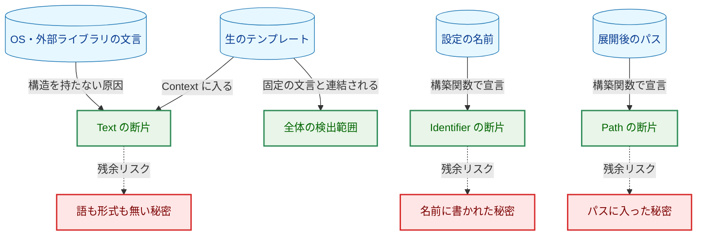
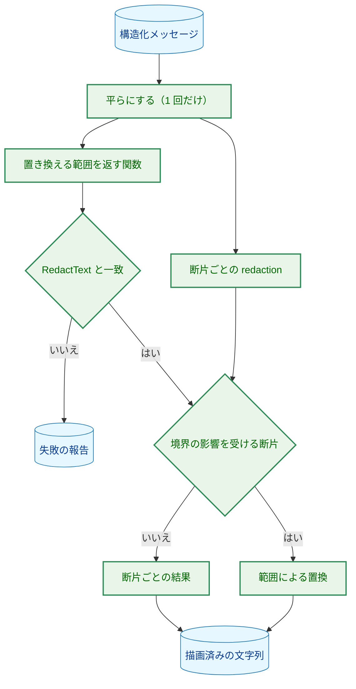

# アーキテクチャ設計書: エラー本文を役割付きの部分として運び、部分ごとに redaction する

## Document Status

| Item | Value |
|---|---|
| Status | `draft` |
| Created | 2026-09-28 |
| Review date | - |
| Reviewer | - |
| Comments | - |

## 0. 前提

- 要件: [01_requirements.md](01_requirements.md)（`approved`、`3bb634bd`）。
- 01 から移した詳細（確認済みの箇所の一覧、役割の割り当ての表、置換の細則）は [design_carryover.md](design_carryover.md) にある。本書はそれを入力として、型と、AC-41 の検証の対象の範囲を確定する。本書と design_carryover.md が食い違う場合は本書に従う。
- 本書は契約・不変条件・対象の範囲を確定する。構築関数の一覧、箇所ごとの部分の並び、バイト単位の手順、ガードの判定の仕方は詳細仕様書で決める（申し送りは [detailed_spec_carryover.md](detailed_spec_carryover.md)）。本書と申し送りが食い違う場合は本書に従う。
- 既存コードの挙動についての記述は、特に断らない限りコミット `3bb634bd` で確認した。
- 用語:
  - 構造化メッセージ: 役割付きの部分の列として表したエラーの本文（01 の用語。役割は後の項で定義）。型は `errmsg.Message`。
  - 部分: 構造化メッセージを組み立てる単位（`errmsg.Part`）。役割と文字列を持つ部分と、原因のエラーを持つ部分（原因の部分）がある。
  - 役割: `Constant`（固定の文言）・`Identifier`（設定で定義された名前）・`Path`（ファイルシステム上のパス）・`Text`（それ以外の自由文）のいずれか。適用する redaction は 01 の決定事項「役割と適用する redaction」による。
  - 免除の役割: `Identifier`・`Path`・`Constant` の 3 つ。どれも `Text` の全段の redaction の一部または全部を免れる。
  - 平らにする: 原因の部分を展開して、役割と文字列の組の列にすること（3.1.3 節）。
  - 断片: 平らにした結果の 1 つの要素（`errmsg.Segment`）。役割と文字列を持つ。redaction は断片の単位で行う。01 の「部分ごとの redaction」は、本書では断片ごとの redaction として実現する。
  - 全体の検出範囲: redaction 前の描画結果の全体に `RedactText` を適用したときに置き換えられるバイトの範囲（01 の決定事項「属性全体と部分の境界に効く保護」）。
  - 対象の範囲: AC-41 の検証の対象とするコードの範囲（3.8.1 節）。
  - 置換文字列・値全体置換: 01「背景」で定義した用語をそのまま使う。

## 1. 設計の全体像

### 1.1 設計原則

- 役割は、エラーを作る時点で型で宣言する。役割は、新しいパッケージ `internal/errmsg` の構築関数でしか決められない（3.1 節）。redaction の側は断片の役割を読むだけで、役割の値を作らない。文字列の内容から役割を推測する処理は置かない（01「役割は宣言で決める」、CLAUDE.md「Declare, don't infer」）。
- 免除の役割の断片に入るバイトは、出どころが決まっている。`Identifier`・`Path`・`Constant` の断片として描画されるバイトは、宣言された値、定数式、errmsg が持つ固定の文字のどれかである。呼び出し側が整形のために渡すバイト（字下げなど）は入らない。免除の役割を宣言できる箇所は、名前ではなく位置（3.8.1 節の範囲）で決める。
- 文言は構造から作る。構造化メッセージを持つエラー型の `Error()` は、構造化メッセージを redaction なしで描画した結果を返す。文言と構造を別々に保守しないので、AC-18（`Error()` の文言は変わらない）と、redaction 前の描画結果が `Error()` と一致することが、作り方から成り立つ。この形は AST のガードで固定する（3.8.2 節）。
- 構造を持たないものは `Text`。原因の連鎖の中で構造化メッセージを返さないエラーは、`Error()` 全体を 1 つの `Text` の断片にする。役割のゼロ値も `Text` である。未対応の型は現状と同じ保護を受けるので、型を 1 つずつ移行できる（fail-closed）。
- 既存の `RedactText` は変えない。全体の検出範囲は、`RedactText` と同じ規則で範囲を返す別の関数で求める。この関数は構造化メッセージの描画からだけ呼び、結果が `RedactText` と一致することをテストと実行時の検査で確かめる（3.2.1 節）。すべてのログ行と取り込んだ出力が通る `RedactText` の実装には手を入れない。
- 網羅は、実際の箇所をたどって確かめる。対象の範囲をファイルまたは関数の単位で 1 か所に定め、その中に `fmt.Errorf` と `errors.Join` が無いことを AST のガードで確かめる（AC-41、3.8 節）。

### 1.2 概念モデル

構造化メッセージ（`Message`）は部分（`Part`）の列である。原因の部分は、平らにするときに展開する。原因が `Structured` を実装していればその構造化メッセージを展開し、実装していなければ `Error()` 全体を 1 つの `Text` の断片にする。平らにした結果は断片（`Segment`）の列である。



矢印の意味: `*--` は「保持する」、`-->` は「役割として持つ」、`..>` は「平らにするときに使う・作る」、`..|>` は「インターフェースを実装する」を表す。

Legend: クラス図は色分けを使わない。`<<new>>` は本タスクで追加する型、`<<interface>>` は本タスクで追加するインターフェース、`<<enumeration>>` は本タスクで追加する列挙を表す。図は概念の水準の公開のメンバーだけを示す。内部表現は詳細仕様書で決める（申し送り「errmsg の型の内部表現」）。

`errmsg.Error` は、`fmt.Errorf` の代わりに使う汎用のエラー型である。構造化メッセージと、ラップする原因を持つ。対象の範囲の中のエラーのラップは、すべてこの型か、個別に `Structured` を実装した型（`GroupError` など）で行う。`errmsg.Summary` は、`PreExecutionError`・`ExecutionError` の要約文の型である（3.3 節）。

## 2. システム構成

### 2.1 全体構成（変更前と変更後）

```mermaid
flowchart TD
    classDef data fill:#e6f7ff,stroke:#1f77b4,stroke-width:1px,color:#0b3d91;
    classDef process fill:#fff1e6,stroke:#ff7f0e,stroke-width:1px,color:#8a3e00;
    classDef enhanced fill:#e8f5e8,stroke:#2e8b57,stroke-width:2px,color:#006400;
    classDef newpkg fill:#ffe8f5,stroke:#d946ef,stroke-width:2px,color:#701a75;
    classDef problem fill:#ffe6e6,stroke:#d62728,stroke-width:2px,color:#7b0000;

    subgraph Before["変更前"]
        B1["エラーの発生元"]
        B2["writeErrorLogRecord"]
        B3["RedactingHandler"]
        B4["後段のハンドラ"]
        B1 -->|"Detail() の文字列"| B2
        B2 -->|"文字列の error_message"| B3
        B3 -->|"本文全体を 1 本の文字列として redaction"| B4
        class B1,B3 problem
        class B2,B4 process
    end

    subgraph After["変更後"]
        A1["エラーの発生元"]
        A5["internal/errmsg"]
        A2["writeErrorLogRecord"]
        A3["RedactingHandler"]
        A6["Config.RedactMessage"]
        A4["後段のハンドラ"]
        A1 -->|"部分を宣言して構築"| A5
        A1 -->|"構造化メッセージ"| A2
        A2 -->|"構造化メッセージの error_message"| A3
        A3 -->|"構造化メッセージ"| A6
        A6 -->|"描画済みの文字列"| A3
        A3 -->|"描画済みの文字列"| A4
        class A1,A2,A3,A6 enhanced
        class A5 newpkg
        class A4 process
    end
```



矢印の意味: 矢印 A → B は、A が B に値を渡す（または B を使って値を作る）ことを表す。ラベルは渡す値である。後段のハンドラは Slack・ログファイル・コンソールのハンドラである。



変更前は、本文を 1 本の文字列として記録するので、`RedactingHandler` は本文のどこに秘密がありうるかを区別できない（01「問題」）。変更後は、本文を構造化メッセージのまま記録し、`RedactingHandler` が役割に応じて断片ごとに redaction してから文字列に描画する。後段のハンドラが受け取るのは、変更前と同じく文字列である（AC-20）。

### 2.2 コンポーネント配置



矢印の意味: 矢印 A → B は、A が B を import することを表す。本図は本タスクで加わる import と、関係する既存の import だけを示す。

Legend: 2.1 節の Legend と同じ色分けを使う。

`internal/errmsg` は標準ライブラリだけを import する末端のパッケージにする。`internal/identifier` と同じ位置づけであり、上の 8 つのパッケージのどれから import しても循環しない（各パッケージの import を確認した）。

`internal/identifier` を拡張する案は採らない。`identifier` は「group 名・コマンド名が識別子である」という 1 つの宣言だけを担う（パッケージの doc コメント）。役割の列を運ぶ責務はそれと別である。

### 2.3 データの流れ（group 実行前段の失敗が Slack に届くまで）



最終の実行エラーも同じ経路をたどる。違いは、`cmd/runner` の `mainWithExitCode` が `HandleExecutionError` を呼び、構造化メッセージを `ExecutionError.ReportMessage()` で作ることである（3.3.2 節）。

## 3. コンポーネント設計

### 3.1 `internal/errmsg`（新規）

#### 3.1.1 型と契約

```go
// Role declares how redaction treats a segment. The zero value is RoleText.
type Role int

const (
    RoleText Role = iota
    RoleConstant
    RoleIdentifier
    RolePath
)

// Structured is implemented by errors whose body is a Message. Error()
// must return StructuredMessage().String().
type Structured interface {
    error
    StructuredMessage() Message
}
```

型の概念は次のとおりである。欄と構築関数の一覧は詳細仕様書で決める（申し送り「errmsg の型の内部表現」「errmsg の公開 API」）。

- `Part`: 構造化メッセージの 1 つの部分。役割と文字列、または原因のエラーを持つ。欄は非公開である。
- `Message`: 部分の列。`String()`（redaction 前の描画）、`LogValue()`、`Segments()`（平らにした結果）を持つ。
- `Segment`: 平らにした 1 つの断片。役割と文字列を公開の欄として持つ。redaction の側はこれを読む。
- `Summary`: `PreExecutionError`・`ExecutionError` の要約文。`Constant` か `Text` の部分だけを持つ。
- `Error`: 構造化メッセージと、ラップする 1 つの原因を持つ汎用のエラー型。`Structured` を実装する。

契約:

1. 役割は errmsg の構築関数でしか決まらない。`Part` の欄は非公開なので、パッケージの外で任意の役割を持つ部分は作れない。`Role` 型を公開するのは、redaction の側が役割で分岐するためである。
2. 構造化メッセージは、ほかの構造化メッセージを、その構造を保ったまま組み合わせて作れる。`GroupErrors` が各 `GroupError` の構造化メッセージを平らにせずにつなぐのに要る（3.4.1 節）。組み合わせても、パッケージの外で役割を選ぶ経路にはならない。
3. `errmsg.Error` は nil でない原因をちょうど 1 つラップする。満たさない構築は、エラーを作る時点で呼び出し側の誤りとして拒否する（記録の時点では起きない）。`errors.Is`・`errors.AsType` は、`fmt.Errorf` の `%w` と同じ対象に届く。
4. nil の原因は、`fmt` の `%v` と同じく `<nil>` として描画し、panic しない。公開の欄に原因を持つ型（`CommandExecutionError` など）の `Error()` も、欄が nil でも変更前と同じ文言を返す。
5. `String()` は redaction 前の描画である。`LogValue()` はそれを `RedactingHandler` を通らないハンドラに渡す（AC-21）。`Constant` を作る構築関数（`Const`・`ConstSummary`）は定数式だけを受け取る。この制約は型では表せないので、AST のガード（3.8.2 節）で固定する（01 対象 5、AC-24）。
6. `Summary` は `Constant` か `Text` のどちらかであることが型で保証される（01 決定事項「`PreExecutionError.Message` の役割」）。
7. `Identifier`・`Path` を宣言する構築関数と、`*fs.PathError` を分ける原因の部分の構築関数は、呼べる箇所を AST のガードで対象の範囲の中に限る（3.8.2 節）。
8. errmsg の外で、結果に `errmsg.Part` を含む関数とメソッド（`[]Part` のような複合の型で含むものも同じ）は、非公開で、対象の範囲の中にある。errmsg の外の公開の構築関数（`GroupLevel`・`CommandLevel` など）は名前を受け取ってよいが、返すのは本文の形を範囲の中のコードが決める値であり、部分ではない。

#### 3.1.2 どの役割にも当たらない値

01 は、ゼロ値と、どの役割にも当たらない値を持つ部分を `Text` として扱うことを求める（AC-08・AC-38）。

- `Part` の役割は非公開の欄であり、値を入れるのは構築関数だけである。どの役割にも当たらない値を持つ部分は、パッケージの外からは作れない。この保証は、`Part` の欄が非公開であることを確かめる AST のガードで固定する。
- それでも、redaction の側の役割による分岐は、既定の分岐（`default`）で `Text` の全段を適用する。パッケージの中の誤りに対する fail-closed である。
- AC-38 の振る舞いは、redaction の側で、範囲外の役割を持つ断片を直接与えて確かめる（7.1 節）。

#### 3.1.3 平らにする

`Segments()` は、部分の列を断片の列にする。契約は次のとおりである。

- 役割を持つ部分は、そのまま 1 つの断片になる。
- 原因が `Structured` を実装していれば、その構造化メッセージを平らにした列を展開する。判定は原因の直接の動的な型で行い、`errors.As` で連鎖の奥を探さない。奥の型を探すと途中のラップが付け足した文言が消え、`String()` が `Error()` と一致しなくなるためである。
- 原因が `Structured` を実装していなければ、`Error()` 全体を 1 つの `Text` の断片にする（01「構造を持たないエラーは `Text`」、AC-09・AC-10）。
- `*fs.PathError` を部分に分けるのは、そう宣言した原因の部分だけである。分けるのは型によってであり、文言の解析によらない。パスを `Path`、操作と OS のエラーを `Text` にし、描画は `(*fs.PathError).Error()` と同じ文言になる。分けても `Unwrap()` は `*fs.PathError` を返し続けるので、`errors.Is(err, fs.ErrPermission)` などの到達性は変わらない（AC-18）。宣言できるのは一時ディレクトリの 2 か所（3.6.1 節）だけで、他の経路の `*fs.PathError` は 1 つの `Text` のままである（01 決定事項「対象のエラーの役割の割り当ての方針」）。
- 展開の深さに上限は置かない。いまの `fmt` の `%w`・`%v` による描画と同じである。上限を置くと、上限より深い連鎖で `String()`・`Error()`・stderr の文言が変わり、AC-18・AC-19 に反する。自身を原因に持つ連鎖は、変更前にそれを表示したときと同じくスタックがあふれる。これは現状のままであり、後退ではない。エラーの連鎖はコードが組み立てるものであり、入力からは作られない。

`*fs.PathError` の分け方の細目は、詳細仕様書で決める（申し送り「平らにする処理の細則」）。

#### 3.1.4 行の字下げ

`GroupError.Error()` は、原因の文言の続きの行を字下げする。構造化メッセージは、この整形を原因の断片の列の上で再現し、描画が `GroupError.Error()` と一致する（AC-18）。

- 整形で入るバイト（字下げの空白）は、errmsg が持つ固定の文字である。呼び出し側は整形のバイトを渡せない（1.1 節、5.1 節）。
- 整形は断片の役割を変えない。

再現の手順は詳細仕様書で決める（申し送り「GroupError の整形の再現手順」）。

### 3.2 `internal/redaction`（変更）

#### 3.2.1 置き換える範囲を返す関数

全体の検出範囲を求めるには、`RedactText` がどのバイトを置き換えるかを、元の文字列の位置で知る必要がある。そのために、`RedactText` と同じ規則を同じ順序で適用し、置き換える範囲を返す別の関数を置く。

- `RedactText` は変えない。範囲を返す関数は別の関数であり、`RedactMessage` からだけ呼ぶ。`RedactText` を範囲を返す実装に差し替える案は採らない。`RedactText` はすべてのログ行・取り込んだ出力・監査のログで使われ、差し替えの誤りがあると、秘密の漏れや panic がそのすべてに及ぶためである。01 は範囲を求めることを求めているだけで、`RedactText` の差し替えは求めていない。
- 規則の共有: 範囲を返す関数は `RedactText` の各段と同じ規則を同じ順序で使い、規則の写しを作らない。
- 正しさの義務: 任意の入力について、返した各範囲を 1 つの置換文字列に置き換えた結果が、変更していない `RedactText` の出力と一致すること。この一致は、既存の `RedactText` のテストの入力の全体と、`RedactText` を基準にした差分のファジングで固定する（CLAUDE.md「An optimization that adds a correctness obligation」）。
- 前提条件: 規則の集合は既定の規則（と、検証済みの `WithWebhookHost` の規則）に固定し、置換文字列は定数 `DefaultPlaceholder` である。`WithPlaceholder` と `WithAdditionalKeyValuePatterns` は、どちらも本番のコードから呼ばれていないので削除する（CLAUDE.md「count its real uses」）。規則を足したり置換文字列を変えたりすると、置換文字列が後の段の規則に再び一致することがあり、正しさの義務が成り立たなくなるためである。この前提条件は、`RedactText` を基準にした差分のファジングで固定する。実行時の検査は、fail-closed の最後の備えとして残す。
- 実行時の検査: `RedactMessage` は描画のたびに、範囲から作った文字列が `RedactText` の出力と一致するかを確かめる。一致しなければ失敗として扱い、`error_message` は `RedactionFailurePlaceholder` になり、失敗は記録される（3.2.3 節）。範囲の誤りが秘密の漏れにならないようにするためである（fail-closed）。

関数のシグネチャ、残す範囲と段の重なりの扱い、2 つのオプションの削除の細目は、詳細仕様書で決める（申し送り「範囲を返す処理の細則」）。

#### 3.2.2 `Config.RedactMessage`

`Config.RedactMessage` は、構造化メッセージを、この `Config` の規則と置換文字列を使って断片ごとに redaction し、文字列に描画する入口である（処理の流れは 6.1 節）。契約は次のとおりである。

- (a) 断片の列は 1 回だけ得る。redaction 前の描画結果と全体の検出範囲は、その 1 回の結果から求める。原因の `Error()` を 2 回呼ぶと、結果が変わる原因のエラーで範囲がずれるためである。
- (b) 各断片に、役割ごとの redaction を適用する（01 決定事項「役割と適用する redaction」）。値全体置換は `Text` の断片ごとに判定する（AC-36）。どの役割にも当たらない値は `Text` と同じに扱う。
- (c) 部分の境界をまたぐ検出には、01 の契約（決定事項「属性全体と部分の境界に効く保護」、AC-37）を適用する。`Identifier` の断片のバイトはそのまま出し、それ以外のバイトのうち全体の検出範囲に含まれるものは置換文字列に置き換える。
- (d) 境界をまたぐ検出が触れない断片は、その断片だけを redaction した結果と同じに描画する（AC-04・AC-11）。境界をまたぐ検出が無いときまで範囲による描画を使うと、置換文字列の数が断片単独の結果と変わることがあるためである。

置換文字列は `Config` に設定されたものを使う（01「背景」）。`Config` が `NewConfig` を経ていない場合は、`RedactText` と同じく出力を抑止する。

描画の手順は詳細仕様書で決める（申し送り「RedactMessage の描画手順」）。

性能: `RedactMessage` は、2 つのレコードの `error_message` にだけ使う。1 回の実行で記録されるのは、group 実行前段の失敗ごとに 1 件と、最終の実行エラー 1 件である。予算は、100 group の失敗を連結した最終の実行エラー（数十 KiB）の描画 1 回につき 10 ms 以下とし、実装でベンチマークによって確かめる。コマンドの `fork`/`exec` 1 回が数十 µs であるのと比べ、実行全体の時間に対して無視できる大きさである。すべてのログ行に掛かる `RedactText` の費用は変わらない。

#### 3.2.3 `RedactingHandler` と `Config.RedactLogAttribute`

属性の値が構造化メッセージのときの分岐の方針は次のとおりである。

- 属性名による判定を先に行う。機密を示す属性名の下では、構造化メッセージも値ごと置換する（AC-07）。
- 次に、値の動的な型がちょうど `errmsg.Message` であるときだけ、`RedactMessage` で描画した文字列を返す。後段のハンドラは文字列を受け取る（AC-20）。
- 判定は値の動的な型だけで行う。属性名や値の内容は見ない。それ以外の包み方（ポインタや別の `LogValuer` の中に入ったもの）は、既存の経路で `String()` の文字列として全体の redaction を受ける（fail-closed）。
- 分岐は `RedactingHandler` と公開の `Config.RedactLogAttribute` の両方に置く。`RedactLogAttribute` に置かないと、この公開の関数に構造化メッセージを渡したときに、`LogValue()` の redaction 前の文字列がそのまま出るためである。

失敗の扱いの担い手:

- `RedactMessage` は、失敗（平らにする処理の panic、実行時の検査の不一致）を呼び出し側に報告する。断片の列を得るのは 1 回だけのままである（3.2.2 節 (a)）。
- `RedactingHandler` は、失敗を既存の値の評価の失敗と同じく型付きのエラーとして `ErrorCollector` に記録し、値を `RedactionFailurePlaceholder` にする。記録された失敗は終了時の報告に現れる。
- `Config.RedactLogAttribute` は `ErrorCollector` を持たないので、失敗のときに値を `RedactionFailurePlaceholder` にするだけである。

分岐の置き場所と `RedactMessage` の戻り値の形は、詳細仕様書で決める（申し送り「RedactingHandler・RedactLogAttribute の分岐の置き場所と戻り値の形」）。

### 3.3 `internal/logging`（変更）

#### 3.3.1 `PreExecutionError`

- `Message` の型を `errmsg.Summary` に変える。定数式の要約文は `Constant`、値を含めて作る要約文は `Text` になり、どちらであるかは型で保証される（01 決定事項「`PreExecutionError.Message` の役割」、AC-35）。
- 構造化メッセージの本文は `DetailMessage()` が作る。要約文に原因を続けたものである。
- `Detail()`・`Error()` はこの構造から作り、文言は変更前と同じである（AC-18）。
- `Message` を設定する本番の箇所はすべて機械的に書き換える。段階の定義表の要約文は定数式なので `Constant` になる。

採らなかった案:

- `Message` を文字列のまま残し、別の欄に役割を持たせる案。同じ要約文を 2 つの欄で保守することになり、食い違ったときにどちらが正しいかを型が決められないためである。
- `Message` を `errmsg.Part` にする案。`Part` は `Identifier`・`Path`・原因の部分も受け付けるので、要約文が `Constant` か `Text` であることを型で保証できないためである。

#### 3.3.2 `ExecutionError`

- `Message` の型を `errmsg.Summary` に変える。唯一の設定箇所の要約文は定数式なので `Constant` にする（01 決定事項「対象のエラーの役割の割り当ての方針」の「固定の文言は `Constant`」）。
- `HandleExecutionError` が文字列で組み立てている本文を、`ReportMessage()` が作る構造化メッセージに移す。文言は変更前と同じである。
- 外側の context の group 名・コマンド名は `Identifier` にする。context の文言は 1 か所から作り、`ReportMessage()` と `ContextString()` の両方がそれを使う。2 か所で保守しない。
- `Error()` と `ContextString()` の文言は変えない。

構造体の欄、書式、書き換える箇所は、詳細仕様書で決める（申し送り「PreExecutionError・ExecutionError の変更の細則」）。

#### 3.3.3 記録

- 2 つのレコードは、`error_message` に構造化メッセージを記録する。
- 各報告は、構造化メッセージを 1 回だけ平らにする。stderr の `Details:` の文字列と、記録する `error_message` は、その 1 回の結果から作る（stderr は redaction なし、`error_message` は redaction あり）。原因の `Error()` を報告ごとに 2 回以上呼ばないためである（3.2.2 節 (a) と同じ理由）。
- stderr の `Details:` は redaction 前の描画を使う。redaction を通らないことと文言は変わらない（01「stderr は現状を維持する」、AC-19）。
- 通知ビルダーは、`RedactingHandler` の後で `error_message` を描画済みの文字列として受け取るので、変えない（AC-23）。

変更する記録の箇所は申し送り「記録箇所の変更点」にある。

### 3.4 `internal/runner`（変更）

#### 3.4.1 構造を引き継ぐエラー型

- `GroupStageError`・`GroupError`・`GroupErrors`・`CommandExecutionError` の 4 つの型が `Structured` を実装する。`Error()` は構造化メッセージから作り、文言は変えない。
- 文言を付け足さずに原因をそのまま通す型（`GroupStageError`）も `Structured` を実装する。実装しないと、その型が原因の連鎖の途中で構造を持たないエラーとして扱われ、奥の構造がすべて `Text` に平らになるためである。
- `GroupErrors` は、各 `GroupError` の構造化メッセージを平らにせずに組み合わせて作る（3.1.1 節の契約 2）。
- ゼロ値や nil の欄を持つ値の `Error()` は panic しない。

各型の部分の並びは申し送り「internal/runner のエラー型の部分の並び」にある。

#### 3.4.2 `group_executor.go` のエラー書式

`internal/runner/group_executor.go` の原因のラップは、すべて `errmsg` の構造化エラーで行う。役割の割り当ては 01 の方針に従い、次の方針を加える。

- 数値の役割: index・件数・終了コード・理由の番号は `Text` にする。`Constant` は定数式に限るので使えない。数字だけの文字列は、key=value・値形式の検出・値全体置換のどれにも当たらない。そのため、`Text` にしても出力は変わらず、新しい役割も要らない（01 決定事項「数値の役割は設計で決める」）。
- `%q` で引用したパス: 引用とエスケープを含めた全体を 1 つの `Path` の断片にする。文言は変わらない。
- 先頭の番兵: 先頭に番兵のエラーを置く書式は、番兵を原因の部分として表す。番兵は `Structured` を実装しないので、平らにすると `Text` になる。どの番兵も機密を示す語を含まない。

網羅は、箇所の一覧からではなく、3.8.1 節の範囲に対する AC-41 のガードから得る。箇所ごとの部分の並びは申し送り「group_executor.go の箇所ごとの部分の並び（出発点の一覧）」にある。

#### 3.4.3 中断時の最終エラー

`executeGroups` の `errors.Join(ctxErr, err)` を、中断であることを宣言する専用の型に置き換える。

```go
// cancelledRunError is returned when the run's context is done while a
// group failure is being handled. Its text equals errors.Join(ctxErr, err).
type cancelledRunError struct { /* the context error and the failing group's error */ }

func (e *cancelledRunError) Error() string // returns e.StructuredMessage().String()
func (e *cancelledRunError) Unwrap() []error // {ctxErr, err}
func (e *cancelledRunError) StructuredMessage() errmsg.Message
```

- 構造化メッセージは、中断の原因と失敗した group のエラーを、それぞれ原因の部分として改行でつなぐ。2 つとも nil でないときの `errors.Join` の文言と一致する（AC-32）。作るのは、2 つとも nil でないことを確かめた後だけである。
- `Unwrap() []error` を持つので、`errors.Is(err, ctx.Err())` と、失敗した group の原因への `errors.Is`・`errors.AsType` は変更前と同じに届く。
- 具体的な型に `Unwrap() []error` を宣言することは、0177 の形の判定を禁じるガードと両立する。そのガードが禁じているのは、`Unwrap() []error` を持つかどうかで扱いを変える判定のほうである。
- 返すエラーの中身（それ以前に集めた group の失敗を含めないこと）は変えない。
- AC-31 は、失敗した group のエラーが宣言する部分についてだけ保証する。`GroupStageError.Error()` は原因の文言だけを返すので、原因が group 名を含まなければ、本文に group 名は出ない。この場合に group 名を付け足すと AC-32 に反するので、付け足さない。

作る箇所と欄の細目は申し送り「cancelledRunError の細則」にある。

### 3.5 `internal/runner/config`（変更）

#### 3.5.1 `Level` と `Field`

`ErrUndefinedVariableDetail` の `Level`（例: `group[backup]`）と `Field`（例: `vars.dest`）は、いまは文字列である。group 名・コマンド名・変数名を `Identifier` として宣言するため、2 つを型にする。

- `Level` と `Field` は、値を作る箇所で型の値として組み立てる。組み立て済みの文字列を後から解析して分けることはしない（01 決定事項）。
- ゼロ値は「無し」を表し、空の文字列として描画する。
- 中に含む名前（group 名・コマンド名・定義側の変数名）は `Identifier`、キーの文言は定数式から作る `Constant` として宣言する。
- 文字列としての描画（`String()`）は、変更前に文字列として作っていた値と同じである。

型の定義、種類とキーの一覧、構築関数、引数の型を変える関数は、詳細仕様書で決める（申し送り「config の Level・Field の型と移行する関数」）。

#### 3.5.2 `ErrUndefinedVariableDetail`

- `Structured` を実装し、`Error()` を構造化メッセージから作る。文言と `Unwrap()` は変えない。
- 参照された変数名（`VariableName`）と展開経路（`Chain`）の各変数名、`Level`・`Field` の中の名前は `Identifier` にする。
- 生のテンプレート（`Context`）は、秘密が直書きされうるので `Text` にする（01 決定事項）。

部分の並びは申し送り「ErrUndefinedVariableDetail の部分の並び」にある。

#### 3.5.3 `expansion.go` のエラー書式

- 範囲: `internal/runner/config/expansion.go` はファイル全体を対象の範囲に入れ、3.8.1 節で除く関数だけを除く。`ErrUndefinedVariableDetail` を作る箇所から、それをラップする箇所までの関数が、すべてこのファイルにあるためである。関数を分けたり加えたりしても、新しい関数は自動で検証の対象になる。
- 原因が `ErrUndefinedVariableDetail` を運びうるラップ: 名前を `Identifier`、固定の文言を `Constant` として宣言する。
- 原因が `ErrUndefinedVariableDetail` を運びえないラップ: 01 の対象外（#1197）に従い、前置きの全体を 1 つの `Text` にして原因を続ける。`Identifier`・`Path`・`Constant` は使わない。原因の構造は保つ。

ラップごとの分類は申し送り「expansion.go のラップの分類（出発点の一覧）」にある。

#### 3.5.4 `ExpandWorkDir`

- `ExpandWorkDir` は、文字列の代わりに型の `Level` を受け取る。
- 相対パスの拒否のエラーは、`Level` の中の名前を `Identifier`、展開後のパスを `Path` として宣言する。文言は変わらない。

シグネチャと部分の並びは申し送り「ExpandWorkDir の変更の細則」にある。

### 3.6 `internal/runner/base/executor`・`internal/runner/base/privilege`・`internal/runner/resource`（変更）

#### 3.6.1 一時ディレクトリ

- 一時ディレクトリの作成と権限設定の 2 つのラップだけで、原因の `*fs.PathError` のパスを `Path` として宣言する（型による。3.1.3 節）。操作と OS のエラーは `Text` である。
- 各ラップは既存の文言を保つ。
- 一時ディレクトリのパスは group 名を含むので、group 名が語を含んでもパスの断片は値全体置換を受けない。
- 後始末のラップは、ログに出すだけで 2 つのレコードの原因にならないので対象にしない。

2 つのラップの前置きと、ラップごとの文言のテストは申し送り「一時ディレクトリの 2 つのラップ」にある。

#### 3.6.2 コマンドの実行

01 の対象 4 は「コマンドの実行」の経路で原因に文言を付加するエラーを含む。コマンドの実行の失敗は `CommandExecutionError` の原因として最終の実行エラーに入る。この経路の関数（3.8.1 節で定める）のラップは、`errmsg` の構造化エラーで行う。

- コマンドパスと作業ディレクトリのパスは `Path`、コマンド名は `Identifier`、危険度や理由の文言は `Text` にする。
- run-as の実行で権限の昇格が失敗したときのエラー（`privilege.Error`）も、この経路のラップの原因である。コマンド名を `Identifier`、操作と uid を `Text` にし、システムコールのエラーは原因として `Text` のままにする。このエラーは、コマンドを開始する前の昇格と、中断の後に子プロセスを止めるための昇格の 2 つの経路で届く。
- この経路の関数は、開始や停止の失敗と資源の解放の失敗を `errors.Join` でまとめている。これを、宣言した複合の型に置き換える（01「`Unwrap() []error` の形から判定しない」、3.4.3 節と同じ考え方）。構造を持たない子は `Text` になるので、文言は変わらない（AC-18）。

次は対象にしない。

- `(*DefaultExecutor).stageFromFD` など、3.8.1 節の範囲に入れる規則に当たらない関数。
- `(*DryRunResourceManager).UpdateCommandDebugInfo`・`ValidateOutputPath` と、一時ディレクトリの後始末の関数: 2 つのレコードの原因にならない。

関数ごとの箇所と部分の並びは申し送り「コマンドの実行の経路の箇所ごとの部分の並び」にある。

### 3.7 `cmd/runner`（変更）

原因を `Message` に埋め込んでいる 4 か所（global の展開・テンプレート検証・ディレクトリ権限チェッカーの初期化・`--groups` の指定誤り）で、原因を `Message` から `Err` に移し、`Message` を定数式の要約文にする（01 対象 4）。

- `Detail()` の文言は変わらない（AC-18）。
- 移した原因は、`PreExecutionError.Unwrap()` を通じて `errors.Is`・`errors.AsType` で届くようになる。01 が認めた到達性の追加である。
- 報告の種別と終了コードは変わらない。移した原因は、`mainWithExitCode` が `PreExecutionError` より先に判定するエラー（dry-run のプレビューの終了、表示しない終了）を含まないので、4 か所とも従来どおり `PreExecutionError` として報告される（AC-18）。
- global の展開の原因は 3.5.3 節で構造化されるので、AC-34 の場面では、`Message` の固定の文言と参照された変数名が置き換えられずに出る。

箇所ごとの要約文と、判定の順の根拠は申し送り「cmd/runner の 4 か所」にある。

### 3.8 AC-41 の検証

#### 3.8.1 対象の範囲

AC-41 の「対象の経路」を、次の範囲として確定する。この表が、AC-41 の検証の対象と、`Identifier`・`Path` を宣言できる箇所の唯一の定義である。

範囲に入れる規則: 2 つのレコードの原因の経路にあるラップの箇所は、次のどちらかに当たるときに限り範囲に入る。

- (i) 原因が `errmsg.Structured` のエラーを運びうる。
- (ii) group 名・コマンド名・変数名、またはパスを挿入する。

どちらにも当たらない箇所は範囲に入れない。原因はどちらの書き方でも 1 つの `Text` の断片に平らになり、出力が変わらないためである。下の表は、この規則を現在のコードに当てはめた結果である。

| パッケージ | 対象 | 除くもの |
|---|---|---|
| `internal/runner` | `group_executor.go`・`group_stage.go`・`group_errors.go` のファイル全体、`runner.go` の `(*Runner).Execute`・`(*Runner).ExecuteGroup`・`(*Runner).executeGroups` | — |
| `internal/runner/config` | `expansion.go` のファイル全体、`(*ErrUndefinedVariableDetail).StructuredMessage`、`Level`・`Field` の非公開の部分の組み立て | 下の表の関数 |
| `internal/runner/resource` | `(*NormalResourceManager).ExecuteCommand`・`executeCommandWithOutput`、`(*DryRunResourceManager).ExecuteCommand`・`evaluateCommandRisk` | — |
| `internal/runner/base/executor` | `(*DefaultTempDirManager).Create`、`(*DefaultExecutor).Validate`・`validatePrivilegedCommand`・`executeNormal`・`executeWithUserGroup`・`runCommand`・`reportStartFailure`・`superviseCommand`・`killChild`、`killOutcome` | — |
| `internal/runner/base/privilege` | `(*Error).StructuredMessage`、`(*UnixPrivilegeManager).performElevation` | — |
| `internal/logging` | `(*PreExecutionError).DetailMessage`・`(*ExecutionError).ReportMessage`・`contextParts` | — |

`expansion.go` から除く関数:

| 除く関数 | 理由 |
|---|---|
| `ProcessEnvImport` | `env_import` の拒否のエラー（allowlist の番兵をラップするもの）を作る関数であり、01 の対象外（#1197）。`ErrUndefinedVariableDetail` はこの関数を通らない |
| `ProcessEnv` | `env_vars` の拒否のエラーを作る。`ErrUndefinedVariableDetail` はこの関数をそのまま通るだけであり、ラップしない |
| `resolveAndPrepareCommandSpec`・`ApplyTemplateInheritance`・`expandTemplateToSpec` | テンプレートのエラーを作る関数であり、01 の対象外（#1197） |

- `contextParts` は仮の名前である。詳細仕様書で名前を確定したら、この表に書き戻す。
- 範囲の決め方: ファイル全体を対象にするのは、group の実行と展開の経路の関数がそのファイルに集まっており、関数を分けたり加えたりしても検証から漏れないようにするためである。`runner.go`・`resource`・`executor` は対象外の経路の関数を多く含むので、関数の単位で指定する。
- 範囲の中でも、原因が構造を持つ原因を運びえないラップ（`internal/runner/config` のもの。01 対象外（#1197））は、前置きの全体を 1 つの `Text` にする（3.5.3 節）。
- 関数の単位で指定した名前と、除く関数の名前は、ガードが実際のコードに見つかることを確かめる。名前を変えたり関数を消したりしたときに、警告なく検証から外れないようにするためである。
- `cmd/runner` の 4 か所は、`Message` と `Err` の欄の形なので、この範囲の検証ではなく、AC-34 のシナリオと 3.7 節の単体テストで確かめる。
- 範囲に関数やファイルを加えると、その中のラップもガードの対象になり、`Identifier`・`Path` を宣言できる箇所にもなる。

#### 3.8.2 ガード

AST のガードは、次の不変条件を守る。

- 3.8.1 節の範囲の中に、`fmt.Errorf`（`%w` の有無によらない）、`errors.Join`、定数式でない引数の `errors.New` が無い（AC-41）。範囲の中で原因をラップする型は `Structured` を実装する。ラップせずに原因をそのまま返すことは許す。
- `Const`・`ConstSummary` は定数式だけを受け取る（AC-24）。
- `Identifier`・`Path` を宣言する構築関数と `*fs.PathError` を分ける構築関数は、3.8.1 節の範囲の中の決まった位置でだけ呼ばれる。判定は位置で行い、名前の一致では行わない。
- `Structured` を実装する型の `Error()` は、`StructuredMessage()` の描画から作る（1.1 節、4.3 節）。
- redaction の側は役割の値を作らない。読むだけである（AC-25）。通知ビルダーとログ出力は `RedactingHandler` の後で描画済みの文字列だけを受け取る（2.1 節）ので、断片や役割に触れない。
- 本番のコードに、`Unwrap() []error` を持つかどうかで複合エラーの子を扱い分ける判定が無い（AC-33）。既存の 0177 のガードが `internal/errmsg` と `internal/redaction` を含む本番のコード全体を調べる。
- `Part` の欄は非公開であり、errmsg の外で `Part` を直接組み立てない（3.1.2 節）。
- errmsg の外に、結果の型が `errmsg.Part` を含む公開の関数・メソッドが無い。結果に `errmsg.Part` を含む非公開の関数・メソッドは 3.8.1 節の範囲の中にある（3.1.1 節の契約 8）。
- 呼び出し側が渡すバイトが、整形として免除の役割の断片に入らない（1.1 節、3.1.4 節）。

各ガードには、検出すべき形を与えて検出されることを確かめる自己テストを付ける。ガードが何も見ない状態のまま通ることを防ぐためである。

判定の仕方（import の解決、定数の名前の解決、呼び出し以外の使い方の扱い、`Error()` の本体の形など）は、詳細仕様書で決める（申し送り「ガードの判定の細則」）。

### 3.9 コンポーネントの責務と変更ファイル

| コンポーネント | 区分 | 責務 |
|---|---|---|
| `internal/errmsg` | 新規 | 役割・部分・構造化メッセージ・断片・要約文・`Structured`・`errmsg.Error`、構築、平らにする処理、字下げの再現 |
| `internal/redaction` | 変更 | 範囲を返す関数、`WithPlaceholder`・`WithAdditionalKeyValuePatterns` の削除、`RedactMessage`、ハンドラと `RedactLogAttribute` の分岐、失敗の記録 |
| `internal/logging` | 変更 | `PreExecutionError`・`ExecutionError` の要約文の型と構造化メッセージ、構造化メッセージの記録 |
| `internal/runner`（`group_executor.go`・`group_stage.go`・`group_errors.go`・`runner.go`） | 変更 | エラー型の `Structured`、ラップ、`cancelledRunError`、段階の定義表の要約文 |
| `internal/runner/config`（`expansion.go`・`errors.go`・`template_expansion.go`） | 変更 | `Level`・`Field`、`ErrUndefinedVariableDetail`、ラップ |
| `internal/runner/resource`・`internal/runner/base/executor`・`internal/runner/base/privilege` | 変更 | コマンドの実行と一時ディレクトリのラップ、複合の型、`privilege.Error` の構造化メッセージ |
| `cmd/runner`、`internal/runner/bootstrap`、`internal/runner/runerrors` | 変更 | 4 か所の `Err` への付け替え、要約文の書き換え |
| `docs/dev/architecture_design/security-architecture.ja.md`・`.md` | 変更 | 5.4 節（AC-26） |
| `docs/dev/developer_guide/package_reference.md` | 変更 | `internal/errmsg` の追加 |

既存のテストは、要約文の型と `Level`・`Field` の型の変更に合わせて機械的に更新する。`error` 属性の全文が値全体置換を受けることを固定する既存のテストは、対象外の属性についてのものなので変えない。更新するテストと確認するテストの一覧は申し送り「既存のテストへの影響」にある。

## 4. エラーハンドリング設計

### 4.1 エラー型

新しいエラー型は `errmsg.Error`（3.1 節）、`cancelledRunError`（3.4.3 節）、コマンドの実行の経路の複合の型（3.6.2 節）である。どれも番兵のエラーを持たない。原因への到達性は `Unwrap` で保つ。

### 4.2 失敗時の扱い

| 状況 | 扱い |
|---|---|
| 報告の中で原因の `Error()` が panic する | 報告が構造化メッセージを平らにする時点で起きる。変更前に `Detail()` で起きたのと同じ時点である。報告はこれを回復せず、変更前と同じく呼び出し元へ伝わる。記録する `error_message` は平らにした結果だけを持つので、`RedactMessage` が原因の `Error()` を呼ぶことはない（3.3.3 節） |
| 平らにしていない構造化メッセージの取得または原因の `Error()` が `RedactMessage` の中で panic する | `RedactMessage` が回復して失敗を報告する。`RedactingHandler` は `error_message` を `RedactionFailurePlaceholder` にし、失敗を `ErrorCollector` に記録する（3.2.3 節）。秘密の一部を含むかもしれない途中の描画は出さない |
| 範囲を返す関数の結果が `RedactText` と一致しない | panic と同じく、`error_message` を `RedactionFailurePlaceholder` にし、失敗を記録する（3.2.1 節） |
| `Config` が `NewConfig` を経ていない | `RedactText` と同じく `RedactionFailurePlaceholder` を返す |
| nil の原因 | `<nil>` の `Text` にする。報告の途中で panic しない（3.1.1 節） |
| 原因の部分が 1 つでない、または原因が nil の `errmsg.Error` の構築 | 呼び出し側の誤りとして、エラーを作る時点で拒否する。記録の時点では起きない（CLAUDE.md「Reject, don't normalize」） |
| `RedactingHandler` を通らないハンドラ | `LogValue()` が redaction 前の文字列を返す。変更前に文字列で記録していた値と同じである（AC-21） |

stderr の `Details:` は redaction 前の描画で作るので、`RedactMessage` の失敗の影響を受けない。stderr の報告は、原因の `Error()` が panic しない限り変更前と同じに出る。

### 4.3 文言の設計

文言はすべて変更前と同じである（AC-18・AC-19・AC-32）。`Structured` を実装する型の `Error()` は `StructuredMessage().String()` を返すので、文言を別に持たない。3.8.2 節のガードがこの形を固定する。

## 5. セキュリティ考慮事項

### 5.1 保護の境界

| 境界 | 内容 | 根拠 |
|---|---|---|
| `Identifier` は免除 | 断片のバイトは常にそのまま出る。境界をまたぐ秘密のうち `Identifier` の断片に入る箇所も出る | 01 決定事項（承認済み） |
| `Path` は値全体置換の対象外 | key=value・値形式の検出には当たる | 01 決定事項（承認済み）、0175 の `failed_file_paths` と同じ |
| 値全体置換は断片ごと | 別の断片の語の巻き添えで隠れていた `Text` の断片が表示されうる | 01 決定事項（承認済み） |
| 構造を持たないものは `Text` | 未対応の型・範囲外の役割 | 01 決定事項 |
| 免除の役割の断片に入るバイトの出どころ | 宣言された値、定数式、errmsg が持つ固定の文字だけである。呼び出し側が整形のために渡すバイトは入らない | 本書 1.1 節 |

`Identifier` と `Path` を宣言できるのは、`errmsg` の構築関数を呼ぶコードだけであり、呼べる箇所は AST のガードで対象の範囲の中の位置に限る（3.8.2 節）。範囲は名前ではなく位置で決める。利用者の入力（設定の値や OS の文言）から役割が選ばれることはない。免除の境界は、本文の形を誰が組み立てるかで引く。範囲の外のコードは、範囲の中の関数と範囲の中の型の欄に値を渡せるが、部分を組み立てることはできない（3.1.1 節の契約 8）。

### 5.2 脅威モデル



矢印の意味: 実線の矢印 A → B は、A の文字列が B の扱いを受けることを表す。点線の矢印は、その扱いの下で残るリスクを表す。

Legend: 2.1 節の Legend と同じ色分けを使う（青の円柱は入力の文字列、緑は本タスクで加わる扱い、赤は残余リスク）。

- 生のテンプレートの秘密: `Context` は `Text` なので、key=value・値形式の検出・値全体置換をすべて受ける。固定の文言と連結されて初めて形式が分かる秘密（`Bearer ` の後など）は、全体の検出範囲で隠す（AC-37）。
- 語も形式も無い秘密（R1）: `Text` の断片にあり、変更前は別の断片の語の巻き添えで隠れていたもの（01「値全体置換は部分ごとに判定する」の `hunter2` の例）。承認済みの境界である。
- 名前に書かれた秘密（R2）: `Identifier` は値形式の検出も受けない。group 名・コマンド名に加え、未定義変数の名前（`VariableName`）もテンプレートの `%{...}` から来る。`%{AKIA…}` のように秘密の形をした名前を書くと、そのまま出る。security-architecture の既存の記述（「設定の名前に機密を書いた場合、その文字列は通知・ログにそのまま現れます」）と同じ境界であり、変数名にも及ぶことを 5.4 節の文書の更新で明記する。
- パスに入った秘密（R3）: 作業ディレクトリやコマンドパスは変数を展開した後の値であり、`env_import` で取り込んだ値を含みうる。`Path` は値全体置換を受けないので、形式を持たない秘密がパスに入ると出る。key=value・値形式の検出には当たる。承認済みの境界（01 決定事項「`Path` 役に値全体置換を適用しない」）である。
- 役割の偽装: 利用者の入力が役割を選ぶことはできない。役割はコードが呼ぶ構築関数で決まり、値の内容を見ないためである。誤ったコードが自由文を `Identifier`・`Path` として宣言することは、呼べる箇所を限るガードで防ぐ（3.8.2 節）。
- 整形のバイトの混入: 呼び出し側が整形のために渡す文字列（字下げなど）が免除の役割の断片に入ると、宣言していないバイトが redaction を免れる。整形のバイトは errmsg が持つ固定の文字に限り、呼び出し側からは渡せないようにする（1.1 節、3.1.4 節、3.8.2 節）。

### 5.3 出力先と外部サービス

新しい外部サービスの機能は使わない。Slack に送る `Error Message` は、変更前と同じく描画済みの文字列に 0172 の補間契約を適用したものである（AC-22）。Slack の表示の変化は、同じ種類のフィールドに入る文字列の内容だけなので、対象環境での新しい機能の検証は要らない。実装後に `make slack-group-notification-test` で、group 名が語を含む失敗の場面の表示を確かめる（7.3 節）。

運用者が本文を読むときの注意: 全体の検出範囲は、名前やパスの後ろにある固定の文言や原因の一部を置き換えることがある（6.2 節の例）。置換文字列の位置が変更前と違って見えることがあるが、秘密を出す方向の変化ではない。

### 5.4 他の設計文書の方針に対する例外

- 元の方針: `docs/dev/architecture_design/security-architecture.ja.md`「識別子の型宣言による免除」は、「message・error 文字列に連結された識別子は型では宣言できないため免除の対象外であり、…全文が `[REDACTED]` になりえます」と記す。Task 0176 の設計書 §5.2 も、本文が `[REDACTED]` になることを前提に運用を記している。
- 例外とする理由: 本タスクは、`error_message` の構造化メッセージの中で、連結された名前とパスを型で宣言できるようにする（01 目的）。宣言された断片は `Identifier`・`Path` の扱いを受ける。
- 例外の範囲: 2 つのレコードの `error_message` の、構造化メッセージで宣言された断片だけである。`error` 属性の文字列や `record.Message` は、変更前と同じ扱いである。
- 古い挙動を固定するテスト: `error` 属性についての既存のテストは変わらない（3.9 節）。0176 の `error_message` の本文が `[REDACTED]` になることを固定するテストは無い（確認の詳細は申し送り「既存のテストへの影響」）。
- 文書の更新（AC-26）: security-architecture の該当の段落を、本設計に合わせて書き換える。書き換える内容は次のとおりである。英語版は `/mktrans` で反映する。
  - 構造化メッセージの役割ごとの redaction と、`Path` を値全体置換の対象外とする境界。
  - 構造を持たないエラーが `Text` として扱われること。
  - `Identifier` の免除が変数名にも及ぶこと（5.2 節の R2）。
  - 全体の検出範囲が、名前やパスの後ろの文言を置き換えることがあること（6.2 節）。
  - 用語を用語集の「値全体置換」にそろえる（旧称「値まるごと判定」）。
  - 戻し方: 実行時のスイッチは無い。戻す場合は、構造化メッセージを記録に使う変更（3.3.3 節）を含む PR を revert する。`RedactText` は変えないので、ほかのログの redaction は revert の影響を受けない。

## 6. 処理フローの詳細

### 6.1 `Config.RedactMessage`



矢印の意味: 矢印 A → B は、A の結果を使って B を行うことを表す。ラベルは判定の結果である。

Legend: 2.1 節の Legend と同じ色分けを使う（青の円柱はデータ、緑は本タスクで加わる処理）。

`VC` が「いいえ」のとき、呼び出し側は `error_message` を `RedactionFailurePlaceholder` にする（3.2.3 節）。`CK` の判定は断片ごとに行う。`Identifier` の断片は常に「いいえ」の側（そのまま出す）である。`KEEP` と `MASK` の結果は、断片の順に連結する。

### 6.2 例

01「変更の効果」の場面を、本設計の規則に当てはめた例である（規範ではない）。入力は役割と文字列の組で表す。置換文字列は既定の `[REDACTED]` とする。

| 入力（断片） | 出力 |
|---|---|
| Constant「failed to expand group[」＋ Identifier「token-rotate」＋ Constant「]: 」＋ … | group 名はそのまま出る。値全体置換は `Text` の断片ごとに判定する |
| Constant「Bearer 」＋ Text「opaque-credential」 | `Bearer [REDACTED]`（全体の検出範囲。`Text` の断片は単独では検出されない） |
| Identifier「AKIAIOSFODNN7」＋ Text「EXAMPLE」 | `AKIAIOSFODNN7[REDACTED]` |
| Identifier「AKIAIOSF」＋ Identifier「ODNN7EXAMPLE」 | 置き換えない（範囲のすべてのバイトが `Identifier`） |
| Constant（一時ディレクトリの作成の前置き）＋ Text「mkdir」＋ Constant「 」＋ Path「/tmp/scr-token-rotate-1」＋ Constant「: 」＋ Text「no space left on device」 | すべて出る |
| Constant「failed to execute group 」＋ Identifier「password」＋ Constant「: 」＋ Constant「command 」＋ … | `failed to execute group password: [REDACTED] …`。group 名 `password` が key となり、次の語が key=value の値として全体の検出範囲に入る。`Identifier` は出るが、次の `Constant` の語が置き換わる |
| Constant「command path resolution failed for 」＋ Path「"token"」＋ Constant「: 」＋ Text「not found」 | `…for "token": [REDACTED] found`。`Path` の中の語が key となり、原因の最初の語が全体の検出範囲に入る |

後の 2 つの例のように、全体の検出範囲は、名前やパスの後ろにある固定の文言や原因の一部を置き換えることがある。秘密を出す方向の変化ではないが、本文の読み方として 5.4 節の文書の更新に含める。

## 7. テスト戦略

### 7.1 単体テスト

- 共通の規則: 層ごとの効果を確かめるテストは、1 つの層だけが反応する入力を使い、他の層だけでは入力が変わらないことを先に確かめる（01「テストの入力についての制約」）。
- `internal/errmsg`: 平らにする契約（`Structured` の展開、構造を持たない原因、nil の原因、`*fs.PathError` の分解、字下げの再現、深い連鎖の描画が同じ形の `fmt` の `%w` の連鎖の `Error()` と一致すること）、`String()` と `Error()` の一致、`errmsg.Error` の到達性と構築の拒否、AC-08、AC-21（`RedactingHandler` を通らないハンドラでの出力）。
- 範囲を返す関数: 範囲を置換文字列に置き換えた結果が `RedactText` と一致すること（既存の入力の全体と差分のファジング）。
- `RedactMessage`: AC-01〜04・07・36・37、実行時の検査の不一致と panic が失敗として報告されること。AC-37 は検出の種類ごとに、各断片だけに redaction を適用しても秘密が見えたまま残ることを先に確かめる（design_carryover.md「テストの入力の細則」）。
- AC-38: 範囲外の役割を持つ断片を redaction の側に直接与える。
- ハンドラ: 構造化メッセージの属性が文字列になって後段に渡ること（AC-20）、機密を示す属性名の下で値ごと置換されること（AC-07）、失敗が記録されること。
- 各エラー型: 構造化メッセージの役割の並び、`Error()` の文言が変更前と同じであること（AC-18。一時ディレクトリの 2 つのラップはラップごとに確かめる）、ゼロ値の `Error()` が panic しないこと、`Level`・`Field` の描画が変更前の文字列と同じであること。
- `cancelledRunError`: 文言が `errors.Join(ctxErr, err)` と同じであること、到達性（AC-32）。

具体的な入力とテストの組み立て方は申し送り「テストの細則」にある。

### 7.2 統合テスト

AC-12・AC-16・AC-31・AC-34 の例示のシナリオは、エラーの発生元から `RedactingHandler` を通った後のレコードまでを通す（01「テストの入力についての制約」）。Slack に届くレコード（AC-12・AC-34）は、Slack のメッセージ組み立てまでを通す。AC-12・AC-34 は `vars` の中の未定義変数を使う。

design_carryover.md「サイトごとの確認場面」の場面は、AC-41 のガードを補う端から端までのテストの候補として、実装計画で取捨を決める。

### 7.3 既存挙動の維持と手動の確認

- AC-19（stderr）・AC-22（補間契約）・AC-23（通知の構成）は、既存のテストが変更なしで通ることで確かめる。
- `make slack-group-notification-test` の場面に、group 名が語を含む group 実行前段の失敗を加え、Slack の表示を確かめる。

### 7.4 静的な確認

3.8.2 節のガード（AC-24・AC-25・AC-33・AC-41、免除の役割、欄の非公開、文言と構造の一致、整形のバイト）と、`make test`・`make lint`（AC-27）。

## 8. 実装の優先順位

1. `internal/errmsg`（型、平らにする処理、`errmsg` のガード）。
2. `internal/redaction` の範囲を返す関数と差分のファジング、`WithPlaceholder`・`WithAdditionalKeyValuePatterns` の削除、性能の確認。
3. `Config.RedactMessage` とハンドラの分岐。
4. `internal/logging` の `PreExecutionError`・`ExecutionError`・記録。`Message` のリテラルを書き換える。
5. `internal/runner` のエラー型、`group_executor.go` のラップ、`cancelledRunError`。
6. `internal/runner/config` の `Level`・`Field`、`ErrUndefinedVariableDetail`、`expansion.go` のラップ。
7. `internal/runner/resource`・`internal/runner/base/executor`・`internal/runner/base/privilege`・`cmd/runner`。
8. AC-41 のガード、例示のシナリオのテスト、文書（AC-26）。

1〜3 は、それだけで既存の出力を変えない。構造化メッセージを記録する箇所がまだ無く、`RedactText` も変えないためである。4 から後で、記録が構造化メッセージになる。

## 9. 将来の拡張性

- #1196（dynlib・shebang のエラー型）・#1197（設定の展開・検証のエラー型）: 対象の型に `Structured` を実装するだけで、呼び出し側のラップと redaction は変えずに移行できる。移行した型の部分は、原因の部分として自動で展開される。
- 新しい役割: #1196 で SOName を `Path` 相当とするかは、#1196 の要件で決める。新しい役割が要る場合は `errmsg.Role` に値を加え、redaction の分岐に行を加える。既定の分岐が `Text` なので、分岐を加え忘れても保護は弱まらない。
- AC-41 の対象の範囲の追加: 3.8.1 節の表に関数やファイルを加えると、その中のラップもガードの対象になり、`Identifier`・`Path` を宣言できる箇所にもなる。

## 10. 受け入れ基準との対応

| AC | 設計 | 確かめ方 |
|---|---|---|
| AC-01 | 3.2.2 (b)・(c) | 7.1 `RedactMessage` |
| AC-02・AC-03 | 3.2.2 (b) | 同上 |
| AC-04 | 3.2.2 (b)・(d) | 同上 |
| AC-07 | 3.2.3 | 7.1 ハンドラ |
| AC-08 | 3.1.1、3.1.2 | 7.1 `errmsg` |
| AC-09・AC-10 | 3.1.3 | 7.1 `errmsg`・`RedactMessage` |
| AC-11 | 3.2.2 (d)、3.3.1 | 7.1 `RedactMessage` |
| AC-12・AC-16・AC-31・AC-34 | 3.3〜3.7 | 7.2 |
| AC-18 | 1.1、3.1.3、3.3〜3.7、4.3 | 7.1 各エラー型・`errmsg`、3.8.2 文言と構造の一致 |
| AC-19・AC-22・AC-23 | 3.3.3 | 7.3 |
| AC-20・AC-21 | 3.1.1、3.2.3、4.2 | 7.1 ハンドラ、7.1 `errmsg` |
| AC-24 | 3.1.1、3.8.2 | 7.4 |
| AC-25 | 3.2.3、3.8.2 | 7.4 |
| AC-26 | 5.4 | 文書の確認 |
| AC-27 | — | `make test`・`make lint` |
| AC-32 | 3.4.3 | 7.1 `cancelledRunError` |
| AC-33 | 3.4.3、3.8.2 | 7.4 |
| AC-35 | 3.3.1 | 7.1 `RedactMessage` |
| AC-36 | 3.2.2 (b) | 7.1 `RedactMessage` |
| AC-37 | 3.2.1、3.2.2 (c) | 7.1 `RedactMessage` |
| AC-38 | 3.1.2、3.2.2 (b) | 7.1 AC-38 |
| AC-41 | 3.4.2、3.5.3、3.5.4、3.6、3.8 | 7.4 |

## 付録 A. 決定の経緯

- 01 のレビューで、要件に実装の箇所を列挙すると「列挙した箇所に AC が無い」という指摘が続いた。そのため、01 では箇所を列挙せず不変条件（AC-41）とし、対象の範囲を本書（3.8.1 節）で確定した。01 から移した箇所の一覧と細則は design_carryover.md にある。
- design_carryover.md は「範囲の中で `Identifier` 以外のバイトが連続する区間ごとに 1 つの置換文字列」とする細則を持つ。本書は、境界をまたぐ検出が触れない断片では断片単独の結果を出す規則（3.2.2 節 (d)）を加えた。AC-04・AC-11 の「断片単独と同じ結果」を、境界をまたぐ検出が無い場合に保つためである。
- 本書の初版は、`RedactText` を範囲を返す実装に差し替える設計だった。設計レビューで、差し替えの誤りがすべてのログ行に及び、比べる基準も無くなることが指摘されたため、`RedactText` を変えずに別の関数を置く設計（3.2.1 節）に改めた。
- 本書の草稿は、実際のコード、構築関数の一覧、箇所ごとの部分の並び、行番号を含んでいた。設計レビューで、コードが持つ文言を書き写した箇所に誤り（一時ディレクトリの権限設定のラップの前置き）が見つかり、ほかにも裏付けの無い主張（組み合わせる API の無い `GroupErrors` の深さ）や、呼び出し側のバイトが免除の役割の断片に入る API（字下げの引数）が指摘された。本書を契約・不変条件・対象の範囲に絞り、細目は [detailed_spec_carryover.md](detailed_spec_carryover.md) に移して詳細仕様書で決めることにした。あわせて、免除の役割の断片に入るバイトの出どころの不変条件（1.1 節・5.1 節・3.8.2 節）、規則の集合と置換文字列を既定に固定する前提条件（3.2.1 節）、構造化メッセージを組み合わせる契約（3.1.1 節）、失敗の報告の担い手（3.2.3 節）を加えた。
- 本書の草稿は、平らにする処理に深さの上限を置き、上限より先の原因を固定の目印にしていた。設計レビューで、上限より深い連鎖では `Error()` と stderr の文言が変わる（AC-18・AC-19 に反する）こと、`fmt.Errorf` の `%w` のように `Structured` でないラップを挟んだ循環では、`Error()` から平らにする処理に再び入って深さが 0 から数え直されるので、上限が循環を止めないことが指摘された。上限と切り詰めの仕組みを除き、深さに上限を置かない現状の `fmt` と同じ扱いにした（3.1.3 節）。
