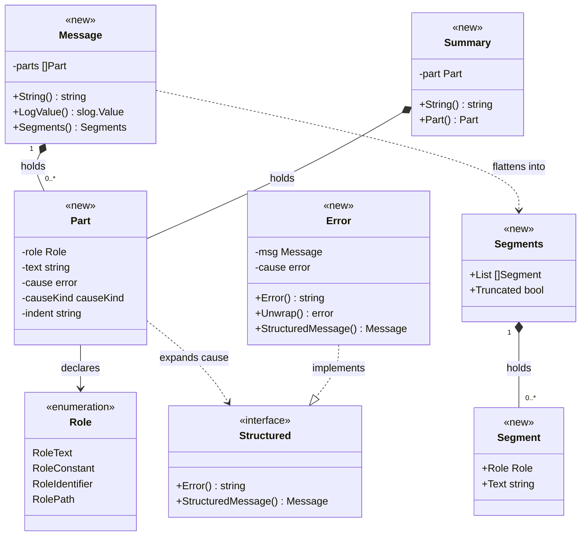
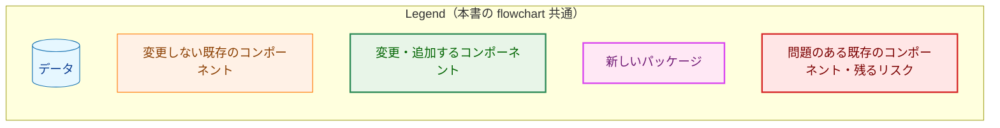
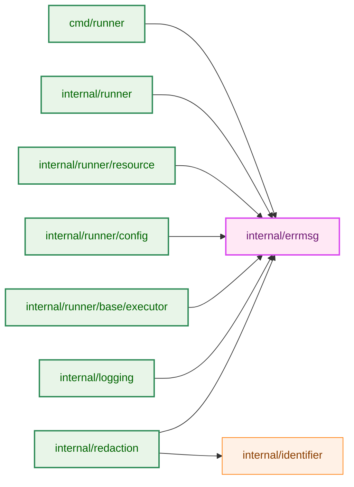
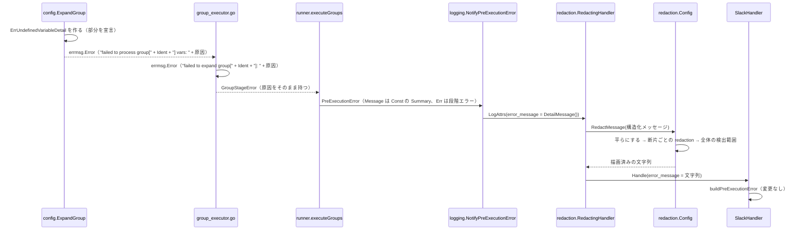
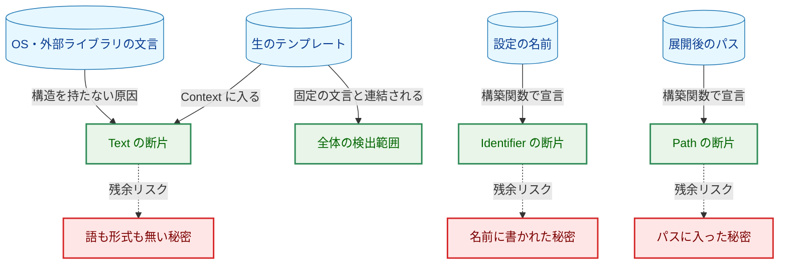
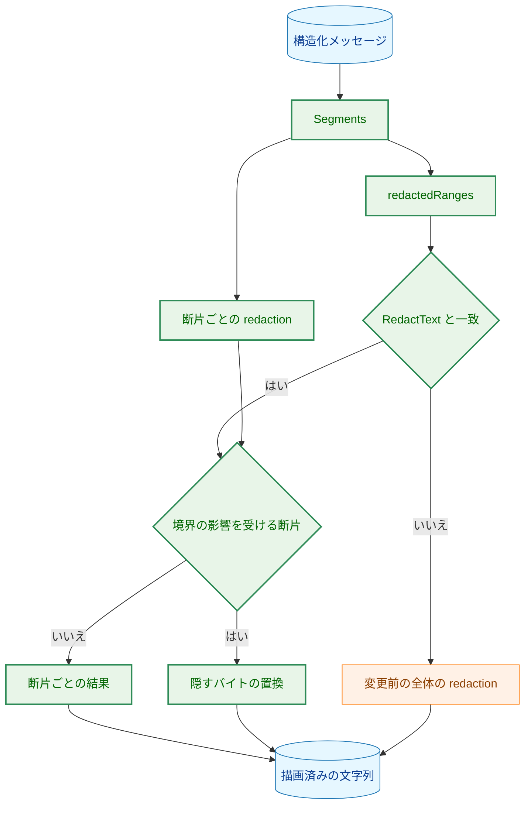

# アーキテクチャ設計書: エラー本文を役割付きの部分として運び、部分ごとに redaction する

## Document Status

| Item | Value |
|---|---|
| Status | `draft` |
| Created | 2026-09-28 |
| Review date | - |
| Reviewer | - |
| Comments | - |

## 0. 前提

- 要件: [01_requirements.md](01_requirements.md)（`approved`、`3bb634bd`）。
- 01 から移した詳細（確認済みの箇所の一覧、役割の割り当ての表、置換の細則）は [design_carryover.md](design_carryover.md) にある。本書はそれを入力として、型と、AC-41 の検証の対象の範囲を確定する。本書と design_carryover.md が食い違う場合は本書に従う。
- 既存コードの挙動についての記述は、特に断らない限りコミット `3bb634bd` で確認した。
- 用語:
  - **構造化メッセージ**: 役割付きの部分の列として表したエラーの本文（01 の用語。役割は後の項で定義）。型は `errmsg.Message`。
  - **部分**: 構造化メッセージを組み立てる単位（`errmsg.Part`）。役割と文字列を持つ部分と、原因のエラーを持つ部分（**原因の部分**）がある。
  - **役割**: `Constant`（固定の文言）・`Identifier`（設定で定義された名前）・`Path`（ファイルシステム上のパス）・`Text`（それ以外の自由文）のいずれか。適用する redaction は 01 の決定事項「役割と適用する redaction」による。
  - **平らにする**: 原因の部分を展開して、役割と文字列の組の列にすること（3.1.3 節）。
  - **断片**: 平らにした結果の 1 つの要素（`errmsg.Segment`）。役割と文字列を持つ。redaction は断片の単位で行う。01 の「部分ごとの redaction」は、本書では断片ごとの redaction として実現する。
  - **全体の検出範囲**: redaction 前の描画結果の全体に `RedactText` を適用したときに置き換えられるバイトの範囲（01 の決定事項「属性全体と部分の境界に効く保護」）。
  - **対象の範囲**: AC-41 の検証の対象とするコードの範囲（3.8.1 節）。
  - **置換文字列**・**値全体置換**: 01「背景」で定義した用語をそのまま使う。

## 1. 設計の全体像

### 1.1 設計原則

- **役割は、エラーを作る時点で型で宣言する。** 役割は、新しいパッケージ `internal/errmsg` の構築関数でしか決められない（3.1 節）。redaction の側は断片の役割を読むだけで、役割の値を作らない。文字列の内容から役割を推測する処理は置かない（01「役割は宣言で決める」、CLAUDE.md「Declare, don't infer」）。
- **文言は構造から作る。** 構造化メッセージを持つエラー型の `Error()` は、構造化メッセージを redaction なしで描画した結果を返す。文言と構造を別々に保守しないので、AC-18（`Error()` の文言は変わらない）と、redaction 前の描画結果が `Error()` と一致することが、作り方から成り立つ。この形は AST のガードで固定する（3.8.2 節）。
- **構造を持たないものは `Text`。** 原因の連鎖の中で構造化メッセージを返さないエラーは、`Error()` 全体を 1 つの `Text` の断片にする。役割のゼロ値も `Text` である。未対応の型は現状と同じ保護を受けるので、型を 1 つずつ移行できる（fail-closed）。
- **既存の `RedactText` は変えない。** 全体の検出範囲は、`RedactText` と同じ規則で範囲を返す別の関数で求める。この関数は構造化メッセージの描画からだけ呼び、結果が `RedactText` と一致することをテストと実行時の検査で確かめる（3.2.1 節）。すべてのログ行と取り込んだ出力が通る `RedactText` の実装には手を入れない。
- **網羅は、実際の箇所をたどって確かめる。** 対象の範囲をファイルまたは関数の単位で 1 か所に定め、その中に `fmt.Errorf` と `errors.Join` が無いことを AST のガードで確かめる（AC-41、3.8 節）。

### 1.2 概念モデル

構造化メッセージ（`Message`）は部分（`Part`）の列である。原因の部分は、平らにするときに展開する。原因が `Structured` を実装していればその構造化メッセージを展開し、実装していなければ `Error()` 全体を 1 つの `Text` の断片にする。平らにした結果は断片（`Segment`）の列である。



矢印の意味: `*--` は「保持する」、`-->` は「役割として持つ」、`..>` は「平らにするときに使う・作る」、`..|>` は「インターフェースを実装する」を表す。

Legend: クラス図は色分けを使わない。`<<new>>` は本タスクで追加する型、`<<interface>>` は本タスクで追加するインターフェース、`<<enumeration>>` は本タスクで追加する列挙を表す。

`errmsg.Error` は、`fmt.Errorf` の代わりに使う汎用のエラー型である。構造化メッセージと、ラップする原因を持つ。対象の範囲の中のエラーのラップは、すべてこの型か、個別に `Structured` を実装した型（`GroupError` など）で行う。`errmsg.Summary` は、`PreExecutionError`・`ExecutionError` の要約文の型である（3.3 節）。

## 2. システム構成

### 2.1 全体構成（変更前と変更後）

```mermaid
flowchart TD
    classDef data fill:#e6f7ff,stroke:#1f77b4,stroke-width:1px,color:#0b3d91;
    classDef process fill:#fff1e6,stroke:#ff7f0e,stroke-width:1px,color:#8a3e00;
    classDef enhanced fill:#e8f5e8,stroke:#2e8b57,stroke-width:2px,color:#006400;
    classDef newpkg fill:#ffe8f5,stroke:#d946ef,stroke-width:2px,color:#701a75;
    classDef problem fill:#ffe6e6,stroke:#d62728,stroke-width:2px,color:#7b0000;

    subgraph Before["変更前"]
        B1["エラーの発生元"]
        B2["writeErrorLogRecord"]
        B3["RedactingHandler"]
        B4["後段のハンドラ"]
        B1 -->|"Detail() の文字列"| B2
        B2 -->|"slog.String(error_message)"| B3
        B3 -->|"本文全体を 1 本の文字列として redaction"| B4
        class B1,B3 problem
        class B2,B4 process
    end

    subgraph After["変更後"]
        A1["エラーの発生元"]
        A5["internal/errmsg"]
        A2["writeErrorLogRecord"]
        A3["RedactingHandler"]
        A6["Config.RedactMessage"]
        A4["後段のハンドラ"]
        A1 -->|"部分を宣言して構築"| A5
        A1 -->|"DetailMessage() の構造化メッセージ"| A2
        A2 -->|"slog.Any(error_message)"| A3
        A3 -->|"構造化メッセージ"| A6
        A6 -->|"描画済みの文字列"| A3
        A3 -->|"描画済みの文字列"| A4
        class A1,A2,A3,A6 enhanced
        class A5 newpkg
        class A4 process
    end
```



矢印の意味: 矢印 A → B は、A が B に値を渡す（または B を使って値を作る）ことを表す。ラベルは渡す値である。後段のハンドラは Slack・ログファイル・コンソールのハンドラである。



変更前は、本文を 1 本の文字列として記録するので、`RedactingHandler` は本文のどこに秘密がありうるかを区別できない（01「問題」）。変更後は、本文を構造化メッセージのまま記録し、`RedactingHandler` が役割に応じて断片ごとに redaction してから文字列に描画する。後段のハンドラが受け取るのは、変更前と同じく文字列である（AC-20）。

### 2.2 コンポーネント配置



矢印の意味: 矢印 A → B は、A が B を import することを表す。本図は本タスクで加わる import と、関係する既存の import だけを示す。

Legend: 2.1 節の Legend と同じ色分けを使う。

`internal/errmsg` は標準ライブラリだけを import する末端のパッケージにする。`internal/identifier` と同じ位置づけであり、上の 7 つのパッケージのどれから import しても循環しない（各パッケージの import は `go list -f '{{.Imports}}'` で確認した）。

`internal/identifier` を拡張する案は採らない。`identifier` は「group 名・コマンド名が識別子である」という 1 つの宣言だけを担う（`internal/identifier/identifier.go:1-5`）。役割の列を運ぶ責務はそれと別である。

### 2.3 データの流れ（group 実行前段の失敗が Slack に届くまで）



最終の実行エラーも同じ経路をたどる。違いは、`cmd/runner/main.go` の `mainWithExitCode` が `HandleExecutionError` を呼び、構造化メッセージを `ExecutionError.ReportMessage()` で作ることである（3.3.2 節）。

## 3. コンポーネント設計

### 3.1 `internal/errmsg`（新規）

#### 3.1.1 型と構築関数

```go
// Role declares how redaction treats a segment. The zero value is RoleText.
type Role int

const (
    RoleText Role = iota
    RoleConstant
    RoleIdentifier
    RolePath
)

// causeKind declares how a cause part is flattened. The zero value is a
// plain cause.
type causeKind int

// Part is one element of a Message. Its fields are unexported, so a part
// can only be built by the constructors below.
type Part struct {
    role      Role
    text      string
    cause     error
    causeKind causeKind
    indent    string // continuation-line indent, for IndentedCause only
}

// Message is an error body as a sequence of parts.
type Message struct {
    parts []Part
}

// Segment is one flattened element: a role and its unredacted text.
type Segment struct {
    Role Role
    Text string
}

// Segments is the result of flattening a Message.
type Segments struct {
    List      []Segment
    Truncated bool // a cause was left as Text because the depth limit was reached
}

// Structured is implemented by errors whose body is a Message. Error()
// must return StructuredMessage().String().
type Structured interface {
    error
    StructuredMessage() Message
}

// Summary is the summary line of a report: a constant or free text only.
type Summary struct {
    part Part
}

// Error is the general-purpose structured error used in place of
// fmt.Errorf on the paths in scope.
type Error struct {
    msg   Message
    cause error
}
```

```go
func Const(text string) Part                        // text must be a constant expression (AST guard)
func Ident(name string) Part
func Path(path string) Part
func Text(text string) Part
func Cause(err error) Part
func PathErrorCause(err error) Part
func IndentedCause(err error, indent string) Part

func NewMessage(parts ...Part) Message
func (m Message) String() string
func (m Message) LogValue() slog.Value
func (m Message) Segments() Segments

func ConstSummary(text string) Summary              // text must be a constant expression (AST guard)
func TextSummary(text string) Summary
func (s Summary) String() string
func (s Summary) Part() Part

func NewError(parts ...Part) *Error                 // panics unless exactly one part is a cause part with a non-nil cause
func (e *Error) Error() string                      // returns e.StructuredMessage().String()
func (e *Error) Unwrap() error
func (e *Error) StructuredMessage() Message
```

- **役割の宣言**: 役割は、どの構築関数で部分を作るかで決まる。`Part` の欄は非公開なので、パッケージの外で任意の役割を持つ部分は作れない。`Role` 型を公開するのは、redaction の側が役割で分岐するためである。
- **`Const` と `ConstSummary` の制約**: 引数は定数式でなければならない。この制約は型では表せないので、AST のガード（3.8.2 節）で固定する（01 対象 5、AC-24）。`errmsg` の中で作る `Constant` の部分（`PathErrorCause` の区切りの `" "`・`": "`）は、パッケージ自身の文字列リテラルから作るのでガードの対象外である。
- **`Ident`・`Path`・`PathErrorCause` の制約**: `Identifier` と `Path` は redaction の一部を免れるので、呼び出せる箇所を AST のガードで対象の範囲の中に限る（3.8.2 節）。
- **`Summary`**: `PreExecutionError.Message` と `ExecutionError.Message` の型である。`ConstSummary` か `TextSummary` でしか作れないので、要約文が `Constant` か `Text` のどちらかであることが型で保証される（01 決定事項「`PreExecutionError.Message` の役割」）。`Part()` はその部分を返す。
- **`Error` の原因**: `NewError` は原因の部分をちょうど 1 つ要求し、その原因が nil でないことを要求する。満たさなければ呼び出し側の誤りとして panic する。エラーを作る時点の検査であり、記録の時点では起きない。`Unwrap()` はその原因を返すので、`errors.Is`・`errors.AsType` の到達性は `fmt.Errorf` の `%w` と同じである。先頭に番兵のエラーを置く書式（`fmt.Errorf("%w: ...", ErrX, ...)`）は、`Cause(ErrX)` を先頭の部分にして表す。
- **nil の原因**: `Cause(nil)` などの nil の原因は panic しない。平らにすると、`fmt` の `%v` が nil のエラーに対して出す文字列 `<nil>` を 1 つの `Text` の断片にする。公開の欄に原因を持つ型（`CommandExecutionError.Err` など）の `Error()` は、欄が nil でも変更前と同じ文言を返し、報告の途中で panic しない。
- **`String()`**: 平らにした断片の文字列をそのまま連結する。redaction は適用しない。
- **`LogValue()`**: `String()` を `slog.StringValue` で返す。`RedactingHandler` を通らないハンドラは、これによって redaction 前の描画結果を文字列として出力する（AC-21）。

構築関数の名前は、`errors.New` と取り違えないように、構造化メッセージを返すものを `NewMessage`、エラーを返すものを `NewError` とする。

#### 3.1.2 どの役割にも当たらない値

01 は、ゼロ値と、どの役割にも当たらない値を持つ部分を `Text` として扱うことを求める（AC-08・AC-38）。

- `Part` の `role` 欄は非公開で、値を入れるのは構築関数だけである。どの役割にも当たらない値を持つ部分は、パッケージの外からは作れない。この保証は、`Part` の欄が非公開であることを確かめる AST のガードで固定する。
- それでも、redaction の側の役割による分岐は、既定の分岐（`default`）で `Text` の全段を適用する。パッケージの中の誤りに対する fail-closed である。
- AC-38 の振る舞いは、redaction の側で確かめる。`RedactMessage` の中の断片の列を受け取る処理（3.2.2 節）に、`Segment{Role: Role(99), ...}` を直接与えるテストを置く。`Segment` の欄は公開なので、範囲外の値を与えられる。

#### 3.1.3 平らにする

`Segments()` は、部分の列を断片の列にする。規則は次のとおりである。

- 役割を持つ部分は、そのまま 1 つの断片になる。
- 原因の部分（`Cause`）は、原因の動的な型で扱いを決める。
  - 原因が `Structured` を実装していれば（型アサーションで判定する。`errors.As` は使わない）、その `StructuredMessage()` を平らにした列を展開する。`errors.As` で連鎖の奥の型を探すと、途中のラップが付け足した文言が消え、`String()` が `Error()` と一致しなくなるためである。
  - それ以外なら、`Error()` 全体を 1 つの `Text` の断片にする（01「構造を持たないエラーは `Text`」、AC-09・AC-10）。
  - 原因が nil なら、`<nil>` を 1 つの `Text` の断片にする。
- `PathErrorCause` で作った原因の部分は、原因が `*fs.PathError`（型アサーションで判定する）なら、`Op` を `Text`、区切りの空白を `Constant`、`Path` を `Path`、`": "` を `Constant`、`Err` を原因の部分として平らにする。この結果は `(*fs.PathError).Error()` と同じ文言になる。`*fs.PathError` でなければ、`Cause` と同じに扱う。
  - 分けるのを呼び出し側で行わず、原因の部分の種類として宣言するのは、`errmsg.Error` の `Unwrap()` が `*fs.PathError` を返し続け、`errors.Is(err, fs.ErrPermission)` などの到達性が変わらないようにするためである（AC-18）。
  - 型アサーションで足りるのは、`os.MkdirTemp` と `os.Chmod` が失敗したときに `*fs.PathError` を直接返すためである（Go 標準ライブラリの `os/tempfile.go` の `MkdirTemp` と `os/file_posix.go` の `Chmod`）。
- `IndentedCause` で作った原因の部分は、`Cause` と同じに平らにした後、`GroupError.Error()` と同じ整形を施す（3.1.4 節）。
- 展開の深さには上限 `maxDepth = 16` を置く。`errmsg` は末端のパッケージなので、`internal/redaction` の `maxRedactionDepth`（`internal/redaction/redactor.go:259`）を import せず、独自の定数を持つ。上限に達した原因の部分は `Error()` 全体を 1 つの `Text` にし、`Segments.Truncated` を立てる。展開の深さが足りなくても保護は弱まらない（fail-closed）。
  - 本書の対象で最も深い連鎖は 2 つある。最終の実行エラーの `ExecutionError` → `GroupErrors` → `GroupError` → `CommandExecutionError` → `errmsg.Error`（resource manager のラップ）→ `errmsg.Error`（executor のラップ）と、group 実行前段の `PreExecutionError` → `GroupStageError` → `errmsg.Error`（事前展開）→ `errmsg.Error`（`ExpandCommand`）→ `errmsg.Error`（`vars`）→ `ErrUndefinedVariableDetail` で、どちらも 6〜7 段である。`GroupErrors` は各 `GroupError` を原因の部分としてではなく、部分を直接並べて持つので、段を増やさない。
  - 実際の最も深い連鎖を組み立てて、深さが `maxDepth - 4` 以下であることを確かめるテストを置く。#1196・#1197 の型を加えたときに余裕が無くなれば、このテストが失敗する。

`*fs.PathError` を分けるのは `PathErrorCause` を使った箇所だけである。`PathErrorCause` を呼べるのは、一時ディレクトリの作成・権限設定の 2 か所（3.6.1 節）だけにし、AST のガードで固定する（3.8.2 節）。他の経路の `*fs.PathError` は、構造を持たないエラーとして 1 つの `Text` のままである（01 決定事項「対象のエラーの役割の割り当ての方針」）。

#### 3.1.4 行の字下げ

`GroupError.Error()` は、原因の文言の末尾の `"\r\n"` の並びを除き、残りの改行の後に字下げを入れる（`internal/runner/group_errors.go:31-34`）。`IndentedCause(err, indent)` は、この整形を原因の断片の列に施す。

- 末尾の除去は、原因の断片の列全体の末尾に対して行う。末尾の断片が改行だけなら、その断片ごと除き、その前の断片の末尾の改行も続けて除く。途中の断片の末尾の改行は除かない。
- 字下げは、各断片の文字列の中の改行の後に入れる。役割は変えない。
- 整形は原因の断片にだけ施し、`IndentedCause` の外の部分には施さない。
- 整形の後の断片の連結は、`GroupError.Error()` の文言と一致する。`Constant` の断片に字下げが入ると、その文字列は定数式から作ったものではなくなる。入るのは空白と改行だけであり、秘密を含みえないので、AC-24 の制約の対象外とする。

### 3.2 `internal/redaction`（変更）

#### 3.2.1 置き換える範囲を返す関数

全体の検出範囲を求めるには、`RedactText` がどのバイトを置き換えるかを、元の文字列の位置で知る必要がある。`RedactText` は、PEM ブロックの置換（`maskPrivateKeyBlocks`）、key=value などの規則（`compiled`）、値形式の検出（`ValueDetector.Mask`）を、この順に文字列に適用する（`internal/redaction/redactor.go:272-307`、`value_detector.go:150-194`）。各段は正規表現の一致を探し、一致のうち残す範囲を除いた区間を置換文字列に置き換える。

```go
// byteRange is a half-open byte range [start, end) of the original text.
type byteRange struct {
    start, end int
}

// redactedRanges returns the ranges of text that RedactText replaces, in
// the coordinates of text, sorted and non-overlapping.
func (c *Config) redactedRanges(text string) []byteRange
```

- **`RedactText` は変えない。** `redactedRanges` は別の関数であり、`RedactMessage` からだけ呼ぶ。`RedactText` を範囲を返す実装に差し替える案は採らない。`RedactText` はすべてのログ行・取り込んだ出力・監査のログで使われ（`internal/redaction/redactor.go` の `Handle`、`internal/runner/base/security/logging_security.go`、`internal/runner/base/audit/logger.go` など）、差し替えの誤りがあると、秘密の漏れや panic がそのすべてに及ぶためである。01 の要件は範囲を求めることを求めているだけで、`RedactText` の差し替えは求めていない。
- **規則の共有**: `redactedRanges` は、`RedactText` の各段と同じ正規表現と同じ順序を使う。正規表現は `Config` と `valueDetectorPatterns` にあるものを参照し、写しを作らない。
- **残す範囲**: 各段の置換のテンプレートが再び出力する範囲を「残す範囲」とする。前置きのグループ（`${1}` など。`Bearer `、key と区切り、`"private_key_id":"` など）と後ろのグループ（`gcpSAKey` の `${2}`、`jwt` の `${1}`）がこれに当たる。`urlCred` が一致の末尾の `@` を文字列リテラルとして出し直すのは、一致の最後の 1 バイトを残す範囲とみなす。
- **段の重なり**: 後の段は、前の段が置換文字列を入れた後の文字列に対して一致を探す。後の段の置き換える範囲が、前の段の置換文字列と一部でも重なれば、その置換文字列に当たる元の範囲の全体を置き換える範囲に加える。残す範囲が前の段の置換文字列と重なっても、その置換文字列に当たる元の範囲は置き換えたままとする（置換文字列は分けない）。
- **表し方**: 範囲は、一致の数に比例する大きさの区間の列で表す。文字列の長さに比例する表は作らない。
- **正しさの義務**: 任意の入力について、`redactedRanges` が返す各範囲を 1 つの置換文字列に置き換えた結果が、変更していない `RedactText` の出力と一致すること。この一致は、既存の `RedactText` のテストの入力の全体と、`RedactText` を基準にした差分のファジングで確かめる（CLAUDE.md「An optimization that adds a correctness obligation」と同じく、テストで固定する）。
- **実行時の検査**: `RedactMessage` は描画のたびに、`redactedRanges` から作った文字列が `RedactText` の出力と一致するかを確かめる。一致しなければ、構造化メッセージを使わず、変更前と同じ扱い（redaction 前の描画結果の全体に `RedactText` を適用し、変化がなければ値全体置換）で描画し、失敗を記録する（4.2 節）。範囲の誤りが秘密の漏れにならないようにするためである。

#### 3.2.2 `Config.RedactMessage`

```go
// RedactMessage renders m with per-segment redaction and the cross-boundary
// contract, using this Config's rules and replacement string. It recovers
// from panics raised while flattening m and reports them as an error.
func (c *Config) RedactMessage(m errmsg.Message) (string, error)
```

描画の規則は次のとおりである（処理の流れは 6.1 節）。

1. `m.Segments()` を 1 回だけ呼び、断片の列を得る。redaction 前の描画結果 S は、その断片の文字列の連結とする。各断片の範囲も同じ列から求める。`Error()` を 2 回呼ぶと、結果が変わる原因のエラーで範囲がずれるためである。
2. 各断片に、役割ごとの redaction を適用する（01 決定事項「役割と適用する redaction」）。
   - `Identifier`・`Constant`: そのまま出す。
   - `Path`: 断片の文字列に `RedactText` を適用する。
   - `Text`（どの役割にも当たらない値を含む）: 断片の文字列に `RedactText` を適用し、変化がなければ `IsSensitiveValue` で判定して、当たれば断片全体を置換文字列にする。値全体置換は断片ごとに判定する（01「値全体置換は部分ごとに判定する」、AC-36）。
3. S に `redactedRanges` を適用し、全体の検出範囲を得る。
4. `Identifier` 以外の断片のうち、全体の検出範囲に含まれるのに手順 2 では置き換えられないバイトを持つ断片を「境界の影響を受ける断片」とする。断片の外の文字列があって初めて検出される秘密は、この断片に現れる。
5. 境界の影響を受けない断片は、手順 2 の結果をそのまま出す。したがって、境界をまたぐ検出が無い本文では、各断片は断片単独の redaction と同じ結果になる（AC-04・AC-11 の「同じ結果」はこの場合である）。
6. 境界の影響を受ける断片では、次のバイトを「隠すバイト」とする: 全体の検出範囲に含まれるバイト、手順 2 で置き換えられたバイト、手順 2 で値全体置換に当たった断片のすべてのバイト。`Identifier` の断片のバイトは隠さない（01 決定事項「属性全体と部分の境界に効く保護」、AC-37）。隠すバイトが連続する区間は、極大の区間ごとに 1 つの置換文字列にする。区間は、隣り合う境界の影響を受ける断片をまたいでよい。

手順 2〜6 は、断片の列（`[]errmsg.Segment`）を受け取る非公開の関数で行う。`RedactMessage` は手順 1 の後にこの関数を呼ぶ。AC-38 のテストは、この関数に範囲外の役割を持つ断片を与える（3.1.2 節）。

置換文字列は `Config` に設定されたものを使う（01「背景」の置換文字列の定義）。`Config` が `NewConfig` を経ていない場合は、`RedactText` と同じく出力を抑止する（`RedactionFailurePlaceholder` を返す）。

手順 5 の分け方を採る理由: 境界をまたぐ検出が無いときまで隠すバイトによる描画を使うと、置換文字列の数が断片単独の `RedactText` の結果と変わることがある（隣り合う 2 つの置き換えが 1 つの置換文字列にまとまるなど）。01 の AC-04・AC-11 は、境界をまたぐ検出が無い断片では断片単独の結果と同じになることを求めている。

**性能**: `RedactMessage` は、2 つのレコードの `error_message` にだけ使う。1 回の実行で記録されるのは、group 実行前段の失敗ごとに 1 件と、最終の実行エラー 1 件である。1 回の描画は、断片ごとの `RedactText` と `IsSensitiveValue`、全体の `redactedRanges` と `RedactText` からなり、S の長さのおよそ 3 倍の `RedactText` に当たる。予算は、100 group の失敗を連結した最終の実行エラー（数十 KiB）の描画 1 回につき 10 ms 以下とし、実装で `BenchmarkRedactText`（`internal/redaction/redactor_test.go:3569`）に並べたベンチマークで確かめる。コマンドの `fork`/`exec` 1 回が数十 µs であるのと比べ、実行全体の時間に対して無視できる大きさである。すべてのログ行に掛かる `RedactText` の費用は変わらない。

#### 3.2.3 `RedactingHandler` と `Config.RedactLogAttribute`

属性の値が `errmsg.Message` のとき、宣言済みの識別子と同じ位置で分岐する。

- 属性名による判定を先に行う。機密を示す属性名の下では、構造化メッセージも値ごと置換する（AC-07）。
- 次に、宣言済みの識別子の判定（`declaredIdentifier`、`internal/redaction/redactor.go:308-319`）と並べて、値の動的な型が `errmsg.Message` かどうかを判定する。そうであれば `RedactMessage` の結果を `slog.StringValue` にして返す。後段のハンドラは文字列を受け取る（AC-20）。
- 判定は値の動的な型だけで行う。属性名や値の内容は見ない。`*errmsg.Message` や、別の `LogValuer` の中に入った `errmsg.Message` は、この分岐に当たらず、既存の経路で `String()` の文字列として全体の redaction を受ける（fail-closed）。

分岐は `RedactingHandler.redactLogAttributeWithContext`（`:799`）と `Config.RedactLogAttribute`（`:330`）の両方に置き、判定と描画は 1 つの補助関数にまとめる。`Config.RedactLogAttribute` は本番のコードから呼ばれていない（`:371` の自身の再帰だけ）。それでも分岐を置くのは、置かないと、この公開の関数に構造化メッセージを渡したときに `LogValue()` の redaction 前の文字列がそのまま出るためである。

**失敗の扱いの担い手**: panic の回復は `RedactMessage` の中の 1 か所で行い、エラーとして返す。

- `RedactingHandler` は、返されたエラーを既存の `ErrLogValuePanic` と同じく型付きのエラーとして `ErrorCollector` に記録する（`processLogValuer` と同じ形。`internal/redaction/redactor.go:854-872`）。そのため、終了時の報告（`ShutdownReporter`）に現れる。値は `RedactionFailurePlaceholder` にする。
- `Config.RedactLogAttribute` は `ErrorCollector` を持たないので、値を `RedactionFailurePlaceholder` にするだけである。
- `Segments.Truncated` が立っていれば、`RedactingHandler` は既存の深さの上限の扱い（`:1048-1054`）と同じく、`failureLogger` に Debug のログを出す。

### 3.3 `internal/logging`（変更）

#### 3.3.1 `PreExecutionError`

```go
type PreExecutionError struct {
    Type                ErrorType
    Message             errmsg.Summary // was string
    Component           string
    RunID               string
    NotificationContext common.NotificationContext
    FailedFilePaths     []string
    Err                 error
}

// DetailMessage returns Message followed by the cause, as a structured message.
func (e *PreExecutionError) DetailMessage() errmsg.Message

// Detail returns DetailMessage().String().
func (e *PreExecutionError) Detail() string
```

- `Message` の型を `errmsg.Summary` に変える。定数式の要約文は `errmsg.ConstSummary(...)`、値を含めて作る要約文は `errmsg.TextSummary(fmt.Sprintf(...))` で渡す（01 決定事項「`PreExecutionError.Message` の役割」）。
- `DetailMessage()` は、`Err` が nil なら `Message.Part()` だけ、そうでなければ `Message.Part()`・`Const(": ")`・`Cause(Err)` を並べる。`Detail()` はその `String()` を返し、文言は変更前と同じである（AC-18）。
- `Error()` の書式（`%s: %s: %v (component: %s, run_id: %s)`、`internal/logging/pre_execution_error.go:82-87`）は、`Message.String()` を使って変更前と同じ文言を返す。
- `Message` を設定する本番の箇所は 23 か所ある（`cmd/runner/main.go` 15、`internal/runner/bootstrap` 6、`internal/runner/runerrors` 1、`internal/runner/group_stage.go` 1 の、`PreExecutionError{` のリテラル。`grep` で数えた）。すべて機械的に書き換える。段階の定義表の要約文（`internal/runner/group_stage.go:67-98`）は `ConstSummary` にする。

`Message` を文字列のまま残し、別の欄に役割を持たせる案は採らない。同じ要約文を 2 つの欄で保守することになり、食い違ったときにどちらが正しいかを型が決められないためである。`Message` を `errmsg.Part` にする案も採らない。`Part` は `Ident`・`Path`・原因の部分も受け付けるので、要約文が `Constant` か `Text` であることを型で保証できないためである。

#### 3.3.2 `ExecutionError`

```go
type ExecutionError struct {
    Message     errmsg.Summary // was string
    Component   string
    RunID       string
    GroupName   string
    CommandName string
    Err         error
}

// ReportMessage returns the message HandleExecutionError reports:
// Message, the group/command context, and the cause.
func (e *ExecutionError) ReportMessage() errmsg.Message
```

- `HandleExecutionError`（`internal/logging/pre_execution_error.go:243-276`）が文字列で組み立てている本文を、`ReportMessage()` に移す。文言は変更前と同じである（`Message (group: g, command: c): 原因`）。
- `Message` の型を `errmsg.Summary` に変え、唯一の設定箇所（`cmd/runner/main.go` の `executeRunner` の `error running commands`）は `ConstSummary` にする。`PreExecutionError` と同じく、定数式の要約文を `Constant` にする（01 決定事項「対象のエラーの役割の割り当ての方針」の「固定の文言は `Constant`」）。
- 外側の context の group 名・コマンド名は `Ident` にする。context の部分の列は 1 つの非公開のメソッドで作り、`ContextString()` はその `String()` を返す。context の文言を 2 か所で保守しない。
- `Error()` と `ContextString()` の文言は変えない。

#### 3.3.3 記録

- `errorRecordParams.errorMsg` の型を `errmsg.Message` に変える。`writeErrorLogRecord` は `error_message` を `slog.Any(key, msg)` で記録する（変更前は `slog.String`、`internal/logging/pre_execution_error.go:187`）。
- stderr の `Details:` は `msg.String()` を使う。redaction を通らないことと文言は変わらない（01「stderr は現状を維持する」、AC-19）。
- `preExecutionRecordParams` は `DetailMessage()` を、`HandleExecutionError` は `ReportMessage()` を渡す。
- 通知ビルダー（`buildPreExecutionError`、`internal/logging/slack_handler.go:841`）は、`RedactingHandler` の後で `error_message` を文字列として受け取るので、変えない（AC-23）。

### 3.4 `internal/runner`（変更）

#### 3.4.1 構造を引き継ぐエラー型

次の既存の型に `StructuredMessage()` を加え、`Error()` を `StructuredMessage().String()` にする。文言は変えない。

| 型 | 構造化メッセージ |
|---|---|
| `GroupStageError` | `Cause(err)` だけ。`err` が nil のゼロ値は `Const("group pre-execution failed")`（`internal/runner/group_stage.go:138-143` と同じ文言） |
| `GroupError` | `Const("failed to execute group ")`・`Ident(group)`・`Const(": ")`・`IndentedCause(err, "  ")` |
| `GroupErrors` | 各 `GroupError` の構造化メッセージの部分を直接並べ、間に `Const("\n")` を置く |
| `CommandExecutionError` | `Const("command ")`・`Ident(CommandName)`・`Const(" in group ")`・`Ident(GroupName)`・`Const(" failed: ")`・`Cause(Err)` |

- `GroupStageError` のように文言を付け足さない型にも `StructuredMessage()` が要る。実装しないと、その型が原因の連鎖の途中で構造を持たないエラーとして扱われ、奥の構造がすべて `Text` に平らになるためである。
- `CommandExecutionError` の欄は公開なので、`Err` が nil の値もありうる（テストのリテラルなど）。`Cause(nil)` は `<nil>` の `Text` になり（3.1.1 節）、`Error()` は変更前の `%v` と同じ文言を返す。
- 各型のゼロ値の `Error()` が panic しないことをテストで確かめる。

#### 3.4.2 `group_executor.go` のエラー書式

`internal/runner/group_executor.go` の `fmt.Errorf` による `%w` のラップ（11 か所）は、すべて `errmsg.NewError` に置き換える。役割の割り当ては 01 の方針に従う。

| 箇所（行） | 部分 |
|---|---|
| group の展開（`:169`） | `Const("failed to expand group[")`・`Ident(group)`・`Const("]: ")`・`Cause` |
| group の作業ディレクトリ（`:186`） | `Const("failed to resolve work directory: ")`・`Cause` |
| コマンドの事前展開（`:317`） | `Const(...)`・`Ident(group)`・`Const(...)`・`Ident(command)`・`Const("] (index ")`・`Text(index)`・`Const("): ")`・`Cause` |
| コマンドの作業ディレクトリ（`:334`） | `Const("failed to resolve workdir: ")`・`Cause` |
| 権限監査の到達しない分岐（`:374`） | `Cause(errUnhandledCheckSkipReason)`・`Const(": ")`・`Text(reason)`・`Const(" for path ")`・`Path(p)` |
| 権限監査の違反（`:388`） | `Cause(ErrDirPermViolation)`・`Const(" for group[")`・`Ident(group)`・`Const("]: ")`・`Text(件数)`・`Const(...)` |
| パス解決（`:435`） | `Const("command path resolution failed for ")`・`Path(strconv.Quote(path))`・`Const(": ")`・`Cause` |
| 依存検証（`:456`） | `Const("command dependency verification failed for ")`・`Path(strconv.Quote(path))`・`Const(": ")`・`Cause` |
| 環境変数の検証（`:511`）・出力パスの検証（`:521`） | `Const(...)`・`Cause` |
| 終了コード（`:671`） | `Cause(ErrCommandFailed)`・`Const(": command ")`・`Ident(command)`・`Const(" failed with exit code ")`・`Text(exit code)` |

- **数値の役割**: index・件数・終了コード・理由の番号は `Text` にする。`Constant` は定数式に限るので使えない。数字だけの文字列は、key=value・値形式の検出・値全体置換のどれにも当たらない。そのため、`Text` にしても出力は変わらず、新しい役割も要らない（01 決定事項「数値の役割は設計で決める」）。
- **`%q` のパス**: `Path` の部分に `strconv.Quote` した文字列を入れる。`%q` と同じ引用とエスケープになり、文言は変わらない。
- **番兵の先頭**: 番兵のエラー（`ErrDirPermViolation` など）は `Cause` で表す。平らにすると、その `Error()` が `Text` になる。`errors.New` の値は `Structured` を実装しないためである。どれも機密を示す語を含まない（例: `ErrCommandFailed` は `command failed`、`internal/runner/runner.go:35`）。
- `ExpandWorkDir` の呼び出し（`:686`・`:723`）は、`fmt.Sprintf("group[%s]", ...)` の代わりに `config` の `Level` を渡す（3.5.4 節）。

#### 3.4.3 中断時の最終エラー

`executeGroups` の `errors.Join(ctxErr, err)`（`internal/runner/runner.go:452`）を、次の型に置き換える。

```go
// cancelledRunError is returned when the run's context is done while a
// group failure is being handled. Its text equals errors.Join(ctxErr, err).
type cancelledRunError struct {
    ctxErr error // ctx.Err()
    err    error // the failing group's error, as returned by ExecuteGroup
}

func (e *cancelledRunError) Error() string // returns e.StructuredMessage().String()
func (e *cancelledRunError) Unwrap() []error // {ctxErr, err}
func (e *cancelledRunError) StructuredMessage() errmsg.Message
```

- 構造化メッセージは `Cause(ctxErr)`・`Const("\n")`・`Cause(err)` とする。2 つとも nil でないときの `errors.Join` の文言（各 `Error()` を改行でつなぐ）と一致する（AC-32）。作る箇所は `executeGroups` の 1 か所だけで、`ctxErr` も `err` も nil でないことを確かめた後である（`:440-453`）。
- `Unwrap() []error` を持つので、`errors.Is(err, ctx.Err())` と、失敗した group の原因への `errors.Is`・`errors.AsType` は変更前と同じに届く。`cmd/runner/main.go` の `executionErrorContext` は `errors.AsType` で `*runner.CommandExecutionError` を探すので、判定の結果も変わらない。
- 具体的な型に `Unwrap() []error` を宣言することは、0177 の形の判定を禁じるガード（`TestProductionCodeDoesNotProbeMultiErrorShape`、`internal/runner/group_errors_guard_test.go:327-348`）が許している。禁じているのは、形による判定のほうである。
- 返すエラーの中身（それ以前に集めた group の失敗を含めないこと）は変えない。
- AC-31 は、失敗した group のエラーが宣言する部分についてだけ保証する。`GroupStageError.Error()` は原因の文言だけを返す（`internal/runner/group_stage.go:138-143`）ので、原因が group 名を含まなければ、本文に group 名は出ない。この場合に group 名を付け足すと AC-32 に反するので、付け足さない。

### 3.5 `internal/runner/config`（変更）

#### 3.5.1 `Level` と `Field`

`ErrUndefinedVariableDetail` の `Level`（例: `group[backup]`）と `Field`（例: `vars.dest`）は、いまは文字列である。group 名・コマンド名・変数名を `Identifier` として宣言するため、2 つを型にする。

```go
// Level is where a value was being expanded. The zero value is "no level"
// and renders as the empty string.
type Level struct {
    kind levelKind
    name string
}

// Field is the configuration field being expanded. The zero value is
// "no field" and renders as the empty string.
type Field struct {
    key      fieldKey
    name     string // variable name, for vars fields only
    index    int
    hasIndex bool
}

func (l Level) String() string       // "", "global", "group[<name>]", "command[<name>]", "template[<name>]"
func (l Level) Parts() []errmsg.Part // Const("group["), Ident(name), Const("]") etc.
func (f Field) String() string       // "", "cmd", "args[0]", "vars.<name>", "vars.<name>[0]", ...
func (f Field) Parts() []errmsg.Part
```

- **ゼロ値**: `levelKind` と `fieldKey` のゼロ値は「無し」であり、空の文字列として描画する。`HasVariableReference` は空の `level` と `field` で `processVarRefs` を呼ぶ（`internal/runner/config/expansion.go:92-104`）ので、このゼロ値で表す。index の有無は `hasIndex` で表し、値に番兵（`-1` など）を使わない。
- **種類**: `levelKind` は global・group・command・template の 4 つと無しである。template は `template_expansion.go` の `template[<name>]`（`processVarRefs` の呼び出し元、`internal/runner/config/template_expansion.go:686`・`:1114`）に使う。`fieldKey` は、`processVarRefs`・`ExpandString` のすべての呼び出し元が使うキー（`cmd`・`args`・`env`・`env_vars`・`env_import`・`workdir`・`verify_files`・`cmd_allowed`・`vars`）と無しである。キーの一覧は実装のときに呼び出し元をたどって確定し、単体テストで、変更前に `fmt.Sprintf` で作っていた文字列と `String()` が一致することを確かめる。
- **構築**: `Level`・`Field` を作る関数は `config` パッケージの中だけで使うので、非公開にする（`globalLevel()`・`groupLevel(name)`・`varField(name)` など）。`group_executor.go` が `ExpandWorkDir` に渡す `Level` だけは、公開の `GroupLevel(name)`・`CommandLevel(name)` で作る。
- **`Parts()` の文言**: `Parts()` は種類ごとの `switch` で、各文言を `Const` の文字列リテラルから作る。キーの文言を変数から `Const` に渡すと、AST のガードが定数式でないとして拒否するためである。呼び出し側は、`Parts()` の結果をほかの部分と `slices.Concat` でつないで `NewMessage`・`NewError` に渡す。
- **引数の型の変更**: `level string` を受け取る関数（`ExpandString`・`ProcessVars`・`ProcessEnv`・`ProcessEnvImport`・`resolveAndExpand`・`processVarRefs`・`newVarExpander` などの 13 個）の引数を `Level` に、`field string` を受け取る関数の引数を `Field` に変える。変数の定義側の名前を `Field` に入れる箇所（`expandVarsWithLazyResolution` の `vars.%s`・`vars.%s[%d]`、`:724`・`:740`）は、`varField`・`varElementField` で作る。組み立て済みの文字列を後から解析して分けることはしない（01 決定事項）。
- `Level` の文字列を使うほかのエラー型（`ErrCircularReferenceDetail` など）は、`level.String()` を保持する。これらは #1197 の対象なので構造化しない。

#### 3.5.2 `ErrUndefinedVariableDetail`

```go
type ErrUndefinedVariableDetail struct {
    Level        Level  // was string
    Field        Field  // was string
    VariableName string
    Context      string
    Chain        []string
}

func (e *ErrUndefinedVariableDetail) Error() string // returns e.StructuredMessage().String()
func (e *ErrUndefinedVariableDetail) StructuredMessage() errmsg.Message
func (e *ErrUndefinedVariableDetail) Unwrap() error // ErrUndefinedVariable, unchanged
```

構造化メッセージは、`Const("undefined variable in ")`・`Level.Parts()`・`Const(".")`・`Field.Parts()`・`Const(": '")`・`Ident(VariableName)`・`Const("' (context: ")`・`Text(Context)`・`Const(")")` とする。`Chain` が空でなければ、`Const(" (expansion path: ")`・各変数名の `Ident` を `Const(" -> ")` でつないだもの・`Const(")")` を続ける。文言は変更前と同じである（`internal/runner/config/errors.go:262-268`）。

生のテンプレート（`Context`）は、秘密が直書きされうるので `Text` にする（01 決定事項）。

#### 3.5.3 `expansion.go` のエラー書式

`internal/runner/config/expansion.go` はファイル全体を対象の範囲に入れ、中の `fmt.Errorf` をすべて `errmsg.NewError` に置き換える。ただし、次の関数は除く。

| 除く関数 | 理由 |
|---|---|
| `ProcessEnvImport` | `env_import` の拒否のエラー（`ErrVariableNotInAllowlist` などの番兵をラップするもの）を作る関数であり、01 の対象外（#1197）。`ErrUndefinedVariableDetail` はこの関数を通らない |
| `ProcessEnv` | `env_vars` の拒否のエラー（`:784`）を作る。`ErrUndefinedVariableDetail` はこの関数を `return nil, err` でそのまま通るだけであり、ラップしない |
| `resolveAndPrepareCommandSpec`・`ApplyTemplateInheritance`・`expandTemplateToSpec` | テンプレートのエラーを作る関数であり、01 の対象外（#1197） |

- ファイル全体を対象にするのは、`ErrUndefinedVariableDetail` を作る箇所（`:128`・`:425`）から、それをラップする箇所（`ExpandGlobal`・`ExpandGroup`・`ExpandCommand` など）までの関数が、すべてこのファイルにあるためである。関数を分けたり加えたりしても、新しい関数は自動で検証の対象になる。除く関数の一覧は 3.8.1 節に置き、一覧の関数がファイルから無くなればガードが失敗する。
- `ErrUndefinedVariableDetail` は `vars` だけでなく `env`・`cmd`・`args`・`verify_files`・`workdir`・`cmd_allowed` の展開からも作られる。そのため、置き換えるラップを原因の種類で選ばない。置き換えたラップの原因が #1197 の対象の型であれば、その原因は構造を持たないエラーとして `Text` になる。01 の対象外（#1197）は内側のエラー型の構造化であり、ラップが group 名・コマンド名を `Ident` にすることとは矛盾しない。
- `expandCmdAllowed` のラップ（`:919`・`:925`・`:948`）も対象である。`cmd_allowed` の展開の未定義変数は `ExpandString`（`:923`）から `:925` のラップを通る。`group[%s]` の group 名は `Ident`、index は `Text`、展開前の値（`rawPath`）は生のテンプレートなので `Text`、展開後のパス（`:948` の `expanded`）は `Path` にする。
- 名前は `Ident`、固定の文言は `Const` にする。例: `failed to process global vars: %w`（`:857`）は `Const("failed to process global vars: ")`・`Cause`、`failed to process group[%s] vars: %w`（`:1023`）は `Const("failed to process group[")`・`Ident(name)`・`Const("] vars: ")`・`Cause`。

#### 3.5.4 `ExpandWorkDir`

```go
func ExpandWorkDir(workdir string, expandedVars map[string]string, level Level) (string, error)
```

- 変数の展開の失敗（`:58`）は、`Const("failed to expand workdir: ")`・`Cause(err)` にする。
- 相対パスの拒否（`:63-64`）は、`Level.Parts()`・`Const(": ")`・`Cause(ErrInvalidWorkDir)`・`Const(": ")`・`Path(strconv.Quote(expanded))`・`Const(" (relative paths are not allowed for security reasons)")` にする。
- 呼び出し側（`internal/runner/group_executor.go:686`・`:723`）は `GroupLevel`・`CommandLevel` を渡す。

### 3.6 `internal/runner/base/executor` と `internal/runner/resource`（変更）

#### 3.6.1 一時ディレクトリ

`DefaultTempDirManager.Create` の 2 つのラップ（`internal/runner/base/executor/tempdir_manager.go:77`・`:90`）を、`errmsg.NewError(errmsg.Const("failed to create temporary directory: "), errmsg.PathErrorCause(err))` の形にする。`os.MkdirTemp` と `os.Chmod` が返す `*fs.PathError` のパスが `Path` になる。一時ディレクトリのパスは group 名を含む（`scr-<group>-`、`:74`）ので、group 名が語を含んでもパスの部分は値全体置換を受けない。

`Cleanup` のラップは、ログに出すだけで 2 つのレコードの原因にならないので対象にしない。

#### 3.6.2 コマンドの実行

01 の対象 4 は「コマンドの実行」の経路で原因に文言を付加するエラーを含む。コマンドの実行の失敗は `CommandExecutionError` の原因として最終の実行エラーに入る。この経路のうち、次の関数を対象の範囲に入れ、中の `fmt.Errorf` を `errmsg.NewError` に置き換える。コマンドパスと作業ディレクトリのパスは `Path`、コマンド名は `Ident`、危険度や理由の文言は `Text` にする。

| パッケージ | 関数 | 挿入する値（例） |
|---|---|---|
| `internal/runner/resource` | `(*NormalResourceManager).ExecuteCommand` | コマンドパス（`normal_manager.go:147`・`:150` の `cmd.ExpandedCmd`） |
| `internal/runner/resource` | `(*DryRunResourceManager).ExecuteCommand`・`evaluateCommandRisk` | コマンドパス（`evaluateCommandRisk` の `dryrun_manager.go:416`・`:427`・`:441`） |
| `internal/runner/base/executor` | `(*DefaultExecutor).Validate`・`validatePrivilegedCommand`・`executeNormal`・`executeWithUserGroup` | コマンドパス・作業ディレクトリ（`executor.go` の `Validate` など） |

次は対象にしない。

- `(*DefaultExecutor).stageFromFD` と `(*NormalResourceManager).executeCommandWithOutput`: 挿入するのは gid の数値だけで、原因は OS のエラーか出力の取り込みのエラーであり、構造を持たない。置き換えても出力は変わらない。
- `(*DryRunResourceManager).UpdateCommandDebugInfo`・`ValidateOutputPath` と、一時ディレクトリの後始末の関数: 2 つのレコードの原因にならない。

### 3.7 `cmd/runner`（変更）

原因を `fmt.Sprintf("…: %v", err)` で `Message` に埋め込んでいる 4 か所を、`Message: errmsg.ConstSummary("<固定の文言>")` と `Err: err` の形にする（01 対象 4）。

| 箇所（関数） | `Message` |
|---|---|
| global の展開（`run`） | `Failed to expand global configuration` |
| テンプレート検証（`run`） | `Template validation failed` |
| ディレクトリ権限チェッカーの初期化（`auditConfiguredDirPermissions`、`cmd/runner/main.go:512`） | `directory permission checker initialisation failed` |
| `--groups` の指定誤り（`executeRunner`、`cmd/runner/main.go:642`） | `Invalid groups specified` |

- `Detail()` は `Message: Err.Error()` になり、変更前の `fmt.Sprintf("…: %v", err)` と同じ文言である（AC-18）。
- 付け替えた原因は、`PreExecutionError.Unwrap()` を通じて `errors.Is`・`errors.AsType` で届くようになる。01 が認めた到達性の追加である。`mainWithExitCode` の分岐の順は `dryRunPreviewExit`・`SilentExitError`・`PreExecutionError`・`ExecutionError` である（`cmd/runner/main.go:219-252`）。付け替えた原因（`config.ExpandGlobal`・`config.ValidateAllTemplates`・`newPermChecker`・`cli.FilterGroups` のエラー）は `dryRunPreviewExit`・`SilentExitError` を含まないので、4 つとも `PreExecutionError` として報告され、終了コードは 1 のまま変わらない（AC-18）。

global の展開の原因（`config.ExpandGlobal` のエラー）は 3.5.3 節で構造化されるので、AC-34 の場面では、`Message` の固定の文言と参照された変数名が置き換えられずに出る。

### 3.8 AC-41 の検証

#### 3.8.1 対象の範囲

AC-41 の「対象の経路」を、次の範囲として確定する。この表が、AC-41 の検証の対象の唯一の定義である。

| パッケージ | 対象 | 除くもの |
|---|---|---|
| `internal/runner` | `group_executor.go`・`group_stage.go`・`group_errors.go` のファイル全体、`runner.go` の `(*Runner).Execute`・`(*Runner).ExecuteGroup`・`(*Runner).executeGroups` | — |
| `internal/runner/config` | `expansion.go` のファイル全体 | `ProcessEnvImport`・`ProcessEnv`・`resolveAndPrepareCommandSpec`・`ApplyTemplateInheritance`・`expandTemplateToSpec`（理由は 3.5.3 節） |
| `internal/runner/resource` | `(*NormalResourceManager).ExecuteCommand`、`(*DryRunResourceManager).ExecuteCommand`・`evaluateCommandRisk` | — |
| `internal/runner/base/executor` | `(*DefaultTempDirManager).Create`、`(*DefaultExecutor).Validate`・`validatePrivilegedCommand`・`executeNormal`・`executeWithUserGroup` | — |
| `internal/logging` | `(*PreExecutionError).DetailMessage`・`(*ExecutionError).ReportMessage` | — |

- ファイル全体を対象にするのは、group の実行と展開の経路の関数がそのファイルに集まっており、関数を分けたり加えたりしても検証から漏れないようにするためである。`runner.go`・`resource`・`executor` は対象外の経路の関数を多く含むので、関数の単位で指定する。
- 関数の単位で指定した名前と、除く関数の名前は、ガードが実際のコードに見つかることを確かめる。名前を変えたり関数を消したりしたときに、黙って検証から外れないようにするためである。
- `cmd/runner` の 4 か所は、`Message` と `Err` の欄の形なので、この範囲の検証ではなく、AC-34 のシナリオと 3.7 節の単体テストで確かめる。

#### 3.8.2 ガード

既存のガードと同じく `go/parser` で解析し、`internal/testutil/identitymutationguard` の補助関数を使う。`errmsg` の関数は、名前ではなく import のパスで解決する（`ResolveLocalImports`）。別名での import やドットでの import も解決する。

- **ラップの検査（AC-41）**: 3.8.1 節の範囲の中に、`fmt.Errorf`（`%w` の有無によらない）、`errors.Join`、定数式でない引数の `errors.New` の呼び出しが無いこと。範囲の中のファイルで `Unwrap` を宣言する型は、`StructuredMessage` も宣言すること。ラップせずに `err` をそのまま返すことは、原因の構造を変えないので許す。
- **`Const` の検査（AC-24）**: 本番のコードの `errmsg.Const`・`errmsg.ConstSummary` の呼び出しの引数が、文字列リテラル、定数の名前、またはそれらを `+` でつないだ式であること。定数の名前は、同じパッケージの `const` 宣言に解決できるものに限り、解決できない名前は拒否する（fail-closed）。関数の呼び出し以外の使い方（`f := errmsg.Const` など）も拒否する。
- **免除の役割の検査**: `errmsg.Ident`・`errmsg.Path` を呼べるのは、3.8.1 節の範囲の中と、`StructuredMessage`・`Parts` という名前のメソッドの中だけであること。`errmsg.PathErrorCause` を呼べるのは `(*DefaultTempDirManager).Create` の中だけであること。呼び出し以外の使い方は拒否する。
- **文言と構造の一致**: 本番のコードで `StructuredMessage` を宣言する型の `Error()` の本体が、`return <受け手>.StructuredMessage().String()` の 1 文だけであること。`errmsg.Error` もこの形で書く。`*errmsg.Error` を埋め込んだ型が `Error()` を宣言することも拒否する。`StructuredMessage` という名前のメソッドを持つ型と埋め込みをたどって調べるので、型の一覧は保守しない。
- **役割を選ぶ処理の禁止（AC-25）**: `internal/redaction` の本番のコードが、`errmsg.Role` の値を作らないこと（`errmsg.RoleText` などの定数の参照、`errmsg.Role(...)` の変換、`Segment` の `Role` 欄への代入が無いこと。`switch` の `case` での参照は読むだけなので許す）。redaction の側は役割を読むだけで、選べない。通知ビルダーとログ出力は `RedactingHandler` の後で描画済みの文字列だけを受け取る（2.1 節）ので、断片や役割に触れない。
- **形による判定の禁止（AC-33）**: 既存の `TestProductionCodeDoesNotProbeMultiErrorShape` が、`internal/errmsg` と `internal/redaction` を含む本番のコード全体で、`Unwrap() []error` の形による判定が無いことを確かめている。`errmsg` の平らにする処理は、原因の型を `Structured` と `*fs.PathError` のアサーションだけで判定し、この形を見ない。
- **欄の非公開の検査**: `errmsg.Part` の欄が非公開であり、`errmsg` の外で `Part` の複合リテラルを作っていないこと（3.1.2 節）。

各ガードには、検出すべき形を与えて検出されることを確かめるテストを付ける（既存の `TestMultiErrorShapeProbeCheckRecognizesForms` と同じ形）。ガードが何も見ない状態のまま通ることを防ぐためである。

### 3.9 コンポーネントの責務と変更ファイル

| ファイル | 区分 | 責務 |
|---|---|---|
| `internal/errmsg/errmsg.go` | 新規 | `Role`・`Part`・`Message`・`Segment`・`Segments`・`Summary`・`Structured`・`Error`、構築関数、平らにする処理、字下げ |
| `internal/errmsg/errmsg_test.go` | 新規 | 平らにする規則、`String()` と `Error()` の一致、`PathErrorCause`、`IndentedCause`、nil の原因、深さの上限 |
| `internal/errmsg/errmsg_guard_test.go` | 新規 | `Const`・免除の役割・欄の非公開・文言と構造の一致の検査 |
| `internal/redaction/redactor.go` | 変更 | `redactedRanges`、`RedactMessage`、ハンドラと `RedactLogAttribute` の分岐、失敗の記録 |
| `internal/redaction/value_detector.go` | 変更 | 値形式の検出の各段の残す範囲を、`redactedRanges` から参照できる形にする（パッケージの中だけ） |
| `internal/redaction/message_test.go`・`ranges_test.go`・`redaction_guard_test.go` | 新規 | AC-01〜04・07・36〜38、範囲と `RedactText` の差分のファジング、実行時の検査、AC-25 のガード |
| `internal/logging/pre_execution_error.go` | 変更 | `PreExecutionError.Message` の型、`DetailMessage`、`ReportMessage` を使う記録、`slog.Any` |
| `internal/logging/execution_error.go` | 変更 | `ExecutionError.Message` の型、`ReportMessage`、`ContextString` を構造から作る |
| `internal/logging/*_test.go` | 変更 | 下の「変わる既存のテスト」 |
| `internal/runner/group_executor.go` | 変更 | 11 か所のラップ、`CommandExecutionError.StructuredMessage`、`ExpandWorkDir` の呼び出し（`:686`・`:723`） |
| `internal/runner/group_stage.go`・`group_errors.go` | 変更 | `StructuredMessage()` の追加、段階の定義表の要約文を `ConstSummary` に |
| `internal/runner/runner.go` | 変更 | `cancelledRunError` |
| `internal/runner/wrap_guard_test.go` | 新規 | AC-41 のガード（3.8.1 節の範囲の定義を持つ） |
| `internal/runner/config/expansion.go`・`errors.go`・`template_expansion.go` | 変更 | `Level`・`Field`、`ErrUndefinedVariableDetail`、エラー書式、テンプレートの展開の `Level`・`Field` の引数 |
| `internal/runner/config/*_test.go` | 変更 | `Level`・`Field` を文字列として比べていた箇所を `.String()` に |
| `internal/runner/resource/normal_manager.go`・`dryrun_manager.go` | 変更 | 3.6.2 節のラップ |
| `internal/runner/base/executor/tempdir_manager.go`・`executor.go` | 変更 | 3.6 節のラップ |
| `cmd/runner/main.go` | 変更 | 4 か所の `Err` への付け替え、`Message` のリテラルの書き換え |
| `internal/runner/bootstrap/config.go`・`environment.go`、`internal/runner/runerrors/pre_execution.go` | 変更 | `Message` のリテラルの書き換え |
| `docs/dev/architecture_design/security-architecture.ja.md`・`.md` | 変更 | 5.4 節（AC-26） |
| `docs/dev/developer_guide/package_reference.md` | 変更 | `internal/errmsg` の追加 |

**変わる既存のテスト**: 次は、本設計で挙動や型が変わるので更新が要る。

- `PreExecutionError`・`ExecutionError` のリテラルで `Message` に文字列を渡すテスト（`internal/logging/pre_execution_error_test.go` 16、`internal/runner/runerrors/pre_execution_guard_test.go` 7、`internal/logging/notification_contract_guard_test.go` 19、`cmd/runner` 2 のリテラルなど）。書き換えは機械的で、確かめる内容は変わらない。`notification_contract_guard_test.go` は `PreExecutionError` のリテラルを AST で調べるので、`Message` の新しい型に合わせる。
- `cmd/runner/main_test.go:730`: `preExec.Message` が原因の文言を含むことを確かめている。3.7 節で原因が `Err` に移るので、`Detail()` の文言か `errors.Is(err, errCheckerUnavailable)` で確かめる形に変える。
- `ErrUndefinedVariableDetail` の `Level`・`Field` を文字列として比べる `internal/runner/config` のテスト。

**確認が要る既存のテスト**: 記録された `error_message` を `attr.Value.String()` で読むテスト（`internal/logging/pre_execution_error_test.go:594`・`:658`・`:998`、`internal/runner/multi_group_error_integration_test.go:48`、`internal/runner/group_stage_test.go:183` など）。値は `slog.KindLogValuer` になるが、`slog.Value.String()` は `fmt` を通して `Message.String()` を呼ぶので、読み出す文字列は変わらない見込みである。実装のときに実行して確かめる。

**変わらない既存のテスト**: `error` 属性の全文が値全体置換を受けることを固定するテスト（`internal/redaction/redactor_test.go:3947` の `failed to execute group monkey`）は、対象外の属性（01 対象外「`error_message` 以外の属性」）についてのものなので、変えない。

## 4. エラーハンドリング設計

### 4.1 エラー型

新しいエラー型は `errmsg.Error`（3.1 節）と `cancelledRunError`（3.4.3 節）である。どちらも番兵のエラーを持たない。原因への到達性は `Unwrap` で保つ。

### 4.2 失敗時の扱い

| 状況 | 扱い |
|---|---|
| `StructuredMessage()` または原因の `Error()` が panic する | `RedactMessage` が回復してエラーを返す。`RedactingHandler` は `error_message` を `RedactionFailurePlaceholder` にし、失敗を `ErrorCollector` に記録する（3.2.3 節）。秘密の一部を含むかもしれない途中の描画は出さない |
| `redactedRanges` の結果が `RedactText` と一致しない | 構造化メッセージを使わず、変更前と同じ扱い（描画結果の全体に `RedactText`、変化がなければ値全体置換）で描画し、失敗を記録する（3.2.1 節） |
| 展開の深さが上限に達する | 残りの原因を `Error()` 全体の `Text` にし、Debug のログを出す（3.1.3 節・3.2.3 節）。`Text` は全段の redaction を受けるので、保護は弱まらない |
| `Config` が `NewConfig` を経ていない | `RedactText` と同じく `RedactionFailurePlaceholder` を返す |
| nil の原因 | `<nil>` の `Text` にする。報告の途中で panic しない（3.1.1 節） |
| 原因の部分が 1 つでない、または原因が nil の `NewError` | 呼び出し側の誤りとして、エラーを作る時点で panic する。`NewError` は構造化メッセージを作る時点で検査するので、記録の時点では起きない（CLAUDE.md「Reject, don't normalize」） |
| `RedactingHandler` を通らないハンドラ | `Message.LogValue()` が redaction 前の文字列を返す。変更前に `slog.String` で記録していた文字列と同じである（AC-21） |

stderr の `Details:` は `msg.String()` で作るので、`RedactMessage` の失敗の影響を受けない。stderr の報告は、原因の `Error()` が panic しない限り変更前と同じに出る。nil の原因で panic しないことは 3.4.1 節のテストで確かめる。

### 4.3 文言の設計

文言はすべて変更前と同じである（AC-18・AC-19・AC-32）。`Structured` を実装する型の `Error()` は `StructuredMessage().String()` を返すので、文言を別に持たない。3.8.2 節のガードがこの形を固定する。

## 5. セキュリティ考慮事項

### 5.1 保護の境界

| 境界 | 内容 | 根拠 |
|---|---|---|
| `Identifier` は免除 | 断片のバイトは常にそのまま出る。境界をまたぐ秘密のうち `Identifier` の断片に入る箇所も出る | 01 決定事項（承認済み） |
| `Path` は値全体置換の対象外 | key=value・値形式の検出には当たる | 01 決定事項（承認済み）、0175 の `failed_file_paths` と同じ |
| 値全体置換は断片ごと | 別の断片の語の巻き添えで隠れていた `Text` の断片が表示されうる | 01 決定事項（承認済み） |
| 構造を持たないものは `Text` | 未対応の型・深さの上限・範囲外の役割 | 01 決定事項 |

`Identifier` と `Path` を宣言できるのは、`errmsg` の構築関数を呼ぶコードだけであり、呼べる箇所は AST のガードで対象の範囲の中に限る（3.8.2 節）。利用者の入力（設定の値や OS の文言）から役割が選ばれることはない。

### 5.2 脅威モデル



矢印の意味: 実線の矢印 A → B は、A の文字列が B の扱いを受けることを表す。点線の矢印は、その扱いの下で残るリスクを表す。

Legend: 2.1 節の Legend と同じ色分けを使う（青の円柱は入力の文字列、緑は本タスクで加わる扱い、赤は残余リスク）。

- **生のテンプレートの秘密**: `Context` は `Text` なので、key=value・値形式の検出・値全体置換をすべて受ける。固定の文言と連結されて初めて形式が分かる秘密（`Bearer ` の後など）は、全体の検出範囲で隠す（AC-37）。
- **語も形式も無い秘密**（R1）: `Text` の断片にあり、変更前は別の断片の語の巻き添えで隠れていたもの（01「値全体置換は部分ごとに判定する」の `hunter2` の例）。承認済みの境界である。
- **名前に書かれた秘密**（R2）: `Identifier` は値形式の検出も受けない。group 名・コマンド名に加え、未定義変数の名前（`VariableName`）もテンプレートの `%{...}` から来る。`%{AKIA…}` のように秘密の形をした名前を書くと、そのまま出る。security-architecture の既存の記述（「設定の名前に機密を書いた場合、その文字列は通知・ログにそのまま現れます」）と同じ境界であり、変数名にも及ぶことを 5.4 節の文書の更新で明記する。
- **パスに入った秘密**（R3）: 作業ディレクトリやコマンドパスは変数を展開した後の値であり、`env_import` で取り込んだ値を含みうる。`Path` は値全体置換を受けないので、形式を持たない秘密がパスに入ると出る。key=value・値形式の検出には当たる。承認済みの境界（01 決定事項「`Path` 役に値全体置換を適用しない」）である。
- **役割の偽装**: 利用者の入力が役割を選ぶことはできない。役割はコードが呼ぶ構築関数で決まり、値の内容を見ないためである。誤ったコードが自由文を `Ident`・`Path` に渡すことは、呼べる箇所を限るガードで防ぐ（3.8.2 節）。

### 5.3 出力先と外部サービス

新しい外部サービスの機能は使わない。Slack に送る `Error Message` は、変更前と同じく描画済みの文字列に 0172 の補間契約を適用したものである（AC-22）。Slack の表示の変化は、同じ種類のフィールドに入る文字列の内容だけなので、対象環境での新しい機能の検証は要らない。実装後に `make slack-group-notification-test` で、group 名が語を含む失敗の場面の表示を確かめる（7.3 節）。

運用者が本文を読むときの注意: 全体の検出範囲は、名前やパスの後ろにある固定の文言や原因の一部を置き換えることがある（6.2 節の例）。置換文字列の位置が変更前と違って見えることがあるが、秘密を出す方向の変化ではない。

### 5.4 他の設計文書の方針に対する例外

- **元の方針**: `docs/dev/architecture_design/security-architecture.ja.md`「識別子の型宣言による免除」（`:645-651`）は、「message・error 文字列に連結された識別子は型では宣言できないため免除の対象外であり、…全文が `[REDACTED]` になりえます」と記す。Task 0176 の設計書 §5.2 も、本文が `[REDACTED]` になることを前提に運用を記している。
- **例外とする理由**: 本タスクは、`error_message` の構造化メッセージの中で、連結された名前とパスを型で宣言できるようにする（01 目的）。宣言された断片は `Identifier`・`Path` の扱いを受ける。
- **例外の範囲**: 2 つのレコードの `error_message` の、構造化メッセージで宣言された断片だけである。`error` 属性（`slog.Any("error", err)`）の文字列や `record.Message` は、変更前と同じ扱いである。
- **古い挙動を固定するテスト**: `internal/redaction/redactor_test.go:3947` は `error` 属性についてのものなので、変わらない（3.9 節）。0176 の `error_message` の本文が `[REDACTED]` になることを固定するテストは無い。`internal/logging`・`internal/runner`・`cmd/runner` のテストのうち `REDACTED` と `error_message` の両方を含むものは 3 つ（`internal/logging/slack_handler_test.go`・`internal/runner/runner_test.go`・`internal/runner/base/security/logging_security_test.go`）で、いずれも宣言された識別子が消えないこと、または key=value・Webhook の値が置き換えられることを確かめている。
- **文書の更新**（AC-26）: security-architecture の該当の段落を、本設計に合わせて書き換える。書き換える内容は次のとおりである。英語版は `/mktrans` で反映する。
  - 構造化メッセージの役割ごとの redaction と、`Path` を値全体置換の対象外とする境界。
  - 構造を持たないエラーが `Text` として扱われること。
  - `Identifier` の免除が変数名にも及ぶこと（5.2 節の R2）。
  - 全体の検出範囲が、名前やパスの後ろの文言を置き換えることがあること（6.2 節）。
  - 用語を用語集の「値全体置換」にそろえる（旧称「値まるごと判定」）。
  - 戻し方: 実行時のスイッチは無い。戻す場合は、構造化メッセージを記録に使う変更（3.3.3 節）を含む PR を revert する。`RedactText` は変えないので、ほかのログの redaction は revert の影響を受けない。

## 6. 処理フローの詳細

### 6.1 `Config.RedactMessage`



矢印の意味: 矢印 A → B は、A の結果を使って B を行うことを表す。ラベルは判定の結果である。

Legend: 2.1 節の Legend と同じ色分けを使う（青の円柱はデータ、緑は本タスクで加わる処理、橙は既存の処理）。

`CK` の判定は断片ごとに行う。`Identifier` の断片は常に「いいえ」の側（そのまま出す）である。`KEEP` と `MASK` の結果は、断片の順に連結する。

### 6.2 例

01「変更の効果」の場面を、本設計の規則に当てはめた例である（規範ではない）。置換文字列は既定の `[REDACTED]` とする。

| 入力（断片） | 出力 |
|---|---|
| `Const("failed to expand group[")`・`Ident("token-rotate")`・`Const("]: ")`・… | group 名はそのまま出る。値全体置換は `Text` の断片ごとに判定する |
| `Const("Bearer ")`・`Text("opaque-credential")` | `Bearer [REDACTED]`（全体の検出範囲。`Text` の断片は単独では検出されない） |
| `Ident("AKIAIOSFODNN7")`・`Text("EXAMPLE")` | `AKIAIOSFODNN7[REDACTED]` |
| `Ident("AKIAIOSF")`・`Ident("ODNN7EXAMPLE")` | 置き換えない（範囲のすべてのバイトが `Identifier`） |
| `Const("failed to create temporary directory: ")`・`Text("mkdir")`・`Const(" ")`・`Path("/tmp/scr-token-rotate-1")`・`Const(": ")`・`Text("no space left on device")` | すべて出る |
| `Const("failed to execute group ")`・`Ident("password")`・`Const(": ")`・`Const("command ")`・… | `failed to execute group password: [REDACTED] …`。group 名 `password` が key となり、次の語が key=value の値として全体の検出範囲に入る。`Identifier` は出るが、次の `Const` の語が置き換わる |
| `Const("command path resolution failed for ")`・`Path("\"token\"")`・`Const(": ")`・`Text("not found")` | `…for "token": [REDACTED] found`。`Path` の中の語が key となり、原因の最初の語が全体の検出範囲に入る |

後の 2 つの例のように、全体の検出範囲は、名前やパスの後ろにある固定の文言や原因の一部を置き換えることがある。秘密を出す方向の変化ではないが、本文の読み方として 5.4 節の文書の更新に含める。

## 7. テスト戦略

### 7.1 単体テスト

- **`internal/errmsg`**: 平らにする規則（`Structured` の展開、構造を持たない原因、nil の原因、`PathErrorCause`、`IndentedCause` の末尾の除去が断片をまたぐ場合、深さの上限と `Truncated`）、`String()` と `Error()` の一致、`NewError` の到達性（`errors.Is`・`errors.AsType`）と拒否、AC-08。
- **`internal/redaction`**:
  - `redactedRanges`: 範囲を置換文字列に置き換えた結果が `RedactText` と一致すること（既存の `RedactText` のテストの入力の全体と、`RedactText` を基準にした差分のファジング）。残す範囲の種類（前置き、後ろのグループ、`urlCred` の `@`）と段の重なりの入力を含める。
  - `RedactMessage`: AC-01〜04・07・36・37、実行時の検査で不一致のときに変更前の扱いに戻ること、panic の回復。01「テストの入力についての制約」に従い、1 つの層だけが反応する入力を使い、他の層だけでは入力が変わらないことを先に確かめる。AC-37 は検出の種類（key=value、`Bearer `・`Basic ` の次の語、`Authorization` のヘッダ値、値形式の検出）ごとに、各断片だけに redaction を適用しても秘密が見えたまま残ることを先に確かめる（design_carryover.md「テストの入力の細則」）。
  - AC-38: 断片の列を受け取る非公開の関数に、範囲外の役割を持つ断片を与える（3.2.2 節）。
  - ハンドラ: `errmsg.Message` の属性が文字列になって後段に渡ること（AC-20）、機密を示す属性名の下で値ごと置換されること（AC-07）、失敗が `ErrorCollector` に記録されること。
- **各エラー型**: 構造化メッセージの役割の並び、`Error()` の文言が変更前と同じであること（AC-18）、ゼロ値の `Error()` が panic しないこと。`config` の `Level`・`Field` の `String()` が変更前の `fmt.Sprintf` の結果と同じであること。
- **深さ**: 3.1.3 節の最も深い連鎖を組み立てて、深さが `maxDepth - 4` 以下であること。
- **`cancelledRunError`**: 文言が `errors.Join(ctxErr, err)` と同じであること、到達性（AC-32）。

### 7.2 統合テスト

AC-12・AC-16・AC-31・AC-34 の例示のシナリオは、エラーの発生元から `RedactingHandler` を通った後のレコードまでを通す（01「テストの入力についての制約」）。Slack に届くレコード（AC-12・AC-34）は、Slack のメッセージ組み立てまでを通す。AC-12・AC-34 は `vars` の中の未定義変数を使う。

design_carryover.md「サイトごとの確認場面」の場面は、AC-41 のガードを補う端から端までのテストの候補として、実装計画で取捨を決める。

### 7.3 既存挙動の維持と手動の確認

- AC-19（stderr）・AC-22（補間契約）・AC-23（通知の構成）は、既存のテストが変更なしで通ることで確かめる。
- `make slack-group-notification-test` の場面に、group 名が語を含む group 実行前段の失敗を加え、Slack の表示を確かめる。

### 7.4 静的な確認

3.8.2 節のガード（AC-24・AC-25・AC-33・AC-41、免除の役割、欄の非公開、文言と構造の一致）と、`make test`・`make lint`（AC-27）。

## 8. 実装の優先順位

1. `internal/errmsg`（型、平らにする処理、`errmsg` のガード）。
2. `internal/redaction` の `redactedRanges` と差分のファジング、性能の確認。
3. `Config.RedactMessage` とハンドラの分岐。
4. `internal/logging` の `PreExecutionError`・`ExecutionError`・記録。`Message` のリテラルを書き換える。
5. `internal/runner` のエラー型、`group_executor.go` のラップ、`cancelledRunError`。
6. `internal/runner/config` の `Level`・`Field`、`ErrUndefinedVariableDetail`、`expansion.go` のラップ。
7. `internal/runner/resource`・`internal/runner/base/executor`・`cmd/runner`。
8. AC-41 のガード、例示のシナリオのテスト、文書（AC-26）。

1〜3 は、それだけで既存の出力を変えない。構造化メッセージを記録する箇所がまだ無く、`RedactText` も変えないためである。4 から後で、記録が構造化メッセージになる。

## 9. 将来の拡張性

- **#1196（dynlib・shebang のエラー型）・#1197（設定の展開・検証のエラー型）**: 対象の型に `StructuredMessage()` を加えるだけで、呼び出し側のラップと redaction は変えずに移行できる。移行した型の部分は、原因の部分として自動で展開される。展開の深さの余裕は 7.1 節のテストで見張る。
- **新しい役割**: #1196 で SOName を `Path` 相当とするかは、#1196 の要件で決める。新しい役割が要る場合は `errmsg.Role` に値を加え、redaction の分岐に行を加える。既定の分岐が `Text` なので、分岐を加え忘れても保護は弱まらない。
- **AC-41 の対象の範囲の追加**: 3.8.1 節の表に関数やファイルを加えると、その中のラップもガードの対象になり、`Ident`・`Path` を呼べる箇所にもなる。

## 10. 受け入れ基準との対応

| AC | 設計 | 確かめ方 |
|---|---|---|
| AC-01 | 3.2.2 手順 2・6 | 7.1 `RedactMessage` |
| AC-02・AC-03 | 3.2.2 手順 2 | 同上 |
| AC-04 | 3.2.2 手順 2・5 | 同上 |
| AC-07 | 3.2.3 | 7.1 ハンドラ |
| AC-08 | 3.1.1、3.1.2 | 7.1 `errmsg` |
| AC-09・AC-10 | 3.1.3 | 7.1 `errmsg`・`RedactMessage` |
| AC-11 | 3.2.2 手順 5、3.3.1 | 7.1 `RedactMessage` |
| AC-12・AC-16・AC-31・AC-34 | 3.3〜3.7 | 7.2 |
| AC-18 | 1.1、3.3〜3.7、4.3 | 7.1 各エラー型、3.8.2 文言と構造の一致 |
| AC-19・AC-22・AC-23 | 3.3.3 | 7.3 |
| AC-20・AC-21 | 3.1.1、3.2.3、4.2 | 7.1 ハンドラ |
| AC-24 | 3.1.1、3.8.2 | 7.4 |
| AC-25 | 3.2.3、3.8.2 | 7.4 |
| AC-26 | 5.4 | 文書の確認 |
| AC-27 | — | `make test`・`make lint` |
| AC-32 | 3.4.3 | 7.1 `cancelledRunError` |
| AC-33 | 3.4.3、3.8.2 | 7.4 |
| AC-35 | 3.3.1 | 7.1 `RedactMessage` |
| AC-36 | 3.2.2 手順 2 | 7.1 `RedactMessage` |
| AC-37 | 3.2.1、3.2.2 手順 3〜6 | 7.1 `RedactMessage` |
| AC-38 | 3.1.2、3.2.2 | 7.1 AC-38 |
| AC-41 | 3.4.2、3.5.3、3.5.4、3.6、3.8 | 7.4 |

## 付録 A. 決定の経緯

- 01 のレビューで、要件に実装の箇所を列挙すると「列挙した箇所に AC が無い」という指摘が続いた。そのため、01 では箇所を列挙せず不変条件（AC-41）とし、対象の範囲を本書（3.8.1 節）で確定した。01 から移した箇所の一覧と細則は design_carryover.md にある。
- design_carryover.md は「範囲の中で `Identifier` 以外のバイトが連続する区間ごとに 1 つの置換文字列」とする細則を持つ。本書は、境界の影響を受けない断片では断片単独の結果を出す規則（3.2.2 手順 5）を加えた。AC-04・AC-11 の「断片単独と同じ結果」を、境界をまたぐ検出が無い場合に保つためである。
- 本書の初版は、`RedactText` を範囲を返す実装に差し替える設計だった。設計レビューで、差し替えの誤りがすべてのログ行に及び、比べる基準も無くなることが指摘されたため、`RedactText` を変えずに別の関数を置く設計（3.2.1 節）に改めた。
