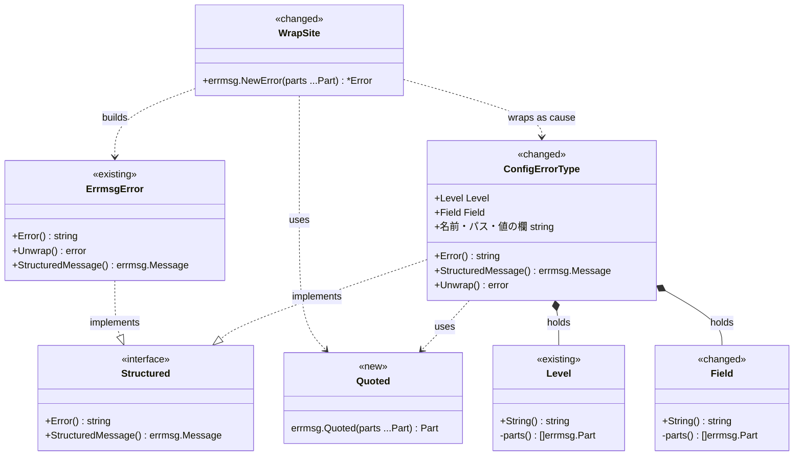
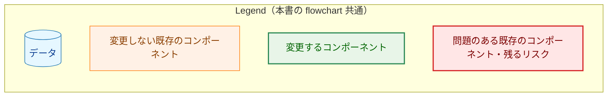
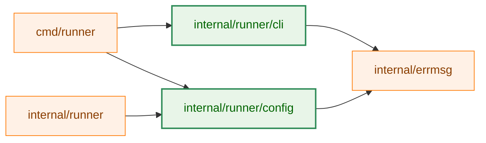
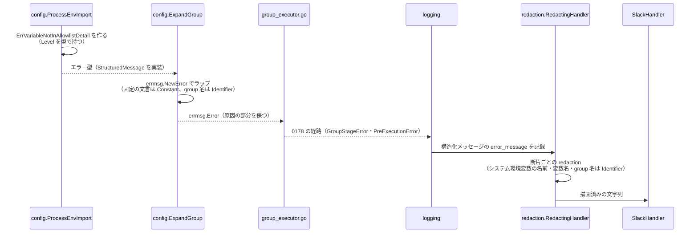
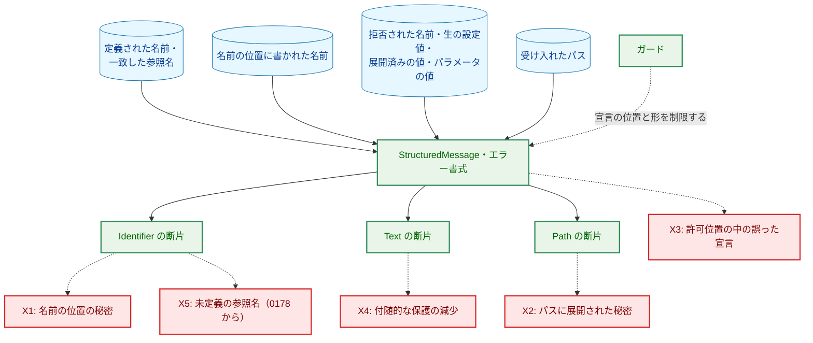
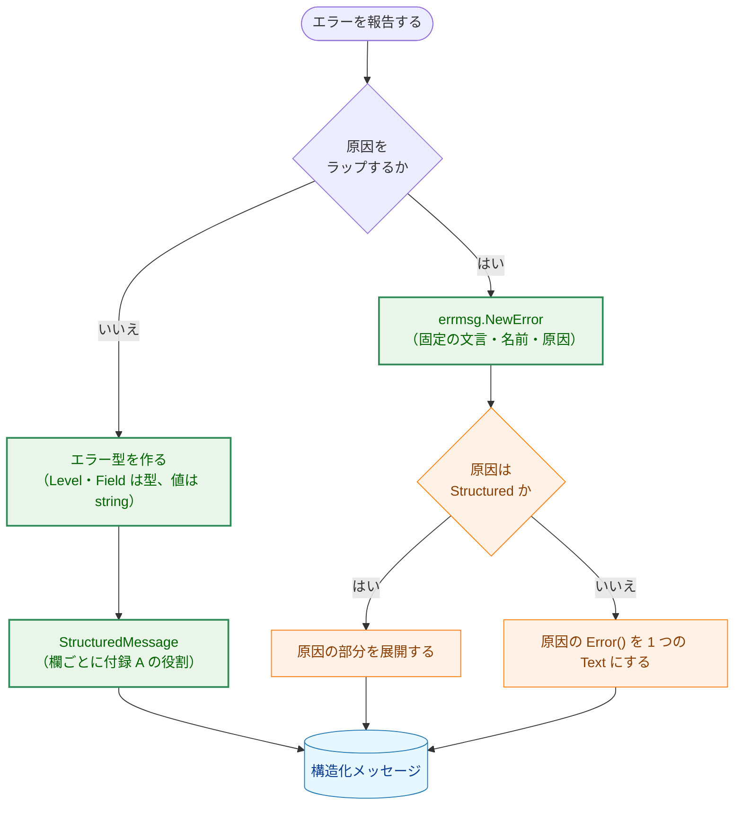

# アーキテクチャ設計書: 設定の展開・検証のエラー型を構造化する

## Document Status

| Item | Value |
|---|---|
| Status | `draft` |
| Created | 2026-09-30 |
| Review date | - |
| Reviewer | - |
| Comments | - |

## 0. 前提

- 要件: [01_requirements.md](01_requirements.md)（`approved`、`dc4585de`）。
- `design_handoff.md` はない。要件のレビューから設計へ送られた懸念はない。
- 既存コードの挙動についての記述は、特に断らない限りコミット `dc4585de` で確認した。`file:line` はこのコミットの行番号である。
- 本書は契約・不変条件・対象の範囲を確定する。箇所ごとの部分の並び、構築関数の名前、テストの作り方は実装計画（03）で決める。
- 仕組みの土台は Task 0178 の `internal/errmsg` である（[0178 02_architecture.md](../0178_structured_error_message_redaction/02_architecture.md)）。本書は 0178 の用語をそのまま使う。
- 用語:
  - 構造化メッセージ・部分・役割・断片・値全体置換: 0178 と 01 の用語。役割は `Constant`・`Identifier`・`Path`・`Text` の 4 つ。
  - 名前の検証・定義された名前・エラー型: 01「用語」の定義による。
  - 名前の位置: 運用者が名前を書く設定上の位置（01 決定事項 3）。`--groups` の値、コマンドの `template`、`command_templates` のキー、テンプレートの `vars` のキーが当たる。
  - 出どころ: 文字列がどこから来たか。本書では「名前の検証を通った名前」「名前の位置に書かれた名前」「名前の検証で拒否された名前」「生の設定値」「パラメータの値に由来しうる文字列」「パス」「数値」「固定の文言」のどれかを指す。
  - 許可位置: `errmsg.Ident`・`errmsg.Path` を呼んでよいファイル・関数（0178 のガードの `exemptRolePositions`）。
  - 引用する描画: `fmt` の `%q` による描画。`strconv.Quote` と同じ結果になる。

## 1. 設計の全体像

### 1.1 設計原則

- 役割は出どころで決める。値の中身は見ない。どの欄にどの出どころの文字列が入るかは、エラー型を作る箇所で決まっている。本書はその対応を欄ごとに固定し（3.1 節）、エラー型の `StructuredMessage` がそれを型で宣言する（CLAUDE.md「Declare, don't infer」）。
- レベルとフィールドは型で運ぶ。エラー型の欄のうち、レベル（`global`・`group[<name>]` など）とフィールド（`vars.<name>` など）を表すものは、描画済みの文字列ではなく既存の `Level`・`Field` の値として持つ。描画済みの文字列を後から分けて役割を決める処理は置かない。
- 文言は構造から作る。各エラー型の `Error()` は `StructuredMessage().String()` を返す。文言と構造を別々に保守しないので、`Error()` の文言が構造化メッセージの描画と食い違うことはない。この形は 0178 のガード（構造化メッセージを持つ型の `Error()` の形を固定するもの）が確かめる。
- 対象は型の集合と、ファイルの単位で決める。「`internal/runner/config` で `Error() string` を持つすべての型」と「対象のファイルのすべての関数」を対象にし、どの型・関数が対象かの一覧は保守しない。新しい型や関数は自動で検査の対象になる（01 決定事項 5）。
- 構造を持たない原因は `Text` のまま。外部のパッケージのエラー（go-toml、`internal/runner/base/variable`、`os`）は `Error()` 全体を 1 つの `Text` の断片にする（0178 の fail-closed）。
- 新しいパッケージは作らない。0178 の `errmsg` の構築関数・`errmsg.NewError`・`errmsg.Cause`・`errmsg.PathErrorCause` と、既存の `Level`・`Field` を使う。`errmsg` に加えるのは、`%q` の引用を役割を保ったまま表す構築関数 1 つだけである（3.4 節）。整形のためにエスケープ文字を加える処理は、0178 の `IndentedCause` と同じく `errmsg` の中に置く。

### 1.2 概念モデル



矢印の意味: `..|>` は「インターフェースを実装する」、`*--` は「欄として保持する」、`..>` は「使う・作る・原因としてラップする」を表す。

Legend: クラス図は色分けを使わない。`<<new>>` は本タスクで追加するもの、`<<changed>>` は本タスクで変更する型、`<<existing>>` は変更しない既存の型、`<<interface>>` は既存のインターフェース（`errmsg.Structured`）を表す。`ConfigErrorType` は `internal/runner/config` のエラー型をまとめて表す概念上の名前であり、実在の型ではない。`WrapSite` はエラー書式の箇所（`expansion.go`・`template_expansion.go`・`cli/filter.go`）をまとめて表す概念上の名前である。`ErrmsgError` は `errmsg.Error` を表す。`Quoted` は 3.4 節で加える `errmsg` の構築関数である。`Level` の型そのものは変えず、`Level` を欄に持つ型が増える。

エラーの本文を作る仕組みは 2 種類ある。

- エラー型: 自分の欄から構造化メッセージを作る。欄の役割は 3.1 節の規則で決まる。
- エラー書式: 原因のエラーに文言を付加する箇所。`fmt.Errorf` の代わりに `errmsg.NewError` で、固定の文言を `Constant`、挿入する名前を 3.1 節の役割、原因を `errmsg.Cause` として宣言する。原因が構造化メッセージを返せば、その部分がそのまま外側の本文に入る。

## 2. システム構成

### 2.1 全体構成（変更前と変更後）

```mermaid
flowchart TD
    classDef data fill:#e6f7ff,stroke:#1f77b4,stroke-width:1px,color:#0b3d91;
    classDef process fill:#fff1e6,stroke:#ff7f0e,stroke-width:1px,color:#8a3e00;
    classDef enhanced fill:#e8f5e8,stroke:#2e8b57,stroke-width:2px,color:#006400;
    classDef problem fill:#ffe6e6,stroke:#d62728,stroke-width:2px,color:#7b0000;

    subgraph Before["変更前"]
        B0[("設定ファイルと --groups")]
        B1["config のエラー型"]
        B2["expansion.go などのエラー書式<br>（fmt.Errorf と前置き全体の Text）"]
        B3["cli.FilterGroups"]
        B4["PreExecutionError・GroupError"]
        B5["RedactingHandler"]
        B0 --> B1
        B0 --> B3
        B1 -->|"原因"| B2
        B2 -->|"原因"| B4
        B3 -->|"原因"| B4
        B4 -->|"構造化メッセージ（原因は 1 つの Text）"| B5
        class B0 data
        class B1,B2,B3 problem
        class B4,B5 process
    end

    subgraph After["変更後"]
        A0[("設定ファイルと --groups")]
        A1["config のエラー型"]
        A2["expansion.go などの errmsg.NewError"]
        A3["cli.FilterGroups"]
        A4["PreExecutionError・GroupError"]
        A5["RedactingHandler"]
        A0 --> A1
        A0 --> A3
        A1 -->|"原因（構造化メッセージ）"| A2
        A2 -->|"原因（構造化メッセージ）"| A4
        A3 -->|"原因（構造化メッセージ）"| A4
        A4 -->|"構造化メッセージ（原因の部分を含む）"| A5
        class A0 data
        class A1,A2,A3 enhanced
        class A4,A5 process
    end
```



矢印の意味: 矢印 A → B は、A の値が B に渡ることを表す。ラベルは渡るエラーの形である。`PreExecutionError`・`GroupError`・`RedactingHandler` は 0178 で構造化済みであり、本タスクでは変更しない。



変更前は、`ErrUndefinedVariableDetail` を除く config のエラー型と、`fmt.Errorf` によるエラー書式が構造を持たない。0178 で `errmsg.NewError` にしたエラー書式の一部も、原因の前に付く文言（前置き）の全体を 1 つの `Text` にしている。そのため `RedactingHandler` は原因の全体を 1 つの `Text` として扱い、機密を示す語を 1 つでも含めば原因の全体を `[REDACTED]` にする（01「問題」）。変更後は、原因の中の名前が役割付きの断片として届き、`Identifier` の断片は値ベースの redaction を免除される。`Text` の断片には、変更前と同じ規則を断片の単位で適用する。断片の単位で判定することで表示が増える値については、5.1 節で扱う。

### 2.2 コンポーネント配置



矢印の意味: 矢印 A → B は、A が B を import することを表す。本タスクで加わる import は `internal/runner/cli` → `internal/errmsg` だけであり、そのほかは既存の import である。

Legend: 2.1 節の Legend と同じ色分けを使う。

`internal/errmsg` は標準ライブラリだけを import する末端のパッケージなので（`internal/errmsg/errmsg.go:8-13`）、`internal/runner/cli` から import しても循環しない。`internal/runner/cli` は `internal/runner/resource` を経由して、すでに `errmsg` に間接的に依存している（`go list -deps ./internal/runner/cli` で確認）。そのため、0178 のガードの対象（`internal/errmsg/errmsg_guard_test.go:253-304` の `productionGuardFiles`）にはすでに含まれる。`errmsg` を直接 import すると、`internal/runner/cli` は、`errmsg` の構造を宣言できるパッケージとして検査される対象（同ファイルの `errmsgDirect`）にも含まれる。

### 2.3 データの流れ（group の展開の失敗が Slack に届くまで）

AC-09 の例（`env_import` のシステム環境変数の名前が allowlist にない）で示す。



Legend: 実線の矢印は呼び出し、破線の矢印は戻り値としてのエラーの受け渡しを表す。`GE` から `LG` までの経路は 0178 のまま変えない。

`ExpandGlobal`・`ValidateAllTemplates`・`cli.FilterGroups` の失敗は、`cmd/runner` が `PreExecutionError` の `Err` に入れて記録する（`cmd/runner/main.go:371-393`・`:639-652`）。`PreExecutionError.DetailMessage` は原因を `errmsg.Cause` で展開する（`internal/logging/pre_execution_error.go:94-99`）。どちらの経路も、原因が構造化メッセージを返せば、その断片がそのまま Slack の本文の redaction に使われる。

## 3. コンポーネント設計

### 3.1 役割の割り当ての規則

役割は、欄に入る文字列の出どころで決める（01 決定事項 1〜4）。

| 出どころ | 役割 | 例 |
|---|---|---|
| 定義された名前 | `Identifier` | 定義する側の group 名・コマンド名・変数名・システム環境変数の名前・テンプレート名・プレースホルダ名（パラメータ名）・テンプレートを使わない `env_vars` のキー |
| 定義された名前と一致した参照名 | `Identifier` | `%{...}` で参照し、定義済みの変数として見つかった名前（循環参照の経路、配列変数の参照） |
| 名前の位置に書かれた名前（名前の検証の前） | `Identifier` | テンプレートの `vars` のキー、コマンドの `template` が参照する名前、`command_templates` のキー（検証の前に報告されるもの）、`--groups` の値 |
| 名前の検証で拒否された名前 | `Text` | 形式・予約済みの接頭辞・禁止された環境変数・スコープの検査で拒否された名前 |
| 生の設定値 | `Text` | `env_vars` のエントリ、`env_import` のマッピング、テンプレートの入力文字列、展開前の `cmd_allowed` の文字列 |
| 展開済みの変数の値 | `Text` | 変数の展開の入力として再び読む値（`env_import` で取り込んだシステム環境変数の値を含む）、展開した結果のうちパスとして受け入れられなかったもの |
| パラメータの値に由来しうる文字列 | `Text` | テンプレートの `env_vars` のキー（展開の後に読むもの） |
| 検証の理由 | `Text` | `Reason` の欄（内側のエラーの文言を入れるものと、固定の文言を入れるものがある） |
| パス | `Path` | パスとして受け入れた後の `cmd_allowed` のパス（シンボリックリンクの解決の対象と結果）、`includes` のパス、テンプレートファイルのパス |
| 数値 | `Text` | 添字・件数・上限・深さ・位置 |
| 型名 | `Text` | `%T` の結果と `typeNameString` などの型名の欄 |
| 固定の文言 | `Constant` | エラー型とエラー書式が持つ定数式の文言 |

名前の検証と参照の規則は、次のように区別する。名前を定義する側で、その名前が使えるかを確かめる検査（形式・予約済みの接頭辞・禁止された環境変数・定義する位置のスコープ）は名前の検証であり、拒否された名前は `Text` とする。名前を参照する側で、参照が許されるか・参照先があるかを確かめる検査は参照の規則であり、形式の検査を通った名前は拒否されても `Identifier` とする。ただし、変数の値を展開の入力として再び読む経路（`resolveAndExpand`、`expansion.go:137-160`）では、参照名が展開済みの値（システム環境変数の値を含む）の一部でありうる。そのため、変数の展開の経路の参照名は、定義済みの変数として見つかった場合に限り `Identifier` とする（上の表の 2 行目）。

欄ごとの割り当ては付録 A にある。規則の適用で判断を要したものを次に挙げる。

- `ErrInvalidVariableScopeDetail` の変数名は `Text` とする。定義する位置のスコープの検査であり、`validateVariableName` の中にある（`internal/runner/config/validation.go:170-182`）。
- テンプレートの検証で `variable.DetermineScope` に拒否された参照名（`template_expansion.go:708`・`:1135` のエラー書式。予約済みの接頭辞など）は `Text` とする。名前そのものが使えない形であり、拒否された名前に当たる。
- `ErrLocalVariableInTemplate`・`ErrUndefinedGlobalVariableInTemplate` の変数名は `Identifier` とする。この名前は `processVarRefs` の中の `security.ValidateVariableName`（`template_expansion.go:1111-1122` の呼び出し）と `variable.DetermineScope`（`:1133-1136`）を通っており、拒否の理由は参照の規則である。この名前はテンプレートの入力文字列（運用者が書いた生の設定）から読み、変数の値を展開して得たものではない（`ValidateAllTemplates` は値を展開しない）。
- `ErrCircularReferenceDetail` の変数名と経路、`ErrArrayVariableInStringContextDetail` の変数名は、定義済みの変数として見つかった名前だけを持つ（`expansion.go:151-155`・`:256-262`・`:424-431`・`:484-491`）。
- `ErrTemplateContainsNameField` のテンプレート名は `Identifier` とする。この検査は `ValidateTemplateName` より前に行われる（`loader.go:239` の `checkTemplateNameField` が `:254` の `ValidateTemplates` より前）。名前は `command_templates` のキー、すなわち名前の位置に運用者が書いた名前なので、01 決定事項 3 の 2 つ目の規則に当たる。01 決定事項 3 はこの型を挙げていないので、3.6 節の文書の更新で保護の境界に加える。設定の読み込み時にしか起きず、Slack には届かない。
- `cmd_allowed` の文字列は、展開前のものを `Text` とする。`%{...}` の参照を含みうる生の設定値であり、0178 も展開の失敗のエラー書式で `Text` としている（`expansion.go:945`）。展開した結果が絶対パスでない・長すぎるとして拒否された値（`InvalidPathError.Path`、`expansion.go:951-966`）も `Text` とする。変数の値をそのまま含みうる値であり、パスとして受け入れられていないからである。パスとして受け入れた後の値（シンボリックリンクの解決の対象と、解決の結果）は `Path` とする。
- テンプレート名が `Identifier` になるのは、名前がすでに検証済みだからである。テンプレートの展開と検証の経路のテンプレート名は、`command_templates` のキーであり、読み込み時に `ValidateTemplateName` を通っている（`loader.go:325`）。`ValidateAllTemplates` はそのキーを反復し（`template_expansion.go:1166-1170`）、コマンドの展開は存在を確かめたキーだけを使う（`expansion.go:1126-1140`）。
- group 名は、`validateCmdSpec` のエラー（`ErrTemplateFieldConflict`・`ErrMissingRequiredField`）の中でも `Identifier` とする。`ValidateIdentifiers`（`loader.go:249`）が `ValidateCommands`（`:259`）より前に group 名を検証している。
- `ErrReservedVariablePrefixDetail` の `Prefix` は `Text` とする。値は常に定数 `reservedVariablePrefix` だが（`validation.go:159-165`）、欄の値は定数式ではないので `Constant` として宣言できない。機密を示す語を含まないので、表示は変わらない。

### 3.2 `Level` と `Field`（変更）

- エラー型の欄のうち、レベルを表すもの（`Level`・`EnvImportLevel`・`VarsLevel`）は型 `Level`、フィールドを表すもの（`Field`）は型 `Field` にする。対象は 01 AC-04 のとおり、描画済みの文字列を持つすべての欄である。テンプレートのエラー型の `Field`（`"cmd"`・`"args[0]"`・`"vars.<name>"` など）と、`ErrTemplateFieldConflict`・`ErrMissingRequiredField` の `Field`（`"cmd"`・`"args"`・`"env_vars"`）も含む。
- `ErrTemplateFieldConflict`・`ErrMissingRequiredField` の `group[<name>]` は、`GroupName` の欄から group の `Level` の `parts()` が返す部分の列を使って描画する。`group[` と `]` の組み立てを型ごとに書き直さない。
- `Field` に次を加える。どれも既存の描画を変えない。
  - `output_file` のキー（テンプレートの `output_file` の展開で使う）。
  - 添字を持たない形の `args`・`env_vars`・`cmd_allowed`。既存の `String()` は、これらのキーでは常に添字を描画する。これを「添字を持つときだけ描画する」に改めても、既存の結果は変わらない。既存の構築関数は、いずれも常に添字を持たせているからである（`errors.go:268-285`）。
- `Field` の `String()` と `parts()` は、キーごとの分岐を 2 つ持つ（`errors.go:289-353`）。加えるキーと形は両方に入れ、両者が一致することを、`fieldKey` のすべての値を反復するテストで確かめる（手で書いたキーの一覧は使わない）。
- テンプレートの展開の関数（`expandSingleArg` など）は、フィールドを文字列ではなく `Field` で受け取る。`expandArrayPlaceholder` が `field == workDirKey` の文字列比較で作業ディレクトリかを判定している箇所（`template_expansion.go:255`）は、`Field` のキーで判定する。
- `Level.String()`・`Field.String()` は残す。`validateVariableName` が `variable.ValidateVariableNameForScope` に渡す位置の文字列（`validation.go:175`）と、テンプレートの警告の文言が使う。`Level`・`Field` の値を、`parts()` を通さずに役割付きの部分の材料にはしない（3.7 節のガード）。

### 3.3 エラー型（変更）

- `internal/runner/config` で `Error() string` を持つすべての型（型の別名 `ErrReservedVariableNameDetail` は含まない）に `StructuredMessage() errmsg.Message` を加え、`Error()` を `return e.StructuredMessage().String()` にする。0178 で構造化済みの `ErrUndefinedVariableDetail` は変えない。
- 部分の並びは、現在の `fmt.Sprintf` の文言を先頭から順に、固定の文言・レベル・フィールド・値の欄に分けたものである。値の欄の役割は付録 A による。
- `Unwrap()`・`Is()` は変えない。`errors.Is`・`errors.AsType` が届く対象は変わらない（01 AC-15）。
- 原因を持つ型（`ErrInvalidVariableScopeDetail.Err`・`ErrTemplateFileInvalidFormat.ParseError`）は、原因を `errmsg.Cause` として並べる。原因が構造化メッセージを返せばその部分を使い、返さなければ原因の `Error()` を 1 つの `Text` にする（01 決定事項 7）。
- `%v` で描画していたスライス（`ErrCircularReferenceDetail.Chain`）は、括弧と区切りの空白を `Constant`、要素をそれぞれの役割の部分として並べる。`%v` は要素を引用もエスケープもせずに並べるので、描画は変わらない。
- `%q` で描画していた値は、3.4 節の `errmsg.Quoted` で表す。
- 複数行の型（`ErrDuplicateTemplateName`・`ErrIncludedFileNotFound`・`ErrTemplateFileInvalidFormat`）の改行と字下げは `Constant` の文言に含める。

### 3.4 引用する描画（`%q`）の表し方

01 決定事項 6 は、`%q` で引用していた値の表し方を設計に委ねている。

- `errmsg` に、部分の列を引用する構築関数 `errmsg.Quoted` を加える。平らにした結果は次のとおりである。前後の引用符は `Constant` の断片にする。中の各断片は役割をそのまま保ち、文字列だけを `strconv.Quote` の規則でエスケープする（前後の引用符は含めない）。引用の中に `Field` のように複数の部分が入る場合も、`errmsg.Quoted(f.parts()...)` の形で表せる。
- `errmsg.Quoted` の契約: 平らにした結果をつないだ文字列は、中の部分を引用せずに描画した文字列 `s` に対する `strconv.Quote(s)` と、常にバイト単位で一致する。`strconv.Quote` は UTF-8 の文字の単位でエスケープするので、断片ごとにエスケープした結果がこれと一致しないのは、断片の境目で 1 つの文字が分かれている場合だけである。その場合は、引用の全体（引用符を含む）を 1 つの `Text` の断片にする（fail-closed）。
- エスケープの処理を `errmsg` の中に置くのは、0178 の方針（免除の役割の断片に入るバイトは、宣言された値・定数式・`errmsg` が持つ固定の文字のどれかであり、呼び出し側が整形のために渡すバイトは入らない。0178 02 §1.1・§3.8.2）に合わせるためである。`IndentedCause` の字下げと同じ位置づけであり、エスケープ文字は `errmsg` が決める。
- `errmsg.Part` は 1 つの断片か 1 つの原因を表す構造なので（`errmsg.go:57-63`）、`errmsg.Quoted` のために、中の部分の列を持つ部分の種類を加える。平らにする処理（`Segments`、それを使う `Freeze`・`String`）は、この種類を上の規則で断片の列に展開する。
- `errmsg.Quoted` の中に原因の部分を置いた場合は、引用の全体を 1 つの `Text` の断片にする（fail-closed）。中の原因は `errmsg.NewError` の「原因はちょうど 1 つ」の数に入らず、`Unwrap` でも届かない。本タスクの箇所では原因を引用しない。
- 採らない案:
  - 呼び出し側で `strconv.Quote` を適用して `errmsg.Ident` などに渡す案。呼び出し側の整形のバイトが免除の役割の断片に入り、上の 0178 の方針に反する。`Field` のように複数の部分からなる値では、`parts()` と同じ分岐を引用用にもう 1 つ持つことになる。
  - 引用符を含めた全体を 1 つの部分にする案。`Field` のように複数の部分からなる値には使えない。
- 0178 が `errmsg.Path(strconv.Quote(...))` の形で引用したパスを 1 つの `Path` の部分にしている箇所（`expansion.go:72`、`group_executor.go:485`・`:511`）は変えない。これらは 0178 02 §3.4 が定めた扱いであり、描画も役割も本タスクの要件に関わらない。`expansion.go:72` は本タスクの対象のファイルにあるが、そのまま残す。
- 01 AC-14 の確認のため、`"`・`\`・非 ASCII の文字・不正な UTF-8 のバイト列・断片の境目で分かれる文字を含む入力で、`errmsg.Quoted` の描画が `strconv.Quote` と一致すること、エラー型の `Error()` が変更前の `fmt.Sprintf` の結果と一致することをテストで確かめる（7.1 節）。

### 3.5 エラー書式（変更）

#### 3.5.1 対象の範囲

01 のスコープの対象 2 の関数の集合を、次のファイルの単位で確定する。

| ファイル | 範囲 | 理由 |
|---|---|---|
| `internal/runner/config/expansion.go` | ファイル全体。0178 の除外（5 関数）をなくす | global・group・コマンドの展開の関数がこのファイルに集まっている。除外していた 5 関数も、本タスクで構造化する |
| `internal/runner/config/template_expansion.go` | ファイル全体 | `ValidateAllTemplates` とコマンドの展開から呼ばれる関数がこのファイルに集まっている |
| `internal/runner/cli/filter.go` | ファイル全体 | `cli.FilterGroups` とその補助関数だけを持つ |

- 01 からの逸脱: `template_expansion.go` には、設定の読み込み時にだけ呼ばれる関数（`ValidateTemplateName`・`ValidateTemplateDefinition`・`validateGlobalOnly`・`validateCmdSpec`）もある。このうち `fmt.Errorf` を持つのは `validateGlobalOnly` だけである（`template_expansion.go:708`。呼び出しは `loader.go:330` からだけ）。01 決定事項 5 はエラー書式の対象を Slack に届く経路に限るので、この 1 か所を構造化するのは 01 の範囲を超える。それでもファイル全体を対象にするのは、その文言が `validateFieldVars`（`ValidateAllTemplates` の経路、`:1135`）と同じ形であり、関数の単位で除くと除く関数の一覧を保守することになるからである。構造化しても `Error()` の文言は変わらない。レビューで承認を受ける点として記す。
- `ApplyTemplateInheritance` はエラーを返さない（`expansion.go:1321-1340`）。除外をなくしても変わるところはない。
- 対象のファイルの中では、`fmt.Errorf`・`errors.Join`・定数でない引数の `errors.New` を使わない。この条件は 0178 の wrap guard が確かめる（3.7 節）。01 AC-06 の「`%w` を含む `fmt.Errorf` がない」より強い条件であり、AC-06 を含む。

#### 3.5.2 宣言の方針

- すべてのエラー書式を `errmsg.NewError` で作る。固定の文言は `Constant`、挿入する名前は 3.1 節の役割、原因は `errmsg.Cause` として宣言する。レベル・フィールドは `Level`・`Field` の部分の列を使う。
- 0178 が前置きの全体を 1 つの `Text` にしたエラー書式（`expansion.go:843`・`:858`・`:931`・`:972`・`:1008`・`:1038`・`:1181`・`:1284`）も、同じ方針で宣言し直す。01 のスコープの対象 2 は `ExpandGlobal` のものを挙げるが、group・コマンドの展開のものも Slack に届く経路にあり（01 決定事項 5）、同じ理由で対象にする。
- `filepath.EvalSymlinks` の失敗をラップする箇所（`expansion.go:968-975`）は、原因を `errmsg.PathErrorCause` で宣言する。原因が `*fs.PathError` なら、そのパスが `Path` の断片になる。`*fs.PathError` でなければ `errmsg.Cause` と同じ扱いになる（`errmsg.go` の `PathErrorCause`）。0178 のガードの `pathErrorCausePositions` に、この関数を加える。
- センチネルエラー（`ErrForbiddenEnvVar` など、`errors.New` で作ったもの）を `%w` で先頭に置いていた箇所（`expansion.go:332`・`:795`）は、センチネルエラーを `errmsg.Cause` として同じ位置に置く。センチネルエラーの文言は `Text` の断片になる。`ErrForbiddenEnvVar` の文言 `environment variable is forbidden` は、値全体置換が反応する機密を示す語を含まない。そのため、このセンチネルエラーの文言の断片は置換されない。拒否された環境変数の名前は `Text` である（3.1 節）。

#### 3.5.3 `cli.FilterGroups`

- 存在しない group 名のエラー（`filter.go:84-85`）を `errmsg.NewError` で作る。センチネルエラー `ErrGroupNotFound` を原因とし、指定された名前と定義済みの group 名の一覧の各要素を `Identifier`、`%v` の括弧・区切りの空白・固定の文言を `Constant` として宣言する（01 決定事項 4）。一覧の順序（map の反復順）は変えない。
- `checkGroupsExist` の `config == nil` の分岐（`filter.go:50-52`）は削除する。この関数の呼び出し元は `FilterGroups` だけであり（`filter.go:109`、リポジトリ内の検索で確認）、`FilterGroups` は呼び出しの前に `config == nil` を `ErrNilConfig` として返している（`filter.go:96-98`）。この分岐は到達できず、`%w` を 2 つ持つので `errmsg.NewError`（原因はちょうど 1 つ）では表せない。`FilterGroups` に `nil` を渡したときの結果は変わらない（`filter_test.go:120-124` が確かめる）。

### 3.6 文書（変更）

- `docs/dev/architecture_design/security-architecture.ja.md` の「識別子の型宣言による免除」に、01 AC-23 の内容を追記する。検証の前に報告される `command_templates` のキー（`ErrTemplateContainsNameField`）を `Identifier` とすることも、保護の境界として同じ箇所に記す（3.1 節）。英語版は `/mktrans` で反映する。
- 0178 の [03_detailed_specification.md](../0178_structured_error_message_redaction/03_detailed_specification.md) の対象の範囲の記述（`expansion.go` の除外、config の `*...Detail` 型を範囲外とする例外）に、本タスクで範囲に入ったことを注記する（5.4 節）。

### 3.7 ガード（変更）

0178 のガードを、本タスクの対象に合わせて更新する。追加の検査もこのガードの仕組み（型検査した本番のパッケージの集合）の上に置き、別の仕組みは作らない。

| ガード | 本タスクでの変更 | 対応する AC |
|---|---|---|
| 許可位置（`exemptRolePositions`） | `errors.go`・`template_errors.go`・`template_expansion.go`・`cli/filter.go` をファイル全体の許可位置にする。`expansion.go` の除外をなくす | AC-20 |
| `PathErrorCause` の許可位置 | `expansion.go` の `expandCmdAllowed` を加える | AC-20 |
| `errmsg` の中の役割の決定 | `errmsg.Quoted` を加えるのに合わせて、`errmsg` の中で役割と原因の種類を決める関数の呼び出し元の表（`errmsgRoleChoosers`）を更新する | AC-20 |
| `Const` の定数式の検査 | 変更なし | AC-20 |
| wrap guard（`fmt.Errorf` などの禁止と、`Unwrap` を持つ型の `StructuredMessage` の要求） | `errors.go`・`template_errors.go`・`template_expansion.go`・`cli/filter.go` をファイル全体の範囲に加える。`expansion.go` の除外と、`errors.go` の関数単位の指定をなくす | AC-06・AC-20 |
| エラー型の網羅（新規） | 検査の対象に指定したパッケージ（現時点では `internal/runner/config` だけ）で宣言され、`Error() string` を持つすべての型が、`StructuredMessage() errmsg.Message` を持つことを確かめる。型の別名は、それが指す型として確かめる | AC-01 |
| レベル・フィールドの型（新規） | `internal/runner/config` のエラー型に、名前が `Level`・`Field` の欄と、名前が `Level` で終わる欄で、型が `string` のものがないことを確かめる | AC-04・AC-21 |
| レベル・フィールドの値の流入（新規） | `internal/runner/config` と `internal/runner/cli` で、`errmsg` の役割を宣言する構築関数の引数の式の中に、型が `Level`・`Field` の値が、`parts()` の呼び出しの受け手以外の形で現れないことを確かめる。`Level.String()` の呼び出しも、`fmt.Sprintf("%s", level)` のような書式による暗黙の描画も、この条件で拒否される | AC-21 |

- 許可位置は、どれもファイル全体にする。関数の単位で指定すると、エラー型の `StructuredMessage` と補助関数の一覧を保守することになり、01 決定事項 5 の方針（一覧を保守しない）に反する。4 つのファイルは、どれもエラー型か設定の展開・`--groups` の検証のエラーを作るファイルである。
- 許可位置のガードが確かめるのは、`errmsg.Ident`・`errmsg.Path` を直接呼ぶ位置だけである。`Level` の構築関数（`groupLevel` など）と `Field` の構築関数（`varField` など）は、受け取った名前を `parts()` で `Identifier` として宣言するので、許可位置の外（`validation.go` など）から生の値を渡しても、ガードは検出しない。これは 0178 の `Level`・`Field` の設計から引き継いだ制約であり、本タスクでは変えない。本タスクで `Level`・`Field` を欄に持つ型が増える分、生の値を渡す誤りが入りうる箇所も増える。残るリスクとして 5.2 節に記す。
- 新しい検査は、0178 のガードと同じく、普通の書き方の誤りを見つけるためのものである。検査をすり抜けるために書いたコードは対象外とする（0178 03 §9.0 の方針）。
- `PathErrorCause` の許可位置の違反の文言は、一時ディレクトリの作成だけを想定している（`errmsg_guard_test.go:618`）。位置を加えるのに合わせて文言を直す。
- どの検査にも、対象の実装を壊すと失敗することを示す自己テストを付ける（01 AC-22）。

### 3.8 コンポーネントの責務と変更ファイル

| ファイル | 変更 | 責務 |
|---|---|---|
| `internal/errmsg/errmsg.go` | 変更 | `errmsg.Quoted`（3.4 節） |
| `internal/runner/config/errors.go` | 変更 | エラー型の構造化メッセージ。`Field` の拡張 |
| `internal/runner/config/template_errors.go` | 変更 | テンプレートのエラー型の構造化メッセージ |
| `internal/runner/config/expansion.go` | 変更 | エラー型の構築箇所で `Level`・`Field` を型のまま渡す。エラー書式の構造化 |
| `internal/runner/config/template_expansion.go` | 変更 | 同上。フィールドを `Field` で受け渡す |
| `internal/runner/config/validation.go` | 変更 | `validateVariableName` のエラー型の構築箇所で `Level`・`Field` を型のまま渡す。エラー書式は変えない |
| `internal/runner/cli/filter.go` | 変更 | `checkGroupsExist` のエラーの構造化。到達できない分岐の削除 |
| `internal/errmsg/errmsg_test.go` | 変更 | `errmsg.Quoted` のテスト |
| `internal/errmsg/errmsg_guard_test.go` | 変更 | 許可位置と `errmsgRoleChoosers` の更新、新しい検査と自己テスト |
| `internal/runner/wrap_guard_test.go` | 変更 | 範囲の更新、除外の一覧の削除 |
| `internal/runner/config/*_test.go`・`internal/runner/cli/filter_test.go`・`internal/redaction`・`internal/runner`・`cmd/runner` のテスト | 追加 | 7 節のテスト |
| `docs/dev/architecture_design/security-architecture.ja.md`・`.md` | 変更 | 3.6 節 |
| `docs/tasks/0178_structured_error_message_redaction/03_detailed_specification.md` | 変更 | 3.6 節の注記 |

変更前の挙動を前提にしているため、更新が必要な既存のテスト:

| テスト | 理由 |
|---|---|
| `internal/runner/config/errors_test.go` | エラー型を文字列の `Level`・`Field` で作っている（27 か所） |
| `internal/runner/config/template_expansion_validation_test.go` | テンプレートのエラー型を文字列の `Field` で作っている（2 か所） |
| `internal/runner/config/template_param_expansion_test.go`・`template_field_constraints_test.go` | `expandSingleArg` にフィールドを文字列で渡している |
| `internal/errmsg/errmsg_guard_test.go` の `TestExemptRoleCallCheckRecognizesForms` | `expansion.go` の除外（`ProcessEnvImport`）で `Ident` が拒否されることを確かめるケースがある（`:684-687`） |
| `internal/runner/wrap_guard_test.go` の `TestScopeCatalogNamesExist` | 除外の一覧（`expansionExcludedFunctions`）の名前が存在することを確かめている |

`Error()` の文言を確かめる既存のテストは変えない。文言は変わらないので、そのまま通ることが 01 AC-14 の確認の一部になる。0178 の `Text` のエラー書式（`env_import` など）の断片の役割を確かめる既存のテストはない（`internal`・`cmd` の `*_test.go` を文言で検索して確認）。

## 4. エラーハンドリング設計

### 4.1 エラー型

新しいエラー型は作らない。既存のエラー型の形を次のように変える。値の欄は `string` のまま残し、役割は `StructuredMessage` が宣言する。

```go
// ErrVariableNotInAllowlistDetail: the level becomes a typed Level; the
// value fields are unchanged.
type ErrVariableNotInAllowlistDetail struct {
	Level           Level
	SystemVarName   string
	InternalVarName string
	Allowlist       []string
}

func (e *ErrVariableNotInAllowlistDetail) StructuredMessage() errmsg.Message
func (e *ErrVariableNotInAllowlistDetail) Error() string // e.StructuredMessage().String()
func (e *ErrVariableNotInAllowlistDetail) Unwrap() error // ErrVariableNotInAllowlist (unchanged)

// Template error types carry the field as a typed Field.
type ErrRequiredParamMissing struct {
	TemplateName string
	Field        Field
	ParamName    string
}

func (e *ErrRequiredParamMissing) StructuredMessage() errmsg.Message
func (e *ErrRequiredParamMissing) Error() string
```

`errmsg` に加える構築関数の形:

```go
// Quoted renders parts as fmt's %q would render their concatenation: the
// quotes become RoleConstant segments and every inner segment keeps its role
// with its text escaped as strconv.Quote does. When per-segment escaping would
// differ from quoting the whole (a character split across segments), the
// whole quotation becomes one RoleText segment.
func Quoted(parts ...Part) Part
```

名前と形は実装計画（03）で確定する。

### 4.2 失敗時の扱い

- `errmsg.NewError` は、原因の部分がちょうど 1 つで、その原因が `nil` でないことを求め、満たさなければ panic する（`errmsg.go` の `NewError`）。設定の展開の経路には `recover` がないので、作る箇所を誤ると、エラーを報告する代わりに実行全体が止まり、Slack の通知も送られない。そのため、エラー書式の各箇所を少なくとも 1 つのテストで実行する（7.1 節）。各箇所の原因は、直前の `if err != nil` の `err` か、`nil` でないセンチネルエラーである。
- `errmsg.Quoted` は panic しない。エスケープのしかたが一致しない場合は、3.4 節の fail-closed の規則で 1 つの `Text` の断片にする。
- `ErrInvalidVariableScopeDetail.Err` は、`%s` で描画していた。`Err` が `nil` なら、変更前は `%!s(<nil>)`、変更後は `errmsg.Cause` の描画で `<nil>` になる。唯一の構築箇所は `Err` に `nil` でない値だけを入れるので（`validation.go:176-182`、`if err != nil` の中）、この違いは現れない。`ErrTemplateFileInvalidFormat.ParseError` は `%v` で描画していたので、`nil` のときも `<nil>` で変わらない。
- 構造化メッセージを返さない原因（go-toml のエラー、`variable` パッケージのスコープのエラー、`os` のエラー）は、`Error()` 全体が 1 つの `Text` の断片になり、その断片に変更前と同じ規則を断片の単位で適用する（隣の名前による付随的な置換がなくなる点は 5.1 節で述べ、5.2 節の X4 に挙げる）。

### 4.3 文言の設計

`Error()` の文言は変えない（01 決定事項 6、F-004）。本文に含める値を減らす方向の変更もしない（01 決定事項 3）。

## 5. セキュリティ考慮事項

### 5.1 保護の境界

- `Identifier` の断片は、値ベースの redaction（key=value 置換・値形式の検出・値全体置換）をすべて免除される。本タスクで `Identifier` にするのは、定義された名前、定義された名前と一致した参照名、名前の位置に運用者が書いた名前だけである（3.1 節）。
- 名前の位置に書いた名前は、名前の検証を受けていない場合がある（`--groups` の値、存在しないテンプレートへの参照、重複したテンプレート名、`command_templates` のキーのうち検証前に報告されるもの）。運用者が誤って秘密をこれらの位置に書くと、その値は値形式の検出も免除されて Slack に出る。これを保護の境界として受け入れる（01 決定事項 2〜4）。
- 生の設定値・展開済みの変数の値・拒否された名前・パラメータの値に由来しうる文字列は `Text` である。値全体置換の判定は、変更前と同じ規則を断片の単位で適用する（01 AC-18・AC-19）。
- 断片の単位で判定するので、変更前より表示が増える値がある。変更前は、原因の全体が 1 つの `Text` だったので、隣の名前（group 名など）が機密を示す語を含むだけで、語を含まない値も一緒に `[REDACTED]` になっていた。変更後は、その値が語も値の形式も含まなければ表示される。例: group 名 `api_token_rotate` と、キーの形式が不正な `env_vars` のエントリ `DB-PASS=hunter2`（`ErrInvalidEnvKeyDetail.Context`）。この付随的な保護は 0178 が `Text` の断片の単位の判定を導入したときに受け入れたものと同じ性質であり（0178 01、`security-architecture.ja.md` の「値全体置換は部分ごとに判定します」）、本タスクでも受け入れる。語も形式も含まない秘密は、この値の判定では守られない。
- 変数の展開の経路では、展開済みの変数の値（`env_import` で取り込んだシステム環境変数の値を含む）を展開の入力として再び読む（`expansion.go:137-160`）。このため次のことが起きうる。
  - 秘密の値が `\` や `%{` を含むと、構文のエラー（`ErrInvalidEscapeSequenceDetail`・`ErrUnclosedVariableReferenceDetail`・`ErrMaxRecursionDepthExceededDetail`）の `Context` にその値が入り、group・コマンドの展開の失敗として Slack に届く。`Context` は `Text` なので、値の形式か機密を示す語で判定される。
  - この経路で定義されていない参照名は、秘密の値の一部でありうる。0178 の `ErrUndefinedVariableDetail` はこの名前を `Identifier` としている（`expansion.go:137-143`）。本タスクはこの型を変えず、残るリスクとして記す（5.2 節の X5）。
  - 本タスクで加える `Identifier` の参照名は、定義済みの変数として見つかった名前に限る（3.1 節）。
- `Path` にする値（パスとして受け入れた後の値）は、変数の値を展開した結果を含みうる。`Path` の断片は key=value 置換と値形式の検出を受けるが、値全体置換は受けない。値の形式で検出できない秘密を変数に入れ、それをパスに展開した場合、その秘密は、変更前よりマスクされずに Slack へ出やすくなる。0178・0179 の `Path` の扱い（`failed_file_paths` と同じ）に揃え、これを受け入れる。パスとして拒否された値は `Text` とする（3.1 節）。
- 本文全体に対する検出（部分の境目をまたぐ key=value など）は、0178 の `RedactMessage` の契約のとおり、`Identifier` 以外の断片で働く。本タスクはこの契約を変えない。

### 5.2 脅威モデル



矢印の意味: 実線の矢印 A → B は、A の値が B に渡る（B として宣言される）ことを表す。破線の矢印は、制限をかけること、または残るリスクにつながることを表す。`Identifier` の断片はすべての値ベースの redaction を免除され、`Path` の断片は値全体置換だけを免除され、`Text` の断片はすべてを受ける。

Legend: 2.1 節の Legend と同じ色分けを使う（青の円柱は入力の文字列、緑は本タスクで変更する扱い、赤は残るリスク）。

| 脅威 | 対策 | 残るリスク |
|---|---|---|
| 秘密を含む生の設定値・展開済みの値が `Identifier` として Slack に出る | これらは `Text`（3.1 節）。欄ごとの役割をテストで固定する（7.1 節） | X4 |
| パラメータの値がテンプレートの `env_vars` のキーを通って `Identifier` になる | そのキーは `Text`（01 決定事項 2） | なし |
| 開発者が生の値を `Identifier` と宣言する（許可位置の中での `errmsg.Ident`、または許可位置の外からの `Level`・`Field` の構築関数への生の値の受け渡し） | 欄ごとの役割のテスト。`Level`・`Field` の値が `parts()` 以外の形で部分の材料にならないことのガード | 新しいコードの誤った宣言はテストとレビューに頼る（X3） |
| 運用者が名前の位置に秘密を書く | 受け入れる（5.1 節） | X1 |
| 形式で検出できない秘密がパスに展開される | `Path` は key=value 置換と値形式の検出を受ける。拒否されたパスは `Text` | X2 |
| 語も形式も含まない秘密が、隣の名前による付随的な置換を失う | 受け入れる（5.1 節） | X4 |
| 秘密の値の一部が未定義の参照名として `Identifier` になる | 本タスクでは変えない（0178 の `ErrUndefinedVariableDetail`） | X5 |
| 引用の表し方の誤りで `Error()` の文言が変わる | `errmsg.Quoted` の契約（3.4 節）と、特殊な文字を含む入力のテスト | なし |

### 5.3 出力先と外部サービス

- Slack のメッセージの組み立て、通知の件数・種別・フィールドの構成は変えない（01 AC-17）。変わるのは、`error_message` の中の断片の役割だけである。Slack の新しい機能には依存しないので、対象のクライアント環境（Slack）での追加の確認は要らない。
- stderr の `Details:` は redaction を通らない。`Error()` の文言も変わらないので、出力は変わらない（01 AC-16）。
- ログファイル・コンソールは `RedactingHandler` を通るので、Slack と同じく名前が残るようになる。
- 本タスクには、副作用を切り替えるフラグやモードはない。`--dry-run` でも、設定の展開・検証とエラーの報告の経路は同じである。

### 5.4 他の設計文書の方針に対する例外

- 元の方針: 0178 の [02_architecture.md](../0178_structured_error_message_redaction/02_architecture.md) 3.5.3 節と 3.8.1 節は、`expansion.go` のうち原因が `ErrUndefinedVariableDetail` を運びえないエラー書式を「前置きの全体を 1 つの `Text` にする」とし、`ProcessEnvImport` など 5 関数を範囲から除いた。3.8.1 節は、config の `*...Detail` 型を `Unwrap` を持っても `StructuredMessage` を要求しない例外としている（`wrap_guard_test.go:110-117` のコメントも同じ）。
- 例外とする理由: 0178 はこれらを #1197 に送った（0178 01「対象外」）。本タスクがその #1197 であり、方針の前提（対象外であること）がなくなる。
- 変更前の方針を前提にしている既存のテスト: `errmsg_guard_test.go` の除外のケース（`:684-687`）と `wrap_guard_test.go` の `TestScopeCatalogNamesExist`（除外の名前の存在の確認）。3.8 節の表のとおり更新する。
- 0178 02 §3.4 の引用したパスの扱い（引用符とエスケープ文字を含めて 1 つの `Path` の部分にする）は例外にしない。既存の箇所はそのまま残し、本タスクで構造化する値の引用には `errmsg.Quoted` を使う（3.4 節）。`errmsg.Quoted` は、エスケープ文字を `errmsg` の中で加えるので、0178 02 §1.1 の「呼び出し側が整形のために渡すバイトは免除の役割の断片に入らない」に反しない。

### 5.5 運用の観点

- 移行: 設定ファイル・コマンドラインの形は変わらない。変わるのは redaction を通った出力で、名前が `[REDACTED]` にならずに出るようになる。段階的な有効化は要らない。
- 可観測性: Slack の本文から、失敗した環境変数・変数・テンプレートの名前が分かるようになる。本タスクの目的そのものである。
- 性能: 部分の列はエラーが起きたときにだけ作る。正常な経路の処理コストは変わらない。
- 再現性: `cli.FilterGroups` の定義済みの group 名の一覧の順序は map の反復順のままで、実行ごとに変わりうる（01「対象外」）。テストはこの一覧を順序に依らずに確かめる。

## 6. 処理フローの詳細

### 6.1 構造化メッセージの組み立て



矢印の意味: 矢印 A → B は、A の次に B を行うことを表す。原因の展開（`C1`〜`C3`）は 0178 の `errmsg` の既存の処理である。

Legend: 2.1 節の Legend と同じ色分けを使う（緑は本タスクで変更する処理、橙は変更しない処理、青の円柱は結果のデータ）。

### 6.2 例

本節は例示であり、実装で確かめた結果ではない。`…` は省略を表す。

| 本文 | 役割の並び |
|---|---|
| `system environment variable 'GITHUB_TOKEN' not in allowlist (referenced as 'gh' in group[deploy].from_env)` | 固定の文言は `Constant`。`GITHUB_TOKEN`・`gh`・`deploy` は `Identifier` |
| `template "rotate_token" args[0]: required parameter "secret_file" not provided` | 引用符・`args[`・`]` などは `Constant`。`rotate_token`・`secret_file` は `Identifier`。`0` は `Text` |
| `invalid env format in global: 'API_TOKEN' (must be in 'VAR=value' format)` | `API_TOKEN` はエントリそのもの（生の設定値）なので `Text`。値全体置換で `[REDACTED]` になる |
| `group not found: group(s) [token_rotat] specified in --groups do not exist in configuration`<br>`Available groups: [token_rotate …]` | `group not found` はセンチネルエラーが原因なので `Text`。括弧と固定の文言は `Constant`。各 group 名は `Identifier` |

## 7. テスト戦略

01「テストの入力についての制約」に従う。層ごとの効果を確かめるテストは、1 つの層だけが反応する入力を使い、ほかの層だけでは入力が変わらないことを先に確かめる。`Identifier` の免除を示すテストは、同じ文字列の `Text` の対照の部分を同じメッセージに置く。

### 7.1 単体テスト

- エラー型ごと: `StructuredMessage().Segments()` の役割が付録 A と一致すること、`Error()` が変更前の `fmt.Sprintf` の結果と一致すること（01 AC-02・AC-03・AC-14）。変更前の文言は、テストの中に変更前の書式を再現して比べる。
- `errmsg.Quoted`: `"`・`\`・非 ASCII の文字・不正な UTF-8 のバイト列・断片の境目で分かれる文字を含む入力で、描画が `strconv.Quote` と一致すること。境目で文字が分かれる入力では、引用の全体が 1 つの `Text` の断片になること。中の断片の役割が保たれること（3.4 節）。
- `Field`: `fieldKey` のすべての値と添字の有無を反復し、`parts()` をつないだ文字列が `String()` と一致すること、`errmsg.Quoted(f.parts()...)` の描画が `strconv.Quote(f.String())` と一致すること（3.2 節）。
- 原因を持つ型: 構造化メッセージを返す原因の `Identifier` の断片が、外側を通しても `Identifier` のまま残ること（01 AC-05）。
- エラー書式: 各箇所を実行し、固定の文言が `Constant`、名前が 3.1 節の役割であり、`errors.Is`・`errors.AsType` が変更前と同じ原因に届くこと（01 AC-07・AC-15）。`errmsg.NewError` の panic が起きないことも、この実行で確かめられる。
- `cli.FilterGroups`: 返すエラーが `errmsg.Structured` を実装し、指定した名前と定義済みの group 名が `Identifier` であり、`errors.Is(err, cli.ErrGroupNotFound)` が成り立つこと（01 AC-08）。

### 7.2 統合テスト

- 01 AC-09〜AC-13 の例示のシナリオを、エラーの発生元（`ExpandGlobal`・`ValidateAllTemplates`・`cli.FilterGroups`・group executor）から `RedactingHandler` を通った後のレコードまで通し、Slack のメッセージの組み立てまで確かめる。0178 のシナリオテストと同じ仕組みを使う。
- 01 AC-16・AC-17: 同じシナリオで、stderr の `Details:` と、通知の件数・`message_type`・`error_type`・Scope・Slack のフィールド構成が変更前と同じであることを確かめる。

### 7.3 セキュリティのテスト

- 01 AC-18: 拒否された名前・生の設定値の `Text` の部分に、値全体置換だけが反応する入力（例: `API_TOKEN`）を与え、その部分が置換文字列になること。
- 01 AC-19: `env` のエントリとテンプレートの入力文字列に、値形式の検出だけが反応する値（GitHub トークンの形式）を与え、マスクされること。

### 7.4 ガードの自己テスト

3.7 節の各検査に、対象を壊した合成の入力で失敗することを示す自己テストを付ける（01 AC-22）。例: `StructuredMessage` を持たないエラー型を加える、エラー型の `Level` を `string` に戻す、`Ident` の引数に `Level.String()` や `fmt.Sprintf("%s", level)` を渡す、許可位置の外で `Ident` を呼ぶ、対象のファイルに `fmt.Errorf` を加える。

## 8. 実装の優先順位

PR の分け方は実装計画（03）で決める。Issue の優先順位（01 決定事項 5）を順序の目安にし、段階を次のように分ける。

| 段階 | 内容 | 主な AC |
|---|---|---|
| 1. 基盤 | `errmsg.Quoted` と、`Field` の拡張（キーの追加、添字なしの形） | AC-04・AC-14 |
| 2. 変数の展開 | `errors.go` のエラー型（`ErrUndefinedVariableDetail` を除く）、`expansion.go` と `validation.go` の構築箇所、`expansion.go` のエラー書式、関係するガードの更新（Issue の優先 1・2） | AC-02〜AC-07・AC-09・AC-10 |
| 3. テンプレート | `template_errors.go` のエラー型、`template_expansion.go` のエラー書式、関係するガードの更新（優先 3） | AC-02〜AC-07・AC-11・AC-13 |
| 4. `--groups` | `cli.FilterGroups`（優先 4） | AC-08・AC-12 |
| 5. 仕上げ | エラー型の網羅の検査、レベル・フィールドの型と値の流入の検査、保護のテスト、文書 | AC-01・AC-18〜AC-23 |

- wrap guard でファイル全体を範囲に加えると、そのファイルで `Unwrap` を持つすべての型に `StructuredMessage` が要る。そのため、ファイルを範囲に加えるのは、そのファイルの型をすべて構造化した段階で行う。
- エラー型の網羅の検査は、すべてのエラー型を構造化した後（段階 5）に入れる。
- 01 AC-24（`make test`・`make lint`）は各段階で満たす。

## 9. 将来の拡張性

- `internal/runner/config` に新しいエラー型を加えると、エラー型の網羅の検査が `StructuredMessage` を要求する。対象の 3 つのファイルに新しい関数を加えると、wrap guard が `fmt.Errorf` を拒否する。どちらも一覧を更新せずに検査の対象になる。
- ほかのパッケージのエラー型を同じ方針で構造化するときは、エラー型の網羅の検査の対象のパッケージに加える。
- 設定の読み込み時の検証のエラー書式（`validation.go`・`loader.go`・`template_loader.go`）は対象外のままである。構造化するときは、wrap guard の範囲にそのファイルを加える。

## 付録 A: エラー型の欄ごとの役割

レベルとフィールドの欄は、すべての型で `Level`・`Field` の `parts()` が返す部分の列にする（3.2 節）。そのほかの欄の役割を示す。数値の欄はすべて `Text` である。`ErrUndefinedVariableDetail` は 0178 で構造化済みであり、変えない。

`errors.go`:

| 型 | `Identifier` | `Text` | `Path` | 原因 |
|---|---|---|---|---|
| `ErrInvalidVariableNameDetail` | - | `VariableName`・`Reason` | - | - |
| `ErrInvalidSystemVariableNameDetail` | - | `SystemVariableName`・`Reason` | - | - |
| `ErrReservedVariablePrefixDetail` | - | `VariableName`・`Prefix` | - | - |
| `ErrVariableNotInAllowlistDetail` | `SystemVarName`・`InternalVarName` | - | - | - |
| `ErrCircularReferenceDetail` | `VariableName`・`Chain` の各要素 | - | - | - |
| `ErrInvalidEscapeSequenceDetail` | - | `Sequence`・`Context` | - | - |
| `ErrUnclosedVariableReferenceDetail` | - | `Context` | - | - |
| `ErrMaxRecursionDepthExceededDetail` | - | `Context` | - | - |
| `ErrInvalidEnvImportFormatDetail` | - | `Mapping`・`Reason` | - | - |
| `ErrInvalidEnvFormatDetail` | - | `Mapping`・`Reason` | - | - |
| `ErrInvalidEnvKeyDetail` | - | `Key`・`Context`・`Reason` | - | - |
| `ErrDuplicateVariableDefinitionDetail` | `VariableName` | - | - | - |
| `InvalidPathError` | - | `Path`（パスとして拒否された値）・`Reason` | - | - |
| `ErrDuplicatePathDetail` | - | `Path`（展開前の文字列） | - | - |
| `ErrDuplicateResolvedPathDetail` | - | `OriginalPath` | `ResolvedPath` | - |
| `ErrTooManyVariablesDetail` | - | - | - | - |
| `ErrTypeMismatchDetail` | `VariableName` | `ExpectedType`・`ActualType` | - | - |
| `ErrValueTooLongDetail` | `VariableName` | - | - | - |
| `ErrArrayTooLargeDetail` | `VariableName` | - | - | - |
| `ErrInvalidArrayElementDetail` | `VariableName` | `ExpectedType`・`ActualType` | - | - |
| `ErrArrayElementTooLongDetail` | `VariableName` | - | - | - |
| `ErrUnsupportedTypeDetail` | `VariableName` | `ActualType` | - | - |
| `ErrArrayVariableInStringContextDetail` | `VariableName`・`Chain` の各要素 | - | - | - |
| `ErrEnvImportVarsConflictDetail` | `VariableName` | - | - | - |
| `ErrLocalVariableInTemplate` | `TemplateName`・`VariableName` | - | - | - |
| `ErrUndefinedGlobalVariableInTemplate` | `TemplateName`・`VariableName` | - | - | - |
| `ErrInvalidVariableScopeDetail` | - | `VariableName` | - | `Err` |
| `ErrIncludedFileNotFound` | - | - | `IncludePath`・`ResolvedPath`・`ReferencedFrom` | - |
| `ErrTemplateFileInvalidFormat` | - | - | `TemplateFile` | `ParseError` |

`template_errors.go`:

| 型 | `Identifier` | `Text` | `Path` |
|---|---|---|---|
| `ErrTemplateNotFound` | `CommandName`・`TemplateName` | - | - |
| `ErrTemplateFieldConflict` | `GroupName` | - | - |
| `ErrDuplicateTemplateName` | `Name` | - | `Locations` の各要素 |
| `ErrInvalidTemplateName` | - | `Name`・`Reason` | - |
| `ErrReservedTemplateName` | - | `Name` | - |
| `ErrTemplateContainsNameField` | `TemplateName` | - | - |
| `ErrMissingRequiredField` | `TemplateName`・`GroupName` | - | - |
| `ErrRequiredParamMissing` | `TemplateName`・`ParamName` | - | - |
| `ErrTemplateTypeMismatch` | `TemplateName`・`ParamName` | `Expected`・`Actual` | - |
| `ErrPlaceholderInEnvKey` | `TemplateName` | `Key`・`EnvEntry` | - |
| `ErrTemplateInvalidEnvFormat` | `TemplateName` | `Entry` | - |
| `ErrArrayInMixedContext` | `TemplateName`・`ParamName` | - | - |
| `ErrTemplateInvalidArrayElement` | `TemplateName`・`ParamName` | `ActualType` | - |
| `ErrUnsupportedParamType` | `TemplateName`・`ParamName` | `ActualType` | - |
| `ErrEmptyPlaceholderName` | - | `Input` | - |
| `ErrUnclosedPlaceholder` | - | `Input` | - |
| `ErrEmptyPlaceholder` | - | `Input` | - |
| `ErrInvalidPlaceholderName` | - | `Name`・`Input`・`Reason` | - |
| `ErrTemplateCmdNotSingleValue` | `TemplateName` | - | - |
| `ErrDuplicateEnvVariableDetail` | `TemplateName` | `EnvKey` | - |
| `ErrTemplateVarUnexpectedMultipleValues` | `TemplateName` | - | - |

- `ErrTemplateInvalidArrayElement`・`ErrUnsupportedParamType` の `ParamName` には、テンプレートの `vars` のキーが入る箇所がある（`template_expansion.go:842-848`・`:885-890`）。このキーも名前の位置に書かれた名前なので `Identifier` であり、パラメータ名と役割は同じである。
- `ErrTemplateFieldConflict.TemplateName` は描画されない。

## 付録 B: 受け入れ基準との対応

| AC | 設計の箇所 | 確かめ方 |
|---|---|---|
| AC-01 | 3.3 節・3.7 節（エラー型の網羅） | ガード |
| AC-02・AC-03 | 3.1 節・付録 A | 7.1 節の型ごとのテスト |
| AC-04 | 3.2 節・3.7 節（レベル・フィールドの型） | ガードと 7.1 節 |
| AC-05 | 3.3 節 | 7.1 節 |
| AC-06 | 3.5.1 節・3.7 節（wrap guard） | ガード |
| AC-07 | 3.5.2 節 | 7.1 節 |
| AC-08 | 3.5.3 節 | 7.1 節 |
| AC-09〜AC-13 | 2.3 節・3.5 節 | 7.2 節 |
| AC-14 | 3.3 節・3.4 節（`errmsg.Quoted`） | 7.1 節 |
| AC-15 | 3.3 節・3.5.2 節 | 7.1 節 |
| AC-16・AC-17 | 5.3 節 | 7.2 節 |
| AC-18・AC-19 | 5.1 節 | 7.3 節 |
| AC-20 | 3.7 節 | ガード |
| AC-21 | 3.2 節・3.7 節（レベル・フィールドの値の流入） | ガード |
| AC-22 | 3.7 節 | 7.4 節 |
| AC-23 | 3.6 節 | 文書の確認 |
| AC-24 | 8 節 | `make test`・`make lint` |
