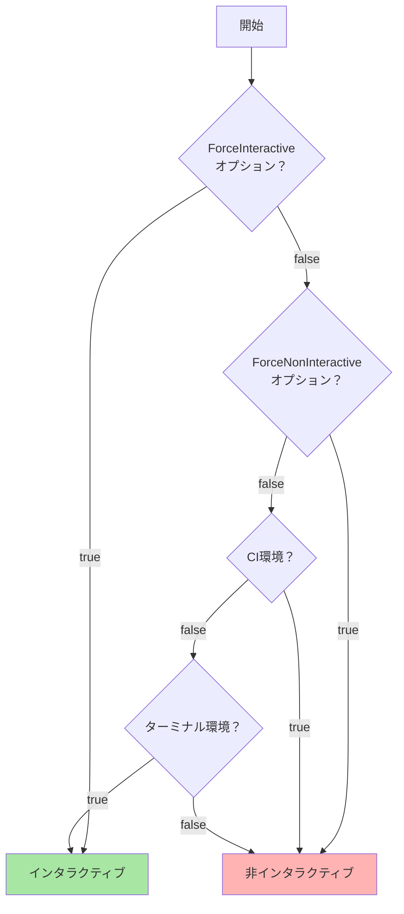
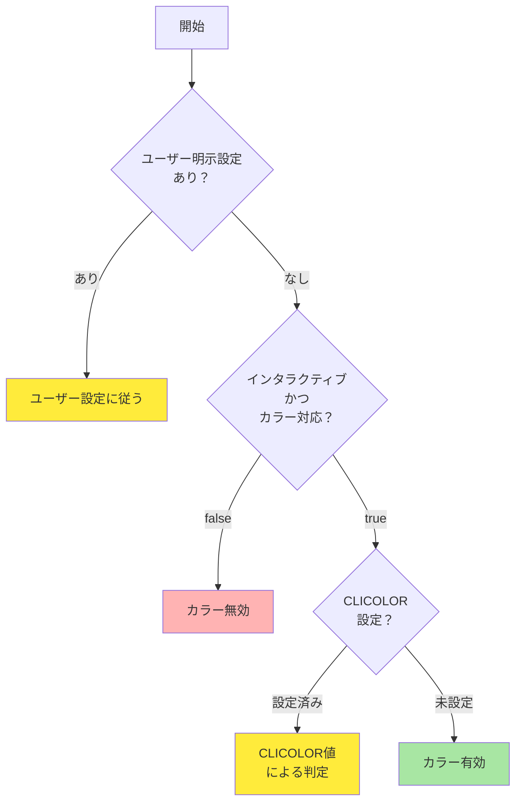
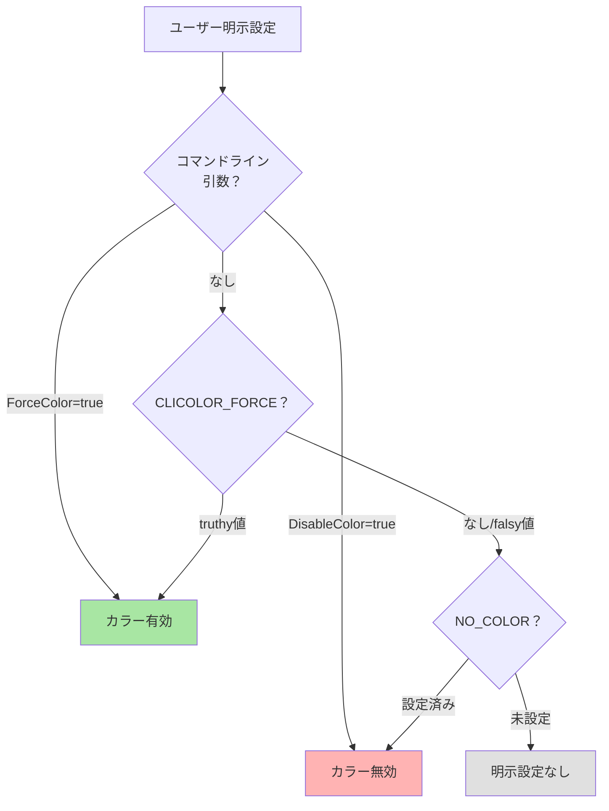

# ターミナル機能判定ロジック

このドキュメントは、Go Safe Command Runnerにおけるターミナル機能の判定ロジックについて説明します。

## 概要

ターミナル機能判定は以下の2つの主要な機能を提供します：

1. **インタラクティブモード判定** - 現在の環境がユーザーとの対話的な操作に適しているか
2. **カラー表示判定** - カラー出力を行うべきかどうか

これらの判定は環境変数、コマンドライン引数、ターミナルの機能などを総合的に考慮して行われます。

## インタラクティブモード判定フロー



### インタラクティブモード判定の詳細

#### 1. コマンドライン引数による強制指定（最優先）
- `ForceInteractive = true`: 強制的にインタラクティブモードとして扱う
- `ForceNonInteractive = true`: 強制的に非インタラクティブモードとして扱う

#### 2. CI環境の検出
以下の環境変数が設定されている場合、CI環境と判定して非インタラクティブモードとします：

- `CI` - 値が `false`, `0`, `no` 以外の場合
- `CONTINUOUS_INTEGRATION`
- `GITHUB_ACTIONS`
- `TRAVIS`
- `CIRCLECI`
- `JENKINS_URL`
- `BUILD_NUMBER`
- `GITLAB_CI`
- `APPVEYOR`
- `BUILDKITE`
- `DRONE`
- `TF_BUILD`

#### 3. ターミナル環境の検出
以下の条件でターミナル環境かどうかを判定します：

1. **TTY接続の確認**: stdout または stderr のいずれかがTTYに接続されている
2. **TERM環境変数**: 設定されており、値が `dumb` 以外である

## カラー表示判定フロー



### カラー表示判定の詳細

#### 1. ユーザー明示設定の判定



#### 2. カラー対応ターミナルの検出
`TERM` 環境変数を確認し、以下のターミナルタイプをサポート：

- `xterm` 系
- `screen` 系
- `tmux` 系
- `rxvt` 系
- `vt100`, `vt220`
- `ansi`
- `linux`
- `cygwin`
- `putty`

`TERM=dumb` の場合はカラー非対応と判定します。

#### 3. 優先順位

1. **コマンドライン引数** (最優先)
   - `--force-color` または `--disable-color`

2. **CLICOLOR_FORCE**
   - 値が `1`, `true`, `yes` (大文字小文字不問) の場合、全ての条件を上書きしてカラー有効

3. **NO_COLOR**
   - 値に関係なく設定されている場合、カラー無効

4. **CLICOLOR** (インタラクティブモード時のみ)
   - 値が `1`, `true`, `yes` の場合、カラー有効
   - その他の値またはインタラクティブモード以外では無視

5. **自動検出** (デフォルト)
   - インタラクティブかつカラー対応ターミナルの場合、カラー有効

## 実装構造

### 主要なコンポーネント

1. **Capabilities** (`capabilities.go`)
   - 全体的な判定ロジックの統合
   - `IsInteractive()`, `SupportsColor()` メソッドの提供

2. **InteractiveDetector** (`detector.go`)
   - インタラクティブモード判定
   - CI環境検出
   - ターミナル環境検出

3. **ColorDetector** (`color.go`)
   - ターミナルのカラー対応検出

4. **UserPreference** (`preference.go`)
   - ユーザー明示設定の管理
   - 環境変数とコマンドライン引数の処理

### 設定オプション

```go
type Options struct {
    PreferenceOptions PreferenceOptions
    DetectorOptions   DetectorOptions
}

type PreferenceOptions struct {
    ForceColor   bool
    DisableColor bool
}

type DetectorOptions struct {
    ForceInteractive    bool
    ForceNonInteractive bool
}
```

## 使用例

```go
// 基本的な使用方法
options := terminal.Options{
    PreferenceOptions: terminal.PreferenceOptions{
        ForceColor: false,
        DisableColor: false,
    },
    DetectorOptions: terminal.DetectorOptions{
        ForceInteractive: false,
        ForceNonInteractive: false,
    },
}

capabilities := terminal.NewCapabilities(options)

if capabilities.IsInteractive() {
    // インタラクティブな処理
}

if capabilities.SupportsColor() {
    // カラー出力
}
```

## 注意事項

1. **CLICOLOR vs CLICOLOR_FORCE**
   - `CLICOLOR` はインタラクティブモード時のみ有効
   - `CLICOLOR_FORCE` は全ての条件を上書き

2. **NO_COLOR**
   - 値に関係なく、環境変数として設定されていれば無効化される
   - [NO_COLOR](https://no-color.org/) 標準に準拠

3. **CI環境**
   - CI環境では基本的に非インタラクティブモード
   - ただし、`ForceInteractive` で上書き可能

4. **TTY検出**
   - stdout または stderr のいずれかがTTYであれば十分
   - 統合開発環境での使用を考慮
