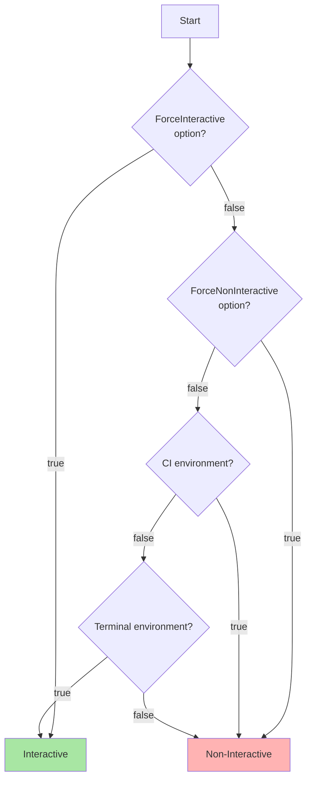
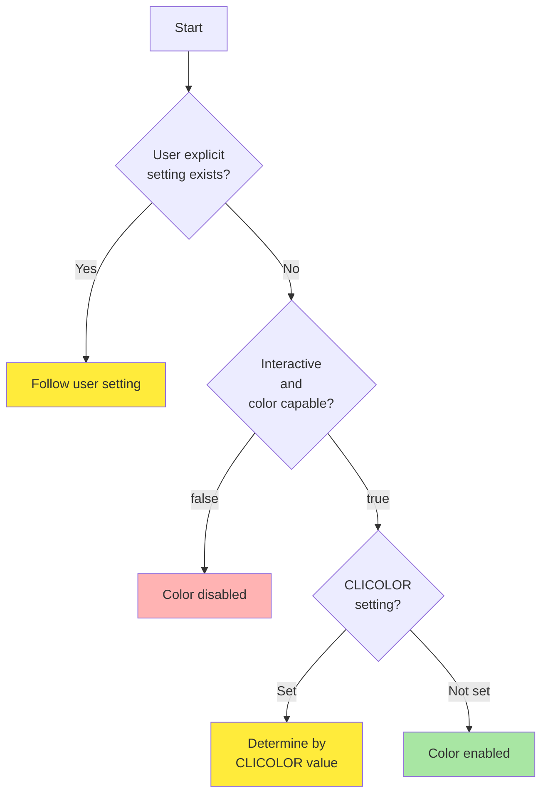
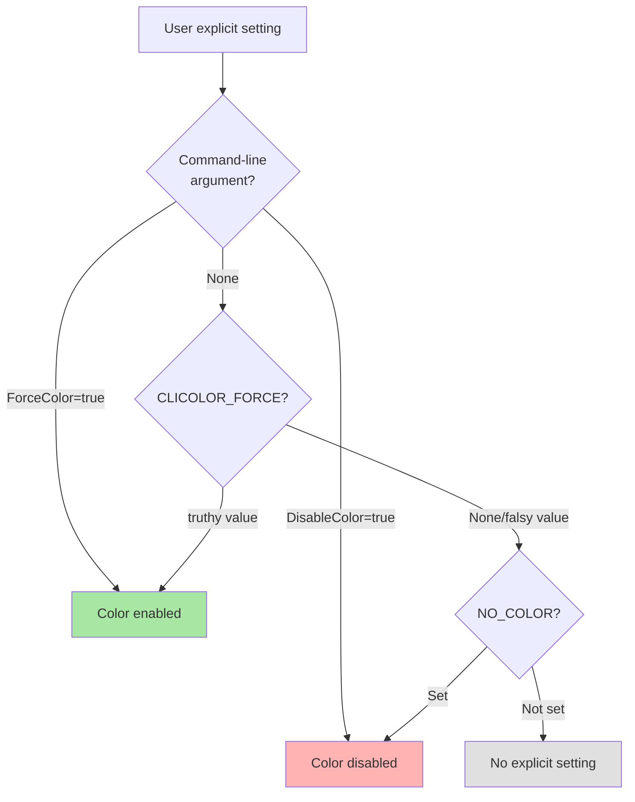

# Terminal Capability Detection Logic

This document explains the terminal capability detection logic in Go Safe Command Runner.

## Overview

Terminal capability detection provides two main features:

1. **Interactive Mode Detection** - Whether the current environment is suitable for interactive user operations
2. **Color Display Detection** - Whether color output should be enabled

These determinations are made by comprehensively considering environment variables, command-line arguments, and terminal capabilities.

## Interactive Mode Detection Flow



### Interactive Mode Detection Details

#### 1. Forced Specification via Command-Line Arguments (Highest Priority)
- `ForceInteractive = true`: Forcibly treat as interactive mode
- `ForceNonInteractive = true`: Forcibly treat as non-interactive mode

#### 2. CI Environment Detection
When the following environment variables are set, they are detected as CI environments and set to non-interactive mode:

- `CI` - When value is other than `false`, `0`, `no`
- `CONTINUOUS_INTEGRATION`
- `GITHUB_ACTIONS`
- `TRAVIS`
- `CIRCLECI`
- `JENKINS_URL`
- `BUILD_NUMBER`
- `GITLAB_CI`
- `APPVEYOR`
- `BUILDKITE`
- `DRONE`
- `TF_BUILD`

#### 3. Terminal Environment Detection
Terminal environment is determined by the following conditions:

1. **TTY Connection Check**: Either stdout or stderr is connected to a TTY
2. **TERM Environment Variable**: Set and value is other than `dumb`

## Color Display Detection Flow



### Color Display Detection Details

#### 1. User Explicit Setting Detection



#### 2. Color-Capable Terminal Detection
Check the `TERM` environment variable and support the following terminal types:

- `xterm` family
- `screen` family
- `tmux` family
- `rxvt` family
- `vt100`, `vt220`
- `ansi`
- `linux`
- `cygwin`
- `putty`

When `TERM=dumb`, it is determined as non-color-capable.

#### 3. Priority Order

1. **Command-Line Arguments** (Highest Priority)
   - `--force-color` or `--disable-color`

2. **CLICOLOR_FORCE**
   - When value is `1`, `true`, `yes` (case-insensitive), overrides all conditions to enable color

3. **NO_COLOR**
   - When set regardless of value, disables color

4. **CLICOLOR** (Only in interactive mode)
   - When value is `1`, `true`, `yes`, enables color
   - Ignored for other values or in non-interactive mode

5. **Auto-detection** (Default)
   - When interactive and color-capable terminal, enables color

## Implementation Structure

### Main Components

1. **Capabilities** (`capabilities.go`)
   - Integration of overall detection logic
   - Provides `IsInteractive()`, `SupportsColor()` methods

2. **InteractiveDetector** (`detector.go`)
   - Interactive mode detection
   - CI environment detection
   - Terminal environment detection

3. **ColorDetector** (`color.go`)
   - Terminal color capability detection

4. **UserPreference** (`preference.go`)
   - User explicit setting management
   - Processing of environment variables and command-line arguments

### Configuration Options

```go
type Options struct {
    PreferenceOptions PreferenceOptions
    DetectorOptions   DetectorOptions
}

type PreferenceOptions struct {
    ForceColor   bool
    DisableColor bool
}

type DetectorOptions struct {
    ForceInteractive    bool
    ForceNonInteractive bool
}
```

## Usage Examples

```go
// Basic usage
options := terminal.Options{
    PreferenceOptions: terminal.PreferenceOptions{
        ForceColor: false,
        DisableColor: false,
    },
    DetectorOptions: terminal.DetectorOptions{
        ForceInteractive: false,
        ForceNonInteractive: false,
    },
}

capabilities := terminal.NewCapabilities(options)

if capabilities.IsInteractive() {
    // Interactive processing
}

if capabilities.SupportsColor() {
    // Color output
}
```

## Important Notes

1. **CLICOLOR vs CLICOLOR_FORCE**
   - `CLICOLOR` is only effective in interactive mode
   - `CLICOLOR_FORCE` overrides all conditions

2. **NO_COLOR**
   - Disabled when set as environment variable, regardless of value
   - Complies with [NO_COLOR](https://no-color.org/) standard

3. **CI Environment**
   - Basically non-interactive mode in CI environments
   - However, can be overridden with `ForceInteractive`

4. **TTY Detection**
   - Either stdout or stderr being TTY is sufficient
   - Considers usage in integrated development environments
