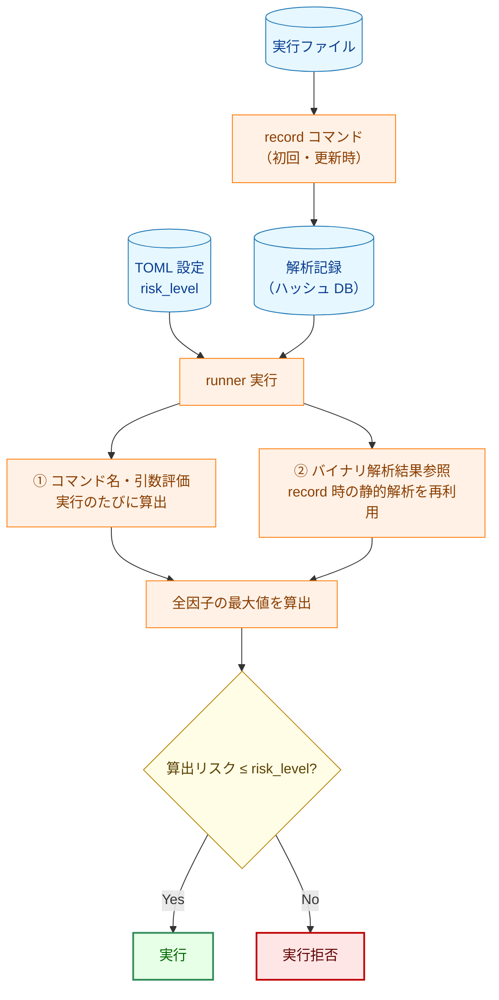
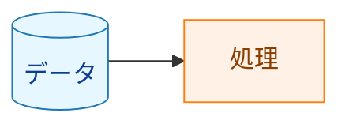

# リスク評価ガイド

`risk_level` の設定値を正しく選ぶためには、runner がどのように実行コマンドのリスクを算出するかを理解する必要があります。このドキュメントでは、リスク算出の仕組みと設定の根拠となる情報の確認方法を説明します。

## 1. リスク評価の概要

`risk_level` は「このコマンドに許可するリスクの**上限**」を宣言するものです。runner は実行前にコマンドのリスクを自動算出し、算出値が `risk_level` を超えていると実行を拒否します。



**凡例（Legend）**



リスク算出には **2 つの独立した源** があります。最終リスクはすべての因子の最大値です。

## 2. リスクレベルの定義

| レベル | 意味 | 設定可否 |
|--------|------|---------|
| `low` | 読み取り専用・副作用なし | ✅ 設定可（デフォルト） |
| `medium` | ネットワーク通信・ファイル変更・システム変更 | ✅ 設定可 |
| `high` | 破壊的操作・権限昇格・動的コード実行 | ✅ 設定可 |
| `critical` | 権限昇格コマンドの使用（自動付与） | ❌ 設定不可・即時ブロック |

> `critical` は TOML に記述できません。`sudo`/`su`/`doas` 等の検出時に自動付与され、常に実行拒否になります。

## 3. リスク算出ルール

### 3.1 コマンド名・引数ベースの評価（実行のたびに評価）

| 検出内容 | 算出リスク |
|----------|-----------|
| `sudo`/`su`/`doas` 等の権限昇格コマンド | `critical` |
| `rm -rf`/`dd` 等の破壊的ファイル操作 | `high` |
| `run_as_user`/`run_as_group` による権限変更 | `high` |
| `systemctl`/`apt`/`dpkg` 等のシステム変更コマンド | `medium` |
| 上記以外 | `low` |

### 3.2 バイナリ解析ベースの評価（record 時に静的解析・結果を再利用）

実行ファイルのバイナリを静的に解析し、どのシステムコールや API を呼び出す可能性があるかを判定します。

| 検出内容 | 算出リスク | 理由 |
|----------|-----------|------|
| `socket`/`connect`/`bind`/`accept`/`send`/`recv` 等のネットワーク API | `medium` | ネットワーク通信の可能性あり |
| `getaddrinfo`/`gethostbyname` 等の DNS 解決 API | `medium` | ネットワーク通信の可能性あり |
| Unix ドメインソケット | `medium` | プロセス間通信の可能性あり |
| `dlopen`/`dlsym`/`dlvsym`（動的ライブラリ読み込み） | `high` | 実行時の任意コードロードが可能 |
| `execve`/`execveat`（別プロセス起動） | `high` | 任意のコマンドを起動できる |
| `mprotect`+`PROT_EXEC`/`pkey_mprotect`（動的コード実行） | `high` | JIT コンパイル等による任意コード実行が可能 |
| 上記いずれも検出されない | `low` | |

**解析方法**: ELF バイナリの動的シンボルテーブル（`.dynsym`）と機械語命令を静的にスキャンします。バイナリが依存する共有ライブラリも再帰的に解析します（libc 等の OS ABI ライブラリは除く）。

### 3.3 フェイルセーフ（解析エラー・不整合）

解析の信頼性が確認できない場合、すべて `high` 扱いになります（安全側に倒す設計）。

| 条件 | 算出リスク |
|------|-----------|
| 解析記録が存在しない | `high` |
| ディスク上のバイナリとハッシュが一致しない | `high` |
| 解析記録のスキーマバージョンが古い | `high` |
| バイナリ解析中にエラーが発生 | `high` |

## 4. 算出リスクの確認方法

設定した `risk_level` の根拠を確認するには、`record --debug-info` を使います。

```bash
# 詳細な解析情報付きで記録
record --debug-info -d /path/to/hashes /usr/bin/mycommand

# dry-run で実際の算出リスクを確認
runner -config config.toml -dry-run
```

`--debug-info` を付けると、解析記録に以下の情報が含まれます:

- 検出されたネットワーク API シンボルとその出所（バイナリ本体か依存ライブラリか）
- 検出されたシステムコール番号
- 解析の判定根拠（`determination_stats`）

## 5. risk_level の設定指針

### 原則

- **最小権限**: 実際の動作に必要な最低限のリスクレベルを設定する
- **明示的設定**: デフォルト（`low`）に頼らず、意図を明記する

### バイナリ解析でネットワーク検出された場合

バイナリ解析が `medium` を算出した場合、`risk_level` に `medium` 以上を設定しなければ runner に実行を拒否されます。`record --debug-info` で何が検出されたかを確認し、対処を判断します:

| 状況 | 対処 |
|------|------|
| 実際にネットワークを使うコマンド（wget, curl 等） | `medium` を設定 |
| ネットワーク API を持つが実際には使わないコマンド | `medium` を設定（必須。低い値では実行できない） |
| 誤検知と判断できる場合 | 開発チームに報告して調査。調査結果が出るまでは `medium` で運用する |

### 設定例

```toml
# 読み取り専用（low）
[[groups.commands]]
name = "show_status"
cmd = "/usr/bin/systemctl"
args = ["status", "myapp"]
risk_level = "low"       # ← systemctl status は読み取りのみ
                         #   ただし、解析でネットワーク検出される可能性あり → medium を推奨

# ネットワーク通信あり（medium）
[[groups.commands]]
name = "fetch_config"
cmd = "/usr/bin/curl"
args = ["-o", "/etc/myapp/config.json", "https://config.example.com/config.json"]
risk_level = "medium"    # curl はネットワーク API を使用 → medium

# 動的ロードあり（high）
[[groups.commands]]
name = "run_plugin"
cmd = "/usr/local/bin/plugin-runner"
args = ["--plugin", "myplugin.so"]
risk_level = "high"      # dlopen による動的ロード → high

# システム変更（high）
[[groups.commands]]
name = "install_deps"
cmd = "/usr/bin/apt-get"
args = ["install", "-y", "libfoo"]
run_as_user = "root"
risk_level = "high"      # apt + root 権限 → high
```

## 6. よくある質問

### Q. `risk_level` を省略したらどうなりますか？

デフォルト値 `"low"` が使用されます。バイナリ解析でネットワーク通信が検出されると `medium` が算出され、`low` を超えるため実行が拒否されます。ネットワーク通信をするコマンドには明示的に `"medium"` を設定してください。

### Q. `critical` を設定したいのですが？

`"critical"` は TOML に設定できません（起動時エラーになります）。`critical` は `sudo`/`su` 等の権限昇格コマンドが検出された場合に自動付与されるレベルで、常に実行拒否になります。

### Q. 解析記録が見つからないと言われます

`record` コマンドでハッシュを記録していない可能性があります。実行ファイルと依存ライブラリのハッシュを記録してください:

```bash
record -d /path/to/hashes /usr/bin/mycommand
```

システムパッケージを更新した場合は再記録が必要です。
