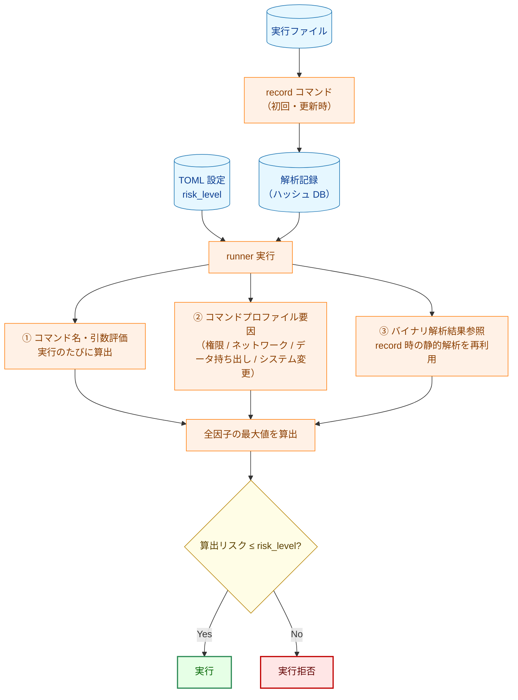
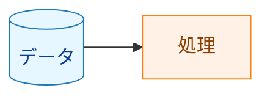

# リスク評価ガイド

`risk_level` の設定値を正しく選ぶためには、runner がどのように実行コマンドのリスクを算出するかを理解する必要があります。このドキュメントでは、リスク算出の仕組みと設定の根拠となる情報の確認方法を説明します。

## 1. リスク評価の概要

`risk_level` は「このコマンドに許可するリスクの**上限**」を宣言するものです。runner は実行前にコマンドのリスクを自動算出し、算出値が `risk_level` を超えていると実行を拒否します。



**凡例（Legend）**



リスク算出は **複数の独立した因子** を用います。すなわち、コマンド名・引数、コマンドプロファイル要因（権限・ネットワーク・データ持ち出し・システム変更）、およびバイナリ解析結果です。最終的な実効リスクは **これらすべての因子の最大値** であり、コマンドプロファイル要因を含むいずれか一つの高リスク因子があれば、他の因子によらず結果が引き上げられます。

## 2. リスクレベルの定義

| レベル | 意味 | 設定可否 |
|--------|------|---------|
| `low` | 読み取り専用・副作用なし | ✅ 設定可（デフォルト） |
| `medium` | ネットワーク通信・ファイル変更・システム変更 | ✅ 設定可 |
| `high` | 破壊的操作・システム/サービス変更・動的/任意コード実行 | ✅ 設定可 |
| `critical` | 権限昇格コマンドの使用（自動付与） | ❌ 設定不可・即時ブロック |

> `critical` は TOML に記述できません。`sudo`/`su`/`doas` 等の検出時に自動付与され、常に実行拒否になります。

## 3. リスク算出ルール

### 3.1 コマンド名・引数ベースの評価（実行のたびに評価）

runner はコマンドを解決済み絶対パスと basename（シンボリックリンクは解決する）で照合するため、`rm` でも `/usr/bin/rm` でも認識します。

| 検出内容 | 算出リスク |
|----------|-----------|
| `sudo`/`su`/`doas` 等の権限昇格コマンド | `critical` |
| `rm -rf`/`dd`/`chmod -R 777` 等の破壊的ファイル操作 | `high` |
| ファイルシステム/パーティション操作ツール: `mkfs`/`mkfs.*`、`fdisk` 等 | `high` |
| シェル・インタプリタ・ビルド/タスクランナー: `bash`/`sh`/`python`/`node`/`ruby`/`perl`/`make`/`cmake`/`gradle` 等 | `high` |
| `systemctl` の変更系サブコマンド（`start`/`stop`/`restart`/`enable`/`disable` 等） | `high` |
| `service`（全アクション。未検証の init スクリプトを実行するため） | `high` |
| `systemctl` の読み取り専用サブコマンド（`status`/`show`/`is-active` 等） | `medium`（下限） |
| その他のシステム変更コマンド（`mount`/`crontab`/`chkconfig`、`apt install` などのパッケージ導入/削除） | `medium` |
| ネットワークコマンド: `curl`/`wget`/`ssh`/`scp` 等 | `medium` |
| 上記以外 | `low` |

> シェル・インタプリタ・ビルド/タスクランナーは、任意コード（スクリプト、インライン `-c`/`-e` 片、ビルドターゲット）を実行できるため、引数によらず `high` です。
> 不明・判別不能な `systemctl` サブコマンドは（フェイルセーフのため）`high` 扱いとし、暗黙に格下げしません。

### 3.2 coreutils 単一バイナリの分類

coreutils を専用ディレクトリの単一マルチコールバイナリとして配布するディストリビューション（例: Ubuntu 26.04+ の Rust coreutils バイナリ `/usr/lib/cargo/bin/coreutils`）では、各アプレットが 1 つの実行ファイル＝1 つのハッシュを共有します。そのディレクトリ配下に解決されたコマンドについては、共有バイナリの解析シグナルではなく **サブコマンド（アプレット）**（`coreutils <applet> ...` のマルチコール形式を含む）からリスクを分類します。

| coreutils サブコマンドの分類 | 算出リスク |
|------------------------------|-----------|
| 既知の安全な読み取り専用・情報系サブコマンド（`echo`、`cat`、`ls`、`mkdir` 等） | `low` |
| 破壊的サブコマンド（`rm`、`dd`、`shred`、`truncate` 等）、または不明・判別不能なサブコマンド（フェイルセーフ） | `high` |

安全リストに載るサブコマンドのみが `low` で、それ以外（破壊的アプレットを隠し得る解析不能なマルチコール呼び出しを含む）はすべて `high` です。`medium` の coreutils 区分はありません。setuid/setgid ビットを持つバイナリも `high` です。この検証済み coreutils バイナリについては、安全なサブコマンドではバイナリ解析次元（§3.3）を抑制し、共有マルチコールバイナリがネットワークや `exec` のシンボルをリンクしていても、例えば `echo` は `low` のままになります。ハッシュ検証は依然として必須であり、抑制されるのはバイナリ解析シグナルのみで、同一性の検証は抑制されません。

（この仕組みは統合 coreutils ディレクトリに特有です。BusyBox など他のマルチコールバイナリは対象外で、§3.1・§3.3 の一般規則で評価されます。）

### 3.3 バイナリ解析ベースの評価（record 時に静的解析・結果を再利用）

実行ファイルのバイナリを静的に解析し、どのシステムコールや API を呼び出す可能性があるかを判定します。

| 検出内容 | 算出リスク | 理由 |
|----------|-----------|------|
| `socket`/`connect`/`bind`/`accept`/`send`/`recv` 等のソケット API | `medium` | ネットワーク通信またはプロセス間通信の可能性あり（ソケット種別は区別しない） |
| `getaddrinfo`/`gethostbyname` 等の DNS 解決 API | `medium` | ネットワーク通信の可能性あり |
| `dlopen`/`dlsym`/`dlvsym`（動的ライブラリ読み込み） | `high` | 実行時の任意コードロードが可能 |
| `execve`/`execveat`（別プロセス起動） | `high` | 任意のコマンドを起動できる |
| `mprotect`+`PROT_EXEC`/`pkey_mprotect`（動的コード実行） | `high` | JIT コンパイル等による任意コード実行が可能 |
| 上記いずれも検出されない | `low` | |

**解析方法**: Linux では ELF バイナリの動的シンボルテーブル（`.dynsym`）と機械語命令を静的にスキャンします。macOS では同等の Mach-O 構造を解析します。バイナリが依存する共有ライブラリも再帰的に解析します（libc 等の OS ABI ライブラリは除く）。

### 3.4 フェイルクローズ挙動（同一性が確認できない場合・不整合）

runner はフェイルクローズです。バイナリの同一性が確認できないコマンドは、（`risk_level` によらず）**拒否**され、何らかのリスクレベルで実行されることはありません。失敗は次の 2 系統に分かれます。

- **拒否（Blocking）**: コマンドを拒否します。通常実行では拒否として報告され、dry-run では拒否予告として表示されます。
- **エラー**: 真に予期しない内部障害は、実行をエラーで中止します。

| 条件 | 挙動 |
|------|------|
| この構成でバイナリ解析・ファイル検証が無効 | **拒否**（Blocking。バイナリの同一性を確認できない） |
| バイナリのハッシュが未計算（同一性不明） | **拒否**（Blocking） |
| 解析記録が存在しない | **拒否**（Blocking） |
| ディスク上のバイナリとハッシュが一致しない | **拒否**（Blocking） |
| 解析記録のスキーマバージョンが古い | **拒否**（Blocking） |
| 解析結果が不確定 | **拒否**（Blocking） |
| シンボリックリンクの解決に失敗（実体を解決できない） | **拒否**（Blocking） |
| 予期しない記録読み込みエラー | **エラー**（実行を中止） |

> 拒否（Blocking）は `risk_level` とは独立です。`risk_level = "high"` であっても、同一性を検証できなかったコマンドの実行は許可されません。これは意図的な設計であり、runner は確認できないバイナリを実行してはなりません。

## 4. 算出リスクの確認方法

設定した `risk_level` の根拠を確認するには、`record --debug-info` を使います。

```bash
# 詳細な解析情報付きで記録
record --debug-info -d /path/to/hashes /usr/bin/mycommand

# dry-run で実際の算出リスクを確認
runner -config config.toml -dry-run
```

`--debug-info` を付けると、解析記録に以下の情報が含まれます:

- 検出されたネットワーク API シンボルとその出所（バイナリ本体か依存ライブラリか）
- 検出されたシステムコール番号
- 解析の判定根拠（`determination_stats`）

dry-run は許可/拒否の判定も予告します。通常実行と同じ読み取り専用の評価を行い、各コマンドについて許可されるか拒否されるか（同一性を検証できないバイナリの Blocking 拒否を含む）を報告します。

## 5. risk_level の設定指針

### 原則

- **最小権限**: 実際の動作に必要な最低限のリスクレベルを設定する
- **明示的設定**: デフォルト（`low`）に頼らず、意図を明記する

### バイナリ解析でネットワーク検出された場合

バイナリ解析が `medium` を算出した場合、`risk_level` に `medium` 以上を設定しなければ runner に実行を拒否されます。`record --debug-info` で何が検出されたかを確認し、対処を判断します:

| 状況 | 対処 |
|------|------|
| 実際にネットワークを使うコマンド（wget, curl 等） | `medium` を設定 |
| ネットワーク API を持つが実際には使わないコマンド | `medium` を設定（必須。低い値では実行できない） |
| 誤検知と判断できる場合 | 開発チームに報告して調査。調査結果が出るまでは `medium` で運用する |

### 設定例

```toml
# 読み取り専用のシステム照会（medium）
[[groups.commands]]
name = "show_status"
cmd = "/usr/bin/systemctl"
args = ["status", "myapp"]
risk_level = "medium"    # systemctl status は読み取りのみだが low ではない
                         # （ユニット設定を露出し得るため下限あり）。"low" では拒否される

# ネットワーク通信あり（medium）
[[groups.commands]]
name = "fetch_config"
cmd = "/usr/bin/curl"
args = ["-o", "/etc/myapp/config.json", "https://config.example.com/config.json"]
risk_level = "medium"    # curl はネットワーク API を使用 → medium

# 動的ロードあり（high）
[[groups.commands]]
name = "run_plugin"
cmd = "/usr/local/bin/plugin-runner"
args = ["--plugin", "myplugin.so"]
risk_level = "high"      # dlopen による動的ロード → high

# パッケージ導入（medium）
[[groups.commands]]
name = "install_deps"
cmd = "/usr/bin/apt-get"
args = ["install", "-y", "libfoo"]
run_as_user = "root"
risk_level = "medium"    # apt の install/remove はシステム変更 → medium
```

## 6. よくある質問

### Q. `risk_level` を省略したらどうなりますか？

デフォルト値 `"low"` が使用されます。バイナリ解析でネットワーク通信が検出されると `medium` が算出され、`low` を超えるため実行が拒否されます。ネットワーク通信をするコマンドには明示的に `"medium"` を設定してください。

### Q. `critical` を設定したいのですが？

`"critical"` は TOML に設定できません（起動時エラーになります）。`critical` は `sudo`/`su` 等の権限昇格コマンドが検出された場合に自動付与されるレベルで、常に実行拒否になります。

### Q. `risk_level` に `"unknown"` を設定できますか？

いいえ。`risk_level = "unknown"` は起動時に設定エラーとして拒否されます。`"low"`/`"medium"`/`"high"` のいずれかを使う（あるいはキーを省略して `"low"` を既定とする）でください。

### Q. 解析記録が見つからないと言われます

`record` コマンドでハッシュを記録していない可能性があります。実行ファイルのハッシュを記録してください:

```bash
record -d /path/to/hashes /usr/bin/mycommand
```

システムパッケージを更新した場合は再記録が必要です。

## 7. 脅威モデルと限界

リスク評価が何を守り、何を守らないかを理解することは、正しく設定するうえで不可欠です。

- **ブロックリスト方式**: コマンド名・引数の評価（§3.1）は **ブロックリスト** です。既知の危険なコマンドやパターンを認識してリスクを引き上げます。どのリストにも該当しないコマンドは、この次元では `low` 扱いになります。したがって、ブロックリスト単独では網羅的ではありません。
- **許可リストとハッシュ固定が主たる制御**: ブロックリストは主防御ではなくバックストップです。runner の主たる保証は、**許可コマンドの許可リスト（allowlist）とハッシュ固定**（記録された解析記録）から得られます。ハッシュが記録と一致する検証済みバイナリだけが実行されます（§3.4）。新規・未知の攻撃ベクトルは、この要件によって封じ込められます。検証できないバイナリは `risk_level` によらず拒否されます。
- **basename 照合の限界**: 検出は basename と解決済みシンボリックリンクで照合します。これは **完全一致であり、部分一致（部分文字列一致）ではありません**。`lsrm` は `rm` とは扱われず、`systemctl-helper` は `systemctl` とは扱われません。逆に、危険なバイナリを別の basename にリネームしたコピーは、名前だけでなくシンボリックリンクの解決とハッシュ検証を経て初めて照合されます。
- **`output_file` は対象外**: リスク評価は実行されるコマンドを評価します。`output_file` で設定する出力リダイレクト先は、このリスク算出の対象ではありません。周辺の設定とファイルシステムの権限で保護してください。
- **ハードリンクとパスのすり替え**: ハッシュ固定はファイル内容に束縛されるため、検証済みバイナリへのハードリンクは内容もハッシュも同一です。パスのすり替え（検証後にそのパスのファイルを差し替える）は、実行をパス名ではなく検証済みファイルに束縛すること（TOCTOU 安全な実行）で封じます。
- **権限/root 制御との関係**: リスク評価は、runner のユーザー/グループ切り替えや root 取り扱いの制御とは独立かつ相補的です。コマンドを `root` で実行しても、それ自体では算出リスクレベルは変わりません。権限昇格は別途検出します（`sudo`/`su`/`doas` トークン → `critical`）。1 つのコマンド名に複数の規則が該当する場合は、**最も高い** リスクが採用されます（実効リスクは全因子の最大値）。したがって、より具体的な危険分類が、より一般的な分類によって引き下げられることはありません。

## 8. 移行ノート

以前のバージョンからアップグレードする場合、いくつかのコマンドは以前より高いリスクで評価されるようになりました。既存の `risk_level` 設定を以下の変更点と照らし合わせて見直し、デプロイ前に `--dry-run` で確認してください。

- **AI サービスコマンド**（`claude`、`gemini` 等）: `high` になりました（以前は `medium`）。常に外部 API と通信し、データを持ち出す可能性があるためです。
- **`systemctl` の変更系サブコマンド**（`start`/`stop`/`restart`/`enable`/`disable` 等）: `high` になりました。読み取り専用サブコマンド（`status`/`show` 等）は low より上の下限で評価されます（§3.1 の表を参照）。
- **`service`**: 全アクションで `high` になりました（未検証の init スクリプトを実行するため）。
- **絶対パス指定の破壊的操作**（`/usr/bin/rm -rf ...` 等）: basename 指定と同様に検出されるようになりました（`high`）。
- **シェル・インタプリタ・ビルド/タスクランナー**（`bash`/`python`/`node`/`make` 等）: 引数によらず `high` になりました（任意コード実行）。
- **パッケージスクリプトランナー**（`npm run`/`npx`/`yarn <script>`/`pnpm run`）: `high`。
- **`risk_level = "unknown"`**: 設定エラーとして拒否されるようになりました（以前は受理）。`low`/`medium`/`high` を使ってください。
- **バイナリ解析・ファイル検証が無効**: Blocking 拒否になりました（以前は続行を許可）。同一性を確認できないバイナリは実行されません。
- **ラッパーコマンド**（`env`/`timeout`/`nice` 等）: ラップされた内部コマンドが評価・ゲートされます。内部コマンドを抽出できないラッパー、またはローダ制御の環境変数（`LD_PRELOAD`、`DYLD_*` 等）を渡すラッパーは拒否されます。（権限昇格ラッパー `sudo`/`su`/`doas` はこの方式ではゲートされず、`critical` のまま常に拒否されます。）
- **パッケージマネージャ**: システム変更の例として個々のツール名を列挙しなくなりました。パッケージマネージャは汎用的に扱います（`apt`/`yum`/`dnf`/... の install/remove → `medium`）。
