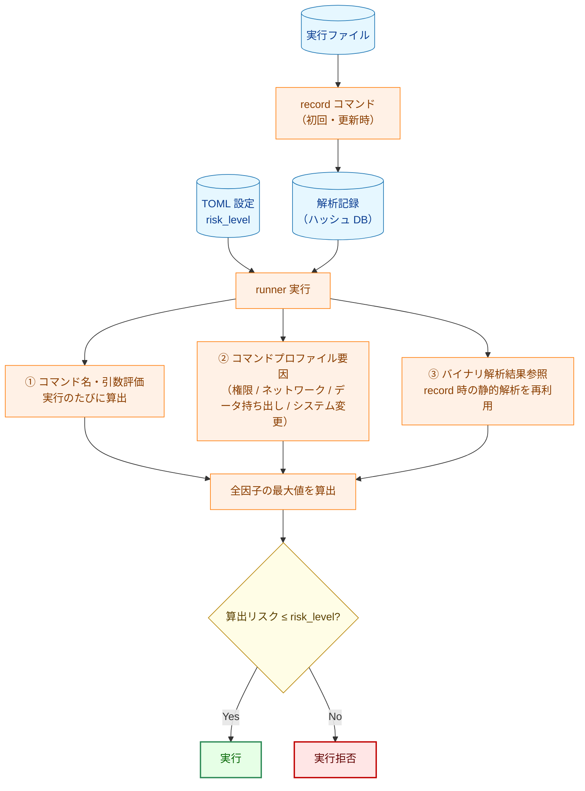
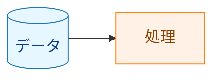

# リスク評価ガイド

`risk_level` の設定値を正しく選ぶためには、runner がどのように実行コマンドのリスクを算出するかを理解する必要があります。このドキュメントでは、リスク算出の仕組みと設定の根拠となる情報の確認方法を説明します。

## 1. リスク評価の概要

`risk_level` は「このコマンドに許可するリスクの**上限**」を宣言するものです。runner は実行前にコマンドのリスクを自動算出し、算出値が `risk_level` を超えていると実行を拒否します。



**凡例（Legend）**



リスク算出は **複数の独立した因子** を用います。すなわち、コマンド名・引数、コマンドプロファイル要因（権限・ネットワーク・データ持ち出し・システム変更）、およびバイナリ解析結果です。最終的な実効リスクは **これらすべての因子の最大値** であり、コマンドプロファイル要因を含むいずれか一つの高リスク因子があれば、他の因子によらず結果が引き上げられます。

## 2. リスクレベルの定義

| レベル | 意味 | 設定可否 |
|--------|------|---------|
| `low` | 読み取り専用・副作用なし | ✅ 設定可（デフォルト） |
| `medium` | ネットワーク通信・ファイル変更・システム変更 | ✅ 設定可 |
| `high` | 破壊的操作・システム/サービス変更・動的/任意コード実行 | ✅ 設定可 |
| `critical` | 権限昇格コマンドの使用（自動付与） | ❌ 設定不可・即時ブロック |

> `critical` は TOML に記述できません。`sudo`/`su`/`doas` 等の検出時に自動付与され、常に実行拒否になります。

## 3. リスク算出ルール

### 3.1 コマンド名・引数ベースの評価（実行のたびに評価）

runner はコマンドを解決済み絶対パスと basename（シンボリックリンクは解決する）で照合するため、`rm` でも `/usr/bin/rm` でも認識します。

| 検出内容 | 算出リスク |
|----------|-----------|
| `sudo`/`su`/`doas` 等の権限昇格コマンド | `critical` |
| ディスク・パーティション/ファイルシステム破壊系: `mkfs`/`mkfs.*`/`fdisk`/`parted`/`fsck`/`wipefs`/`blkdiscard`、LVM 破壊系（`lvremove` 等） | `high` |
| カーネル・アカウント・ブート・ファイアウォール・能力付与・信頼境界置換・ジョブ/遅延実行系: `insmod`/`modprobe`/`useradd`/`passwd`/`grub-install`/`iptables`/`setcap`/`update-alternatives`/`ldconfig`/`crontab`/`at`/`systemd-run` 等 | `high` |
| シェル・インタプリタ・ビルド/タスクランナー: `bash`/`sh`/`python`/`node`/`ruby`/`perl`/`make`/`cmake`/`gradle` 等 | `high` |
| パッケージマネージャ: `apt`/`apt-get`/`yum`/`dnf`/`zypper`/`pacman`/`brew`/`pip`/`npm`/`yarn`/`dpkg`/`rpm`（サブコマンド・引数によらず） | `high` |
| `systemctl`（全サブコマンド。照会系 `status`/`show`/`is-active` 等を含む） | `high` |
| `service`（全アクション。未検証の init スクリプトを実行するため） | `high` |
| 限定スコープのシステム変更コマンド: `mount`/`umount`、ネットワーク設定 `ip`/`ifconfig`/`route`、LVM 作成・設定系（`lvcreate` 等） | `medium` |
| ネットワークコマンド: `curl`/`wget`/`ssh`/`scp` 等 | `medium` |
| 上記以外 | `low` |

補足:

- **シェル・インタプリタ・ビルド/タスクランナー**: 任意コード（スクリプト、インライン `-c`/`-e` 片、ビルドターゲット）を実行できるため、引数によらず `high`。
- **パッケージマネージャと `systemctl`/`service`**: 未検証のメンテナンススクリプトや unit/init スクリプト（dpkg の `postinst`、rpm の `%post`、pip の `setup.py`、npm の `postinstall` 等）を特権実行し得るため、サブコマンド・引数を解析せず、解決済みバイナリ名のみで一律 `high`。照会系（`apt list`/`dpkg -l`/`systemctl status` 等）も `high`。
- **ファイル操作コマンド（`rm`/`dd`/`cp`/`mv`/`ln`/`chmod`/`chown` 等）**: 名前だけでは固定せず、対象パスの信頼区分でレベルが決まる（§3.5）。

### 3.2 coreutils 単一バイナリの分類

coreutils を専用ディレクトリの単一マルチコールバイナリとして配布するディストリビューション（例: Ubuntu 26.04+ の Rust coreutils バイナリ `/usr/lib/cargo/bin/coreutils`）では、各サブコマンドが 1 つの実行ファイル＝1 つのハッシュを共有します（マルチコールバイナリではこのサブコマンドを applet とも呼びます）。そのディレクトリ配下に解決されたコマンドについては、共有バイナリの解析シグナルではなく **サブコマンド**（`coreutils <subcommand> ...` のマルチコール形式を含む）からリスクを分類します。

| coreutils サブコマンドの分類 | 算出リスク |
|------------------------------|-----------|
| 既知の安全な読み取り専用・情報系サブコマンド（`echo`、`cat`、`ls`、`mkdir` 等） | `low` |
| 破壊的サブコマンド（`rm`、`dd`、`shred`、`truncate` 等）、または不明・判別不能なサブコマンド（フェイルセーフ） | `high` |

安全リストに載るサブコマンドのみが `low` で、それ以外（破壊的サブコマンドを隠し得る解析不能なマルチコール呼び出しを含む）はすべて `high` です。`medium` の coreutils 区分はありません。setuid/setgid ビットを持つバイナリも `high` です。この検証済み coreutils バイナリについては、安全なサブコマンドではバイナリ解析次元（§3.3）を抑制し、共有マルチコールバイナリがネットワークや `exec` のシンボルをリンクしていても、例えば `echo` は `low` のままになります。ハッシュ検証は依然として必須であり、抑制されるのはバイナリ解析シグナルのみで、同一性の検証は抑制されません。

（この仕組みは統合 coreutils ディレクトリに特有です。BusyBox など他のマルチコールバイナリは対象外で、§3.1・§3.3 の一般規則で評価されます。）

### 3.3 バイナリ解析ベースの評価（record 時に静的解析・結果を再利用）

実行ファイルのバイナリを静的に解析し、どのシステムコールや API を呼び出す可能性があるかを判定します。

| 検出内容 | 算出リスク | 理由 |
|----------|-----------|------|
| `socket`/`connect`/`bind`/`accept`/`send`/`recv` 等のソケット API | `medium` | ネットワーク通信またはプロセス間通信の可能性あり（ソケット種別は区別しない） |
| `getaddrinfo`/`gethostbyname` 等の DNS 解決 API | `medium` | ネットワーク通信の可能性あり |
| `dlopen`/`dlsym`/`dlvsym`（動的ライブラリ読み込み） | `high` | 実行時の任意コードロードが可能 |
| `execve`/`execveat`（別プロセス起動） | `high` | 任意のコマンドを起動できる |
| `mprotect`+`PROT_EXEC`/`pkey_mprotect`（動的コード実行） | `high` | JIT コンパイル等による任意コード実行が可能 |
| 上記いずれも検出されない | `low` | |

**解析方法**: Linux では ELF バイナリの動的シンボルテーブル（`.dynsym`）と機械語命令を静的にスキャンします。macOS では同等の Mach-O 構造を解析します。バイナリが依存する共有ライブラリも再帰的に解析します（libc 等の OS ABI ライブラリは除く）。

### 3.4 フェイルクローズ挙動（同一性が確認できない場合・不整合）

runner はフェイルクローズです。バイナリの同一性が確認できないコマンドは、（`risk_level` によらず）**拒否**され、何らかのリスクレベルで実行されることはありません。失敗は次の 2 系統に分かれます。

- **拒否（Blocking）**: コマンドを拒否します。通常実行では拒否として報告され、dry-run では拒否予告として表示されます。
- **エラー**: 真に予期しない内部障害は、実行をエラーで中止します。

| 条件 | 挙動 |
|------|------|
| この構成でバイナリ解析・ファイル検証が無効 | **拒否**（Blocking。バイナリの同一性を確認できない） |
| バイナリのハッシュが未計算（同一性不明） | **拒否**（Blocking） |
| 解析記録が存在しない | **拒否**（Blocking） |
| ディスク上のバイナリとハッシュが一致しない | **拒否**（Blocking） |
| 解析記録のスキーマバージョンが古い | **拒否**（Blocking） |
| 解析結果が不確定 | **拒否**（Blocking） |
| シンボリックリンクの解決に失敗（実体を解決できない） | **拒否**（Blocking） |
| 予期しない記録読み込みエラー | **エラー**（実行を中止） |

> 拒否（Blocking）は `risk_level` とは独立です。`risk_level = "high"` であっても、同一性を検証できなかったコマンドは実行されません。これは意図的な設計で、runner は同一性を確認できないバイナリを実行しません。

### 3.5 ファイル操作コマンドの宛先パス信頼区分（実行のたびに評価）

`cp`/`mv`/`rm`/`rmdir`/`unlink`/`shred`/`ln`/`install`/`tee`/`dd`/`chmod`/`chown`/`rsync`/`mount` 等の **ファイル操作コマンド** は、コマンド名だけでレベルを固定せず、引数が指す対象パス（書込先・リンク先・削除対象・デバイス）の **信頼区分**（trust zone）でレベルが決まります。パスはシンボリックリンクを解決し、正規化した絶対パスで判定します（前方一致では判定しません）。

| 信頼区分 | 例 | 算出リスク |
|----------|----|-----------|
| trust-critical（システム重要パス。`/usr`・`/etc`・`/boot`・`/dev`・`/var` 等とその配下） | `cp app /usr/local/bin/app`、`ln -sf x /etc/cron.d/job` | `high` |
| ordinary（trust-critical でも safe-zone でもない通常パス。`/srv`・`/opt` 等） | `rm /srv/app/tmp` | `medium` |
| safe-zone（run が指定する作業/出力ディレクトリ・専用 temp。信頼要件を満たすもの） | `cp report.csv $WORKDIR/out/` | `low` |
| 解決不能（変数展開未確定・symlink 解決失敗 等。fail-closed） | — | 書込=`high`／読取=`medium` |

ゾーンに加え、対象ゾーンに依らず効く下限（floor）があります。これらは safe-zone でも `low` に下がりません。

| 条件 | 算出リスク |
|------|-----------|
| 権限付与（setuid/setgid・world-write の付与。`chmod`/`install`/`setfacl`/`chattr` 等） | `high` |
| ブロックデバイスへの入出力（`dd of=/dev/sdb` 等） | `high` |
| safe-zone の外に及ぶツリー再帰（`rm -r /etc`・`cp -a … /usr` 等） | `high` |
| 機密ファイルの複製（`cp /etc/shadow …` 等、読み取り元が機密） | `medium`（`low` 不可） |

safe-zone への引き下げ（`low` 化）には次の安全要件があり、いずれも満たすときのみ `low` になります。

- 対象が信頼ディレクトリの許可リスト配下であること。
- 経路要素が実行ユーザーから書込不可であること（評価後・実行前にすり替えられない＝TOCTOU 安全）。

満たせない場合や、実 CLI に無いフラグを与えて形が解釈しきれない場合は、安全側に倒して `high` で拒否します（fail-closed）。

> 以前のバージョンからの分類の変更点（引き上げ・引き下げ）は移行ノート（§8）にまとめています。

## 4. 算出リスクの確認方法

設定した `risk_level` の根拠を確認するには、`record --debug-info` を使います。

```bash
# 詳細な解析情報付きで記録
record --debug-info -d /path/to/hashes /usr/bin/mycommand

# dry-run で実際の算出リスクを確認
runner -config config.toml -dry-run
```

`--debug-info` を付けると、解析記録に以下の情報が含まれます:

- 検出されたネットワーク API シンボルとその出所（バイナリ本体か依存ライブラリか）
- 検出されたシステムコール番号
- 解析の判定根拠（`determination_stats`）

dry-run は許可/拒否の判定も予告します。通常実行と同じ読み取り専用の評価を行い、各コマンドについて許可されるか拒否されるか（同一性を検証できないバイナリの Blocking 拒否を含む）を報告します。

## 5. risk_level の設定指針

### 原則

- **最小権限**: 実際の動作に必要な最低限のリスクレベルを設定する
- **明示的設定**: デフォルト（`low`）に頼らず、意図を明記する

### バイナリ解析でネットワーク検出された場合

バイナリ解析が `medium` を算出した場合、`risk_level` に `medium` 以上を設定しなければ runner に実行を拒否されます。`record --debug-info` で何が検出されたかを確認し、対処を判断します:

| 状況 | 対処 |
|------|------|
| 実際にネットワークを使うコマンド（wget, curl 等） | `medium` を設定 |
| ネットワーク API を持つが実際には使わないコマンド | `medium` を設定（必須。低い値では実行できない） |
| 誤検知と判断できる場合 | 開発チームに報告して調査。調査結果が出るまでは `medium` で運用する |

### 設定例

```toml
# システム照会（high）
[[groups.commands]]
name = "show_status"
cmd = "/usr/bin/systemctl"
args = ["status", "myapp"]
risk_level = "high"      # systemctl はサブコマンドによらず一律 high。
                         # 照会系の status も含め "high" 未満では拒否される

# ネットワーク通信あり（medium）
[[groups.commands]]
name = "fetch_config"
cmd = "/usr/bin/curl"
args = ["-o", "/etc/myapp/config.json", "https://config.example.com/config.json"]
risk_level = "medium"    # curl はネットワーク API を使用 → medium

# 動的ロードあり（high）
[[groups.commands]]
name = "run_plugin"
cmd = "/usr/local/bin/plugin-runner"
args = ["--plugin", "myplugin.so"]
risk_level = "high"      # dlopen による動的ロード → high

# パッケージ導入（high）
[[groups.commands]]
name = "install_deps"
cmd = "/usr/bin/apt-get"
args = ["install", "-y", "libfoo"]
run_as_user = "root"
risk_level = "high"      # パッケージマネージャはサブコマンドによらず一律 high
                         # （未検証のメンテナンススクリプトを特権実行し得るため）
```

## 6. よくある質問

### Q. `risk_level` を省略したらどうなりますか？

デフォルト値 `"low"` が使用されます。バイナリ解析でネットワーク通信が検出されると `medium` が算出され、`low` を超えるため実行が拒否されます。ネットワーク通信をするコマンドには明示的に `"medium"` を設定してください。

### Q. `critical` を設定したいのですが？

`"critical"` は TOML に設定できません（起動時エラーになります）。`critical` は `sudo`/`su` 等の権限昇格コマンドが検出された場合に自動付与されるレベルで、常に実行拒否になります。

### Q. `risk_level` に `"unknown"` を設定できますか？

いいえ。`risk_level = "unknown"` は起動時に設定エラーとして拒否されます。`"low"`/`"medium"`/`"high"` のいずれかを使う（あるいはキーを省略して `"low"` を既定とする）でください。

### Q. 解析記録が見つからないと言われます

`record` コマンドでハッシュを記録していない可能性があります。実行ファイルのハッシュを記録してください:

```bash
record -d /path/to/hashes /usr/bin/mycommand
```

システムパッケージを更新した場合は再記録が必要です。

## 7. 脅威モデルと限界

リスク評価が何を守り、何を守らないかを理解することは、正しく設定するうえで不可欠です。

- **ブロックリスト方式**: コマンド名・引数の評価（§3.1）は **ブロックリスト** です。既知の危険なコマンドやパターンを認識してリスクを引き上げます。どのリストにも該当しないコマンドは、この次元では `low` 扱いになります。したがって、ブロックリスト単独では網羅的ではありません。
- **許可リストとハッシュ固定が主たる制御**: ブロックリストは主防御ではなくバックストップです。runner の主たる保証は、**許可コマンドの許可リスト（allowlist）とハッシュ固定**（記録された解析記録）から得られます。ハッシュが記録と一致する検証済みバイナリだけが実行されます（§3.4）。新規・未知の攻撃ベクトルは、この要件によって封じ込められます。検証できないバイナリは `risk_level` によらず拒否されます。
- **basename 照合の限界**: 検出は basename と解決済みシンボリックリンクで照合します。これは **完全一致であり、部分一致（部分文字列一致）ではありません**。`lsrm` は `rm` とは扱われず、`systemctl-helper` は `systemctl` とは扱われません。逆に、危険なバイナリを別の basename にリネームしたコピーは、名前だけでなくシンボリックリンクの解決とハッシュ検証を経て初めて照合されます。
- **`output_file` は対象外**: リスク評価は実行されるコマンドを評価します。`output_file` で設定する出力リダイレクト先は、このリスク算出の対象ではありません。周辺の設定とファイルシステムの権限で保護してください。
- **ハードリンクとパスのすり替え**: ハッシュ固定はファイル内容に束縛されるため、検証済みバイナリへのハードリンクは内容もハッシュも同一です。パスのすり替え（検証後にそのパスのファイルを差し替える）は、実行をパス名ではなく検証済みファイルに束縛すること（TOCTOU 安全な実行）で封じます。
- **権限/root 制御との関係**: リスク評価は、runner のユーザー/グループ切り替えや root 取り扱いの制御とは独立かつ相補的です。コマンドを `root` で実行しても、それ自体では算出リスクレベルは変わりません。権限昇格は別途検出します（`sudo`/`su`/`doas` トークン → `critical`）。1 つのコマンド名に複数の規則が該当する場合は、**最も高い** リスクが採用されます（実効リスクは全因子の最大値）。したがって、より具体的な危険分類が、より一般的な分類によって引き下げられることはありません。

## 8. 移行ノート

以前のバージョンからアップグレードする場合、いくつかのコマンドは以前より高いリスクで評価されるようになりました。既存の `risk_level` 設定を以下の変更点と照らし合わせて見直し、デプロイ前に `--dry-run` で確認してください。

§8.5〜§8.7 は今回の確定分類で **引き上げ（より厳しく）** になった変更、§8.8 は **引き下げ（より緩く）** になった変更です。引き上げは実行時に拒否されてすぐ気づけますが、引き下げは警告なく許可されるため、§8.8 のセキュリティ緩和ブロックは特に注意して確認してください。

### 8.1 リスク分類が変わったコマンド

| 対象 | 変更後の算出リスク | 補足 |
|------|------------------|------|
| AI サービスコマンド（`claude`、`gemini` 等） | `high`（以前は `medium`） | 常に外部 API と通信し、データを持ち出す可能性があるため |
| `systemctl`（全サブコマンド。照会系 `status`/`show` を含む） | `high` | サブコマンドを解析せずバイナリ名のみで一律 high（詳細は §8.4） |
| `service`（全アクション） | `high` | 未検証の init スクリプトを実行するため |
| 絶対パス指定の破壊的操作（`/usr/bin/rm -rf ...` 等） | `high` | basename 指定と同様に検出されるようになった |
| シェル・インタプリタ・ビルド/タスクランナー（`bash`/`python`/`node`/`make` 等） | `high` | 引数によらず（任意コード実行） |
| パッケージスクリプトランナー（`npm run`/`npx`/`yarn <script>`/`pnpm run`） | `high` | |
| パッケージマネージャ（`apt`/`apt-get`/`yum`/`dnf`/`zypper`/`pacman`/`brew`/`pip`/`npm`/`yarn`/`dpkg`/`rpm`） | `high` | サブコマンド・引数を解析せずバイナリ名のみで一律 high（詳細は §8.4） |

### 8.2 設定・検証挙動の変更

- **`risk_level = "unknown"`**: 設定エラーとして拒否されるようになりました（以前は受理）。`low`/`medium`/`high` を使ってください。
- **バイナリ解析・ファイル検証が無効**: Blocking 拒否になりました（以前は続行を許可）。同一性を確認できないバイナリは実行されません。

### 8.3 ラッパー経由インナーコマンドの扱い

ラッパー（`env`/`timeout`/`nice` 等）が内部で実行する**インナーコマンド**の扱いを次のとおり整理しました。

- **通常のインナー**: インナーの内容によらず一律 **High** で評価されます。無害なインナーであっても、明示的に `risk_level = "high"` を設定しない限り実行されません。
- **特権昇格トークン**（`sudo`/`su`/`doas`）: インナー（ネストしたラッパーの内側を含む）に現れる場合は **Critical** で常に拒否されます。
- **依然 Blocking で拒否される形態**（High に緩和されません）: ローダ制御環境変数 `LD_*`/`DYLD_*`、作業ディレクトリ変更 `env -C`、解釈不能な `env -S`、`find`/`xargs` の子プロセス実行、動的ローダ直接起動、`rsync -e`/`tar --to-command` 等のヘルパ実行、インナーを抽出できないラッパー、ネスト深さ上限超過、symlink 解決失敗。
- **自動検証・記録の扱い**: インナーは自動的なハッシュ検証・identity 束縛の対象外です（監査ログにはチェーン成果物として記録されますが、これは実体の固定ではありません）。インナーの実体を固定したい場合は、当該パスを `record` で記録し `verify_files` に明示登録してください。
- **残存リスク（TOCTOU）**: `risk_level = "high"` でオプトインしたラッパーのインナーは、実行時に runner による fd 束縛・identity 束縛を受けません。`verify_files` に登録しても、それは起動時のハッシュ検査（追加ファイルとしての検証）にとどまり、ラッパーが実行時に解決・exec する実体を固定するものではありません。ラッパーバイナリ（`env` 等）は自らパス解決して exec するため、検証済みファイルと実際に実行される実体が一致しない場合があり（`env mytool` 等）、検証後・exec 前のすり替え（TOCTOU）に対する保護は得られません。これは `find`/`xargs` の子プロセス実行と同列の残存制約です。

### 8.4 パッケージマネージャ・systemctl の粗粒度化（破壊的変更）

パッケージマネージャと `systemctl` のリスク判定を、サブコマンド・フラグ解析を撤廃して**バイナリ名のみに依存する固定レベル（いずれも `high`）**へ単純化しました。比較基準（baseline）は**直近リリースの挙動**です。

**`high` へ引き上がった呼び出し（正味の差分）**:

- **(a) 表示・照会系のパッケージマネージャ呼び出し**（`apt list`/`dpkg -l`/`rpm -qa`/`pacman -Q`/`pip list` 等。従来は `low`）→ **`high`**。
- **(b) パッケージ変更操作**（`apt install`/`apt-get update`/`yum install` 等。直近リリースでは `medium`）→ **`high`**。
- **(c) `dpkg`/`rpm`**（従来はどのリストにも含まれず本次元で未検出＝実効 `low`）→ **`high`**。
- **(d) `systemctl` の読み取り専用サブコマンド**（`status`/`show`/`is-active` 等。従来は `medium`）→ **`high`**。

この結果、従来 `risk_level = "medium"`（または既定の `low`）で許可していたパッケージマネージャの install/update 設定や、`systemctl status` を `medium`/`low` としていた照会系設定は、**算出リスク（`high`）が設定した `risk_level` を超えるためブロックされ得ます**。該当コマンドには明示的に `risk_level = "high"` を設定してください。安全な運用は、許可リスト（allowlist）＋ハッシュ固定＋明示的な `risk_level` 設定を前提とします（このリスク判定は二次ゲートであり、第一線の防御ではありません）。

**検出限界**: 粗粒度化後も、本次元は次を検出できず `low` を素通りし得ます。安全運用は前述のとおり allowlist + ハッシュ固定を前提とします。

- 未列挙のマネージャ: `apk`/`snap`/`flatpak`/`gem` 等。
- リネームされたバイナリ（名前集合に一致しない basename）。
- multi-call 形式（`busybox <pm>` 等、`busybox` の引数として現れるパッケージマネージャ名）。

**従来方式の撤回（経緯）**: 本変更は、未リリースの 0137 が導入したパッケージマネージャのフラグ方式・verb 方式の検出（install/remove 系サブコマンドのみを変更操作として分類し、`apt list`/`pacman -Q` 等の照会系を除外する方式）と、`systemctl` のサブコマンド粒度判定（読み取り専用を `medium`、変更系を `high` とする方式）を**置換（撤回）**します。これらの粒度は本ツールの脅威モデルに対して過剰で、実 config が依存しておらず、保守コストに見合わないと判断したためです。

### 8.5 判断軸1: コマンド名による引き上げ（破壊的変更）

今回の確定分類は、コマンド名だけでリスクレベルが決まる分類（判断軸1）を拡張しました。次のコマンド群は、引数によらず名前だけで **High** になります。比較基準（baseline）は直近リリースの挙動です。従来 `medium` や既定の `low` で許可していた設定は、算出リスク（`high`）が設定した `risk_level` を超えるためブロックされ得ます。該当コマンドには明示的に `risk_level = "high"` を設定してください。

| コマンド群 | 代表例 | 補足 |
|------|------|------|
| ディスク・パーティション破壊系 | `fdisk`/`parted`/`mkfs`/`fsck`/`wipefs`/`blkdiscard`/`sgdisk`/`sfdisk`/`mkswap`、LVM 破壊系（`lvremove`/`vgremove`/`pvremove` 等） | 大規模・不可逆な破壊。`fdisk`/`mkfs`/`parted`/`fsck` は従来は中リスク扱いだったが High へ引き上げ |
| カーネルモジュール・パラメータ | `insmod`/`modprobe`/`rmmod`/`kexec`/`sysctl` | カーネル状態の変更・高権限での任意コードロード |
| アカウント・認証 DB | `useradd`/`usermod`/`userdel`/`passwd`/`chpasswd`/`visudo` 等 | 永続的なアカウント・認証変更 |
| ブート設定・カーネルイメージ | `grub-install`/`grub-mkconfig`/`efibootmgr`/`kernel-install`/`update-initramfs` 等 | 起動構成の変更 |
| サービス有効化・電源・runlevel | `chkconfig`/`update-rc.d`/`shutdown`/`reboot`/`halt`/`poweroff` 等 | `chkconfig`/`update-rc.d` は以前 `medium` |
| ファイアウォール | `iptables`/`ip6tables`/`nft`/`ufw`/`firewall-cmd` 等 | ネットワークポリシーの変更 |
| 能力付与 | `setcap` | 権限・能力の付与 |
| 信頼境界の置換 | `update-alternatives`/`alternatives`/`dpkg-divert`/`ldconfig` | 信頼バイナリ・設定の置換（許可リスト＋ハッシュ固定を無力化し得る） |
| ジョブ・遅延・transient 実行 | `crontab`/`at`/`batch`/`systemd-run` | 遅延実行による任意コード実行。以前は `medium` |

### 8.6 判断軸2: 宛先パスの信頼区分による引き上げ（破壊的変更）

今回の確定分類は、ファイル操作コマンド（`cp`/`mv`/`rm`/`ln`/`install`/`tee`/`dd`/`chmod`/`chown`/`rsync`/`mount` 等）について、対象パスの **信頼区分**（trust zone）でレベルを決める分類（判断軸2）を追加しました（詳細は §3.5）。次の形は以前検出されず `low` を素通りしていましたが、確定分類では引き上げられます。

- 書込・リンク・権限変更の対象が **trust-critical**（`/usr`・`/etc`・`/boot`・`/dev`・`/var` 等とその配下）→ **High**。例: `cp build/app /usr/local/bin/app`、`ln -sf x /etc/cron.d/job`、`chown root:root /usr/bin/tool`。
- ブロックデバイスへの入出力（`dd of=/dev/sdb` 等）→ **High**。
- 再帰削除・再帰コピーが safe-zone の外に及ぶ（`rm -r /var/log/old` 等）→ **High**。
- 権限付与（setuid/setgid・world-write の付与。`chmod 4755`・`install -m 4755` 等）→ **High**。（trust-critical への `chown` 等の所有権変更は、上記「対象が trust-critical」として High）

### 8.7 無効フラグの fail-closed 化（破壊的変更）

フラグ解析を実 CLI のフラグ集合に整合させ、実 CLI に存在しないフラグの受理（過剰認識）を除去しました。実 CLI に無いフラグを与えたコマンドは「完全には解釈できない形」（recognized=false）として扱われ、安全側に倒して **High で拒否**（fail-closed）されます。これは分類の引き上げそのものではなく精度是正ですが、従来これらの形を recognized のまま通していた設定は、新たに High で拒否され得ます。

- 例: `sponge -r`／`mkdir -a`／`touch -p`／`unlink -r`／`rmdir -r`／`mv -s`（いずれも実 CLI に存在しないフラグ）。
- 安全保証は fail-closed の `recognized` 契約が担います。解釈しきれない形を `low` で素通りさせず、必ず High に倒します。

### 8.8 ⚠️ セキュリティ緩和（引き下げ）: safe-zone・ordinary の破壊的コマンド

> ⚠️ **これはセキュリティ緩和方向の変更（security relaxation）です。** 以前は無条件にブロックされていた一部のコマンドが、確定分類では許可され得ます。引き下げは実行時に警告なく許可される（fail-silent）ため、引き上げと分けて明記します。比較基準（baseline）は直近リリースの挙動です。

判断軸2 をファイル操作コマンドのリスクの唯一の判定基準としたことで、従来は無条件に `high` だった破壊的コマンド `rm`／`rmdir`／`shred`／`unlink`／`dd` は、対象パスの信頼区分でレベルが決まるようになりました。

| 緩和条件（対象パスの信頼区分） | 変更後の算出リスク | 例 |
|------|------------------|------|
| safe-zone（run 指定の作業/出力ディレクトリ。信頼要件を満たし、再帰も内に閉じる） | `low`（以前は `high`） | `rm -rf $WORKDIR/build` |
| ordinary（`/srv`・`/opt` 等、trust-critical でも safe-zone でもない通常パス） | `medium`（以前は `high`） | `rm /srv/app/tmp` |
| trust-critical、または再帰が safe-zone 外に及ぶ・デバイス入出力 | `high`（変更なし） | `rm -r /etc`、`dd of=/dev/sdb` |

> **運用注記（監査証跡の消失）**: 引き下げにより allow かつ Low になったコマンドは、`command_risk_profile` 監査エントリが Debug レベルで出力されます（`riskLogLevel`）。本番の一般的なログレベル設定（Info 以上）では、`operand_zones`（どのパス・どのゾーンだから許可されたか）を含むこのエントリごと失われ、緩和されたコマンドの allow を事後に正当化できなくなります。緩和コマンドの監査証跡を残したい場合は、ログレベルを Debug 以下に設定してください。

### 8.9 0139 との関係（上書き）

今回の確定分類（判断軸1・判断軸2）は、0139 が導入したシステム変更リスクの記述と衝突する箇所では、本一連の分類が優先します（0139 の文書本体は変更しません）。リスク分類の現行の正は本ノートおよび §3 の記述です。
