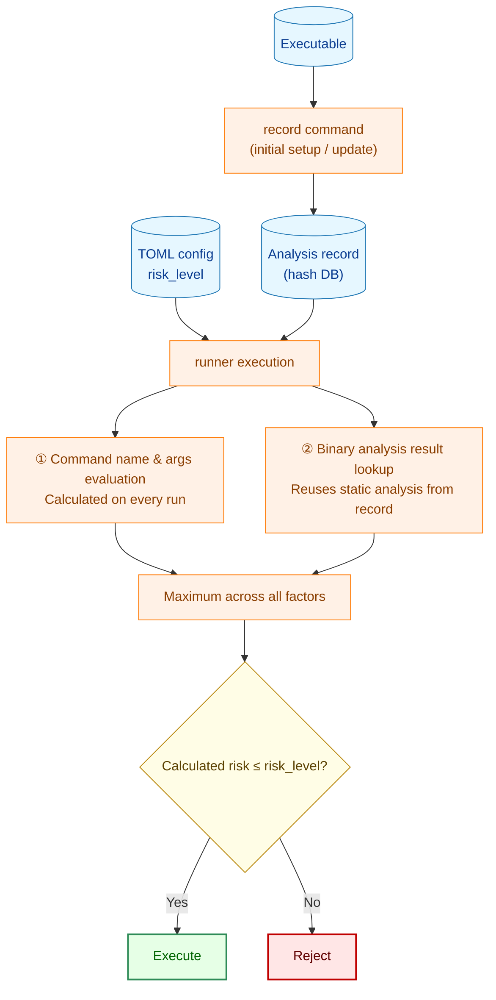
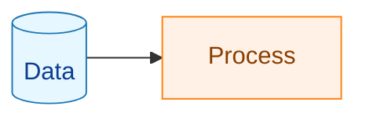

# Risk Assessment Guide

To correctly set `risk_level`, you need to understand how the runner calculates the risk of a command before execution. This document explains the risk calculation mechanism and how to verify the basis for your configuration.

## 1. How Risk Assessment Works

`risk_level` declares the **maximum** risk level permitted for a command. The runner automatically calculates the actual risk before execution and rejects the command if the calculated value exceeds `risk_level`.



**Legend**



Risk calculation has **two independent sources**. The final risk is the maximum value across all factors.

## 2. Risk Level Definitions

| Level | Meaning | Configurable |
|-------|---------|-------------|
| `low` | Read-only, no side effects | ✅ Yes (default) |
| `medium` | Network communication, file changes, system changes | ✅ Yes |
| `high` | Destructive operations, privilege changes, dynamic code execution | ✅ Yes |
| `critical` | Use of privilege-escalation commands (assigned automatically) | ❌ Not configurable — always blocked |

> `"critical"` cannot be written in TOML. It is assigned automatically when commands like `sudo`/`su`/`doas` are detected and always results in rejection.

## 3. Risk Calculation Rules

### 3.1 Command Name and Argument Evaluation (assessed on every run)

| Detected condition | Calculated risk |
|--------------------|----------------|
| Privilege-escalation commands: `sudo`/`su`/`doas`, etc. | `critical` |
| Destructive file operations: `rm -rf`, `dd`, etc. | `high` |
| Privilege change via `run_as_user`/`run_as_group` | `high` |
| System-modifying commands: `systemctl`/`apt`/`dpkg`, etc. | `medium` |
| None of the above | `low` |

### 3.2 Binary Analysis Evaluation (static analysis at record time, result reused)

The executable binary is statically analyzed to determine which system calls and APIs it may invoke.

| Detected capability | Calculated risk | Reason |
|--------------------|----------------|--------|
| Network APIs: `socket`/`connect`/`bind`/`accept`/`send`/`recv`, etc. | `medium` | May communicate over the network |
| DNS resolution APIs: `getaddrinfo`/`gethostbyname`, etc. | `medium` | May communicate over the network |
| Unix domain sockets | `medium` | May perform inter-process communication |
| Dynamic library loading: `dlopen`/`dlsym`/`dlvsym` | `high` | Can load and execute arbitrary code at runtime |
| Process creation: `execve`/`execveat` | `high` | Can launch arbitrary commands |
| Dynamic code execution: `mprotect`+`PROT_EXEC`/`pkey_mprotect` | `high` | Enables arbitrary code execution (e.g., JIT) |
| None of the above detected | `low` | |

**Analysis method**: The ELF binary's dynamic symbol table (`.dynsym`) and machine instructions are scanned statically. Shared libraries that the binary depends on are also analyzed recursively (OS ABI libraries such as libc are excluded).

### 3.3 Fail-Closed Behavior (analysis errors and inconsistencies)

When the reliability of analysis cannot be confirmed, everything defaults to `high` (fail-safe design):

| Condition | Calculated risk |
|-----------|----------------|
| Analysis record does not exist | `high` |
| Binary hash does not match the record | `high` |
| Analysis record schema version is outdated | `high` |
| Error during binary analysis | `high` |

## 4. How to Verify the Calculated Risk

Use `record --debug-info` to examine the analysis basis for your `risk_level` setting.

```bash
# Record with detailed analysis information
record --debug-info -d /path/to/hashes /usr/bin/mycommand

# Check the actual calculated risk via dry run
runner -config config.toml -dry-run
```

With `--debug-info`, the analysis record includes:

- Detected network API symbols and their origin (main binary or dependency library)
- Detected syscall numbers
- Analysis determination basis (`determination_stats`)

## 5. Guidelines for Setting risk_level

### Principles

- **Least privilege**: Set the minimum risk level required for the actual behavior.
- **Explicit configuration**: Do not rely on the default (`low`); document your intent.

### When binary analysis detects network usage

Check with `record --debug-info` and decide:

| Situation | Recommendation |
|-----------|---------------|
| Command that genuinely uses the network (wget, curl, etc.) | Set `"medium"` |
| Command that has network APIs but does not use them in practice | Set `"medium"` (conservative) |
| Clearly identified false positive | Report to the development team for investigation |

> **Note**: Do not set `"low"` as a workaround for a false positive. Doing so means real network access would go undetected.

### Configuration examples

```toml
# Read-only (low)
[[groups.commands]]
name = "show_status"
cmd = "/usr/bin/systemctl"
args = ["status", "myapp"]
risk_level = "low"        # systemctl status is read-only
                          # Note: analysis may detect network APIs → "medium" is safer

# Network communication (medium)
[[groups.commands]]
name = "fetch_config"
cmd = "/usr/bin/curl"
args = ["-o", "/etc/myapp/config.json", "https://config.example.com/config.json"]
risk_level = "medium"     # curl uses network APIs → medium

# Dynamic loading (high)
[[groups.commands]]
name = "run_plugin"
cmd = "/usr/local/bin/plugin-runner"
args = ["--plugin", "myplugin.so"]
risk_level = "high"       # dlopen for dynamic loading → high

# System modification (high)
[[groups.commands]]
name = "install_deps"
cmd = "/usr/bin/apt-get"
args = ["install", "-y", "libfoo"]
run_as_user = "root"
risk_level = "high"       # apt + root privileges → high
```

## 6. Frequently Asked Questions

### Q: What happens if I omit risk_level?

The default value `"low"` is used. If binary analysis detects network communication, the calculated risk is `"medium"`, which exceeds `"low"`, so execution is rejected. For commands that use network communication, explicitly set `"medium"`.

### Q: Can I set risk_level to "critical"?

No. `"critical"` cannot be set in TOML (it causes a startup error). The `critical` level is assigned automatically when privilege-escalation commands such as `sudo`/`su` are detected, and always results in rejection.

### Q: The runner says the analysis record is not found

You may not have recorded the hash with the `record` command. Record the hash of the executable:

```bash
record -d /path/to/hashes /usr/bin/mycommand
```

Re-recording is required after system package updates.
