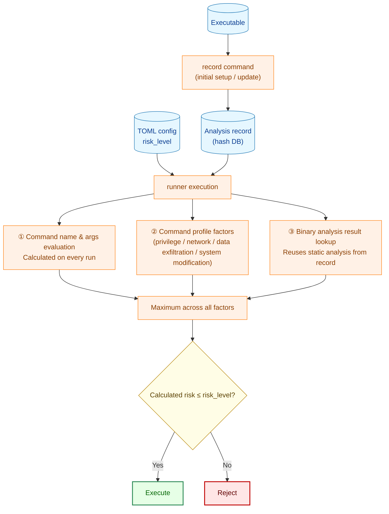
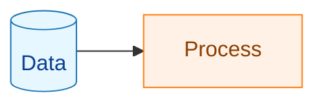

# Risk Assessment Guide

To correctly set `risk_level`, you need to understand how the runner calculates the risk of a command before execution. This document explains the risk calculation mechanism and how to verify the basis for your configuration.

## 1. How Risk Assessment Works

`risk_level` declares the **maximum** risk level permitted for a command. The runner automatically calculates the actual risk before execution and rejects the command if the calculated value exceeds `risk_level`.



**Legend**



Risk calculation draws on **several independent factors**: the command name and arguments, the command profile factors (privilege, network, data exfiltration, system modification), and the binary analysis result. The final effective risk is the **maximum value across all of these factors**, so any single high-risk factor — including a command profile factor — raises the result regardless of the others.

## 2. Risk Level Definitions

| Level | Meaning | Configurable |
|-------|---------|-------------|
| `low` | Read-only, no side effects | ✅ Yes (default) |
| `medium` | Network communication, file changes, system changes | ✅ Yes |
| `high` | Destructive operations, system/service changes, dynamic/arbitrary code execution | ✅ Yes |
| `critical` | Use of privilege-escalation commands (assigned automatically) | ❌ Not configurable — always blocked |

> `"critical"` cannot be written in TOML. It is assigned automatically when commands like `sudo`/`su`/`doas` are detected and always results in rejection.

## 3. Risk Calculation Rules

### 3.1 Command Name and Argument Evaluation (assessed on every run)

The runner matches commands by their resolved absolute path and basename (symbolic links are resolved), so both `rm` and `/usr/bin/rm` are recognized.

| Detected condition | Calculated risk |
|--------------------|----------------|
| Privilege-escalation commands: `sudo`/`su`/`doas`, etc. | `critical` |
| Disk, partition/filesystem destruction: `mkfs`/`mkfs.*`/`fdisk`/`parted`/`fsck`/`wipefs`/`blkdiscard`, LVM destruction (`lvremove`, etc.) | `high` |
| Kernel, account, boot, firewall, capability grant, trust-boundary replacement, and job/deferred-execution: `insmod`/`modprobe`/`useradd`/`passwd`/`grub-install`/`iptables`/`setcap`/`update-alternatives`/`ldconfig`/`crontab`/`at`/`systemd-run`, etc. | `high` |
| Shells, interpreters, and build/task runners: `bash`/`sh`/`python`/`node`/`ruby`/`perl`/`make`/`cmake`/`gradle`, etc. | `high` |
| Package managers: `apt`/`apt-get`/`yum`/`dnf`/`zypper`/`pacman`/`brew`/`pip`/`npm`/`yarn`/`dpkg`/`rpm` (regardless of subcommand/arguments) | `high` |
| `systemctl` (all subcommands, including read-only `status`/`show`/`is-active`, etc.) | `high` |
| `service` (all actions, because it runs an unverified init script) | `high` |
| Limited-scope system modification commands: network configuration `ip`/`ifconfig`/`route`, LVM creation/configuration (`lvcreate`, etc.) | `medium` |
| Network commands: `curl`/`wget`/`ssh`/`scp`, etc. | `medium` |
| None of the above | `low` |

Supplementary notes:

- **Shells, interpreters, and build/task runners**: `high` regardless of arguments, because they can execute arbitrary code (a script, an inline `-c`/`-e` snippet, or a build target).
- **Package managers and `systemctl`/`service`**: classified `high` solely by the resolved binary name, without parsing subcommands or arguments, because they can run unverified maintainer scripts or unit/init scripts (dpkg `postinst`, rpm `%post`, pip `setup.py`, npm `postinstall`, etc.) under privilege. Queries (`apt list`/`dpkg -l`/`systemctl status`, etc.) are `high` as well.
- **File-operation commands (`rm`/`dd`/`cp`/`mv`/`ln`/`chmod`/`chown`/`mount`/`umount`, etc.)**: the risk level is not fixed by name alone — it is determined by the path trust category of the target path (§3.5).

### 3.2 coreutils Single-Binary Classification

On distributions that ship coreutils as a single multi-call binary in a dedicated coreutils directory (for example the Rust coreutils binary at `/usr/lib/cargo/bin/coreutils` on Ubuntu 26.04+), each subcommand shares one executable and therefore one hash (in a multi-call binary, these subcommands are also called applets). For a command resolved to that directory, the risk is classified from the **subcommand** — including the `coreutils <subcommand> ...` multicall form — rather than from the shared binary's analysis signals.

| coreutils subcommand class | Calculated risk |
|----------------------------|----------------|
| Known-safe non-destructive subcommands (read-only, informational, and create-only subcommands that do not implicitly overwrite or delete, such as `mkdir`. Examples: `echo`, `cat`, `ls`, `mkdir`, ...) | `low` |
| Destructive subcommands (`rm`, `dd`, `shred`, `truncate`, ...), or any unknown/unidentifiable subcommand (fail-safe) | `high` |

Only subcommands on the curated safe list are `low`; everything else — including an unparseable multicall invocation that might hide a destructive subcommand — is `high`. There is no `medium` coreutils class. A binary carrying a setuid/setgid bit is also `high`. For such a verified coreutils binary, the binary-analysis dimension (§3.3) is suppressed for the safe subcommands so that, for example, `echo` stays `low` even though the shared multi-call binary links network or `exec` symbols. Hash verification is still required — suppression applies only to the binary-analysis signal, not to identity verification.

(This mechanism is specific to the unified coreutils directory. Other multi-call binaries such as BusyBox are not covered by it; they are evaluated by the general rules in §3.1 and §3.3.)

### 3.3 Binary Analysis Evaluation (static analysis at record time, result reused)

The executable binary is statically analyzed to determine which system calls and APIs it may invoke.

| Detected capability | Calculated risk | Reason |
|--------------------|----------------|--------|
| Socket APIs: `socket`/`connect`/`bind`/`accept`/`send`/`recv`, etc. | `medium` | May communicate over the network or IPC (any socket family) |
| DNS resolution APIs: `getaddrinfo`/`gethostbyname`, etc. | `medium` | May communicate over the network |
| Dynamic library loading: `dlopen`/`dlsym`/`dlvsym` | `high` | Can load and execute arbitrary code at runtime |
| Process creation: `execve`/`execveat` | `high` | Can launch arbitrary commands |
| Dynamic code execution: `mprotect`+`PROT_EXEC`/`pkey_mprotect` | `high` | Enables arbitrary code execution (e.g., JIT) |
| None of the above detected | `low` | |

**Analysis method**: On Linux, the ELF binary's dynamic symbol table (`.dynsym`) and machine instructions are scanned statically. On macOS, the equivalent Mach-O structures are analyzed. Shared libraries that the binary depends on are also analyzed recursively (OS ABI libraries such as libc are excluded).

### 3.4 Fail-Closed Behavior (unverifiable identity and inconsistencies)

The runner is fail-closed: a command whose binary identity cannot be confirmed is **denied** (it is not executed, regardless of `risk_level`), rather than being allowed to run at some risk level. Failures fall into two categories:

- **Deny (blocking)**: the command is rejected. This is reported in normal execution and previewed as a deny in dry-run.
- **Error**: a genuinely unexpected internal failure aborts the run with an error.

| Condition | Behavior |
|-----------|---------|
| Binary analysis / file verification disabled in this configuration | **Deny** (blocking; the binary's identity cannot be confirmed) |
| Binary hash not computed (identity unverified) | **Deny** (blocking) |
| Analysis record does not exist | **Deny** (blocking) |
| Binary hash does not match the record | **Deny** (blocking) |
| Analysis record schema version is outdated | **Deny** (blocking) |
| Analysis result is inconclusive | **Deny** (blocking) |
| Symbolic-link resolution fails (cannot resolve the real target) | **Deny** (blocking) |
| Unexpected record load error | **Error** (run aborts) |

> A blocking deny is independent of `risk_level`: even `risk_level = "high"` does not permit a command whose identity could not be verified. This is intentional — the runner does not execute a binary whose identity cannot be confirmed.

### 3.5 File-Operation Command Path Trust Category (assessed on every run)

For **file-operation commands** such as `cp`/`mv`/`rm`/`rmdir`/`unlink`/`shred`/`ln`/`install`/`tee`/`dd`/`chmod`/`chown`/`rsync`/`mount`, the risk level is not fixed by the command name alone — it is determined by the **path trust category** (trust zone) of the target path that the arguments point to (write destination, link target, deletion target, device). Paths are evaluated as resolved, normalized absolute paths (not prefix matching).

| Path trust category | Example | Calculated risk |
|---------------------|---------|----------------|
| trust-critical (system-critical paths: `/usr`, `/etc`, `/boot`, `/dev`, `/var`, etc. and their subdirectories) | `cp app /usr/local/bin/app`, `ln -sf x /etc/cron.d/job` | `high` |
| ordinary (normal paths that are neither trust-critical nor safe-zone, e.g. `/srv`, `/opt`) | `rm /srv/app/tmp` | `medium` |
| safe-zone (run-designated working/output directories and dedicated temp; meeting the trust requirements) | `cp report.csv $WORKDIR/out/` | `low` |
| Unresolvable (variable expansion not yet determined, symlink resolution failure, etc.; fail-closed) | — | The command-level calculated risk is unconditionally raised to `high` (per-operand internal detail: write=`high`/read=`medium`; the final risk is always `high`) |

In addition to the zone, there are floors that apply regardless of the target zone and do not decrease to `low` even in a safe-zone.

| Condition | Calculated risk |
|-----------|----------------|
| Privilege grant (setuid/setgid or world-write grant via `chmod`/`install`/`setfacl`/`chattr`, etc.) | `high` |
| Block-device I/O (`dd of=/dev/sdb`, etc.) | `high` |
| Tree-recursive operation reaching outside the safe-zone (`rm -r /etc`, `cp -a … /usr`, etc.) | `high` |
| Copying a sensitive file (`cp /etc/shadow …`, etc., where the source is a sensitive file) | `medium` (cannot be `low`) |

Downgrading to safe-zone (`low`) requires all of the following safety requirements to be met:

- The target is within an allowlisted trusted directory.
- The path components are not writable by the running user (cannot be substituted between evaluation and execution — TOCTOU-safe).

If these requirements cannot be met, or if an unrecognized flag makes the form uninterpretable, the risk is raised to `high` on the safe side (fail-closed). If the configured `risk_level` is below `"high"`, execution is rejected.

> Changes in classification relative to earlier versions (escalations and de-escalations) are summarized in the migration notes (§8).

## 4. How to Verify the Calculated Risk

Use `record --debug-info` to examine the analysis basis for your `risk_level` setting.

```bash
# Record with detailed analysis information
record --debug-info -d /path/to/hashes /usr/bin/mycommand

# Check the actual calculated risk via dry run
runner -config config.toml -dry-run
```

With `--debug-info`, the analysis record includes:

- Detected network API symbols and their origin (main binary or dependency library)
- Detected syscall numbers
- Analysis determination basis (`determination_stats`)

Dry-run also previews the allow/deny decision: it runs the same read-only evaluation as normal execution and reports, for each command, whether it would be allowed or denied (including blocking denies for unverifiable binaries).

## 5. Guidelines for Setting risk_level

### Principles

- **Least privilege**: Set the minimum risk level required for the actual behavior.
- **Explicit configuration**: Do not rely on the default (`low`); document your intent.

### When binary analysis detects network usage

When binary analysis calculates `medium`, you must set `risk_level` to `"medium"` or higher — the runner will reject the command with any lower setting. Use `record --debug-info` to inspect what was detected, then decide:

| Situation | Action |
|-----------|--------|
| Command that genuinely uses the network (wget, curl, etc.) | Set `"medium"` |
| Command that has network APIs but does not use them in practice | Set `"medium"` (required; a lower value causes rejection) |
| Believed to be a false positive | Report to the development team for investigation. Use `"medium"` until the investigation concludes |

### Configuration examples

```toml
# System query (high)
[[groups.commands]]
name = "show_status"
cmd = "/usr/bin/systemctl"
args = ["status", "myapp"]
risk_level = "high"       # systemctl is always high regardless of subcommand.
                          # Including the read-only status, anything below "high" is rejected

# Network communication (medium)
[[groups.commands]]
name = "fetch_config"
cmd = "/usr/bin/curl"
args = ["-o", "/etc/myapp/config.json", "https://config.example.com/config.json"]
risk_level = "medium"     # curl uses network APIs → medium

# Dynamic loading (high)
[[groups.commands]]
name = "run_plugin"
cmd = "/usr/local/bin/plugin-runner"
args = ["--plugin", "myplugin.so"]
risk_level = "high"       # dlopen for dynamic loading → high

# Package installation (high)
[[groups.commands]]
name = "install_deps"
cmd = "/usr/bin/apt-get"
args = ["install", "-y", "libfoo"]
run_as_user = "root"
risk_level = "high"       # package managers are always high regardless of subcommand
                          # (they can run unverified maintainer scripts under privilege)
```

## 6. Frequently Asked Questions

### Q: What happens if I omit risk_level?

The default value `"low"` is used. If binary analysis detects network communication, the calculated risk is `"medium"`, which exceeds `"low"`, so execution is rejected. For commands that use network communication, explicitly set `"medium"`.

### Q: Can I set risk_level to "critical"?

No. `"critical"` cannot be set in TOML (it causes a startup error). The `critical` level is assigned automatically when privilege-escalation commands such as `sudo`/`su` are detected, and always results in rejection.

### Q: Can I set risk_level to "unknown"?

No. `risk_level = "unknown"` is rejected as a configuration error at startup. Use one of `"low"`, `"medium"`, or `"high"` (or omit the key to default to `"low"`).

### Q: The runner says the analysis record is not found

You may not have recorded the hash with the `record` command. Record the hash of the executable:

```bash
record -d /path/to/hashes /usr/bin/mycommand
```

Re-recording is required after system package updates.

## 7. Threat Model and Limitations

Understanding what the risk assessment does and does not protect against is essential for configuring it correctly.

- **Blocklist approach**: Command-name and argument evaluation (§3.1) is a **blocklist**: it recognizes known dangerous commands and patterns and raises their risk. A command that is not on any list is treated as `low` by that dimension. The blocklist is therefore not exhaustive by itself.
- **Allowlist and hash pinning are the primary control**: The blocklist is a backstop, not the main defense. The runner's primary guarantee comes from the **allowlist of permitted commands plus hash pinning** (the recorded analysis record): only verified binaries whose hash matches the record are executed (§3.4). New or unknown attack vectors are contained by this requirement — an unverifiable binary is denied regardless of `risk_level`.
- **Basename matching has limits**: Detection matches by basename and resolved symbolic links. It uses **exact name matching, not partial (substring) matching** — `lsrm` is not treated as `rm`, and `systemctl-helper` is not treated as `systemctl`. Conversely, a renamed copy of a dangerous binary at a different basename is matched only after symbolic-link resolution and hash verification, not by name alone.
- **`output_file` is out of scope**: The risk assessment evaluates the command being executed. Output redirection targets configured via `output_file` are not part of this risk calculation; protect them through the surrounding configuration and filesystem permissions.
- **Hard links and path substitution**: Because hash pinning binds to file content, a hard link to a verified binary has the same content and hash. Path substitution (replacing the file at a path after verification) is closed by binding execution to the verified file (TOCTOU-safe execution), not to the path name.
- **Relationship to privilege/root controls**: The risk assessment is independent of, and complementary to, the runner's user/group switching and root-handling controls. Running a command as `root` does not by itself change the calculated risk level; privilege escalation is detected separately (the `sudo`/`su`/`doas` tokens → `critical`). When a command name has more than one applicable rule, the **highest** resulting risk wins (the effective risk is the maximum across all factors), so a more specific dangerous classification is never lowered by a more general one.

## 8. Migration Notes

If you are upgrading from an earlier version, several commands are now evaluated at a higher risk than before. Review your existing `risk_level` settings against the following changes and use `--dry-run` to confirm before deploying.

§8.5–§8.7 describe changes that are **escalations (more restrictive)** in the finalized classification; §8.8 describes changes that are **de-escalations (more permissive)**. Escalations are immediately visible as rejections at runtime, but de-escalations are permitted silently, so pay particular attention to the security-relaxation block in §8.8.

### 8.1 Commands Whose Risk Classification Changed

| Applies to | New calculated risk | Notes |
|------------|--------------------|-------|
| AI service commands (`claude`, `gemini`, etc.) | `high` (previously `medium`) | They always communicate with an external API and may exfiltrate data |
| `systemctl` (all subcommands, including read-only `status`/`show`) | `high` | Classified `high` solely by binary name without parsing subcommands (see §8.4) |
| `service` (all actions) | `high` | It runs an unverified init script |
| Destructive operations by absolute path (`/usr/bin/rm -rf ...`, etc.) | `high` | Now detected the same as by basename |
| Shells, interpreters, and build/task runners (`bash`/`python`/`node`/`make`, etc.) | `high` | Regardless of arguments (arbitrary code execution) |
| Package script runners (`npm run`/`npx`/`yarn <script>`/`pnpm run`) | `high` | |
| Package managers (`apt`/`apt-get`/`yum`/`dnf`/`zypper`/`pacman`/`brew`/`pip`/`npm`/`yarn`/`dpkg`/`rpm`) | `high` | Classified `high` solely by binary name without parsing subcommands/arguments (see §8.4) |

### 8.2 Configuration and Verification Behavior Changes

- **`risk_level = "unknown"`**: now rejected as a configuration error (previously accepted). Use `low`/`medium`/`high`.
- **Disabled binary analysis / file verification**: now a blocking deny (previously allowed to continue). A binary whose identity cannot be confirmed is not executed.

### 8.3 Handling of Inner Commands Run Through a Wrapper

The handling of an **inner command** that a wrapper (`env`/`timeout`/`nice`, etc.) executes internally is organized as follows.

- **Ordinary inner commands**: evaluated as a flat **High** regardless of the inner command's content. Even a harmless inner is not executed unless you explicitly set `risk_level = "high"`.
- **Privilege-escalation tokens** (`sudo`/`su`/`doas`): when they appear as the inner command (including inside a nested wrapper), the command is **Critical** and always denied.
- **Forms that remain Blocking** (not relaxed to High): loader-control environment variables `LD_*`/`DYLD_*`, working-directory change `env -C`, an uninterpretable `env -S`, `find`/`xargs` child-process execution, direct dynamic-loader invocation, helper execution such as `rsync -e`/`tar --to-command`, a wrapper whose inner command cannot be extracted, exceeding the nesting-depth limit, and symlink-resolution failure.
- **Verification and recording**: the inner command is not automatically hash-verified or identity-bound (it is logged in the audit chain, but that does not pin its identity). To pin the inner command's identity, `record` its path and register it explicitly in `verify_files`.
- **Residual risk (TOCTOU)**: an inner command of a wrapper you opt into with `risk_level = "high"` is not fd-bound or identity-bound by the runner at execution time. Registering it in `verify_files` only adds a startup-time hash check (verification as an additional file); it does not pin the actual object the wrapper resolves and execs at run time. Because a wrapper binary (`env`, etc.) resolves the path itself and execs it, the verified file and the object actually executed may differ (e.g. `env mytool`), so there is no protection against a swap between check and exec (TOCTOU). This is the same residual limitation as `find`/`xargs` child-process execution.

### 8.4 Coarsening of Package Managers and systemctl (Breaking Change)

The risk classification of package managers and `systemctl` has been simplified to a **fixed level that depends only on the binary name (both `high`)**, removing subcommand/flag parsing. The baseline for comparison is the **most recent release's behavior**.

**Invocations raised to `high` (the net difference)**:

- **(a) Display/query package-manager invocations** (`apt list`/`dpkg -l`/`rpm -qa`/`pacman -Q`/`pip list`, etc.; previously `low`) → **`high`**.
- **(b) Package-modifying operations** (`apt install`/`apt-get update`/`yum install`, etc.; `medium` in the most recent release) → **`high`**.
- **(c) `dpkg`/`rpm`** (previously in no list and thus undetected by this dimension, i.e. effectively `low`) → **`high`**.
- **(d) `systemctl` read-only subcommands** (`status`/`show`/`is-active`, etc.; previously `medium`) → **`high`**.

As a result, package-manager install/update configurations previously permitted at `risk_level = "medium"` (or the default `low`), and query configurations that set `systemctl status` to `medium`/`low`, **may now be blocked because the calculated risk (`high`) exceeds the configured `risk_level`**. Set `risk_level = "high"` explicitly on those commands. Safe operation assumes an allowlist + hash pinning + an explicit `risk_level` setting (this risk classification is a secondary gate, not the first line of defense).

**Detection limits**: even after coarsening, this dimension cannot detect the following, which can pass through as `low`. Safe operation assumes the allowlist + hash pinning described above.

- Unlisted managers: `apk`/`snap`/`flatpak`/`gem`, etc.
- Renamed binaries (a basename that does not match the name set).
- Multi-call forms (`busybox <pm>`, etc., where the package-manager name appears as an argument of `busybox`).

**Retraction of the previous approach (background)**: this change **replaces (retracts)** the package-manager flag-style and verb-style detection introduced by the unreleased 0137 (which classified only install/remove-style subcommands as modifying operations and excluded queries such as `apt list`/`pacman -Q`), as well as the `systemctl` subcommand-granularity classification (read-only as `medium`, change verbs as `high`). Those granularities were judged excessive for this tool's threat model, were not relied upon by real configurations, and were not worth the maintenance cost.

### 8.5 Axis 1: Escalation by Command Name (Breaking Change)

The finalized classification extends the command-name classification (axis 1) where the risk level is determined by the command name alone. The following command groups are **High** by name alone regardless of arguments. The baseline for comparison is the most recent release's behavior. Configurations that were previously permitted at `medium` or the default `low` may be blocked because the calculated risk (`high`) exceeds the configured `risk_level`. Set `risk_level = "high"` explicitly on those commands.

| Command group | Representative examples | Notes |
|---------------|------------------------|-------|
| Disk and partition destruction | `fdisk`/`parted`/`mkfs`/`fsck`/`wipefs`/`blkdiscard`/`sgdisk`/`sfdisk`/`mkswap`, LVM destruction (`lvremove`/`vgremove`/`pvremove`, etc.) | Large-scale, irreversible destruction. `fdisk`/`mkfs`/`parted`/`fsck` were previously treated as medium risk; now raised to High |
| Kernel modules and parameters | `insmod`/`modprobe`/`rmmod`/`kexec`/`sysctl` | Modifies kernel state; loads arbitrary code under high privilege |
| Account and authentication DB | `useradd`/`usermod`/`userdel`/`passwd`/`chpasswd`/`visudo`, etc. | Persistent account and authentication changes |
| Boot configuration and kernel image | `grub-install`/`grub-mkconfig`/`efibootmgr`/`kernel-install`/`update-initramfs`, etc. | Modifies boot configuration |
| Service enablement, power, and runlevel | `chkconfig`/`update-rc.d`/`shutdown`/`reboot`/`halt`/`poweroff`, etc. | `chkconfig`/`update-rc.d` were previously `medium` |
| Firewall | `iptables`/`ip6tables`/`nft`/`ufw`/`firewall-cmd`, etc. | Modifies network policy |
| Capability grant | `setcap` | Grants privilege and capabilities |
| Trust-boundary replacement | `update-alternatives`/`alternatives`/`dpkg-divert`/`ldconfig` | Replaces trusted binaries/configuration (can neutralize allowlist + hash pinning) |
| Job, deferred, and transient execution | `crontab`/`at`/`batch`/`systemd-run` | Arbitrary code execution via deferred execution. Previously `medium` |

### 8.6 Axis 2: Escalation by Destination Path Trust Category (Breaking Change)

The finalized classification adds path trust category classification (axis 2) for file-operation commands (`cp`/`mv`/`rm`/`ln`/`install`/`tee`/`dd`/`chmod`/`chown`/`rsync`/`mount`, etc.), where the risk level is determined by the **path trust category** of the target path (see §3.5 for details). The following forms were previously not detected and passed through as `low`, but are raised in the finalized classification.

- Write, link, or permission-change target is **trust-critical** (`/usr`, `/etc`, `/boot`, `/dev`, `/var`, etc. and their subdirectories) → **High**. Examples: `cp build/app /usr/local/bin/app`, `ln -sf x /etc/cron.d/job`, `chown root:root /usr/bin/tool`.
- Block-device I/O (`dd of=/dev/sdb`, etc.) → **High**.
- Recursive deletion or recursive copy reaching outside the safe-zone (`rm -r /var/log/old`, etc.) → **High**.
- Privilege grant (setuid/setgid or world-write grant via `chmod 4755`, `install -m 4755`, etc.) → **High**. (Ownership changes to trust-critical targets via `chown`, etc. are High as "target is trust-critical" above.)

### 8.7 Fail-Closed for Invalid Flags (Breaking Change)

Flag parsing has been aligned with the actual flag set of each CLI, removing acceptance of flags that do not exist in the real CLI (over-recognition). Commands given a flag that does not exist in the real CLI are treated as forms that "cannot be fully interpreted" (recognized=false), and the calculated risk is **raised to High** (fail-closed). Whether execution is ultimately permitted depends on a comparison with the configured `risk_level` (configurations with `risk_level` below `"high"` will be rejected). This is a precision correction rather than a classification escalation, but configurations that previously passed these forms through as recognized may now be rejected as High.

- Examples: `sponge -r` / `mkdir -a` / `touch -p` / `unlink -r` / `rmdir -r` / `mv -s` (none of these flags exist in the real CLI).
- The safety guarantee is provided by the fail-closed `recognized` contract: uninterpretable forms are never passed through as `low` — they are always raised to high (the final decision on whether to permit execution is then compared against `risk_level`).

### 8.8 ⚠️ Security Relaxation (De-escalation): Destructive Commands in safe-zone/ordinary

> ⚠️ **This is a security relaxation change.** Some commands that were previously always blocked may be permitted under the finalized classification. De-escalations are permitted silently at runtime (fail-silent), so they are documented separately from escalations. The baseline for comparison is the most recent release's behavior.

By making axis 2 the sole classification authority for file-operation command risk, the destructive commands `rm`/`rmdir`/`shred`/`unlink`/`dd` — previously unconditionally `high` — now have their risk determined by the path trust category of the target path.

| Relaxation condition (target path trust category) | New calculated risk | Example |
|--------------------------------------------------|---------------------|---------|
| safe-zone (run-designated working/output directory; meets trust requirements and recursion stays within) | `low` (previously `high`) | `rm -rf $WORKDIR/build` |
| ordinary (`/srv`, `/opt`, etc.; neither trust-critical nor safe-zone) | `medium` (previously `high`) | `rm /srv/app/tmp` |
| trust-critical, or recursion outside safe-zone, or device I/O | `high` (unchanged) | `rm -r /etc`, `dd of=/dev/sdb` |

> **Operational note (audit trail loss)**: Commands that are allowed and become low due to de-escalation emit the `command_risk_profile` audit entry at Debug level (`riskLogLevel`). With typical production log-level settings (Info or above), this entry — including `operand_zones` (which path, which zone, and why it was permitted) — is lost entirely, making it impossible to retroactively justify the allow of a relaxed command. To retain audit trails for relaxed commands, set the log level to Debug or below.

### 8.9 Relationship with 0139 (Overwrite)

The finalized classification (axis 1 and axis 2) takes precedence over the system-modification risk description introduced by 0139 in any sections that conflict (the 0139 document body is not modified). The authoritative current source for risk classification is this migration note and the descriptions in §3.
