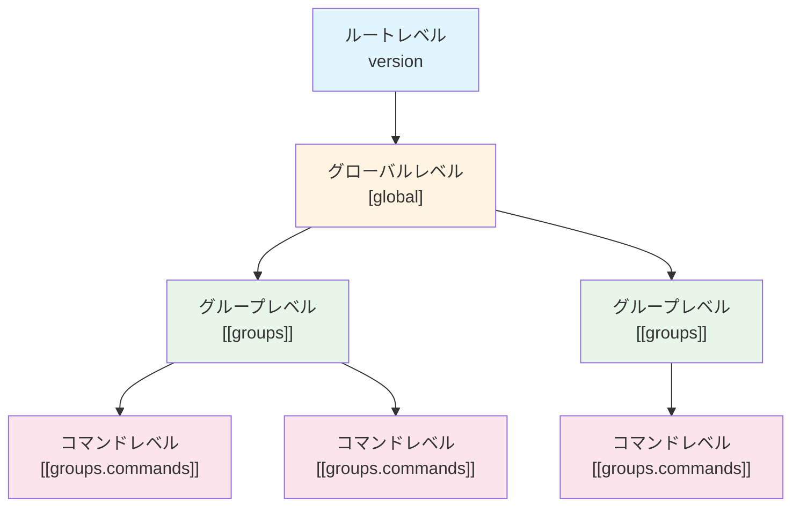

# 第2章: 設定ファイルの階層構造

## 2.1 階層の概要図

TOML 設定ファイルは以下の4つの階層で構成されます:



## 2.2 三層構造の説明

### 2.2.1 ルートレベル (version)

設定ファイルの最上位に位置し、設定ファイルのバージョン情報を保持します。

```toml
version = "1.0"
```

**役割**: 設定ファイルの互換性管理

### 2.2.2 グローバルレベル ([global])

全てのグループとコマンドに共通する設定を定義します。

```toml
[global]
timeout = 60
workdir = "/tmp/workspace"
env_allowed = ["PATH", "HOME"]
```

**役割**: デフォルト値の提供、共通設定の一元管理

### 2.2.3 グループレベル ([[groups]])

関連するコマンドをまとめる単位です。複数のグループを定義できます。

```toml
[[groups]]
name = "backup_tasks"
description = "バックアップ関連のタスク"
workdir = "/var/backups"
```

**役割**: コマンドの論理的なグループ化、グループ固有の設定

### 2.2.4 コマンドレベル ([[groups.commands]])

実際に実行するコマンドを定義します。各グループ内に複数のコマンドを定義できます。

```toml
[[groups.commands]]
name = "backup_database"
description = "データベースをバックアップ"
cmd = "/usr/bin/mysqldump"
args = ["--all-databases"]
timeout = 300
```

**役割**: 実行するコマンドの詳細な指定

## 2.3 設定の継承とオーバーライドの仕組み

go-safe-cmd-runner では、下位レベルの設定が上位レベルの設定を継承・オーバーライドします。

### 2.3.1 継承の基本ルール


1. **グローバル → グループ**: グループで明示的に設定されていない項目は、グローバル設定を使用
2. **グループ → コマンド**: コマンドで明示的に設定されていない項目は、グループまたはグローバル設定を使用

### 2.3.2 オーバーライドの例

#### 例1: タイムアウトのオーバーライド

```toml
[global]
timeout = 60  # デフォルト: 60秒

[[groups]]
name = "quick_tasks"
# timeout は未指定 → グローバルの 60秒 を継承

[[groups.commands]]
name = "fast_command"
cmd = "echo"
args = ["test"]
# timeout は未指定 → グローバルの 60秒 を継承

[[groups.commands]]
name = "slow_command"
cmd = "sleep"
args = ["90"]
timeout = 120  # グローバルの 60秒 をオーバーライドして 120秒 に設定
```

#### 例2: 作業ディレクトリのオーバーライド

```toml
[global]
workdir = "/tmp"  # デフォルト作業ディレクトリ

[[groups]]
name = "log_processing"
workdir = "/var/log"  # グローバルをオーバーライド

[[groups.commands]]
name = "analyze_logs"
cmd = "grep"
args = ["ERROR", "app.log"]
# workdir は未指定 → グループの /var/log を使用
```

### 2.3.3 環境変数の継承モード

環境変数の許可リスト (`env_allowed`) には、3つの継承モードがあります:

#### モード1: 継承モード (inherit)

グループレベルで `env_allowed` を指定しない場合、グローバル設定を継承します。

```toml
[global]
env_allowed = ["PATH", "HOME", "USER"]

[[groups]]
name = "inherit_group"
# env_allowed 未指定 → グローバルの ["PATH", "HOME", "USER"] を継承
```

#### モード2: 明示モード (explicit)

グループレベルで `env_allowed` を指定した場合、グローバル設定を無視し、指定された値のみを使用します。

```toml
[global]
env_allowed = ["PATH", "HOME", "USER"]

[[groups]]
name = "explicit_group"
env_allowed = ["PATH", "CUSTOM_VAR"]  # グローバルを無視してこの設定を使用
```

#### モード3: 拒否モード (reject)

グループレベルで `env_allowed = []` と明示的に空配列を指定した場合、全ての環境変数を拒否します。

```toml
[global]
env_allowed = ["PATH", "HOME", "USER"]

[[groups]]
name = "reject_group"
env_allowed = []  # 全ての環境変数を拒否
```

### 2.3.4 変数の継承パターン

#### vars (内部変数) - マージ継承

`vars` は **Union (マージ)** によって継承されます。下位レベルの設定は上位レベルの設定とマージされ、同じキーがある場合は下位レベルが優先されます。

```toml
[global]
vars = ["base_dir=/opt/app", "log_level=info"]

[[groups]]
name = "admin_tasks"
vars = ["log_level=debug", "task_type=admin"]  # log_level を上書き、task_type を追加

[[groups.commands]]
name = "task1"
vars = ["task_id=42"]  # 既存の変数を継承しつつ task_id を追加
cmd = "/bin/task"
args = ["%{base_dir}", "%{log_level}", "%{task_type}", "%{task_id}"]
# 最終的な vars: base_dir=/opt/app, log_level=debug, task_type=admin, task_id=42
```

#### from_env (システム環境変数のインポート) - Merge 継承

`from_env` は **Merge (マージ)** によって継承されます。下位レベルで指定した場合、上位レベルの設定とマージされます。

```toml
[global]
env_import = ["HOME", "USER"]

[[groups]]
name = "tasks"
from_env_vars = ["LANG", "LC_ALL"]  # グローバルの from_env とマージ

[[groups.commands]]
name = "task1"
cmd = "/bin/echo"
# from_env を指定しないため、グループの from_env が適用される
# 継承された変数: HOME, USER (global) + LANG, LC_ALL (group)
args = ["User: %{USER}, Lang: %{LANG}"]

[[groups.commands]]
name = "task2"
from_env_vars = ["PWD"]  # グループの from_env とマージ
cmd = "/bin/echo"
# 継承された変数: HOME, USER (global) + LANG, LC_ALL (group) + PWD (command)
args = ["Home: %{HOME}, PWD: %{PWD}"]
```

### 2.3.5 設定の優先順位まとめ

設定項目によって、優先順位が異なります:

| 設定項目 | 優先順位 (高 → 低) | 継承パターン | 備考 |
|---------|------------------|-------------|------|
| timeout | コマンド > グローバル | Override | グループレベルでは設定不可 |
| workdir | グループ > グローバル | Override | コマンドレベルでは設定不可 |
| env_allowed | グループ > グローバル | Override | 継承モードに応じて動作が変化 |
| vars | コマンド > グループ > グローバル | Merge (Union) | 下位レベルが上位レベルとマージ、同名キーは上書き |
| from_env | コマンド > グループ > グローバル | Merge | 下位レベルが上位レベルとマージ |
| env | コマンド > グループ > グローバル | Merge | プロセス環境変数の設定 ※セキュリティ: 必要最小限のレベルで定義を推奨 |
| verify_files | グループ + グローバル | Merge | マージされる(両方が適用) |

### 2.3.6 実践例: 複雑な継承パターン

```toml
[global]
timeout = 60
workdir = "/tmp"
env_allowed = ["PATH", "HOME", "USER"]
verify_files = ["/bin/sh"]

[[groups]]
name = "database_group"
workdir = "/var/db"              # グローバルの /tmp をオーバーライド
env_allowed = ["PATH", "PGDATA"]  # グローバルを無視して独自の設定
verify_files = ["/usr/bin/psql"]   # グローバルの /bin/sh に追加

[[groups.commands]]
name = "db_backup"
cmd = "/usr/bin/pg_dump"
args = ["-U", "postgres"]
timeout = 300  # グローバルの 60 をオーバーライド
# workdir は未指定 → グループの /var/db を使用
# env_allowed は未指定 → グループの ["PATH", "PGDATA"] を使用
# verify_files: グローバルの ["/bin/sh"] とグループの ["/usr/bin/psql"] がマージされる
```

この例では:
- `workdir`: グループレベルで `/var/db` にオーバーライド
- `timeout`: コマンドレベルで `300` にオーバーライド
- `env_allowed`: グループレベルで独自の設定を使用
- `verify_files`: グローバルとグループの設定がマージされる

### 2.3.7 セキュリティベストプラクティス: 環境変数の定義レベル

`env` (プロセス環境変数)は、グローバル・グループ・コマンドの全階層で定義可能ですが、セキュリティ観点から適切なレベルで定義することが重要です。

#### 推奨される定義レベル

| レベル | 推奨度 | 適用範囲 | 使用例 |
|--------|--------|---------|--------|
| **コマンドレベル** | **推奨** | 特定のコマンドのみ | 機密情報、コマンド固有の設定 |
| **グループレベル** | 許容 | グループ内の全コマンド | グループ共通の設定 |
| **グローバルレベル** | 注意 | 全コマンド | 安全な共通設定のみ |

#### ベストプラクティス

##### 1. 最小権限の原則

各コマンドに必要な環境変数のみを定義します:

```toml
# 推奨: コマンドレベルで必要な環境変数のみを定義
[[groups.commands]]
name = "db_backup"
cmd = "/usr/bin/pg_dump"
env_vars = [
    "PGPASSWORD=secret",      # このコマンドのみで必要
    "PGHOST=localhost"
]

# 非推奨: グローバルで全コマンドに機密情報を公開
[global]
env_vars = ["PGPASSWORD=secret"]   # 全コマンドに渡される(危険)
```

##### 2. vars と env の使い分け

内部変数 `vars` を活用し、必要な場合のみ `env` で子プロセスに公開します:

```toml
[global]
vars = [
    "db_password=secret123",     # 内部変数として保持(子プロセスには渡らない)
    "app_dir=/opt/myapp"
]

[[groups.commands]]
name = "db_backup"
env_vars = ["PGPASSWORD=%{db_password}"]  # 必要なコマンドのみで env として公開

[[groups.commands]]
name = "log_check"
cmd = "/bin/grep"
args = ["ERROR", "%{app_dir}/logs/app.log"]
# env は定義しない → db_password は子プロセスに渡らない
```

##### 3. グローバルレベルの env は安全な値のみ

グローバルレベルでは、全コマンドに渡しても安全な環境変数のみを定義します:

```toml
[global]
env_vars = [
    "LANG=C",              # 安全: ロケール設定
    "TZ=UTC",              # 安全: タイムゾーン設定
    "LC_ALL=C"             # 安全: 言語設定
]
# 機密情報はグローバルで定義しない
```

##### 4. グループレベルは共通設定に使用

グループ内の全コマンドで共通する設定をグループレベルで定義します:

```toml
[[groups]]
name = "database_group"
env_vars = [
    "PGHOST=localhost",
    "PGPORT=5432",
    "PGDATABASE=production"
]

[[groups.commands]]
name = "backup"
env_vars = ["PGPASSWORD=backup_secret"]   # コマンド固有の機密情報

[[groups.commands]]
name = "analyze"
env_vars = ["PGPASSWORD=readonly_secret"] # 別のコマンドには別の認証情報
```

#### セキュリティチェックリスト

設定ファイルを作成する際は、以下を確認してください:

- [ ] 機密情報(パスワード、トークン等)をグローバルレベルで定義していないか
- [ ] 各コマンドに必要な環境変数のみを定義しているか
- [ ] 内部変数 `vars` で管理できる値を不必要に `env` で公開していないか
- [ ] `env_allowed` で必要最小限のシステム環境変数のみを許可しているか

## 次のステップ

次章からは、各レベルの具体的なパラメータについて詳しく解説します。まずルートレベルの `version` パラメータから始めます。
