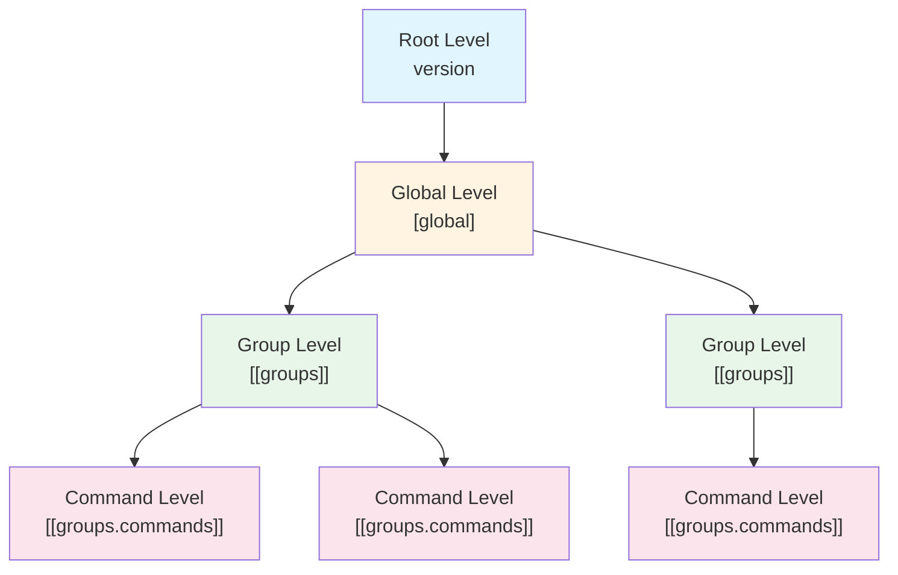

# Chapter 2: Configuration File Hierarchical Structure

## 2.1 Hierarchy Overview Diagram

TOML configuration files consist of the following four hierarchical levels:



## 2.2 Three-Layer Structure Explanation

### 2.2.1 Root Level (version)

Located at the top level of the configuration file, it holds version information for the configuration file.

```toml
version = "1.0"
```

**Role**: Configuration file compatibility management

### 2.2.2 Global Level ([global])

Defines configuration common to all groups and commands.

```toml
[global]
timeout = 60
workdir = "/tmp/workspace"
env_allowed = ["PATH", "HOME"]
```

**Role**: Providing default values, centralized management of common configuration

### 2.2.3 Group Level ([[groups]])

A unit for grouping related commands. Multiple groups can be defined.

```toml
[[groups]]
name = "backup_tasks"
description = "Backup-related tasks"
workdir = "/var/backups"
```

**Role**: Logical grouping of commands, group-specific configuration

### 2.2.4 Command Level ([[groups.commands]])

Defines commands to actually execute. Multiple commands can be defined within each group.

```toml
[[groups.commands]]
name = "backup_database"
description = "Backup database"
cmd = "/usr/bin/mysqldump"
args = ["--all-databases"]
timeout = 300
```

**Role**: Detailed specification of commands to execute

## 2.3 Configuration Inheritance and Override Mechanism

In go-safe-cmd-runner, lower-level configuration inherits and overrides higher-level configuration.

### 2.3.1 Basic Inheritance Rules


1. **Global → Group**: Items not explicitly configured in the group use global configuration
2. **Group → Command**: Items not explicitly configured in the command use group or global configuration

### 2.3.2 Override Examples

#### Example 1: Timeout Override

```toml
[global]
timeout = 60  # Default: 60 seconds

[[groups]]
name = "quick_tasks"
# timeout not specified → inherits global 60 seconds

[[groups.commands]]
name = "fast_command"
cmd = "echo"
args = ["test"]
# timeout not specified → inherits global 60 seconds

[[groups.commands]]
name = "slow_command"
cmd = "sleep"
args = ["90"]
timeout = 120  # Overrides global 60 seconds to 120 seconds
```

#### Example 2: Working Directory Override

```toml
[global]
workdir = "/tmp"  # Default working directory

[[groups]]
name = "log_processing"
workdir = "/var/log"  # Overrides global

[[groups.commands]]
name = "analyze_logs"
cmd = "grep"
args = ["ERROR", "app.log"]
# workdir not specified → uses group's /var/log
```

### 2.3.3 Environment Variable Inheritance Modes

The environment variable allowlist (`env_allowed`) has three inheritance modes:

#### Mode 1: Inherit Mode (inherit)

If `env_allowed` is not specified at the group level, it inherits the global configuration.

```toml
[global]
env_allowed = ["PATH", "HOME", "USER"]

[[groups]]
name = "inherit_group"
# env_allowed not specified → inherits global ["PATH", "HOME", "USER"]
```

#### Mode 2: Explicit Mode (explicit)

If `env_allowed` is specified at the group level, it ignores the global configuration and uses only the specified values.

```toml
[global]
env_allowed = ["PATH", "HOME", "USER"]

[[groups]]
name = "explicit_group"
env_allowed = ["PATH", "CUSTOM_VAR"]  # Ignores global and uses this configuration
```

#### Mode 3: Reject Mode (reject)

If `env_allowed = []` is explicitly specified as an empty array at the group level, it rejects all environment variables.

```toml
[global]
env_allowed = ["PATH", "HOME", "USER"]

[[groups]]
name = "reject_group"
env_allowed = []  # Rejects all environment variables
```

### 2.3.4 Variable Inheritance Patterns

#### vars (Internal Variables) - Merge Inheritance

`vars` are inherited through **Union (Merge)**. Settings at lower levels are merged with settings at upper levels, and when the same key exists, the lower level takes precedence.

```toml
[global]
vars = ["base_dir=/opt/app", "log_level=info"]

[[groups]]
name = "admin_tasks"
vars = ["log_level=debug", "task_type=admin"]  # Override log_level, add task_type

[[groups.commands]]
name = "task1"
vars = ["task_id=42"]  # Inherit existing variables and add task_id
cmd = "/bin/task"
args = ["%{base_dir}", "%{log_level}", "%{task_type}", "%{task_id}"]
# Final vars: base_dir=/opt/app, log_level=debug, task_type=admin, task_id=42
```

#### env_import (System Environment Variable Import) - Merge Inheritance

`env_import` is inherited through **Merge**. Use the explicit mapping format `internal_name=SYSTEM_VAR`; abbreviated entries such as `env_import = ["CC"]` are not supported. When specified at a lower level, it is merged with the upper level configuration.

```toml
[global]
env_import = ["Home=HOME", "User=USER"]

[[groups]]
name = "tasks"
env_import = ["lang=LANG", "locale=LC_ALL"]  # Merges with global env_import

[[groups.commands]]
name = "task1"
cmd = "/bin/echo"
# env_import not specified → group's env_import is applied
# Inherited variables: Home, User (global) + lang, locale (group)
args = ["User: %{User}, Lang: %{lang}"]

[[groups.commands]]
name = "task2"
env_import = ["pwd=PWD"]  # Merges with group's env_import
cmd = "/bin/echo"
# Inherited variables: Home, User (global) + lang, locale (group) + pwd (command)
args = ["Home: %{Home}, PWD: %{pwd}"]
```

### 2.3.5 Configuration Priority Summary

Depending on the configuration item, the priority differs:

| Configuration Item | Priority (High → Low) | Inheritance Pattern | Notes |
|---------|------------------|-------------|------|
| timeout | Command > Global | Override | Cannot be configured at group level |
| workdir | Group > Global | Override | Cannot be configured at command level |
| env_allowed | Group > Global | Override | Behavior changes according to inheritance mode |
| vars | Command > Group > Global | Merge (Union) | Lower levels merge with upper levels, same keys override |
| env_import | Command > Group > Global | Merge | Lower levels merge with upper levels |
| env_vars | Command > Group > Global | Merge | Process environment variable configuration ※Security: Define at minimal necessary level |
| verify_files | Group + Global | Merge | Merged (both applied) |
| log_level | Global only | N/A | Cannot be overridden at lower levels |

### 2.3.6 Practical Example: Complex Inheritance Pattern

```toml
[global]
timeout = 60
workdir = "/tmp"
env_allowed = ["PATH", "HOME", "USER"]
verify_files = ["/bin/sh"]

[[groups]]
name = "database_group"
workdir = "/var/db"              # Overrides global /tmp
env_allowed = ["PATH", "PGDATA"]  # Ignores global and uses own configuration
verify_files = ["/usr/bin/psql"]   # Added to global /bin/sh

[[groups.commands]]
name = "db_backup"
cmd = "/usr/bin/pg_dump"
args = ["-U", "postgres"]
timeout = 300  # Overrides global 60
# workdir not specified → uses group's /var/db
# env_allowed not specified → uses group's ["PATH", "PGDATA"]
# verify_files: global ["/bin/sh"] and group ["/usr/bin/psql"] are merged
```

In this example:
- `workdir`: Overridden to `/var/db` at group level
- `timeout`: Overridden to `300` at command level
- `env_allowed`: Uses own configuration at group level
- `verify_files`: Global and group configurations are merged

### 2.3.7 Security Best Practices: Environment Variable Definition Levels

While `env_vars` (process environment variables) can be defined at all hierarchy levels (Global, Group, and Command), it's important to define them at the appropriate level from a security perspective.

#### Recommended Definition Levels

| Level | Recommendation | Scope | Use Cases |
|--------|--------|---------|--------|
| **Command Level** | **Recommended** | Specific command only | Sensitive information, command-specific settings |
| **Group Level** | Acceptable | All commands in group | Group-wide common settings |
| **Global Level** | Caution | All commands | Safe common settings only |

#### Best Practices

##### 1. Principle of Least Privilege

Define only the environment variables needed for each command:

```toml
# Recommended: Define only necessary environment variables at command level
[[groups.commands]]
name = "db_backup"
cmd = "/usr/bin/pg_dump"
env_vars = [
    "PGPASSWORD=secret",      # Only needed for this command
    "PGHOST=localhost"
]

# Not recommended: Exposing sensitive information globally to all commands
[global]
env_vars = ["PGPASSWORD=secret"]   # Passed to all commands (dangerous)
```

##### 2. Proper Use of vars vs env_vars

Leverage internal variables `vars` and expose to child processes via `env_vars` only when necessary:

```toml
[global]
vars = [
    "db_password=secret123",     # Kept as internal variable (not passed to child processes)
    "app_dir=/opt/myapp"
]

[[groups.commands]]
name = "db_backup"
env_vars = ["PGPASSWORD=%{db_password}"]  # Expose as env_vars only for commands that need it

[[groups.commands]]
name = "log_check"
cmd = "/bin/grep"
args = ["ERROR", "%{app_dir}/logs/app.log"]
# No env_vars defined → db_password is not passed to child process
```

##### 3. Global-level env_vars Should Contain Only Safe Values

At the global level, define only environment variables that are safe to pass to all commands:

```toml
[global]
env_vars = [
    "LANG=C",              # Safe: Locale setting
    "TZ=UTC",              # Safe: Timezone setting
    "LC_ALL=C"             # Safe: Language setting
]
# Do not define sensitive information at global level
```

##### 4. Use Group Level for Common Settings

Define settings common to all commands within a group at the group level:

```toml
[[groups]]
name = "database_group"
env_vars = [
    "PGHOST=localhost",
    "PGPORT=5432",
    "PGDATABASE=production"
]

[[groups.commands]]
name = "backup"
env_vars = ["PGPASSWORD=backup_secret"]   # Command-specific sensitive information

[[groups.commands]]
name = "analyze"
env_vars = ["PGPASSWORD=readonly_secret"] # Different credentials for different commands
```

#### Security Checklist

When creating configuration files, verify the following:

- [ ] No sensitive information (passwords, tokens, etc.) defined at global level
- [ ] Only necessary environment variables defined for each command
- [ ] Values that can be managed with internal `vars` are not unnecessarily exposed via `env_vars`
- [ ] `env_allowed` permits only the minimal necessary system environment variables

## Next Steps

Starting with the next chapter, we will explain the specific parameters of each level in detail. We will begin with the `version` parameter at the root level.
